# 六、利用 Git 和持续集成服务器

**持续集成****CI**和**持续交付****CD**正在成为现代软件利用的两大组成部分。本章是一个探索如何保护 CI 服务器的绝佳机会。我们将从软件利用方法和 CI 的复习开始。除了学习如何从头开始构建 CI 环境外，我们还将了解保护 CI 和 CD 管道需要什么。

# 软件利用方法

与任何项目一样，软件项目需要经过定义良好的步骤才能得到良好的管理。为了确保有效的项目管理，软件利用项目需要几个步骤：

1.  **要求**
2.  **设计**
3.  **实施**
4.  **验证**
5.  **维护** 

步骤如下所示：

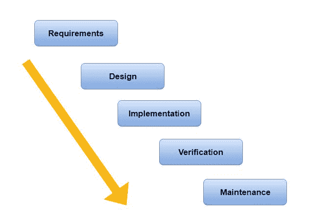

根据业务需求，前面的步骤通过不同的方法执行。有许多利用方法：

*   **瀑布法：**这是一种线性顺序法；这是没有回头路的。
*   **原型制作方法学：**在该方法学中，产品是一次又一次的制造和测试。
*   **螺旋式方法学：**这种方法学使用起来既危险又昂贵，因为它是通过迭代利用过程（目标识别、备选方案、约束和规划）完成的。
*   **敏捷方法学：**敏捷方法学是基于迭代和增量的方法，它创造了一个灵活和快速适应的环境。有许多著名的敏捷方法，例如：
    *   **Crystal:**该方法基于人与人之间的沟通和互动。
    *   **Scrum:**这是一种用于管理软件利用的敏捷方法（甚至有一些专家认为它是敏捷运动中的一个重要部分，而不是敏捷方法），将项目划分为特定时间段内的行动，称为**冲刺**。
    *   **极限编程**（**XP**）：这包括较短的利用周期，并符合客户需求。
    *   **功能驱动利用**（**FDD**）：这是一种以功能和客户为中心的方法。

敏捷利用方法比其他经典方法风险更小。下图显示了敏捷利用周期：


# 连续积分

CI 是一种软件利用实践，在这种实践中，利用人员每天有机会在等待项目结束之前多次集成他们的代码。如今，CI 是每个软件项目中的关键实践。这些频繁的签入解决了经典的集成难题，并且允许利用人员和 CI 采用者获得以下好处：

*   短时间内的错误检测
*   轻松检测和定位问题
*   更快地交付软件产品

CI 采用是避免紧张集成的一个重要步骤，它可以及时交付软件，因为不准确的时间和工作量估计是导致项目失败的主要原因，此外，在所有级别上都缺乏有效的沟通。CI 基于自动化。自动化是 CI 不可或缺的一个方面。所以，测试的自动化将确保更快的利用和产品上市时间。

# 测试类型

如前所述，自动化任务在 CI 中是必要的。您可以执行多种类型的测试，但不一定同时执行所有类型的测试。根据 Mike Cohn 介绍的测试自动化策略，测试可以用以下金字塔表示：


**单元测试**范围狭窄，通常验证单个方法或函数的行为。

**集成测试**确保多个组件一起正常工作。这可能涉及几个类，以及测试与其他服务的集成。

**验收测试**与集成测试类似，但它们关注的是业务案例，而不是组件本身。

**UI 测试**将确保应用程序从用户角度正确运行。

以下总结了 CI 环境：

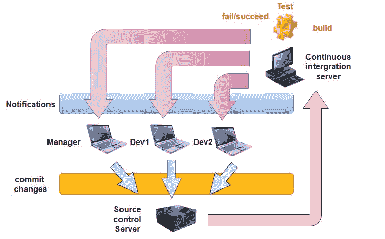

# 持续集成与持续交付

**C****I**是**CD**的子集。在 CD 过程中，我们添加了一个额外的层，在发布过程中自动交付。此附加步骤确保即使在产品发布并交付给客户之后，您也可以根据业务需求根据预定义的时间表（每日、每周、每月等）快速进行新的更改。如果所有测试都成功，新的更改将自动部署，从而以高效的方式加快向客户发布产品的速度。

要加快此过程，可以添加另一个步骤，称为连续部署。下图显示了三种操作：


# 德沃斯

**DevOps**是一种增强型实践，可在整个产品生命周期内实现利用人员和运营经理之间的协作。这是一套工具和心态原则，用于成功构建双方之间的沟通渠道。通过查看下图，您可以更清楚地了解：

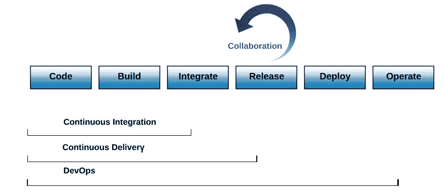

# 与 GitHub 和 Jenkins 的持续集成

我们概述了利用方法和不同的产品生命周期过程。现在，让我们学习如何使用 GitHub 和 Jenkins CI 服务器构建真实的 CI 环境，如下图所示：

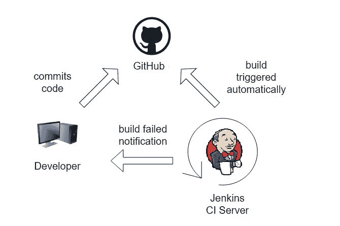

Jenkins 是一个开源自动化服务器。由于其自动化任务的能力，它可以执行 CI。您可以从[下载 https://jenkins.io/:](https://jenkins.io/)


# 安装詹金斯

在演示过程中，我们将使用 Ubuntu 16.04 机器。要安装 Jenkins，您需要添加存储库密钥，使用`echo`命令将 Jenkins Debian 软件包存储库添加到`sources.list`文件，并通过键入以下内容更新`sources.list`文件：

```
apt-get update
```

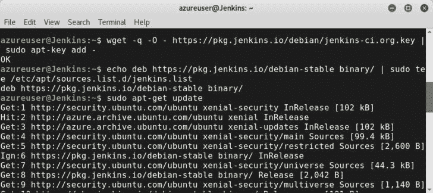

现在，使用`apt-get install Jenkins`命令安装 Jenkins：

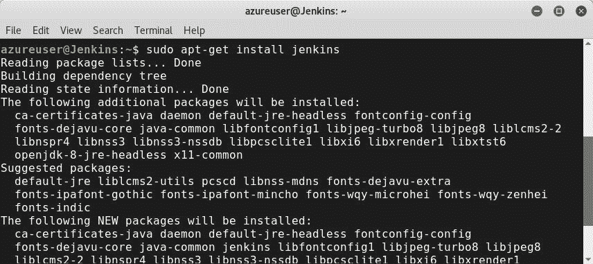

您可以通过键入以下内容来检查 Jenkins 服务是否正在运行：

```
sudo service --status-all
```

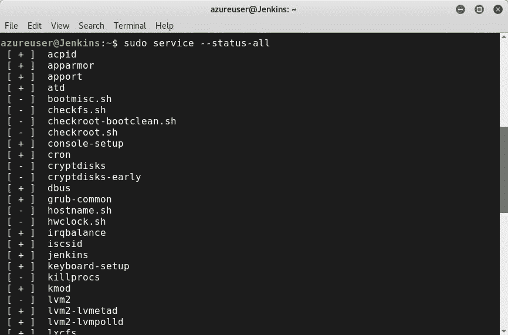

通过键入`sudo ufw allow 8080`为 Jenkins 打开端口`8080`。

转至`https://www.<your domain/IP here>.com:8080`并完成所需的配置：

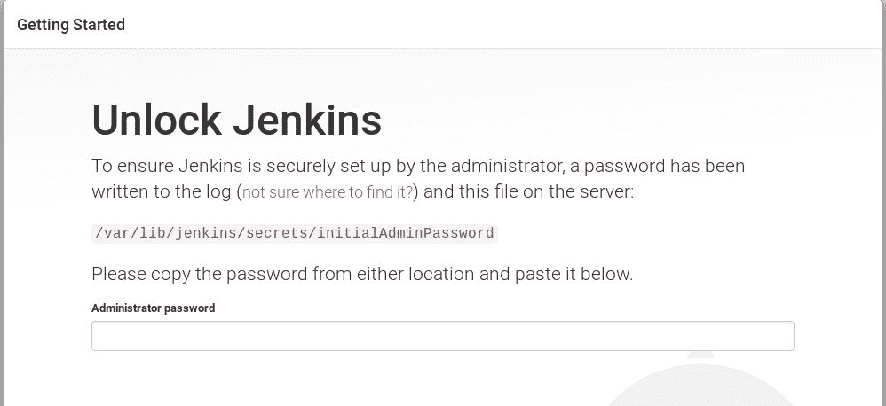

选择您的插件模式：

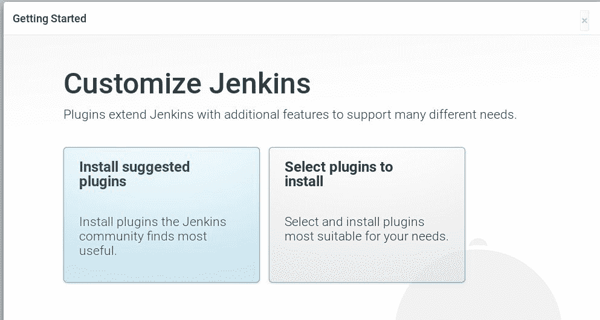

创建一个管理员用户，保存，我们就完成了：

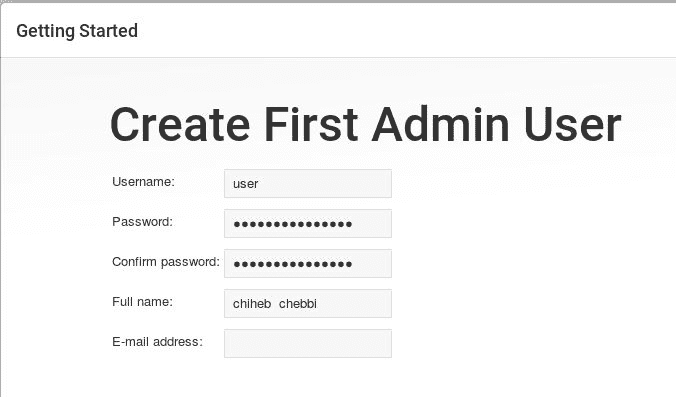

瞧！


创建新项目并完成配置：


# 连续集成攻击

与任何现代组织一样，宝贵的资产、持续集成和 CD 服务器都是高目标，因为它们代表了破坏生产系统的良好切入点。存在许多威胁 CI 服务器的危险攻击。以下是 CI/CD 服务器攻击的一些示例：

*   使用 CI 反向 shell
*   未经授权向船长承诺
*   Jenkins CI 脚本控制台 Java 执行

# 持续集成服务器渗透测试

保护 CI 和 CD 服务器的安全至关重要。建立安全控制对于确保管道的安全至关重要，因为它们是源代码和生产服务器之间的桥梁。

# 用于测试连续集成或连续交付系统安全性的 Rotter Apple 项目

Rotter Apple 项目是一个开源项目，旨在通过提供各种特性和功能，为利用人员和渗透测试人员在测试 CI 服务器时提供简单高效的体验。

您可以通过键入`sudo git clone https://github.com/claudijd/rotten_apple.` 从其 GitHub 存储库克隆项目

# 基于 Zed 攻击代理的连续安全

此处显示的**Zed 攻击代理**（**ZAP**是一款知名的安全开源工具。它为渗透测试人员提供了各种有用的功能。ZAP 可以作为一个额外的 CI 安全层发挥巨大作用。换句话说，它可以是 web 应用程序的连续安全层。ZAP 和 Jenkins 提供了体验额外组件的可能性。然后，您没有及时交付软件项目，而是在增强 CI/DI 管道的安全性：


感谢 ZAP Jenkins 插件，您可以增强 CI 环境的安全性。测试之后，ZAP 将生成不同格式的报告（XHTML、XML 和 JSON）。

要安装 ZAP 插件，您可以使用 web 界面：转到`manage Jenkins -> manage plugins`。

使用筛选栏搜索 ZAP，如以下屏幕截图所示：

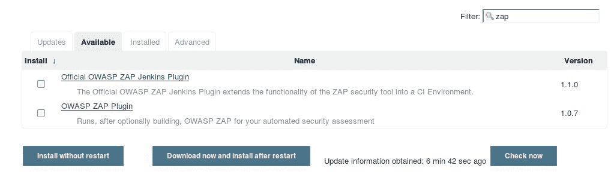

单击安装而不重新启动：

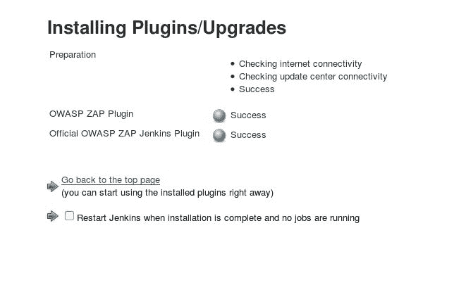

转到作业并在生成选项中选择运行 OWASP ZAP 代理：

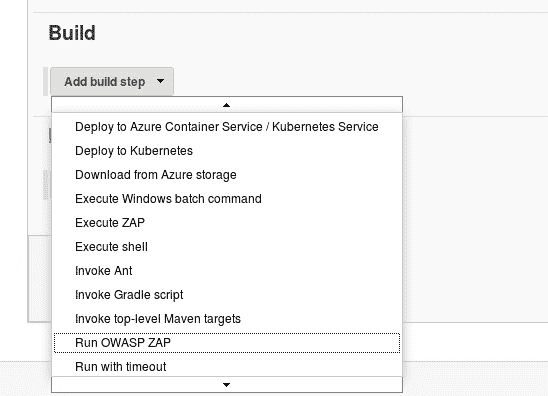

完成所需的配置并最终生成作业：

>

# 总结

本章概述了 CI 服务器的潜在威力及其对企业的好处。因此，我们逐步了解了如何构建 CI 环境，并了解了保护 CI/CD 服务器的方法。下一章将带您深入学习如何使用 Metasploit 和 PowerShell 攻击组织基础架构。