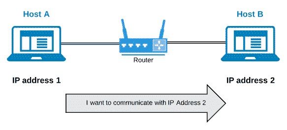
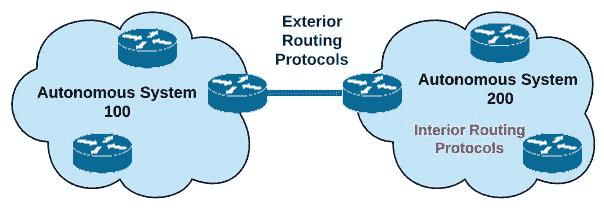
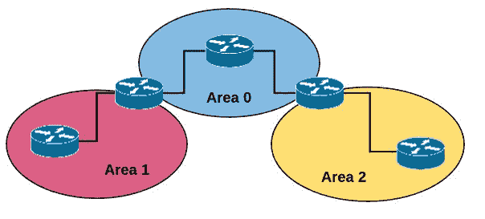
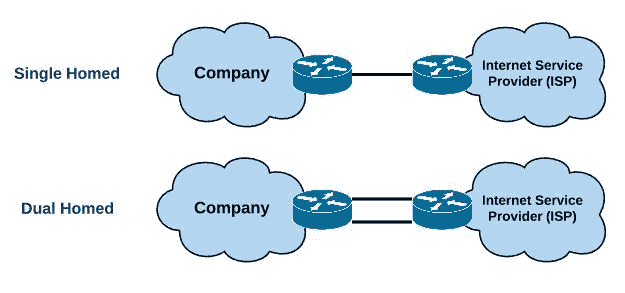
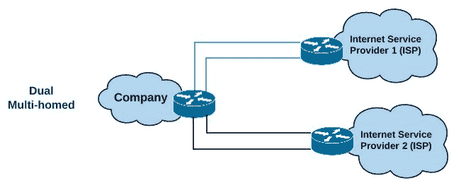
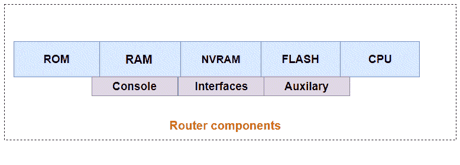
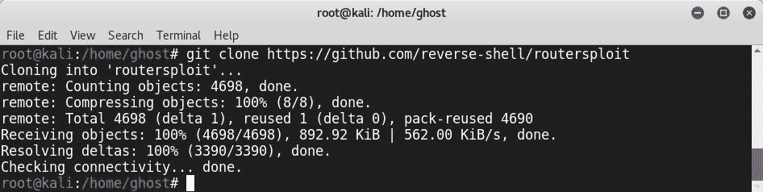
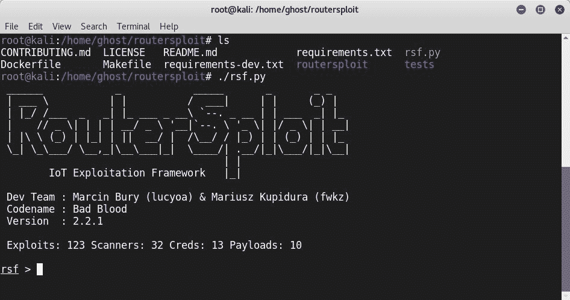
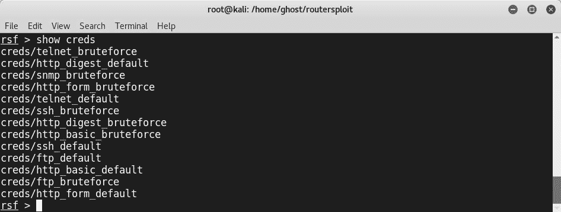

# 十一、路由和路由器漏洞

路由器是每个现代组织中的主要设备。在互联世界中，路由是交换信息的主干，我们知道有价值的信息每天都是攻击者的目标。本章将带您体验一个学习体验，该体验从探索路由操作开始，并指导您通过利用路由协议和路由器的真实演示。

在本章中，您将发现以下内容：

*   路由基础
*   利用路由协议 RIP、OSPF、EIGRP 和 BGP
*   利用现代路由器
*   如何防御 3 级攻击

# 路由基础

在前面的章节中，我们讨论了开关。路由器和交换机都需要转发信息。即使有一些第 3 层交换机，交换机也在第 2 层工作。路由器在第三层运行，即**网络层**：


为了交换信息，路由器使用 IP 地址。他们正在维护一个路由表。说到路由，我们有两种不同的类别：

*   **静态路由**：在静态路由中，所有路由由网络管理员手动设置。对于小型网络来说，这是一个很好的决定，因为在小型网络中，不必要的路由更新较少，但当链路断开时，这将是一个问题。
*   **动态路由**：在动态路由中，路由器在向邻居学习网络拓扑的同时快速适应，即使链路断开，但网络流量大于静态路由。因此，可能会出现网络开销。

路由可进一步分为有类路由或无类路由：

*   **类路由**：您不能随路由更新一起发送子网掩码。在网络方面，我们有五个 IP 类：

| **类** | **第一档** | **默认子网掩码** |
| A. | 1 – 126 | `255.0.0.0` |
| B | 128 – 191 | `255.255.0.0` |
| C | 192 – 223 | `255.255.255.0` |
| D | 224 – 239 | 多播 |
| E | 240 – 254 | 实验用途 |

*   **无类路由**：您可以随路由更新一起发送子网掩码

为了在 internet 上路由信息，路由器协议用于执行从一个网络到另一个网络的信息路由。然而，我们需要区分两个不同的术语：路由协议和路由协议。路由协议用于将信息从源路由到目标，但路由协议是承载信息的有效负载。换句话说，路由协议确定路径、更新路由表并路由路由协议。有许多路由协议，例如：

*   **互联网协议**（**IP**
*   **网间分组交换****IPX**：



路由器使用各种算法来选择路由信息的路径，以提供高效、可靠、快速的收敛和简单的数据交换。路由协议是根据许多参数来完成这项工作的：

*   带宽
*   延迟
*   费用
*   可靠性
*   跳数
*   **最大传输单元**（**MTU**）

下表描述了一些基于其度量的路由协议。我们将在后面更详细地讨论每个路由协议。我们使用此表来更好地了解如何选择路由协议：

| **路由协议** | **指标** |
| EIGRP | 带宽、延迟、负载、可靠性和 MTU |
| RIPv2 | 跳数 |
| OSPF | 成本（带宽越高，成本越低） |

根据上述指标，路由协议可分为三大类：

*   **距离向量协议**：路由器在特定时间段内向邻居发送路由表时使用
*   **链路状态协议**：它们维护网络的整体画面；它们只交换路由更改
*   **混合协议**：它们是链路状态协议和距离向量协议的组合

以下是路由中的重要术语：

*   **自治系统（AS）**：AS 是由一个公共实体或路由策略管理的一组网络设备
*   **内部网关协议（IGP）**：当使用 IGP 时，路由器在自治系统内与共享相同路由协议的其他路由器交换信息
*   **外部网关协议（EGP）**：如果您需要从一个网络移动到另一个网络，如互联网，则需要在不同的自治系统之间使用 EGP：



# 利用路由协议

在本节中，我们将探讨许多路由协议以及如何利用它们中的每一个，并将学习保护网络所需的防御措施。

# 路由信息协议

**路由信息协议**（**RIP**）v1 是距离向量协议。它每 30 秒发送一个路由表。RIP 使用跳数作为决策指标。这是一个旧的协议，在其第一个版本 RIPv1 中不能超过 15 跳。为了到达目的地，RIP 使用跳数最少的路径，但这并不是很有效，因为在某些情况下，有许多路由的跳数更多，但带宽更好。例如，在以下网络中使用 RIPv1 时，流量将通过**路由 1、**转发，甚至**路由 2**带宽更大：


RIPv1 的后续版本考虑了许多修订。RIPv2 是 RIPv1 的增强版。尽管 RIP 是一个类路由协议，但 RIPv2 是无类的，这意味着它在每个路由条目中都包含掩码。因此，它支持**可变长度子网掩码**（**VLSM**）。RIPv2 还提供了一种简单的身份验证机制，因此路由器只有在检查其真实性时才接受来自邻居路由器的数据包。还添加了一个标记，这是用于区分 RIP 学习的路由和其他协议中的其他路由的附加信息。所有这些增强都很好，但是跳数仍然是一个存在的问题，而在 RIPv2 中，最大可达跳数是 15。

要在路由器上配置 RIP，只需进入 RIP 配置模式：

```
Router(config)#router rip Router(config-router)#network <IP Address here>
```

在 RIP 操作和距离向量路由中，通常会出现路由循环。当数据包一次又一次地通过路由器时，就会发生路由循环。此循环可能会禁用网络。

为了防止路由循环，我们可以使用多种方法：

*   **分割视界**：这防止路由器将数据包发送回从中学习该数据包的接口
*   **路由中毒**：防止向网络内失效的**路由**发送数据包****
*****   **中毒反向**：通知邻居网关某个网关不再连接*   **按住定时器**：这些定时器被设置为允许路由器在路由离线时在不更新路由表的情况下进行恢复*   **触发更新**：当度量发生变化时，发送部分更新****

 ****# RIPv1 反射 DDoS

正如我前面提到的，RIPv1 是一个旧的路由协议，但攻击者重新启用了它。例如，2015 年，Akamai Prolexic 安全工程和研究团队（PLXsert）的研究人员发现了一次峰值为 12.9 Gbps 的大规模 DDoS 攻击。攻击者使用了放大和反射的 DDoS 攻击。在这次攻击中，黑客制作了一个普通的 RIPv1 请求查询，并使用了与目标相同的伪造 IP 地址。为了防御这种类型的攻击，建议使用 RIPv2 而不是旧版本。此外，您需要使用访问列表并阻止来自端口`520`的 UDP 数据包。

# 先开最短路径

**开放最短路径优先**（**OSPF**是基于 RFC1247 的开放标准链路状态协议。在 OSPF 操作中，路由器使用**链路状态公告**（**LSA**向同一区域中的所有路由器发送信息。路由器使用**最短路径优先**（**SPF**算法）计算路径。这种算法有时被称为 Dijkstra 算法。它需要强大的处理能力。OSPF 还支持 VLSM。

为了更好地管理，OSPF 使用分层拓扑结构。OSPF 由一个名为**区域 0**的主干网组成，该主干网与其他较小区域相连。当发生更改时，路由器会收到通知，获取 LSA 副本，并更新**链路状态数据库**（**LSDB**）：



在深入探讨 OSPF 的工作原理之前，让我们先看看一些重要的路由器术语：

*   **内部路由器：**所有 OSPF 接口属于同一区域
*   **骨干路由器：**一个接口至少属于同一区域 0
*   **自治系统边界路由器（ASBR）：**连接自治系统
*   **指定路由器（DR）：**此**维护子网的数据库**
***   **区域边界路由器（ABR）：**至少有一个 OSPF 接口属于区域 0，而另一个 OSPF 接口不属于区域 0*   **备份指定路由器（BDR）：**为指定路由器提供冗余：**

 **

有三个 OSPF 表：

*   **邻居表**：提供邻居信息
*   **拓扑表**：提供网络路由信息
*   **路由表**：考虑转发信息

以下过程描述了 OSPF 的工作原理：

1.  每个 OSPF 路由器通过向环回接口分配最高 IP 来选择其路由器 ID（用于标识的 IP 地址）。如果不是这样（未定义逻辑接口），则将选择 IP 地址最高的物理接口作为路由器 ID。
2.  两个路由器都向多播地址`224.0.0.5`发送 Hello 数据包。
3.  如果数据包具有相同的 hello 间隔、dead 间隔和区域号，则将形成邻居邻接
4.  路由器发送数据库描述包。具有最高路由器 ID 的路由器将成为主路由器并启动数据库数据包交换。
5.  其中一个路由器从另一个路由器请求 LSA。

# OSPF 攻击

在前几年，许多研究表明，带有 OSPF 的路由器容易受到各种类型的攻击。这是一个严重的问题，因为 OSPF 是许多自治系统（包括许多企业）中最常用的协议。让我们来了解一些针对 OSPF 协议的攻击。

# 变相 LSA

此攻击利用 RFC 2328 中的一个条件，根据三个标准（序列号、校验和值和年龄）检查 LSA 的两个实例是否相同。因此，攻击者可以使用这些字段对假 LSA 进行广告，但是在下一个有效实例中，因为路由器将考虑 LSA 作为复制的 LSA，所以它将忽略它。

要执行伪装 LSA 攻击，请执行以下步骤：

1.  攻击者发送一个伪造的 LSA
2.  攻击者发送一个伪装的 LSA，其中包含前面讨论过的三个字段
3.  路由器 1 发送一个回击 LSA，它们将被路由器 2 接收，但它不会更新 LSA 数据库，而接收到的 LSA 是相同的。
4.  路由器 2 引发另一场反击


# MaxAge LSAs

攻击者试图修改 LSA 的最大值以毒害路由表，使 LSA 充斥网络，甚至堵塞网络流量。要防御 MaxAge LSA，请确保反击陷阱可用。

# 远程假邻接

在远程虚假邻接攻击期间，攻击者扮演路由器的角色，利用路由器可以成功完成邻接设置的事实。通过启用 TTL 安全性可以避免此攻击：


# Seq++攻击

当攻击者滥用路由器并发送 LSA 虚假信息和高于当前序列号的序列号，从而破坏路由器时，就会发生 seq++攻击。要防御此攻击，您可以使用反击陷阱。

# 持续中毒

CVE 2013-0149 中提到了持续中毒，并迫使路由器根据伪 LSA 计算路由。

# 防御

有许多其他防御机制可以避免 OSPF 攻击；以下是一些防御层：

*   **仅传输网络**：这些配置路由器以抑制后缀：

```
(config-router)#prefix-suppression
```

*   **使用隐藏接口**：这些接口有时称为无编号接口：

```
(config-if)#ip unnumbered Ethernet 0
```

*   **启用 TTL 安全**：

```
(config-if)# Ip ospf ttl-security
```

*   **启用 MD5 加密支持**：

```
(config-if)# Ip Ospf message-digest-key 1 md5 ab$c1
```

*   **反欺骗入口过滤**：通过确保流量来自可信来源来阻止恶意流量
*   **链路状态数据库校验和**：**确保 OSPF LSDB 一致**

 **# 内部网关线路协议

**内部网关路由协议**（**IGRP**为一类距离向量路由协议。与 RIP 一样，IGRP 中的路由决策基于 Bellman-Ford 算法，使用跳数。这不是一个开放的标准。这是思科的专利。支持的最大跃点为 255，默认值为 100。因此，它比 RIP 更适合大型公司。此外，还可以轻松配置：

```
Router(config)# router igrp <AS NUM HERE> Router(config-router)# network < NeT ID Here >
```

在同一自治系统中，IGRP 每隔 90 秒定期发送一次信息。此计时器名为**更新计时器**。如果更新时间超过 270 秒（无效计时器），则该更新将无效，如果更新时间超过 360 秒（刷新计时器），则该更新将从路由表中删除。IGRP 不支持身份验证，其数据包可能被欺骗。

# 增强的内部网关路由协议

**增强型内部网关路由协议**（**EIGRP**是 IGRP 的增强版。它使用对偶算法。路由器使用邻居使用**Hello**请求，而有五种消息类型（Hello、update、ack、query 和 reply）。下图显示了 EIGRP 的工作原理：


EIGRP 维护以下三个表：

*   **邻表**
*   **拓扑表**
*   **路由表**

EIGRP 使用以下公式计算选择路线的成本：

*指标=带宽+延迟*

尽管 IGRP 不支持身份验证，但 EIGRP 添加了两个主要的安全特性：明文和 MD5 身份验证表单。如果未设置 MD5 身份验证，则可以轻松嗅探数据包。

# 边界网关协议

**边界网关协议**（**BGP**）基本上就是互联网的工作方式。这是一个高度可扩展的路由协议，其当前版本基于 RFC4271。它将信息存储在**路由信息库**（**RIB**中）。

如果您的公司需要连接到 internet 服务提供商，它可以使用多种可能性之一：

*   单宿连接
*   双宿连接：



您还可以使用多种连接类型连接到多个服务提供商：

*   **单多宿**：


*   **双多址**：



# BGP 攻击

BGP 是许多攻击的目标。让我们来了解一些 BGP 威胁：

*   **错误更新和前缀劫持**：这种攻击，有时称为 BGP 劫持，发生在自治系统将流量路由到被劫持的自治系统时。
*   **反聚合**：在此次攻击中，一个地址块被划分为更具体的块和前缀。
*   **矛盾广告**：在这次攻击中，攻击者将流量重定向到另一个自治系统。
*   **不稳定**：BGP 会话反复超时时会发生此攻击

# 利用路由器

之前，我们了解了如何利用路由协议。现在是学习如何利用现代路由器的时候了。

# 路由器组件

与所有主要网络设备一样，路由器由许多内部组件组成：

*   **CPU**：执行系统操作
*   **RAM**：用于存储指令
*   **ROM**：包含引导指令
*   **闪存**：包含 IOS
*   **NVRAM**：包含启动配置文件：



# 路由器启动过程

要启动，每个主要路由器都要经过多个步骤：

1.  首先，路由器执行 POST。
2.  它加载引导程序。
3.  它定位并加载操作系统。

4.  您可以选择进入安装模式或加载配置文件：


# 路由器攻击

您了解了路由协议威胁，现在我们将讨论针对路由器的攻击；甚至硬件也面临许多挑战性威胁：

*   分布式拒绝服务攻击
*   中间人攻击
*   路由器固件攻击

# 路由器利用框架

Routersploit 框架是一个利用路由器嵌入式系统的开源工具。您可以像往常一样使用`git clone`命令从此链接克隆它：

```
#git clone https://github.com/reverse-shell/routersploit
```

在使用之前，您需要安装一些依赖项，例如`python-pip`：


将存储库从 GitHub 克隆到本地计算机：



克隆脚本后，可以通过在 CLI 中运行脚本来运行脚本：

```
# ./rsf.py
```



要检查扫描仪，请键入以下内容：

```
# show scanners
```


要检查凭据，请使用以下命令：

```
# show creds
```



# 总结

本章是学习如何利用路由协议和路由器的完整指南。在深入了解路由协议的基础和基本原理之后，它展示了真实世界的攻击技术。通过阅读本章，您已经获得了执行第 2 层和第 3 层攻击所需的知识，并具备了保护现代公司网络的正确心态和工具。在下一章中，我们将扩展我们的知识。此外，您还将学习如何保护物联网项目。********