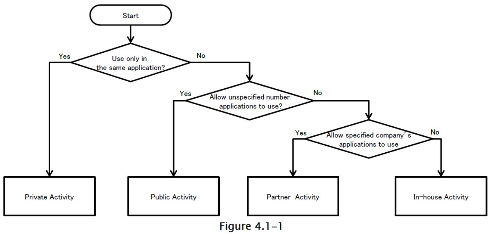
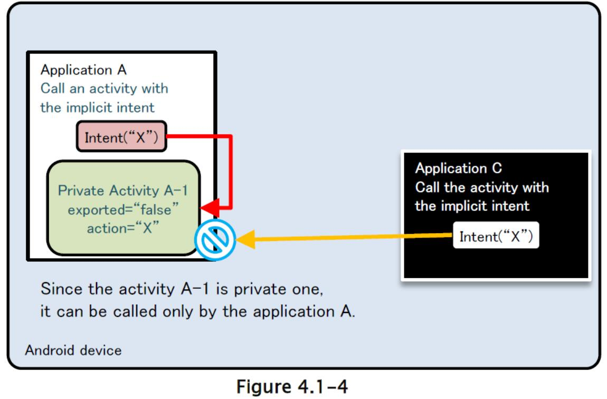
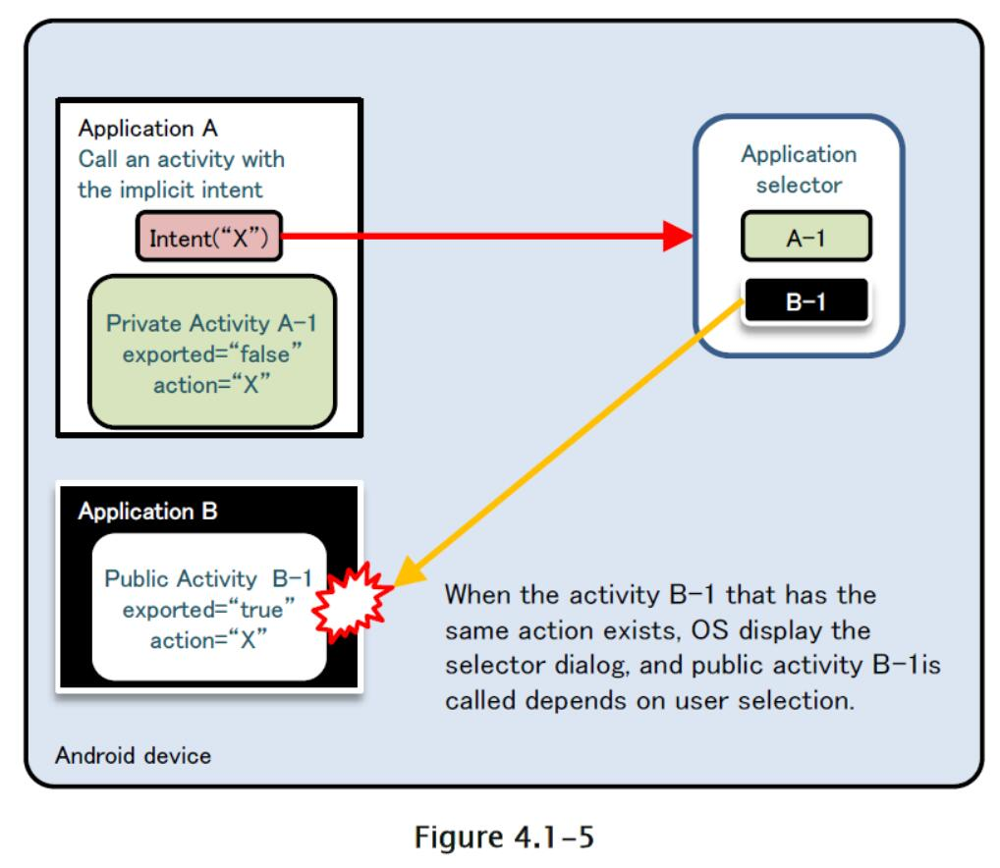

# 4.1 创建或使用活动

### 4.1.1 示例代码

使用活动的风险和对策取决于活动的使用方式。 在本节中，我们根据活动的使用情况，对 4 种活动进行了分类。 你可以通过下面的图表来找出，你应该创建哪种类型的活动。 由于安全编程最佳实践根据活动的使用方式而有所不同，因此我们也将解释活动的实现。

表 4-1 活动类型的定义

| 类型 | 定义 |
| --- | --- |
| 私有 | 不能由其他应用加载，所以是最安全的活动 |
| 公共 | 应该由很多未指定的应用使用的活动 |
| 伙伴 | 只能由可信的伙伴公司开发的应用使用的活动 |
| 内部 | 只能由其他内部应用使用的活动 |



#### 4.1.1.1 创建/使用私有活动

私有活动是其他应用程序无法启动的活动，因此它是最安全的活动。 

当使用仅在应用程序中使用的活动（私有活动）时，只要你对类使用显示意图，那么你不必担心将它意外发送到任何其他应用程序。 但是，第三方应用程序可能会读取用于启动活动的意图。 因此，如果你将敏感信息放入用于启动活动的意图中，有必要采取对策，来确保它不会被恶意第三方读取。 

下面展示了如何创建私有活动的示例代码。

要点（创建活动）：

1) 不要指定`taskAffinity`。

2) 不要指定`launchMode`。

3) 将导出属性明确设置为`false`。

4) 仔细和安全地处理收到的意图，即使意图从相同的应用发送。

5) 敏感信息可以发送，因为它发送和接收所有同一应用中的信息。

AndroidManifest.xml

```xml
<?xml version="1.0" encoding="utf-8"?>
<manifest xmlns:android="http://schemas.android.com/apk/res/android"
    package="org.jssec.android.activity.privateactivity" >
    
    <application
        android:allowBackup="false"
        android:icon="@drawable/ic_launcher"
        android:label="@string/app_name" >
        
        <!-- Private activity -->
        <!-- *** POINT 1 *** Do not specify taskAffinity -->
        <!-- *** POINT 2 *** Do not specify launchMode -->
        <!-- *** POINT 3 *** Explicitly set the exported attribute to false. -->
        <activity
            android:name=".PrivateActivity"
            android:label="@string/app_name"
            android:exported="false" />
        
        <!-- Public activity launched by launcher -->
        <activity
            android:name=".PrivateUserActivity"
            android:label="@string/app_name"
            android:exported="true" >
            <intent-filter>
                <action android:name="android.intent.action.MAIN" />
                <category android:name="android.intent.category.LAUNCHER" />
            </intent-filter>
        </activity>
    </application>
</manifest>
```

PrivateActivity.java

```java
package org.jssec.android.activity.privateactivity;

import android.app.Activity;
import android.content.Intent;
import android.os.Bundle;
import android.view.View;
import android.widget.Toast;

public class PrivateActivity extends Activity {

    @Override
    public void onCreate(Bundle savedInstanceState) {
        super.onCreate(savedInstanceState);
        setContentView(R.layout.private_activity);
        // *** POINT 4 *** Handle the received Intent carefully and securely, even though the Intent was sent from the same application.
        // Omitted, since this is a sample. Please refer to "3.2 Handling Input Data Carefully and Securely."
        String param = getIntent().getStringExtra("PARAM");
        Toast.makeText(this, String.format("Received param: ￥"%s￥"", param), Toast.LENGTH_LONG).show();
    }
    
    public void onReturnResultClick(View view) {
        // *** POINT 5 *** Sensitive information can be sent since it is sending and receiving all within the same application.
        Intent intent = new Intent();
        intent.putExtra("RESULT", "Sensitive Info");
        setResult(RESULT_OK, intent);
        finish();
    }
}
```

下面展示如何使用私有活动的示例代码。

要点（使用活动）；

6) 不要为意图设置`FLAG_ACTIVITY_NEW_TASK`标志来启动活动。

7) 使用显式意图，以及用于调用相同应用中的活动的特定的类。

8) 由于目标活动位于同一个应用中，因此只能通过`putExtra()`发送敏感信息 [1]。

> 警告：如果不遵守第 1, 2 和 6 点，第三方可能会读到意图。 更多详细信息，请参阅第 4.1.2.2 和 4.1.2.3 节。

9) 即使数据来自同一应用中的活动，也要小心并安全地处理收到的结果数据。

PrivateUserActivity.java

```java
package org.jssec.android.activity.privateactivity;

import android.app.Activity;
import android.content.Intent;
import android.os.Bundle;
import android.view.View;
import android.widget.Toast;

public class PrivateUserActivity extends Activity {

    private static final int REQUEST_CODE = 1;
    
    @Override
    public void onCreate(Bundle savedInstanceState) {
        super.onCreate(savedInstanceState);
        setContentView(R.layout.user_activity);
    }
    
    public void onUseActivityClick(View view) {
        // *** POINT 6 *** Do not set the FLAG_ACTIVITY_NEW_TASK flag for intents to start an activity.
        // *** POINT 7 *** Use the explicit Intents with the class specified to call an activity in the same application.
        Intent intent = new Intent(this, PrivateActivity.class);
        // *** POINT 8 *** Sensitive information can be sent only by putExtra() since the destination activity is in the same application.
        intent.putExtra("PARAM", "Sensitive Info");
        startActivityForResult(intent, REQUEST_CODE);
    }
    
    @Override
    public void onActivityResult(int requestCode, int resultCode, Intent data) {
        super.onActivityResult(requestCode, resultCode, data);
        if (resultCode != RESULT_OK) return;
        switch (requestCode) {
            case REQUEST_CODE:
                String result = data.getStringExtra("RESULT");
                // *** POINT 9 *** Handle the received data carefully and securely,
                // even though the data comes from an activity within the same application.
                // Omitted, since this is a sample. Please refer to "3.2 Handling Input Data Carefully and Securely."
                Toast.makeText(this, String.format("Received result: ￥"%s￥"", result), Toast.LENGTH_LONG).show();
                break;
        }
    }
}
```

#### 4.1.1.2 创建/使用公共活动

公共活动是应该由大量未指定的应用程序使用的活动。 有必要注意的是，公共活动可能收到恶意软件发送的意图。 另外，使用公共活动时，有必要注意恶意软件也可以接收或阅读发送给他们的意图。

要点（创建活动）：

1) 将导出属性显式设置为`true`。

2) 小心并安全地处理接收到的意图。

3) 返回结果时，请勿包含敏感信息。

下面展示了创建公共活动的示例代码。

AndroidManifest.xml

```xml
<?xml version="1.0" encoding="utf-8"?>
    <manifest xmlns:android="http://schemas.android.com/apk/res/android"
    package="org.jssec.android.activity.publicactivity" >
    
    <application
        android:allowBackup="false"
        android:icon="@drawable/ic_launcher"
        android:label="@string/app_name" >
        
        <!-- Public Activity -->
        <!-- *** POINT 1 *** Explicitly set the exported attribute to true. -->
        <activity
            android:name=".PublicActivity"
            android:label="@string/app_name"
            android:exported="true">
            
            <!-- Define intent filter to receive an implicit intent for a specified action -->
            <intent-filter>
                <action android:name="org.jssec.android.activity.MY_ACTION" />
                <category android:name="android.intent.category.DEFAULT" />
            </intent-filter>
        </activity>
    </application>
</manifest>
```

PublicActivity.java

```java
package org.jssec.android.activity.publicactivity;

import android.app.Activity;
import android.content.Intent;
import android.os.Bundle;
import android.view.View;
import android.widget.Toast;

public class PublicActivity extends Activity {
    
    @Override
    public void onCreate(Bundle savedInstanceState) {
        super.onCreate(savedInstanceState);
        setContentView(R.layout.main);
        // *** POINT 2 *** Handle the received intent carefully and securely.
        // Since this is a public activity, it is possible that the sending application may be malware.
        // Omitted, since this is a sample. Please refer to "3.2 Handling Input Data Carefully and Securely."
        String param = getIntent().getStringExtra("PARAM");
        Toast.makeText(this, String.format("Received param: ¥"%s¥"", param), Toast.LENGTH_LONG).show();
    }
    
    public void onReturnResultClick(View view) {
        // *** POINT 3 *** When returning a result, do not include sensitive information.
        // Since this is a public activity, it is possible that the receiving application may be malware.
        // If there is no problem if the data gets received by malware, then it can be returned as a result.
        Intent intent = new Intent();
        intent.putExtra("RESULT", "Not Sensitive Info");
        setResult(RESULT_OK, intent);
        finish();
    }
}
```

接下来，这里是公共活动用户端的示例代码。

要点（使用活动）：

4) 不要发送敏感信息。

5) 收到结果时，请仔细并安全地处理数据。

PublicUserActivity.java

```java
package org.jssec.android.activity.publicuser;
import android.app.Activity;
import android.content.ActivityNotFoundException;
import android.content.Intent;
import android.os.Bundle;
import android.view.View;
import android.widget.Toast;
public class PublicUserActivity extends Activity {
    
    private static final int REQUEST_CODE = 1;
    
    @Override
    public void onCreate(Bundle savedInstanceState) {
        super.onCreate(savedInstanceState);
        setContentView(R.layout.main);
    }
    
    public void onUseActivityClick(View view) {
        try {
            // *** POINT 4 *** Do not send sensitive information.
            Intent intent = new Intent("org.jssec.android.activity.MY_ACTION");
            intent.putExtra("PARAM", "Not Sensitive Info");
            startActivityForResult(intent, REQUEST_CODE);
        } catch (ActivityNotFoundException e) {
            Toast.makeText(this, "Target activity not found.", Toast.LENGTH_LONG).show();
        }
    }
    
    @Override
    public void onActivityResult(int requestCode, int resultCode, Intent data) {
        super.onActivityResult(requestCode, resultCode, data);
        // *** POINT 5 *** When receiving a result, handle the data carefully and securely.
        // Omitted, since this is a sample. Please refer to "3.2 Handling Input Data Carefully and Securely."
        if (resultCode != RESULT_OK) return;
        switch (requestCode) {
            case REQUEST_CODE:
                String result = data.getStringExtra("RESULT");
                Toast.makeText(this, String.format("Received result: ¥"%s¥"", result), Toast.LENGTH_LONG).show();
                break;
        }
    }
}
```

#### 4.1.1.3 创建/使用伙伴活动

伙伴活动是只能由特定应用程序使用的活动。 它们在想要安全共享信息和功能的伙伴公司之间使用。 

第三方应用程序可能会读取用于启动活动的意图。 因此，如果你将敏感信息放入用于启动活动的意图中，有必要采取对策来确保其无法被恶意第三方读取。

创建伙伴活动的示例代码如下所示。

要点（创建活动）：

1) 不要指定`taskAffinity`。

2) 不要指定`launchMode`。

3) 不要定义意图过滤器，并将导出属性明确设置为`true`。

4) 通过预定义白名单验证请求应用程序的证书。

5) 尽管意图是从伙伴应用程序发送的，仔细和安全地处理接收到的意图。

6) 只返回公开给伙伴应用的信息。

请参阅“4.1.3.2 验证和请求应用”，了解如何通过白名单验证应用。 此外，请参阅“5.2.1.3 如何验证应用证书的哈希”，了解如何验证白名单中指定目标应用的证书哈希。

AndroidManifest.xml

```xml
<?xml version="1.0" encoding="utf-8"?>
<LinearLayout xmlns:android="http://schemas.android.com/apk/res/android"
    android:layout_width="fill_parent"
    android:layout_height="fill_parent"
    android:orientation="vertical"
    android:padding="5dp" >
    <TextView
        android:layout_width="fill_parent"
        android:layout_height="wrap_content"
        android:layout_marginTop="20dp"
        android:text="@string/description" />
    <Button
        android:layout_width="fill_parent"
        android:layout_height="wrap_content"
        android:layout_marginTop="20dp"
        android:onClick="onReturnResultClick"
        android:text="@string/return_result" />
</LinearLayout>
```

PartnerActivity.java

```java
package org.jssec.android.activity.partneractivity;

import org.jssec.android.shared.PkgCertWhitelists;
import org.jssec.android.shared.Utils;
import android.app.Activity;
import android.content.Context;
import android.content.Intent;
import android.os.Bundle;
import android.view.View;
import android.widget.Toast;

public class PartnerActivity extends Activity {
    
    // *** POINT 4 *** Verify the requesting application's certificate through a predefined whitelist.
    private static PkgCertWhitelists sWhitelists = null;
    
    private static void buildWhitelists(Context context) {
        boolean isdebug = Utils.isDebuggable(context);
        sWhitelists = new PkgCertWhitelists();
        // Register certificate hash value of partner application org.jssec.android.activity.partneruser
            .sWhitelists.add("org.jssec.android.activity.partneruser", isdebug ?
            // Certificate hash value of "androiddebugkey" in the debug.keystore.
            "0EFB7236 328348A9 89718BAD DF57F544 D5CCB4AE B9DB34BC 1E29DD26 F77C8255" :
            // Certificate hash value of "partner key" in the keystore.
            "1F039BB5 7861C27A 3916C778 8E78CE00 690B3974 3EB8259F E2627B8D 4C0EC35A");
            // Register the other partner applications in the same way.
    }
    
    private static boolean checkPartner(Context context, String pkgname) {
        if (sWhitelists == null) buildWhitelists(context);
        return sWhitelists.test(context, pkgname);
    }
    
    @Override
    public void onCreate(Bundle savedInstanceState) {
        super.onCreate(savedInstanceState);
        setContentView(R.layout.main);

        // *** POINT 4 *** Verify the requesting application's certificate through a predefined whitelist.
        if (!checkPartner(this, getCallingActivity().getPackageName())) {
            Toast.makeText(this,
                "Requesting application is not a partner application.",
                Toast.LENGTH_LONG).show();
            finish();
            return;
        }
        // *** POINT 5 *** Handle the received intent carefully and securely, even though the intent was sent from a partner application.
        // Omitted, since this is a sample. Refer to "3.2 Handling Input Data Carefully and Securely."
        Toast.makeText(this, "Accessed by Partner App", Toast.LENGTH_LONG).show();
    }
    
    public void onReturnResultClick(View view) {
        // *** POINT 6 *** Only return Information that is granted to be disclosed to a partner application.
        Intent intent = new Intent();
        intent.putExtra("RESULT", "Information for partner applications");
        setResult(RESULT_OK, intent);
        finish();
    }
}
```

PkgCertWhitelists.java

```java
package org.jssec.android.shared;

import java.util.HashMap;
import java.util.Map;
import android.content.Context;

public class PkgCertWhitelists {
    
    private Map<String, String> mWhitelists = new HashMap<String, String>();
    
    public boolean add(String pkgname, String sha256) {
        if (pkgname == null) return false;
        if (sha256 == null) return false;
        sha256 = sha256.replaceAll(" ", "");
        if (sha256.length() != 64) return false; // SHA-256 -> 32 bytes -> 64 chars
        sha256 = sha256.toUpperCase();
        if (sha256.replaceAll("[0-9A-F]+", "").length() != 0) return false; // found non hex char
        mWhitelists.put(pkgname, sha256);
        return true;
    }
    
    public boolean test(Context ctx, String pkgname) {
        // Get the correct hash value which corresponds to pkgname.
        String correctHash = mWhitelists.get(pkgname);
        // Compare the actual hash value of pkgname with the correct hash value.
        return PkgCert.test(ctx, pkgname, correctHash);
    }
}
```

PkgCert.java

```java
package org.jssec.android.shared;

import java.security.MessageDigest;
import java.security.NoSuchAlgorithmException;
import android.content.Context;
import android.content.pm.PackageInfo;
import android.content.pm.PackageManager;
import android.content.pm.PackageManager.NameNotFoundException;
import android.content.pm.Signature;

public class PkgCert {
    
    public static boolean test(Context ctx, String pkgname, String correctHash) {
        if (correctHash == null) return false;
        correctHash = correctHash.replaceAll(" ", "");
        return correctHash.equals(hash(ctx, pkgname));
    }
    
    public static String hash(Context ctx, String pkgname) {
        if (pkgname == null) return null;
        try {
            PackageManager pm = ctx.getPackageManager();
            PackageInfo pkginfo = pm.getPackageInfo(pkgname, PackageManager.GET_SIGNATURES);
            if (pkginfo.signatures.length != 1) return null; // Will not handle multiple signatures.
            Signature sig = pkginfo.signatures[0];
            byte[] cert = sig.toByteArray();
            byte[] sha256 = computeSha256(cert);
            return byte2hex(sha256);
        } catch (NameNotFoundException e) {
            return null;
        }
    }
    
    private static byte[] computeSha256(byte[] data) {
        try {
            return MessageDigest.getInstance("SHA-256").digest(data);
        } catch (NoSuchAlgorithmException e) {
            return null;
        }
    }
    
    private static String byte2hex(byte[] data) {
        if (data == null) return null;
        final StringBuilder hexadecimal = new StringBuilder();
        for (final byte b : data) {
            hexadecimal.append(String.format("%02X", b));
        }
        return hexadecimal.toString();
    }
}
```

使用伙伴活动的示例代码如下：

7) 验证目标应用的证书是否已在白名单中注册。

8) 不要为启动活动的意图设置`FLAG_ACTIVITY_NEW_TASK`标志。

9) 仅通过`putExtra()`发送公开给伙伴活动的信息。

10) 使用显示意图调用伙伴活动。

11) 使用`startActivityForResult()`来调用伙伴活动。

12) 即使数据来自伙伴应用程序，也要小心并安全地处理收到的结果数据。

请参阅“4.1.3.2 验证请求应用”了解如何通过白名单验证应用程序。 另请参阅“5.2.1.3 如何验证应用证书的哈希”，了解如何验证白名单中指定目标应用的证书哈希。

AndroidManifest.xml

```xml
<?xml version="1.0" encoding="utf-8"?>
    <manifest xmlns:android="http://schemas.android.com/apk/res/android"
    package="org.jssec.android.activity.partneruser" >
    
    <application
        android:allowBackup="false"
        android:icon="@drawable/ic_launcher"
        android:label="@string/app_name" >
        
        <activity
            android:name="org.jssec.android.activity.partneruser.PartnerUserActivity"
            android:label="@string/app_name"
            android:exported="true" >
            <intent-filter>
                <action android:name="android.intent.action.MAIN" />
                <category android:name="android.intent.category.LAUNCHER" />
            </intent-filter>
        </activity>
    </application>
</manifest>
```

PartnerUserActivity.java

```java
package org.jssec.android.activity.partneruser;

import org.jssec.android.shared.PkgCertWhitelists;
import org.jssec.android.shared.Utils;
import android.app.Activity;
import android.content.ActivityNotFoundException;
import android.content.Context;
import android.content.Intent;
import android.os.Bundle;
import android.view.View;
import android.widget.Toast;

public class PartnerUserActivity extends Activity {

    // *** POINT 7 *** Verify if the certificate of a target application has been registered in a whitelist.
    private static PkgCertWhitelists sWhitelists = null;
    
    private static void buildWhitelists(Context context) {
        boolean isdebug = Utils.isDebuggable(context);
        sWhitelists = new PkgCertWhitelists();
        // Register the certificate hash value of partner application org.jssec.android.activity.partner
        activity
            .sWhitelists.add("org.jssec.android.activity.partneractivity", isdebug ?
            // The certificate hash value of "androiddebugkey" is in debug.keystore.
            "0EFB7236 328348A9 89718BAD DF57F544 D5CCB4AE B9DB34BC 1E29DD26 F77C8255" :
            // The certificate hash value of "my company key" is in the keystore.
            "D397D343 A5CBC10F 4EDDEB7C A10062DE 5690984F 1FB9E88B D7B3A7C2 42E142CA");
            // Register the other partner applications in the same way.
    }
    
    private static boolean checkPartner(Context context, String pkgname) {
        if (sWhitelists == null) buildWhitelists(context);
        return sWhitelists.test(context, pkgname);
    }
    
    private static final int REQUEST_CODE = 1;
    // Information related the target partner activity
    private static final String TARGET_PACKAGE = "org.jssec.android.activity.partneractivity";
    private static final String TARGET_ACTIVITY = "org.jssec.android.activity.partneractivity.PartnerActivity";
    
    @Override
    public void onCreate(Bundle savedInstanceState) {
        super.onCreate(savedInstanceState);
        setContentView(R.layout.main);
    }
    
    public void onUseActivityClick(View view) {
        // *** POINT 7 *** Verify if the certificate of the target application has been registered in the own white list.
        if (!checkPartner(this, TARGET_PACKAGE)) {
            Toast.makeText(this, "Target application is not a partner application.", Toast.LENGTH_LONG).show();
            return;
        }
        try {
            // *** POINT 8 *** Do not set the FLAG_ACTIVITY_NEW_TASK flag for the intent that start an activity.
            Intent intent = new Intent();
            // *** POINT 9 *** Only send information that is granted to be disclosed to a Partner Activity only by putExtra().
            intent.putExtra("PARAM", "Info for Partner Apps");
            // *** POINT 10 *** Use explicit intent to call a Partner Activity.
            intent.setClassName(TARGET_PACKAGE, TARGET_ACTIVITY);
            // *** POINT 11 *** Use startActivityForResult() to call a Partner Activity.
            startActivityForResult(intent, REQUEST_CODE);
        }
        catch (ActivityNotFoundException e) {
            Toast.makeText(this, "Target activity not found.", Toast.LENGTH_LONG).show();
        }
    }
    
    @Override
    public void onActivityResult(int requestCode, int resultCode, Intent data) {
        super.onActivityResult(requestCode, resultCode, data);
        if (resultCode != RESULT_OK) return;
        switch (requestCode) {
            case REQUEST_CODE:
                String result = data.getStringExtra("RESULT");
                // *** POINT 12 *** Handle the received data carefully and securely,
                // even though the data comes from a partner application.
                // Omitted, since this is a sample. Please refer to "3.2 Handling Input Data Carefully and Securely."
                Toast.makeText(this,
                    String.format("Received result: ¥"%s¥"", result), Toast.LENGTH_LONG).show();
                break;
        }
    }
}
```

PkgCertWhitelists.java

```java
package org.jssec.android.shared;

import java.util.HashMap;
import java.util.Map;
import android.content.Context;

public class PkgCertWhitelists {
    private Map<String, String> mWhitelists = new HashMap<String, String>();
    
    public boolean add(String pkgname, String sha256) {
        if (pkgname == null) return false;
        if (sha256 == null) return false;
        sha256 = sha256.replaceAll(" ", "");
        if (sha256.length() != 64) return false; // SHA-256 -> 32 bytes -> 64 chars
        sha256 = sha256.toUpperCase();
        if (sha256.replaceAll("[0-9A-F]+", "").length() != 0) return false; // found non hex char
        mWhitelists.put(pkgname, sha256);
        return true;
    }
    
    public boolean test(Context ctx, String pkgname) {
        // Get the correct hash value which corresponds to pkgname.
        String correctHash = mWhitelists.get(pkgname);
        // Compare the actual hash value of pkgname with the correct hash value.
        return PkgCert.test(ctx, pkgname, correctHash);
    }
}
```

PkgCert.java

```java
package org.jssec.android.shared;

import java.security.MessageDigest;
import java.security.NoSuchAlgorithmException;
import android.content.Context;
import android.content.pm.PackageInfo;
import android.content.pm.PackageManager;
import android.content.pm.PackageManager.NameNotFoundException;
import android.content.pm.Signature;

public class PkgCert {
        public static boolean test(Context ctx, String pkgname, String correctHash) {
        if (correctHash == null) return false;
        correctHash = correctHash.replaceAll(" ", "");
        return correctHash.equals(hash(ctx, pkgname));
    }
    
    public static String hash(Context ctx, String pkgname) {
        if (pkgname == null) return null;
        try {
            PackageManager pm = ctx.getPackageManager();
            PackageInfo pkginfo = pm.getPackageInfo(pkgname, PackageManager.GET_SIGNATURES);
            if (pkginfo.signatures.length != 1) return null; // Will not handle multiple signatures.
            Signature sig = pkginfo.signatures[0];
            byte[] cert = sig.toByteArray();
            byte[] sha256 = computeSha256(cert);
            return byte2hex(sha256);
        } catch (NameNotFoundException e) {
            return null;
        }
    }
    
    private static byte[] computeSha256(byte[] data) {
        try {
            return MessageDigest.getInstance("SHA-256").digest(data);
        } catch (NoSuchAlgorithmException e) {
            return null;
        }
    }
    
    private static String byte2hex(byte[] data) {
        if (data == null) return null;
        final StringBuilder hexadecimal = new StringBuilder();
        for (final byte b : data) {
            hexadecimal.append(String.format("%02X", b));
        }
        return hexadecimal.toString();
    }
}
```

#### 4.1.1.4 创建/使用内部活动

内部活动是禁止其他内部应用以外的应用使用的活动。 它们用于内部开发的应用，以便安全地共享信息和功能。 

第三方应用可能会读取用于启动活动的意图。 因此，如果你将敏感信息放入用于启动活动的意图中，有必要采取对策来确保它不会被恶意第三方读取。 

下面展示了创建内部活动的示例代码。

要点（创建活动）：

1) 定义内部签名权限。

2) 不要指定`taskAffinity`。

3) 不要指定`launchMode`。

4) 需要内部签名权限。

5) 不要定义意图过滤器，并将导出属性显式设为`true`。

6) 确认内部签名权限是由内部应用的。

7) 尽管意图是从内部应用发送的，仔细和安全地处理接收到的意图。

8) 由于请求的应用是内部的，因此可以返回敏感信息。

9) 导出 APK 时，请使用与目标应用相同的开发人员密钥对 APK 进行签名。

AndroidManifest.xml

```xml

<?xml version="1.0" encoding="utf-8"?>
<manifest xmlns:android="http://schemas.android.com/apk/res/android"
    package="org.jssec.android.activity.inhouseactivity" >
    
    <!-- *** POINT 1 *** Define an in-house signature permission -->
    <permission
    android:name="org.jssec.android.activity.inhouseactivity.MY_PERMISSION"
    android:protectionLevel="signature" />
    
    <application
        android:allowBackup="false"
        android:icon="@drawable/ic_launcher"
        android:label="@string/app_name" >
        
        <!-- In-house Activity -->
        <!-- *** POINT 2 *** Do not specify taskAffinity -->
        <!-- *** POINT 3 *** Do not specify launchMode -->
        <!-- *** POINT 4 *** Require the in-house signature permission -->
        <!-- *** POINT 5 *** Do not define the intent filter and explicitly set the exported attribute to
        true -->
        <activity
            android:name="org.jssec.android.activity.inhouseactivity.InhouseActivity"
            android:exported="true"
            android:permission="org.jssec.android.activity.inhouseactivity.MY_PERMISSION" />
    </application>
</manifest>
```

InhouseActivity.java

```java
package org.jssec.android.activity.inhouseactivity;

import org.jssec.android.shared.SigPerm;
import org.jssec.android.shared.Utils;
import android.app.Activity;
import android.content.Context;
import android.content.Intent;
import android.os.Bundle;
import android.view.View;
import android.widget.Toast;

public class InhouseActivity extends Activity {

    // In-house Signature Permission
    private static final String MY_PERMISSION = "org.jssec.android.activity.inhouseactivity.MY_PERMISSION";
    // In-house certificate hash value
    private static String sMyCertHash = null;
    
    private static String myCertHash(Context context) {
        if (sMyCertHash == null) {
            if (Utils.isDebuggable(context)) {
                // Certificate hash value of "androiddebugkey" in the debug.keystore.
                sMyCertHash = "0EFB7236 328348A9 89718BAD DF57F544 D5CCB4AE B9DB34BC 1E29DD26 F77C8255";
            } else {
                // Certificate hash value of "my company key" in the keystore.
                sMyCertHash = "D397D343 A5CBC10F 4EDDEB7C A10062DE 5690984F 1FB9E88B D7B3A7C2 42E142CA";
            }
        }
        return sMyCertHash;
    }

    @Override
    public void onCreate(Bundle savedInstanceState) {
        super.onCreate(savedInstanceState);
        setContentView(R.layout.main);
        // *** POINT 6 *** Verify that the in-house signature permission is defined by an in-house application.
        if (!SigPerm.test(this, MY_PERMISSION, myCertHash(this))) {
            Toast.makeText(this, "The in-house signature permission is not declared by in-house application.",
            Toast.LENGTH_LONG).show();
            finish();
            return;
        }
        // *** POINT 7 *** Handle the received intent carefully and securely, even though the intent was sent from an in-house application.
        // Omitted, since this is a sample. Please refer to "3.2 Handling Input Data Carefully and Securely."
        String param = getIntent().getStringExtra("PARAM");
        Toast.makeText(this, String.format("Received param: ¥"%s¥"", param), Toast.LENGTH_LONG).show();
    }
    
    public void onReturnResultClick(View view) {
        // *** POINT 8 *** Sensitive information can be returned since the requesting application is inhouse.
        Intent intent = new Intent();
        intent.putExtra("RESULT", "Sensitive Info");
        setResult(RESULT_OK, intent);
        finish();
    }
}
```

SigPerm.java

```java
package org.jssec.android.shared;

import android.content.Context;
import android.content.pm.PackageManager;
import android.content.pm.PackageManager.NameNotFoundException;
import android.content.pm.PermissionInfo;

public class SigPerm {

    public static boolean test(Context ctx, String sigPermName, String correctHash) {
        if (correctHash == null) return false;
        correctHash = correctHash.replaceAll(" ", "");
        return correctHash.equals(hash(ctx, sigPermName));
    }

    public static String hash(Context ctx, String sigPermName) {
        if (sigPermName == null) return null;
        try {
            // Get the package name of the application which declares a permission named sigPermName.
            PackageManager pm = ctx.getPackageManager();
            PermissionInfo pi;
            pi = pm.getPermissionInfo(sigPermName, PackageManager.GET_META_DATA);
            String pkgname = pi.packageName;
            // Fail if the permission named sigPermName is not a Signature Permission
            if (pi.protectionLevel != PermissionInfo.PROTECTION_SIGNATURE) return null;
            // Return the certificate hash value of the application which declares a permission named sigPermName.
            return PkgCert.hash(ctx, pkgname);
        } catch (NameNotFoundException e) {
            return null;
        }
    }
}
```

PkgCert.java

```java
package org.jssec.android.shared;

import java.security.MessageDigest;
import java.security.NoSuchAlgorithmException;
import android.content.Context;
import android.content.pm.PackageInfo;
import android.content.pm.PackageManager;
import android.content.pm.PackageManager.NameNotFoundException;
import android.content.pm.Signature;

public class PkgCert {
    public static boolean test(Context ctx, String pkgname, String correctHash) {
        if (correctHash == null) return false;
        correctHash = correctHash.replaceAll(" ", "");
        return correctHash.equals(hash(ctx, pkgname));
    }
    
    public static String hash(Context ctx, String pkgname) {
        if (pkgname == null) return null;
        try {
            PackageManager pm = ctx.getPackageManager();
            PackageInfo pkginfo = pm.getPackageInfo(pkgname, PackageManager.GET_SIGNATURES);
            if (pkginfo.signatures.length != 1) return null; // Will not handle multiple signatures.
            Signature sig = pkginfo.signatures[0];
            byte[] cert = sig.toByteArray();
            byte[] sha256 = computeSha256(cert);
            return byte2hex(sha256);
        } catch (NameNotFoundException e) {
            return null;
        }
    }
    
    private static byte[] computeSha256(byte[] data) {
        try {
            return MessageDigest.getInstance("SHA-256").digest(data);
        } catch (NoSuchAlgorithmException e) {
            return null;
        }
    }
    
    private static String byte2hex(byte[] data) {
        if (data == null) return null;
        final StringBuilder hexadecimal = new StringBuilder();
        for (final byte b : data) {
            hexadecimal.append(String.format("%02X", b));
        }
        return hexadecimal.toString();
    }
}
```

要点 9：导出 APK 时，请使用与目标应用相同的开发人员密钥对 APK 进行签名。


使用内部活动的代码如下：

要点（使用活动）：

10) 声明你要使用内部签名权限。

11) 确认内部签名权限是由内部应用定义的。

12) 验证目标应用是否使用内部证书签名。

13) 由于目标应用是内部的，所以敏感信息只能由`putExtra()`发送。

14) 使用显式意图调用内部活动。

15) 即使数据来自内部应用，也要小心并安全地处理接收到的数据。

16) 导出 APK 时，请使用与目标应用相同的开发人员密钥对 APK 进行签名。

AndroidManifest.xml

```xml
<?xml version="1.0" encoding="utf-8"?>
<manifest xmlns:android="http://schemas.android.com/apk/res/android"
    package="org.jssec.android.activity.inhouseuser" >
    
    <!-- *** POINT 10 *** Declare to use the in-house signature permission -->
    <uses-permission
    android:name="org.jssec.android.activity.inhouseactivity.MY_PERMISSION" />
    
    <application
        android:allowBackup="false"
        android:icon="@drawable/ic_launcher"
        android:label="@string/app_name" >
        
        <activity
            android:name="org.jssec.android.activity.inhouseuser.InhouseUserActivity"
            android:label="@string/app_name"
            android:exported="true" >
            <intent-filter>
                <action android:name="android.intent.action.MAIN" />
                <category android:name="android.intent.category.LAUNCHER" />
            </intent-filter>
        </activity>
    </application>
</manifest>
```

InhouseUserActivity.java

```java
package org.jssec.android.activity.inhouseuser;

import org.jssec.android.shared.PkgCert;
import org.jssec.android.shared.SigPerm;
import org.jssec.android.shared.Utils;
import android.app.Activity;
import android.content.ActivityNotFoundException;
import android.content.Context;
import android.content.Intent;
import android.os.Bundle;
import android.view.View;
import android.widget.Toast;

public class InhouseUserActivity extends Activity {

    // Target Activity information
    private static final String TARGET_PACKAGE = "org.jssec.android.activity.inhouseactivity";
    private static final String TARGET_ACTIVITY = "org.jssec.android.activity.inhouseactivity.InhouseActivity";
    // In-house Signature Permission
    private static final String MY_PERMISSION = "org.jssec.android.activity.inhouseactivity.MY_PERMISSION";
    // In-house certificate hash value
    private static String sMyCertHash = null;
    
    private static String myCertHash(Context context) {
        if (sMyCertHash == null) {
            if (Utils.isDebuggable(context)) {
                // Certificate hash value of "androiddebugkey" in the debug.keystore.
                sMyCertHash = "0EFB7236 328348A9 89718BAD DF57F544 D5CCB4AE B9DB34BC 1E29DD26 F77C8255";
            } else {
                // Certificate hash value of "my company key" in the keystore.
                sMyCertHash = "D397D343 A5CBC10F 4EDDEB7C A10062DE 5690984F 1FB9E88B D7B3A7C2 42E142CA";
            }
        }
        return sMyCertHash;
    }
    
    private static final int REQUEST_CODE = 1;
    
    @Override
    public void onCreate(Bundle savedInstanceState) {
        super.onCreate(savedInstanceState);
        setContentView(R.layout.main);
    }

    public void onUseActivityClick(View view) {
        // *** POINT 11 *** Verify that the in-house signature permission is defined by an in-house application.
        if (!SigPerm.test(this, MY_PERMISSION, myCertHash(this))) {
            Toast.makeText(this, "The in-house signature permission is not declared by in-house application.",
            Toast.LENGTH_LONG).show();
            return;
        }
        // ** POINT 12 *** Verify that the destination application is signed with the in-house certificate.
        if (!PkgCert.test(this, TARGET_PACKAGE, myCertHash(this))) {
            Toast.makeText(this, "Target application is not an in-house application.", Toast.LENGTH_LONG).show();
            return;
        }
        try {
            Intent intent = new Intent();
            // *** POINT 13 *** Sensitive information can be sent only by putExtra() since the destination application is in-house.
            intent.putExtra("PARAM", "Sensitive Info");

            // *** POINT 14 *** Use explicit intents to call an In-house Activity.
            intent.setClassName(TARGET_PACKAGE, TARGET_ACTIVITY);
            startActivityForResult(intent, REQUEST_CODE);
        } catch (ActivityNotFoundException e) {
            Toast.makeText(this, "Target activity not found.", Toast.LENGTH_LONG).show();
        }
    }
    
    @Override
    public void onActivityResult(int requestCode, int resultCode, Intent data) {
        super.onActivityResult(requestCode, resultCode, data);
        if (resultCode != RESULT_OK) return;
        switch (requestCode) {
            case REQUEST_CODE:
                String result = data.getStringExtra("RESULT");
                // *** POINT 15 *** Handle the received data carefully and securely,
                // even though the data came from an in-house application.
                // Omitted, since this is a sample. Please refer to "3.2 Handling Input Data Carefully and Securely."
                Toast.makeText(this, String.format("Received result: ¥"%s¥"", result), Toast.LENGTH_LONG).show();
                break;
        }
    }
}
```

SigPerm.java

```java
package org.jssec.android.shared;

import android.content.Context;
import android.content.pm.PackageManager;
import android.content.pm.PackageManager.NameNotFoundException;
import android.content.pm.PermissionInfo;

public class SigPerm {

    public static boolean test(Context ctx, String sigPermName, String correctHash) {
        if (correctHash == null) return false;
        correctHash = correctHash.replaceAll(" ", "");
        return correctHash.equals(hash(ctx, sigPermName));
    }
    
    public static String hash(Context ctx, String sigPermName) {
        if (sigPermName == null) return null;
        try {
            // Get the package name of the application which declares a permission named sigPermName.
            PackageManager pm = ctx.getPackageManager();
            PermissionInfo pi;
            pi = pm.getPermissionInfo(sigPermName, PackageManager.GET_META_DATA);
            String pkgname = pi.packageName;
            // Fail if the permission named sigPermName is not a Signature Permission
            if (pi.protectionLevel != PermissionInfo.PROTECTION_SIGNATURE) return null;
            // Return the certificate hash value of the application which declares a permission named sigPermName.
            return PkgCert.hash(ctx, pkgname);
        } catch (NameNotFoundException e) {
            return null;
        }
    }
}
```

PkgCert.java

```java
package org.jssec.android.shared;

import java.security.MessageDigest;
import java.security.NoSuchAlgorithmException;
import android.content.Context;
import android.content.pm.PackageInfo;
import android.content.pm.PackageManager;
import android.content.pm.PackageManager.NameNotFoundException;
import android.content.pm.Signature;

public class PkgCert {

    public static boolean test(Context ctx, String pkgname, String correctHash) {
        if (correctHash == null) return false;
        correctHash = correctHash.replaceAll(" ", "");
        return correctHash.equals(hash(ctx, pkgname));
    }
    
    public static String hash(Context ctx, String pkgname) {
        if (pkgname == null) return null;
        try {
            PackageManager pm = ctx.getPackageManager();
            PackageInfo pkginfo = pm.getPackageInfo(pkgname, PackageManager.GET_SIGNATURES);
            if (pkginfo.signatures.length != 1) return null; // Will not handle multiple signatures.
            Signature sig = pkginfo.signatures[0];
            byte[] cert = sig.toByteArray();
            byte[] sha256 = computeSha256(cert);
            return byte2hex(sha256);
        } catch (NameNotFoundException e) {
            return null;
        }
    }
    
    private static byte[] computeSha256(byte[] data) {
        try {
            return MessageDigest.getInstance("SHA-256").digest(data);
        } catch (NoSuchAlgorithmException e) {
            return null;
        }
    }
    
    private static String byte2hex(byte[] data) {
        if (data == null) return null;
        final StringBuilder hexadecimal = new StringBuilder();
        for (final byte b : data) {
            hexadecimal.append(String.format("%02X", b));
        }
        return hexadecimal.toString();
    }
}
```

要点 16：导出 APK 时，请使用与目标应用相同的开发人员密钥对 APK 进行签名。


### 4.1.2 规则书

创建或向活动发送意图时，请务必遵循以下规则。

#### 4.1.2.1 仅在应用内部使用的活动必须设置为私有（必需）

仅在单个应用中使用的活动，不需要能够从其他应用接收任何意图。 开发人员经常假设，应该是私有的活动不会受到攻击，但有必要将这些活动显式设置为私有，以阻止恶意内容被收到。

AndroidManifest.xml

```xml
<!-- Private activity -->
<!-- *** POINT 3 *** Explicitly set the exported attribute to false. -->
<activity
    android:name=".PrivateActivity"
    android:label="@string/app_name"
    android:exported="false" />
```


意图过滤器不应该设置在仅用于单个应用的活动中。 由于意图过滤器的特性，以及工作原理，即使您打算向内部的私有活动发送意图，但如果通过意图过滤器发送，则可能会无意中启动另一个活动。 更多详细信息，请参阅高级主题“4.1.3.1 结合导出属性和意图过滤器设置（用于活动）”。

AndroidManifest.xml（不推荐）

```xml
<!-- Private activity -->
<!-- *** POINT 3 *** Explicitly set the exported attribute to false. -->
<activity
    android:name=".PictureActivity"
    android:label="@string/picture_name"
    android:exported="false" >
    <intent-filter>
        <action android:name="org.jssec.android.activity.OPEN />
    </intent-filter>
</activity>
```

#### 4.1.2.2 不要指定`taskAffinity`（必需）

在 Android OS 中，活动由任务管理。 任务名称由根活动所具有的 Affinity 决定。 另一方面，对于根活动以外的活动，活动所属的任务不仅仅取决于 Affinity，还取决于活动的启动模式。 更多详细信息，请参阅“4.1.3.4 根活动”。 

在默认设置中，每个活动使用其包名称作为其 Affinity。 因此，任务根据应用分配，因此单个应用中的所有活动都属于同一个任务。 要更改任务分配，您可以在`AndroidManifest.xml`文件中显式声明 Affinity，或者您可以在发送给活动的意图中，设置一个标志。 但是，如果更改任务分配，则存在风险，即其他应用可能读取一些意图，它发送给属于其他任务的活动。

请务必不要在`AndroidManifest.xml`文件中指定`android:taskAffinity`，并使用默认设置，将 affinity  作为包名，以防止其他应用读取发送或接收的意图中的敏感信息。

以下是用于创建和使用私有活动的`AndroidManifest.xml`示例文件。

AndroidManifest.xml

```xml
<application
    android:icon="@drawable/ic_launcher"
    android:label="@string/app_name" >
    <!-- Private activity -->
    <!-- *** POINT 1 *** Do not specify taskAffinity -->
    <activity
        android:name=".PrivateActivity"
        android:label="@string/app_name"
        android:exported="false" />
</application>
```

任务和 Affinity 的更多信息，请参阅“Google Android 编程指南” [2]，Google 开发者 API 指南“任务和返回栈” [3]，“4.1.3.3 读取发送到活动的意图”和“4.1.3.4 根活动”

> [2] Author Egawa, Fujii, Asano, Fujita, Yamada, Yamaoka, Sano, Takebata, “Google Android Programming
Guide”, ASCII Media Works, July 2009

> [3] http://developer.android.com/guide/components/tasks-and-back-stack.html

#### 4.1.2.3 不要指定`launchMode`（必需）

活动的启动模式，用于控制启动活动时的设置，它用于创建新任务和活动实例。 默认情况下，它被设置为`"standard"`。 在`"standard"`设置中，新实例总是在启动活动时创建，任务遵循属于调用活动的任务，并且不可能创建新任务。 创建新任务时，其他应用可能会读取调用意图的内容，因此当敏感信息包含在意图中时，需要使用`"standard"`活动启动模式设置。 活动的启动模式可以在`AndroidManifest.xml`文件的`android:launchMode`属性中显式设置，但由于上面解释的原因，这不应该在活动的声明中设置，并且该值应该保留为默认的`"standard"`。

AndroidManifest.xml

```xml
<application
    android:icon="@drawable/ic_launcher"
    android:label="@string/app_name" >
    <!-- Private activity -->
    <!-- *** POINT 2 *** Do not specify launchMode -->
    <activity
        android:name=".PrivateActivity"
        android:label="@string/app_name"
        android:exported="false" />
</application>
```

请参阅“4.1.3.3 读取发送到活动的意图”和“4.1.3.4 根活动”。

#### 4.1.2.4 不要为启动活动的意图设置`FLAG_ACTIVITY_NEW_TASK`标志（必需）

执行`startActivity()`或`startActivityForResult()`时，可以更改`Activity`的启动模式，并且在某些情况下可能会生成新任务。 因此有必要在执行期间不更改`Activity`的启动模式。 

要更改`Activity`启动模式，使用`setFlags()`或`addFlags()`设置`Intent`标志，并将该`Intent`用作`startActivity()`或`startActivityForResult()`的参数。 `FLAG_ACTIVITY_NEW_TASK`是用于创建新任务的标志。 当设置`FLAG_ACTIVITY_NEW_TASK`时，如果被调用的`Activity`不存在于后台或前台，则会创建一个新任务。 `FLAG_ACTIVITY_MULTIPLE_TASK`标志可以与`FLAG_ACTIVITY_NEW_TASK`同时设置。 在这种情况下，总会创建一个新的任务。 新任务可以通过任一设置创建，因此不应使用处理敏感信息的意图来设置这些东西。

```java
// *** POINT 6 *** Do not set the FLAG_ACTIVITY_NEW_TASK flag for the intent to start an activity.
Intent intent = new Intent(this, PrivateActivity.class);
intent.putExtra("PARAM", "Sensitive Info");
startActivityForResult(intent, REQUEST_CODE);
```

另外，即使通过明确设置`FLAG_ACTIVITY_EXCLUDE_FROM_RECENTS`标志创建了新任务，您也可能认为有一种方法可以防止读取`Intent`的内容。 但是，即使使用此方法，内容也可以由第三方读取，因此您应该避免使用`FLAG_ACTIVITY_NEW_TASK`。 

请参阅“4.1.3.1 结合导出属性和意图过滤设置（针对活动）”，“4.1.3.3 读取发送到活动的意图”和“4.1.3.4 根活动”。

#### 4.1.2.5 小心和安全地处理收到的意图

风险因`Activity`的类型而异，但在处理收到的`Intent`数据时，您应该做的第一件事是输入验证。 

由于公共活动可以从不受信任的来源接收意图，它们可能会受到恶意软件的攻击。 另一方面，私有活动永远不会直接从其他应用收到任何意图，但目标应用中的公共活动可能会将恶意`Intent`转发给私有活动，因此您不应该认为私有活动不会收到任何恶意输入。 由于伙伴活动和内部活动也有恶意意图转发给他们的风险，因此有必要对这些意图进行输入验证。 

请参阅“3.2 仔细和安全地处理输入数据”

#### 4.1.2.6 在验证签名权限由内部应用定义之后，使用内部定义的签名权限（必需）

确保在创建活动时，通过定义内部签名权限来保护您的内部活动。 由于在`AndroidManifest.xml`文件中定义权限或声明权限请求不能提供足够的安全性，请务必参考“5.2.1.2 如何使用内部定义的签名权限，在内部应用之间进行通信”。

#### 4.1.2.7 返回结果时，请注意目标应用产生的可能的信息泄露（必需）

当您使用`setResult()`返回数据时，目标应用的可靠性将取决于`Activity`类型。 当公共活动用于返回数据时，目标可能会成为恶意软件，在这种情况下，可能会以恶意方式使用该信息。 对于私有和内部活动，不需要过多担心返回的数据被恶意使用，因为它们被返回到您控制的应用。 伙伴活动中间有些东西。 

如上所述，当从活动中返回数据时，您需要注意来自目标应用的信息泄漏。

```java
public void onReturnResultClick(View view) {
    // *** POINT 6 *** Information that is granted to be disclosed to a partner application can be returned.
    Intent intent = new Intent();
    intent.putExtra("RESULT", "Sensitive Info");
    setResult(RESULT_OK, intent);
    finish();
}
```

#### 4.1.2.8 如果目标活动是预先确定的，则使用显式意图（必需）

当通过隐式意图使用`Activity`时，`Intent`发送到的`Activity`由 Android OS 确定。 如果意图被错误地发送到恶意软件，则可能发生信息泄漏。 另一方面，当通过显式意图使用`Activity`时，只有预期的`Activity`会收到`Intent`，所以这样更安全。 除非用户需要确定意图应该发送到哪个应用活动，否则应该使用显式意图并提前指定目标。

```java
Intent intent = new Intent(this, PictureActivity.class);
intent.putExtra("BARCODE", barcode);
startActivity(intent);
```


```java
Intent intent = new Intent();
intent.setClassName(
    "org.jssec.android.activity.publicactivity",
    "org.jssec.android.activity.publicactivity.PublicActivity");
startActivity(intent);
```

但是，即使通过显式意图使用其他应用的公共活动，目标活动也可能是恶意软件。 这是因为，即使通过软件包名称限制目标，恶意应用仍可能伪造与真实应用相同的软件包名称。 为了消除这种风险，有必要考虑使用伙伴或内部活动。 

请参阅“4.1.3.1 组合导出属性和意图过滤器设置（对于活动）”


#### 4.1.2.9 小心并安全地处理来自被请求活动的返回数据（必需）

根据您访问的活动类型，风险略有不同，但在处理作为返回值的收到的`Intent`数据，您始终需要对接收到的数据执行输入验证。 公共活动必须接受来自不受信任来源的返回意图，因此在访问公共活动时，返回的意图实际上可能是由恶意软件发送的。 人们往往错误地认为，私有活动返回的所有内容都是安全的，因为它们来源于同一个应用。 但是，由于从不可信来源收到的意图可能会间接转发，因此您不应盲目信任该意图的内容。 伙伴和内部活动在私有和公共活动中间有一定风险。 一定也要对这些活动输入验证。 更多信息，请参阅“3.2 仔细和安全地处理输入数据”。

#### 4.1.2.10 如果与其他公司的应用链接，请验证目标活动（必需）

与其他公司的应用链接时，确保确定了白名单。 您可以通过在应用内保存公司的证书散列副本，并使用目标应用的证书散列来检查它。 这将防止恶意应用欺骗意图。 具体实现方法请参考示例代码“4.1.1.3 创建/使用伙伴活动”部分。 技术细节请参阅“4.1.3.2 验证请求应用”。

#### 4.2.11 提供二手素材时，素材应受到同等保护（必需）

当受到权限保护的信息或功能素材被另一个应用提供时，您需要确保它具有访问素材所需的相同权限。 在 Android OS 权限安全模型中，只有已获得适当权限的应用才可以直接访问受保护的素材。 但是，存在一个漏洞，因为具有素材权限的应用可以充当代理，并允许非特权应用程序访问它。 基本上这与重新授权相同，因此它被称为“重新授权”问题。 请参阅“5.2.3.4 重新授权问题”。

#### 4.2.12 敏感信息的发送应该尽可能限制（推荐）

您不应将敏感信息发送给不受信任的各方。 即使您正在连接特定的应用程序，仍有可能无意中将`Intent`发送给其他应用程序，或者恶意第三方可能会窃取您的意图。 请参阅“4.1.3.5 使用活动时的日志输出”。 

将敏感信息发送到活动时，您需要考虑信息泄露的风险。 您必须假设，发送到公共活动的`Intent`中的所有数据都可以由恶意第三方获取。 此外，根据实现，向`伙伴或内部活动发送意图时，也存在各种信息泄漏的风险。 即使将数据发送到私有活动，也存在风险，意图中的数据可能通过`LogCat`泄漏。 意图附加部分中的信息不会输出到`LogCat`，因此最好在那里存储敏感信息。

但是，不首先发送敏感数据，是防止信息泄露的唯一完美解决方案，因此您应该尽可能限制发送的敏感信息的数量。 当有必要发送敏感信息时，最好的做法是只发送给受信任的活动，并确保信息不能通过`LogCat`泄露。 

另外，敏感信息不应该发送到根活动。 根活动是创建任务时首先调用的活动。 例如，从启动器启动的活动始终是根活动。 

根活动的更多详细信息，请参阅“4.1.3.3 发送到活动的意图”和“4.1.3.4 根活动”。

### 4.1.3 高级话题

#### 4.1.3.1 组合导出属性和意图过滤器（对于活动）

我们已经解释了如何实现本指南中的四类活动：私有活动，公共活动，伙伴活动和内部活动。 下表中定义了每种类型的导出属性的允许的设置，和`intent-filter`元素的各种组合，它们在`AndroidManifest.xml`文件中定义。 请使用你尝试创建的活动，验证导出属性和`intent-filter`元素的兼容性。

| | 导出属性的值 | |
| --- | --- | --- |
| | True | False | 未指定 | 
| 意图过滤器已定义 | 公开 | （不使用） |（不使用） |
| 意图过滤器未定义 | 公开、伙伴、内部 | `AndroidManifest.xml` |（不使用） |

表 4.1-2

当未指定`Activity`的导出属性时，`Activity`是否为公开的，取决于`Activity`的意图过滤器的存在与否 [4]。 但是，在本手册中，禁止将导出属性设置为未指定。通常，如前所述，最好避免依赖任何给定 API 的默认行为的实现；此外，如果存在明确的方法（例如导出属性）来启用重要的安全相关设置，那么使用这些方法总是一个好主意。

> 如果定义了任何意图过滤器，则该活动是公开的；否则它是私有的。更多信息请参阅 <https://developer.android.com/guide/topics/manifest/activity-element.html#exported>。

不应该使用未定义的意图过滤器和导出属性`false`的原因，是 Android 的行为存在漏洞，并且由于意图过滤器的工作原理，其他应用的活动可能会意外调用它。下面的两个图展示了这个解释。图 4.1-4 是一个正常行为的例子，其中私有活动（应用 A）只能由同一个应用的隐式`Intent`调用。 意图过滤器（`action ="X"`）被定义为仅在应用 A 内部工作，所以这是预期的行为。



下面的图 4.1-5 展示了一个场景，其中在应用 B 和应用 A 中定义了相同的意图过滤器（`action ="X"`）。应用 A 试图通过发送隐式意图，来调用同一应用中的私有活动 ，但是这次显示了对话框，询问用户选择哪个应用，以及应用 B 中的公共活动 B-1 ，由于用户的选择而错误调用。 由于这个漏洞，可能会将敏感信息发送到其他应用，或者应用可能会收到意外的返回值。



如上所示，使用意图过滤器，将隐式意图发送到私有应用，可能会导致意外行为，因此最好避免此设置。 另外，我们已经验证了这种行为不依赖于应用 A 和应用 B 的安装顺序。

#### 4.1.3.2 验证请求应用

我们在此解释一些技术信息，关于如何实现伙伴活动。 伙伴应用只允许白名单中注册的特定应用访问，并且所有其他应用都被拒绝。 由于除内部应用之外的其他应用也需要访问权限，因此我们无法使用签名权限进行访问控制。 

简而言之，我们希望验证尝试使用伙伴活动的应用，通过检查它是否在预定义的白名单中注册，如果是，则允许访问，如果不是，则拒绝访问。 应用验证的方式是，从请求访问的应用获取证书，并将其与白名单中的散列进行比较。

一些开发人员可能会认为，仅仅比较软件包名称而不获取证书就足够了，但是，很容易伪装成合法应用的软件包名称，因此这不是检查真实性的好方法。 任意指定的值不应用于认证。 另一方面，由于只有应用开发人员拥有用于签署证书的开发人员密钥，因此这是识别的更好方法。 由于证书不容易被伪造，除非恶意第三方可以窃取开发人员密钥，否则恶意应用被信任的可能性很小。 虽然可以将整个证书存储在白名单中，但为了使文件大小最小，仅存储 SHA-256 散列值就足够了。

使用这个方法有两个限制：

+   请求应用需要使用`startActivityForResult()`而不是`startActivity()`。
+   请求应用应该只从`Activity`调用。

第二个限制是由于第一个限制而施加的限制，因此技术上只有一个限制。 

由于`Activity.getCallingPackage()`的限制，它获取调用应用的包名称，所以会发生此限制。 `Activity.getCallingPackage()`仅在由`startActivityForResult()`调用时，才返回源（请求）应用的包名，但不幸的是，当它由`startActivity()`调用时，它仅返回`null`。 因此，使用此处解释的方法时，源（请求）应用需要使用`startActivityForResult()`，即使它不需要获取返回值。 另外，`startActivityForResult()`只能在`Activity`类中使用，所以源（请求者）仅限于活动。

PartnerActivity.java

```java
package org.jssec.android.activity.partneractivity;

import org.jssec.android.shared.PkgCertWhitelists;
import org.jssec.android.shared.Utils;
import android.app.Activity;
import android.content.Context;
import android.content.Intent;
import android.os.Bundle;
import android.view.View;
import android.widget.Toast;

public class PartnerActivity extends Activity {

    // *** POINT 4 *** Verify the requesting application's certificate through a predefined whitelist.
    private static PkgCertWhitelists sWhitelists = null;

    private static void buildWhitelists(Context context) {
        boolean isdebug = Utils.isDebuggable(context);
        sWhitelists = new PkgCertWhitelists();
        // Register certificate hash value of partner application org.jssec.android.activity.partneruser
            .sWhitelists.add("org.jssec.android.activity.partneruser", isdebug ?
            // Certificate hash value of "androiddebugkey" in the debug.keystore.
            "0EFB7236 328348A9 89718BAD DF57F544 D5CCB4AE B9DB34BC 1E29DD26 F77C8255" :
            // Certificate hash value of "partner key" in the keystore.
            "1F039BB5 7861C27A 3916C778 8E78CE00 690B3974 3EB8259F E2627B8D 4C0EC35A");
            // Register the other partner applications in the same way.
    }
    
    private static boolean checkPartner(Context context, String pkgname) {
        if (sWhitelists == null) buildWhitelists(context);
        return sWhitelists.test(context, pkgname);
    }
    
    @Override
    public void onCreate(Bundle savedInstanceState) {
        super.onCreate(savedInstanceState);
        setContentView(R.layout.main);
        // *** POINT 4 *** Verify the requesting application's certificate through a predefined whitelist.
        if (!checkPartner(this, getCallingActivity().getPackageName())) {
            Toast.makeText(this,
            "Requesting application is not a partner application.", Toast.LENGTH_LONG).show();
            finish();
            return;
        }
        // *** POINT 5 *** Handle the received intent carefully and securely, even though the intent was sent from a partner application.
        // Omitted, since this is a sample. Refer to "3.2 Handling Input Data Carefully and Securely."
        Toast.makeText(this, "Accessed by Partner App", Toast.LENGTH_LONG).show();
    }
    
    public void onReturnResultClick(View view) {
        // *** POINT 6 *** Only return Information that is granted to be disclosed to a partner application.
        Intent intent = new Intent();
        intent.putExtra("RESULT", "Information for partner applications");
        setResult(RESULT_OK, intent);
        finish();
    }
}
```

PkgCertWhitelists.java

```java
package org.jssec.android.shared;

import java.util.HashMap;
import java.util.Map;
import android.content.Context;

public class PkgCertWhitelists {

    private Map<String, String> mWhitelists = new HashMap<String, String>();
    public boolean add(String pkgname, String sha256) {
        if (pkgname == null) return false;
        if (sha256 == null) return false;
        sha256 = sha256.replaceAll(" ", "");
        if (sha256.length() != 64) return false; // SHA-256 -> 32 bytes -> 64 chars
        sha256 = sha256.toUpperCase();
        if (sha256.replaceAll("[0-9A-F]+", "").length() != 0) return false; // found non hex char
        mWhitelists.put(pkgname, sha256);
        return true;
    }
    
    public boolean test(Context ctx, String pkgname) {
        // Get the correct hash value which corresponds to pkgname.
        String correctHash = mWhitelists.get(pkgname);
        // Compare the actual hash value of pkgname with the correct hash value.
        return PkgCert.test(ctx, pkgname, correctHash);
    }
}
```

PkgCert.java

```java

package org.jssec.android.shared;

import java.security.MessageDigest;
import java.security.NoSuchAlgorithmException;
import android.content.Context;
import android.content.pm.PackageInfo;
import android.content.pm.PackageManager;
import android.content.pm.PackageManager.NameNotFoundException;
import android.content.pm.Signature;

public class PkgCert {

    public static boolean test(Context ctx, String pkgname, String correctHash) {
        if (correctHash == null) return false;
        correctHash = correctHash.replaceAll(" ", "");
        return correctHash.equals(hash(ctx, pkgname));
    }
    
    public static String hash(Context ctx, String pkgname) {
        if (pkgname == null) return null;
        try {
            PackageManager pm = ctx.getPackageManager();
            PackageInfo pkginfo = pm.getPackageInfo(pkgname, PackageManager.GET_SIGNATURES);
            if (pkginfo.signatures.length != 1) return null; // Will not handle multiple signatures.
            Signature sig = pkginfo.signatures[0];
            byte[] cert = sig.toByteArray();
            byte[] sha256 = computeSha256(cert);
            return byte2hex(sha256);
        } catch (NameNotFoundException e) {
            return null;
        }
    }
    
    private static byte[] computeSha256(byte[] data) {
        try {
            return MessageDigest.getInstance("SHA-256").digest(data);
        } catch (NoSuchAlgorithmException e) {
            return null;
        }
    }
    
    private static String byte2hex(byte[] data) {
        if (data == null) return null;
        final StringBuilder hexadecimal = new StringBuilder();
        for (final byte b : data) {
            hexadecimal.append(String.format("%02X", b));
        }
        return hexadecimal.toString();
    }
}
```

#### 4.1.3.3 读取发送给活动的意图

在 Android 5.0（API Level 21）及更高版本中，使用`getRecentTasks()`得到的信息仅限于调用者自己的任务，并且可能还有一些其他任务，例如已知不敏感的其他任务。 但是支持 Android 5.0（API Level 21）版本的应用应该防止泄露敏感信息。 以下描述了问题内容，它出现在 Android 5.0 及更早版本中。 

发送到任务的根`Activity`的意图，被添加到任务历史中。 根活动是在任务中启动的第一个活动。 任何应用都可以通过使用`ActivityManager`类，读取添加到任务历史的意图。 

下面显示了从应用中读取任务历史的示例代码。 要浏览任务历史，请在`AndroidManifest.xml`文件中指定`GET_TASKS`权限。

AndroidManifest.xml

```xml
<manifest xmlns:android="http://schemas.android.com/apk/res/android"
    package="org.jssec.android.intent.maliciousactivity" >
    
    <!-- Use GET_TASKS Permission -->
    <uses-permission android:name="android.permission.GET_TASKS" />
    
    <application
        android:allowBackup="false"
        android:icon="@drawable/ic_launcher"
        android:label="@string/app_name"
        android:theme="@style/AppTheme" >
        <activity
            android:name=".MaliciousActivity"
            android:label="@string/title_activity_main"
            android:exported="true" >
            <intent-filter>
                <action android:name="android.intent.action.MAIN" />
                <category android:name="android.intent.category.LAUNCHER" />
            </intent-filter>
        </activity>
    </application>
</manifest>
```

MaliciousActivity.java

```java
package org.jssec.android.intent.maliciousactivity;

import java.util.List;
import java.util.Set;
import android.app.Activity;
import android.app.ActivityManager;
import android.content.Intent;
import android.os.Bundle;
import android.util.Log;

public class MaliciousActivity extends Activity {

    @Override
    public void onCreate(Bundle savedInstanceState) {
        super.onCreate(savedInstanceState);
        setContentView(R.layout.malicious_activity);
        // Get am ActivityManager instance.
        ActivityManager activityManager = (ActivityManager) getSystemService(ACTIVITY_SERVICE);
        // Get 100 recent task info.
        List<ActivityManager.RecentTaskInfo> list = activityManager
            .getRecentTasks(100, ActivityManager.RECENT_WITH_EXCLUDED);
        for (ActivityManager.RecentTaskInfo r : list) {
            // Get Intent sent to root Activity and Log it.
            Intent intent = r.baseIntent;
            Log.v("baseIntent", intent.toString());
            Log.v(" action:", intent.getAction());
            Log.v(" data:", intent.getDataString());
            if (r.origActivity != null) {
                Log.v(" pkg:", r.origActivity.getPackageName() + r.origActivity.getClassName());
            }
            Bundle extras = intent.getExtras();
            if (extras != null) {
                Set<String> keys = extras.keySet();
                for(String key : keys) {
                    Log.v(" extras:", key + "=" + extras.get(key).toString());
                }
            }
        }
    }
}
```

你可以使用`AcitivityManager`类的`getRecentTasks()`函数，来获取任务历史的指定条目。 每个任务的信息存储在`ActivityManager.RecentTaskInfo`类的实例中，但发送到任务根`Activity`的意图存储在其成员变量`baseIntent`中。 由于根`Activity`是创建任务时启动的`Activity`，请务必在调用`Activity`时，不要满足以下两个条件。

+   新的任务在活动被调用时创建
+   被调用的活动是任务的根活动，它已经在前台或者后台存在

#### 4.1.3.4 根活动

根活动是作为任务起点的活动。 换句话说，这是创建任务时启动的活动。 例如，当默认活动由启动器启动时，此活动将是根活动。 根据 Android 规范，发送到根`Activity`的意图的内容可以从任意应用中读取。 因此，有必要采取对策，不要将敏感信息发送到根活动。 在本指南中，已经制定了以下三条规则来避免被调用的`Activity`成为根活动。

+   不要指定`taskAffinity`
+   不要指定`launchMode`
+   发送给活动的意图中，不要设置`FLAG_ACTIVITY_NEW_TASK`

我们考虑一个情况，活动可以成为下面的根活动。 被调用的活动成为根活动，取决于以下内容。

+   被调用活动的启动模式
+   被调用活动的任务及其启动模式

首先，让我解释一下“被调用活动的启动模式”。 可以通过在`AndroidManifest.xml`中编写`android:launchMode`来设置`Activity`的启动模式。 当它没有编写时，它被认为是“标准”。 另外，启动模式也可以通过设置意图的标志来更改。 标志`FLAG_ACTIVITY_NEW_TASK`以`singleTask`模式启动活动。

启动模式可以指定为这些。我会解释它们和根活动的关系。

标准（`standard`）

此模式调用的活动不会是根，它属于调用者端的任务。 每次调用时，都会生成活动实例。

`singleTop`

这个启动模式和“标准”相同，除了启动一个活动，它显示在前台任务的最前面时，不会生成实例。

`singleTask`

这个启动模式根据 Affinity 值确定活动所属的任务。 当匹配`Activity`的 Affinity 的任务不存在于后台或前台时，新任务随`Activity`的实例一起生成。 当任务存在时，它们都不会被生成。 在前者中，已启动的`Activity`实例成为根。

`singleInstance`

与`singleTask`相同，但以下几点不同。 只有根活动可以属于新生成的任务。 因此，通过此模式启动的活动实例，始终是根活动。 现在，我们需要注意的是，虽然任务已经存在，并且名称和被调用`Activity`的 Affinity 相同，但是被调用`Activity`的类名和包含在任务中的`Activity`的类名是不同的。

从上面我们可以知道，由`singleTask`或`singleInstance`启动的`Activity`有可能成为根。 为了确保应用的安全性，它不应该由这些模式启动。 

接下来，我将解释“被调用活动的任务及其启动模式”。 即使`Activity`以“标准”模式调用，它也会成为根`Activity`。在某些情况下，取决于`Activity`所属的任务状态。 

例如，考虑被调用`Activity`的任务已经在后台运行的情况。 这里的问题是，任务的活动实例以`singleInstance`启动，当以“标准”调用的`Activity`的 Affinity 与任务相同时，新任务的生成受到现有的`singleInstance` 活动的限制。但是，当每个活动的类名称相同时，不会生成任务，并使用现有活动实例。在任何情况下，被调用活动都将成为根活动。

如上所述，调用根`Activity`的条件很复杂，例如取决于执行状态。 因此，在开发应用时，最好设法以“标准”来调用活动。 

这是一个示例，其中发送给私有活动的意图，可以从其他应用中读取。示例代码表明，私有活动的调用方活动以`singleInstance`模式启动。 在这个示例代码中，私有活动以“标准”模式启动，但由于调用方`Activity`的`singleInstance`条件，这个私有活动成为新任务的根`Activity`。 此时，发送给私有活动的敏感信息，在任务历史中记录，因此可以从其他应用读取。 仅供参考，调用方活动和私有活动都具有相同的 Affinity。

AndroidManifest.xml（不推荐）

```
<?xml version="1.0" encoding="utf-8"?>
<manifest xmlns:android="http://schemas.android.com/apk/res/android"
    package="org.jssec.android.activity.singleinstanceactivity" >
    
    <application
        android:allowBackup="false"
        android:icon="@drawable/ic_launcher"
        android:label="@string/app_name" >
        
        <!-- Set the launchMode of the root Activity to "singleInstance". -->
        <!-- Do not use taskAffinity -->
        <activity
            android:name="org.jssec.android.activity.singleinstanceactivity.PrivateUserActivity"
            android:label="@string/app_name"
            android:launchMode="singleInstance"
            android:exported="true" >
            <intent-filter>
                <action android:name="android.intent.action.MAIN" />
                <category android:name="android.intent.category.LAUNCHER" />
            </intent-filter>
        </activity>
        
        <!-- Private activity -->
        <!-- Set the launchMode to "standard." -->
        <!-- Do not use taskAffinity -->
        <activity
        android:name="org.jssec.android.activity.singleinstanceactivity.PrivateActivity"
        android:label="@string/app_name"
        android:exported="false" />
    </application>
</manifest>
```

私有活动仅仅将结果返回个收到的意图。

PrivateActivity.java

```java
package org.jssec.android.activity.singleinstanceactivity;

import android.app.Activity;
import android.content.Intent;
import android.os.Bundle;
import android.view.View;
import android.widget.Toast;

public class PrivateActivity extends Activity {

    @Override
    public void onCreate(Bundle savedInstanceState) {
        super.onCreate(savedInstanceState);
        setContentView(R.layout.private_activity);
        // Handle intent securely, even though the intent sent from the same application.
        // Omitted, since this is a sample. Please refer to "3.2 Handling Input Data Carefully and Securely."
        String param = getIntent().getStringExtra("PARAM");
        Toast.makeText(this, String.format("Received param: ¥"%s¥"", param), Toast.LENGTH_LONG).show();
    }
    
    public void onReturnResultClick(View view) {
        Intent intent = new Intent();
        intent.putExtra("RESULT", "Sensitive Info");
        setResult(RESULT_OK, intent);
        finish();
    }
}
```

在私有活动的调用方，私有活动以“标准”模式启动，意图不带有任何标志。

PrivateUserActivity.java


```java
package org.jssec.android.activity.singleinstanceactivity;

import android.app.Activity;
import android.content.Intent;
import android.os.Bundle;
import android.view.View;
import android.widget.Toast;

public class PrivateUserActivity extends Activity {

    private static final int REQUEST_CODE = 1;
    
    @Override
    public void onCreate(Bundle savedInstanceState) {
        super.onCreate(savedInstanceState);
        setContentView(R.layout.user_activity);
    }
    
    public void onUseActivityClick(View view) {
        // Start the Private Activity with "standard" lanchMode.
        Intent intent = new Intent(this, PrivateActivity.class);
        intent.putExtra("PARAM", "Sensitive Info");
        startActivityForResult(intent, REQUEST_CODE);
    }
    
    @Override
    public void onActivityResult(int requestCode, int resultCode, Intent data) {
        super.onActivityResult(requestCode, resultCode, data);
        if (resultCode != RESULT_OK) return;
        switch (requestCode) {
            case REQUEST_CODE:
                String result = data.getStringExtra("RESULT");
                // Handle received result data carefully and securely,
                // even though the data came from the Activity in the same application.
                // Omitted, since this is a sample. Please refer to "3.2 Handling Input Data Carefully and Securely."
                Toast.makeText(this, Str();
                break;
        }
    }
}
```

#### 4.1.3.5 使用活动时的日志输出

当使用一个活动时，意图的内容通过`ActivityManager`输出到`LogCat`。 以下内容将被输出到`LogCat`，因此在这种情况下，敏感信息不应该包含在这里。

+   目标包名称
+   目标类名称
+   由`Intent#setData()`设置的 URI

例如，当应用发送邮件时，如果应用将邮件地址指定为 URI，则邮件地址不幸会输出到`LogCat`。 所以，最好通过设置`Extras`来发送。 如下所示发送邮件时，邮件地址会显示给`logCat`。

MainActivity.java

```java
// URI is output to the LogCat.
Uri uri = Uri.parse("mailtoest@gmail.com");
Intent intent = new Intent(Intent.ACTION_SENDTO, uri);
startActivity(intent);
```

当使用`Extras`时，邮件地址不会再展示给`LogCat`了。

MainActivity.java

```java
// Contents which was set to Extra, is not output to the LogCat.
Uri uri = Uri.parse("mailto:");
Intent intent = new Intent(Intent.ACTION_SENDTO, uri);
intent.putExtra(Intent.EXTRA_EMAIL, new String[] {"test@gmail.com"});
startActivity(intent);
```

但是，有些情况下，其他应用可以使用`ActivityManager#getRecentTasks()`读取意图的附加数据。 请参阅“4.1.2.2 不指定`taskAffinity`（必需）”，“4.1.2.3 不指定`launchMode`（必需）”和“4.1.2.4 不要为启动活动的`Intent`设置`FLAG_ACTIVITY_NEW_TASK`标志（必需）”。

#### 4.1.3.6 防止`PreferenceActivity`中的`Fragment`注入

当从`PreferenceActivity`派生的类是公共活动时，可能会出现称为片段注入 [5] 的问题。 为了防止出现这个问题，有必要重写`PreferenceActivity`.IsValidFragment()`，并检查其参数的有效性，来确保`Activity`不会无意中处理任何`Fragment`。 （输入数据安全的更多信息，请参见第3.2节“小心和安全地处理输入数据”。）

> [5] `Fragement`注入的更多信息，请参考：<https://securityintelligence.com/new-vulnerability-android-framework-fragment-injection/>。

下面我们显示一个覆盖`IsValidFragment()`的示例。 请注意，如果源代码已被混淆，则类名称和参数值比较的结果可能会更改。 在这种情况下，有必要寻求替代对策。

覆盖的`isValidFragment()`方法的示例

```java
protected boolean isValidFragment(String fragmentName) {
    // If the source code is obfuscated, we must pursue alternative strategies
    return PreferenceFragmentA.class.getName().equals(fragmentName)
        || PreferenceFragmentB.class.getName().equals(fragmentName)
        || PreferenceFragmentC.class.getName().equals(fragmentName)
        || PreferenceFragmentD.class.getName().equals(fragmentName);
}
```

请注意，如果应用的`targetSdkVersion`为 19 或更大，不覆盖`PreferenceActivity.isValidFragment()`将导致安全异常，并在插入`Fragment`时终止应用 [调用`isValidFragment()`时]，因此在这种情况下，覆盖 `PreferenceActivity.isValidFragment()`是强制性的。

