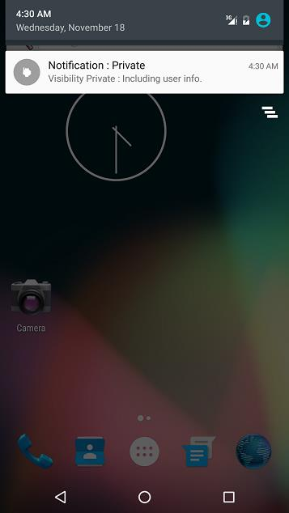
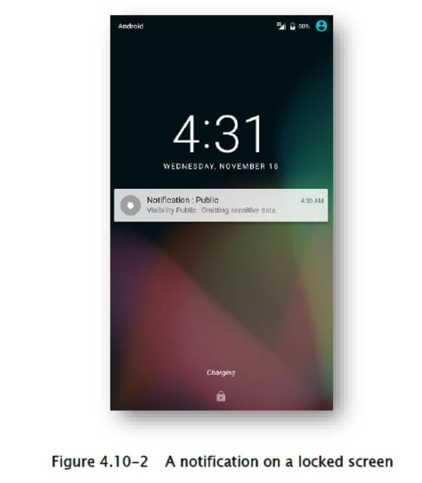
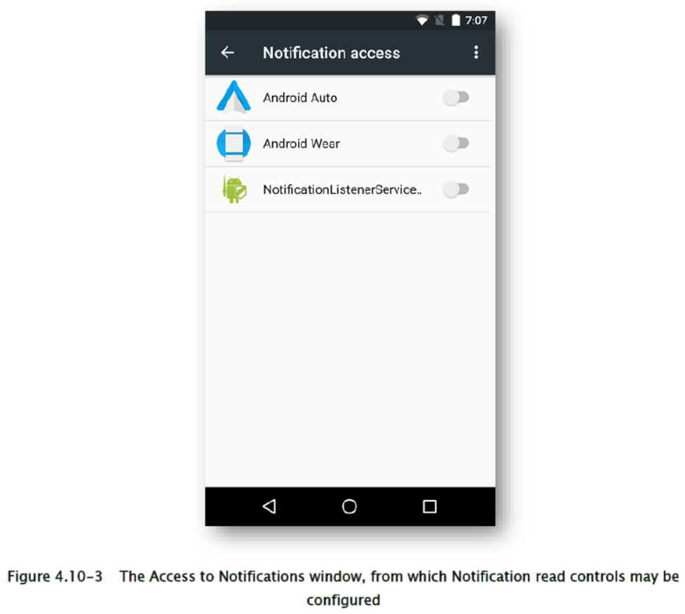

## 4.10 使用通知

Android 提供用于向最终用户发送消息的通知功能。 使用通知会使一个称为状态栏的区域出现在屏幕上，你可以在其中显示图标和消息。



在 Android 5.0（API Level 21）中增强了通知的通信功能，即使在屏幕锁定时也可以通过通知显示消息，具体取决于用户和应用设置。 但是，不正确地使用通知，会导致私人信息（只应向最终用户自己显示）可能会被第三方看到。 出于这个原因，必须谨慎地注意隐私和安全性来实现此功能。 

下表中总结了可见性选项的可能值和通知的相应行为。

| 可见性的值 | 通知行为 |
| --- | --- |
| 公共 | 通知会显示在所有锁定屏幕上 |
| 私有 | 通知显示在所有锁定的屏幕上；然而，在被密码保护的锁定屏幕上（安全锁），通知的标题和文本等字段是隐藏的（由公开可释放消息取代，私有信息是隐藏的） |
| 秘密 | 通知不会显示在受密码或其他安全措施（安全锁）保护的锁定屏幕上。 （通知显示在不涉及安全锁的锁定屏幕上。） |


### 4.10.1 示例代码

当通知包含有关最终用户的私人信息时，必须从中排除了私人信息，之后才能添加到锁定屏幕来显示。



下面展示了示例代码，说明了如何正确将通知用于包含私人数据的消息。

要点：

1) 将通知用于包含私人数据的消息，请准备适合公开显示的通知版本（屏幕锁定时显示）。

2) 不要在公开显示的通知中包含隐私信息（屏幕锁定时显示）。

3) 创建通知时将可见性显示设置为私有。

4) 当可见性设置为私有时，通知可能包含私人信息。

VisibilityPrivateNotificationActivity.java

```java
package org.jssec.notification.visibilityPrivate;

import android.app.Activity;
import android.app.Notification;
import android.app.NotificationManager;
import android.content.Context;
import android.os.Build;
import android.os.Bundle;
import android.view.View;

public class VisibilityPrivateNotificationActivity extends Activity {

    /**
    * Display a private Notification
    */
    private final int mNotificationId = 0;
    @Override
    public void onCreate(Bundle savedInstanceState) {
        super.onCreate(savedInstanceState);
        setContentView(R.layout.activity_main);
    }
    
    public void onSendNotificationClick(View view) {
        // *** POINT 1 *** When preparing a Notification that includes private information, prepare an additional Noficiation for public display (displayed when the screen is locked).
        Notification.Builder publicNotificationBuilder = new Notification.Builder(this).setContentTitle("Notif
        ication : Public");
        if (Build.VERSION.SDK_INT >= 21)
            publicNotificationBuilder.setVisibility(Notification.VISIBILITY_PUBLIC);
        // *** POINT 2 *** Do not include private information in Notifications prepared for public display (displayed when the screen is locked).
        publicNotificationBuilder.setContentText("Visibility Public : Omitting sensitive data.");
        publicNotificationBuilder.setSmallIcon(R.drawable.ic_launcher);
        Notification publicNotification = publicNotificationBuilder.build();
        // Construct a Notification that includes private information.
        Notification.Builder privateNotificationBuilder = new Notification.Builder(this).setContentTitle("Notification : Private");
        // *** POINT 3 *** Explicitly set Visibility to Private when creating Notifications.
        if (Build.VERSION.SDK_INT >= 21)
            privateNotificationBuilder.setVisibility(Notification.VISIBILITY_PRIVATE);

        // *** POINT 4 *** When Visibility is set to Private, Notifications may contain private information.
        privateNotificationBuilder.setContentText("Visibility Private : Including user info.");
        privateNotificationBuilder.setSmallIcon(R.drawable.ic_launcher);
        // When creating a Notification with Visibility=Private, we also create and register a separate
        Notification with Visibility=Public for public display.
        if (Build.VERSION.SDK_INT >= 21)
            privateNotificationBuilder.setPublicVersion(publicNotification);
        Notification privateNotification = privateNotificationBuilder.build();
        //Although not implemented in this sample code, in many cases
        //Notifications will use setContentIntent(PendingIntent intent)
        //to ensure that an Intent is transmission when Notification
        //is clicked. In this case, it is necessary to take steps--depending
        //on the type of component being called--to ensure that the Intent
        //in question is called by safe methods (for example, by explicitly
        //using Intent). For information on safe methods for calling various
        //types of component, see the following sections.
        //4.1. Creating and using Activities
        //4.2. Sending and receiving Broadcasts
        //4.4. Creating and using Services
        NotificationManager notificationManager = (NotificationManager) this.getSystemService(Context.NOTIFICATION_SERVICE);
        notificationManager.notify(mNotificationId, privateNotification);
    }
}
```

### 4.10.2 规则书

创建通知时，应该遵循下列规则：

#### 4.10.2.1 无论可见性设置如何，通知都不得包含敏感信息（尽管私有信息是例外情况）（必需）

在使用 Android 4.3（API 级别 18）或更高版本的终端上，用户可以使用“设置”窗口，授予应用读取通知的权限。 获得此权限的应用将能够读取通知中的所有信息；因此，通知中不得包含敏感信息。 （但是，根据“可见性”设置，通知中可能会包含私有信息）。

通知中包含的信息通常不会被发送通知的应用以外的应用读取。 但是，用户可以明确将权限授予某些用户选择的应用，来读取通知中的所有信息。 因为只有用户已授予权限的应用才能读取通知中的信息，所以在通知中包含用户的私有信息没有任何问题。 另一方面，如果在通知中包括除了用户的私有信息之外的敏感信息（例如，仅由应用开发者知道的秘密信息），则用户自己可以尝试读取通知中包含的信息，并且可以授予应用权限来查看这些信息；因此包含私有用户信息以外的敏感信息是有问题的。

特定方法和条件请见“4.10.3.1 用户授予的查看通知的权限”。

#### 4.10.2.2 可见性为公共的通知，不能包含私有信息（必需）

在发送可见性为公共的通知时，私有用户信息不得包含在通知中。 当通知的可见性为公开时，即使屏幕被锁定，通知中的信息也会显示。 这是因为这种通知存在风险，私密信息可能被第三方物理邻近的终端看到和窃取。

VisibilityPrivateNotificationActivity.java

```java
// Prepare a Notification for public display (to be displayed on locked screens) that does not contain sensitive information
Notification.Builder publicNotificationBuilder = new Notification.Builder(this).setContentTitle("Notification : Public");
publicNotificationBuilder.setVisibility(Notification.VISIBILITY_PUBLIC);
// Do not include private information in Notifications for public display (to be displayed on locked screens)
publicNotificationBuilder.setContentText("Visibility Public: sending notification without sensitive information ");
publicNotificationBuilder.setSmallIcon(R.drawable.ic_launcher);
```

#### 4.10.2.3 对于包含私有信息的通知，可见性必须显式设置为私有或秘密（必需）

即使屏幕锁定，使用 Android 5.0（API Level 21）或更高版本的终端也会显示通知。 因此，当通知包含私有信息时，其可见性标志应显式设置为私有或秘密。 这是为了防止通知中包含的私有信息显示在锁定屏幕上。 

目前，可见性的默认值被设置为私有，所以前述风险只有在该标志显式变为公共时才会出现。 但是，可见性的默认值可能会在未来发生变化; 出于这个原因，并且为了在处理信息时始终清楚地表达意图，必须对包含私有信息的通知，将可见性显式设置为私有。

VisibilityPrivateNotificationActivity.java

```java
// Create a Notification that includes private information
Notification.Builder priavteNotificationBuilder = new Notification.Builder(this).setContentTitle("Notification : Private");
// *** POINT *** Explicitly set Visibility=Private when creating the Notification
priavteNotificationBuilder.setVisibility(Notification.VISIBILITY_PRIVATE);
```

私有信息的典型示例包括发送给用户的电子邮件，用户的位置数据，以及“5.5 处理隐私数据”部分列出的其他项目。

在使用 Android 4.3（API 级别 18）或更高版本的终端上，用户可以使用“设置”窗口，授予应用读取通知的权限，授予此权限的应用将能够读取通知中的所有信息；因此，除私有用户信息以外的敏感信息不得包含在通知中。

#### 4.10.2.4 使用可见性为私有的通知，创建可见性为公共的额外通知用于展示（推荐）

当传递可见性为私有的信息时，最好同时创建一个额外的通知，用于公开展示，它的可见性为公开；这是为了限制锁定屏幕上显示的信息。 

如果公开显示的通知未与可见性为私有的通知一起注册，则在屏幕锁定时将显示由操作系统准备的默认消息。 因此在这种情况下没有安全问题。 但是，为了在处理信息时始终清晰地表达意图，建议显示创建并注册公开显示的通知。

VisibilityPrivateNotificationActivity.java

```java
// Create a Notification that contains private information
Notification.Builder privateNotificationBuilder = new Notification.Builder(this).setContentTitle("Notification : Private");
// *** POINT *** Explicitly set Visibility=Private when creating the Notification
if (Build.VERSION.SDK_INT >= 21)
    privateNotificationBuilder.setVisibility(Notification.VISIBILITY_PUBLIC);
// *** POINT *** Notifications with Visibility=Private may include private information
privateNotificationBuilder.setContentText("Visibility Private : Including user info.");
privateNotificationBuilder.setSmallIcon(R.drawable.ic_launcher);
// When creating a Notification with Visibility=Private, simultaneously create and register a public-display Notification with Visibility=Public
if (Build.VERSION.SDK_INT >= 21)
    privateNotificationBuilder.setPublicVersion(publicNotification);
```

### 4.10.3 高级话题

#### 4.10.3 用户授予的查看通知的权限

如上面“4.10.2.1  无论可见性设置如何，通知不得包含敏感信息（尽管私人信息是例外）”所述，在使用 Android 4.3（API Level 18）或更高版本的终端上，某些用户选择的应用，已被授予用户权限，可能会读取所有通知中的信息。 

但是，为了使应用有资格获得此用户权限，应用必须实现从`NotificationListenerService`派生的服务。



下面的代码展示了`NotificationListenerService`的用法。

AndroidManifest.xml

```xml
<manifest xmlns:android="http://schemas.android.com/apk/res/android"
    package="org.jssec.notification.notificationListenerService">
    <application
        android:allowBackup="false"
        android:icon="@drawable/ic_launcher"
        android:label="@string/app_name" >
        <service android:name=".MyNotificationListenerService"
        android:label="@string/app_name"
        android:permission="android.permission.BIND_NOTIFICATION_LISTENER_SERVICE">
            <intent-filter>
                <action android:name=
                "android.service.notification.NotificationListenerService" />
            </intent-filter>
        </service>
    </application>
</manifest>
```

MyNotificationListenerService.java

```java
package org.jssec.notification.notificationListenerService;

import android.app.Notification;
import android.service.notification.NotificationListenerService;
import android.service.notification.StatusBarNotification;
import android.util.Log;

public class MyNotificationListenerService extends NotificationListenerService {

    @Override
    public void onNotificationPosted(StatusBarNotification sbn) {
        // Notification is posted.
        outputNotificationData(sbn, "Notification Posted : ");
    }
    
    @Override
    public void onNotificationRemoved(StatusBarNotification sbn) {
        // Notification is deleted.
        outputNotificationData(sbn, "Notification Deleted : ");
    }
    
    private void outputNotificationData(StatusBarNotification sbn, String prefix) {
        Notification notification = sbn.getNotification();
        int notificationID = sbn.getId();
        String packageName = sbn.getPackageName();
        long PostTime = sbn.getPostTime();
        String message = prefix + "Visibility :" + notification.visibility + " ID : " + notificationID;
        message += " Package : " + packageName + " PostTime : " + PostTime;
        Log.d("NotificationListen", message);
    }
}
```

如上所述，通过使用`NotificationListenerService`获取用户权限，可以读取通知。 但是，由于通知中终端上包含的信息经常包含私有信息，因此在处理此类信息时需要小心。

