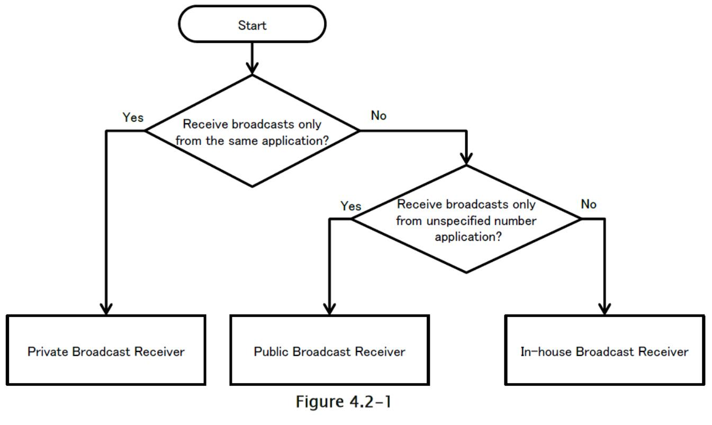
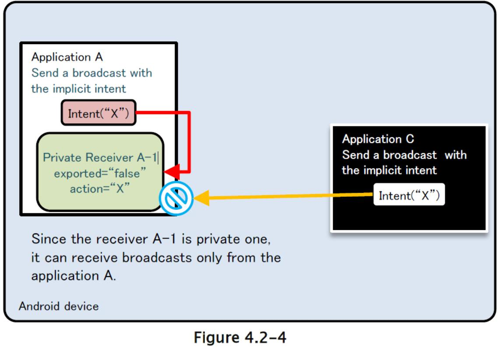

## 4.2 接收/发送广播

### 4.2.1 示例代码

接收广播需要创建广播接收器。 使用广播接收器的风险和对策，根据收到的广播的类型而有所不同。 你可以在以下判断流程中找到你的广播接收器。 接收应用无法检查发送广播的应用的包名称，它是链接伙伴所需的。 因此，无法创建用于伙伴的广播接收器。

表 4.2：广播接收器的类型定义：

| 类型 | 定义 |
| --- | --- |
| 私有 | 只能接收来自相同应用的广播的广播接收器，所以是最安全的 |
| 公共 | 可以接收来自未指定的大量应用的广播的广播接收器 |
| 内部 | 只能接收来自其他内部应用的广播的广播接收器 |



另外，根据定义方法，广播接收器可以分为两类：静态和动态。 它们之间的差异可以在下图中找到。 示例代码展示了每类的实现方法。 还描述了发送应用的实现方法，因为发送信息的对策取决于接收器来确定。

表 4.2-2

| | 定义方法 | 特性 |
| --- | --- | --- |
| 静态 | 由`AndroidManifest.xml`中的`<receiver>`元素定义 | 1）存在一些限制，不能收到一些由系统发送的广播，如`ACTION_BATTERY_CHANGED`。2）从应用最初启动开始，卸载之前，可以收到广播。 |
| 动态 | 通过在程序中调用`registerReceiver()`和`unregisterReceiver()`，动态注册和注销广播接收器 | 1）可以收到静态广播接收器收不到的广播。2）广播的接收时期可以由程序控制，例如，只有活动在前台时，可以接收广播。3）不能创建私有广播接收器。 |

#### 4.2.1.1 私有广播接收器

私人广播接收器是最安全的广播接收器，因为只能接收到从应用内发送的广播。 动态广播接收器不能注册为私有，所以私有广播接收器只包含静态广播接收器。

要点（接收广播）：

1) 将导出属性显示设为`false`

2) 小心并安全地处理收到的意图，即使意图从相同的应用中发送

3) 敏感信息可以作为返回结果发送，因为请求来自相同应用

AndroidManifest.xml

```xml
<?xml version="1.0" encoding="utf-8"?>
<manifest xmlns:android="http://schemas.android.com/apk/res/android"
    package="org.jssec.android.broadcast.privatereceiver" >
    
    <application
        android:icon="@drawable/ic_launcher"
        android:label="@string/app_name"
        android:allowBackup="false" >
        <!-- Private Broadcast Receiver -->
        <!-- *** POINT 1 *** Explicitly set the exported attribute to false. -->
        <receiver
        android:name=".PrivateReceiver"
        android:exported="false" />
        
        <activity
            android:name=".PrivateSenderActivity"
            android:label="@string/app_name"
            android:exported="true" >
            <intent-filter>
                <action android:name="android.intent.action.MAIN" />
                <category android:name="android.intent.category.LAUNCHER" />
            </intent-filter>
        </activity>
    </application>
</manifest>
```

PrivateReceiver.java

```java
package org.jssec.android.broadcast.privatereceiver;

import android.app.Activity;
import android.content.BroadcastReceiver;
import android.content.Context;
import android.content.Intent;
import android.widget.Toast;

public class PrivateReceiver extends BroadcastReceiver {

    @Override
    public void onReceive(Context context, Intent intent) {
        // *** POINT 2 *** Handle the received intent carefully and securely,
        // even though the intent was sent from within the same application.
        // Omitted, since this is a sample. Please refer to "3.2 Handling Input Data Carefully and Securely."
        String param = intent.getStringExtra("PARAM");
        Toast.makeText(context,
        String.format("Received param: ¥"%s¥"", param),
        Toast.LENGTH_SHORT).show();
        // *** POINT 3 *** Sensitive information can be sent as the returned results since the requests come from within the same application.
        setResultCode(Activity.RESULT_OK);
        setResultData("Sensitive Info from Receiver");
        abortBroadcast();
    }
}
```

向私有广播接收器发送广播的代码展示在下面：

要点（发送广播）：

4) 使用带有指定类的显式意图，来调用相同应用中的接收器。

5) 敏感信息可以发送，因为目标接收器在相同应用中。

6) 小心并安全地处理收到的返回结果，即使数据来自相同应用中的接收器。

PrivateSenderActivity.java

```java
package org.jssec.android.broadcast.privatereceiver;

import android.app.Activity;
import android.content.BroadcastReceiver;
import android.content.Context;
import android.content.Intent;
import android.os.Bundle;
import android.view.View;
import android.widget.TextView;

public class PrivateSenderActivity extends Activity {

    public void onSendNormalClick(View view) {
        // *** POINT 4 *** Use the explicit Intent with class specified to call a receiver within the same application.
        Intent intent = new Intent(this, PrivateReceiver.class);
        // *** POINT 5 *** Sensitive information can be sent since the destination Receiver is within the same application.
        intent.putExtra("PARAM", "Sensitive Info from Sender");
        sendBroadcast(intent);
    }

    public void onSendOrderedClick(View view) {
        // *** POINT 4 *** Use the explicit Intent with class specified to call a receiver within the same application.
        Intent intent = new Intent(this, PrivateReceiver.class);
        // *** POINT 5 *** Sensitive information can be sent since the destination Receiver is within the same application.
        intent.putExtra("PARAM", "Sensitive Info from Sender");
        sendOrderedBroadcast(intent, null, mResultReceiver, null, 0, null, null);
    }
    
    private BroadcastReceiver mResultReceiver = new BroadcastReceiver() {
        @Override
        public void onReceive(Context context, Intent intent) {
            // *** POINT 6 *** Handle the received result data carefully and securely,
            // even though the data came from the Receiver within the same application.
            // Omitted, since this is a sample. Please refer to "3.2 Handling Input Data Carefully and Securely."
            String data = getResultData();
            PrivateSenderActivity.this.logLine(
                String.format("Received result: ¥"%s¥"", data));
        }
    };
    
    private TextView mLogView;
    @Override
    public void onCreate(Bundle savedInstanceState) {
        super.onCreate(savedInstanceState);
        setContentView(R.layout.main);
        mLogView = (TextView)findViewById(R.id.logview);
    }
    
    private void logLine(String line) {
        mLogView.append(line);
        mLogView.append("¥n");
    }
}
```

#### 4.2.1.2 公共广播接收器

公共广播接收器是可以从未指定的大量应用程序接收广播的广播接收器，因此有必要注意，它可能从恶意软件接收广播。

要点（接收广播）：

1) 将导出属性显式设为`true`。

2) 小心并安全地处理收到的意图。

3) 返回结果时，不要包含敏感信息。

公共广播接收器的示例代码可以用于静态和动态广播接收器。

PublicReceiver.java

```java
package org.jssec.android.broadcast.publicreceiver;

import android.app.Activity;
import android.content.BroadcastReceiver;
import android.content.Context;
import android.content.Intent;
import android.widget.Toast;

public class PublicReceiver extends BroadcastReceiver {

    private static final String MY_BROADCAST_PUBLIC =
    "org.jssec.android.broadcast.MY_BROADCAST_PUBLIC";
    public boolean isDynamic = false;

    private String getName() {
        return isDynamic ? "Public Dynamic Broadcast Receiver" : "Public Static Broadcast Receiver";
    }

    @Override
    public void onReceive(Context context, Intent intent) {
        // *** POINT 2 *** Handle the received Intent carefully and securely.
        // Since this is a public broadcast receiver, the requesting application may be malware.
        // Omitted, since this is a sample. Please refer to "3.2 Handling Input Data Carefully and Securely."
        if (MY_BROADCAST_PUBLIC.equals(intent.getAction())) {
            String param = intent.getStringExtra("PARAM");
            Toast.makeText(context,
            String.format("%s:¥nReceived param: ¥"%s¥"", getName(), param),
            Toast.LENGTH_SHORT).show();
        }
        // *** POINT 3 *** When returning a result, do not include sensitive information.
        // Since this is a public broadcast receiver, the requesting application may be malware.
        // If no problem when the information is taken by malware, it can be returned as result.
        setResultCode(Activity.RESULT_OK);
        setResultData(String.format("Not Sensitive Info from %s", getName()));
        abortBroadcast();
    }
}
```

静态广播接收器定义在`AndroidManifest.xml`中：

AndroidManifest.xml

```xml
<?xml version="1.0" encoding="utf-8"?>
<manifest xmlns:android="http://schemas.android.com/apk/res/android"
package="org.jssec.android.broadcast.publicreceiver" >
    <application
        android:icon="@drawable/ic_launcher"
        android:label="@string/app_name"
        android:allowBackup="false" >
        
        <!-- Public Static Broadcast Receiver -->
        <!-- *** POINT 1 *** Explicitly set the exported attribute to true. -->
        <receiver
            android:name=".PublicReceiver"
            android:exported="true" >
            <intent-filter>
            <action android:name="org.jssec.android.broadcast.MY_BROADCAST_PUBLIC" />
            </intent-filter>
        </receiver>
        
        <service
            android:name=".DynamicReceiverService"
            android:exported="false" />
        
        <activity
            android:name=".PublicReceiverActivity"
            android:label="@string/app_name"
            android:exported="true" >
            <intent-filter>
                <action android:name="android.intent.action.MAIN" />
                <category android:name="android.intent.category.LAUNCHER" />
            </intent-filter>
        </activity>
    </application>
</manifest>
```

在动态广播接收器中，通过调用程序中的`registerReceiver()`或`unregisterReceiver()`来执行注册/注销。 为了通过按钮操作执行注册/注销，该按钮`PublicReceiverActivity`中定义。 由于动态广播接收器实例的作用域比`PublicReceiverActivity`长，因此不能将其保存为`PublicReceiverActivity`的成员变量。 在这种情况下，请将动态广播接收器实例保存为`DynamicReceiverService`的成员变量，然后从`PublicReceiverActivity`启动/结束`DynamicReceiverService`，来间接注册/注销动态广播接收器。

DynamicReceiverService.java

```java
package org.jssec.android.broadcast.publicreceiver;

import android.app.Service;
import android.content.Intent;
import android.content.IntentFilter;
import android.os.IBinder;
import android.widget.Toast;

public class DynamicReceiverService extends Service {

    private static final String MY_BROADCAST_PUBLIC =
    "org.jssec.android.broadcast.MY_BROADCAST_PUBLIC";
    private PublicReceiver mReceiver;
    
    @Override
    public IBinder onBind(Intent intent) {
        return null;
    }
    
    @Override
    public void onCreate() {
        super.onCreate();
        // Register Public Dynamic Broadcast Receiver.
        mReceiver = new PublicReceiver();
        mReceiver.isDynamic = true;
        IntentFilter filter = new IntentFilter();
        filter.addAction(MY_BROADCAST_PUBLIC);
        filter.setPriority(1); // Prioritize Dynamic Broadcast Receiver, rather than Static Broadcast Receiver.
        registerReceiver(mReceiver, filter);
        Toast.makeText(this,
            "Registered Dynamic Broadcast Receiver.",
        Toast.LENGTH_SHORT).show();
    }
    
    @Override
    public void onDestroy() {
        super.onDestroy();
        // Unregister Public Dynamic Broadcast Receiver.
        unregisterReceiver(mReceiver);
        mReceiver = null;
        Toast.makeText(this,
        "Unregistered Dynamic Broadcast Receiver.",
        Toast.LENGTH_SHORT).show();
    }
}
```

PublicReceiverActivity.java

```java
package org.jssec.android.broadcast.publicreceiver;

import android.app.Activity;
import android.content.Intent;
import android.os.Bundle;
import android.view.View;

public class PublicReceiverActivity extends Activity {

    @Override
    protected void onCreate(Bundle savedInstanceState) {
        super.onCreate(savedInstanceState);
        setContentView(R.layout.main);
    }

    public void onRegisterReceiverClick(View view) {
        Intent intent = new Intent(this, DynamicReceiverService.class);
        startService(intent);
    }
    
    public void onUnregisterReceiverClick(View view) {
        Intent intent = new Intent(this, DynamicReceiverService.class);
        stopService(intent);
    }
}
```

接下来，展示了将广播发送到公共广播接收器的示例代码。 当向公共广播接收器发送广播时，需要注意广播可以被恶意软件接收。

要点（发送广播）：

4) 不要发送敏感信息

5) 接受广播时，小心并安全地处理结果数据

PublicSenderActivity.java

```java
package org.jssec.android.broadcast.publicsender;

import android.app.Activity;
import android.content.BroadcastReceiver;
import android.content.Context;
import android.content.Intent;
import android.os.Bundle;
import android.view.View;
import android.widget.TextView;

public class PublicSenderActivity extends Activity {

    private static final String MY_BROADCAST_PUBLIC =
    "org.jssec.android.broadcast.MY_BROADCAST_PUBLIC";

    public void onSendNormalClick(View view) {
        // *** POINT 4 *** Do not send sensitive information.
        Intent intent = new Intent(MY_BROADCAST_PUBLIC);
        intent.putExtra("PARAM", "Not Sensitive Info from Sender");
        sendBroadcast(intent);
    }

    public void onSendOrderedClick(View view) {
        // *** POINT 4 *** Do not send sensitive information.
        Intent intent = new Intent(MY_BROADCAST_PUBLIC);
        intent.putExtra("PARAM", "Not Sensitive Info from Sender");
        sendOrderedBroadcast(intent, null, mResultReceiver, null, 0, null, null);
    }
    
    public void onSendStickyClick(View view) {
        // *** POINT 4 *** Do not send sensitive information.
        Intent intent = new Intent(MY_BROADCAST_PUBLIC);
        intent.putExtra("PARAM", "Not Sensitive Info from Sender");
        //sendStickyBroadcast is deprecated at API Level 21
        sendStickyBroadcast(intent);
    }
    
    public void onSendStickyOrderedClick(View view) {
        // *** POINT 4 *** Do not send sensitive information.
        Intent intent = new Intent(MY_BROADCAST_PUBLIC);
        intent.putExtra("PARAM", "Not Sensitive Info from Sender");
        //sendStickyOrderedBroadcast is deprecated at API Level 21
        sendStickyOrderedBroadcast(intent, mResultReceiver, null, 0, null, null);
    }
    
    public void onRemoveStickyClick(View view) {
        Intent intent = new Intent(MY_BROADCAST_PUBLIC);
        //removeStickyBroadcast is deprecated at API Level 21
        removeStickyBroadcast(intent);
    }
    
    private BroadcastReceiver mResultReceiver = new BroadcastReceiver() {
    
        @Override
        public void onReceive(Context context, Intent intent) {
            // *** POINT 5 *** When receiving a result, handle the result data carefully and securely.
            // Omitted, since this is a sample. Please refer to "3.2 Handling Input Data Carefully and Securely."
            String data = getResultData();
            PublicSenderActivity.this.logLine(
                String.format("Received result: ¥"%s¥"", data));
        }
    };
    
    private TextView mLogView;
    @Override
    public void onCreate(Bundle savedInstanceState) {
        super.onCreate(savedInstanceState);
        setContentView(R.layout.main);
        mLogView = (TextView)findViewById(R.id.logview);
    }
    
    private void logLine(String line) {
        mLogView.append(line);
        mLogView.append("¥n");
    }
}
```

#### 4.2.1.3 内部广播接收器

内部广播接收器是广播接收器，它将永远不会收到从内部应用以外发送的任何广播。 它由几个内部应用组成，用于保护内部应用处理的信息或功能。

要点（接收广播）：

1) 定义内部签名权限来接收广播。

2) 声明使用内部签名权限来接收结果。

3) 将导出属性显式设置为`true`。

4) 需要静态广播接收器定义的内部签名权限。

5) 需要内部签名来注册动态广播接收器。

6) 确认内部签名权限是由内部应用定义的。

7) 尽管广播是从内部应用发送的，但要小心并安全地处理接收到的意图。

8) 由于请求应用是内部的，因此可以返回敏感信息。

9) 导出 APK 时，使用与发送应用相同的开发人员密钥对 APK 进行签名。

内部广播接收器的示例代码可用于静态和动态广播接收器。

InhouseReceiver.java


```java
package org.jssec.android.broadcast.inhousereceiver;

import org.jssec.android.shared.SigPerm;
import org.jssec.android.shared.Utils;
import android.app.Activity;
import android.content.BroadcastReceiver;
import android.content.Context;
import android.content.Intent;
import android.widget.Toast;

public class InhouseReceiver extends BroadcastReceiver {

    // In-house Signature Permission
    private static final String MY_PERMISSION = "org.jssec.android.broadcast.inhousereceiver.MY_PERMISSION";
    // In-house certificate hash value
    private static String sMyCertHash = null;
    
    private static String myCertHash(Context context) {
        if (sMyCertHash == null) {
            if (Utils.isDebuggable(context)) {
                // Certificate hash value of "androiddebugkey" in the debug.keystore.
                sMyCertHash = "0EFB7236 328348A9 89718BAD DF57F544 D5CCB4AE B9DB34BC 1E29DD26 F77C8255";
            } else {
                // Certificate hash value of "my company key" in the keystore.
                sMyCertHash = "D397D343 A5CBC10F 4EDDEB7C A10062DE 5690984F 1FB9E88B D7B3A7C2 42E142CA";
            }
        }
        return sMyCertHash;
    }
    
    private static final String MY_BROADCAST_INHOUSE =
    "org.jssec.android.broadcast.MY_BROADCAST_INHOUSE";
    public boolean isDynamic = false;
    
    private String getName() {
        return isDynamic ? "In-house Dynamic Broadcast Receiver" : "In-house Static Broadcast Receiver";
    }
    
    @Override
    public void onReceive(Context context, Intent intent) {
        // *** POINT 6 *** Verify that the in-house signature permission is defined by an in-house application.
        if (!SigPerm.test(context, MY_PERMISSION, myCertHash(context))) {
            Toast.makeText(context, "The in-house signature permission is not declared by in-house application.",
            Toast.LENGTH_LONG).show();
            return;
        }
        // *** POINT 7 *** Handle the received intent carefully and securely,
        // even though the Broadcast was sent from an in-house application..
        // Omitted, since this is a sample. Please refer to "3.2 Handling Input Data Carefully and Securely."
        if (MY_BROADCAST_INHOUSE.equals(intent.getAction())) {
            String param = intent.getStringExtra("PARAM");
            Toast.makeText(context,
            String.format("%s:¥nReceived param: ¥"%s¥"", getName(), param),
            Toast.LENGTH_SHORT).show();
        }
        // *** POINT 8 *** Sensitive information can be returned since the requesting application is inhouse.
        setResultCode(Activity.RESULT_OK);
        setResultData(String.format("Sensitive Info from %s", getName()));
        abortBroadcast();
    }
}
```

静态广播接收器定义在`AndroidManifest.xml`中。

AndroidManifest.xml

```xml
<?xml version="1.0" encoding="utf-8"?>
<manifest xmlns:android="http://schemas.android.com/apk/res/android"
    package="org.jssec.android.broadcast.inhousereceiver" >
    
    <!-- *** POINT 1 *** Define an in-house signature permission to receive Broadcasts -->
    <permission
    android:name="org.jssec.android.broadcast.inhousereceiver.MY_PERMISSION"
    android:protectionLevel="signature" />
    <!-- *** POINT 2 *** Declare to use the in-house signature permission to receive results. -->
    <uses-permission
    android:name="org.jssec.android.broadcast.inhousesender.MY_PERMISSION" />
    
    <application
        android:icon="@drawable/ic_launcher"
        android:label="@string/app_name"
        android:allowBackup="false" >
        
        <!-- *** POINT 3 *** Explicitly set the exported attribute to true. -->
        <!-- *** POINT 4 *** Require the in-house signature permission by the Static Broadcast Receiver
        definition. -->
        <receiver
            android:name=".InhouseReceiver"
            android:permission="org.jssec.android.broadcast.inhousereceiver.MY_PERMISSION"
            android:exported="true">
            <intent-filter>
                <action android:name="org.jssec.android.broadcast.MY_BROADCAST_INHOUSE" />
                </intent-filter>
        </receiver>
        
        <service
        android:name=".DynamicReceiverService"
        android:exported="false" />
        
        <activity
            android:name=".InhouseReceiverActivity"
            android:label="@string/app_name"
            android:exported="true" >
            <intent-filter>
                <action android:name="android.intent.action.MAIN" />
                <category android:name="android.intent.category.LAUNCHER" />
            </intent-filter>
        </activity>
    </application>
</manifest>
```

在动态广播接收器中，通过调用程序中的`registerReceiver()`或`unregisterReceiver()`来执行注册/注销。 为了通过按钮操作执行注册/注销，该按钮`PublicReceiverActivity`中定义。 由于动态广播接收器实例的作用域比`PublicReceiverActivity`长，因此不能将其保存为`PublicReceiverActivity`的成员变量。 在这种情况下，请将动态广播接收器实例保存为`DynamicReceiverService`的成员变量，然后从`PublicReceiverActivity`启动/结束`DynamicReceiverService`，来间接注册/注销动态广播接收器。


InhouseReceiverActivity.java

```java
package org.jssec.android.broadcast.inhousereceiver;

import android.app.Activity;
import android.content.Intent;
import android.os.Bundle;
import android.view.View;

public class InhouseReceiverActivity extends Activity {

    @Override
    public void onCreate(Bundle savedInstanceState) {
        super.onCreate(savedInstanceState);
        setContentView(R.layout.main);
    }
    
    public void onRegisterReceiverClick(View view) {
        Intent intent = new Intent(this, DynamicReceiverService.class);
        startService(intent);
    }
    
    public void onUnregisterReceiverClick(View view) {
        Intent intent = new Intent(this, DynamicReceiverService.class);
        stopService(intent);
    }
}
```

DynamicReceiverService.java

```java
package org.jssec.android.broadcast.inhousereceiver;

import android.app.Service;
import android.content.Intent;
import android.content.IntentFilter;
import android.os.IBinder;
import android.widget.Toast;

public class DynamicReceiverService extends Service {

    private static final String MY_BROADCAST_INHOUSE =
    "org.jssec.android.broadcast.MY_BROADCAST_INHOUSE";
    private InhouseReceiver mReceiver;
    
    @Override
    public IBinder onBind(Intent intent) {
        return null;
    }
    
    @Override
    public void onCreate() {
        super.onCreate();
        mReceiver = new InhouseReceiver();
        mReceiver.isDynamic = true;
        IntentFilter filter = new IntentFilter();
        filter.addAction(MY_BROADCAST_INHOUSE);
        filter.setPriority(1); // Prioritize Dynamic Broadcast Receiver, rather than Static Broadcast Receiver.
        // *** POINT 5 *** When registering a dynamic broadcast receiver, require the in-house signature permission.
        registerReceiver(mReceiver, filter, "org.jssec.android.broadcast.inhousereceiver.MY_PERMISSION", null);
        Toast.makeText(this,
            "Registered Dynamic Broadcast Receiver.",
            Toast.LENGTH_SHORT).show();
    }
    
    @Override
    public void onDestroy() {
        super.onDestroy();

        unregisterReceiver(mReceiver);
        mReceiver = null;
        Toast.makeText(this,
            "Unregistered Dynamic Broadcast Receiver.",
        Toast.LENGTH_SHORT).show();
    }
}
```

SigPerm.java

```java
package org.jssec.android.shared;

import android.content.Context;
import android.content.pm.PackageManager;
import android.content.pm.PackageManager.NameNotFoundException;
import android.content.pm.PermissionInfo;

public class SigPerm {
    
    public static boolean test(Context ctx, String sigPermName, String correctHash) {
        if (correctHash == null) return false;
        correctHash = correctHash.replaceAll(" ", "");
        return correctHash.equals(hash(ctx, sigPermName));
    }
    
    public static String hash(Context ctx, String sigPermName) {
        if (sigPermName == null) return null;
        try {
            // Get the package name of the application which declares a permission named sigPermName.
            PackageManager pm = ctx.getPackageManager();
            PermissionInfo pi;
            pi = pm.getPermissionInfo(sigPermName, PackageManager.GET_META_DATA);
            String pkgname = pi.packageName;
            // Fail if the permission named sigPermName is not a Signature Permission
            if (pi.protectionLevel != PermissionInfo.PROTECTION_SIGNATURE) return null;
            // Return the certificate hash value of the application which declares a permission named sigPermName.
            return PkgCert.hash(ctx, pkgname);
        } catch (NameNotFoundException e) {
            return null;
        }
    }
}
```

PkgCert.java

```java
package org.jssec.android.shared;

import java.security.MessageDigest;
import java.security.NoSuchAlgorithmException;
import android.content.Context;
import android.content.pm.PackageInfo;
import android.content.pm.PackageManager;
import android.content.pm.PackageManager.NameNotFoundException;
import android.content.pm.Signature;

public class PkgCert {

    public static boolean test(Context ctx, String pkgname, String correctHash) {
        if (correctHash == null) return false;
        correctHash = correctHash.replaceAll(" ", "");
        return correctHash.equals(hash(ctx, pkgname));
    }
    
    public static String hash(Context ctx, String pkgname) {
        if (pkgname == null) return null;
        try {
            PackageManager pm = ctx.getPackageManager();
            PackageInfo pkginfo = pm.getPackageInfo(pkgname, PackageManager.GET_SIGNATURES);
            if (pkginfo.signatures.length != 1) return null; // Will not handle multiple signatures.
            Signature sig = pkginfo.signatures[0];
            byte[] cert = sig.toByteArray();
            byte[] sha256 = computeSha256(cert);
            return byte2hex(sha256);
        } catch (NameNotFoundException e) {
            return null;
        }
    }
    
    private static byte[] computeSha256(byte[] data) {
        try {
            return MessageDigest.getInstance("SHA-256").digest(data);
        } catch (NoSuchAlgorithmException e) {
            return null;
        }
    }
    
    private static String byte2hex(byte[] data) {
        if (data == null) return null;
        final StringBuilder hexadecimal = new StringBuilder();
        for (final byte b : data) {
            hexadecimal.append(String.format("%02X", b));
        }
        return hexadecimal.toString();
    }
}
```

导出 APK 时，使用与发送应用相同的开发人员密钥对 APK 进行签名。


下面，展示了用于向内部广播接收器发送广播的示例代码。

要点（发送广播）：

10) 定义内部签名权限来接收结果。

11) 声明使用内部签名权限来接收广播。

12) 确认内部签名权限是由内部应用定义的。

13) 由于请求应用是内部应用，因此可以返回敏感信息。

14) 需要接收器的内部签名权限。

15) 小心并安全地处理收到的结果数据。

16) 导出 APK 时，请使用与目标应用相同的开发人员密钥对 APK 进行签名。

AndroidManifest.xml

```xml
<?xml version="1.0" encoding="utf-8"?>
<manifest xmlns:android="http://schemas.android.com/apk/res/android"
    package="org.jssec.android.broadcast.inhousesender" >
    
    <uses-permission android:name="android.permission.BROADCAST_STICKY"/>
    
    <!-- *** POINT 10 *** Define an in-house signature permission to receive results. -->
    <permission
    android:name="org.jssec.android.broadcast.inhousesender.MY_PERMISSION"
    android:protectionLevel="signature" />
    
    <!-- *** POINT 11 *** Declare to use the in-house signature permission to receive Broadcasts. -->
    <uses-permission
    android:name="org.jssec.android.broadcast.inhousereceiver.MY_PERMISSION" />
    
    <application
        android:icon="@drawable/ic_launcher"
        android:label="@string/app_name"
        android:allowBackup="false" >
        <activity
            android:name="org.jssec.android.broadcast.inhousesender.InhouseSenderActivity"
            android:label="@string/app_name"
            android:exported="true" >
            <intent-filter>
                <action android:name="android.intent.action.MAIN" />
                <category android:name="android.intent.category.LAUNCHER" />
            </intent-filter>
        </activity>
    </application>
</manifest>
```

InhouseSenderActivity.java

```java
package org.jssec.android.broadcast.inhousesender;

import org.jssec.android.shared.SigPerm;
import org.jssec.android.shared.Utils;
import android.app.Activity;
import android.content.BroadcastReceiver;
import android.content.Context;
import android.content.Intent;
import android.os.Bundle;
import android.view.View;
import android.widget.TextView;
import android.widget.Toast;

public class InhouseSenderActivity extends Activity {

    // In-house Signature Permission
    private static final String MY_PERMISSION = "org.jssec.android.broadcast.inhousesender.MY_PERMISSION";
    // In-house certificate hash value
    private static String sMyCertHash = null;
    
    private static String myCertHash(Context context) {
        if (sMyCertHash == null) {
            if (Utils.isDebuggable(context)) {
                // Certificate hash value of "androiddebugkey" in the debug.keystore.
                sMyCertHash = "0EFB7236 328348A9 89718BAD DF57F544 D5CCB4AE B9DB34BC 1E29DD26 F77C8255";
            } else {
                // Certificate hash value of "my company key" in the keystore.
                sMyCertHash = "D397D343 A5CBC10F 4EDDEB7C A10062DE 5690984F 1FB9E88B D7B3A7C2 42E142CA";
            }
        }
        return sMyCertHash;
    }

    private static final String MY_BROADCAST_INHOUSE =
    "org.jssec.android.broadcast.MY_BROADCAST_INHOUSE";
    
    public void onSendNormalClick(View view) {
        // *** POINT 12 *** Verify that the in-house signature permission is defined by an in-house application.
        if (!SigPerm.test(this, MY_PERMISSION, myCertHash(this))) {
            Toast.makeText(this, "The in-house signature permission is not declared by in-house application.",
            Toast.LENGTH_LONG).show();
            return;
        }
        // *** POINT 13 *** Sensitive information can be returned since the requesting application is in-house.
        Intent intent = new Intent(MY_BROADCAST_INHOUSE);
        intent.putExtra("PARAM", "Sensitive Info from Sender");
        // *** POINT 14 *** Require the in-house signature permission to limit receivers.
        sendBroadcast(intent, "org.jssec.android.broadcast.inhousesender.MY_PERMISSION");
    }
    
    public void onSendOrderedClick(View view) {
        // *** POINT 12 *** Verify that the in-house signature permission is defined by an in-house application.
        if (!SigPerm.test(this, MY_PERMISSION, myCertHash(this))) {
            Toast.makeText(this, "The in-house signature permission is not declared by in-house application.",
            Toast.LENGTH_LONG).show();
            return;
        }
        // *** POINT 13 *** Sensitive information can be returned since the requesting application is in-house.
        Intent intent = new Intent(MY_BROADCAST_INHOUSE);
        intent.putExtra("PARAM", "Sensitive Info from Sender");
        // *** POINT 14 *** Require the in-house signature permission to limit receivers.
        sendOrderedBroadcast(intent, "org.jssec.android.broadcast.inhousesender.MY_PERMISSION",
        mResultReceiver, null, 0, null, null);
    }
    
    private BroadcastReceiver mResultReceiver = new BroadcastReceiver() {
    
        @Override
        public void onReceive(Context context, Intent intent) {
            // *** POINT 15 *** Handle the received result data carefully and securely,
            // even though the data came from an in-house application.
            // Omitted, since this is a sample. Please refer to "3.2 Handling Input Data Carefully and Securely."
            String data = getResultData();
            InhouseSenderActivity.this.logLine(String.format("Received result: ¥"%s¥"", data));
        }
    };
    
    private TextView mLogView;
    
    @Override
    public void onCreate(Bundle savedInstanceState) {
        super.onCreate(savedInstanceState);
        setContentView(R.layout.main);
        mLogView = (TextView)findViewById(R.id.logview);
    }
    
    private void logLine(String line) {
        mLogView.append(line);
        mLogView.append("¥n");
    }
}
```

SigPerm.java

```java
package org.jssec.android.shared;

import android.content.Context;
import android.content.pm.PackageManager;
import android.content.pm.PackageManager.NameNotFoundException;
import android.content.pm.PermissionInfo;

public class SigPerm {

    public static boolean test(Context ctx, String sigPermName, String correctHash) {
        if (correctHash == null) return false;
        correctHash = correctHash.replaceAll(" ", "");
        return correctHash.equals(hash(ctx, sigPermName));
    }
    
    public static String hash(Context ctx, String sigPermName) {
        if (sigPermName == null) return null;
        try {
            // Get the package name of the application which declares a permission named sigPermName.
            PackageManager pm = ctx.getPackageManager();
            PermissionInfo pi;
            pi = pm.getPermissionInfo(sigPermName, PackageManager.GET_META_DATA);
            String pkgname = pi.packageName;
            // Fail if the permission named sigPermName is not a Signature Permission
            if (pi.protectionLevel != PermissionInfo.PROTECTION_SIGNATURE) return null;
            // Return the certificate hash value of the application which declares a permission named sigPermName.
            return PkgCert.hash(ctx, pkgname);
        } catch (NameNotFoundException e) {
            return null;
        }
    }
}
```

PkgCert.java

```java
package org.jssec.android.shared;

import java.security.MessageDigest;
import java.security.NoSuchAlgorithmException;
import android.content.Context;
import android.content.pm.PackageInfo;
import android.content.pm.PackageManager;
import android.content.pm.PackageManager.NameNotFoundException;
import android.content.pm.Signature;

public class PkgCert {

    public static boolean test(Context ctx, String pkgname, String correctHash) {
        if (correctHash == null) return false;
        correctHash = correctHash.replaceAll(" ", "");
        return correctHash.equals(hash(ctx, pkgname));
    }
    
    public static String hash(Context ctx, String pkgname) {
    if (pkgname == null) return null;
        try {
            PackageManager pm = ctx.getPackageManager();
            PackageInfo pkginfo = pm.getPackageInfo(pkgname, PackageManager.GET_SIGNATURES);
            if (pkginfo.signatures.length != 1) return null; // Will not handle multiple signatures.
            Signature sig = pkginfo.signatures[0];
            byte[] cert = sig.toByteArray();
            byte[] sha256 = computeSha256(cert);
            return byte2hex(sha256);
        } catch (NameNotFoundException e) {
            return null;
        }
    }
    
    private static byte[] computeSha256(byte[] data) {
        try {
            return MessageDigest.getInstance("SHA-256").digest(data);
        } catch (NoSuchAlgorithmException e) {
            return null;
        }
    }
    
    private static String byte2hex(byte[] data) {
        if (data == null) return null;
        final StringBuilder hexadecimal = new StringBuilder();
        for (final byte b : data) {
            hexadecimal.append(String.format("%02X", b));
        }
        return hexadecimal.toString();
    }
}
```

导出 APK 时，使用与发送应用相同的开发人员密钥对 APK 进行签名。


### 4.2.2 规则书

遵循下列规则来发送或接受广播。

#### 4.2.2.1 仅在应用中使用的广播接收器必须设置为私有（必需）

仅在应用中使用的广播接收器应该设置为私有，以避免意外地从其他应用接收任何广播。 它将防止应用功能滥用或异常行为。 

仅在同一应用内使用的接收器，不应设计为设置意图过滤器。 由于意图过滤器的特性，即使通过意图过滤器调用同一应用中的私有接收器，其他应用的公共私有也可能被意外调用。

AndroidManifest.xml（不推荐）

```xml
<!-- Private Broadcast Receiver -->
<!-- *** POINT 1 *** Set the exported attribute to false explicitly. -->
<receiver
    android:name=".PrivateReceiver"
    android:exported="false" >
    <intent-filter>
        <action android:name="org.jssec.android.broadcast.MY_ACTION" />
    </intent-filter>
</receiver>
```

请参阅“4.2.3.1 导出属性和意图过滤器设置的组合（对于接收器）”。

#### 4.2.2.2 小心和安全地处理收到的意图（必需）

虽然风险因广播接收器的类型而异，但处理接收到的意图数据时，首先应该验证意图的安全性。 由于公共广播接收器从未指定的大量应用接收意图，它可能会收到恶意软件的攻击意图。 私有广播接收器将永远不会直接从其他应用接收任何意图，但公共组件从其他应用接收的意图数据，可能会转发到私有广播接收器。 所以不要认为收到的意图在没有任何验证的情况下，是完全安全的。 内部广播接收机具有一定程度的风险，因此还需要验证接收意图的安全性。

请参考“3.2 小心和安全地处理输入数据”。

#### 4.2.2.3 验证签名权限是否由内部应用定义后，使用内部定义的签名权限（必需）

只接收内部应用发送的广播的内部广播接收器，应受内部定义的签名许可保护。 `AndroidManifest.xml`中的权限定义/权限请求声明不足以保护，因此请参阅“5.2.1.2 如何使用内部定义的签名权限在内部应用之间进行通信”。 通过对`receiverPermission`参数指定内部定义的签名权限来结束广播，需要相同的方式的验证。

#### 4.2.2.4 返回结果信息时，清注意来自目标应用的结果信息泄露（必需）

通过`setResult()`返回结果信息的应用的可靠性取决于广播接收器的类型。 对于公共广播接收器，目标应用可能是恶意软件，可能存在恶意使用结果信息的风险。 对于私有广播接收器和内部广播接收器，结果的目的地是内部开发的应用，因此无需介意结果信息的处理。 

如上所述，当从广播接收器返回结果信息时，需要注意从目标应用泄漏的结果信息。

#### 4.2.2.5 使用广播发送敏感信息时，限制能收到的接收器（必需）

广播是所创建的系统，用于向未指定的大量应用广播信息或一次通知其时间。 因此，广播敏感信息需要谨慎设计，以防止恶意软件非法获取信息。 对于广播敏感信息，只有可靠的广播接收器可以接收它，而其他广播接收器则不能。 以下是广播发送方法的一些示例。

+   方法是，通过使用显式意图，将广播仅仅发送给预期的可靠广播接收器，来固定地址。
    +   当它发送给同一个应用中的广播接收器时，通过`Intent#setClass(Context, Class)`指定地址。 具体代码，请参阅“4.2.1.1 私有广播接收器 - 接收/发送广播”的示例代码部分。
    +   当它发送到其他应用中的广播接收器时，通过`Intent#setClassName(String, String)`指定地址。 通过比较目标包中 APK 签名的开发人员密钥和白名单来发送广播，来确认允许的应用。 实际上下面的使用隐式意图的方法更实用。
+   方法是，通过将`receiverPermission`指定为内部定义的签名权限，并使可靠的广播接收器声明使用此签名权限，来发送广播。具体代码请参阅“4.2.1.3 内部广播接收器 - 接收/发送广播”的示例代码部分。 另外，实现这种广播发送方法，需要应用规则“4.2.2.3 在验证签名权限由内部应用定义之后，使用内部定义的签名权限”。

#### 4.2.2.6 粘性广播中禁止包含敏感信息（必需）

通常情况下，广播由可用的广播接收器接收后会消失。 另一方面，粘性广播（以下粘性广播包括粘性有序广播）即使由可用的广播接收器接收也不会从系统中消失，并且能够由`registerReceiver()`接收。 当粘性广播变得不必要时，可以随时用`removeStickyBroadcast()`任意删除它。

由于在预设情况下，粘性广播被隐式意图使用。 具有指定`receiverPermission`参数的广播无法发送。 出于这个原因，通过粘性广播发送的信息，可以被多个未指定的应用访问 - 包括恶意软件 - 因此敏感信息禁止以这种方式发送。 请注意，粘性广播在 Android 5.0（API Level 21）中已弃用。

#### 4.2.2.7 注意不指定`receiverPermission`的有序广播无法传递（必需）

不指定`receiverPermission`参数的有序广播，可以由未指定的大量应用接收，包括恶意软件。 有序广播用于接收来自接收器的返回信息，并使几个接收器逐一执行处理。 广播按优先顺序发送给接收器。 因此，如果高优先级恶意软件先接收广播并执行`abortBroadcast()`，则广播将不会传送到后面的接收器。

#### 4.2.2.8 小心并安全地处理来自广播接收器的返回的结果数据（必需）

基本上，考虑到接收结果可能是攻击数据，结果数据应该被安全地处理，尽管风险取决于返回结果数据的广播接收器的类型。

当发送方（源）广播接收器是公共广播接收器时，它从未指定的大量应用接收返回数据。 所以它也可能会收到恶意软件的攻击数据。 当发送方（源）广播接收器是私有广播接收者时，似乎没有风险。 然而，其他应用接收的数据可能会间接作为结果数据转发。 因此，如果没有任何验证，结果数据不应该被认为是安全的。 当发送方（源）广播接收器是内部广播接收器时，它具有一定程度的风险。 因此，考虑到结果数据可能是攻击数据，应该以安全的方式处理它。

请参考“3.2 小心和安全地处理输入数据”。

#### 4.2.2.9 提供二手素材时，素材应该以相同保护级别提供（必需）

当由权限保护的信息或功能素材被二次提供给其他应用时，有必要通过声明与目标应用相同的权限来维持保护标准。 在 Android 权限安全模型中，权限仅管理来自应用的受保护素材的直接访问。 由于这些特点，所得素材可能会被提供给其他应用，而无需声明保护所需的权限。 这实际上与重新授权相同，因为它被称为重新授权问题。 请参阅“5.2.3.4 重新授权问题”。

### 4.2.3 高级话题

#### 4.2.3.1 结合导出属性和意图过滤器设置（用于接收器）

表 4.2-3 展示了实现接收器时，导出设置和意图过滤器元素的允许的组合。 下面介绍为什么原则上禁止使用带有意图过滤器定义的`exported ="false"`。

表 4.2-3 可用与否，导出属性和意图过滤器元素的组合

| | 导出属性的值 | | |
| --- | --- | --- | --- |
| | True | False | 未指定 |
| 意图过滤器已定义 | OK | 不使用 | 不使用 |
| 意图过滤器未定义 | OK | OK | 不使用 |

未指定接收器的导出属性时，接收器是否为公共的，取决于该接收器的意图过滤器的存在与否 [6]。但是，在本手册中，禁止将导出的属性设置为不确定的。 通常，如前所述，最好避免依赖任何给定 API 的默认行为的实现；此外，如果存在明确的方法（如导出属性）来启用重要的安全相关设置，那么使用这些方法总是一个好主意。

> [6] 如果意图过滤器已定义，接收器是公共的，否则是私有的。更多信息请参考 <https://developer.android.com/guide/topics/manifest/receiver-element.html#exported>。

即使在相同的应用中将广播发送到私有接收器，其他应用中的公共接收器也可能会意外调用。 这就是为什么禁止指定带有意图过滤器定义的`exported ="false"`。 以下两张图展示了意外调用的发生情况。

图 4.2-4 是一个正常行为的例子，隐式意图只能在同一个应用中调用私有接收器（应用 A）。 意图过滤器（在图中，`action ="X"`）仅在应用 A 中定义，所以这是预期的行为。



图 4.2-5 是个例子，应用 B 和应用 A 中都定义了意图过滤器（见图中的`action ="X"`）的。首先，当另一个应用（应用 C）通过 隐式意图发送广播，它们不被私有接收器（A-1）接收。 所以不会有任何安全问题。 （请参阅图中的橙色箭头标记。）从安全角度来看，问题是应用 A 对同一应用中的私有接收器的调用。 当应用 A 广播隐式意图时，不仅是相同应用中的私有接收器，而且具有相同意图过滤器定义的公共接收器（B-1）也可以接收意图。 （图中的红色箭头标记）。 在这种情况下，敏感信息可能会从应用 A 发送到 B。当应用 B 是恶意软件时，会导致敏感信息的泄漏。 当发送有序广播时，它可能会收到意外的结果信息。

然而，当广播接收器仅接收由系统发送的广播意图时，应使用带有意图过滤器定义的`exported="false"`。 其他组合不应使用。 这是基于这样一个事实，即系统发送的广播意图可以通过`exported="false"`来接收。 如果其他应用发送的意图的`ACTION`与系统发送的广播意图相同，则可能会通过接收它而导致意外行为。 但是，这可以通过指定`exported="false"`来防止。

#### 4.2.3.2 接收器在启动应用之前不会被注册

请务必注意，在`AndroidManifest.xml`中定义的静态广播接收器，在安装后不会自动启用 [7]。应用只有在第一次启动后才能接收广播；因此，安装后无法使用接收的广播作为启动操作的触发器。 但是，如果在发送广播时设置了`Intent.FLAG_INCLUDE_STOPPED_PACKAGES`标志，则即使是尚未第一次启动的应用也会收到该广播。

> [7] 在 3.0 之前的版本中，接收器可以通过安装 App 自动启动。

#### 4.2.3.3 私有广播接收器可以接收由相同 UID 发送的广播
应用

相同的 UID 可以提供给几个应用。 即使它是私有广播接收器，也可以接收从 UID 相同的应用发送的广播。 但是，这不会是一个安全问题。 由于可以确保 UID 相同的应用具有用于签署 APK 的一致的开发人员密钥。 这意味着私有广播接收器收到的广播，只是从内部应用发送的广播。

#### 4.2.3.4 广播的类型和特性

根据是否有序以及是否粘滞的组合，广播有四种类型。 要发送的广播类型基于广播发送方法而确定。 请注意，粘性广播在 Android 5.0（API Level 21）中已弃用。

| 类型 | 发送方法 | 是否有序 | 是否粘性 |
| --- | --- | --- | --- |
| 普通 | `sendBroadcast()` | 否 | 否 |
| 有序 | `sendOrderedBroadcast()` | 是 | 否 |
| 粘性 | `sendStickyBroadcast()` | 否 | 是 |
| 粘性有序 | `sendStickyOrderedBroadcast()` | 是 | 是 |

每个广播类型的特性描述如下：

| 类型 | 特性 |
| --- | --- |
| 普通 | 普通广播发送到可接收的广播接收器时消失。 广播由多个广播接收器同时接收。 这与有序广播有所不同。 广播被允许由特定的广播接收机接收。 |
| 有序 | 有序广播的特点是，可接收的广播接收器依次接收广播。 优先级较高的广播接收器较早收到。 当广播被传送到所有广播接收器或广播接收器调用`abortBroadcast()`，广播将消失。 广播被允许由声明了特定权限的广播接收器接收。 另外，广播接收器发送的结果信息，可以由发送者使用有序广播接收。 SMS 接收通知的广播（`SMS_RECEIVED`）是有序广播的代表性示例。 |
| 粘性 | 粘性广播不会消失并保留在系统中，然后调用`registerReceiver()`的应用可以稍后接收粘性广播。 由于粘性广播与其他广播不同，它不会自动消失。 因此，当不需要粘性广播时，需要显式调用`removeStickyBroadcast()`来删除粘滞广播。 此外，带有特定权限的受限的广播接收器无法接收广播。 电池状态变化通知的广播（`ACTION_BATTERY_CHANGED`）是粘性广播的代表性示例。 |
| 粘性有序 | 这是具有有序和粘性特征的广播。 与粘性广播相同，它不能仅仅允许带有特定权限的广播接收器接收广播。 |

从广播特性行为的角度来看，上表反过来排列在下面的表中。

| 广播的特征行为 | 普通 | 有序 | 粘性 | 粘性有序 |
| --- | --- | --- | --- | --- |
| 由权限限制的广播接收器可以接收广播 | OK | OK | - | - |
| 从广播接收器获得过程结果 | - | OK | - | OK |
| 使广播接收器按顺序处理广播 | - | OK | - | OK |
| 稍后收到已经发送的广播 | - | - | OK | OK |

#### 4.2.3.5 广播信息可能输出到`LogCat`

发送/接收的广播基本上不会输出到`LogCat`。 然而，缺少权限导致接收/发送方的错误时，将输出错误日志。 由广播发送的意图信息包含在错误日志中，因此在发生错误之后，需要注意，发送广播时，意图的信息显示在`LogCat`中。

发送方的缺少权限的错误：

```
W/ActivityManager(266): Permission Denial: broadcasting Intent { act=org.jssec.android.broadcastreceive
r.creating.action.MY_ACTION } from org.jssec.android.broadcast.sending (pid=4685, uid=10058) requires o
rg.jssec.android.permission.MY_PERMISSION due to receiver org.jssec.android.broadcastreceiver.creating/
org.jssec.android.broadcastreceiver.creating.CreatingType3Receiver
```

接收方的缺少权限的错误：

```
W/ActivityManager(275): Permission Denial: receiving Intent { act=org.jssec.android.broadcastreceiver.c
reating.action.MY_ACTION } to org.jssec.android.broadcastreceiver.creating requires org.jssec.android.p
ermission.MY_PERMISSION due to sender org.jssec.android.broadcast.sending (uid 10158)
```

#### 4.2.3.6 在主屏幕放置应用的快捷方式时，需要注意的东西

在下面的内容中，我们讨论了创建快捷方式时的一些需要注意的东西，它们用于从主屏幕启动应用，或者用于创建 URL 快捷方式，例如 Web 浏览器中的书签。 作为一个例子，我们考虑如下所示的实现。

在主屏幕放置应用的快捷方式：

```java
Intent targetIntent = new Intent(this, TargetActivity.class);

// Intent to request shortcut creation

Intent intent = new Intent("com.android.launcher.action.INSTALL_SHORTCUT");
// Specify an Intent to be launched when the shortcut is tapped
intent.putExtra(Intent.EXTRA_SHORTCUT_INTENT, targetIntent);
Parcelable icon = Intent.ShortcutIconResource.fromContext(context, iconResource);
intent.putExtra(Intent.EXTRA_SHORTCUT_ICON_RESOURCE, icon);
intent.putExtra(Intent.EXTRA_SHORTCUT_NAME, title);
intent.putExtra("duplicate", false);

// Use Broadcast to send the system our request for shortcut creation
context.sendBroadcast(intent);
```

在由上面的代码片段发送的广播中，接收器是主屏幕应用，并且很难识别包名; 我们必须谨慎记住，这是一个向公共接收器传递的隐式意图。 因此，此片段发送的广播，可以被任何任意应用接收，包括恶意软件；因此，在意图中包含敏感信息可能会造成信息泄漏的风险。 特别重要的是要注意，在创建基于 URL 的快捷方式时，秘密信息可能包含在 URL 本身中。 

作为对策，有必要遵循“4.2.1.2 公共广播接收器 - 接收/发送广播”中列出的要点，并确保传输的意图不包含敏感信息。

