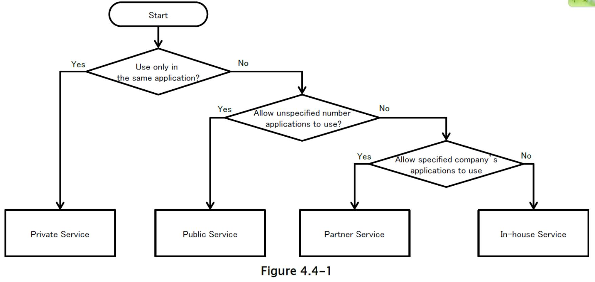
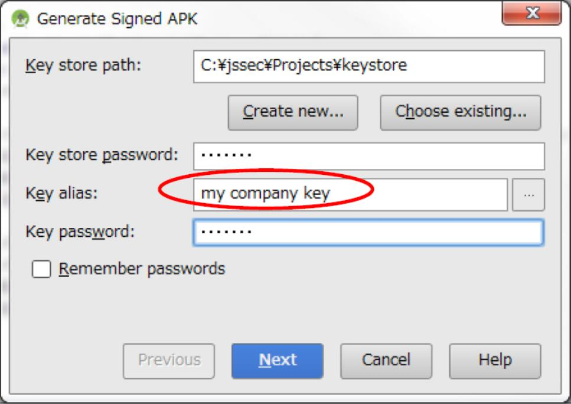
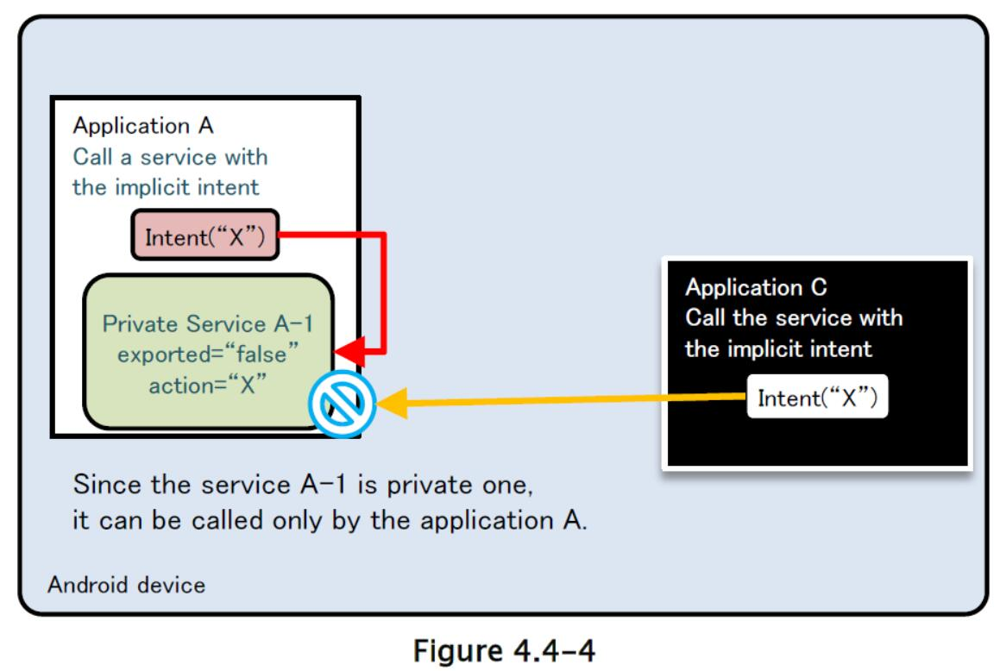
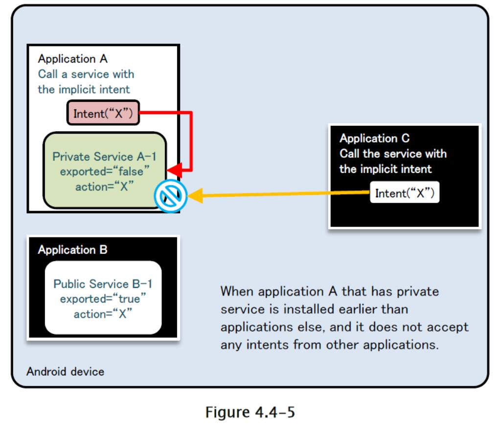
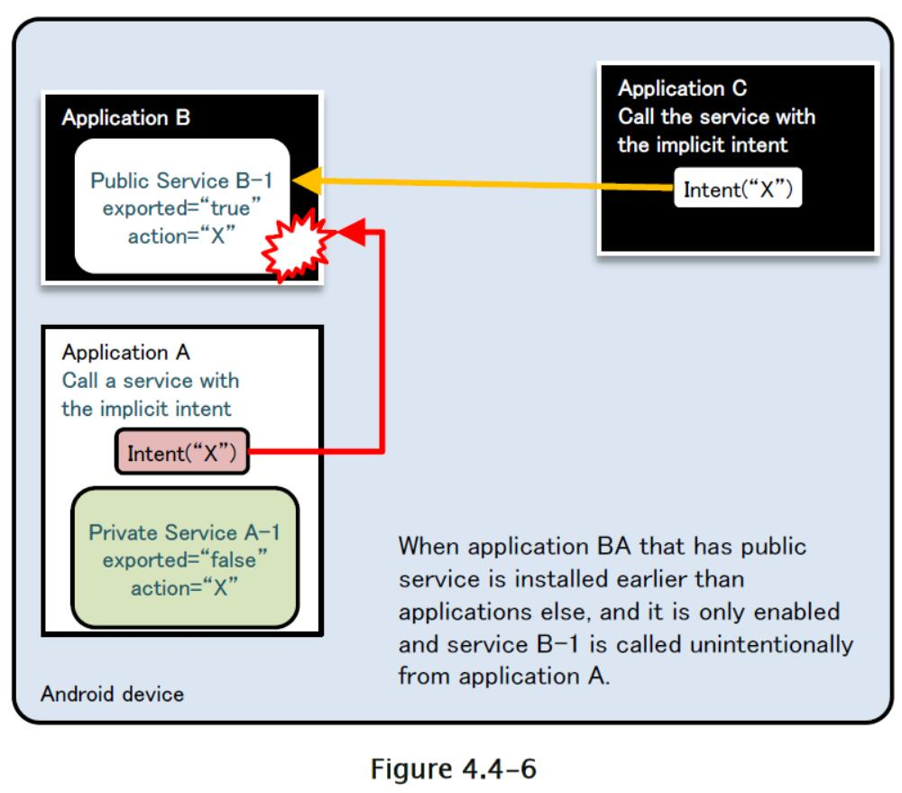

## 4.4 创建/使用服务

### 4.4.1 示例代码

使用服务的风险和对策取决于服务的使用方式。 您可以通过下面展示的图表找出您应该创建的服务类型。 由于安全编码的最佳实践，根据服务的创建方式而有所不同，因此我们也将解释服务的实现。

表 4.4-1 服务类型的定义

| 类型 | 定义 |
| --- | --- |
| 私有 | 不能由其他应用加载，所以是最安全的服务 |
| 公共 | 应该由很多未指定的应用使用的服务 |
| 伙伴 | 只能由可信的伙伴公司开发的应用使用的服务 |
| 内部 | 只能由其他内部应用使用的服务 |



有几种服务实现方法，您将选择匹配您想要创建的服务类型的方法。 表中列的条目展示了实现方法，并将它们分为 5 种类型。 “OK”表示可能的组合，其他表示不可能/困难的组合。 

服务的详细实现方法，请参阅“4.4.3.2 如何实现服务”和每个服务类型的示例代码（在表中带有`*`标记）。

表 4.4-2

| 类别 | 私有服务 | 公共服务 | 伙伴服务 | 内部服务 |
| --- | --- | --- | --- | --- |
| `startService`类型 | OK\* | OK | - | OK |
| `IntentService`类型 | OK | OK\* | - | OK |
| 本地绑定类型 | OK | - | - | - |
| `Messenger`绑定类型 | OK | OK | - | OK\* |
| AIDL 绑定类型 | OK | OK | OK\* | OK |

每种服务安全类型的示例代码展示在下面，通过表 4.4-2 中的使用`*`标记。

#### 4.4.1.1 创建/使用私有服务

私有服务是不能由其他应用启动的服务，因此它是最安全的服务。 当使用仅在应用中使用的私有服务时，只要您对该类使用显式意图，那么您就不必担心意外将它发送到任何其他应用。

下面展示了如何使用`startService`类型服务的示例代码。

要点（创建服务）：

1) 将导出属性显式设置为`false`。

2) 小心并安全地处理收到的意图，即使意图从相同应用发送。

3) 由于请求应用在同一应用中，所以可以发送敏感信息。

AndroidManifest.xml

```xml
<?xml version="1.0" encoding="utf-8"?>
<manifest xmlns:android="http://schemas.android.com/apk/res/android"
    package="org.jssec.android.service.privateservice" >
    <application
        android:icon="@drawable/ic_launcher"
        android:label="@string/app_name"
        android:allowBackup="false" >
        <activity
            android:name=".PrivateUserActivity"
            android:label="@string/app_name"
            android:exported="true" >
            <intent-filter>
                <action android:name="android.intent.action.MAIN" />
                <category android:name="android.intent.category.LAUNCHER" />
            </intent-filter>
        </activity>
        <!-- Private Service derived from Service class -->
        <!-- *** POINT 1 *** Explicitly set the exported attribute to false. -->
        <service android:name=".PrivateStartService" android:exported="false"/>
        <!-- Private Service derived from IntentService class -->
        <!-- *** POINT 1 *** Explicitly set the exported attribute to false. -->
        <service android:name=".PrivateIntentService" android:exported="false"/>
    </application>
</manifest>
```

PrivateStartService.java

```java
package org.jssec.android.service.privateservice;

import android.app.Service;
import android.content.Intent;
import android.os.IBinder;
import android.widget.Toast;

public class PrivateStartService extends Service {

    // The onCreate gets called only one time when the service starts.
    @Override
    public void onCreate() {
        Toast.makeText(this, "PrivateStartService - onCreate()", Toast.LENGTH_SHORT).show();
    }
    
    // The onStartCommand gets called each time after the startService gets called.
    @Override
    public int onStartCommand(Intent intent, int flags, int startId) {
        // *** POINT 2 *** Handle the received intent carefully and securely,
        // even though the intent was sent from the same application.
        // Omitted, since this is a sample. Please refer to "3.2 Handling Input Data Carefully and Securely."
        String param = intent.getStringExtra("PARAM");
        Toast.makeText(this,
        String.format("PrivateStartService¥nReceived param: ¥"%s¥"", param),
        Toast.LENGTH_LONG).show();
        return Service.START_NOT_STICKY;
    }
    
    // The onDestroy gets called only one time when the service stops.
    @Override
    public void onDestroy() {
        Toast.makeText(this, "PrivateStartService - onDestroy()", Toast.LENGTH_SHORT).show();
    }
    
    @Override
    public IBinder onBind(Intent intent) {
        // This service does not provide binding, so return null
        return null;
    }
}
```

下面是使用私有服务的活动代码：

要点（使用服务）：

4) 使用指定类的显式意图，调用同一应用程序的服务。

5) 由于目标服务位于同一应用中，因此可以发送敏感信息。

6) 即使数据来自同一应用中的服务，也要小心并安全地处理收到的结果数据。

PrivateUserActivity.java

```java
package org.jssec.android.service.privateservice;

import android.app.Activity;
import android.content.Intent;
import android.os.Bundle;
import android.view.View;

public class PrivateUserActivity extends Activity {

    @Override
    public void onCreate(Bundle savedInstanceState) {
        super.onCreate(savedInstanceState);
        setContentView(R.layout.privateservice_activity);
    }
    
    // --- StartService control ---
    public void onStartServiceClick(View v) {
        // *** POINT 4 *** Use the explicit intent with class specified to call a service in the same application.
        Intent intent = new Intent(this, PrivateStartService.class);
        // *** POINT 5 *** Sensitive information can be sent since the destination service is in the same application.
        intent.putExtra("PARAM", "Sensitive information");
        startService(intent);
    }
    
    public void onStopServiceClick(View v) {
        doStopService();
    }
    
    @Override
    public void onStop() {
        super.onStop();
        // Stop service if the service is running.
        doStopService();
    }
    
    private void doStopService() {
        // *** POINT 4 *** Use the explicit intent with class specified to call a service in the same application.
        Intent intent = new Intent(this, PrivateStartService.class);
        stopService(intent);
    }
    
    // --- IntentService control ---
    public void onIntentServiceClick(View v) {
        // *** POINT 4 *** Use the explicit intent with class specified to call a service in the same application.
        Intent intent = new Intent(this, PrivateIntentService.class);
        // *** POINT 5 *** Sensitive information can be sent since the destination service is in the same application.
        intent.putExtra("PARAM", "Sensitive information");
        startService(intent);
    }
}
```

#### 4.4.1.2 创建/使用公共服务

公共服务是应该由未指定的大量应用使用的服务。 有必要注意，它可能会收到恶意软件发送的信息（意图等）。 在使用公共服务的情况下，有必要注意，恶意软件可能会收到要发送的信息（意图等）。 

下面展示了如何使用`startService`类型服务的示例代码。

要点（创建服务）：

1) 将导出属性显式设置为`true`。

2) 小心并安全地处理接收到的意图。

3) 返回结果时，请勿包含敏感信息。

AndroidManifest.xml

```xml

<?xml version="1.0" encoding="utf-8"?>
<manifest xmlns:android="http://schemas.android.com/apk/res/android"
    package="org.jssec.android.service.publicservice" >
    <application
        android:icon="@drawable/ic_launcher"
        android:label="@string/app_name"
        android:allowBackup="false" >
        <!-- Most standard Service -->
        <!-- *** POINT 1 *** Explicitly set the exported attribute to true. -->
        <service android:name=".PublicStartService" android:exported="true">
            <intent-filter>
                <action android:name="org.jssec.android.service.publicservice.action.startservice" />
            </intent-filter>
        </service>
        <!-- Public Service derived from IntentService class -->
        <!-- *** POINT 1 *** Explicitly set the exported attribute to true. -->
        <service android:name=".PublicIntentService" android:exported="true">
            <intent-filter>
                <action android:name="org.jssec.android.service.publicservice.action.intentservice" />
            </intent-filter>
        </service>
    </application>
</manifest>
```

PublicIntentService.java

```java
package org.jssec.android.service.publicservice;

import android.app.IntentService;
import android.content.Intent;
import android.widget.Toast;

public class PublicIntentService extends IntentService{

    /**
    * Default constructor must be provided when a service extends IntentService class.
    * If it does not exist, an error occurs.
    */
    public PublicIntentService() {
        super("CreatingTypeBService");
    }
    
    // The onCreate gets called only one time when the Service starts.
    @Override
    public void onCreate() {
        super.onCreate();
        Toast.makeText(this, this.getClass().getSimpleName() + " - onCreate()", Toast.LENGTH_SHORT).show();
    }
    
    // The onHandleIntent gets called each time after the startService gets called.
    @Override
    protected void onHandleIntent(Intent intent) {
        // *** POINT 2 *** Handle intent carefully and securely.
        // Since it's public service, the intent may come from malicious application.
        // Omitted, since this is a sample. Please refer to "3.2 Handling Input Data Carefully and Securely."
        String param = intent.getStringExtra("PARAM");
        Toast.makeText(this, String.format("Recieved parameter ¥"%s¥"", param), Toast.LENGTH_LONG).show();
    }
    
    // The onDestroy gets called only one time when the service stops.
    @Override
    public void onDestroy() {
        Toast.makeText(this, this.getClass().getSimpleName() + " - onDestroy()", Toast.LENGTH_SHORT).show();
    }
}
```

下面是使用公共服务的活动代码：

要点（使用服务）：

4) 不要发送敏感信息。

5) 收到结果时，小心并安全地处理结果数据。

AndroidManifest.xml

```xml
<?xml version="1.0" encoding="utf-8"?>
<manifest xmlns:android="http://schemas.android.com/apk/res/android"
    package="org.jssec.android.service.publicserviceuser" >
    <application
        android:icon="@drawable/ic_launcher"
        android:label="@string/app_name"
        android:allowBackup="false" >
        <activity
            android:name=".PublicUserActivity"
            android:label="@string/app_name"
            android:exported="true">
            <intent-filter>
                <action android:name="android.intent.action.MAIN" />
                <category android:name="android.intent.category.LAUNCHER" />
            </intent-filter>
        </activity>
    </application>
</manifest>
```

PublicUserActivity.java

```java

package org.jssec.android.service.publicserviceuser;

import android.app.Activity;
import android.content.Intent;
import android.os.Bundle;
import android.view.View;

public class PublicUserActivity extends Activity {

    // Using Service Info
    private static final String TARGET_PACKAGE = "org.jssec.android.service.publicservice";
    private static final String TARGET_START_CLASS = "org.jssec.android.service.publicservice.PublicStartService";
    private static final String TARGET_INTENT_CLASS = "org.jssec.android.service.publicservice.PublicIntentService";
    
    @Override
    public void onCreate(Bundle savedInstanceState) {
        super.onCreate(savedInstanceState);
        setContentView(R.layout.publicservice_activity);
    }
    
    // --- StartService control ---
    public void onStartServiceClick(View v) {
        Intent intent = new Intent("org.jssec.android.service.publicservice.action.startservice");
        // *** POINT 4 *** Call service by Explicit Intent
        intent.setClassName(TARGET_PACKAGE, TARGET_START_CLASS);
        // *** POINT 5 *** Do not send sensitive information.
        intent.putExtra("PARAM", "Not sensitive information");
        startService(intent);
        // *** POINT 6 *** When receiving a result, handle the result data carefully and securely.
        // This sample code uses startService(), so receiving no result.
    }
    
    public void onStopServiceClick(View v) {
        doStopService();
    }
    
    // --- IntentService control ---
    public void onIntentServiceClick(View v) {
        Intent intent = new Intent("org.jssec.android.service.publicservice.action.intentservice");
        // *** POINT 4 *** Call service by Explicit Intent
        intent.setClassName(TARGET_PACKAGE, TARGET_INTENT_CLASS);
        // *** POINT 5 *** Do not send sensitive information.
        intent.putExtra("PARAM", "Not sensitive information");
        startService(intent);
    }
    
    @Override
    public void onStop(){
        super.onStop();
        // Stop service if the service is running.
        doStopService();
    }
    
    // Stop service
    private void doStopService() {
        Intent intent = new Intent("org.jssec.android.service.publicservice.action.startservice");
        // *** POINT 4 *** Call service by Explicit Intent
        intent.setClassName(TARGET_PACKAGE, TARGET_START_CLASS);
        stopService(intent);
    }
}
```

#### 4.4.1.3 创建/使用伙伴服务

伙伴服务是只能由特定应用使用的服务。 系统由伙伴公司的应用和内部应用组成，用于保护在伙伴应用和内部应用之间处理的信息和功能。

以下是 AIDL 绑定类型服务的示例。

要点（创建服务）：

1) 不要定义意图过滤器，并将导出属性显式设置为`true`。

2) 验证请求应用的证书是否已在自己的白名单中注册。

3) 请勿（无法）通过`onBind(onStartCommand, onHandleIntent)`识别请求应用是否为伙伴。

4) 小心并安全地处理接收到的意图，即使意图是从伙伴应用发送的。

5) 仅返回公开给伙伴应用的信息。

另外，请参阅“5.2.1.3 如何验证应用证书的哈希值”，来了解如何验证目标应用的哈希值，它在白名单中指定。

AndroidManifest.xml

```xml
<?xml version="1.0" encoding="utf-8"?>
<manifest xmlns:android="http://schemas.android.com/apk/res/android"
    package="org.jssec.android.service.partnerservice.aidl" >
    <application
        android:icon="@drawable/ic_launcher"
        android:label="@string/app_name"
        android:allowBackup="false" >
        <!-- Service using AIDL -->
        <!-- *** POINT 1 *** Do not define the intent filter and explicitly set the exported attribute to
        true. -->
        <service
        android:name="org.jssec.android.service.partnerservice.aidl.PartnerAIDLService"
        android:exported="true" />
    </application>
</manifest>
```

在这个例子中，将创建 2 个 AIDL 文件。 一个是回调接口，将数据从服务提供给活动。 另一个接口将数据从活动提供给服务，并获取信息。 另外，AIDL 文件中描述的包名称，应与 AIDL 文件的目录层次一致，与`java`文件中描述的包名称相同。

IExclusiveAIDLServiceCallback.aidl

```java
package org.jssec.android.service.exclusiveservice.aidl;

interface IExclusiveAIDLServiceCallback {
    
    /**
    * It's called when the value is changed.
    */
    void valueChanged(String info);
}
```

IExclusiveAIDLService.aidl

```java
package org.jssec.android.service.exclusiveservice.aidl;

import org.jssec.android.service.exclusiveservice.aidl.IExclusiveAIDLServiceCallback;

interface IExclusiveAIDLService {
    
    /**
    * Register Callback.
    */
    void registerCallback(IExclusiveAIDLServiceCallback cb);
    
    /**
    * Get Information
    */
    String getInfo(String param);
    
    /**
    * Unregister Callback
    */
    void unregisterCallback(IExclusiveAIDLServiceCallback cb);
}
```

PartnerAIDLService.java

```java
package org.jssec.android.service.partnerservice.aidl;

import org.jssec.android.shared.PkgCertWhitelists;
import org.jssec.android.shared.Utils;
import android.app.Service;
import android.content.Context;
import android.content.Intent;
import android.os.Handler;
import android.os.IBinder;
import android.os.Message;
import android.os.RemoteCallbackList;
import android.os.RemoteException;
import android.widget.Toast;

public class PartnerAIDLService extends Service {

    private static final int REPORT_MSG = 1;
    private static final int GETINFO_MSG = 2;
    // The value which this service informs to client
    private int mValue = 0;
    // *** POINT 2 *** Verify that the certificate of the requesting application has been registered in the own white list.
    private static PkgCertWhitelists sWhitelists = null;
    
    private static void buildWhitelists(Context context) {
        boolean isdebug = Utils.isDebuggable(context);
        sWhitelists = new PkgCertWhitelists();
        // Register certificate hash value of partner application "org.jssec.android.service.partnerservice.aidluser"
        sWhitelists.add("org.jssec.android.service.partnerservice.aidluser", isdebug ?
        // Certificate hash value of debug.keystore "androiddebugkey"
            "0EFB7236 328348A9 89718BAD DF57F544 D5CCB4AE B9DB34BC 1E29DD26 F77C8255" :
            // Certificate hash value of keystore "partner key"
            "1F039BB5 7861C27A 3916C778 8E78CE00 690B3974 3EB8259F E2627B8D 4C0EC35A");
            // Register other partner applications in the same way
    }
    
    private static boolean checkPartner(Context context, String pkgname) {
        if (sWhitelists == null) buildWhitelists(context);
        return sWhitelists.test(context, pkgname);
    }
    
    // Object to register callback
    // Methods which RemoteCallbackList provides are thread-safe.
    private final RemoteCallbackList<IPartnerAIDLServiceCallback> mCallbacks =
        new RemoteCallbackList<IPartnerAIDLServiceCallback>();
    
    // Handler to send data when callback is called.
    private static class ServiceHandler extends Handler{
    private Context mContext;
    private RemoteCallbackList<IPartnerAIDLServiceCallback> mCallbacks;
    private int mValue = 0;
    
    public ServiceHandler(Context context, RemoteCallbackList<IPartnerAIDLServiceCallback> callback, int value){
        this.mContext = context;
        this.mCallbacks = callback;
        this.mValue = value;
    }
    
    @Override
    public void handleMessage(Message msg) {
        switch (msg.what) {
            case REPORT_MSG: {
                if(mCallbacks == null){
                    return;
                }
                // Start broadcast
                // To call back on to the registered clients, use beginBroadcast().
                // beginBroadcast() makes a copy of the currently registered callback list.
                final int N = mCallbacks.beginBroadcast();
                for (int i = 0; i < N; i++) {
                    IPartnerAIDLServiceCallback target = mCallbacks.getBroadcastItem(i);
                    try {
                        // *** POINT 5 *** Information that is granted to disclose to partner applications can be returned.
                        target.valueChanged("Information disclosed to partner application (callback from Service) No." + (++mValue));
                    } catch (RemoteException e) {
                        // Callbacks are managed by RemoteCallbackList, do not unregister callbacks here.
                        // RemoteCallbackList.kill() unregister all callbacks
                    }
                }
                // finishBroadcast() cleans up the state of a broadcast previously initiated by calling beginBroadcast().
                mCallbacks.finishBroadcast();
                // Repeat after 10 seconds
                sendEmptyMessageDelayed(REPORT_MSG, 10000);
                break;
            }
            case GETINFO_MSG: {
                if(mContext != null) {
                    Toast.makeText(mContext,
                        (String) msg.obj, Toast.LENGTH_LONG).show();
                }
                break;
            }
            default:
                super.handleMessage(msg);
                break;
        } // switch
    }
    
    protected final ServiceHandler mHandler = new ServiceHandler(this, mCallbacks, mValue);
    
    // Interfaces defined in AIDL
    private final IPartnerAIDLService.Stub mBinder = new IPartnerAIDLService.Stub() {
        private boolean checkPartner() {
            Context ctx = PartnerAIDLService.this;
            if (!PartnerAIDLService.checkPartner(ctx, Utils.getPackageNameFromUid(ctx, getCallingUid()))) {
                mHandler.post(new Runnable(){
                    @Override
                    public void run(){
                        Toast.makeText(PartnerAIDLService.this, "Requesting application is not partner application.", Toast.LENGTH_LONG).show();
                    }
                });
                return false;
            }
            return true;
        }
        
        public String getInfo(String param) {
            // *** POINT 2 *** Verify that the certificate of the requesting application has been registered in the own white list.
            if (!checkPartner()) {
                return null;
            }
            // *** POINT 4 *** Handle the received intent carefully and securely,
            // even though the intent was sent from a partner application
            // Omitted, since this is a sample. Please refer to "3.2 Handling Input Data Carefully and Securely."
            Message msg = new Message();
            msg.what = GETINFO_MSG;
            msg.obj = String.format("Method calling from partner application. Recieved ¥"%s¥"", param);
            PartnerAIDLService.this.mHandler.sendMessage(msg);
            // *** POINT 5 *** Return only information that is granted to be disclosed to a partner application.
            return "Information disclosed to partner application (method from Service)";
        }
        
        public void unregisterCallback(IPartnerAIDLServiceCallback cb) {
            // *** POINT 2 *** Verify that the certificate of the requesting application has been registered in the own white list.
            if (!checkPartner()) {
                return;
            }
            if (cb != null) mCallbacks.unregister(cb);
        }
    };
    
    @Override
    public IBinder onBind(Intent intent) {
        // *** POINT 3 *** Verify that the certificate of the requesting application has been registered in the own white list.
        // So requesting application must be validated in methods defined in AIDL every time.
        return mBinder;
    }
    
    @Override
    public void onCreate() {
        Toast.makeText(this, this.getClass().getSimpleName() + " - onCreate()", Toast.LENGTH_SHORT).show();
        // During service is running, inform the incremented number periodically.
        mHandler.sendEmptyMessage(REPORT_MSG);
    }
    
    @Override
    public void onDestroy() {
        Toast.makeText(this, this.getClass().getSimpleName() + " - onDestroy()", Toast.LENGTH_SHORT).show();
        // Unregister all callbacks
        mCallbacks.kill();
        mHandler.removeMessages(REPORT_MSG);
    }
}
```

PkgCertWhitelists.java

```java
package org.jssec.android.shared;

import java.util.HashMap;
import java.util.Map;
import android.content.Context;

public class PkgCertWhitelists {

    private Map<String, String> mWhitelists = new HashMap<String, String>();

    public boolean add(String pkgname, String sha256) {
        if (pkgname == null) return false;
        if (sha256 == null) return false;
        sha256 = sha256.replaceAll(" ", "");
        if (sha256.length() != 64) return false; // SHA-256 -> 32 bytes -> 64 chars
        sha256 = sha256.toUpperCase();
        if (sha256.replaceAll("[0-9A-F]+", "").length() != 0) return false; // found non hex char
        mWhitelists.put(pkgname, sha256);
        return true;
    }
    
    public boolean test(Context ctx, String pkgname) {
        // Get the correct hash value which corresponds to pkgname.
        String correctHash = mWhitelists.get(pkgname);
        // Compare the actual hash value of pkgname with the correct hash value.
        return PkgCert.test(ctx, pkgname, correctHash);
    }
}
```

PkgCert.java

```java
package org.jssec.android.shared;

import java.security.MessageDigest;
import java.security.NoSuchAlgorithmException;
import android.content.Context;
import android.content.pm.PackageInfo;
import android.content.pm.PackageManager;
import android.content.pm.PackageManager.NameNotFoundException;
import android.content.pm.Signature;

public class PkgCert {

    public static boolean test(Context ctx, String pkgname, String correctHash) {
        if (correctHash == null) return false;
        correctHash = correctHash.replaceAll(" ", "");
        return correctHash.equals(hash(ctx, pkgname));
    }
    
    public static String hash(Context ctx, String pkgname) {
        if (pkgname == null) return null;
        try {
            PackageManager pm = ctx.getPackageManager();
            PackageInfo pkginfo = pm.getPackageInfo(pkgname, PackageManager.GET_SIGNATURES);
            if (pkginfo.signatures.length != 1) return null; // Will not handle multiple signatures.
            Signature sig = pkginfo.signatures[0];
            byte[] cert = sig.toByteArray();
            byte[] sha256 = computeSha256(cert);
            return byte2hex(sha256);
        } catch (NameNotFoundException e) {
            return null;
        }
    }

    private static byte[] computeSha256(byte[] data) {
        try {
            return MessageDigest.getInstance("SHA-256").digest(data);
        } catch (NoSuchAlgorithmException e) {
            return null;
        }
    }
    
    private static String byte2hex(byte[] data) {
        if (data == null) return null;
        final StringBuilder hexadecimal = new StringBuilder();
        for (final byte b : data) {
            hexadecimal.append(String.format("%02X", b));
        }
        return hexadecimal.toString();
    }
}
```

下面是使用伙伴服务的活动代码：

要点（使用服务）：

6) 验证目标应用的证书是否已在自己的白名单中注册。

7) 仅返回公开给伙伴应用的信息。

8) 使用显式意图调用伙伴服务。

9) 即使数据来自伙伴应用，也要小心并安全地处理收到的结果数据。

ExclusiveAIDLUserActivity.java

```java
package org.jssec.android.service.partnerservice.aidluser;

import org.jssec.android.service.partnerservice.aidl.IPartnerAIDLService;
import org.jssec.android.service.partnerservice.aidl.IPartnerAIDLServiceCallback;
import org.jssec.android.shared.PkgCertWhitelists;
import org.jssec.android.shared.Utils;
import android.app.Activity;
import android.content.ComponentName;
import android.content.Context;
import android.content.Intent;
import android.content.ServiceConnection;
import android.os.Bundle;
import android.os.Handler;
import android.os.IBinder;
import android.os.Message;
import android.os.RemoteException;
import android.view.View;
import android.widget.Toast;

public class PartnerAIDLUserActivity extends Activity {
    
    private boolean mIsBound;
    private Context mContext;
    private final static int MGS_VALUE_CHANGED = 1;
    // *** POINT 6 *** Verify if the certificate of the target application has been registered in the own white list.
    private static PkgCertWhitelists sWhitelists = null;
    
    private static void buildWhitelists(Context context) {
        boolean isdebug = Utils.isDebuggable(context);
        sWhitelists = new PkgCertWhitelists();
        // Register certificate hash value of partner service application "org.jssec.android.service.partnerservice.aidl"
        sWhitelists.add("org.jssec.android.service.partnerservice.aidl", isdebug ?
            // Certificate hash value of debug.keystore "androiddebugkey"
            "0EFB7236 328348A9 89718BAD DF57F544 D5CCB4AE B9DB34BC 1E29DD26 F77C8255" :
            // Certificate hash value of keystore "my company key"
            "D397D343 A5CBC10F 4EDDEB7C A10062DE 5690984F 1FB9E88B D7B3A7C2 42E142CA");
            // Register other partner service applications in the same way
    }
    
    private static boolean checkPartner(Context context, String pkgname) {
        if (sWhitelists == null) buildWhitelists(context);
        return sWhitelists.test(context, pkgname);
    }
    
    // Information about destination (requested) partner activity.
    private static final String TARGET_PACKAGE = "org.jssec.android.service.partnerservice.aidl";
    private static final String TARGET_CLASS = "org.jssec.android.service.partnerservice.aidl.PartnerAIDLService";
    
    private static class ReceiveHandler extends Handler{
        private Context mContext;
        public ReceiveHandler(Context context){
        this.mContext = context;
    }
    
    @Override
    public void handleMessage(Message msg) {
        switch (msg.what) {
            case MGS_VALUE_CHANGED: {
                String info = (String)msg.obj;
                Toast.makeText(mContext, String.format("Received ¥"%s¥" with callback.", info), Toast.LENGTH_SHORT).show();
                break;
            }
            default:
                super.handleMessage(msg);
                break;
        } // switch
    }
    
    private final ReceiveHandler mHandler = new ReceiveHandler(this);
    
    // Interfaces defined in AIDL. Receive notice from service
    private final IPartnerAIDLServiceCallback.Stub mCallback =
    new IPartnerAIDLServiceCallback.Stub() {
        @Override
        public void valueChanged(String info) throws RemoteException {
            Message msg = mHandler.obtainMessage(MGS_VALUE_CHANGED, info);
            mHandler.sendMessage(msg);
        }
    };

    // Interfaces defined in AIDL. Inform service.
    private IPartnerAIDLService mService = null;
    // Connection used to connect with service. This is necessary when service is implemented with bindService().
    private ServiceConnection mConnection = new ServiceConnection() {
        // This is called when the connection with the service has been established.
        @Override
        public void onServiceConnected(ComponentName className, IBinder service) {
            mService = IPartnerAIDLService.Stub.asInterface(service);
            try{
                // connect to service
                mService.registerCallback(mCallback);
            }catch(RemoteException e){
                // service stopped abnormally
            }
            Toast.makeText(mContext, "Connected to service", Toast.LENGTH_SHORT).show();
        }
        
        // This is called when the service stopped abnormally and connection is disconnected.
        @Override
        public void onServiceDisconnected(ComponentName className) {
            Toast.makeText(mContext, "Disconnected from service", Toast.LENGTH_SHORT).show();
        }
    };
    
    @Override
    public void onCreate(Bundle savedInstanceState) {
        super.onCreate(savedInstanceState);
        setContentView(R.layout.partnerservice_activity);
        mContext = this;
    }
    
    // --- StartService control ---
    public void onStartServiceClick(View v) {
        // Start bindService
        doBindService();
    }
    
    public void onGetInfoClick(View v) {
        getServiceinfo();
    }
    
    public void onStopServiceClick(View v) {
        doUnbindService();
    }
    
    @Override
    public void onDestroy() {
        super.onDestroy();
        doUnbindService();
    }
    
    /**
    * Connect to service
    */
    private void doBindService() {
        if (!mIsBound){
        // *** POINT 6 *** Verify if the certificate of the target application has been registered in the own white list.
        if (!checkPartner(this, TARGET_PACKAGE)) {
            Toast.makeText(this, "Destination(Requested) sevice application is not registered in white list.", Toast.LENGTH_LONG).show();
            return;
        }
        Intent intent = new Intent();
        // *** POINT 7 *** Return only information that is granted to be disclosed to a partner application.
        intent.putExtra("PARAM", "Information disclosed to partner application");
        // *** POINT 8 *** Use the explicit intent to call a partner service.
        intent.setClassName(TARGET_PACKAGE, TARGET_CLASS);
        bindService(intent, mConnection, Context.BIND_AUTO_CREATE);
        mIsBound = true;
        }
    }
    
    /**
    * Disconnect service
    */
    private void doUnbindService() {
        if (mIsBound) {
            // Unregister callbacks which have been registered.
            if(mService != null){
                try{
                    mService.unregisterCallback(mCallback);
                }catch(RemoteException e){
                    // Service stopped abnormally
                    // Omitted, since it' s sample.
                }
            }
            unbindService(mConnection);
            Intent intent = new Intent();
            // *** POINT 8 *** Use the explicit intent to call a partner service.
            intent.setClassName(TARGET_PACKAGE, TARGET_CLASS);
            stopService(intent);
            mIsBound = false;
        }
    }
    
    /**
    * Get information from service
    */
    void getServiceinfo() {
        if (mIsBound && mService != null) {
            String info = null;
            try {
                // *** POINT 7 *** Return only information that is granted to be disclosed to a partner application.
                info = mService.getInfo("Information disclosed to partner application (method from activity)");
            } catch (RemoteException e) {
                e.printStackTrace();
            }
            // *** POINT 9 *** Handle the received result data carefully and securely,
            // even though the data came from a partner application.
            // Omitted, since this is a sample. Please refer to "3.2 Handling Input Data Carefully and Securely."
            Toast.makeText(mContext, String.format("Received ¥"%s¥" from service.", info), Toast.LENGTH_SHORT).show();
        }
    }
}
```

PkgCertWhitelists.java

```java
package org.jssec.android.shared;

import java.util.HashMap;
import java.util.Map;
import android.content.Context;

public class PkgCertWhitelists {

    private Map<String, String> mWhitelists = new HashMap<String, String>();
    
    public boolean add(String pkgname, String sha256) {
        if (pkgname == null) return false;
        if (sha256 == null) return false;
        sha256 = sha256.replaceAll(" ", "");
        if (sha256.length() != 64) return false; // SHA-256 -> 32 bytes -> 64 chars
        sha256 = sha256.toUpperCase();
        if (sha256.replaceAll("[0-9A-F]+", "").length() != 0) return false; // found non hex char
        mWhitelists.put(pkgname, sha256);
        return true;
    }
    
    public boolean test(Context ctx, String pkgname) {
        // Get the correct hash value which corresponds to pkgname.
        String correctHash = mWhitelists.get(pkgname);
        // Compare the actual hash value of pkgname with the correct hash value.
        return PkgCert.test(ctx, pkgname, correctHash);
    }
}
```

PkgCert.java

```java
package org.jssec.android.shared;

import java.security.MessageDigest;
import java.security.NoSuchAlgorithmException;
import android.content.Context;
import android.content.pm.PackageInfo;
import android.content.pm.PackageManager;
import android.content.pm.PackageManager.NameNotFoundException;
import android.content.pm.Signature;

public class PkgCert {

    public static boolean test(Context ctx, String pkgname, String correctHash) {
        if (correctHash == null) return false;
        correctHash = correctHash.replaceAll(" ", "");
        return correctHash.equals(hash(ctx, pkgname));
    }
    
    public static String hash(Context ctx, String pkgname) {
        if (pkgname == null) return null;
        try {
            PackageManager pm = ctx.getPackageManager();
            PackageInfo pkginfo = pm.getPackageInfo(pkgname, PackageManager.GET_SIGNATURES);
            if (pkginfo.signatures.length != 1) return null; // Will not handle multiple signatures.
            Signature sig = pkginfo.signatures[0];
            byte[] cert = sig.toByteArray();
            byte[] sha256 = computeSha256(cert);
            return byte2hex(sha256);
        } catch (NameNotFoundException e) {
            return null;
        }
    }
    
    private static byte[] computeSha256(byte[] data) {
        try {
            return MessageDigest.getInstance("SHA-256").digest(data);
        } catch (NoSuchAlgorithmException e) {
            return null;
        }
    }
    
    private static String byte2hex(byte[] data) {
        if (data == null) return null;
        final StringBuilder hexadecimal = new StringBuilder();
        for (final byte b : data) {
            hexadecimal.append(String.format("%02X", b));
        }
        return hexadecimal.toString();
    }
}
```

#### 4.4.1.4 创建/使用内部服务

内部服务是除了内部应用以外的应用禁止使用的服务。 它们用于内部开发的应用，以便安全地共享信息和功能。 以下是使用`Messenger`绑定类型服务的示例。

要点（创建服务）：

1) 定义内部签名权限。

2) 需要内部签名权限。

3) 不要定义意图过滤器，并将导出属性显式设置为`true`。

4) 确认内部签名权限是由内部应用定义的。

5) 尽管意图是从内部应用发送的，但要小心并安全地处理接收到的意图。

6) 由于请求应用是内部的，因此可以返回敏感信息。

7) 导出 APK 时，请使用与请求应用相同的开发人员密钥对 APK 进行签名。

AndroidManifest.xml

```xml
<?xml version="1.0" encoding="utf-8"?>
<manifest xmlns:android="http://schemas.android.com/apk/res/android"
    package="org.jssec.android.service.inhouseservice.messenger" >
    <!-- *** POINT 1 *** Define an in-house signature permission -->
    <permission
    android:name="org.jssec.android.service.inhouseservice.messenger.MY_PERMISSION"
    android:protectionLevel="signature" />
    <application
        android:icon="@drawable/ic_launcher"
        android:label="@string/app_name"
        android:allowBackup="false" >
        <!-- Service using Messenger -->
        <!-- *** POINT 2 *** Require the in-house signature permission -->
        <!-- *** POINT 3 *** Do not define the intent filter and explicitly set the exported attribute to true. -->
        <service
            android:name="org.jssec.android.service.inhouseservice.messenger.InhouseMessengerService"
            android:exported="true"
            android:permission="org.jssec.android.service.inhouseservice.messenger.MY_PERMISSION" />
    </application>
</manifest>
```

InhouseMessengerService.java

```java
package org.jssec.android.service.inhouseservice.messenger;

import org.jssec.android.shared.SigPerm;
import org.jssec.android.shared.Utils;
import java.lang.reflect.Array;
import java.util.ArrayList;
import java.util.Iterator;
import android.app.Service;
import android.content.Context;
import android.content.Intent;
import android.os.Bundle;
import android.os.Handler;
import android.os.IBinder;
import android.os.Message;
import android.os.Messenger;
import android.os.RemoteException;
import android.widget.Toast;

public class InhouseMessengerService extends Service{

    // In-house signature permission
    private static final String MY_PERMISSION = "org.jssec.android.service.inhouseservice.messenger.MY_PERMISSION";
    // In-house certificate hash value
    private static String sMyCertHash = null;
    
    private static String myCertHash(Context context) {
        if (sMyCertHash == null) {
            if (Utils.isDebuggable(context)) {
                // Certificate hash value of debug.keystore "androiddebugkey"
                sMyCertHash = "0EFB7236 328348A9 89718BAD DF57F544 D5CCB4AE B9DB34BC 1E29DD26 F77C8255";
            } else {
                // Certificate hash value of keystore "my company key"
                sMyCertHash = "D397D343 A5CBC10F 4EDDEB7C A10062DE 5690984F 1FB9E88B D7B3A7C2 42E142CA";
            }
        }
        return sMyCertHash;
    }
    
    // Manage clients(destinations of sending data) in a list
    private ArrayList<Messenger> mClients = new ArrayList<Messenger>();
    // Messenger used when service receive data from client
    private final Messenger mMessenger = new Messenger(new ServiceSideHandler(mClients));
    
    // Handler which handles message received from client
    private static class ServiceSideHandler extends Handler{
        private ArrayList<Messenger> mClients;
        
        public ServiceSideHandler(ArrayList<Messenger> clients){
            mClients = clients;
        }
        
        @Override
        public void handleMessage(Message msg){
            switch(msg.what){
                case CommonValue.MSG_REGISTER_CLIENT:
                    // Add messenger received from client
                    mClients.add(msg.replyTo);
                    break;
                case CommonValue.MSG_UNREGISTER_CLIENT:
                    mClients.remove(msg.replyTo);
                    break;
                case CommonValue.MSG_SET_VALUE:
                    // Send data to client
                    sendMessageToClients(mClients);
                    break;
                default:
                    super.handleMessage(msg);
                    break;
            }
        }
    }
    
    /**
    * Send data to client
    */
    private static void sendMessageToClients(ArrayList<Messenger> mClients){
        // *** POINT 6 *** Sensitive information can be returned since the requesting application is inhouse.
        String sendValue = "Sensitive information (from Service)";
        // Send data to the registered client one by one.
        // Use iterator to send all clients even though clients are removed in the loop process.
        Iterator<Messenger> ite = mClients.iterator();
        while(ite.hasNext()){
            try {
                Message sendMsg = Message.obtain(null, CommonValue.MSG_SET_VALUE, null);
                Bundle data = new Bundle();
                data.putString("key", sendValue);
                sendMsg.setData(data);
                Messenger next = ite.next();
                next.send(sendMsg);
            } catch (RemoteException e) {
                // If client does not exits, remove it from a list.
                ite.remove();
            }
        }
    }
    
    public IBinder onBind(Intent intent) {
        // *** POINT 4 *** Verify that the in-house signature permission is defined by an in-house application.
        if (!SigPerm.test(this, MY_PERMISSION, myCertHash(this))) {
            Toast.makeText(this, "In-house defined signature permission is not defined by in-house application.", Toast.LENGTH_LONG).show();
            return null;
        }
        // *** POINT 5 *** Handle the received intent carefully and securely,
        // even though the intent was sent from an in-house application.
        // Omitted, since this is a sample. Please refer to "3.2 Handling Input Data Carefully and Securely."
        String param = intent.getStringExtra("PARAM");
        Toast.makeText(this, String.format("Received parameter ¥"%s¥".", param), Toast.LENGTH_LONG).show();
        return mMessenger.getBinder();
    }
    
    @Override
    public void onCreate() {
        Toast.makeText(this, "Service - onCreate()", Toast.LENGTH_SHORT).show();
    }
    
    @Override
    public void onDestroy() {
        Toast.makeText(this, "Service - onDestroy()", Toast.LENGTH_SHORT).show();
    }
}
```

SigPerm.java

```java
package org.jssec.android.shared;

import android.content.Context;
import android.content.pm.PackageManager;
import android.content.pm.PackageManager.NameNotFoundException;
import android.content.pm.PermissionInfo;

public class SigPerm {

    public static boolean test(Context ctx, String sigPermName, String correctHash) {
        if (correctHash == null) return false;
        correctHash = correctHash.replaceAll(" ", "");
        return correctHash.equals(hash(ctx, sigPermName));
    }
    
    public static String hash(Context ctx, String sigPermName) {
        if (sigPermName == null) return null;
        try {
            // Get the package name of the application which declares a permission named sigPermName.
            PackageManager pm = ctx.getPackageManager();
            PermissionInfo pi;
            pi = pm.getPermissionInfo(sigPermName, PackageManager.GET_META_DATA);
            String pkgname = pi.packageName;
            // Fail if the permission named sigPermName is not a Signature Permission
            if (pi.protectionLevel != PermissionInfo.PROTECTION_SIGNATURE) return null;
            // Return the certificate hash value of the application which declares a permission named sigPermName.
            return PkgCert.hash(ctx, pkgname);
        } catch (NameNotFoundException e) {
            return null;
        }
    }
}
```

PkgCert.java

```java
package org.jssec.android.shared;

import java.security.MessageDigest;
import java.security.NoSuchAlgorithmException;
import android.content.Context;
import android.content.pm.PackageInfo;
import android.content.pm.PackageManager;
import android.content.pm.PackageManager.NameNotFoundException;
import android.content.pm.Signature;

public class PkgCert {

    public static boolean test(Context ctx, String pkgname, String correctHash) {
        if (correctHash == null) return false;
        correctHash = correctHash.replaceAll(" ", "");
        return correctHash.equals(hash(ctx, pkgname));
    }
    
    public static String hash(Context ctx, String pkgname) {
        if (pkgname == null) return null;
        try {
            PackageManager pm = ctx.getPackageManager();
            PackageInfo pkginfo = pm.getPackageInfo(pkgname, PackageManager.GET_SIGNATURES);
            if (pkginfo.signatures.length != 1) return null; // Will not handle multiple signatures.
            Signature sig = pkginfo.signatures[0];
            byte[] cert = sig.toByteArray();
            byte[] sha256 = computeSha256(cert);
            return byte2hex(sha256);
        } catch (NameNotFoundException e) {
            return null;
        }
    }
    
    private static byte[] computeSha256(byte[] data) {
        try {
            return MessageDigest.getInstance("SHA-256").digest(data);
        } catch (NoSuchAlgorithmException e) {
            return null;
        }
    }
    
    private static String byte2hex(byte[] data) {
        if (data == null) return null;
        final StringBuilder hexadecimal = new StringBuilder();
        for (final byte b : data) {
            hexadecimal.append(String.format("%02X", b));
        }
        return hexadecimal.toString();
    }
}
```

要点 7：导出 APK 时，请使用与请求应用相同的开发人员密钥对 APK 进行签名。



下面是使用内部服务的活动代码：

要点（使用服务）：

8) 声明使用内部签名权限。

9) 确认内部签名权限是由内部应用定义的。

10) 验证目标应用是否使用内部证书签名。

11) 由于目标应用是内部的，因此可以发送敏感信息。

12) 使用显式意图调用内部服务。

13) 即使数据来自内部应用，也要小心并安全地处理收到的结果数据。

14) 导出 APK 时，请使用与目标应用相同的开发人员密钥对 APK 进行签名。

AndroidManifest.xml

```xml
<?xml version="1.0" encoding="utf-8"?>
<manifest xmlns:android="http://schemas.android.com/apk/res/android"
    package="org.jssec.android.service.inhouseservice.messengeruser" >
    <!-- *** POINT 8 *** Declare to use the in-house signature permission. -->
    <uses-permission
    android:name="org.jssec.android.service.inhouseservice.messenger.MY_PERMISSION" />
    <application
        android:icon="@drawable/ic_launcher"
        android:label="@string/app_name"
        android:allowBackup="false" >
        <activity
            android:name="org.jssec.android.service.inhouseservice.messengeruser.InhouseMessengerUserActivity"
            android:label="@string/app_name"
            android:exported="true" >
            <intent-filter>
                <action android:name="android.intent.action.MAIN" />
                <category android:name="android.intent.category.LAUNCHER" />
            </intent-filter>
        </activity>
    </application>
</manifest>
```

InhouseMessengerUserActivity.java

```java
package org.jssec.android.service.inhouseservice.messengeruser;

import org.jssec.android.shared.PkgCert;
import org.jssec.android.shared.SigPerm;
import org.jssec.android.shared.Utils;
import android.app.Activity;
import android.content.ComponentName;
import android.content.Context;
import android.content.Intent;
import android.content.ServiceConnection;
import android.os.Bundle;
import android.os.Handler;
import android.os.IBinder;
import android.os.Message;
import android.os.Messenger;
import android.os.RemoteException;
import android.view.View;
import android.widget.Toast;

public class InhouseMessengerUserActivity extends Activity {

    private boolean mIsBound;
    private Context mContext;
    // Destination (Requested) service application information
    private static final String TARGET_PACKAGE = "org.jssec.android.service.inhouseservice.messenger";
    private static final String TARGET_CLASS = "org.jssec.android.service.inhouseservice.messenger.InhouseMessengerService";
    // In-house signature permission
    private static final String MY_PERMISSION = "org.jssec.android.service.inhouseservice.messenger.MY_PERMISSION";
    // In-house certificate hash value
    private static String sMyCertHash = null;
    
    private static String myCertHash(Context context) {
        if (sMyCertHash == null) {
            if (Utils.isDebuggable(context)) {
                // Certificate hash value of debug.keystore "androiddebugkey"
                sMyCertHash = "0EFB7236 328348A9 89718BAD DF57F544 D5CCB4AE B9DB34BC 1E29DD26 F77C8255";
            } else {
                // Certificate hash value of keystore "my company key"
                sMyCertHash = "D397D343 A5CBC10F 4EDDEB7C A10062DE 5690984F 1FB9E88B D7B3A7C2 42E142CA";
            }
        }
        return sMyCertHash;
    }
    
    // Messenger used when this application receives data from service.
    private Messenger mServiceMessenger = null;
    // Messenger used when this application sends data to service.
    private final Messenger mActivityMessenger = new Messenger(new ActivitySideHandler());

    // Handler which handles message received from service
    private class ActivitySideHandler extends Handler {
    
        @Override
        public void handleMessage(Message msg) {
            switch (msg.what) {
                case CommonValue.MSG_SET_VALUE:
                    Bundle data = msg.getData();
                    String info = data.getString("key");
                    // *** POINT 13 *** Handle the received result data carefully and securely,
                    // even though the data came from an in-house application
                    // Omitted, since this is a sample. Please refer to "3.2 Handling Input Data Carefully and Securely."
                    Toast.makeText(mContext, String.format("Received ¥"%s¥" from service.", info),
                    Toast.LENGTH_SHORT).show();
                    break;
                default:
                    super.handleMessage(msg);
            }
        }

    }
    
    // Connection used to connect with service. This is necessary when service is implemented with bindSrvice().
    private ServiceConnection mConnection = new ServiceConnection() {
    
        // This is called when the connection with the service has been established.
        @Override
        public void onServiceConnected(ComponentName className, IBinder service) {
            mServiceMessenger = new Messenger(service);
            Toast.makeText(mContext, "Connect to service", Toast.LENGTH_SHORT).show();
            try {
                // Send own messenger to service
                Message msg = Message.obtain(null, CommonValue.MSG_REGISTER_CLIENT);
                msg.replyTo = mActivityMessenger;
                mServiceMessenger.send(msg);
            } catch (RemoteException e) {
                // Service stopped abnormally
            }
        }
        
        // This is called when the service stopped abnormally and connection is disconnected.
        @Override
        public void onServiceDisconnected(ComponentName className) {
            mServiceMessenger = null;
            Toast.makeText(mContext, "Disconnected from service", Toast.LENGTH_SHORT).show();
        }
    };
    
    @Override
    public void onCreate(Bundle savedInstanceState) {
        super.onCreate(savedInstanceState);
        setContentView(R.layout.inhouseservice_activity);
        mContext = this;
    }
    
    // --- StartService control ---
    public void onStartServiceClick(View v) {
        // Start bindService
        doBindService();
    }
    
    public void onGetInfoClick(View v) {
        getServiceinfo();
    }
    
    public void onStopServiceClick(View v) {
        doUnbindService();
    }
    
    @Override
    protected void onDestroy() {
        super.onDestroy();
        doUnbindService();
    }

    /**
    * Connect to service
    */
    void doBindService() {
        if (!mIsBound){
            // *** POINT 9 *** Verify that the in-house signature permission is defined by an in-house application.
            if (!SigPerm.test(this, MY_PERMISSION, myCertHash(this))) {
                Toast.makeText(this, "In-house defined signature permission is not defined by in-house application.", Toast.LENGTH_LONG).show();
                return;
            }
            // *** POINT 10 *** Verify that the destination application is signed with the in-house certificate.
            if (!PkgCert.test(this, TARGET_PACKAGE, myCertHash(this))) {
                Toast.makeText(this, "Destination(Requested) service application is not in-house application.", Toast.LENGTH_LONG).show();
                return;
            }
            Intent intent = new Intent();
            // *** POINT 11 *** Sensitive information can be sent since the destination application is in-house one.
            intent.putExtra("PARAM", "Sensitive information");
            // *** POINT 12 *** Use the explicit intent to call an in-house service.
            intent.setClassName(TARGET_PACKAGE, TARGET_CLASS);
            bindService(intent, mConnection, Context.BIND_AUTO_CREATE);
            mIsBound = true;
        }
    }

    /**
    * Disconnect service
    */
    void doUnbindService() {
        if (mIsBound) {
            unbindService(mConnection);
            mIsBound = false;
        }
    }
    
    /**
    * Get information from service
    */
    void getServiceinfo() {
        if (mServiceMessenger != null) {
            try {
                // Request sending information
                Message msg = Message.obtain(null, CommonValue.MSG_SET_VALUE);
                mServiceMessenger.send(msg);
            } catch (RemoteException e) {
                // Service stopped abnormally
            }
        }
    }
}
```

SigPerm.java

```java
package org.jssec.android.shared;

import android.content.Context;
import android.content.pm.PackageManager;
import android.content.pm.PackageManager.NameNotFoundException;
import android.content.pm.PermissionInfo;

public class SigPerm {

    public static boolean test(Context ctx, String sigPermName, String correctHash) {
        if (correctHash == null) return false;
        correctHash = correctHash.replaceAll(" ", "");
        return correctHash.equals(hash(ctx, sigPermName));
    }
    
    public static String hash(Context ctx, String sigPermName) {
        if (sigPermName == null) return null;
        try {
            // Get the package name of the application which declares a permission named sigPermName.
            PackageManager pm = ctx.getPackageManager();
            PermissionInfo pi;
            pi = pm.getPermissionInfo(sigPermName, PackageManager.GET_META_DATA);
            String pkgname = pi.packageName;
            // Fail if the permission named sigPermName is not a Signature Permission
            if (pi.protectionLevel != PermissionInfo.PROTECTION_SIGNATURE) return null;
            // Return the certificate hash value of the application which declares a permission named sigPermName.
            return PkgCert.hash(ctx, pkgname);
        } catch (NameNotFoundException e) {
            return null;
        }
    }
}
```

PkgCert.java

```java
package org.jssec.android.shared;

import java.security.MessageDigest;
import java.security.NoSuchAlgorithmException;
import android.content.Context;
import android.content.pm.PackageInfo;
import android.content.pm.PackageManager;
import android.content.pm.PackageManager.NameNotFoundException;
import android.content.pm.Signature;

public class PkgCert {

    public static boolean test(Context ctx, String pkgname, String correctHash) {
        if (correctHash == null) return false;
        correctHash = correctHash.replaceAll(" ", "");
        return correctHash.equals(hash(ctx, pkgname));
    }

    public static String hash(Context ctx, String pkgname) {
        if (pkgname == null) return null;
        try {
            PackageManager pm = ctx.getPackageManager();
            PackageInfo pkginfo = pm.getPackageInfo(pkgname, PackageManager.GET_SIGNATURES);
            if (pkginfo.signatures.length != 1) return null; // Will not handle multiple signatures.
            Signature sig = pkginfo.signatures[0];
            byte[] cert = sig.toByteArray();
            byte[] sha256 = computeSha256(cert);
            return byte2hex(sha256);
        } catch (NameNotFoundException e) {
            return null;
        }
    }
    
    private static byte[] computeSha256(byte[] data) {
        try {
            return MessageDigest.getInstance("SHA-256").digest(data);
        } catch (NoSuchAlgorithmException e) {
            return null;
        }
    }
    
    private static String byte2hex(byte[] data) {
        if (data == null) return null;
        final StringBuilder hexadecimal = new StringBuilder();
        for (final byte b : data) {
            hexadecimal.append(String.format("%02X", b));
        }
        return hexadecimal.toString();
    }
}
```

要点 14：导出 APK 时，请使用与目标应用相同的开发人员密钥对 APK 进行签名。


### 4.4.2 规则书

实现或使用服务时，遵循下列规则。

#### 4.4.2.1 仅仅在应用中使用的服务，必须设为私有（必需）

仅在应用（或同一个 UID）中使用的服务必须设置为“私有”。 它避免了应用意外地从其他应用接收意图，并最终防止应用的功能被使用，或应用的行为变得异常。 

在`AndroidManifest.xml`中定义服务时，你在必须将导出属性设置为`false`。

AndroidManifest.xml

```xml
<!-- Private Service derived from Service class -->
<!-- *** POINT 1 *** Set false for the exported attribute explicitly. -->
<service android:name=".PrivateStartService" android:exported="false"/>
```

另外，这种情况很少见，但是当服务仅在应用中使用时，不要设置意图过滤器。原因是，由于意图过滤器的特性，可能会意外调用其他应用中的公共服务，虽然你打算调用应用内的私有服务。

AndroidManifest.xml（不推荐）

```xml
<!-- Private Service derived from Service class -->
<!-- *** POINT 1 *** Set false for the exported attribute explicitly. -->
<service android:name=".PrivateStartService" android:exported="false">
    <intent-filter>
        <action android:name="org.jssec.android.service.OPEN />
    </intent-filter>
</service>
```

请参阅“4.4.3.1 导出属性和意图过滤器设置的组合（在服务情况下）”。

#### 4.4.2.2 小心并安全地处理收到的数据（必需）

与“活动”相同，如果是“服务”，则在处理收到的意图数据时，你应该做的第一件事是输入验证。 同样在服务的用户方，有必要验证来自服务的结果信息的安全性。请参阅“4.1.2.5 小心并安全地处理收到的意图（必需）”和“4.1.2.9 小心并安全地处理从被请求活动返回的数据”。 

在服务中，你还应该小心实现调用方法，并通过消息交换数据。

请参阅“3.2 小心并安全地处理输入数据”。

#### 4.4.2.3 在验证签名权限由内部定义之后，使用内部定义的签名全新啊（必需）

确保在创建服务时，通过定义内部签名权限来保护你的内部服务。 由于在`AndroidManifest.xml`文件中定义权限或声明权限请求，没有提供足够的安全性，请务必参考“5.2.1.2 如何使用内部定义的签名权限在内部应用之间进行通信”。

#### 4.4.2.4 不要在`onCreate`中判断服务是否提供自己的函数（必需）

`onCreate`中不应包含安全检查，例如意图参数验证，或内部定义的签名权限验证，因为在服务运行期间接收到新请求时，不会执行`onCreate`过程。 所以，在实现由`startService`启动的服务时，应该由`onStartCommand`来执行判断（使用`IntentService`的情况下，判断应该由`onHandleIntent`来执行）。在实现由`bindService`启动的`Service`的情况下也是一样的，判断应该由`onBind`执行。

#### 4.4.2.5 返回结果信息，注意来自目标应用的可能的信息泄露（必需）

取决于服务类型，结果信息的目标应用（回调接收方/`Message `的目标）的可靠性有所不同。 考虑到目标可能是恶意软件的可能性，需要认真考虑信息泄漏。 

详细信息请参阅“4.1.2.7 返回结果时，注意目标应用的可能的信息泄露（必需）”。

#### 4.4.2.6 如果目标是固定的，使用显式意图（必需）

当通过隐式意图使用服务时，如果意图过滤器的定义相同，则意图会发送到首先之前的服务。 如果之前安装了恶意软件，它故意定义了同一个意图过滤器，则意图会发送到恶意软件并发生信息泄露。 另一方面，当通过显式意图使用服务时，只有预期的服务会收到意图，所以这样更安全。 

还有一些要考虑的要点，请参阅“4.1.2.8 如果目标活动是预定义的，则使用显式意图（必需）”。

#### 4.4.2.7 如果与其他公司的应用链接，验证目标服务（必需）

与其他公司的应用链接时，确保确定了白名单。 你可以通过在应用内保存公司证书的散列副本，并使用目标应用的证书散列来检查它。 这将防止恶意应用伪造意图。 具体实现方法请参考“4.4.1.3 创建/使用伙伴服务”的示例代码部分。

#### 4.4.2.8 当提供二次素材时，素材应该受到相同级别的保护（必需）

当受到权限保护的信息或功能素材，由另一个应用提供时，你需要确保它具有访问素材所需的相同权限。 在 Android OS 权限安全模型中，只有已被授予适当权限的应用，才能直接访问受保护的素材。 但是，存在一个漏洞，因为具有素材权限的应用可以充当代理，并允许非特权应用访问。 基本上这与重新授权相同，因此它被称为“重新授权”问题。 请参阅“5.2.3.4 重新授权问题”。

#### 4.4.2.9 尽可能不要发送敏感信息（推荐）

你不应将敏感信息发送给不受信任的各方。 

在与服务交换敏感信息时，你需要考虑信息泄露的风险。 你必须假设，发送到公共服务的意图中的所有数据都可以由恶意第三方获取。 此外，根据实现情况，向伙伴或内部服务发送意图时，也存在各种信息泄露的风险。 

首先，不发送敏感数据，是防止信息泄露的唯一完美解决方案，因此你应该尽可能限制发送的敏感信息的数量。 当需要发送敏感信息时，最佳做法是仅发送给可信服务并确保信息不会通过`LogCat`泄漏。

### 4.4.3 高级话题

#### 4.4.3.1 导出属性和意图过滤器设置的组合（在服务情况下）

我们已经本指南中解释了如何在实现四种服务类型：私有服务，公共服务，伙伴服务和内部服务。 下表中定义了每种导出属性类型的许可设置，以及`intent-filter`元素的各种组合，它们`AndroidManifest.xml`文件中定义。 请验证导出属性和`intent-filter`元素与你尝试创建的服务的兼容性。

表 4.4-3 

| | 导出属性的值 | | |
| --- | --- | --- | --- |
| | True | False | 未指定 |
| 意图过滤器已定义 | 公共 | （不使用） | （不使用） | 
| 意图过滤器未定义 | 公共，伙伴，内部 | 私有 | （不使用） |

如果服务中的导出属性是未指定的，服务是否公开由是否定义了意图过滤器决定 [9]；但是，在本指南中，禁止将服务的导出属性设置为未指定。 通常，如前所述，最好避免依赖任何给定 API 的默认行为的实现; 此外，如果存在显式方法来配置重要的安全相关设置，例如导出属性，那么使用这些方法总是一个好主意。

> [9] 如果定义了任何意图过滤器，服务是公开的，否则是私有的。更多信息请见 <https://developer.android.com/guide/topics/manifest/service-element.html#exported>。

不应该使用未定义的意图过滤器和导出属性`false`的原因是，Android 的行为存在漏洞，并且由于意图过滤器的工作原理，可能会意外调用其他应用的服务。

具体而言，Android 的行为如下，因此在设计应用时需要仔细考虑。

+   当多个服务定义了相同的意图过滤器内容时，更早安装的应用中的服务是优先的。
+   如果使用显式意图，则优先的服务将被自动选择并由 OS 调用。

以下三张图描述了一个系统，由于 Android 行为而发生意外调用的。 图 4.4-4 是一个正常行为的例子，私有服务（应用 A）只能由同一个应用通过隐式意图调用。 因为只有应用 A 定义了意图过滤器（图中的`action ="X"`），所以它的行为正常。 这是正常的行为。



图 4.4-5 和图 4.4-6 展示了一个情景，其中应用 B 和应用 A 中定义了相同的意图过滤器（`action ="X"`）。

图 4.4-5 展示了应用按`A -> B`的顺序安装。在这种情况下，当应用 C 发送隐式意图时，私有服务（A-1）调用失败。 另一方面，由于应用 A 可以通过隐式意图，按照预期成功调用应用内的私有服务，因此在安全性（恶意软件的对策）方面不会有任何问题。



图 4.4-6 展示了一个场景，应用以`B->A`的顺序安装。 就安全性而言，这里存在一个问题，应用 A 尝试通过发送隐式意图来，调用应用中的私有服务，但实际上调用了之前安装的应用 B 中的公共活动（B-1）。 由于这个漏洞，敏感信息可能会从应用 A 发送到应用 B。 如果应用 B 是恶意软件，它会导致敏感信息的泄漏。




如上所示，使用意图过滤器向私有服务发送隐式意图，可能会导致意外行为，因此最好避免此设置。

#### 4.4.3.2 如何实现服务

由于实现服务的方法是多种多样的，应该按安全类型进行选择，它由示例代码分类，本文对各个特性进行了简要说明。 它大致分为使用`startService`和使用`bindService`的情况。 还可以创建在`startService`和`bindService`中都可以使用的服务。 应该调查以下项目来确定服务的实现方法。

+   是否将服务公开给其他应用（服务的公开）
+   是否在运行中交换数据（相互发送/接收数据）
+   是否控制服务（启动或完成）
+   是否作为另一个进程执行（进程间通信）
+   是否并行执行多个进程（并行进程）

表 4.4-3 显示了每个条目的实现方法类别和可行性。 “NG”代表不可能的情况，或者需要另一个框架的情况，它与所提供的函数不同。

表 4.4-4 服务的实现方法分类

| 类别 | 服务公开 | 相互发送/接收数据 | 控制服务 | 进程间通信 | 并行进程 |
| --- | --- | --- | --- | --- | --- |
| `startService`类型 | OK | NG | OK | OK | NG |
| `IntentService`类型 | OK | NG | NG | OK | NG |
| 本地绑定类型 | NG | OK | OK | NG | NG |
| `Messenger`绑定类型 | OK | OK | OK | OK | NG |
| AIDL 绑定类型 | OK | OK | OK | OK | OK |

`startService`类型

这是最基本的服务。 它继承了`Service`类，并通过`onStartCommand`执行过程。 

在用户方，服务由意图指定，并通过`startService`调用。 由于结果等数据无法直接返回给源意图，因此应与其他方法（如广播）结合使用。 具体示例请参考“4.4.1.1 创建/使用私有服务”。 

安全性检查应该由`onStartCommand`完成，但不能用于伙伴服务，因为无法获取来源的软件包名称。

`IntentService`类型

`IntentService`是通过继承`Service`创建的类。 调用方法与`startService`类型相同。 以下是与标准服务（`startService`类型）相比较的特征。

+   意图的处理由`onHandleIntent`完成（不使用`onStartCommand`）。
+   由另一个线程执行。
+   过程将排队。

由于过程是由另一个线程执行的，因此调用会立即返回，并且面向意图的过程由队列系统顺序执行。 每个意图并不是并行处理的，但根据产品的要求，它也可以作为选项来选择，来简化实现。由于结果等数据不能返回给源意图，因此应该与其他方法（如广播）结合使用。 具体实例请参考“4.4.1.2 创建/使用公共服务”。

安全性检查应该由`onHandleIntent`来完成，但不能用于伙伴服务，因为无法获取来源的包名称。

本地绑定类型

这是一种实现本地服务的方法，它仅工作在与应用相同的过程中。 将类定义为从`Binder`类派生的类，并准备将`Service`中实现的特性（方法）提供给调用方。

在用户方，服务由意图指定并使用`bindService`调用。 这是绑定服务的所有方法中最简单的实现，但它的用途有限，因为它不能被其他进程启动，并且服务也不能公开。 具体实现示例，请参阅示例代码中包含的项目“`PrivateServiceLocalBind`服务”。

从安全角度来看，只能实现私有服务。

`Messenger`绑定类型

这是一种方法，通过使用`Messenger`系统来实现与服务的链接。 

由于`Messenger`可以提供为来自服务用户方的`Message`目标，因此可以相对容易地实现数据交换。 另外，由于过程要进行排队，因此它具有“线程安全”的特性。每个过程不可能并行，但根据产品的要求，它也可以作为选项来选择，来简化实现。 在用户端，服务由意图指定，通过`bindService`调用，具体实现示例请参见“4.4.1.4 创建/使用内部服务”。

安全检查需要在`onBind`或`Message Handler`中进行，但不能 用于伙伴服务，因为无法获取来源的包名称。

AIDL 绑定类型

这是一种方法，通过使用 AIDL 系统实现与服务的链接。 接口通过 AIDL 定义，并将服务拥有的特性提供为方法。 另外，回调也可以通过在用户端实现由 AIDL 定义的接口来实现，多线程调用是可能的，但有必要在服务端明确实现互斥。 

用户端可以通过指定意图并使用`bindService`来调用服务。 具体实现示例请参考“4.4.1.3 创建/使用伙伴服务”。 

安全性检查必须在`onBind`中为内部服务执行，以及由 AIDL 为伙伴服务定义的接口的每种方法执行。 

这可以用于本指南中描述的所有安全类型的服务。
