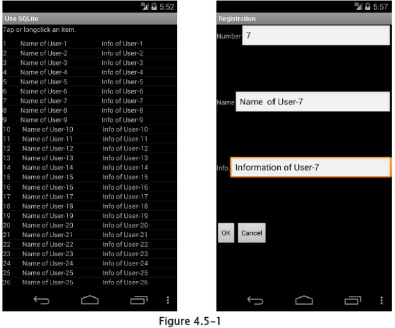

## 4.5 使用 SQLite

通过使用 SQLite 创建/操作数据库时，在安全性方面有一些警告。 要点是合理设置数据库文件的访问权限，以及 SQL 注入的对策。 允许从外部直接读取/写入数据库文件（在多个应用程序之间共享）的数据库不在此处，假设在内容供应器的后端和应用本身中使用该数据库。 另外，在处理不太多敏感信息的情况下，建议采取下述对策，尽管这里可以处理一定程度的敏感信息。

### 4.5.1 示例代码

#### 4.5.1.1 创建/操作数据库

在 Android 应用中处理数据库时，可以通过使用`SQLiteOpenHelper` [10] 来实现数据库文件的适当安排和访问权限设置（拒绝其他应用访问的设置）。 下面是一个简单的应用示例，它在启动时创建数据库，并通过 UI 执行搜索/添加/更改/删除数据。 示例代码完成了 SQL 注入的防范，来避免来自外部的输入执行不正确的 SQL。

> [10] 对于文件存储，可以将绝对文件路径指定为`SQLiteOpenHelper`构造函数的第二个参数（名称）。 因此，如果指定了 SD 卡路径，则需要注意，存储的文件可以被其他应用读取和写入。



1) `SQLiteOpenHelper`应该用于创建数据库。

2) 使用占位符。

3) 根据应用要求验证输入值。

SampleDbOpenHelper.java

```java
package org.jssec.android.sqlite;

import android.content.Context;
import android.database.SQLException;
import android.database.sqlite.SQLiteDatabase;
import android.database.sqlite.SQLiteOpenHelper;
import android.util.Log;
import android.widget.Toast;

public class SampleDbOpenHelper extends SQLiteOpenHelper {

    private SQLiteDatabase mSampleDb; //Database to store the data to be handled
    
    public static SampleDbOpenHelper newHelper(Context context) {
        //*** POINT 1 *** SQLiteOpenHelper should be used for database creation.
        return new SampleDbOpenHelper(context);
    }
    
    public SQLiteDatabase getDb() {
        return mSampleDb;
    }
    
    //Open DB by Writable mode
    public void openDatabaseWithHelper() {
        try {
            if (mSampleDb != null && mSampleDb.isOpen()) {
                if (!mSampleDb.isReadOnly())// Already opened by writable mode
                    return;
                mSampleDb.close();
            }
            mSampleDb = getWritableDatabase(); //It's opened here.
        } catch (SQLException e) {
            //In case fail to construct database, output to log
            Log.e(mContext.getClass().toString(), mContext.getString(R.string.DATABASE_OPEN_ERROR_MESSAGE));
            Toast.makeText(mContext, R.string.DATABASE_OPEN_ERROR_MESSAGE, Toast.LENGTH_LONG).show();
        }
    }
    
    //Open DB by ReadOnly mode.
    public void openDatabaseReadOnly() {
        try {
            if (mSampleDb != null && mSampleDb.isOpen()) {
                if (mSampleDb.isReadOnly())// Already opened by ReadOnly.
                    return;
                mSampleDb.close();
            }
            SQLiteDatabase.openDatabase(mContext.getDatabasePath(CommonData.DBFILE_NAME).getPath(), null, SQLiteDatabase.OPEN_READONLY);
        } catch (SQLException e) {
            //In case failed to construct database, output to log
            Log.e(mContext.getClass().toString(), mContext.getString(R.string.DATABASE_OPEN_ERROR_MESSAGE));
            Toast.makeText(mContext, R.string.DATABASE_OPEN_ERROR_MESSAGE, Toast.LENGTH_LONG).show();
        }
    }
    
    //Database Close
    public void closeDatabase() {
        try {
            if (mSampleDb != null && mSampleDb.isOpen()) {
                mSampleDb.close();
            }
        } catch (SQLException e) {
            //In case failed to construct database, output to log
            Log.e(mContext.getClass().toString(), mContext.getString(R.string.DATABASE_CLOSE_ERROR_MESSAGE));
            Toast.makeText(mContext, R.string.DATABASE_CLOSE_ERROR_MESSAGE, Toast.LENGTH_LONG).show();
        }
    }
    
    //Remember Context
    private Context mContext;
    //Table creation command
    private static final String CREATE_TABLE_COMMANDS
        = "CREATE TABLE " + CommonData.TABLE_NAME + " ("
        + "_id INTEGER PRIMARY KEY AUTOINCREMENT, "
        + "idno INTEGER UNIQUE, "
        + "name VARCHAR(" + CommonData.TEXT_DATA_LENGTH_MAX + ") NOT NULL, "
        + "info VARCHAR(" + CommonData.TEXT_DATA_LENGTH_MAX + ")"
        + ");";
        
    public SampleDbOpenHelper(Context context) {
        super(context, CommonData.DBFILE_NAME, null, CommonData.DB_VERSION);
        mContext = context;
    }
    
    @Override
    public void onCreate(SQLiteDatabase db) {
        try {
            db.execSQL(CREATE_TABLE_COMMANDS); //Execute DB construction command
        } catch (SQLException e) {
            //In case failed to construct database, output to log
            Log.e(this.getClass().toString(), mContext.getString(R.string.DATABASE_CREATE_ERROR_MESSAGE));
        }
    }
    
    @Override
    public void onUpgrade(SQLiteDatabase arg0, int arg1, int arg2) {
        // It's to be executed when database version up. Write processes like data transition.
    }
}
```

DataSearchTask.java（SQLite 数据库项目）

```java
package org.jssec.android.sqlite.task;

import org.jssec.android.sqlite.CommonData;
import org.jssec.android.sqlite.DataValidator;
import org.jssec.android.sqlite.MainActivity;
import org.jssec.android.sqlite.R;
import android.database.Cursor;
import android.database.SQLException;
import android.database.sqlite.SQLiteDatabase;
import android.os.AsyncTask;
import android.util.Log;

//Data search task
public class DataSearchTask extends AsyncTask<String, Void, Cursor> {

    private MainActivity mActivity;
    private SQLiteDatabase mSampleDB;
    
    public DataSearchTask(SQLiteDatabase db, MainActivity activity) {
        mSampleDB = db;
        mActivity = activity;
    }
    
    @Override
    protected Cursor doInBackground(String... params) {
        String idno = params[0];
        String name = params[1];
        String info = params[2];
        String cols[] = {"_id", "idno","name","info"};
        Cursor cur;
        //*** POINT 3 *** Validate the input value according the application requirements.
        if (!DataValidator.validateData(idno, name, info)){
            return null;
        }
        //When all parameters are null, execute all search
        if ((idno == null || idno.length() == 0) &&
            (name == null || name.length() == 0) &&
            (info == null || info.length() == 0) ) {
            try {
                cur = mSampleDB.query(CommonData.TABLE_NAME, cols, null, null, null, null, null);
            } catch (SQLException e) {
                Log.e(DataSearchTask.class.toString(), mActivity.getString(R.string.SEARCHING_ERROR_MESSAGE));
                return null;
            }
            return cur;
        }
        //When No is specified, execute searching by No
        if (idno != null && idno.length() > 0) {
            String selectionArgs[] = {idno};
            try {
                //*** POINT 2 *** Use place holder.
                cur = mSampleDB.query(CommonData.TABLE_NAME, cols, "idno = ?", selectionArgs, null, null, null);
            } catch (SQLException e) {
                Log.e(DataSearchTask.class.toString(), mActivity.getString(R.string.SEARCHING_ERROR_MESSAGE));
                return null;
            }
            return cur;
        }
        //When Name is specified, execute perfect match search by Name
        if (name != null && name.length() > 0) {
            String selectionArgs[] = {name};
            try {
                //*** POINT 2 *** Use place holder.
                cur = mSampleDB.query(CommonData.TABLE_NAME, cols, "name = ?", selectionArgs, null, null, null);
            } catch (SQLException e) {
                Log.e(DataSearchTask.class.toString(), mActivity.getString(R.string.SEARCHING_ERROR_MESSAGE));
                return null;
            }
            return cur;
        }
        //Other than above, execute partly match searching with the condition of info.
        String argString = info.replaceAll("@", "@@"); //Escape $ in info which was received as input.
        argString = argString.replaceAll("%", "@%"); //Escape % in info which was received as input.
        argString = argString.replaceAll("_", "@_"); //Escape _ in info which was received as input.
        String selectionArgs[] = {argString};
        try {
            //*** POINT 2 *** Use place holder.
            cur = mSampleDB.query(CommonData.TABLE_NAME, cols, "info LIKE '%' || ? || '%' ESCAPE '@'", selectionArgs, null, null, null);
        } catch (SQLException e) {
            Log.e(DataSearchTask.class.toString(), mActivity.getString(R.string.SEARCHING_ERROR_MESSAGE));
            return null;
        }
        return cur;
    }
    
    @Override
    protected void onPostExecute(Cursor resultCur) {
        mActivity.updateCursor(resultCur);
    }
}
```

DataValidator.java

```java
package org.jssec.android.sqlite;

public class DataValidator {

    //Validate the Input value
    //validate numeric characters
    public static boolean validateNo(String idno) {
        //null and blank are OK
        if (idno == null || idno.length() == 0) {
            return true;
        }
        //Validate that it's numeric character.
        try {
                    if (!idno.matches("[1-9][0-9]*")) {
                //Error if it's not numeric value
                return false;
            }
        } catch (NullPointerException e) {
            //Detected an error
            return false;
        }
        return true;
    }
    
    // Validate the length of a character string
    public static boolean validateLength(String str, int max_length) {
        //null and blank are OK
        if (str == null || str.length() == 0) {
            return true;
        }
        //Validate the length of a character string is less than MAX
        try {
            if (str.length() > max_length) {
                //When it's longer than MAX, error
                return false;
            }
        } catch (NullPointerException e) {
            //Bug
            return false;
        }
        return true;
    }
    
    // Validate the Input value
    public static boolean validateData(String idno, String name, String info) {
        if (!validateNo(idno)) {
            return false;
        }
        if (!validateLength(name, CommonData.TEXT_DATA_LENGTH_MAX)) {
            return false;
        }else if(!validateLength(info, CommonData.TEXT_DATA_LENGTH_MAX)) {
            return false;
        }
        return true;
    }
}
```

### 4.5.2 规则书

使用 SQLite 时，遵循以下规则：

#### 4.5.2.1 正确设置 DB 文件位置和访问权限（必需）

考虑到 DB 文件数据的保护，DB 文件位置和访问权限设置是需要一起考虑的非常重要的因素。 例如，即使正确设置了文件访问权，如果 DB 文件位于无法设置访问权的位置，则任何人可以访问 DB 文件，例如， SD 卡。 如果它位于应用目录中，如果访问权限设置不正确，它最终将允许意外访问。 以下是正确分配和访问权限设置的一些要点，以及实现它们的方法。 为了保护数据库文件（数据），对于位置和访问权限设置，需要执行以下两点。

1) 位置

位于可以由`Context#getDatabasePath(String name)`获取的文件路径，或者在某些情况下，可以由`Context#getFilesDir11`获取的目录。

2) 访问权限

设置为`MODE_PRIVATE`（只能由创建文件的应用访问）模式。

通过执行以下2点，即可
创建其他应用无法访问的 DB 文件。 以下是执行它们的一些方法。

1.  使用`SQLiteOpenHelper`
2.  使用`Context#openOrCreateDatabase`

创建 DB 文件时，可以使用`SQLiteDatabase#openOrCreateDatabase`。 但是，使用此方法时，可以在某些 Android 智能手机设备中创建可从其他应用读取的 DB 文件。 所以建议避免这种方法，并使用其他方法。 上述量种方法的每个特征如下 [11]

> [11] 这两种方法都提供了（包）目录下的路径，只能由指定的应用读取和写入。

使用`SQLiteOpenHelper`

当使用`SQLiteOpenHelper`时，开发人员不需要担心很多事情。 创建一个从`SQLiteOpenHelper`派生的类，并为构造器的参数指定DB名称（用于文件名）[12]，然后满足上述安全要求的 DB 文件会自动创建。

> [12] （未在 Android 参考中记录）由于可以在`SQLiteOpenHelper`实现中，将完整文件路径指定为数据库名称，因此需要注意无意中指定不能控制访问权限的地方（路径）（例如 SD 卡）。

对于如何使用，请参阅“4.5.1.1 创建/操作数据库”的具体使用方法。

使用`Context#openOrCreateDatabase`

使用`Context#openOrCreateDatabase`方法创建数据库时，文件访问权应由选项指定，在这种情况下，请明确指定`MODE_PRIVATE`。 

对于文件安排，数据库名称（用于文件名）可以像`SQLiteOpenHelper`一样指定，文件将在满足上述安全要求的文件路径中自动创建。 但是，也可以指定完整路径，因此有必要注意指定 SD 卡时，即使指定`MODE_PRIVATE`，其他应用也可以访问。


MainActivity.java（显式设定 DB 访问权的示例）

```java
public void onCreate(Bundle savedInstanceState) {
    super.onCreate(savedInstanceState);
    setContentView(R.layout.main);
    //Construct database
    try {
        //Create DB by setting MODE_PRIVATE
        db = Context.openOrCreateDatabase("Sample.db", MODE_PRIVATE, null);
    } catch (SQLException e) {
        //In case failed to construct DB, log output
        Log.e(this.getClass().toString(), getString(R.string.DATABASE_OPEN_ERROR_MESSAGE));
        return;
    }
    //Omit other initial process
}
```

访问权限有三种可能的设置：`MODE_PRIVATE`，`MODE_WORLD_READABLE`和`MODE_WORLD_WRITEABLE`。 这些常量可以由或运算符一起指定。 但是，除`API_PRIVATE`之外的所有设置，都将在 API 级别 17 和更高版本中被弃用，并且会在 API 级别 24 和更高版本中导致安全异常。 即使对于 API 级别 15 及更早版本的应用，通常最好不要使用这些标志 [13]。

> [13] `MODE_WORLD_READABLE`和`MODE_WORLD_WRITEABLE`的更多信息，以及其使用的注意事项，请参见“4.6.3.2 访问目录的权限设置”。

+   `MODE_PRIVATE`只有创建者应用可以读写
+   `MODE_WORLD_READABLE`创建者应用可以读写，其他人只能读
+   `MODE_WORLD_WRITEABLE`创建者应用可以读写，其他人只能写

#### 4.5.2.2 与其它应用共享 DB 数据时，将内容供应器用于访问控制（必需）

与其他应用共享 DB 数据的方法是，将 DB 文件创建为`WORLD_READABLE`，`WORLD_WRITEABLE`，以便其他应用直接访问。 但是，此方法不能限制访问或操作数据库的应用，因此数据可以由非预期的一方（应用）读或写。 因此，可以认为数据的机密性或一致性方面可能会出现一些问题，或者可能成为恶意软件的攻击目标。 

如上所述，在 Android 中与其他应用共享数据库数据时，强烈建议使用内容供应器。 内容供应器存在一些优点，不仅从安全的角度来实现对 DB 的访问控制，而且从设计角度来看， DB 纲要结构可以隐藏到内容中。

#### 4.5.2.3 在 DB 操作期间处理变量参数时，必需使用占位符（必需）

在防止 SQL 注入的意义上，将任意输入值并入 SQL 语句时，应使用占位符。 下面有两个方法用占位符执行 SQL。

1.  使用`SQLiteDatabase#compileStatement()`，获取`SQLiteStatement`，然后使用`SQLiteStatement#bindString()`或`bindLong()`等，将参数放置到占位符之后。
2.  在`SQLiteDatabese`类上调用`execSQL()`，`insert()`，`update()`，`delete()`，`query()`，`rawQuery()`和`replace()`时，使用具有占位符的 SQL 语句。

另外，通过使用`SQLiteDatabase#compileStatement()`执行`SELECT`命令时，存在“仅获取第一个元素作为`SELECT`命令的结果”的限制，所以用法是有限的。 

在任何一种方法中，提供给占位符的数据内容最好根据应用要求事先检查。 以下是每种方法的进一步解释。

使用`SQLiteDatabase#compileStatement()`：

数据以下列步骤提供给占位符：

1.  使用`SQLiteDatabase#compileStatement()`获取包含占位符的 SQL 语句，如`SQLiteStatement`。
2.  使用`bindLong()`和`bindString()`方法为创建的`SQLiteStatement`对象设置占位符。
3.  通过`ExecSQLiteStatement`对象的`execute()`方法执行 SQL。

DataInsertTask.java（占位符的用例）：

```java
//Adding data task
public class DataInsertTask extends AsyncTask<String, Void, Void> {

    private MainActivity mActivity;
    private SQLiteDatabase mSampleDB;
    
    public DataInsertTask(SQLiteDatabase db, MainActivity activity) {
        mSampleDB = db;
        mActivity = activity;
    }
    
    @Override
    protected Void doInBackground(String... params) {
        String idno = params[0];
        String name = params[1];
        String info = params[2];
        //*** POINT 3 *** Validate the input value according the application requirements.
        if (!DataValidator.validateData(idno, name, info)) {
            return null;
        }
        // Adding data task
        //*** POINT 2 *** Use place holder
        String commandString = "INSERT INTO " + CommonData.TABLE_NAME + " (idno, name, info) VALUES (?, ?, ?)";
        SQLiteStatement sqlStmt = mSampleDB.compileStatement(commandString);
        sqlStmt.bindString(1, idno);
        sqlStmt.bindString(2, name);
        sqlStmt.bindString(3, info);
        try {
            sqlStmt.executeInsert();
        } catch (SQLException e) {
            Log.e(DataInsertTask.class.toString(), mActivity.getString(R.string.UPDATING_ERROR_MESSAGE));
        } finally {
            sqlStmt.close();
        }
        return null;
    }
    
    [...]
}
```

这是一种类型，它预先创建作为对象执行的 SQL 语句，并将参数分配给它。 执行的过程是固定的，所以没有发生 SQL 注入的可能。 另外，通过重用`SQLiteStatement`对象可以提高流程效率。

使用`SQLiteDatabase`提供的每个方法：

`SQLiteDatabase`提供了两种类型的数据库操作方法。 一种是使用 SQL 语句，另一种是不使用 SQL 语句。 使用 SQL 语句的方法是`SQLiteDatabase#execSQL()`/`rawQuery()`，它以以下步骤执行。

1) 准备包含占位符的 SQL 语句。

2) 创建要分配给占位符的数据。

3) 传递 SQL 语句和数据作为参数，并为每个过程执行一个方法。

另一方面，`SQLiteDatabase#insert()/update()/delete()/query()/replace()`是不使用 SQL 语句的方法。当使用它们时，数据应该按照以下步骤来准备。

1) 如果有数据要插入/更新到数据库，请注册到`ContentValues`。

2) 传递`ContentValues`作为参数，并为每个过程执行一个方法（例如，`SQLiteDatabase#insert()`）

`SQLiteDatabase#insert()`（每个过程的方法的用例）：


```java
private SQLiteDatabase mSampleDB;
private void addUserData(String idno, String name, String info) {
    //Validity check of the value(Type, range), escape process
    if (!validateInsertData(idno, name, info)) {
        //If failed to pass the validation, log output
        Log.e(this.getClass().toString(), getString(R.string.VALIDATION_ERROR_MESSAGE));
        return;
    }
    //Prepare data to insert
    ContentValues insertValues = new ContentValues();
    insertValues.put("idno", idno);
    insertValues.put("name", name);
    insertValues.put("info", info);
    //Execute Inser
    try {
        mSampleDb.insert("SampleTable", null, insertValues);
    } catch (SQLException e) {
        Log.e(this.getClass().toString(), getString(R.string.DB_INSERT_ERROR_MESSAGE));
        return;
    }
}
```

在这个例子中，SQL 命令不是直接写入，而是使用`SQLiteDatabase`提供的插入方法。 SQL 命令没有直接使用，所以在这种方法中也没有 SQL 注入的可能。


### 4.5.3 高级话题

#### 4.5.3.1 在 SQL 语句的`LIKE`断言中使用通配符时，应该实现转义过程

当所使用的字符串包含`LIKE`断言的通配符（`%`，`_`），作为占位符的输入值时，除非处理正确，否则它将用作通配符，因此必须根据需要事先转义处理。 通配符应该用作单个字符（`%`或`_`）时，需要转义处理。 

根据下面的示例代码，使用`ESCAPE`子句执行实际的转义过程。

使用`LIKE`情况下的`ESCAPE`过程：

```java
//Data search task
public class DataSearchTask extends AsyncTask<String, Void, Cursor> {

    private MainActivity mActivity;
    private SQLiteDatabase mSampleDB;
    private ProgressDialog mProgressDialog;
    
    public DataSearchTask(SQLiteDatabase db, MainActivity activity) {
        mSampleDB = db;
        mActivity = activity;
    }
    
    @Override
    protected Cursor doInBackground(String... params) {
        String idno = params[0];
        String name = params[1];
        String info = params[2];
        String cols[] = {"_id", "idno","name","info"};
        Cursor cur;
        
        [...]
        
        //Execute like search(partly match) with the condition of info
        //Point:Escape process should be performed on characters which is applied to wild card
        String argString = info.replaceAll("@", "@@"); // Escape $ in info which was received as input
        argString = argString.replaceAll("%", "@%"); // Escape % in info which was received as input
        argString = argString.replaceAll("_", "@_"); // Escape _ in info which was received as input
        String selectionArgs[] = {argString};
        try {
            //Point:Use place holder
            cur = mSampleDB.query("SampleTable", cols, "info LIKE '%' || ? || '%' ESCAPE '@'", selectionArgs, null, null, null);
        } catch (SQLException e) {
            Toast.makeText(mActivity, R.string.SERCHING_ERROR_MESSAGE, Toast.LENGTH_LONG).show();
            return null;
        }
        return cur;
    }
    
    @Override
    protected void onPostExecute(Cursor resultCur) {
        mProgressDialog.dismiss();
        mActivity.updateCursor(resultCur);
    }
}
```

#### 4.5.3.2 不能用占位符时，在 SQL 命令中使用外部输入

当执行 SQL 语句，并且过程目标是 DB 对象，如表的创建/删除时，占位符不能用于表名的值。 基本上，数据库不应该使用外部输入的任意字符串来设计，以防占位符不能用于该值。 

当由于规范或特性的限制，而无法使用占位符时，无论输入值是否危险，都应在执行前进行验证，并且需要执行必要的过程。

基本上，应该执行：

1.  使用字符串参数时，应该对于字符进行转义或引用处理。
2.  使用数字值参数时，请确认不包含数值以外的字符。
3.  用作标识符或命令时，请验证是否包含不能使用的字符以及(1)。

参考：<http://www.ipa.go.jp/security/vuln/documents/website_security_sql.pdf> （日文）

#### 4.5.3.3 采取数据库非预期覆盖的对策

通过`SQLiteOpenHelper#getReadableDatabase`或`getWriteableDatabase`获取数据库实例时，通过使用任一方法 [14]，DB 将以可读/可写状态打开。 另外，与`Context#openOrCreateDatabase`，`SQLiteDatabase#openOrCreateDatabase`相同。这意味着 DB 的内容可能会被应用操作，或实现中的缺陷意外覆盖。 基本上，它可以由应用规范和实现范围来支持，但是当实现仅需要读取功能的功能（如应用的搜索功能等）时，通过只读方式打开数据库，可能会简化设计或检查，从而提高应用质量，因此建议视情况而定。

> [14] `getReableDatabase()`和`getWritableDatabase`可能返回同一个对象。 它的规范是，如果可写对象由于磁盘满了而无法生成，它将返回只读对象。 （`getWritableDatabase()`会在磁盘满了的情况下产生错误）

特别是，通过对`SQLiteDatabase#openDatabase`指定`OPEN_READONLY`打开数据库。

以只读打开数据库：

```java
[...]
// Open DB(DB should be created in advance)
SQLiteDatabase db
    = SQLiteDatabase.openDatabase(SQLiteDatabase.getDatabasePath("Sample.db"), null, OPEN_READONLY);
```

参考：<http://developer.android.com/reference/android/database/sqlite/SQLiteOpenHelper.html#getReadableDatabase()>

#### 4.5.3.4 根据应用需求，验证 DB 的输入输出数据的有效性

SQLite 是类型容错的数据库，它可以将字符类型数据存储到在 DB 中声明为整数的列中。 对于数据库中的数据，包括数值类型的所有数据都作为纯文本的字符数据存储在数据库中。 所以搜索字符串类型，可以对整数类型的列执行（`LIKE '%123%'`等）。此外，由于在某些情况下，可以输入超过限制的数据，所以对 SQLite 中的值（有效性验证）的限制是不可信的，例如`VARCHAR(100)`。 

因此，使用 SQLite 的应用需要非常小心 DB 的这种特性，并且有必要根据应用需求采取措施，不要将意外的数据存储到数据库，或不要获取意外的数据。 对策是以下两点。

1.  在数据库中存储数据时，请确认类型和长度是否匹配。
2.  从数据库中获取值时，验证数据是否超出假定的类型和长度。

下面是个代码示例，它验证了输入值是否大于 1。

```java
public class MainActivity extends Activity {
    
    [...]
    
    //Process for adding
    private void addUserData(String idno, String name, String info) {
        //Check for No
        if (!validateNo(idno, CommonData.REQUEST_NEW)) {
            return;
        }
        //Inserting data process
        DataInsertTask task = new DataInsertTask(mSampleDbyhis);
        task.execute(idno, name, info);
    }
    
    [...]
    
    private boolean validateNo(String idno, int request) {
        if (idno == null || idno.length() == 0) {
            if (request == CommonData.REQUEST_SEARCH) {
                //When search process, unspecified is considered as OK.
                return true;
            } else {
                //Other than search process, null and blank are error.
                Toast.makeText(this, R.string.IDNO_EMPTY_MESSAGE, Toast.LENGTH_LONG).show();
                return false;
            }
        }
        //Verify that it's numeric character
        try {
            // Value which is more than 1
            if (!idno.matches("[1-9][0-9]*")) {
                //In case of not numeric character, error
                Toast.makeText(this, R.string.IDNO_NOT_NUMERIC_MESSAGE, Toast.LENGTH_LONG).show();
                return false;
            }
        } catch (NullPointerException e) {
            //It never happen in this case
            return false;
        }
        return true;
    }
    
    [...]
}
```

#### 4.5.3.5 考虑 -- 储存在数据库中的数据

在 SQLite 视线中，将数据储存到文件是这样：

+   所有包含数值类型的数据，都将作为纯文本的字符数据存储在 DB 文件中。
+   执行 DB 的数据删除时，数据本身不会从 DB 文件中删除。 （只添加删除标记。）
+   更新数据时，更新前的数据未被删除，仍保留在数据库文件中。

因此，“必须”删除的信息仍可能保留在 DB 文件中。 即使在这种情况下，也要根据本指导手册采取对策，并且启用 Android 安全功能时，数据/文件可能不会被第三方直接访问，包括其他应用。 但考虑到通过绕过 Android 的保护系统（如 root 权限）选取文件的情况，如果存储了对业务有巨大影响的数据，则应考虑不依赖于 Android 保护系统的数据保护。 

由于上述原因，需要保护的重要数据，不应该存储在 SQLite 数据库中，即使设备取得了 root 权限。 在需要存储重要数据的情况下，有必要采取对策或加密整个数据库。

当需要加密时，有许多问题超出了本指南的范围，比如处理用于加密或代码混淆的密钥，所以目前建议，在开发处理数据的应用，数据对业务有巨大影响时咨询专家。 请参考“4.5.3.6 [参考] 加密 SQLite 数据库（Android `SQLCipher`）”，这里介绍加密数据库的库。

#### 4.5.3.6 [参考] 加密 SQLite 数据库（Android `SQLCipher`）

`SQLCipher`是为数据库提供透明 256 位 AES 加密的 SQLite 扩展。 它是开源的（BSD 许可证），由 Zetetic LLC 维护/管理。 在移动世界中，`SQLCipher`广泛用于诺基亚/ QT，苹果的 iOS。

Android 项目的`SQLCipher`旨在支持 Android 环境中的 SQLite 数据库的标准集成加密。 通过为`SQLCipher`创建标准 SQLite 的 API，开发人员可以使用加密的数据库和平常一样的编码。

参考：<https://guardianproject.info/code/sqlcipher/>。

如何使用：

应用开发者可以通过以下三个步骤使用`SQLCipher`。

1.  在应用的`lib`目录中找到`sqlcipher.jar`，`libdatabase_sqlcipher.so`，`libsqlcipher_android.so`和`libstlport_shared.so`。
2.  对于所有源文件，将所有`android.database.sqlite.*`更改为`info.guardianproject.database.sqlite.*`，它们由`import`指定。另外，`android.database.Cursor`可以照原样使用。
3.  在`onCreate()`中初始化数据库，打开数据库时设置密码。

简单的代码示例：

```java
SQLiteDatabase.loadLibs(this); // First, Initialize library by using context.
SQLiteOpenHelper.getWRITEABLEDatabase(passwoed): // Parameter is password(Suppose that it's string type and It's got in a secure way.)
```

在撰写本文时，Android 版`SQLCipher`是 1.1.0 版，现在正在开发 2.0.0 版，现在已经公布了 RC4。 就过去在 Android 中的使用和 API 的稳定性而言，有必要稍后进行验证，但目前还可以看做 SQLite 的加密解决方案，它可以在 Android 中使用。

库的结构

下列 SDK 中包含的文件是使用`SQLCipher`所必须的。

+   `assets/icudt46l.zip` 2,252KB

当`icudt46l.dat`不存在于`/system/usr/icu/`下及其早期版本时，这是必需的。 当找不到`icudt46l.dat`时，此 zip 需要解压缩并使用。

+   `libs/armeabi/libdatabase_sqlcipher.so` 44KB
+   `libs/armeabi/libsqlcipher_android.so` 1,117KB
+   `libs/armeabi/libstlport_shared.so` 555KB

本地库，它在`SQLCipher`首次加载（调用`SQLiteDatabase#loadLibs()`）时被读取。

+   `libs/commons-codec.jar` 46KB
+   `libs/guava-r09.jar` 1,116KB
+   `libs/sqlcipher.jar` 102KB

Java 库调用本地库。`sqlcipher.jar`是主要的，其它的由`sqlcipher.jar`引用。

总共大约 5.12MB。但是，当`icudt46l.zip`解压时，总共大约 7MB。
