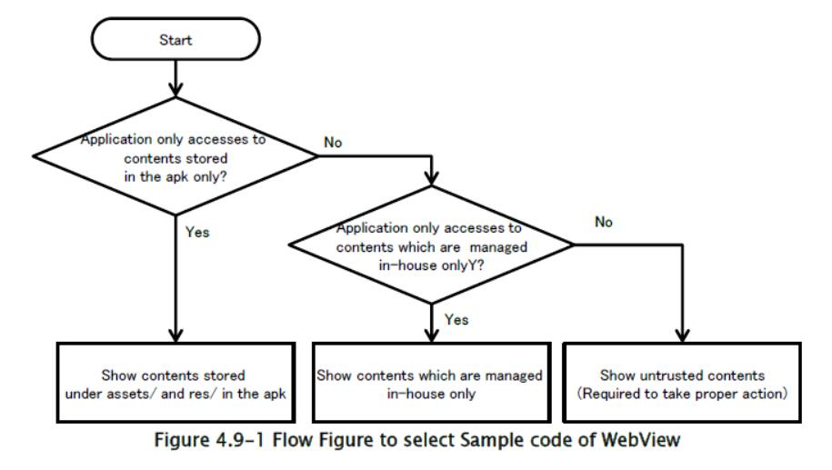
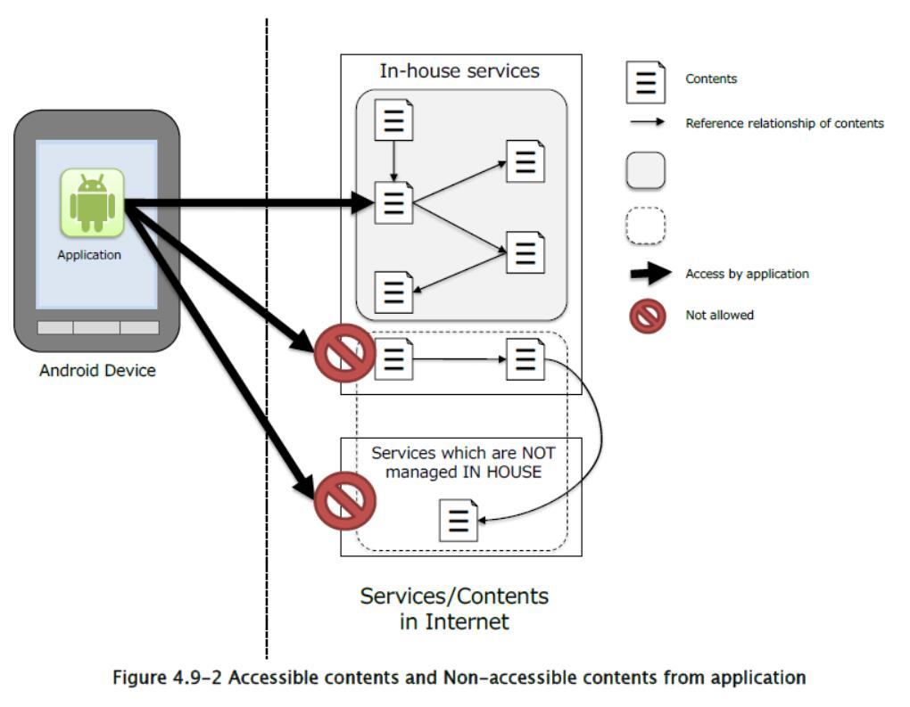

## 4.9 使用`WebView`

`WebView`使你的应用能够集成 HTML / JavaScript 内容。

### 4.9.1 示例代码

我们需要采取适当的行动，具体取决于我们想通过`WebView`展示的内容，尽管我们可以通过它轻松展示网站和 html 文件。 而且我们还需要考虑来自`WebView`卓越功能的风险; 如 JavaScript-Java 对象绑定。 我们特别需要关注 JavaScript。 （请注意 JavaScript 默认是禁用的，我们可以通过`WebSettings#setJavaScriptEnabled()`来启用它。 启用 JavaScript 存在潜在的风险，即恶意第三方可以获取设备信息并操作设备。 以下是使用`WebView` [19] 的应用的原则：

> [19] 严格地说，如果我们可以说内容是安全的，你可以启用 JavaScript。 如果内容是在内部管理的，则内容应该保证安全。 公司可以保护他们。 换句话说，我们需要让企业代表的决策，来为其他公司的内容启用 JavaScript。 由可信伙伴开发的内容可能会有安全保证。 但仍有潜在风险。 因此，负责人需要作出决定。

（1）如果应用使用内部管理的内容，则可以启用 JavaScript。

（2）除上述情况外，你不应启用 JavaScript。

图 4.9-1 显示了根据内容特征选择示例代码的流程图。



### 4.9.1.1 仅显示存储在 APK 中的`assets / res`目录下的内容

如果你的应用仅显示存储在 apk 中`assets/`和`res/`目录下的内容，则可以启用 JavaScript。

以下示例代码展示了，如何使用`WebView`显示存储在`assets/`和`res/`下的内容。

要点：

1) 禁止访问文件（apk 文件中的`assets/`和`res/`下的文件除外）。

2) 你可以启用 JavaScript。

WebViewAssetsActivity.java

```java
package org.jssec.webview.assets;

import android.app.Activity;
import android.os.Bundle;
import android.webkit.WebSettings;
import android.webkit.WebView;

public class WebViewAssetsActivity extends Activity {

    /**
    * Show contents in assets
    */
    @Override
    public void onCreate(Bundle savedInstanceState) {
        super.onCreate(savedInstanceState);
        setContentView(R.layout.activity_main);
        WebView webView = (WebView) findViewById(R.id.webView);
        WebSettings webSettings = webView.getSettings();
        // *** POINT 1 *** Disable to access files (except files under assets/ and res/ in this apk)
        webSettings.setAllowFileAccess(false);
        // *** POINT 2 *** Enable JavaScript (Optional)
        webSettings.setJavaScriptEnabled(true);
        // Show contents which were stored under assets/ in this apk
        webView.loadUrl("file:///android_asset/sample/index.html");
    }
}
```

#### 4.9.1.2 仅显示内部管理的内容

只有当你的网络服务和你的 Android 应用可以采取适当措施来保护它们时，你才可以启用 JavaScript 来仅仅显示内部管理的内容。 

Web 服务端操作：如图 4.9-2 所示，你的 Web 服务只能引用内部管理的内容。 另外，Web 服务需要采取适当的安全措施。 因为你的网络服务涉及的内容可能存在风险，因此存在潜在风险；如恶意攻击代码注入，数据操作等。请参阅“4.9.2.1 仅在内容由内部管理时启用 JavaScript（必需）”。 

Android 应用端操作：使用 HTTPS，应用只有在证书可信的情况下，才应与受管理的 Web 服务建立网络连接。 

以下示例代码是一个活动，展示了内部管理的内容。



要点：

1) 适当处理来自`WebView`的 SSL 错误。

2) （可选）启用`WebView`的 JavaScript。

3) 将 URL 限制为 HTTPS 协议。

4) 将 URL 限制在内部。

WebViewTrustedContentsActivity.java

```java
package org.jssec.webview.trustedcontents;

import android.app.Activity;
import android.app.AlertDialog;
import android.content.DialogInterface;
import android.net.http.SslCertificate;
import android.net.http.SslError;
import android.os.Bundle;
import android.webkit.SslErrorHandler;
import android.webkit.WebView;
import android.webkit.WebViewClient;
import java.text.SimpleDateFormat;

public class WebViewTrustedContentsActivity extends Activity {

    @Override
    public void onCreate(Bundle savedInstanceState) {
        super.onCreate(savedInstanceState);
        setContentView(R.layout.main);
        WebView webView = (WebView) findViewById(R.id.webView);
        webView.setWebViewClient(new WebViewClient() {
            @Override
            public void onReceivedSslError(WebView view,
                SslErrorHandler handler, SslError error) {
                // *** POINT 1 *** Handle SSL error from WebView appropriately
                // Show SSL error dialog.
                AlertDialog dialog = createSslErrorDialog(error);
                dialog.show();
                // *** POINT 1 *** Handle SSL error from WebView appropriately
                // Abort connection in case of SSL error
                // Since, there may be some defects in a certificate like expiration of validity,
                // or it may be man-in-the-middle attack.
                handler.cancel();
            }
        });
        // *** POINT 2 *** Enable JavaScript (optional)
        // in case to show contents which are managed in house.
        webView.getSettings().setJavaScriptEnabled(true);
        // *** POINT 3 *** Restrict URLs to HTTPS protocol only
        // *** POINT 4 *** Restrict URLs to in-house
        webView.loadUrl("https://url.to.your.contents/");
    }
    
    private AlertDialog createSslErrorDialog(SslError error) {
        // Error message to show in this dialog
        String errorMsg = createErrorMessage(error);
        // Handler for OK button
        DialogInterface.OnClickListener onClickOk = new DialogInterface.OnClickListener() {
            @Override
            public void onClick(DialogInterface dialog, int which) {
                setResult(RESULT_OK);
            }
        };
        // Create a dialog
        AlertDialog dialog = new AlertDialog.Builder(
        WebViewTrustedContentsActivity.this).setTitle("SSL connection error")
            .setMessage(errorMsg).setPositiveButton("OK", onClickOk)
            .create();
        return dialog;
    }
    
    private String createErrorMessage(SslError error) {
        SslCertificate cert = error.getCertificate();
        SimpleDateFormat dateFormat = new SimpleDateFormat("yyyy/MM/dd HH:mm:ss");
        StringBuilder result = new StringBuilder()
            .append("The site's certification is NOT valid. Connection was disconnected.¥n¥nError:¥n");
        switch (error.getPrimaryError()) {
            case SslError.SSL_EXPIRED:
                result.append("The certificate is no longer valid.¥n¥nThe expiration date is ")
                    .append(dateFormat.format(cert.getValidNotAfterDate()));
                return result.toString();
            case SslError.SSL_IDMISMATCH:
                result.append("Host name doesn't match. ¥n¥nCN=")
                    .append(cert.getIssuedTo().getCName());
                return result.toString();
            case SslError.SSL_NOTYETVALID:
                result.append("The certificate isn't valid yet.¥n¥nIt will be valid from ")
                    .append(dateFormat.format(cert.getValidNotBeforeDate()));
                return result.toString();
            case SslError.SSL_UNTRUSTED:
                result.append("Certificate Authority which issued the certificate is not reliable.¥n¥nCertificate Authority¥n")
                    .append(cert.getIssuedBy().getDName());
                return result.toString();
            default:
                result.append("Unknown error occured. ");
                return result.toString();
        }
    }
}
```

#### 4.9.1.3 显示非内部管理的内容

如果你的应用显示的内容不在内部管理，请勿启用 JavaScript，因为存在访问恶意内容的潜在风险。 

以下示例代码是显示非内部管理的内容的活动。 

此示例代码显示由用户通过地址栏输入的 URL 指定的内容。 请注意，当 JavaScript 错误发生时，JavaScript 被禁用并且连接中止。 HTTPS 通信的详细信息，错误处理与“4.9.1.2 仅显示内部管理的内容”相同。 详细信息请参阅“5.4 通过 HTTPS 进行通信”。

要点：

1) 适当处理来自`WebView`的 SSL 错误。

2) 禁用`WebView`的 JavaScript。

WebViewUntrustActivity.java

```java
package org.jssec.webview.untrust;

import android.app.Activity;
import android.app.AlertDialog;
import android.content.DialogInterface;
import android.graphics.Bitmap;
import android.net.http.SslCertificate;
import android.net.http.SslError;
import android.os.Bundle;
import android.view.View;
import android.webkit.SslErrorHandler;
import android.webkit.WebView;
import android.webkit.WebViewClient;
import android.widget.Button;
import android.widget.EditText;
import java.text.SimpleDateFormat;

public class WebViewUntrustActivity extends Activity {

    /*
    * Show contents which are NOT managed in-house (Sample program works as a simple browser)
    */
    private EditText textUrl;
    private Button buttonGo;
    private WebView webView;
    
    // Activity definition to handle any URL request
    private class WebViewUnlimitedClient extends WebViewClient {
        @Override
        public boolean shouldOverrideUrlLoading(WebView webView, String url) {
            webView.loadUrl(url);
            textUrl.setText(url);
            return true;
        }
        
        // Start reading Web page
        @Override
        public void onPageStarted(WebView webview, String url, Bitmap favicon) {
            buttonGo.setEnabled(false);
            textUrl.setText(url);
        }
        
        // Show SSL error dialog
        // And abort connection.
        @Override
        public void onReceivedSslError(WebView webview,
        SslErrorHandler handler, SslError error) {
            // *** POINT 1 *** Handle SSL error from WebView appropriately
            AlertDialog errorDialog = createSslErrorDialog(error);
            errorDialog.show();
            handler.cancel();
            textUrl.setText(webview.getUrl());
            buttonGo.setEnabled(true);
        }
        
        // After loading Web page, show the URL in EditText.
        @Override
        public void onPageFinished(WebView webview, String url) {
            textUrl.setText(url);
            buttonGo.setEnabled(true);
        }
    }
    
    @Override
    public void onCreate(Bundle savedInstanceState) {
        super.onCreate(savedInstanceState);
        setContentView(R.layout.main);
        webView = (WebView) findViewById(R.id.webview);
        webView.setWebViewClient(new WebViewUnlimitedClient());
        // *** POINT 2 *** Disable JavaScript of WebView
        // Explicitly disable JavaScript even though it is disabled by default.
        webView.getSettings().setJavaScriptEnabled(false);
        webView.loadUrl(getString(R.string.texturl));
        textUrl = (EditText) findViewById(R.id.texturl);
        buttonGo = (Button) findViewById(R.id.go);
    }
    
    public void onClickButtonGo(View v) {
        webView.loadUrl(textUrl.getText().toString());
    }
    
    private AlertDialog createSslErrorDialog(SslError error) {
        // Error message to show in this dialog
        String errorMsg = createErrorMessage(error);
        // Handler for OK button
        DialogInterface.OnClickListener onClickOk = new DialogInterface.OnClickListener() {
            @Override
            public void onClick(DialogInterface dialog, int which) {
                setResult(RESULT_OK);
            }
        };
        // Create a dialog
        AlertDialog dialog = new AlertDialog.Builder(
            WebViewUntrustActivity.this).setTitle("SSL connection error")
            .setMessage(errorMsg).setPositiveButton("OK", onClickOk)
            .create();
        return dialog;
    }
    
    private String createErrorMessage(SslError error) {
        SslCertificate cert = error.getCertificate();
        SimpleDateFormat dateFormat = new SimpleDateFormat("yyyy/MM/dd HH:mm:ss");
        StringBuilder result = new StringBuilder()
            .append("The site's certification is NOT valid. Connection was disconnected.¥n¥nError:¥n");
        switch (error.getPrimaryError()) {
            case SslError.SSL_EXPIRED:
                result.append("The certificate is no longer valid.¥n¥nThe expiration date is ")
                    .append(dateFormat.format(cert.getValidNotAfterDate()));
                return result.toString();
            case SslError.SSL_IDMISMATCH:
                result.append("Host name doesn't match. ¥n¥nCN=")
                    .append(cert.getIssuedTo().getCName());
                return result.toString();
            case SslError.SSL_NOTYETVALID:
                result.append("The certificate isn't valid yet.¥n¥nIt will be valid from ")
                    .append(dateFormat.format(cert.getValidNotBeforeDate()));
                return result.toString();
            case SslError.SSL_UNTRUSTED:
                result.append("Certificate Authority which issued the certificate is not reliable.¥n¥nCertificate Authority¥n")
                    .append(cert.getIssuedBy().getDName());
                return result.toString();
            default:
                result.append("Unknown error occured. ");
                return result.toString();
        }
    }
}
```

### 4.9.2 规则书

当你需要时候`WebView`时，遵循下列规则：

#### 4.9.2.1 只在内容由内部管理时启用 JavaScript（必需）

对于`WebView`我们需要关注的是是否启用 JavaScript。 原则上，只有当应用访问内部管理的服务时，我们才能启用 JavaScript。 如果有可能访问非内部管理的服务，则不得启用 JavaScript。

内部管理的服务

如果应用访问内部开发的内容，并通过内部管理的服务器分发，我们可以说这些内容仅由贵公司修改。 另外，每个内容还需要仅仅引用存储在服务器中的内容，它们具有适当安全性。 

在这种情况下，我们可以在`WebView`上启用 JavaScript。 请参阅“4.9.1.2 仅显示内部管理的内容”。 

如果你的应用仅显示存储在 apk 中`assets/`和`res/`目录下的内容，你也可以启用 JavaScript。 请参阅“4.9.1.1 仅显示存储在`assets / res`目录下的内容”。

非内部管理的服务

你绝不能认为，你可以确保非内部管理的内容的安全性。 因此你必须禁用 JavaScript。 请参阅“4.9.1.3 显示非内部管理的内容”。 

另外，如果内容存储在外部存储介质中，如 microSD，则必须禁用 JavaScript；因为其他应用可以修改内容。

#### 4.9.2.2 使用 HTTPS 与内部管理的服务器进行通信（必需）

你必须使用 HTTPS 与内部管理的服务器通信，因为存在恶意第三方欺骗服务的潜在风险。 

请参阅“4.9.2.4 正确处理 SSL 错误（必需）”和“5.4 通过 HTTPS 通信”。

#### 4.9.2.3 禁用 JavaScript 来显示通过意图接收的 URL（必需）

如果你的应用需要显示从其他应用，以意图等形式传递的 URL，则不要启用 JavaScript。因为存在用恶意 JavaScript 显示恶意网页的潜在风险。 

“4.9.1.2 仅显示内部管理的内容”部分中的示例代码，使用固定值 URL 显示内部管理的内容来确保安全。

如果你需要显示从意图收到的 URL，则必须确认该 URL 在内部管理的 URL 中。 简而言之，应用必须使用正则表达式等白名单来检查 URL。另外，它应该是 HTTPS。

#### 4.9.2.4 适当处理 SSL 错误（必需）

当 HTTPS 通信发生 SSL 错误时，你必须终止网络通信并通知用户错误。 

SSL 错误显示了无效的服务器认证风险或 MTIM（中间人攻击）风险。 请注意，`WebView`没有 SSL 错误的错误通知机制。 因此，你的应用必须显示错误通知，来向用户通知风险。 请参阅“4.9.1.2 仅显示内部管理的内容”和“4.9.1.3 显示非内部管理的内容”一节中的示例代码。 

另外，你的应用必须终止带有错误通知的通信。 换句话说，你不可以这样做。

+   忽略错误来与服务保持通信。
+   重试 HTTP 通信而不是 HTTPS。


请参阅“5.4 通过 HTTPS 进行通信”中所述的详细信息。 

`WebView`的默认行为是，发生 SSL 错误时终止通信。 因此，我们需要添加显示 SSL 错误通知。 然后我们可以正确处理 SSL 错误。

### 4.9.3 高级话题

#### 4.9.3.1 Android 4.1 或更低版本中由`addJavascriptInterface()`引起的漏洞

4.2（API Level 17）版本以下的 Android，具有由`addJavascriptInterface()`引起的漏洞，这可能允许攻击者通过`WebView`上的 JavaScript 调用 Android 本地方法（Java）。 

正如“4.9.2.1 只在内容由内部管理时启用 JavaScript”中所述，如果服务可以访问内部控制之外的服务，则不得启用 JavaScript。 

在 Android 4.2（API Level 17）或更高版本中，已采取措施，将漏洞限制为在 Java 源代码上使用`@JavascriptInterface`注释的方法，而不是所有注入的 Java 对象的方法。 但是，如果服务可以访问内部控制之外的服务，则必须禁用JavaScript，像“4.9.2.1”中提到的那样。

#### 4.9.3.2 由文件模式导致的问题

如果使用默认设置的`WebView`，应用具有访问权限的所有文件，都可以通过在网页中通过文件模式访问，而无论页面的来源如何。 例如，恶意网页可以通过使用文件模式，向应用的私有文件的 URI 发送请求，来访问存储在应用私有目录中的文件。 

如果服务可以访问内部控制之外的服务，则禁用 JavaScript 的方法如“4.9.2.1 只在内容由内部管理时启用 JavaScript（必需）”中所述。 这样做是为了防止发送恶意文件模式请求。 

同样在 Android 4.1（API Level 16）或更高版本的情况下，可以使用`setAllowFileAccessFromFileURLs()`和`setAllowUniversalAccessFromFileURLs()`来限制通过文件模式的访问。

禁用文件模式

```java
webView = (WebView) findViewById(R.id.webview);
webView.setWebViewClient(new WebViewUnlimitedClient());
WebSettings settings = webView.getSettings();
settings.setAllowUniversalAccessFromFileURLs(false);
settings.setAllowFileAccessFromFileURLs(false);
```

#### 4.9.3.3 使用 Web 消息时指定发送者的来源

Android 6.0（API Level 23）增加了一个 API，用于实现 HTML5 Web 消息传送。 Web 消息传送是一种在 HTML5 中定义的框架，用于在不同的浏览上下文之间，发送和接收数据 [20]。添加到`WebView`类的`postWebMessage()`方法是一种方法，通过 Web 消息传送定义的跨域消息传送协议处理数据传输。 

> [20] http://www.w3.org/TR/webmessaging/

此方法从`WebView`已读入的浏览上下文中发送一个消息，该消息由其第一个参数指定; 然而，在这种情况下，有必要指定发送者的来源作为第二个参数。 如果指定的来源 [21] 与发送者上下文中的来源不符，则不会发送该消息。 通过以这种方式限制发送者来源，此机制旨在防止消息传递给非预期发送者。

> [21] “来源”是一个 URL 模式以及一个主机名和端口号。 详细定义请参阅 <http://tools.ietf.org/html/rfc6454>。

但是，重要的是要注意，通配符可能被指定为`postWebMessage()`方法中的来源 [22]。如果指定了通配符，则不会检查消息的发送者来源，并且可以从任意来源发送消息。 在恶意内容已被读入`WebView`的情况下，如果发送重要消息时没有来源限制，则可能导致各种类型的损害。 因此，在使用`WebView`进行 Web 消息传递时，最好在`postWebMessage()`方法中明确指定特定的源。

> [22] 请注意，通配符是`Uri.EMPTY`和`Uri.parse("")`（在编写 2016 年 9 月 1 日的版本时）。
