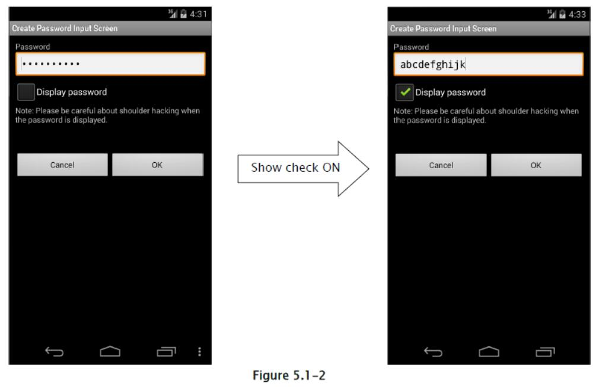
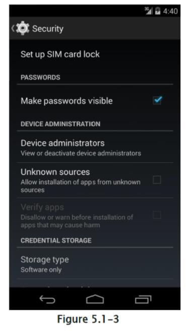
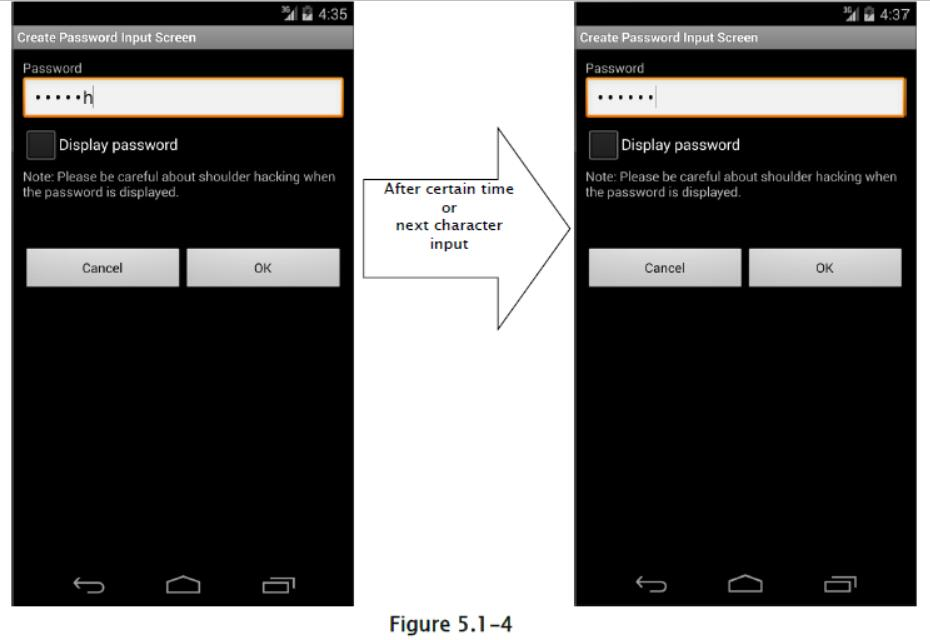

## 5.1 创建密码输入界面

### 5.1.1 示例代码

创建密码输入界面时，这里描述了安全性方面需要考虑的一些要点。 这里仅提及与密码输入有关的内容。 对于如何保存密码，未来会发布另一篇文章。

要点：

1) 输入的密码应该被屏蔽显示（用`*`显示）

2) 提供以纯文本显示密码的选项。

3) 警告用户以纯文本显示密码有风险。

要点：处理最后输入的密码时，请注意以下几点以及上述要点。

4) 如果在初始界面中有最后输入的密码，则将黑点的固定数字显示为虚拟，以便不会猜到最后的密码的数字。

5) 当显示虚拟密码，并按下“显示密码”按钮时，清除最后输入的密码并提供输入新密码的状态。

6) 当最后输入的密码显示为虚拟时，如果用户尝试输入密码，请清除最后输入的密码，并将新的用户输入视为新密码。

password_activity.xml

```xml
<?xml version="1.0" encoding="utf-8"?>
<LinearLayout xmlns:android="http://schemas.android.com/apk/res/android"
    android:layout_width="fill_parent"
    android:layout_height="fill_parent"
    android:orientation="vertical"
    android:padding="10dp" >
    <!-- Label for password item -->
    <TextView
    android:layout_width="fill_parent"
    android:layout_height="wrap_content"
    android:text="@string/password" />
    <!-- Label for password item -->
    <!-- *** POINT 1 *** The input password must be masked (Display with black dot) -->
    <EditText
    android:id="@+id/password_edit"
    android:layout_width="fill_parent"
    android:layout_height="wrap_content"
    android:hint="@string/hint_password"
    android:inputType="textPassword" />
    <!-- *** POINT 2 *** Provide the option to display the password in a plain text -->
    <CheckBox
    android:id="@+id/password_display_check"
    android:layout_width="fill_parent"
    android:layout_height="wrap_content"
    android:text="@string/display_password" />
    <!-- *** POINT 3 *** Alert a user that displaying password in a plain text has a risk. -->
    <TextView
    android:layout_width="fill_parent"
    android:layout_height="wrap_content"
    android:text="@string/alert_password" />
    <!-- Cancel/OK button -->
    <LinearLayout
        android:layout_width="fill_parent"
        android:layout_height="wrap_content"
        android:layout_marginTop="50dp"
        android:gravity="center"
        android:orientation="horizontal" >
        <Button
        android:layout_width="0dp"
        android:layout_height="wrap_content"
        android:layout_weight="1"
        android:onClick="onClickCancelButton"
        android:text="@android:string/cancel" />
        <Button
        android:layout_width="0dp"
        android:layout_height="wrap_content"
        android:layout_weight="1"
        android:onClick="onClickOkButton"
        android:text="@android:string/ok" />
    </LinearLayout>
</LinearLayout>
```

位于`PasswordActivity.java`底部的 3 个方法的实现，应该取决于目的而调整。

+   `private String getPreviousPassword()`
+   `private void onClickCancelButton(View view)`
+   `private void onClickOkButton(View view)`

PasswordActivity.java

```java
package org.jssec.android.password.passwordinputui;

import android.app.Activity;
import android.os.Bundle;
import android.text.Editable;
import android.text.InputType;
import android.text.TextWatcher;
import android.view.View;
import android.view.WindowManager;
import android.widget.CheckBox;
import android.widget.CompoundButton;
import android.widget.CompoundButton.OnCheckedChangeListener;
import android.widget.EditText;
import android.widget.Toast;

public class PasswordActivity extends Activity {

    // Key to save the state
    private static final String KEY_DUMMY_PASSWORD = "KEY_DUMMY_PASSWORD";
    // View inside Activity
    private EditText mPasswordEdit;
    private CheckBox mPasswordDisplayCheck;
    
    // Flag to show whether password is dummy display or not
    private boolean mIsDummyPassword;
    @Override
    public void onCreate(Bundle savedInstanceState) {
        super.onCreate(savedInstanceState);
        setContentView(R.layout.password_activity);
        // Set Disabling Screen Capture
        getWindow().addFlags(WindowManager.LayoutParams.FLAG_SECURE);
        // Get View
        mPasswordEdit = (EditText) findViewById(R.id.password_edit);
        mPasswordDisplayCheck = (CheckBox) findViewById(R.id.password_display_check);
        // Whether last Input password exist or not.
        if (getPreviousPassword() != null) {
            // *** POINT 4 *** In the case there is the last input password in an initial display,
            // display the fixed digit numbers of black dot as dummy in order not that the digits number of last password is guessed.
            // Display should be dummy password.
            mPasswordEdit.setText("**********");
            // To clear the dummy password when inputting password, set text change listener.
            mPasswordEdit.addTextChangedListener(new PasswordEditTextWatcher());
            // Set dummy password flag
            mIsDummyPassword = true;
        }
        // Set a listner to change check state of password display option.
        mPasswordDisplayCheck
            .setOnCheckedChangeListener(new OnPasswordDisplayCheckedChangeListener());
    }
    
    @Override
    public void onSaveInstanceState(Bundle outState) {
        super.onSaveInstanceState(outState);
        // Unnecessary when specifying not to regenerate Activity by the change in screen aspect ratio.
        // Save Activity state
        outState.putBoolean(KEY_DUMMY_PASSWORD, mIsDummyPassword);
    }
    
    @Override
    public void onRestoreInstanceState(Bundle savedInstanceState) {
        super.onRestoreInstanceState(savedInstanceState);
        // Unnecessary when specifying not to regenerate Activity by the change in screen aspect ratio.
        // Restore Activity state
        mIsDummyPassword = savedInstanceState.getBoolean(KEY_DUMMY_PASSWORD);
    }
    
    /**
    * Process in case password is input
    */
    private class PasswordEditTextWatcher implements TextWatcher {
    
        public void beforeTextChanged(CharSequence s, int start, int count, int after) {
            // Not used
        }
        
        public void onTextChanged(CharSequence s, int start, int before, int count) {
            // *** POINT 6 *** When last Input password is displayed as dummy, in the case an user tries to input password,
            // Clear the last Input password, and treat new user input as new password.
            if (mIsDummyPassword) {
                // Set dummy password flag
                mIsDummyPassword = false;
                // Trim space
                CharSequence work = s.subSequence(start, start + count);
                mPasswordEdit.setText(work);
                // Cursor position goes back the beginning, so bring it at the end.
                mPasswordEdit.setSelection(work.length());
            }
        }
        
        public void afterTextChanged(Editable s) {
            // Not used
        }
    }
    
    /**
    * Process when check of password display option is changed.
    */
    private class OnPasswordDisplayCheckedChangeListener implements OnCheckedChangeListener {
    
        public void onCheckedChanged(CompoundButton buttonView, boolean isChecked) {
            // *** POINT 5 *** When the dummy password is displayed and the "Show password" button is pressed,
            // clear the last input password and provide the state for new password input.
            if (mIsDummyPassword && isChecked) {
                // Set dummy password flag
                mIsDummyPassword = false;
                // Set password empty
                mPasswordEdit.setText(null);
            }
            // Cursor position goes back the beginning, so memorize the current cursor position.
            int pos = mPasswordEdit.getSelectionStart();
            // *** POINT 2 *** Provide the option to display the password in a plain text
            // Create InputType
            int type = InputType.TYPE_CLASS_TEXT;
            if (isChecked) {
                // Plain display when check is ON.
                type |= InputType.TYPE_TEXT_VARIATION_VISIBLE_PASSWORD;
            } else {
                // Masked display when check is OFF.
                type |= InputType.TYPE_TEXT_VARIATION_PASSWORD;
            }
            // Set InputType to password EditText
            mPasswordEdit.setInputType(type);
            // Set cursor position
            mPasswordEdit.setSelection(pos);
        }
    }
    
    // Implement the following method depends on application
    /**
    * Get the last Input password
    *
    * @return Last Input password
    */
    private String getPreviousPassword() {
        // When need to restore the saved password, return password character string
        // For the case password is not saved, return null
        return "hirake5ma";
    }
    
    /**
    * Process when cancel button is clicked
    *
    * @param view
    */
    public void onClickCancelButton(View view) {
        // Close Activity
        finish();
    }
    
    /**
    * Process when OK button is clicked
    *
    * @param view
    */
    public void onClickOkButton(View view) {
        // Execute necessary processes like saving password or using for authentication
        String password = null;
        if (mIsDummyPassword) {
            // When dummy password is displayed till the final moment, grant last iInput password as fixed password.
            password = getPreviousPassword();
        } else {
            // In case of not dummy password display, grant the user input password as fixed password.
            password = mPasswordEdit.getText().toString();
        }
        // Display password by Toast
        Toast.makeText(this, "password is ¥"" + password + "¥"", Toast.LENGTH_SHORT).show();
        // Close Activity
        finish();
    }
}
```

### 5.1.2 规则书

实现密码输入界面时，遵循以下规则。

#### 5.1.2.1 如果输入了密码，提供屏蔽显示功能（必需）

智能手机通常用在火车或公共汽车等拥挤的地方，而且存在密码被某人偷窥的风险。 因此，屏蔽显示密码的功能是应用规范所必需的。 

有两种方法可以将`EditText`显示为密码：在布局 XML 中静态指定此值，或通过从程序中切换显示来动态指定此值。 前者通过为`android:inputType`属性指定`textPassword`或使用`android:password`属性来实现。 后者通过使用`EditText`类的`setInputType()`方法，将`InputType.TYPE_TEXT_VARIATION_PASSWORD`添加到其输入类型，来实现的。 

下面展示了每个的示例代码。

在布局 XML 中屏蔽密码。

password_activity.xml

```xml
<!—Password input item -->
<!—Set true for the android:password attribute -->
<EditText
    android:id="@+id/password_edit"
    android:layout_width="fill_parent"
    android:layout_height="wrap_content"
    android:hint="@string/hint_password"
    android:password="true" />
```

在活动中屏蔽密码。

PasswordActivity.java

```java
// Set password display type
// Set TYPE_TEXT_VARIATION_PASSWORD for InputType.
EditText passwordEdit = (EditText) findViewById(R.id.password_edit);
int type = InputType.TYPE_CLASS_TEXT
    | InputType.TYPE_TEXT_VARIATION_PASSWORD;
passwordEdit.setInputType(type);
```

#### 5.1.2.2 提供以纯文本展示密码的选项（必需）

智能手机的密码输入通过触摸面板输入完成，因此与 PC 上的键盘输入相比，容易发生误输入。由于输入不便，用户可能会使用简单的密码，这样做会更危险。此外，当有多次密码输入失败导致帐户锁定等机制时，必须尽可能避免误输入。作为这些问题的解决方案，通过准备以纯文本显示密码的选项，用户可以使用安全密码。

但是，以纯文本显示密码时，可能会被嗅探，所以使用此选项时。有必要提醒用户注意来自后面的嗅探。此外，如果存在以纯文本显示的选项，则还需要为系统准备，来自动取消纯文本显示，如设置纯文本显示的时间。密码纯文本显示的限制，在未来版本的另一篇文章中发布。因此，密码纯文本显示的限制不包含在示例代码中。



通过指定`EditText`的`InputType`，可以切换屏蔽显示和纯文本显示。

PasswordActivity.java

```java
/**
* Process when check of password display option is changed.
*/
private class OnPasswordDisplayCheckedChangeListener implements
    OnCheckedChangeListener {
    
    public void onCheckedChanged(CompoundButton buttonView,
    boolean isChecked) {
        // *** POINT 5 *** When the dummy password is displayed and the "Show password" button is pr
        essed,
        // Clear the last input password and provide the state for new password input.
        if (mIsDummyPassword && isChecked) {
            // Set dummy password flag
            mIsDummyPassword = false;
            // Set password empty
            mPasswordEdit.setText(null);
        }
        // Cursor position goes back the beginning, so memorize the current cursor position.
        int pos = mPasswordEdit.getSelectionStart();
        // *** POINT 2 *** Provide the option to display the password in a plain text
        // Create InputType
        int type = InputType.TYPE_CLASS_TEXT;
        if (isChecked) {
            // Plain display when check is ON.
            type |= InputType.TYPE_TEXT_VARIATION_VISIBLE_PASSWORD;
        } else {
            // Masked display when check is OFF.
            type |= InputType.TYPE_TEXT_VARIATION_PASSWORD;
        }
        // Set InputType to password EditText
        mPasswordEdit.setInputType(type);
        // Set cursor position
        mPasswordEdit.setSelection(pos);
    }
}
```

#### 5.1.2.3 活动加载时屏蔽密码（必需）

为防止密码被偷窥，当活动启动时，密码显示选项的默认值应该设置为`OFF`。 基本上，默认值应该总是定义为更安全的一方。

#### 5.1.2.4 显示最后输入密码时，必须显示虚拟密码（必需）

当指定最后输入的密码时，不要给第三方任何密码提示，它应该显示为带有屏蔽字符（`*`等）的固定位数的虚拟值。 另外，在虚拟显示时按下“显示密码”的情况下，清除密码并切换到纯文本显示模式。 它有助于防止最后输入的密码被嗅探的风险，即使设备被传递给第三方，比如它被盗时。 仅供参考，在虚拟显示的情况下以及用户尝试输入密码时，应取消虚拟显示，需要变成正常输入状态。 

显示最后输入的密码时，显示虚拟密码。

PasswordActivity.java

```java
public void onCreate(Bundle savedInstanceState) {
    super.onCreate(savedInstanceState);
    setContentView(R.layout.password_activity);
    // Get View
    mPasswordEdit = (EditText) findViewById(R.id.password_edit);
    mPasswordDisplayCheck = (CheckBox) findViewById(R.id.password_display_check);
    // Whether last Input password exist or not.
    if (getPreviousPassword() != null) {
        // *** POINT 4 *** In the case there is the last input password in an initial display,
        // display the fixed digit numbers of black dot as dummy in order not that the digits number of last password is guessed.
        // Display should be dummy password.
        mPasswordEdit.setText("**********");
        // To clear the dummy password when inputting password, set text change listener.
        mPasswordEdit.addTextChangedListener(new PasswordEditTextWatcher());
        // Set dummy password flag
        mIsDummyPassword = true;
    }
    
    [...]
    
    }
    
/**
* Get the last input password.
*
* @return the last input password
*/
private String getPreviousPassword() {
    // To restore the saved password, return the password character string.
    // For the case password is not saved, return null.
    return "hirake5ma";
}
```

在虚拟显示的情况下，当密码显示选项打开时，请清除显示的内容。

PasswordActivity.java

```java
/**
* Process when check of password display option is changed.
*/
private class OnPasswordDisplayCheckedChangeListener implements
    OnCheckedChangeListener {
    
    public void onCheckedChanged(CompoundButton buttonView,
        boolean isChecked) {
        // *** POINT 5 *** When the dummy password is displayed and the "Show password" button is pressed,
        // Clear the last input password and provide the state for new password input.
        if (mIsDummyPassword && isChecked) {
            // Set dummy password flag
            mIsDummyPassword = false;
            // Set password empty
            mPasswordEdit.setText(null);
        }
        
        [...]
        
    }
}
```

在虚拟显示的情况下，当用户尝试输入密码时，清除虚拟显示。

PasswordActivity.java

```java
// Key to save the state
private static final String KEY_DUMMY_PASSWORD = "KEY_DUMMY_PASSWORD";

[...]

// Flag to show whether password is dummy display or not.
private boolean mIsDummyPassword;

@Override
public void onCreate(Bundle savedInstanceState) {
    [...]
    
    // Whether last Input password exist or not.
    if (getPreviousPassword() != null) {
        // *** POINT 4 *** In the case there is the last input password in an initial display,
        // display the fixed digit numbers of black dot as dummy in order not that the digits number of last password is guessed.
        // Display should be dummy password.
        mPasswordEdit.setText("**********");
        // To clear the dummy password when inputting password, set text change listener.
        mPasswordEdit.addTextChangedListener(new PasswordEditTextWatcher());
        // Set dummy password flag
        mIsDummyPassword = true;
    }
    
    [...]
    
}

@Override
public void onSaveInstanceState(Bundle outState) {
    super.onSaveInstanceState(outState);
    // Unnecessary when specifying not to regenerate Activity by the change in screen aspect ratio.
    // Save Activity state
    outState.putBoolean(KEY_DUMMY_PASSWORD, mIsDummyPassword);
}

@Override
public void onRestoreInstanceState(Bundle savedInstanceState) {
    super.onRestoreInstanceState(savedInstanceState);
    // Unnecessary when specifying not to regenerate Activity by the change in screen aspect ratio.
    // Restore Activity state
    mIsDummyPassword = savedInstanceState.getBoolean(KEY_DUMMY_PASSWORD);
}

/**
* Process when inputting password.
*/
private class PasswordEditTextWatcher implements TextWatcher {

    public void beforeTextChanged(CharSequence s, int start, int count,
        int after) {
        // Not used
    }
    
    public void onTextChanged(CharSequence s, int start, int before,
        int count) {
        // *** POINT 6 *** When last Input password is displayed as dummy, in the case an user tries to input password,
        // Clear the last Input password, and treat new user input as new password.
        if (mIsDummyPassword) {
            // Set dummy password flag
            mIsDummyPassword = false;
            // Trim space
            CharSequence work = s.subSequence(start, start + count);
            mPasswordEdit.setText(work);
            // Cursor position goes back the beginning, so bring it at the end.
            mPasswordEdit.setSelection(work.length());
        }
    }
    
    public void afterTextChanged(Editable s) {
        // Not used
    }
}
```

### 5.1.3 高级话题

#### 5.1.3.1 登录过程

需要密码输入的代表性示例是登录过程。以下是一些在登录过程中需要注意的事项。

登录失败时的错误信息

在登录过程中，需要输入两个信息，ID（账号）和密码。 登录失败时有两种情况。 一个是 ID 不存在。 另一个是 ID 存在，但密码不正确。 如果这两种情况中的任何一种，有所区分并显示在登录失败消息中，则攻击者可以猜测指定的 ID 是否存在。 为了阻止这种猜测，这两种情况不应该在登录失败消息中区分，并且该消息应该按照下面的方式显示。 

消息示例：登录 ID 或密码不正确。

自动登录功能

存在一个功能，可以完成成功登录过程一次后，通过省略下次登录的 ID /密码输入来执行自动登录。自动登录功能可以省去复杂的输入。因此，便利性会增加，但另一方面，当智能手机被盗时，第三方恶意使用的风险将随之而来。

只有在恶意第三方造成的损害可以接受时，或者只有在可以采取足够安全措施的情况下，才能使用自动登录功能。例如，在网上银行应用的情况下，当设备由第三方运营时，可能会造成财务损失。所以在这种情况下，与自动登录功能配套的安全措施是必需的。存在一些可能的应对措施，例如【在付款过程等财务流程前需要重新输入密码】，【设置自动登录时，请求用户注意并提示用户锁定设备】等。使用自动登录时，有必要仔细考虑方便性和风险以及假定的对策。

#### 5.1.3.2 修改密码

更改曾经设置的密码时，应在屏幕上准备以下输入项目。

+   当前密码
+   新密码
+   新密码（确认）


当引入自动登录功能时，第三方可能使用应用。 在这种情况下，为了避免意外更改密码，需要输入当前的密码。 另外，为了减少由于错误输入新密码，而进入不可用状态的风险，有必要要求输入两次新的密码。

#### 5.1.3.3 关于“使密码可见”设置

Android 设置菜单中有一个名为“使密码可见”的设置。 在 Android 4.4 的情况下，如下所示。

```
设置 -> 安全 -> 使密码可见
```



打开“使密码可见”设置时，最后输入的字符以纯文本显示。 经过一定的时间（约两秒），或输入下一个字符后，以纯文本显示的字符将被屏蔽。 关闭时，输入后会立即屏蔽。 此设置影响整个系统，并且它适用于使用`EditText`的密码显示功能的所有应用。



#### 5.1.3.4 禁用屏幕截图

在密码输入屏幕中，密码可以在屏幕上清晰显示。 在处理个人信息的屏幕中，如果屏幕截图功能在默认情况下处于启用状态，则可能会从屏幕截图文件中泄漏，它存储在外部存储器上。因此建议对密码输入屏幕禁用屏幕截图功能。 通过附加下面的代码可以禁用屏幕截图。

PasswordActivity.java

```java
@Override
public void onCreate(Bundle saveInstanceState) {
    [...]

    Window window = getWindow();
    window.addFlags(WindowManager.LayoutParams.FLAG_SECURE);
    setContentView(R.layout.passwordInputScreen);

    [...]
}
```


