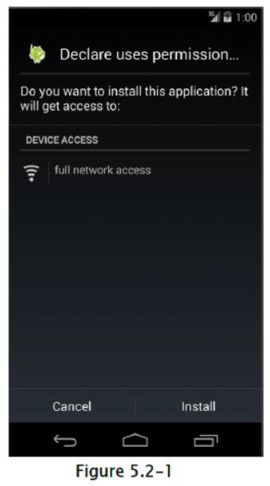
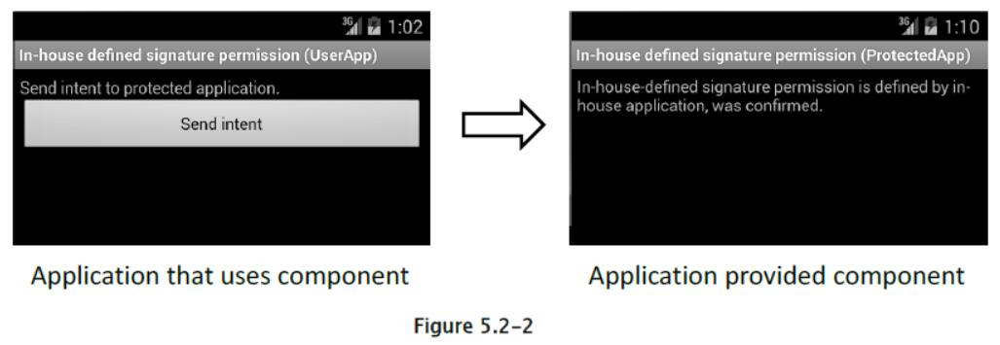
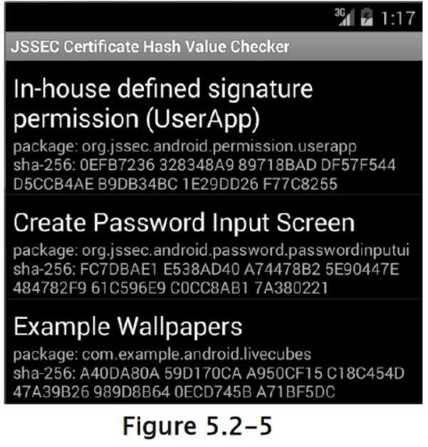
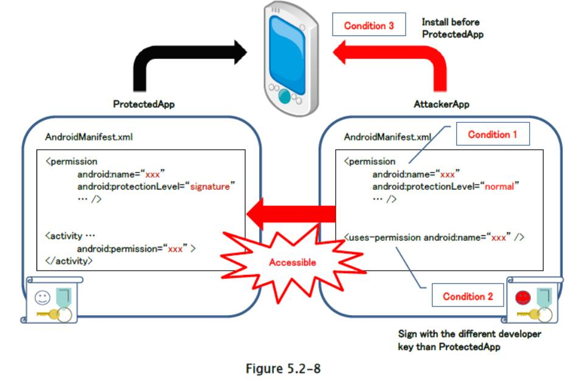
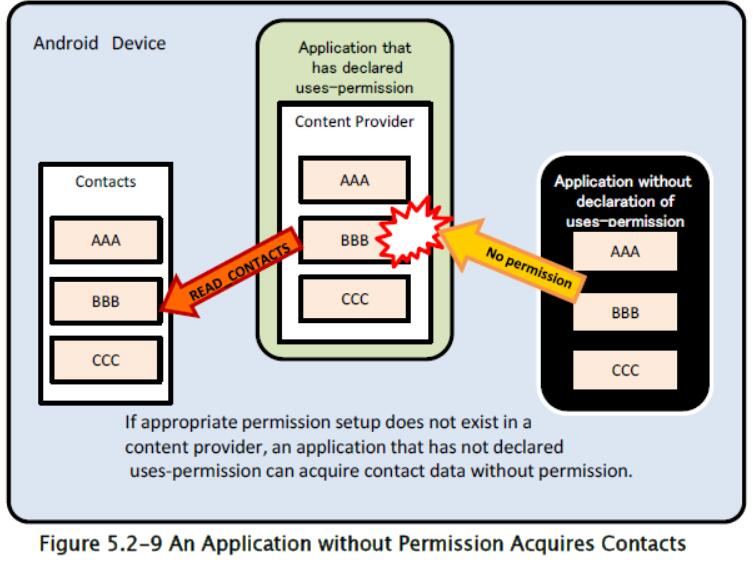

## 5.2 权限和保护级别

权限内有四种类型的保护级别，它们包括正常，危险，签名和签名或系统。 根据保护级别，权限被称为正常权限，危险权限，签名权限或签名或系统权限。 以下部分中使用这些名称。

### 5.2.1 示例代码

#### 5.2.1.1 如何使用 Android OS 的系统权限

Android 操作系统有一个称为“权限”的安全机制，可以保护其用户的资产（如联系人和 GPS 功能）免受恶意软件的侵害。 当应用请求访问受 Android OS 保护的信息或功能时，应用需要显式声明权限才能访问它们。 安装应用，它申请需要用户同意的权限时，会出现以下确认界面 [23]。

> [23] 在 Android 6.0（API Level 23）及更高版本中，安装应用时不会发生用户的权限授予或拒绝，而是在应用请求权限时在运行时发生。 更多详细信息，请参见“5.2.1.4 在 Android 6.0 及更高版本中使用危险权限的方法”和“5.2.3.6 Android 6.0 和更高版本中的权限模型规范的修改”部分。



从该确认界面中，用户能够知道，应用试图访问哪些类型的特征或信息。 如果应用试图访问明显不需要的功能或信息，那么该应用很可能是恶意软件。 因此，为了使你的应用不被怀疑是恶意软件，因此需要尽量减少使用权限声明。

要点：

1.  使用`uses-permission`声明应用中使用的权限。
2.  不要用`uses-permission`声明任何不必要的权限。

AndroidManifest.xml

```xml
<?xml version="1.0" encoding="utf-8"?>
<manifest xmlns:android="http://schemas.android.com/apk/res/android"
    package="org.jssec.android.permission.usespermission" >
    <!-- *** POINT 1 *** Declare a permission used in an application with uses-permission -->
    <!-- Permission to access Internet -->
    <uses-permission android:name="android.permission.INTERNET"/>
    <!-- *** POINT 2 *** Do not declare any unnecessary permissions with uses-permission -->
    <!-- If declaring to use Permission that is unnecessary for application behaviors, it gives users a
    sense of distrust. -->
    <application
        android:allowBackup="false"
        android:icon="@drawable/ic_launcher"
        android:label="@string/app_name" >
        <activity
            android:name=".MainActivity"
            android:label="@string/app_name"
            android:exported="true" >
            <intent-filter>
                <action android:name="android.intent.action.MAIN" />
                <category android:name="android.intent.category.LAUNCHER" />
            </intent-filter>
        </activity>
    </application>
</manifest>
```

#### 5.2.1.2 如何使用内部定义的权限在内部应用之间通信

除了由 Android OS 定义的系统权限之外，应用还可以定义自己的权限。 如果使用内部定义的权限（内部定义的签名权限更准确），则可以构建只允许内部应用之间进行通信的机制。 通过提供基于多个内部应用之间的，应用间通信的复合功能，应用变得更具吸引力，你的企业可以通过将其作为系列销售获得更多利润。 这是使用内部定义的签名权限的情况。

示例应用“内部定义的签名权限（UserApp）”使用`Context.startActivity()`方法启动示例应用“内部定义的签名权限（ProtectedApp）”。 两个应用都需要使用相同的开发人员密钥进行签名。如果用于签名的密钥不同，则`UserApp`不会向`ProtectedApp`发送意图，并且`ProtectedApp`不处理从`UserApp`收到的意图。 此外，它还可以防止恶意软件使用安装顺序相关的事项，绕过你自己的签名权限，如高级话题部分中所述。



要点：提供组件的应用

1) 使用`protectionLevel="signature"`定义权限。

2) 对于组件，使用其权限属性强制规定权限。

3) 如果组件是活动，则必须没有定义意图过滤器。

4) 在运行时，验证签名权限是否由程序代码本身定义。

5) 导出 APK 时，请使用与使用该组件的应用相同的开发人员密钥对 APK 进行签名。

AndroidManifest.xml

```xml
<?xml version="1.0" encoding="utf-8"?>
<manifest xmlns:android="http://schemas.android.com/apk/res/android"
    package="org.jssec.android.permission.protectedapp" >
    <!-- *** POINT 1 *** Define a permission with protectionLevel="signature" -->
    <permission
        android:name="org.jssec.android.permission.protectedapp.MY_PERMISSION"
        android:protectionLevel="signature" />
    <application
        android:allowBackup="false"
        android:icon="@drawable/ic_launcher"
        android:label="@string/app_name" >
        <!-- *** POINT 2 *** For a component, enforce the permission with its permission attribute -->
        <activity
            android:name=".ProtectedActivity"
            android:exported="true"
            android:label="@string/app_name"
            android:permission="org.jssec.android.permission.protectedapp.MY_PERMISSION" >
            <!-- *** POINT 3 *** If the component is an activity, you must define no intent-filter -->
        </activity>
    </application>
</manifest>
```

ProtectedActivity.java

```java
package org.jssec.android.permission.protectedapp;

import org.jssec.android.shared.SigPerm;
import org.jssec.android.shared.Utils;
import android.app.Activity;
import android.content.Context;
import android.os.Bundle;
import android.widget.TextView;

public class ProtectedActivity extends Activity {

    // In-house Signature Permission
    private static final String MY_PERMISSION = "org.jssec.android.permission.protectedapp.MY_PERMISSION";
    // Hash value of in-house certificate
    private static String sMyCertHash = null;
    
    private static String myCertHash(Context context) {
        if (sMyCertHash == null) {
            if (Utils.isDebuggable(context)) {
                // Certificate hash value of "androiddebugkey" of debug.keystore
                sMyCertHash = "0EFB7236 328348A9 89718BAD DF57F544 D5CCB4AE B9DB34BC 1E29DD26 F77C8255";
            } else {
                // Certificate hash value of "my company key" of keystore
                sMyCertHash = "D397D343 A5CBC10F 4EDDEB7C A10062DE 5690984F 1FB9E88B D7B3A7C2 42E142CA";
            }
        }
        return sMyCertHash;
    }
    
    private TextView mMessageView;
    
    @Override
    public void onCreate(Bundle savedInstanceState) {
        super.onCreate(savedInstanceState);
        setContentView(R.layout.main);
        mMessageView = (TextView) findViewById(R.id.messageView);
        // *** POINT 4 *** At run time, verify if the signature permission is defined by itself on the program code
        if (!SigPerm.test(this, MY_PERMISSION, myCertHash(this))) {
            mMessageView.setText("In-house defined signature permission is not defined by in-house application.");
            return;
        }
        // *** POINT 4 *** Continue processing only when the certificate matches
        mMessageView.setText("In-house-defined signature permission is defined by in-house application,
        was confirmed.");
    }
}
```

SigPerm.java

```java
package org.jssec.android.shared;

import android.content.Context;
import android.content.pm.PackageManager;
import android.content.pm.PackageManager.NameNotFoundException;
import android.content.pm.PermissionInfo;

public class SigPerm {

    public static boolean test(Context ctx, String sigPermName, String correctHash) {
        if (correctHash == null) return false;
        correctHash = correctHash.replaceAll(" ", "");
        return correctHash.equals(hash(ctx, sigPermName));
    }
    
    public static String hash(Context ctx, String sigPermName) {
        if (sigPermName == null) return null;
        try {
            // Get the package name of the application which declares a permission named sigPermName.
            PackageManager pm = ctx.getPackageManager();
            PermissionInfo pi;
            pi = pm.getPermissionInfo(sigPermName, PackageManager.GET_META_DATA);
            String pkgname = pi.packageName;
            // Fail if the permission named sigPermName is not a Signature Permission
            if (pi.protectionLevel != PermissionInfo.PROTECTION_SIGNATURE) return null;
            // Return the certificate hash value of the application which declares a permission named sigPermName.
            return PkgCert.hash(ctx, pkgname);
        } catch (NameNotFoundException e) {
            return null;
        }
    }
}
```

PkgCert.java

```java
package org.jssec.android.shared;

import java.security.MessageDigest;
import java.security.NoSuchAlgorithmException;
import android.content.Context;
import android.content.pm.PackageInfo;
import android.content.pm.PackageManager;
import android.content.pm.PackageManager.NameNotFoundException;
import android.content.pm.Signature;

public class PkgCert {

    public static boolean test(Context ctx, String pkgname, String correctHash) {
        if (correctHash == null) return false;
        correctHash = correctHash.replaceAll(" ", "");
        return correctHash.equals(hash(ctx, pkgname));
    }
    
    public static String hash(Context ctx, String pkgname) {
        if (pkgname == null) return null;
        try {
            PackageManager pm = ctx.getPackageManager();
            PackageInfo pkginfo = pm.getPackageInfo(pkgname, PackageManager.GET_SIGNATURES);
            if (pkginfo.signatures.length != 1) return null; // Will not handle multiple signatures.
            Signature sig = pkginfo.signatures[0];
            byte[] cert = sig.toByteArray();
            byte[] sha256 = computeSha256(cert);
            return byte2hex(sha256);
        } catch (NameNotFoundException e) {
            return null;
        }
    }
    
    private static byte[] computeSha256(byte[] data) {
        try {
            return MessageDigest.getInstance("SHA-256").digest(data);
        } catch (NoSuchAlgorithmException e) {
            return null;
        }
    }
    
    private static String byte2hex(byte[] data) {
        if (data == null) return null;
        final StringBuilder hexadecimal = new StringBuilder();
        for (final byte b : data) {
            hexadecimal.append(String.format("%02X", b));
        }
        return hexadecimal.toString();
    }
}
```

要点 5：导出 APK 时，请使用与使用该组件的应用相同的开发人员密钥对 APK 进行签名。


要点：使用组件的应用

6) 禁止定义应用使用的相同签名权限。

7) 使用权限标签声明内部权限。

8) 验证内部签名权限，是否由提供组件的应用定义。

9) 验证目标应用是否是内部应用。

10) 当目标组件是一个活动时，使用显式意图。

11) 导出 APK 时，请使用与使用该组件的应用相同的开发人员密钥对 APK 进行签名。

AndroidManifest.xml

```xml
<?xml version="1.0" encoding="utf-8"?>
<manifest xmlns:android="http://schemas.android.com/apk/res/android"
    package="org.jssec.android.permission.userapp" >
    <!-- *** POINT 6 *** The same signature permission that the application uses must not be defined -->
    <!-- *** POINT 7 *** Declare the in-house permission with uses-permission tag -->
    <uses-permission
    android:name="org.jssec.android.permission.protectedapp.MY_PERMISSION" />
    <application
        android:allowBackup="false"
        android:icon="@drawable/ic_launcher"
        android:label="@string/app_name" >
        <activity
        android:name=".UserActivity"
            android:label="@string/app_name"
            android:exported="true" >
            <intent-filter>
                <action android:name="android.intent.action.MAIN" />
                <category android:name="android.intent.category.LAUNCHER" />
            </intent-filter>
        </activity>
    </application>
</manifest>
```

UserActivity.java

```java
package org.jssec.android.permission.userapp;

import org.jssec.android.shared.PkgCert;
import org.jssec.android.shared.SigPerm;
import org.jssec.android.shared.Utils;
import android.app.Activity;
import android.content.Context;
import android.content.Intent;
import android.os.Bundle;
import android.view.View;
import android.widget.Toast;

public class UserActivity extends Activity {

    // Requested (Destination) application's Activity information
    private static final String TARGET_PACKAGE = "org.jssec.android.permission.protectedapp";
    private static final String TARGET_ACTIVITY = "org.jssec.android.permission.protectedapp.ProtectedActivity";
    // In-house Signature Permission
    private static final String MY_PERMISSION = "org.jssec.android.permission.protectedapp.MY_PERMISSION";
    // Hash value of in-house certificate
    private static String sMyCertHash = null;
    
    private static String myCertHash(Context context) {
        if (sMyCertHash == null) {
            if (Utils.isDebuggable(context)) {
                // Certificate hash value of "androiddebugkey" of debug.keystore.
                sMyCertHash = "0EFB7236 328348A9 89718BAD DF57F544 D5CCB4AE B9DB34BC 1E29DD26 F77C8255";
            } else {
                // Certificate hash value of "my company key" of keystore.
                sMyCertHash = "D397D343 A5CBC10F 4EDDEB7C A10062DE 5690984F 1FB9E88B D7B3A7C2 42E142CA";
            }
        }
        return sMyCertHash;
    }
    
    @Override
    public void onCreate(Bundle savedInstanceState) {
        super.onCreate(savedInstanceState);
        setContentView(R.layout.main);
    }
    
    public void onSendButtonClicked(View view) {
        // *** POINT 8 *** Verify if the in-house signature permission is defined by the application that provides the component on the program code.
        if (!SigPerm.test(this, MY_PERMISSION, myCertHash(this))) {
            Toast.makeText(this, "In-house-defined signature permission is not defined by In house application.", Toast.LENGTH_LONG).show();
            return;
        }
        // *** POINT 9 *** Verify if the destination application is an in-house application.
        if (!PkgCert.test(this, TARGET_PACKAGE, myCertHash(this))) {
            Toast.makeText(this, "Requested (Destination) application is not in-house application.", Toast.LENGTH_LONG).show();
            return;
        }
        // *** POINT 10 *** Use an explicit intent when the destination component is an activity.
        try {
            Intent intent = new Intent();
            intent.setClassName(TARGET_PACKAGE, TARGET_ACTIVITY);
            startActivity(intent);
        } catch(Exception e) {
            Toast.makeText(this,
            String.format("Exception occurs:%s", e.getMessage()), Toast.LENGTH_LONG).show();
        }
    }
}
```

PkgCertWhitelists.java

```java
package org.jssec.android.shared;

import java.util.HashMap;
import java.util.Map;
import android.content.Context;

public class PkgCertWhitelists {

    private Map<String, String> mWhitelists = new HashMap<String, String>();
    
    public boolean add(String pkgname, String sha256) {
        if (pkgname == null) return false;
        if (sha256 == null) return false;
        sha256 = sha256.replaceAll(" ", "");
        if (sha256.length() != 64) return false; // SHA-256 -> 32 bytes -> 64 chars
        sha256 = sha256.toUpperCase();
        if (sha256.replaceAll("[0-9A-F]+", "").length() != 0) return false; // found non hex char
        mWhitelists.put(pkgname, sha256);
        return true;
    }
    
    public boolean test(Context ctx, String pkgname) {
        // Get the correct hash value which corresponds to pkgname.
        String correctHash = mWhitelists.get(pkgname);
        // Compare the actual hash value of pkgname with the correct hash value.
        return PkgCert.test(ctx, pkgname, correctHash);
    }
}
```

PkgCert.java

```java
package org.jssec.android.shared;

import java.security.MessageDigest;
import java.security.NoSuchAlgorithmException;
import android.content.Context;
import android.content.pm.PackageInfo;
import android.content.pm.PackageManager;
import android.content.pm.PackageManager.NameNotFoundException;
import android.content.pm.Signature;

public class PkgCert {

    public static boolean test(Context ctx, String pkgname, String correctHash) {
        if (correctHash == null) return false;
        correctHash = correctHash.replaceAll(" ", "");
        return correctHash.equals(hash(ctx, pkgname));
    }
    
    public static String hash(Context ctx, String pkgname) {
        if (pkgname == null) return null;
        try {
            PackageManager pm = ctx.getPackageManager();
            PackageInfo pkginfo = pm.getPackageInfo(pkgname, PackageManager.GET_SIGNATURES);
            if (pkginfo.signatures.length != 1) return null; // Will not handle multiple signatures.
            Signature sig = pkginfo.signatures[0];
            byte[] cert = sig.toByteArray();
            byte[] sha256 = computeSha256(cert);
            return byte2hex(sha256);
        } catch (NameNotFoundException e) {
            return null;
        }
    }
    
    private static byte[] computeSha256(byte[] data) {
        try {
            return MessageDigest.getInstance("SHA-256").digest(data);
        } catch (NoSuchAlgorithmException e) {
            return null;
        }
    }
    
    private static String byte2hex(byte[] data) {
        if (data == null) return null;
        final StringBuilder hexadecimal = new StringBuilder();
        for (final byte b : data) {
            hexadecimal.append(String.format("%02X", b));
        }
        return hexadecimal.toString();
    }
}
```

要点 11：导出 APK 时，请使用与使用该组件的应用相同的开发人员密钥对 APK 进行签名。


#### 5.2.1.3 如何验证应用证书的散列值

我们将说明，如何验证应用证书的散列值，他们在本指南中不同位置出现。 严格来说，散列值意味着“用于签署 APK 的开发人员密钥的公钥证书的 SHA256 散列值”。 

如何使用 Keytool 进行验证

使用与 JDK 捆绑在一起的名为 keytool 的程序，你可以获取开发人员密钥的公钥证书的散列值（也称为证书指纹）。 由于散列算法的不同，存在各种散列方法，例如 MD5，SHA1 和 SHA256。 但是，考虑到加密字节长度的安全强度，本指南推荐使用 SHA256。 不幸的是， Android SDK 中使用的， JDK6 绑定的 keytool 不支持 SHA256 来计算哈希值。 因此，有必要使用 JDK7 绑定的 keytool。

通过 keytool 输出 Android 调试证书内容的示例

```
> keytool -list -v -keystore < keystore file > -storepass < password >
Type of keystore: JKS
Keystore provider: SUN
One entry is included in a keystore
Other name: androiddebugkey
Date of creation: 2012/01/11
Entry type: PrivateKeyEntry
Length of certificate chain: 1
Certificate[1]:
Owner: CN=Android Debug, O=Android, C=US
Issuer: CN=Android Debug, O=Android, C=US
Serial number: 4f0cef98
Start date of validity period: Wed Jan 11 11:10:32 JST 2012 End date: Fri Jan 03 11:10:32 JST 2042
Certificate fingerprint:
MD5: 9E:89:53:18:06:B2:E3:AC:B4:24:CD:6A:56:BF:1E:A1
SHA1: A8:1E:5D:E5:68:24:FD:F6:F1:ED:2F:C3:6E:0F:09:A3:07:F8:5C:0C
SHA256: FB:75:E9:B9:2E:9E:6B:4D:AB:3F:94:B2:EC:A1:F0:33:09:74:D8:7A:CF:42:58:22:A2:56:85:1B:0F
:85:C6:35
Signatrue algorithm name: SHA1withRSA
Version: 3
*******************************************
*******************************************
```

如何使用 JSSEC 证书散列值检查器进行验证

在不安装JDK7的情况下，你可以使用 JSSEC 证书散列值检查器，轻松验证证书散列值。



这是一个 Android 应用，显示安装在设备中的，应用的证书哈希值列表。 在上图中，`sha-256`右侧显示的 64 个字符的十六进制字符串是证书哈希值。 本指南附带的示例代码文件夹`JSSEC CertHash Checker`是一组源代码。 如果你愿意，你可以编译代码并使用它。

#### 5.2.1.4 Android 6.0 及更高版本中使用危险权限的方法

Android 6.0（API Level 23）结合了修改后的规范，与应用实现相关 - 特别是应用被授予权限的时间。 

在 Android 5.1（API 级别 22）和更早版本的权限模型下（请参阅“5.2.3.6 Android 6.0 和更高版本中的权限模型规范修改”一节），安装时授予应用申请的所有权限 。 但是，在 Android 6.0 及更高版本中，应用开发人员必须以这样的方式实现应用，即对于危险权限，应用在适当的时候请求权限。 当应用请求权限时，Android OS 会向用户显示如下所示的确认窗口，请求用户决定，是否授予相关权限。 如果用户允许使用权限，则应用可以执行任何需要该权限的操作。


该规范还修改了权限授予的单位。 以前，所有权限都是同时授予的；在 Android 6.0（API Level 23）及更高版本中，权限是单独授予的（按权限组）。 结合这种修改，用户现在可以看到每个权限的单独确认窗口，允许用户在授予权限或拒绝权限时，作出更灵活的决定。 应用开发人员必须重新审视其应用的规格和设计，并充分考虑到权限被拒绝的可能性。

Android 6.0 及更高版本中的权限模型的详细信息，请参见“5.2.3.6 Android 6.0 和更高版本中的权限模型规范修改”部分。

要点：

1) 应用声明他们将使用的权限

2) 不要声明不必要的权限

3) 检查是否应用被授予了权限

4) 请求权限（打开一个对话框来向用户请求权限）

5) 对拒绝使用权限的情况实现适当的行为

AndroidManifest.xml

```xml
<?xml version="1.0" encoding="utf-8"?>
<manifest xmlns:android="http://schemas.android.com/apk/res/android"
    package="org.jssec.android.permission.permissionrequestingpermissionatruntime" >
    <!-- *** POINT 1 *** Apps declare the Permissions they will use -->
    <!-- Permission to read information on contacts (Protection Level: dangerous) -->
    <uses-permission android:name="android.permission.READ_CONTACTS" />
    <!-- *** POINT 2 *** Do not declare the use of unnecessary Permissions -->
    <application
        android:allowBackup="true"
        android:icon="@mipmap/ic_launcher"
        android:label="@string/app_name"
        android:supportsRtl="true"
        android:theme="@style/AppTheme" >
        <activity
            android:name=".MainActivity"
            android:exported="true">
            <intent-filter>
            <action android:name="android.intent.action.MAIN" />
                <category android:name="android.intent.category.LAUNCHER" />
            </intent-filter>
        </activity>
        <activity
            android:name=".ContactListActivity"
            android:exported="false">
        </activity>
    </application>
</manifest>
```

MainActivity.java

```java
package org.jssec.android.permission.permissionrequestingpermissionatruntime;

import android.Manifest;
import android.content.Intent;
import android.content.pm.PackageManager;
import android.os.Bundle;
import android.support.v4.app.ActivityCompat;
import android.support.v4.content.ContextCompat;
import android.support.v7.app.AppCompatActivity;
import android.view.View;
import android.widget.Button;
import android.widget.Toast;

public class MainActivity extends AppCompatActivity implements View.OnClickListener {

    private static final int REQUEST_CODE_READ_CONTACTS = 0;
    
    @Override
    protected void onCreate(Bundle savedInstanceState) {
        super.onCreate(savedInstanceState);
        setContentView(R.layout.activity_main);
        Button button = (Button)findViewById(R.id.button);
        button.setOnClickListener(this);
    }
    
    @Override
    public void onClick(View v) {
        readContacts();
    }
    
    private void readContacts() {
        // *** POINT 3 *** Check whether or not Permissions have been granted to the app
        if (ContextCompat.checkSelfPermission(getApplicationContext(), Manifest.permission.READ_CONTACTS) != PackageManager.PERMISSION_GRANTED) {
            // Permission was not granted
            // *** POINT 4 *** Request Permissions (open a dialog to request permission from users)
            ActivityCompat.requestPermissions(this, new String[]{Manifest.permission.READ_CONTACTS}, REQUEST_CODE_READ_CONTACTS);
        } else {
            // Permission was previously granted
            showContactList();
        }
    }
    
    // A callback method that receives the result of the user's selection
    @Override
    public void onRequestPermissionsResult(int requestCode, String[] permissions, int[] grantResults) {
        switch (requestCode) {
            case REQUEST_CODE_READ_CONTACTS:
                if (grantResults.length > 0 && grantResults[0] == PackageManager.PERMISSION_GRANTED) {
                    // Permissions were granted; we may execute operations that use contact information
                    showContactList();
                } else {
                    // Because the Permission was denied, we may not execute operations that use contact information
                    // *** POINT 5 *** Implement appropriate behavior for cases in which the use of a Permission is refused
                    Toast.makeText(this, String.format("Use of contact is not allowed."), Toast.LENGTH_LONG).show();
                }
            return;
        }
    }
    
    // Show contact list
    private void showContactList() {
        // Launch ContactListActivity
        Intent intent = new Intent();
        intent.setClass(getApplicationContext(), ContactListActivity.class);
        startActivity(intent);
    }
}
```

### 5.2.2 规则书

使用内部权限时，请确保遵循以下规则：

#### 5.2.2.1 Android 的系统危险权限只能用于保护用户资产（必需）

由于不建议你使用自己的危险权限（请参阅“5.2.2.2 你自己的危险权限不得使用（必需）”），我们将在使用 Android 操作系统的系统危险权限的前提下进行。 

不像其他三种类型的权限，危险权限具有这个特性，需要用户同意授予应用权限，在声明了危险权限的设备上安装应用时，将显示以下屏幕：随后， 用户可以知道应用试图使用的权限级别（危险权限和正常权限），当用户点击“安装”时，应用将被授予权限，然后安装。


应用可以处理开发人员希望保护的用户资产。 我们必须意识到，危险的权限只能保护用户资产，因为用户只是授予权限的人。 另一方面，开发人员想要保护的资产不能用上述方法保护。 

例如，假设应用具有一个组件，只与内部应用通信，它不允许从其他公司的任何应用访问该组件，并且通过危险权限的保护来实现。 当用户根据判断，向另一家公司的应用授予权限时，需要保护的内部资产可能通过应用授权来利用。 为了在此类情况下保护内部资产，我们建议使用内部定义的签名权限。

#### 5.2.2.2 不能使用你自己的危险权限（必需）

即使使用内部定义的危险权限，在某些情况下，屏幕提示“请求允许来自用户的权限”也不会显示。 这意味着，有时根据用户判断来请求权限的特性（危险权限的特征）不起作用。 因此，指导手册规定“不得使用内部定义的危险权限”。 

为了解释它，我们假设有两种类型的应用。 第一种类型的应用定义了内部危险权限，并且它让受此权限保护的组件公开。 我们称之为`ProtectedApp`。 另一个是我们称为`AttackerApp`，它试图利用`ProtectedApp`的组件。 我们还假设`AttackerApp`不仅声明了使用它的权限，而且还定义了相同的权限。

在以下情况下，`AttackerApp`可以在未经用户同意的情况下，使用`ProtectedApp`的组件：

1.  当用户安装`AttackerApp`时，安装将在没有屏幕提示的情况下完成，它要求用户授予应用危险权限。
2.  同样，当用户安装`ProtectedApp`时，安装将会完成而没有任何特别的警告。
3.  当用户启动`AttackerApp`后，`AttackerApp`可以访问`ProtectedApp`的组件，而不会被用户检测到，这可能会导致损失。

这种情况的原因在下面解释。 当用户尝试首先安装`AttackerApp`时，在特定设备上，尚未使用`uses-permission`来定义声明的权限。 没有发现错误，Android 操作系统将继续安装。 由于只有在安装时用户才需要同意危险权限，因此已安装的应用将被视为已被授予权限。 因此，如果稍后安装的应用的组件受到名称相同的危险权限的保护，则在未经用户同意的情况下，事先安装的应用将能够利用该组件。

此外，由于在安装应用时，确保存在 Android OS 定义的系统危险权限，每次安装具有`uses-permission`的应用时，都会显示用户验证提示。 只有在自定义危险权限的情况下才会出现此问题。 在写这篇文章的时候，还没有开发出可行方法，在这种情况下保护组件的访问。 因此，你不得使用你自己的危险权限。

#### 5.2.2.3 你自己的签名权限必需仅在提供方定义（必需）

如“5.2.1.2 如何使用内部定义的签名权限，在内部应用之间进行通信”中所示，在进行内部应用之间的内部通信时，通过检查签名权限，可以确保安全性。 当使用这种机制时，保护级别为签名的权限的定义，必须写在具有组件的提供方应用的`AndroidManifest.xml`中，但用户方应用不能定义签名权限。 

此规则也适用于`signatureOrSystem`权限。原因如下。

我们假设，在提供方应用之前安装了多个用户方应用，并且每个用户方应用，不仅要求提供方应用定义的签名权限，而且还定义了相同的权限。 在这些情况下，所有用户方应用都可以在安装提供方应用之后，立即访问提供方应用。 随后，卸载先安装的用户方应用时，权限的定义也将被删除，然后该权限将变为未定义。 因此，其余的用户方应用将无法访问提供方应用。

以这种方式，当用户方应用定义了一个自定义权限时，它可能会意外地将权限设置为未定义。因此，只有提供需要保护的组件的提供方应用才应该定义权限，并且必须避免在用户方定义权限。

通过如上所述的那样，自定义权限将在安装提供方应用时由 Android OS 应用，并且在卸载应用时权限将变得未定义。因此，由于权限定义总是对应提供方应用的定义，因此可以提供适当的组件并对其进行保护。请注意，这个观点成立，是因为对于内部定义的签名权限，用户方应用被授予权限，而不管应用在相互通信中的安装顺序 [24]。

> [24] 如果使用正常/危险权限，并且用户方应用安装在提供方应用之前，则该权限将不会授予用户方应用，权限仍未定义。 因此，即使在安装了提供方应用之后，也不能访问组件。

#### 5.2.2.4 验证内部定义的签名权限是否由内部应用定义（必需）

实际上，只有通过`AnroidManifest.xml`声明签名权限并使用权限来保护组件，才能说是足够安全。 此问题的详细信息，请参阅“高级主题”部分中的“5.2.3.1 绕过自定义签名权限的 Android 操作系统特性及其对策”。 

以下是安全并正确使用内部定义的签名权限的步骤。 

首先，在`AndroidManifest.xml`中编写如下代码：

在提供方应用的`AndroidManifest.xml`中定义内部签名权限。（权限定义）

例如：`<permission android:name="xxx" android:protectionLevel="signature" />`

在提供方应用的`AndroidManifest.xml`中，使用要保护的组件的权限属性强制执行权限。 （执行权限）

例如：`<activity android:permission="xxx" ... >...</activity>`

在每个用户方应用的`AndroidManifest.xml`中，使用`uses-permission`标签声明内部定义的签名权限，来访问要保护的组件。 （使用权限声明）

例如：`<uses-permission android:name="xxx" />`

下面，在源代码中实现这些：

在处理组件的请求之前，首先验证内部定义的签名权限是否由内部应用定义。 如果不是，请忽略该请求。 （保护提供方组件）

在访问组件之前，请先验证内部定义的签名权限是否由内部应用定义。 否则，请勿访问组件（用户方组件中的保护）。

最后，使用 Android Studio 的签名功能之前，执行下列事情：

使用相同的开发人员密钥，对所有互相通信的应用的 APK 进行签名。

在此，对于如何实现“确认内部定义签名权限已由内部应用定义”的具体要点，请参阅“5.2.1.2 如何使用内部定义的签名权限，在内部应用之间进行通信”。 

此规则也适用于`signatureOrSystem`权限。

#### 5.2.2.5 不应该使用你自己的普通权限（推荐）

应用只需在`AndroidManifest.xml`中使用`uses-permission`声明，即可使用正常权限。 因此，你不能使用正常权限，来保护组件免受恶意软件的安装。 

此外，在使用自定义普通权限进行应用间通信的情况下，应用是否可以被授予权限取决于安装顺序。 例如，当你安装已声明使用普通权限的应用（用户方法），并且在另一应用（提供者端）之前，它拥有已定义权限的组件，用户方应用将无法 访问受权限保护的组件，即使稍后安装提供方应用也是如此。

作为一种方法，防止由于安装顺序而导致的应用间通信丢失，你可以考虑在通信中的每个应用中定义权限。 通过这种方式，即使在提供方应用之前安装了用户方应用，所有用户方应用也将能够访问提供方应用。 但是，它会产生一种情况，即在卸载第一个安装的用户方应用时，权限未定义。 因此，即使有其他用户方应用，他们也无法访问提供方应用。 

如上所述，存在损害应用可用性的风险，因此不应使用你自己的正常权限。

#### 5.2.2.6 你自己的权限名称的字符串应该是应用包名的扩展（推荐）


当多个应用使用相同名称定义权限时，将使用先安装的应用所定义的保护级别。 如果首先安装的应用定义了正常权限，并且稍后安装的应用使用相同的名称定义了签名权限，则签名权限的保护将不可用。 即使没有恶意的意图，多个应用之间的权限名称冲突，也可能导致任何应用的行为成为意外的保护级别。 为防止发生此类事故，建议权限名称扩展于定义权限的应用的包名（以它开头），如下所示。

```
(package name).permission.(identifying string)
```

例如，为`org.jssec.android.sample`包定义`READ`访问权限时，以下名称将是首选。

```
org.jssec.android.sample.permission.READ
```

### 5.2.3 高级话题

#### 5.2.3.1  绕过自定义签名许可的 Android 操作系统特性及其对策

自定义签名权限是一种权限，实现使用相同开发人员密钥签名的应用之间的应用间通信。 由于开发人员密钥是私钥，不能公开，因此只有在内部应用互相通信的情况下，才有权使用签名权限进行保护。 

首先，我们将描述在 Android 的开发者指南（<http://developer.android.com/guide/topics/security/security.html>）中解释的自定义签名权限的基本用法。 但是，后面将解释，存在绕过许可方面的问题。 因此，本指南中描述的对策是必要的。

以下是自定义签名权限的基本用法。

在提供方应用的`AndroidManifest.xml`中定义内部签名权限。（权限定义）

例如：`<permission android:name="xxx" android:protectionLevel="signature" />`

在提供方应用的`AndroidManifest.xml`中，使用要保护的组件的权限属性强制执行权限。 （执行权限）

例如：`<activity android:permission="xxx" ... >...</activity>`

在每个用户方应用的`AndroidManifest.xml`中，使用`uses-permission`标签声明内部定义的签名权限，来访问要保护的组件。 （使用权限声明）

例如：`<uses-permission android:name="xxx" />`

使用相同的开发人员密钥，对所有互相通信的应用的 APK 进行签名。

实际上，如果满足以下条件，这种方法会存在漏洞，可以绕过签名权限。 

为了便于说明，我们将受自定义签名权限保护的应用称为`ProtectedApp`，并且`AttackerApp`是已由不同于`ProtectedApp`的开发人员密钥签名的应用。 绕过签名权限的漏洞意味着，即使`AttackerApp`的签名不匹配，也有可能访问`ProtectedApp`的组件。

条件 1：

`AttackerApp`也定义了正常权限，与`ProtectedApp`所定义的签名权限名称相同（严格来说，签名权限也是可以接受的）。

例如：`<permission android:name=" xxx" android:protectionLevel="normal" />`

条件 2：

`AttackerApp`使用`uses-permission`声明了自定义的正常权限。

例如：`<uses-permission android:name="xxx" />`

条件 3：

`AttackerApp`安装在`ProtectedApp`之前。



满足条件 1 和条件 2 所需的权限名称，很容易从 APK `AndroidManifest.xml`文件中取出，被攻击者知道。 攻击者也可以用一定的努力满足条件 3（例如欺骗用户）。 

如果只采用基本用法，就有自定义签名权限的绕过风险，需要采取防范此类漏洞的对策。 具体而言，你可以通过使用“5.2.2.4 验证内部定义的签名权限是否由内部应用定义”中描述的方法来发现如何解决上述问题。

#### 5.2.3.2 用户伪造的`AndroidManifest.xml`

我们已经谈到，自定义权限的保护级别可能会被改变。 为了防止由于这种情况导致的故障，需要在 Java 的源代码一侧实施某些对策。 从`AndroidManifest.xml`伪造的角度来看，我们将讨论在源代码方面要采取的对策。 我们将演示一个可以检测伪造的简单安装案例。 但请注意，对于出于犯罪目的而伪造的专业黑客来说，这些对策效果甚微。 

这部分内容关于应用伪造和恶意用户。 尽管这本来不属于指导手册的范围，但由于这与权限有关，并且这种伪造的工具作为 Android 应用公开提供，所以我们决定将其称为“针对业余黑客的简单对策”。

必须记住的是，可以从市场安装的应用，是可以在没有 root 权限的情况下，被伪造的应用。原因是应用可以重建和签署`AndroidManifest.xml`文件。通过使用这些应用，任何人都可以删除已安装应用的任何权限。

举个例子，似乎有些情况下重建的 APK 具有不同的签名，`AndroidManifest.xml`发生改变，并删除了`INTERNET`权限，来使应用中附加的广告模块失效。有些用户称赞这些类型的工具，因为任何个人信息没有被泄漏到任何地方。由于这些附加在应用中的广告停止运作，此类行为会对依靠广告收入的开发者造成金钱损失。而且相信大多数用户没有任何反感。

在下面的代码中，我们展示了一个实现的实例，一个使用`uses-permission`声明了`INTERNET`权限的应用，验证`INTERNET`权限是否在运行时在`AndroidManifest.xml`文件中描述。


```java
public class CheckPermissionActivity extends Activity {
    
    @Override
    public void onCreate(Bundle savedInstanceState) {
        super.onCreate(savedInstanceState);
        setContentView(R.layout.main);
        // Acquire Permission defined in AndroidManifest.xml
        List<String> list = getDefinedPermissionList();
        // Detect falsification
        if( checkPermissions(list) ){
            // OK
            Log.d("dbg", "OK.");
        }else{
            Log.d("dbg", "manifest file is stale.");
            finish();
        }
    }
    
    /**
    * Acquire Permission through list that was defined in AndroidManifest.xml
    * @return
    */
    private List<String> getDefinedPermissionList(){
        List<String> list = new ArrayList<String>();
        list.add("android.permission.INTERNET");
        return list;
    }
    
    /**
    * Verify that Permission has not been changed Permission
    * @param permissionList
    * @return
    */
    private boolean checkPermissions(List<String> permissionList){
        try {
            PackageInfo packageInfo = getPackageManager().getPackageInfo(
            getPackageName(), PackageManager.GET_PERMISSIONS);
            String[] permissionArray = packageInfo.requestedPermissions;
            if (permissionArray != null) {
                for (String permission : permissionArray) {
                    if(! permissionList.remove(permission)){
                        // Unintended Permission has been added
                        return false;
                    }
                }
            }
            if(permissionList.size() == 0){
                // OK
                return true;
            }
        } catch (NameNotFoundException e) { }
        return false;
    }
}
```

#### 5.2.3.3 APK 伪造的检测

我们在“5.2.3.2 用户伪造的`AndroidManifest.xml`”中，解释了用户对权限的伪造检测。但是，应用伪造并不仅限于权限，在许多其他情况下，应用在没有任何源代码更改的情况下被占用。例如，只是通过将资源替换为自己的应用，他们将其他开发人员的应用（伪造）分发到市场中，就好像它们是自己的应用一样。在这里，我们将展示一个更通用的方法，来检测 APK 文件的伪造。

为了伪造 APK，需要将 APK 文件解码为文件夹和文件，修改其内容，然后将其重建为新的 APK 文件。由于伪造者没有原始开发者的密钥，他必须用他自己的钥匙签署新的 APK 文件。由于 APK 的伪造不可避免地会产生签名（证书）的变化，因此可以通过比较 APK 中的证书，和源代码中嵌入的开发人员证书，在运行时检测 APK 是否被伪造。

以下是示例代码。另外，如果使用这个实现示例，专业黑客将能够轻松绕过伪造检测。请注意这是一个简单的实现示例，请将此示例代码应用于你的应用。

要点：

1.  在开始主要操作之前，验证应用的证书是否属于开发人员。

SignatureCheckActivity.java

```java
package org.jssec.android.permission.signcheckactivity;

import org.jssec.android.shared.PkgCert;
import org.jssec.android.shared.Utils;
import android.app.Activity;
import android.content.Context;
import android.os.Bundle;
import android.widget.Toast;

public class SignatureCheckActivity extends Activity {

    // Self signed certificate hash value
    private static String sMyCertHash = null;
    
    private static String myCertHash(Context context) {
        if (sMyCertHash == null) {
            if (Utils.isDebuggable(context)) {
                // Certificate hash value of "androiddebugkey" of debug.
                sMyCertHash = "0EFB7236 328348A9 89718BAD DF57F544 D5CCB4AE B9DB34BC 1E29DD26 F77C8255";
            } else {
                // Certificate hash value of "my company key" of keystore
                sMyCertHash = "D397D343 A5CBC10F 4EDDEB7C A10062DE 5690984F 1FB9E88B D7B3A7C2 42E142CA";
            }
        }
        return sMyCertHash;
    }
    
    @Override
    public void onCreate(Bundle savedInstanceState) {
        super.onCreate(savedInstanceState);
        setContentView(R.layout.main);
        // *** POINT 1 *** Verify that an application's certificate belongs to the developer before major processing is started
        if (!PkgCert.test(this, this.getPackageName(), myCertHash(this))) {
            Toast.makeText(this, "Self-sign match NG", Toast.LENGTH_LONG).show();
            finish();
            return;
        }
        Toast.makeText(this, "Self-sign match OK", Toast.LENGTH_LONG).show();
    }
}
```

PkgCert.java

```java
package org.jssec.android.shared;

import java.security.MessageDigest;
import java.security.NoSuchAlgorithmException;
import android.content.Context;
import android.content.pm.PackageInfo;
import android.content.pm.PackageManager;
import android.content.pm.PackageManager.NameNotFoundException;
import android.content.pm.Signature;

public class PkgCert {

    public static boolean test(Context ctx, String pkgname, String correctHash) {
        if (correctHash == null) return false;
        correctHash = correctHash.replaceAll(" ", "");
        return correctHash.equals(hash(ctx, pkgname));
    }
    
    public static String hash(Context ctx, String pkgname) {
        if (pkgname == null) return null;
        try {
            PackageManager pm = ctx.getPackageManager();
            PackageInfo pkginfo = pm.getPackageInfo(pkgname, PackageManager.GET_SIGNATURES);
            if (pkginfo.signatures.length != 1) return null; // Will not handle multiple signatures.
            Signature sig = pkginfo.signatures[0];
            byte[] cert = sig.toByteArray();
            byte[] sha256 = computeSha256(cert);
            return byte2hex(sha256);
        } catch (NameNotFoundException e) {
            return null;
        }
    }
    
    private static byte[] computeSha256(byte[] data) {
        try {
            return MessageDigest.getInstance("SHA-256").digest(data);
        } catch (NoSuchAlgorithmException e) {
            return null;
        }
    }
    
    private static String byte2hex(byte[] data) {
        if (data == null) return null;
        final StringBuilder hexadecimal = new StringBuilder();
        for (final byte b : data) {
            hexadecimal.append(String.format("%02X", b));
        }
        return hexadecimal.toString();
    }
}
```

#### 5.2.3.4 权限重委托问题

访问联系人或 GPS，它们带有受 Android OS 保护的信息和功能时，应用必须声明使用权限。当所需的权限被授予时，权限被委托给应用，应用将能够访问受权限保护的信息和功能。

根据程序的设计方式，被授予权限的应用可以获取受权限保护的数据。此外，应用可以向另一个应用提供受保护数据，而不必强制确保相同的权限，这无异于，没有权限的应用可以访问受权限保护的数据。这实际上是重新授权，称为权限重新授权问题。因此，只有 Android 的权限机制的规范，才能够管理从来自用程序的，保护数据的直接访问的权限。

图 5.2-9 展示了一个具体的例子。 中心的应用表明，已声明`android.permission.READ_CONTACTS`的应用使用它来读取联系人，然后将它们存储到其自己的数据库中。 当已经存储的信息通过内容供应器，提供给另一个应用，而没有任何限制时，就会发生重新授权问题。



作为一个类似的例子，声明了`android.permission.CALL_PHONE`的应用，使用它从另一个应用接收电话号码（可能是用户输入的），它未声明相同权限。如果该号码在未经用户验证的情况下被呼叫，那么也存在重新授权问题。

在某些情况下，通过权限获得的，几乎完整的信息或功能资产，需要由其他应用二次提供。在这些情况下，供应方应用必须要求相同权限，才能保持原始的保护级别。此外，在仅以间接方式提供信息和功能资产的一部分的情况下，根据信息或功能资产的一部分的损害程度，需要适当保护。由“4.1.1.1 创建/使用私有活动”或“4.1.1.4 创建/使用私有活动”，我们可以使用类似于前者的保护措施，验证用户的同意，并设置目标应用的活动限制，以及其他。

这种重新授权问题不仅限于 Android 权限。对于 Android 应用，应用从不同的应用，网络和存储介质中获取必要的信息/功能，这是常见的。在很多情况下，访问它们需要一些权限和限制。例如，如果提供者来源的 Android 应用，则它是权限；如果它是网络，那么它是登录机制；如果它是存储介质，则会存在访问限制。因此，在仔细考虑后，需要对应用实现这些措施，因为信息/功能不是以与用户意图相反的方式使用的。以间接方式将获得的信息/功能提供给另一应用，或转移到网络或存储介质时，这一点尤其重要。根据需要，你必须强制确保权限或限制使用权限，如 Android 权限。询问用户的同意是解决方案的一部分。

在以下代码中，我们演示了一个情况，使用`READ_CONTACTS`权限，从联系人数据库中获取列表的应用，对信息的目标强制确保相同的`READ_CONTACTS`权限。

要点：

强制确保提供者的相同权限。

AndroidManifest.xml

```xml
<?xml version="1.0" encofing="utf-8"?>
<manifest xmlns:android="http://schemas.android.com/apk/res/android"
    package="org.jssec.android.permission.transferpermission"
    android:versionCode="1"
    android:versionName="1.0" >
    <uses-sdk
    android:minSdkVersion="8" />
    <uses-permission android:name="android.permission.READ_CONTACTS"/>
    <application
        android:icon="@drawable/ic_launcher"
        android:label="@string/app_name"
        android:theme="@style/AppTheme" >
        <activity
        android:name=".TransferPermissionActivity"
        android:label="@string/title_activity_transfer_permission" >
        <intent-filter>
        <action android:name="android.intent.action.MAIN" />
        <category android:name="android.intent.category.LAUNCHER" />
        </intent-filter>
        </activity>
        <provider
            android:name=".TransferPermissionContentProvider"
            <!-- *** Point1 *** Enforce the same permission that the provider does. -->
            android:authorities="org.jssec.android.permission.transferpermission"
            android:enabled="true"
            android:exported="true"
            android:readPermission="android.permission.READ_CONTACTS" >
        </provider>
    </application>
</manifest>
```

当一个应用确保多个权限时，上述方法不会解决它。 通过使用源代码中的`Context#checkCallingPermission()`或`PackageManager#checkPermission()`，它验证调用者应用是否在清单中，使用`uses-permission`声明了所有权限。

在活动中：

```java
public void onCreate(Bundle savedInstanceState) {
    [...]
    
    if (checkCallingPermission("android.permission.READ_CONTACTS") == PackageManager.PERMISSION_GRANTED
        && checkCallingPermission("android.permission.WRITE_CONTACTS") == PackageManager.PERMISSION_GRANTED) {
        // Processing during the time when an invoker is correctly declaring to use
        return;
    }
    finish();
}
```

#### 5.2.3.5 自定义权限的签名检查机制（Android 5.0 及以上）

在 Android 5.0（API Level 21）及更高版本中，如果满足以下条件，则无法安装定义其自定义权限的应用。 

1.  在设备上已经安装了另一个应用，用相同名称定义了自定义权限。 
2.  应用使用不同的密钥签名

当具有受保护函数（组件）的应用，和使用该函数的应用，定义了具有相同名称的自定义权限，并且使用相同密钥签名时，上述机制将防止安装定义了自定义权限的其他公司的应用同名。 但是，如“5.2.2.3 你自己的签名权限必须仅在提供方应用中定义（必需）”中所述，该机制对于检查自定义权限是否由你自己的公司定义是行不通的，因为权限 如果多个应用定义相同的权限，在你自己不知道的情况下，可能通过卸载应用来使其失效。

总而言之，在 Android 5.0（API Level 21）和更高版本中，当你的应用定义你自己的签名权限时，你还需要遵守两个规则：“5.2.2.3 你自己的签名权限只能在提供方应用上定义（必需） “和”5.2.2.4 验证内部定义的签名权限是否由内部应用定义（必需）“。

#### 5.2.3.6 Android 版本 6.0 和更高版本中对权限模型规范的修改

Android 6.0（API Level 23）引入了权限模型的修改规范，这些规范影响了应用的设计和规范。 在本节中，我们将概述 Android 6.0 及更高版本中的权限模型。

权限授予和拒绝的时机

如果应用声明使用需要用户确认的权限（危险权限）【请参见“5.2.2.1 Android 系统危险权限必须仅用于保护用户资产（必需）”一节】，Android 5.1（API 级别 22）和更早的版本，要求在安装应用时显示这些权限的列表，并且用户必须授予所有权限才能继续安装。 此时，应用声明的所有权限（包括危险权限以外的权限）均已授予该应用；一旦这些权限被授予应用，它们就会一直有效，直到应用从终端上卸载。

但是，在 Android 6.0 及更高版本的规范中，应用执行时会授予权限。 在安装应用时不会发生权限授予和用户的权限确认。 当应用执行需要危险权限的过程时，需要检查是否已将这些权限提前授予应用；如果没有，则必须在 Android 操作系统中显示确认窗口，来请求用户的同意 [25]。如果用户从确认窗口授予权限，则将权限授予应用。 但是，用户授予应用的权限（危险权限）可以随时通过设置菜单撤销（图 5.2-10）。 出于这个原因，必须实现适当的过程，来确保应用不会产生不规则的行为，即使在因为未授予权限，而无法访问所需的信息或功能的情况下。

> [25] 由于正常权限和签名权限是由 Android OS 自动授予的，因此不需要获取用户对这些权限的确认。


权限授予和拒绝的单位

根据与之相关的功能和信息类型，可以将多个权限组合在一起称为权限组。 例如，读取日历信息所需的权限`android.permission.READ_CALENDAR`以及写入日历信息所需的权限`android.permission.WRITE_CALENDAR`都关联权限组`android.permission-group.CALENDAR`。

在 Android 6.0 及更高版本的新权限模型中，权限的授予和撤销可以使用权限组统一执行。 因此，当一个应用在运行时请求`android.permission.READ_CALENDAR`并且用户同意该请求时，Android OS 的行为就像`android.permission.READ_CALENDAR`和`android.permission.WRITE_CALENDAR`都已被授权一样。 如果随后请求`android.permission.WRITE_CALENDAR`权限，则操作系统不会向用户显示对话框，而是直接授予权限。 

权限组分类的更多信息，请参阅开发人员参考（<http://developer.android.com/intl/ja/guide/topics/security/permissions.html#perm-groups>）。

修改后的规范的影响范围

应用在运行时需要权限请求的情况，仅限于终端运行 Android 6.0 或更高版本，并且应用的`targetSDKVersion`为 23 或更高的情况。 如果终端运行的是 Android 5.1 或更低版本，或者应用的`targetSDKVersion`为 22 或更低，则安装时会完全请求和授予权限，这与传统情况相同。 但是，如果终端运行的是 Android 6.0 或更高版本，则即使应用的`targetSDKVersion`低于 23，用户在安装时授予的权限也可能随时被用户撤销。 这会造成应用意外终止的可能性。 开发人员必须遵守修改后的规范，或将应用的`maxSDKVersion`设置为 22 或更低版本，来确保该应用不能安装在运行 Android 6.0（API Level 23）或更高版本（表 5.2-1）的终端上。

表.2-1


| Android OS 终端版本 | 应用的`targetSDKVersion` | 应用被授予权限的时机 | 用户是否能控制权限 |
| --- | --- | --- | --- |
| >= 6.0 | >= 23 | 执行时 | 是 |
| >= 6.0 | < 23 | 安装时 | 是（需要快速响应） |
| <= 5.1 | >= 23 | 安装时 | 否 |
| <= 5.1 | < 23 | 安装时 | 否 |

但是，应该注意，`maxSdkVersion`的影响是有限的。 当`maxSdkVersion`的值设置为 22 或更低时，Android 6.0（API Level 23）和更高版本的设备，不再被列为 Google Play 中目标应用的可安装设备。 另一方面，由于未在 Google Play 以外的市场中检查`maxSdkVersion`的值，因此可能会在 Android 6.0（API Level 23）或更高版本中安装目标应用。 由于`maxSdkVersion`的效果有限，Google 不建议使用`maxSdkVersion`，因此建议开发人员立即遵守修改后的规范。

在 Android 6.0 及更高版本中，以下网络通信权限的保护级别从危险更改为正常。 因此，即使应用声明使用这些权限，也不需要获得用户的显式统一，因此修改后的规范在此情况下不会产生影响。

+   `android.permission.BLUETOOTH`
+   `android.permission.BLUETOOTH_ADMIN`
+   `android.permission.CHANGE_WIFI_MULTICAST_STATE`
+   `android.permission.CHANGE_WIFI_STATE`
+   `android.permission.CHANGE_WIMAX_STATE`
+   `android.permission.DISABLE_KEYGUARD`
+   `android.permission.INTERNET`
+   `android.permission.NFC`


