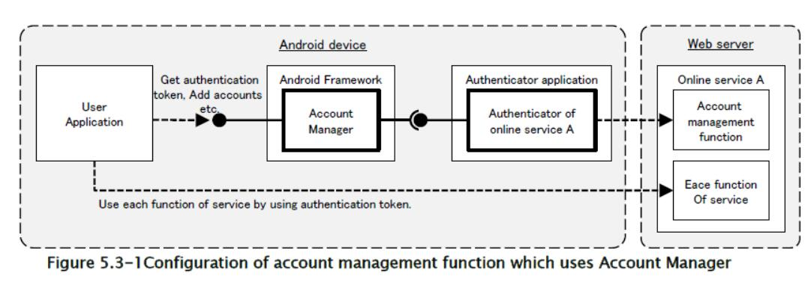
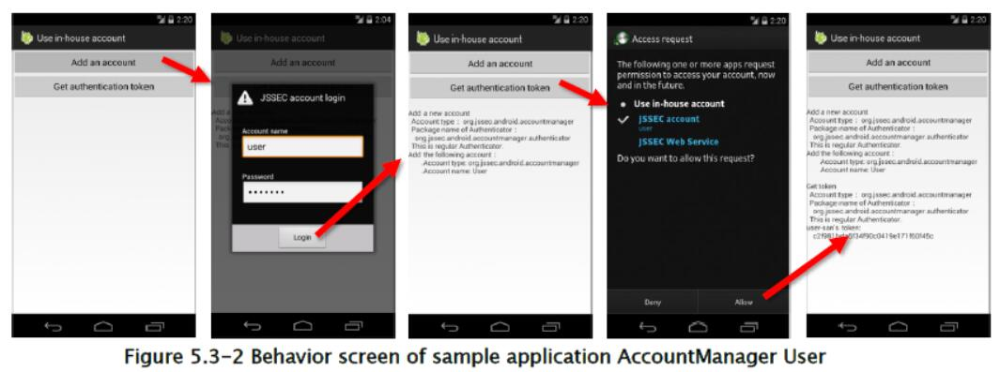
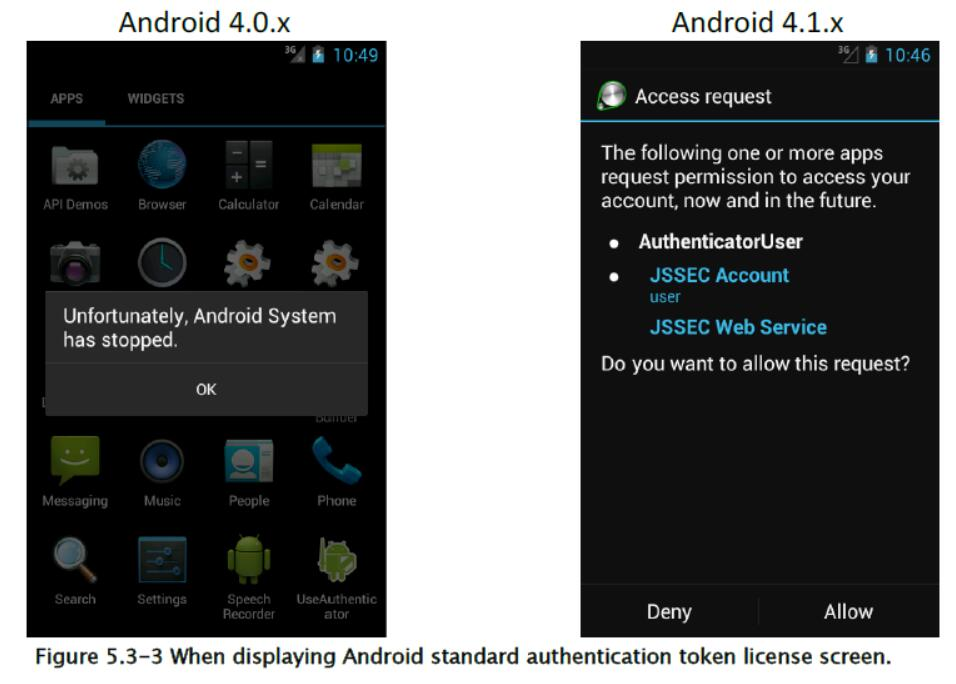

## 5.3 将内部账户添加到账户管理器

账户管理器是 Android OS 的系统，它集中管理帐户信息，是应用访问在线服务和认证令牌所必需的（帐户名称，密码）。 用户需要提前将账户信息注册到账户管理器，当应用尝试访问在线服务时，账户管理器在获得用户权限后，会自动提供应用认证令牌。 账户管理器的优势在于，应用不需要处理极其敏感的信息和密码。

使用账户管理器
的账户管理功能的结构如下图 5.3-1 所示。 “请求应用”是通过获取认证令牌，访问在线服务的应用，这是上述应用。 另一方面，“认证器应用”是账户管理器的功能扩展，并且向账户管理器提供称为认证器的对象，以便账户管理器可集中管理在线服务的账户信息和认证令牌。 请求应用和认证器应用不需要是单独的应用，因此这些应用可以实现为单个应用。



最初，用户应用（请求应用）和认证器应用的开发人员签名密钥可以是不同的密钥。 但是，Android 框架的错误仅在 Android 4.0.x 设备中存在 ，并且当用户应用和认证期应用的签名密钥不同时，用户应用中会发生异常，并且不能使用内部账户。 以下示例代码没有针对此缺陷实现任何替代方式。 详细信息请参阅“5.3.3.2 在 Android 4.0.x 中，用户应用和认证程序的签名密钥不同时发生的异常”。

### 5.3.1 示例代码

“5.3.1.1 创建内部帐户”是认证器应用的示例，“5.3.1.2 使用内部帐户”是请求应用的示例。 在 JSSEC 网站上分发的示例代码集中，每个代码集都对应账户管理器的认证器和用户。

#### 5.3.1.1 创建内部账户

以下是认证器应用的示例代码，它使账户管理器能够使用内部帐户。 在此应用中没有可以从主屏幕启动的活动。 请注意，它间接通过账户管理器，从另一个示例代码“5.3.1.2 使用内部帐户”调用。

要点：

1.  提供认证器的服务必须是私有的。
2.  登录界面的活动必须在验证器应用中实现。
3.  登录界面的活动必须实现为公共活动。
4.  指定登录界面的活动的类名的显式意图，必须设置为`KEY_INTENT`。
5.  敏感信息（如帐户信息或认证令牌）不得输出到日志中。
6.  密码不应保存在帐户管理器中。
7.  HTTPS 应该用于认证器与在线服务之间的通信。

提供认证器的账户管理器 IBinder 的服务，在`AndroidManifest.xml`中定义。 通过元数据指定编写认证器的资源XML文件。

账户管理器认证器/AndroidManifest.xml

```xml
<manifest xmlns:android="http://schemas.android.com/apk/res/android"
    package="org.jssec.android.accountmanager.authenticator"
    xmlns:tools="http://schemas.android.com/tools">
    <!-- Necessary Permission to implement Authenticator -->
    <uses-permission android:name="android.permission.GET_ACCOUNTS" />
    <uses-permission android:name="android.permission.AUTHENTICATE_ACCOUNTS" />
    <application
        android:allowBackup="false"
        android:icon="@drawable/ic_launcher"
        android:label="@string/app_name" >
        <!-- Service which gives IBinder of Authenticator to AccountManager -->
        <!-- *** POINT 1 *** The service that provides an authenticator must be private. -->
        <service
            android:name=".AuthenticationService"
            android:exported="false" >
            <!-- intent-filter and meta-data are usual pattern. -->
            <intent-filter>
                <action android:name="android.accounts.AccountAuthenticator" />
            </intent-filter>
            <meta-data
            android:name="android.accounts.AccountAuthenticator"
            android:resource="@xml/authenticator" />
        </service>
        <!-- Activity for for login screen which is displayed when adding an account -->
        <!-- *** POINT 2 *** The login screen activity must be implemented in an authenticator applicati
        on. -->
        <!-- *** POINT 3 *** The login screen activity must be made as a public activity. -->
        <activity
            android:name=".LoginActivity"
            android:exported="true"
            android:label="@string/login_activity_title"
            android:theme="@android:style/Theme.Dialog"
            tools:ignore="ExportedActivity" />
    </application>
</manifest>
```

通过 XML 文件定义认证器，指定内部账户的账户类型以及其他。

res/xml/authenticator.xml

```xml
<account-authenticator xmlns:android="http://schemas.android.com/apk/res/android"
    android:accountType="org.jssec.android.accountmanager"
    android:icon="@drawable/ic_launcher"
    android:label="@string/label"
    android:smallIcon="@drawable/ic_launcher"
    android:customTokens="true" />
```

为`AccountManager`提供`Authenticator`实例的服务。 简单的实现返回`JssecAuthenticator`类的实例，它就是由`onBind()`在此示例中实现的`Authenticator`，这就足够了。

AuthenticationService.java

```java
package org.jssec.android.accountmanager.authenticator;

import android.app.Service;
import android.content.Intent;
import android.os.IBinder;

public class AuthenticationService extends Service {

    private JssecAuthenticator mAuthenticator;
    
    @Override
    public void onCreate() {
        mAuthenticator = new JssecAuthenticator(this);
    }
    
    @Override
    public IBinder onBind(Intent intent) {
        return mAuthenticator.getIBinder();
    }
}
```

`JssecAuthenticator`是在此示例中实现的认证器。 它继承了`AbstractAccountAuthenticator`，并且实现了所有的抽象方法。 这些方法由账户管理器调用。 在`addAccount()`和`getAuthToken()`中，用于启动`LoginActivity`，从在线服务中获取认证令牌的意图返回到账户管理器。

JssecAuthenticator.java

```java
package org.jssec.android.accountmanager.authenticator;

import android.accounts.AbstractAccountAuthenticator;
import android.accounts.Account;
import android.accounts.AccountAuthenticatorResponse;
import android.accounts.AccountManager;
import android.accounts.NetworkErrorException;
import android.content.Context;
import android.content.Intent;
import android.os.Bundle;

public class JssecAuthenticator extends AbstractAccountAuthenticator {

    public static final String JSSEC_ACCOUNT_TYPE = "org.jssec.android.accountmanager";
    public static final String JSSEC_AUTHTOKEN_TYPE = "webservice";
    public static final String JSSEC_AUTHTOKEN_LABEL = "JSSEC Web Service";
    public static final String RE_AUTH_NAME = "reauth_name";
    protected final Context mContext;
    
    public JssecAuthenticator(Context context) {
        super(context);
        mContext = context;
    }
    
    @Override
    public Bundle addAccount(AccountAuthenticatorResponse response, String accountType,
        String authTokenType, String[] requiredFeatures, Bundle options)
        throws NetworkErrorException {
        AccountManager am = AccountManager.get(mContext);
        Account[] accounts = am.getAccountsByType(JSSEC_ACCOUNT_TYPE);
        Bundle bundle = new Bundle();
        if (accounts.length > 0) {
            // In this sample code, when an account already exists, consider it as an error.
            bundle.putString(AccountManager.KEY_ERROR_CODE, String.valueOf(-1));
            bundle.putString(AccountManager.KEY_ERROR_MESSAGE,
            mContext.getString(R.string.error_account_exists));
        } else {
            // *** POINT 2 *** The login screen activity must be implemented in an authenticator application.
            // *** POINT 4 *** The explicit intent which the class name of the login screen activity is specified must be set to KEY_INTENT.
            Intent intent = new Intent(mContext, LoginActivity.class);
            intent.putExtra(AccountManager.KEY_ACCOUNT_AUTHENTICATOR_RESPONSE, response);
            bundle.putParcelable(AccountManager.KEY_INTENT, intent);
        }
        return bundle;
    }
    
    @Override
    public Bundle getAuthToken(AccountAuthenticatorResponse response, Account account,
        String authTokenType, Bundle options) throws NetworkErrorException {
        Bundle bundle = new Bundle();
        if (accountExist(account)) {
            // *** POINT 4 *** KEY_INTENT must be given an explicit intent that is specified the class name of the login screen activity.
            Intent intent = new Intent(mContext, LoginActivity.class);
            intent.putExtra(RE_AUTH_NAME, account.name);
            bundle.putParcelable(AccountManager.KEY_INTENT, intent);
        } else {
            // When the specified account doesn't exist, consider it as an error.
            bundle.putString(AccountManager.KEY_ERROR_CODE, String.valueOf(-2));
            bundle.putString(AccountManager.KEY_ERROR_MESSAGE,
            mContext.getString(R.string.error_account_not_exists));
        }
        return bundle;
    }
    
    @Override
    public String getAuthTokenLabel(String authTokenType) {
        return JSSEC_AUTHTOKEN_LABEL;
    }
    
    @Override
    public Bundle confirmCredentials(AccountAuthenticatorResponse response, Account account,
        Bundle options) throws NetworkErrorException {
        return null;
    }
    
    @Override
    public Bundle editProperties(AccountAuthenticatorResponse response, String accountType) {
        return null;
    }
    
    @Override
    public Bundle updateCredentials(AccountAuthenticatorResponse response, Account account,
        String authTokenType, Bundle options) throws NetworkErrorException {
        return null;
    }
    
    @Override
    public Bundle hasFeatures(AccountAuthenticatorResponse response, Account account,
        String[] features) throws NetworkErrorException {
        Bundle result = new Bundle();
        result.putBoolean(AccountManager.KEY_BOOLEAN_RESULT, false);
        return result;
    }
    
    private boolean accountExist(Account account) {
        AccountManager am = AccountManager.get(mContext);
        Account[] accounts = am.getAccountsByType(JSSEC_ACCOUNT_TYPE);
        for (Account ac : accounts) {
            if (ac.equals(account)) {
                return true;
            }
        }
        return false;
    }
}
```

这是登录活动，它向在线服务发送帐户名称和密码，并执行登录认证，并因此获得认证令牌。 它会在添加新帐户或再次获取认证令牌时显示。 假设在线服务的实际访问在`WebService`类中实现。

LoginActivity.java


```java
package org.jssec.android.accountmanager.authenticator;

import org.jssec.android.accountmanager.webservice.WebService;
import android.accounts.Account;
import android.accounts.AccountAuthenticatorActivity;
import android.accounts.AccountManager;
import android.content.Intent;
import android.os.Bundle;
import android.text.InputType;
import android.text.TextUtils;
import android.util.Log;
import android.view.View;
import android.view.Window;
import android.widget.EditText;

public class LoginActivity extends AccountAuthenticatorActivity {

    private static final String TAG = AccountAuthenticatorActivity.class.getSimpleName();
    private String mReAuthName = null;
    private EditText mNameEdit = null;
    private EditText mPassEdit = null;
    
    @Override
    public void onCreate(Bundle icicle) {
        super.onCreate(icicle);
        // Display alert icon
        requestWindowFeature(Window.FEATURE_LEFT_ICON);
        setContentView(R.layout.login_activity);
        getWindow().setFeatureDrawableResource(Window.FEATURE_LEFT_ICON,
        android.R.drawable.ic_dialog_alert);
        // Find a widget in advance
        mNameEdit = (EditText) findViewById(R.id.username_edit);
        mPassEdit = (EditText) findViewById(R.id.password_edit);
        // *** POINT 3 *** The login screen activity must be made as a public activity, and suppose the attack access from other application.
        // Regarding external input, only RE_AUTH_NAME which is String type of Intent#extras, are handled.
        // This external input String is passed toextEdit#setText(), WebService#login(),new Account(),
        // as a parameter,it's verified that there's no problem if any character string is passed.
        mReAuthName = getIntent().getStringExtra(JssecAuthenticator.RE_AUTH_NAME);
        if (mReAuthName != null) {
        // Since LoginActivity is called with the specified user name, user name should not be editable.
        mNameEdit.setText(mReAuthName);
        mNameEdit.setInputType(InputType.TYPE_NULL);
        mNameEdit.setFocusable(false);
        mNameEdit.setEnabled(false);
        }
    }
    
    // It's executed when login button is pressed.
    public void handleLogin(View view) {
        String name = mNameEdit.getText().toString();
        String pass = mPassEdit.getText().toString();
        if (TextUtils.isEmpty(name) || TextUtils.isEmpty(pass)) {
            // Process when the inputed value is incorrect
            setResult(RESULT_CANCELED);
            finish();
        }
        // Login to online service based on the inpputted account information.
        WebService web = new WebService();
        String authToken = web.login(name, pass);
        if (TextUtils.isEmpty(authToken)) {
            // Process when authentication failed
            setResult(RESULT_CANCELED);
            finish();
        }
        // Process when login was successful, is as per below.
        // *** POINT 5 *** Sensitive information (like account information or authentication token) must not be output to the log.
        Log.i(TAG, "WebService login succeeded");
        if (mReAuthName == null) {
            // Register accounts which logged in successfully, to aAccountManager
            // *** POINT 6 *** Password should not be saved in Account Manager.
            AccountManager am = AccountManager.get(this);
            Account account = new Account(name, JssecAuthenticator.JSSEC_ACCOUNT_TYPE);
            am.addAccountExplicitly(account, null, null);
            am.setAuthToken(account, JssecAuthenticator.JSSEC_AUTHTOKEN_TYPE, authToken);
            Intent intent = new Intent();
            intent.putExtra(AccountManager.KEY_ACCOUNT_NAME, name);
            intent.putExtra(AccountManager.KEY_ACCOUNT_TYPE,
                JssecAuthenticator.JSSEC_ACCOUNT_TYPE);
            setAccountAuthenticatorResult(intent.getExtras());
            setResult(RESULT_OK, intent);
        } else {
            // Return authentication token
            Bundle bundle = new Bundle();
            bundle.putString(AccountManager.KEY_ACCOUNT_NAME, name);
            bundle.putString(AccountManager.KEY_ACCOUNT_TYPE,
                JssecAuthenticator.JSSEC_ACCOUNT_TYPE);
            bundle.putString(AccountManager.KEY_AUTHTOKEN, authToken);
            setAccountAuthenticatorResult(bundle);
            setResult(RESULT_OK);
        }
        finish();
    }
}
```

实际上，`WebService`类在这里是虚拟实现，这是假设认证总是成功的示例实现，并且固定字符串作为认证令牌返回。

WebService.java

```java
package org.jssec.android.accountmanager.webservice;
public class WebService {

    /**
    * Suppose to access to account managemnet function of online service.
    *
    * @param username Account name character string
    * @param password password character string
    * @return Return authentication token
    */
    public String login(String username, String password) {
        // *** POINT 7 *** HTTPS should be used for communication between an authenticator and the online services.
        // Actually, communication process with servers is implemented here, but Omit here, since this is a sample.
        return getAuthToken(username, password);
    }
    
    private String getAuthToken(String username, String password) {
        // In fact, get the value which uniqueness and impossibility of speculation are guaranteed by the server,
        // but the fixed value is returned without communication here, since this is sample.
        return "c2f981bda5f34f90c0419e171f60f45c";
    }
}
```

#### 5.3.1.2 使用内部账户


以下是应用示例代码，它添加内部帐户并获取认证令牌。 当另一个示例应用“5.3.1.1 创建内部帐户”安装在设备上时，可以添加内部帐户或获取认证令牌。 仅当两个应用的签名密钥不同时，才会显示“访问请求”界面。



要点：

在验证认证器是否正常之后，执行账户流程。

`AccountManager`用户应用的`AndroidManifest.xml`。 声明使用必要的权限。请参阅“5.3.3.1 账户管理器和权限的使用”来了解必要的权限。

账户管理器用户/AndroidManifest.xml

```xml
<manifest xmlns:android="http://schemas.android.com/apk/res/android"
    package="org.jssec.android.accountmanager.user" >
    <uses-permission android:name="android.permission.GET_ACCOUNTS" />
    <uses-permission android:name="android.permission.MANAGE_ACCOUNTS" />
    <uses-permission android:name="android.permission.USE_CREDENTIALS" />
    <application
        android:allowBackup="false"
        android:icon="@drawable/ic_launcher"
        android:label="@string/app_name"
        android:theme="@style/AppTheme" >
        <activity
            android:name=".UserActivity"
            android:label="@string/app_name"
            android:exported="true" >
            <intent-filter>
                <action android:name="android.intent.action.MAIN" />
                <category android:name="android.intent.category.LAUNCHER" />
            </intent-filter>
        </activity>
    </application>
</manifest>
```

用户应用的活动。 当点击屏幕上的按钮时，会执行`addAccount()`或`getAuthToken()`。 在某些情况下，对应特定帐户类型的认证器可能是伪造的，因此请注意在验证认证器正常后，启动帐户流程。

UserActivity.java

```java
package org.jssec.android.accountmanager.user;

import java.io.IOException;
import org.jssec.android.shared.PkgCert;
import org.jssec.android.shared.Utils;
import android.accounts.Account;
import android.accounts.AccountManager;
import android.accounts.AccountManagerCallback;
import android.accounts.AccountManagerFuture;
import android.accounts.AuthenticatorDescription;
import android.accounts.AuthenticatorException;
import android.accounts.OperationCanceledException;
import android.app.Activity;
import android.content.Context;
import android.os.Bundle;
import android.view.View;
import android.widget.TextView;

public class UserActivity extends Activity {

    // Information of the Authenticator to be used
    private static final String JSSEC_ACCOUNT_TYPE = "org.jssec.android.accountmanager";
    private static final String JSSEC_TOKEN_TYPE = "webservice";
    private TextView mLogView;
    
    @Override
    public void onCreate(Bundle savedInstanceState) {
        super.onCreate(savedInstanceState);
        setContentView(R.layout.user_activity);
        mLogView = (TextView)findViewById(R.id.logview);
    }
    
    public void addAccount(View view) {
        logLine();
        logLine("Add a new account");
        // *** POINT 1 *** Execute the account process after verifying if the authenticator is regular one.
        if (!checkAuthenticator()) return;
        AccountManager am = AccountManager.get(this);
        am.addAccount(JSSEC_ACCOUNT_TYPE, JSSEC_TOKEN_TYPE, null, null, this,
            new AccountManagerCallback<Bundle>() {
                
                @Override
                public void run(AccountManagerFuture<Bundle> future) {
                    try {
                        Bundle result = future.getResult();
                        String type = result.getString(AccountManager.KEY_ACCOUNT_TYPE);
                        String name = result.getString(AccountManager.KEY_ACCOUNT_NAME);
                        if (type != null && name != null) {
                            logLine("Add the following accounts:");
                            logLine(" Account type: %s", type);
                            logLine(" Account name: %s", name);
                        } else {
                            String code = result.getString(AccountManager.KEY_ERROR_CODE);
                            String msg = result.getString(AccountManager.KEY_ERROR_MESSAGE);
                            logLine("The account cannot be added");
                            logLine(" Error code %s: %s", code, msg);
                        }
                    } catch (OperationCanceledException e) {
                    } catch (AuthenticatorException e) {
                    } catch (IOException e) {
                    }
                }
            }, null);
    }
    
    public void getAuthToken(View view) {
        logLine();
        logLine("Get token");
        // *** POINT 1 *** After checking that the Authenticator is the regular one, execute account process.
        if (!checkAuthenticator()) return;
        AccountManager am = AccountManager.get(this);
        Account[] accounts = am.getAccountsByType(JSSEC_ACCOUNT_TYPE);
        if (accounts.length > 0) {
            Account account = accounts[0];
            am.getAuthToken(account, JSSEC_TOKEN_TYPE, null, this,
                new AccountManagerCallback<Bundle>() {
                    
                    @Override
                    public void run(AccountManagerFuture<Bundle> future) {
                        try {
                            Bundle result = future.getResult();
                            String name = result.getString(AccountManager.KEY_ACCOUNT_NAME);
                            String authtoken = result.getString(AccountManager.KEY_AUTHTOKEN);
                            logLine("%s-san's token:", name);
                            if (authtoken != null) {
                                logLine(" %s", authtoken);
                            } else {
                                logLine(" Couldn't get");
                            }
                        } catch (OperationCanceledException e) {
                            logLine(" Exception: %s",e.getClass().getName());
                        } catch (AuthenticatorException e) {
                            logLine(" Exception: %s",e.getClass().getName());
                        } catch (IOException e) {
                            logLine(" Exception: %s",e.getClass().getName());
                        }
                    }
                }, null);
        } else {
            logLine("Account is not registered.");
        }
    }
    
    // *** POINT 1 *** Verify that Authenticator is regular one.
    private boolean checkAuthenticator() {
        AccountManager am = AccountManager.get(this);
        String pkgname = null;
        for (AuthenticatorDescription ad : am.getAuthenticatorTypes()) {
            if (JSSEC_ACCOUNT_TYPE.equals(ad.type)) {
                pkgname = ad.packageName;
                break;
            }
        }
        if (pkgname == null) {
            logLine("Authenticator cannot be found.");
            return false;
        }
        logLine(" Account type: %s", JSSEC_ACCOUNT_TYPE);
        logLine(" Package name of Authenticator: ");
        logLine(" %s", pkgname);
        if (!PkgCert.test(this, pkgname, getTrustedCertificateHash(this))) {
            logLine(" It's not regular Authenticator(certificate is not matched.)");
            return false;
        }
        logLine(" This is regular Authenticator.");
        return true;
    }
    
    // Certificate hash value of regular Authenticator application
    // Certificate hash value can be checked in sample applciation JSSEC CertHash Checker
    private String getTrustedCertificateHash(Context context) {
        if (Utils.isDebuggable(context)) {
            // Certificate hash value of debug.keystore "androiddebugkey"
            return "0EFB7236 328348A9 89718BAD DF57F544 D5CCB4AE B9DB34BC 1E29DD26 F77C8255";
        } else {
            // Certificate hash value of keystore "my company key"
            return "D397D343 A5CBC10F 4EDDEB7C A10062DE 5690984F 1FB9E88B D7B3A7C2 42E142CA";
        }
    }
    
    private void log(String str) {
        mLogView.append(str);
    }
    
    private void logLine(String line) {
        log(line + "¥n");
    }
    
    private void logLine(String fmt, Object... args) {
        logLine(String.format(fmt, args));
    }
    
    private void logLine() {
        log("¥n");
    }
}
```

PkgCert.java

```java
package org.jssec.android.shared;

import java.security.MessageDigest;
import java.security.NoSuchAlgorithmException;
import android.content.Context;
import android.content.pm.PackageInfo;
import android.content.pm.PackageManager;
import android.content.pm.PackageManager.NameNotFoundException;
import android.content.pm.Signature;

public class PkgCert {

    public static boolean test(Context ctx, String pkgname, String correctHash) {
        if (correctHash == null) return false;
        correctHash = correctHash.replaceAll(" ", "");
        return correctHash.equals(hash(ctx, pkgname));
    }
    
    public static String hash(Context ctx, String pkgname) {
        if (pkgname == null) return null;
        try {
            PackageManager pm = ctx.getPackageManager();
            PackageInfo pkginfo = pm.getPackageInfo(pkgname, PackageManager.GET_SIGNATURES);
            if (pkginfo.signatures.length != 1) return null; // Will not handle multiple signatures.
            Signature sig = pkginfo.signatures[0];
            byte[] cert = sig.toByteArray();
            byte[] sha256 = computeSha256(cert);
            return byte2hex(sha256);
        } catch (NameNotFoundException e) {
            return null;
        }
    }
    
    private static byte[] computeSha256(byte[] data) {
        try {
            return MessageDigest.getInstance("SHA-256").digest(data);
        } catch (NoSuchAlgorithmException e) {
            return null;
        }
    }
    
    private static String byte2hex(byte[] data) {
        if (data == null) return null;
        final StringBuilder hexadecimal = new StringBuilder();
        for (final byte b : data) {
            hexadecimal.append(String.format("%02X", b));
        }
        return hexadecimal.toString();
    }
}
```

### 5.3.2 规则书

实现认证器应用时，遵循下列规则：

#### 5.3.2.1 提供认证器的服务必须是私有的（必需）

前提是，提供认证器的服务由账户管理器使用，并且不应该被其他应用访问。 因此，通过使其成为私有服务，它可以避免其他应用的访问。 此外，账户管理器以系统权限运行，所以即使是私有服务，账户管理器也可以访问。

#### 5.3.2.2 登录界面活动必须由认证器应用实现（必需）

用于添加新帐户并获取认证令牌的登录界面，应由认证应用实现。 自己的登录界面不应该在用户应用一端准备。 正如本文开头提到的，【账户管理器的优势在于，极其敏感的信息/密码不一定要由应用处理】，如果在用户应用一端准备登录界面，则密码由用户应用处理， 其设计越过了账户管理器的策略。

通过由身份验证器应用准备登录界面，操作登录界面的人仅限于设备用户。 这意味着，恶意应用无法通过尝试直接登录，或创建帐户来攻击帐户。

#### 5.3.2.3 登录界面活动必须是公共活动，并假设其他应用的攻击访问（必需）

登录界面活动是由用户应用加载的系统。 为了即使在用户应用和身份验证器应用的签名密钥不同时，也能展示登录界面，登录界面活动应该实现为公共活动。 登录界面活动是公共活动，意味着有可能会被恶意应用启动。 永远不要相信任何输入数据。 因此，有必要采取“3.2 小心并安全处理输入数据”中提到的对策。

#### 5.3.2.4 使用显示意图提供`KEY_INTENT `，带有登录界面活动的指定类名称（必需）


当认证器需要打开登录界面活动时，启动登录界面活动的意图，会在返回给账户管理器的 Bundle 中，由`KEY_INTENT`提供。 所提供的意图应该是指定登录界面活动的类名的显式意图。 在使用隐示意图，它指定动作名称的情况下，有可能并不启动由认证器应用本身准备的登录界面活动，而是其他应用准备的活动。 当恶意应用准备了和常规一样的登录界面时，用户可能会在伪造的登录界面中输入密码。

#### 5.3.2.5 敏感信息（如帐户信息和认证令牌）不得输出到日志（必需）

访问在线服务的应用有时会遇到麻烦，例如无法成功访问在线服务。 访问失败的原因各不相同，如网络环境管理不善，通信协议实现失败，权限不足，认证错误等。一个常见的实现方式是，程序输出详细信息给日志，以便开发人员可以稍后分析问题的原因。 

敏感信息（如密码或认证令牌）不应输出到日志中。 日志信息可以从其他应用读取，因此可能成为信息泄露的原因。 此外，如果帐户名称的泄漏可能导致损失，则不应将帐户名称输出到日志中。

#### 5.3.2.6 密码不应该保存在账户管理器中（推荐）

两个认证信息，密码和认证令牌可以保存在一个账户中，来注册账户管理器。 这些信息将以明文形式（即不加密）存储在以下目录下的`accounts.db`中。

+   Android 4.1 及之前：`/data/system/accounts.db`
+   Android 4.2 及之后：`/data/system/0/accounts.db or /data/system/<UserId>/accounts.db`

要阅读`accounts.db`的内容，需要 root 权限或系统权限，并且无法从市场上的 Android 设备中读取它。 在 Android 操作系统中存在漏洞的情况下，攻击者可以获得 root 权限或系统权限，保存在`accounts.db`中的认证信息将处在风险边缘。 

本文中介绍的认证应用旨在将认证令牌保存在账户管理器中，而不保存用户密码。 在一定时间内连续访问在线服务时，通常认证令牌的有效期限会延长，因此在大多数情况下，不保存密码的设计就足够了。

通常，认证令牌的有效期限比密码短，并且它的特点是可以随时禁用。 如果认证令牌泄漏，则可以将其禁用，因此与密码相比，认证令牌比较安全。 在认证令牌被禁用的情况下，用户可以再次输入密码以获得新的认证令牌。 

如果在密码泄漏时禁用密码，用户将无法再使用在线服务。 在这种情况下，它需要呼叫中心支持等，这将花费巨大的成本。 因此，最好从设计中避免在账户管理器中保存密码。 在不能避免保存密码的设计的情况下，应该采取高级别的逆向工程对策，如加密密码和混淆加密密钥。

#### 5.3.2.7 HTTPS 应该用于认证器和在线服务之间的通信（必需）

密码或认证令牌就是所谓的认证信息，如果被第三方接管，第三方可以伪装成有效用户。 由于认证器使用在线服务来发送/接收这些类型的认证信息，因此应使用可靠的加密通信方法，如 HTTPS。

#### 5.3.2.8 应该在验证认证器是否正常之后，执行帐户流程（必需）

如果有多个认证器在设备中定义了相同的帐户类型，则先前安装的认证器将生效。 所以，安装自己的认证器之后，它不会被使用。 

如果之前安装的认证器是恶意软件的伪装，则用户输入的帐户信息可能被恶意软件接管。 在执行帐户操作之前，用户应用应验证执行帐户操作的帐户类型，不管是否分配了常规认证器。

可以通过检查认证器的包的证书散列值，是否匹配预先确认的有效证书散列值，来验证分配给账户类型的认证器是否是正常的。 如果发现证书哈希值不匹配，则最好提示用户卸载程序包，它包含分配给该帐户类型的意外的认证验证器。

### 5.3.3 高级话题

#### 5.3.3.1 账户管理和权限的使用

要使用`AccountManager`类的每种方法，都需要在应用的`AndroidManifest.xml`中分别声明使用相应的权限。 表 5.3-1 显示了权限和方法的对应关系。

表 5.3-1 账户管理器的函数以及权限
 
|  | 账户管理器提供的函数 | |
| --- | --- | ---- |
| 权限 | 方法 | 解释 |
| `AUTHENTICATE_ACCOUNTS`（只有由认证器的相同密钥签名的软件包才可以使用。） | `getPassword()` | 获取密码 |
|  | `getUserData()` | 获取用户信息 |
|  | `addAccountExplicitly()` | 将账户添加到 DB |
|  | `peekAuthToken()` | 获取缓存令牌 |
|  | `setAuthToken()` | 注册认证令牌 |
|  | `setPassword()` | 修改密码 |
|  | `setUserData()` | 设置用户数据 |
|  | `renameAccount()` | 重命名账户 |
| `GET_ACCOUNTS` | `getAccounts()` | 获取所有账户的列表 |
| | `getAccountsByType()` | 获取指定类型的账户列表 |
| | `getAccountsByTypeAndFeatures()` | 获取带有特定特性的账户列表 |
| | `addOnAccountsUpdatedListener()` | 注册事件监听器 |
| | `hasFeatures()` | 它是否具有特定功能 |
| `MANAGE_ACCOUNTS` | `getAuthTokenByFeatures()` | 获取带有特定功能的账户的认证令牌 |
| | `addAccount()` | 请求用户添加账户 |
| | `removeAccount()` | 移除账户 |
| | `clearPassword()` | 初始化密码 |
| | `updateCredentials()` | 请求用户修改密码 |
| | `editProperties()` | 修改认证设置 |
| | `confirmCredentials()` | 请求用户再次输入密码 |
| `USE_CREDENTIALS` | `getAuthToken()` | 获取认证令牌 |
| | `blockingGetAuthToken()` | 获取认证令牌 |
| `MANAGE_ACCOUNTS`或`USE_CREDENTIALS` | `invalidateAuthToken()` | 删除缓存令牌 |

在使用需要`AUTHENTICATE_ACCOUNTS`权限的方法组的情况下，存在软件包的签名密钥以及权限相关的限制。 具体来说，提供认证器的包的签名密钥，和使用方法的应用的包的签名密钥应该是相同的。 因此，在分发使用方法组的应用时，除了认证器之外，必须使用`AUTHENTICATE_ACCOUNTS`权限，并且应使用认证器的相同密钥进行签名。

在 Android Studio 的开发阶段，由于固定的调试密钥库可能会被某些 Android Studio 项目共享，开发人员可能只考虑权限而不考虑签名，来实现和测试帐户管理器。 特别是，对于对每个应用使用不同签名密钥的开发人员来说，因为这种限制，在选择用于应用的密钥时要非常小心。 此外，由于`AccountManager`获得的数据包含敏感信息，因此需要小心处理，来减少泄漏或未授权使用的风险。

#### 5.3.3.2 在 Android 4.0.x 中，用户应用和认证器应用的签名密钥不同时发生的异常

认证令牌获取功能是由开发者密钥签发的用户应用所需的，它不同于认证器应用的签名密钥。通过显示 认证令牌许可证屏幕（`GrantCredentialsPermissionActivity`），`AccountManager`验证用户是否授予认证令牌的使用权。但是 Android 4.0.x 的 Android 框架中存在一个错误，只要`AccountManager`打开此屏幕，就会发生异常并且应用被强制关闭 。 （图5.3-3）。 错误的详细信息，请参阅 <https://code.google.com/p/android/issues/detail?id=23421>。 这个 bug 在 Android 4.1.x 及更高版本中无法找到。



