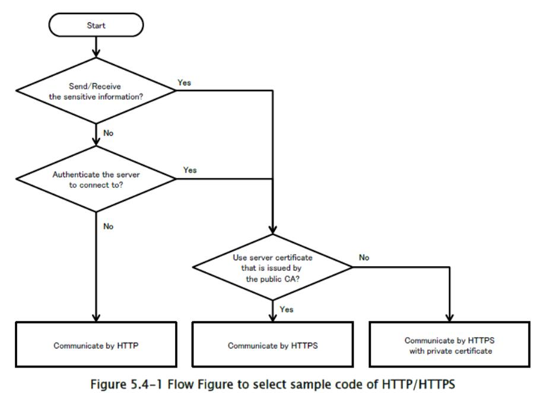
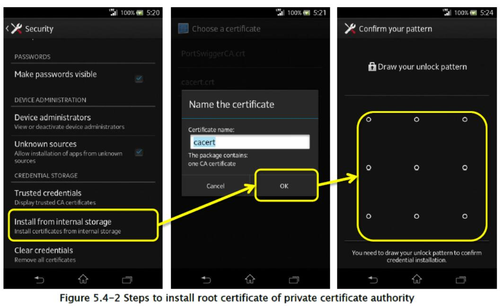
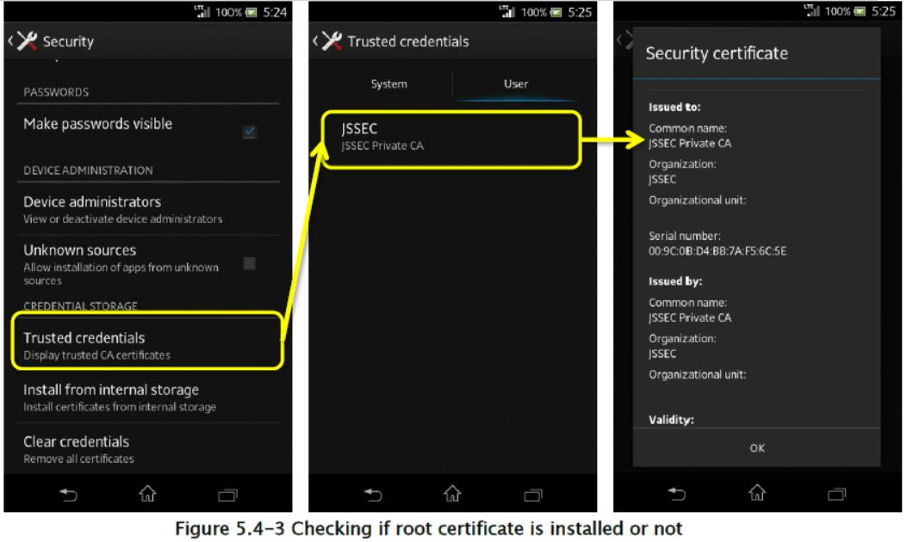
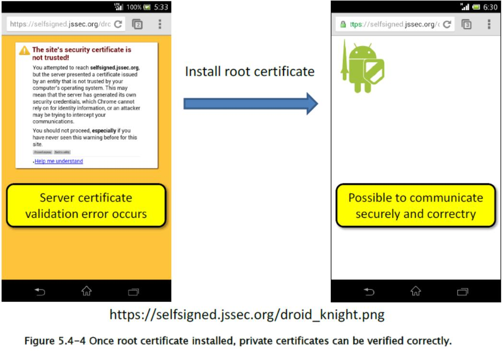

## 5.4 通过 HTTPS 的通信

大多数智能手机应用都与互联网上的 Web 服务器通信。 作为通信的方法，我们在这里集中讨论 HTTP 和 HTTPS 的两种方法。 从安全角度来看，HTTPS 通信更为可取。 最近，Google 或 Facebook 等主要 Web 服务已经开始使用 HTTPS 作为默认设置。

自 2012 年以来，Android 应用中 HTTPS 通信实现的许多缺陷已被指出。 这些缺陷可能用于访问由服务器证书操作的测试 Web 服务器，这些服务器证书不是由可信的第三方证书机构颁发，而是由私人（以下称为私有证书）颁发。 

本节将解释 HTTP 和 HTTPS 通信方法，并介绍使用 HTTPS 安全地访问由私有证书操作的 Web 服务器的方法。

#### 5.4.1 示例代码

你可以通过下面的图表（图 5.4-1）找出你应该实现的 HTTP / HTTPS 通信类型。



当发送或接收敏感信息时，将使用 HTTPS 通信，因为其通信通道使用 SSL / TLS 加密。 以下敏感信息需要 HTTPS 通信。


+   Web 服务的登录 ID /密码。
+   保持认证状态的信息（会话 ID，令牌，Cookie 等）
+   取决于 Web 服务的重要/机密信息（个人信息，信用卡信息等）

具有网络通信的智能手机应用是“系统”和 Web 服务器的一部分。 而且你必须根据整个“系统”的安全设计和编码，为每个通信选择 HTTP 或 HTTPS。 表 5.4-1 用于比较 HTTP 和 HTTPS。 表 5.4-2 是示例代码的差异。

表 5.4-1 HTTP 与 HTTPS 通信方式的比较

| | HTTP | HTTPS |
| --- | --- | --- |
| 特性 | URL | `http://`开头 | `https://`开头 |
| | 加密内容 | 否 | 是 |
| | 内容的篡改检测 | 不可能 | 可能 |
| | 对服务器进行认证 | 不可能 | 可能 |
| 损害的风险 | 由攻击者读取内容 | 高 | 低 |
| | 由攻击者修改内容 | 高 | 低 |
| | 应用访问了伪造的服务器 | 高 | 低 |

表 5.4-2 HTTP/HTTPS 通信示例代码的解释

| 示例代码 | 通信 | 收发敏感信息 | 服务器证书 |
| --- | --- | --- | --- |
| 通过 HTTP 的通信 | HTTP | 不适用 | - |
| 通过 HTTPS 的通信 | HTTPS | OK | 服务器证书由可信第三方机构签署，例如 Cybertrust 和 VeriSign |
| 通过 HTTPS 使用私有证书的通信 | HTTTPS | OK | 私有证书（经常能在内部服务器或测试服务器上看到的操作） |

Android 支持`java.net.HttpURLConnection` / `javax.net.ssl.HttpsURLConnection`作为 HTTP / HTTPS 通信 API。 在 Android 6.0（API Level 23）版本中，另一个 HTTP 客户端库 Apache HttpClient 的支持已被删除。

#### 5.4.1.1 通过 HTTP 进行通信

它基于两个前提，即通过 HTTP 通信发送/接收的所有内容都可能被攻击者嗅探和篡改，并且你的目标服务器可能被攻击者准备的假服务器替换。 只有在没有造成损害或损害在允许范围内的情况下，才能使用 HTTP 通信，即使在本地也是如此。 如果应用无法接受该前提，请参阅“5.4.1.2 通过 HTTPS 进行通信”和“5.4.1.3 通过 HTTPS 使用私有证书进行通信”。

以下示例代码显示了一个应用，它在 Web 服务器上执行图像搜索，获取结果图像并显示它。与服务器的 HTTP 通信在搜索时执行两次。第一次通信是搜索图像数据，第二次是获取它。它使用`AsyncTask`创建用于通信过程的工作线程，来避免在 UI 线程上执行通信。与服务器的通信中发送/接收的内容，在这里不被认为是敏感的（例如，用于搜索的字符串，图像的 URL 或图像数据）。因此，接收到的数据，如图像的 URL 和图像数据，可能由攻击者提供。为了简单地显示示例代码，在示例代码中没有采取任何对策，通过将接收到的攻击数据视为可容忍的。此外，在 JSON 解析或显示图像数据期间，可能出现异常的处理将被忽略。根据应用规范，有必要正确处理例外情况。

要点：

1.  发送的数据中不得包含敏感信息。
2.  假设收到的数据可能来自攻击者。

HttpImageSearch.java

```java
package org.jssec.android.https.imagesearch;

import android.os.AsyncTask;
import org.json.JSONException;
import org.json.JSONObject;
import java.io.BufferedInputStream;
import java.io.ByteArrayOutputStream;
import java.io.IOException;
import java.net.HttpURLConnection;
import java.net.URL;

public abstract class HttpImageSearch extends AsyncTask<String, Void, Object> {

    @Override
    protected Object doInBackground(String... params) {
        byte[] responseArray;
        // --------------------------------------------------------
        // Communication 1st time: Execute image search
        // --------------------------------------------------------
        // *** POINT 1 *** Sensitive information must not be contained in send data.
        // Send image search character string
        StringBuilder s = new StringBuilder();
        for (String param : params){
            s.append(param);
            s.append('+');
        }
        s.deleteCharAt(s.length() - 1);
        String search_url = "http://ajax.googleapis.com/ajax/services/search/images?v=1.0&q=" +
        s.toString();
        responseArray = getByteArray(search_url);
        if (responseArray == null) {
            return null;
        }
        // *** POINT 2 *** Suppose that received data may be sent from attackers.
        // This is sample, so omit the process in case of the searching result is the data from an attacker.
        // This is sample, so omit the exception process in case of JSON purse.
        String image_url;
        try {
            String json = new String(responseArray);
            image_url = new JSONObject(json).getJSONObject("responseData")
                .getJSONArray("results").getJSONObject(0).getString("url");
        } catch(JSONException e) {
            return e;
        }
        // --------------------------------------------------------
        // Communication 2nd time: Get images
        // --------------------------------------------------------
        // *** POINT 1 *** Sensitive information must not be contained in send data.
        if (image_url != null ) {
            responseArray = getByteArray(image_url);
            if (responseArray == null) {
                return null;
            }
        }
        // *** POINT 2 *** Suppose that received data may be sent from attackers.
        return responseArray;
    }
    
    private byte[] getByteArray(String strUrl) {
        byte[] buff = new byte[1024];
        byte[] result = null;
        HttpURLConnection response;
        BufferedInputStream inputStream = null;
        ByteArrayOutputStream responseArray = null;
        int length;
        try {
            URL url = new URL(strUrl);
            response = (HttpURLConnection) url.openConnection();
            response.setRequestMethod("GET");
            response.connect();
            checkResponse(response);
            inputStream = new BufferedInputStream(response.getInputStream());
            responseArray = new ByteArrayOutputStream();
            while ((length = inputStream.read(buff)) != -1) {
                if (length > 0) {
                    responseArray.write(buff, 0, length);
                }
            }
            result = responseArray.toByteArray();
        } catch (IOException e) {
            e.printStackTrace();
        } finally {
            if (inputStream != null) {
                try {
                    inputStream.close();
                } catch (IOException e) {
                    // This is sample, so omit the exception process
                }
            }
            if (responseArray != null) {
                try {
                    responseArray.close();
                } catch (IOException e) {
                    // This is sample, so omit the exception process
                }
            }
        }
        return result;
    }
    
    private void checkResponse(HttpURLConnection response) throws IOException {
        int statusCode = response.getResponseCode();
        if (HttpURLConnection.HTTP_OK != statusCode) {
            throw new IOException("HttpStatus: " + statusCode);
        }
    }
}
```

ImageSearchActivity.java

```java
package org.jssec.android.https.imagesearch;

import android.app.Activity;
import android.graphics.Bitmap;
import android.graphics.BitmapFactory;
import android.os.AsyncTask;
import android.os.Bundle;
import android.view.View;
import android.widget.EditText;
import android.widget.ImageView;
import android.widget.TextView;

public class ImageSearchActivity extends Activity {

    private EditText mQueryBox;
    private TextView mMsgBox;
    private ImageView mImgBox;
    private AsyncTask<String, Void, Object> mAsyncTask ;
    
    @Override
    public void onCreate(Bundle savedInstanceState) {
        super.onCreate(savedInstanceState);
        setContentView(R.layout.activity_main);
        mQueryBox = (EditText)findViewById(R.id.querybox);
        mMsgBox = (TextView)findViewById(R.id.msgbox);
        mImgBox = (ImageView)findViewById(R.id.imageview);
    }
    
    @Override
    protected void onPause() {
        // After this, Activity may be deleted, so cancel the asynchronization process in advance.
        if (mAsyncTask != null) mAsyncTask.cancel(true);
        super.onPause();
    }
    
    public void onHttpSearchClick(View view) {
        String query = mQueryBox.getText().toString();
        mMsgBox.setText("HTTP:" + query);
        mImgBox.setImageBitmap(null);
        // Cancel, since the last asynchronous process might not have been finished yet.
        if (mAsyncTask != null) mAsyncTask.cancel(true);
        // Since cannot communicate by UI thread, communicate by worker thread by AsynchTask.
        mAsyncTask = new HttpImageSearch() {
        
            @Override
            protected void onPostExecute(Object result) {
                // Process the communication result by UI thread.
                if (result == null) {
                    mMsgBox.append("¥nException occurs¥n");
                } else if (result instanceof Exception) {
                    Exception e = (Exception)result;
                    mMsgBox.append("¥nException occurs¥n" + e.toString());
                } else {
                    // Exception process when image display is omitted here, since it's sample.
                    byte[] data = (byte[])result;
                    Bitmap bmp = BitmapFactory.decodeByteArray(data, 0, data.length);
                    mImgBox.setImageBitmap(bmp);
                }
            }
        }.execute(query); 
        // pass search character string and start asynchronous process
    }
    
    public void onHttpsSearchClick(View view) {
        String query = mQueryBox.getText().toString();
        mMsgBox.setText("HTTPS:" + query);
        mImgBox.setImageBitmap(null);
        // Cancel, since the last asynchronous process might not have been finished yet.
        if (mAsyncTask != null) mAsyncTask.cancel(true);
        // Since cannot communicate by UI thread, communicate by worker thread by AsynchTask.
        mAsyncTask = new HttpsImageSearch() {
            @Override
            protected void onPostExecute(Object result) {
                // Process the communication result by UI thread.
                if (result instanceof Exception) {
                    Exception e = (Exception)result;
                    mMsgBox.append("¥nException occurs¥n" + e.toString());
                } else {
                    byte[] data = (byte[])result;
                    Bitmap bmp = BitmapFactory.decodeByteArray(data, 0, data.length);
                    mImgBox.setImageBitmap(bmp);
                }
            }
        }.execute(query); 
        // pass search character string and start asynchronous process
    }
}
```

AndroidManifest.xml

```xml
<manifest xmlns:android="http://schemas.android.com/apk/res/android"
    package="org.jssec.android.https.imagesearch"
    android:versionCode="1"
    android:versionName="1.0">
    <uses-permission android:name="android.permission.INTERNET"/>
    <application
        android:icon="@drawable/ic_launcher"
        android:allowBackup="false"
        android:label="@string/app_name" >
        <activity
            android:name=".ImageSearchActivity"
            android:label="@string/app_name"
            android:theme="@android:style/Theme.Light"
            android:exported="true" >
            <intent-filter>
                <action android:name="android.intent.action.MAIN" />
                <category android:name="android.intent.category.LAUNCHER" />
            </intent-filter>
        </activity>
    </application>
</manifest>
```

#### 5.4.1.2 使用 HTTPS 进行通信

在 HTTPS 通信中，检查服务器是否可信，以及传输的数据是否加密。 为了验证服务器，Android HTTPS 库验证“服务器证书”，它在 HTTPS 事务的握手阶段从服务器传输，其要点如下：

+   服务器证书由可信的第三方证书机构签署
+   服务器证书的期限和其他属性有效
+   服务器的主机名匹配服务器证书的主题字段中的 CN（通用名称）或 SAN（主题备用名称）

如果上述验证失败，则会引发`SSLException`（服务器证书验证异常）。 这可能意味着中间人攻击或服务器证书缺陷。 你的应用必须根据应用规范，以适当的顺序处理异常。 

下一个示例代码用于 HTTPS 通信，它使用可信的第三方证书机构颁发的服务器证书连接到 Web 服务器。 对于使用私有服务器证书的 HTTPS 通信，请参阅“5.4.1.3 通过 HTTPS 使用私有证书进行通信”。

以下示例代码展示了一个应用，它在 Web 服务器上执行图像搜索，获取结果图像并显示它。 与服务器的 HTTPS 通信在搜索时执行两次。 第一次通信是搜索图像数据，第二次是获取它。 它使用`AsyncTask`创建用于通信过程的工作线程，来避免在 UI 线程上执行通信。 与服务器的通信中发送/接收的所有内容，在这里被认为是敏感的（例如，用于搜索的字符串，图像的 URL 或图像数据）。 为了简单地显示示例代码，不会执行针对`SSLException`的特殊处理。 根据应用规范，有必要正确处理异常。 另外，下面的示例代码允许使用 SSLv3 进行通信。 通常，我们建议配置远程服务器上的设置来禁用 SSLv3，以避免针对 SSLv3 中的漏洞（称为 POODLE）的攻击。

要点：

1.  URI 以`https://`开头。
2.  发送数据中可能包含敏感信息。
3.  尽管数据是从通过 HTTPS 连接的服务器发送的，但要小心并安全地处理收到的数据。
4.  `SSLException`应该在应用中以适当的顺序处理。

HttpsImageSearch.java

```java
package org.jssec.android.https.imagesearch;

import org.json.JSONException;
import org.json.JSONObject;
import android.os.AsyncTask;
import java.io.BufferedInputStream;
import java.io.ByteArrayOutputStream;
import java.io.IOException;
import java.net.HttpURLConnection;
import java.net.URL;

public abstract class HttpsImageSearch extends AsyncTask<String, Void, Object> {

    @Override
    protected Object doInBackground(String... params) {
        byte[] responseArray;
        // --------------------------------------------------------
        // Communication 1st time : Execute image search
        // --------------------------------------------------------
        // *** POINT 1 *** URI starts with https://.
        // *** POINT 2 *** Sensitive information may be contained in send data.
        StringBuilder s = new StringBuilder();
        for (String param : params){
            s.append(param);
            s.append('+');
        }
        s.deleteCharAt(s.length() - 1);
        String search_url = "https://ajax.googleapis.com/ajax/services/search/images?v=1.0&q=" +
        s.toString();
        responseArray = getByteArray(search_url);
        if (responseArray == null) {
            return null;
        }
        // *** POINT 3 *** Handle the received data carefully and securely,
        // even though the data was sent from the server connected by HTTPS.
        // Omitted, since this is a sample. Please refer to "3.2 Handling Input Data Carefully and Securely."
        String image_url;
        try {
            String json = new String(responseArray);
            image_url = new JSONObject(json).getJSONObject("responseData")
                .getJSONArray("results").getJSONObject(0).getString("url");
        } catch(JSONException e) {
            return e;
        }
        // --------------------------------------------------------
        // Communication 2nd time : Get image
        // --------------------------------------------------------
        // *** POINT 1 *** URI starts with https://.
        // *** POINT 2 *** Sensitive information may be contained in send data.
        if (image_url != null ) {
            responseArray = getByteArray(image_url);
            if (responseArray == null) {
                return null;
            }
        }
        return responseArray;
    }
    
    private byte[] getByteArray(String strUrl) {
        byte[] buff = new byte[1024];
        byte[] result = null;
        HttpURLConnection response;
        BufferedInputStream inputStream = null;
        ByteArrayOutputStream responseArray = null;
        int length;
        try {
            URL url = new URL(strUrl);
            response = (HttpURLConnection) url.openConnection();
            response.setRequestMethod("GET");
            response.connect();
            checkResponse(response);
            inputStream = new BufferedInputStream(response.getInputStream());
            responseArray = new ByteArrayOutputStream();
            while ((length = inputStream.read(buff)) != -1) {
                if (length > 0) {
                    responseArray.write(buff, 0, length);
                }
            }
            result = responseArray.toByteArray();
        } catch (IOException e) {
            e.printStackTrace();
        } finally {
            if (inputStream != null) {
                try {
                    inputStream.close();
                } catch (IOException e) {
                    // This is sample, so omit the exception process
                }
            }
            if (responseArray != null) {
                try {
                    responseArray.close();
                } catch (IOException e) {
                    // This is sample, so omit the exception process
                }
            }
        }
        return result;
    }
    
    private void checkResponse(HttpURLConnection response) throws IOException {
        int statusCode = response.getResponseCode();
        if (HttpURLConnection.HTTP_OK != statusCode) {
            throw new IOException("HttpStatus: " + statusCode);
        }
    }
}
```

其他示例代码文件与“5.4.1.1 通过 HTTP 进行通信”相同，因此请参阅“5.4.1.1 通过 HTTP 进行通信”。

#### 5.4.1.3 使用私有证书通过 HTTPS 进行通信

这部分展示了一个 HTTPS 通信的示例代码，其中包含私人颁发的服务器证书（私有证书），但不是可信的第三方机构颁发的服务器证书。 请参阅“5.4.3.1 如何创建私有证书并配置服务器”，来创建私有证书机构和私有证书的根证书，并在 Web 服务器中设置 HTTPS。 示例程序的资产中包含`cacert.crt`文件。 它是私有证书机构的根证书文件。

以下示例代码展示了一个应用，在 Web 服务器上获取图像并显示该图像。 HTTPS 用于与服务器的通信。 它使用`AsyncTask`创建用于通信过程的工作线程，来避免在 UI 线程上执行通信。 与服务器的通信中发送/接收的所有内容（图像的 URL 和图像数据）都被认为是敏感的。 为了简单地显示示例代码，不会执行针对`SSLException`的特殊处理。 根据应用规范，有必要正确处理异常。

要点：

1.  使用私人证书机构的根证书来验证服务器证书。
2.  URI 以`https://`开头。
3.  发送数据中可能包含敏感信息。
4.  接收的数据可以像服务器一样被信任。
5.  `SSLException`应该在应用中以适当的顺序处理。

PrivateCertificathettpsGet.java

```java
package org.jssec.android.https.privatecertificate;

import java.io.BufferedInputStream;
import java.io.ByteArrayOutputStream;
import java.io.IOException;
import java.net.HttpURLConnection;
import java.net.URL;
import java.security.KeyStore;
import java.security.SecureRandom;
import javax.net.ssl.HostnameVerifier;
import javax.net.ssl.HttpsURLConnection;
import javax.net.ssl.SSLContext;
import javax.net.ssl.SSLException;
import javax.net.ssl.SSLSession;
import javax.net.ssl.TrustManagerFactory;
import android.content.Context;
import android.os.AsyncTask;

public abstract class PrivateCertificateHttpsGet extends AsyncTask<String, Void, Object> {

    private Context mContext;
    
    public PrivateCertificateHttpsGet(Context context) {
        mContext = context;
    }
    
    @Override
    protected Object doInBackground(String... params) {
        TrustManagerFactory trustManager;
        BufferedInputStream inputStream = null;
        ByteArrayOutputStream responseArray = null;
        byte[] buff = new byte[1024];
        int length;
        try {
            URL url = new URL(params[0]);
            // *** POINT 1 *** Verify a server certificate with the root certificate of a private certificate authority.
            // Set keystore which includes only private certificate that is stored in assets, to client.
            KeyStore ks = KeyStoreUtil.getEmptyKeyStore();
            KeyStoreUtil.loadX509Certificate(ks,
                mContext.getResources().getAssets().open("cacert.crt"));
            // *** POINT 2 *** URI starts with https://.
            // *** POINT 3 *** Sensitive information may be contained in send data.
            trustManager = TrustManagerFactory.getInstance(TrustManagerFactory.getDefaultAlgorithm());
            trustManager.init(ks);
            SSLContext sslCon = SSLContext.getInstance("TLS");
            sslCon.init(null, trustManager.getTrustManagers(), new SecureRandom());
            HttpURLConnection con = (HttpURLConnection)url.openConnection();
            HttpsURLConnection response = (HttpsURLConnection)con;
            response.setDefaultSSLSocketFactory(sslCon.getSocketFactory());
            response.setSSLSocketFactory(sslCon.getSocketFactory());
            checkResponse(response);
            // *** POINT 4 *** Received data can be trusted as same as the server.
            inputStream = new BufferedInputStream(response.getInputStream());
            responseArray = new ByteArrayOutputStream();
            while ((length = inputStream.read(buff)) != -1) {
                if (length > 0) {
                    responseArray.write(buff, 0, length);
                }
            }
            return responseArray.toByteArray();
        } catch(SSLException e) {
            // *** POINT 5 *** SSLException should be handled with an appropriate sequence in an application.
            // Exception process is omitted here since it's sample.
            return e;
        } catch(Exception e) {
            return e;
        } finally {
            if (inputStream != null) {
                try {
                    inputStream.close();
                } catch (Exception e) {
                    // This is sample, so omit the exception process
                }
            }
            if (responseArray != null) {
                try {
                    responseArray.close();
                } catch (Exception e) {
                    // This is sample, so omit the exception process
                }
            }
        }
    }
    
    private void checkResponse(HttpURLConnection response) throws IOException {
        int statusCode = response.getResponseCode();
        if (HttpURLConnection.HTTP_OK != statusCode) {
            throw new IOException("HttpStatus: " + statusCode);
        }
    }
}
```

KeyStoreUtil.java

```java
package org.jssec.android.https.privatecertificate;

import java.io.IOException;
import java.io.InputStream;
import java.security.KeyStore;
import java.security.KeyStoreException;
import java.security.NoSuchAlgorithmException;
import java.security.cert.Certificate;
import java.security.cert.CertificateException;
import java.security.cert.CertificateFactory;
import java.security.cert.X509Certificate;
import java.util.Enumeration;

public class KeyStoreUtil {

    public static KeyStore getEmptyKeyStore() throws KeyStoreException,
        NoSuchAlgorithmException, CertificateException, IOException {
        KeyStore ks = KeyStore.getInstance("BKS");
        ks.load(null);
        return ks;
    }
    
    public static void loadAndroidCAStore(KeyStore ks)
    throws KeyStoreException, NoSuchAlgorithmException,
    CertificateException, IOException {
        KeyStore aks = KeyStore.getInstance("AndroidCAStore");
        aks.load(null);
        Enumeration<String> aliases = aks.aliases();
        while (aliases.hasMoreElements()) {
            String alias = aliases.nextElement();
            Certificate cert = aks.getCertificate(alias);
            ks.setCertificateEntry(alias, cert);
        }
    }
    
    public static void loadX509Certificate(KeyStore ks, InputStream is)
        throws CertificateException, KeyStoreException {
        try {
            CertificateFactory factory = CertificateFactory.getInstance("X509");
            X509Certificate x509 = (X509Certificate)factory.generateCertificate(is);
            String alias = x509.getSubjectDN().getName();
            ks.setCertificateEntry(alias, x509);
        } finally {
            try { is.close(); } catch (IOException e) { /* This is sample, so omit the exception process
            */ }
        }
    }
}
```

PrivateCertificateHttpsActivity.java

```java
package org.jssec.android.https.privatecertificate;

import android.app.Activity;
import android.graphics.Bitmap;
import android.graphics.BitmapFactory;
import android.os.AsyncTask;
import android.os.Bundle;
import android.view.View;
import android.widget.EditText;
import android.widget.ImageView;
import android.widget.TextView;

    public class PrivateCertificateHttpsActivity extends Activity {
    
    private EditText mUrlBox;
    private TextView mMsgBox;
    private ImageView mImgBox;
    private AsyncTask<String, Void, Object> mAsyncTask ;
    
    @Override
    public void onCreate(Bundle savedInstanceState) {
        super.onCreate(savedInstanceState);
        setContentView(R.layout.activity_main);
        mUrlBox = (EditText)findViewById(R.id.urlbox);
        mMsgBox = (TextView)findViewById(R.id.msgbox);
        mImgBox = (ImageView)findViewById(R.id.imageview);
    }
    
    @Override
    protected void onPause() {
        // After this, Activity may be discarded, so cancel asynchronous process in advance.
        if (mAsyncTask != null) mAsyncTask.cancel(true);
        super.onPause();
    }
    
    public void onClick(View view) {
        String url = mUrlBox.getText().toString();
        mMsgBox.setText(url);
        mImgBox.setImageBitmap(null);
        // Cancel, since the last asynchronous process might have not been finished yet.
        if (mAsyncTask != null) mAsyncTask.cancel(true);
        // Since cannot communicate through UI thread, communicate by worker thread by AsynchTask.
        mAsyncTask = new PrivateCertificateHttpsGet(this) {
            @Override
            protected void onPostExecute(Object result) {
                // Process the communication result through UI thread.
                if (result instanceof Exception) {
                    Exception e = (Exception)result;
                    mMsgBox.append("¥nException occurs¥n" + e.toString());
                } else {
                    byte[] data = (byte[])result;
                    Bitmap bmp = BitmapFactory.decodeByteArray(data, 0, data.length);
                    mImgBox.setImageBitmap(bmp);
                }
            }
        }.execute(url); 
        // Pass URL and start asynchronization process
    }
}
```

### 5.4.2 规则书

使用 HTTP/S 通信时，遵循以下规则：

#### 5.4.2.1 必须通过 HTTPS 通信发送/接收敏感信息（必需）

在 HTTP 事务中，发送和接收的信息可能被嗅探或篡改，并且连接的服务器可能被伪装。 敏感信息必须通过 HTTPS 通信发送/接收。

#### 5.4.2.2 必须小心和安全地处理通过 HTTP 接收到的数据（必需）

HTTP 通信中收到的数据可能由攻击者利用应用的漏洞产生。 因此，你必须假定应用收到任何值和格式的数据，然后小心实现数据处理来处理收到的数据，以免造成任何漏洞。此外，你不应该盲目信任来自 HTTPS 服务器的数据。 由于 HTTPS 服务器可能由攻击者制作，或者收到的数据可能在 HTTPS 服务器的其他位置制作。 请参阅“3.2 小心和安全地处理输入数据”。

#### 5.4.2.3 `SSLException`必须适当处理，例如通知用户（必需）

在 HTTPS 通信中，当服务器证书无效或通信处于中间人攻击下时，`SSLException`会作为验证错误产生。 所以你必须为`SSLException`实现适当的异常处理。 通知用户通信失败，记录故障等，可被认为是异常处理的典型实现。 另一方面，在某些情况下可能不需要特别通知用户。 因为如何处理`SSLException`取决于应用规范和特性，你需要首先考虑彻底后再确定它。 

如上所述，当`SSLException`产生时，应用可能受到中间人的攻击，所以它不能实现为，试图通过例如 HTTP 的非安全协议再次发送/接收敏感信息。

#### 5.4.2.4 不要创建自定义的`TrustManager`（必需）

仅仅更改用于验证服务器证书的`KeyStore`，就足以通过 HTTPS ，与例如自签名证书的私有证书进行通信。 但是，正如在“5.4.3.3 禁用证书验证的危险代码”中所解释的那样，在因特网上有很多危险的`TrustManager`实现，与用于这种目的的示例代码一样。 通过引用这些示例代码而实现的应用可能有此漏洞。 

当你需要通过 HTTPS 与私有证书进行通信时，请参阅“5.4.1.3 通过 HTTPS 与私有证书进行通信”中的安全示例代码。 

当然，自定义的`TrustManager`可以安全地实现，但需要足够的加密处理和加密通信知识，以免执行存在漏洞的代码。 所以这个规则应为（必需）。

### 5.4.3 高级话题

#### 5.4.3.1 如何创建私有证书并配置服务器

在本节中，将介绍如何在 Linux（如 Ubuntu 和 CentOS）中创建私有证书和配置服务器。 私有证书是指私人签发的服务器证书，并由 Cybertrust 和 VeriSign 等可信第三方证书机构签发的服务器证书通知。


创建私有证书机构

首先，你需要创建一私有证书机构来颁发私有证书。 私有证书机构是指私有创建的证书机构以及私有证书。 你可以使用单个私有证书机构颁发多个私有证书。 存储私有证书机构的个人电脑应严格限制为只能由可信的人访问。 

为了创建私有证书机构，必须创建两个文件，例如以下 shell 脚本`newca.sh`和设置文件`openssl.cnf`，然后执行它们。 在 shell 脚本中，`CASTART`和`CAEND`代表证书机构的有效期，`CASUBJ`代表证书机构的名称。 所以这些值需要根据你创建的证书机构进行更改。 在执行 shell 脚本时，访问证书机构的密码总共需要 3 次，所以你需要每次都输入它。

newca.sh -- 创建证书机构的 Shell 脚本

```sh
#!/bin/bash

umask 0077

CONFIG=openssl.cnf
CATOP=./CA
CAKEY=cakey.pem
CAREQ=careq.pem
CACERT=cacert.pem
CAX509=cacert.crt
CASTART=130101000000Z # 2013/01/01 00:00:00 GMT
CAEND=230101000000Z # 2023/01/01 00:00:00 GMT
CASUBJ="/CN=JSSEC Private CA/O=JSSEC/ST=Tokyo/C=JP"

mkdir -p ${CATOP}
mkdir -p ${CATOP}/certs
mkdir -p ${CATOP}/crl
mkdir -p ${CATOP}/newcerts
mkdir -p ${CATOP}/private
touch ${CATOP}/index.txt

openssl req -new -newkey rsa:2048 -sha256 -subj "${CASUBJ}" ¥
    -keyout ${CATOP}/private/${CAKEY} -out ${CATOP}/${CAREQ}
openssl ca -selfsign -md sha256 -create_serial -batch ¥
    -keyfile ${CATOP}/private/${CAKEY} ¥
    -startdate ${CASTART} -enddate ${CAEND} -extensions v3_ca ¥
    -in ${CATOP}/${CAREQ} -out ${CATOP}/${CACERT} ¥
    -config ${CONFIG}
openssl x509 -in ${CATOP}/${CACERT} -outform DER -out ${CATOP}/${CAX509}
```

openssl.cnf -- 2 个 shell 脚本共同参照的 openssl 命令的设置文件

```
[ ca ]
default_ca = CA_default # The default ca section

[ CA_default ]
dir = ./CA # Where everything is kept
certs = $dir/certs # Where the issued certs are kept
crl_dir = $dir/crl # Where the issued crl are kept
database = $dir/index.txt # database index file.
                    #Proprietary-defined _subject = no # Set to 'no' to allow creation of
                    # several ctificates with same subject.
new_certs_dir = $dir/newcerts # default place for new certs.
certificate = $dir/cacert.pem # The CA certificate
serial = $dir/serial # The current serial number
crlnumber = $dir/crlnumber # the current crl number
                    # must be commented out to leave a V1 CRL
crl = $dir/crl.pem # The current CRL
private_key = $dir/private/cakey.pem# The private key
RANDFILE = $dir/private/.rand # private random number file
x509_extensions = usr_cert # The extentions to add the cert
name_opt = ca_default # Subject Name options
cert_opt = ca_default # Certificate field options
policy = policy_match

[ policy_match ]
countryName = match
stateOrProvinceName = match
organizationName = supplied
organizationalUnitName = optional
commonName = supplied
emailAddress = optional

[ usr_cert ]
basicConstraints=CA:FALSE
nsComment = "OpenSSL Generated Certificate"
subjectKeyIdentifier=hash
authorityKeyIdentifier=keyid,issuer

[ v3_ca ]
subjectKeyIdentifier=hash
authorityKeyIdentifier=keyid:always,issuer
basicConstraints = CA:true
```

创建私有证书

为了创建私有证书，你必须创建一个 shell 脚本并执行它，像下面的`newca.sh`一样。 在 shell 脚本中，`SVSTART`和`SVEND`代表私有证书的有效期，`SVSUBJ`代表 Web 服务器的名称，所以这些值需要根据目标 Web 服务器而更改。 尤其是，你需要确保不要将错误的主机名设置为`SVSUBJ`的`/CN`，它指定了 Web 服务器主机名。 在执行 shell 脚本时，会询问访问证书机构的密码，因此你需要输入你在创建私有证书机构时设置的密码。 之后，`y / n`总共被询问 2 次，每次需要输入`y`。

newsv.sh -- 签发私有证书的 Shell 脚本

```sh
#!/bin/bash

umask 0077

CONFIG=openssl.cnf
CATOP=./CA
CAKEY=cakey.pem
CACERT=cacert.pem
SVKEY=svkey.pem
SVREQ=svreq.pem
SVCERT=svcert.pem
SVX509=svcert.crt
SVSTART=130101000000Z # 2013/01/01 00:00:00 GMT
SVEND=230101000000Z # 2023/01/01 00:00:00 GMT
SVSUBJ="/CN=selfsigned.jssec.org/O=JSSEC Secure Cofing Group/ST=Tokyo/C=JP"

openssl genrsa -out ${SVKEY} 2048
openssl req -new -key ${SVKEY} -subj "${SVSUBJ}" -out ${SVREQ}
openssl ca -md sha256 ¥
    -keyfile ${CATOP}/private/${CAKEY} -cert ${CATOP}/${CACERT} ¥
    -startdate ${SVSTART} -enddate ${SVEND} ¥
    -in ${SVREQ} -out ${SVCERT} -config ${CONFIG}
openssl x509 -in ${SVCERT} -outform DER -out ${SVX509}
```

执行上面的 shell 脚本后，Web 服务器的`svkey.pem`（私钥文件）和`svcert.pem`（私有证书文件）都在工作目录下生成。 当 Web 服务器是 Apache 时，你将在配置文件中指定`prikey.pem`和`cert.pem`，如下所示。

```
SSLCertificateFile "/path/to/svcert.pem"
SSLCertificateKeyFile "/path/to/svkey.pem"
```

#### 5.4.3.2 将私有证书机构的根证书安装到 Android 操作系统的证书商店

在示例代码“5.4.1.3 通过使用私有证书的 HTTPS 进行通信”中，介绍了通过将根证书安装到应用中，使用私有证书建立应用到 Web 服务器的 HTTPS 会话的方法。 本节将介绍通过将根证书安装到 Android OS 中，建立使用私有证书的所有应用到 Web 服务器的 HTTPS 会话的方法。 请注意，你安装的所有东西，应该是由可信证书机构颁发的证书，包括你自己的证书机构。 

首先，你需要将根证书文件`cacert.crt`复制到 Android 设备的内部存储器中。 你也可以从 <https://selfsigned.jssec.org/cacert.crt> 获取示例代码中使用的根证书文件。

然后，你将从 Android 设置中打开安全页面，然后你可以按如下方式在 Android 设备上安装根证书。





在 Android 操作系统中安装根证书后，所有应用都可以正确验证证书机构颁发的每个私有证书。 下图显示了在 Chrome 浏览器中显示 <https://selfsigned.jssec.org/droid_knight.png> 时的示例。



通过以这种方式安装根证书，即使是使用示例代码“5.4.1.2 通过 HTTPS 通信”的应用，也可以通过 HTTPS 正确连接到使用私有证书操作的 Web 服务器。

#### 5.4.3.3 禁止证书验证的危险代码

互联网上发现了很多不正确的示例（代码片段），它们允许应用在证书验证错误发生后，通过 HTTPS 与 Web 服务器继续通信。 由于它们作为一种方式而引入，通过 HTTPS 与使用私有证书的 Web 服务器进行通信，因此开发人员通过复制和粘贴使用这些示例代码，创建了许多应用。 不幸的是，他们中的大多数容易受到中间人攻击。 正如本文前面所述，“2012 年，Android 应用中 HTTPS 通信实现中的许多缺陷被指出”，许多 Android 应用已经实现了这种易受攻击的代码。 

下面显示了 HTTPS 通信的几个存在漏洞的代码片段。 当你找到此类代码片段时，强烈建议替换为“5.4.1.3 通过 HTTPS 与私有证书进行通信”的示例代码。

风险：创建空`TrustManager`时的情况

```java
TrustManager tm = new X509TrustManager() {
    @Override
    public void checkClientTrusted(X509Certificate[] chain,
        String authType) throws CertificateException {
        // Do nothing -> accept any certificates
    }
    
    @Override
    public void checkServerTrusted(X509Certificate[] chain,
        String authType) throws CertificateException {
        // Do nothing -> accept any certificates
    }
    
    @Override
    public X509Certificate[] getAcceptedIssuers() {
        return null;
    }
};
```

风险：创建空`HostnameVerifier`时的情况

```java
HostnameVerifier hv = new HostnameVerifier() {
    @Override
    public boolean verify(String hostname, SSLSession session) {
        // Always return true -> Accespt any host names
        return true;
    }
};
```

风险：使用`ALLOW_ALL_HOSTNAME_VERIFIER`的情况

```java
SSLSocketFactory sf;

[...]

sf.setHostnameVerifier(SSLSocketFactory.ALLOW_ALL_HOSTNAME_VERIFIER);
```

#### 5.4.3.4 HTTP 请求头配置的注意事项

如果你希望为 HTTP 或 HTTPS 通信指定你自己的单个 HTTP 请求头，请使用`URLConnection`类中的`setRequestProperty()`或`addRequestProperty()`方法。 如果你使用从外部来源接收的输入数据作为这些方法的参数，则必须实施 HTTP 协议头注入保护。 HTTP 协议头注入攻击的第一步，是在输入数据中包含回车代码（在 HTTP 头中用作分隔符）。 因此，必须从输入数据中删除所有回车代码。

配置 HTTP 请求头

```java
public byte[] openConnection(String strUrl, String strLanguage, String strCookie) {
    // HttpURLConnection is a class derived from URLConnection
    HttpURLConnection connection;
    try {
        URL url = new URL(strUrl);
        connection = (HttpURLConnection) url.openConnection();
        connection.setRequestMethod("GET");
        // *** POINT *** When using input values in HTTP request headers,
        // check the input data in accordance with the application's requirements
        // (see Section 3.2: Handling Input Data Carefully and Securely)
        if (strLanguage.matches("^[a-zA-Z ,-]+$")) {
            connection.addRequestProperty("Accept-Language", strLanguage);
        } else {
            throw new IllegalArgumentException("Invalid Language : " + strLanguage);
        }
        // *** POINT *** Or URL-encode the input data (as appropriate for the purposes of the app in
        queestion)
        connection.setRequestProperty("Cookie", URLEncoder.encode(strCookie, "UTF-8"));
        connection.connect();
        
        [...]
```

#### 5.4.3.5 用于固定的注解和实现示例

当应用使用 HTTPS 通信时，在通信开始时执行的握手过程中的一个步骤是，检查从远程服务器发送的证书是否由第三方证书机构签署。但是，攻击者可能会从第三方认证代理获取不合适的证书，或者可能从证书机构获取签署的密钥来构造不合适的证书。在这种情况下，应用将无法在握手过程中检测到攻击，即使在攻击者建立不正确的服务器或中间人攻击的情况下也是如此 - 因此， ，可能会造成损失。

固定技术是一种有效的策略，可以防止不正当的第三方证书机构使用这些类型的证书，来进行中间人攻击。在这种方法中，远程服务器的证书和公钥被预先存储在一个应用中，并且这个信息用于握手过程，以及握手过程完成后的重新测试。

如果第三方证书机构（公钥基础设施的基础）的可信度受到损害，则可以使用固定来恢复通信的安全性。 应用开发人员应评估自己的应用处理的资产级别，并决定是否实现这些测试。

在握手过程中使用存储在应用中的证书和公钥

为了在握手过程中，使用存储在应用中的远程服务器证书或公钥中包含的信息，应用必须创建包含此信息的，自己的`KeyStore`并在通信时使用它。 如上所述，即使在使用来自不正当的第三方证书机构的证书的，中间人攻击的情况下，这也将允许应用检测握手过程中的不当行为。 请参阅“5.4.1.3 使用 HTTPS 与私有证书进行通信”一节中介绍的示例代码，了解建立应用自己的`KeyStore`来执行 HTTPS 通信的详细方法。

握手过程完成后，使用应用中存储的证书和公钥信息进行重新测试

为了在握手过程完成后重新测试远程服务器，应用首先会获得证书链，它在握手过程中受到系统测试和信任，然后比较该证书链和预先存储在应用中的信息。 如果比较结果表明它与应用中存储的信息一致，则可以允许通信进行；否则，应该中止通信过程。 但是，如果应用使用下面列出的方法，尝试获取在握手期间受系统信任的证书链，则应用可能无法获得预期的证书链，从而存在固定可能无法正常工作的风险 [26]。

> [26] 这篇文章详细解释了风险：<https://www.cigital.com/blog/ineffective-certificate-pinning-implementations/>。

+   `javax.net.ssl.SSLSession.getPeerCertificates()`
+   `javax.net.ssl.SSLSession.getPeerCertificateChain()`

这些方法返回的东西，不是在握手过程中受系统信任的证书链，而是应用从通信伙伴本身接收到的证书链。 因此，即使中间人攻击导致证书链中附加不正当证书机构的证书，上述方法也不会返回握手期间受系统信任的证书; 相反，应用最初试图连接的服务器的证书也将同时返回。 由于固定，这个证书将等同于预先存储在应用中的证书；因此重新测试它不会检测到任何不当行为。 由于这个以及其他类似的原因，在握手后执行重新测试时，最好避免使用上述方法。

在 Android 版本4.2（API 级别 17）及更高版本中，使用`net.http.X509TrustManagerExtensions中的checkServerTrusted()`方法，将允许应用仅获取握手期间受系统信任的证书链。

一个示例，展示了使用`X509TrustManagerExtensions`的固定

```java
// Store the SHA-256 hash value of the public key included in the correct certificate for the remote server (pinning)
private static final Set<String> PINS = new HashSet<>(Arrays.asList(
    new String[] {
        "d9b1a68fceaa460ac492fb8452ce13bd8c78c6013f989b76f186b1cbba1315c1",
        "cd13bb83c426551c67fabcff38d4496e094d50a20c7c15e886c151deb8531cdc"
    }
));

// Communicate using AsyncTask work threads
protected Object doInBackground(String... strings) {

    [...]

    // Obtain the certificate chain that was trusted by the system by testing during the handshake
    X509Certificate[] chain = (X509Certificate[]) connection.getServerCertificates();
    X509TrustManagerExtensions trustManagerExt = new X509TrustManagerExtensions((X509TrustManager) (trus
    tManagerFactory.getTrustManagers()[0]));
    List<X509Certificate> trustedChain = trustManagerExt.checkServerTrusted(chain, "RSA", url.getHost());
    // Use public-key pinning to test
    boolean isValidChain = false;
    for (X509Certificate cert : trustedChain) {
        PublicKey key = cert.getPublicKey();
        MessageDigest md = MessageDigest.getInstance("SHA-256");
        String keyHash = bytesToHex(md.digest(key.getEncoded()));
        // Compare to the hash value stored by pinning
        if(PINS.contains(keyHash)) isValidChain = true;
    }
    if (isValidChain) {
        // Proceed with operation
    } else {
        // Do not proceed with operation
    }
    
    [...]
}

private String bytesToHex(byte[] bytes) {
    StringBuilder sb = new StringBuilder();
    for (byte b : bytes) {
        String s = String.format("%02x", b);
        sb.append(s);
    }
    return sb.toString();
}
```

#### 5.4.3.6 使用 Google Play 服务解决 OpenSSL 漏洞的策略

Google Play 服务（版本 5.0 和更高）提供了一个称为 Provider Installer 的框架。 这可以用于解决安全供应器中的漏洞，它是 OpenSSL 和其他加密相关技术的实现。 详细信息请参见 “5.6.3.5 通过 Google Play 服务解决安全供应器的漏洞”。

#### 5.4.3.7 网络安全配置

Android 7.0（API Level 24）引入了一个称为“网络安全配置”的框架，允许各个应用为网络通信配置它们自己的安全设置。 通过使用此框架，应用可以轻松集成各种技术，来提高应用安全性，不仅包括与私钥证书和公钥固定的 HTTPS 通信，还可防止未加密（HTTP）通信，以及仅在调试过程中启用的私钥证书 [27]。

> [27] 网络安全配置的更多信息，请见 <https://developer.android.com/training/articles/security-config.html>。

只需通过配置`xml`文件中的设置，即可访问网络安全配置提供的各种功能，它们可应用于整个应用的 HTTP 和 HTTPS 通信。 这消除了修改应用代码或执行任何额外操作的需要，简化了实现并提供了防范组合错误或漏洞的有效方法。

使用私有证书通过 HTTPS 进行通信

“5.4.1.3 通过 HTTPS 与有证书进行通信”部分介绍了与私有证书（例如自签名证书或公司内部证书）的 HTTPS 通信的示例代码。 但是，通过使用网络安全配置，开发人员可以在“5.4.1.2 通过 HTTPS 进行通信”的示例代码中使用私有证书，而无需实现。

使用私有证书与特定域进行通信

```xml
<?xml version="1.0" encoding="utf-8"?>
<network-security-config>
    <domain-config>
        <domain includeSubdomains="true">jssec.org</domain>
        <trust-anchors>
            <certificates src="@raw/private_ca" />
        </trust-anchors>
    </domain-config>
</network-security-config>
```

在上面的示例中，用于通信的私有证书（`private_ca`）可以作为资源存储在应用中，带有使用条件及其在`.xml`文件中描述的适用范围。 通过使用`<domain-config>`标签，私有证书可以仅仅应用于特定域。 为了对应用执行的所有 HTTPS 通信使用私有证书，请使用`<base-config>`标签，如下所示。

对应用执行的所有 HTTPS 通信使用私人证书

```xml
<?xml version="1.0" encoding="utf-8"?>
<network-security-config>
    <base-config>
        <trust-anchors>
            <certificates src="@raw/private_ca" />
        </trust-anchors>
    </base-config>
</network-security-config>
```

固定

我们在“5.4.3.5 针对固定的注解和实现示例”中提到了公钥固定。通过使用网络安全配置，如下例所示，你不必在代码中实现认证过程; 相反，`xml`文件中的规范足以确保正确的认证。

对 HTTPS 通信使用公钥固定

```xml
<?xml version="1.0" encoding="utf-8"?>
<network-security-config>
    <domain-config>
    <domain includeSubdomains="true">jssec.org</domain>
        <pin-set expiration="2018-12-31">
            <pin digest="SHA-256">e30Lky+iWK21yHSls5DJoRzNikOdvQUOGXvurPidc2E=</pin>
            <!-- 用于备份 -->
            <pin digest="SHA-256">fwza0LRMXouZHRC8Ei+4PyuldPDcf3UKgO/04cDM1oE=</pin>
        </pin-set>
    </domain-config>
</network-security-config>
```

上面`<pin>`标签描述的数量，是用于固定的公钥的 base64 编码哈希值。 唯一支持的散列函数是 SHA-256。

防止未加密（HTTP）通信

使用网络安全配置可以阻止应用进行 HTTP 通信（未加密通信）。

防止未加密（HTTP）通信

```xml
<?xml version="1.0" encoding="utf-8"?>
<network-security-config>
    <domain-config cleartextTrafficPermitted="false">
    <domain includeSubdomains="true">jssec.org</domain>
    </domain-config>
</network-security-config>
```

在上面的例子中，我们在`<domain-config>`标签中指定了属性`cleartextTrafficPermitted="false"`。 这可以防止指定域的 HTTP 通信，从而强制使用 HTTPS 通信。 在`<base-config>`标记中包含此属性设置，将会阻止所有域的 HTTP 通信 [28]。但请谨慎注意，此设置不适用于`WebView`。

> [28] 网络安全配置如何为非 HTTP 连接工作，请参阅以下 API 参考。

特地用于调试目的的私有证书

为了在应用开发过程中进行调试，开发人员可能希望使用私有证书，与某些 HTTPS 服务器进行通信，它们由于应用开发目的而存在。 在这种情况下，开发人员必须注意确保没有危险的实现（包括禁用证书认证的代码）被合并到应用中；这在“5.4.3.3 禁用证书验证的危险代码”一节中讨论。 在网络安全配置中，可以按照下面的示例来配置，来规定一组仅在调试时才使用的证书（仅当`AndroidManifest.xml`文件中的`android:debuggable`设置为`true`时）。 这消除了危险代码可能无意中保留在应用的发行版中的风险，因此是防止漏洞的有效手段。

仅在调试时使用私有证书

```xml
<?xml version="1.0" encoding="utf-8"?>
<network-security-config>
    <debug-overrides>
        <trust-anchors>
            <certificates src="@raw/private_cas" />
        </trust-anchors>
    </debug-overrides>
</network-security-config>
```

