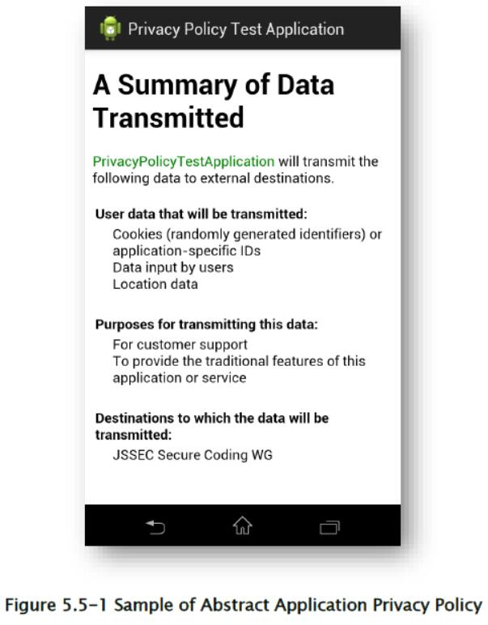
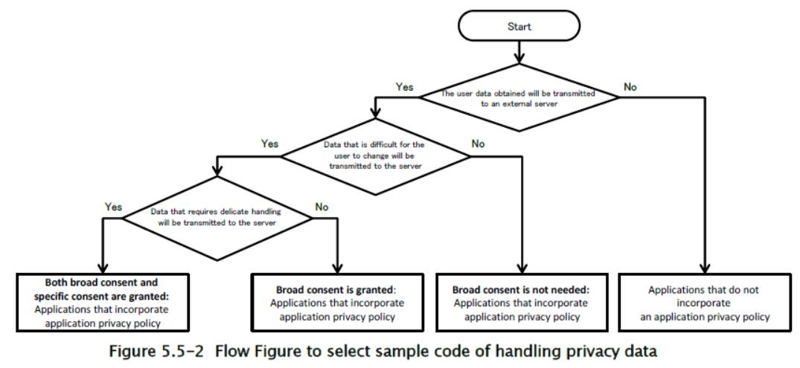
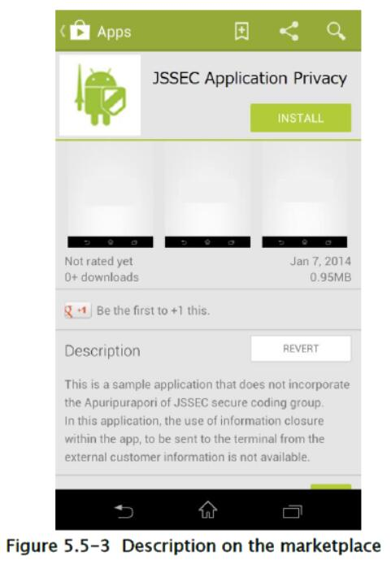
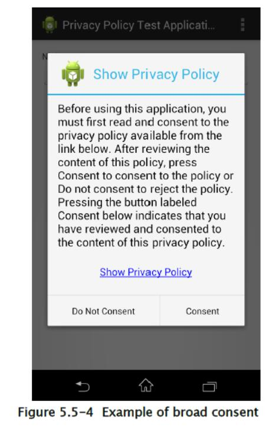
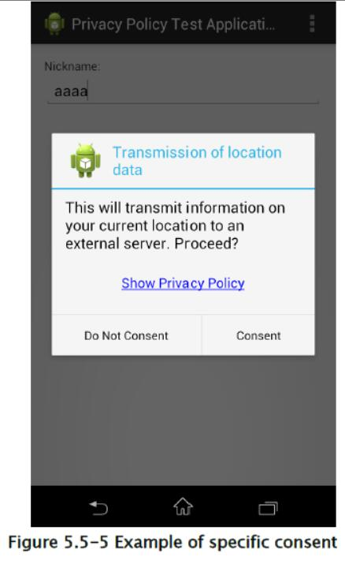
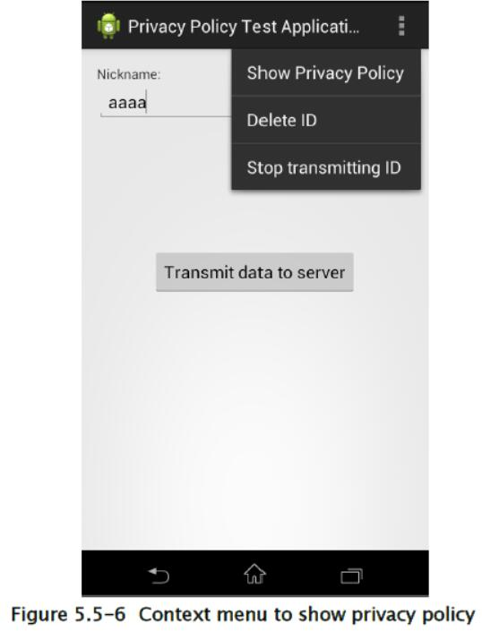
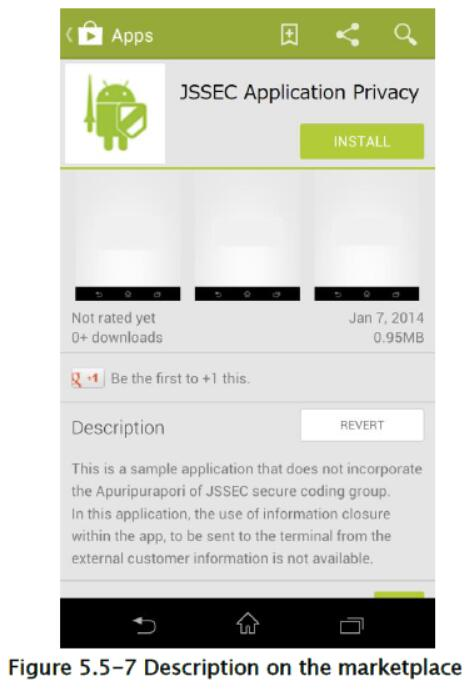

## 5.5 处理隐私数据

近年来，“隐私设计”概念已被提出，作为保护隐私数据的全球趋势。基于这一概念，各国政府正在推动隐私保护立法。

在智能手机中使用用户数据的应用必须采取措施，来确保用户可以安全地使用应用，而不必担心隐私和个人数据。这些步骤包括适当处理用户数据，并要求用户选择应用是否可以使用某些数据。为此，每个应用必须准备并显示应用隐私策略，指明应用将使用哪些信息，以及如何使用该信息；而且，在获取和使用某些信息时，应用必须首先向用户请求许可。请注意，应用隐私政策与过去可能存在的其他文档（例如“个人数据保护政策”或“使用条款”）不同，且必须与任何此类文档分开创建。

创建和执行隐私政策的详细信息，请参见日本总务省（MIC）发布的文档《Smartphone Privacy Initiative》和《Smartphone Privacy Initiative II》（JMIC 的 SPI）。 

本节中使用的术语在“5.5.3.2 术语表”中以文本定义。

### 5.5.1 示例代码


在准备应用的隐私政策时，你可以使用“协助创建应用隐私政策的工具” [29]。 这些工具以 HTML 格式和 XML 格式输出两个文件 - 应用隐私策略的摘要版本和详细版本。 这些文件的 HTML 和 XML 内容符合 MIC SPI 的建议，包括搜索标签等特性。 在下面的示例代码中，我们将演示此工具的用法，并使用由这个工具产生的 HTML 文件来展示程序隐私策略。

> [29] <http://www.kddilabs.jp/tech/public-tech/appgen.html>



更具体地说，你可以使用以下流程图来确定使用哪个示例代码。



这里，“广泛同意”一词，指代广泛许可，由用户在应用的首次加载时，通过展示和查看程序隐私策略授予应用，用于应用将用户数据传输到服务器。 相反，短语“特定同意”指代在传输特定用户数据之前，立即获得的预先同意。

#### 5.5.1.1 授予广泛同意和特定同意：包含应用隐私政策的应用

要点：

1.  首次加载（或应用更新）时，获得广泛同意，来传输将由应用处理的用户数据。
2.  如果用户未授予广泛同意，请勿传输用户数据。
3.  在传输需要特别细致的处理的用户数据之前获得特定同意。
4.  如果用户未授予特定同意，请勿传输相应的数据。
5.  向用户提供可以查看应用隐私策略的方法。
6.  提供通过用户操作删除传输的数据的方法。
7.  提供通过用户操作停止数据传输的方法。
8.  使用 UUID 或 cookie 来跟踪用户数据。
9.  将应用隐私策略的摘要版本放置在素材文件夹中。

MainActivity.java

```java
package org.jssec.android.privacypolicy;
import java.io.IOException;
import org.json.JSONException;
import org.json.JSONObject;
import org.jssec.android.privacypolicy.ConfirmFragment.DialogListener;
import com.google.android.gms.common.ConnectionResult;
import com.google.android.gms.common.GooglePlayServicesClient;
import com.google.android.gms.common.GooglePlayServicesUtil;
import com.google.android.gms.location.LocationClient;
import android.location.Location;
import android.os.AsyncTask;
import android.os.Bundle;
import android.content.Intent;
import android.content.IntentSender;
import android.content.SharedPreferences;
import android.content.pm.PackageInfo;
import android.content.pm.PackageManager;
import android.content.pm.PackageManager.NameNotFoundException;
import android.support.v4.app.FragmentActivity;
import android.support.v4.app.FragmentManager;
import android.text.Editable;
import android.text.TextWatcher;
import android.view.Menu;
import android.view.MenuItem;
import android.view.View;
import android.widget.TextView;
import android.widget.Toast;
public class MainActivity extends FragmentActivity 
    implements GooglePlayServicesClient.ConnectionCallbacks, 
    GooglePlayServicesClient.OnConnectionFailedListener, DialogListener {
    
    private static final String BASE_URL = "https://www.example.com/pp";
    private static final String GET_ID_URI = BASE_URL + "/get_id.php";
    private static final String SEND_DATA_URI = BASE_URL + "/send_data.php";
    private static final String DEL_ID_URI = BASE_URL + "/del_id.php";
    private static final String ID_KEY = "id";
    private static final String LOCATION_KEY = "location";
    private static final String NICK_NAME_KEY = "nickname";
    private static final String PRIVACY_POLICY_COMPREHENSIVE_AGREED_KEY = "privacyPolicyComprehensiveAgreed";
    private static final String PRIVACY_POLICY_DISCRETE_TYPE1_AGREED_KEY = "privacyPolicyDiscreteType1Agreed";
    private static final String PRIVACY_POLICY_PREF_NAME = "privacypolicy_preference";
    private static final int CONNECTION_FAILURE_RESOLUTION_REQUEST = 257;
    private String UserId = "";
    private LocationClient mLocationClient = null;
    private final int DIALOG_TYPE_COMPREHENSIVE_AGREEMENT = 1;
    private final int DIALOG_TYPE_PRE_CONFIRMATION = 2;
    private static final int VERSION_TO_SHOW_COMPREHENSIVE_AGREEMENT_ANEW = 1;
    
    private TextWatcher watchHandler = new TextWatcher() {
        
        @Override
        public void beforeTextChanged(CharSequence s, int start, int count, int after) {
        }
        
        @Override
        public void onTextChanged(CharSequence s, int start, int before, int count) {
            boolean buttonEnable = (s.length() > 0);
            MainActivity.this.findViewById(R.id.buttonStart).setEnabled(buttonEnable);
        }
        
        @Override
        public void afterTextChanged(Editable s) {
        }
    };
    
    @Override
    protected void onCreate(Bundle savedInstanceState) {
        super.onCreate(savedInstanceState);
        setContentView(R.layout.activity_main);
        // Fetch user ID from serverFetch user ID from server
        new GetDataAsyncTask().execute();
        findViewById(R.id.buttonStart).setEnabled(false);
        ((TextView) findViewById(R.id.editTextNickname)).addTextChangedListener(watchHandler);
        int resultCode = GooglePlayServicesUtil.isGooglePlayServicesAvailable(this);
        if (resultCode == ConnectionResult.SUCCESS) {
            mLocationClient = new LocationClient(this, this, this);
        }
    }
    
    @Override
    protected void onStart() {
        super.onStart();
        SharedPreferences pref = getSharedPreferences(PRIVACY_POLICY_PREF_NAME, MODE_PRIVATE);
        int privacyPolicyAgreed = pref.getInt(PRIVACY_POLICY_COMPREHENSIVE_AGREED_KEY, -1);
        if (privacyPolicyAgreed <= VERSION_TO_SHOW_COMPREHENSIVE_AGREEMENT_ANEW) {
            // *** POINT 1 *** On first launch (or application update), obtain broad consent to transmit user data that will be handled by the application.
            // When the application is updated, it is only necessary to renew the user's grant of broad c
            onsent if the updated application will handle new types of user data.
            ConfirmFragment dialog = ConfirmFragment.newInstance(R.string.privacyPolicy, R.string.agreeP
            rivacyPolicy, DIALOG_TYPE_COMPREHENSIVE_AGREEMENT);
            dialog.setDialogListener(this);
            FragmentManager fragmentManager = getSupportFragmentManager();
            dialog.show(fragmentManager, "dialog");
        }
        // Used to obtain location data
        if (mLocationClient != null) {
            mLocationClient.connect();
        }
    }
    
    @Override
    protected void onStop() {
        if (mLocationClient != null) {
            mLocationClient.disconnect();
        }
        super.onStop();
    }
    
    public void onSendToServer(View view) {
        // Check the status of user consent.
        // Actually, it is necessary to obtain consent for each user data type.
        SharedPreferences pref = getSharedPreferences(PRIVACY_POLICY_PREF_NAME, MODE_PRIVATE);
        int privacyPolicyAgreed = pref.getInt(PRIVACY_POLICY_DISCRETE_TYPE1_AGREED_KEY, -1);
        if (privacyPolicyAgreed <= VERSION_TO_SHOW_COMPREHENSIVE_AGREEMENT_ANEW) {
            // *** POINT 3 *** Obtain specific consent before transmitting user data that requires particularly delicate handling.
            ConfirmFragment dialog = ConfirmFragment.newInstance(R.string.sendLocation, R.string.cofirmS
            endLocation, DIALOG_TYPE_PRE_CONFIRMATION);
            dialog.setDialogListener(this);
            FragmentManager fragmentManager = getSupportFragmentManager();
            dialog.show(fragmentManager, "dialog");
        } else {
            // Start transmission, since it has the user consent.
            onPositiveButtonClick(DIALOG_TYPE_PRE_CONFIRMATION);
        }
    }
    
    public void onPositiveButtonClick(int type) {
        if (type == DIALOG_TYPE_COMPREHENSIVE_AGREEMENT) {
            // *** POINT 1 *** On first launch (or application update), obtain broad consent to transmit user data that will be handled by the application.
            SharedPreferences.Editor pref = getSharedPreferences(PRIVACY_POLICY_PREF_NAME, MODE_PRIVATE).edit();
            pref.putInt(PRIVACY_POLICY_COMPREHENSIVE_AGREED_KEY, getVersionCode());
            pref.apply();
        } else if (type == DIALOG_TYPE_PRE_CONFIRMATION) {
            // *** POINT 3 *** Obtain specific consent before transmitting user data that requires particularly delicate handling.
            if (mLocationClient != null && mLocationClient.isConnected()) {
                Location currentLocation = mLocationClient.getLastLocation();
                if (currentLocation != null) {
                    String locationData = "Latitude:" + currentLocation.getLatitude() + ", Longitude:" +
                        currentLocation.getLongitude();
                    String nickname = ((TextView) findViewById(R.id.editTextNickname)).getText().toString();
                    Toast.makeText(MainActivity.this, this.getClass().getSimpleName() + "¥n - nickname :
                        " + nickname + "¥n - location : " + locationData, Toast.LENGTH_SHORT).show();
                    new SendDataAsyncTack().execute(SEND_DATA_URI, UserId, locationData, nickname);
                }
            }
            // Store the status of user consent.
            // Actually, it is necessary to obtain consent for each user data type.
            SharedPreferences.Editor pref = getSharedPreferences(PRIVACY_POLICY_PREF_NAME, MODE_PRIVATE).edit();
            pref.putInt(PRIVACY_POLICY_DISCRETE_TYPE1_AGREED_KEY, getVersionCode());
            pref.apply();
        }
    }
    
    public void onNegativeButtonClick(int type) {
        if (type == DIALOG_TYPE_COMPREHENSIVE_AGREEMENT) {
            // *** POINT 2 *** If the user does not grant general consent, do not transmit user data.
            // In this sample application we terminate the application in this case.
            finish();
        } else if (type == DIALOG_TYPE_PRE_CONFIRMATION) {
            // *** POINT 4 *** If the user does not grant specific consent, do not transmit the correspon
            ding data.
            // The user did not grant consent, so we do nothing.
        }
    }
    
    private int getVersionCode() {
        int versionCode = -1;
        PackageManager packageManager = this.getPackageManager();
        try {
            PackageInfo packageInfo = packageManager.getPackageInfo(this.getPackageName(), PackageManager.GET_ACTIVITIES);
            versionCode = packageInfo.versionCode;
        } catch (NameNotFoundException e) {
            // This is sample, so omit the exception process
        }
        return versionCode;
    }
    
    @Override
    public boolean onCreateOptionsMenu(Menu menu) {
        getMenuInflater().inflate(R.menu.main, menu);
        return true;
    }
    
    @Override
    public boolean onOptionsItemSelected(MenuItem item) {
        switch (item.getItemId()) {
            case R.id.action_show_pp:
                // *** POINT 5 *** Provide methods by which the user can review the application privacy policy.
                Intent intent = new Intent();
                intent.setClass(this, WebViewAssetsActivity.class);
                startActivity(intent);
                return true;
            case R.id.action_del_id:
                // *** POINT 6 *** Provide methods by which transmitted data can be deleted by user operations.
                new SendDataAsyncTack().execute(DEL_ID_URI, UserId);
                return true;
            case R.id.action_donot_send_id:
                // *** POINT 7 *** Provide methods by which transmitting data can be stopped by user operations.
                // If the user stop sending data, user consent is deemed to have been revoked.
                SharedPreferences.Editor pref = getSharedPreferences(PRIVACY_POLICY_PREF_NAME, MODE_PRIVATE).edit();
                pref.putInt(PRIVACY_POLICY_COMPREHENSIVE_AGREED_KEY, 0);
                pref.apply();
                // In this sample application if the user data cannot be sent by user operations,
                // finish the application because we do nothing.
                String message = getString(R.string.stopSendUserData);
                Toast.makeText(MainActivity.this, this.getClass().getSimpleName() + " - " + message, Toast.LENGTH_SHORT).show();
                finish();
                return true;
        }
        return false;
    }
    
    @Override
    public void onConnected(Bundle connectionHint) {
        if (mLocationClient != null && mLocationClient.isConnected()) {
            Location currentLocation = mLocationClient.getLastLocation();
            if (currentLocation != null) {
                String locationData = "Latitude ¥t: " + currentLocation.getLatitude() + "¥n¥tLongitude ¥t: " + currentLocation.getLongitude();
                String text = "¥n" + getString(R.string.your_location_title) + "¥n¥t" + locationData;
                TextView appText = (TextView) findViewById(R.id.appText);
                appText.setText(text);
            }
        }
    }
    
    @Override
    public void onConnectionFailed(ConnectionResult result) {
        if (result.hasResolution()) {
            try {
                result.startResolutionForResult(this, CONNECTION_FAILURE_RESOLUTION_REQUEST);
            } catch (IntentSender.SendIntentException e) {
                e.printStackTrace();
            }
        }
    }
    
    @Override
    public void onDisconnected() {
        mLocationClient = null;
    }
    
    private class GetDataAsyncTask extends AsyncTask<String, Void, String> {
    
        private String extMessage = "";
        
        @Override
        protected String doInBackground(String... params) {
            // *** POINT 8 *** Use UUIDs or cookies to keep track of user data
            // In this sample we use an ID generated on the server side
            SharedPreferences sp = getSharedPreferences(PRIVACY_POLICY_PREF_NAME, MODE_PRIVATE);
            UserId = sp.getString(ID_KEY, null);
            if (UserId == null) {
                // No token in SharedPreferences; fetch ID from server
                try {
                    UserId = NetworkUtil.getCookie(GET_ID_URI, "", "id");
                } catch (IOException e) {
                    // Catch exceptions such as certification errors
                    extMessage = e.toString();
                }
                // Store the fetched ID in SharedPreferences
                sp.edit().putString(ID_KEY, UserId).commit();
            }
            return UserId;
        }
        
        @Override
        protected void onPostExecute(final String data) {
            String status = (data != null) ? "success" : "error";
            Toast.makeText(MainActivity.this, this.getClass().getSimpleName() + " - " + status + " : " +
                extMessage, Toast.LENGTH_SHORT).show();
        }
    }
    
    private class SendDataAsyncTack extends AsyncTask<String, Void, Boolean> {
    
        private String extMessage = "";
        
        @Override
        protected Boolean doInBackground(String... params) {
            String url = params[0];
            String id = params[1];
            String location = params.length > 2 ? params[2] : null;
            String nickname = params.length > 3 ? params[3] : null;
            Boolean result = false;
            try {
                JSONObject jsonData = new JSONObject();
                jsonData.put(ID_KEY, id);
                if (location != null)
                jsonData.put(LOCATION_KEY, location);
                if (nickname != null)
                jsonData.put(NICK_NAME_KEY, nickname);
                NetworkUtil.sendJSON(url, "", jsonData.toString());
                result = true;
            } catch (IOException e) {
                // Catch exceptions such as certification errors
                extMessage = e.toString();
            } catch (JSONException e) {
                extMessage = e.toString();
            }
            return result;
        }
        
        @Override
        protected void onPostExecute(Boolean result) {
            String status = result ? "Success" : "Error";
            Toast.makeText(MainActivity.this, this.getClass().getSimpleName() + " - " + status + " : " +
                extMessage, Toast.LENGTH_SHORT).show();
        }
    }
}
```

ConfirmFragment.java

```java
package org.jssec.android.privacypolicy;

import android.app.Activity;
import android.app.AlertDialog;
import android.app.Dialog;
import android.content.Context;
import android.content.DialogInterface;
import android.content.Intent;
import android.os.Bundle;
import android.support.v4.app.DialogFragment;
import android.view.LayoutInflater;
import android.view.View;
import android.view.View.OnClickListener;
import android.widget.TextView;

public class ConfirmFragment extends DialogFragment {
    private DialogListener mListener = null;
    
    public static interface DialogListener {
        public void onPositiveButtonClick(int type);
        public void onNegativeButtonClick(int type);
    }
    
    public static ConfirmFragment newInstance(int title, int sentence, int type) {
        ConfirmFragment fragment = new ConfirmFragment();
        Bundle args = new Bundle();
        args.putInt("title", title);
        args.putInt("sentence", sentence);
        args.putInt("type", type);
        fragment.setArguments(args);
        return fragment;
    }
    
    @Override
    public Dialog onCreateDialog(Bundle args) {
        // *** POINT 1 *** On first launch (or application update), obtain broad consent to transmit user data that will be handled by the application.
        // *** POINT 3 *** Obtain specific consent before transmitting user data that requires particularly delicate handling.
        final int title = getArguments().getInt("title");
        final int sentence = getArguments().getInt("sentence");
        final int type = getArguments().getInt("type");
        LayoutInflater inflater = (LayoutInflater) getActivity().getSystemService(Context.LAYOUT_INFLATER_SERVICE);
        View content = inflater.inflate(R.layout.fragment_comfirm, null);
        TextView linkPP = (TextView) content.findViewById(R.id.tx_link_pp);
        linkPP.setOnClickListener(new OnClickListener() {
            
            @Override
            public void onClick(View v) {
                // *** POINT 5 *** Provide methods by which the user can review the application privacy policy.
                Intent intent = new Intent();
                intent.setClass(getActivity(), WebViewAssetsActivity.class);
                startActivity(intent);
            }
        });
        AlertDialog.Builder builder = new AlertDialog.Builder(getActivity());
        builder.setIcon(R.drawable.ic_launcher);
        builder.setTitle(title);
        builder.setMessage(sentence);
        builder.setView(content);
        builder.setPositiveButton(R.string.buttonConsent, new DialogInterface.OnClickListener() {
        
            public void onClick(DialogInterface dialog, int whichButton) {
                if (mListener != null) {
                    mListener.onPositiveButtonClick(type);
                }
            }
        });
        builder.setNegativeButton(R.string.buttonDonotConsent, new DialogInterface.OnClickListener() {
        
            public void onClick(DialogInterface dialog, int whichButton) {
                if (mListener != null) {
                    mListener.onNegativeButtonClick(type);
                }
            }
        });
        Dialog dialog = builder.create();
        dialog.setCanceledOnTouchOutside(false);
        return dialog;
    }
    
    @Override
    public void onAttach(Activity activity) {
        super.onAttach(activity);
        if (!(activity instanceof DialogListener)) {
            throw new ClassCastException(activity.toString() + " must implement DialogListener.");
        }
        mListener = (DialogListener) activity;
    }
    
    public void setDialogListener(DialogListener listener) {
        mListener = listener;
    }
}
```

WebViewAssetsActivity.java

```java
package org.jssec.android.privacypolicy;

import android.app.Activity;
import android.os.Bundle;
import android.webkit.WebSettings;
import android.webkit.WebView;

public class WebViewAssetsActivity extends Activity {

    // *** POINT 9 *** Place a summary version of the application privacy policy in the assets folder
    private static final String ABST_PP_URL = "file:///android_asset/PrivacyPolicy/app-policy-abst-privacypolicy-1.0.html";
    
    @Override
    public void onCreate(Bundle savedInstanceState) {
        super.onCreate(savedInstanceState);
        setContentView(R.layout.activity_webview);
        WebView webView = (WebView) findViewById(R.id.webView);
        WebSettings webSettings = webView.getSettings();
        webSettings.setAllowFileAccess(false);
        webView.loadUrl(ABST_PP_URL);
    }
}
```

#### 5.5.1.2 授予广泛同意：包含应用隐私政策的应用

要点：

1.  首次加载（或应用更新）时，获得广泛同意，来传输将由应用处理的用户数据。
2.  如果用户未授予广泛同意，请勿传输用户数据。
3.  向用户提供可以查看应用隐私策略的方法。
4.  提供通过用户操作删除传输的数据的方法。
5.  提供通过用户操作停止数据传输的方法。
6.  使用 UUID 或 cookie 来跟踪用户数据。
7.  将应用隐私策略的摘要版本放置在素材文件夹中。

MainActivity.java

```java
package org.jssec.android.privacypolicynopreconfirm;

import java.io.IOException;
import org.json.JSONException;
import org.json.JSONObject;
import org.jssec.android.privacypolicynopreconfirm.MainActivity;
import org.jssec.android.privacypolicynopreconfirm.R;
import org.jssec.android.privacypolicynopreconfirm.ConfirmFragment.DialogListener;
import android.os.AsyncTask;
import android.os.Bundle;
import android.content.Intent;
import android.content.SharedPreferences;
import android.content.pm.PackageInfo;
import android.content.pm.PackageManager;
import android.content.pm.PackageManager.NameNotFoundException;
import android.support.v4.app.FragmentActivity;
import android.support.v4.app.FragmentManager;
import android.telephony.TelephonyManager;
import android.text.Editable;
import android.text.TextWatcher;
import android.view.Menu;
import android.view.MenuItem;
import android.view.View;
import android.widget.TextView;
import android.widget.Toast;

public class MainActivity extends FragmentActivity implements DialogListener {

    private final String BASE_URL = "https://www.example.com/pp";
    private final String GET_ID_URI = BASE_URL + "/get_id.php";
    private final String SEND_DATA_URI = BASE_URL + "/send_data.php";
    private final String DEL_ID_URI = BASE_URL + "/del_id.php";
    private final String ID_KEY = "id";
    private final String NICK_NAME_KEY = "nickname";
    private final String IMEI_KEY = "imei";
    private final String PRIVACY_POLICY_AGREED_KEY = "privacyPolicyAgreed";
    private final String PRIVACY_POLICY_PREF_NAME = "privacypolicy_preference";
    private String UserId = "";
    private final int DIALOG_TYPE_COMPREHENSIVE_AGREEMENT = 1;
    private final int VERSION_TO_SHOW_COMPREHENSIVE_AGREEMENT_ANEW = 1;
    
    private TextWatcher watchHandler = new TextWatcher() {
        
        @Override
        public void beforeTextChanged(CharSequence s, int start, int count, int after) {
        }
        
        @Override
        public void onTextChanged(CharSequence s, int start, int before, int count) {
            boolean buttonEnable = (s.length() > 0);
            MainActivity.this.findViewById(R.id.buttonStart).setEnabled(buttonEnable);
        }
        
        @Override
        public void afterTextChanged(Editable s) {
        }
    };
    
    @Override
    protected void onCreate(Bundle savedInstanceState) {
        super.onCreate(savedInstanceState);
        setContentView(R.layout.activity_main);
        // Fetch user ID from serverFetch user ID from server
        new GetDataAsyncTask().execute();
        findViewById(R.id.buttonStart).setEnabled(false);
        ((TextView) findViewById(R.id.editTextNickname)).addTextChangedListener(watchHandler);
    }
    
    @Override
    protected void onStart() {
        super.onStart();
        SharedPreferences pref = getSharedPreferences(PRIVACY_POLICY_PREF_NAME, MODE_PRIVATE);
        int privacyPolicyAgreed = pref.getInt(PRIVACY_POLICY_AGREED_KEY, -1);
        if (privacyPolicyAgreed <= VERSION_TO_SHOW_COMPREHENSIVE_AGREEMENT_ANEW) {
            // *** POINT 1 *** On first launch (or application update), obtain broad consent to transmit user data that will be handled by the application.
            // When the application is updated, it is only necessary to renew the user's grant of broad consent if the updated application will handle new types of user data.
            ConfirmFragment dialog = ConfirmFragment.newInstance(R.string.privacyPolicy, R.string.agreePr
            ivacyPolicy, DIALOG_TYPE_COMPREHENSIVE_AGREEMENT);
            dialog.setDialogListener(this);
            FragmentManager fragmentManager = getSupportFragmentManager();
            dialog.show(fragmentManager, "dialog");
        }
    }
    
    public void onSendToServer(View view) {
        String nickname = ((TextView) findViewById(R.id.editTextNickname)).getText().toString();
        TelephonyManager tm = (TelephonyManager) getSystemService(TELEPHONY_SERVICE);
        String imei = tm.getDeviceId();
        Toast.makeText(MainActivity.this, this.getClass().getSimpleName() + "¥n - nickname : " + nickname + ", imei = " + imei, Toast.LENGTH_SHORT).show();
        new SendDataAsyncTack().execute(SEND_DATA_URI, UserId, nickname, imei);
    }
    
    public void onPositiveButtonClick(int type) {
        if (type == DIALOG_TYPE_COMPREHENSIVE_AGREEMENT) {
            // *** POINT 1 *** On first launch (or application update), obtain broad consent to transmit
            user data that will be handled by the application.
            SharedPreferences.Editor pref = getSharedPreferences(PRIVACY_POLICY_PREF_NAME, MODE_PRIVATE).edit();
            pref.putInt(PRIVACY_POLICY_AGREED_KEY, getVersionCode());
            pref.apply();
        }
    }
    
    public void onNegativeButtonClick(int type) {
        if (type == DIALOG_TYPE_COMPREHENSIVE_AGREEMENT) {
            // *** POINT 2 *** If the user does not grant general consent, do not transmit user data.
            // In this sample application we terminate the application in this case.
            finish();
        }
    }
    
    private int getVersionCode() {
        int versionCode = -1;
        PackageManager packageManager = this.getPackageManager();
        try {
            PackageInfo packageInfo = packageManager.getPackageInfo(this.getPackageName(), PackageManager.GET_ACTIVITIES);
            versionCode = packageInfo.versionCode;
        } catch (NameNotFoundException e) {
            // This is sample, so omit the exception process
        }
        return versionCode;
    }
    
    @Override
    public boolean onCreateOptionsMenu(Menu menu) {
        getMenuInflater().inflate(R.menu.main, menu);
        return true;
    }
    
    @Override
    public boolean onOptionsItemSelected(MenuItem item) {
        switch (item.getItemId()) {
            case R.id.action_show_pp:
                // *** POINT 3 *** Provide methods by which the user can review the application privacy policy.
                Intent intent = new Intent();
                intent.setClass(this, WebViewAssetsActivity.class);
                startActivity(intent);
                return true;
            case R.id.action_del_id:
                // *** POINT 4 *** Provide methods by which transmitted data can be deleted by user operation
                s.
                new SendDataAsyncTack().execute(DEL_ID_URI, UserId);
                return true;
            case R.id.action_donot_send_id:
                // *** POINT 5 *** Provide methods by which transmitting data can be stopped by user operations.
                // If the user stop sending data, user consent is deemed to have been revoked.
                SharedPreferences.Editor pref = getSharedPreferences(PRIVACY_POLICY_PREF_NAME, MODE_PRIVATE).edit();
                pref.putInt(PRIVACY_POLICY_AGREED_KEY, 0);
                pref.apply();
                // In this sample application if the user data cannot be sent by user operations,
                // finish the application because we do nothing.
                String message = getString(R.string.stopSendUserData);
                Toast.makeText(MainActivity.this, this.getClass().getSimpleName() + " - " + message, Toast.L
                ENGTH_SHORT).show();
                finish();
                return true; 
        }
        return false;
    }
    
    private class GetDataAsyncTask extends AsyncTask<String, Void, String> {
    
        private String extMessage = "";
        
        @Override
        protected String doInBackground(String... params) {
            // *** POINT 6 *** Use UUIDs or cookies to keep track of user data
            // In this sample we use an ID generated on the server side
            SharedPreferences sp = getSharedPreferences(PRIVACY_POLICY_PREF_NAME, MODE_PRIVATE);
            UserId = sp.getString(ID_KEY, null);
            if (UserId == null) {
                // No token in SharedPreferences; fetch ID from server
                try {
                    UserId = NetworkUtil.getCookie(GET_ID_URI, "", "id");
                } catch (IOException e) {
                    // Catch exceptions such as certification errors
                    extMessage = e.toString();
                }
                // Store the fetched ID in SharedPreferences
                sp.edit().putString(ID_KEY, UserId).commit();
            }
            return UserId;
        }
        
        @Override
        protected void onPostExecute(final String data) {
            String status = (data != null) ? "success" : "error";
            Toast.makeText(MainActivity.this, this.getClass().getSimpleName() + " - " + status + " : " +
                extMessage, Toast.LENGTH_SHORT).show();
        }
    }
    
    private class SendDataAsyncTack extends AsyncTask<String, Void, Boolean> {
    
        private String extMessage = "";
        
        @Override
        protected Boolean doInBackground(String... params) {
        
            String url = params[0];
            String id = params[1];
            String nickname = params.length > 2 ? params[2] : null;
            String imei = params.length > 3 ? params[3] : null;
            Boolean result = false;
            try {
                JSONObject jsonData = new JSONObject();
                jsonData.put(ID_KEY, id);
                if (nickname != null)
                    jsonData.put(NICK_NAME_KEY, nickname);
                if (imei != null)
                    jsonData.put(IMEI_KEY, imei);
                NetworkUtil.sendJSON(url, "", jsonData.toString());
                result = true;
            } catch (IOException e) {
                // Catch exceptions such as certification errors
                extMessage = e.toString();
            } catch (JSONException e) {
                extMessage = e.toString();
            }
            return result;
        }
        
        @Override
        protected void onPostExecute(Boolean result) {
            String status = result ? "Success" : "Error";
            Toast.makeText(MainActivity.this, this.getClass().getSimpleName() + " - " + status + " : " +
                extMessage, Toast.LENGTH_SHORT).show();
        }
    }
}
```

ConfirmFragment.java

```java
package org.jssec.android.privacypolicynopreconfirm;

import android.app.Activity;
import android.app.AlertDialog;
import android.app.Dialog;
import android.content.Context;
import android.content.DialogInterface;
import android.content.Intent;
import android.os.Bundle;
import android.support.v4.app.DialogFragment;
import android.view.LayoutInflater;
import android.view.View;
import android.view.View.OnClickListener;
import android.widget.TextView;

public class ConfirmFragment extends DialogFragment {

    private DialogListener mListener = null;
    
    public static interface DialogListener {
        public void onPositiveButtonClick(int type);
        public void onNegativeButtonClick(int type);
    }
    
    public static ConfirmFragment newInstance(int title, int sentence, int type) {
        ConfirmFragment fragment = new ConfirmFragment();
        Bundle args = new Bundle();
        args.putInt("title", title);
        args.putInt("sentence", sentence);
        args.putInt("type", type);
        fragment.setArguments(args);
        return fragment;
    }
    
    @Override
    public Dialog onCreateDialog(Bundle args) {
        // *** POINT 1 *** On first launch (or application update), obtain broad consent to transmit user data that will be handled by the application.
        final int title = getArguments().getInt("title");
        final int sentence = getArguments().getInt("sentence");
        final int type = getArguments().getInt("type");
        LayoutInflater inflater = (LayoutInflater) getActivity().getSystemService(Context.LAYOUT_INFLATER_SERVICE);
        View content = inflater.inflate(R.layout.fragment_comfirm, null);
        TextView linkPP = (TextView) content.findViewById(R.id.tx_link_pp);
        linkPP.setOnClickListener(new OnClickListener() {
            
            @Override
            public void onClick(View v) {
                // *** POINT 3 *** Provide methods by which the user can review the application privacy policy.
                Intent intent = new Intent();
                intent.setClass(getActivity(), WebViewAssetsActivity.class);
                startActivity(intent);
            }
        });
        AlertDialog.Builder builder = new AlertDialog.Builder(getActivity());
        builder.setIcon(R.drawable.ic_launcher);
        builder.setTitle(title);
        builder.setMessage(sentence);
        builder.setView(content);
        builder.setPositiveButton(R.string.buttonConsent, new DialogInterface.OnClickListener() {
        
            public void onClick(DialogInterface dialog, int whichButton) {
                if (mListener != null) {
                    mListener.onPositiveButtonClick(type);
                }
            }
        });
        builder.setNegativeButton(R.string.buttonDonotConsent, new DialogInterface.OnClickListener() {
        
            public void onClick(DialogInterface dialog, int whichButton) {
                if (mListener != null) {
                    mListener.onNegativeButtonClick(type);
                }
            }
        });
        Dialog dialog = builder.create();
        dialog.setCanceledOnTouchOutside(false);
        return dialog;
    }
    
    @Override
    public void onAttach(Activity activity) {
        super.onAttach(activity);
        if (!(activity instanceof DialogListener)) {
            throw new ClassCastException(activity.toString() + " must implement DialogListener.");
        }
        mListener = (DialogListener) activity;
    }
    
    public void setDialogListener(DialogListener listener) {
        mListener = listener;
    }
}
```

WebViewAssetsActivity.java

```java
package org.jssec.android.privacypolicynopreconfirm;

import org.jssec.android.privacypolicynopreconfirm.R;
import android.app.Activity;
import android.os.Bundle;
import android.webkit.WebSettings;
import android.webkit.WebView;

public class WebViewAssetsActivity extends Activity {

    // *** POINT 7 *** Place a summary version of the application privacy policy in the assets folder
    private final String ABST_PP_URL = "file:///android_asset/PrivacyPolicy/app-policy-abst-privacypolicy-1.0.html";
    
    @Override
    public void onCreate(Bundle savedInstanceState) {
        super.onCreate(savedInstanceState);
        setContentView(R.layout.activity_webview);
        WebView webView = (WebView) findViewById(R.id.webView);
        WebSettings webSettings = webView.getSettings();
        webSettings.setAllowFileAccess(false);
        webView.loadUrl(ABST_PP_URL);
    }
}
```

#### 5.5.1.3 不需要广泛同意：包含应用隐私策略的应用

要点：

1.  向用户提供查看应用隐私策略的方法。
2.  提供通过用户操作删除传输的数据的方法。
3.  提供通过用户操作停止数据传输的方法
4.  使用 UUID 或 cookie 来跟踪用户数据。
5.  将应用隐私策略的摘要版本放置在素材文件夹中。

MainActivity.java

```java
package org.jssec.android.privacypolicynocomprehensive;

import java.io.IOException;
import org.json.JSONException;
import org.json.JSONObject;
import android.os.AsyncTask;
import android.os.Bundle;
import android.content.Intent;
import android.content.SharedPreferences;
import android.support.v4.app.FragmentActivity;
import android.text.Editable;
import android.text.TextWatcher;
import android.view.Menu;
import android.view.MenuItem;
import android.view.View;
import android.widget.TextView;
import android.widget.Toast;

public class MainActivity extends FragmentActivity {

    private static final String BASE_URL = "https://www.example.com/pp";
    private static final String GET_ID_URI = BASE_URL + "/get_id.php";
    private static final String SEND_DATA_URI = BASE_URL + "/send_data.php";
    private static final String DEL_ID_URI = BASE_URL + "/del_id.php";
    private static final String ID_KEY = "id";
    private static final String NICK_NAME_KEY = "nickname";
    private static final String PRIVACY_POLICY_PREF_NAME = "privacypolicy_preference";
    private String UserId = "";
    
    private TextWatcher watchHandler = new TextWatcher() {
        
        @Override
        public void beforeTextChanged(CharSequence s, int start, int count, int after) {
        }
        
        @Override
        public void onTextChanged(CharSequence s, int start, int before, int count) {
            boolean buttonEnable = (s.length() > 0);
            MainActivity.this.findViewById(R.id.buttonStart).setEnabled(buttonEnable);
        }
        
        @Override
        public void afterTextChanged(Editable s) {
        }
    };
    
    @Override
    protected void onCreate(Bundle savedInstanceState) {
        super.onCreate(savedInstanceState);
        setContentView(R.layout.activity_main);
        // Fetch user ID from serverFetch user ID from server
        new GetDataAsyncTask().execute();
        findViewById(R.id.buttonStart).setEnabled(false);
        ((TextView) findViewById(R.id.editTextNickname)).addTextChangedListener(watchHandler);
    }
    
    public void onSendToServer(View view) {
        String nickname = ((TextView) findViewById(R.id.editTextNickname)).getText().toString();
        Toast.makeText(MainActivity.this, this.getClass().getSimpleName() + "¥n - nickname : " + nickname, Toast.LENGTH_SHORT).show();
        new sendDataAsyncTack().execute(SEND_DATA_URI, UserId, nickname);
    }
    
    @Override
    public boolean onCreateOptionsMenu(Menu menu) {
        getMenuInflater().inflate(R.menu.main, menu);
        return true;
    }
    
    @Override
    public boolean onOptionsItemSelected(MenuItem item) {
        switch (item.getItemId()) {
            case R.id.action_show_pp:
                // *** POINT 1 *** Provide methods by which the user can review the application privacy policy.
                Intent intent = new Intent();
                intent.setClass(this, WebViewAssetsActivity.class);
                startActivity(intent);
                return true;
            case R.id.action_del_id:
                // *** POINT 2 *** Provide methods by which transmitted data can be deleted by user operations.
                new sendDataAsyncTack().execute(DEL_ID_URI, UserId);
                return true;
            case R.id.action_donot_send_id:
                // *** POINT 3 *** Provide methods by which transmitting data can be stopped by user operations.
                // In this sample application if the user data cannot be sent by user operations,
                // finish the application because we do nothing.
                String message = getString(R.string.stopSendUserData);
                Toast.makeText(MainActivity.this, this.getClass().getSimpleName() + " - " + message, Toast.LENGTH_SHORT).show();
                finish();
                return true;
        }
        return false;
    }
    
    private class GetDataAsyncTask extends AsyncTask<String, Void, String> {
    
        private String extMessage = "";
        
        @Override
        protected String doInBackground(String... params) {
            // *** POINT 4 *** Use UUIDs or cookies to keep track of user data
            // In this sample we use an ID generated on the server side
            SharedPreferences sp = getSharedPreferences(PRIVACY_POLICY_PREF_NAME, MODE_PRIVATE);
            UserId = sp.getString(ID_KEY, null);
            if (UserId == null) {
                // No token in SharedPreferences; fetch ID from server
                try {
                    UserId = NetworkUtil.getCookie(GET_ID_URI, "", "id");
                } catch (IOException e) {
                    // Catch exceptions such as certification errors
                    extMessage = e.toString();
                }
                // Store the fetched ID in SharedPreferences
                sp.edit().putString(ID_KEY, UserId).commit();
            }
            return UserId;
        }
        
        @Override
        protected void onPostExecute(final String data) {
            String status = (data != null) ? "success" : "error";
            Toast.makeText(MainActivity.this, this.getClass().getSimpleName() + " - " + status + " : " +
                extMessage, Toast.LENGTH_SHORT).show();
        }
    }
    
    private class sendDataAsyncTack extends AsyncTask<String, Void, Boolean> {
    
        private String extMessage = "";
        
        @Override
        protected Boolean doInBackground(String... params) {
            String url = params[0];
            String id = params[1];
            String nickname = params.length > 2 ? params[2] : null;
            Boolean result = false;
            try {
                JSONObject jsonData = new JSONObject();
                jsonData.put(ID_KEY, id);
                if (nickname != null)
                    jsonData.put(NICK_NAME_KEY, nickname);
                NetworkUtil.sendJSON(url, "", jsonData.toString());
                result = true;
            } catch (IOException e) {
                // Catch exceptions such as certification errors
                extMessage = e.toString();
            } catch (JSONException e) {
                extMessage = e.toString();
            }
            return result;
        }
        
        @Override
        protected void onPostExecute(Boolean result) {
            String status = result ? "Success" : "Error";
            Toast.makeText(MainActivity.this, this.getClass().getSimpleName() + " - " + status + " : " +
                extMessage, Toast.LENGTH_SHORT).show();
        }
    }
}
```

WebViewAssetsActivity.java

```java
package org.jssec.android.privacypolicynocomprehensive;

import org.jssec.android.privacypolicynocomprehensive.R;
import android.app.Activity;
import android.os.Bundle;
import android.webkit.WebSettings;
import android.webkit.WebView;

public class WebViewAssetsActivity extends Activity {

    // *** POINT 5 *** Place a summary version of the application privacy policy in the assets folder
    private static final String ABST_PP_URL = "file:///android_asset/PrivacyPolicy/app-policy-abst-privacypolicy-1.0.html";
    
    @Override
    public void onCreate(Bundle savedInstanceState) {
        super.onCreate(savedInstanceState);
        setContentView(R.layout.activity_webview);
        WebView webView = (WebView) findViewById(R.id.webView);
        WebSettings webSettings = webView.getSettings();
        webSettings.setAllowFileAccess(false);
        webView.loadUrl(ABST_PP_URL);
    }
}
```

#### 5.5.1.4 不包含应用隐私策略的应用

要点：

1.  如果你的应用只使用它在设备中获取的信息，则不需要显示应用隐私策略。
2.  在市场应用或类似应用的文档中，请注意应用不会将其获取的信息传输到外部。

MainActivity.java

```java
package org.jssec.android.privacypolicynoinfosent;

import com.google.android.gms.common.ConnectionResult;
import com.google.android.gms.common.GooglePlayServicesClient;
import com.google.android.gms.location.LocationClient;
import android.location.Location;
import android.net.Uri;
import android.os.Bundle;
import android.content.Intent;
import android.content.IntentSender;
import android.support.v4.app.FragmentActivity;
import android.view.Menu;
import android.view.View;
import android.widget.TextView;
import android.widget.Toast;

public class MainActivity extends FragmentActivity implements GooglePlayServicesClient.ConnectionCallbacks,
    GooglePlayServicesClient.OnConnectionFailedListener {

    private LocationClient mLocationClient = null;
    private final int CONNECTION_FAILURE_RESOLUTION_REQUEST = 257;
    
    @Override
    protected void onCreate(Bundle savedInstanceState) {
        super.onCreate(savedInstanceState);
        setContentView(R.layout.activity_main);
        mLocationClient = new LocationClient(this, this, this);
    }
    
    @Override
    protected void onStart() {
        super.onStart();
        // Used to obtain location data
        if (mLocationClient != null) {
            mLocationClient.connect();
        }
    }
    
    @Override
    protected void onStop() {
        if (mLocationClient != null) {
            mLocationClient.disconnect();
        }
        super.onStop();
    }
    
    @Override
    public boolean onCreateOptionsMenu(Menu menu) {
        getMenuInflater().inflate(R.menu.main, menu);
        return true;
    }
    
    public void onStartMap(View view) {
        // *** POINT 1 *** You do not need to display an application privacy policy if your application w
        ill only use the information it obtains within the device.
        if (mLocationClient != null && mLocationClient.isConnected()) {
            Location currentLocation = mLocationClient.getLastLocation();
            if (currentLocation != null) {
                Intent intent = new Intent(Intent.ACTION_VIEW, Uri.parse("geo:" + currentLocation.getLatitude() + "," + currentLocation.getLongitude()));
                startActivity(intent);
            }
        }
    }
    @Override
    public void onConnected(Bundle connectionHint) {
        if (mLocationClient != null && mLocationClient.isConnected()) {
            Location currentLocation = mLocationClient.getLastLocation();
            if (currentLocation != null) {
                String locationData = "Latitude ¥t: " + currentLocation.getLatitude() + "¥n¥tLongitude ¥t: " + currentLocation.getLongitude();
                String text = "¥n" + getString(R.string.your_location_title) + "¥n¥t" + locationData;
                Toast.makeText(MainActivity.this, this.getClass().getSimpleName() + text, Toast.LENGTH_SHORT).show();
                TextView appText = (TextView) findViewById(R.id.appText);
                appText.setText(text);
            }
        }
    }
    
    @Override
    public void onConnectionFailed(ConnectionResult result) {
        if (result.hasResolution()) {
            try {
                result.startResolutionForResult(this, CONNECTION_FAILURE_RESOLUTION_REQUEST);
            } catch (IntentSender.SendIntentException e) {
                e.printStackTrace();
            }
        }
    }
    
    @Override
    public void onDisconnected() {
        mLocationClient = null;
        Toast.makeText(this, "Disconnected. Please re-connect.", Toast.LENGTH_SHORT).show();
    }
}
```

市场上的示例如下。



### 5.5.2 规则书

处理隐私策略时，遵循以下规则：

#### 5.5.2.1 将用户数据的传输限制为最低需求（必需）

将使用数据传输到外部服务器或其他目标时，将传输限制在提供服务的最低需求。 特别是，你应该设计为，应用只能访问这些用户数据，用户可以根据应用描述来想象它们的使用目的。 

例如，用户可以想象，它是个警报应用，但不能访问位置数据。另一方面，如果警报应用可以根据用户的位置发出警报，并将其功能写入应用的描述中，则应用可以访问位置数据。 

在只需要在应用中访问信息的情况下，避免将信息传输到外部，并采取其他措施来减少无意中泄漏用户数据的可能性。

#### 5.5.2.2 在首次加载（或应用更新）时，获得广泛同意来传输需要特别细致处理或用户可能难以更改的用户数据（必需）

如果应用向外部服务器，传输用户可能难以更改的任何用户数据，或需要特别细致处理的任何用户数据，则应用必须在用户开始使用之前，获得用户的预先同意（选择性加入） - 通知用户哪些类型的信息将被发送到服务器，以及是否会涉及任何第三方厂商。 更具体地说，首次启动时，应用应显示其应用隐私政策并确认该用户已阅读并同意。 此外，无论何时应用更新，通过将新类型的用户数据传输到外部服务器，它都必须再次确认用户已经阅读并同意这些更改。 如果用户不同意，应用应该终止或以其他方式采取措施，来确保所有需要传输数据的功能都被禁用。

这些步骤可以确保，用户了解他们在使用应用时如何处理数据，为用户提供安全感并增强他们对应用的信任。

MainActivity.java

```java
protected void onStart() {
    super.onStart();
    
    // (some portions omitted)
    
    if (privacyPolicyAgreed <= VERSION_TO_SHOW_COMPREHENSIVE_AGREEMENT_ANEW) {
        // *** POINT *** On first launch (or application update), obtain broad consent to transmit user data that will be handled by the application.
        // When the application is updated, it is only necessary to renew the user’s grant of broad consent if the updated application will handle new types of user data.
        ConfirmFragment dialog = ConfirmFragment.newInstance(
            R.string.privacyPolicy, R.string.agreePrivacyPolicy,
            DIALOG_TYPE_COMPREHENSIVE_AGREEMENT);
        dialog.setDialogListener(this);
        FragmentManager fragmentManager = getSupportFragmentManager();
        dialog.show(fragmentManager, "dialog");
    }
```



#### 5.5.2.3 在传输需要特殊处理的用户数据之前获得特定的同意（必需）

向外部服务器传输任何需要特别细致处理的用户数据时，除了需要获得一般同意之外，应用必须获得用户对每种这类用户数据（或涉及传输用户数据的每个功能）的预先同意（选择性加入）。 如果用户不同意，则应用不得将相应的数据发送到外部服务器。 这确保用户可以更全面地了解应用的功能（及其提供的服务）和用户对其授予一般同意的，用户数据的传输之间的关系；同时，应用提厂商可以基于更精确的决策，预计获得用户的同意。

MainActivity.java

```java
public void onSendToServer(View view) {
    // *** POINT *** Obtain specific consent before transmitting user data that requires particularly delicate handling.
    ConfirmFragment dialog = ConfirmFragment.newInstance(R.string.sendLocation, R.string.cofi
    rmSendLocation, DIALOG_TYPE_PRE_CONFIRMATION);
    dialog.setDialogListener(this);
    FragmentManager fragmentManager = getSupportFragmentManager();
    dialog.show(fragmentManager, "dialog");
}
```



#### 5.5.2.4 向用户提供查看应用隐私策略的方法（必需）

一般来说，Android 应用市场将提供应用隐私策略的链接，供用户在选择安装相应的应用之前进行复查。 除了支持此功能之外，应用还需要提供一些方法，用户在设备上安装应用后，可以查看应用隐私策略。 特别重要的是提供一些方法，用户可以轻易复查应用隐私政策。在同意的情况下，将用户数据传输到外部服务器来协助用户作出适当决定。

MainActivity.java

```java
@Override
public boolean onOptionsItemSelected(MenuItem item) {
    switch (item.getItemId()) {
        case R.id.action_show_pp:
            // *** POINT *** Provide methods by which the user can review the application privacy policy.
            Intent intent = new Intent();
            intent.setClass(this, WebViewAssetsActivity.class);
            startActivity(intent);
            return true;
```



#### 5.5.2.5 在素材文件夹中放置应用隐私策略的摘要版本（推荐）

将应用隐私策略的摘要版本放在素材文件夹中，来确保用户可以按需对其进行复查，这是一个不错的主意。 确保素材文件夹中存在应用隐私策略，不仅可以让用户随时轻松访问它，还可以避免用户看到由恶意第三方准备的应用隐私策略的伪造或损坏版本的风险。

#### 5.5.2.6 提供可以删除传输的数据的方法，以及可以通过用户操作停止数据传输的方法（推荐）

提供根据用户需要，删除传输到外部服务器的用户数据的方法，是一个好主意。与之相似，在应用本身已经在设备内存储用户数据（或其副本）的情况下，向用户提供用于删除该数据的方法是一个好主意。而且，提供可以根据用户要求停止用户数据发送的方法，是一个好主意。

这一规则（建议）由欧盟推行的“被遗忘权”编纂而成；更普遍的是，在未来，各种提案将要求进一步加强用户保护其数据的权利，这看起来很明显。为此在这些指导方针中，我们建议提供删除用户数据的方法，除非有一些具体原因不能这样做。并且，停止数据传输，主要由浏览器的对应观点“不追踪（否定追踪）”定义。


MainActivity.java

```java

@Override
public boolean onOptionsItemSelected(MenuItem item) {
    switch (item.getItemId()) {
        (some portions omitted)
        
        case R.id.action_del_id:
            // *** POINT *** Provide methods by which transmitted data can be deleted by user
            operations.
            new SendDataAsyncTack().execute(DEL_ID_URI, UserId);
            return true;
    }
```

#### 5.5.2.7 从 UUID 和 Cookie 中分离设备特定的 ID（推荐）

不应通过与用户数据绑定的方式传输 IMEI 和其他设备特定 ID。 事实上，如果一个设备特定的 ID 和一段用户数据被捆绑在一起，并发布或泄露给公众 - 即使只有一次 - 随后也不可能改变该设备特定的 ID，因此对于把 ID 和用户数据绑定的服务器来说，这是不可能的（或至少 很难）。 在这种情况下，最好使用 UUID 或 cookie（即每次基于随机数重新生成的变量 ID），与用户数据一起传输时代替设备特定的 ID。 这允许实现上面讨论的“被遗忘的权利”的概念。

MainActivity.java

```java
@Override
protected String doInBackground(String... params) {
    // *** POINT *** Use UUIDs or cookies to keep track of user data
    // In this sample we use an ID generated on the server side
    SharedPreferences sp = getSharedPreferences(PRIVACY_POLICY_PREF_NAME, MODE_PRIVATE);
    UserId = sp.getString(ID_KEY, null);
    if (UserId == null) {
        // No token in SharedPreferences; fetch ID from server
        try {
            UserId = NetworkUtil.getCookie(GET_ID_URI, "", "id");
        } catch (IOException e) {
            // Catch exceptions such as certification errors
            extMessage = e.toString();
        }
        // Store the fetched ID in SharedPreferences
        sp.edit().putString(ID_KEY, UserId).commit();
    }
    return UserId;
}
```

#### 5.5.2.8 如果你只在设备内使用用户数据，请通知用户，数据不会传输到外部（推荐）

即使在用户数据只在用户设备中临时访问的情况下，向用户传达这一事实也是一个好主意，来确保用户充分和透明地理解了应用行为。 更具体来说，应该告知用户，应用访问的用户数据只在设备内用于特定的目的，不会被存储或发送。 将此内容传达给用户的可能方法，包括在应用市场上的应用描述中指定它。 仅在设备中临时使用的信息，不需要在应用隐私策略中讨论。



### 5.5.3 高级话题

#### 5.3.3.1 隐私政策的背景和上下文

对于智能手机应用获取用户数据，并向外传输该数据的情况，需要准备并显示应用隐私策略，来通知用户一些详细信息，例如收集的数据类型，以及数据被处理的方式。 应包含在应用隐私政策中的内容，在 JMIC SPI 所倡导的 Smartphone Privacy Initiative 中详细说明。 应用隐私策略的主要目标应该是，清楚地声明应用将访问的用户数据的所有类型，数据将用于何种用途，数据将存储在何处以及数据将发送到哪里。

除了应用隐私策略之外，另一个文档是企业隐私策略，它详细说明了公司从各种应用收集的所有用户数据将如何存储，管理和处置。 企业隐私政策对应隐私政策，传统上用于遵循日本个人信息保护法。 

准备和展示隐私政策的适当方法的详细说明，以及各种不同类型的隐私政策所起的作用的讨论，可参见文件“对 JSSEC 智能手机创建和展示应用隐私政策的讨论”，可从以下 URL 获得：<http://www.jssec.org/event/20140206/03-1_app_policy.pdf>（只有日语）。

#### 5.5.3.2 术语表

在下表中，我们定义了这些准则中使用的许多术语；这些定义摘自文件“对 JSSEC 智能手机创建和展示应用隐私政策的讨论”（<http://www.jssec.org/event/20140206/03-1_app_policy.pdf>）（只有日语）。

| 术语 | 描述 |
| --- | --- |
| 企业隐私政策 | 为保护个人数据而定义的企业政策。 根据日本的个人信息保护法创建。 |
| 应用隐私政策 | 特定于应用的隐私策略。 根据日本内务和通信部（MIC）的智能手机隐私计划（SPI）的指导原则创建。 最好提供摘要，和包含容易理解的解释的详细版本。 |
| 应用隐私政策的摘要版本 |  一份简要文件，简要概述了应用将使用哪些用户信息，用于何种目的，以及这些信息是否会提供给第三方。 |
| 应用隐私政策的详细版本 | 这是一份详细的文件，符合智能手机隐私计划（SPI）和日本总务省（MIC）的智能手机隐私计划 II（SPI II）规定的 8 项内容。 |
| 用户易于更改的用户数据 | Cookie，UUID，以及其他。 |
| 用户难以更改的用户数据 | IMEIs, IMSIs, ICCIDs, MAC 地址, OS 生成的 ID, 以及其他。 |
| 需要特别处理的用户数据 | 位置信息，地址本，电话号码，邮箱地址，以及其他。 |


