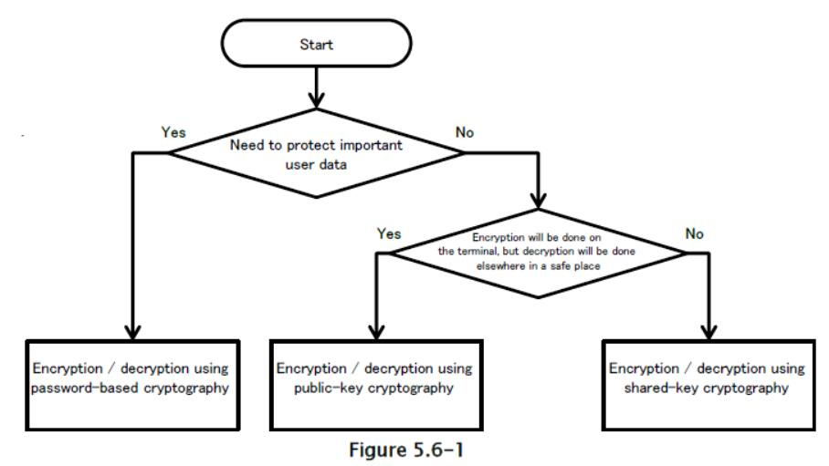
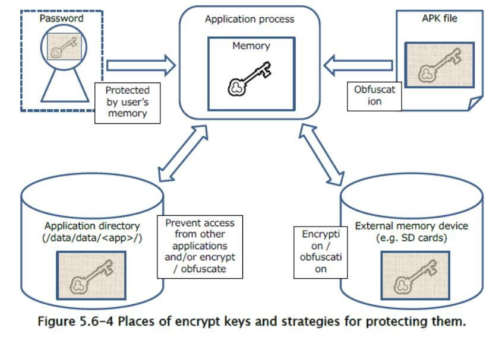

## 5.6 密码学

在安全领域，术语“机密性”，“完整性”和“可用性”用于分析对威胁的响应。这三个术语分别指，防止第三方查看私人数据的措施，确保用户引用的数据未被修改的保护措施（或用于检测何时被伪造的技术），以及用户访问服务和数据的能力。在设计安全保护时，所有这三个要素都很重要。特别是，加密技术经常用于确保机密性和完整性，并且 Android 配备了各种加密功能，来允许应用实现机密性和完整性。在本节中，我们将使用示例代码来说明，Android 应用可以安全地执行加密和解密（来确保机密性）和消息认证代码（MAC）或数字签名（来确保完整性）的方法。

### 5.6.1 示例代码

针对特定用途和条件开发了各种加密方法，包括加密和解密数据（来确保机密性）和检测数据伪造（来确保完整性）等用例。 以下是示例代码，根据每种技术的目的分为三大类加密技术。 在每种情况下，应该能够根据密码技术的特点，选择适当的加密方法和密钥类型。 对于需要更详细考虑的情况，请参见章节“5.6.3.1 选择加密方法”。 


在使用加密技术设计实现之前，请务必阅读“5.6.3.3 防止随机数字生成器中的漏洞的措施”。

保护数据免受第三方窃听



检测第三方所做的数据伪造


#### 5.6.1.1 使用基于密码的密钥的加密和解密

你可以使用基于密码的密钥加密，来保护用户的机密数据资产。

要点：

1.  显式指定加密模式和填充。
2.  使用强加密技术（特别是符合相关标准的技术），包括算法，分组加密模式和填充模式。
3.  从密码生成密钥时，使用盐。
4.  从密码生成密钥时，指定适当的哈希迭代计数。
5.  使用足以保证加密强度的密钥长度。

AesCryptoPBEKey.java

```java
package org.jssec.android.cryptsymmetricpasswordbasedkey;

import java.security.InvalidAlgorithmParameterException;
import java.security.InvalidKeyException;
import java.security.NoSuchAlgorithmException;
import java.security.SecureRandom;
import java.security.spec.InvalidKeySpecException;
import java.util.Arrays;
import javax.crypto.BadPaddingException;
import javax.crypto.Cipher;
import javax.crypto.IllegalBlockSizeException;
import javax.crypto.NoSuchPaddingException;
import javax.crypto.SecretKey;
import javax.crypto.SecretKeyFactory;
import javax.crypto.spec.IvParameterSpec;
import javax.crypto.spec.PBEKeySpec;

public final class AesCryptoPBEKey {

    // *** POINT 1 *** Explicitly specify the encryption mode and the padding.
    // *** POINT 2 *** Use strong encryption technologies (specifically, technologies that meet the relevant criteria), including algorithms, block cipher modes, and padding modes.
    // Parameters passed to the getInstance method of the Cipher class: Encryption algorithm, block encryption mode, padding rule
    // In this sample, we choose the following parameter values: encryption algorithm=AES, block encryption mode=CBC, padding rule=PKCS7Padding
    private static final String TRANSFORMATION = "AES/CBC/PKCS7Padding";
    // A string used to fetch an instance of the class that generates the key
    private static final String KEY_GENERATOR_MODE = "PBEWITHSHA256AND128BITAES-CBC-BC";
    // *** POINT 3 *** When generating a key from a password, use Salt.
    // Salt length in bytes
    public static final int SALT_LENGTH_BYTES = 20;
    // *** POINT 4 *** When generating a key from a password, specify an appropriate hash iteration count.
    // Set the number of mixing repetitions used when generating keys via PBE
    private static final int KEY_GEN_ITERATION_COUNT = 1024;
    // *** POINT 5 *** Use a key of length sufficient to guarantee the strength of encryption.
    // Key length in bits
    private static final int KEY_LENGTH_BITS = 128;
    private byte[] mIV = null;
    private byte[] mSalt = null;
    
    public byte[] getIV() {
        return mIV;
    }
    
    public byte[] getSalt() {
        return mSalt;
    }
    
    AesCryptoPBEKey(final byte[] iv, final byte[] salt) {
        mIV = iv;
        mSalt = salt;
    }
    
    AesCryptoPBEKey() {
        mIV = null;
        initSalt();
    }
    
    private void initSalt() {
        mSalt = new byte[SALT_LENGTH_BYTES];
        SecureRandom sr = new SecureRandom();
        sr.nextBytes(mSalt);
    }
    
    public final byte[] encrypt(final byte[] plain, final char[] password) {
        byte[] encrypted = null;
        try {
            // *** POINT 1 *** Explicitly specify the encryption mode and the padding.
            // *** POINT 2 *** Use strong encryption technologies (specifically, technologies that meet the relevant criteria), including algorithms, modes, and padding.
            Cipher cipher = Cipher.getInstance(TRANSFORMATION);
            // *** POINT 3 *** When generating keys from passwords, use Salt.
            SecretKey secretKey = generateKey(password, mSalt);
            cipher.init(Cipher.ENCRYPT_MODE, secretKey);
            mIV = cipher.getIV();
            encrypted = cipher.doFinal(plain);
        } catch (NoSuchAlgorithmException e) {
        } catch (NoSuchPaddingException e) {
        } catch (InvalidKeyException e) {
        } catch (IllegalBlockSizeException e) {
        } catch (BadPaddingException e) {
        } finally {
        }
        return encrypted;
    }
    
    public final byte[] decrypt(final byte[] encrypted, final char[] password) {
        byte[] plain = null;
        try {
            // *** POINT 1 *** Explicitly specify the encryption mode and the padding.
            // *** POINT 2 *** Use strong encryption technologies (specifically, technologies that meet the relevant criteria), including algorithms, block cipher modes, and padding modes.
            Cipher cipher = Cipher.getInstance(TRANSFORMATION);
            // *** POINT 3 *** When generating a key from a password, use Salt.
            SecretKey secretKey = generateKey(password, mSalt);
            IvParameterSpec ivParameterSpec = new IvParameterSpec(mIV);
            cipher.init(Cipher.DECRYPT_MODE, secretKey, ivParameterSpec);
            plain = cipher.doFinal(encrypted);
        } catch (NoSuchAlgorithmException e) {
        } catch (NoSuchPaddingException e) {
        } catch (InvalidKeyException e) {
        } catch (InvalidAlgorithmParameterException e) {
        } catch (IllegalBlockSizeException e) {
        } catch (BadPaddingException e) {
        } finally {
        }
        return plain;
    }
    
    private static final SecretKey generateKey(final char[] password, final byte[] salt) {
        SecretKey secretKey = null;
        PBEKeySpec keySpec = null;
        try {
            // *** POINT 2 *** Use strong encryption technologies (specifically, technologies that meet the relevant criteria), including algorithms, block cipher modes, and padding modes.
            // Fetch an instance of the class that generates the key
            // In this example, we use a KeyFactory that uses SHA256 to generate AES-CBC 128-bit keys.
            SecretKeyFactory secretKeyFactory = SecretKeyFactory.getInstance(KEY_GENERATOR_MODE);
            // *** POINT 3 *** When generating a key from a password, use Salt.
            // *** POINT 4 *** When generating a key from a password, specify an appropriate hash iteration count.
            // *** POINT 5 *** Use a key of length sufficient to guarantee the strength of encryption.
            keySpec = new PBEKeySpec(password, salt, KEY_GEN_ITERATION_COUNT, KEY_LENGTH_BITS);
            // Clear password
            Arrays.fill(password, '?');
            // Generate the key
            secretKey = secretKeyFactory.generateSecret(keySpec);
        } catch (NoSuchAlgorithmException e) {
        } catch (InvalidKeySpecException e) {
        } finally {
        keySpec.clearPassword();
        }
        return secretKey;
    }
}
```

#### 5.6.1.2 使用公钥的加密和解密

在某些情况下，数据加密仅在应用端使用存储的公钥来执行，而解密在单独安全位置（如服务器）在私钥下执行。 在这种情况下，可以使用公钥（非对称密钥）加密。

要点：

1.  显式指定加密模式和填充
2.  使用强加密方法（特别是符合相关标准的技术），包括算法，分组加密模式和填充模式。
3.  使用足以保证加密强度的密钥长度。

RsaCryptoAsymmetricKey.java

```java
package org.jssec.android.cryptasymmetrickey;

import java.security.InvalidKeyException;
import java.security.KeyFactory;
import java.security.NoSuchAlgorithmException;
import java.security.PrivateKey;
import java.security.PublicKey;
import java.security.interfaces.RSAPublicKey;
import java.security.spec.InvalidKeySpecException;
import java.security.spec.PKCS8EncodedKeySpec;
import java.security.spec.X509EncodedKeySpec;
import javax.crypto.BadPaddingException;
import javax.crypto.Cipher;
import javax.crypto.IllegalBlockSizeException;
import javax.crypto.NoSuchPaddingException;

public final class RsaCryptoAsymmetricKey {

    // *** POINT 1 *** Explicitly specify the encryption mode and the padding.
    // *** POINT 2 *** Use strong encryption methods (specifically, technologies that meet the relevant criteria), including algorithms, block cipher modes, and padding modes..
    // Parameters passed to getInstance method of the Cipher class: Encryption algorithm, block encryption mode, padding rule
    // In this sample, we choose the following parameter values: encryption algorithm=RSA, block encryption mode=NONE, padding rule=OAEPPADDING.
    private static final String TRANSFORMATION = "RSA/NONE/OAEPPADDING";
    // encryption algorithm
    private static final String KEY_ALGORITHM = "RSA";
    // *** POINT 3 *** Use a key of length sufficient to guarantee the strength of encryption.
    // Check the length of the key
    private static final int MIN_KEY_LENGTH = 2000;
    
    RsaCryptoAsymmetricKey() {
    }
    
    public final byte[] encrypt(final byte[] plain, final byte[] keyData) {
        byte[] encrypted = null;
        try {
            // *** POINT 1 *** Explicitly specify the encryption mode and the padding.
            // *** POINT 2 *** Use strong encryption methods (specifically, technologies that meet the relevant criteria), including algorithms, block cipher modes, and padding modes..
            Cipher cipher = Cipher.getInstance(TRANSFORMATION);
            PublicKey publicKey = generatePubKey(keyData);
            if (publicKey != null) {
                cipher.init(Cipher.ENCRYPT_MODE, publicKey);
                encrypted = cipher.doFinal(plain);
            }
        } catch (NoSuchAlgorithmException e) {
        } catch (NoSuchPaddingException e) {
        } catch (InvalidKeyException e) {
        } catch (IllegalBlockSizeException e) {
        } catch (BadPaddingException e) {
        } finally {
        }
        return encrypted;
    }
    
    public final byte[] decrypt(final byte[] encrypted, final byte[] keyData) {
        // In general, decryption procedures should be implemented on the server side;
        // however, in this sample code we have implemented decryption processing within the application to ensure confirmation of proper execution.
        // When using this sample code in real-world applications, be careful not to retain any private keys within the application.
        byte[] plain = null;
        try {
            // *** POINT 1 *** Explicitly specify the encryption mode and the padding.
            // *** POINT 2 *** Use strong encryption methods (specifically, technologies that meet the relevant criteria), including algorithms, block cipher modes, and padding modes..
            Cipher cipher = Cipher.getInstance(TRANSFORMATION);
            PrivateKey privateKey = generatePriKey(keyData);
            cipher.init(Cipher.DECRYPT_MODE, privateKey);
            plain = cipher.doFinal(encrypted);
        } catch (NoSuchAlgorithmException e) {
        } catch (NoSuchPaddingException e) {
        } catch (InvalidKeyException e) {
        } catch (IllegalBlockSizeException e) {
        } catch (BadPaddingException e) {
        } finally {
        }
        return plain;
    }
    
    private static final PublicKey generatePubKey(final byte[] keyData) {
        PublicKey publicKey = null;
        KeyFactory keyFactory = null;
        try {
            keyFactory = KeyFactory.getInstance(KEY_ALGORITHM);
            publicKey = keyFactory.generatePublic(new X509EncodedKeySpec(keyData));
        } catch (IllegalArgumentException e) {
        } catch (NoSuchAlgorithmException e) {
        } catch (InvalidKeySpecException e) {
        } finally {
        }
        // *** POINT 3 *** Use a key of length sufficient to guarantee the strength of encryption.
        // Check the length of the key
        if (publicKey instanceof RSAPublicKey) {
            int len = ((RSAPublicKey) publicKey).getModulus().bitLength();
            if (len < MIN_KEY_LENGTH) {
                publicKey = null;
            }
        }
        return publicKey;
    }
    
    private static final PrivateKey generatePriKey(final byte[] keyData) {
        PrivateKey privateKey = null;
        KeyFactory keyFactory = null;
        try {
            keyFactory = KeyFactory.getInstance(KEY_ALGORITHM);
            privateKey = keyFactory.generatePrivate(new PKCS8EncodedKeySpec(keyData));
        } catch (IllegalArgumentException e) {
        } catch (NoSuchAlgorithmException e) {
        } catch (InvalidKeySpecException e) {
        } finally {
        }
        return privateKey;
    }
}
```

#### 5.6.1.3 使用预共享密钥的加密和解密

预共享密钥可用于处理大型数据集，或保护应用或用户资产的机密性。

要点：

1.  显式指定加密模式和填充
2.  使用强加密方法（特别是符合相关标准的技术），包括算法，分组加密模式和填充模式。
3.  使用足以保证加密强度的密钥长度。

AesCryptoPreSharedKey.java

```java
package org.jssec.android.cryptsymmetricpresharedkey;

import java.security.InvalidAlgorithmParameterException;
import java.security.InvalidKeyException;
import java.security.NoSuchAlgorithmException;
import javax.crypto.BadPaddingException;
import javax.crypto.Cipher;
import javax.crypto.IllegalBlockSizeException;
import javax.crypto.NoSuchPaddingException;
import javax.crypto.SecretKey;
import javax.crypto.spec.IvParameterSpec;
import javax.crypto.spec.SecretKeySpec;

public final class AesCryptoPreSharedKey {

    // *** POINT 1 *** Explicitly specify the encryption mode and the padding.
    // *** POINT 2 *** Use strong encryption methods (specifically, technologies that meet the relevant cr
    iteria), including algorithms, block cipher modes, and padding modes.
    // Parameters passed to getInstance method of the Cipher class: Encryption algorithm, block encryption mode, padding rule
    // In this sample, we choose the following parameter values: encryption algorithm=AES, block encryption mode=CBC, padding rule=PKCS7Padding
    private static final String TRANSFORMATION = "AES/CBC/PKCS7Padding";
    // Encryption algorithm
    private static final String KEY_ALGORITHM = "AES";
    // Length of IV in bytes
    public static final int IV_LENGTH_BYTES = 16;
    // *** POINT 3 *** Use a key of length sufficient to guarantee the strength of encryption
    // Check the length of the key
    private static final int MIN_KEY_LENGTH_BYTES = 16;
    private byte[] mIV = null;
    
    public byte[] getIV() {
        return mIV;
    }
    
    AesCryptoPreSharedKey(final byte[] iv) {
        mIV = iv;
    }
    
    AesCryptoPreSharedKey() {
    }
    
    public final byte[] encrypt(final byte[] keyData, final byte[] plain) {
        byte[] encrypted = null;
        try {
            // *** POINT 1 *** Explicitly specify the encryption mode and the padding.
            // *** POINT 2 *** Use strong encryption methods (specifically, technologies that meet the relevant criteria), including algorithms, block cipher modes, and padding modes.
            Cipher cipher = Cipher.getInstance(TRANSFORMATION);
            SecretKey secretKey = generateKey(keyData);
            if (secretKey != null) {
                cipher.init(Cipher.ENCRYPT_MODE, secretKey);
                mIV = cipher.getIV();
                encrypted = cipher.doFinal(plain);
            }
        } catch (NoSuchAlgorithmException e) {
        } catch (NoSuchPaddingException e) {
        } catch (InvalidKeyException e) {
        } catch (IllegalBlockSizeException e) {
        } catch (BadPaddingException e) {
        } finally {
        }
        return encrypted;
    }
    
    public final byte[] decrypt(final byte[] keyData, final byte[] encrypted) {
        byte[] plain = null;
        try {
            // *** POINT 1 *** Explicitly specify the encryption mode and the padding.
            // *** POINT 2 *** Use strong encryption methods (specifically, technologies that meet the relevant criteria), including algorithms, block cipher modes, and padding modes.
            Cipher cipher = Cipher.getInstance(TRANSFORMATION);
            SecretKey secretKey = generateKey(keyData);
            if (secretKey != null) {
                IvParameterSpec ivParameterSpec = new IvParameterSpec(mIV);
                cipher.init(Cipher.DECRYPT_MODE, secretKey, ivParameterSpec);
                plain = cipher.doFinal(encrypted);
            }
        } catch (NoSuchAlgorithmException e) {
        } catch (NoSuchPaddingException e) {
        } catch (InvalidKeyException e) {
        } catch (InvalidAlgorithmParameterException e) {
        } catch (IllegalBlockSizeException e) {
        } catch (BadPaddingException e) {
        } finally {
        }
        return plain;
    }
    
    private static final SecretKey generateKey(final byte[] keyData) {
        SecretKey secretKey = null;
        try {
            // *** POINT 3 *** Use a key of length sufficient to guarantee the strength of encryption
            if (keyData.length >= MIN_KEY_LENGTH_BYTES) {
                // *** POINT 2 *** Use strong encryption methods (specifically, technologies that meet the relevant criteria), including algorithms, block cipher modes, and padding modes.
                secretKey = new SecretKeySpec(keyData, KEY_ALGORITHM);
            }
        } catch (IllegalArgumentException e) {
        } finally {
        }
        return secretKey;
    }
}
```

#### 5.6.1.4 使用基于密码的密钥来检测数据伪造

你可以使用基于密码的（共享密钥）加密来验证用户数据的完整性。

要点：

1.  显式指定加密模式和填充。
2.  使用强加密方法（特别是符合相关标准的技术），包括算法，分组加密模式和填充模式。
3.  从密码生成密钥时，使用盐。
4.  从密码生成密钥时，指定适当的哈希迭代计数。
5.  使用足以保证 MAC 强度的密钥长度。

HmacPBEKey.java

```java
package org.jssec.android.signsymmetricpasswordbasedkey;

import java.security.InvalidKeyException;
import java.security.NoSuchAlgorithmException;
import java.security.SecureRandom;
import java.security.spec.InvalidKeySpecException;
import java.util.Arrays;
import javax.crypto.Mac;
import javax.crypto.SecretKey;
import javax.crypto.SecretKeyFactory;
import javax.crypto.spec.PBEKeySpec;

public final class HmacPBEKey {

    // *** POINT 1 *** Explicitly specify the encryption mode and the padding.
    // *** POINT 2 *** Use strong encryption methods (specifically, technologies that meet the relevant criteria), including algorithms, block cipher modes, and padding modes.
    // Parameters passed to the getInstance method of the Mac class: Authentication mode
    private static final String TRANSFORMATION = "PBEWITHHMACSHA1";
    // A string used to fetch an instance of the class that generates the key
    private static final String KEY_GENERATOR_MODE = "PBEWITHHMACSHA1";
    // *** POINT 3 *** When generating a key from a password, use Salt.
    // Salt length in bytes
    public static final int SALT_LENGTH_BYTES = 20;
    // *** POINT 4 *** When generating a key from a password, specify an appropriate hash iteration count.
    // Set the number of mixing repetitions used when generating keys via PBE
    private static final int KEY_GEN_ITERATION_COUNT = 1024;
    // *** POINT 5 *** Use a key of length sufficient to guarantee the MAC strength.
    // Key length in bits
    private static final int KEY_LENGTH_BITS = 160;
    private byte[] mSalt = null;
    
    public byte[] getSalt() {
        return mSalt;
    }
    
    HmacPBEKey() {
        initSalt();
    }
    
    HmacPBEKey(final byte[] salt) {
        mSalt = salt;
    }
    
    private void initSalt() {
        mSalt = new byte[SALT_LENGTH_BYTES];
        SecureRandom sr = new SecureRandom();
        sr.nextBytes(mSalt);
    }
    
    public final byte[] sign(final byte[] plain, final char[] password) {
        return calculate(plain, password);
    }
    
    private final byte[] calculate(final byte[] plain, final char[] password) {
        byte[] hmac = null;
        try {
            // *** POINT 1 *** Explicitly specify the encryption mode and the padding.
            // *** POINT 2 *** Use strong encryption methods (specifically, technologies that meet the relevant criteria), including algorithms, block cipher modes, and padding modes.
            Mac mac = Mac.getInstance(TRANSFORMATION);
            // *** POINT 3 *** When generating a key from a password, use Salt.
            SecretKey secretKey = generateKey(password, mSalt);
            mac.init(secretKey);
            hmac = mac.doFinal(plain);
        } catch (NoSuchAlgorithmException e) {
        } catch (InvalidKeyException e) {
        } finally {
        }
        return hmac;
    }
    
    public final boolean verify(final byte[] hmac, final byte[] plain, final char[] password) {
        byte[] hmacForPlain = calculate(plain, password);
        if (Arrays.equals(hmac, hmacForPlain)) {
            return true;
        }
        return false;
    }
    
    private static final SecretKey generateKey(final char[] password, final byte[] salt) {
        SecretKey secretKey = null;
        PBEKeySpec keySpec = null;
        try {
            // *** POINT 2 *** Use strong encryption methods (specifically, technologies that meet the relevant criteria), including algorithms, block cipher modes, and padding modes.
            // Fetch an instance of the class that generates the key
            // In this example, we use a KeyFactory that uses SHA1 to generate AES-CBC 128-bit keys.
            SecretKeyFactory secretKeyFactory = SecretKeyFactory.getInstance(KEY_GENERATOR_MODE);
            // *** POINT 3 *** When generating a key from a password, use Salt.
            // *** POINT 4 *** When generating a key from a password, specify an appropriate hash iteration count.
            // *** POINT 5 *** Use a key of length sufficient to guarantee the MAC strength.
            keySpec = new PBEKeySpec(password, salt, KEY_GEN_ITERATION_COUNT, KEY_LENGTH_BITS);
            // Clear password
            Arrays.fill(password, '?');
            // Generate the key
            secretKey = secretKeyFactory.generateSecret(keySpec);
        } catch (NoSuchAlgorithmException e) {
        } catch (InvalidKeySpecException e) {
        } finally {
            keySpec.clearPassword();
        }
        return secretKey;
    }
}
```

#### 5.6.1.5 使用公钥来检测数据伪造

所处理的数据的签名，由存储在不同的安全位置（如服务器）中的私钥确定时，你可以使用公钥（不对称密钥）加密来处理涉及应用端公钥存储的应用，出于验证数据签名的目的。

要点：

1.  显式指定加密模式和填充。
2.  使用强加密方法（特别是符合相关标准的技术），包括算法，分组加密模式和填充模式。
3.  使用足以保证签名强度的密钥长度。

RsaSignAsymmetricKey.java

```java
package org.jssec.android.signasymmetrickey;

import java.security.InvalidKeyException;
import java.security.KeyFactory;
import java.security.NoSuchAlgorithmException;
import java.security.PrivateKey;
import java.security.PublicKey;
import java.security.Signature;
import java.security.SignatureException;
import java.security.interfaces.RSAPublicKey;
import java.security.spec.InvalidKeySpecException;
import java.security.spec.PKCS8EncodedKeySpec;
import java.security.spec.X509EncodedKeySpec;

public final class RsaSignAsymmetricKey {

    // *** POINT 1 *** Explicitly specify the encryption mode and the padding.
    // *** POINT 2 *** Use strong encryption methods (specifically, technologies that meet the relevant criteria), including algorithms, block cipher modes, and padding modes.
    // Parameters passed to the getInstance method of the Cipher class: Encryption algorithm, block encryption mode, padding rule
    // In this sample, we choose the following parameter values: encryption algorithm=RSA, block encryption mode=NONE, padding rule=OAEPPADDING.
    private static final String TRANSFORMATION = "SHA256withRSA";
    // encryption algorithm
    private static final String KEY_ALGORITHM = "RSA";
    // *** POINT 3 *** Use a key of length sufficient to guarantee the signature strength.
    // Check the length of the key
    private static final int MIN_KEY_LENGTH = 2000;
    
    RsaSignAsymmetricKey() {
    }
    
    public final byte[] sign(final byte[] plain, final byte[] keyData) {
        // In general, signature procedures should be implemented on the server side;
        // however, in this sample code we have implemented signature processing within the application to ensure confirmation of proper execution.
        // When using this sample code in real-world applications, be careful not to retain any private keys within the application.
        byte[] sign = null;
        try {
            // *** POINT 1 *** Explicitly specify the encryption mode and the padding.
            // *** POINT 2 *** Use strong encryption methods (specifically, technologies that meet the relevant criteria), including algorithms, block cipher modes, and padding modes.
            Signature signature = Signature.getInstance(TRANSFORMATION);
            PrivateKey privateKey = generatePriKey(keyData);
            signature.initSign(privateKey);
            signature.update(plain);
            sign = signature.sign();
        } catch (NoSuchAlgorithmException e) {
        } catch (InvalidKeyException e) {
        } catch (SignatureException e) {
        } finally {
        }
        return sign;
    }
    
    public final boolean verify(final byte[] sign, final byte[] plain, final byte[] keyData) {
        boolean ret = false;
        try {
            // *** POINT 1 *** Explicitly specify the encryption mode and the padding.
            // *** POINT 2 *** Use strong encryption methods (specifically, technologies that meet the relevant criteria), including algorithms, block cipher modes, and padding modes.
            Signature signature = Signature.getInstance(TRANSFORMATION);
            PublicKey publicKey = generatePubKey(keyData);
            signature.initVerify(publicKey);
            signature.update(plain);
            ret = signature.verify(sign);
        } catch (NoSuchAlgorithmException e) {
        } catch (InvalidKeyException e) {
        } catch (SignatureException e) {
        } finally {
        }
        return ret;
    }
    
    private static final PublicKey generatePubKey(final byte[] keyData) {
        PublicKey publicKey = null;
        KeyFactory keyFactory = null;
        try {
            keyFactory = KeyFactory.getInstance(KEY_ALGORITHM);
            publicKey = keyFactory.generatePublic(new X509EncodedKeySpec(keyData));
        } catch (IllegalArgumentException e) {
        } catch (NoSuchAlgorithmException e) {
        } catch (InvalidKeySpecException e) {
        } finally {
        }
        // *** POINT 3 *** Use a key of length sufficient to guarantee the signature strength.
        // Check the length of the key
        if (publicKey instanceof RSAPublicKey) {
            int len = ((RSAPublicKey) publicKey).getModulus().bitLength();
            if (len < MIN_KEY_LENGTH) {
                publicKey = null;
            }
        }
        return publicKey;
    }
    
    private static final PrivateKey generatePriKey(final byte[] keyData) {
        PrivateKey privateKey = null;
        KeyFactory keyFactory = null;
        try {
            keyFactory = KeyFactory.getInstance(KEY_ALGORITHM);
            privateKey = keyFactory.generatePrivate(new PKCS8EncodedKeySpec(keyData));
        } catch (IllegalArgumentException e) {
        } catch (NoSuchAlgorithmException e) {
        } catch (InvalidKeySpecException e) {
        } finally {
        }
        return privateKey;
    }
}
```

#### 5.6.1.6 使用预共享密钥来检测数据伪造

你可以使用预共享密钥来验证应用资产或用户资产的完整性。

要点：

1.  显式指定加密模式和填充。
2.  使用强加密方法（特别是符合相关标准的技术），包括算法，分组加密模式和填充模式。
3.  使用足以保证 MAC 强度的密钥长度。

HmacPreSharedKey.java

```java
package org.jssec.android.signsymmetricpresharedkey;

import java.security.InvalidKeyException;
import java.security.NoSuchAlgorithmException;
import java.util.Arrays;
import javax.crypto.Mac;
import javax.crypto.SecretKey;
import javax.crypto.spec.SecretKeySpec;

public final class HmacPreSharedKey {

    // *** POINT 1 *** Explicitly specify the encryption mode and the padding.
    // *** POINT 2 *** Use strong encryption methods (specifically, technologies that meet the relevant criteria), including algorithms, block cipher modes, and padding modes.
    // Parameters passed to the getInstance method of the Mac class: Authentication mode
    private static final String TRANSFORMATION = "HmacSHA256";
    // Encryption algorithm
    private static final String KEY_ALGORITHM = "HmacSHA256";
    // *** POINT 3 *** Use a key of length sufficient to guarantee the MAC strength.
    // Check the length of the key
    private static final int MIN_KEY_LENGTH_BYTES = 16;
    
    HmacPreSharedKey() {
    }
    
    public final byte[] sign(final byte[] plain, final byte[] keyData) {
        return calculate(plain, keyData);
    }
    
    public final byte[] calculate(final byte[] plain, final byte[] keyData) {
        byte[] hmac = null;
        try {
            // *** POINT 1 *** Explicitly specify the encryption mode and the padding.
            // *** POINT 2 *** Use strong encryption methods (specifically, technologies that meet the relevant criteria), including algorithms, block cipher modes, and padding modes.
            Mac mac = Mac.getInstance(TRANSFORMATION);
            SecretKey secretKey = generateKey(keyData);
            if (secretKey != null) {
                mac.init(secretKey);
                hmac = mac.doFinal(plain);
            }
        } catch (NoSuchAlgorithmException e) {
        } catch (InvalidKeyException e) {
        } finally {
        }
        return hmac;
    }
    
    public final boolean verify(final byte[] hmac, final byte[] plain, final byte[] keyData) {
    byte[] hmacForPlain = calculate(plain, keyData);
        if (hmacForPlain != null && Arrays.equals(hmac, hmacForPlain)) {
            return true;
        }
        return false;
    }
    
    private static final SecretKey generateKey(final byte[] keyData) {
        SecretKey secretKey = null;
        try {
            // *** POINT 3 *** Use a key of length sufficient to guarantee the MAC strength.
            if (keyData.length >= MIN_KEY_LENGTH_BYTES) {
            // *** POINT 2 *** Use strong encryption methods (specifically, technologies that meet the relevant criteria), including algorithms, block cipher modes, and padding modes.
            secretKey = new SecretKeySpec(keyData, KEY_ALGORITHM);
            }
        } catch (IllegalArgumentException e) {
        } finally {
        }
        return secretKey;
    }
}
```

### 5.6.2 规则书

使用加密技术时，遵循以下规则：

#### 5.6.2.1 指定加密算法时，请显式指定加密模式和填充（必需）

在使用加密技术和数据验证等密码学技术时，加密模式和填充必须显式指定。 在 Android 应用开发中使用加密时，你将主要使用`java.crypto`中的`Cipher`类。 为了使用`Cipher`类，你将首先通过指定要使用的加密类型，来创建`Cipher`类对象的实例。 这个指定被称为转换，并且有两种格式可以指定转换：

+   算法/模式/填充
+   算法

在后一种情况下，加密模式和填充将隐式设置为 Android 可以访问的加密服务供应器的适当默认值。 这些默认值优先考虑便利性和兼容性而选择，并且在某些情况下可能不是特别安全的选择。 为此，为了确保正确的安全保护，必须使用两种格式中的前者，其中显式指定了加密模式和填充。

#### 5.6.2.2 使用强算法（特别是符合相关标准的算法）（必需）

使用加密技术时，选择符合特定标准的强算法很重要。 此外，在算法允许多个密钥长度的情况下，重要的是要考虑应用的整个产品生命周期，并选择足以确保安全性的密钥长度。 此外，对于一些加密模式和填充模式，存在已知的攻击策略；对这些威胁做出有力的选择是非常重要的。


确实，选择弱加密方法会造成灾难性后果。 例如，被加密来防止第三方窃听的文件，实际上可能仅受到无效保护，并且可能允许第三方窃听。 由于 IT 的不断进步导致加密分析技术的持续改进，因此至关重要的是，考虑并选择一个算法，它能够在运行的整个期间，保证安全性。在此时间，你希望应用保持运行。

实际加密技术的标准因国家而异，详见下表（单位：位）。

表 5.6-1 NIST(USA) NIST SP800-57

| 算法生命周期 | 对称密钥加密 | 非对称密钥加密 | 椭圆曲线加密 | HASH（数字签名） | HASH（随机数生成） |
| --- | --- | --- | --- | --- | --- |
| ~2010 | 80 | 1024 | 160 | 160 | 160 |
| ~2030 | 112 | 2048 | 224 | 224 | 160 |
| 2030~ | 128 | 3072 | 256 | 256 | 160 |

表 5.6-2 ECRYPT II (EU)

| 算法生命周期 | 对称密钥加密 | 非对称密钥加密 | 椭圆曲线加密 | HASH |
| --- | --- | --- | --- | --- |
| 2009~2012 | 80 | 1248 | 160 | 160 |
| 2009~2020 | 96 | 1776 | 192 | 192 |
| 2009~2030 | 112 | 2432 | 224 | 224 |
| 2009~2040 | 128 | 3248 | 256 | 256 |
| 2009~ | 256 | 15424 | 512 | 512 |

表 5.6-3 CRYPTREC(Japan) CRYPTREC 加密算法列表

| 技术族 |  | 名称 |
| --- | --- | --- |
| 公钥加密 | 签名 | DSA,ECDSA,RSA-PSS,RSASSA-PKCS1-V1_5 |
| | 机密性 | RSA-OAEP |
| | 密钥共享 | DH,ECDH |
| 共享密钥加密 | 64 位块加密 | 3-key Triple DES |
| | 128 位块加密 | AES,Camellia |
| | 流式加密 | KCipher-2 |
| 哈希函数 | | SHA-256,SHA-384,SHA-512 |
| 加密使用模式 | 密文模式 | CBC,CFB,CTR,OFB |
| | 认证密文模式 | CCM,GCM |
| 消息认证代码 | | CMAC,HMAC |
| 实体认证 | | ISO/IEC 9798-2,ISO/IEC 9798-3 |

#### 5.6.2.3 使用基于密码的加密时，不要在设备上存储密码（必需）

在基于密码的加密中，当根据用户输入的密码生成加密密钥时，请勿将密码存储在设备中。 基于密码的加密的优点是无需管理加密密钥；将密码存储在设备上消除了这一优势。 无需多说，在设备上存储密码会产生其他应用窃听的风险，因此出于安全原因，在设备上存储密码也是不可接受的。

#### 5.6.2.4 从密码生成密钥时，使用盐（必需）

在基于密码的加密中，当根据用户输入的密码生成加密密钥时，请始终使用盐。 另外，如果你要在同一设备中为不同用户提供功能，请为每个用户使用不同的盐。 原因是，如果你仅使用简单的哈希函数生成加密密钥而不使用盐，则可以使用称为“彩虹表”的技术轻松恢复密码。使用了盐时，会使用相同的密码生成的密钥 将是不同的（不同的哈希值），防止使用彩虹表来搜索密钥。

示例：

```java
public final byte[] encrypt(final byte[] plain, final char[] password) {
    byte[] encrypted = null;
    try {
        // *** POINT *** Explicitly specify the encryption mode and the padding.
        // *** POINT *** Use strong encryption methods (specifically, technologies that meet the relevant criteria), including algorithms, block cipher modes, and padding modes.
        Cipher cipher = Cipher.getInstance(TRANSFORMATION);
        // *** POINT *** When generating keys from passwords, use Salt.
        SecretKey secretKey = generateKey(password, mSalt);
```

#### 5.6.2.5 从密码生成密钥时，指定适当的哈希迭代计数（必需）

在基于密码的加密中，当根据用户输入的密码生成加密密钥时，你需要选择在密钥生成过程（“拉伸”）中，散列过程的重复次数；指定足够大的数字来确保安全性非常重要。一般来说，1,000 或更大的迭代次数是足够的。如果你使用密钥来保护更有价值的资产，请指定 1,000,000 或更高的计数。由于散列函数的单个计算所需的处理时间很少，因此攻击者可能很容易进行爆破攻击。因此，通过使用拉伸方法（其中散列处理重复多次），我们可以有意确保该过程消耗大量时间，因此爆破攻击的成本更高。请注意，拉伸重复次数也会影响应用的处理速度，因此请谨慎选择合适的值。

示例：

```java
private static final SecretKey generateKey(final char[] password, final byte[] salt) {
    SecretKey secretKey = null;
    PBEKeySpec keySpec = null;
    
    (Omit)
    
    // *** POINT *** When generating a key from password, use Salt.
    // *** POINT *** When generating a key from password, specify an appropriate hash iteration count.
    // *** POINT *** Use a key of length sufficient to guarantee the strength of encryption. 
    keySpec = new PBEKeySpec(password, salt, KEY_GEN_ITERATION_COUNT, KEY_LENGTH_BITS);
```

#### 5.6.2.6 采取措施来增加密码强度（推荐）

在基于密码的加密中，当基于用户输入的密码生成加密密钥时，生成的密钥的强度受用户密码强度的强烈影响，因此值得采取措施来加强从用户那里收到的密码。 例如，你可以要求密码长度至少为 8 个字符，并且包含多种类型的字符 - 可能至少包含一个字母，一个数字和一个符号。


### 5.6.3 高级话题

#### 5.6.3.1 选择加密方法

在上面的示例代码中，我们展示了三种加密方法的实现示例，每种加密方法用于加密解密以及数据伪造的检测。 你可以使用“图 5.6-1”，“图 5.6-2”，根据你的应用粗略选择使用哪种加密方法。 另一方面，加密方法的更加精细的选择，需要更详细地比较各种方法的特征。 在下面我们考虑一些这样的比较。

用于加密和解密的密码学方法的比较

公钥密码术具有很高的处理成本，因此不适合大规模数据处理。但是，因为用于加密和解密的密钥不同，所以仅仅在应用侧处理公钥（即，只执行加密），并且在不同（安全）位置执行解密的情况下，管理密钥相对容易。共享密钥加密是一种通用的加密方案，但限制很少，但在这种情况下，相同的密钥用于加密和解密，因此有必要将密钥安全地存储在应用中，从而使密钥管理变得困难。基于密码的密钥系统（基于密码的共享密钥系统）通过用户指定的密码生成密钥，避免了在设备中存储密钥相关的密码的需求。此方法用于仅仅保护用户资产，但不保护应用资产的应用。由于加密强度取决于密码强度，因此有必要选择密码，其复杂度与要保护的资产价值成比例增长。请参阅“5.6.2.6 采取措施来增加密码强度（推荐）”。

表 5.6-4 用于加密和解密的密码学方法的比较

| 条目/加密方法 | 公钥 | 共享密钥 | 基于密码 |
| --- | --- | --- | --- |
| 处理大规模数据 | 否（开销太大） | OK | OK |
| 保护应用（或服务）资产 | OK | OK | 否（允许用户窃取） |
| 保护用户资产 | OK | OK | OK |
| 加密强度 | 取决于密钥长度 |  取决于密钥长度 | 取决于密码强度，盐和哈希重复次数 |
| 密钥存储 | 简单（仅公钥） | 困难 | 简单 |
| 由应用执行的过程 | 加密（解密在服务器或其它地方完成） | 加密和解密 | 加密和解密 |

用于检测数据伪造的密码学方法的比较

这里的比较与上面讨论的加密和解密类似，除了与数据大小对应的条目不再相关。

表 5.6-5 用于检测数据伪造的密码学方法的比较

| 条目/加密方法 | 公钥 | 共享密钥 | 基于密码 |
| --- | --- | --- | --- |
| 保护应用（或服务）资产 | OK | OK | 否（允许用户伪造） |
| 保护用户资产 | OK | OK | OK |
| 加密强度 | 取决于密钥长度 |  取决于密钥长度 | 取决于密码强度，盐和哈希重复次数 |
| 密钥存储 | 简单（仅公钥） | 困难，请参考“5.6.3.4 保护密钥” | 简单 |
| 由应用执行的过程 | 签名验证（签名在服务器或其它地方完成） | MAC 计算和验证 | MAC 计算和验证 |

MAC：消息认证代码


请注意，这些准则主要关注被视为低级或中级资产的资产保护，根据“3.1.3 资产分类和保护对策”一节中讨论的分类。 由于使用加密涉及的问题，比其他预防性措施（如访问控制）更多，如密钥存储问题，因此只有资产不能在 Android 操作系统安全模式下有效保护时，才应该考虑加密。

#### 5.6.3.2 随机数的生成

使用加密技术时，选择强加密算法和加密模式，以及足够长的密钥，来确保应用和服务处理的数据的安全性，这非常重要。 然而，即使所有这些选择都做得适当，当形成安全协议关键的密钥被泄漏或猜测时，所使用的算法所保证的安全强度立即下降为零。

即使对于在AES和类似协议下，用于共享密钥加密的初始向量（IV），或者用于基于密码的加密的盐，较大偏差也可以使第三方轻松发起攻击，从而增加数据泄漏或污染的风险 。 为了防止这种情况，有必要以第三方难以猜测它们的值的方式，产生密钥和 IV，而随机数在确保这一必要实现的方面，起着非常重要的作用。 产生随机数的设备称为随机数生成器。 尽管硬件随机数生成器（RNG）可能使用传感器或其他设备，通过测量无法预测或再现的自然现象来产生随机数，但更常见的是用软件实现的随机数生成器，称为伪随机数生成器（PRNG）。

在Android应用中，可以通过`SecureRandom`类生成用于加密的足够安全的随机数。 `SecureRandom`类的功能由一个称为`Provider`的实现提供。 多个供应器（实现）可以在内部存在，并且如果没有明确指定供应器，则会选择默认供应器。 出于这个原因，也可以在不知道供应器存在的情况下，使用`SecureRandom`来实现。 在下面,我们提供的例子演示了如何使用`SecureRandom`。 

请注意，根据 Android 版本的不同，`SecureRandom`可能存在一些缺陷，需要在实施中采取预防措施。 请参阅“5.6.3.3 防止随机数生成器中的漏洞的措施”。

使用`SecureRandom`（默认实现）

```java
import java.security.SecureRandom;

[...]

SecureRandom random = new SecureRandom();
byte[] randomBuf = new byte [128];
random.nextBytes(randomBuf);

[...]
```

使用`SecureRandom`（明确的特定算法）

```java
import java.security.SecureRandom;

[...]

SecureRandom random = SecureRandom.getInstance("SHA1PRNG");
byte[] randomBuf = new byte [128];
random.nextBytes(randomBuf);

[...]
```

使用`SecureRandom`（明确的特定实现（供应器））

```java
import java.security.SecureRandom;

[...]

SecureRandom random = SecureRandom.getInstance("SHA1PRNG", “Crypto”);
byte[] randomBuf = new byte [128];
random.nextBytes(randomBuf);

[...]
```

程序中发现的伪随机数发生器，例如`SecureRandom`，通常基于一些基本过程来操作，如“图 5.6-3 伪随机数发生器的内部过程”中所述。 输入一个随机数种子来初始化内部状态；此后，每次生成随机数时更新内部状态，从而允许生成随机数序列。

随机数种子

种子在伪随机数发生器（PRNG）中起着非常重要的作用。 如上所述，PRNG 必须通过指定种子来初始化。 此后，用于生成随机数的过程是确定性算法，因此如果指定相同的种子，则会得到相同的随机数序列。 这意味着如果第三方获得（即窃听）或猜测 PRNG 的种子，他可以产生相同的随机数序列，从而破坏随机数提供的机密性和完整性属性。

出于这个原因，随机数生成器的种子本身就是一个高度机密的信息 - 而且必须以无法预测或猜测的方式来选择。 例如，不应使用时间信息或设备特定数据（例如 MAC 地址，IMEI 或 Android ID）来构建 RNG 种子。 在许多 Android 设备上，`/dev/urandom`或`/dev/random`可用，Android 提供的`SecureRandom`默认实现使用这些设备文件，来确定随机数生成器的种子。 就机密性而言，只要 RNG 种子仅存在于内存中，除获得 root 权限的恶意软件工具外，几乎没有由第三方发现的风险。 如果你需要实现，即使在已 root 的设备上仍然有效的安全措施，请咨询安全设计和实现方面的专家。

伪随机数生成器的内部状态

伪随机数发生器的内部状态由种子初始化，然后在每次生成随机数时更新。 就像由相同种子初始化的 PRNG 一样，具有相同内部状态的两个 PRNG 随后将产生完全相同的随机数序列。 因此，保护内部状态免受第三方窃听也很重要。 但是，由于内部状态存在于内存中，除了拥有 root 访问权的恶意软件工具外，几乎没有发现任何第三方的风险。 如果你需要实现，即使在已 root 的设备上仍然有效的安全措施，请咨询安全设计和实现方面的专家。

#### 5.6.3.3 防范随机数生成器中的漏洞的措施


在 Android 4.3.x 及更早版本中发现，`SecureRandom`的`Crypto`供应器实现拥有内部状态熵（随机性）不足的缺陷。 特别是在 Android 4.1.x 及更早版本中，`Crypto`供应器是`SecureRandom`的唯一可用实现，因此大多数直接或间接使用`SecureRandom`的应用都受此漏洞影响。 同样，Android 4.2 和更高版本中，作为`SecureRandom`的默认实现而提供的`AndroidOpenSSL`供应器拥有这个缺陷，由`OpenSSL`使用的作为随机数种子的大部分数据在应用之间共享（Android 4.2.x-4.3 .x），产生了一个漏洞，任何应用都可以轻松预测其他应用生成的随机数。 下表详细说明了各种 Android OS 版本中存在的漏洞的影响。

表 5.6-6 Android操作系统版本和受到每个漏洞的影响的功能

| Android OS/漏洞 | `SecureRandom`的`Crypto`供应器实现的内部状态熵不足 | 可以猜测其他程序中`OpenSSL`所使用的随机数 |
| --- | --- | --- |
|  4.1.x 及之前 | `SecureRandom`的默认实现，`Crypto`供应器的显式使用，由`Cipher`类提供的加密功能，HTTPS 通信功能等 | 无影响 |
| 4.2 - 4.3.x | 使用明确标识的`Crypto`供应器 | `SecureRandom`的默认实现，Android OpenSSL 供应器的显式使用，`OpenSSL`提供的随机数生成功能的直接使用，由`Cipher`类提供的加密功能，HTTPS 通信功能等 |
| 4.4 及之后 | 无影响 | 无影响 |

自 2013 年 8 月以来，Google 已经向其合作伙伴（设备制造商等），分发了用于消除这些 Android 操作系统漏洞的补丁。但是，与`SecureRandom`相关的这些漏洞影响了广泛的应用，包括加密功能和 HTTPS 通信功能，并且据推测许多设备仍未修补。 因此，在设计针对 Android 4.3.x 和更早版本的应用时，我们建议你采纳以下站点中讨论的对策（实现）。

<http://android-developers.blogspot.jp/2013/08/some-securerandom-thoughts.html>

#### 5.6.3.4 密钥保护

使用加密技术来确保敏感数据的安全性（机密性和完整性）时，只要密钥本身的数据内容是可用的，即使最健壮的加密算法和密钥长度，也不能保护数据免受第三方攻击。 出于这个原因，正确处理密钥是使用加密时需要考虑的最重要的项目之一。 当然，根据你尝试保护的资产的级别，正确处理密钥可能需要非常复杂的设计和实现技术，这些技术超出了本指南的范围。 在这里，我们只能提供一些基本想法，有关安全处理各种应用和密钥的存储位置; 我们的讨论没有扩展到特定的实现方法，并且必要时我们建议你咨询安全设计和实现方面的专家。

首先，“图 5.6-4 加密密钥的位置和保护它们的策略”，说明了 Android 智能手机和平板电脑中，用于储存密钥和相关用途的各种位置，并概述了保护它们的策略。



下表总结了受密钥保护的资产的资产类别，以及适用于各种资产所有者的保护策略。 资产类别的更多信息，请参阅“3.1.3 资产分类和保护对策”。

表 5.6-7 资产分类和保护对策

| 资产所有者 | 设备用户 | | 应用/服务供应者 | |
| --- | --- | --- | --- | --- |
| 资产级别 | 高 | 中低 | 高 | 中低 |
| 密钥储存位置 | | 保护策略 | | |
| 用户内存 | 提高密码强度 | | 不允许使用用户密码 | |
| 应用目录（非公共存储） | 密钥加密或混淆 | 禁止来自应用外部的读写操作 | 密钥加密或混淆 | 禁止来自应用外部的读写操作 | 
| APK 文件 | | 混淆密钥数据。注：要注意大多数 Java 混淆工具，例如 Proguard，不会混淆数据字符串。 | | |
| SD 卡或者其它（公共存储） |  | 加密或混淆密钥数据 | | |

在下文中，我们讨论适用于存储密钥的各个地方的保护措施。

储存在用户内存中的密钥

这里我们考虑基于密码的加密。 从密码生成密钥时，密钥存储位置是用户内存，因此不存在由于恶意软件而造成泄漏的危险。 但是，根据密码的强度，可能很容易重现密钥。 出于这个原因，有必要采取步骤来确保密码的强度， 类似于让用户指定服务登录密码时采取的步骤；例如，密码可能受到 UI 的限制，或者可能会使用警告消息。 请参阅“5.6.2.6 采取措施增加密码的强度（推荐）”。 当然，当密码存储在用户用户中时，必须记住密码将被遗忘的可能性。 为确保在忘记密码的情况下可以恢复数据，必须将备份数据存储在设备以外的安全位置（例如服务器上）。

储存在应用目录中的密钥

当密钥以私有模式，存储在应用目录中时，密钥数据不能被其他应用读取。 另外，如果应用禁用备份功能，用户也将无法访问数据。 因此，当存储用于保护应用资产的密钥时，应该禁用备份。 

但是，如果你还需要针对使用 root 权限的应用或用户保护密钥，则必须对密钥进行加密或混淆。 对于用于保护用户资产的密钥，你可以使用基于密码的加密。 对于用于加密应用资产的密钥，你希望这些资产对于用户是不可见的，你必须将用于资产加密的密钥存储在 APK 文件中，并且必须对密钥数据进行混淆处理。

储存在 APK 文件中的密钥

由于可以访问APK文件中的数据，因此通常这不适合存储机密数据（如密钥）。 在 APK 文件中存储密钥时，你必须对密钥数据进行混淆处理，并采取措施确保数据无法轻易从 APK 文件中读取。

储存在公共存储位置（例如 SD 卡）的密钥

由于公共存储可以被所有应用访问，因此通常它不适合存储机密数据（如密码）。 将密钥存储在公共位置时，需要对密钥数据进行加密或混淆处理，来确保无法轻易访问数据。 另请参阅上面的“存储在应用目录中的密钥”中提出的保护措施，来了解还必须针对具有 root 权限的应用或用户来保护密钥。

在进程内存中处理密钥

使用 Android 中可用的加密技术时，必须在加密过程之前，在上图中所示的应用进程以外的地方，对加密或混淆的密钥数据进行解密（或者，对于基于密码的密钥，则需要生成密钥）。在这种情况下，密钥数据将以未加密的形式驻留在进程内存中。另一方面，应用的内存通常不会被其他应用读取，因此如果资产类别位于这些准则涵盖的范围内，则没有采取特定步骤来确保安全性的特别需求。在密钥数据以未加密的形式出现（即使它们以这种方式存在于进程内存中）是不可接受的的情况下，由于特定目标或由应用处理的资产级别，可能有必要对密钥数据和加密逻辑，采取混淆处理或其他技术。但是，这些方法在 Java 层面上难以实现；相反，你将在 JNI 层面上使用混淆工具。这些措施不在本准则的范围之内；咨询安全设计和实现方面的专家。

#### 5.6.3.5 通过 Google Play 服务解决安全供应器的漏洞

Google Play 服务（5.0 和更高版本）提供了一个称为供应器安装器的框架，可用于解决安全供应器中的漏洞。 

首先，安全提供应器提供了基于 Java 密码体系结构（JCA）的各种加密相关的算法的实现。 这些安全供应器算法可以通过诸如`Cipher`，`Signature`和`Mac`等类来使用，来在 Android 应用中使用加密技术。 一般来说，只要在加密技术相关的实现中发现漏洞，就需要快速响应。 事实上，以恶意目的利用这些漏洞可能会导致严重损害。 由于加密技术也与安全供应器相关，所以希望用于解决漏洞的修订越快越好。

执行安全供应器修订的最常见方法是使用设备更新。通过设备更新执行修订的过程，起始于设备制造商准备更新，之后用户将此更新应用于其设备。因此，应用是否可以访问安全供应器的最新版本（包括最新版本），实际上取决于制造商和用户的遵从性。相反，使用来自 Google Play 服务的供应器安装器，可确保应用可以访问自动更新的安全供应器版本。

使用来自 Google Play 服务的供应器安装器，通过从应用调用供应器安装器，可以访问由 Google Play 服务提供的安全供应器。 Google Play 服务会通过 Google Play 商店自动更新，因此供应器安装器所提供的安全供应器，将自动更新到最新版本，而不依赖制造商或用户的遵从性。

调用供应器安装器的示例代码如下所示。

调用供应器安装器

```java
import com.google.android.gms.common.GooglePlayServicesUtil;
import com.google.android.gms.security.ProviderInstaller;

public class MainActivity extends Activity
    implements ProviderInstaller.ProviderInstallListener {
    
    @Override
    protected void onCreate(Bundle savedInstanceState) {
        super.onCreate(savedInstanceState);
        ProviderInstaller.installIfNeededAsync(this, this);
        setContentView(R.layout.activity_main);
    }
    
    @Override
    public void onProviderInstalled() {
        // Called when Security Provider is the latest version, or when installation completes
    }
    
    @Override
    public void onProviderInstallFailed(int errorCode, Intent recoveryIntent) {
        GoogleApiAvailability.getInstance().showErrorNotification(this, errorCode);
    }
}
```
