# 九、Web 服务器和 Web 应用的评估

在本章中，您将学习评估 web 服务器和 web 应用的技术，它们是我们可能遇到的绝大多数环境的一部分。我们将讨论以下主题：

*   分析 OWASP 十大攻击
*   识别 web 应用防火墙
*   穿透 web 应用防火墙
*   工具

本章将提供关于最流行的攻击向量和攻击向量的信息，这些向量实际上是在任何环境下都可以访问的。几乎所有的组织都需要某种形式的在线存在。因此，我们很有可能会有一个 web 服务器，可能还有一些 web 应用，我们可以用它们来尝试破坏客户端系统和/或网络。

# 分析 OWASP 十大攻击

**开放式 Web 应用安全项目**（**OWASP**组）是中最好的资源之一，我们不仅可以用来收集关于不同类型的攻击的信息，还可以用来收集防范这些攻击的方法和安全的编码指导。由于我们处于测试模式，我们将专注于攻击。OWASP 十大攻击是一个很好的参考。您可以在[下载最新版本 https://www.owasp.org/index.php/Category:OWASP_Top_Ten_Project](https://www.owasp.org/index.php/Category:OWASP_Top_Ten_Project) 。

OWASP 小组还有一个名为 WebGoat 的优秀教程。有关本教程的更多信息，请访问[https://www.owasp.org/index.php/OWASP/Training/OWASP_WebGoat_Project](https://www.owasp.org/index.php/OWASP/Training/OWASP_WebGoat_Project) 。

选择 OWASP 断开的 Web 应用虚拟机的一个优点是它附带的工具。启动 OWASP 虚拟机后，将为我们需要连接的接口分配一个地址。对于本书中的这个示例，已为接口分配了 10.2.0.132 的 IP 地址，因此所有示例都将使用此地址。

机器启动后，我们将从 web 浏览器访问它。因此，我们打开我们选择的浏览器并输入`http://10.1.0.132`以打开机器的主页。

### 注

您需要连接到主机的 VMnet2 交换机才能从主机上的浏览器访问虚拟机。如果使用虚拟机，则只要您在 VMnet2 交换机上，就不需要虚拟机。

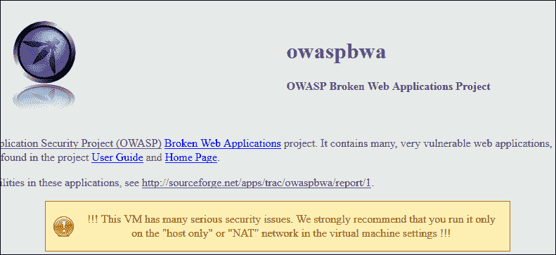

用户登录后显示的页面

我们现在已经准备好使用此项目中包含的功能查看特定攻击。

## 注射缺陷

注入缺陷一直是众多版本的 OWASP 前十名的头号攻击，并且它继续处于领先地位。最流行的注入类型是臭名昭著的 SQL 注入。尽管警告开发人员并提供了大量资源，以便他们能够设计安全的应用，但我们仍然看到这种攻击仍然是成功的。对于注入攻击，这只是众多方法中的一种。我们可以执行 HTML、XML 和 LDAP 注入。所有这些攻击的主要组成部分是让应用执行非预期的操作，或者在未经授权的情况下访问数据。

我们将使用 WebGoat 工具来了解如何做到这一点。在 OWASP 断开的 Web 应用主页上，单击**OWASP WebGoat**打开登录页面。在登录页面中，输入用户名`guest`和密码`guest`进入教程。以下屏幕截图显示了本教程首页的示例：


点击**启动 WebGoat**启动工具。这将使您进入工具中包含的可用培训课程的界面。正如您所见，有大量的课程可供选择，因此，花时间学习这些课程将是有益的。当我们讨论注入缺陷时，您将在菜单的左侧看到一个项目。单击此项并展开主题中的不同课程。以下屏幕截图显示了一个示例：


主题内的不同课程（裁剪的文本不重要）

正如前面的截图所示，我们可以处理各种各样的缺陷，其中最主要的缺陷与 SQL 注入有关。我们将查看列表中的第五个，因此单击**字符串 SQL 注入**打开课程的第一页，其中包含描述。以下屏幕截图显示了一个示例：

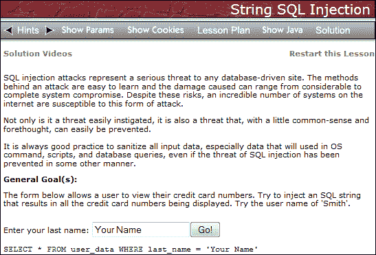

正如前面的截图所示，正如您在回顾教程时所看到的，这里有**提示**以及**解决方案视频**，您可以参考这些视频来帮助完成课程。阅读本文的许多人可能都知道，测试 SQL 注入的最简单方法是输入一个单引号（`'`）字符，然后查看我们是否将其从前端发送到将生成错误消息的后端数据库。我们现在就试试。输入一个单引号字符作为名称，然后单击**Go！**。这将提交申请。以下屏幕截图显示了结果示例：

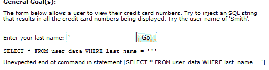

那么，上一张截图中的显示了什么？它告诉我们，我们现在有了一个证据，证明我们输入的字符是通过前端应用输入的，因为它被放入了查询中！如果前端能够捕获它，那么它就不会成为查询的一部分。我们看到的错误是因为这不是有效的 SQL 查询。因此，现在需要输入将计算为 true 的字符串。我们在 SQL 注入攻击中使用的最常见字符串是`' OR 1=1 --`在数据输入未正确清理时转储数据库内容。使用此常见攻击字符串时返回的结果输出如以下屏幕截图所示：

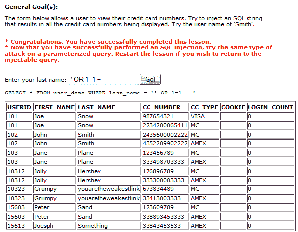

正如前面的截图所示，我们已经成功，我们已经转储了数据库的全部内容。输出还通知我们课程已切换到参数化查询，以便我们重试。您可以尝试这样做，但我们会提前告诉您，一旦查询切换到基于参数的条件，攻击将不再有效。这里有许多 SQL 注入课程，我们鼓励您进行探索。我们将继续下一项攻击。

## 身份验证和会话管理中断

当设计应用时，设计者必须保护用于身份验证的令牌和会话密钥。不幸的是，从安全角度来看，这是一个经常被忽视或实施不力的领域，因此，为我们提供了一个优秀的攻击向量。这种攻击通常涉及某种形式的身份验证令牌捕获，然后破解该令牌或使用该令牌冒充某人的身份。在我们的 WebGoat 工具中，我们有两个部分来了解这些攻击，它们是身份验证缺陷和会话管理缺陷。我们将查看身份验证缺陷。在 WebGoat 教程中，在屏幕左侧，导航到**身份验证缺陷**|**基本身份验证**以打开课程。以下屏幕截图显示了一个示例：


当您通读本课程的信息时，很明显，我们需要拦截来自应用和客户端的通信量，以查看它是如何编码的。最常见的方法是使用代理，您可以使用很多代理。我们将使用一个简单的插件，它是 Firefox 的插件**篡改数据**。

一旦您将插件添加到浏览器中，我们就可以从服务器捕获流量。在 Firefox 浏览器中，导航至**工具****篡改数据**以打开该工具。以下屏幕截图显示了一个示例：


要启动使用代理捕获数据，请单击**启动篡改**。下一步您要做的是返回 WebGoat 课程，点击**提交**按钮将查询发送到应用。当工具收到请求时，您将收到一条消息，如果您收到多条消息，请确保您选择要篡改的消息具有 OWASP 虚拟机的 URL。以下屏幕截图显示了所需请求的示例：

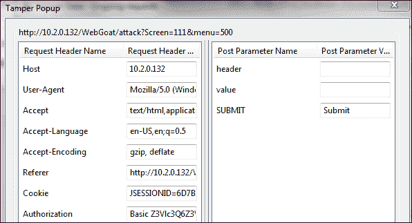

当您查看截取的信息时，您将看到我们有**Cookie**和**授权**字段，我们将重点关注这些字段。我们还将关注**授权**字段中的值。这是 Base64 编码的，有很多方法可以解码值。有关此的网站，请访问[http://base64-decode.com](http://base64-decode.com) ，其中将获取值并为您解码。解码后的值显示为`guest:guest`。

我们现在有了完成课程所需的信息；至少看起来是这样。我们将返回到 WebGoat 课程，输入身份验证字段的名称，即**授权**，编码字符串的值为`guest:guest`，然后点击**提交**将值加载到应用中。以下屏幕截图显示了预期结果的示例：

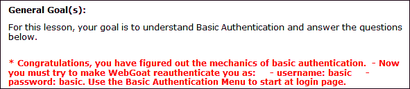

正如前面的截图所示，我们取得了成功。然而，我们还有更多的事情要做；这不是一个简单的一课。我们现在需要尝试让应用接受我们的登录名为`basic:basic`。为了实现这一点，我们需要破坏数据，并在破坏后强制应用进行身份验证。当您按照课程的说明进行操作时，您会看到显示选择**基本身份验证**课程继续挑战。当您这样做时，您将看到**篡改数据**中的页面：点击**篡改**打开页面，您可以对其进行修改。这里的关键是，我们需要通过从每个字段中删除一个字符来破坏这两个字段，**Cookie**和**授权**。一旦应用检测到损坏，它将再次提示输入凭据，当它检测到损坏时，输入`basic`作为用户名，`basic`作为密码，如以下屏幕截图所示：

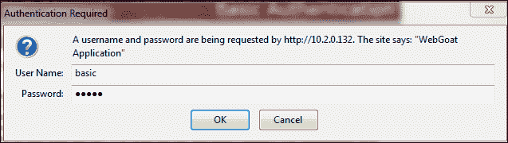

输入凭证后，单击**确定**向应用提交数据。检查截获的查询，您会注意到您的密码现在是`basic`并且是 Base64 编码的。我们现在已经以用户身份验证了`basic`，但是我们还没有完成。

我们必须让 WebGoat 工具相信我们是用户`basic`，我们已经在服务器端做到了这一点。因此，我们现在需要说服 WebGoat 工具。最简单的方法是破坏你截获的**JSSessionID**，如下截图所示：


正如前面的截图所示，您需要进入`novalidsession`以破坏会话，并强制 WebGoat 再次请求凭据，这将验证您为用户`basic`。一旦发生这种情况，请单击**基本身份验证**链接以完成本课程。以下屏幕截图显示了一个示例：


单击基本身份验证链接后的屏幕（剪切的文本不重要）

这是 web 应用测试的过程；有很多不同的方法来编写代码，您必须分析和解释代码所做的事情。在本课中，我们必须首先拦截查询，以确定我们需要与交互的参数的名称。完成此操作后，我们必须先损坏服务器端，然后损坏客户端，才能成功完成本课程的要求。这里有许多课程，您练习的越多，就越能更好地识别身份验证和会话管理的特征。

## 跨站点脚本

另一个经受时间考验的攻击是**跨站点脚本**（**XSS**攻击。这是一个过程，在该过程中，应用获取不受信任的数据，并在未经适当验证的情况下将其发送到 web 浏览器。有两种类型的验证，反射验证和存储验证，它们已经被非常成功地使用。

在使用 WebGoat 工具之前，我们将了解可以在 OWASP 机器中使用的另一种方法：

1.  在机器主页面上向下滚动，直到看到**测试工具应用**。
2.  点击**OWASP-ZAP-WAVE**打开我们要测试的应用。
3.  导航到表单参数中的**活动漏洞****跨站点脚本****简单 XSS**，为我们提供一个表单来测试 XSS。
4.  In the form field, enter `<script>alert("Hello")</script>` and click on **Submit** to test for XSS. An example is shown in the following screenshot:

    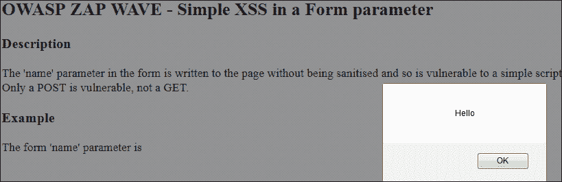

既然我们已经成功地进行了 XSS，我们将注意力转向 WebGoat 工具中的课程：

1.  登录到 WebGoat 教程。
2.  Once you have started the program, click on the **Cross Site Scripting** link and expand it. An example of the lesson we are going to work on is shown in the following screenshot:

    

我们将从**第一阶段**开始。单击它并阅读本课程的说明。按照指示，我们将对 Jerry 执行 XSS 攻击。为此，我们必须将信息存储到 Tom 的记录中，这样当 Jerry 访问它时，他就会落入 XSS 陷阱。

### 注

我们只显示弹出框，说明一旦发现弱点，您还可以做更多的事情。一旦找到向量，就可以使用许多 Java 调用。

按照的说明，以 Tom 的身份登录应用：

1.  一旦您以 Tom 身份登录，您将导航至**查看个人资料****编辑个人资料**以访问 Tom 的个人资料。
2.  访问后，您将在地址字段中输入脚本标记。在**街**字段中，输入`<script>alert("Hello")</script>`，点击**上传档案**上传档案。
3.  现在您将注销并以 Jerry 的身份重新登录。
4.  Once you have logged in as Jerry, you will navigate to **Tom Cat** | **View Profile** and see if you are successful. An example is shown in the following screenshot:

    

我们不会执行**阶段 2**，因为它会更改代码以防止攻击，我们在这里处于进攻状态，因此我们不打算进行任何防御。接下来，我们将使用以下步骤执行**第 3 阶段**课程：

1.  点击**阶段 3：存储 XSS 重访**打开登录页面，然后阅读说明开始下一阶段。
2.  The first thing we will do is log in as `David`, then navigate to the **Bruce** | **View Profile** record, and verify that `David` is a victim of XSS. An example is shown in the following screenshot:

    

正如前面的屏幕截图所示，我们现在通过在警报框中使用`document.cookie`来访问 cookie，而不仅仅是一个弹出窗口。

我们现在准备进入**第 5 阶段**。同样，我们不会执行第 4 阶段**的**，因为这是一个防守的问题，我们现在不想这样做。但是，您可以使用其他阶段。请记住，您将需要使用开发人员包。

在**阶段 5**中，我们将使用反射型 XSS，如下所示：

1.  点击**第 5 阶段：反射 XSS**打开课程并阅读本阶段所需的说明。正如 directions 所述，您必须在应用的搜索函数中嵌入 XSS 字符串。
2.  我们需要做的第一件事是作为用户之一登录。由于我们已经在应用中列出了用户`Larry`，我们将使用此用户。
3.  以用户`Larry`登录，点击**SearchStaff**打开申请代码的搜索部分。
4.  In the **Name** field, enter `<script>alert("You are Hacked")</script>` and then click on the **FindProfile** button to run the script. An example of the result is shown in the following screenshot:

    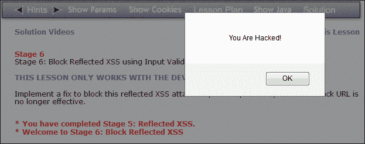

就这样！您已经进行了许多不同的 XSS 攻击，它们确实相对容易防范。然而，我们继续在 Web 应用中看到这些，并且它们将作为一个可行的攻击向量保持一段时间。

## 不安全的直接对象引用

通过直接对象引用，开发人员引用文件或其他对象，而不使用任何形式的身份验证或访问控制检查。当我们发现这一点时，我们可以操纵数据并在不提供任何授权的情况下访问它。

我们将再次参考 WebGoat 工具来处理针对应用的这种攻击。您希望关注的 OWASP WebGoat 中的区域是**访问控制缺陷**。一旦你扩展了它，你会发现有很多经验供我们学习。课程列表显示在以下屏幕截图中：

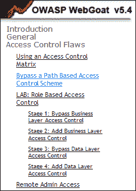

我们想打开的课是清单上的第二课。点击**绕过基于路径的访问控制方案**，阅读本课程的说明。任何基于路径的控制保护的关键是，我们可以突破预定目录，访问位于另一个区域的文件。本课程应用的第一页显示在以下屏幕截图中：

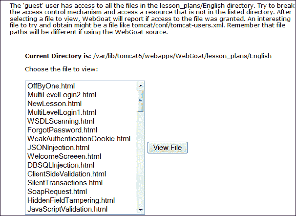

因此，挑战是修改路径并访问当前目录之外的文件；在本例中，文件为**tomcat-users.xml**。你认为我们怎样才能做到这一点？我们需要截取一些东西，要做到这一点，我们必须使用代理来捕获查询。早些时候，我们使用了一个叫做篡改数据的工具，我们将再次使用它。首先，让我们启动一个工作区来记录到目前为止的信息。我们将使用记事本，但您可以使用您选择的任何程序。我们需要复制并粘贴当前目录路径以及要在此文档中访问的文件的路径。下面的屏幕截图显示了我们工作区的一个示例：


当我们查看工作区中的信息时，我们看到在到达`tomcat`目录之前，当前目录的路径中有几个目录。然而，有一个问题值得关注。我们得到的当前目录有一个`tomcat6`目录，但我们的目标文件目录没有这个目录。它确实在说明中说路径可能不同，在本例中，它是。我们需要使`tomcat`目录与当前目录`tomcat6`匹配。打破访问控制的关键是使用`../`目录遍历技术突破目录。由于`tomcat6`文件夹前面有四个目录，我们需要输入最少的目录遍历次数。因此，我们总是可以进入更多的安全。以下屏幕截图显示了字符串试图绕过访问控制的工作区示例：

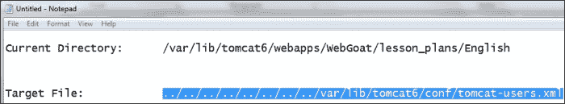

以下过程是使用篡改数据工具截取查询，然后将路径粘贴到包含我们试图从应用上载的文件的字段中：

1.  We will navigate to **OffByOne.html** | **View File** and intercept the query. An example of the query that is intercepted is shown in the following screenshot:

    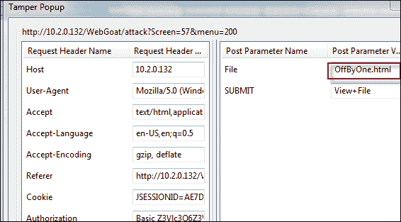

    截获的查询显示我们正在查看**文件**字段，这是我们需要放置准备好的字符串的地方。

2.  Paste the string in the field and click on **OK** to send the string into the application. Return to the WebGoat lesson and review what happened. An example is shown in the following screenshot:

    

3.  As the previous screenshot shows, we were not successful in our first try, but the error message tells us that we seem to be within one directory of our path. We will add another directory traversal to our string and see what happens. An example of the results after one more directory traversal was added is shown in the following screenshot:

    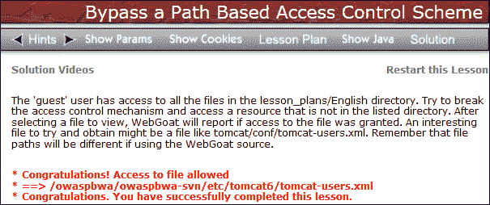

我们终于成功，打破了基于路径的访问控制。这可能是一个耗时的过程，这就是为什么我们通常使用 web 应用测试工具来确定需要进一步调查的领域。

## 安全配置错误

一种常见的攻击方法是查找由管理员设置的默认配置或名称，或者只是处于安装状态。对于 web 应用，几乎总是可以使用某种形式的配置访问来配置或管理站点。我们在 WebGoat 工具中得到了一个教训。导航至**不安全配置****强制浏览**打开课程。正如您在说明中所读到的，通常有某种形式的配置可用于执行维护。我们可以尝试一些不同的文件名，但是由于 OWASP 机器是 Linux 机器，这些机器最常见的配置文件是`conf`文件。因此，在浏览器中，将 URL 更改为`http://10.2.0.132/WebGoat/conf`以查看此处是否有配置文件。以下屏幕截图显示了该结果的示例：

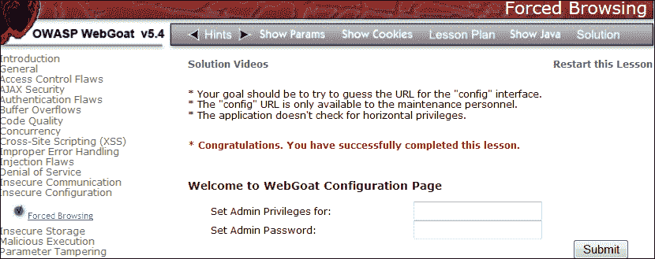

就这样！我们发现了一个不应该允许公众访问的配置访问，但它是。这是网站常犯的错误。

## 敏感数据曝光

大多数 web 应用都不能正确保护它们使用或存储的数据。发现数据不受加密保护或编码不当是很常见的。此外，当应用处理数据时，它在许多情况下都是公开的。

在 WebGoat 工具中，有一个教训可以让我们更加熟悉不同的编码技术。导航至**不安全存储****编码基础**打开课程；以下屏幕截图显示了一个示例：

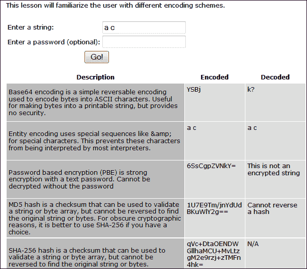

课程非常简单，因此我们在此不再详细介绍。我们鼓励您输入几个字符串，然后在提供的表格中查看结果。

## 缺少功能级访问控制

此缺陷是开发人员未能在**用户界面**（**UI**中显示功能之前验证功能级访问的结果。当发现这种情况时，您可以伪造请求，并可能在没有适当授权的情况下获得访问权限。

## 跨站点请求伪造

在**跨站点请求伪造**（**CSRF**攻击中，我们需要一个用户登录到一个使用 cookie 建立会话的站点。当满足这些参数时，攻击获取包含的身份验证信息并将其提交给易受攻击的应用。由于应用存储了身份验证信息，因此请求被视为合法的。

在 WebGoat 工具中，我们有许多关于 CSRF 的课程。它们位于跨站点脚本 XSS 部分。在 WebGoat 工具中，导航到**跨站点脚本（XSS）****跨站点请求伪造**打开课程并查看课程说明。

对于这种攻击，我们需要向嵌入式 URL 添加一个传递函数，以获取要传递的用户身份验证信息，然后用于验证我们的事务。我们将把代码附加到 URL 以转移资金。按照说明，我们可以通过右键单击页面左侧的课程标题并将其保存到剪贴板来复制 URL。我们想使用``标记来存储我们的 URL。这个过程将是发送一封电子邮件，让用户在登录到我们用于传输的应用时单击一个链接。

我们需要在两个方面输入信息。第一个是**标题**，第二个是**消息**。现在，让我们以以下方式执行此操作：

1.  Enter `CSRF-1` as the name of the title and then enter the following string as the message, bearing in mind that the IP address may be different in your attack. Enter the following as the message:

    ```
    
    ```

    以下屏幕截图显示了一个示例：

    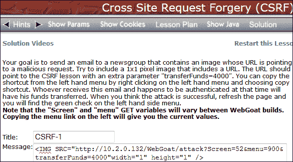

    输入代码的 CSRF 屏幕（剪切的文本不重要）

2.  一旦您验证了该命令，点击**提交**按钮上的。这将把你的标题放在应用的底部。
3.  Before you click on it, start your Tamper Data proxy and intercept the request. An example of the intercepted request is shown in the following screenshot:

    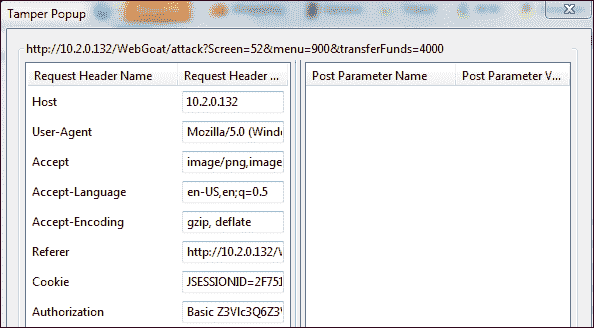

当您查看了截获的查询中的信息后，单击**确定**并让查询发送到应用。如果需要，请刷新 WebGoat 课程。您现在应该看到显示您成功的绿色复选标记，如以下屏幕截图所示：


还有几个课程可供您练习 CSRF，我们鼓励您通过这些课程来完善您的技能、知识和对 web 应用攻击的理解。

## 使用已知的易损部件

在应用开发中，使用现有库和函数来创建代码是一种常见做法，最近在攻击中也使用了这种做法。如果我们可以感染一个库、框架或其他流行组件，那么使用它的每一个应用都将受到攻击。这是传播漏洞最有效的方法之一，也是越来越常见的一种方式，基于此，它在 2013 年被添加到顶级攻击列表中。

## 无效的重定向和转发

在这次攻击中，我们利用了这一事实，即许多 web 应用将在未经适当验证的情况下使用重定向和转发，这可能导致流量重定向到恶意软件和其他恶意网站。

# 识别 web 应用防火墙

在测试时，我们很可能会遇到**web 应用防火墙**（**WAF**）。这些旨在识别我们在本章中介绍的大多数攻击（以及大多数基于 URL 的攻击）。我们将再次使用 Kali Linux 发行版来识别 WAF。您将需要我们在[第 6 章](06.html "Chapter 6. Creating an External Attack Architecture")*创建外部攻击架构*中创建的 Kali Linux 机器和 WAF 机器。

一旦机器启动并运行，我们要做的第一件事就是确定我们有一个受 web 应用防火墙保护的网站。我们有几种方法可以做到这一点，每种方法都取得了不同的成功。我们将尝试的第一种方法是**Nmap**工具。

在您的 Kali Linux 机器中，打开终端窗口并输入`nmap –p 80 -–script –http-waf-detect <target IP address>`。此脚本引擎将尝试确定是否存在 web 应用防火墙。以下屏幕截图显示了一个示例：


正如之前的截图所示，脚本没有检测到我们正在运行 WAF，因此它并不总是能够工作。接下来我们来看看**dotDefender**控制台，看看它是否检测到我们的扫描。为此，我们需要打开浏览器，输入防火墙地址，然后登录。以下屏幕截图显示了一个示例：

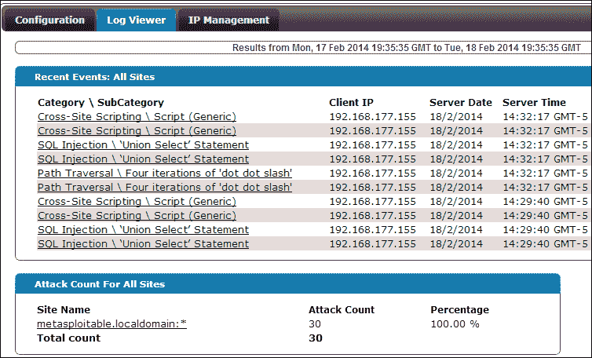

如前一个屏幕截图所示，它检测到脚本正在运行，但不幸的是，没有告诉我们是否有 WAF 正在运行。因此，我们将研究另一种工具。在卡利，我们有一个工具。导航至**应用****卡利****IDS/IPS 标识****Wafw00f**，如下图所示：


工具打开后，在终端窗口中输入`wafw00f –v www.example.com`对站点进行扫描。我们正在扫描网站并比较从我们的调查中收到的信息。以下屏幕截图显示了一个结果示例：

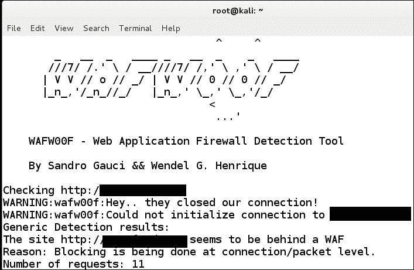

正如结果所示，该网站似乎位于防火墙后面。现在，我们将使用该工具扫描我们的 dotDefender 机器。我们通过将目标更改为机器的 IP 地址来实现这一点。以下屏幕截图显示了一个结果示例：

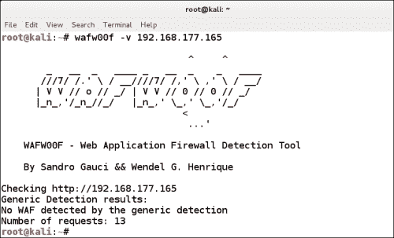

正如之前的屏幕截图所示，似乎使用 wafw00f 工具未检测到 dotDefender 的最新版本。这就是安全测试的现实，一旦某件事情被解决了一段时间，就会有一些团队试图找出方法来改变或至少修改产品在使用工具时对工具的反应方式。这就是为什么我们要建立实验室环境，看看哪些是有效的，哪些是无效的。有时，我们会很幸运，我们可以用另一种方法来识别错误；此外，在某些情况下，错误消息可以列出设备的标识。这完全是一个反复试验的问题。

# 穿透 web 应用防火墙

如前所述，逃避检测可能是一个挑战，这与管理员如何配置策略有关。互联网上有很多很好的参考资料，你可以用来看看你的模糊处理技术是否有效。免费开源的 WAF**ModSecurity**提供了一个站点，您可以在其中测试字符串，看看它是否可能被 WAF 检测到。您将在此位置[找到该网站 http://www.modsecurity.org/demo](http://www.modsecurity.org/demo) 。

一旦站点打开，您将看到有一个区域可以发布不同的字符串并查看结果。在此之前，您还将看到他们有一个网站列表，许多商业供应商使用该列表来展示他们的工具。以下屏幕截图显示了一个示例：

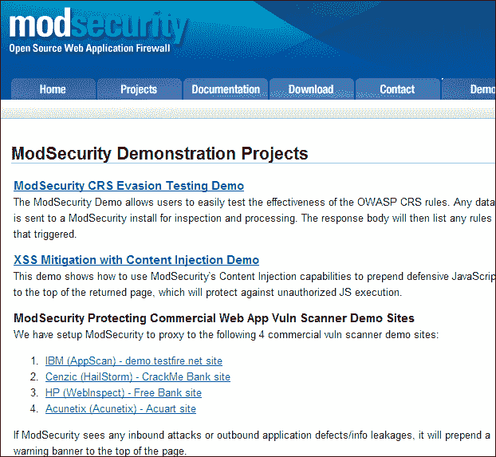

屏幕显示许多商业供应商用来展示其工具的网站列表（裁剪文本不重要）

点击页面上的**ModSecurity CRS 规避测试演示**链接。这将根据 ModSecurity 工具的**核心规则集**签名测试字符串，您将找到输入潜在模糊脚本的区域，以查看是否检测到它。它不仅告诉您是否检测到，而且还提供了一个带有字符串数字分数的排名。对于我们的第一个示例，我们将尝试一个简单的示例来了解表单是如何工作的。在表单框中，输入经典 SQL 注入字符串`' OR 1=1 –-`，点击**发送**按钮，查看结果。以下屏幕截图显示了一个示例：

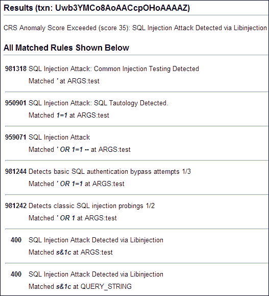

正如前面的截图所示，我们被发现了！嗯，我们希望如此，因为我们使用了最常见和最经典的字符串来测试。我们还看到我们的分数是 35 分。我们看看能否降低分数。输入此字符串： `1' AND non_existant_table ='1`。以下屏幕截图显示了一个结果示例：


该死！我们又被发现了！至少有一些好消息；我们把分数降到了 25 分。这是我们如何找到分数较低或未检测到的字符串的过程。我们将为 SQL 再尝试一个字符串，然后继续为 XSS 尝试一个字符串。在有效载荷窗口中，输入以下字符串：`&#49&#39&#32&#79&#82&#32&#39&#49&#39&#61&#39&#49`。

以下屏幕截图显示了结果示例：

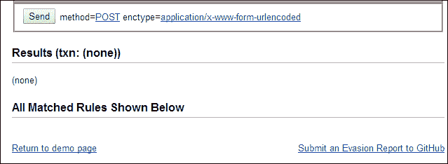

我们成功了！这是一个字符串，您可以在 Security Compass 的**SQL 注入我**工具中找到。您可以在他们的网站[上找到该工具 http://www.securitycompass.com](http://www.securitycompass.com) 。现在，我们准备看看是否可以找到未被检测到的 XSS 字符串。我们将为您节省一些时间，并尝试一种我们认为很有可能获得低分数或未被发现的方法。在有效载荷窗口中，输入以下字符串：`prompt%28%27xss%27%29`。以下屏幕截图显示了一个示例：

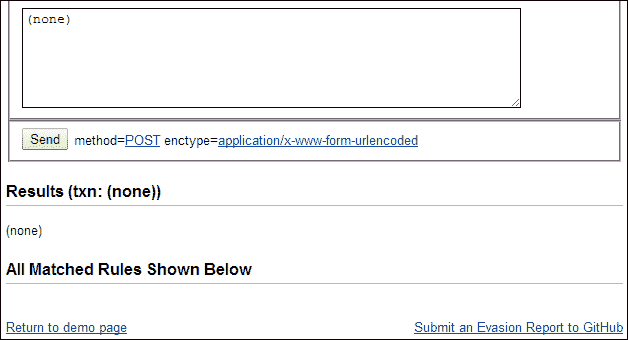

再次我们成功了。现在我们有了一个未检测到的 XSS 和 SQL 注入字符串。当然，事实是我们已经提交了这些字符串，所以有人可能会做他们的家庭作业，然后当您阅读本书时，我们会被检测到。如果发生这种情况，我们的工作就是继续处理不同的事情，直到找到一个可行的。此外，这可能会让我们通过 WAF，这取决于应用开发人员是否使用了安全编码准则或最佳实践。欢迎来到专业安全测试的世界！

# 工具

到目前为止，在这本书中，我们还没有专门设置工具的主题点。在大多数情况下，我们仍然以流程为中心，并在每章中讨论了一些工具。对于 web 应用测试，这是另一回事。正如您在本章中所看到的，与 web 应用交互的输入和方式多种多样，这就是这种测试形式的挑战。因此，通常最好使用工具获取批量数据，然后手动调查批量数据的感兴趣区域。那里有大量的工具，我们将不在这里讨论它们。

我们喜欢使用的一个既有免费版本又有商业版本的工具是**Burp Suite**。我们喜欢它，因为它允许我们在测试时做各种各样的事情，我们也喜欢商业版的价格非常合理。您可以在[找到关于该工具的信息 http://www.portswigger.net](http://www.portswigger.net) 。免费版本也可以在 Kali Linux 发行版中找到。要访问该工具，请导航到**应用****Web 应用****Web 应用 Fuzzers****burpsuite**打开该工具。以下屏幕截图显示了工具菜单的示例：

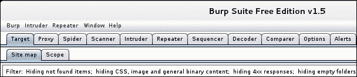

正如前面的屏幕截图所示，该工具具有许多特性，可以在 web 应用测试方面为我们提供帮助。

# 总结

在本章中，我们讨论了 web 服务器和 web 应用的评估。本章以讨论 OWASP 前十名开始。在讨论之后，我们使用了 WebGoat 工具，并执行了一些课程，展示了 web 应用测试的概念和技术。

在使用 OWASP 前十名之后，我们研究了在我们和目标之间识别 web 应用防火墙的方法。我们使用 wafw00f 工具来潜在地检测所部署的保护类型。

一旦我们了解了如何检测 WAF，我们就讨论了如何穿透它。我们研究了模糊处理的方法，我们可以使用这些方法来尝试通过 WAF 提供的保护。我们将示例字符串提交到 ModSecurity 演示站点，并使用 SQL 注入字符串和 XSS 字符串成功地规避了检测。

最后，我们在本章结尾讨论了 web 测试，特别是 web 应用测试时对工具的需求。

本章到此结束。您现在已经练习了 web 应用攻击以及检测和规避防火墙的方法。

在下一章中，我们将介绍平面网络和内部网络的测试。