# 十三、建立完整的网络范围

在本章中，我们将把所有组件放在一起，并讨论可以支持本书中所述场景的体系结构。在本章中，我们将讨论以下主题：

*   创建分层体系结构
*   集成诱饵和蜜罐
*   攻击网络范围
*   记录攻击数据，以便进一步培训和分析

本章将为我们提供一个完整的体系结构，我们可以使用它进行测试。这种设计将允许我们插入我们可能拥有的任何必需组件。此外，它将为您提供测试可能需要的所有类型测试的能力。

# 创建分层架构

正如我们在整本书中所讨论的，我们创建的范围的目标是提供磨练和提高我们技能的能力，以便当我们进入现场时，我们已经在尽可能多的类似环境中进行了实践。

## 交换机架构

通过 VMware Workstation，我们可以利用其功能创建多个不同的交换机，使我们能够在构建或测试范围时执行各种场景。

### 分割建筑

我们的方法是创建一个分段的体系结构，利用虚拟化框架中的交换机选项。此外，我们希望构建不同类型的网段，以便测试平面和分层网络的组合。在本书中，我们多次讨论了这些体系结构。下图显示了我们建议的架构范围示例：

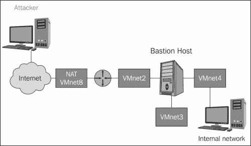

#### 公共非军事区

回顾前面的图表可以看出，我们有许多不同的体系结构，我们可以在设计中进行探索。我们将讨论的第一个问题是公共非军事区的问题；这是在我们的内部网络和外部互联网之间有一个缓冲区时创建的。我们认为它是公开的，因为在大多数情况下，任何想要使用在那里运行的服务的人都可以访问。公共 DMZ 的位置位于外围或屏蔽路由器和通常运行防火墙软件的堡垒主机之间。对于我们的示例，这将连接到 VMnet2 子网。

下图显示了此配置的示例：

这种方法的问题在于公共 DMZ 仅受屏蔽路由器的保护，因此有遭受攻击的风险；因此，这个问题的一个潜在解决方案是移动 DMZ。

#### 私人非军事区

作为公共 DMZ 保护问题的解决方案，我们可以使用私有 DMZ 或单独的子网 DMZ，有时也会提到这一点。拥有独立子网 DMZ 的概念是在公共 DMZ 的基础上提供额外的保护层。此外，该配置还具有附加的优点；如果 DMZ 中的通信被破坏，那么唯一被破坏的就是在该 DMZ 中传递的数据。在公共 DMZ 中情况并非如此，因为内部和外部网络之间的通信穿过公共 DMZ，因此，如果该 DMZ 中有任何内容受损，则数据也会受损。

下图显示了此配置的示例：

正如前面的图所示，我们现在有两层防御，保护放置在私人 DMZ 中的机器。话虽如此，这种方法有一个缺点，那就是我们允许我们的公共服务一路通过防火墙进入。因此，带宽由进出互联网的所有流量共享。在下一节中，我们将研究一种可能的解决方案。

#### 诱饵 DMZ

正如我们前面提到的，对于私有或独立服务的子网配置，我们必须允许流量进入我们的第二层防御。我们现在将讨论诱饵非军事区的概念。有了这个概念，我们就离开了最初讨论过的公共 DMZ，然后，我们只在该段中放置监控设备，因为我们想配置规则来提醒我们接收到的任何不需要的流量。例如，如果我们看到任何端口 80 目标流量，那么我们知道它是恶意的，因此，我们生成警报。

这种配置的另一个好处是，我们可以为用户绑定防火墙内的端口，然后只绑定外部接口上的最小端口。下图显示了这方面的示例：

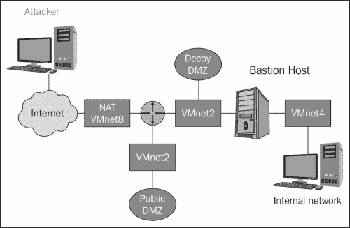

上图中架构的优势在于，由于进出互联网的主要流量不与进出公共 DMZ 中服务的流量共享，网络的性能趋于提高。由于我们在整本书中都集中在进攻上，所以我们不会从防守的角度来讨论优势。但是，对于想了解更多信息的人，您可以在我创建的**高级安全培训中心**部分查看**高级网络防御**课程。您可以通过以下链接阅读更多内容：[http://www.eccouncil.org/Training/advanced-security-training/courses/cast-614](http://www.eccouncil.org/Training/advanced-security-training/courses/cast-614) 。

# 集成诱饵和蜜罐

在网络上部署蜜罐和诱饵是继续流行的事情之一。因此，我们希望在我们的体系结构中部署，这样我们就可以看到它们的反应，以及在遇到它们时我们可以使用什么指示来识别它们。

我们可能会遇到许多不同的蜜罐，因此我们需要了解它们所表现出的特性。考虑这些问题的最佳方式是，将有许多端口显示为打开状态；但是，当您连接到它们时，它们不会按预期响应。

我们将要看到的第一个蜜罐是由**Marcus Ranum**在多年前创建的，当时 Back 孔工具感染了互联网上的机器。该工具不再可用，但您可以在 Internet 上搜索，您应该能够发现它。工具被称为**后备军官友好型**，而且虽然占地面积小，但在蜜罐的角色上非常有效。该工具允许您选择它将侦听连接的多个端口。以下屏幕截图显示了这些选项的示例：

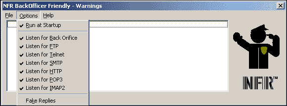

正如前面的屏幕截图所示，我们将所有端口设置为在蜜罐上侦听。我们没有选择**假回复**选项；这是因为如果设置了此选项，则横幅将泄露蜜罐。现在我们有了监听这一系列端口的蜜罐，我们将扫描它，看看扫描时它是什么样子。

以下屏幕截图显示了使用 Nmap 扫描机器后的结果示例：

正如前面的屏幕截图所示，我们在机器上打开了这些端口，因此我们希望对此进行进一步探索。首选的方法是手动连接端口并抓取这些端口的标题，因为如果我们扫描端口，它们会返回为`tcpwrapped`；因此，我们将手动查看端口。我们有很多方法可以用来连接这个端口，在书中的例子中，我们将使用`netcat`。在终端窗口中，输入`nc <target> 21`连接 FTP 服务器；以下屏幕截图显示了此结果的示例：

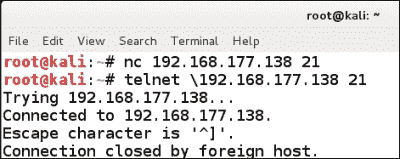

如前面的截图所示，`netcat`命令只返回一个命令提示，表示连接不成功；然而，当我们使用 telnet 时，会建立连接，然后立即关闭。这些是您希望在测试中查找的类型，也就是说，查找行为不正常的类型。当我们扫描机器时，我们看到有打开的端口；然而，当我们试图连接到这些已识别的开放端口时，我们并没有成功。这种情况不应该发生，因此是可疑的。重要的是要记住，如果它的行为不正常，即使它有开放的端口，有一个很好的机会，你遇到了一个蜜罐。蜜罐本身呢？以下屏幕截图显示了一个示例：

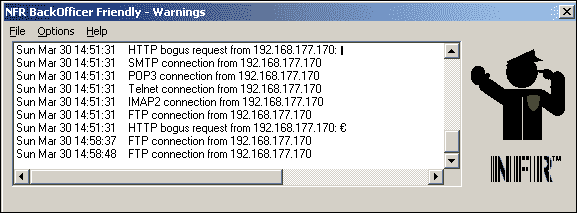

如前一个屏幕截图所示，该工具显示连接尝试；即使用户没有连接，蜜罐仍然会记录它。

我们要看的下一个蜜罐是**Labrea**蜜罐。Labrea 提供了许多机制，可在恶意软件与机器通信时使用。Labrea 工具以 Debian 软件包的形式提供。由于我们在本书中多次使用了 Debian，我们现在将使用它来配置和设置 Labrea 蜜罐，以便我们能够确定在进行测试时遇到它时会是什么样子。

在 Debian 机器的终端窗口中，输入`apt-get install labrea`安装软件包。安装软件后，如果愿意，可以查看配置文件。由于安装软件包时文件可能不在同一位置，您可以输入`find / -name labrea.conf`定位文件，然后在您选择的编辑器中打开文件。无需更改任何配置，因为它已设置并准备好在安装包后运行。

### 注

需要注意的是，Labrea 工具将占用网络上未使用的任何 IP 地址。因此，您可能希望将一系列 IP 地址配置为从配置文件中排除。

在终端窗口中准备好运行工具后，输入`labrea –v –i eth0 -sz -d -n <target> -o`。我们不会审查选项，但鼓励您自行审查。我们已经将输出设置为写入屏幕，因此我们将看到 Labrea 工具截获的任何内容的输出。以下屏幕截图显示了该命令的输出示例：

在上一个屏幕截图中需要注意的一点是配置文件已设置为仅响应`1-3000`端口。接下来，我们需要看看蜜罐将如何在网络上响应。我们将使用 Kali Linux 机器；在 Kali 的终端窗口中，输入`ping –c 7 <target>`，其中目标是您的目标网络的任何 IP 地址。

以下屏幕截图显示了`192.168.177`网络的示例：

正如前面的截图所示，第一个 ping 请求返回时无法访问。因此，那里没有主机。机器在第四个 ping 上响应；这是来自 Labrea 蜜罐的回应。我们可以通过参考启动程序的终端窗口来验证这一点。以下屏幕截图显示了一个示例：

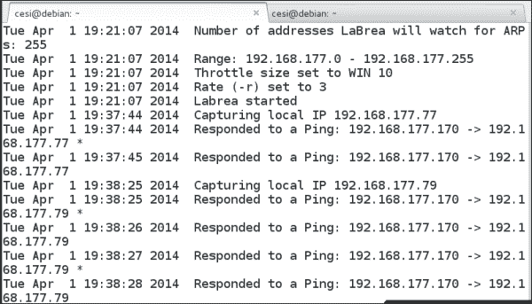

为了了解 Labrea 蜜罐的真正威力，我们将使用 Kali Linux 发行版中的一个工具 ping 一系列 IP 地址。在 Kali Linux 终端中，输入`fping –g <target IP block>`。以下屏幕截图显示了该命令部分结果的示例：

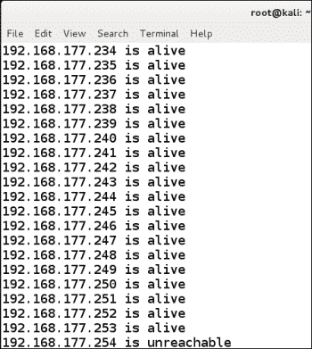

这表明 Labrea 蜜罐已经在`192.168.177`子网上创建了所有可能机器的诱饵存在；这些机器看起来像是活机器。这是为了请求与这些 IP 地址的连接，因为它们是恶意的。

Labrea 蜜罐使用了一种称为**焦油点**的技术，这会导致连接花费很长时间。正如我们已经展示的，有许多诱饵机器在那里，我们现在将扫描其中一个。在 Kali 机器中，输入`nmap –sS <target ip address> -Pn`。

以下屏幕截图显示了其中一台诱饵机器的扫描结果示例：

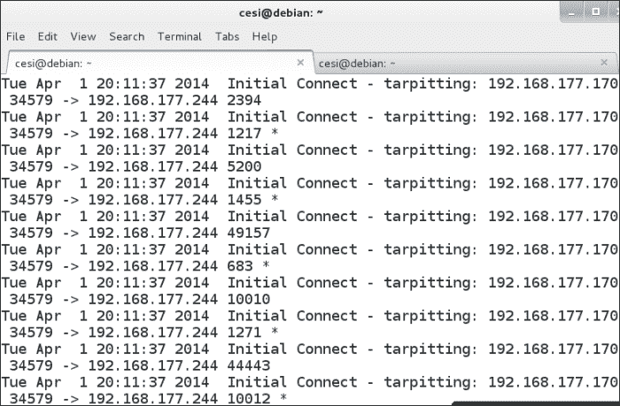

我们要注意的另一个响应是使用`netcat`连接到机器；我们现在就尝试一下。在 Kali 机器中，输入`nc <target IP address> 445`。以下屏幕截图显示了手动连接时的结果示例：

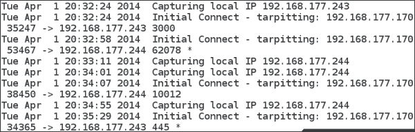

正如前面的截图所示，蜜罐会检测到每个连接并将其放入柏油坑，这会花费更多的时间，并捕获与机器的通信。要研究和了解更多关于 Labrea 的信息，请参考[http://sourceforge.net/projects/labrea/](http://sourceforge.net/projects/labrea/) 。

接下来我们要看的蜜罐是商用产品**KFSensor**。您可以在[了解更多信息 http://www.keyfocus.net/kfsensor/](http://www.keyfocus.net/kfsensor/) 。该网站将要求您注册才能下载该工具。下载后，需要将其安装到 Windows 系统上。以下屏幕截图显示了该工具的界面示例：

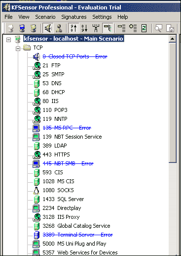

正如前面的截图所示，我们有许多端口通过蜜罐打开，因此下一步是检查并查看扫描后返回的内容。请记住，我们希望执行测试，以便知道当我们遇到一个带有此蜜罐的网络时会发生什么。此外，我们希望确保注意到可以帮助我们确定 KFSensor 是否部署在网络上的工件。

以下屏幕截图显示了针对蜜罐的`Nmap`扫描示例：

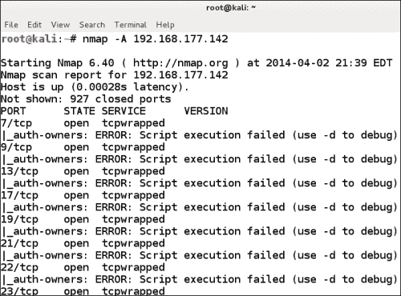

正如前面的屏幕截图所示，我们打开了端口，但`Nmap`将其报告为`tcpwrapped`。这是我们做`Nmap`扫描时的样子，那么它在目标上是什么样子的呢？此外，蜜罐展示了什么？以下屏幕截图显示了一个示例：

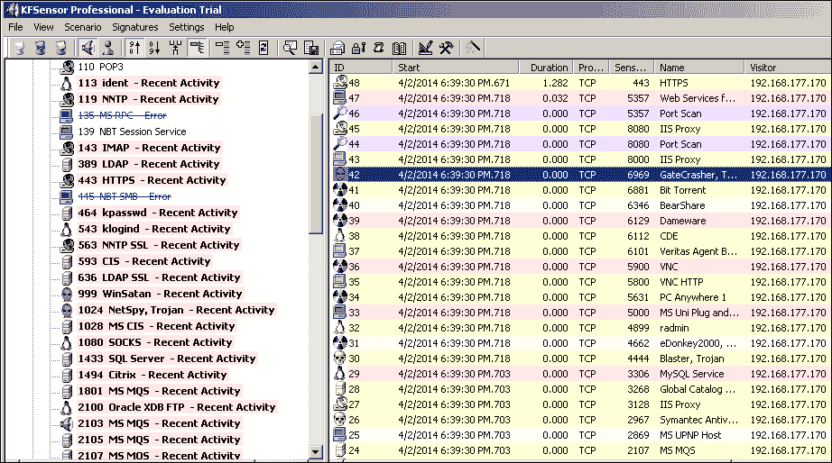

该工具的另一个好处是，它还打开了许多 UDP 端口，因此提供了一个非常有效的蜜罐。以下屏幕截图显示了 UDP 端口的示例：

这是只是看一看可用的许多不同蜜罐中的一些，因此，您应该在测试范围内使用不同的蜜罐进行练习，并记录它们在部署后的行为。

# 攻击网络靶场

正如我们前面提到的，建立我们 pentesting 系列的目标是练习我们的技能。因此，我们需要接近我们创建的架构，并在每个位置和入口攻击它。此外，我们练习直接攻击目标非常重要，也就是在平面网络上。一旦我们攻击并确定了目标在不同类型攻击中的反应，我们将通过分层架构更改方法和攻击，以查看反应是什么，并对不同位置的结果进行比较。

# 记录攻击数据，以便进一步训练和分析

一旦你建立并攻击了靶场，强烈建议你记录这些攻击，以便你可以使用它们进行练习，更重要的是，用于训练目的。每次执行攻击时，都会创建非常有价值的数据，这些数据应该被捕获并再次使用。捕获数据的最简单方法之一是使用 Wireshark。捕获数据后，保存它，然后可以使用工具重播捕获的流量。有很多方法可以实现这一点。最简单的方法之一是使用**tcpreplay**工具；它是 Kali Linux 发行版的一部分。此外，如果您不想创建自己的攻击，还可以下载许多包跟踪，这些跟踪涵盖了许多不同的攻击。下面的屏幕截图显示了用于重播早期 DEFCON 会议中的文件的命令示例：

对于那些想要使用 GUI 工具的人来说，有很多工具可供选择。一个免费的很好用的是来自 Colasoft 的 Colasoft 数据包播放器；您可以从[下载 http://www.colasoft.com](http://www.colasoft.com) 。下面的屏幕截图显示了该工具用于回放 DEFCON 数据包捕获的示例：

正如前面的截图所示，您可以设置多种不同的播放速度，在**突发**模式下，播放速度将尽网卡所能。

# 总结

在本章中，我们讨论了分层体系结构的创建以及在测试中构建分段网络的必要性。在讨论创建分层体系结构之后，我们研究了诱饵和蜜罐的集成，包括后勤人员友好的工具、Labrea tarpit 和 KFSensor。

接下来，我们研究了攻击我们的体系结构的过程，并阐述了在添加保护和层以穿透目标之前，直接在平面网络上攻击目标的技术。

最后，我们结束了本章，查看了如何记录攻击数据，以及如何使用 tcpreplay 命令行工具和 Colasoft Packet Player GUI 工具在我们的网络上重放我们从互联网创建或下载的文件。

本章和本书到此结束。记住，你所做的测试都是为了做好准备。当你建立你的笔测试实验室时，你正在创造一个环境，你可以用很多年来练习你的技能。一旦开发了体系结构，只需将不同的设备添加到体系结构中，作为实践的目标。祝你在网络和系统方面好运！