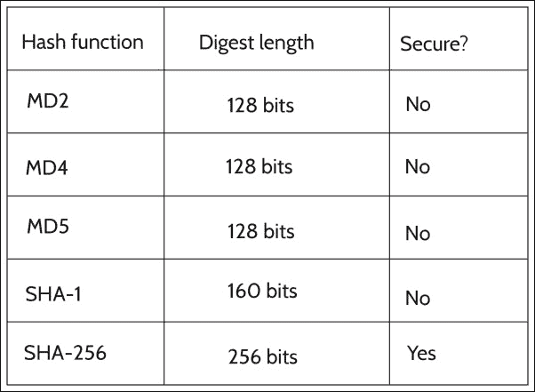
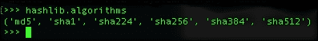

# 七、加密、哈希和转换函数

密码学可以在某些类型的信息安全漏洞中发挥重要作用，因为它有助于实现单向认证数据的安全传递、认证令牌的安全传递、访问控制等。单向加密功能在网站中用于以无法检索的方式存储密码。在本章中，我们将讨论 Python 中的各种加密函数。

本章涵盖的主题如下：

*   散列函数
*   密钥（加密算法）
*   公钥算法

# 密码算法

最常用的加密算法有以下三种：

*   **散列函数**：散列函数也称为**单向加密**，没有密钥。哈希函数为明文输入输出固定长度的哈希值，无法恢复明文的长度或内容。

*   **键控哈希函数**：键控哈希用于构建**消息认证码**（**MAC**）；Mac 旨在防止暴力攻击。因此，它们被有意设计为缓慢。

*   **对称加密/密钥（加密算法）**：加密算法使用可变密钥为某些文本输入输出密文，我们可以使用相同的密钥解密密文。

*   **公钥算法**：对于公钥算法，我们有两个不同的密钥：一个用于加密，另一个用于解密。因此，我们可以共享可以加密消息的公钥，但它只能使用解密密钥解密，而解密密钥不是共享的。

# 散列函数

散列函数主要用于密码学中检查消息的完整性、数字签名、操作检测、指纹和密码存储。如果不能根据输出猜测输入字符串，则函数是一个好的哈希函数。当散列函数将随机数量的数据转换为固定长度的字符串时，可能会有一些输入散列为相同的字符串。散列函数的创建方式使得这些冲突极难找到。最常用的哈希函数如下所示：



**MD2**、**MD4**和**MD5**具有**128 位**长度且不安全。**SHA-1**有**160 位**长度，但也不安全。

## 散列消息认证码（HMAC）

当我们需要检查*完整性*和*真实性*时，使用**散列消息认证码**（**HMAC**）。它为服务器和客户端提供公钥和私钥。私钥只有服务器和客户端知道，而公钥是所有人都知道的。

对于 HMAC，密钥和消息在单独的步骤中进行散列。客户机通过合并和散列数据以及私钥来创建每个请求的散列，并将其作为请求的一部分发送。在服务器中接收到请求后，它会生成另一个哈希并将其与接收到的哈希进行比较。如果他们是平等的，那么我们可以认为客户是真实的。

## 消息摘要算法（MD5）

MD5 通过来自数据的 128 位消息摘要来实现数据完整性。根据标准，这是*计算不可行*，因为两条消息可能具有与输出相同的消息摘要，或者可能创建错误消息。

## 安全哈希算法（SHA）

**SHA**系列广泛应用于安全应用和协议，包括 TLS/SSL、PGP 和 SSH。SHA-1 在 Git 和 Mercurial 等版本控制系统中用于识别修订和检测数据损坏。据报告，SHA-0 和 SHA-1 存在一些弱点。因此，建议使用 SHA-2 系列哈希函数。我们应该在需要抗碰撞的应用中使用 SHA-2 系列。

## Python 中的 HMAC

使用 Python 创建文件的哈希非常简单。要使用默认 MD5 算法创建 HMAC 哈希，我们可以使用 Python 中的`hmac`模块：

```
import hmac 

hmac_md5 = hmac.new('secret-key') 

f = open('sample-file.txt', 'rb') 
try: 
    while True: 
        block = f.read(1024) 
        if not block: 
            break 
        hmac_md5.update(block) 
finally: 
    f.close() 

digest = hmac_md5.hexdigest() 
print digest 

```

第一行导入`hmac`模块。`hmac`模块带有从 Python 2.2 开始的默认 Python 安装。然后，以共享密钥作为参数启动`hmac`实例。

然后读取 1024 字节块的文件，创建`digest`，最后打印`digest`。

尽管`hmac`模块 Python 的默认加密算法是 MD5，这被认为是不安全的，但我们应该使用 SHA 算法。要使用 SHA256，我们必须使用`hashlib`模块。从 2.5 版开始，Hashlib 附带默认 Python 安装。因此，我们可以更新前面的脚本以使用 SHA256：

```
import hmac 
import hashlib 

digest_maker = hmac.new('secret-key', '', hashlib.sha256) 

f = open('sample-file.txt', 'rb') 
try: 
    while True: 
        block = f.read(1024) 
        if not block: 
            break 
        digest_maker.update(block) 
finally: 
    f.close() 

digest = digest_maker.hexdigest() 
print digest 

```

同样，我们可以在`hmac`中包含其他`hashlib`方法。

## hashlib 算法

要使用特定的哈希算法，我们可以使用`hashlib`模块中的相应构造函数，该构造函数将创建一个哈希对象，该对象可用于与哈希进行交互。由于`hashlib`模块有 OpenSSL 支持，所以 OpenSSL 中的所有算法，如`md5`、`sha1`、`sha224`、`sha256`、`sha384`、`sha512`都可以在`hashlib`中使用：



以下是重要的`hashlib`方法：

*   `hashlib.md5()`：创建 MD5 哈希对象
*   `hashlib.sha1()`：创建 SHA1 散列对象
*   `hashlib.new(hash_name)`：用于按名称传递算法，创建哈希对象

例如，请尝试以下代码：

```
try: 
    hash_name = sys.argv[1] 
except IndexError: 
    print 'Specify the hash name as the first argument.' 
else: 
    try: 
        data = sys.argv[2] 
    except IndexError:     
        print 'Specify the data to hash as the second argument.' 
h = hashlib.new(hash_name) 

```

这将创建作为第一个参数传递的哈希算法名称的哈希对象。方法`update()`将重复调用哈希计算器，并相应地更新摘要。

## 密码哈希算法

MD5、SHA1 和所有 SHA 变体的速度都非常快。在密码的情况下，快速算法容易受到暴力攻击，因为 MD5 和 SHA1 的哈希值可以以每秒数百万或数十亿的速度生成。有一些专门为密码设计的算法。我们可以使用 ARGON2，并将其视为在实现可用时的首选。其他两个主要选项为`pbkdf2`和`bcrypt`。这些函数的计算成本很高，因此它可以保护您免受暴力和字表攻击。

我们可以使用`argon2`模块来使用 Argon2：

```
import argon2 
hashed = argon2.argon2_hash("password", "some_salt", ) 

```

此外，我们还可以使用模块`bcrypt`和`pbkdf2`来利用这些算法。

使用`bcrypt`的示例如下：

```
import bcrypt 
hashed = bcrypt.hashpw(password, bcrypt.gensalt()) 

```

这将使用随机生成的 salt 散列密码。

使用`pbkdf2`的示例如下：

```
import pbkdf2 
salted_password = pbkdf2.pbkdf2_hex(password, some_random_salt, 
                                  iterations=1000, keylen=24)

```

这将使用`1000`迭代创建一个 24 字节长的散列。我们可以通过增加迭代次数来降低哈希函数的速度。

## 对称加密算法

对称加密算法或密钥算法使用私有变量密钥将其输入数据或明文转换为密文。我们可以使用用于加密消息的相同密钥解密密文。密码只是一种加密和解密消息的方法。

加密算法主要分为两类：

*   **对称加密中使用的算法**：对称加密是使用单个密钥进行加密和解密的加密。对称加密算法的一些例子有 AES、Blowfish、DES、IDEA、serpent 等。
*   **用于非对称加密的算法**：非对称加密使用两个密钥：一个私钥和一个公钥，一个用于加密，另一个用于解密。非对称算法的示例有 Differ Hellman（**DH**和**RSA**。

### 提示

您可以在此处阅读有关对称加密的更多信息：[http://www.cs.cornell.edu/courses/cs5430/2010sp/TL03.symmetric.html](http://www.cs.cornell.edu/courses/cs5430/2010sp/TL03.symmetric.html) 。

### 分组和流密码

**分组密码**对称为块的固定大小数据进行加密。通常，每个块具有相对较大的 64 位、128 位或 256 位大小。因此，一个分组密码会将每个块分别加密到与密文相同的大小。在输入位小于块大小的情况下，将调用填充方案。每个块使用相同的键。分组密码的例子有 AES、DES、Blowfish 和 IDEA。

**流密码**一次加密一位或一字节明文的小数据块。它使用无限的伪随机比特流作为密钥，并且该伪随机生成器应该是不可预测的。此外，决不能重复使用密钥以安全的方式实现流密码。

## PyCrypto

**PyCrypto**代表**Python 加密工具包**，是包含散列函数和加密算法的不同加密模块的集合。PyCrypto 模块提供了在 Python 程序中实现强加密所需的所有函数。

要使用加密算法，我们可以从`Crypto.Cipher`导入：

```
from Crypto.Cipher import AES 
encrypt_AES = AES.new('secret-key-12345', AES.MODE_CBC, 'This is an IV456') 
message = "This is message " 
ciphertext = encrypt_AES.encrypt(message) 
print ciphertext 

```

这将创建密文。由于 PyCrypto 块级加密 API 的级别非常低，因此它分别只接受 AES-128、AES-196 和 AES-256 的 16、24 或 32 字节长的密钥。密钥越长，加密越强。我们可以按如下方式解密它：

```
decrypt_AES = AES.new('secret-key-12345', AES.MODE_CBC, 'This is an IV456') 
message_decrypted =  decrypt_AES.decrypt(ciphertext) 
print message_decrypted 

```

现在我们要取回我们的明文。

### 文件的 AES 加密

**高级加密标准**（**AES**）是一种对称分组密码，由 AES-128、AES-192 和 AES-256 三种分组密码组成。每一个加密/解密数据块为 128 位，密钥分别为 128、192 和 256 位。

以下脚本对提供的文件进行加密。此外，它还处理随机生成的**初始化向量**（**IV**。

首先，我们加载所有必需的模块：

```
from Crypto.Cipher import AES 
import os, random, struct 

```

现在，定义加密文件的函数：

```
def encrypt_file(key, filename, chunk_size=64*1024): 

    output_filename = filename + '.encrypted' 

```

在这里，我们在函数中创建初始化向量：

```
iv = ''.join(chr(random.randint(0, 0xFF)) for i in range(16))
# Initialization vector  

```

然后我们可以在 PyCrypto 模块中初始化 AES 加密方法：

```
    encryptor = AES.new(key, AES.MODE_CBC, iv) 
    filesize = os.path.getsize(filename)  

```

读取文件并写入加密的输出文件：

```
     with open(filename, 'rb') as inputfile: 
        with open(output_filename, 'wb') as outputfile: 
            outputfile.write(struct.pack('<Q', filesize)) 
            outputfile.write(iv) 

            while True: 
                chunk = inputfile.read(chunk_size) 
                if len(chunk) == 0: 
                    break 
                elif len(chunk) % 16 != 0: 
                    chunk += ' ' * (16 - len(chunk) % 16) 

                outputfile.write(encryptor.encrypt(chunk)) 

```

最后，调用函数对文件进行加密：

```
encrypt_file('abcdefghji123456', 'sample-file.txt');

```

现在我们可以检查如何解密这个加密文件。要编写能够解密的函数，我们必须导入相同的模块。然后，按如下方式定义函数：

```
def decrypt_file(key, filename, chunk_size=24*1024): 

    output_filename = os.path.splitext(filename)[0] 

```

读取加密文件并输出解密文件：

```
    with open(filename, 'rb') as infile: 
        origsize = struct.unpack('<Q', infile.read(struct.calcsize('Q')))[0] 
        iv = infile.read(16)

```

初始化解密文件的`decryptor`方法：

```
        decryptor = AES.new(key, AES.MODE_CBC, iv) 

        with open(output_filename, 'wb') as outfile: 
            while True: 
                chunk = infile.read(chunk_size) 
                if len(chunk) == 0: 
                    break 
                outfile.write(decryptor.decrypt(chunk)) 

            outfile.truncate(origsize) 

```

最后，输出原始解密文件：

```
decrypt_file('abcdefghji123456', 'sample-file.txt.encrypted'); 

```

# 总结

我们已经讨论了 Python 中使用的哈希和加密模块。现在，您将能够在脚本中使用这些模块。我们将在下一章中介绍一些键记录技术。