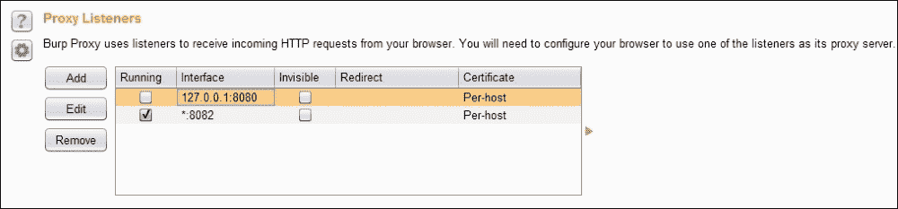
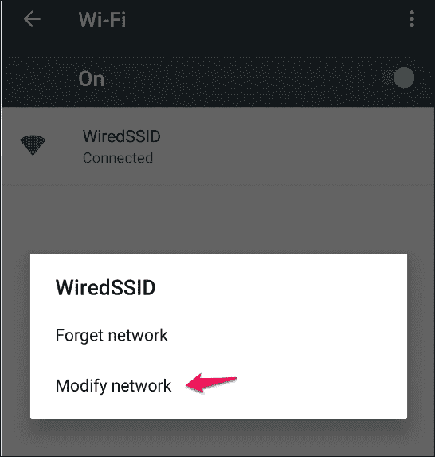
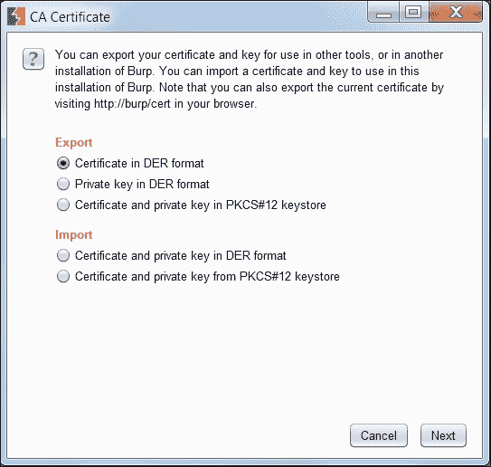
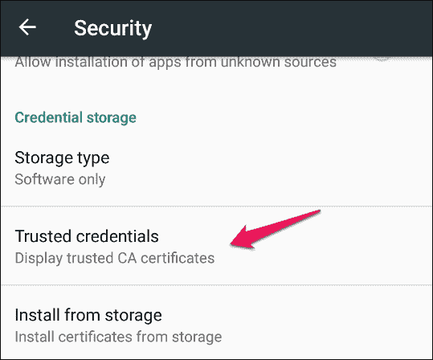
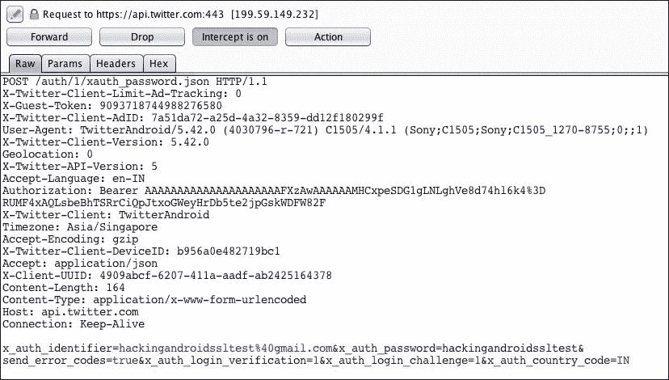
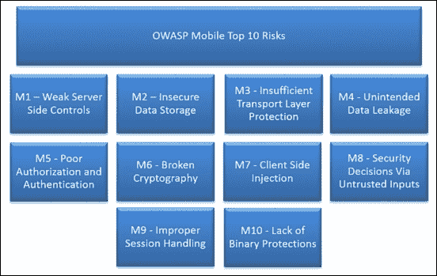
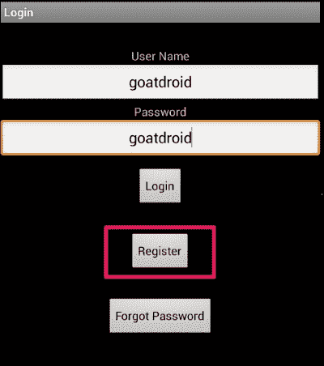
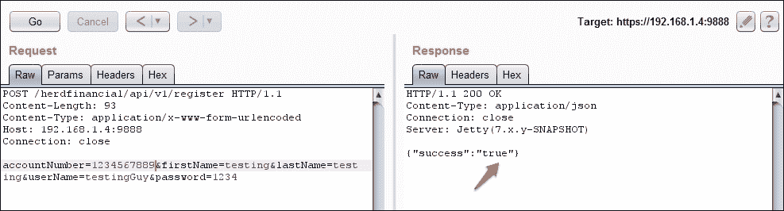
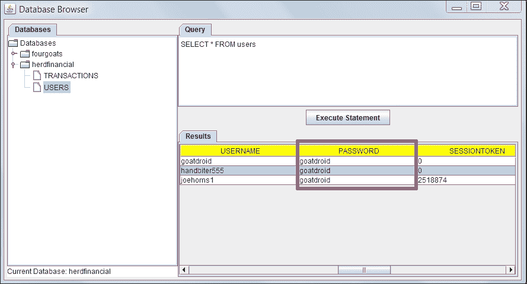

# 六、服务器端攻击

本章从服务器端概述 Android 应用的攻击面。我们将讨论对 Android 应用后端、设备和应用体系结构中其他组件的可能攻击。本质上，我们将为通过网络与数据库通信的传统应用构建一个简单的威胁模型。必须了解应用在执行渗透测试时可能遇到的威胁。本章是一个高级概述，包含较少的技术细节，因为大多数服务器端漏洞都与 web 攻击有关，并且已在 OWASP 测试和利用人员指南中广泛介绍。

本章涵盖以下主题：

*   手机应用类型及其威胁模型
*   了解移动应用的服务端攻击面
*   移动后端测试策略

    *   设置 burp 代理进行测试

        通过 APN

        通过 Wi-Fi

    *   绕过证书错误
    *   绕过 HST
    *   绕过证书链接

*   少数 OWASP Mobile/Web 前 10 个漏洞

对移动后端的服务器端攻击主要是 web 应用攻击。在这些 RESTful API 中，常见的攻击包括 SQL 注入、命令注入、存储 XSS 和其他 web 攻击。虽然我们在 Android 后端有多种类型的攻击，但本章主要关注 web 层和传输层的攻击。我们将简要讨论测试和保护移动应用后端的各种标准和准则。本章不应作为 web 攻击的全面指南，但是，对深入参考感兴趣的读者可以参考 web 应用黑客手册。

# 不同类型的移动应用及其威胁模型

如前一章所述，Android 应用根据的利用方式大致分为三种类型：

*   **基于 Web 的应用**：移动 Web 应用是使用 JavaScript 或 HTML5 等技术提供交互、导航或定制功能的软件。所有与 web 相关的攻击都适用于基于 web 的应用。
*   **原生应用**：原生移动应用提供快速性能和高可靠性。他们还可以访问手机的各种设备，如摄像头和通讯录。在前面的章节中，我们已经介绍了客户端攻击，服务器端攻击主要是对 web 服务的攻击，尤其是对 RESTful API 的攻击。
*   **混合应用**：混合应用类似于本地应用，在设备上运行，使用网络技术（HTML5、CSS 和 JavaScript）编写。混合应用中可以发现基于 Web 的应用和本机应用中存在的漏洞。因此，一个综合的方法有助于进行彻底的测试。

# 移动应用服务器端攻击面

了解应用的工作对于保护应用至关重要。我们将讨论如何设计和使用典型的 Android 应用。然后，我们将深入研究与应用相关的风险。

## 移动应用架构

下图显示了一个带有应用服务器和 DB 服务器的移动后端的典型架构。此应用连接到后台 API 服务器，该服务器在后台依赖数据库服务器：


建议在利用软件时遵循安全 SDLC 流程。许多组织都采用这种 SDLC 方法来在软件利用生命周期过程的每个阶段实现安全性。

在应用设计过程的早期执行威胁建模将允许对应用中的安全漏洞进行强有力的控制。在过程的早期构建一个没有缺陷的应用要比在应用投入生产后解决它们便宜得多。在软件利用生命周期过程中，大多数应用都忽略了这一点。

# 测试移动后端的策略

正如我们所讨论的，后端测试几乎就是 web 应用测试，然而，我们需要设置一些东西，以便能够在我们最喜欢的代理 Burp Suite 中查看 HTTP/HTTPS 流量。

## 设置打嗝套件代理进行测试

为了测试移动应用中存在的服务器端漏洞，代理是测试人员武库中不可或缺的工具。根据您使用的网络和模拟器/物理设备的可用性，有很多方法可以配置代理。在本节中，我们将探讨通过 Wi-Fi 和 APN 配置 Burp 套件的两个这样的选项。

这个过程的第一步是让我们的代理在端口上侦听，在我们的例子中是`8082`：

1.  从上下文选项卡转到**代理****选项**。
2.  点击**添加**按钮。
3.  Fill in the port to bind and select **All interfaces** as shown in the following screenshot:

    

4.  确保在**警报**选项卡上显示**代理服务已在端口 8082**上启动。
5.  If everything goes well, you should see a screen similar to the following:

    

现在我们已经启动了代理，让我们配置模拟器/设备通过代理代理所有请求/响应，看看幕后发生了什么。

### 通过 APN 设置代理

我们可以通过以下步骤为 Android 设备和后端之间的所有通信启用我们的代理：

1.  点击**菜单**按钮。
2.  点击**设置**按钮。
3.  在**无线&网络**下，选择**更多**。
4.  选择**蜂窝网络**。
5.  Go to **Access Point Names (APNs)**:

    

6.  Select the **Default Mobile** service provider:

    

7.  在**编辑**访问点部分，填写您的代理和端口，在本例中分别为`192.168.1.17`和`8082`。
8.  We should see the following screen once the proxy is set up:

    

### 注

如果尚未设置 DNS，您可能需要进行适当设置。

### 通过 Wi-Fi 设置代理

配置代理最简单的方法是通过 Wi-Fi，建议使用，因为它易于设置和测试。在继续设置代理之前，我们需要连接到 Wi-Fi 并进行身份验证。检查您是否能够访问任何互联网资源，如[www.google.com](http://www.google.com)：

1.  Select the SSID you are connected to (in our case, it's **WiredSSID**):

    

2.  Tap and hold it for a second until the context menu pops up:

    

3.  Select **Modify network** and fill in proxy host and port details:

    

4.  保存设置以确认代理详细信息。

### 旁路证书警告和 HST

让我们通过访问[www.google.com](http://www.google.com)来检查我们的代理设置是否正常工作。令我们惊讶的是，我们看到一个 SSL 证书警告：


点击**继续**按钮，查看 Burp 代理中的 HTTP（S）请求：


对于好奇的灵魂来说，安全警告是因为 BUP 套件在中间行为，我们的浏览器无法验证证书颁发者，因此提出证书警告。

如果我们点击**查看证书**按钮，我们会看到认证机构是**PortSwigger CA**，但它应该是 Google Internet Authority G2：


为了避免每次弹出，我们需要在 Android 设备上安装 Burp 的证书。通过将证书添加到设备的可信存储中，我们欺骗了应用，将 BIP 证书视为可信的。

请按照以下说明安装证书：

1.  Open the browser on your computer (here, Firefox) and configure the proxy settings by following the path **Tools** | **Options** |**Advanced** | **Network** |**Connection** | **Settings**:

    

2.  在上下文菜单中，填写代理的主机名或 IP 地址以及端口号。
3.  Visit `http://burp/` and download the CA certificate and save it onto the file system:

    

    或者您也可以进入**代理****选项**以 der 格式导出证书，如下图：

    

4.  After clicking **Import/export CA certificate** in the previous step, we should see the following window:

    

5.  Rename the `.der` to `.cer` by changing the extension, we will transfer this file onto the Android file system and install it on the device using the following commands as discussed in previous chapters:

    ```
    C:\> adb push cacert.cer  /mnt/sdcard

    ```

    或者我们可以将证书拖放到设备中。复制证书的目录可能因您的设备和 android 版本而异：

    

6.  To install the certificate, navigate to **Settings** | **Personal** | **Security** | **Credential storage** | **Install from Storage** go to `.cer` file.

    

7.  Fill in any name of your choice for the CA. You need to set the PIN if you are not already using it for certificate storage:

    

8.  如果一切顺利，我们将收到**Burproxy 已安装**消息。
9.  We can verify the certificate by going to **Trusted credentials**:

    

10.  The following screen will appear after tapping on the **Trusted credentials** option:

    

11.  我们可以看到**PortSwigger CA**证书已经安装，我们可以对证书警告说再见了。

安装 Burp CA 证书可以消除恼人的弹出窗口，并有助于为测试人员节省一些时间。

#### HSTS–HTTP 严格传输安全

HSTS 策略帮助受支持的客户端避免 cookie 窃取和协议降级攻击。当用户尝试访问网站 HTTP 时，HSTS 策略会自动将客户端重定向到`https`连接，如果服务器的证书不受信任，则不会让用户接受警告并继续。HSTS 通过使用以下标题启用：

**严格的运输安全：最大年龄=31536000**

通过将 CA 证书添加到可信存储中，重定向不会引发证书警告，从而帮助测试人员节省一些时间。

## 绕过证书钉扎

在前面的部分中，我们学习了如何拦截 Android 应用的 SSL 流量。本节介绍如何绕过称为 SSL/证书固定的特殊场景，其中应用执行附加检查以验证 SSL 连接。在上一节中，我们了解到 Android 设备带有一组受信任的 CA，它们检查目标服务器的证书是否由这些受信任的 CA 提供。虽然这提高了传输中数据的安全性，以防止 MITM 攻击，很容易破坏设备的信任存储并安装假证书，并说服设备信任其证书不是由受信任 CA 提供的服务器。引入证书固定的概念是为了防止将证书添加到设备的信任存储并破坏 SSL 连接。

使用 SSL 固定，假定应用知道它与哪些服务器通信。我们获取此服务器的 SSL 证书并将其添加到应用中。现在，应用不需要依赖设备的信任存储，而是进行自己的检查，以验证它是否正在与服务器通信，该服务器的证书已存储在此应用中。这就是 SSL 固定的工作原理。

Twitter 是最早实现 SSL 固定的流行应用之一。Android 应用中有多种绕过 SSL 锁定的方法。绕过 SSL 固定的最简单方法之一是反编译应用二进制文件和修补 SSL 验证方法。

建议阅读丹尼斯·扎科维奇（Denis and Zakovic）撰写的以下论文，以实现这一目标：

[http://www.security-assessment.com/files/documents/whitepapers/Bypassing%20SSL%20Pinning%20on%20Android%20via%20Reverse%20Engineering.pdf](http://www.security-assessment.com/files/documents/whitepapers/Bypassing%20SSL%20Pinning%20on%20Android%20via%20Reverse%20Engineering.pdf)

此外，iSecPartners 还提供了一个名为**AndroidSSLTrustKiller**的工具来绕过 SSL 固定。这是一个 Cydia 基板扩展，通过在`HttpsURLConnection.setSocketFactory()`处设置断点并修改局部变量绕过 SSL 固定。原始演示文稿可通过以下链接获得：

[https://media.blackhat.com/bh-us-12/Turbo/Diquet/BH_US_12_Diqut_Osborne_Mobile_Certificate_Pinning_Slides.pdf](https://media.blackhat.com/bh-us-12/Turbo/Diquet/BH_US_12_Diqut_Osborne_Mobile_Certificate_Pinning_Slides.pdf) 。

## 使用 AndroidSLTrustKiller 绕过 SSL 固定

本节演示如何在 Twitter Android 应用（版本 5.42.0）中使用 AndroidSSLTrustKiller 绕过 SSL 锁定。AndroidSSLTrustKiller 可从[下载 https://github.com/iSECPartners/Android-SSL-TrustKiller/releases](https://github.com/iSECPartners/Android-SSL-TrustKiller/releases) 。

当 Android 应用中启用 SSL 固定时，Burp Suite 不会拦截来自应用的任何流量，因为固定在应用中的证书与我们在 Burp 代理中拥有的证书不匹配。现在在 Android 设备中安装 Cydia 基板并安装`AndroidSSLTrustKiller`扩展。您需要重新启动设备才能进行更改。重新启动设备后，我们可以再次检查 Twitter 应用的流量，我们应该能够看到它，如以下屏幕截图所示：



### 设置演示应用

我们将在演示中使用 OWASP GoatDroid vulnerable 应用来展示服务器端漏洞，因为从服务器端攻击的角度来看，这并不是什么新鲜事。

#### 安装 OWASP GoatDroid

GoatDroid 中有两个应用，FourGoals 和 Herd Financial，我们将在本章中使用 Herd Financial，一个虚构的银行应用。

以下是 GoatDroid 安装的步骤：

1.  将移动应用（客户端）安装到移动设备上。
2.  Running of the GoatDroid web service (server).

    我们可以从以下 URL 下载 GoatDroid：

    [https://github.com/downloads/jackMannino/OWASP-GoatDroid-Project/OWASP-GoatDroid-0.9.zip](https://github.com/downloads/jackMannino/OWASP-GoatDroid-Project/OWASP-GoatDroid-0.9.zip)

3.  提取 ZIP 后，我们应该通过运行以下命令启动后端服务应用。点击**启动 Web 服务**按钮，启动**HerdFinancial**下的 Web 服务，如下图：

    ```
    C:\OWASP-GoatDroid-Project\>java –jar goatdroid-0.9.jar

    ```

4.  接下来，我们还需要在设备上安装移动 app，即 GoatDroid Herd Financial app，使用以下命令：

    ```
    C:\OWASP-GoatDroid-Project\ goatdroid_apps\FourGoats\android_app>adb install "OWASP GoatDroid- Herd Financial Android App.apk"

    ```

5.  Alternatively, you can push the app from the web service screen as shown in following screenshot:

    

我们需要在移动应用主屏幕的**目的地信息**下配置服务器 IP 地址和端口号（`9888`。然后，我们需要按照前面章节中讨论的那样设置代理以捕获请求。

登录的默认凭证为 goatdroid/goatdroid。

## 后端威胁

Web 服务（SOAP/RESTful）是在 HTTP/HTTPs 上运行的服务，与 Web 应用非常相似。所有的 web 应用攻击都可能发生在移动后端。现在我们将讨论在 API 中看到的一些常见安全问题。

### 关联 OWASP 十大移动风险和网络攻击

我们将尝试将我们关于服务器端问题的讨论与 OWASP 移动 10 大风险联系起来，以提供另一个角度来看待这些问题。但是，我们不会讨论客户端攻击，因为我们在前面的章节中已经讨论了这些攻击。



在 OWASP 移动十大风险中，以下风险与服务器端相关，我们将使用这些风险作为未来的传奇：

*   M1：弱服务器端控制
*   M2：不安全的数据存储
*   M3：传输层保护不足
*   M5：授权和身份验证较差
*   M6：破译的密码
*   M8：通过不受信任的输入进行安全决策
*   M9：不正确的会话处理

### 认证/授权问题

大多数 web 服务使用定制的身份验证对 API 进行身份验证，通常令牌存储在客户端，并在每个请求中重复使用。除了测试令牌存储的安全性外，我们还必须确保以下几点：

*   通过 TLS 安全传输凭据
*   使用强 TLS 算法套件
*   正在服务器端执行正确的授权
*   保护登录页面/端点不受暴力攻击漏洞的影响
*   强会话标识符的使用

您可以在 OWASP 测试指南和备忘单中找到有关身份验证和授权攻击的更多信息。

我们现在将看到一些使用 OWASP GoatDroid 应用的身份验证和授权漏洞的演示。

移动十大相关风险：M5、M1

#### 身份验证漏洞

正如我们在下面看到的，这个应用允许用户登录、注册帐户并检索忘记的密码：



让我们尝试注册一个帐户，看看向 API 发出了什么请求：


如果我们尝试使用相同的帐号或用户名注册另一个帐户，会发生什么情况？



有趣的是，我们可以找到用户名和银行账号：


正如我们所看到的，我们可以尝试与身份验证和授权相关的不同场景。攻击向量仅限于攻击者的创造力。

#### 授权漏洞

正如我们在下面看到的，这个应用可以让您检查余额、转账和查看对账单：


如前几节所述，我已经配置了 burp 套件来捕获 HTTP/HTTPS 请求。

让我们点击**检查余额**按钮向服务器询问我们的账户余额，因为我们可以看到`/balances`端点上向服务器发出了一个请求。请注意账号**1234567890**和会话 ID**AUTH=721148**。

如下所示，该账户余额为**947.3**。


我们也可以在移动应用上看到相同的余额：


我们可以将我们的账户号更改为任何账户号，并查看其余额，因为后端没有进行适当的授权检查：


我们也可以在移动应用上看到其他人账户的相同余额**414.56**：


### 会话管理

会话管理是您在移动应用中维护状态的方式，如前所述，通常使用身份验证令牌来完成。与会话管理相关的一些常见问题如下：

*   长度、熵等不足的弱会话令牌生成
*   身份验证后会话令牌的不安全传输
*   服务器端缺少适当的会话终止

您可以在 OWASP 测试指南和备忘单中找到有关会话管理攻击的更多信息。

移动十大相关风险：M3、M1

正如我们在*身份验证和授权*部分所看到的，身份验证会话令牌使用加密弱令牌。我们至少应该使用经过测试的随机数来创建令牌：


### 传输层安全性不足

即使虽然 SSL/TLS 的使用不像过去那样昂贵，但我们看到许多应用仍然不使用 TLS，如果使用 TLS，则配置相当糟糕。MITM 攻击对移动应用来说是相当严重的威胁，我们必须确保 android 应用至少检查以下几项安全检查：

*   数据仅通过使用 HST 在 SSL/TLS 上传输
*   使用 CA 颁发的证书与服务器通信
*   使用证书固定进行证书链验证

我们的演示应用不使用任何最佳实践，如 CA 颁发的证书、HST、证书固定等，因为我们能够使用 burp 代理而不会出现任何问题。

移动十大相关风险：M5、M1

### 输入验证相关问题

输入字段是应用的网关，即使对于移动应用也是如此。如果在服务器端没有实现输入验证控制，那么 SQL 注入、命令注入和跨站点脚本等漏洞并不少见。

移动十大相关风险：M5、M1、M8

### 错误处理不当

攻击者可以从错误消息中收集大量重要信息。如果错误处理未正确完成，应用最终将帮助攻击者破坏服务的安全性。

移动十大相关风险：M1

### 数据存储不安全

我们已经讨论了客户端数据存储的安全性，所以我们只考虑服务器端的不安全数据存储。如果存储在服务器上的数据以明文形式存储，则访问后端的攻击者可以很容易地利用此信息。最重要的是以散列格式存储所有密码，在可能的情况下，应加密静止的数据，包括数据备份。

移动十大相关风险：M2、M1

正如我们在下面的屏幕截图中所看到的，Herd financial demo 应用以明文形式存储用户凭据。如果攻击者获得此信息，他可以登录每个帐户并将资金转移到离岸帐户：



### 对数据库的攻击

注意，攻击者可能会直接对数据库进行未经授权的访问，这一点也很重要。例如，如果数据库控制台（如 phpmyadmin）没有使用强凭据进行保护，则攻击者有可能获得对该控制台的未经授权的访问。另一个例子是访问未经身份验证的 MongoDB 控制台，因为 MongoDB 的默认安装不需要任何身份验证即可访问其控制台。

移动十大相关风险：M1

我们讨论了不同的服务器端漏洞，如何配置 burp 套件来测试服务器端问题，我们还讨论了绕过 HST、证书固定的技术。

# 总结

本章通过解释 OWASP 前 10 名列表中列出的常见漏洞，概述了服务器端攻击。我们已经研究了配置代理服务器的不同策略。虽然它看起来很基本，但如果我们必须为底层或 Xposed 框架编写自定义插件，那么绕过证书固定可能是一种相当不错的体验。

在下一章中，我们将讨论如何在移动应用上使用静态分析。