# 一、Python 简介

本章将介绍 Python，主要关注 Python 编程语言遵循的数据类型、变量、表达式和程序结构。本章的目的是让读者熟悉 Python 的基础知识，以便在接下来的章节中使用它。本章将介绍 Python 及其依赖关系管理器的安装。我们还将开始研究 Python 中的脚本。

在本章中，我们将介绍以下主题：

*   Python 简介（包括其安装和设置）
*   基本数据类型
*   序列数据类型–列表、字典、元组
*   变量和关键字
*   运算和表达式

# 技术要求

在继续本章之前，请确保已准备好以下设置：

*   工作电脑或笔记本电脑

*   Ubuntu 操作系统，最好是 16.04 版
*   Python3.x
*   工作的互联网连接

# 为什么是 Python？

当我们考虑探索一种新的编程语言或技术时，我们经常想知道这项新技术的范围以及它对我们有什么好处。让我们在本章开始时思考一下为什么我们可能希望使用 Python，以及它可能给我们带来哪些优势。

为了回答这个问题，我们将考虑当前的技术趋势，而不是讨论更多特定于语言的特性，例如它是面向对象的、功能性的、可移植的和可解释的。我们以前听过这些术语。让我们试着从严格的工业角度来思考为什么我们可以使用 Python，这种语言的当前和未来前景是什么样子，以及这种语言如何为我们服务。首先，我们将介绍一些从事计算机科学的人可能会选择的职业选择：

*   程序员或软件开发人员
*   网络开发者
*   数据库工程师
*   网络安全专业人员（渗透测试人员、事件响应人员、SOC 分析师、恶意软件分析师、安全研究员等）
*   数据科学家
*   网络工程师

还有许多其他角色，但我们现在只关注最通用的选项，看看 Python 如何适合它们。让我们从程序员或软件开发人员的角色开始。截至 2018 年，Python 被列为招聘广告中第二流行的语言（[https://www.codingdojo.com/blog/7-most-in-demand-programming-languages-of-2018/](https://www.codingdojo.com/blog/7-most-in-demand-programming-languages-of-2018/) ）。程序员的角色可能因公司而异，但作为一名 Python 程序员，您可能正在制作一个用 Python 编写的软件产品，开发一个用 Python 编写的网络安全工具（GitHub 和网络安全社区的其他地方已经有很多这样的工具），制作能够模仿人类的机器人原型，设计智能家居自动化产品或实用工具，等等。Python 的范围涵盖了软件开发的各个方面，从典型的软件应用到健壮的硬件产品。这是因为该语言易于理解，其强大的库支持能力（由庞大的社区支持）以及开源的美妙之处。

让我们转到网络。近年来，Python 作为一种 web 开发语言，在成熟度方面做得非常好。Django、Flask 和 CherryPy 等最流行的基于 web 的全栈框架使使用 Python 进行 web 开发成为了一种无缝、干净的体验，同时也带来了大量的学习、定制和灵活性。我个人最喜欢的是 Django，因为它提供了一个非常干净的 MVC 体系结构，其中业务层、逻辑层和表示层完全隔离，使开发代码更干净，更易于管理。Django 已经装上了所有的电池，支持 ORM，支持使用芹菜进行后台任务处理，它做了任何其他 web 框架都能做的事情，同时保留了 Python 中的本机代码。Flask 和 CherryPy 也是 web 开发的最佳选择，它们可以控制数据流和定制。

**网络安全**是一个没有 Python 就不完整的领域。网络安全领域中的每个行业都以某种方式与 Python 相关，大多数网络安全工具都是用 Python 编写的。从渗透测试到监控安全运营中心，Python 得到了广泛的应用和需要。Python 通过为渗透测试人员提供优秀的工具和自动化支持来帮助他们，通过这些工具和支持，他们可以为各种渗透测试活动（从侦察到利用）编写快速而强大的脚本。在本书的整个过程中，我们将详细了解这一点。

**机器学习**（**ML**）和**人工智能**（**人工智能**）是当今科技行业的热门词汇。Python 非常支持所有 ML 和 AI 模型。在大多数情况下，默认情况下，Python 是任何想要学习 ML 和 AI 的人的首选。该领域的另一种著名语言是 R，但由于 Python 在所有其他技术和软件开发堆栈中的出色覆盖率，将用 Python 编写的机器学习解决方案与现有或新产品相结合要比将用 R 编写的解决方案相结合容易。Python 拥有令人惊叹的机器学习库和 API，如 sciket learn、NumPy、Pandas、matplotlib、NLTK 和 TensorFlow。Pandas 和 NumPy 使科学计算成为一项非常简单的任务，使用户可以灵活地在内存中处理庞大的数据集，并具有出色的抽象层，这使得开发人员和程序员可以忘记背景细节，从而干净利落、高效地完成工作。

几年前，一个典型的数据库工程师应该了解关系数据库，比如**MySQL**、**SQL Server**、**Oracle**、**PostgreSQL**等等。然而，在过去的几年中，技术领域发生了彻底的变化。虽然一个典型的数据库工程师仍然应该知道并精通这种数据库技术，但这还不够。随着数据量的不断增加，随着我们进入大数据时代，传统数据库必须与 Hadoop 或 Spark 等大数据解决方案协同工作。话虽如此，数据库工程师的角色已经演变为包括数据分析师技能集的角色。现在，数据不再从本地数据库服务器获取和处理，而是从异构源收集、预处理、跨分布式集群或并行核心处理，然后跨分布式节点集群存储。我们在这里讨论的是大数据分析和分布式计算。我们之前提到过 Hadoop 这个词。如果您不熟悉它，Hadoop 是一个引擎，它能够通过在计算机集群中生成大量文件，然后对处理后的结果集执行聚合（通常称为 map reduce 操作）来处理大型文件。ApacheSpark 是分析领域的一个新流行词，它声称比 Hadoop 生态系统快 100 倍。ApacheSpark 为 Python 开发人员提供了一个名为`pyspark`的 Python API，使用它我们可以使用本机 Python 代码运行 ApacheSpark。它非常强大，熟悉 Python 可以使设置变得简单和无缝。

提到前面几点的目的是强调 Python 在当前技术领域和未来的重要性。ML 和 AI 很可能是主导产业，它们都主要由 Python 提供动力。因此，现在是开始阅读和探索 Python 和机器学习网络安全的最佳时机。让我们从了解一些基本知识开始 Python 之旅。

# 关于 Python–编译或解释

编译器的工作原理是将用高级编程语言编写的人类可读代码转换为机器代码，然后由底层体系结构或机器运行。如果不希望运行代码，可以保存编译后的版本并在以后执行。应该注意的是，编译器首先检查语法错误，只有在没有发现语法错误时才创建程序的编译版本。如果您使用过 C，您可能会遇到`.out`文件，它们是编译文件的示例。

然而，对于解释器，程序的每一行都是在运行时从源代码中提取和解释的，然后转换成机器代码执行。Python 属于解释字节码的范畴。这意味着 Python 代码首先被转换为中间字节代码（一个`.pyc`文件）。然后，解释器逐行解释该字节码，并在底层架构上执行。

# 安装 Python

在本书的整个过程中，所有的练习都将在 Linux 操作系统上展示。就我而言，我使用的是 Ubuntu 16.04。您可以选择您喜欢的任何变体。我们将使用`python3`进行我们的练习，可安装如下：

```
sudo apt-get install python3
sudo apt-get install python3-pip
```

第二个命令安装**pip**，这是 Python 的包管理器。所有不属于标准安装的开源 Python 库都可以在`pip`的帮助下安装。在接下来的章节中，我们将探讨如何使用 pip。

# 开始

在本书的整个过程中，我们将致力于涵盖 Python、网络安全、渗透测试和数据科学领域的先进和知名行业标准。然而，正如他们所说，每一次非凡的旅程都是从一小步开始的。让我们通过了解 Python 的基础知识开始我们的旅程。

# 变量和关键字

**变量**顾名思义，是包含值的占位符。Python 变量只不过是一个名称，可以在 Python 程序或脚本的范围内保存用户定义的值。如果我们将 Python 变量与其他传统语言（如 C、C++、java 等）进行比较，我们将看到它们有点不同。在其他语言中，我们必须将数据类型与变量名称相关联。例如，要在 C 或 Java 中声明一个整数，我们必须将其声明为`int a=2`，编译器将立即在 C 中保留两个字节的内存，在 Java 中保留四个字节的内存。然后，它会将内存位置命名为`a`，从程序中引用该位置，并在其中存储`2`值。然而，Python 是一种动态类型化语言，这意味着我们不需要将数据类型与我们将在程序中声明或使用的变量相关联。

整数的典型 Python 声明可能类似于`a=20`。这只是创建一个名为`a`的变量，并将值`20`放入其中。即使我们将下一行中的值更改为`a="hello world"`，它也会将字符串`hello world`与变量`a`关联起来。让我们看看 Python 终端上的操作，如下所示：

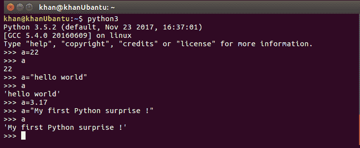

要使用 Python 终端，只需在终端提示符中键入`python3`命令。让我们想想这是怎么回事。请看下图，其中比较了静态类型语言和动态类型语言：

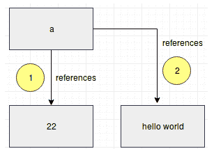


正如您在前面的图中所看到的，在 Python 的情况下，变量实际上包含对实际对象的引用。每次更改值时，都会在内存中创建一个新对象，并且变量指向该新对象。前一个对象由垃圾收集器声明。

在讨论了 Python 是一种动态类型语言之后，我们不能将其与弱类型语言混淆。虽然 Python 是动态类型的，但它也是一种强类型语言，就像 java、C++或 C++一样。

在下面的示例中，我们声明了字符串类型的变量`a`和整数类型的变量`b`：

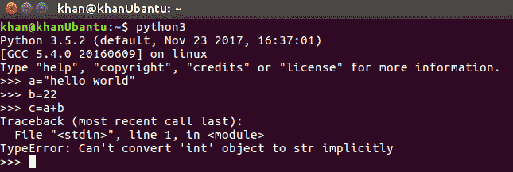

当我们执行操作`c=a+b`时，在弱类型语言中可能发生的情况是`b`的整数值将被类型化为字符串，而存储在变量`c`中的结果将是`hello world22`。但是，由于 Python 是强类型的，因此函数遵循与变量关联的类型。我们需要显式地进行转换以执行任何此类操作。

让我们看看下面的例子来理解强类型语言的含义；我们显式更改变量`b`的类型，并在运行时将其类型转换为字符串类型：


# 变量命名约定

在了解了如何声明和使用变量的基本知识之后，让我们尝试了解它们遵循的命名约定。变量（也称为标识符）可以由以 A-Z、A-Z 或下划线之间的任何字母开头的任何内容命名。然后可以后跟任意数量的数字或字母数字字符。

必须注意的是，某些特殊字符，如%、@、#、-、和！，在 Python 中保留，不能与变量一起使用。

# Python 关键字

**关键字**顾名思义，是特定语言实现中具有预定义含义的某些保留字。在其他语言中，我们通常不能用和关键字相同的名称来命名变量，但 Python 的情况稍有不同。虽然我们不应该使用与保留给关键字的变量或标识符相同的名称来命名变量或标识符，但即使我们这样做，程序也不会抛出任何错误，我们仍然会得到一个输出。让我们借助传统的 C 程序和等效的 Python 脚本来理解这一点：

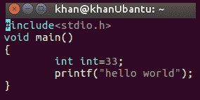

需要注意的是，这是一个简单的 C 程序，我们在其中声明了一个整数，并使用`int`标识符来标识它，然后我们简单地打印`hello world`。

但是，当我们尝试编译程序时，它会抛出一个编译错误，如以下屏幕截图所示：


让我们尝试在 Python shell 中执行同样的操作，看看会发生什么：

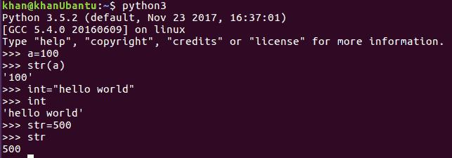

可以看出，当我们用名称`int`和`str`声明变量时，程序没有抛出任何错误。尽管`int`和`str`都是 Python 关键字，但在前面的例子中，我们看到一个名为`int`的变量包含字符串值，而一个名为`str`类型的变量包含`int`值。我们还看到了正态变量`a`是如何从`int`类型转换为`string`类型的。由此可以确定，我们可以在 Python 中使用保留字作为变量。这样做的缺点是，如果我们要使用关键字作为变量或标识符，我们将覆盖这些保留字所具有的实际功能。当我们在程序范围内重写它们的实际行为时，它们将遵循更新或重写的功能，这是非常危险的，因为这会使我们的代码脱离 Python 的约定。这应该永远避免。

让我们扩展前面的示例。我们知道`str()`是一个内置 Python 函数，其目的是将数字数据类型转换为字符串类型，正如我们在变量`a`中看到的那样。然而，稍后，我们重写了它的功能，并且在程序的范围内，我们将它指定为整数类型。现在，在这个程序范围内的任何时间点，如果我们试图使用`str`函数将一个数字类型转换为`string`，解释器将抛出一个错误，说明`int`类型变量不能用作方法，或者它们不可调用，如下图所示：


`int`方法也是如此，我们将无法再使用它将字符串类型转换为其等效整数。

现在，让我们看看 Python 中可用的其他类型的关键字，我们应该尽量不使用它们作为变量名。Python 代码本身有一种很酷的方法可以做到这一点，它允许我们在终端窗口中打印 Python 关键字：

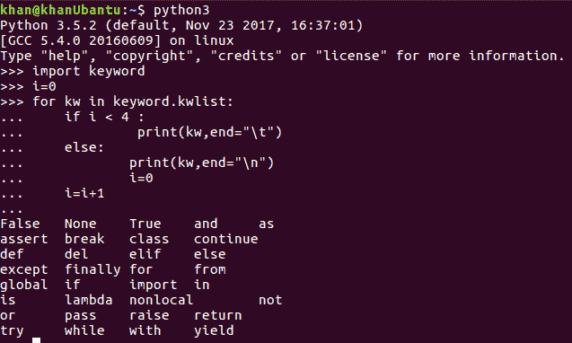

`import`语句用于在 Python 中导入库，就像我们使用 imports 在 Java 中导入包一样。在以后的章节中，我们将详细介绍如何使用导入和循环。现在，我们将了解不同 Python 关键字的含义：

*   `false`：布尔`false`运算符。
*   `none`：这相当于其他语言中的`Null`。
*   `true`：布尔`true`运算符。
*   `and`：可与条件和循环一起使用的逻辑`and`。
*   `as`：用于为我们导入的模块分配别名。
*   `assert`：用于调试代码。
*   `break`：退出循环。
*   `class`：用于声明一个类。
*   `continue`：这是用于循环的传统`continue`语句，可用于继续执行循环。
*   `def`：用于定义一个函数。每个 Python 函数都需要在前面加上`def`关键字。
*   `del`：用于删除对象
*   `elif`：条件`else...if`语句。
*   `else`：条件`else`语句。
*   `except`：用于捕捉异常。
*   `finally`：这与异常处理一起使用，作为清理资源的最后一块代码的一部分。
*   `for`：传统的 for 循环声明关键字。
*   `global`：用于声明和使用全局变量。
*   `if`：条件`if`语句。
*   `import`：用于导入 Python 库、包和模块。
*   `in`：用于在 Python 字符串、列表和其他对象之间进行搜索。
*   `is`：用于测试对象的身份。
*   `lambda`：用于 Lambda 函数。
*   `nonlocal`：用于声明嵌套函数中的非局部变量。
*   `not`：这是一个条件运算符。
*   `or`：这是另一个条件运算符。
*   `pass`：在 Python 中用作占位符。
*   `raise`：用于在 Python 中引发异常。
*   `return`：用于从函数返回。
*   `try`：用于异常处理的传统`try`关键字。
*   `while`：与`while`回路一起使用。
*   `with`：用于打开文件等。
*   `yield`：用于发电机。
*   `from`：用于相对进口。

在本书中，我们将了解此列表中提到的所有关键字。

# Python 数据类型

与任何其他编程语言一样，Python 也带有标准数据类型。在本节中，我们将探讨 Python 提供给我们使用的各种强大的数据类型。

# 数字

**数字**顾名思义，涵盖了所有数字数据类型，包括整数和浮点数据类型。在本章前面，我们看到要使用整数或浮点，只需声明变量并分配整数或浮点值。现在，让我们编写一个合适的 Python 脚本，并探索如何使用数字。将脚本命名为`numbers.py`，如下所示：

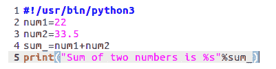

前面的屏幕截图显示了一个简单的 Python 脚本，该脚本添加一个带浮点的整数，然后打印总和。要运行脚本，我们可以键入`python3 numbers.py`命令，如下所示：

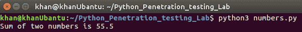

您可能已经注意到脚本开头的命令是`#! /usr/bin/python`。这行代码的作用是使代码可执行。在脚本的权限发生变化并使其可执行后，该命令表示，如果试图执行该脚本，则我们应继续使用`python3`执行它，该路径位于`/usr/bin/python3`路径中。这可以在以下示例中看到：


如果我们观察`print`命令，我们可以看到字符串格式化程序是`%s`。要用实际值填充，将第二个参数传递给`print`函数：

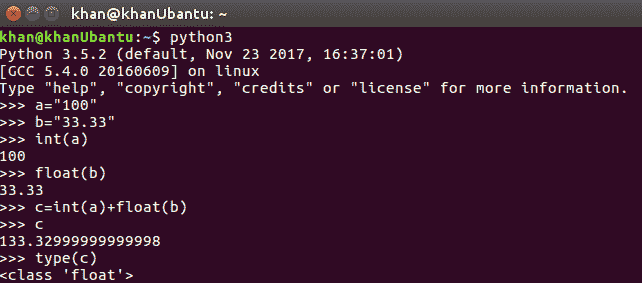

要将字符串转换为其等效的整数或浮点值，我们可以使用内置的`int()`和`float()`函数。

# 字符串类型

我们知道字符串是字符的集合。在 Python 中，字符串类型属于序列类别。字符串非常强大，有许多方法可用于执行字符串操作。让我们看一下下面的代码，它向我们介绍了 Python 中的字符串。在 Python 中，可以在单引号和双引号中声明字符串：


在前面的代码中，我们只是声明一个名为`my_str`的字符串并将其打印在控制台窗口上。

# 字符串索引

必须注意，在 Python 中，字符串可以作为字符序列访问。字符串可以看作是字符列表。让我们尝试打印字符串不同索引处的字符，如以下屏幕截图所示：

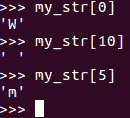

在索引`0`处，打印字符`0`。在索引`10`中，我们有一个空白，而在索引`5`中，我们有字母`m`。应该注意的是，序列存储在 Python 中，起始索引为`0`，字符串类型也是如此。

# 通过方法和内置函数执行字符串操作

在本节中，我们将了解如何比较两个字符串、连接字符串、将一个字符串复制到另一个字符串，以及在某些方法的帮助下执行各种字符串操作。

# replace（）方法

`replace`方法用于执行字符串替换。它返回一个带有适当替换项的新字符串。replace 方法的第一个参数是字符串中要替换的字符串或字符，而第二个参数是要替换的字符串或字符：

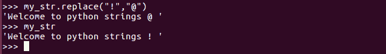

在前面的示例中，我们可以看到原始字符串中的`!`被`@`替换，并返回一个带有替换内容的新字符串。应该注意的是，这些更改实际上并没有对原始字符串进行更改，而是返回了一个新字符串，并进行了相应的更改。这可以在下一行中进行验证，在下一行中，我们打印原始字符串，并打印旧的未更改值`Welcome to python strings !`。这背后的原因是 Python 中的字符串是不可变的，就像 Java 中的字符串一样。这意味着一旦声明了字符串，通常就不能对其进行修改。然而，情况并非总是如此。让我们尝试更改字符串，这次尝试捕获最初声明的字符串`my_str`中的修改，如下所示：


在前面的代码中，我们可以修改原始字符串，因为我们从前面声明的字符串`my_str`中的`replace`方法获得了新返回的字符串。这听起来可能与我们之前所说的相矛盾。让我们来看看这是如何工作的，看看我们所称的 OrthT2 方法之前和之后的场景发生了什么：

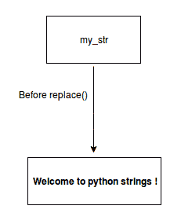

将`!`替换为`@`后，如下所示：


在前面的两个插图中可以看出，在调用`replace`方法之前，`my_str`字符串引用指向包含`!`的实际对象。一旦`replace()`方法返回了一个新字符串，我们用新返回的对象更新了现有的字符串变量，旧的内存对象不会被覆盖，而是创建了一个新的。程序引用现在指向新创建的对象。前面的对象在内存中，没有指向它的任何引用。这将在稍后阶段由垃圾收集器进行清理。

我们可以做的另一件事是尝试更改原始字符串任何位置的任何字符。我们已经看到字符串可以通过其索引访问，但是如果我们尝试更新或更改任何特定索引中的字符，将引发异常，并且不允许该操作，如以下屏幕截图所示：


默认情况下，`replace()`方法将替换目标字符串中出现的所有替换字符串。但是，如果我们只想替换目标字符串中出现的一个或两个内容，我们可以将第三个参数传递给`replace()`方法，并指定我们想要的替换出现次数。假设我们有以下字符串：

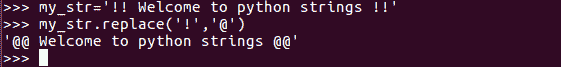

如果我们只希望第一次出现的`!`字符是`@`，其余字符是相同的，则可以通过以下方式实现：


# 子字符串或字符串切片

获取字符串的一部分是我们在日常字符串操作中经常遇到的一个常见练习。C 或 Java 等语言为我们提供了专用的方法，如`substr(st_index,end_index)`或`subString(st_index,end_index)`。要在 Python 中执行子字符串操作，没有专门的方法，但我们可以使用切片。例如，如果我们希望获得原始`my_str`字符串的前四个字符，我们可以通过使用`my_str[0:4]`等操作来实现，如下面的屏幕截图所示：

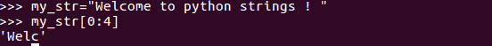

同样，切片操作返回一个新字符串，并且更改不会应用于原始字符串。此外，这里值得理解的是，切片发生在 n-1 个字符上，其中`n`是上限，在我们的例子中指定为第二个参数，即 4。因此，实际的子串操作将从索引`0`开始执行，并在索引`3`结束，从而返回字符串`Welc`。

让我们看一些切片的例子：

*   要从索引`4`获取整个字符串，请执行以下操作：


*   要从启动到索引`4`获取字符串，请执行以下操作：

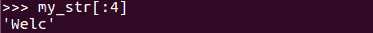

*   要使用切片打印整个字符串，请执行以下操作：

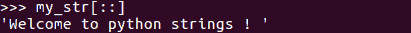

*   要打印步骤为`2`的字符，请执行以下操作：

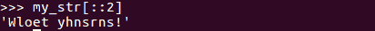

*   要打印字符串的背面，请执行以下操作：


*   要按相反顺序打印字符串的一部分，请执行以下操作：


# 字符串连接和复制

`+`是 Python 中用于连接两个字符串的连接运算符。和往常一样，连接的结果是一个新字符串，除非我们得到更新的字符串，否则更新将不会反映在原始字符串对象中。`+`运算符在内部重载，以便在字符串类型上使用时执行对象的串联。在数字数据类型上使用时，它还用于两个数字的相加，例如：

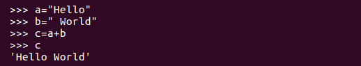

有趣的是，Python 还支持另一个运算符，当与字符串数据类型一起使用时，该运算符会过载。该运算符不执行常规操作，而是执行原始操作的变体，以便跨字符串数据类型复制功能。这里，我们讨论的是乘法运算符，`*`。传统上，这应该执行数字数据类型的乘法，但当它用于字符串数据类型时，它会执行复制操作。这显示在以下代码段中：

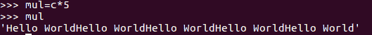

在前面的例子中，乘法运算符实际上复制了存储在`c`变量中的`Hello world`字符串五次，正如我们在表达式中指定的那样。这是一个非常方便的操作，可以用来生成模糊有效载荷，我们将在本书后面的章节中看到。

# strip（）、lstrip（）和 rstrip（）方法

`strip`方法实际上用于从输入字符串中去除空白。默认情况下，`strip`方法将从字符串的左侧和右侧去除空格，并返回一个新字符串，该字符串的开头和结尾都没有空格，如以下屏幕截图所示：

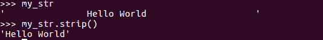

但是，如果我们只想去掉左边的空格，我们可以使用`lstrip()`方法。同样，如果我们只想去掉正确的空格，我们可以使用`rstrip()`方法。具体情况如下：

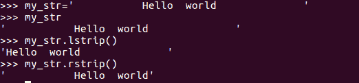

# split（）方法

顾名思义，`split`方法用于在特定分隔符上拆分输入字符串，并返回包含已拆分单词的列表。我们将在短期内更详细地查看列表。现在，让我们来看看下面的例子，在这里我们有一个雇员的名字、年龄和薪水，在一个字符串中用逗号分隔。如果我们希望单独获得该信息，我们可以对`,`进行拆分。`split`函数将第一个参数作为要对其执行`split`操作的分隔符：


默认情况下，`split`操作在一个空格上执行，也就是说，如果没有指定分隔符。这可以看出如下几点：


# find（）、index（）、upper（）、lower（）、len（）和 count（）方法

`find()`函数用于搜索目标字符串中的字符或字符串。如果找到匹配项，此函数将返回字符串的第一个索引。如果未找到匹配项，则返回`-1`：


`index()`方法与`find()`方法相同。如果找到匹配项，则返回字符串的第一个索引；如果未找到匹配项，则引发异常：


`upper()`方法用于将输入字符串转换为大写字母，`lower()`方法用于将给定字符串转换为小写字母：

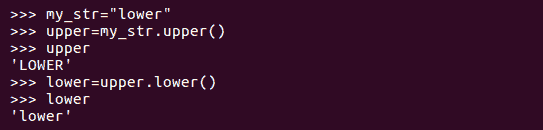

`len()`方法返回给定字符串的长度：

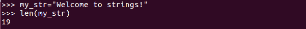

`count()`方法返回我们希望在目标字符串中计数的任何字符或字符串的出现次数：


# in 和 not in 方法

`in`和`not in`方法非常方便，因为它们可以让我们快速搜索序列。如果我们想检查目标字符串中是否存在某个字符或单词，我们可以使用`in`和`not in`方法。如果单词存在，则返回`True`，否则返回`False`：


# endswith（）、isdigit（）、isalpha（）、islower（）、isupper（）和 capitalize（）方法

`endswith()`方法检查给定字符串是否以我们作为参数传递的特定字符或单词结尾：

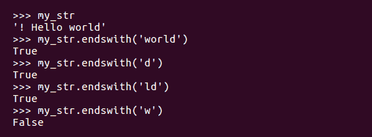

`isdigit()`方法检查给定字符串是否为数字类型：

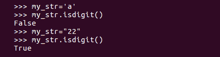

`isalpha()`方法检查给定字符串是否为字母字符类型：

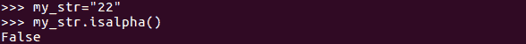

`islower()`方法检查字符串是否为小写，`isupper()`方法检查字符串是否为大写。`capitalize()`方法将给定字符串放入句子大小写：

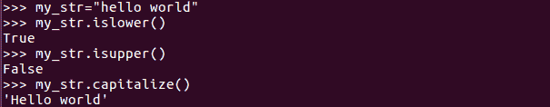

# 列表类型

Python 没有数组类型，而是提供列表数据类型。Python 列表也属于序列的范畴，提供了广泛的功能。来自 java、C++或 C++背景的人，你可能会发现 Python 列表和这些语言提供的数组和列表类型略有不同。在 C、C++或 java 中，数组是类似数据类型元素的集合，java 数组列表也是这样。这与 Python 的情况不同。在 Python 中，列表是元素的集合，可以是同质数据类型，也可以是异构数据类型。这是使 Python 列表功能强大、健壮且易于使用的特性之一。在声明 Python 列表时，我们也不需要指定它的大小。它可以动态增长以匹配它包含的元素数量。让我们看一个使用列表的基本示例：

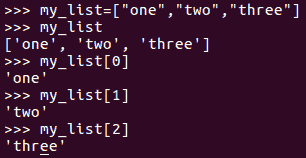

Python 中的列表从索引`0`开始，可以根据索引访问任何项目，如前面的屏幕截图所示。前面的列表是同构的，因为所有元素都是字符串类型。我们还可以有一个异构列表，如下所示：


目前，我们正在手动打印列表元素。我们可以很容易地用循环来迭代它们，稍后我们将对此进行探讨。现在，让我们尝试了解在 Python 中可以对列表结构执行哪些操作。

# 切分列表

**切片**是一种允许我们从序列和列表中提取元素的操作。我们可以对列表进行切片以提取我们可能感兴趣的部分。必须再次注意，切片的索引是基于 0 的，并且最后一个索引始终被认为是`n-1`，其中 n 是指定的最后一个索引值。要从列表中分割前五个和最后五个元素，我们可以执行以下操作：

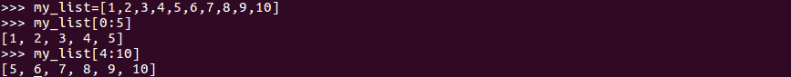

让我们看看列表切片的一些示例及其结果：

*   要从索引`4`开始获取列表，请执行以下操作：


*   要从启动到索引`4`获取列表元素，请执行以下操作：


*   要使用切片打印整个列表，请执行以下操作：

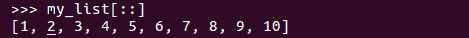

*   要打印步长为`2`的列表元素，请执行以下操作：


*   要打印列表的背面，请执行以下操作：

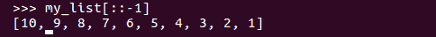

*   要按相反顺序打印列表的一部分，请执行以下操作：

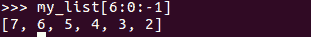

*   向`list-append()`添加新元素：`append()`方法用于向列表中添加元素，要添加的元素作为`append()`方法的参数给出。要添加的这些元素可以是任何类型。元素本身可以是数字或字符串，也可以是列表：

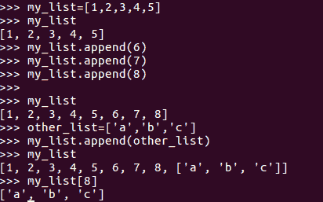

我们可以在前面的示例中看到，我们使用`append()`方法在原始列表中添加了三个元素`6`、`7`和`8`。然后，我们实际上添加了另一个包含三个字符的列表，这些字符将作为列表完整地存储在原始列表中。可以通过指定`my_list[8]`索引来访问这些。在前面的示例中，新列表将原封不动地添加到原始列表中，但不会合并。

# 合并和更新清单

在 Python 中，列表合并可以通过两种方式完成。首先，我们可以使用传统的`+`运算符，我们以前使用它连接两个字符串。它在列表对象类型上使用时也会执行相同的操作。实现这一点的另一种方法是使用`extend`方法，该方法将新列表作为参数与现有列表合并。如下例所示：

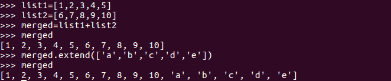

要更新列表中的一个元素，我们可以访问它的索引，并为我们想要更新的任何元素添加更新的值。例如，如果我们想将字符串`Hello`作为列表的第 0<sup>个</sup>元素，可以通过将第 0<sup>个</sup>元素分配给`Hello`值作为`merged[0]="hello"`来实现：


# 复制列表

我们已经看到 Python 变量只不过是对实际对象的引用。列表也是如此。由于这个原因，操作列表变得有点棘手。默认情况下，如果我们通过简单地使用`=`操作符将一个列表变量复制到另一个列表变量，它实际上不会为该变量创建列表的副本或本地副本–相反，它只会创建另一个引用，并将新创建的引用指向同一内存位置。因此，当我们对复制的变量进行更改时，相同的更改将反映在原始列表中。在以下示例中，我们将创建新的独立副本，其中复制变量中的更改不会反映在原始列表中：

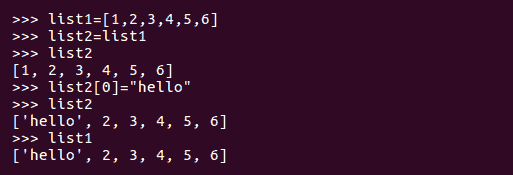

现在，让我们看看如何创建现有列表的新副本，以便对新列表的更改不会导致对现有列表的任何更改：

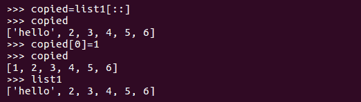

创建原始列表的独立副本的另一种方法是使用 Python 中可用的`copy`和`deepcopy`函数。浅层副本构造一个新对象，然后将该对象的*引用*插入到原始列表中找到的对象中。另一方面，一个*深度副本*构造一个新的复合对象，然后递归地插入在原始列表中找到的对象的*副本*：

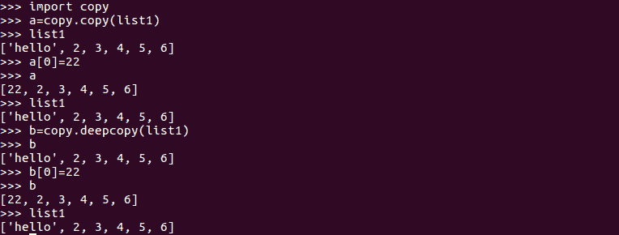

# 从列表中删除元素

我们可以使用`del`命令从列表或整个列表中删除一个元素。`del`命令不返回任何内容。我们也可以使用`pop`方法从列表中删除元素。`pop`方法将我们希望删除的元素的索引作为参数：


可以按如下方式删除整个列表结构：

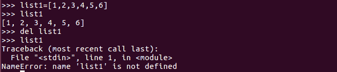

# 使用 len（）、max（）和 min（）进行复制

乘法运算符`*`应用于列表时，会导致列表元素的复制效果。列表内容重复的次数与传递给复制操作员的编号相同：


`len()`方法给出 Python 列表的长度。`max()`方法返回列表的最大元素，`min()`方法返回列表的最小元素：

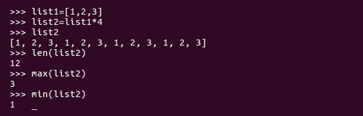

我们也可以在字符类型上使用`max`和`min`方法，但不能在具有混合或异构类型的列表上使用它们。如果我们这样做，我们将得到一个异常，说明我们正在尝试比较数字和字符：


# 在里面而不是在里面

`in`和`not in`方法是可用于任何序列类型的基本 Python 操作。我们看到了它们以前是如何与字符串一起使用的，我们使用它们在目标字符串中搜索字符串或字符。如果搜索成功，`in`方法返回`true`，否则返回`false`。`not in`方法的情况正好相反。执行过程如下所示：


# Python 中的元组

**Python 元组**非常类似于 Python 列表。区别在于它是一个只读结构，所以一旦声明它，就不能对元组的元素进行任何修改。Python 元组可以按如下方式使用：

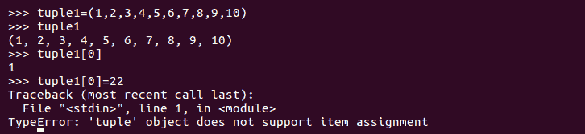

在前面的代码中，我们可以看到访问元组的方式与访问列表的方式相同，但是当我们尝试更改元组的任何元素时，它会抛出一个异常，因为元组是只读结构。如果我们执行对列表执行的操作，我们将看到它们的工作方式与元组完全相同：


如果元组中只有一个元素，则必须用后面的逗号声明它。如果在声明逗号时不添加该逗号，它将被解释为数字或字符串数据类型，具体取决于元组的元素。以下示例更好地解释了这一点：

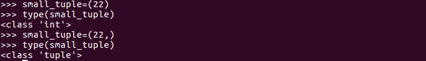

元组可以转换为列表，然后可以按如下方式进行操作：


# Python 中的词典

**字典**是非常强大的结构，在 Python 中被广泛使用。字典是一种键值对结构。字典键可以是唯一的数字或字符串，值可以是任何 Python 对象。字典是可变的，可以就地更改。以下示例演示 Python 中字典的基础知识：


Python 字典可以在大括号内声明。每个键值对用逗号分隔。需要注意的是，钥匙必须是唯一的；如果我们尝试重复这些键，旧的键值对将被新的键值对覆盖。从前面的示例中，我们可以确定字典键可以是字符串或数字类型。让我们尝试在 Python 中对字典执行各种操作：

*   **使用**键检索字典值：可以通过字典键的名称访问字典值。如果密钥的名称未知，我们可以使用循环遍历整个字典结构。我们将在本书的下一章中介绍这一点：

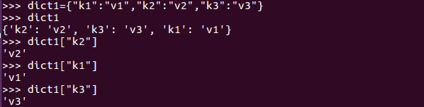

这是打印字典值的多种方法之一。但是，如果要打印其值的键在字典中不存在，我们将得到一个键未找到异常，如以下屏幕截图所示：

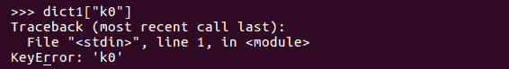

有一种更好的方法来处理这个问题并避免此类异常。我们可以使用 dictionary 类提供的`get()`方法。`get()`方法将键名作为第一个参数，如果键不存在，则将默认值作为第二个参数。然后，如果找不到键，将返回默认值，而不是引发异常。这显示在以下屏幕截图中：


在上例中，当实际字典`dict1`中存在`k1`键时，返回`k1`键的值，即`v1`。然后，搜索原来不存在的`k0`键。在这种情况下，没有引发异常，而是返回了`False`值，这表明实际上不存在这样的键`K0`。请记住，我们可以指定任何占位符作为`get()`方法的第二个参数，以指示我们正在搜索的键的缺失。

*   **向字典添加键和值**：一旦声明了一个字典，在整个代码过程中，可能会有很多情况需要修改字典键或添加新的字典键和值。这可以通过以下方式实现。如前所述，字典值可以是任何 Python 对象，因此我们可以将元组、列表和字典类型作为字典中的值：


现在，让我们添加更复杂的类型作为值：

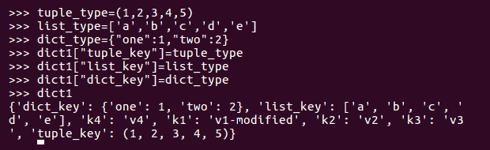

这些值可以通过其键检索为正常值，如下所示：

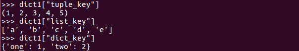

*   **使用另一个字典的内容扩展字典**：在前面的示例中，我们将一个字典作为值添加到现有字典中。现在我们将了解如何将两个词典合并为一个通用词典或新词典。可以使用`update()`方法进行此操作：


*   **`Keys()`**：要获取所有字典键，我们可以使用`keys()`方法。这将返回字典键的类实例：


我们可以看到 keys 方法返回`dict_keys`类的一个实例，该类保存字典键列表。我们可以将其类型转换为列表类型，如下所示：

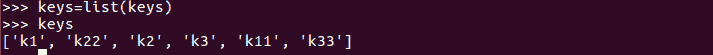

*   **`values()`**：`values()`方法返回字典中存在的所有值：

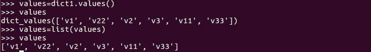

*   **`Items()`**：此方法实际上用于迭代字典键值对，因为它返回一个包含元组列表的列表类实例。每个元组有两个条目，第一个是键，第二个是值：

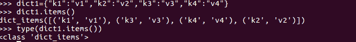

我们还可以将返回的类实例转换为元组、列表元组或列表类型。实现这一点的理想方法是迭代项目，我们将在稍后查看循环时看到：

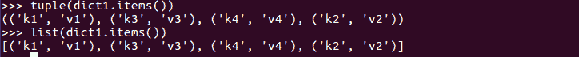

*   **`in`**和**`not in`**：使用`in`和`not in`方法查看字典中是否存在键。默认情况下，`in`和`not in`子句将搜索字典键，而不是值。请看以下示例：


*   **存储顺序**：默认情况下，Python 字典是无序的，这意味着它们内部存储的顺序与我们定义的顺序不同。原因是字典存储在名为**哈希表**的动态表中。由于这些表是动态的，因此它们的大小可以增加或缩小。内部发生的事情是计算密钥的散列值并将其存储在表中。键位于第一列，而第二列保存实际值。让我们看看下面的例子来更好地解释：


在前面的例子中，我们声明了一个字典`a`，第一个键为`abc`，第二个键为`abcd`。然而，当我们打印值时，我们可以看到，`abcd`在`abc`之前存储在内部。为了解释这一点，我们假设内部存储字典的动态表或哈希表的大小为`8`。

正如我们前面提到的，密钥将存储为散列值。当我们计算`abc`字符串的散列并以模块化方式将其除以`8`（表大小）时，我们得到`7`的结果。如果我们对`abcd`进行同样的操作，我们将得到`4`的结果。这意味着散列`abcd`将存储在索引`4`中，而散列`abc`将存储在索引`7`中。因此，在清单中，我们在`abc`之前列出了`abcd`：


可能有两个键在`hash(key)%table_size`操作后到达一个公共值的情况，称为**碰撞**。在这种情况下，首先开槽的密钥是首先存储的密钥。

*   **`sorted()`**：如果我们想让字典按照键排序，我们可以使用内置的排序方法。这可以调整为返回元组列表，每个元组在第 0<sup>个</sup>索引处有一个键，其值在第 1<sup>个</sup>索引处：

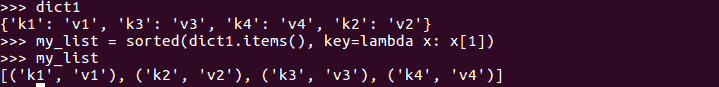

*   **删除元素**：我们可以使用常规的`del`语句删除任何字典项。当我们说删除时，我们的意思是同时删除键和值。字典项成对工作，因此删除键也会删除该值。另一种删除条目的方法是使用`pop()`方法并将键作为参数传递。这显示在以下代码段中：


# Python 运算符

Python 中的运算符可以对表达式执行算术或逻辑运算。运算符操作的变量称为**操作数**。让我们尝试了解 Python 中可用的各种运算符：

*   **算法**：

| **功能** | **示例** |
| 附加 | `a + b` |
| 扣除 | `a - b` |
| 反面 | `-a` |
| 乘法 | `a * b` |
| 分开 | `a / b` |
| 模 | `a % b` |
| 指数化 | `a ** b` |
| 楼层划分 | `a // b` |

*   **作业**：
    *   `a = 0`评估为`a=0`
    *   `a +=1`评估为`a = a + 1`
    *   `a -= 1`评估为`a = a + 1`
    *   `a *= 2`评估为`a = a * 2`
    *   `a /= 5`评估为`a = a / 5`
    *   `a **= 3`评估为`a = a ** 3`
    *   `a //= 2`评估为`a= a // 2`（楼层分区 2）
    *   `a %= 5`评估为`a= a % 5`
*   **逻辑运算符**：
    *   **`and`**`True`：如果两个操作数都是`true`，则条件变为`true`。例如，`(a and b)`是`true`。
    *   **`or`**`True`：如果两个操作数中的任何一个非零，则条件变为`true`。例如，`(a or b)`是`true`。
    *   **`not`**`True`：用于反转其操作数的逻辑状态。例如，`not (a and b)`是`false`。
*   **位运算符**：

| **功能** | **示例** |
| `and` | `a & b` |
| `or` | `a &#124; b` |
| `xor` | `a ^ b` |
| `invert` | `~ a` |
| `Right Shift` | `a >> b` |
| `Left Shift` | `a << b` |

# 总结

在本章中，我们讨论了 Python 的基础知识，并探讨了该语言的语法。这与您过去可能学习过的语言（如 C、C++或 Java）没有太大区别。然而，与同行相比，它更易于使用，并且在网络安全领域真正强大。本章阐述了 Python 的基础知识，并将帮助我们进步，因为在本书的整个过程中，大量使用了一些数据类型，如列表、字典、元组和字符串。

在下一章中，我们将学习条件和循环，并了解如何将循环与我们迄今为止所研究的数据类型一起使用。

# 问题

1.  Python 是开源的吗？如果是，它与其他开源语言有什么不同？
2.  谁管理 Python 并致力于进一步的功能增强？
3.  Python 比 Java 快吗？
4.  Python 是面向对象的还是功能性的？
5.  如果我对任何编程语言几乎没有经验，我能快速学习 Python 吗？
6.  作为一名网络安全工程师，Python 对我有什么好处？
7.  我是一名渗透测试人员——为什么我需要了解人工智能和机器学习？