# 二、构建 Python 脚本

本章将介绍所有编程语言的核心概念。这包括条件语句、循环、函数和包。我们将看到，这些概念在 Python 中与在其他编程语言中几乎相同，只是一些语法上的差异。但语法只是需要练习；其他一切都会自动排成一行。我们将在本章中介绍的主题如下：

*   条件语句
*   循环
*   功能
*   模块和包
*   理解与生成

# 技术要求

确保您具备进一步操作所需的以下先决条件：

*   工作电脑或笔记本电脑

*   Ubuntu 操作系统（最好是 16.04）
*   Python3.x
*   工作的互联网连接

# 压痕

如果你来自 java、C 或 C++这样的语言背景，你可能熟悉使用卷筒括号对逻辑连接的语句进行分组的概念。然而，在 Python 中并非如此。相反，逻辑连接的语句（包括类、函数、条件语句和循环）使用缩进进行分组。缩进使代码保持干净，易于阅读。我们将在接下来的章节中对此进行更详细的探讨。但是现在，让我们向牙套说再见。我建议您使用制表符进行缩进，因为在每行中键入相等数量的空格会非常耗时。

# 条件语句

与所有其他语言一样，Python 使用条件语句来执行条件操作。Python 支持的条件语句如下：

*   `if`条件
*   `if...else`条件
*   `else...if`条件阶梯，Python 中称为`elif`

Python 不支持`switch`语句。

# if 条件

`if`条件或`if`语句接受一条语句，并在对该语句求值后返回布尔值`True`或布尔值`False`。如果条件返回`True`，则执行执行`if`语句（等长缩进）的代码。如果语句/条件的计算结果为`False`，则如果有`else`代码块，则执行`else`代码块，或者执行`if`代码块之后的代码块，因此有效跳过`if`代码块。让我们看一下动作中的代码。

从现在起，我们将了解脚本是如何工作的。我们要么创建脚本文件，要么进行练习。因此，请继续在 gedit 或您选择的任何编辑器上创建一个文件，并将其命名为`if_condition.py`。或者，我们可以在终端中键入`gedit if_condition.py`：

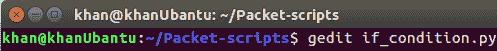

然后键入以下代码：

```
a=44
b=33
if a > b:
    print("a is greater") 
print("End")
```

现在，为了运行这个脚本，我们只需在终端中键入`python3.5 if_condition.py`：

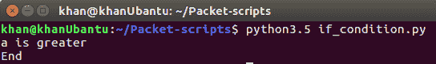

Python`print`方法默认情况下会在要打印的字符串中添加`\n`，使用它我们可以在不同的行中看到两个输出。注意，`if`语句的语法如下：

`if <condition> : and then indented code`

我们是否使用带条件的括号取决于我们。如您所见，条件评估为`True`，因此打印了第`a is greater`行。对于 Python 中的`if`条件，任何计算结果不为零（`0`、`False`、`None`或`empty`的内容都将被视为`True`，执行`if`语句的代码将被执行。

让我们看另一个与`and...or`和`and...not`**逻辑运算符结合使用的`if`条件示例**

 **让我们创建另一个名为`if_detailed.py`的文件，并键入以下代码：


您可能已经注意到，在文件的开头，我们有一条语句，内容为`#! /usr/bin/python3.5`。这意味着我们不必每次执行代码时都输入`python3.5`。它指示代码在每次作为可执行文件执行时使用放置在`/usr/bin/python3.5`的程序来执行它。我们需要更改文件的权限以使其可执行。执行此操作，然后按如下方式执行代码：


产生的结果不言自明。如前所述，任何不计算为`0`、`False`、`None`或`empty`的内容都被视为`True`，并执行`if`块。这解释了为什么前三个`if`条件被评估为`True`并打印了消息，但第四条消息没有打印。从第 19 行开始，我们使用了逻辑运算符。在 Python 中，连接操作由 PosiT8 算子运载，它与 C、C++、java 使用的 java 是相同的。最后，`not`关键字在 Python 中提供否定，就像`!`在其他语言中一样。

需要注意的是，在 Python 中，`null`字节字符由保留关键字`None`表示，这与 Java 或 C#等语言中的`null`相同。

# if…else 条件

`if...else`条件与任何其他语言中的条件几乎相同。如果`if`条件评估为`True`值，则执行`if`下缩进的代码块。否则，将执行在`else`块下缩进的代码块：

```
a=44
b=66
if a > b:
    print("a is Greater") 
else:
    print("B is either Greater or Equal")
print("End")
```

让我们创建一个名为`if_else.py`的文件，看看如何使用它：


同样，这里的输出是不言自明的。在这部分代码中，我们探讨了一些位运算符与`if...else`代码结构的用法。我们还使用了变量，这些变量将使用打印方法打印。`%s`是占位符，并指定`%s`的值应替换为字符串变量，该字符串变量的值将在字符串结束后非实质性地出现。如果我们有多个值要替换，它们可以作为元组传递，例如`%(val1,val2,val3)`：


# if…elif 条件

`if...elif`梯形图在其他编程语言（如 C、C++和 Java）中通称为**if…else if**，在 Python 中具有相同的功能。`if`条件让我们在代码的`else`部分旁边指定一个条件。仅当条件为`true`时，执行条件语句的部分才会执行：

```
a=44
b=66
if a > b:
    print("a is Greater") 
elif b > a:
    print("B is either Greater or Equal")
else:
    print("A and B are equal")
print("End")
```

必须注意，前面代码段中的第三个`else`是可选的。即使我们没有指定，代码也可以正常工作：


让我们创建一个名为`if_el_if.py`的文件，看看如何使用它：

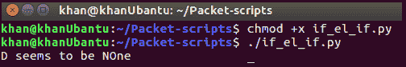

# 循环

**循环**是每种编程语言都具有的实用程序。在循环的帮助下，我们执行本质上重复的任务或语句，如果没有循环，这些任务或语句将占用大量代码行。在某种程度上，这违背了最初拥有编程语言的目的。如果您熟悉 Java、C 或 C++，您可能已经遇到过`while`、`for`和`do...while`循环。Python 基本相同，只是它不支持`do...while`循环。因此，我们将在 Python 的下一节中研究的循环如下：

*   `while`回路
*   `for`回路

# while 循环

请记住，当我们在本书的第一章中讨论列表时，我们提到列表实际上可以在 Python 中保存异构数据类型。列表可以包含整数、字符串、字典、元组，甚至嵌套列表。此功能使列表功能强大，使用起来异常简单直观。让我们来看看下面的例子：

```
my_list=[1,"a",[1,2,3],{"k1":"v1"}]
my_list[0] -> 1
my_List[1] -> "a"
my_list[2] -> [1,2,3]
my_list[2][0] -> 1
my_list[2][2] -> 3
my_list[3] -> {"k1":"v1"}
my_list[3]["k1"] -> "v1"
my_list[3].get("k1") -> "v1
```

让我们在下面的代码的帮助下更仔细地看看{ To0t}循环。我们还将看到如何使用`while`循环迭代列表：

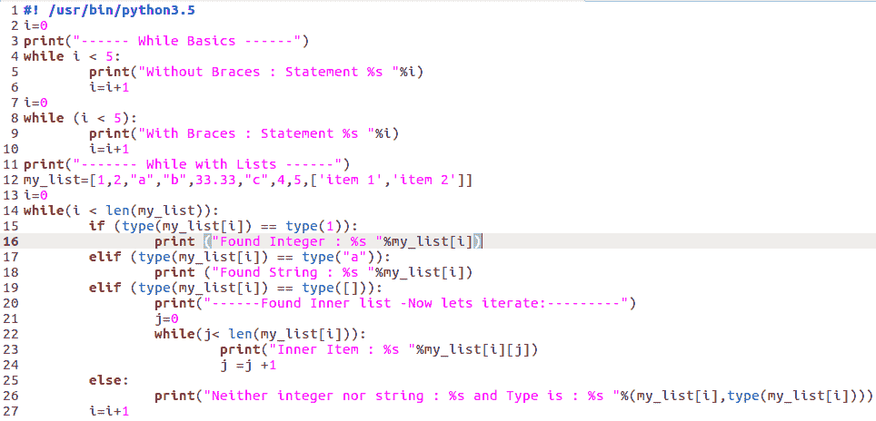

代码的第一部分，第 2 行到第 6 行，描述了`while`循环的一个简单用法，其中我们将打印一条语句五次。请注意，为要执行的循环指定的条件可以使用大括号放置，也可以不使用大括号放置，如第 7 行到第 10 行所示。

在第 12 行中，我们声明了一个包含数字、字符串、浮点和嵌套列表的列表。然后，在从第 14 行开始的最后一个`while`循环中，我们通过将循环控制变量设置为小于列表的长度来迭代列表的元素。在循环中，我们检查列表变量的类型。`if`类型（`1`返回整数类，`a`类型返回字符串类，`[]`类型返回列表类。当类型为列表时，我们在嵌套的`while`循环中再次迭代它的元素，并打印每个元素，如第 19 到 24 行所示：

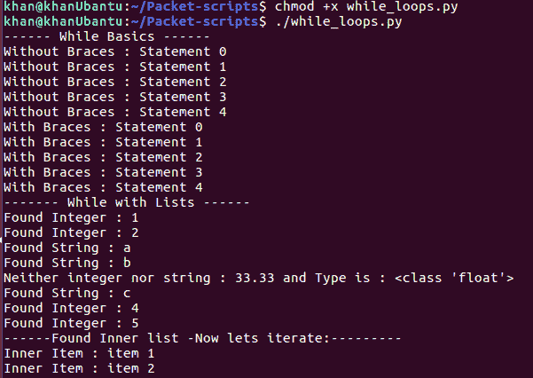

# for 循环

`for`循环在 Python 中使用非常广泛，每当我们必须迭代不可更改的列表时，它都是默认的选择。在向前移动之前，让我们更仔细地看一下 Pothon 中的术语 Ty2 Type 迭代 Ty3t，AuthT4 迭代的 Ty5 T5，和 Apple T6-迭代器 Ty7。

# 迭代、iterable 和迭代器

**迭代**：迭代是一个过程，其中一组指令或结构按顺序重复指定次数或直到满足条件。每次循环体执行时，都会完成一次迭代。

**Iterable**：Iterable 是具有`__iter__`方法的对象，该方法返回迭代器。迭代器是任何包含可以迭代的元素序列的对象，然后可以执行操作。Python 字符串、列表、元组、字典和集合都是 ITerable，因为它们实现了`__iter__`方法。查看以下代码段以查看示例：

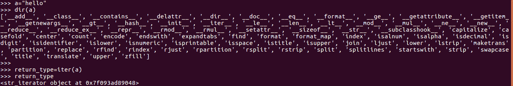

在前面的代码片段中，我们声明了一个字符串`a`并将值`hello`放入其中。要查看 Python 中任何对象的所有内置方法，我们可以使用`dir(<object>)`方法。对于字符串，这将返回可以对字符串类型执行的所有操作和方法。在第二行中，第五个操作是我们前面提到的`iter`方法。可以看出，`iter(a)`返回一个字符串迭代器：

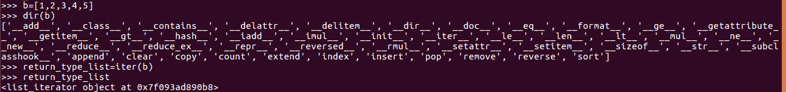

类似地，列表对象的`iter`方法将返回一个列表迭代器，如前所示。

**迭代器**：迭代器是具有`__next__`方法的对象。下一个方法总是返回调用原始`iter()`方法的序列的`next`元素，从索引 0 开始。这显示在以下代码段中：


从 string 和 list 的示例中可以看出，迭代器上的`next`方法将始终返回序列中的`next`元素或我们正在迭代的对象。必须注意的是，迭代器只向前移动，如果我们想要`iter_a`或`list_itr`返回任何元素，我们必须将迭代器重新初始化为原始对象或序列：


# 更详细地了解循环

Python 中的`for`循环超过了其他编程语言中`for`循环的能力。当调用字符串、元组、列表、集合或字典等可重用数据时，`for`循环在内部调用`iter`以获取迭代器。然后，它在该迭代器上调用`next`方法以获取 iterable 中的实际元素。然后它反复调用 next，直到引发一个`StopIteration`异常，它将在内部处理该异常并使我们脱离循环。`for`循环的语法如下所示：

```
for var in iterable:
    statement 1
    statement 2
    statement n
```

让我们创建一个名为`for_loops.py`的文件，它将解释`for`循环的基本用法：

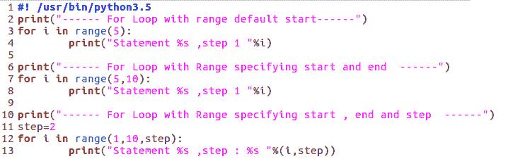

在前面的示例中，我们使用了 Python 范围函数/方法，这有助于我们实现我们在其他编程语言（如 C、C++或 Java）中学习的传统`for`循环。这可能类似于`for i =0 ;i < 5 ;i ++`。Python 中的 range 函数接受一个强制参数和两个默认参数。强制参数指定迭代的限制，并从索引`0`开始返回数字，直到达到限制，如代码第 3 行和第 4 行所示。当使用两个参数调用时，第一个作为范围的起点，最后一个作为终点，如代码第 7 行和第 8 行所示。最后，当使用三个参数调用`range`函数时，第三个参数作为步长，默认情况下等于一。以下输出以及示例代码的第 12 行和第 13 行对此进行了描述：


让我们看一下另一个例子，我们将使用它来遍历 python 定义的所有迭代。这将使我们能够探索`for`循环的真正威力。让我们创建一个名为`for_loops_ad.py`的文件：

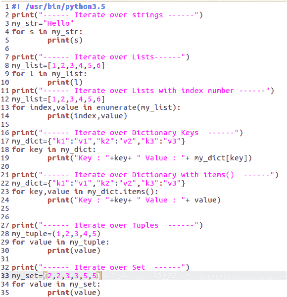

前面，我们看到了如何从列表、字符串和元组中读取值。在前面的示例中，我们使用`for`循环枚举字符串、列表和字典。我们之前了解到，`for`循环实际上调用了 iterables 的`iter`方法，然后为每次迭代调用`next`方法。如下例所示：

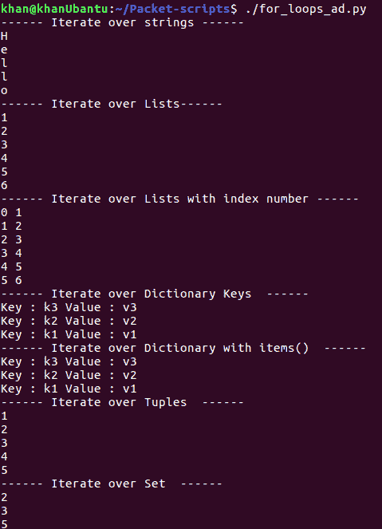

当我们使用`for`循环迭代 Python 字典时，默认情况下，字典键返回给我们。当我们在字典上使用`.items()`时，每次迭代它时，它都会返回一个元组，键位于元组的第 0<sup>个</sup>索引处，值位于第一个索引处。

# Python 中的函数和方法

函数和方法用于设计或生成可在脚本或其他脚本的整个过程中重用的逻辑代码单元。函数实际上构成了代码重用的基础，并为代码结构带来了模块化。它们使代码保持干净，易于修改。

建议始终尝试将逻辑分解为小的代码单元，每个代码单元都是一个函数。我们应该尽可能地在代码行方面保持方法的小规模。

以下代码表示 Python 中定义方法的基本语法：

```
def print_message(message):
    print(message)
    statement 2
    statement 
```

Python 方法在定义中没有返回类型，如 C、C++或 java 中所见的，如 AutoT0T、OutT1、Ont2、To 等。Python 方法可能返回值，也可能不返回值，但我们不需要显式地指定该值。方法在 Python 中非常强大和灵活。

需要注意的是，每个 Python 脚本的默认名称都是`main`，它被放在一个全局变量中，该变量在整个 Python 上下文中都可以访问，称为`__name__`。我们将在下面的示例中使用这个。

让我们探讨一下使用`method_basics.py`脚本调用方法的各种方式：


现在，让我们将其分解为更小的部分，并尝试了解发生了什么：

*   `print_msg1()`：这是一个基本的方法，只需在控制台上打印一个字符串。它在第 2 行定义，在第 19 行调用。
*   `print_msg2()`：这是一种在变量消息中获取参数，然后在屏幕上打印该变量值的方法。请记住，Python 变量不需要指定类型，因此我们可以将任何数据传递给`message`变量。这是一个采用单个参数的方法的 Pythonic 示例。请记住，参数的类型是 Python 对象，它可以接受传递给它的任何值。可以在以下屏幕截图中看到输出：

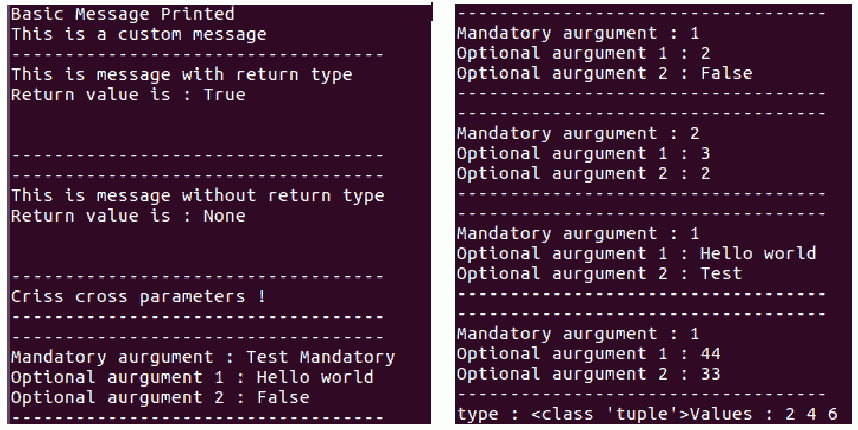

*   `print_msg3()`：这是一个接受两个参数的 Python 方法。这与我们之前看到的`print_msg2()`方法类似。区别在于它有时可能返回一个值。它的调用方式也不同。请注意，在第 22 行中，我们通过将第二个参数传递为`True`来调用此方法。这意味着它有一个返回值`True`，但我们不会在第 26 行中以`True`作为第二个参数调用它，因此它不会返回任何内容。为此，我们在屏幕上打印出了 Ty5 T5。在其他编程语言中，如 C、C++、java 等，调用该方法时的参数顺序非常重要。这是因为我们传递参数的序列应该与传递给方法的序列相同。但是，在 Python 中，我们可以在调用过程中调用方法并传递命名参数。这意味着顺序或序列无关紧要，只要名称与方法参数的名称匹配即可。第 29 行描述了这一点，其中我们将消息作为第二个参数传递，即使它是方法定义中的第一个参数。如输出中所示，这工作得非常好。
*   `print_msg4()`：这是我们熟悉 Python 默认参数的地方，以及它们如何与方法一起使用。默认参数是在声明方法时指定默认值的变量。如果调用者传递此参数或变量的值，则调用者传递的值将覆盖默认值。如果在调用过程中没有为默认参数传递任何值，那么该变量将保持其初始化到的默认值。`print_msg4()`方法有一个强制参数`m`和两个可选参数`op1`和`op2`。
*   `print_msg4('Test Mandatory')`：在第 31 行调用。这表示应为强制参数传递`Test mandatory`字符串，其他两个`op1`和`op2`变量将初始化为默认值，如输出中所示。
*   `print_msg4(1,2)`：在第 32 行调用。这表示强制参数应传递一个带`value=1`的整数，而`op1`应传递另一个带`value=2`的整数。因此，`op1`将覆盖默认值。`op2`将保留默认值，因为未传递任何值。
*   `print_msg4(2,3,2)`：在第 33 行调用。这表示强制参数应传递一个带`value=2`的整数，而`op1 `应传递另一个带`value=3`的整数，因此会覆盖`op1`和`op2`的默认值。
*   `print_msg4(1,op2='Test')`：在第 34 行调用。强制参数接收带`value=1`的整数。对于第二个参数，我们在调用过程中指定了一个命名参数，因此序列对于`Test`并不重要，它将被复制到调用方的`op2`。
*   `print_msg4(1,op2=33,op1=44)`：在第 35 行调用。强制参数接收到`value=1`。对于第二个参数，我们指定一个命名参数`op2`，对于第三个参数，我们传递`op1`。同样，我们可以在输出中看到序列并不重要。
*   `print_msg5()`：通常，在其他编程语言中，函数或方法总是可以返回一个值。如果需要返回多个值，则必须将这些值放入数组或其他结构中，然后返回它们。Python 抽象地为我们处理这种情况。如果阅读代码，您可能会认为该方法返回多个值，而实际上它返回的是一个元组，每个值乘以两。这可以从输出中进行验证。

现在，让我们使用下面的示例`methods_adv.py`，探索传递参数的一些进一步的方法和途径。下面的代码片段表示 Python 中的变量参数类型方法。从输出可以验证，`method_1`将任何大小的正常序列作为输入，这意味着我们可以将任意数量的参数传递给该方法。当使用前面带有`*`符号的参数声明该方法时，所有传递的参数都将转换为一个序列，并在`args`中放置一个元组对象。另一方面，当调用方法时将`*`与参数一起使用时，序列中的参数类型会发生变化，并且内部每个元素`if`序列会作为单个参数传递给调用方，如`method_1_rev`所示。

此外，当`if`与方法声明中的一个参数一起使用时，它会在内部将所有 maned 参数转换为 Python 字典，其中键作为名称，值与`=`操作符后面的值相同。这可以在`method_2`中看到。最后，当`**`与调用者参数一起使用时，该参数在内部从 Python 字典转换为命名参数。可通过`method_2_rev`进行验证：


# 模块和包

每个 Python 脚本都称为一个模块。Python 的设计考虑到了可重用性和代码的易用性。因此，我们创建的每个 Python 文件都成为 Python 模块，并且可以在任何其他文件或脚本中调用或使用。您可能已经在 Java 中学习了如何导入类并将它们与其他类一起重用。这里的想法基本相同，只是我们将整个文件作为一个模块导入，并且可以重用导入文件的任何方法、类或变量。让我们来看一个例子。我们将创建两个文件`child.py`和`parent.py`，并在每个文件中放入以下代码，如下所示：


前五行属于`child.py`，后八行属于`parent.py`。我们将运行父级，如输出中所示。需要注意的是，导入的文件可以有一个别名。在我们的例子中，我们导入了子文件并给它别名 C。最后，我们从父 Python 脚本调用了该模块的`child_method()`类。

现在让我们尝试探索 Python 包以及如何使用它们。在 Java 中，包只是一个文件夹或目录，用于收集 Java 中逻辑连接的类文件。包在 Python 中也做同样的事情；它们收集逻辑连接的 Python 模块。始终建议使用包，因为这样可以保持代码干净，并使其可重用和模块化。

如前所述，Python 包是一个普通目录。唯一的区别是，为了使普通目录像 Python 包一样工作，我们必须在目录中放置一个空的`__init__.py`文件。这向 Python 指示它应该使用哪些目录作为包。让我们继续创建一个名为`shapes`的包。我们将在其中放置一个名为`__init__.py`的空 Python 文件和另一个名为`area_finder.py`的文件：

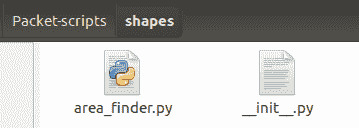

现在让我们将以下代码放入`area_finder.py`文件中。我们还要创建另一个名为`invoker.py`的文件，并将其**放置在我们创建的 shapes**文件夹之外。调用程序的代码在下图右侧给出，`area_finder`的代码在左侧给出：

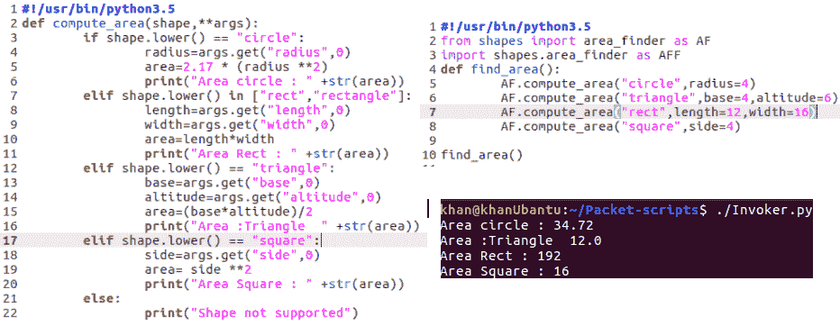

前面的代码是如何在 Python 中使用包的简单示例。我们创建了一个名为`shapes`的包，并在其中放置了一个名为`area_finder`的文件，该文件将计算形状的面积。然后，我们继续在`shapes`文件夹外创建一个名为`invoker.py`的文件，并以多种方式从包中导入`area_finder`脚本（用于演示）。最后，我们使用其中一个别名调用`find_area()`方法。

# 生成器和理解

**生成器**是 Python 中一种特殊的迭代器。换句话说，Python 生成器是一个函数，它通过发出`yield`命令返回生成器迭代器，可以对其进行迭代。在某些情况下，我们可能希望一个方法或函数返回一系列值，而不仅仅是一个值。例如，我们可能希望我们的方法部分执行任务，将部分结果返回给调用方，然后从返回最后一个值的位置重新开始工作。通常，当一个方法终止或返回一个值时，它的执行从头开始。这就是生成器试图解决的问题。生成器方法向调用方返回一个值和一个控件，然后从停止的位置继续执行。生成器方法是带有 yield 语句的普通 Python 方法。以下代码片段`generators.py`解释了如何使用生成器：


请注意，因为`genMethod`中有一个收益率语句，所以它变成了一个生成器。每次执行 yield 语句时，“a”的值都会返回给调用方和控件（请记住，生成器返回一系列值）。每次对 generator 方法进行`next()`调用时，它都会从之前停止的位置恢复执行

我们知道，每次执行一个 yield 时，generator 方法都返回一个 generator 迭代器。因此，与任何迭代器一样，我们可以使用`for`循环来迭代生成器方法。此`for`循环将继续，直到达到方法中的屈服操作。与`for`循环相同的示例如下所示：


您可能想知道，当列表可以获得相同的结果时，为什么我们要使用生成器。生成器非常节省内存和空间。如果生成值需要大量处理，那么使用生成器是有意义的，因为这样我们只能根据需求生成值。

生成器表达式是可以生成生成器对象的单行表达式，可以对其进行迭代。这意味着可以在内存和处理方面实现相同的优化。以下代码段显示了如何使用生成器表达式：


# 理解

**Python 理解**，通常称为**列表理解**，是一个非常强大的 Python 实用工具，如果我们需要对列表的所有或部分元素执行一些操作，它会派上用场。列表理解将返回一个应用了修改的新列表。假设我们有一个数字列表，我们想将列表中的每个数字平方。

让我们来看看两个不同的方法来解决这个问题：


左边的代码片段是一种更为传统的方法，用了九行。使用理解的代码只花了我们三行。列表理解在方括号内声明，它对列表的每个元素执行任何操作。然后它返回一个带有修改的新列表。让我们来看看另一个理解的例子。这一次，我们将使用一个`if`条件（称为理解过滤器）和包含理解的嵌套循环。我们将文件命名为`list_comp_adv.py`并输入以下代码：

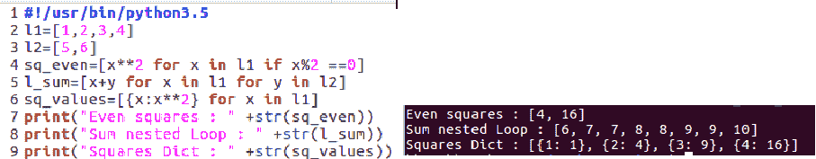

前面的代码片段是不言自明的。它向我们展示了如何在理解中使用`if`条件（第 4 行）。它还向我们展示了如何使用嵌套循环来添加两个列表（第 5 行）。最后，它向我们展示了如何使用理解词典（第 6 行）。

# 映射、Lambda、zip 和过滤器

在本节中，我们将了解一些非常方便的 Python 函数。这些允许我们对 Python 可重用文件（如列表）执行快速处理操作。

*   `Map()`：如前所述，当我们必须对列表中的所有或部分元素执行操作时，列表理解非常方便。同样可以通过`map`功能实现。这需要两个参数，第一个是对列表元素执行操作的函数，第二个是列表本身。下面的示例`map_usage.py`演示了这一点：


*   `Lambda()`：Lambda 函数是小型但功能强大的内嵌函数，可用于数据操作。它们对于小型操作非常有用，因为实现它们只需要很少的代码。让我们再次看同一个示例，但这次我们将使用 Lambda 函数代替普通 Python 函数：


*   `Zip()`：`zip`方法获取两个列表或 iterable，并跨多个 iterable 聚合元素。最后，它返回一个包含聚合的元组迭代器。让我们使用一个简单的代码`zip_.py`来演示此功能：

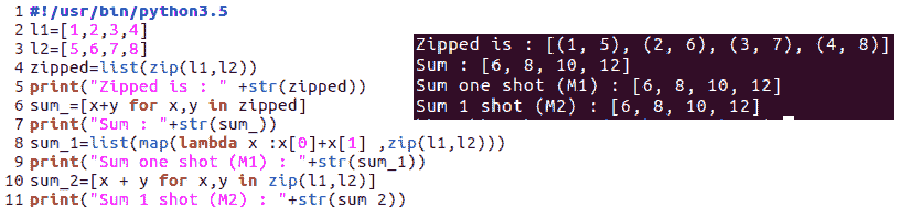

*   `Filter()`：`filter`方法用于过滤列表中针对特定条件返回 true 的元素。`filter`方法有两个参数，第一个是返回特定元素`true`或`false`的方法或 Lambda 函数，第二个是该元素所属的列表或 iterable。它返回一个列表，其中包含条件评估为`true`的元素。让我们创建一个名为`filter_usage.py`的文件，并添加以下内容：

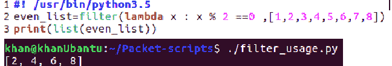

# 总结

在本章中，我们讨论了一些条件、循环、方法、迭代器、包、生成器和理解。所有这些都在 Python 中广泛使用。我们讨论这些主题的原因是，当我们稍后进入自动化渗透测试和网络安全测试用例时，我们将看到这些概念在我们的代码文件中广泛使用。在下一章中，我们将探讨 Python 的面向对象特性。我们将探讨如何在 Python 中处理 XML、CSV 和 JSON 数据。我们还将阅读有关文件、IO 和正则表达式的内容。

# 问题

1.  请说出使用生成器的真实用例。
2.  我们可以将函数名存储在变量中，然后通过变量调用它吗？
3.  我们可以在变量中存储模块名吗？

# 进一步阅读

*   生成器和理解：[http://jpt-pynotes.readthedocs.io/en/latest/generators-comprehensions.html](http://jpt-pynotes.readthedocs.io/en/latest/generators-comprehensions.html)
*   模块：[https://docs.python.org/3/tutorial/modules.html](https://docs.python.org/3/tutorial/modules.html)**