# 五、Python 漏洞扫描器——第一部分

当我们谈到端口扫描时，会自动想到的工具是 Nmap。Nmap 有着良好的声誉，它可以说是最好的开源端口扫描器。它具有大量功能，允许您在网络上执行各种扫描，以发现哪些主机处于活动状态，哪些端口处于打开状态，以及主机上运行哪些服务和服务版本。它还有一个引擎（Nmap 扫描引擎），可以扫描 NSE 脚本，用于发现运行服务的常见漏洞。在本章中，我们将使用 Python 来自动化端口扫描过程。本章将构成我们的自动漏洞扫描器的基础，并将补充下一章，该章将侧重于自动化服务扫描和枚举。

本章涵盖以下主题：

*   介绍 Nmap
*   用 Python 构建网络扫描器

# 介绍 Nmap

我们的端口扫描仪将在 Nmap 的基础上制造，具有额外的功能和能力，例如并行端口扫描目标，暂停和恢复扫描。它还将有一个 web GUI，我们可以使用它进行扫描。

让我们看一下 NMAP 的各种性质：

*   以下屏幕截图显示了 Nmap 可用的不同扫描技术：

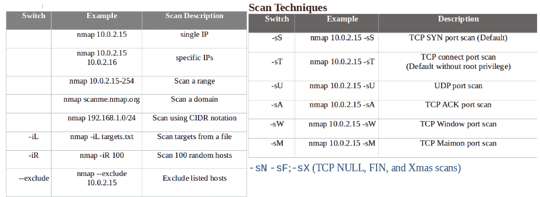

*   以下屏幕截图显示了主机发现和端口规范，以及一些示例：


*   以下屏幕截图显示了服务和版本检测、操作系统检测以及一些示例：

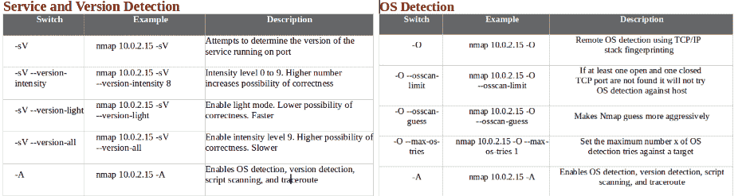

*   以下屏幕截图显示了计时和性能，以及一些示例：

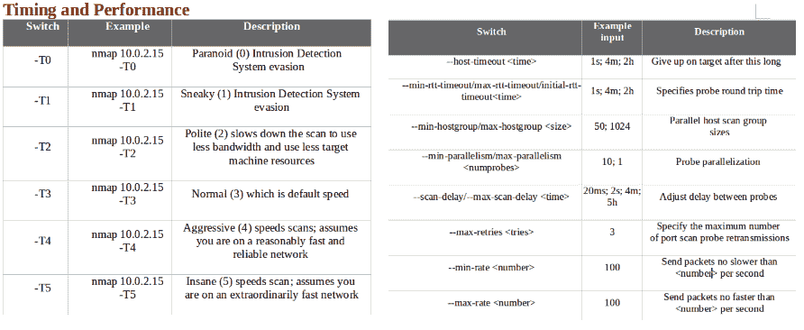

*   以下屏幕截图显示了 NSE 脚本以及一些示例：

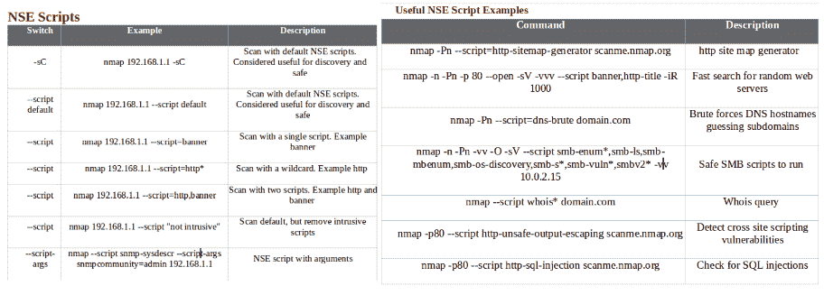

*   以下屏幕截图显示了防火墙/IDS 规避和欺骗，以及一些示例：


*   以下屏幕截图显示了一些有用的 Nmap 输出示例：

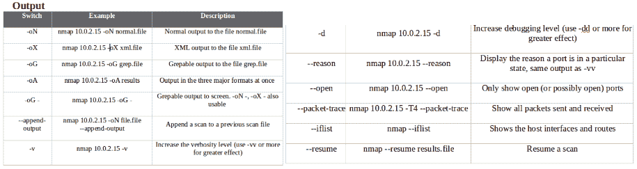

前面的屏幕截图提供了我们在日常操作中经常使用的 Nmap 命令的综合列表。我们将不讨论如何在终端上运行 Nmap 命令，因为假定这是简单的。

应该注意的是，从现在起，我们将使用 Kali Linux 作为我们的笔测试实验室操作系统。因此，我们将看到的所有 Python 自动化都将在 Kali Linux 机器上实现。要安装 Kali Linux VM/VirtualBox 映像，请参阅[https://www.osboxes.org/Kali-linux/](https://www.osboxes.org/Kali-linux/) 。要下载 VirtualBox，请参阅[https://www.virtualbox.org/wiki/Downloads](https://www.virtualbox.org/wiki/Downloads) 。下载后，执行以下屏幕截图中所示的步骤。

首先，输入新虚拟机的名称以及类型和版本；在我们的例子中，这是 Linux 和 Debian（64 位）。之后，分配内存大小：


接下来，选择虚拟硬盘文件，如以下屏幕截图所示：


# 用 Python 构建网络扫描器

现在，我们都已经设置好 VirtualBox 映像，让我们看一看一个简单的 Python 脚本，它将帮助我们调用 Nmap 并启动扫描。稍后，我们将优化此脚本以使其更好。最后，我们将使其成为一个具有暂停、恢复和多处理功能的成熟的端口扫描 Python 引擎：

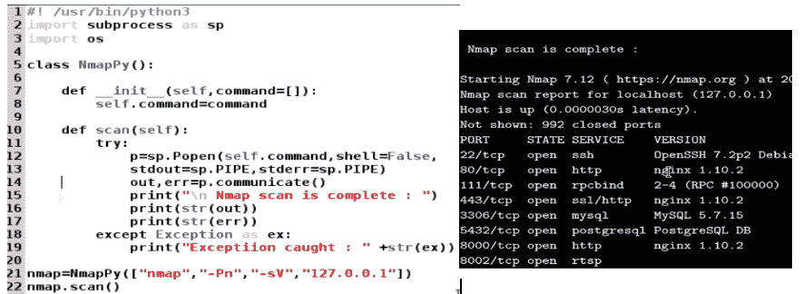

前面的脚本生成的信息很难让 Python 代码过滤和存储。如果我们想将所有打开的端口和服务存储在一个字典中，那么使用前面的方法很难做到这一点。让我们考虑一下脚本可以解析和处理生成的信息的另一种方式。我们知道，`oX`标志用于生成 XML 格式的输出。我们将使用`oX`标志将 XML 字符串转换为 Python 字典，如下部分所示。

# 使用脚本控制 Nmap 输出

在下面的示例中，我们重用了前面研究过的相同概念。我们将 XML 格式的 Nmap 输出重定向到屏幕。然后，我们收集作为字符串生成的输出，并使用`import xml.Etree.elementTree`Python 模块作为`ET`，以便将 XML 输出转换为 Python 字典。使用以下代码，我们可以使用我们的程序控制 Nmap 并过滤掉所有有用的信息：

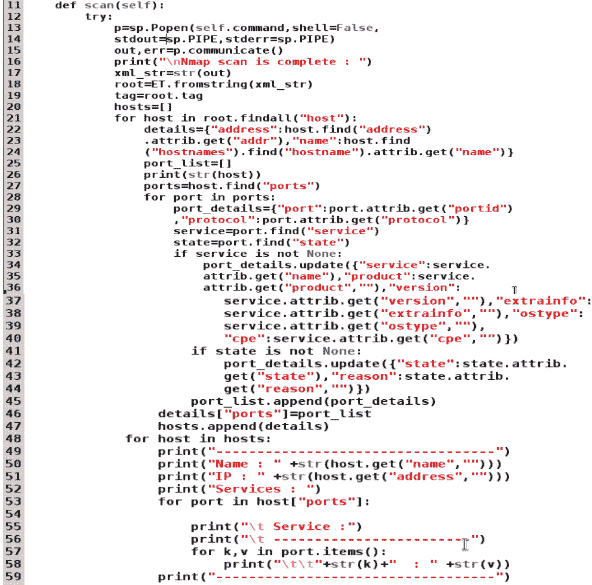

然后，我们可以将该信息存储在数据库表中：

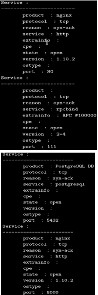

接下来，运行以下命令：

```
Nmap=NmapPy(["Nmap","-Pn","-sV","-oX","-","127.0.0.1"])
Nmap.scan()
```

尽管前面的方法很好，并为我们提供了对 Nmap 输出的细粒度控制，但它涉及到处理和解析代码，我们可能不希望每次使用 Nmap 进行扫描时都编写这些代码。另一种更好的方法是使用 Python 内置的 Nmap 包装器模块。我们可以使用`pip install`安装 Python 的 Nmap 模块，它的功能与我们之前所做的几乎相同，但允许我们避免编写所有处理和子处理逻辑。它保持了代码的干净性和可读性。每当我们希望有更多的粒度控制时，我们总是可以回到前面的方法。

# 使用 Nmap 模块进行 Nmap 端口扫描

现在让我们继续安装 Python Nmap 模块，如下所示：

```
pip install Nmap
```

前面的命令将安装`Nmap`实用程序。以下部分概述了如何使用该库：

```
import Nmap # import Nmap.py module
 Nmap_obj = Nmap.PortScanner() # instantiate Nmap.PortScanner object
 Nmap_obj.scan('192.168.0.143', '1-1024') # scan host 192.1680.143, ports from 1-1024
 Nmap_obj.command_line() # get command line used for the scan : Nmap -oX - -p 1-1024 192.1680.143
 Nmap_obj.scaninfo() # get Nmap scan informations {'tcp': {'services': '1-1024', 'method': 'connect'}}
 Nmap_obj.all_hosts() # get all hosts that were scanned
 Nmap_obj['192.1680.143'].hostname() # get one hostname for host 192.1680.143, usualy the user record
 Nmap_obj['192.1680.143'].hostnames() # get list of hostnames for host 192.1680.143 as a list of dict
 # [{'name':'hostname1', 'type':'PTR'}, {'name':'hostname2', 'type':'user'}]
 Nmap_obj['192.1680.143'].hostname() # get hostname for host 192.1680.143
 Nmap_obj['192.1680.143'].state() # get state of host 192.1680.143 (up|down|unknown|skipped)
 Nmap_obj['192.1680.143'].all_protocols() # get all scanned protocols ['tcp', 'udp'] in (ip|tcp|udp|sctp)
 Nmap_obj['192.1680.143']['tcp'].keys() # get all ports for tcp protocol
 Nmap_obj['192.1680.143'].all_tcp() # get all ports for tcp protocol (sorted version)
 Nmap_obj['192.1680.143'].all_udp() # get all ports for udp protocol (sorted version)
 Nmap_obj['192.1680.143'].all_ip() # get all ports for ip protocol (sorted version)
 Nmap_obj['192.1680.143'].all_sctp() # get all ports for sctp protocol (sorted version)
 Nmap_obj['192.1680.143'].has_tcp(22) # is there any information for port 22/tcp on host 192.1680.143
 Nmap_obj['192.1680.143']['tcp'][22] # get infos about port 22 in tcp on host 192.1680.143
 Nmap_obj['192.1680.143'].tcp(22) # get infos about port 22 in tcp on host 192.1680.143
 Nmap_obj['192.1680.143']['tcp'][22]['state'] # get state of port 22/tcp on host 192.1680.143
```

这为 Alexandre Norman 编写的优秀实用程序提供了一个快速的开始。有关此模块的更多详细信息，请参见[https://pypi.org/project/python-Nmap/](https://pypi.org/project/python-nmap/) 。我们将使用相同的模块，以便使用 Nmap 进行并行端口扫描，并具有暂停和恢复扫描的附加功能。

# 目标和架构概述

在我们深入到细粒度代码细节之前，了解我们在做什么以及为什么要这样做是很重要的。默认情况下，Nmap 非常强大，具有大量功能。在使用 OS 工具的典型网络笔测试中，采用的方法是使用 Nmap 进行端口扫描，以获得打开的端口、正在运行的服务和服务版本。根据端口扫描结果，测试人员通常使用各种服务扫描脚本获取服务版本和相关的 CVE ID（如果有），然后，基于这些，测试人员可以使用 Metasploit 来利用漏洞。对于服务扫描，测试人员使用各种开放源代码技术，如 NSE、Ruby、Python、Java、bash 脚本，或使用 Metasploit、w3af、nikto、Wireshark 等工具。整个循环形成了一个每次都需要遵循的过程，但它是非常分解的。我们试图在这里介绍的想法是，在下一节中，我们将协调笔测试人员需要执行的所有活动，并在 Python 的帮助下实现所有这些活动的自动化，这样所有需要运行的工具和脚本都可以预配置并一次性运行。我们不仅在编排和自动化活动，而且还在优化代码，以利用多处理和多线程来减少扫描时间。

代码的体系结构可分为以下几部分：

*   端口扫描（服务/端口发现）
*   服务扫描

# 端口扫描

端口扫描部分指的是我们将如何在 Python 代码中实现它。其思想是结合使用线程和多处理。如果我们想扫描 10 台主机，我们会将其分为 5 批。每个批次有两台主机（批次大小可以根据您实验室机器的 RAM 和处理器能力而增加）。对于四核处理器和 2GB RAM，批大小应为 2。在任何时候，我们都将处理一个批，并为每个主机分配一个线程。因此，两个线程将并行运行以扫描两台主机。一旦主机专用于某个线程，该线程将为该主机选择要扫描的端口范围（假设该端口范围在 1 到 65535 之间）。与其顺序扫描端口，逻辑是将整个范围分成三个块，每个块的大小为 21845。现在，对单个主机的三个块进行并行扫描。如果处理器内核的数量更高，则块大小可以增加。对于四核处理器和 2 GB RAM，建议使用三个块：


总之，主机被分为批大小为 2 的批，并专用于单个主机。进一步的端口被分为多个块，多处理过程专门用于扫描每个块，以便并行进行端口扫描。因此，在任何时候，端口扫描活动都将运行两个线程和六个进程。如果用户想暂停扫描，可以在终端窗口使用*Ctrl*+*C*暂停。当他们重新运行代码时，系统会提示他们选择启动新扫描或恢复先前暂停的扫描。

# 服务扫描

端口扫描活动结束后，我们将所有结果保存在 MySQL 数据库表中。根据发现的服务，我们有一个配置的脚本列表，如果找到特定的服务，我们需要执行这些脚本。我们使用一个 JSON 文件来映射服务和要执行的相应脚本。用户将收到端口扫描结果的提示，并可以根据需要重新配置或更改结果，以减少误报。一旦设置了最终配置，就开始服务扫描。我们从数据库中一次选择一个主机，根据发现的服务，从 JSON 文件中读取适当的脚本，为这个特定的主机执行这些脚本，并将结果保存在数据库中。这将一直持续到扫描所有主机的服务为止。最后，生成一个 HTML 报告，其中包含格式化的结果和要附加到**概念证明（POC）**报告的屏幕截图。

以下是服务扫描的体系结构图：

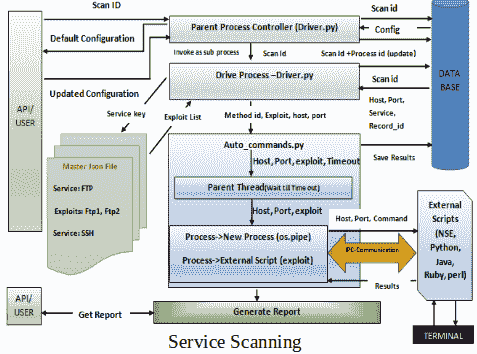

以下屏幕截图描述了如何配置 JSON 文件以执行脚本：

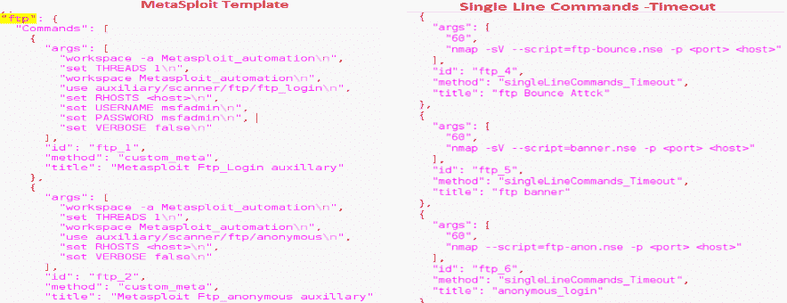

正如前面的屏幕截图所示，JSON 文件中有各种类型的命令。Metasploit 模板显示了用于执行 Metasploit 模块的命令。单行命令用于执行 NSE 脚本和所有非交互式模块或脚本。其他类别包括`interactive_commands`和`single_line_sniffing`，我们需要在执行脚本的同时嗅探流量。JSON 文件的通用模板如下所示：

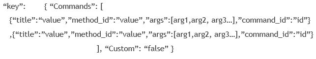

密钥是服务的名称。标题包含文件描述。`method_id`是实际的 Python 方法，应该调用它来调用要执行的外部脚本。请注意，对于单行命令，我们还指定一个超时参数（以秒为单位）作为`args`参数下的第一个参数。

# 仔细看一下代码

让我们看一下基本文件和方法的概述，我们将使用 Python 来构建网络扫描器：

*   `Driver_main_class.py`：这是 Python 类、文件或模块，提示用户输入项目名称、要扫描的 IP 地址、要扫描的端口范围、要使用的扫描开关和扫描类型等信息。
*   `main_class_based_backup.py`：这是 Python 类、文件或模块，它包含我们前面讨论的端口扫描的所有主要逻辑。它接受来自`Driver_main_class.py`的输入，并将输入存储在数据库中。最后，它使用线程和多处理在目标上开始端口扫描。
*   `Driver_scanner.py`：端口扫描结束后，下一步是进行服务扫描，该 Python 类调用另一个类`driver_meta.py`，该类取要进行服务扫描的项目名称或 ID。
*   `driver_meta.py`：此类显示端口扫描的默认结果，并提供给用户在需要时重新配置结果的选项。在重新配置之后，该类从当前项目的数据库表中读取要进行服务扫描的主机。然后，对于每个主机，它读取 JSON 文件以获取要执行的命令，对于要执行的每个命令，它将控制传递给另一个文件`auto_comamnds.py`。
*   `auto_commands.py`：该文件接受`driver_meta.py`中的参数，并调用外部技术，如 NSE、Ruby、Python、Java、bash 脚本，或 Metasploit、Wireshark 和 Nikto 等工具。然后，它们用于对所选服务、主机和端口执行服务扫描。命令执行结束后，将结果返回`driver_meta.py`保存在数据库中。
*   `IPtable.py`：在数据库表中存储端口扫描结果的类。它表示漏洞扫描器的数据层。
*   `IPexploits.py`：在数据库表中存储服务扫描结果的类。它还表示漏洞扫描器的数据层。

# 开始

整个代码库可以在以下 GitHub 存储库中找到。主页上指定了安装说明。我们将看一看代码的各个部分，以及那些具有实现扫描器的核心逻辑的文件。您可以从存储库下载代码，并按照执行部分中的指定执行它。或者，我已经创建了一个即插即用的 Kali-VM 映像，它已经获得了所有必备的安装和开箱即用的代码库。这可以从 URL[<下载并执行，无需麻烦 https://drive.google.com/file/d/1e0Wwc1r_7XtL0uCLJXeLstMgJR68wNLF/view?usp=sharing >](http://%3Chttps://drive.google.com/file/d/1e0Wwc1r_7XtL0uCLJXeLstMgJR68wNLF/view?usp=sharing%3E)。默认用户名为：`PTO_root`，密码为：`PTO_root`

如前所述，我们将讨论代码的中心逻辑，它由以下代码片段表示：

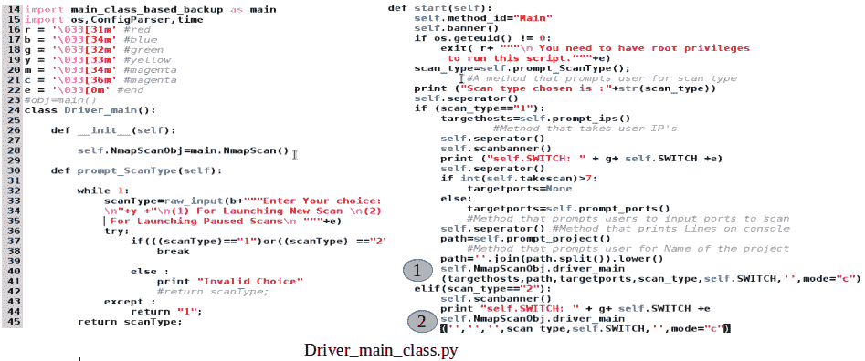

整个类可以在 URL[<找到 https://github.com/FurqanKhan1/Dictator/blob/master/Dictator_service/Driver_main_class.py >](http://%3Chttps://github.com/FurqanKhan1/Dictator/blob/master/Dictator_service/Driver_main_class.py%3E)代表`Driver_main_class.py`。类的构造函数为在`main_class_based_backup.py`中找到的`NmapScan`类声明一个对象。突出显示为**（1）**和**（2）**的行是收集所有输入后触发实际逻辑的位置，包括项目名称、IP、端口范围、扫描开关和扫描类型。扫描类型 1 表示新扫描，而扫描类型 2 表示恢复先前暂停的现有扫描。`self.scanbanner()`方法提示用户输入用户希望使用的 Nmap 扫描开关。日常扫描中最常用的开关类型有七种。以下屏幕截图显示配置了扫描开关的配置文件`Nmap.cfg`：


下面的代码片段表示`main_class_based_backup.py`类的流程：

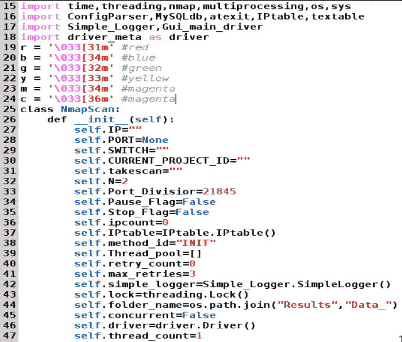

此屏幕截图表示主`NmapScan`类。类的构造函数包含各种变量，我们将在类的整个执行流中使用这些变量。如前所述，`IPtable`是一个 python 类，用于将数据推送到后端数据库中。数据库的结构将在`db_structure`部分讨论。现在，我们应该理解，通过使用 MySQLdb connector/Python 模块，我们将通过`IPtable`类在后端表中推送所有端口扫描细节。此外，`textable`是一个 Python 模块，用于在终端窗口上绘制表来表示数据。`Simple_Logger`是一个 Python 模块，需要将调试和错误消息记录在文件中。

正如我们前面看到的，当我们查看`Driver_main_class.py`时，实际的执行流程从`NmapScan`类的`driver_main`方法开始（在`Driver_main_class.py`类的**（1）**和**（2）**代码片段中突出显示）。以下屏幕截图更详细地显示了此方法：


前面的代码片段很简单。该方法从调用方接收所有参数。我们将扫描的开始时间保存在一个名为 start 的变量中。突出显示的代码段**（1）**调用同一类的另一个`main`方法，并将所有接收到的参数传递给它。这是启动所有主机的端口扫描的方法。一旦调用的`self.main`方法完成其执行，如代码片段（2）所示，我们需要检查是否所有主机都已成功扫描。这可以从反手表中推断出来，反手表为所有正在扫描的主机维护一个`status_code`，由当前项目 ID 引用。如果主机扫描成功，状态将为“完成”，否则将为“正在处理”或“未完成”。如果当前项目未处于暂停状态，并且仍有一些主机的状态为“未完成”或“正在处理”，则我们需要再次处理这些主机，代码段（3）突出显示了这一点。如果所有主机的处理状态都已完成，我们将最终项目状态更新为完成，如`self.IPtable.clearLogs`方法所指定。最后，我们以秒为单位显示执行时间。在下一个代码片段中，我们将看一看`NmapScan`类的主要方法，它使事情运行：

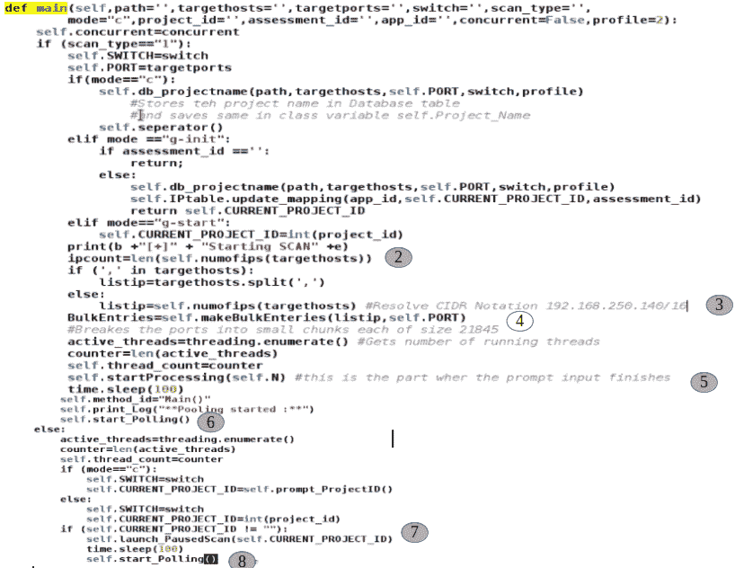

`main`方法从检查`scan_type`开始。必须注意，`scan_type ="1"`表示新扫描，`scan_type="2"`表示恢复先前暂停的扫描。该代码还检查扫描模式。注意，c 代表命令行模式。我们正在制作的漏洞扫描器在 GUI 模式（我们将在后面讨论）和命令行模式下运行。我们现在可以忽略`g-init`和`g-start`模式。

在第 6 行中，代码将当前项目名称存储在后端数据库中。代码的逻辑由`self.db_projectname`方法处理。该方法获取项目名称，将其存储在数据库表中，返回唯一的项目 ID，并将其存储在名为`self.CURRENT_PROJECT_ID`的类变量中。它还在`Results`文件夹下创建一个名为`Results_project_id`的文件夹，该文件夹位于父项目文件夹的根目录下。该方法的完整细节可在以下路径中找到：[<https://github.com/FurqanKhan1/Dictator/blob/master/Dictator_service/main_class_based_backup.py >](http://%3Chttps://github.com/FurqanKhan1/Dictator/blob/master/Dictator_service/main_class_based_backup.py%3E)。

突出显示为**（2）**的代码片段调用名为`self.numofips(targethosts)`的方法，该方法返回要扫描的主机的长度。如果有多台主机，则应将其输入为逗号分隔（如`192.168.250.143`、`192.168.250.144`）或 CIDR 符号（如`192.168.250.140/16`）。如果它们是逗号分隔的，`targethosts.split(',')`将拆分输入并将 IP 列表返回给`listip `变量。如果符号是 CIDR，代码片段**（3）**将 CIDR IP 列表转换为本地 Python IP 列表并返回结果，结果将再次存储在`listip `变量中。

如前所述，突出显示为**（4）**的代码片段负责将端口分成小块，并根据当前项目 ID 将其存储在数据库中。假设有两台主机需要扫描，`192.168.250.143`和`192.168.250.136`，我们希望扫描主机的整个端口范围（从 1 到 65535）。在这种情况下，方法的调用将是`self.makeBulkEntries([192.168.250.143,192.168.250.136], "1-65535")`。该方法处理输入并将其转换为以下内容：

`[[192.168.250.143,"1-21845"],[192.168.250.143,"21845-43690"],[192.168.250.143,"43690-65535"],[192.168.250.144,"1-21845"],[192.168.250.144,"21845-43690"],[192.168.250.144,"43690-65535"]].`

前面的列表作为六行插入到数据库表中，每行的扫描状态为“未完成”。

在下一行，`threading.enumurate()`返回当前正在运行的线程数。它应该返回一个值 1，因为主线程正在运行。

突出显示为**（5）**的代码片段调用`startProcessing`方法。这是一种从后端数据库表中读取一批不同主机的方法，其中状态为“未完成”。它进一步分配一个线程来扫描这些主机。需要注意的是，`self.N`表示批量大小，我们已经讨论过的是 2，并且在类的构造函数中初始化。我们可以增加这个数字以获得更高的处理器数量。

当`startProcessing`方法生成线程并为每个未扫描的主机分配一个线程时，必须有一些逻辑来检查主机何时被完全扫描，例如，如果批量大小为`2`，并且扫描了一个主机，则它会拉出另一个未扫描的主机并为其分配一个线程。还需要该方法来检查是否所有主机都已完全扫描。如果是这种情况，扫描必须结束。这段逻辑是通过`start_Polling()`方法处理的，如标记为**（6）**的代码片段所示。

突出显示为**（7）**的代码段将调用一个将恢复暂停扫描的方法。因此，它将加载具有暂停状态的扫描的所有项目 ID。用户可以选择任何有效的项目 ID 来恢复扫描。

最后，代码段**（8）**提到了` Start_Polling()`，其功能与前面讨论的相同，但在本例中是针对恢复的扫描。

下面代码片段中显示的`startProcessing()`方法只是从状态不完整的数据库表中提取所有不同的主机，并将它们放在本机 Python 列表`All_hosts`中。对于当前示例，它将返回以下列表：[`192.168.250.143`、`192.168.250.144`。然后，突出显示为（1）的代码段将调用`startThreads `方法，其中一个线程将分配给主机：


`startThreads()`方法很简单。我们通过调用`obj.simplescanner`方法并将当前 IP 列表传递给它，迭代列表主机并为每个主机分配一个线程。对于我们当前的示例，`simplescanner `方法将被调用两次。首先，它将被线程 1 调用，该线程的 IP 地址为`192.168.250.143`，然后它将被线程 2 调用，该线程的 IP 地址为`192.168.250.144`。这在片段**（1）**中突出显示。

`simpleScanner()`方法也很简单，使用了我们之前研究过的多处理概念。首先，它读取调用它的当前主机的所有记录或端口块。例如，当针对主机`192.168.250.143`调用它时，它读取数据库行[`[192.168.250.143,"1-21845"], [192.168.250.143,"21845-43690"], and [192.168.250.143,"43690-65535"]`。之后，它将更新所有端口块的状态，并将它们标记为：processing，因为我们将专门处理端口块的进程。最后，我们对端口列表进行迭代，并为当前 IP 和当前端口块调用一个多处理过程，这在第**（1）**节中突出显示。按照当前示例，我们将为线程 1 运行三个并行进程，为线程 2 运行三个并行进程，如下所示：

*   `Process 1 (method = portscanner(), IP = 192.168.250.143, portx = 1-21845, rec_id = 100)`
*   `Process 2 (method = portscanner(), IP = 192.168.250.143, portx = 21845-43690, rec_id = 101)`
*   `Process 3 (method = portscanner(), IP=  192.168.250.143, portx = 43690-65535, rec_id = 102)`
*   `Process 4 (method = portscanner(), IP = 192.168.250.144, portx = 1-21845, rec_id = 103)`
*   `Process 5 (method = portscanner(), IP = 192.168.250.144, portx = 21845-43690, rec_id = 104)`
*   `Process 6 (method = portscanner(), IP = 192.168.250.144, portx = 43690-65535, rec_id = 105)`

理想情况下，每个进程都将在处理器核心上执行。如果有一个七核处理器就太好了。在这种情况下，主程序将使用一个内核，其他六个内核将在前面的六个进程中并行分布。然而，在我们的例子中，我们有一个四核处理器，其中一个核由主线程使用，其余三个由生成的六个进程共享。由于上下文切换，这将涉及一定的延迟。还要注意，我们正在使用多处理库的 mp.Process 实用程序。如前几章所述，可以随意使用批处理模块，批处理大小为 3，并查看扫描时间是否有任何差异。最后，我们希望线程 1 线程在扫描所有主机块之前保持活动状态，因为我们的轮询逻辑表明，如果一个线程完成，那么主机扫描就结束了。因此，我们在当前线程上调用`join()`方法。这确保了线程 1 和线程 2 在所有进程完成之前都保持活动状态；换句话说，所有的块都被扫描。

下面的代码是不言自明的。我们使用 Python 的内置 Nmap 实用程序扫描主机和端口块。如果扫描成功，我们只需解析结果并分别提取 TCP 和 UDP 结果。提取结果后，我们只需使用`self.IPtable .Update ()`方法将结果保存在后端数据库表中。我们将状态标记为“完成”，并将结果保存到发现已打开的端口和服务。另一方面，如果端口块和 IP 的端口扫描结果返回任何异常，我们将重复三次尝试执行扫描：


三次重试后，如果扫描不成功，则对于该记录（`I`、`port-chunk`、`project_id`），我们将状态更新为错误完成，如以下屏幕截图所示：


`start_Polling`方法持续监控活动线程的数量，如第**（1）**行和第**（2）**行所示。如果它只找到一个正在运行的线程，则会检查后端表，以查看是否所有主机都标记为“完成”状态。如果只有一个正在运行的线程（`main`），并且所有主机都标记为已完成，则它将中断无限轮询循环。另一方面，如果发现当前运行的线程数小于允许的最大批处理大小，并且数据库表中剩下的未扫描主机很少，则会选择一个未扫描的主机，并通过调用`startProcessing()`方法为其分配一个线程。以下代码片段的**（3）**和**（4）**部分强调了这一点：

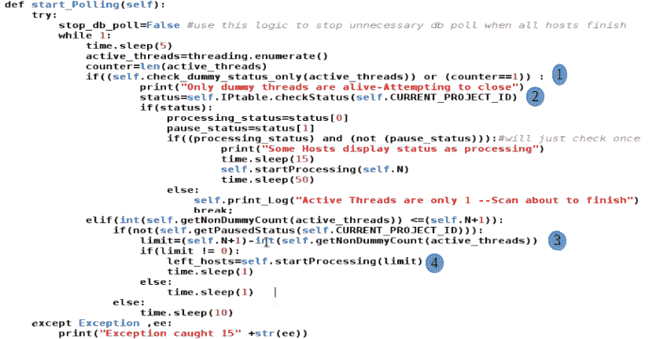

下面的代码处理如何恢复暂停的扫描。`self.IPtable.MakeUpdate`方法将未扫描主机的状态更新为`incomplete`。当主机的处理状态现在标记为`incomplete`时，返回 1。如果扫描在主机放入数据库表之前暂停，则返回状态为`2`。在这种情况下，我们需要再次进行批量输入。代码的其余部分很简单；我们调用`startProcessing()`方法为要扫描的主机委派线程：

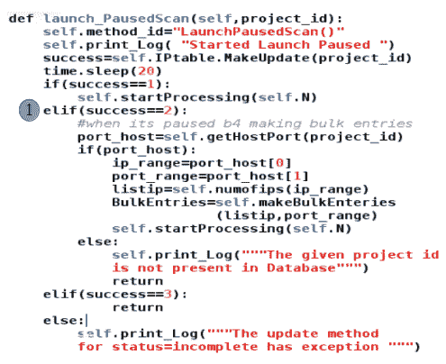

必须注意的是，为了暂停扫描，我们只需按下控制台或终端窗口上的*Ctrl*+*C*即可。当前扫描将暂停，根据当前项目 ID 适当更新后端数据库中的状态。还应注意，如前所述，上述方法构成漏洞扫描器端口扫描器（部分）的中心逻辑。确切的代码还有一些其他功能，详细信息可以在 GitHub 存储库[<中找到 https://github.com/FurqanKhan1/Dictator >](http://%3Chttps://github.com/FurqanKhan1/Dictator%3E)。

# 执行代码

在执行代码之前，请参阅 GitHub URL[<上的安装和设置说明 https://github.com/FurqanKhan1/Dictator/wiki >](http://%3Chttps://github.com/FurqanKhan1/Dictator/wiki%3E)。《安装指南》还讨论了如何设置后端数据库和表。或者，您可以下载已安装并预配置所有内容的即插即用 VM。

要运行代码，请转到`/root/Django_project/Dictator/Dictator_Servicepath`并将`driver_main_class.py`代码文件作为`python Driver_main_class.py`运行：


以下屏幕截图显示了正在扫描的程序：


以下屏幕截图显示了日志详细信息：


在前面的屏幕截图中可以看到，对于一台主机，生成了三个子进程，创建了一个线程。

# 漏洞扫描器的端口扫描部分的数据库架构

让我们尝试了解后端数据库以及我们正在使用的数据库中各种表的结构。`show databases`命令用于列出 MySQL 中存在的所有数据库：

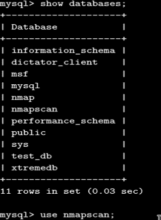

为了使用与我们的漏洞扫描器相关的当前数据库，我们使用 use`nmapscan`命令。此外，为了查看当前数据库中的所有表，我们使用`show tables`命令：


为了让我们看到包含所有扫描项目的表的结构或模式，我们使用了`desc project`命令。为了查看我们扫描的项目的数据，我们发出以下 SQL 查询：

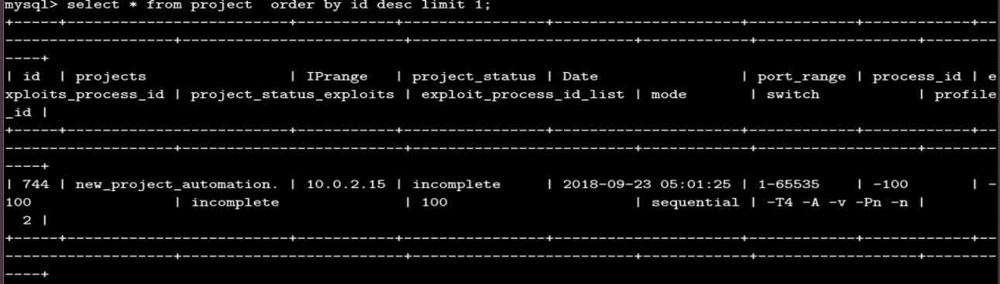

`IPtable`是保存目标端口扫描结果的表格。下面的命令`desc IPtable`向我们显示了表的模式：


以下屏幕截图显示了当前项目`744`的`IPtable`中存在的数据。我们可以看到，所有服务扫描结果都以 CSV 格式放置在表中：

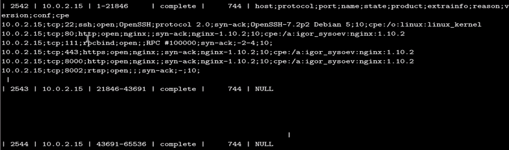

一旦项目端口扫描成功完成，项目所有细节将从`IPtable`移至`IPtable_history`。这是为了在`IPtable`上快速执行查找操作。因此，`IPtable_history`表的模式将与 IPtable 完全相同。这可以在以下屏幕截图中进行验证：

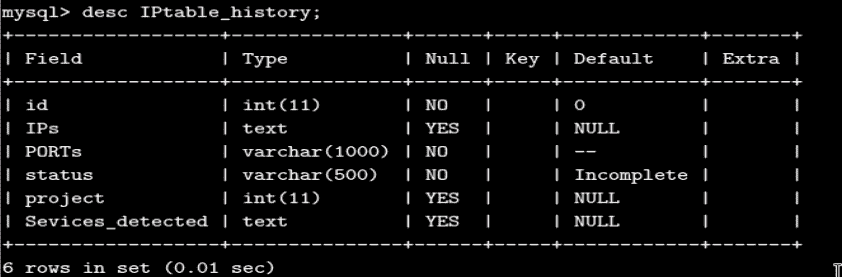

# 总结

在本章中，我们讨论了如何使用 Python 内置的 Nmap 实用程序执行和自动化端口扫描，以及暂停和恢复扫描的附加功能，以及使用线程和多处理添加一层优化。在下一章中，我们将继续介绍漏洞扫描器，以了解现在如何使用端口扫描结果进一步自动化和协调服务扫描。我们还将讨论漏洞扫描器的 GUI 版本，它有大量的功能和非常直观的仪表板。

# 问题

1.  为什么我们要使用线程和多处理的组合来自动化端口扫描？
2.  我们可以做些什么来进一步优化吞吐量？
3.  是否有其他 Python 模块或库可用于自动化 Nmap？
4.  我们是否可以使用其他扫描仪，如使用相同方法的愤怒 IP 或大规模扫描？

# 进一步阅读

*   关于如何使用 Nmap 和访问`python3`：[中的扫描结果的 Python 类 https://pypi.org/project/python-Nmap/](https://pypi.org/project/python-Nmap/)
*   Nmap 教程：[https://hackertarget.com/Nmap-tutorial/](https://hackertarget.com/Nmap-tutorial/)
*   Python MySQL:[https://www.w3schools.com/python/python_mysql_getstarted.asp](https://www.w3schools.com/python/python_mysql_getstarted.asp) 和[https://dev.mysql.com/doc/connector-python/en/](https://dev.mysql.com/doc/connector-python/en/)