# 十四、网络威胁情报

到目前为止，这本书关注的是网络安全的攻击性方面。我们主要关注在渗透测试领域中使用 Python。在本章中，我们将尝试了解 Python 如何用于网络安全的防御方面。当我们谈到防御性网络安全时，我们想到的是监控。**S****安全运营中心**是监控团队常用的术语，负责持续监控组织的安全状况。该团队使用名为**安全信息和事件管理**（**SIEM**的工具），该工具充当聚合器，从需要监控的各种应用和设备收集日志。在聚合之上，SIEM 有一个规则引擎，其中配置了用于异常检测的各种规则。规则因组织而异，具体取决于业务上下文和要监视的日志。如今，我们通常有许多基于大数据集群的 SIEM 解决方案，这些解决方案使用机器学习算法，并由 AI 模型和规则引擎共同驱动，这使得监控更加有效。那么，网络威胁情报在这一切中的作用何在？在本章中，我们将了解这一点以及以下主题：

*   网络威胁情报
*   工具和 API
*   威胁评分：给每个国际奥委会评分
*   STIX 和 TAXI 以及外部查找

# 网络威胁情报简介

**网络威胁情报**是处理收集到的原始信息并将其转化为可采取行动的情报的过程。从广义上讲，威胁情报是一个涉及手动情报收集以及使用自动化工具来增强组织安全状况的过程。让我们在本节中尝试了解自动和手动威胁情报。

# 手动威胁情报

**手动威胁情报**是手动收集情报并将其转化为可操作情报的过程。让我们举一个特定于组织的手动威胁情报的例子。

在组织“X”的网络安全团队中工作的一名分析师非常了解组织内部的最高管理层、关键流程和关键应用。作为网络安全和情报团队的一员，该员工的职责之一是浏览深度/黑暗网络，寻找可能针对组织的潜在威胁。威胁的范围总是不同的。它可能包括泄露的电子邮件或黑暗网络上的痕迹，这可能会使组织感到震惊。另一个威胁可能是针对特定行业（如电信行业）的勒索软件的传播。如果员工检测到这一点，组织将提前得到通知，并可以加强针对勒索软件的防御机制

手动威胁情报的另一个例子是收集与内部威胁相关的信息。对于一个拥有庞大员工基础和大量流程的组织来说，总是很难监控每个人。Siem 常常难以监控行为威胁。假设有一个服务器 X（web 服务器），它通常每天与服务器 Y（数据库）和服务器 Z（应用）通信。但是，观察到来自 SIEM 的一些跟踪，其中服务器 X 通过 SMB 端口`445`与服务器 a 通信。这种行为既奇怪又可疑。现在，为不同服务器之间的日常通信建立基线，并创建规则来检测异常，对于 SIEM 来说太难了，因为一个组织内通常有大量的系统。虽然现在有一些解决方案是建立在人工智能引擎和大数据之上的，用于进行这种异常检测，但手动威胁搜索目前仍然效果最好。这种手动识别组织内部异常的过程称为**内部威胁搜寻**。

# 自动威胁情报

正如我们所讨论的，**威胁情报**是一个先进的过程，使组织能够在分析上下文和情境风险的基础上不断收集有价值的网络威胁见解。它可以根据组织的具体威胁情况进行调整。简言之，威胁情报是基于识别、收集和丰富相关网络威胁数据和信息的分析结果。网络威胁数据通常包括危害指标（IOC），即恶意 IP、URL、文件哈希、域、电子邮件地址等。

这一收集信息并将其转化为可操作智能的过程将被安全产品（如 SIEM 工具、IDS/IPS 系统、防火墙、代理服务器、WAF 和其他安全产品）使用，我们将在本章中重点介绍。如前所述，收集和上下文化信息的过程可以手动完成，也可以自动化。自动化还可以进一步分为分离自动化（在脚本级别）或使用中央编排引擎的自动化。我们将考虑两者的优点和缺点。

有各种安全网站和社区公开共享网络情报数据，作为打击黑客活动者和保护组织免受新威胁的合作措施。这些社区通常使用所谓的威胁共享源或威胁源。共享的数据包含恶意 URL、恶意 IP、恶意文件、恶意文件签名、恶意域、恶意 C&C 服务器等。所有共享的数据都被一个组织报告为有可疑行为。这可能是 SSH 扫描活动、水平扫描、钓鱼网站、暴力强制 IP、恶意软件签名等等。

收集的所有信息与 SIEM 共享，并在 SIEM 上创建规则，以检测组织内针对标记为恶意的 IOC 的任何通信。如果 SIEM 表明内部服务器或资产与收集的 IOC 之间存在通信，它将提醒组织，然后组织可以采取适当的预防措施。虽然这个过程看起来很简单，但实际上并不像看上去那么简单。该行业面临的主要挑战是 IOC 的质量。应该指出的是，已经收集了数百万份 IOC。组织拥有的 IOC 质量越高，检测效果越好。但是，默认情况下，拥有数百万 IOC 并不能提高检测性能。我们不能只是以自动化的方式收集 IOC，然后将其提供给 SIEM。从不同来源以不同格式（如 JSON、CSV、STIX、XML、txt 和数据库文件）收集的 IOC 会带来很多噪音。这意味着非恶意的域和 IP 也会被标记。如果将这些嘈杂的数据直接提供给 SIEM，并在其上创建规则，这将导致大量误报警报，从而增加分析人员所需的工作量。

在本章中，我们将学习如何消除误报并提高收集的 IOC 的质量。我们将编写一个自定义 Python 算法来提高 IOC 的质量，并将威胁分数与收集的每个 IOC 相关联。威胁分数为 1 到 10 分。较高一端的分数表示潜在严重性更高，而较低一端的分数可能不那么严重，这将允许我们与 SIEM 只共享高质量的 IOC，这将导致更好的真实阳性率。

# 网络威胁情报平台

如前所述，情报收集过程可以通过我们可以组合的不同脚本实现自动化，或者建立一个能够收集和共享网络威胁情报的中央平台。具有这种能力的中央平台称为网络威胁情报平台。让我们尝试了解网络威胁情报收集的半自动化和完全自动化过程：

*   下图显示了威胁情报平台试图解决的问题陈述。在大型组织中，SIEM 工具每分钟生成 100–100000 个事件，规则引擎在一小时内触发 20–50 个警报。分析师需要手动验证每个警报，并检查所涉及的 IP 或域是否合法。分析员必须使用各种安全查找站点，手动解释它们，并就警报是否符合进一步调查的条件或是否为假阳性做出决定。这是大量人力投入的地方，也是我们需要自动化网络威胁情报的地方：

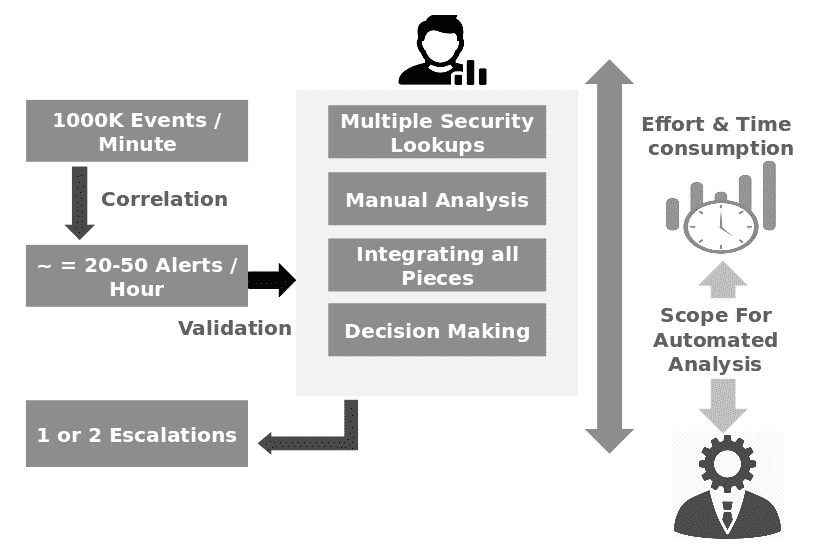

*   收集情报数据的各种来源包括：

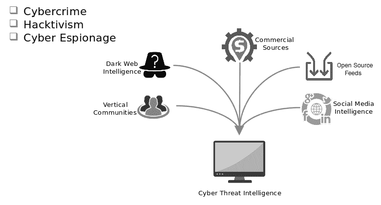

*   成熟的威胁情报平台的能力包括：


# 工具和 API

当我们谈到网络威胁情报平台时，有许多商业和开源工具可用于收集、分析和共享情报。可用的一些最著名的商业工具包括：

*   IBM X-Force Exchange
*   异常威胁流
*   帕洛阿尔托网络自动对焦
*   RSA 网络套件
*   LogRhym 威胁生命周期管理（TLM）平台
*   火眼威胁情报
*   LookingGlass 网络解决方案
*   AlienVault 统一安全管理（USM）

可用的最著名的开源工具包括：

*   失误
*   OpenIOC
*   OpenTaxi
*   雪人
*   虐待助手
*   sqhunter
*   sqhunter

前面提到的所有开源工具都非常好，可以提供不同的功能。我个人发现**恶意软件信息共享平台**（**MISP**）在功能和特性上都非常有用。我最喜欢的是它的可扩展架构和 API，它允许它与其他编程语言协作。这是我们将在本章重点介绍的开源威胁情报平台。我们的目标是了解 MISP 提供了哪些现成的功能，以及我们可以添加哪些附加功能，以便为 SIEM 工具提供高质量的 IOC 提要。MISP 公开了一个极好的`pymisp`API 来使用从 Python 收集的 IOC。

# 失误

**MISP**是一个用 cakePHP 编写的框架，拥有卓越的社区支持。该框架的目标是从发布恶意内容的各种提要源收集威胁情报，并将其存储在后端存储库中。可以检索相同的内容供以后分析，并与安全工具（如 SIEM、防火墙和 IDS/IPS 系统）共享。该工具具有许多功能，包括以下功能：

*   它有一个中央解析器，能够解析各种 IOC 提要文件，如自由文本、CSV、TSV、JSON 和 XML。这是一个很大的优势，因为这意味着我们不必担心从源提要提供智能的格式。不同的提要源以不同的格式提供情报。中央解析器解析 IOC 信息，并将其转换为一致的格式，以匹配 MISP 支持的后端模式。
*   它有一个 API，使我们能够灵活地直接与 SIEM 工具共享情报（注意，这是一个缺点，但是，因为 MISP 还没有误报消除功能）。
*   它有能力与其他 MISP 实例集成，并有一台服务器为威胁共享服务。
*   它具有基于角色的 web 界面访问权限，允许分析人员理解和关联所收集的信息。
*   它有一个基于队列的后端工作系统，在该系统中，可以将提要集合安排到一天中的任何时间/小时。我们还可以改变重复的频率。后端工作和排队系统基于 Redis 和 CakeResque。
*   MISP 不仅擅长收集威胁信息，还擅长将其关联起来，并以多种格式共享信息，如 CSV、STIX、JSON、文本、XML 和 Bro-IDS 签名。

MISP 提供的功能的完整列表可在官方存储库中找到：[https://github.com/MISP/MISP](https://github.com/MISP/MISP) 。

# 安装 MISP

安装说明可以在前面提到的 GitHub 存储库中找到。我们已经测试了代码并在 CentOS 7 上使用了它。执行以下说明在 CentOS 7 上设置 MISP：

```
# INSTALLATION INSTRUCTIONS
 ## for CentOS 7.x

 ### 0/ MISP CentOS 7 Minimal NetInstall - Status
 --------------------------------------------
 !!! notice
 Semi-maintained and tested by @SteveClement, CentOS 7.5-1804 on 20181113<br />
 It is still considered experimental as not everything works seemlessly.
 CentOS 7.5-1804 [NetInstallURL](http://mirror.centos.org/centos/7.5.1804/os/x86_64/)

 {!generic/globalVariables.md!}

 ```bash
 # CentOS Specific
 RUN_PHP='/usr/bin/scl enable rh-php71 '
 RUN_PYTHON='/usr/bin/scl enable rh-python36 '
 PHP_INI=/etc/opt/rh/rh-php71/php.ini
 ```
 ### 1/ Minimal CentOS install 
```

1.  使用以下软件安装最低限度的 CentOS 7.x 系统：

```
 - OpenSSH server
 - LAMP server (actually, this is done below)
 - Mail server
 ```bash
 # Make sure you set your hostname CORRECTLY vs. like an brute (manually in /etc/hostname)
 sudo hostnamectl set-hostname misp.local # or whatever you want it to be

 # Make sure your system is up2date:
 sudo yum update -y
 ```
 ### 2/ Dependencies *
 ----------------
```

2.  安装系统后，您可以以 root 用户身份或使用`sudo`执行以下步骤：

```
 ```bash
 # We need some packages from the Extra Packages for Enterprise Linux repository
 sudo yum install epel-release -y

 # Since MISP 2.4 PHP 5.5 is a minimal requirement, so we need a newer version than CentOS base provides
 # Software Collections is a way do to this, see https://wiki.centos.org/AdditionalResources/Repositories/SCL
 sudo yum install centos-release-scl -y

 # Install vim (optional)
 sudo yum install vim -y

 # Install the dependencies:
 sudo yum install gcc git httpd zip redis mariadb mariadb-server python-devel python-pip python-zmq libxslt-devel zlib-devel ssdeep-devel -y

 # Install PHP 7.1 from SCL, see https://www.softwarecollections.org/en/scls/rhscl/rh-php71/
 sudo yum install rh-php71 rh-php71-php-fpm rh-php71-php-devel rh-php71-php-mysqlnd rh-php71-php-mbstring rh-php71-php-xml rh-php71-php-bcmath rh-php71-php-opcache -y

 # Install Python 3.6 from SCL, see
 # https://www.softwarecollections.org/en/scls/rhscl/rh-python36/
 sudo yum install rh-python36 -y

 # rh-php71-php only provided mod_ssl mod_php for httpd24-httpd from SCL
 # if we want to use httpd from CentOS base we can use rh-php71-php-fpm instead
 sudo systemctl enable rh-php71-php-fpm.service
 sudo systemctl start  rh-php71-php-fpm.service
 sudo $RUN_PHP "pear channel-update pear.php.net"
 sudo $RUN_PHP "pear install Crypt_GPG"    # we need version >1.3.0
 ```
 !!! notice
 $RUN_PHP makes php available for you if using rh-php71\. e.g: sudo $RUN_PHP "pear list | grep Crypt_GPG"
 ```bash
 # GPG needs lots of entropy, haveged provides entropy
 sudo yum install haveged -y
 sudo systemctl enable haveged.service
 sudo systemctl start  haveged.service

 # Enable and start redis
 sudo systemctl enable redis.service
 sudo systemctl start  redis.service
 ```
 ### 3/ MISP code
 ------------
 ```bash
```

3.  使用`/var/www/`目录中的`git`下载 MISP：

```
 sudo mkdir $PATH_TO_MISP
 sudo chown apache:apache $PATH_TO_MISP
 cd /var/www
 sudo -u apache git clone https://github.com/MISP/MISP.git
 cd $PATH_TO_MISP
 sudo -u apache git checkout tags/$(git describe --tags `git rev-list --tags --max-count=1`)
 # if the last shortcut doesn't work, specify the latest version manually
 # example: git checkout tags/v2.4.XY.The following is the one tested : (git checkout tags/v2.4.79)
 # the message regarding a "detached HEAD state" is expected behavior
 # (you only have to create a new branch, if you want to change stuff and do a pull request for example)

 # Fetch submodules
 sudo -u apache git submodule update --init --recursive
 # Make git ignore filesystem permission differences for submodules
 sudo -u apache git submodule foreach --recursive git config core.filemode false

 # Create a python3 virtualenv
 sudo -u apache $RUN_PYTHON "virtualenv -p python3 $PATH_TO_MISP/venv"
 sudo mkdir /usr/share/httpd/.cache
 sudo chown apache:apache /usr/share/httpd/.cache
 sudo -u apache $PATH_TO_MISP/venv/bin/pip install -U pip setuptools

 # install Mitre's STIX and its dependencies by running the following commands:
 sudo yum install python-importlib python-lxml python-dateutil python-six -y
 cd /var/www/MISP/app/files/scripts
 sudo -u apache git clone https://github.com/CybOXProject/python-cybox.git
 sudo -u apache git clone https://github.com/STIXProject/python-stix.git
 cd /var/www/MISP/app/files/scripts/python-cybox
```

4.  如果您的`umask`已从默认值更改，最好在安装 Python 模块之前将其重置为`0022`：

```
UMASK=$(umask)
 umask 0022
 cd /var/www/MISP/app/files/scripts/python-stix
 sudo -u apache $PATH_TO_MISP/venv/bin/pip install .

 # install maec
 sudo -u apache $PATH_TO_MISP/venv/bin/pip install -U maec

 # install zmq
 sudo -u apache $PATH_TO_MISP/venv/bin/pip install -U zmq

 # install redis
 sudo -u apache $PATH_TO_MISP/venv/bin/pip install -U redis

 # install magic, lief, pydeep
 sudo -u apache $PATH_TO_MISP/venv/bin/pip install -U python-magic lief git+https://github.com/kbandla/pydeep.git

 # install mixbox to accommodate the new STIX dependencies:
 cd /var/www/MISP/app/files/scripts/
 sudo -u apache git clone https://github.com/CybOXProject/mixbox.git
 cd /var/www/MISP/app/files/scripts/mixbox
 sudo -u apache $PATH_TO_MISP/venv/bin/pip install .

 # install PyMISP
 cd /var/www/MISP/PyMISP
 sudo -u apache $PATH_TO_MISP/venv/bin/pip install enum34
 sudo -u apache $PATH_TO_MISP/venv/bin/pip install .

 # Enable python3 for php-fpm
 echo 'source scl_source enable rh-python36' | sudo tee -a /etc/opt/rh/rh-php71/sysconfig/php-fpm
 sudo sed -i.org -e 's/^;\(clear_env = no\)/\1/' /etc/opt/rh/rh-php71/php-fpm.d/www.conf
 sudo systemctl restart rh-php71-php-fpm.service

 umask $UMASK
 ```
 ### 4/ CakePHP
 -----------
#### CakePHP is now included as a submodule of MISP and has been fetch by a previous step.
```

5.  如果要使用内置后台作业，请安装 CakeResque 及其依赖项：

```
 ```bash
 sudo chown -R apache:apache /var/www/MISP
 sudo mkdir /usr/share/httpd/.composer
 sudo chown apache:apache /usr/share/httpd/.composer
 cd /var/www/MISP/app
 sudo -u apache $RUN_PHP "php composer.phar require kamisama/cake-resque:4.1.2"
 sudo -u apache $RUN_PHP "php composer.phar config vendor-dir Vendor"
 sudo -u apache $RUN_PHP "php composer.phar install"

 # CakeResque normally uses phpredis to connect to redis, but it has a (buggy) fallback connector through Redisent. It is highly advised to install phpredis using "yum install php-redis"
 sudo $RUN_PHP "pecl install redis"
 echo "extension=redis.so" |sudo tee /etc/opt/rh/rh-php71/php-fpm.d/redis.ini
 sudo ln -s ../php-fpm.d/redis.ini /etc/opt/rh/rh-php71/php.d/99-redis.ini
 sudo systemctl restart rh-php71-php-fpm.service

 # If you have not yet set a timezone in php.ini
 echo 'date.timezone = "Europe/Luxembourg"' |sudo tee /etc/opt/rh/rh-php71/php-fpm.d/timezone.ini
 sudo ln -s ../php-fpm.d/timezone.ini /etc/opt/rh/rh-php71/php.d/99-timezone.ini

 # Recommended: Change some PHP settings in /etc/opt/rh/rh-php71/php.ini
 # max_execution_time = 300
 # memory_limit = 512M
 # upload_max_filesize = 50M
 # post_max_size = 50M
 for key in upload_max_filesize post_max_size max_execution_time max_input_time memory_limit
 do
 sudo sed -i "s/^\($key\).*/\1 = $(eval echo \${$key})/" $PHP_INI
 done
 sudo systemctl restart rh-php71-php-fpm.service
```

6.  要将计划程序工作程序用于计划任务，请执行以下命令：

```
sudo cp -fa /var/www/MISP/INSTALL/setup/config.php /var/www/MISP/app/Plugin/CakeResque/Config/config.php
 ```
```

7.  按如下方式设置权限：

```
 ```bash
 # Make sure the permissions are set correctly using the following commands as root:
 sudo chown -R root:apache /var/www/MISP
 sudo find /var/www/MISP -type d -exec chmod g=rx {} \;
 sudo chmod -R g+r,o= /var/www/MISP
 sudo chmod -R 750 /var/www/MISP
 sudo chmod -R g+ws /var/www/MISP/app/tmp
 sudo chmod -R g+ws /var/www/MISP/app/files
 sudo chmod -R g+ws /var/www/MISP/app/files/scripts/tmp
 sudo chown apache:apache /var/www/MISP/app/files
 sudo chown apache:apache /var/www/MISP/app/files/terms
 sudo chown apache:apache /var/www/MISP/app/files/scripts/tmp
 sudo chown apache:apache /var/www/MISP/app/Plugin/CakeResque/tmp
 sudo chown -R apache:apache /var/www/MISP/app/Config
 sudo chown -R apache:apache /var/www/MISP/app/tmp
 sudo chown -R apache:apache /var/www/MISP/app/webroimg/orgs
 sudo chown -R apache:apache /var/www/MISP/app/webroimg/custom
 ``` 
```

8.  按如下方式创建数据库和用户：

```
```bash
 # Enable, start and secure your mysql database server
 sudo systemctl enable mariadb.service
 sudo systemctl start mariadb.service

 sudo yum install expect -y

 # Add your credentials if needed, if sudo has NOPASS, comment out the relevant lines
 #pw="Password1234"

 expect -f - <<-EOF
 set timeout 10
 spawn sudo mysql_secure_installation
 #expect "*?assword*"
 #send -- "$pw\r"
 expect "Enter current password for root (enter for none):"
 send -- "\r"
 expect "Set root password?"
 send -- "y\r"
 expect "New password:"
 send -- "${DBPASSWORD_ADMIN}\r"
 expect "Re-enter new password:"
 send -- "${DBPASSWORD_ADMIN}\r"
 expect "Remove anonymous users?"
 send -- "y\r"
 expect "Disallow root login remotely?"
 send -- "y\r"
 expect "Remove test database and access to it?"
 send -- "y\r"
 expect "Reload privilege tables now?"
 send -- "y\r"
 expect eof
 EOF

 sudo yum remove tcl expect -y

 # Additionally, it is probably a good idea to make the database server listen on localhost only
 echo [mysqld] |sudo tee /etc/my.cnf.d/bind-address.cnf
 echo bind-address=127.0.0.1 |sudo tee -a /etc/my.cnf.d/bind-address.cnf
 sudo systemctl restart mariadb.service

 # Enter the mysql shell
 mysql -u root -p
 ```
 ```
 MariaDB [(none)]> create database misp;
 MariaDB [(none)]> grant usage on *.* to misp@localhost identified by 'XXXXXXXXX';
 MariaDB [(none)]> grant all privileges on misp.* to misp@localhost ;
 MariaDB [(none)]> exit
 ```
 #### copy/paste:
 ```bash
 sudo mysql -u $DBUSER_ADMIN -p$DBPASSWORD_ADMIN -e "create database $DBNAME;"
 sudo mysql -u $DBUSER_ADMIN -p$DBPASSWORD_ADMIN -e "grant usage on *.* to $DBNAME@localhost identified by '$DBPASSWORD_MISP';"
 sudo mysql -u $DBUSER_ADMIN -p$DBPASSWORD_ADMIN -e "grant all privileges on $DBNAME.* to '$DBUSER_MISP'@'localhost';"
 sudo mysql -u $DBUSER_ADMIN -p$DBPASSWORD_ADMIN -e "flush privileges;"
 ```
```

9.  从`MYSQL.sql`导入空 MySQL 数据库如下：

```
 ```bash sudo -u apache cat $PATH_TO_MISP/INSTALL/MYSQL.sql | mysql -u $DBUSER_MISP -p$DBPASSWORD_MISP $DBNAME
 ```
```

10.  接下来，配置 Apache 服务器：

```
 !!! notice
 SELinux note, to check if it is running:
 ```bash
 $ sestatus
 SELinux status: disabled
 ```
 If it is disabled, you can ignore the **chcon/setsebool/semanage/checkmodule/semodule*** commands.

 !!! warning
 This guide only copies a stock **NON-SSL** configuration file.

 ```bash
 # Now configure your apache server with the DocumentRoot /var/www/MISP/app/webroot/
 # A sample vhost can be found in /var/www/MISP/INSTALL/apache.misp.centos7

 sudo cp /var/www/MISP/INSTALL/apache.misp.centos7.ssl /etc/httpd/conf.d/misp.ssl.conf

 # If a valid SSL certificate is not already created for the server, create a self-signed certificate:
 sudo openssl req -newkey rsa:4096 -days 365 -nodes -x509 \
 -subj "/C=${OPENSSL_C}/ST=${OPENSSL_ST}/L=${OPENSSL_L}/O=${OPENSSL_O}/OU=${OPENSSL_OU}/CN=${OPENSSL_CN}/emailAddress=${OPENSSL_EMAILADDRESS}" \
 -keyout /etc/pki/tls/private/misp.local.key -out /etc/pki/tls/certs/misp.local.crt

 # Since SELinux is enabled, we need to allow httpd to write to certain directories
 sudo chcon -t usr_t /var/www/MISP/venv
 sudo chcon -t httpd_sys_rw_content_t /var/www/MISP/app/files
 sudo chcon -t httpd_sys_rw_content_t /var/www/MISP/app/files/terms
 sudo chcon -t httpd_sys_rw_content_t /var/www/MISP/app/files/scripts/tmp
 sudo chcon -t httpd_sys_rw_content_t /var/www/MISP/app/Plugin/CakeResque/tmp
 sudo chcon -R -t usr_t /var/www/MISP/venv
 sudo chcon -R -t httpd_sys_rw_content_t /var/www/MISP/app/tmp
 sudo chcon -R -t httpd_sys_rw_content_t /var/www/MISP/app/tmp/logs
 sudo chcon -R -t httpd_sys_rw_content_t /var/www/MISP/app/webroimg/orgs
 sudo chcon -R -t httpd_sys_rw_content_t /var/www/MISP/app/webroimg/custom
 ```

 !!! warning
 Revise all permissions so update in Web UI works.

 ```bash
 sudo chcon -R -t httpd_sys_rw_content_t /var/www/MISP/app/tmp

 # Allow httpd to connect to the redis server and php-fpm over tcp/ip
 sudo setsebool -P httpd_can_network_connect on
 # Enable and start the httpd service
 sudo systemctl enable httpd.service
 sudo systemctl start httpd.service
 # Open a hole in the iptables firewall
 sudo firewall-cmd --zone=public --add-port=80/tcp --permanent
 sudo firewall-cmd --zone=public --add-port=443/tcp --permanent
 sudo firewall-cmd --reload
 # We seriously recommend using only HTTPS / SSL !
 # Add SSL support by running: sudo yum install mod_ssl
 # Check out the apache.misp.ssl file for an example
 ```
 !!! warning
 To be fixed - Place holder 
```

11.  要旋转这些日志，请安装提供的`logrotate`脚本：

```
 ```bash
 # MISP saves the stdout and stderr of it's workers in /var/www/MISP/app/tmp/logs
 # To rotate these logs install the supplied logrotate script:

 sudo cp $PATH_TO_MISP/INSTALL/misp.logrotate /etc/logrotate.d/misp
 sudo chmod 0640 /etc/logrotate.d/misp

 # Now make logrotate work under SELinux as well
 # Allow logrotate to modify the log files
 sudo semanage fcontext -a -t httpd_log_t "/var/www/MISP/app/tmp/logs(/.*)?"
 sudo chcon -R -t httpd_log_t /var/www/MISP/app/tmp/logs

 # Allow logrotate to read /var/www
 sudo checkmodule -M -m -o /tmp/misplogrotate.mod $PATH_TO_MISP/INSTALL/misplogrotate.te
 sudo semodule_package -o /tmp/misplogrotate.pp -m /tmp/misplogrotate.mod
 sudo semodule -i /tmp/misplogrotate.pp
 ```
```

12.  运行以下脚本以配置 MISP 实例：

```
```bash
 # There are 4 sample configuration files in $PATH_TO_MISP/app/Config that need to be copied
 sudo -u apache cp -a $PATH_TO_MISP/app/Config/bootstrap.default.php $PATH_TO_MISP/app/Config/bootstrap.php
 sudo -u apache cp -a $PATH_TO_MISP/app/Config/database.default.php $PATH_TO_MISP/app/Config/database.php
 sudo -u apache cp -a $PATH_TO_MISP/app/Config/core.default.php $PATH_TO_MISP/app/Config/core.php
 sudo -u apache cp -a $PATH_TO_MISP/app/Config/config.default.php $PATH_TO_MISP/app/Config/config.php
 echo "<?php
 class DATABASE_CONFIG {
 public \$default = array(
 'datasource' => 'Database/Mysql',
 //'datasource' => 'Database/Postgres',
 'persistent' => false,
 'host' => '$DBHOST',
 'login' => '$DBUSER_MISP',
 'port' => 3306, // MySQL & MariaDB
 //'port' => 5432, // PostgreSQL
 'password' => '$DBPASSWORD_MISP',
 'database' => '$DBNAME',
 'prefix' => '',
 'encoding' => 'utf8',
 );
 }" | sudo -u apache tee $PATH_TO_MISP/app/Config/database.php
 # Configure the fields in the newly created files:
 # config.php : baseurl (example: 'baseurl' => 'http://misp',) - don't use "localhost" it causes issues when browsing externally
 # core.php : Uncomment and set the timezone: `// date_default_timezone_set('UTC');`
 # database.php : login, port, password, database
 # DATABASE_CONFIG has to be filled
 # With the default values provided in section 6, this would look like:
 # class DATABASE_CONFIG {
 # public $default = array(
 # 'datasource' => 'Database/Mysql',
 # 'persistent' => false,
 # 'host' => 'localhost',
 # 'login' => 'misp', // grant usage on *.* to misp@localhost
 # 'port' => 3306,
 # 'password' => 'XXXXdbpasswordhereXXXXX', // identified by 'XXXXdbpasswordhereXXXXX';
 # 'database' => 'misp', // create database misp;
 # 'prefix' => '',
 # 'encoding' => 'utf8',
 # );
 #}

```

更改`/var/www/MISP/app/Config/config.php`中的盐键。管理员用户帐户将在第一次登录时生成；在创建该用户之前，请确保盐已更改。如果您忘记执行此步骤，并且您仍在处理新的安装，只需更改 salt 即可。
从 MYSQL 中删除该用户，并使用默认管理员凭据（`admin@admin.test/admin`再次登录。

13.  如果要从 web 界面更改配置参数，请运行以下脚本并生成 GPG 加密密钥：

```
sudo chown apache:apache /var/www/MISP/app/Config/config.php
 sudo chcon -t httpd_sys_rw_content_t /var/www/MISP/app/Config/config.php
 # Generate a GPG encryption key.
 cat >/tmp/gen-key-script <<EOF
 %echo Generating a default key
 Key-Type: default
 Key-Length: $GPG_KEY_LENGTH
 Subkey-Type: default
 Name-Real: $GPG_REAL_NAME
 Name-Comment: $GPG_COMMENT
 Name-Email: $GPG_EMAIL_ADDRESS
 Expire-Date: 0
 Passphrase: $GPG_PASSPHRASE
 # Do a commit here, so that we can later print "done"
 %commit
 %echo done
 EOF
 sudo gpg --homedir /var/www/MISP/.gnupg --batch --gen-key /tmp/gen-key-script
 sudo rm -f /tmp/gen-key-script
 sudo chown -R apache:apache /var/www/MISP/.gnupg
 # And export the public key to the webroot
 sudo gpg --homedir /var/www/MISP/.gnupg --export --armor $GPG_EMAIL_ADDRESS |sudo tee /var/www/MISP/app/webroot/gpg.asc
 sudo chown apache:apache /var/www/MISP/app/webroot/gpg.asc
 # Start the workers to enable background jobs
 sudo chmod +x /var/www/MISP/app/Console/worker/start.sh
 sudo -u apache $RUN_PHP /var/www/MISP/app/Console/worker/start.sh

 if [ ! -e /etc/rc.local ]
 then
 echo '#!/bin/sh -e' | sudo tee -a /etc/rc.local
 echo 'exit 0' | sudo tee -a /etc/rc.local
 sudo chmod u+x /etc/rc.local
 fi

 sudo sed -i -e '$i \su -s /bin/bash apache -c "scl enable rh-php71 /var/www/MISP/app/Console/worker/start.sh" > /tmp/worker_start_rc.local.log\n' /etc/rc.local
 # Make sure it will execute
 sudo chmod +x /etc/rc.local

 echo "Admin (root) DB Password: $DBPASSWORD_ADMIN"
 echo "User (misp) DB Password: $DBPASSWORD_MISP"
 ```
 ```
 # some misp-modules dependencies
 sudo yum install -y openjpeg-devel

 sudo chmod 2777 /usr/local/src
 sudo chown root:users /usr/local/src
 cd /usr/local/src/
 git clone https://github.com/MISP/misp-modules.git
 cd misp-modules
 # pip install
 sudo -u apache $PATH_TO_MISP/venv/bin/pip install -I -r REQUIREMENTS
 sudo -u apache $PATH_TO_MISP/venv/bin/pip install .
 sudo yum install rubygem-rouge rubygem-asciidoctor -y
 ##sudo gem install asciidoctor-pdf --pre
 # install STIX2.0 library to support STIX 2.0 export:
 sudo -u apache $PATH_TO_MISP/venv/bin/pip install stix2

 # install additional dependencies for extended object generation and extraction
 sudo -u apache ${PATH_TO_MISP}/venv/bin/pip install maec lief python-magic pathlib
 sudo -u apache ${PATH_TO_MISP}/venv/bin/pip install git+https://github.com/kbandla/pydeep.git

 # Start misp-modules
 sudo -u apache ${PATH_TO_MISP}/venv/bin/misp-modules -l 0.0.0.0 -s &

 sudo sed -i -e '$i \sudo -u apache /var/www/MISP/venv/bin/misp-modules -l 127.0.0.1 -s &\n' /etc/rc.local
 ```
 {!generic/MISP_CAKE_init_centos.md!}
 {!generic/INSTALL.done.md!}
 {!generic/recommended.actions.md!}
 {!generic/hardening.md!}
```

# 威胁得分能力

一旦解决了所有依赖关系并设置了该工具，我们将需要通过在 MISP 后端系统之上添加 IOC 威胁评分功能来增强 MISP 后端系统，从而进行扩展。应该注意的是，MISP 不具备开箱即用的进行威胁评分的能力，这是 SIEM 的一个非常重要的功能。我们对 MISP 后端系统/代码库所做的即兴创作是为了确保我们能够在 MISP 之上构建 IOC 威胁评分能力。为了适应这种情况，我们在后端创建了一个名为`threat_scoring`的表。该表记录了每个国际奥委会的相应威胁分数。

设置好数据库后，我们打开 MySQL 控制台，删除 MISP 数据库，如下所示：

```
mysql -u <username> -p <password>
delete database misp;
create database misp;
exit
```

一旦我们执行这些命令，我们现在需要将修改后的数据库模式添加到新创建的`misp`数据库中。它可以添加到后端系统中，如下所示：

```
mysql -u <username> -p misp < mod_schema.sql
```

执行上述命令后，我们将获得 MISP 后端数据库的更新实例。

# MISP 用户界面和 API

MISP 有一个基于 PHP 的前端，可以通过 web 浏览器访问。它有许多重要的特性。您可以参考原始网站了解所有这些功能：[https://www.misp-project.org/](https://www.misp-project.org/) 。在这一节中，让我们来看看几个关键的特征，它将给我们一个关于如何实施威胁情报和使用 MISP 收集 IOCS 的想法。

登录门户后，我们可以转到 feeds 选项卡，查看哪些 feeds 是在 MISP 中配置的。应该注意的是，提要只不过是一个基于 web 的本地源，提供 JSON、CSV、XML 或平面文件格式的 IOC。在 MISP 中预先配置了各种提要源。一旦我们安排了一个提要收集作业，MISP 的中央引擎将访问所有配置的提要源，从中提取 IOC，并将其放置在中央数据库中，如以下屏幕截图所示：。


正如前面的屏幕截图所示，我们可以进入**添加提要**选项卡，从那里配置更多提要。

在下面的屏幕截图中，我们可以看到从配置的源下载提要并解析它们的中央调度器。我们可以选择一天、一周或一年中的任何时间来指示何时需要下载提要。我们还可以配置计划程序重复的频率：

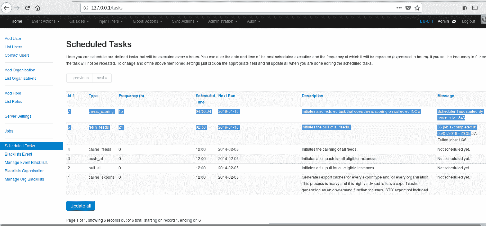

我们将重点关注前面屏幕截图中突出显示的行。在第二行，我们有一个**取回订阅源**的工作。双击频率和计划时间/日期字段可以更改设置。此外，应该注意的是，第一个突出显示的行表示`threat_scoring`并不是默认安装的 MISP。我们通过修改后端数据库注入了这一点（我们在即兴创作部分介绍了这一点）。

下载并解析提要后，它们将被放置在名为**事件**的虚拟/逻辑实体中。MISP 中的事件可以看作是 IOC 的集合。我们可以为单独的提要设置单独的事件。或者，我们可以让所有基于 IP 的 IOC 去分离事件、域等。以下屏幕截图描述了事件集合：

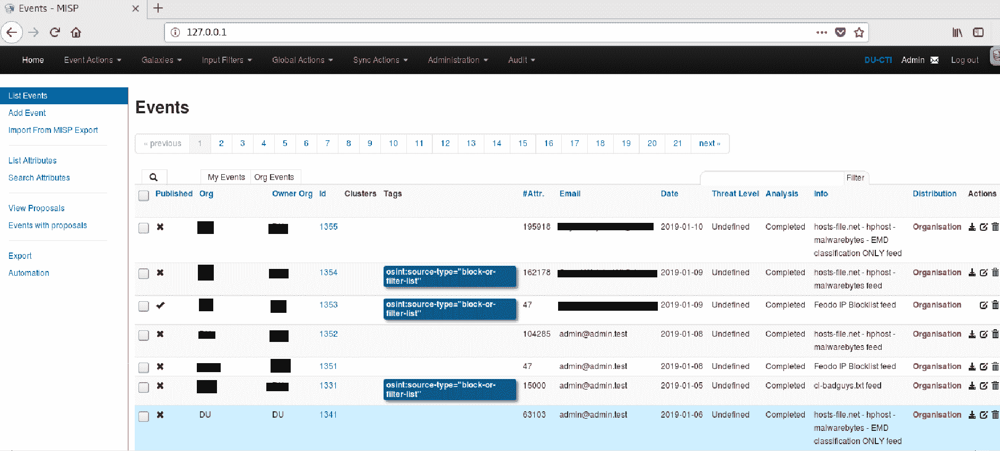

如果我们点击上一个屏幕截图中突出显示的任何事件的详细信息图标，我们将看到该特定事件实际举行的 IOC。这在以下屏幕截图中捕获：


# MISP API（PyMISP）

如前所述，MISP 附带了一个非常稳定的 API，通过它我们可以获取 MISP 中称为属性的事件和 IOC，并与我们的安全工具共享它们。API 要求设置身份验证密钥。当用户通过 MISP web 门户登录时，可以在用户界面上找到身份验证密钥。下面显示了如何使用 MISP API 从 MISP 后端数据库获取特定事件详细信息的示例：

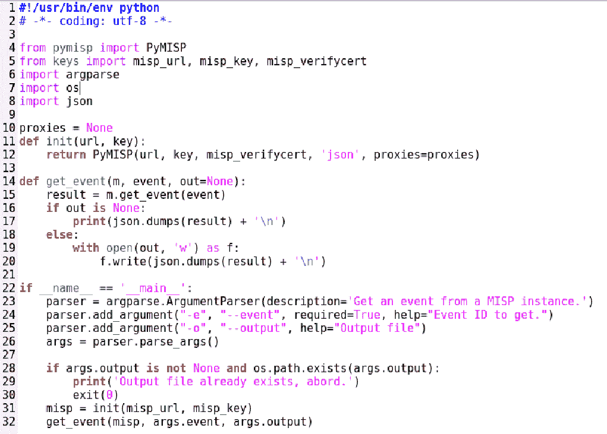

有关 MISP API 的完整详细信息，请访问以下链接：[https://github.com/MISP/PyMISP/tree/2c882c1887807ef8c8462f582415470448e5d68c/examples](https://github.com/MISP/PyMISP/tree/2c882c1887807ef8c8462f582415470448e5d68c/examples) 。

在前面的代码片段中，我们只是在第 31 行初始化 MISP API 对象并调用`get_api`API 方法。前面的代码可以按如下方式运行：


如前一个屏幕截图所示，我们获得了与`1512`事件 ID 关联的所有 IOC。如果我们指定`out`参数，输出也可以保存在 JSON 文件中。

# 威胁得分

正如我们之前所讨论的，威胁评分是威胁情报的一个非常重要的组成部分。通常有数以百万计的 IOC 收集，它们通常包含大量的误报。如果将此信息直接输入 SIEM 工具，将导致大量误报警报。为了解决这个问题，我们尝试编写一个算法，该算法在 MISP 收集的 IOC 之上工作，并将威胁分数与每个 IOC 关联。这个想法是，如果一个国际奥委会在 10 分制中的分数是 5 分或 5 分以上，那么它就更有可能是一个真正恶意的国际奥委会，应该被提交给国际奥委会主席团。此算法所依据的威胁评分标准如下所示：

*   **日期**：国际奥委会的日期为权重的 30%。如果一个国际奥委会成立一到三个月，它将获得 30%中的 100%，也就是三分。如果是四个月大，它会得到 90%或 2.9 分，以此类推。完整的细节将在下一节中给出。
*   **相关性**：IOC 的相关性计数占权重的 54%。我们所说的相关性是指多个事件或多个提要的发生频率。假设我们已经配置了 30 个提要，每个提要中的 IOC 将转到单独的事件，这将导致 30 个事件。现在，如果在所有 30 个事件中都发现了一个国际奥委会，这表明国际奥委会高度恶意的可能性非常高，正如 30 个不同的消息来源所引用的那样。国际奥委会将获得 54%分配给相关性的全部 100%，即 5.4 分。如果一个 IOC 在 90%的配置提要中具有特色，它将获得相应的点数。相关权重的实际分岔将在下一节中给出。
*   **标签**：许多 IOC 订阅源都会用与之相关的活动来标记 IOC，例如扫描、僵尸网络和钓鱼网站。标签的重量为 15%。应该注意的是，本节讨论的是与 IOC 相关联的标签数量，而不是标签的种类。标签数量越高，15%铲斗的分配重量越高。
*   **注释**：最后，剩余的 1%分配给标签部分。一些 IOC 还附带了某些注释。如果国际奥委会有一条与之相关的评论，它将得到全部 1%或 0.1 分，如果没有，则在本节中得到 0 分。

# 威胁评分文件

这些标准不是在程序逻辑中硬编码的，而是在 JSON 文件中配置的，因此用户可以随时更改它们，代码将拾取更新的值并相应地分配分数。我们在 JSON 文件中设置了以下值：

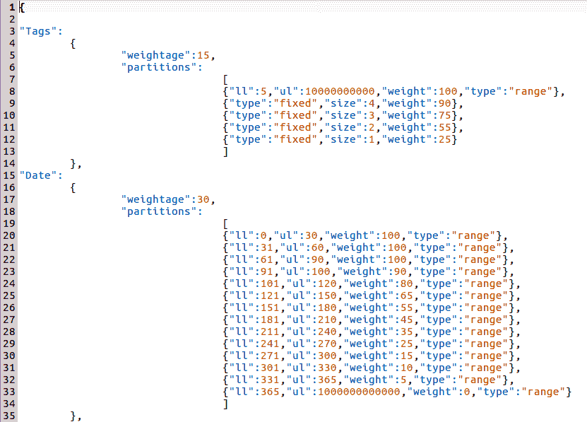

如前一个屏幕截图所示，`Tags`的权重为 15%。这在第 8-12 行中进一步分岔。第 8 行表示，任何具有至少五个标签和最多 10000 个标签的 IOC 将获得全部 15%。第 9 行表示任何有四个标签的 IOC 都将获得 15%的 90%，以此类推。

`Date`具有类似的分叉。在最高 30 分的情况下，任何年龄在 0 到 90 天之间的国际奥委会都将获得 30 分的 100%，即 3 分。任何 91-100 天的国际奥委会都会得到 30 分中的 90%，等于 2.7 分，以此类推。

`Correlation`的权重为 54%，如下图所示。相关情况下的分岔略有不同。第 41 行中的数字 35 不是绝对数字，而是百分比。这意味着，在配置的提要总数中，如果在 35%的提要或事件中发现 IOC，那么它应该得到全部 5.4 分。其他行可以进行类似的解释。

最后，国际奥委会是否也有任何评论，权重为 1%：


# 威胁评分算法

请看下面的代码，我们编写这些代码是为了在 MISP IOC 集合的顶部进行威胁评分。整个代码可在以下链接中找到：[https://github.com/PacktPublishing/Hands-On-Penetration-Testing-with-Python](https://github.com/PacktPublishing/Hands-On-Penetration-Testing-with-Python) ：

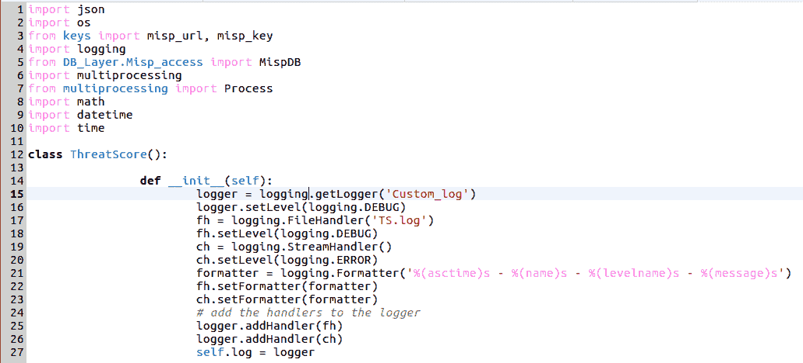

让我们试着理解到目前为止编写的代码。这段代码使用了我们在本书前面研究过的概念。这个想法是从 MISP`attributes`后端表中读取所有 IOC，并根据前面讨论的逻辑为每个 IOC 给出威胁分数。现在，有数百万个属性，所以如果我们尝试读取它们并按顺序对它们进行评分，这将需要很长时间。这就是 Python 在多处理方面的魅力所在。我们将读取所有属性，并根据底层机器的处理器核心，将属性分成相等的块。每个处理器核心每次将有一个块进行处理。它还将为属于该区块的 IOC 分配威胁分数。我使用的硬件有一个 8GB 的 RAM 和一个 4 核处理器。

假设我们总共有 200 万个属性，这些属性将被分成四个块，每个块将包含 500000 个属性。评分过程将由一个专用处理器核心在该区块上执行。如果 200 万块的顺序操作需要 4 小时，那么多处理方法需要 1 小时。在第 40 行和第 51 行之间编写的逻辑负责确定我们将使用的块的总数。它还包含推断区块大小的逻辑，如以下屏幕截图所示：

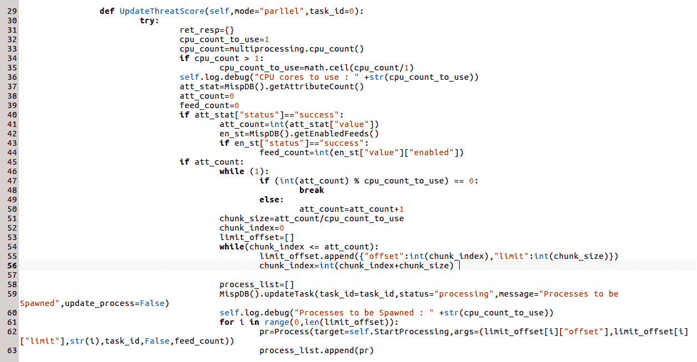

需要注意的是，在第 5 行`from DB_Layer.Misp_access import MispDB`中导入的模块表示一个名为`MISPDB`的自定义类，该类在`MISP_access.py`模块中声明。此类具有原始 SQL 代码，用于从`misp`数据库中提取数据。

在第 54 行和第 56 行之间，我们将块放在一个名为`limit_offset`的自定义列表中。假设后端数据库表中有 200 万个属性。在第 56 行之后，该列表将更新如下：

```
limit_offset=[{"offset":0,"limit":500000},{"offset":500000,"limit":500000},{"offset":1000000,"limit":500000},{"offset":1500000,"limit":500000}]
```

在第 61 行和第 64 行之间，我们为每个块调用一个单独的进程。进程将执行的方法是`StartProcessing()`，我们将当前块作为参数传递。在剩下的第 69–97 行中，我们将更新状态以将状态代码返回到调用`UpdateThreatScore()`方法的代码。让我们来看一看处理器核心执行的方法：

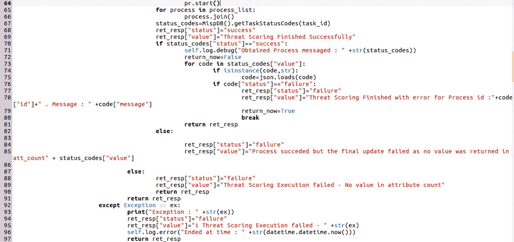

下面代码的核心逻辑部分位于第 186 行，其中代码获取当前块并调用`self.Scoring()`方法。此方法通过组合每个属性的标记、相关性、日期和注释威胁分数来生成威胁分数。最后，获得累积分数后，更新后端`threat_scoring`数据库表。这将在下一个代码段中显示：


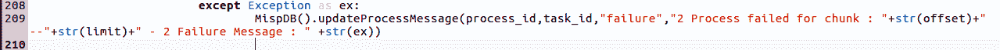

可以看出，`Scoring()`方法在第 130-133 行中进一步调用了四种不同的方法。它汇总分数并将其推送到数据库表中。让我们来看看它调用的四种方法：

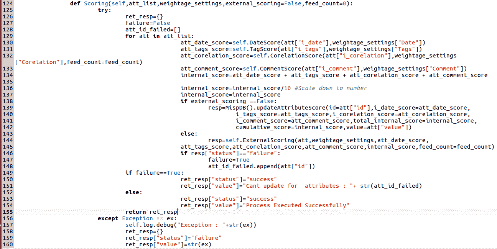

如以下屏幕截图所示，所有四种方法都从 JSON 文件读取配置值，并将其传递给一个名为`ComputeScore`的通用方法，该方法最终根据传递的配置值计算分数，并返回计算出的分数：


下面的代码将所有片段连接在一起并返回计算出的分数。此代码将针对单独处理器核心上的所有块并行调用：

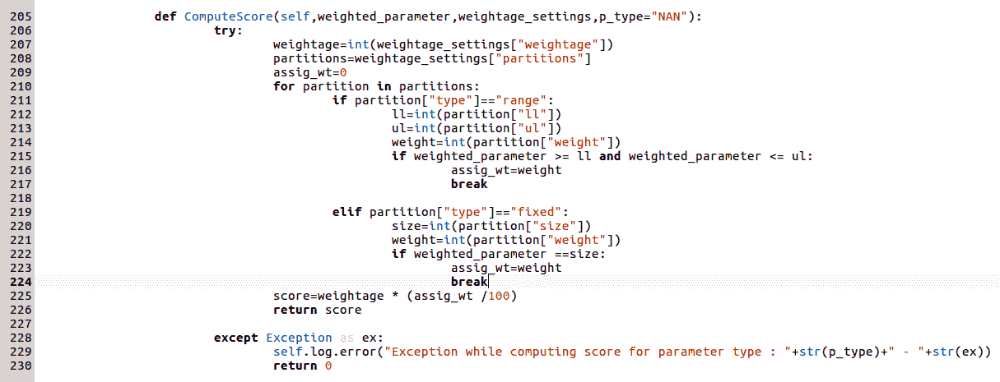

最后，我们将创建该类的一个对象，并调用`Update`方法，如下所示：

```
ob=ThreatScore()
ob.UpdateThreatScore()
```

# 执行代码

整个代码可以在以下 GitHub 存储库中找到，[https://github.com/PacktPublishing/Hands-On-Penetration-Testing-with-Python](https://github.com/PacktPublishing/Hands-On-Penetration-Testing-with-Python) ，并可按如下方式调用：

```
python3.6 TS.py
```

代码将所有执行和调试消息放在一个`log`文件中，该文件将在同一文件夹中自动创建，并将被称为`TS.log`。一旦代码成功执行，它将包含以下内容：

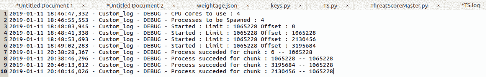

当代码执行时，有四个并行读/写操作在数据库上执行，因为每个处理器内核将分别读写。这显示在以下屏幕截图中：

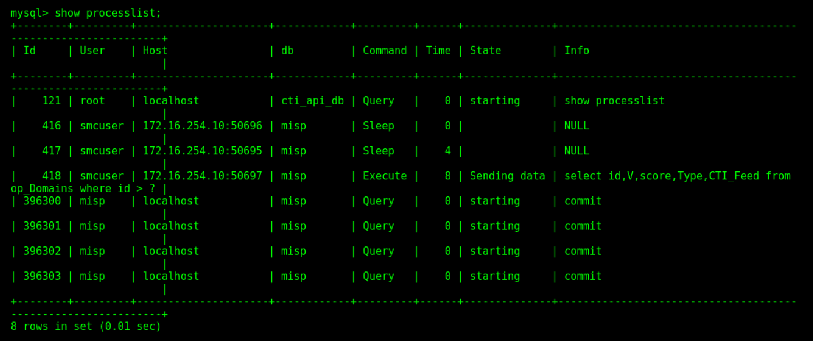

可以看出，有四个名为`misp`的用户帐户正试图同时从数据库中读取和写入数据。

以下屏幕截图表示威胁评分表的模式：


以下截图显示了国际奥委会的威胁得分。

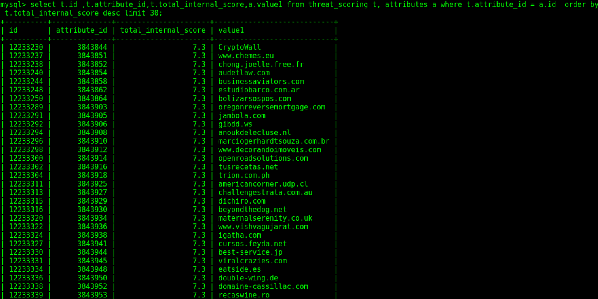

以下屏幕截图显示了几个 IP 地址：

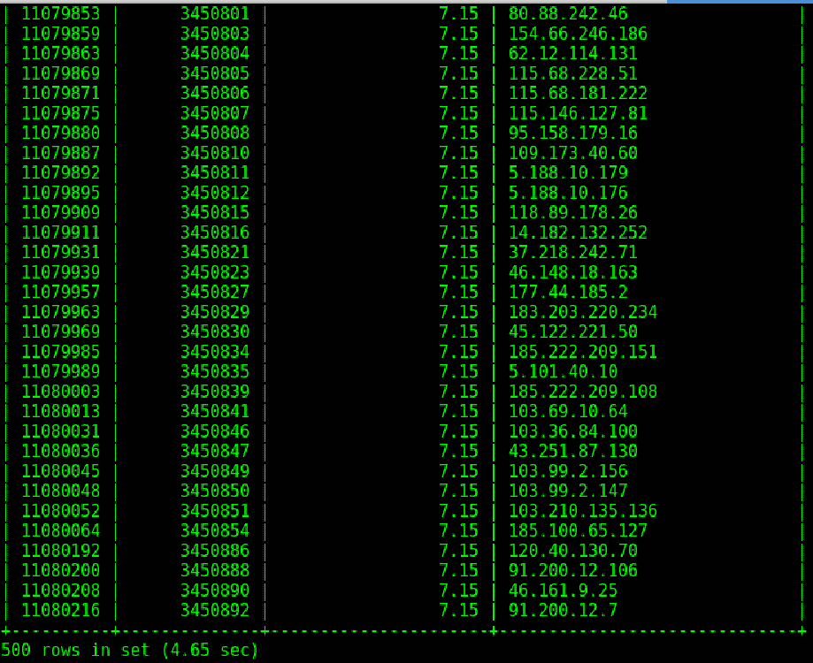

# STIX 和 TAXI 以及外部查找

术语**STIX 和 TAXI**通常用于威胁情报领域。我们将使用下面的示例来尝试理解这里的内容。

假设我们有一个拥有大量威胁情报数据的组织。数据收集自外部源以及内部威胁情报数据。组织 A 是一家银行组织，使用平台 X 存储和管理其威胁情报数据。现在，组织 A 希望通过与银行部门的其他组织（如组织 B 和组织 C）共享其威胁情报数据来帮助银行界。他们希望其他组织也能共享他们的数据。问题在于，虽然组织 A 使用平台 X 管理其威胁情报数据，但组织 B 和组织 C 使用完全不同的平台。那么，组织 A 如何与 B 和 C 共享其情报呢？这就是 STIX 和 Taxi 得心应手的地方。

STIX 和 Taxi 通过提供一个使用通用格式存储和检索情报的平台，帮助解决威胁情报共享问题。例如，如果组织 X 需要使用属于组织 Y 的网站，他们将通过组织 Y 使用的 web 服务器提供的 HTTP/HTTPS 协议来实现。HTTP 是 web 服务器提供的基于 web 的信息的通信模式。类似地，STIX 是用于交换威胁情报数据的协议，由称为 TAXI 服务器的服务器提供服务。Taxi 服务器能够理解 STIX 内容，并能够将其提供给客户端。在粒度级别上，STIX 的内容只不过是一个 XML 文档，它以某种方式格式化，并带有符合 STIX 格式的特定标记，以便 Taxi 服务器能够理解。这意味着所有使用 Taxi 服务器的组织将能够根据 STIX 协议共享威胁情报数据。

MISP 还可以与 Taxi 服务器集成。通过 MISP 内的 Taxi 服务器共享的内容放置在 Taxi 服务器的数据库以及 MISP 数据库中。欲了解 MISP 和 TAXI 服务器集成的完整详细信息，请参考官方 URL:[https://github.com/MISP/MISP-Taxii-Server](https://github.com/MISP/MISP-Taxii-Server) 。

Taxi 服务器有用 Python 编写的客户端，这使得集成无缝且非常容易。正如我们在市场上有不同的 web 服务器，如 Apache、nginx 和 Tomcat 一样，Taxi 服务器也有一些不同的实现，其中包括：

*   [https://github.com/eclecticiq/OpenTAXII](https://github.com/eclecticiq/OpenTAXII)
*   [https://github.com/oasis-open/cti-taxii-server](https://github.com/oasis-open/cti-taxii-server)
*   [https://github.com/freetaxii/server](https://github.com/freetaxii/server)
*   [https://github.com/SecurityRiskAdvisors/sra-taxii2-server](https://github.com/SecurityRiskAdvisors/sra-taxii2-server)
*   [https://github.com/StephenOTT/TAXII-springboot-bpmn](https://github.com/StephenOTT/TAXII-springboot-bpmn)

我们可以在官方的 GitHub 存储库中阅读更多关于每个功能的信息。了解哪些实现具有哪些功能对您很有用。

# 外部查找

有许多付费和开源的外部查找站点公开 API 以获取有关 IOC 的信息。其中最著名的有：

*   IPvoid:[http://www.ipvoid.com/](http://www.ipvoid.com/)
*   URLvoid:[https://www.urlvoid.com/](https://www.urlvoid.com/)
*   西蒙：[https://api.cymon.io/v2/ioc/search/](https://api.cymon.io/v2/ioc/search/)
*   恶意软件域：[http://www.malwaredomainlist.com/mdl.php](http://www.malwaredomainlist.com/mdl.php)
*   威胁矿工：[https://www.threatminer.org/](https://www.threatminer.org/)
*   恐吓人群：[https://www.threatcrowd.org/](https://www.threatcrowd.org/)

其中许多都有公开的 API，通过这些 API，IOC 查找过程可以完全自动化。例如，让我们看看下面的代码片段，通过 Cymon 公开的 API 来帮助 IOC 查找自动化：

```
import requests 
from urllib.parse import urljoin
from urllib.parse import urlparse
cymon_url='https://api.cymon.io/v2/ioc/search/'
type_="ip-src"
ip="31.148.219.11"
if type_ in ["ip-src","ip-dst","domain|ip","ip-dst|port","ip-src|port","ip"]:
 cymon_url=urljoin(cymon_url,"ip/")
 cymon_url=urljoin(cymon_url,ip)
response = requests.get(cymon_url, data={},  headers=headers)
print(response)
```

我们可以在这些网站上搜索并阅读 API 文档，以便自动执行针对这些网站的 IOC 查找过程。

# 总结

在本章中，我们探讨了 Python 在防御安全中的使用。应该注意的是，我们只了解了 Python 如何用于防御安全性的一小部分。还有许多其他用途，包括编排、自动化重复任务、开发将 ID/IPS 签名与 Qualys/Nessus CVEs 关联的相关脚本。本章为 Python 的使用奠定了基础，并鼓励读者进行进一步的研究。

在下一章中，我们将看到一些其他通用的网络安全用例，Python 在这些用例中派上了用场。

# 问题

1.  我们如何进一步改进威胁评分算法？
2.  我们可以将前面讨论的威胁评分代码用于基于 Python 的调度器吗？

# 进一步阅读

*   STIX 和 TAXI:[https://threatconnect.com/stix-taxii/](https://threatconnect.com/stix-taxii/)
*   失误：[https://github.com/longld/peda](https://github.com/longld/peda)
*   威胁情报：[https://www.cisecurity.org/blog/what-is-cyber-threat-intelligence/](https://www.cisecurity.org/blog/what-is-cyber-threat-intelligence/)