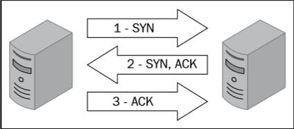
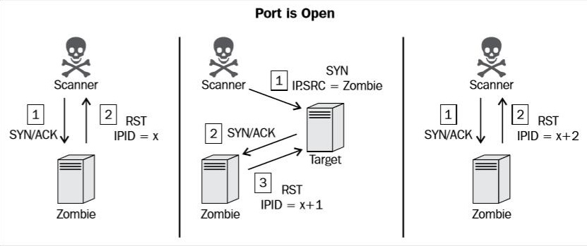
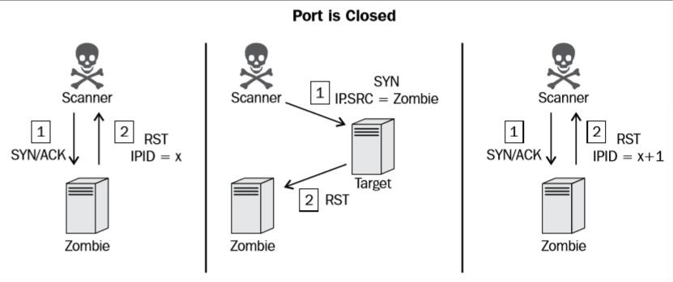
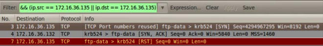
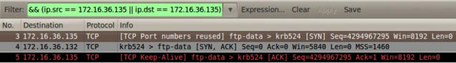

# 第三章 端口扫描

> 作者：Justin Hutchens

> 译者：[飞龙](https://github.com/)

> 协议：[CC BY-NC-SA 4.0](http://creativecommons.org/licenses/by-nc-sa/4.0/)

确定目标的攻击面的下一步，是识别目标系统上的开放端口。开放端口对应系统上运行的联网服务。编程错误或实施缺陷可能使这些服务存在漏洞，有时可能导致系统的全面沦陷。要为了定可能的攻击向量，必须首先枚举项目范围内的所有远程系统上的开放端口。这些开放端口对应可以用 UDP 或 TCP 流量访问的服务。 TCP 和 UDP 都是传输协议。传输控制协议（TCP）更加常用，并提供面向连接的通信。用户数据报协议（UDP）是一种面向非连接的协议，有时用于传输速度比数据完整性更重要的服务。用于枚举这些服务的渗透测试技术称为端口扫描。与上一章讨论的主机发现不同，这些技术应该产生足够的信息，来识别服务是否与设备或服务器上的给定端口相关。

在讲解特定秘籍之前，我们首先要讨论一些有关端口端口的底层原理，你应该理解它们。

## 3.1 UDP端口扫描

由于 TCP 是更加常用的传输层协议，使用 UDP 的服务常常被人遗忘。虽然 UDP 服务本质上拥有被忽视的趋势，这些服务可以枚举，用来完全理解任何给定目标的工具面，这相当关键。UDP 扫描通常由挑战性，麻烦，并且消耗时间。这一章的前三个秘籍会涉及如何在 Kali 中使用不同工具执行 UDP 扫描。理解 UDP 扫描可以用两种不同的方式执行相当重要。一种技巧会在第一个秘籍中强调，它仅仅依赖于 ICMP 端口不可达响应。这类型的扫描依赖于任何没有绑定某个服务的 UDP 端口都会返回 ICP 端口不可达响应的假设。所以不返回这种响应就代表拥有服务。虽然这种方法在某些情况下十分高效，在主机不生成端口不可达响应，或者端口不可达响应存在速率限制或被防火墙过滤的情况下，它也会返回不精确的结果。一种替代方式会在第二个和第三个秘籍中讲解，是使用服务特定的探针来尝试请求响应，以表明所预期的服务运行在目标端口上。这个方法非常高效，也非常消耗时间。

## 3.2 TCP 扫描

这一章中，会提及几个不同的 TCP 扫描方式。这些技巧包含隐秘扫描、连接扫描和僵尸扫描。为了理解这些扫描技巧的原理，理解 TCP 如何建立以及维护连接十分重要。TCP 是面向连接的协议，只有连接在两个系统之间建立之后，数据才可以通过 TCP 传输。这个和建立 TCP 连接的过程通常使用三次握手指代。这个内容暗指连接过程涉及的三个步骤。下图展示了这个过程：



TCP SYN 封包从想要建立连接的设备发送，并带有想要连接的设备端口。如果和接收端口关联的服务接收了这个连接，它会向请求系统返回 TCP 封包，其中 SYN 和 ACK 位都是激活的。连接仅仅在请求系统发送 TCP ACK 响应的情况下建立。这个三步过程在两个系统之间建立了 TCP 会话。所有 TCP 端口扫描机制都会执行这个过程的不同变种，来识别远程主机上的活动服务。

连接扫描和隐秘扫描都非常易于理解。连接扫描会为每个扫描端口建立完整的 TCP 连接。这就是说，对于每个扫描的端口，会完成三次握手。如果连接成功建立，端口可以判断为打开的。作为替代，隐秘扫描不建立完整的连接。隐秘扫描也指代 SYN 扫描或半开放扫描。对于每个扫描的端口，指向目标端口发送单个 SYN 封包，所有回复 SYN+ACK 封包的端口假设为运行活动服务。由于初始系统没有发送最后的 ACK，连接只开启了左半边。这用于指代隐秘扫描，是因为日志系统只会记录建立的链接，不会记录任何这种扫描的痕迹。

这一章要讨论的最后一种 TCP 扫描技术叫做僵尸扫描。僵尸扫描的目的是映射远程系统上的所有开放端口，而不会产生任何和系统交互过的痕迹。僵尸扫描背后的工作原理十分复杂。执行僵尸扫描过程需要遵循以下步骤：

1.  将某个远程系统看做你的僵尸。这个系统应该拥有如下特征：

    +   这个系统是限制的，并且和网络上其它系统没有通信。
    +   这个系统使用递增的 IPID 序列。
    
2.  给僵尸主机发送 SYN+ACK 封包并记录初始 IPID 值。

3.  将封包的 IP 源地址伪造成僵尸主机的 IP 地址，并将其发送给目标系统。

4.  取决于扫描目标的端口状态，会发生下列事情之一：

    +   如果端口开放，扫描目标会向僵尸主机返回 SYN+ACK 封包，它相信僵尸主机发送了之前的 SYN 请求。这里，僵尸主机会以 RST 封包回复这个带路不明的 SYN+ACK 封包，并且将 IPID 值增加 1。
    +   如果端口关闭，扫描目标会将 RST 响应返回给僵尸主机，   它相信僵尸主机发送了之前的 SYN 请求。如果这个值增加了 1，那么之后扫描目标上的端口关闭，。如果这个值增加了 2，那么扫描目标的端口开放。
    
5.  向僵尸主机发送另一个 SYN+ACK 封包，并求出所返回的 RST 响应中的最后的 IPID 值。如果这个值增加了 1，那么扫描目标上的端口关闭。如果增加了 2，那么扫描目标上的端口开放。

下面的图展示了当僵尸主机用于扫描开放端口时，所产生的交互。



为了执行僵尸扫描，初始的 SYN+SCK 请求应该发给僵尸系统来判断返回 RST 封包中的当前 IPID 值。之后，将伪造的 SYN 封包发往目标咪表，带有僵尸主机的源 IP 地址。如果端口开放，扫描目标会将 SYN+ACK 响应发回僵尸主机。由于将是主机并没有实际发送之前的 SYN 请求，它会将 SYN+ACK 响应看做来路不明，并将 RST 请求发送回目标主机，因此 IPID 会增加 1。最后，应该向僵尸主机发送另一个 SYN+ACK 封包，这会返回 RST 封包并再次增加 IPID。增加 2 的 IPID 表示所有这些事件都发生了，目标端口是开放的。反之，如果扫描目标的端口是关闭的，会发生一系列不同的事件，这会导致 RST 响应的 IPID 仅仅增加 1。

下面的图展示了当僵尸主机用于扫描关闭端口时，所产生的交互。



如果目标端口关闭，发往僵尸系统的 RST 封包是之前伪造的 SYN 封包的响应。由于 RST 封包没有手造恢复，僵尸系统的 IPID 值不会增加。因此，返回给扫描系统的最后的 RST 封包的 IPID 值只会增加 1。这个过程可以对每个想要扫描的端口执行，它可以用于映射远程系统的开放端口，而不需要留下扫描系统执行了扫描的痕迹。

## 3.3 Scapy UDP 扫描 

Scapy 可以用于向网络构造和注入自定义封包。在这个秘籍中，Scapy 会用于扫描活动的 UDP 服务。这可以通过发送空的 UDP 封包给目标端口，之后识别没有回复 ICMP 不可达响应的端口来实现。

### 准备

为了使用 Scapy 执行 UDP 扫描，你需要一个运行 UDP 网络服务的远程服务器。这个例子中我们使用 Metasploitable2 实例来执行任务。配置 Metasploitable2 的更多信息请参考第一章中的“安装 Metasploitable2”秘籍。

此外，这一节也需要编写脚本的更多信息，请参考第一章中的“使用文本编辑器*VIM 和 Nano）。

### 操作步骤

使用 Scapy，我们就可以快速理解 UDP 扫描原理背后的底层规则。为了确认任何给定端口上是否存在 UDP 服务，我们需要让服务器产生响应。这个证明十分困难，因为许多 UDP 服务都只回复服务特定的请求。任何特定服务的知识都会使正面识别该服务变得容易。但是，有一些通常技巧可以用于判断服务是否运行于给定的 UDP 端口，并且准确率还不错。我们将要使用 Scapy 操作的这种技巧是识别关闭的端口的 ICMP 不可达响应。为了向任何给定端口发送 UDP 请求，我们首先需要构建这个请求的一些层面，我们需要构建的第一层就是 IP 层。

```
root@KaliLinux:~# scapy 
Welcome to Scapy (2.2.0) 
>>> i = IP() 
>>> i.display() 
###[ IP ]###  
    version= 4  
    ihl= None  
    tos= 0x0  
    len= None  
    id= 1  
    flags=   
    frag= 0  
    ttl= 64  
    proto= ip  
    chksum= None  
    src= 127.0.0.1  
    dst= 127.0.0.1  
    \options\ 
>>> i.dst = "172.16.36.135" 
>>> i.display()
###[ IP ]###  
    version= 4  
    ihl= None  
    tos= 0x0  
    len= None  
    id= 1
    flags=   
    frag= 0  
    ttl= 64  
    proto= ip  
    chksum= None  
    src= 172.16.36.180  
    dst= 172.16.36.135  
    \options\ 
```

为了构建请求的 IP 层，我们需要将`IP`对象赋给变量`i`。通过调用`display`函数，我们可以确定对象的属性配置。通常，发送和接受地址都设为回送地址，`127.0.0.1`。这些值可以通过修改目标地址来修改，也就是设置`i.dst`为想要扫描的地址的字符串值。通过再次调用`dislay`函数，我们看到不仅仅更新的目标地址，也自动更新了和默认接口相关的源 IP 地址。现在我们构建了请求的 IP 层，我们可以构建 UDP 层了。

```
>>> u = UDP() 
>>> u.display() 
###[ UDP ]###  
    sport= domain  
    dport= domain  
    len= None  
    chksum= None 
>>> u.dport 
53 
```

为了构建请求的 UDP 层，我们使用和 IP 层相同的技巧。在这个立即中，`UDP`对象赋给了`u`变量。像之前提到的那样，默认的配置可以通过调用`display`函数来确定。这里，我们可以看到来源和目标端口的默认值都是`domain`。你可能已经猜到了，它表示和端口 53 相关的 DNS 服务。DNS 是个常见服务，通常能在网络系统上发现。为了确认它，我们可以通过引用变量名称和数量直接调用该值。之后，可以通过将属性设置为新的目标端口值来修改。

```
>>> u.dport = 123 
>>> u.display() 
###[ UDP ]###
    sport= domain  
    dport= ntp  
    len= None  
    chksum= None 
```

在上面的例子中，目标端口设为`123`，这是 NTP 的端口。既然我们创建了 IP 和 UDP 层，我们需要通过叠放这些层来构造请求。

```
>>> request = (i/u) 
>>> request.display() 
###[ IP ]###  
    version= 4  
    ihl= None  
    tos= 0x0  
    len= None  
    id= 1  
    flags=   
    frag= 0  
    ttl= 64  
    proto= udp  
    chksum= None  
    src= 172.16.36.180  
    dst= 172.16.36.135  
    \options\ 
###[ UDP ]###     
    sport= domain     
    dport= ntp     
    len= None     
    chksum= None
```

我们可以通过以斜杠分离变量来叠放 IP 和 UDP 层。这些层面之后赋给了新的变量，它代表整个请求。我们之后可以调用`dispaly`函数来查看请求的配置。一旦构建了请求，可以将其传递给`sr1`函数来分析响应：

```
>>> response = sr1(request) 
Begin emission: 
......Finished to send 1 packets. 
....*
Received 11 packets, got 1 answers, remaining 0 packets 
>>> response.display() 
###[ IP ]###  
    version= 4L  
    ihl= 5L  
    tos= 0xc0  
    len= 56  
    id= 63687  
    flags=   
    frag= 0L  
    ttl= 64  
    proto= icmp  
    chksum= 0xdfe1  
    src= 172.16.36.135  
    dst= 172.16.36.180  
    \options\ 
###[ ICMP ]###     
    type= dest-unreach     
    code= port-unreachable     
    chksum= 0x9e72     
    unused= 0 
###[ IP in ICMP ]###        
    version= 4L        
    ihl= 5L        
    tos= 0x0        
    len= 28        
    id= 1        
    flags=         
    frag= 0L        
    ttl= 64        
    proto= udp        
    chksum= 0xd974        
    src= 172.16.36.180        
    dst= 172.16.36.135        
    \options\
###[ UDP in ICMP ]###           
    sport= domain           
    dport= ntp           
    len= 8           
    chksum= 0x5dd2 
```

相同的请求可以不通过构建和堆叠每一层来执行。反之，我们使用单独的一条命令，通过直接调用函数并传递合适的参数：

```
>>> sr1(IP(dst="172.16.36.135")/UDP(dport=123)) 
..Begin emission: 
...*Finished to send 1 packets.

Received 6 packets, got 1 answers, remaining 0 packets 
<IP  version=4L ihl=5L tos=0xc0 len=56 id=63689 flags= frag=0L ttl=64 proto=icmp chksum=0xdfdf src=172.16.36.135 dst=172.16.36.180 options=[] |<ICMP  type=dest-unreach code=port-unreachable chksum=0x9e72 unused=0 |<IPerror  version=4L ihl=5L tos=0x0 len=28 id=1 flags= frag=0L ttl=64 proto=udp chksum=0xd974 src=172.16.36.180 dst=172.16.36.135 options=[] |<UDPerror  sport=domain dport=ntp len=8 chksum=0x5dd2 |>>>>
```

要注意这些请求的响应包括 ICMP 封包，它的`type`表示主机不可达，它的`code`表示端口不可达。这个响应通常在 UDP 端口关闭时返回。现在，我们应该尝试修改请求，使其发送到对应远程系统上的真正服务的目标端口。为了实现它，我们将目标端口修改会`53`，之后再次发送请求，像这样：

```
>>> response = sr1(IP(dst="172.16.36.135")/UDP(dport=53),timeout=1,verbo se=1) 
Begin emission: 
Finished to send 1 packets.

Received 8 packets, got 0 answers, remaining 1 packets
```

当相同请求发送到真正的服务时，没有收到回复。这是因为 DNS 服务运行在系统的 UDP 端口 53 上，仅仅响应服务特定的请求。这一差异可以用于扫描 ICMP 不可达响应，我们可以通过扫描无响应的端口来确定潜在的服务：

```py
#!/usr/bin/python

import logging
logging.getLogger("scapy.runtime").setLevel(logging.ERROR)

from scapy.all import * 
import time 
import sys

if len(sys.argv) != 4:   
    print "Usage - ./udp_scan.py [Target-IP] [First Port] [Last Port]"   
    print "Example - ./udp_scan.py 10.0.0.5 1 100"   
    print "Example will UDP port scan ports 1 through 100 on 10.0.0.5" 
sys.exit()

ip = sys.argv[1] 
start = int(sys.argv[2]) 
end = int(sys.argv[3])

for port in range(start,end):   
    ans = sr1(IP(dst=ip)/UDP(dport=port),timeout=5,verbose=0)   
    time.sleep(1)   
    if ans == None:      
        print port   
    else:      
        pass 
```

上面的 Python 脚本向序列中前一百个端口中的每个端口发送 UDP 请求。这里没有接受到任何响应，端口可以认为是开放的。通过运行这个脚本，我们可以识别所有不返回 ICMP 不可达响应的端口：

```
root@KaliLinux:~# chmod 777 udp_scan.py 
root@KaliLinux:~# ./udp_scan.py 
Usage - ./udp_scan.py [Target-IP] [First Port] [Last Port] 
Example - ./udp_scan.py 10.0.0.5 1 100 
Example will UDP port scan ports 1 through 100 on 10.0.0.5 
root@KaliLinux:~ # ./udp_scan.py 172.16.36.135 1 100 
53 
68 
69
```

超时为`5`秒用于接受受到 ICMP 不可达速率限制的响应。即使拥有了更大的响应接收窗口，这种方式的扫描仍然有时不可靠。这就是 UDP 探测扫描是更加高效的替代方案的原因。

### 工作原理

这个秘籍中，UDP 扫描通过识别不回复 ICMP 端口不可达响应的端口来识别。这个过程非常耗费时间，因为 ICMP 端口不可达响应通常有速率限制。有时候，对于不生成这种响应的系统，这种方式会不可靠，并且 ICMP 通常会被防火墙过滤。替代方式就是使用服务特定的探针来请求正面的响应。这个技巧会在下面的两个秘籍中展示。

## 3.4 Nmap UDP 扫描

Nmap 拥有可以执行远程系统上的 UDP 扫描的选项。Nmap 的 UDP 扫描方式更加复杂，它通过注入服务特定的谭泽请求，来请求正面的响应，用于确认指定服务的存在，来识别活动服务。这个秘籍演示了如何使用 Nmap UDP 扫描来扫描单一端口，多个端口，甚至多个系统。

### 准备

为了使用 Nmap 执行 UDP 扫描，你需要一个运行 UDP 网络服务的远程服务器。这个例子中我们使用 Metasploitable2 实例来执行任务。配置 Metasploitable2 的更多信息请参考第一章中的“安装 Metasploitable2”秘籍。

### 操作步骤

UDP 扫描通常由挑战性，消耗时间，非常麻烦。许多系统会限制 ICMp 主机不可达响应，并且增加扫描大量端口或系统所需的时间总数。幸运的是，Nmap 的开发者拥有更加复杂和高效的工具来识别远程系统上的 UDP 服务。为了使用 Nmap 执行 UDP 扫描，需要使用`-sU`选项，并带上需要扫描的主机 IP 地址。

```
root@KaliLinux:~# nmap -sU 172.16.36.135

Starting Nmap 6.25 ( http://nmap.org ) at 2013-12-17 21:04 EST
Nmap scan report for 172.16.36.135 
Host is up (0.0016s latency). 
Not shown: 993 closed ports 
PORT     STATE         SERVICE 
53/udp   open          domain
68/udp   open|filtered dhcpc 
69/udp   open|filtered tftp 
111/udp  open          rpcbind 
137/udp  open          netbios-ns 
138/udp  open|filtered netbios-dgm 
2049/udp open          nfs 
MAC Address: 00:0C:29:3D:84:32 (VMware)

Nmap done: 1 IP address (1 host up) scanned in 1043.91 seconds
```

虽然 Nmap 使用针对多种服务的自定义载荷来请求 UDP 端口的响应。在没有使用其它参数来指定目标端口时，它仍旧需要大量时间来扫描默认的 1000 个端口。你可以从扫描元数据中看到，默认的扫描需要将近 20 分钟来完成。作为替代，我们可以缩短所需的扫描时间，通过使用下列名Ingles执行针对性扫描：

```
root@KaliLinux:~# nmap 172.16.36.135 -sU -p 53


Starting Nmap 6.25 ( http://nmap.org ) at 2013-12-17 21:05 EST 
Nmap scan report for 172.16.36.135 
Host is up (0.0010s latency). 
PORT   STATE SERVICE 53/udp open  
domain MAC Address: 00:0C:29:3D:84:32 (VMware)

Nmap done: 1 IP address (1 host up) scanned in 13.09 seconds 
```

如果我们指定了需要扫描的特定端口，执行 UDP 扫描所需的的时间总量可以极大江少。这可以通过执行 UDP 扫描并且使用`-p`选项指定端口来实现。在下面的例子中，我们仅仅在`53`端口上执行扫描，来尝试识别 DNS 服务。也可以在多个指定的端口上指定扫描，像这样：

```
root@KaliLinux:~# nmap 172.16.36.135 -sU -p 1-100

Starting Nmap 6.25 ( http://nmap.org ) at 2013-12-17 21:06 EST 
Nmap scan report for 172.16.36.135 
Host is up (0.00054s latency). 
Not shown: 85 open|filtered ports
PORT   STATE  SERVICE 
8/udp  closed unknown 
15/udp closed unknown 
28/udp closed unknown 
37/udp closed time 
45/udp closed mpm 
49/udp closed tacacs 
53/udp open   domain 
56/udp closed xns-auth 
70/udp closed gopher 
71/udp closed netrjs-1 
74/udp closed netrjs-4 
89/udp closed su-mit-tg 
90/udp closed dnsix 
95/udp closed supdup 
96/udp closed dixie 
MAC Address: 00:0C:29:3D:84:32 (VMware)

Nmap done: 1 IP address (1 host up) scanned in 23.56 seconds 
```

在这个例子中，扫描在前 100 个端口上执行。这通过使用破折号符号，并指定要扫描的第一个和最后一个端口来完成。Nmap 之后启动多个进程，会同时扫描这两个值之间的多有端口。在一些情况下，UDP 分析需要在多个系统上执行。可以使用破折号符号，并且定义最后一个 IP 段的值的范围，来扫描范围内的主机。

```
root@KaliLinux:~# nmap 172.16.36.0-255 -sU -p 53

Starting Nmap 6.25 ( http://nmap.org ) at 2013-12-17 21:08 EST 
Nmap scan report for 172.16.36.1 
Host is up (0.00020s latency). 
PORT   STATE  SERVICE 
53/udp closed domain 
MAC Address: 00:50:56:C0:00:08 (VMware)

Nmap scan report for 172.16.36.2 
Host is up (0.039s latency).
PORT   STATE  SERVICE 
53/udp closed domain 
MAC Address: 00:50:56:FF:2A:8E (VMware)

Nmap scan report for 172.16.36.132 
Host is up (0.00065s latency). 
PORT   STATE  SERVICE 
53/udp closed domain 
MAC Address: 00:0C:29:65:FC:D2 (VMware)

Nmap scan report for 172.16.36.135 
Host is up (0.00028s latency). 
PORT   STATE SERVICE 
53/udp open  domain 
MAC Address: 00:0C:29:3D:84:32 (VMware)

Nmap done: 256 IP addresses (6 hosts up) scanned in 42.81 seconds
```
这个例子中，扫描对`172.16.36.0/24 `中所有活动主机执行。每个主机都被扫描来识别是否在 53 端口上运行了 DNS 服务。另一个用于扫描多个主机替代选项，就是使用 IP 地址输入列表。为了这样做，使用`-iL`选项，并且应该传入相同目录下的文件名称，或者单独目录下的完成文件路径。前者的例子如下：

```
root@KaliLinux:~# nmap -iL iplist.txt -sU -p 123

Starting Nmap 6.25 ( http://nmap.org ) at 2013-12-17 21:16 EST 
Nmap scan report for 172.16.36.1 
Host is up (0.00017s latency). 
PORT    STATE SERVICE 
123/udp open  ntp 
MAC Address: 00:50:56:C0:00:08 (VMware)

Nmap scan report for 172.16.36.2 
Host is up (0.00025s latency). 
PORT    STATE         SERVICE 
123/udp open|filtered ntp
MAC Address: 00:50:56:FF:2A:8E (VMware)

Nmap scan report for 172.16.36.132 
Host is up (0.00040s latency). 
PORT    STATE  SERVICE 
123/udp closed ntp 
MAC Address: 00:0C:29:65:FC:D2 (VMware)

Nmap scan report for 172.16.36.135 
Host is up (0.00031s latency). 
PORT    STATE  SERVICE 
123/udp closed ntp 
MAC Address: 00:0C:29:3D:84:32 (VMware)

Nmap done: 4 IP addresses (4 hosts up) scanned in 13.27 seconds
```

这个例子中，执行了扫描来判断 NTP 服务是否运行在当前执行目录中的`iplist.txt `文件内的任何系统的 123 端口上。

### 工作原理

虽然 Nmap 仍然含有许多和 UDP 扫描相关的相同挑战，它仍旧是个极其高效的解决方案，因为它使用最高效和快速的技巧组合来识别活动服务。

## 3.5 Metasploit UDP 扫描

Metasploit 拥有一个辅助模块，可以用于扫描特定的常用 UDP 端口。这个秘籍展示了如何使用这个辅助模块来扫描运行 UDP 服务的单个系统或多个系统。

### 准备

为了使用 Metasploit 执行 UDP 扫描，你需要一个运行 UDP 网络服务的远程服务器。这个例子中我们使用 Metasploitable2 实例来执行任务。配置 Metasploitable2 的更多信息请参考第一章中的“安装 Metasploitable2”秘籍。

### 操作步骤

在定义所运行的模块之前，需要打开 Metasploit。为了在 Kali 中打开它，我们在终端会话中执行`msfconsole`命令。

```
root@KaliLinux:~# msfconsole 
# cowsay++
 ____________
 < metasploit >
 -----------
        \   ,__,       
         \  (oo)____           
            (__)    )\           
               ||--|| *

Large pentest? List, sort, group, tag and search your hosts and services in Metasploit Pro -- type 'go_pro' to launch it now.
       
       =[ metasploit v4.6.0-dev [core:4.6 api:1.0] 
+ -- --=[ 1053 exploits - 590 auxiliary - 174 post 
+ -- --=[ 275 payloads - 28 encoders - 8 nops

msf > use auxiliary/scanner/discovery/udp_sweep 
msf  auxiliary(udp_sweep) > show options

Module options (auxiliary/scanner/discovery/udp_sweep):
   
    Name       Current Setting  Required  Description   
    ----       ---------------  --------  ----------   
    BATCHSIZE  256              yes       The number of hosts to probe in each set   
    CHOST                       no        The local client address   
    RHOSTS                      yes       The target address range or CIDR identifier   
    THREADS    1                yes       The number of concurrent threads
```

为了在 Metasploit 中运行 UDP 扫描模块，我们以模块的相对路径调用`use`命令。一旦选择了模块，可以使用`show options`命令来确认或更改扫描配置。这个命令会展示四个列的表格，包括`name`、`current settings`、`required`和`description`。`name`列标出了每个可配置变量的名称。`current settings`列列出了任何给定变量的现有配置。`required`列标出对于任何给定变量，值是否是必须的。`description`列描述了每个变量的功能。任何给定变量的值可以使用`set`命令，并且将新的值作为参数来修改。

```
msf  auxiliary(udp_sweep) > set RHOSTS 172.16.36.135 
RHOSTS => 172.16.36.135 
msf  auxiliary(udp_sweep) > set THREADS 20 
THREADS => 20 
msf  auxiliary(udp_sweep) > show options

Module options (auxiliary/scanner/discovery/udp_sweep):

    Name       Current Setting  Required  Description   
    ----       ---------------  --------  ----------   
    BATCHSIZE  256              yes       The number of hosts to probe in each set   
    CHOST                       no        The local client address   
    RHOSTS     172.16.36.135    yes       The target address range or CIDR identifier   
    THREADS    20               yes       The number of concurrent threads
```

在上面的例子中，`RHOSTS`值修改为我们打算扫描的远程系统的 IP 地址。此外，线程数量修改为 20。`THREADS`的值定义了在后台执行的当前任务数量。确定线程数量涉及到寻找一个平衡，既能提升任务速度，又不会过度消耗系统资源。对于多数系统，20 个线程可以足够快，并且相当合理。修改了必要的变量之后，可以再次使用`show options`命令来验证。一旦所需配置验证完毕，就可以执行扫描了。

```
msf  auxiliary(udp_sweep) > run

[*] Sending 12 probes to 172.16.36.135->172.16.36.135 (1 hosts) 
[*] Discovered Portmap on 172.16.36.135:111 (100000 v2 TCP(111), 100000 v2 UDP(111), 100024 v1 UDP(36429), 100024 v1 TCP(56375), 100003 v2 UDP(2049), 100003 v3 UDP(2049), 100003 v4 UDP(2049), 100021 v1 UDP(34241), 100021 v3 UDP(34241), 100021 v4 UDP(34241), 100003 v2 TCP(2049), 100003 v3 TCP(2049), 100003 v4 TCP(2049), 100021 v1 TCP(50333), 100021 v3 TCP(50333), 100021 v4 TCP(50333), 100005 v1 UDP(47083), 100005 v1 TCP(57385), 100005 v2 UDP(47083), 100005 v2 TCP(57385), 100005 v3 UDP(47083), 100005 v3 TCP(57385)) 
[*] Discovered NetBIOS on 172.16.36.135:137 (METASPLOITABLE:<00>:U :METASPLOITABLE:<03>:U :METASPLOITABLE:<20>:U :__MSBROWSE__:<01>:G :WORKGROUP:<00>:G :WORKGROUP:<1d>:U :WORKGROUP:<1e>:G :00:00:00:00:00:00) 
[*] Discovered DNS on 172.16.36.135:53 (BIND 9.4.2) 
[*] Scanned 1 of 1 hosts (100% complete) 
[*] Auxiliary module execution completed
```

Metasploit 中所使用的`run`命令用于执行所选的辅助模块。在上面的例子中，`run`命令对指定的 IP 地址执行 UDP 扫描。`udp_sweep`模块也可以使用破折号符号，对地址序列执行扫描。

```
msf  auxiliary(udp_sweep) > set RHOSTS 172.16.36.1-10 
RHOSTS => 172.16.36.1-10 
msf  auxiliary(udp_sweep) > show options

Module options (auxiliary/scanner/discovery/udp_sweep):

    Name       Current Setting  Required  Description   
    ----       ---------------  --------  ----------   
    BATCHSIZE  256              yes       The number of hosts to probe in each set   
    CHOST                       no        The local client address   
    RHOSTS     172.16.36.1-10   yes       The target address range or CIDR identifier   
    THREADS    20               yes       The number of concurrent threads

msf  auxiliary(udp_sweep) > run

[*] Sending 12 probes to 172.16.36.1->172.16.36.10 (10 hosts) 
[*] Discovered NetBIOS on 172.16.36.1:137 (MACBOOKPRO-3E0F:<00>:U :00:50:56:c0:00:08) 
[*] Discovered NTP on 172.16.36.1:123 (NTP v4 (unsynchronized)) 
[*] Discovered DNS on 172.16.36.2:53 (BIND 9.3.6-P1-RedHat-9.3.6-20. P1.el5_8.6)
[*] Scanned 10 of 10 hosts (100% complete) 
[*] Auxiliary module execution completed
```

在上面的例子中，UDP 扫描对 10 个主机地址执行，它们由`RHOSTS`变量指定。与之相似，`RHOSTS`可以使用`CIDR`记法来定义网络范围，像这样：

```
msf  auxiliary(udp_sweep) > set RHOSTS 172.16.36.0/24 
RHOSTS => 172.16.36.0/24 
msf  auxiliary(udp_sweep) > show options

Module options (auxiliary/scanner/discovery/udp_sweep):

   Name       Current Setting  Required  Description   
   ----       ---------------  --------  ----------   
   BATCHSIZE  256              yes       The number of hosts to probe in each set   
   CHOST                       no        The local client address   
   RHOSTS     172.16.36.0/24   yes       The target address range or CIDR identifier   
   THREADS    20               yes       The number of concurrent threads

msf  auxiliary(udp_sweep) > run

[*] Sending 12 probes to 172.16.36.0->172.16.36.255 (256 hosts) 
[*] Discovered Portmap on 172.16.36.135:111 (100000 v2 TCP(111), 100000 v2 UDP(111), 100024 v1 UDP(36429), 100024 v1 TCP(56375), 100003 v2 UDP(2049), 100003 v3 UDP(2049), 100003 v4 UDP(2049), 100021 v1 UDP(34241), 100021 v3 UDP(34241), 100021 v4 UDP(34241), 100003 v2 TCP(2049), 100003 v3 TCP(2049), 100003 v4 TCP(2049), 100021 v1 TCP(50333), 100021 v3 TCP(50333), 100021 v4 TCP(50333), 100005 v1 UDP(47083), 100005 v1 TCP(57385), 100005 v2 UDP(47083), 100005 v2 TCP(57385), 100005 v3 UDP(47083), 100005 v3 TCP(57385)) 
[*] Discovered NetBIOS on 172.16.36.135:137 (METASPLOITABLE:<00>:U :METASPLOITABLE:<03>:U :METASPLOITABLE:<20>:U :__MSBROWSE__:<01>:G :WORKGROUP:<00>:G :WORKGROUP:<1d>:U :WORKGROUP:<1e>:G :00:00:00:00:00:00) 
[*] Discovered NTP on 172.16.36.1:123 (NTP v4 (unsynchronized)) 
[*] Discovered NetBIOS on 172.16.36.1:137 (MACBOOKPRO-3E0F:<00>:U :00:50:56:c0:00:08) [*] Discovered DNS on 172.16.36.0:53 (BIND 9.3.6-P1-RedHat-9.3.6-20. P1.el5_8.6)

[*] Discovered DNS on 172.16.36.2:53 (BIND 9.3.6-P1-RedHat-9.3.6-20. P1.el5_8.6) 
[*] Discovered DNS on 172.16.36.135:53 (BIND 9.4.2) 
[*] Discovered DNS on 172.16.36.255:53 (BIND 9.3.6-P1-RedHat-9.3.6-20. P1.el5_8.6) 
[*] Scanned 256 of 256 hosts (100% complete) 
[*] Auxiliary module execution completed
```

### 工作原理

Metasploit 辅助模块中的 UDP 扫描比起 Nmap 更加简单。它仅仅针对有限的服务数量，但是在识别端口上的活动服务方面更加高效，并且比其它可用的 UDP 扫描器更快。

## 3.6 Scapy 隐秘扫描

执行 TCP 端口扫描的一种方式就是执行一部分。目标端口上的 TCP 三次握手用于识别端口是否接受连接。这一类型的扫描指代隐秘扫描， SYN 扫描，或者半开放扫描。这个秘籍演示了如何使用 Scapy 执行 TCP 隐秘扫描。

### 准备

为了使用 Scapy 执行 TCP 隐秘 扫描，你需要一个运行 TCP 网络服务的远程服务器。这个例子中我们使用 Metasploitable2 实例来执行任务。配置 Metasploitable2 的更多信息请参考第一章中的“安装 Metasploitable2”秘籍。

此外，这一节也需要编写脚本的更多信息，请参考第一章中的“使用文本编辑器*VIM 和 Nano）。

### 操作步骤

为了展示如何执行 SYN 扫描，我们需要使用 Scapy 构造 TCP SYN 请求，并识别和开放端口、关闭端口以及无响应系统有关的响应。为了向给定端口发送 TCP SYN 请求，我们首先需要构建请求的各个层面。我们需要构建的第一层就是 IP 层：

```
root@KaliLinux:~# scapy 
Welcome to Scapy (2.2.0) 
>>> i = IP() 
>>> i.display()
###[ IP ]###  
    version= 4  
    ihl= None  
    tos= 0x0  
    len= None  
    id= 1  
    flags=   
    frag= 0  
    ttl= 64  
    proto= ip  
    chksum= None  
    src= 127.0.0.1  
    dst= 127.0.0.1  
    \options\ 
>>> i.dst = "172.16.36.135" 
>>> i.display() 
###[ IP ]###  
    version= 4  
    ihl= None  
    tos= 0x0  
    len= None  
    id= 1  
    flags=   
    frag= 0  
    ttl= 64  
    proto= ip  
    chksum= None  
    src= 172.16.36.180  
    dst= 172.16.36.135  
    \options\
```

为了构建请求的 IP 层，我们需要将`IP`对象赋给变量`i`。通过调用`display`函数，我们可以确定对象的属性配置。通常，发送和接受地址都设为回送地址，`127.0.0.1`。这些值可以通过修改目标地址来修改，也就是设置`i.dst`为想要扫描的地址的字符串值。通过再次调用`dislay`函数，我们看到不仅仅更新的目标地址，也自动更新了和默认接口相关的源 IP 地址。现在我们构建了请求的 IP 层，我们可以构建 TCP 层了。

```
>>> t = TCP() 
>>> t.display() 
###[ TCP ]###  
    sport= ftp_data  
    dport= http  
    seq= 0  
    ack= 0  
    dataofs= None  
    reserved= 0  
    flags= S  
    window= 8192  
    chksum= None  
    urgptr= 0  
    options= {}
```

为了构建请求的 TCP 层，我们使用和 IP 层相同的技巧。在这个立即中，`TCP`对象赋给了`t`变量。像之前提到的那样，默认的配置可以通过调用`display`函数来确定。这里我们可以看到目标端口的默认值为 HTTP 端口 80。对于我们的首次扫描，我们将 TCP 设置保留默认。现在我们创建了 TCP 和 IP 层，我们需要将它们叠放来构造请求。

```
>>> request = (i/t) 
>>> request.display() 
###[ IP ]###  
    version= 4  
    ihl= None  
    tos= 0x0  
    len= None  
    id= 1
    flags=   
    frag= 0  
    ttl= 64  
    proto= tcp  
    chksum= None  
    src= 172.16.36.180  
    dst= 172.16.36.135  
    \options\ 
###[ TCP ]###     
    sport= ftp_data     
    dport= http     
    seq= 0     
    ack= 0     
    dataofs= None     
    reserved= 0     
    flags= S     
    window= 8192     
    chksum= None     
    urgptr= 0     
    options= {}
```

我们可以通过以斜杠分离变量来叠放 IP 和 TCP 层。这些层面之后赋给了新的变量，它代表整个请求。我们之后可以调用`dispaly`函数来查看请求的配置。一旦构建了请求，可以将其传递给`sr1`函数来分析响应：

```
>>> response = sr1(request) 
...Begin emission: 
........Finished to send 1 packets. 
....* 
Received 16 packets, got 1 answers, remaining 0 packets 
>>> response.display() 
###[ IP ]###  
    version= 4L  
    ihl= 5L  
    tos= 0x0  
    len= 44
    id= 0  
    flags= DF  
    frag= 0L  
    ttl= 64  
    proto= tcp  
    chksum= 0x9970  
    src= 172.16.36.135  
    dst= 172.16.36.180  
    \options\ 
###[ TCP ]###     
    sport= http     
    dport= ftp_data     
    seq= 2848210323L     
    ack= 1     
    dataofs= 6L     
    reserved= 0L     
    flags= SA     
    window= 5840     
    chksum= 0xf82d     
    urgptr= 0     
    options= [('MSS', 1460)] 
###[ Padding ]###        
    load= '\x00\x00'
```

相同的请求可以不通过构建和堆叠每一层来执行。反之，我们使用单独的一条命令，通过直接调用函数并传递合适的参数：

```
>>> sr1(IP(dst="172.16.36.135")/TCP(dport=80)) 
.Begin emission: .............Finished to send 1 packets. 
....* 
Received 19 packets, got 1 answers, remaining 0 packets 
<IP  version=4L ihl=5L tos=0x0 len=44 id=0 flags=DF frag=0L ttl=64 proto=tcp chksum=0x9970 src=172.16.36.135 dst=172.16.36.180 options=[] |<TCP  sport=http dport=ftp_data seq=542529227 ack=1 dataofs=6L reserved=0L flags=SA window=5840 chksum=0x6864 urgptr=0 options=[('MSS', 1460)] |<Padding  load='\x00\x00' |>>>
```

要注意当 SYN 封包发往目标 Web 服务器的 TCP 端口 80，并且该端口上运行了 HTTP 服务时，响应中会带有 TCP 标识 SA 的值，这表明 SYN 和 ACK 标识都被激活。这个响应表明特定的目标端口是开放的，并接受连接。如果相同类型的封包发往不接受连接的端口，会收到不同的请求。

```
>>> response = sr1(IP(dst="172.16.36.135")/TCP(dport=4444)) 
..Begin emission: 
.Finished to send 1 packets. 
...* Received 7 packets, got 1 answers, remaining 0 packets 
>>> response.display() 
###[ IP ]###  
    version= 4L  
    ihl= 5L  
    tos= 0x0  
    len= 40  
    id= 0  
    flags= DF  
    frag= 0L 
    ttl= 64  
    proto= tcp 
    chksum= 0x9974 
    src= 172.16.36.135 
    dst= 172.16.36.180 
    \options\ 
###[ TCP ]###  
    sport= 4444    
    dport= ftp_data 
    seq= 0   
    ack= 1   
    dataofs= 5L  
    reserved= 0L  
    flags= RA  
    window= 0    
    chksum= 0xfd03   
    urgptr= 0
    options= {} 
###[ Padding ]###   
    load= '\x00\x00\x00\x00\x00\x00'
```

当 SYN 请求发送给关闭的端口时，返回的响应中带有 TCP 标识 RA，这表明 RST 和 ACK 标识为都被激活。ACK 为仅仅用于承认请求被接受，RST 为用于断开连接，因为端口不接受连接。作为替代，如果 SYN 封包发往崩溃的系统，或者防火墙过滤了这个请求，就可能接受不到任何信息。由于这个原因，在`sr1 `函数在脚本中使用时，应该始终使用`timeout`选项，来确保脚本不会在无响应的主机上挂起。

```
>>> response = sr1(IP(dst="172.16.36.136")/TCP(dport=4444),timeout=1,verb ose=1) 
Begin emission: 
Finished to send 1 packets

Received 15 packets, got 0 answers, remaining 1 packets 
```

如果函数对无响应的主机使用时，`timeout`值没有指定，函数会无限继续下去。这个演示中，`timout`值为 1秒，用于使这个函数更加完备，响应的值可以用于判断是否收到了响应：

```
root@KaliLinux:~# 
python Python 2.7.3 (default, Jan  2 2013, 16:53:07) 
[GCC 4.7.2] on linux2 
Type "help", "copyright", "credits" or "license" for more information. 
>>> from scapy.all import * 
>>> response = sr1(IP(dst="172.16.36.136")/TCP(dport=4444),timeout=1,verb ose=1) 
Begin emission: 
WARNING: Mac address to reach destination not found. Using broadcast. Finished to send 1 packets.

Received 15 packets, got 0 answers, remaining 1 packets 
>>> if response == None: 
...     print "No Response!!!" 
... 
No Response!!!
```

Python 的使用使其更易于测试变量来识别`sr1`函数是否对其复制。这可以用作初步检验，来判断是否接收到了任何响应。对于接收到的响应，可以执行一系列后续检查来判断响应表明端口开放还是关闭。这些东西可以轻易使用 Python 脚本来完成，像这样：

```py
#!/usr/bin/python

import logging 
logging.getLogger("scapy.runtime").setLevel(logging.ERROR) 
from scapy.all import * 
import sys

if len(sys.argv) != 4:   
    print "Usage - ./syn_scan.py [Target-IP] [First Port] [Last Port]"   
    print "Example - ./syn_scan.py 10.0.0.5 1 100"   
    print "Example will TCP SYN scan ports 1 through 100 on 10.0.0.5"   
    sys.exit()

ip = sys.argv[1] 
start = int(sys.argv[2]) 
end = int(sys.argv[3])

for port in range(start,end):   
    ans = sr1(IP(dst=ip)/TCP(dport=port),timeout=1,verbose=0)   
    if ans == None:      
        pass   
    else:      
        if int(ans[TCP].flags) == 18:    
            print port  
        else:       
            pass 
```

在这个 Python 脚本中，用于被提示来输入 IP 地址，脚本之后会对定义好的端口序列执行 SYN 扫描。脚本之后会得到每个连接的响应，并尝试判断响应的 SYN 和 ACK 标识是否激活。如果响应中出现并仅仅出现了这些标识，那么会输出相应的端口号码。

```
root@KaliLinux:~# chmod 777 syn_scan.py 
root@KaliLinux:~# ./syn_scan.py 
Usage - ./syn_scan.py [Target-IP] [First Port] [Last Port] 
Example - ./syn_scan.py 10.0.0.5 1 100 
Example will TCP SYN scan ports 1 through 100 on 10.0.0.5 
root@KaliLinux:~# ./syn_scan.py 172.16.36.135 1 100

21 
22 
23 
25 
53 
80 
```

运行这个脚本之后，输出会显示所提供的 IP 地址的系统上，前 100 个端口中的开放端口。

### 工作原理

这一类型的扫描由发送初始 SYN 封包给远程系统的目标 TCP 端口，并且通过返回的响应类型来判断端口状态来完成。如果远程系统返回了 SYN+ACK 响应，那么它正在准备建立连接，我们可以假设这个端口开放。如果服务返回了 RST 封包，这就表明端口关闭并且不接收连接。此外，如果没有返回响应，扫描系统和远程系统之间可能存在防火墙，它丢弃了请求。这也可能表明主机崩溃或者目标 IP 上没有关联任何系统。

## 3.7 Nmap 隐秘扫描

Nmap 拥有可以执行远程系统 SYN 扫描的扫描模式。这个秘籍展示了如何使用 Nmap 执行 TCP 隐秘扫描。

### 准备

为了使用 Nmap 执行 TCP 隐秘扫描，你需要一个运行 TCP 网络服务的远程服务器。这个例子中我们使用 Metasploitable2 实例来执行任务。配置 Metasploitable2 的更多信息请参考第一章中的“安装 Metasploitable2”秘籍。

### 操作步骤

就像多数扫描需求那样，Nmap 拥有简化 TCP 隐秘扫描执行过程的选项。为了使用 Nmap 执行 TCP 隐秘扫描，应使用`-sS`选项，并附带被扫描主机的 IP 地址。

```
root@KaliLinux:~# nmap -sS 172.16.36.135 -p 80

Starting Nmap 6.25 ( http://nmap.org ) at 2013-12-17 21:47 EST
Nmap scan report for 172.16.36.135 
Host is up (0.00043s latency). 
PORT   STATE SERVICE 
80/tcp open  http 
MAC Address: 00:0C:29:3D:84:32 (VMware)

Nmap done: 1 IP address (1 host up) scanned in 13.05 seconds 
```

在提供的例子中，特定的 IP 地址的 TCP 80 端口上执行了 TCP 隐秘扫描。和 Scapy 中的技巧相似，Nmap 监听响应并通过分析响应中所激活的 TCP 标识来识别开放端口。我们也可以使用 Nmap 执行多个特定端口的扫描，通过传递逗号分隔的端口号列表。

```
root@KaliLinux:~# nmap -sS 172.16.36.135 -p 21,80,443

Starting Nmap 6.25 ( http://nmap.org ) at 2013-12-17 21:48 EST 
Nmap scan report for 172.16.36.135 
Host is up (0.00035s latency). 
PORT    STATE  SERVICE 
21/tcp  open   ftp 
80/tcp  open   http 
443/tcp closed https 
MAC Address: 00:0C:29:3D:84:32 (VMware)

Nmap done: 1 IP address (1 host up) scanned in 13.05 seconds 
```

在这个例子中，目标 IP 地址的端口 21、80 和 443 上执行了 SYN 扫描。我们也可以使用 Nmap 来扫描主机序列，通过标明要扫描的第一个和最后一个端口号，以破折号分隔：

```
root@KaliLinux:~# nmap -sS 172.16.36.135 -p 20-25

Starting Nmap 6.25 ( http://nmap.org ) at 2013-12-17 21:48 EST 
Nmap scan report for 172.16.36.135 
Host is up (0.00035s latency). 
PORT   STATE  SERVICE 
20/tcp closed ftp-data 
21/tcp open   ftp
22/tcp open   ssh 
23/tcp open   telnet 
24/tcp closed priv-mail 
25/tcp open   smtp 
MAC Address: 00:0C:29:3D:84:32 (VMware)

Nmap done: 1 IP address (1 host up) scanned in 13.05 seconds 
```

在所提供的例子中，SYN 扫描在 TCP 20 到 25 端口上执行。除了拥有指定被扫描端口的能力之外。Nmap 同时拥有配置好的 1000 和常用端口的列表。我们可以执行这些端口上的扫描，通过不带任何端口指定信息来运行 Nmap：

```
root@KaliLinux:~# nmap -sS 172.16.36.135

Starting Nmap 6.25 ( http://nmap.org ) at 2013-12-17 21:46 EST 
Nmap scan report for 172.16.36.135 
Host is up (0.00038s latency). N
ot shown: 977 closed ports 
PORT     STATE SERVICE 
21/tcp   open  ftp 
22/tcp   open  ssh 
23/tcp   open  telnet 
25/tcp   open  smtp 
53/tcp   open  domain 
80/tcp   open  http 
111/tcp  open  rpcbind 
139/tcp  open  netbios-ssn 
445/tcp  open  microsoft-ds 
512/tcp  open  exec 
513/tcp  open  login 
514/tcp  open  shell 
1099/tcp open  rmiregistry 
1524/tcp open  ingreslock 
2049/tcp open  nfs 
2121/tcp open  ccproxy-ftp 
3306/tcp open  mysql
5432/tcp open  postgresql 
5900/tcp open  vnc 
6000/tcp open  X11 
6667/tcp open  irc 
8009/tcp open  ajp13 
8180/tcp open  unknown 
MAC Address: 00:0C:29:3D:84:32 (VMware)

Nmap done: 1 IP address (1 host up) scanned in 13.17 seconds 
```

在上面的例子中，扫描了 Nmap 定义的 1000 个常用端口，用于识别 Metasploitable2  系统上的大量开放端口。虽然这个技巧在是被多数设备上很高效，但是也可能无法识别模糊的服务或者不常见的端口组合。如果扫描在所有可能的 TCP 端口上执行，所有可能的端口地址值都需要被扫描。定义了源端口和目标端口地址的 TCP 头部部分是 16 位长。并且，每一位可以为 1 或者 0。因此，共有`2 ** 16`或者 65536 个可能的 TCP 端口地址。对于要扫描的全部可能的地址空间，需要提供 0 到 65535 的端口范围，像这样：

```
root@KaliLinux:~# nmap -sS 172.16.36.135 -p 0-65535

Starting Nmap 6.25 ( http://nmap.org ) at 2013-12-17 21:51 EST 
Nmap scan report for 172.16.36.135 
Host is up (0.00033s latency). 
Not shown: 65506 closed ports 
PORT      STATE SERVICE 
21/tcp    open  ftp 
22/tcp    open  ssh 
23/tcp    open  telnet 
25/tcp    open  smtp 
53/tcp    open  domain 
80/tcp    open  http 
111/tcp   open  rpcbind 
139/tcp   open  netbios-ssn 
445/tcp   open  microsoft-ds 
512/tcp   open  exec 
513/tcp   open  login 
514/tcp   open  shell
1099/tcp  open  rmiregistry 
1524/tcp  open  ingreslock 
2049/tcp  open  nfs 
2121/tcp  open  ccproxy-ftp 
3306/tcp  open  mysql 
3632/tcp  open  distccd 
5432/tcp  open  postgresql 
5900/tcp  open  vnc 
6000/tcp  open  X11 
6667/tcp  open  irc 
6697/tcp  open  unknown 
8009/tcp  open  ajp13 
8180/tcp  open  unknown 
8787/tcp  open  unknown 
34789/tcp open  unknown 
50333/tcp open  unknown 
56375/tcp open  unknown 
57385/tcp open  unknown 
MAC Address: 00:0C:29:3D:84:32 (VMware)

Nmap done: 1 IP address (1 host up) scanned in 16.78 seconds 
```

这个例子中，Metasploitable2 系统上所有可能的 65536 和 TCP 地址都扫描了一遍。要注意该扫描中识别的多数服务都在标准的 Nmap 1000 扫描中识别过了。这就表明在尝试识别目标的所有可能的攻击面的时候，完整扫描是个最佳实践。Nmap 可以使用破折号记法，扫描主机列表上的 TCP 端口：

```
root@KaliLinux:~# nmap 172.16.36.0-255 -sS -p 80

Starting Nmap 6.25 ( http://nmap.org ) at 2013-12-17 21:56 EST 
Nmap scan report for 172.16.36.1 Host is up (0.00023s latency). 
PORT   STATE  SERVICE 
80/tcp closed http 
MAC Address: 00:50:56:C0:00:08 (VMware)

Nmap scan report for 172.16.36.2 Host is up (0.00018s latency). 
PORT   STATE  SERVICE 
80/tcp closed http 
MAC Address: 00:50:56:FF:2A:8E (VMware)

Nmap scan report for 172.16.36.132 Host is up (0.00047s latency). 
PORT   STATE  SERVICE 
80/tcp closed http 
MAC Address: 00:0C:29:65:FC:D2 (VMware)

Nmap scan report for 172.16.36.135 
Host is up (0.00016s latency). 
PORT   STATE SERVICE 
80/tcp open  http 
MAC Address: 00:0C:29:3D:84:32 (VMware)

Nmap scan report for 172.16.36.180 
Host is up (0.0029s latency). 
PORT   STATE SERVICE 
80/tcp open  http

Nmap done: 256 IP addresses (5 hosts up) scanned in 42.85 seconds 
```

这个例子中，TCP 80 端口的 SYN 扫描在指定地址范围内的所有主机上执行。虽然这个特定的扫描仅仅执行在单个端口上，Nmap 也能够同时扫描多个系统上的多个端口和端口范围。此外，Nmap 也能够进行配置，基于 IP 地址的输入列表来扫描主机。这可以通过`-iL`选项并指定文件名，如果文件存放于执行目录中，或者文件路径来完成。Nmap 之后会遍历输入列表中的每个地址，并对地址执行特定的扫描。

```
root@KaliLinux:~# cat iplist.txt 
172.16.36.1 
172.16.36.2 
172.16.36.132 
172.16.36.135

root@KaliLinux:~# nmap -sS -iL iplist.txt -p 80

Starting Nmap 6.25 ( http://nmap.org ) at 2013-12-17 21:59 EST 
Nmap scan report for 172.16.36.1 
Host is up (0.00016s latency). 
PORT   STATE  SERVICE 
80/tcp closed http 
MAC Address: 00:50:56:C0:00:08 (VMware)

Nmap scan report for 172.16.36.2 
Host is up (0.00047s latency). 
PORT   STATE  SERVICE 
80/tcp closed http 
MAC Address: 00:50:56:FF:2A:8E (VMware)

Nmap scan report for 172.16.36.132 
Host is up (0.00034s latency). 
PORT   STATE  SERVICE 
80/tcp closed http 
MAC Address: 00:0C:29:65:FC:D2 (VMware)

Nmap scan report for 172.16.36.135 
Host is up (0.00016s latency). 
PORT   STATE SERVICE 
80/tcp open  http 
MAC Address: 00:0C:29:3D:84:32 (VMware)

Nmap done: 4 IP addresses (4 hosts up) scanned in 13.05 seconds
```

### 工作原理

Nmap SYN 扫描背后的底层机制已经讨论过了。但是，Nmap 拥有多线程功能，是用于执行这类扫描的快速高效的方式。

## 3.8 Metasploit 隐秘扫描

除了其它已经讨论过的工具之外，Metasploit 拥有用于 SYN 扫描的辅助模块。这个秘籍展示了如何使用 Metasploit 来执行 TCP 隐秘扫描。

### 准备

为了使用 Metasploit 执行 TCP 隐秘扫描，你需要一个运行 TCP 网络服务的远程服务器。这个例子中我们使用 Metasploitable2 实例来执行任务。配置 Metasploitable2 的更多信息请参考第一章中的“安装 Metasploitable2”秘籍。

### 操作步骤

Metasploit 拥有可以对特定 TCP 端口执行 SYN 扫描的辅助模块。为了在 Kali 中启动 Metasploit，我们在终端中执行`msfconsole`命令。

```
root@KaliLinux:~# msfconsole 
IIIIII    dTb.dTb        _.---._
  II     4'  v  'B   .'"".'/|\`.""'.  
  II     6.     .P  :  .' / | \ `.  :  
  II     'T;. .;P'  '.'  /  |  \  `.'  
  II      'T; ;P'    `. /   |   \ .' 
IIIIII     'YvP'       `-.__|__.-'

I love shells --egypt

Using notepad to track pentests? Have Metasploit Pro report on hosts, services, sessions and evidence -- type 'go_pro' to launch it now.

       =[ metasploit v4.6.0-dev [core:4.6 api:1.0] 
+ -- --=[ 1053 exploits - 590 auxiliary - 174 post 
+ -- --=[ 275 payloads - 28 encoders - 8 nops

msf > use auxiliary/scanner/portscan/syn 
msf  auxiliary(syn) > show options

Module options (auxiliary/scanner/portscan/syn):
   
    Name       Current Setting  Required  Description   
    ----       ---------------  --------  ----------   
    BATCHSIZE  256              yes       The number of hosts to scan per set   
    INTERFACE                   no        The name of the interface   
    PORTS      1-10000          yes       Ports to scan (e.g. 2225,80,110-900)   
    RHOSTS                      yes       The target address range or CIDR identifier   
    SNAPLEN    65535            yes       The number of bytes to capture   
    THREADS    1                yes       The number of concurrent threads   
    TIMEOUT    500              yes       The reply read timeout in milliseconds 
```

为了在 Metasploit 中执行 SYN 扫描，以辅助模块的相对路径调用`use`命令。一旦模块被选中，可以执行`show options`命令来确认或修改扫描配置。这个命令会展示四列的表格，包括`name`、`current settings`、`required`和`description`。`name`列标出了每个可配置变量的名称。`current settings`列列出了任何给定变量的现有配置。`required`列标出对于任何给定变量，值是否是必须的。`description`列描述了每个变量的功能。任何给定变量的值可以使用`set`命令，并且将新的值作为参数来修改。

```
msf  auxiliary(syn) > set RHOSTS 172.16.36.135 
RHOSTS => 172.16.36.135 
msf  auxiliary(syn) > set THREADS 20 
THREADS => 20 
msf  auxiliary(syn) > set PORTS 80 
PORTS => 80 
msf  auxiliary(syn) > show options

Module options (auxiliary/scanner/portscan/syn):

   Name       Current Setting  Required  Description   
   ----       ---------------  --------  ----------   
   BATCHSIZE  256              yes       The number of hosts to scan per set
   INTERFACE                   no        The name of the interface   
   PORTS      80               yes       Ports to scan (e.g. 2225,80,110-900)   
   RHOSTS     172.16.36.135    yes       The target address range or CIDR identifier   
   SNAPLEN    65535            yes       The number of bytes to capture   
   THREADS    20               yes       The number of concurrent threads   
   TIMEOUT    500              yes       The reply read timeout in milliseconds
```

在上面的例子中，`RHOSTS`值修改为我们打算扫描的远程系统的 IP 地址。此外，线程数量修改为 20。`THREADS`的值定义了在后台执行的当前任务数量。确定线程数量涉及到寻找一个平衡，既能提升任务速度，又不会过度消耗系统资源。对于多数系统，20 个线程可以足够快，并且相当合理。`PORTS `值设为 TCP 端口 80（HTTP）。修改了必要的变量之后，可以再次使用`show options`命令来验证。一旦所需配置验证完毕，就可以执行扫描了。

```
msf  auxiliary(syn) > run

[*] TCP OPEN 172.16.36.135:80 [*] Scanned 1 of 1 hosts (100% complete) 
[*] Auxiliary module execution completed The run command is used in Metasploit to execute the selected auxiliary module. In the example provided, the run command executed a TCP SYN scan against port 80 of the specified IP address. We can also run this TCP SYN scan module against a sequential series  of TCP ports by supplying the first and last values, separated by a dash notation:

msf  auxiliary(syn) > set PORTS 0-100 
PORTS => 0-100 
msf  auxiliary(syn) > show options

Module options (auxiliary/scanner/portscan/syn):

   Name       Current Setting  Required  Description   
   ----       ---------------  --------  ----------   
   BATCHSIZE  256              yes       The number of hosts to scan per set   
   INTERFACE                   no        The name of the interface
   PORTS      0-100            yes       Ports to scan (e.g. 2225,80,110-900)   
   RHOSTS     172.16.36.135    yes       The target address range or CIDR identifier   
   SNAPLEN    65535            yes       The number of bytes to capture   
   THREADS    20               yes       The number of concurrent threads   
   TIMEOUT    500              yes       The reply read timeout in milliseconds
   
msf  auxiliary(syn) > run

[*]  TCP OPEN 172.16.36.135:21 
[*]  TCP OPEN 172.16.36.135:22 
[*]  TCP OPEN 172.16.36.135:23 
[*]  TCP OPEN 172.16.36.135:25 
[*]  TCP OPEN 172.16.36.135:53 
[*]  TCP OPEN 172.16.36.135:80 
[*] Scanned 1 of 1 hosts (100% complete) 
[*] Auxiliary module execution completed 
```

上面的例子中，所指定的远程主机的钱 100 个 TCP 端口上执行了 TCP SYN 扫描。虽然这个扫描识别了目标系统的多个设备，我们不能确认所有设备都识别出来，除非所有可能的端口地址都扫描到。定义来源和目标端口地址的TCP 头部部分是 16 位长。并且，每一位可以为 1 或者 0。因此，共有`2 ** 16`或 65536 个可能的 TCP 端口地址。对于要扫描的整个地址空间，需要提供 0 到 65535 的 端口范围，像这样：

```
msf  auxiliary(syn) > set PORTS 0-65535 
PORTS => 0-65535 
msf  auxiliary(syn) > show options

Module options (auxiliary/scanner/portscan/syn):

   Name       Current Setting  Required  Description   
   ----       ---------------  --------  ----------   
   BATCHSIZE  256              yes       The number of hosts to scan per set   
   INTERFACE                   no        The name of the interface
   PORTS      0-65535          yes       Ports to scan (e.g. 2225,80,110-900)   
   RHOSTS     172.16.36.135    yes       The target address range or CIDR identifier   
   SNAPLEN    65535            yes       The number of bytes to capture   
   THREADS    20               yes       The number of concurrent threads   
   TIMEOUT    500              yes       The reply read timeout in milliseconds 
   
msf  auxiliary(syn) > run

[*]  TCP OPEN 172.16.36.135:21 
[*]  TCP OPEN 172.16.36.135:22 
[*]  TCP OPEN 172.16.36.135:23 
[*]  TCP OPEN 172.16.36.135:25 
[*]  TCP OPEN 172.16.36.135:53 
[*]  TCP OPEN 172.16.36.135:80 
[*]  TCP OPEN 172.16.36.135:111 
[*]  TCP OPEN 172.16.36.135:139 
[*]  TCP OPEN 172.16.36.135:445 
[*]  TCP OPEN 172.16.36.135:512 
[*]  TCP OPEN 172.16.36.135:513 
[*]  TCP OPEN 172.16.36.135:514 
[*]  TCP OPEN 172.16.36.135:1099 
[*]  TCP OPEN 172.16.36.135:1524 
[*]  TCP OPEN 172.16.36.135:2049 
[*]  TCP OPEN 172.16.36.135:2121 
[*]  TCP OPEN 172.16.36.135:3306 
[*]  TCP OPEN 172.16.36.135:3632 
[*]  TCP OPEN 172.16.36.135:5432 
[*]  TCP OPEN 172.16.36.135:5900 
[*]  TCP OPEN 172.16.36.135:6000 
[*]  TCP OPEN 172.16.36.135:6667 
[*]  TCP OPEN 172.16.36.135:6697 
[*]  TCP OPEN 172.16.36.135:8009 
[*]  TCP OPEN 172.16.36.135:8180 
[*]  TCP OPEN 172.16.36.135:8787 
[*]  TCP OPEN 172.16.36.135:34789
[*]  TCP OPEN 172.16.36.135:50333 
[*]  TCP OPEN 172.16.36.135:56375 
[*]  TCP OPEN 172.16.36.135:57385 
[*] Scanned 1 of 1 hosts (100% complete) 
[*] Auxiliary module execution completed
```

在这个例子中，远程系统的所有开放端口都由扫描所有可能的 TCP 端口地址来识别。我们也可以修改扫描配置使用破折号记法来扫描地址序列。

```
msf  auxiliary(syn) > set RHOSTS 172.16.36.0-255 
RHOSTS => 172.16.36.0-255 
msf  auxiliary(syn) > show options

Module options (auxiliary/scanner/portscan/syn):

   Name       Current Setting  Required  Description   
   ----       ---------------  --------  ----------   
   BATCHSIZE  256              yes       The number of hosts to scan per set   
   INTERFACE                   no        The name of the interface   
   PORTS      80               yes       Ports to scan (e.g. 2225,80,110-900)   
   RHOSTS     172.16.36.0-255  yes       The target address range or CIDR identifier   
   SNAPLEN    65535            yes       The number of bytes to capture   
   THREADS    20               yes       The number of concurrent threads   
   TIMEOUT    500              yes       The reply read timeout in milliseconds
   
msf  auxiliary(syn) > run

[*] TCP OPEN 172.16.36.135:80 
[*] Scanned 256 of 256 hosts (100% complete) 
[*] Auxiliary module execution completed
```

这个例子中，TCP SYN 扫描执行在由`RHOST`变量指定的所有主机地址的 80 端口上。与之相似，`RHOSTS`可以使用 CIDR 记法定义网络范围。

```
msf  auxiliary(syn) > set RHOSTS 172.16.36.0/24 
RHOSTS => 172.16.36.0/24 
msf  auxiliary(syn) > show options

Module options (auxiliary/scanner/portscan/syn):

   Name       Current Setting  Required  Description   
   ----       ---------------  --------  ----------   
   BATCHSIZE  256              yes       The number of hosts to scan per set   
   INTERFACE                   no        The name of the interface   
   PORTS      80               yes       Ports to scan (e.g. 2225,80,110-900)   
   RHOSTS     172.16.36.0/24   yes       The target address range or CIDR identifier   
   SNAPLEN    65535            yes       The number of bytes to capture   
   THREADS    20               yes       The number of concurrent threads   
   TIMEOUT    500              yes       The reply read timeout in milliseconds
   
msf  auxiliary(syn) > run

[*] TCP OPEN 172.16.36.135:80 
[*] Scanned 256 of 256 hosts (100% complete) 
[*] Auxiliary module execution completed
```

### 工作原理

Metasploit SYN 扫描辅助模块背后的底层原理和任何其它 SYN 扫描工具一样。对于每个被扫描的端口，会发送 SYN 封包。SYN+ACK 封包会用于识别活动服务。使用 MEtasploit 可能更加有吸引力，因为它拥有交互控制台，也因为它是个已经被多数渗透测试者熟知的工具。

## 7.9 hping3 隐秘扫描

除了我们之前学到了探索技巧，hping3 也可以用于执行端口扫描。这个秘籍展示了如何使用 hping3 来执行 TCP 隐秘扫描。

### 准备

为了使用 hping3 执行 TCP 隐秘扫描，你需要一个运行 TCP 网络服务的远程服务器。这个例子中我们使用 Metasploitable2 实例来执行任务。配置 Metasploitable2 的更多信息请参考第一章中的“安装 Metasploitable2”秘籍。

### 操作步骤

除了我们之前学到了探索技巧，hping3 也可以用于执行端口扫描。为了使用 hping3 执行端口扫描，我们需要以一个整数值使用`--scan`模式来指定要扫描的端口号。

```
root@KaliLinux:~# hping3 172.16.36.135 --scan 80 -S 
Scanning 172.16.36.135 (172.16.36.135), port 80 
1 ports to scan, use -V to see all the replies 
+----+-----------+---------+---+-----+-----+-----+ 
|port| serv name |  flags  |ttl| id  | win | len | 
+----+-----------+---------+---+-----+-----+-----+   
   80 http       : .S..A...  64     0  5840    46 
All replies received. Done. 
Not responding ports: 
```

上面的例子中，SYN 扫描执行在指定 IP 地址的 TCP 端口 80 上。`-S`选项指明了发给远程系统的封包中激活的 TCP 标识。表格展示了接收到的响应封包中的属性。我们可以从输出中看到，接收到了SYN+ACK 响应，所以这表示目标主机端口 80 是开放的。此外，我们可以通过输入够好分隔的端口号列表来扫描多个端口，像这样：

```
root@KaliLinux:~# hping3 172.16.36.135 --scan 22,80,443 -S 
Scanning 172.16.36.135 (172.16.36.135), port 22,80,443 
3 ports to scan, use -V to see all the replies
+----+-----------+---------+---+-----+-----+-----+ 
|port| serv name |  flags  |ttl| id  | win | len | 
+----+-----------+---------+---+-----+-----+-----+   
   22 ssh        : .S..A...  64     0  5840    46   
   80 http       : .S..A...  64     0  5840    46 
All replies received. Done. 
Not responding ports: 
```

在上面的扫描输出中，你可以看到，仅仅展示了接受到 SYN+ACK 标识的结果。要注意和发送到 443 端口的 SYN 请求相关的响应并没有展示。从输出中可以看出，我们可以通过使用`-v`选项增加详细读来查看所有响应。此外，可以通过传递第一个和最后一个端口地址值，来扫描端口范围，像这样：

```
root@KaliLinux:~# hping3 172.16.36.135 --scan 0-100 -S 
Scanning 172.16.36.135 (172.16.36.135), port 0-100 
101 ports to scan, use -V to see all the replies 
+----+-----------+---------+---+-----+-----+-----+ 
|port| serv name |  flags  |ttl| id  | win | len | 
+----+-----------+---------+---+-----+-----+-----+   
   21 ftp        : .S..A...  64     0  5840    46   
   22 ssh        : .S..A...  64     0  5840    46   
   23 telnet     : .S..A...  64     0  5840    46   
   25 smtp       : .S..A...  64     0  5840    46   
   53 domain     : .S..A...  64     0  5840    46   
   80 http       : .S..A...  64     0  5840    46 
All replies received. Done. 
Not responding ports: 
```

这个例子中，100 个端口的扫描足以识别 Metasploitable2 系统上的服务。但是，为了执行 所有 TCP 端口的扫描，需要扫描所有可能的端口地址值。定义了源端口和目标端口地址的 TCP 头部部分是 16 位长。并且，每一位可以为 1 或者 0。因此，共有`2 ** 16`或者 65536 个可能的 TCP 端口地址。对于要扫描的全部可能的地址空间，需要提供 0 到 65535 的端口范围，像这样：

```
root@KaliLinux:~# hping3 172.16.36.135 --scan 0-65535 -S 
Scanning 172.16.36.135 (172.16.36.135), port 0-65535 
65536 ports to scan, use -V to see all the replies
+----+-----------+---------+---+-----+-----+-----+ 
|port| serv name |  flags  |ttl| id  | win | len | 
+----+-----------+---------+---+-----+-----+-----+   
   21 ftp        : .S..A...  64     0  5840    46   
   22 ssh        : .S..A...  64     0  5840    46   
   23 telnet     : .S..A...  64     0  5840    46   
   25 smtp       : .S..A...  64     0  5840    46   
   53 domain     : .S..A...  64     0  5840    46  
  111 sunrpc     : .S..A...  64     0  5840    46 
 1099 rmiregistry: .S..A...  64     0  5840    46 
 1524 ingreslock : .S..A...  64     0  5840    46 
 2121 iprop      : .S..A...  64     0  5840    46 
 8180            : .S..A...  64     0  5840    46 
34789            : .S..A...  64     0  5840    46  
  512 exec       : .S..A...  64     0  5840    46  
  513 login      : .S..A...  64     0  5840    46  
  514 shell      : .S..A...  64     0  5840    46 
 3632 distcc     : .S..A...  64     0  5840    46 
 5432 postgresql : .S..A...  64     0  5840    46 
56375            : .S..A...  64     0  5840    46   
   80 http       : .S..A...  64     0  5840    46  
  445 microsoft-d: .S..A...  64     0  5840    46 
 2049 nfs        : .S..A...  64     0  5840    46 
 6667 ircd       : .S..A...  64     0  5840    46
 6697            : .S..A...  64     0  5840    46 
57385            : .S..A...  64     0  5840    46  
  139 netbios-ssn: .S..A...  64     0  5840    46 
 6000 x11        : .S..A...  64     0  5840    46 
 3306 mysql      : .S..A...  64     0  5840    46 
 5900            : .S..A...  64     0  5840    46 
 8787            : .S..A...  64     0  5840    46 
50333            : .S..A...  64     0  5840    46 
 8009            : .S..A...  64     0  5840    46 
All replies received. Done. 
Not responding ports:
```

### 工作原理

hping3 不用于一些已经提到的其它工具，因为它并没有 SYN 扫描模式。但是反之，它允许你指定 TCP 封包发送时的激活的 TCP 标识。在秘籍中的例子中，`-S`选项让 hping3 使用 TCP 封包的 SYN 标识。

## 3.10 Scapy 连接扫描

在多数扫描工具当中，TCP 连接扫描比 SYN 扫描更加容易。这是因为 TCP 连接扫描并不需要为了生成和注入 SYN 扫描中使用的原始封包而提升权限。Scapy 是它的一大例外。Scapy 实际上非常难以执行完全的 TCP 三次握手，也不实用。但是，出于更好理解这个过程的目的，我们来看看如何使用 Scapy 执行连接扫描。

### 准备

为了使用 Scapy 执行全连接扫描，你需要一个运行 UDP 网络服务的远程服务器。这个例子中我们使用 Metasploitable2 实例来执行任务。配置 Metasploitable2 的更多信息请参考第一章中的“安装 Metasploitable2”秘籍。

此外，这一节也需要编写脚本的更多信息，请参考第一章中的“使用文本编辑器*VIM 和 Nano）。

### 操作步骤

Scapy 中很难执行全连接扫描，因为系统内核不知道你在 Scapy 中发送的请求，并且尝试阻止你和远程系统建立完整的三次握手。你可以在 Wireshark 或 tcpdump 中，通过发送 SYN 请求并嗅探相关流量来看到这个过程。当你接收到来自远程系统的 SYN+ACK 响应时，Linux 内核会拦截它，并将其看做来源不明的响应，因为它不知道你在 Scapy 中 发送的请求。并且系统会自动使用 TCP RST 封包来回复，因此会断开握手过程。考虑下面的例子：

```py
#!/usr/bin/python

import logging 
logging.getLogger("scapy.runtime").setLevel(logging.ERROR) 
from scapy.all import *

response = sr1(IP(dst="172.16.36.135")/TCP(dport=80,flags='S')) 
reply = sr1(IP(dst="172.16.36.135")/TCP(dport=80,flags='A',ack=(respon se[TCP].seq + 1)))
```

这个 Python 脚本的例子可以用做 POC 来演系统破坏三次握手的问题。这个脚本假设你将带有开放端口活动系统作为目标。因此，假设 SYN+ACK 回复会作为初始 SYN 请求的响应而返回。即使发送了最后的 ACK 回复，完成了握手，RST 封包也会阻止连接建立。我们可以通过观察封包发送和接受来进一步演示。

```
#!/usr/bin/python

import logging 
logging.getLogger("scapy.runtime").setLevel(logging.ERROR) 
from scapy.all import *

SYN = IP(dst="172.16.36.135")/TCP(dport=80,flags='S')

print "-- SENT --" 
SYN.display()

print "\n\n-- RECEIVED --" 
response = sr1(SYN,timeout=1,verbose=0) 
response.display()

if int(response[TCP].flags) == 18:   
    print "\n\n-- SENT --"   
    ACK = IP(dst="172.16.36.135")/TCP(dport=80,flags='A',ack=(response[    TCP].seq + 1))   
    response2 = sr1(ACK,timeout=1,verbose=0)   
    ACK.display()   
    print "\n\n-- RECEIVED --"   
    response2.display() 
else:   
    print "SYN-ACK not returned"
```

在这个 Python 脚本中，每个发送的封包都在传输之前展示，并且每个收到的封包都在到达之后展示。在检验每个封包所激活的 TCP 标识的过程中，我们可以看到，三次握手失败了。考虑由脚本生成的下列输出：

```
root@KaliLinux:~# ./tcp_connect.py 
-- SENT -
###[ IP ]###
    version   = 4  
    ihl       = None  
    tos       = 0x0  
    len       = None  
    id        = 1  
    flags     =   
    frag      = 0  
    ttl       = 64  
    proto     = tcp  
    chksum    = None  
    src       = 172.16.36.180  
    dst       = 172.16.36.135  
    \options   \ 
###[ TCP ]###     
    sport     = ftp_data     
    dport     = http     
    seq       = 0     
    ack       = 0     
    dataofs   = None     
    reserved  = 0     
    flags     = S     
    window    = 8192     
    chksum    = None     
    urgptr    = 0     
    options   = {}
-- RECEIVED -
###[ IP ]###  
    version   = 4L  
    ihl       = 5L  
    tos       = 0x0  
    len       = 44  
    id        = 0  
    flags     = DF
    frag      = 0L  
    ttl       = 64  
    proto     = tcp  
    chksum    = 0x9970  
    src       = 172.16.36.135  
    dst       = 172.16.36.180  
    \options   \ 
###[ TCP ]###     
    sport     = http     
    dport     = ftp_data     
    seq       = 3013979073L     
    ack       = 1     
    dataofs   = 6L     
    reserved  = 0L     
    flags     = SA     
    window    = 5840     
    chksum    = 0x801e     
    urgptr    = 0     
    options   = [('MSS', 1460)] 
###[ Padding ]###        
    load      = '\x00\x00'
-- SENT -
###[ IP ]###  
    version   = 4  
    ihl       = None  
    tos       = 0x0  
    len       = None  
    id        = 1  
    flags     =   
    frag      = 0  
    ttl       = 64  
    proto     = tcp  
    chksum    = None
    src       = 172.16.36.180  
    dst       = 172.16.36.135  
    \options   \ 
###[ TCP ]###     
    sport     = ftp_data     
    dport     = http     
    seq       = 0     
    ack       = 3013979074L     
    dataofs   = None     
    reserved  = 0     
    flags     = A     
    window    = 8192     
    chksum    = None     
    urgptr    = 0     
    options   = {}
-- RECEIVED -
###[ IP ]###  
    version   = 4L  
    ihl       = 5L  
    tos       = 0x0  
    len       = 40  
    id        = 0  
    flags     = DF  
    frag      = 0L  
    ttl       = 64  
    proto     = tcp  
    chksum    = 0x9974  
    src       = 172.16.36.135  
    dst       = 172.16.36.180  
    \options   \ 
###[ TCP ]###     
    sport     = http     
    dport     = ftp_data
    seq       = 3013979074L     
    ack       = 0     
    dataofs   = 5L     
    reserved  = 0L     
    flags     = R     
    window    = 0     
    chksum    = 0xaeb8     
    urgptr    = 0     
    options   = {} 
###[ Padding ]###        
    load      = '\x00\x00\x00\x00\x00\x00'
```

在脚本的输出中，我们看到了四个封包。第一个封包是发送的 SYN 请求，第二个封包时接收到的 SYN+ACK 回复，第三个封包时发送的 ACK 回复，之后接收到了 RST 封包，它是最后的 ACK 回复的响应。最后一个封包表明，在建立连接时出现了问题。Scapy 中可能能够建立完成的三次握手，但是它需要对本地 IP 表做一些调整。尤其是，如果你去掉发往远程系统的 TSR 封包，你就可以完成握手。通过使用 IP 表建立过滤机制，我们可以去掉 RST 封包来完成三次握手，而不会干扰到整个系统（这个配置出于功能上的原理并不推荐）。为了展示完整三次握手的成功建立，我们使用 Netcat 建立 TCP 监听服务。之后尝试使用 Scapy 连接开放的端口。

```
admin@ubuntu:~$ nc -lvp 4444 
listening on [any] 4444 ... 
```

这个例子中，我们在 TCP 端口 4444 开启了监听服务。我们之后可以修改之前的脚本来尝试连接 端口 4444 上的 Netcat 监听服务。

```
#!/usr/bin/python

import logging 
logging.getLogger("scapy.runtime").setLevel(logging.ERROR) 
from scapy.all import *

response = sr1(IP(dst="172.16.36.135")/TCP(dport=4444,flags='S')) 
reply = sr1(IP(dst="172.16.36.135")/TCP(dport=4444,flags='A',ack=(resp onse[TCP].seq + 1)))
```

这个脚本中，SYN 请求发送给了监听端口。收到 SYN+ACK 回复之后，会发送 ACK回复。为了验证连接尝试被系统生成的 RST 封包打断，这个脚本应该在 Wireshark 启动之后执行，来捕获请求蓄力。我们使用 Wireshark 的过滤器来隔离连接尝试序列。所使用的过滤器是` tcp && (ip.src == 172.16.36.135 || ip.dst == 172.16.36.135)`。过滤器仅仅用于展示来自或发往被扫描系统的 TCP 流量。像这样：



既然我们已经精确定位了问题。我们可以建立过滤器，让我们能够去除系统生成的 RST 封包。这个过滤器可以通过修改本地 IP 表来建立：

> 以如下方式修改本地 IP 表会通过阻塞所有发出的 RST 响应，改变和目标系统之间的 TCP/IP 事务的处理方式。确保常见的 iptable 规则在这个秘籍完成之后移除，或者之后使用下列命令刷新 iptable。

> ```
> iptables --flush
> ```

```
root@KaliLinux:~# iptables -A OUTPUT -p tcp --tcp-flags RST RST -d 172.16.36.135 -j DROP 
root@KaliLinux:~# iptables --list 
Chain INPUT (policy ACCEPT) 
target     prot opt source               destination         

Chain FORWARD (policy ACCEPT) 
target     prot opt source               destination      
   
Chain OUTPUT (policy ACCEPT) 
target     prot opt source               destination         
DROP       tcp  --  anywhere             172.16.36.135       tcp flags:RST/RST
```

在这个例子中，本地 IP 表的修改去除了所有发往被扫描主机的目标地址的 TCP RST 封包。`list`选项随后可以用于查看 IP 表的条目，以及验证配置已经做了修改。为了执行另一次连接尝试，我们需要确保 Natcat 仍旧监听目标的 4444 端口，像这样：

```
admin@ubuntu:~$ nc -lvp 4444 
listening on [any] 4444 ...
```

和之前相同的 Python 脚本可以再次使用，同时 WIreshark 会捕获后台的流量。使用之前讨论的显示过滤器，我们可以轻易专注于所需的流量。要注意三次握手的所有步骤现在都可以完成，而不会收到系统生成的 RST 封包的打断，像这样：



此外，如果我们看一看运行在目标系统的 Netcat 服务，我们可以注意到，已经建立了连接。这是用于确认成功建立连接的进一步的证据。这可以在下面的输出中看到：

```
admin@ubuntu:~$ nc -lvp 4444 
listening on [any] 4444 ... 172.16.36.132: inverse host lookup failed: No address associated with name 
connect to [172.16.36.135] from (UNKNOWN) [172.16.36.132] 42409
```

虽然这个练习对理解和解决 TCP 连接的问题十分有帮助，恢复 IP 表的条目也十分重要。RST 封包 是 TCP 通信的重要组成部分，去除这些响应会影响正常的通信功能。洗唛按的命令可以用于刷新我们的 iptable 规则，并验证刷新成功：

```
root@KaliLinux:~# iptables --flush 
root@KaliLinux:~# iptables --list 
Chain INPUT (policy ACCEPT) 
target     prot opt source               destination   

Chain FORWARD (policy ACCEPT) 
target     prot opt source               destination    
     
Chain OUTPUT (policy ACCEPT) 
target     prot opt source               destination 
```
就像例子中展示的那样，`flush`选项应该用于清楚 IP 表的条目。我们可以多次使用`list`选项来验证 IP 表的条目已经移除了。

### 工作原理

执行 TCP 连接扫描的同居通过执行完整的三次握手，和远程系统的所有被扫描端口建立连接。端口的状态取决于连接是否成功建立。如果连接建立，端口被认为是开放的，如果连接不能成功建立，端口被认为是关闭的。

## 3.11 Nmap 连接扫描

TCP 连接扫描通过与远程主机上的每个被扫描的端口建立完整的 TCP 连接来执行。这个秘籍展示了如何使用 Nmap 来执行 TCP 连接扫描。

### 准备

为了使用 Nmap 执行 TCP 隐秘扫描，你需要一个运行 TCP 网络服务的远程服务器。这个例子中我们使用 Metasploitable2 实例来执行任务。配置 Metasploitable2 的更多信息请参考第一章中的“安装 Metasploitable2”秘籍。

### 操作步骤

Nmap 拥有简化 TCP 连接扫描执行过程的选项。为了使用 Nmap 执行 TCP 连接扫描，应使用`-sT`选项，并附带被扫描主机的 IP 地址。

```
root@KaliLinux:~# nmap -sT 172.16.36.135 -p 80

Starting Nmap 6.25 ( http://nmap.org ) at 2013-12-17 22:03 EST
Nmap scan report for 172.16.36.135 
Host is up (0.00072s latency). 
PORT   STATE SERVICE 
80/tcp open  http 
MAC Address: 00:0C:29:3D:84:32 (VMware)

Nmap done: 1 IP address (1 host up) scanned in 13.05 seconds 
```

在提供的例子中，特定的 IP 地址的 TCP 80 端口上执行了 TCP 隐秘扫描。和 Scapy 中的技巧相似，Nmap 监听响应并通过分析响应中所激活的 TCP 标识来识别开放端口。我们也可以使用 Nmap 执行多个特定端口的扫描，通过传递逗号分隔的端口号列表。

```
root@KaliLinux:~# nmap -sT 172.16.36.135 -p 21,80,443

Starting Nmap 6.25 ( http://nmap.org ) at 2013-12-17 22:03 EST 
Nmap scan report for 172.16.36.135 
Host is up (0.00012s latency). 
PORT    STATE  SERVICE 
21/tcp  open   ftp 
80/tcp  open   http 
443/tcp closed https 
MAC Address: 00:0C:29:3D:84:32 (VMware)

Nmap done: 1 IP address (1 host up) scanned in 13.05 seconds 
```

在这个例子中，目标 IP 地址的端口 21、80 和 443 上执行了 TCP 连接扫描。我们也可以使用 Nmap 来扫描主机序列，通过标明要扫描的第一个和最后一个端口号，以破折号分隔：

```
root@KaliLinux:~# nmap -sT 172.16.36.135 -p 20-25

Starting Nmap 6.25 ( http://nmap.org ) at 2013-12-17 21:48 EST 
Nmap scan report for 172.16.36.135 
Host is up (0.00019s latency). 
PORT   STATE  SERVICE 
20/tcp closed ftp-data 
21/tcp open   ftp
22/tcp open   ssh 
23/tcp open   telnet 
24/tcp closed priv-mail 
25/tcp open   smtp 
MAC Address: 00:0C:29:3D:84:32 (VMware)

Nmap done: 1 IP address (1 host up) scanned in 13.05 seconds 
```

在所提供的例子中，SYN 扫描在 TCP 20 到 25 端口上执行。除了拥有指定被扫描端口的能力之外。Nmap 同时拥有配置好的 1000 和常用端口的列表。我们可以执行这些端口上的扫描，通过不带任何端口指定信息来运行 Nmap：

```
root@KaliLinux:~# nmap -sT 172.16.36.135

Starting Nmap 6.25 ( http://nmap.org ) at 2013-12-17 22:13 EST 
Nmap scan report for 172.16.36.135 
Host is up (0.00025s latency). 
Not shown: 977 closed ports 
PORT     STATE SERVICE 
21/tcp   open  ftp 
22/tcp   open  ssh 
23/tcp   open  telnet 
25/tcp   open  smtp 
53/tcp   open  domain 
80/tcp   open  http 
111/tcp  open  rpcbind 
139/tcp  open  netbios-ssn 
445/tcp  open  microsoft-ds 
512/tcp  open  exec 
513/tcp  open  login 
514/tcp  open  shell 
1099/tcp open  rmiregistry 
1524/tcp open  ingreslock 
2049/tcp open  nfs 
2121/tcp open  ccproxy-ftp 
3306/tcp open  mysql
5432/tcp open  postgresql 
5900/tcp open  vnc 
6000/tcp open  X11 
6667/tcp open  irc 
8009/tcp open  ajp13 
8180/tcp open  unknown 
MAC Address: 00:0C:29:3D:84:32 (VMware)

Nmap done: 1 IP address (1 host up) scanned in 13.13 seconds 
```

在上面的例子中，扫描了 Nmap 定义的 1000 个常用端口，用于识别 Metasploitable2  系统上的大量开放端口。虽然这个技巧在是被多数设备上很高效，但是也可能无法识别模糊的服务或者不常见的端口组合。如果扫描在所有可能的 TCP 端口上执行，所有可能的端口地址值都需要被扫描。定义了源端口和目标端口地址的 TCP 头部部分是 16 位长。并且，每一位可以为 1 或者 0。因此，共有`2 ** 16`或者 65536 个可能的 TCP 端口地址。对于要扫描的全部可能的地址空间，需要提供 0 到 65535 的端口范围，像这样：

```
root@KaliLinux:~# nmap -sT 172.16.36.135 -p 0-65535

Starting Nmap 6.25 ( http://nmap.org ) at 2013-12-17 22:14 EST 
Nmap scan report for 172.16.36.135 
Host is up (0.00076s latency). 
Not shown: 65506 closed ports 
PORT      STATE SERVICE 
21/tcp    open  ftp 
22/tcp    open  ssh 
23/tcp    open  telnet 
25/tcp    open  smtp 
53/tcp    open  domain 
80/tcp    open  http 
111/tcp   open  rpcbind 
139/tcp   open  netbios-ssn 
445/tcp   open  microsoft-ds 
512/tcp   open  exec 
513/tcp   open  login 
514/tcp   open  shell
1099/tcp  open  rmiregistry 
1524/tcp  open  ingreslock 
2049/tcp  open  nfs 
2121/tcp  open  ccproxy-ftp 
3306/tcp  open  mysql 
3632/tcp  open  distccd 
5432/tcp  open  postgresql 
5900/tcp  open  vnc 
6000/tcp  open  X11 
6667/tcp  open  irc 
6697/tcp  open  unknown 
8009/tcp  open  ajp13 
8180/tcp  open  unknown 
8787/tcp  open  unknown 
34789/tcp open  unknown 
50333/tcp open  unknown 
56375/tcp open  unknown 
57385/tcp open  unknown 
MAC Address: 00:0C:29:3D:84:32 (VMware)

Nmap done: 1 IP address (1 host up) scanned in 17.05 seconds 
```

这个例子中，Metasploitable2 系统上所有可能的 65536 和 TCP 地址都扫描了一遍。要注意该扫描中识别的多数服务都在标准的 Nmap 1000 扫描中识别过了。这就表明在尝试识别目标的所有可能的攻击面的时候，完整扫描是个最佳实践。Nmap 可以使用破折号记法，扫描主机列表上的 TCP 端口：

```
root@KaliLinux:~# nmap 172.16.36.0-255 -sT -p 80

Starting Nmap 6.25 ( http://nmap.org ) at 2013-12-17 22:16 EST 
Nmap scan report for 172.16.36.1 Host is up (0.00026s latency). 
PORT   STATE  SERVICE 
80/tcp closed http 
MAC Address: 00:50:56:C0:00:08 (VMware)

Nmap scan report for 172.16.36.2 Host is up (0.00018s latency). 
PORT   STATE  SERVICE 
80/tcp closed http 
MAC Address: 00:50:56:FF:2A:8E (VMware)

Nmap scan report for 172.16.36.132 Host is up (0.00047s latency). 
PORT   STATE  SERVICE 
80/tcp closed http 
MAC Address: 00:0C:29:65:FC:D2 (VMware)

Nmap scan report for 172.16.36.135 
Host is up (0.00016s latency). 
PORT   STATE SERVICE 
80/tcp open  http 
MAC Address: 00:0C:29:3D:84:32 (VMware)

Nmap scan report for 172.16.36.180 
Host is up (0.0029s latency). 
PORT   STATE SERVICE 
80/tcp open  http

Nmap done: 256 IP addresses (5 hosts up) scanned in 42.55 seconds 
```

这个例子中，TCP 80 端口的 TCP 连接扫描在指定地址范围内的所有主机上执行。虽然这个特定的扫描仅仅执行在单个端口上，Nmap 也能够同时扫描多个系统上的多个端口和端口范围。此外，Nmap 也能够进行配置，基于 IP 地址的输入列表来扫描主机。这可以通过`-iL`选项并指定文件名，如果文件存放于执行目录中，或者文件路径来完成。Nmap 之后会遍历输入列表中的每个地址，并对地址执行特定的扫描。

```
root@KaliLinux:~# cat iplist.txt 
172.16.36.1 
172.16.36.2 
172.16.36.132 
172.16.36.135

root@KaliLinux:~# nmap -sT -iL iplist.txt -p 80

Starting Nmap 6.25 ( http://nmap.org ) at 2013-12-17 22:17 EST 
Nmap scan report for 172.16.36.1 
Host is up (0.00016s latency). 
PORT   STATE  SERVICE 
80/tcp closed http 
MAC Address: 00:50:56:C0:00:08 (VMware)

Nmap scan report for 172.16.36.2 
Host is up (0.00047s latency). 
PORT   STATE  SERVICE 
80/tcp closed http 
MAC Address: 00:50:56:FF:2A:8E (VMware)

Nmap scan report for 172.16.36.132 
Host is up (0.00034s latency). 
PORT   STATE  SERVICE 
80/tcp closed http 
MAC Address: 00:0C:29:65:FC:D2 (VMware)

Nmap scan report for 172.16.36.135 
Host is up (0.00016s latency). 
PORT   STATE SERVICE 
80/tcp open  http 
MAC Address: 00:0C:29:3D:84:32 (VMware)

Nmap done: 4 IP addresses (4 hosts up) scanned in 13.05 seconds
```

### 工作原理

执行 TCP 连接扫描的工具通过执行完整的三次握手，和远程系统的所有被扫描端口建立连接。端口的状态取决于连接是否成功建立。如果连接建立，端口被认为是开放的，如果连接不能成功建立，端口被认为是关闭的。

## 3.12 Metasploit 连接扫描

除了其它可用的工具之外，Metasploit 拥有用于远程系统的 TCP 连接扫描的辅助模块。将 Metasploit 用于扫描，以及利用，能够高效减少用于完成渗透测试所需工具数量。这个秘籍展示了如何使用 Metasploit 来执行 TCP 连接扫描。

### 准备

为了使用 Metasploit 执行 TCP 连接扫描，你需要一个运行 TCP 网络服务的远程服务器。这个例子中我们使用 Metasploitable2 实例来执行任务。配置 Metasploitable2 的更多信息请参考第一章中的“安装 Metasploitable2”秘籍。

### 操作步骤

Metasploit 拥有可以对特定 TCP 端口执行 TCP 连接扫描的辅助模块。为了在 Kali 中启动 Metasploit，我们在终端中执行`msfconsole`命令。

```
root@KaliLinux:~# msfconsole 
MMMMMMMMMMMMMMMMMMMMMMMMMMMMMMMMMMMMM 
MMMMMMMMMMM                MMMMMMMMMM 
MMMN$                           vMMMM 
MMMNl  MMMMM             MMMMM  JMMMM 
MMMNl  MMMMMMMN       NMMMMMMM  JMMMM 
MMMNl  MMMMMMMMMNmmmNMMMMMMMMM  JMMMM 
MMMNI  MMMMMMMMMMMMMMMMMMMMMMM  jMMMM 
MMMNI  MMMMMMMMMMMMMMMMMMMMMMM  jMMMM 
MMMNI  MMMMM   MMMMMMM   MMMMM  jMMMM 
MMMNI  MMMMM   MMMMMMM   MMMMM  jMMMM 
MMMNI  MMMNM   MMMMMMM   MMMMM  jMMMM 
MMMNI  WMMMM   MMMMMMM   MMMM#  JMMMM 
MMMMR  ?MMNM             MMMMM .dMMMM 
MMMMNm `?MMM             MMMM` dMMMMM 
MMMMMMN  ?MM             MM?  NMMMMMN 
MMMMMMMMNe                 JMMMMMNMMM 
MMMMMMMMMMNm,            eMMMMMNMMNMM 
MMMMNNMNMMMMMNx        MMMMMMNMMNMMNM MMMMMMMMNMMNMMMMm+..+MMNMMNMNMMNMMNMM
        http://metasploit.pro

Tired of typing 'set RHOSTS'? Click & pwn with Metasploit Pro -- type 'go_pro' to launch it now.
 
       =[ metasploit v4.6.0-dev [core:4.6 api:1.0] 
+ -- --=[ 1053 exploits - 590 auxiliary - 174 post 
+ -- --=[ 275 payloads - 28 encoders - 8 nops

msf > use auxiliary/scanner/portscan/tcp 
msf  auxiliary(tcp) > show options

Module options (auxiliary/scanner/portscan/tcp):
   
    Name         Current Setting  Required  Description   
    ----         ---------------  --------  ----------   
    CONCURRENCY  10               yes       The number of concurrent ports to check per hos
    PORTS        1-10000          yes       Ports to scan (e.g. 2225,80,110-900)   
    RHOSTS                        yes       The target address range or CIDR identifier   
    THREADS      1                yes       The number of concurrent threads   
    TIMEOUT      1000             yes       The reply read timeout in milliseconds 
```

为了在 Metasploit 中执行 TCP 连接扫描，以辅助模块的相对路径调用`use`命令。一旦模块被选中，可以执行`show options`命令来确认或修改扫描配置。这个命令会展示四列的表格，包括`name`、`current settings`、`required`和`description`。`name`列标出了每个可配置变量的名称。`current settings`列列出了任何给定变量的现有配置。`required`列标出对于任何给定变量，值是否是必须的。`description`列描述了每个变量的功能。任何给定变量的值可以使用`set`命令，并且将新的值作为参数来修改。

```
msf  auxiliary(tcp) > set RHOSTS 172.16.36.135 
RHOSTS => 172.16.36.135 
msf  auxiliary(tcp) > set PORTS 80 
PORTS => 80 
msf  auxiliary(tcp) > show options

Module options (auxiliary/scanner/portscan/tcp):

   Name         Current Setting  Required  Description   
   ----         ---------------  --------  ----------   
   CONCURRENCY  10               yes       The number of concurrent ports to check per hos
   PORTS        80               yes       Ports to scan (e.g. 2225,80,110-900)   
   RHOSTS       172.16.36.135    yes       The target address range or CIDR identifier   
   THREADS      1                yes       The number of concurrent threads   
   TIMEOUT      1000             yes       The reply read timeout in milliseconds
   
msf  auxiliary(tcp) > run

[*] 172.16.36.135:80 - TCP OPEN 
[*] Scanned 1 of 1 hosts (100% complete) 
[*] Auxiliary module execution completed
```

在上面的例子中，`RHOSTS`值修改为我们打算扫描的远程系统的 IP 地址。此外，线程数量修改为 20。`PORTS `值设为 TCP 端口 80（HTTP）。修改了必要的变量之后，可以再次使用`show options`命令来验证。一旦所需配置验证完毕，就可以执行扫描了。

`run`命令对指定 IP 地址的 80 端口执行 TCP 连接扫描。这个 TCP 连接扫描也可以对 TCP 端口序列执行，通过提供第一个和最后一个值，以破折号分隔：

```
msf  auxiliary(tcp) > set PORTS 0-100 
PORTS => 0-100 
msf  auxiliary(tcp) > set THREADS 20 
THREADS => 20
msf  auxiliary(tcp) > show options

Module options (auxiliary/scanner/portscan/tcp):

   Name         Current Setting  Required  Description   
   ----         ---------------  --------  ----------   
   CONCURRENCY  10               yes       The number of concurrent ports to check per hos
   PORTS        0-100            yes       Ports to scan (e.g. 2225,80,110-900)   
   RHOSTS       172.16.36.135    yes       The target address range or CIDR identifier   
   THREADS      20               yes       The number of concurrent threads   
   TIMEOUT      1000              yes       The reply read timeout in milliseconds
   
msf  auxiliary(tcp) > run

[*] 172.16.36.135:25 - TCP OPEN 
[*] 172.16.36.135:23 - TCP OPEN 
[*] 172.16.36.135:22 - TCP OPEN 
[*] 172.16.36.135:21 - TCP OPEN 
[*] 172.16.36.135:53 - TCP OPEN 
[*] 172.16.36.135:80 - TCP OPEN 
[*] Scanned 1 of 1 hosts (100% complete) 
[*] Auxiliary module execution completed
```

这个例子中，线程数量修改为 20。`THREADS`的值定义了在后台执行的当前任务数量。确定线程数量涉及到寻找一个平衡，既能提升任务速度，又不会过度消耗系统资源。对于多数系统，20 个线程可以足够快，并且相当合理。虽然这个扫描识别了目标系统的多个设备，我们不能确认所有设备都识别出来，除非所有可能的端口地址都扫描到。定义来源和目标端口地址的TCP 头部部分是 16 位长。并且，每一位可以为 1 或者 0。因此，共有`2 ** 16`或 65536 个可能的 TCP 端口地址。对于要扫描的整个地址空间，需要提供 0 到 65535 的 端口范围，像这样：

```
msf  auxiliary(tcp) > set PORTS 0-65535 
PORTS => 0-65535 
msf  auxiliary(tcp) > show options

Module options (auxiliary/scanner/portscan/tcp):

   Name         Current Setting  Required  Description   
   ----         ---------------  --------  ----------   
   CONCURRENCY  10               yes       The number of concurrent ports to check per host
   PORTS        0-65535          yes       Ports to scan (e.g. 2225,80,110-900)   
   RHOSTS       172.16.36.135    yes       The target address range or CIDR identifier   
   THREADS      20               yes       The number of concurrent threads   
   TIMEOUT      1000             yes       The reply read timeout in milliseconds 
   
msf  auxiliary(tcp) > run

[*] 172.16.36.135:25 - TCP OPEN 
[*] 172.16.36.135:23 - TCP OPEN 
[*] 172.16.36.135:22 - TCP OPEN 
[*] 172.16.36.135:21 - TCP OPEN 
[*] 172.16.36.135:53 - TCP OPEN 
[*] 172.16.36.135:80 - TCP OPEN 
[*] 172.16.36.135:111 - TCP OPEN 
[*] 172.16.36.135:139 - TCP OPEN 
[*] 172.16.36.135:445 - TCP OPEN 
[*] 172.16.36.135:514 - TCP OPEN 
[*] 172.16.36.135:513 - TCP OPEN 
[*] 172.16.36.135:512 - TCP OPEN 
[*] 172.16.36.135:1099 - TCP OPEN 
[*] 172.16.36.135:1524 - TCP OPEN 
[*] 172.16.36.135:2049 - TCP OPEN 
[*] 172.16.36.135:2121 - TCP OPEN 
[*] 172.16.36.135:3306 - TCP OPEN 
[*] 172.16.36.135:3632 - TCP OPEN 
[*] 172.16.36.135:5432 - TCP OPEN 
[*] 172.16.36.135:5900 - TCP OPEN 
[*] 172.16.36.135:6000 - TCP OPEN 
[*] 172.16.36.135:6667 - TCP OPEN 
[*] 172.16.36.135:6697 - TCP OPEN
[*] 172.16.36.135:8009 - TCP OPEN 
[*] 172.16.36.135:8180 - TCP OPEN 
[*] 172.16.36.135:8787 - TCP OPEN 
[*] 172.16.36.135:34789 - TCP OPEN 
[*] 172.16.36.135:50333 - TCP OPEN 
[*] 172.16.36.135:56375 - TCP OPEN 
[*] 172.16.36.135:57385 - TCP OPEN
[*] Scanned 1 of 1 hosts (100% complete) 
[*] Auxiliary module execution completed
```

在这个例子中，远程系统的所有开放端口都由扫描所有可能的 TCP 端口地址来识别。我们也可以修改扫描配置使用破折号记法来扫描地址序列。

```
msf  auxiliary(tcp) > set RHOSTS 172.16.36.0-255 
RHOSTS => 172.16.36.0-255 
msf  auxiliary(tcp) > show options

Module options (auxiliary/scanner/portscan/tcp):

   Name         Current Setting  Required  Description   
   ----         ---------------  --------  ----------  
   CONCURRENCY  10               yes       The number of concurrent ports to check per host    
   PORTS        80               yes       Ports to scan (e.g. 2225,80,110-900)   
   RHOSTS       172.16.36.0-255  yes       The target address range or CIDR identifier   
   THREADS      20               yes       The number of concurrent threads   
   TIMEOUT      1000             yes       The reply read timeout in milliseconds
   
msf  auxiliary(tcp) > run

[*] Scanned 026 of 256 hosts (010% complete) 
[*] Scanned 056 of 256 hosts (021% complete) 
[*] Scanned 078 of 256 hosts (030% complete)
[*] Scanned 103 of 256 hosts (040% complete) 
[*] 172.16.36.135:22 - TCP OPEN 
[*] 172.16.36.135:80 - TCP OPEN 
[*] 172.16.36.132:22 - TCP OPEN 
[*] Scanned 128 of 256 hosts (050% complete) 
[*] Scanned 161 of 256 hosts (062% complete) 
[*] 172.16.36.180:22 - TCP OPEN 
[*] 172.16.36.180:80 - TCP OPEN 
[*] Scanned 180 of 256 hosts (070% complete) 
[*] Scanned 206 of 256 hosts (080% complete) 
[*] Scanned 232 of 256 hosts (090% complete) 
[*] Scanned 256 of 256 hosts (100% complete) 
[*] Auxiliary module execution completed
```

这个例子中，TCP 连接扫描执行在由`RHOST`变量指定的所有主机地址的 80 端口上。与之相似，`RHOSTS`可以使用 CIDR 记法定义网络范围。

```
msf  auxiliary(tcp) > set RHOSTS 172.16.36.0/24 
RHOSTS => 172.16.36.0/24 
msf  auxiliary(tcp) > show options

Module options (auxiliary/scanner/portscan/tcp):

   Name         Current Setting  Required  Description   
   ----         ---------------  --------  ----------   
   CONCURRENCY  10               yes       The number of concurrent ports to check per host 
   PORTS        80               yes       Ports to scan (e.g. 2225,80,110-900)   
   RHOSTS       172.16.36.0/24   yes       The target address range or CIDR identifier   
   THREADS      20               yes       The number of concurrent threads   
   TIMEOUT      1000             yes       The reply read timeout in milliseconds
   
msf  auxiliary(tcp) > run

[*] Scanned 038 of 256 hosts (014% complete) 
[*] Scanned 053 of 256 hosts (020% complete) 
[*] Scanned 080 of 256 hosts (031% complete) 
[*] Scanned 103 of 256 hosts (040% complete) 
[*] 172.16.36.135:80 - TCP OPEN 
[*] 172.16.36.135:22 - TCP OPEN 
[*] 172.16.36.132:22 - TCP OPEN 
[*] Scanned 138 of 256 hosts (053% complete) 
[*] Scanned 157 of 256 hosts (061% complete) 
[*] 172.16.36.180:22 - TCP OPEN 
[*] 172.16.36.180:80 - TCP OPEN 
[*] Scanned 182 of 256 hosts (071% complete) 
[*] Scanned 210 of 256 hosts (082% complete) 
[*] Scanned 238 of 256 hosts (092% complete) 
[*] Scanned 256 of 256 hosts (100% complete) 
[*] Auxiliary module execution completed
```

### 工作原理

Metasploit TCP 连接扫描辅助模块背后的底层原理和任何其它 TCP 连扫描工具一样。使用 MEtasploit 来执行这种扫描的有点事，它可以降低所需工具的总数。

## 3.13 Dmitry 连接扫描

另一个可以对远程系统执行 TCP 连接扫描的 替代工具就是 Dmitry。不像 Nmap 和 Metasploit，Dmitry 是个非常简单的工具，我们可以使用它来执行简单快速的扫描，而不需要任何配置。这个秘籍展示了如何使用 Dmitry 来自执行 TCP 连接扫描。

### 准备

为了使用 Dmitry 执行 TCP 连接扫描，你需要一个运行 TCP 网络服务的远程服务器。这个例子中我们使用 Metasploitable2 实例来执行任务。配置 Metasploitable2 的更多信息请参考第一章中的“安装 Metasploitable2”秘籍。

### 操作步骤

Dmitry 是个多用途的工具，可以用于执行目标系统上的 TCP 扫描。它的功能十分有限，但是它是个简单的工具，快速而高效。为了查看 Dmitry 的可用选项，我们在终端中不带任何参数来启动这个程序：

```
root@KaliLinux:~# dmitry 
Deepmagic Information Gathering Tool 
"There be some deep magic going on"

Usage: dmitry [-winsepfb] [-t 0-9] [-o %host.txt] host
  -o   Save output to %host.txt or to file specified by -o file  
  -i   Perform a whois lookup on the IP address of a host  
  -w   Perform a whois lookup on the domain name of a host 
  -n   Retrieve Netcraft.com information on a host 
  -s   Perform a search for possible subdomains
  -e   Perform a search for possible email addresses 
  -p   Perform a TCP port scan on a host 
* -f   Perform a TCP port scan on a host showing output reporting filtered ports 
* -b   Read in the banner received from the scanned port 
* -t 0-9 Set the TTL in seconds when scanning a TCP port ( Default 2 ) 
*Requires the -p flagged to be passed 
```

就像输出中所说的那样，`-p`选项用于执行 TCP 端口扫描。为了实现它，我们以被扫描系统的 IP 地址来使用这个选项。Dmitry 拥有 150 个常用的预配置端口，它会扫描这些。在这些端口中，它会展示任何发现的开放端口。考虑下面的例子：

```
root@KaliLinux:~# dmitry -p 172.16.36.135 
Deepmagic Information Gathering
Tool "There be some deep magic going on"

ERROR: Unable to locate Host Name for 172.16.36.135 
Continuing with limited modules 
HostIP:172.16.36.135 
HostName:

Gathered TCP Port information for 172.16.36.135 
--------------------------------

 Port    State
 
21/tcp    open 
22/tcp    open 
23/tcp    open 
25/tcp    open 
53/tcp    open 
80/tcp    open 
111/tcp    open 
139/tcp    open

Portscan Finished: Scanned 150 ports, 141 ports were in state closed 
```

Dmitry 中的 TCP 端口扫描并不能自定义。但是它是个简单高效的方法来访问单个主机上的常用服务。我们也可以使用`-o`选项，并通过指定文件名称，将 DMitry 扫描结果输出到文本文件中。

```
root@KaliLinux:~# dmitry -p 172.16.36.135 -o output 
root@KaliLinux:~# ls Desktop  output.txt 
root@KaliLinux:~# cat output.txt 
ERROR: Unable to locate 
Host Name for 172.16.36.135 
Continuing with limited modules 
HostIP:172.16.36.135 
HostName:

Gathered TCP Port information for 172.16.36.135 
--------------------------------

 Port    State 
21/tcp    open 
22/tcp    open 
23/tcp    open 
25/tcp    open
53/tcp    open 
80/tcp    open 
111/tcp    open 
139/tcp    open

Portscan Finished: Scanned 150 ports, 141 ports were in state closed
```

### 工作原理

定义如何执行 TCP 连接扫描的底层机制和之前讨论的其它工具一样。和其他工具相比，Dmitry 的使用性主要源于简洁，并不需要管理多个配置项，像我们使用 Nmap 和 Metasploit 那样。我们可以轻易通过指定响应模式，以及将 IP 地址传递给他来启动 Dmitry。它能够快读扫描常用的 150 个端口，以及其中所有开放端口的值。
 
## Netcat TCP 端口扫描

由于 Netcat 是个网路哦套接字连接和管理工具，它可以轻易转换为 TCP 端口扫描工具。这个秘籍展示了如何使用 Netcat 执行 TCP 连接扫描。

### 准备

为了使用 Netcat 执行 TCP 连接扫描，你需要一个运行 TCP 网络服务的远程服务器。这个例子中我们使用 Metasploitable2 实例来执行任务。配置 Metasploitable2 的更多信息请参考第一章中的“安装 Metasploitable2”秘籍。

### 操作步骤

Netcat 是个非常易用，功能多样的网络工具，可以用于多种目的。Netcat 的一种非常高效的使用方式就是执行端口扫描。为了确定使用选项，`nc`应该以`-h`选项调用，像这样：

```
root@KaliLinux:~# nc -h 
[v1.10-40] 
connect to somewhere:  nc [-options] hostname port[s] [ports] ... 
listen for inbound:  nc -l -p port [-options] [hostname] [port] 
options:  
  -c shell commands  as `-e'; use /bin/sh to exec [dangerous!!]
  -e filename    program to exec after connect [dangerous!!]  
  -b      allow broadcasts  
  -g gateway    source-routing hop point[s], up to 8  
  -G num      source-routing pointer: 4, 8, 12, ...  
  -h      this cruft  
  -i secs      delay interval for lines sent, ports scanned  
  -k                      set keepalive option on socket 
  -l      listen mode, for inbound connects  
  -n      numeric-only IP addresses, no DNS 
  -o file      hex dump of traffic  -p port      local port number  
  -r      randomize local and remote ports  
  -q secs      quit after EOF on stdin and delay of secs 
  -s addr      local source address 
  -T tos      set Type Of Service 
  -t      answer TELNET negotiation 
  -u      UDP mode 
  -v      verbose [use twice to be more verbose] 
  -w secs      timeout for connects and final net reads 
  -z      zero-I/O mode [used for scanning] 
port numbers can be individual or ranges: lo-hi [inclusive]; hyphens in port names must be backslash escaped (e.g. 'ftp\-data'). 
```

正如输出所表示的那样，`-z`选项可以高效用于扫描。为了扫描目标系统上的 TCP 80 端口，我们使用`-n`选项来表明所使用的 IP 地址，`-v`选项用于详细输出，`-z`选项用于扫描，像这样：

```
root@KaliLinux:~# nc -nvz 172.16.36.135 80 
(UNKNOWN) [172.16.36.135] 80 (http) open 
root@KaliLinux:~# nc -nvz 172.16.36.135 443 
(UNKNOWN) [172.16.36.135] 443 (https) : Connection refused
```

开放端口上的扫描尝试执行会返回 IP 地址，端口地址，以及端口状态。对活动主机的关闭端口执行相同扫描会显式简介被拒绝。我们可以在寻呼哪种自动化这个过程，像这样：

```
root@KaliLinux:~# for x in $(seq 20 30); do nc -nvz 172.16.36.135 $x; done 
(UNKNOWN) [172.16.36.135] 20 (ftp-data) : Connection refused 
(UNKNOWN) [172.16.36.135] 21 (ftp) open
(UNKNOWN) [172.16.36.135] 22 (ssh) open 
(UNKNOWN) [172.16.36.135] 23 (telnet) open 
(UNKNOWN) [172.16.36.135] 24 (?) : Connection refused 
(UNKNOWN) [172.16.36.135] 25 (smtp) open 
(UNKNOWN) [172.16.36.135] 26 (?) : Connection refused 
(UNKNOWN) [172.16.36.135] 27 (?) : Connection refused 
(UNKNOWN) [172.16.36.135] 28 (?) : Connection refused 
(UNKNOWN) [172.16.36.135] 29 (?) : Connection refused 
(UNKNOWN) [172.16.36.135] 30 (?) : Connection refused
```

通过将输出传递给`STDOUT`，之后过滤输出，我们能够分离出提供开放端口细节的行。我们甚至可以更加简明，通过仅仅提取我们需要的信息。如果单个主机被扫描了，我们可能能够利用第三和第四个字段；

```
root@KaliLinux:~# for x in $(seq 20 30); do nc -nvz 172.16.36.135 $x; done 2>&1 | grep open | cut -d " " -f 3-4 
21 (ftp) 
22 (ssh) 
23 (telnet) 
25 (smtp) 
```

通过从输出提取这些字段，`cut`函数可以用于以空格分隔符，之后通过指定要输出的字段分离这些行。但是，还有另一种高效的方法，就是在 Netcat 中指定端口范围，而不需要将工具传递金循环中。通过向`nc`中传入端口地址值的序列，Netcat 会自动展示其中的开放端口：

```
root@KaliLinux:~# nc 172.16.36.135 -nvz 20-30 
(UNKNOWN) [172.16.36.135] 25 (smtp) open 
(UNKNOWN) [172.16.36.135] 23 (telnet) open 
(UNKNOWN) [172.16.36.135] 22 (ssh) open 
(UNKNOWN) [172.16.36.135] 21 (ftp) open
```

但是，像之前那样，我们需要将它的输出传给`STDOUT`，以便将其传递给`cut`函数。通过展示 2 到 4 的字段，我们可以限制 IP 地址、端口号以及相关服务的输出，像这样：

```
root@KaliLinux:~# nc 172.16.36.135 -nvz 20-30 2>&1 | cut -d " " -f 2-4 
[172.16.36.135] 25 (smtp) 
[172.16.36.135] 23 (telnet) 
[172.16.36.135] 22 (ssh) 
[172.16.36.135] 21 (ftp)
```

我们可以在 bash 中使用`loop`函数来使用 Netcat 扫描多个主机地址序列，之后提取相同的细节来确定不同的被扫描 IP 地址中，哪个端口是开着的。

```
root@KaliLinux:~# for x in $(seq 0 255); do nc 172.16.36.$x -nvz 80 2>&1 | grep open | cut -d " " -f 2-4; done
[172.16.36.135] 80 (http) 
[172.16.36.180] 80 (http)
```

### 工作原理

执行 TCP 连接扫描的同居通过执行完整的三次握手，和远程系统的所有被扫描端口建立连接。端口的状态取决于连接是否成功建立。如果连接建立，端口被认为是开放的，如果连接不能成功建立，端口被认为是关闭的。

## 3.15 Scapy 僵尸扫描

我们可以识别目标系统的开放端口，而不留下和系统交互的证据。这种机器隐蔽的扫描形式就是僵尸扫描，并且只能在网络中存在其他拥有少量网络服务和递增 IPID 序列的主机时执行。这个秘籍展示了如何使用 Scapy 执行僵尸扫描。

### 准备

为了使用 Scapy 执行僵尸扫描，你需要拥有运行 TCP 服务的远程系统，以及另一个拥有 IPID 递增序列的远程系统。在所提供的例子中，Metasploitable2 用作扫描目标，WindowsXP 用作 IPID 递增的僵尸。关于如何在本地实验环境下配置系统的更多信息，请参考第一章的“安装 Metasploitable2”和“安装 Windows 服务器”秘籍。此外，这一节也需要使用文本编辑器将脚本写到文件系统，例如 VIM 或 Nano。如何编写脚本的更多信息，请参考第一章中的“使用文本编辑器（VIM 或 Nano）”秘籍。

### 操作步骤

所有 IP 封包中都存在的值是 ID 号。取决于系统，ID 号会随机生成，可能始终从零开始，或者可能在每个发送的 IP 封包中都递增 1。如果发现了 IPID 递增的主机，并且这个主机并不和其它网路系统交互，它就可以用作识别其它系统上开放端口的手段。我们可以通过发送一系列 IP 封包，并分析响应，来识别远程系统的 IPID 序列模式。

```
>>> reply1 = sr1(IP(dst="172.16.36.134")/TCP(flags="SA"),timeout=2,verbo se=0) 
>>> reply2 = sr1(IP(dst="172.16.36.134")/TCP(flags="SA"),timeout=2,verbo se=0) 
>>> reply1.display()

###[ IP ]###  
    version= 4L  
    ihl= 5L  
    tos= 0x0  
    len= 40  
    id= 61  
    flags=
    frag= 0L 
    ttl= 128 
    proto= tcp 
    chksum= 0x9938 
    src= 172.16.36.134
    dst= 172.16.36.180 
    \options\ 
###[ TCP ]###  
    sport= http   
    dport= ftp_data  
    seq= 0    
    ack= 0 
    dataofs= 5L  
    reserved= 0L  
    flags= R   
    window= 0     
    chksum= 0xe22 
    urgptr= 0  
    options= {}
###[ Padding ]###  
    load= '\x00\x00\x00\x00\x00\x00' 
>>> reply2.display()
###[ IP ]### 
    version= 4L 
    ihl= 5L
    tos= 0x0  
    len= 40 
    id= 62 
    flags= 
    frag= 0L 
    ttl= 128
    proto= tcp 
    chksum= 0x992d 
    src= 172.16.36.134 
    dst= 172.16.36.180
    \options\ 
###[ TCP ]###   
    sport= http    
    dport= ftp_data 
    seq= 0   
    ack= 0    
    dataofs= 5L  
    reserved= 0L 
    flags= R   
    window= 0   
    chksum= 0xe22   
    urgptr= 0  
    options= {}
###[ Padding ]###  
    load= '\x00\x00\x00\x00\x00\x00'
```

如果我们向 Windows 独立系统发送两个 IP 封包，我们可以检测响应中的 ID 属性的整数值。要注意第一个请求的回复的 ID 是 61，第二个是 62。这个主机确实存在递增的 IPID 序列，并假设它保持独立。它可以用作高效的僵尸，来进行僵尸扫描。为了执行僵尸扫描，必须向僵尸系统发送初始的 SYN+ACK 请求，来判断返回的 RST 中的当前 IPID 值。之后，向扫描目标发送伪造的 SYN 扫描，带有僵尸系统的 IP 原地址。如果端口是打开的，扫描目标会发送 SYN+ACK 响应给僵尸。由于僵尸没有实际发送初始的 SYN 请求，它会将 SYN+ACK 解释为来路不明，并且项目表发送 RST 封包。因此将 IPID 增加 1。最后，应该向僵尸发送另一个 SYN+ACK 封包，它会返回 RST 封包并将 IPID 再次增加 1。IPID 比起初始响应增加了 2，折表示所有这些时间都发生了，并且被扫描系统的目标端口是开放的。

反之，如果端口是关闭的，会发生不同的系列时间，这仅仅会导致最后的 RST 响应早呢更加 1。如果被扫描系统的目标端口是关闭的，RST 封包会发给僵尸系统，作为初始的伪造的 SYN 封包的响应。由于 RST 封包没有任何回应，僵尸系统的 IPID 值无变化。所以，作为 SYN+ACK 封包的响应，返回给扫描系统的最后的 RST 封包的 IPID 值只会增加 1。

为了简化这个过程，下面的脚本以 Python 编写，它能识别可用僵尸系统，也对扫描目标执行了僵尸扫描。

```py
#!/usr/bin/python 
import logging 
logging.getLogger("scapy.runtime").setLevel(logging.ERROR) 
from scapy.all import *

def ipid(zombie):   
    reply1 = sr1(IP(dst=zombie)/TCP(flags="SA"),timeout=2,verbose=0)   
    send(IP(dst=zombie)/TCP(flags="SA"),verbose=0)   
    reply2 = sr1(IP(dst=zombie)/TCP(flags="SA"),timeout=2,verbose=0)   
    if reply2[IP].id == (reply1[IP].id + 2):      
        print "IPID sequence is incremental and target appears to be        idle.  ZOMBIE LOCATED"      
        response = raw_input("Do you want to use this zombie to perform        a scan? (Y or N): ")      
        if response == "Y":         
            target = raw_input("Enter the IP address of the target           system: ")         
            zombiescan(target,zombie)   
    else:      
        print "Either the IPID sequence is not incremental or the target        is not idle.  NOT A GOOD ZOMBIE"

def zombiescan(target,zombie):   
    print "\nScanning target " + target + " with zombie " + zombie   print "\n---------Open Ports on Target--------\n"   
    for port in range(1,100):      
        try:         
            start_val = sr1(IP(dst=zombie)/TCP(flags="SA",dport=port),tim          eout=2,verbose=0)         
            send(IP(src=zombie,dst=target)/TCP(flags="S",dport=port),verbose=0)         
            end_val = sr1(IP(dst=zombie)/TCP(flags="SA"),timeout=2,verbo          se=0)         
            if end_val[IP].id == (start_val[IP].id + 2):           
                print port     
        except:      
            pass

print "-----------Zombie Scan Suite------------\n" 
print "1 - Identify Zombie Host\n" 
print "2 - Perform Zombie Scan\n" ans = raw_input("Select an Option (1 or 2): ") 
if ans == "1":   
    zombie = raw_input("Enter IP address to test IPID sequence: ")   
    ipid(zombie) 
else:   
    if ans == "2":  
        zombie = raw_input("Enter IP address for zombie system: ")      
        target = raw_input("Enter IP address for scan target: ")      
        zombiescan(target,zombie)
```

在执行脚本过程中，用户会收到量个选项的提示。通过选项选项 1，我们可以扫描或评估目标的 IPID 序列来判断是否主机是个可用的僵尸。假设主机是独立的，并拥有递增的 IPID 序列，主机就可以用作僵尸。并且用户会被询问是否使用僵尸来执行扫描。如果执行了扫描，会对 TCP 端口前 100 个地址的每个地址执行前面讨论的过程。像这样：

```
root@KaliLinux:~# ./zombie.py 
-----------Zombie Scan Suite-----------

1 - Identify Zombie Host
2 - Perform Zombie Scan

Select an Option (1 or 2): 1 
Enter IP address to test IPID sequence: 172.16.36.134 
IPID sequence is incremental and target appears to be idle.  ZOMBIE LOCATED 
Do you want to use this zombie to perform a scan? (Y or N): Y 
Enter the IP address of the target system: 172.16.36.135

Scanning target 172.16.36.135 with zombie 172.16.36.134

---------Open Ports on Target-------

21 
22 
23 
25 
53 
80
```

### 工作原理

僵尸扫描是个枚举目标系统开放端口的隐秘方式，不需要留下任何交互的痕迹。将伪造请求的组合发给目标系统，以及将正常请求发给僵尸系统，我们就可以通过评估僵尸系统的响应的 IPID 值来映射目标系统的开放端口。

## 3.18 Nmap 僵尸扫描

就像上一个秘籍,在编程自定义脚本对于理解僵尸扫描背后的工作原理很有帮助。Nmap 中还有另一种高效的扫描模式，可以用于执行僵尸扫描。这个秘籍展示了如何使用 Nmap 执行僵尸扫描。

### 准备

为了使用 Nmap 执行僵尸扫描，你需要拥有运行 TCP 服务的远程系统，以及另一个拥有 IPID 递增序列的远程系统。在所提供的例子中，Metasploitable2 用作扫描目标，WindowsXP 用作 IPID 递增的僵尸。关于如何在本地实验环境下配置系统的更多信息，请参考第一章的“安装 Metasploitable2”和“安装 Windows 服务器”秘籍。此外，这一节也需要使用文本编辑器将脚本写到文件系统，例如 VIM 或 Nano。如何编写脚本的更多信息，请参考第一章中的“使用文本编辑器（VIM 或 Nano）”秘籍。

### 操作步骤

僵尸扫描可以在 Nmap 中带参数执行。但是，我们可以使用 Metasploit 快速发现任何可用的僵尸候选项，通过扫描整个地址范围和评估 PIPD 序列，而不是使用 Nmap 僵尸扫描。为了这样做，我们需要使用`msfconsole`命令打开 Metasploit，并选项 IPID 序列辅助模块，像这样：

```
root@KaliLinux:~# msfconsole  
+-------------------------------------------------------+  
|  METASPLOIT by Rapid7                                 |  
+---------------------------+---------------------------+
|      __________________   |                           |  
|  ==c(______(o(______(_()  | |""""""""""""|======[***  |  
|             )=\           | |  EXPLOIT   \            |  
|            // \\          | |_____________\_______    |  
|           //   \\         | |==[msf >]============\   |  
|          //     \\        | |______________________\  |  
|         // RECON \\       | \(@)(@)(@)(@)(@)(@)(@)/   |  
|        //         \\      |  *********************    |  
+---------------------------+---------------------------+  
|      o O o                |        \'\/\/\/'/         |  
|              o O          |         )======(          |  
|                 o         |       .'  LOOT  '.        |  
| |^^^^^^^^^^^^^^|l___      |      /    _||__   \       |  
| |    PAYLOAD     |""\___, |     /    (_||_     \      |  
| |________________|__|)__| |    |     __||_)     |     |  
| |(@)(@)"""**|(@)(@)**|(@) |    "       ||       "     |  
|  = = = = = = = = = = = =  |     '--------------'      |  
+---------------------------+---------------------------+

Using notepad to track pentests? Have Metasploit Pro report on hosts, services, sessions and evidence -- type 'go_pro' to launch it now.

       =[ metasploit v4.6.0-dev [core:4.6 api:1.0] 
+ -- --=[ 1053 exploits - 590 auxiliary - 174 post 
+ -- --=[ 275 payloads - 28 encoders - 8 nops

msf > use auxiliary/scanner/ip/ipidseq 
msf  auxiliary(ipidseq) > show options

Module options (auxiliary/scanner/ip/ipidseq):

   Name       Current Setting  Required  Description   
   ----       ---------------  --------  ----------   
   INTERFACE                   no        The name of the interface   
   RHOSTS                      yes       The target address range or CIDR identifier   
   RPORT      80               yes       The target port
   SNAPLEN    65535            yes       The number of bytes to capture   
   THREADS    1                yes       The number of concurrent threads   
   TIMEOUT    500              yes       The reply read timeout in milliseconds 
```

这个辅助模块可以用于在主机地址序列或网络范围中执行扫描，可以使用 CIDR 记法来定义。为了使扫描速度增加，我们可以将`THREADS`变量设为合理的并发任务数量，像这样：

```
msf  auxiliary(ipidseq) > set RHOSTS 172.16.36.0/24 
RHOSTS => 172.16.36.0/24 
msf  auxiliary(ipidseq) > set THREADS 25 
THREADS => 25 
msf  auxiliary(ipidseq) > show options

Module options (auxiliary/scanner/ip/ipidseq):

   Name       Current Setting  Required  Description   
   ----       ---------------  --------  ----------   INTERFACE                   no        The name of the interface   
   RHOSTS     172.16.36.0/24   yes       The target address range or CIDR identifier   
   RPORT      80               yes       The target port   
   SNAPLEN    65535            yes       The number of bytes to capture   
   THREADS    25               yes       The number of concurrent threads   
   TIMEOUT    500              yes       The reply read timeout in milliseconds 
```

一旦为所需变量设置了合理的值，我们可以使用`show options`来再次验证扫描配置。IPID 序列扫描之后可以使用`run`命令来执行。

```
msf  auxiliary(ipidseq) > run

[*] 172.16.36.1's IPID sequence class: Randomized 
[*] 172.16.36.2's IPID sequence class: Incremental! 
[*] Scanned 026 of 256 hosts (010% complete) 
[*] Scanned 052 of 256 hosts (020% complete) 
[*] Scanned 077 of 256 hosts (030% complete)
[*] Scanned 103 of 256 hosts (040% complete) 
[*] Scanned 128 of 256 hosts (050% complete) 
[*] 172.16.36.134's IPID sequence class: Incremental! 
[*] 172.16.36.135's IPID sequence class: All zeros 
[*] Scanned 154 of 256 hosts (060% complete) 
[*] Scanned 180 of 256 hosts (070% complete) 
[*] Scanned 205 of 256 hosts (080% complete) 
[*] Scanned 231 of 256 hosts (090% complete) 
[*] Scanned 256 of 256 hosts (100% complete) 
[*] Auxiliary module execution completed 
```

由于 IPID 序列扫描模块会遍历所提供的网络范围，它会识别被发现主机的 IPID 序列模式，并且表示出哪些是 0，随机或递增的。用于僵尸扫描的理想候选项必须拥有递增的 IPID，并且不会被网络上的其它主机严重影响。一旦识别了递增的独立主机，我们可以在 Nmap 中使用`-sI`选项并且传入僵尸主机的 IP 地址来执行僵尸扫描。

```
root@KaliLinux:~# nmap 172.16.36.135 -sI 172.16.36.134 -Pn -p 0-100

Starting Nmap 6.25 ( http://nmap.org ) at 2014-01-26 14:05 CST I
dle scan using zombie 172.16.36.134 (172.16.36.134:80); Class: Incremental 
Nmap scan report for 172.16.36.135 
Host is up (0.045s latency). 
Not shown: 95 closed|filtered ports 
PORT   STATE SERVICE 
21/tcp open  ftp 
22/tcp open  ssh 
23/tcp open  telnet 
25/tcp open  smtp 
53/tcp open  domain 
80/tcp open  
http MAC Address: 00:0C:29:3D:84:32 (VMware)

Nmap done: 1 IP address (1 host up) scanned in 2.75 seconds
```

上面的例子中，僵尸扫描执行在扫描目标`172.16.36.135`的前 100 个 TCP 端口上。独立主机`172.16.36.134 `用作僵尸，`-Pn`选项用于阻止 Nmap 尝试 ping 扫描目标。这个示例中，我们识别并枚举了所有列出的开放端口，而不会直接和被扫描主机交互。反之，伪造了来源的封包会发给扫描目标，并且只有扫描系统和僵尸主机之间才有直接的交互。

### 工作原理

僵尸扫描的底层机制和上一个秘籍中讨论过的 Scapy 的例子相同。但是，使用 Nmap 僵尸扫描模式使我们能够使用知名的集成工具来快速执行此类工具。
