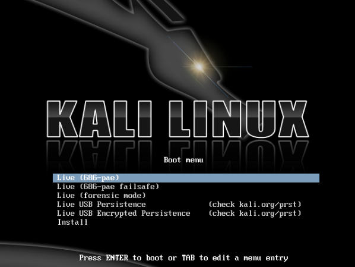
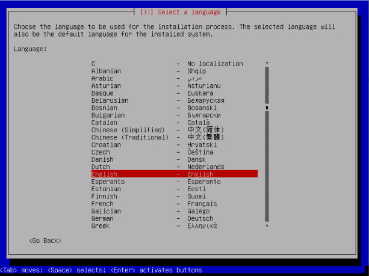
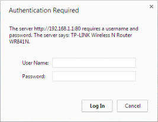
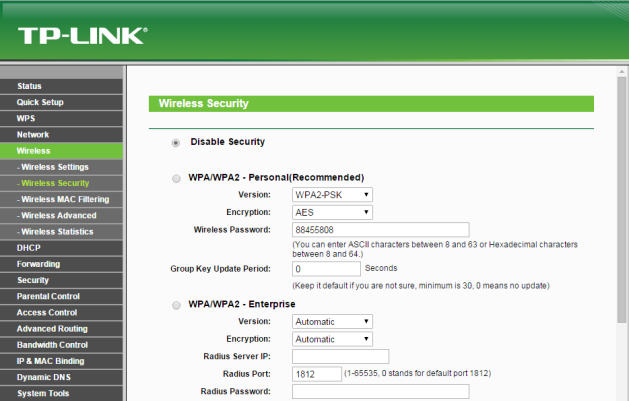
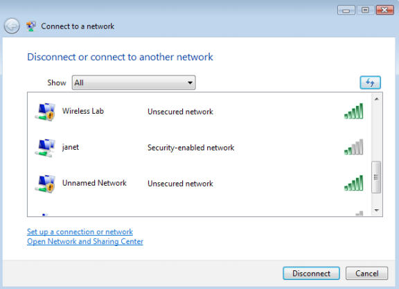
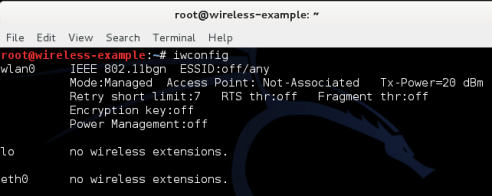
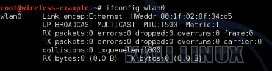
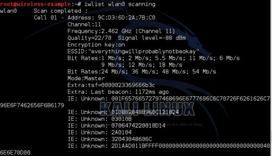
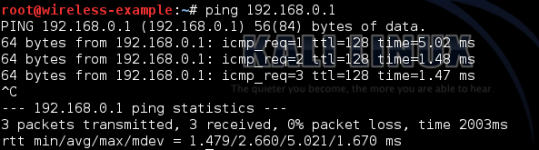
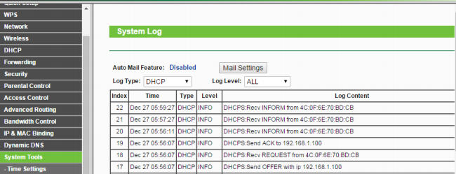

# 第一章 配置无线环境

> 作者：Vivek Ramachandran, Cameron Buchanan

> 译者：[飞龙](https://github.com/)

> 协议：[CC BY-NC-SA 4.0](http://creativecommons.org/licenses/by-nc-sa/4.0/)

## 简介

> 如果我要在八个小时之内砍倒一棵树，我会花六个小时来磨我的斧子。

> -- 亚伯拉罕·林肯，第 16 任美国总统

在每次成功的渗透测试背后，是数小时或者数天的准备，无线渗透测试也不例外。这一章中，我们会创建无线环境，我们在这本书中会将其用于实验。在你进行真实世界的渗透测试之前，将这个环境看做你的舞台吧。

无线渗透测试是个实践性的东西，首先配置环境，使你可以在安全和可控的环境下，尝试这本书中所有不同的实验非常重要。在继续下去之前，必须要首先配置这个实验环境。

### 硬件要求

我们需要满足下列硬件配置来建立无线环境。

+   两个带有内置 WiFi 网卡的笔记本：我们会使用一台笔记本作为受害者，另一台作为渗透测试者。虽然多数笔记本都满足要求，推荐笔记本需要至少有 3GB 的 RAM。这是因为我们可能会在笔记本上运行大量内存密集型软件。

+   一个无线适配器（可选）：取决于笔记本上的无线网卡，你可能需要支持封包注入和封包嗅探的 USB wifi 网卡。最佳选择是  Alfa Networks 的 Alfa AWUS036H，因为 Kali 自带它的支持。这本书编写时，它在亚马逊上卖 £18。替代选项是 EW-7711UAN，它更小而且更便宜。

+   一个接入点：一个支持 WEP/WPA/WPA2 加密标准的接入点就满足要求了。出于演示目的，我会使用  TP-LINK TL-WR841N 无线路由器。在本书编写时，你可以在亚马逊上花 £20 购买它。

+   互联网连接：这在执行搜索、下载软件和执行一些实验时有帮助。

### 软件要求

我们需要下列软件来配置无线环境：

+   Kali：这个软件可以从官网上下载：`http://www.kali.org`。这个软件是开源的，你应该能直接在官网上下载。

+   Windows XP/Vista/7：你需要他们质疑，安装在另一台笔记本上。本书的剩余部分中，这个笔记本用做受害者主机。

>   要注意，即使我们使用了基于 Windows 的OS，我们所学的技巧也能应在任何支持 WiFi 的设备上，例如智能手机、平板，以及其它。

## 1.1 安装 Kali

让我们现在快速浏览如何安装并运行 Kali。

Kali 会安装在笔记本上，在本书的剩余部分，它会作为渗透测试者的主机。

### 实战时间 -- 安装 Kali

Kali 相对易于安装。我们会通过将它启动为 Live DVD 来运行 Kali，之后安装在硬盘上。

逐步执行下列指南：

在可启动的 DVD 上烧录你下载的 Kali ISO。

1.  使用这个 DVD 启动笔记本，并从选择`Boot Menu`选择`Install`。

    
    
2.  如果启动成功，你会看到一个非常棒的复古界面，像这样：

    
    
3.  安装器类似于大多数 Linux 系统的基于 GUI 的安装器，并且用起来应该很简单。在每个界面上选择合适的选项，并开始安装过程。安装完成之后，按照提示重启主机并取出 DVD。

4.  主机重启之后，会显示登录屏幕。输入`root`作为登录名，安装密码是安装过程中你设置的东西。你现在应该能够登录进你安装的 Kali。恭喜！

    我在这本书中会修改桌面主题和一些设置。你可以随意使用你自己的主题和颜色配置。
    
### 刚刚发生了什么？

我们已经成功将 Kali 安装到笔记本上。我们会将这台笔记本作为渗透测试者的主机，并用于本书的所有实验。

### 试一试 -- 将 Kali 安装到 VirtualBox

我们也可以将 Kali 安装到虚拟机中，例如 VirtualBox。如果你不想把整台笔记本都刷成 Kali，这是最佳选项。Kali 在 VirtualBox 中的安装过程一模一样。唯一的区别就是预启动，你需要创建在 VirtualBox 中。试试它吧。你可以从`http://www.virtualbox.org`下载 VirtualBox。

我们可以安装并使用 Kali 的其它方式之一就是通过 USB 驱动。如果你不想将它安装到硬盘上，但是仍然想在你的 Kali 实例上持久储存数据，例如脚本和新的工具，这会很有帮助。我们推荐你也试试它。

## 1.2 建立接入点

现在我们要建立接入点。我们之前提到过，我们对本书中所有实验使用 TP-LINK TL-WR841N 无线路由。但是，你可以随便使用任何其它接入点。操作的基本原则和方式都一样。

### 实战时间 -- 配置无线接入点

让我们开始吧。我们会配置接入点来使用无线环境的 SSID 开放授权。

逐步遵循以下步骤：

1.  打开接入点，使用光纤连接笔记本和接入点的以太网端口之一。

2.  在你的浏览器中输入接入点配置终端的 IP 地址，默认是`192.168.1.1`。你应该查询接入点的配置指南来找到它的 IP。如果你没有它的手册，你也可以使用`ruote -n`命令来找到 IP。网关的 IP 地址通常就是接入点的 IP。一旦你链接好了，你应该看到像这样的配置入口：

    
    
3.  登录后探索入口中的不同设置，并找到和配置新 SSID 相关的设置。

4.  将 SSID 修改为`Wireless Lab`。取决于接入点，你可能需要重启它来改变设置。

    
    
5.  与之相似，找到和`Wireless Security `相关的设置，将设置修改为`Disable Security`，`Disable Security`表明使用开放授权模式。

6.  保存接入点的修改，并按需重启。现在你的接入点的 SSID 应该为`Wireless Lab`。

验证它的好方法就是使用 Windows 上的无线配置工具，并使用 Windows 笔记本观察可用的网络。你应该能找到`Wireless Lab `，作为列表的网络之一。

### 刚刚发生了什么？

我们已经成功将接入点 SSID 设置为` Wireless Lab`。它会发出广播，并被 Windows 笔记本以及广播频段范围内的其它设备捕获到。

要记住，我们将接入点配置为开放模式，这是最不安全的，建议你不要连接这种接入点来上网，因为任何 RF 范围内的人都能够使用它来联网。

### 试一试 -- 使用 WEP 或 WPA 配置无线接入点

玩转你的接入点的配置项。尝试使用加密标准，例如 WEP 或者 WPA/WPA2 来启动它。我们会在之后的章节中使用这些模式来演示对它们的攻击。

### 1.3 配置无线网卡

配置你的无线适配器比接入点更加简单。优势就是 Kali 天生支持这种网卡，并自带所有所需设备的驱动来启动封包注入和嗅探。

### 实战时间 -- 配置你的无线网卡

我们在渗透测试者的笔记本中使用无线适配器。

请逐步遵循这些指南来配置你的网卡。

1.  向 Kali 笔记本的 USB 中插入网卡，并启动它。

    一旦你登录之后，打开控制台并输入`iwconfig`。你的屏幕应该是这样：
    
    
    
    你可以看到`wlan0`是由无线适配器创建的无线接口。输入`ifconfig wlan0`来启动该接口，之后输入` ifconfig wlan0`来查看接口的当前状态：
    
    

2.  MAC 地址 `00:c0:ca:3e:bd:93`应该和下载 Alfa 网卡背后的 MAC 地址一致。我们正在使用 Edimax，MAC 是`80:1f:02:8f:34:d5`。这是个简单的检查，确保你开启的正确的接口。

### 刚刚发生了什么？

Kali 自带了 Alfa 和 Edimax 所需的所有驱动。只要主机启动，适配器就会识别并分配网络接口`wlan0`。现在我们的无线适配器已经配置好，并且生效了。

## 1.4 连接到接入点

现在我们看一看如何使用无线适配器连接到接入点。我们的接入点的 SSID 是`Wireless Lab`，并没有使用任何身份验证。

### 实战时间 -- 配置你的网卡

下面我们开始。遵循这些步骤来将你的网卡连接到接入点。

1.  让我们首先看看我们的适配器当前检测到的无线网络是什么。输入命令`iwlist wlan0`来扫描，你会发现你附近的网络列表。

    
    
    向下滚动，你回发现列表中的网络`Wireless Lab `。在我的安装中它被检测为`Cell 05`，你的可能有所不同。ESSID 字段包含网络名称。
    
2.  由于多个接入点可能拥有相同的 SSID，验证在之前的`address`提到的 MAC 地址是否匹配你的接入点的 MAC，它在接入点的背后，或者使用基于 Web 的 GUI 设置。

3.  现在，输入命令`iwconfig wlan0 essid "Wireless Lab"`，之后输入`iwconfig wlan0 `来检查状态。如果你成功连接到了接入点，你应该会在`iwconfig`输出的` Access Point: `字段看中到接入点的 MAC 地址。

4.  我们从手册中知道了接入点的管理接口的 IP 地址是`192.168.0.1 `。同样，当我们执行`ruote -n`命令时，它也是默认的路由 IP 地址。让我们通过输入命令`ifconfig wlan0 192.168.0.2 netmask 255.255.255.0 `来将我们的 IP 地址设在相同子网内。通过输入`ifconfig wlan0`并检查输出来验证命令是否成功。

5.  现在让我们通过输入` ping 192.168.0.1 `命令来 ping 接入点。如果网络连接合理建立了，你会看到接入点的恢复。此外你可以输入` arp –a `命令来验证响应来自接入点。你应该能看到 IP` 192.168.0.1`的 MAC 地址就是我们之前注意到的接入点的 MAC 地址。要注意，一些更新的接入点可能会禁用 ICMP 回响请求封包。这通常会使接入点默认更加安全，只保留最少的可用配置项。这种情况下，你可以尝试启动浏览器并访问 Web 接口来验证连接正常工作。

    
    
    在接入点中，我们可以通过查看连接日志来验证连接。你可以在下面的日志中看到，无线网卡的 MAC 地址`4C:0F:6E:70:BD:CB`已经被记录，它生成了来自路由器的 DHCP 请求。
    
    
    
### 刚刚发生了什么？

我们刚刚使用无线适配器作为无线设备，从 Kali 成功连接到了我们的接入点。我们也了解了如何在无线客户端和接入点端验证建立好的连接。

### 试一试 -- 建立 WEP 配置的连接

这是给你的挑战性练习 -- 将接入点配置为 WEP。对于它们，尝试使用无线适配器建立到接入点的连接。提示：查看`iwconfig`命令的手册，通过输入`man iwconfig`来查看如何配置网卡来连接到 WEP。

### 小测验 -- 理解基础

Q1 在输入命令`ifconfig wlan0`之后，如何验证无线网卡是否正常工作？

Q2 我们是否能够使用 Kali Live CD 执行所哟硟？我们能不能不将 CD 安装到硬盘上？

Q3 命令`arp -a`展示了什么？

Q4 我们在 Kali 中应该使用哪个工具来连接到 WPA/WPA2 网络？

### 总结

这一章向你提供了关于如何建立你自己的无线环境的详细指南。同时，在过程中，你学到了一些基本的步骤：

+   在你的硬盘上安装 Kali，并探索其它选项，例如虚拟机和 USB。

+   通过 Web 接口配置你的无线接入点。

+   理解和使用多种命令来配置和使用你的无线网卡。

+   验证无线客户端和接入点之间的连接状态。

在配置系统中获得自信相当重要。如果你没有自信，建议你重复几次之前的例子。在后面的章节中，我们会设计更多复杂的场景。

在下一章中，我们会了解 WLAN 设计中，固有的基于设计的不安全。我们会使用网络分析工具 Wireshark 来以实践方式理解这些概念。
