# 第二章 WLAN 和固有的不安全性

> 作者：Vivek Ramachandran, Cameron Buchanan

> 译者：[飞龙](https://github.com/)

> 协议：[CC BY-NC-SA 4.0](http://creativecommons.org/licenses/by-nc-sa/4.0/)

## 简介

> 建筑越高，地基就要打得越深。

> -- 托马斯·坎佩斯

没有什么伟大的东西能在脆弱的基础上构建。在我们的语境中，固有的不安全性之上不能构建出安全。

WLAN 在设计上拥有特定的不安全性，它们可被轻易利用，例如，通过封包注入，以及嗅探（能够在很远处进行）。我们会在这一章利用这些缺陷。

## 2.1 回顾 WLAN 帧

由于这本书处理无线方面的安全，我们假设你已经对协议和封包的头部有了基本的了解。没有的话，或者你离开无线有很长时间了，现在是个好机会来回顾这个话题。

让我们现在快速复习一些 WLAN 的基本概念，大多数你可能已经知道了。在 WLAN 中，通信以帧的方式进行，一帧会拥有下列头部结构：

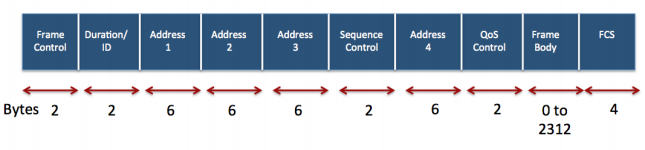

`Frame Control`字段本身拥有更复杂的结构：

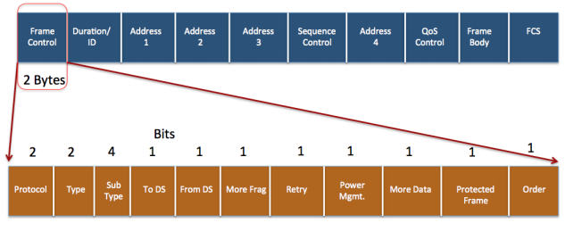

类型字段定义了下列三种 WLAN 帧：

1.  管理帧：管理帧负责维护接入点和无线客户端之间的通信。管理帧拥有下列子类型：

    +   验证
    +   解除验证
    +   关联请求
    +   关联响应
    +   重关联请求
    +   重关联响应
    +   解除关联
    +   信标
    +   探测请求
    +   探测响应
    
2.  控制帧：控制帧负责确保数据在接入点和无线客户端之间合理交换。控制帧拥有下列子类型：

    +   请求发送（RTS）
    +   清除发送（CTS）
    +   确认（ACK）
    
3.  数据帧：数据帧携带在无线网络上发送的真实数据。它没有子类型。

我们在之后的章节中讨论不同攻击的时候，会讨论这些帧中每一种的安全隐患。

我们现在看一看如何使用 Wireshark 嗅探无线网络上的这些帧。也有其他工具 -- 例如 Airodump-NG，Tcpdump，或者 Tshark -- 你同样可以用于嗅探。我们在这本书中多数情况会使用 Wireshark，但是我们推荐你探索其它工具。第一步是创建监控模式的接口。这会为你的适配器创建接口，使我们可以读取空域中的所有无线帧，无论它们的目标是不是我们。在有线的世界中，这通常叫做混合模式。

### 实战时间 -- 创建监控模式的接口

让我们现在将无线网卡设为监控模式。

遵循下列指南来开始：

1.  启动 Kali 并使适配器保持连接。一旦你打开了控制台，输入`iwconfig`并确保网卡被检测到，驱动被正确加载。

    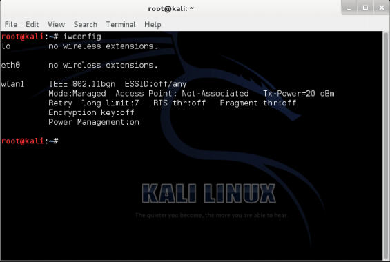
    
2.  使用`ifconfig wlan1 up`命令启动网卡（其中`wlan1`是你的适配器）。通过运行`ifconfig wlan1`验证网卡是否正在运行。你应该在输出的第二行看到单词`UP`，像这样：

    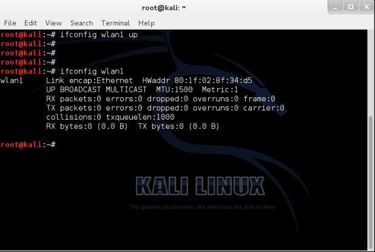
    
3.  为了将网卡设为监控模式，我们使用`airmon-ng `，它在 Kali 中自带。首先执行`airmon-ng `命令来确认它检测到了可用的网卡。你应该能看到输出中列出的`wlan1`接口：

    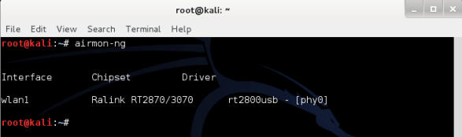
    
4.  现在输入`airmon-ng start wlan1 `命令来创建对应`wlan1`设备的监控模式接口。新的监控模式接口名为`mon0`。（你可以再次不带参数使用`airmon-ng `来验证。）

    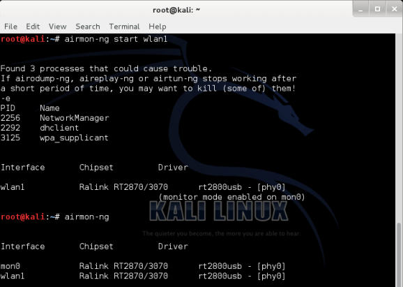
    
5.  同样，运行`ifconfig mon0`会展示叫做`mon0`的新接口。

    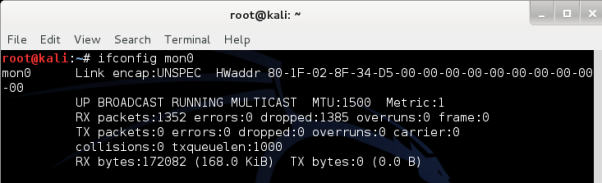

### 刚刚发生了什么？

我们成功创建了叫做`mon0`的监控模式接口。这个接口用于嗅探空域中的无线封包。这个接口已经在我们的无线适配器中创建了。

### 试一试 -- 创建多个监控模式接口

可以创建多个监控模式的接口，使用相同的物理网卡。使用 airmon-ng 工具来看看如何完成。

太棒了！我们拥有了监控模式接口，等待从空域中读取一些封包。所以让我们开始吧。

下一个练习中，我们会使用 Wireshark 和刚刚创建的`mon0`监控器模式接口，从空域中嗅探封包。

### 实战时间 -- 嗅探无线封包

遵循下列指南来开始：

1.  启动我们在第一章中配置好的接入点`Wireless Lab `。

2.  通过在控制台中键入` Wireshark & `来启动 Wireshark，一旦 Wireshark 运行，访问`Capture | Interfaces`。

    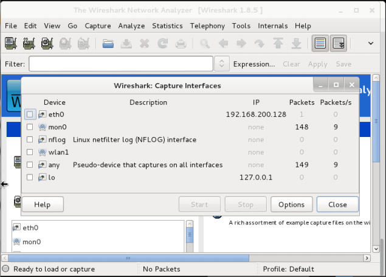
    
3.  通过点击`Start`按钮从`mon0`接口选择封包捕获，像截图中那样。Wireshark 会开始捕获，现在你可以在 Wireshark 窗口中看到封包。

    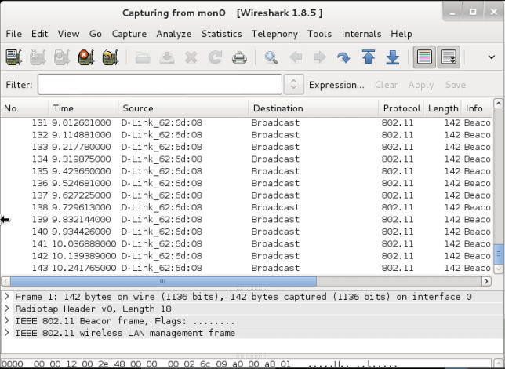

4.  这些就是你的无线适配器从空域中嗅探到的封包。为了查看任何封包，在上面的窗口中选择它，中间的窗口中会展示整个封包：

    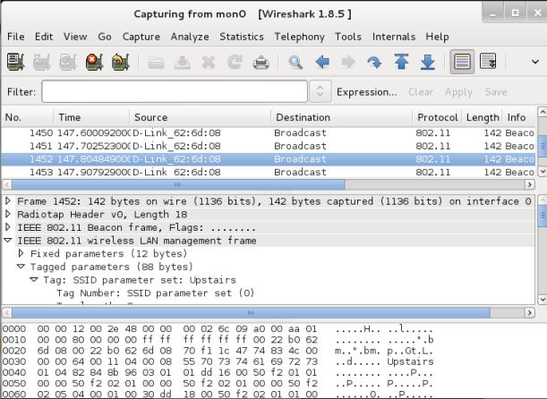
    
    点击`IEEE 802.11 Wireless LAN management frame`前面的三角形来展开并查看详细信息。
    
观察封包中不同的头部字段，并将它们和之前了解的 WLAN 帧类型以及子类型关联。

### 刚刚发生了什么？

我们刚刚从空域中嗅探了第一组封包。我们启动了 Wireshark，它使用我们之前创建的监控模式接口`mon0`。通过查看 Wireshark 的底部区域，你应该注意到封包捕获的速度以及目前为止捕获的封包数量。

### 试一试 -- 发现不同设备

Wireshark 的记录有时会令人生畏，即使在构成合理的无线网络中，你也会嗅探到数千个封包。所以深入到我们感兴趣的封包十分重要。这可以通过使用 Wireshark 中的过滤器来完成。探索如何使用这些过滤器来识别记录中唯一的无线设备 -- 接入点和无线客户端。

如果你不能做到它，不要着急，它是我们下一个要学的东西。

### 实战时间 -- 查看管理、控制和数据帧

现在我们学习如何使用 WIreshark 中的过滤器来查看管理、控制和数据帧。

请逐步遵循下列指南：

1.  为了查看捕获的封包中的所有管理帧，在过滤器窗口中输入过滤器`wlan.fc.type`，并点击`Apply`。如果你打算防止封包向下滚动过快，你可以停止封包捕获。

    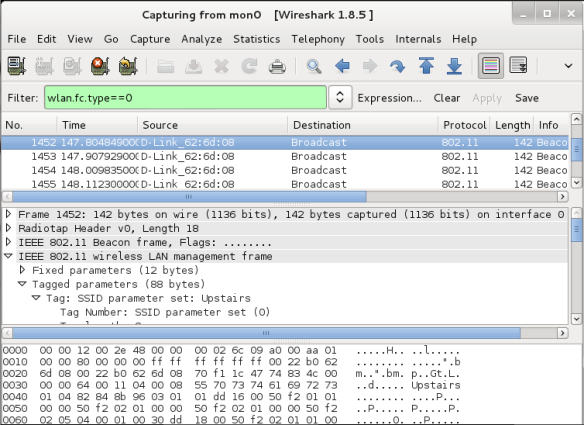
    
2.  为了查看控制帧，将过滤器表达式修改为`wlan.fc.type == 1`。

    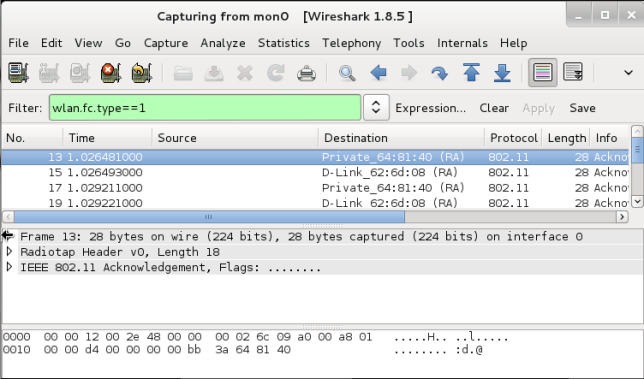
    
3.  为了查看数据帧，将过滤器表达式修改为`wlan.fc.type == 2`。

    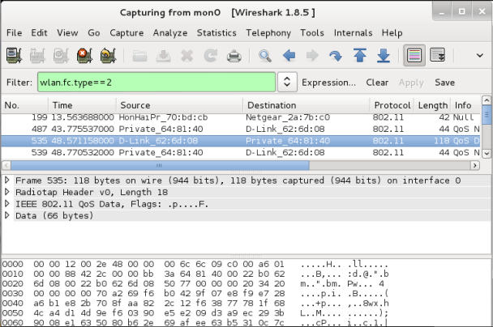
    
4.  为了额外选择子类型，使用`wlan.fc.subtype`过滤器。例如，要查看所有管理帧中的信标帧，使用下列过滤器：

    ```
    (wlan.fc.type == 0) && (wlan.fc.subtype == 8)
    ```
    
    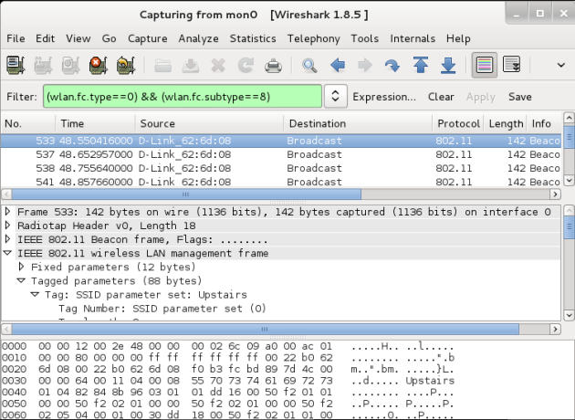
    
5.  作为替代，你可以在中间的窗口中右击任何头部字段，之后选择`Apply as Filter | Selected`来使用过滤器。

    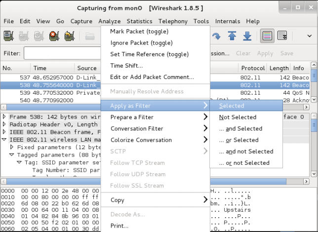
    
6.  这会自动为你在`Filter`字段中添加正确的过滤器表达式。

### 刚刚发生了什么？

我们刚刚学习了如何在 Wireshark 中，使用多种过滤器表达式来过滤封包。这有助于监控来自我们感兴趣的设备的所选封包，而不是尝试分析空域中的所有封包。

同样，我们也可以以纯文本查看管理、控制和数据帧的封包头部，它们并没有加密。任何可以嗅探封包的人都可以阅读这些头部。要注意，黑客也可能修改任何这些封包并重新发送它们。协议并不能防止完整性或重放攻击，这非常易于做到。我们会在之后的章节中看到一些这类攻击。

### 试一试 -- 玩转过滤器

你可以查阅 Wireshark 的手册来了解更多可用的过滤器表达式，以及如何使用。尝试玩转多种过滤器组合，直到你对于深入到任何细节层级都拥有自信，即使在很多封包记录中。

下个练习中，我们会勘察如何嗅探我们的接入点和无线客户端之间传输的数
据封包。

## 实战时间 -- 嗅探我们网络上的封包

这个练习中，我们会了解如何嗅探指定无线网络上的封包。出于简单性的原因，我们会查看任何没有加密的封包。

遵循下列指南来开始：

1.  启动我们命名为` Wireless Lab`的无线接入点。让我们将其配置为不加密。

2.  我们首先需要寻找` Wireless Lab`运行在哪个频道上。为了完成它，打开终端并执行`airodump-ng --bssid <mac> mon0`，其中`<mac>`是接入点的 MAC 地址。运行程序，不就你就会看到你的接入点显示在屏幕上，并带有所运行的频道。

3.  我们可以从之前的截图中看到，我们的接入点` Wireless Lab`运行在频道 11 上。要注意这可能和你的接入点不同。

    为了嗅探发往和来自这个接入点的封包，我们需要将无线网卡锁定在同一频道上，也就是频道 11。为了实现它，执行`iwconfig mon0 channel 11 `之后执行`iwconfig mon0 `来验证。你会看到输出中的`Frequency: 2.462 GHz`。这相当于频道 11。
    
    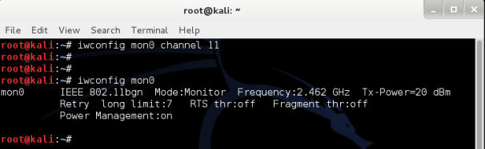
    
4.  现在启动 Wireshark，开始嗅探`mon0`接口。在 WIreshark 开始嗅探之后，在过滤器区域输入`wlan.bssid == <mac> `来使用接入点 BSSID 的过滤器，像下面的截图这样。为你的接入点填写合适的 MAC 地址。

    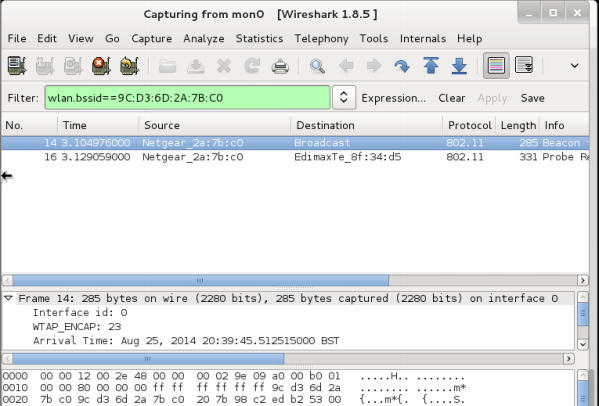
    
5.  为了查看接入点的数据封包，添加下列过滤器：`(wlan.bssid == <mac>) && (wlan.fc.type_subtype == 0x20)`。在客户端笔记本打开你的浏览器，并输入接入点管理界面的 URL。我这里，像第一章那样，它是`http://192.168.0.1`。这会生成数据封包，WIreshark 会捕获它。

6.  封包嗅探允许我们轻易分析未加密的数据。这就是为什么我们需要在无限种使用加密的原因。

### 刚刚发生了什么？

我们刚刚使用 WIreshark 和多种过滤器嗅探了空域中的数据。由于我们的接入点并没有使用任何加密，我们能够以纯文本看到所有数据。这是重大的安全问题，因为如果使用了类似 WIreshark 的嗅探器，任何在接入点 RF 范围内的人都可以看到所有封包。

### 试一试 -- 分析数据封包

使用 WIreshark 进一步分析数据封包。你会注意 DHCP 请求由客户端生成，并且如果 DHCP 服务器可用，它会返回地址。之后你会发现 ARP 封包和其它协议的封包。这样来被动发现无线网络上的主机十分简单。能够看到封包记录，并重构出无线主机上的应用如何和网络的其余部分通信十分重要。Wireshark 所提供的有趣的特性之一，就是跟踪流的能力。这允许你一起查看多个封包，它们是相同连接中的 TCP 数据交换。

此外，尝试登陆` www.gmail.com`和其它流行站点并分析生成的数据流量。

我们会演示如何向无线网络中注入封包。

### 实战时间 -- 封包注入

我们使用 aireplay-ng 工具来进行这个练习，它在 Kali 中自带。

遵循下列指南来开始：

1.  为了执行注入测试，首先启动 Wireshark，并使用过滤器表达式`(wlan.bssid == <mac>) && !(wlan.fc.type_subtype == 0x08)`。这会确保我们只能看到我们无线网络的非信标帧。

2.  现在在终端中执行命令`aireplay-ng -9 -e Wireless Lab -a <mac> mon0`。

3.  返回 Wireshark，你会看到屏幕上会显示大量封包。一些封包已经由` aireplay-ng`发送，它们是我们发送的，其它的是` Wireless Lab `接入点用于响应注入的封包。

### 刚刚发生了什么？

我们刚刚使用 aireplay-ng，成功向我们的测试环境网络注入了封包。要注意我们的网卡将这些任意的封包注入到网络中，而不需要真正连接到无线接入点` Wireless Lab`。

### 试一试 -- 探索 Aireplay-ng 工具

我们会在之后的章节中详细了解封包注入。现在请探索一下 Aireplay-ng 工具用于注入封包的其它选项。你可以使用 Wireshark 监控空域来验证注入是否成功。

## 2.2 WLAN 嗅探和注入的重点笔记

WLAN 通常在三种不同频率范围内工作：2.4 GHz，3.6 GHz 和 4.9/5.0 GHz。并不是所有 WIFI 网卡都全部支持这三种范围和相关的波段。例如，Alfa 网卡只支持  IEEE 802.11b/g。这就是说，这个网卡不能处理 802.11a/n。这里的关键是嗅探或注入特定波段的封包。你的 WIFI 网卡需要支持它。

另一个 WIFI 的有趣方面是，在每个这些波段中，都有多个频道。要注意你的 WIFI 网卡在每个时间点上只能位于一个频道。不能将网卡在同一时间调整为多个频道。这就好比车上的收音机。任何给定时间你只能将其调整为一个可用的频道。如果你打算听到其它的东西，你需要修改频道。WLAN 嗅探的原则相同。这会产生一个很重要的结论 -- 我们不能同时嗅探所有频道，我们只能选择我们感兴趣的频道。这就是说，如果我们感兴趣的接入点的频道是 1，我们需要将网卡设置为频道 1。

虽然我们在上面强调了 WLAN 嗅探，注入的原则也相同。为了向特定频道注入封包，我们需要将网卡调整为特定频道。

让我们现在做一些练习，设置网卡来制定频道或进行频道跳跃，设置规范域以及功率等级，以及其它。

### 实战时间 -- 使用适配器做实验

仔细遵循以下步骤：

1.  输入`iwconfig wlan0`命令来查看网卡的功能。你可以看到，我们的适配器可以工作在 b、g 和 n 波段中。

    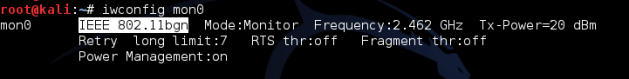
    
2.  为了将网卡设置为特定频道，我们使用` iwconfig mon0 channel X `命令。

    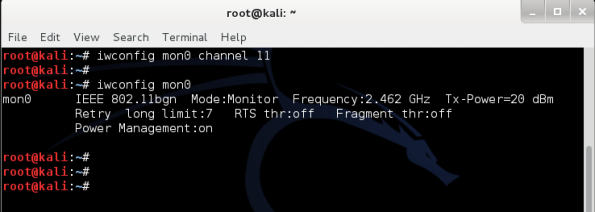
    
3.  `iwconfig`命令集并没有频道跳跃模式。你可以在它上面编写简单的脚本来实现。一个简单的方式就是带选项使用 Airodump-NG 来跳跃任何频道，或者是某个子集，或者使用所选的波段。当我们执行`airodump-ng --help`的时候，所有这些选项展示在下面。

    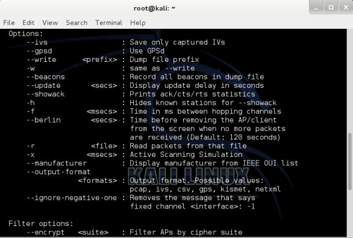
    
### 刚刚发生了什么？

我们知道了，无线嗅探和封包注入依赖于硬件的支持。这即是说我们只能处理网卡支持的波段和频道。此外，无线网卡每次只能位于一个频道。这说明了我们只能一次嗅探或注入一个频道。

### 试一试 -- 嗅探多个频道。如果你需要同时嗅探多个频道，你需要多个物理 WIFI 网卡。如果你可以获得额外的网卡，尝试同时嗅探多个频道。

## 4.3 无线网络中规范域的作用

WIFI 的复杂性到这里并没有结束。每个国家都有自己的未授权的频谱分配策略。这规定了允许的功率等级和频谱的用户。例如，FCC 规定，如果你在美国使用 WLAN，你就必须遵守这些规定。在一些国家，不遵守相关规定会收到惩罚。

现在让我们看看如何寻找默认的规范设置，以及如何按需修改它们。

### 实战时间 -- 使用适配器做实验

仔细遵循以下步骤：

1.  重启的计算机并不要连接到适配器。

2.  登录之后，使用`tail`命令监控内核信息：

    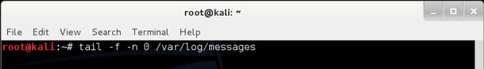
    
    插入适配器，你会看到像这样的一些东西。这展示了网卡所使用的默认规范设置。
    
    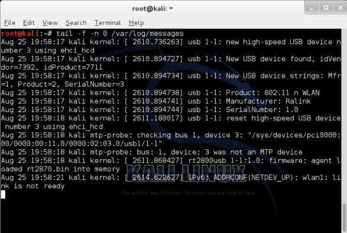

3.  让我们假设你在美国。为了将规范域修改为 US，我们在新的终端中输入下列命令`iw reg set US`。

    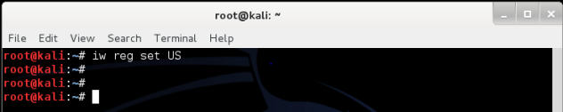
    如果命令执行成功，我们会在终端得到这样的输出，其中我们正在监控`/var/log/messages`：

    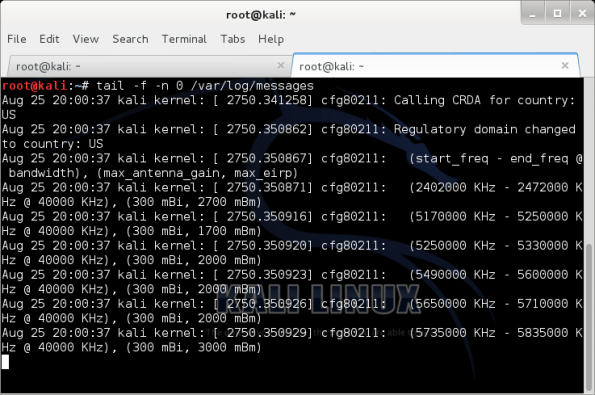

4.  现在尝试把网卡设置为频道 11，它生效了。但是当你尝试设置为频道 12 时候，你会得到错误。这是因为在美国不能使用频道 12。

    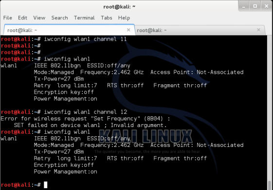
    
5.  功率等级也使用相同的原则。US 只允许最大 27 dBm（500 毫瓦）。所以即使我们的适配器的功率为 1 瓦（30 dBm），我们也不能将其设置为最大传输功率：

    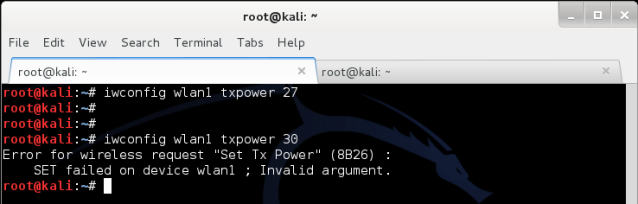
    
6.  但是，如果我们在玻利维亚，我们就能够使用 1 瓦的传输功率，因为这里允许。你可以看到，我们将规范域设为玻利维亚 -- `iw reg set BO` -- 我们就能将网卡功率设置为 30DMB 或 1 瓦。我们在玻利维亚使用频道 12，这在美国是禁止的。

    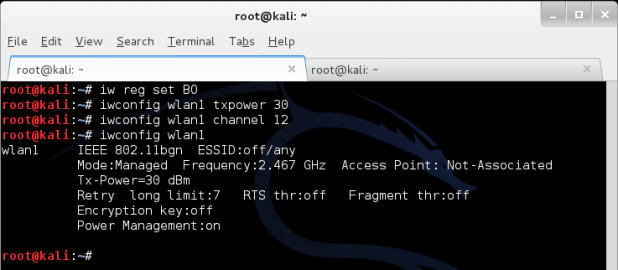
    
### 刚刚发生了什么？

每个国家都有用于未授权无线波段的自己的规范。当我们将规范域设置为特定国家时，我们的网卡会遵循允许的频道和指定的功率等级。但是，嗅探网卡的规范域，来强制它工作在不允许的频道上，以及在高于允许值的功率等级上传输数据相当容易。

### 试一试 -- 探索规范域

查看你可以设置的多种参数，例如频道、功率、规范域，以及其它。在 Kali 上使用`iw`命令集。这会让你深刻了解在不同国家的时候如何配置网卡，以及修改网卡设置。

## 小测验 -- WLAN 封包嗅探和注入

Q1 哪种帧类型负责在 WLAN 中的验证？

1.  控制
2.  管理
3.  数据
4.  QoS

Q2 使用 airmon-mg 在 `wlan0` 上创建的第二个监控器模式接口的名字是什么？

1.  `mon0`
2.  `mon1`
3.  `1mon`
4.  `monb`

Q3 用于在 Wireshark 中查看非信标的过滤器表达式是什么？

1.  `!(wlan.fc.type_subtype == 0x08)` 
2.  `wlan.fc.type_subtype == 0x08` 
3.  `(no beacon)` 
4.  `Wlan.fc.type == 0x08`

## 总结

这一章中，我们对 WLAN 协议进行了一些重要的观察。

管理、控制和数据帧是未加密的，所以监控空域的人可以轻易读取。要注意数据封包载荷可以使用加密来保护，使其更加机密。我们在下一章讨论它们。

我们可以通过将网卡设置为监控模式来嗅探附近的整个空域。

由于管理和控制帧没有完整性保护，使用例如  aireplay-ng 的工具通过监控或照旧重放它们来注入封包非常容易。

未加密的数据封包也可以被修改和重放到网络中。如果封包加密了，我们仍然可以照旧重放它们，因为 WLAN 设计上并没有保护封包重放。

下一章中，我们会看一看用于 WLAN 的不同验证机制，例如 MAC 过滤和共享验证，以及其它。并且通过实际的演示来理解多种安全缺陷。
