# 第三章 绕过 WLAN 身份验证

> 作者：Vivek Ramachandran, Cameron Buchanan

> 译者：[飞龙](https://github.com/)

> 协议：[CC BY-NC-SA 4.0](http://creativecommons.org/licenses/by-nc-sa/4.0/)

## 简介

> 安全的错觉比不安全更加糟糕。

> -- 佚名

安全的错觉比不安全更加糟糕，因为你不可能为面对被黑的可能性做准备。

WLAN 的身份验证模式可能很弱，可以被破解和绕过。这一章中，我们会查看一些 WLAN 中所使用的基本的身份验证模式，以及学习如何破解它们。

## 3.1 隐藏的 SSID

在默认的配置模式下，所有接入点都在信标帧中发送它们的 SSID。这让附近的客户端能够轻易发现它们。隐藏 SSID 是个配置项，其中接入点并不在信标帧中广播它的 SSID。因此，只有知道接入点 SSID 的客户端可以连接它。

不幸的是，这个方法不能提供可靠的安全，但是网络管理员认为它很安全。隐藏 SSID 不应该被看作安全手段。我们现在来看看如何发现隐藏的 SSID。

### 实战时间 -- 发现隐藏的 SSID

执行下列指南以开始：

1.  使用 Wireshark，如果我们监控` Wireless Lab`网络中的信标帧信标帧，我们就能够以纯文本查看 SSID。你应该能看到信标真，像这样：

    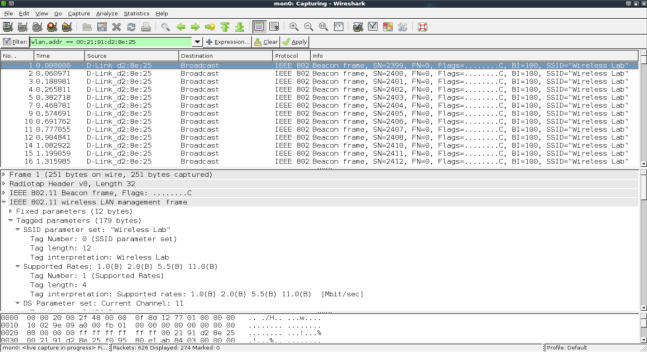
    
2.  配置你的接入点来隐藏` Wireless Lab`网络的 SSID。这个配置项在不同接入点中可能不同。这里，我需要检查`Visibility Status `选项的`Invisible `选项，像这样：

    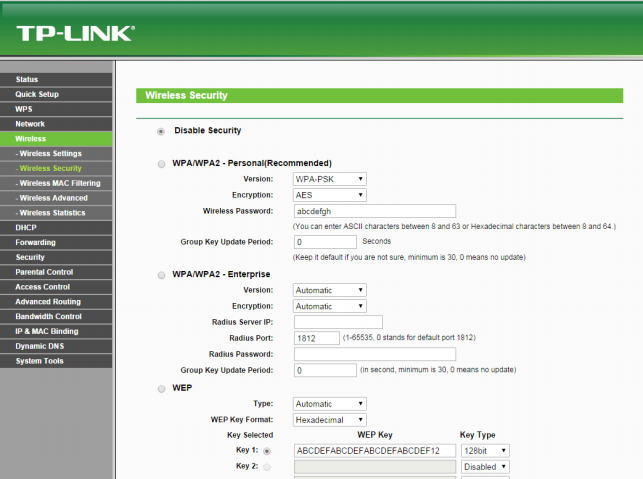
    
3.  现在如果你查看 Wireshark 的记录，你会发现` Wireless Lab`的 SSID从信标帧中消失了。这是隐藏 SSID 所做的事情：

    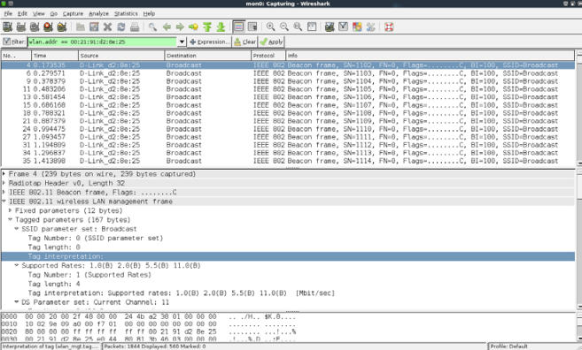

4.  为了绕过信标帧，我们首先使用被动技巧来等待正常客户端连接到接入点。这会生成探测请求和响应，它包含网络的 SSID，从而揭示它的存在。

    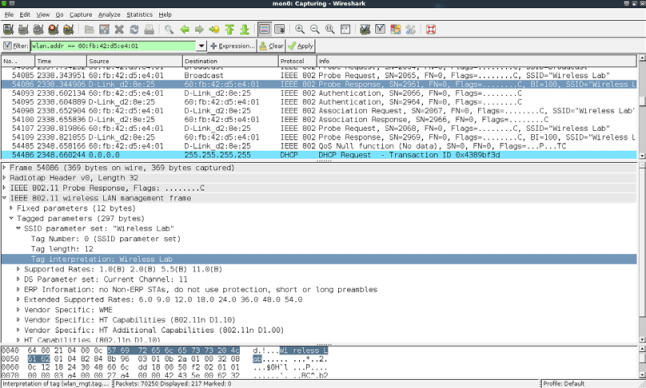
    
5.  作为替代，你可以使用`aireplay-ng `来发送接触验证封包给所有代表`Wireless Lab`接入点的路由器，通过输入：` aireplay-ng -0 5 -a <mac>  --ignore-negative mon0`，其中`<mac>`是路由器的 MAC 地址。`-0`选项用于选则接触验证攻击，`5`是要发送的封包数量。最后，`-a`指定了所定位的接入点的 MAC 地址。

    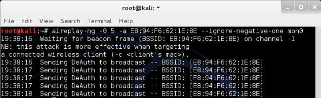
    
6.  接触验证的过程会强迫所有正常客户端断开连接并重连。为接触验证的封包添加个过滤来单独查看它们是个好主意。

    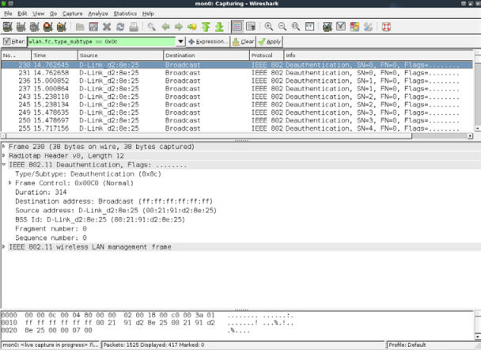
    
7.  来自接入点的探测响应最后会发现 SSID。这些封包会出现在 Wireshark 中。一旦正常客户端连接回来了，我们就可以通过探针的请求和响应帧来查看隐藏的 SSID。可以使用过滤器` (wlan.bssid == 00:21:91:d2:8e:25) && !(wlan.fc.type_subtype == 0x08) `来监控所有发往或来自接入点的非信标封包。`&&`符号代表逻辑 AND 操作符，`!`符号代表逻辑 NOT 操作符：

    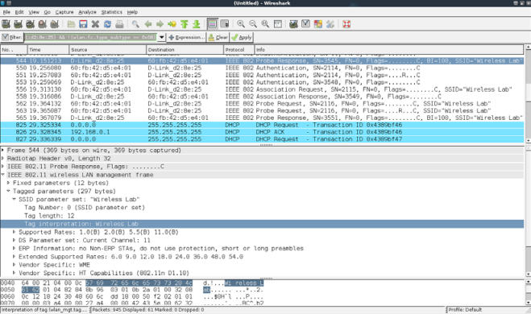
    
### 刚刚发生了什么？

即使 SSID 隐藏而且不广播，当正常的客户端尝试连接到接入点时，它们就交换了探测请求和响应的封包。这些封包包含接入点的 SSID。由于这些封包没有加密，它们可以被非常轻易地嗅探来发现SSID 。

我们在之后的章节中会出于其它目的，例如跟踪，涉及到探测请求。

许多情况下，所有客户端可能已经链接到接入点，并且在 Wireshark 记录中没有探测请求或响应的封包。这里，我们可以强制客户端断开接入点的链接，通过发送伪造的解除验证封包。这些封包会强迫客户端重新连接到接入点上，从而获取 SSID。

### 试一试 -- 选择解除验证

在之前的练习中，我们广播了解除验证封包来强制所有无线客户端重新连接。尝试验证如何使用`aireplay-ng`工具，选择性对某个客户端执行它。

要注意，即使我们使用 Wireshark 演示了许多概念，但也可以使用其它工具来完成攻击，例如`aircrack-ng`套件。我们推荐你探索整个 aircrack-NG 套件以及其它位于官网的文档：` http://www.aircrack-ng.org`。

## 3.2 MAC 过滤器

MAC 过滤器是个古老的技巧，用于验证和授权，它们根植于有线世界。不幸的是，它们在无线世界中变得十分糟糕。

最基本的想法就是基于客户端的 MAC 地址进行验证。MAC 过滤器是为网络接口分配的一段识别代码，路由器能够检查这个代码并将其与允许的 MAC 列表进行比较。允许的 MAC 地址列表由网络管理员维护，储存于接入点中。我们现在要看看绕过 MAC 过滤器有多容易。

### 实战时间 -- 绕过 MAC 过滤器

让我们遵循以下步骤来开始：

1.  让我们首先配置我们的接入点来使用 MAC 过滤，之后添加受害者笔记本的客户端 MAC 地址。我的路由器上的设置页面是这样：

    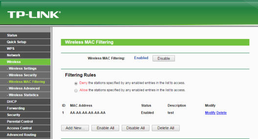
    
2.  一旦开启了 MAC 过滤，只有允许的 MAC 地址能够成功被接入点验证。如果我们尝试从不在 MAC 地址白名单中的机器连接接入点，就会失败。

3.  在这个场景背后，接入点发送验证失败的消息给客户端。封包记录像这样：

    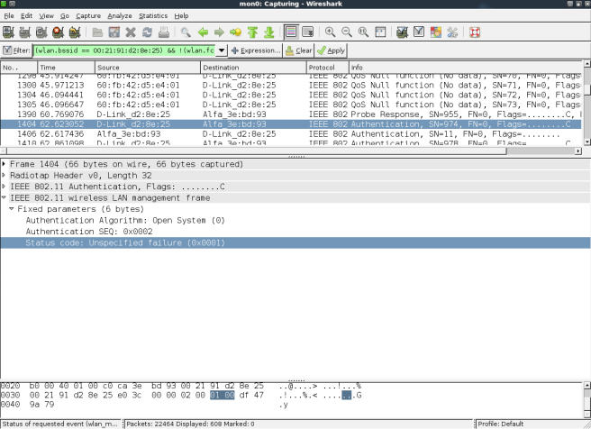
    
4.  为了绕过 MAC 过滤器，我们可以使用`airodump-ng`来寻找连接到接入点的客户端 MAC 地址。我们可以通过输入` airodumpng -c 11 -a --bssid <mac> mon0 `命令。通过指定`bssid`命令，我们只监控接入点，这是我们所感兴趣的。`-c 11`命令将频道设置为接入点所在的`11`。`-a`命令确保在`airodump-NG `输出的客户端部分中，只展示相关客户端，以及到接入点的连接。这会向我们展示所有和接入点相关的客户端 MAC 地址。

    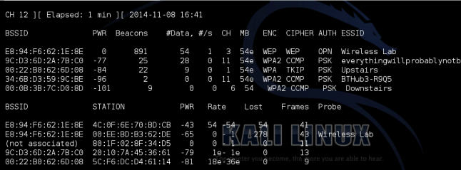
    
5.  一旦我们找到了白名单中的客户端 MAC 地址，我们可以使用`macchanger`工具来修改客户端的 MAC 地址，Kali自带这个工具。你可以使用` macchanger –m <mac> wlan0 `命令来完成。你使用`-m`命令指定的 MAC 地址就是`wlan0`接口的新 MAC 地址。

    
    
6.  你可以看到，将 MAC 地址修改为白名单客户端之后，我们现在能够连接接入点了。

### 刚刚发生了什么？

我们使用`airodump-ng `监控了空域，找到了连接到无线网络的正常用户的 MAC 地址。之后我们可以使用`macchanger `工具来修改无线网卡的 MAC 地址，与客户端保持一致。这会欺骗接入点，使其相信我们是正常耳朵客户端，它会允许我们访问它的无线网络。

我们鼓励你探索`airodump-NG`工具的不同选项，通过访问官网的文档：` http://www.aircrack-ng.org/doku. php?id=airodump-ng`。

## 3.3 开放验证

术语“开放验证”是个误解，因为它实际上不提供任何验证。当接入点配置为使用开放验证的时候，所有连接它的客户端都可以成功验证。

我们现在使用开放验证来获得验证并连接到接入点。

### 实战时间 -- 绕过开放验证

让我们现在看看如何绕过开放验证。

1.  我们首先将我们的接入点` Wireless Lab`设置为开放验证。在我的接入点中，这可以通过将`Security Mode`设为`Disable Security`来轻易完成。

    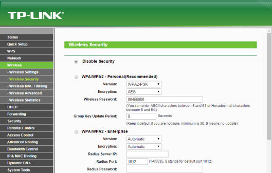
    
2.  我们之后使用`iwconfig wlan0 essid Wireless Lab`命令来连接到这个接入点，之后验证我们到接入点的连接是否成功。

3.  要注意我们没有提供任何用户名/密码来通过开放验证。

### 刚刚发生了什么？

这可能是目前为止最简单的练习了。你可以看到，在连接到开放验证网络和连接到接入点时没有任何障碍。

## 3.4 共享密钥验证

共享密钥验证使用例如 WEP 的共享密钥来验证客户端。信息的交换展示在这张图中：

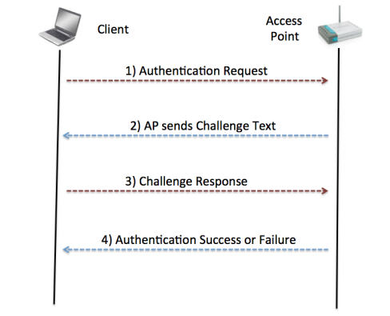

无线客户端发送验证请求给接入点，它会回复一个 challenge。现在客户端需要使用共享密钥加密这个 challenge，并发送ui接入点，接入点解密它来检查是否它可以恢复原始的 challenge 文本。如果成功了，客户端就验证成功，如果没有，它会发送验证失败的信息。

这里的安全问题是，攻击者可以被动监听整个通信，通过嗅探空域来访问 challenge 的纯文本和加密文本。他可以使用 XOR 操作来获取密钥流。密钥流可以用于加密任何由接入点发送的未来的 challenge，而不需要知道真实的密钥。

这种共享验证的常见形式就是 WEP，或者无线等效协议。它易于破解，并且由数不清的工具用于使破解 WEP 网络变得容易。

这个练习中，我们会了解如何嗅探空域来获取 challenge 或者加密后的 challenge，获取密钥流，使用它来验证接入点，而不需要共享密钥。

### 实战时间 -- 绕过共享验证

绕过共享验证比上一个练习更加困难，所以仔细遵循下列步骤：

1.  让我们首先为我们的` Wireless Lab `网络建立共享验证。通过将安全模式设置为 WEP ，将验证设置为`Shared Key`，我们已经在我的接入点上完成了设置。

    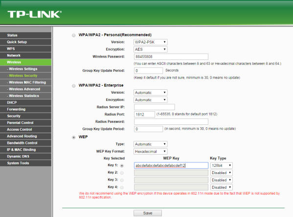

2.  让我们现在将正常的客户端连接到该网络，使用我们在第一步设置的共享密钥。

3.  为了绕过共享密钥验证，我们首先需要嗅探接入点和客户端之间的封包。但是，我们也需要记录整个共享密钥的交换。为了完成它，我们使用`airodump-ng `工具的` airodump-ng mon0 -c 11 --bssid <mac> -w keystream `命令。`-w`选项在这里是新增的，让 Airodump-NG  在`keystream`为前缀的文件中储存信息。顺便，在不同文件中储存不同的封包捕获的会话是个好主意。这允许你在很长时间之后分析它们。

    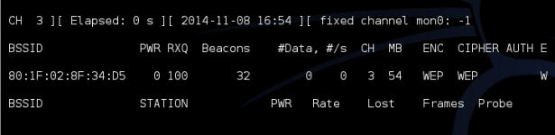

4.  我们可以等待正常客户端连接到接入点，或者使用之前用过的解除验证的技术强迫重新连接。一旦客户端连接并且工项密钥验证获得成功，` airodump-ng`就会通过嗅探空域自动捕获这个改变。当`AUTH `列出现了`WEP`，就说明捕获成功。

5.  捕获到的密钥流储存在当前目录`keystream`为前缀的文件中。我这里的文件名称是`keystream-01-00-2191-D2-8E-25.xor`。

6.  为了伪造共享密钥验证，我们使用`aireplay-ng`工具。我们执行` aireplay-ng -1 0 -e "Wireless Lab" -y keystream01-00-21-91-D2-8E-25.xor -a <mac> -h AA:AA:AA:AA:AA:AA mon0`命令。这个`aireplay-ng`的命令使用我们之前获得的密钥流，并尝试验证 SSID 为 ` Wireless Lab`，MAC 地址为`address 00:21:91:D2:8E:25`的接入点。启动 WIreshark，并通过`wlan.addr == AA:AA:AA:AA:AA:AA`过滤器嗅探所有感兴趣的封包。我们可以使用 Wireshark 来验证它。你应该能在 Wireshark 的界面上看到记录，像这样：

    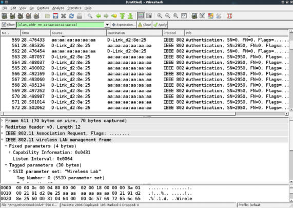
    
7.  第一个封包是验证请求，由`aireplay-ng `工具发给接入点：

    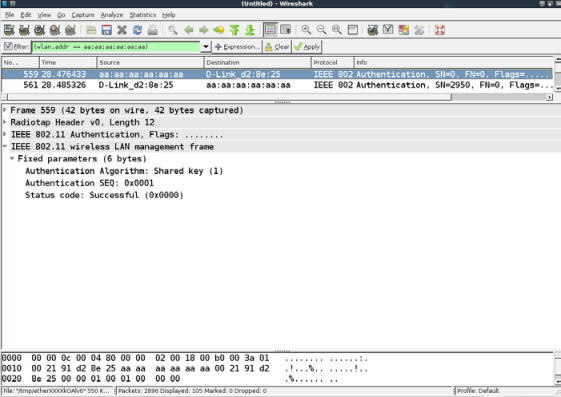
    
8.  第二个封包由接入点发给客户端的 challenge 文本组成，像这样：

    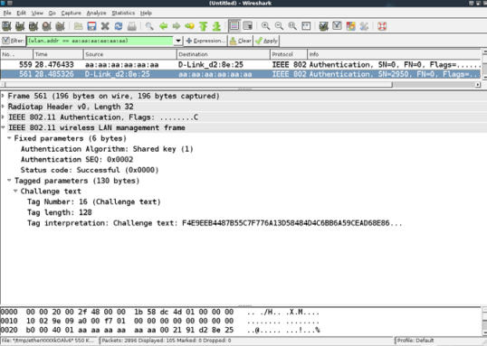
    
9.  第三个封包中，这个工具向接入点发送了加密的 challenge。

    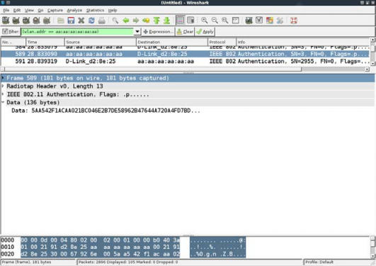
    
0.  由于`aireplay-ng`工具将导出的密钥流用于江米，验证会成功，接入点会在第四个封包中发送成功消息。

    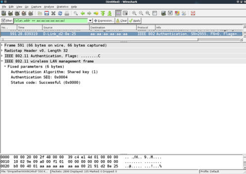
    
1.  在验证成功过之后，这个工具伪造了接入点的关联，像这样：

    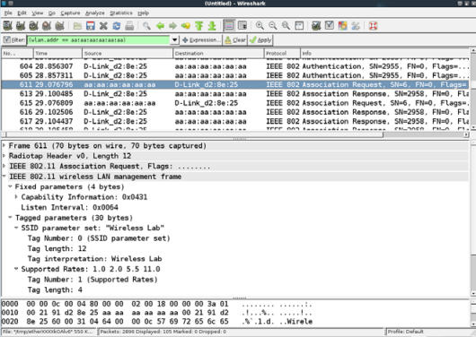
    
2.  如果你在你的接入点管理界面中的无线日志中查看，你会看到 MAC 地址为` AA:AA:AA:AA:AA:AA `的客户端建立了连接。

    

### 刚刚发生了什么？

我们成功从共享验证交换中导出了密钥流，并且使用它来伪造接入点的验证。

### 试一试 -- 填满接入点的表格

接入点拥有最大客户端数量，超过之后它们就会拒绝连接。通过为`aireplay-ng`编写一个小型的包装器，我们就可以自动发送数百个连接请求，从随机的 MAC 地址发往接入点。这会填满路由器的内部表格，一旦达到了最大客户端数量，接入点会停止接受新的连接。这通常叫做拒绝服务（DoS）工具，可以强制路由器重启或使其失去功能。这也可以导致所有无线客户端失去连接以及不能使用授权后的网络。

## 小测验 -- WLAN 验证

Q1 如何强迫无线客户端重新连接到接入点？

1.  发送解除验证的封包
2.  重启客户端
3.  重启接入点
4.  以上全部

Q2 开放验证是干什么的？

1.  提供了适当的安全
2.  不提供任何阿暖
3.  需要使用加密
4.  以上都不是

Q3 如何破解共享密钥验证？

1.  从封包中导出密钥流
2.  导出加密密钥
3.  向接入点发送解除验证的封包
4.  重启接入点

## 总结

这一章中，我们了解了 WLAN 验证。隐藏 SSID 是“隐藏式安全”的策略，很容易被攻破。MAC 地址过滤器不能够提供任何安全，因为 MAC 地址可以从无线封包中嗅探，而 MAC 地址在封包中毫无加密。开放验证不提供任何实际的验证。共享密钥验证的破解有些麻烦，但是，使用了正确的工具，我们可以导出和储存密钥流，我们可以使用它来回应之后由接入点发送的所有 challenge。最后我们可以获得验证而不需要知道真实的密钥。

下一章中，我们会看一看 WLAN 加密机制的不同 -- WEP，WPA 和 WPA2 -- 并看一看其中的不安全性。
