# 第四章 WLAN 加密缺陷

> 作者：Vivek Ramachandran, Cameron Buchanan

> 译者：[飞龙](https://github.com/)

> 协议：[CC BY-NC-SA 4.0](http://creativecommons.org/licenses/by-nc-sa/4.0/)

## 简介

> 任何人对于内存的需求，都不会超过640K。

> -- 比尔·盖茨，微软创始人

即使做了最充分的预测，未来始终是不可预测的。WLAN 委员会设计了了 WEP 和 WPA 作为最简单的加密机制，但是，久而久之，这些机制拥有在现实世界中广泛公布和利用的缺陷。

WLAN 加密机制易受密码学攻击，这有相当长的历史了。这从 2000 年的 WEP 开始，它最后被完全破解。最近，攻击慢慢转向了 WPA。即使当前没有公开攻击方式用于在所有情况下破解 WPA，特殊情况下的攻击还是可行的。

## 5.1 WLAN 加密

WLAN 在空域中传输数据，所以保护数据的机密性是一种内在需求。使用加密是最佳方案。WLAN 委员会（IEEE 802.11）为数据加密指定了以下协议：

+   无线等效协议（WEP）
+   无线保护接入（WPA）
+   无线保护接入 v2（WPA2）

这一章中，我们会看一看每个加密协议，并演示针对它们的多种攻击。

## 5.2 WEP 加密

WEP 协议在 2000 年发现漏洞，但是，诧异的是，它仍然被使用，并且接入点仍然自带 WEP 功能。

WEP 中有许多密码学缺陷，它们被  Walker，Arbaugh，Fluhrer，Martin，Shamir，KoreK，以及其它人发现。密码学立场上的评估超出了这本书的范围，并且涉及到复杂的数学。这一节中，我们会看一看如何使用 Kali 中便捷可用的工具来破解 WEP 加密。这包含整个`aircrack-ng `工具套件 -- `airmon-ng`，`aireplay-ng`，`airodump-ng`，`aircrack-ng`，以及其它。

WEP 的基础缺陷是使用 RC4 和短的 IV 值，每 224 帧复用。虽然这本身是个大数，但是每 5000 个封包中还是有 50% 的几率重用四次。为了利用这个，我们尝试大量流量，是我们增加重用 IV 的可能性，从而比较两个使用相同密钥和 IV 加密的密文。

让我们首先在测试环境中建立 WEP，并且看看如何破解。

### 实战时间

遵循以下步骤来开始：

1.  让我们首先连接到接入点`Wireless Lab`，并且访问设置区域来处理无线加密机制。

    
    
2.  在我的接入点上，这可以通过将`Security Mode `设置为 WEP 来完成。我们也需要设置 WEP 密钥长度。就像下面这样，我将 WEP 设置为使用`128bit`密钥。我将默认密钥设置为`WEP Key 1`，值为`abcdefabcdefabcdefabcdef12`。你可以随便设置它。

    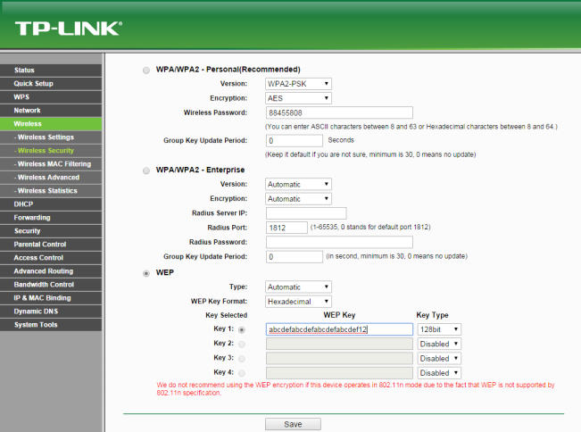
    
3.  一旦设置完成，接入点应该提供 WEP 作为加密机制。让我们现在启动攻击者的主机。

4.  让我们启动`wlan0`，通过键入下列命令：

    ```
    ifconfig wlan0 up 
    ```
    
5.  下面，我们执行下列命令：

    ```
    airmon-ng start wlan0
    ```
    
6.  这创建了`mon0`，监控器模式接口，像下面这样。使用`iwconfig `验证`mon0`接口已经创建。
    
    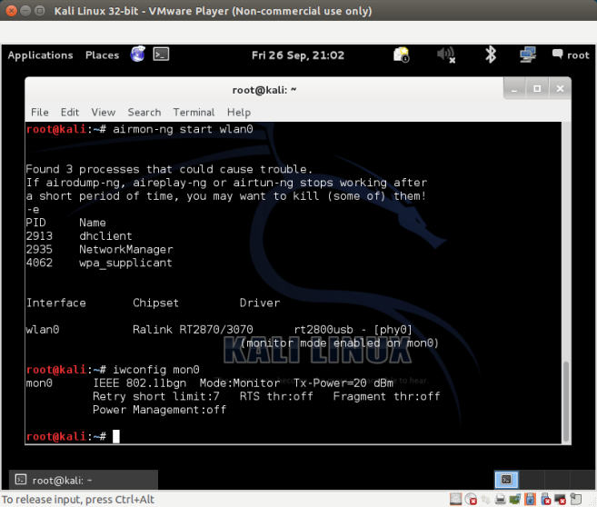
    
7.  让我们执行`airodump-ng`，使用下列命令定位我们的无线接入点：

    ```
    airodump-ng mon0
    ```
    
8.  你可以看到，我们能够看到执行 WEP 接入点的`Wireless Lab `。

    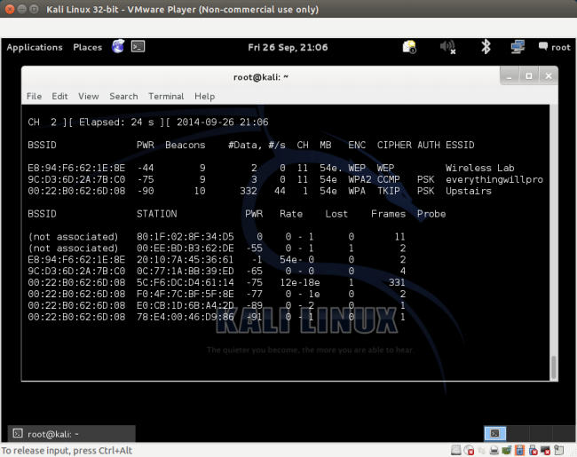
    
9.  对于这个练习，我们仅仅对`Wireless Lab `感兴趣，所以让我们输入下列命令来仅仅观察这个网络上的封包：

    ```
    airodump-ng –bssid 00:21:91:D2:8E:25 --channel 11 --write WEPCrackingDemo mon0
    ```
    
    之前的命令行就像这样：
    
    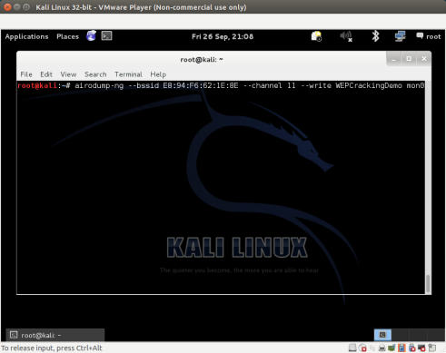
    
0.  我们使用`--write`命令让`airodump-ng `保存封包。

    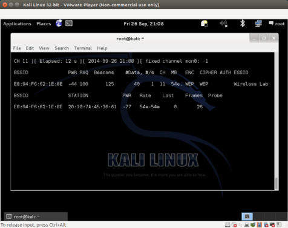
    
1.  现在让我们将无线客户端连接到接入点，并使用 WEP 密钥`abcdefabcdefabcdefabcdef12`。一旦客户端成功连接，`airodump-ng`会在屏幕上报告。

2.  如果你在相同目录下执行`ls `，你会看到以`WEPCrackingDemo-*`为前缀的文件，像这样。这些是`airodump-ng`创建的转储文件。

    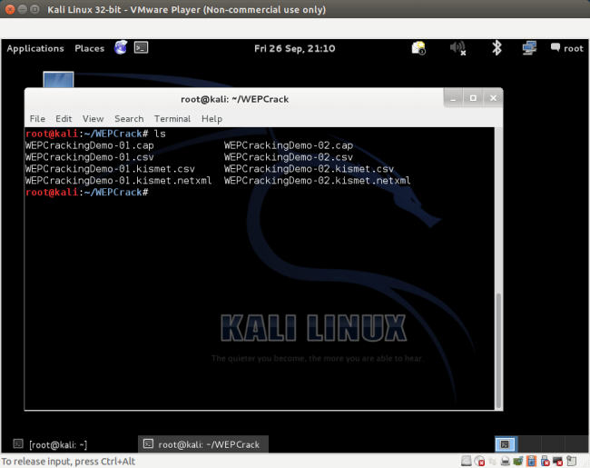
    
3.  如果你注意`airodump-ng`界面，数据封包的数量在`#Data`列下面列出，它还非常少（只有 68 个）。在 WEP 破解中，我们需要大量的数据风暴，使用相同密钥加密来利用协议的缺陷。所以，我们需要强迫网络来产生更多数据封包。为了完成它，我们使用`aireplay-ng`工具。

    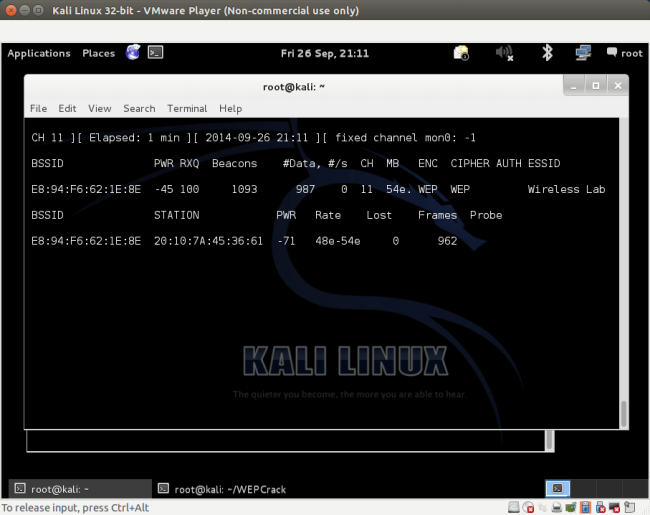
    
4.  我们使用`Aireplay-ng`捕获 ARP 封包，并将它们注入会网络来模拟 ARP 响应。我们在单独的窗口中启动 Aireplay-ng，像下面这样。将这些封包重放数千次，我们会在网络上生成大量流量。即使 Aireplay-ng 不知道 WEP 密钥，也能够通过观察封包大小来识别 ARP 封包。ARP 是个固定头部的协议，所以 ARP 封包的大小可以轻易判断，并且用于在加密流量中识别。我们执行` aireplay-ng `，参数会在后面讨论。`-3`选项用于 ARP 重放，`-b`指定网络的 BSSID，`-h`指定我们打算欺骗的客户端 MAC 地址。我们需要完成它，因为重放攻击只对验证和授权后的客户端 MAC 地址生效。

    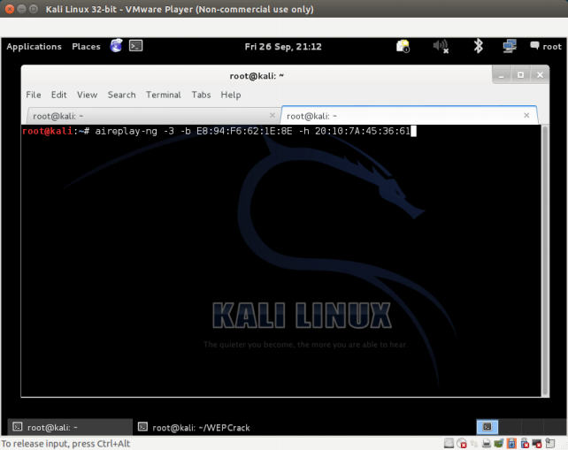
    
5.  不久你会看到`aireplay-ng`能够嗅探 ARP 封包并在网络上重放他们。如果你遇到了频道相关的错误，在命令后附加`–ignore-negative-one `，像这样：

    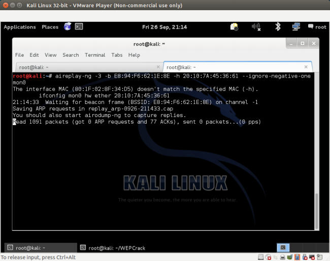
    
6.  这时，`airodump-ng `会开始收到一大堆数据封包。所以这些嗅探到的封包储存在我们之前看到的` WEPCrackingDemo-* `文件中：

    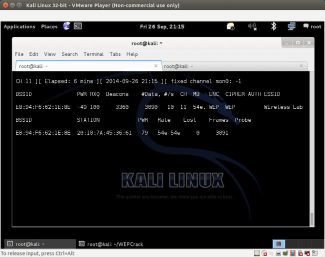
    
7.  现在开始真正的破解部分！我们以`WEPCRackingDemo-0*.cap `选项在新窗口启动`aircrack-ng `。它会开始使用文件中的数据风暴破解 WEP 密钥。要注意 Airodump-ng 收集数据封包，`aireplay-ng`进行重放攻击，`aircrack-ng `尝试基于捕获的封包来破解 WEP 密钥，所有都同时进行。这个实验中，它们都在单独的窗口打开。

8.  当`aircrack-ng`开始破解封包之后，你的界面应该是这样：

    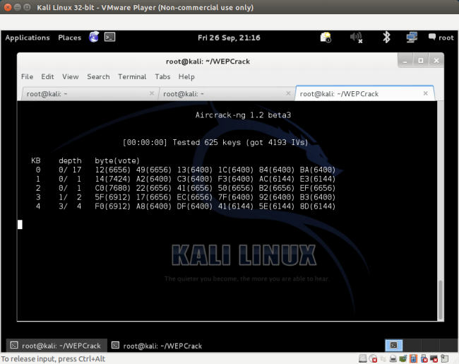
    
9.  用于破解密钥的数据封包的数量是非确定的，但是通常至少需要成百上千个。在快速的网络（或使用`aireplay-ng`）中，这最多花费 5~10 分钟。如果当前文件中的数据封包的数量不够，`aircrack-ng`就会暂停，等待更多捕获的封包，之后它会重新开始破解过程，像这样：

    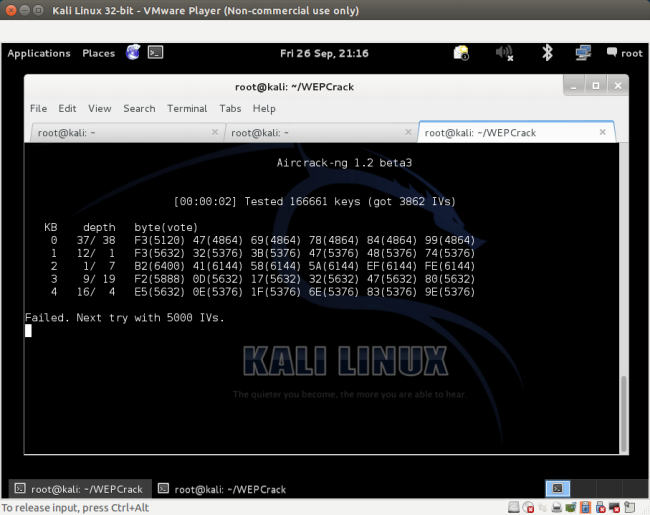
    
0.  一旦捕获到了足够的数据，`aircrack-ng `就会开始破解密钥。之后，它会在终端中展示并退出，像这样：

    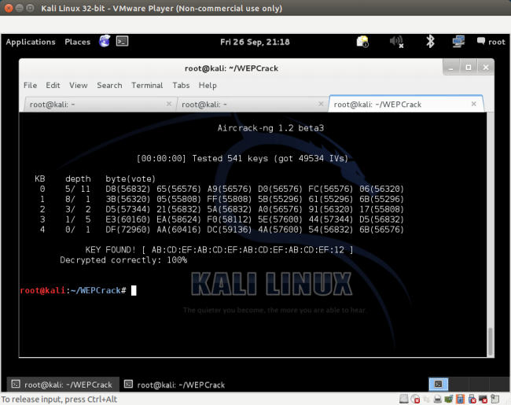
    
1.  要注意，WEP 是完全缺陷的，任何 WEP 密钥（无论多复杂）都会被 Aircrack-ng 破解。唯一的需要就是大量数据封包，使用这个密钥加密，并且对`aircrack-ng`可用。

### 刚刚发生了什么？

我们在环境中建立 WEP，并成功破解了 WEP 密钥。为了完成它，我们首先等待正常客户端连接到接入点。之后，我们使用 aireplay-ng 工具在网络上重放 ARP 封包。这会导致网络发送 ARP 重放封包，从而增加空中发送的数据封包数量。之后我们使用 aircrack-ng  工具，通过分析数据风暴的密码学缺陷来破解 WEP 密钥。

要注意我们也能够使用共享密钥验证绕过机制，来伪造接入点的验证，这会在后面的章节中学到。如果正常客户端离开了网络，这可以更方便一些。这会确保我们可以伪造验证和关联，并且继续将重放封包发送到网络。

### 试一试 -- 使用 WEP 破解伪造验证

在之前的练习中，如果正常客户端突然断开了网络，我们就不能重放封包，因为接入点会拒绝接受来自未关联客户端的封包。

你的挑战就是，使用即将在后面学到的共享密钥绕过伪造验证和授权，使你仍然能够将封包注入到网络中，并验证接入点是否接受和响应它们。

## 4.3 WPA/WPA2

WPA 或者 WPA v1 主要使用 TKIP 加密算法。TKIP 用于改进 WEP，不需要完全新的硬件来运行。反之，WPA2 必须使用 AES-CCMP 算法来加密，这比 TKIP 更加强大和健壮。

WPA 和 WPA2 允许 基于 WAP 的验证，使用基于 RADIUS 服务器（企业）和预共享密钥（PSK）（个人）的验证模式。

WPA/WPA2 PSK 易受字典攻击。攻击所需的输入是客户端和接入点之间的四次 WPA 握手，以及包含常用口令的单词列表。之后，使用例如  Aircrack-ng 的工具，我们可以尝试破解 WPA/WPA2 PSK 口令。

四次握手的演示见下面：

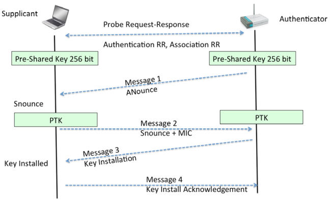

WPA/WPA2 PSK 的原理是它导出了会话层面的密钥，叫做成对临时密钥（PTK），使用预共享密钥和五个其它参数 -- 网络 SSID、验证者 Nounce （ANounce）、申请者 Nounce （SNounce）、验证着 MAC 地址（接入点 MAC）、申请者 MAC 地址（WIFI 客户端 MAC）。密钥之后用于加密接入点和客户端之间的所有数据。

通过嗅探空域来窃取整个对话的攻击者，可以获得前面提到的全部五个参数。它唯一不能得到的东西就是预共享密钥。所以，预共享密钥如何创建？它由用户提供的 WPA-PSK 口令以及 SSID 导出。这些东西的组合通过基于密码的密钥推导函数（PBKDF2）来发送，它的输出是 256 位的共享密钥。

在典型的 WPA/WPA2 PSK 字典攻击中，攻击者会使用可能口令的大量字典以及攻击工具。工具会从每个口令中导出 256 位的预共享密钥，并和其它参数（之前提到过）一起使用来创建 PTK。PTK 用于在握手包之一中验证信息完整性检查（MIC）。如果匹配，从字典中猜测的口令就正确，反之就不正确。

最后，如果授权网络的口令存在于字典中，它会被识别。这就是 WPA/WPA2 PSK 破解的工作原理。下面的图展示涉及到的步骤：

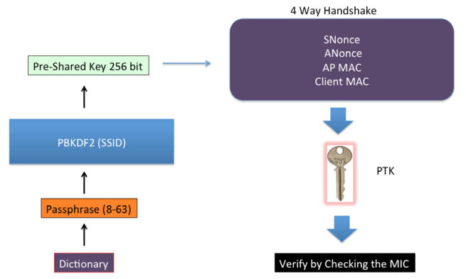

下个练习中，我们会看一看如何破解 WPA PSK 无线网络。使用 CCMP（AES）的WPA2-PSK 网络的破解步骤与之相同。

### 实战时间 -- 破解 WPA-PSK 弱口令

遵循以下步骤来开始：

1.  让我们首先连接到我们的接入点` Wireless Lab `，并设置接入点使用 WPA-PSK。我们将 WPA-PSK 口令设为`abcdefgh `，使其易于受字典攻击。

    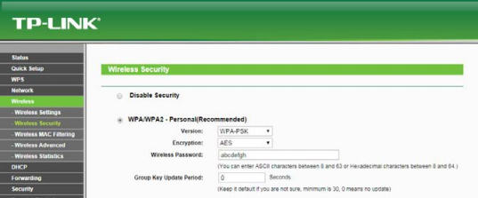
    
2.  我们以下列参数启动`airodump-ng `，使其开始捕获和储存网络上的所有封包：

    ```
    airodump-ng –bssid 00:21:91:D2:8E:25 –channel 11 –write WPACrackingDemo mon0"
    ```
    
    输出是这样：
    
    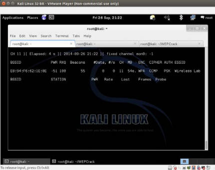
    
3.  现在我们可以等待新的客户端连接接入点，便于我们捕获四次握手包。或者我们可以广播解除验证封包来强制客户端重新连接。我们选择后者来提升速度。相同的位置频道错误可能自再次发生，同样，使用` –-ignorenegative-one`。这也需要更多尝试：

    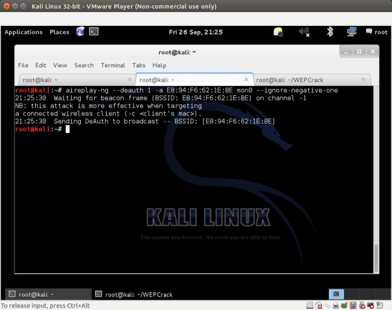
    
4.  只要我们不活了 WPA 握手包，`airodump-ng `会在屏幕的右上角将其表示为 WPA 握手包，并带有接入点的 BSSID。如果你使用了`–ignore-negative-one`，工具可能将 WPA 握手包替换为固定的频道信息。你需要观察到一闪而过的 WPA 握手信息。

5.  我们现在可以停止` airodump-ng`了。让我们在 Wireshark 中打开 cap 文件，并查看四次握手。你的 Wireshark 终端应该是这样。我在屏幕的记录文件中选择了四次握手的第一个封包。握手封包就是协议为 EAPOL 的封包：

6.  现在我们开始实际的密钥破解练习。我们需要常见单词的字典。Kali 在`metasploit `文件夹中自带了许多字典文件，位于截图这里。要注意，在 WPA 破解中，你的水平就和你的字典一样。Kali 自带了一些字典，但是这些可能不够。人们所选的密码取决于很多因素。这包括所居住的国家、区域中的常见名称和短语，用户的安全意识，以及一些其它因素。收集国际和区域特定的单词列表，在从事渗透测试的时候是个好主意。

    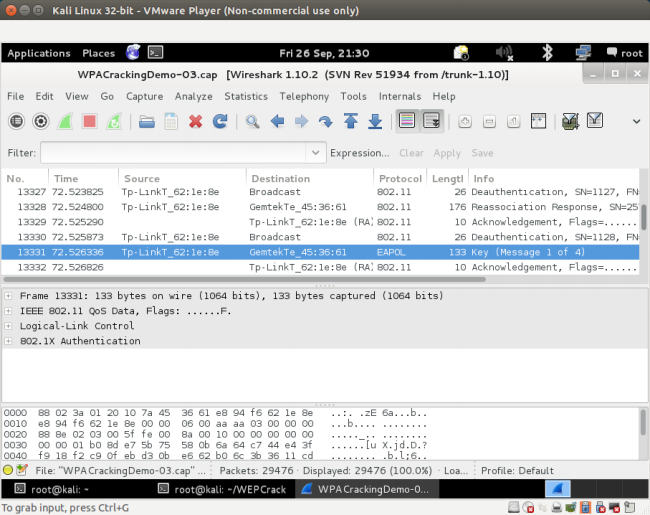
    
7.  我们现在以`pcap`文件作为输入以及到字典文件的链接调用` aircrack-ng `工具，像下面这样。我使用了`nmap.lst`，像这样：

    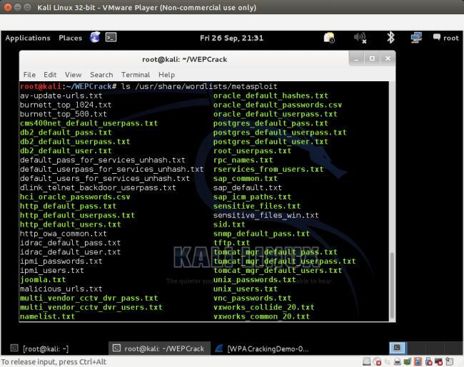
    
8.  `aircrack-ng`使用字典文件来尝试多种口令组合，并尝试破解密钥。如果口令出现在字典文件中，它会最后破解出来，并且你的屏幕会看起来像这样：

    
    
9.  要注意，因为这是字典攻击，预置条件是口令必须出现在提供给` aircrack-ng`的字典文件中。如果口令没有出现在字典中，攻击就会失败。

### 刚刚发生了什么？

我们在接入点上设置了 WPA-PSK，使用常见口令：`abcdefgh`。之后我们使用解除验证攻击，让正常客户端重新连接到接入点。当我们重新连接时，我们捕获了客户端和接入点之间的 WPA 四次握手。

因为 WPA-PSK 易受字典攻击，我们向`Aircrack-ng`输入了包含 WPA 四次握手的捕获文件，以及常见口令的列表（以单词列表形式）。因为口令`abcdefgh `出现在单词列表中，`Aircrack-ng`就能够破解 WPS-PSK 共享口令。要再次注意，在基于字典的 WPA 破解中，你的水平就等于你的字典。所以在你开始之前，编译一个大型并且详细的字典非常重要。通过 Kali 自带的字典，有时候可能不够，可能需要更多单词，尤其是考虑位置因素。

### 试一试 -- 尝试使用 Cowpatty 破解 WPA-PSK

Cowpatty 是个同样使用字典攻击来破解 WPA-PSK 口令的工具。这个工具在 Kali 中自带。我将其留做练习，来让你使用 Cowpatty 破解 WPA-PSK 口令。

同样，设置不常见的口令，它不出现在你的字典中，并再次尝试。你现在再破解口令就不会成功了，无论使用 Aircrack-ng  还是 Cowpatty。

要注意，可以对 WPA2-PSK 网络执行相同攻击。我推荐你自己验证一下。

## 4.4 加速 WPA/WPA2 的破解

我们在上一节中看到，如果我们在字典中拥有正确的口令，破解个人 WPA 每次都会像魔法一样。所以，为什么我们不创建一个大型的详细字典，包含百万个常见密码和词组呢？这会帮助我们很多，并且多数情况都会最终破解出口令。这听起来不错，但是我们错过了一个核心组件 -- 所花费的时间。更多需要 CPU 和时间的计算之一就是使用 PSK 口令和 SSID 通过 PSKDF2 的预共享密钥。这个函数在输出 256 位的与共享密钥之前，计算超过 4096 次二者组合的哈希。破解的下一步就是使用这个密钥以及四次握手中的参数来验证握手中的 MIC。这一步计算了非常大。同样，握手中的参数每次都会变化，于是这一步不能预先计算。所以，为了加速破解进程，我们需要使来自口令的与共享密钥的计算尽可能快。

我们可以通过预先计算与共享密钥，在 802.11 标准术语中也叫作成对主密钥（PMK）来加速。要注意，因为 SSID 也用于计算 PMK，使用相同口令和不同 SSID，我们会得到不同的 PMK。所以，PMK 取决于口令和 SSID。

下个练习中，我们会看看如何预先计算 PMK，并将其用于 WPA/WPA2 的破解。

### 实战指南 -- 加速破解进程

我们可以遵循以下步骤来开始：

1.  我们可以为给定的 SSID 和 单词列表，使用`genpmk`工具预先计算 PMK，使用下列命令：

    ```
    genpmk –f <chosen wordlist>–d PMK-Wireless-Lab –s "Wireless Lab
    ```
    
    这创建了包含预生成的 PMK 的 PMK-Wireless-Lab 文件。
    
    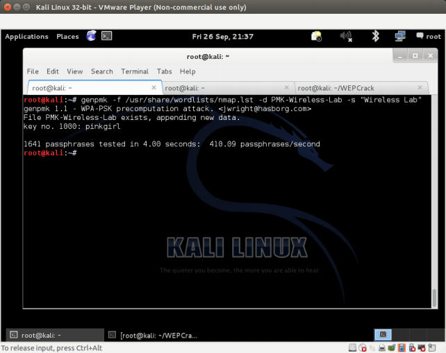
    
2.  我们现在可以使用口令`abcdefgh `（出现在我们所使用的字典中）创建 WPA-PSK 网络，并捕获该网络的 WPA 握手。我们现在使用 Cowpatty 来破解 WPA 口令，像这样：

    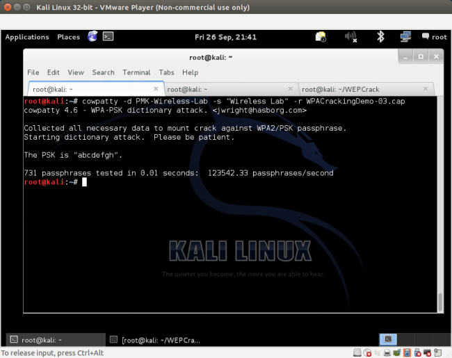
    
    Cowpatty 花费大约 7.18 秒来破解密钥，使用预先计算的 PMK。

3.  我们现在以相同字典文件来使用`aircrack-ng`，破解过程需要花费 22 分钟。这展示了我们由于预先计算节省了多少时间。

4.  为了让`aircrack-ng`使用这些 PMK，我们需要使用叫做`airolib-ng`的工具。我们向其提供选项`airolib-ng`，` PMK-Aircrack  --import`和` cowpatty PMK-Wireless-Lab`，其中`PMK-Aircrack `是需要创建的`aircrack-ng `兼容的数据库， PMK-Wireless-Lab 是我们之前创建的`genpmk `兼容的 PMK 数据库。

5.  我们现在将数据提供给`aircrack-ng`，并且破解进程会极大加速。我们使用下列命令：

    ```
    aircrack-ng –r PMK-Aircrack WPACrackingDemo2-01.cap
    ```
    
6.  Kali 上带有额外的工具，例如 Pyrit，可以利用多个 CPU 的系统来加速破解。我们使用`-r`选项将文件名称提供给`pcap`，并使用`-i`选项提供`genpmk`兼容的 PMK 文件。Pyrit 花费大约 3 秒来破解密钥，使用由`genpmk`生成的相同 PMK 文件。

### 刚刚发生了什么？

我们查看了多种不同工具和技巧来加速 WPA/WPA2-PSK 破解。主要原理就是对给定的 SSID 和字典中的口令列表预计算 PMK。

## 4.5 解密 WEP 和 WPA 封包

在所有我们做过的联系中，我们使用多种技巧破解了 WEP 和 WPA 密钥。我们能拿这些信息做什么呢？第一步就是使用密钥解密我们捕获的数据封包。

下一个练习中，我们会在相同的我们所捕获的记录文件中解密 WEP 和 WPA 封包，使用我们破解得到的密钥。

### 实战时间 -- 解密 WEP 和 WPA 封包

遵循以下步骤来开始：

1.  我们从之前创建的 WEP 捕获文件来解密封包：`WEPCrackingDemo-01.cap`。为了这样做，我们使用另一个  Aircrack-ng 套件中的工具，叫做`airdecap-ng`。我们执行下面的命令，使用之前破解的 WEP 密钥：

    ```
    airdecap-ng -w abcdefabcdefabcdefabcdef12 WEPCrackingDemo-02.cap
    ```
    
    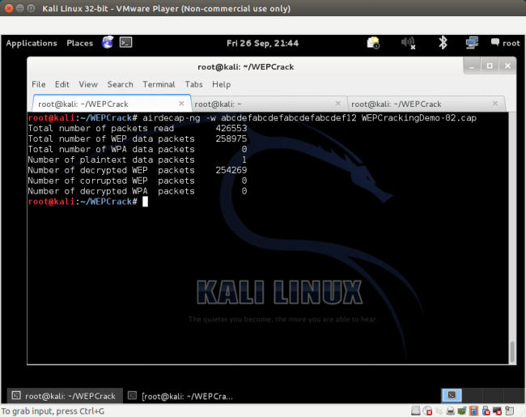
    
2.  解密文件储存在叫做`WEPCrackingDemo-02-dec.cap`的文件中。我们使用`tshark`工具来查案看文集你的前十个封包。要注意基于捕获的内容。你可能看到不同的东西。

    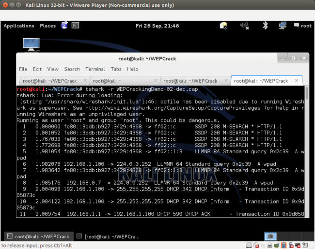
    
3.  WPA/WPA PSK 和 WEP 的工作方式完全相同，使用` airdecap-ng`工具执行下列命令，像这样：

    ```
    airdecap-ng –p abdefg WPACrackingDemo-02.cap –e "Wireless Lab"
    ```
    
    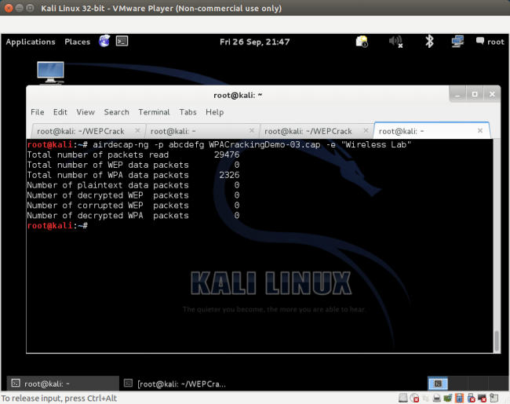
    
### 刚刚发生了什么？

我们刚刚看到了如何使用`Airdecap-ng`解密 WEP 和 WPA/WPA2-PSK 加密封包。要注意，我们可以使用 Wireshark 做相同的事情。我们推荐你查阅 Wireshark 的文档来探索如何用它来完成。

## 4.6 连接到 WEP 或 WPA 网络

我们也可以在破解网络密钥之后连接到授权网络。这在渗透测试过程中非常方便。使用破解的密钥登录授权网络，是你可以提供给客户的证明网络不安全的证据。

### 实战时间 -- 连接 WEP 网络

遵循以下步骤来开始：

1.  拥有密钥之后，使用`iwconfig`工具来连接 WEP 网络。在之前的联系中，我们破解了 WEP 密钥：`abcdefabcdefabcdefabcdef12`。

    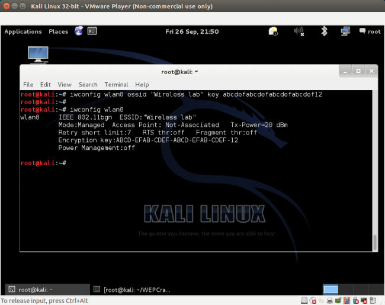
    
### 刚刚发生了什么？

我们连接到了 WEP 网络。

### 实战时间 -- 连接 WPA 网络

遵循以下步骤来开始：

1.  在 WPA 的例子中，问题有些复杂。`iwconfig`工具不能用于个人级或企业级 WPA/WPA2，因为它并不支持它。我们会使用叫做`WPA_supplicant `的新工具来完成这个实验。为了对网络使用`WPA_supplicant `，我们需要创建配置文件，像下面这样。我们将文件命名为`wpa-supp.conf`。

    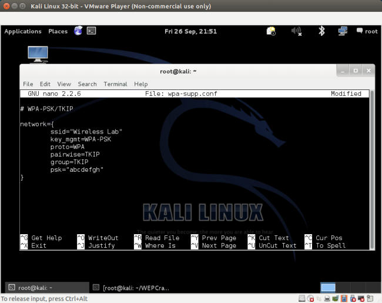

2.  之后我们使用以下选项调用`WPA_supplicant `工具：`-D wext  -i wlan0 –c wpa-supp.conf`，来连接到之前破解的 WPA 网络。一旦连接成功， WPA_supplicant 会提示信息：`Connection to XXXX completed`。

3.  对于 WEP 和 WPA 网络，一旦连接简历，你可以通过键入` dhclient3 wlan0`，使用 dhcpclient 从网络获得 DHCP 地址。

### 刚刚发生了什么？

默认的 WIFI 工具`iwconfig`不能用于连接 WPA/WPA2 网络。实际上的工具是` WPA_Supplicant`。这个实验中，我们看到如何使用它来连接 WPA 网络。

## 小测验 -- WLAN 加密缺陷

Q1 哪种封包用于封包重放？

1.  解除验证封包
2.  关联封包
3.  加密的 ARP 封包
4.  以上都不是

Q2 WEP 什么时候能被破解？

1.  始终
2.  只要使用弱密钥/口令
3.  只在特殊的场景下
4.  只要接入点运行旧的软件

Q3 WPA 什么时候能被破解？

1.  始终
2.  只要使用弱密钥/口令
3.  如果客户端包含旧的固件
4.  即使没有客户端连接到无线网络

## 总结

这一章中，我们了解了 WLAN 加密。WEP 含有缺陷，无论 WEP 密钥是什么，使用足够的数据封包就能破解 WEP。WPA/WPA2 在密码学上不可破解；但是，在特殊的场景下，例如 WPA/WP2-PSK 中使用了弱口令，它就能够通过字典攻击来获得口令。

下一章中我们会看一看 WLAN 设施上的不同工具，例如伪造接入点，邪恶双生子，位反转攻击，以及其它。
