# 第五章 攻击 Web 设施

> 作者：Vivek Ramachandran, Cameron Buchanan

> 译者：[飞龙](https://github.com/)

> 协议：[CC BY-NC-SA 4.0](http://creativecommons.org/licenses/by-nc-sa/4.0/)

## 简介

> 故上兵伐谋

> -- 孙子，《孙子兵法》

这一章中，我们会攻击 WLAN 设施的核心。我们作为攻击者，会专注于如何使用不同的新型攻击向量和诱使授权客户端连接我们，来渗透授权网络。

## 5.1 接入点的默认账户和身份

WLAN 接入点是设施的核心部分。即使它们起到重要作用，它们有时候在安全上会被忽视。这个练习中，我们会检查是否修改了接入点的默认密码。之后，我们会验证，即使密码修改了，它们是否易于使用基于字典的攻击猜测和破解。

要注意，因为我们来到了更高级的章节，我们就假设你已经浏览了前面的章节，现在熟悉了所有这里所讨论的工具的使用。这允许我们构建在这些知识智商，并尝试更加复杂的攻击。

### 实战时间 -- 破解接入点的默认账户

遵循以下步骤来开始：

1.  让我们首先连接到`Wireless Lab `接入点，并尝试访问 HTTP 管理界面。我们会看到接入点模型是`TP-Link WR841N`，像这样：

    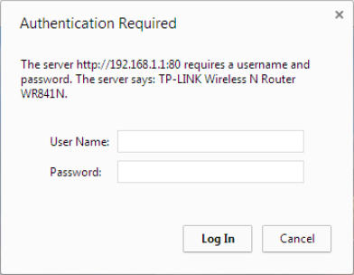
    
2.  从厂商的网站中，我们找到了管理员的默认账户是`admin`。我们在登录页面上尝试它，并且我们成功登录。这展示了攻破使用默认身份的账户有多容易。我们强烈推荐你获得路由器的在线用户手册。这会允许你理解在渗透测试过程中应该怎么做，以及向你提供其它配置缺陷的洞察。

    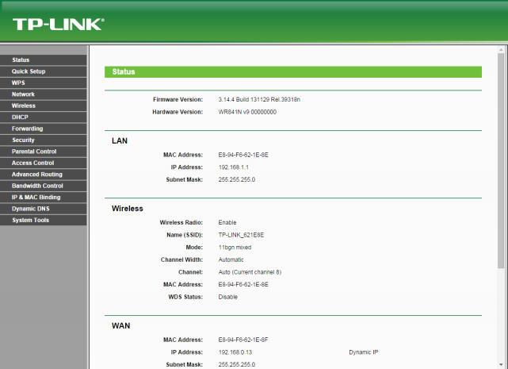
    
### 刚刚发生了什么？

我们验证了这个接入点上的默认密码没有改动，这会让整个网络沦陷。同样，即使默认身份被改动，结果也可能是一些易于猜测或执行字典工具的东西。

### 试一试 -- 使用爆破来破解账户

在上一个练习中，将密码修改为一些难以猜测或在字典中找到的东西，并看看你是否能够使用爆破的手段攻破它。限制密码的长度和字符，以便你可能会成功。用于破解 HTTP 验证的工具之一叫做 Hydra，Kali 中自带。

## 5.2 拒绝服务攻击

WLAN 易于受到使用多种技巧的拒绝服务攻击，包括但不仅限于：

+   解除验证攻击

+   接触挂链攻击

+   CTS-RTS 攻击

+   信号或频谱干扰攻击

在这本书中，我们会使用下列实验来讨论无线设施上的杰出验证攻击。

### 实战时间 -- 解除验证 DoS 攻击

遵循以下步骤来开始：

1.  将` Wireless Lab `网络配置为使用开放验证，没有任何加密。这会允许我们更易于使用 Wireshark 查看封包。

    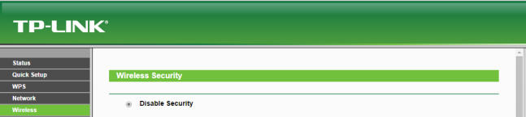
    
2.  让我们将 Windows 客户端连接到接入点。我们会在`airodump-ng `的界面中看到连接：

    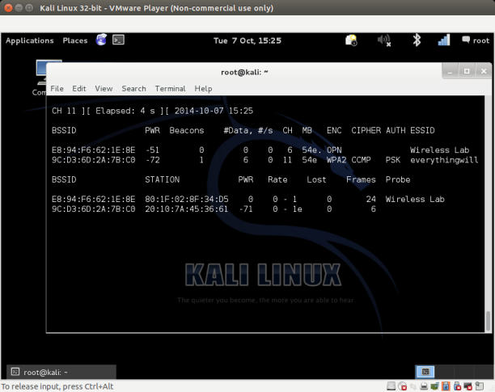
    
3.  现在，在攻击者的主机上，让我们对其执行直接的解除验证攻击。

    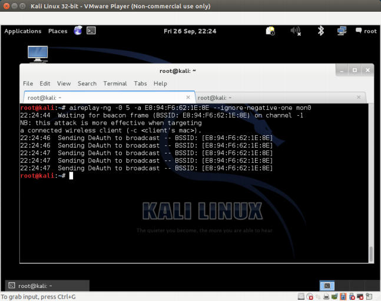
    
4.  要注意，客户端现在完全断开了接入点的连接。我们可以在`airodump-ng`界面上验证它。

    
    
5.  如果我们使用 Wireshark 来查看流量，你会注意到，我们刚才发送了大量解除验证的封包。

    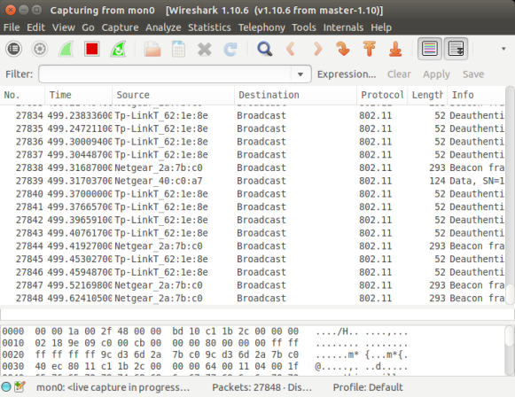
    
6.  我们可以代表接入点向整个网络发送广播解除验证封包，来执行相同攻击。这会断开所有客户端的连接：

    
    
### 刚刚发生了什么？

我们成功发送了解除验证封包给接入点和客户端。这会导致它们之间的连接断开和通信丢失。

我们也可以发送广播解除验证封包，这会确保附近没有客户端能成功连接到我们的接入点。

要注意，只要客户端断开了，它会尝试再次连接到接入点，所以解除验证攻击应该持续进行，来产生拒绝服务的效果。

这是最易于构造的攻击但是有毁灭性的效果。这很方便在现实世界中使用，来使无线网络崩溃。

### 试一试 -- 解除关联攻击

尝试弄清如何使用 Kali 上现有工具，对目标设施执行解除关联攻击。你可以发送广播解除关联攻击吗？

## 5.3 邪恶双生子和接入点 MAC 欺骗

WLAN 设施上的最有潜力的攻击之一就是邪恶双生子。其原理是，在 WLAN 附近引入一个由攻击者控制的接入点。这个接入点具有与授权 WLAN 完全相同的 SSID。

许多无线用户可能会碰巧连接到这个恶意的接入点上，认为它是授权网络的一部分。一旦建立了连接，攻击者就可以执行共建人工及，并且在转发流量的是偶窃听整个通信。我们在之后的章节中会看到中间人攻击如何完成。现实世界中，攻击者会使用这个攻击来接近授权网络，使用户混淆并碰巧连接攻击者的网络。

拥有和授权接入点相同 MAC 地址的邪恶双生子更加难以检测和判断。这就是接入点 MAC 欺骗出现的原因。在下一个实验中，我们会看到如何创建邪恶双生子，并结合接入点 MAC 欺骗。

### 实战时间 -- 邪恶双生子和 MAC 欺骗

遵循以下步骤来开始：

1.  使用`airodump-ng`来定位接入点的 BSSID（MAC） 和 ESSID（SSID），我们会使用它来模拟邪恶双生子。

    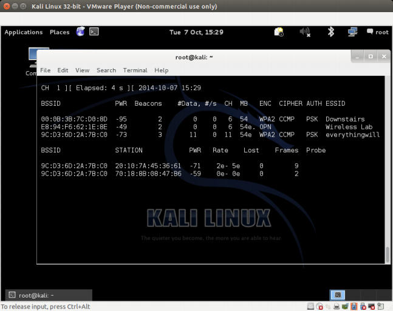
    
2.  我们将无线客户端连接到这个接入点上。

    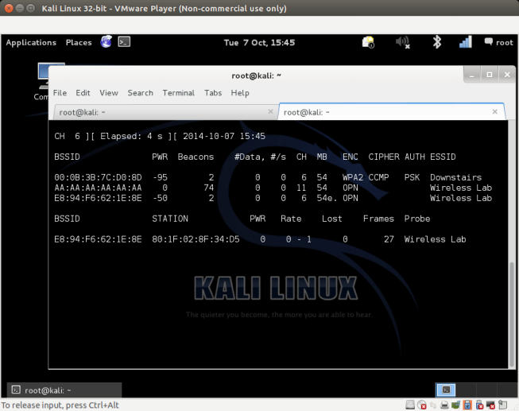
    
3.  利用这些信息，我们使用`airbase-ng`命令创建相同 ESSID 不同 BSSID 的接入点。新的发行版中可能出现少量错误。

    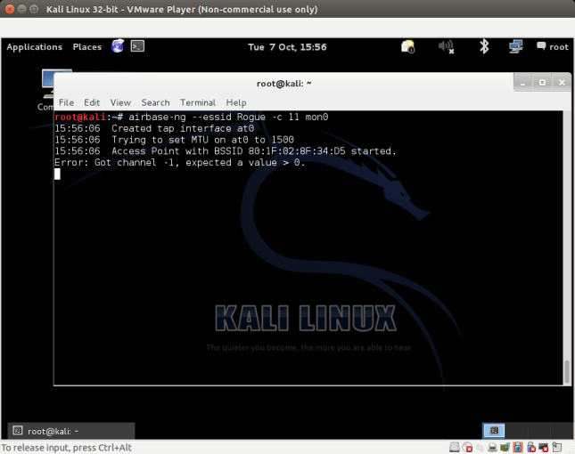
    
4.  新的接入点也会在`airodump-ng`屏幕上出现。要注意吗你需要在新的窗口中执行`airodump-ng`，使用下列命令：

    ```
    airodump-ng --channel 11 wlan0
    ```
    
    让我们看看新的接入点：
    
    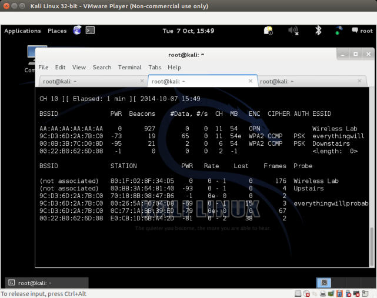
    
5.  现在我们向客户端发送解除验证封包，使其断开连接并立即尝试重连。

    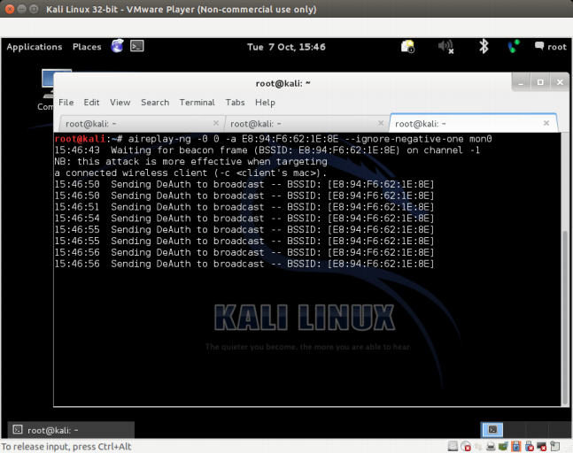
    
6.  由于我们离客户端更近，我们的信号强度更大，它会重新链接大我们的邪恶双生子接入点上。

7.  我们也可以进行接入点的 MAC 地址欺骗，使用下列命令：

    ```
    airbase-ng –a <router mac> --essid "Wireless Lab" –c 11 mon0
    ```
    
8.  现在如何我们观察`airodump-ng`，几乎不能分辨出二者的不同。

    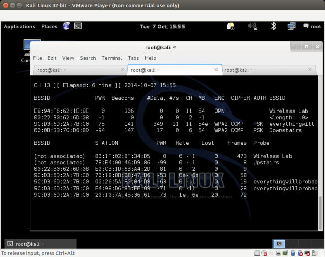
    
9.  即使`airodump-ng`也不能识别出相同频道中有两个不同的物理接入点。这是邪恶双生子的最可能的形式。

### 刚刚发生了什么？

我们创建了授权网络的邪恶双生子，并使用解除验证攻击来使正常客户端连接到我们，而不是授权网络接入点。

要注意，在使用 WEP/WPA 加密的授权接入点的情况中，就难以执行流量窃听攻击。我们在之后的章节中会看一看如何使用 Caffe Latte 攻击来破解 WEP 密钥。

### 试一试 -- 邪恶双生子和频道跳跃

在之前的联练习中，在不同的频道上执行邪恶双生子攻击，并观察客户端一旦连接之后，如何在频道上跳跃来连接接入点。客户端决定连接哪个接入点的决定因素是什么？是信号强度吗？做实验并验证它。

### 5.4 未授权接入点

未授权接入点是连接到授权网络的未授权接入点。通常，这个接入点可以用作攻击者的后门入口，使其能够绕过网络的所有安全控制。这意味着防火墙，入侵检测系统，以及其它，这些守护网络边界的设施，都不能阻止攻击者访问无线网络。

在最常见的例子中，未授权接入点设为开放连接，没有加密。未授权接入点可以通过如下两步创建。

+   在授权网络上安装真实的物理设备，作为未授权接入点（这是我留做练习的事情）。而且，这会攻破授权网络的物理安全，而不是无线安全。

+   在软件中创建未授权接入点，并桥接到本地授权网络的以太网上。这会允许任何运行在授权网络上的笔记本作为未授权的接入点。我们在下个试验中会看看它。

### 实战时间 -- 破解 WEP

遵循以下步骤来开始：

1.  首先使用` airbase-ng`来创建未授权的接入点，并使其 ESSID 为`rouge`：

    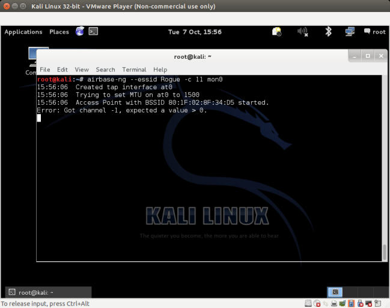
    
2.  我们现在打算创建以太网接口和我们的未授权接入点接口的桥接，前者是授权网络的一部分。为了完成它，我们首先安装` bridge-utils `，创建桥接接口，并将其命名为` Wifi-Bridge`。下面的截图展示了实战中的所需命令：

    ```
    apt-get install bridge-utils 
    brctl addbr Wifi-Bridge
    ```
    
    让我们看看命令输出：
    
    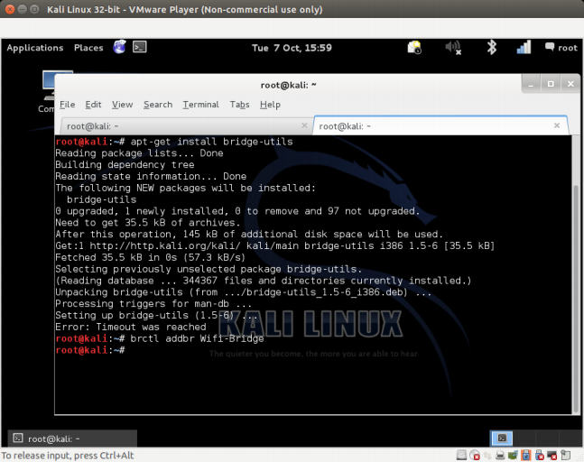

3.  之后我们将以太网和  Airbaseng 创建的`At0`虚拟接口添加到桥接中。

    ```
    brctl addif Wifi-Bridge eth0 
    brctl addif Wifi-Bridge ath0
    ```
    
    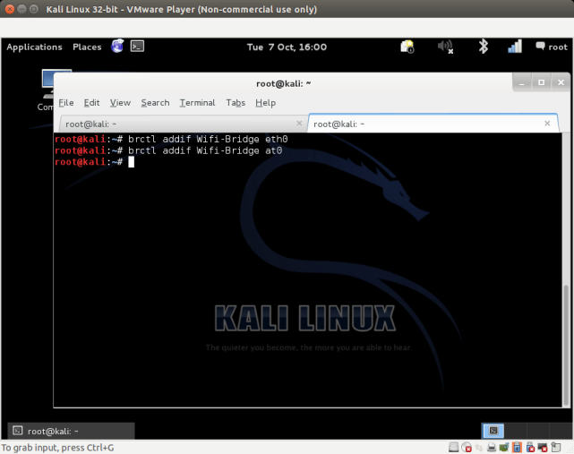
    
4.  之后我们启动这些接口来启动桥接，使用下列命令：

    ```
    ifconfig eth0 0.0.0.0 up 
    ifconfig ath0 0.0.0.0 up
    ```
    
    命令的截图如下：
    
    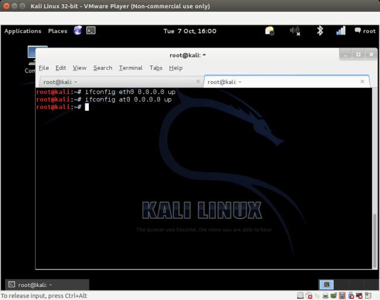
    
5.  之后我们开启内核中的 IP 转发来确保封包被转发：

    ```
    echo 1 > /proc/sys/net/ipv4/ip_forward
    ```
    
    命令的截图如下：
    
    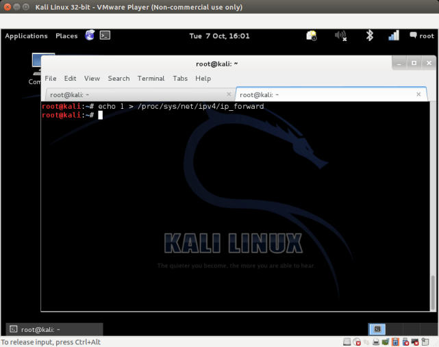

6.  太棒了！我们完成了。现在，任何连接到我们未授权接入点的无线客户端都可以完整访问授权网络，使用我们刚才构建的无线到有线的`Wifi-Bridge `。我们可以通过将一个客户端连接到未授权接入点来验证它。一旦建立连接，如果你使用 Vista，你的界面应该是这样：

    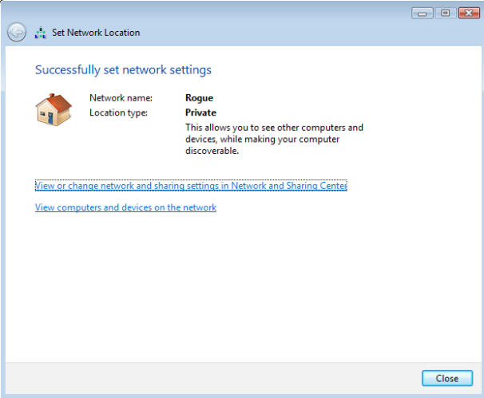
    
7.  要注意它从运行在授权 LAN 上的 DHCP 守护程序接收 IP 地址。

    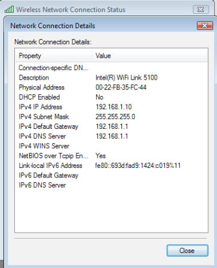
    
8.  我们现在从该无线客户端使用这个未授权接入点访问有线网络上的任何主机。下面我们 ping 有线网络上的网关：

    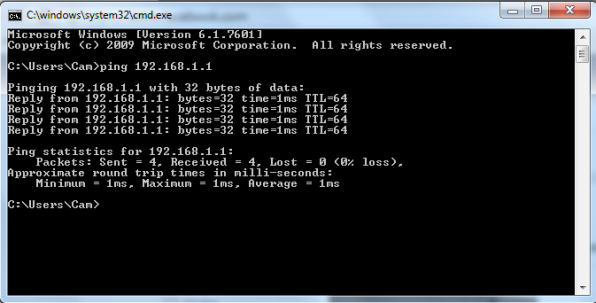
    
### 刚刚发生了什么？

我们创建了未授权的接入点，并使用它来将所有 LAN 授权网络的流量桥接到无线网络上。你可以看到，这是个严重的安全隐患，因为任何人都可以使用这个桥接来攻破有线网络。

### 试一试 -- 未授权接入点的挑战

看看你能否创建使用 WPA/WPA2 Jamie的未授权无线接入点，使其看起来更加正常。

## 小测验 -- WLAN 设施上的攻击

Q1 多数情况下，未授权接入点使用哪种加密？

1.  无
2.  WEP
3.  WPA
4.  WPA2

Q2 对于邪恶双生子，拥有和授权接入点相同 MAC 地址的好处是什么？

1.  使分辨邪恶双生子更加困难。
2.  强制客户端连接它。
3.  增加网络的信号强度。
4.  以上都不是。

Q3 DoS 攻击是干什么的？

1.  占据网络的所有吞吐量。
2.  不以客户端作为目标。
3.  只有我们知道了网络的 WEP/WPA/WPA2 验证信息，才可以实现它。
4.  以上全部。

Q4 未授权接入点是干什么的，以及如何创建它们？

1.  它们在授权网络上开放后门入口。
2.  它们只能使用 WPA2 加密。
3.  它们可以创建为基于软件的接入点，或者实体设备。
4.  1 和 3。

## 总结

这一章中，我们探索了不同的方式来攻破无线网络设施的安全。

+   攻破接入点的默认账户和验证。
+   拒绝服务攻击。
+   邪恶双生子和 MAC 欺骗。
+   企业网络中的未授权接入点。

下一章中，我们会看看无线客户端上的不同攻击。有趣的是，多数管理员觉得客户端没有值得担心的安全问题。我们会看到这个真理不再正确了。
