# 第六章 攻击客户端

> 作者：Vivek Ramachandran, Cameron Buchanan

> 译者：[飞龙](https://github.com/)

> 协议：[CC BY-NC-SA 4.0](http://creativecommons.org/licenses/by-nc-sa/4.0/)

## 简介

> 安全强度取决于最弱的部分。

> -- 信息安全领域的名言

多数渗透测试者似乎把全部注意力都放在 WLAN 设施上，而不会注意无线客户端。但是要注意，黑客也可以通过入侵无线客户端来获得授权网络的访问权。

这一章中，我们将注意力从 WLAN 设施转移到无线客户端。客户端可能是连接的，也可能是独立未连接的。我们会看一看以客户端为目标的几种攻击。

## 6.1 蜜罐和错误关联攻击

通常，当客户端例如笔记本电脑打开时，它会探测之前连接的网络。这些网络储存在列表中，在基于 Windows 的系统上叫做首选网络列表（PNL）。同时，除了这个列表之外，无线客户端会展示任何范围内的可用网络。

黑客可以执行一个或多个下列事情：

+   静默监控探针，并建立伪造接入点，带有与客户端所搜索的 AP 相同的 ESSID。这会导致客户端连接到黑客的机器，并认为它是正常的网络。
+  创建和附近的 AP 带有相同 ESSID 的伪造接入点，并说服用户连接它。这种攻击非常易于在咖啡厅和机场实施，其中用户可能会寻找 WIFI 连接。
+   使用记录信息来了解受害者的动作和习惯，我们会在之后的章节中展示。

这些攻击都叫做蜜罐攻击，因为黑客的接入点和正常的接入点错误连接。

下个练习中，我们会执行这两种攻击。

### 实战时间 -- 实施错误关联攻击

遵循这些指南来开始：

1.  之前的实验中，我们使用已经连接到` Wireless Lab `接入点的客户端。让我们切换客户端上，但不要连接到真实的` Wireless Lab `接入点上。让我们执行` airodump-ng mon0 `并检查输出。你不久会发现客户端处于`not associated `模式并且探测` Wireless Lab `和列表中的其它 SSID。

    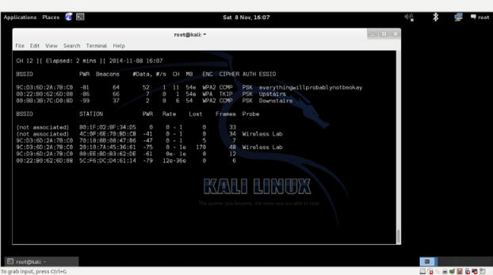
    
2.  为了理解发生了什么，让我们运行 Wireshark 并开始嗅探`mon0`接口。像预期的一样，你可能看到一堆和我们不相关的封包。使用 Wireshark 过滤器，只显示来自你所使用的客户端 MAC 地址的探测请求封包。

    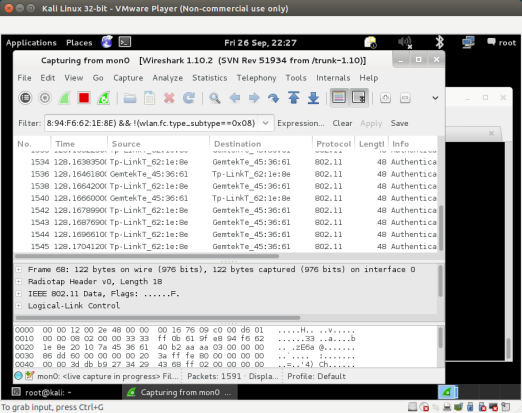
    
3.  我这里，过滤器是`wlan.fc.type_subtype == 0x04 && wlan.sa == <my mac>`。你应该看到了只来自之前识别的 SSID 的客户端的探测请求封包。

4.  让我们现在在黑客的主机上启动伪造接入点`Wireless Lab `，使用下列命令：

    ```
    airbase-ng –c 3 –e  "Wireless Lab" mon0
    ```
    
5.  等待几秒钟，客户端会自动连接到我们。这展示了让未关联的客户端连接时多么容易。

    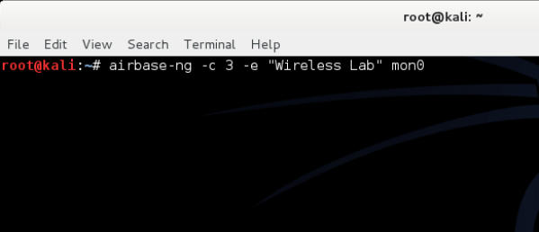
    
6.  现在我们尝试和另一台路由器竞争，我们会创建伪造接入点`Wireless Lab`，同时存在正常的接入点。让我们打开接入点来确保`Wireless Lab`对客户端可用。对于这个实验，我们将接入点的频道设为 3。让客户端连接到接入点，我们可以从`airodump-ng`中严重，像这样：

    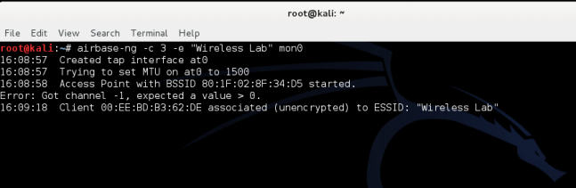
    
7.  现在让我们启动 SSID 为`Wireless Lab`的伪造接入点：

    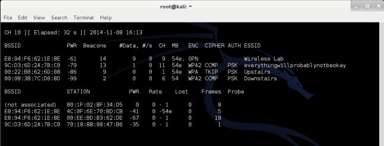
    
8.  要注意客户端仍旧会连接到`Wireless Lab`，也就是正常的接入点。

    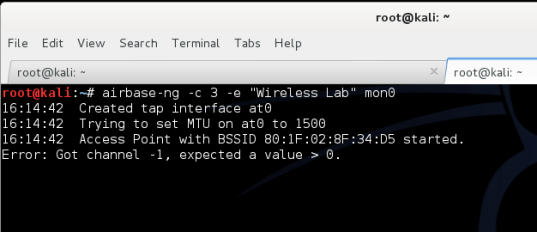
    
9.  我们现在发送广播解除验证消息给客户端，代表正常接入点来断开连接。

    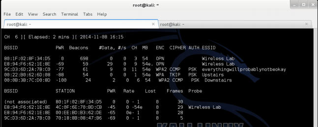
    
0.  假设对于客户端来说，我们的伪造接入点` Wireless Lab`信号强度强于正常接入点。它会连接到我们的伪造接入点而不是正常接入点。

    
    
1.  我们可以通过观察`airodump-ng`输出来看到客户端重新关联到了我们的伪造接入点上。

    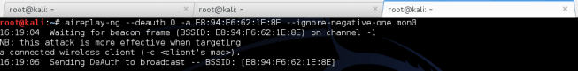
    
### 刚刚发生了什么？

我们刚刚使用来自客户端的探针列表来创建蜜罐，并使用和邻近接入点相同的 ESSID。在第一个例子中，客户端在搜索网络的时候，自动连接到了我们。第二个例子中，因为我们离客户端比真正的接入点更近，我们的信号强度就更高，所以客户端连接到了我们。

### 试一试 -- 强迫客户端连接蜜罐

在上一个练习中，如果客户端不自动连接到我们，我们能做什么呢？我们需要发送解除验证封包来打破正常的客户端到接入点的链接，之后如果我们的信号强度更高，客户端会连接到我们的伪造接入点上。通过将客户端连接到正常接入点，之后强迫它连接蜜罐来尝试它。

## 6.2 Caffe Latte 攻击

在蜜罐攻击中，我们注意到客户端会持续探测它们之前连接到的 SSID。如果客户端已经使用 WEP 连接到接入点，例如 Windows 的操作系统会缓存和储存 WEP 密钥。下一个客户端连接到相同接入点时，Windows 无线配置管理器就会自动使用储存的密钥。

Caffe Latte 攻击由 Vivek 发明，它是这本书的作者之一，并且在 Toorcon 9,  San Diego, USA 上演示。Caffe Latte 攻击是一种 WEP 攻击，允许黑客仅仅使用客户端，获取授权网络的 WEP 密钥。这个攻击并不需要客户端距离授权 WEP 非常近。它可以从单独的客户端上破解 WEP 密钥。

在下一个练习中，我们将使用 Caffe Latte 攻击从客户端获取网络的 WEP 密钥。

### 实战时间 -- 实施Caffe Latte 攻击

遵循这些指南来开始：

1.  让我们首先使用 WEP 建立正常接入点`Wireless Lab `，密钥为`ABCDEFABCDEFABCDEF12`。

    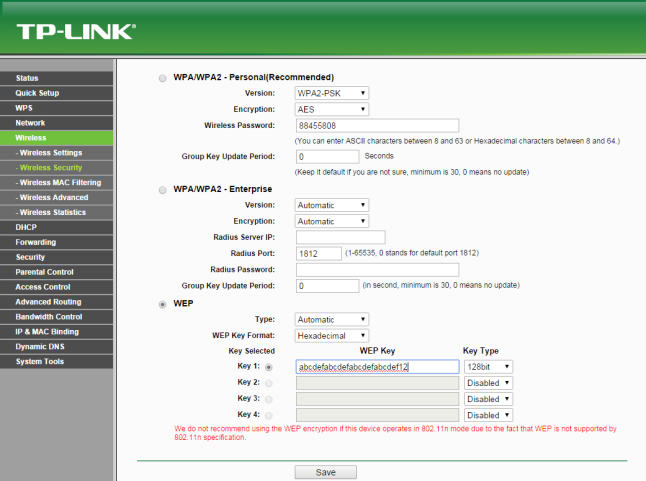
    
2.  将客户端连接到它，并使用`airodump-ng`验证连接是否成功，像这样：

    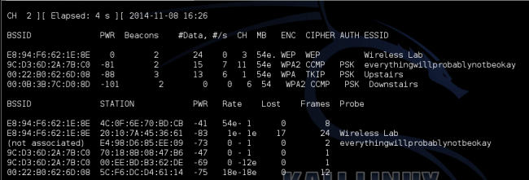
    
3.  关闭接入点，确保客户端处于未关联的状态，并搜索 WEP 网络`Wireless Lab`。

4.  现在我们使用`airbase-ng`来建立接入点，将`Wireless Lab`作为 SSID，参数如下：

    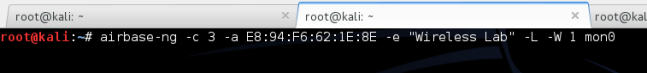
    
5.  一旦客户端连接到了接入点，`airbase-ng `开始了 Caffe Latte 攻击，像这样：

    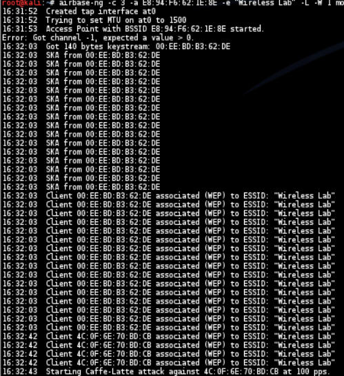
    
6.  我们现在开启`airodump-ng `来收集来自这个接入点的数据包，向我们之前在 WEP 破解场景下所做的那样：

    
    
7.  我们同时启动`aircrack-ng`，就像我们之前在 WEP 破解练习中那样，来开始破解。这个命令行是` aircrack-ng filename`，其中`filename`是`airodump-ng`所创建的文件名称。

### 刚刚发生了什么？

我们成功从无线客户端获得了 WEP 密钥，不需要任何真实的接入点，或者在附近存在。这就是 Caffe Latte 攻击的力量。

基本上，WEP 接入点不需要验证客户端是否知道 WEP 密钥来获得加密后的流量。在连接在新的网络时，流量的第一部分总是会发送给路由器，它是 ARP 请求来询问 IP。

这个攻击的原理是，使用我们创建的伪造接入点反转和重放由无线客户端发送的 ARP 包。这些位反转的 ARP 请求封包导致了无线客户端发送更多 ARP 响应封包。

位反转接收加密值，并将其自改来创建不同的加密值。这里，我们可以接收加密 ARP 请求并创建高精确度的 ARP 响应。一旦我们发回了有效的 ARP 响应，我们可以一次又一次地重放这个值，来生成我们解密 WEP 密钥所需的流量。

要注意，所有这些封包都是用储存在客户端的 WEP 密钥加密。一旦我们得到了大量的这类封包，` aircrack-NG`就能够轻易恢复出 WEP 密钥。

### 试一试 -- 熟能生巧

尝试修改 WEP 密钥并且重放攻击。这是个有难度的攻击，并且需要一些练习来成功实施。使用 Wireshark 检验无线网络上的流量是个好主意。

### 6.3 解除验证和解除关联攻击

我们已经在之前的章节中看到了接入点上下文中的解除验证攻击，这一章中，我们会在客户端上下文中探索这种攻击。

下一个实验中，我们会发送解除验证封包给客户端并且破坏已经建立的接入点和客户端之间的连接。

### 实战时间 -- 解除客户端的验证

遵循这些指南来开始：

1.  让我们首先启动接入点`Wireless Lab `，让我们使其保持运行，以 WEP 加密，来证明即使开启加密，也可能攻击接入点和客户端之间的连接。让我们使用`airodump-ng`来验证接入点开启：

    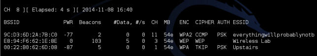
    
2.  让我们将客户端连接到这个接入点，并使用`airodump-ng`验证：

    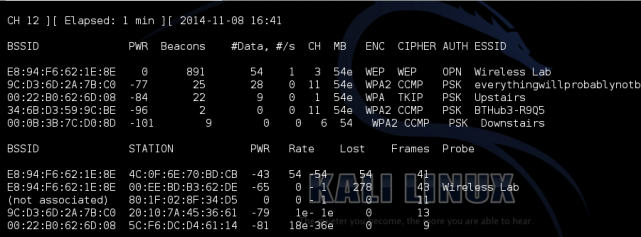
    
3.  我们现在执行`aireplay-ng`，将接入点连接作为目标。

    
    
4.  客户端断开了连接，并尝试重新连接。我们可以使用 Wireshark 来验证。

    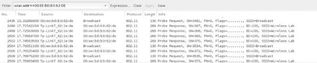
    
5.  我们现在看到了，即使使用了 WEP 加密，还是可以解除客户端的验证并使其断开。即使使用 WPA/WPA2 也是一样。让我们现在将接入点设置为 WPA 加密并验证。

    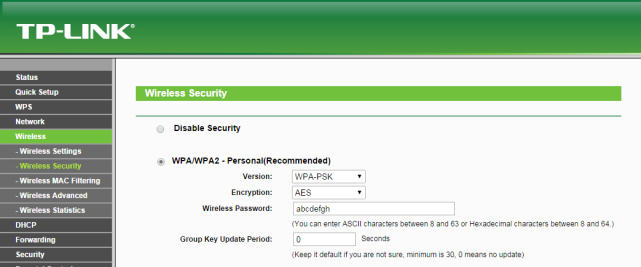
    
6.  让我们将客户端连接到接入点并确保已经连接。

    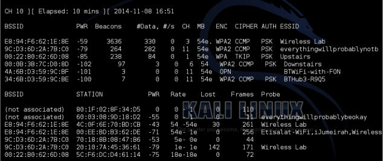
    
7.  让我们现在运行` aireplay-ng `来断开客户端和接入点的连接：

    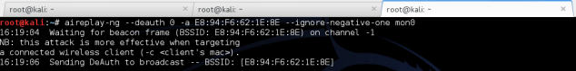
    
### 刚刚发生了什么？

我们刚刚看到了如何使用解除验证帧，选项性断开无线客户端到接入点的连接，即使使用了 WEP/WPA/WPA2 加密方式。这仅仅通过发送解除验证封包给接入点来完成 -- 客户端偶对，而不是发送广播解除验证封包给整个网络。

### 试一试 -- 客户端上的解除关联攻击

在上一个练习中，我们使用了解除验证攻击来破解连接。尝试使用解除关联访问来破坏客户端和接入点之间的连接。

## 6.4 Hirte 攻击

我们已经看到了如何实施 Caffe Latte 攻击。Hirte 攻击扩展自 Caffe Latte 攻击，使用脆片机制并允许几乎任何封包的使用。

Hirte 攻击的更多信息请见 Aircrack-ng 的官网：`http:// www.aircrack-ng.org/doku.php?id=hirte`。

我们现在使用` aircrack-ng `来在相同客户端上实施 Hirte 攻击。

### 实战时间 -- 使用 Hirte 攻击破解 WEP

遵循这些指南来开始：

1.  使用`airbase-ng `工具创建 WEP 接入点，和上一个练习完全一样。唯一的附加选项就是`-N`选项而不是`-L`选项来加载 Hirte 攻击。

    
    
2.  在单独的窗口开启`airodump-ng `来捕获`Wireless  Lab`蜜罐的封包。

    
    
3.  现在`airodump-ng `会开始监控网络，并在`Hirte-01.cap `文件中储存封包。

    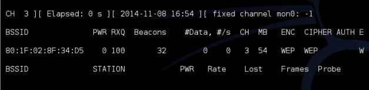
    
4.  一旦漫游客户端连接到了我们的蜜罐 AP，Hirte 攻击就会由`airbase-ng`自动加载。

    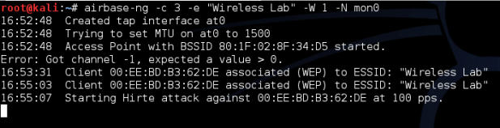
    
5.  我们像上一个练习那样启动` aircrack-ng`，最后密钥会破解出来。

### 刚刚发生了什么？

我们对 WEP 客户端实施了 Hirte 攻击，客户端是隔离的，并远离授权网络。我们使用和 Caffe Latte 攻击相同的方式来破解密钥。

### 试一试 -- 坚持整，整就牛

我们推荐你在客户端上设置不同的 WEP 密钥并多次尝试这个练习来获得自信。你可能会注意你需要多次重新连接客户端来使其生效。

## 6.5 无 AP 情况下的 WPA 破解

在第四章中，我们看到了如何使用`airecrack-ng`来破解 WPA/WPA2 PSK，基本原理是捕获四次 WPA 握手，之后加载字典攻击。

关键问题是：可不可以仅仅使用客户端来破解 WPA，在没有接入点的情况下？

让我们再看一看 WPA 破解练习：

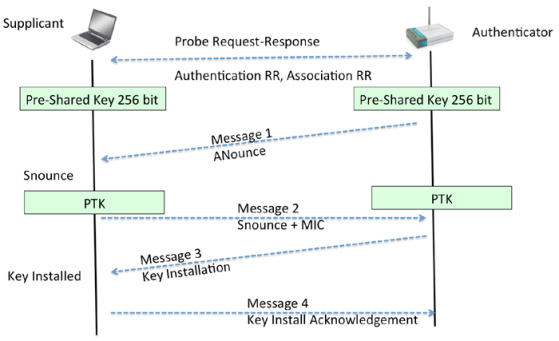

为了破解 WPA，我们需要来自四次握手的四个参数 -- 验证方的 Nounce，请求方的 Nounce，验证方的 MAC，请求方的 MAC。现在有趣的是，我们不需要握手中的全部四个封包来提取这些信息。我们可以只从封包 1 和 2，或 2 和 3 中提取。

为了破解 WPA-PSK，我们需要启动 WPA-PSK 蜜罐，并且当客户端连接时，只有消息 1 和 2 会发送。由于我们并不知道口令，我们就不能发送消息 3。但是，消息 1 和 2 包含所有密钥破解所需的信息：

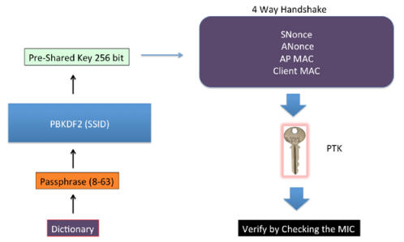

### 实战时间 -- 无 AP 情况下的 WPA 破解

1.  我们首先启动 WPA-PSK 蜜罐，ESSID 为`Wireless Lab`。`-z 2`选项使用 TKIP 创建 WPA-PSK 接入点。

    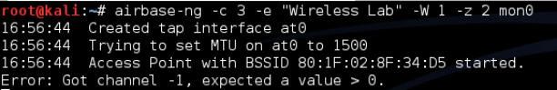
    
2.  让我们启动`airodump-ng `来从这个网络上捕获封包：

    
    
3.  现在当我们的漫游客户端连接到这个接入点时，它会开始握手，但是在消息 2 之后失败，就像我们之前讨论的那样。但是，破解握手所需的数据已经捕获了。

4.  我们使用`airodump-ng `所捕获的文件和相同的字典文件运行`aircrack-ng `。最后，我们会破解出口令。

### 刚刚发生了什么？

我们能够只通过客户端破解 WPA。这是因为，即使只拥有前两个封包，我们也能获得针对握手的字典攻击的全部所需信息。

### 试一试 -- 无 AP 情况下的 WPA 破解

我们推荐你在客户端设置不同的 WPA 密钥，并且多次尝试这个练习来蝴蝶自信。你会注意到你需要多次重新连接客户端来使其生效。

## 小测验 -- 攻击客户端

Q1 Caffe Latte 攻击涉及到哪种加密？

1.  无
2.  WEP
3.  WPA
4.  WPA2

Q2 蜜罐接入点通常使用哪种加密？

1.  没有加密，开放验证。
2.  没有加密，共享验证。
3.  WEP 加密，开放验证。
4.  以上都不是。

Q3 下列哪个攻击是 DoS 攻击？

1.  错误关联攻击
2.  解除验证攻击
3.  解除关联攻击
4.  2 和 3

Q4 Caffe Latte 攻击需要什么？

1.  无线客户端位于接入点的广播范围内。
2.  客户端含有缓存或缓存的 WEP 密钥。
3.  WEP 加密至少是 128 位加密。
4.  1 和 3。

## 总结

这一章中，我们了解了甚至是无线客户端也容易受到攻击。这包括蜜罐和其它错误关联攻击。Caffe Latte 攻击用于从无线客户端获得密钥；解除验证和解除关联攻击导致拒绝服务；Hirte 攻击是从漫游客户端获得 WEP 密钥的替代方案；最后，我们仅仅使用客户端破解了 WPA 个人口令。

下一章中，我们会使用目前为止学到的东西，在客户端和设施端实施多种高级无线攻击。所以，赶紧翻过这一页，进入下一章吧！
