# 第七章 高级 WLAN 攻击

> 作者：Vivek Ramachandran, Cameron Buchanan

> 译者：[飞龙](https://github.com/)

> 协议：[CC BY-NC-SA 4.0](http://creativecommons.org/licenses/by-nc-sa/4.0/)

## 简介

> 知己知彼，百战不殆。

> 孙子，《孙子兵法》

作为渗透测试者，了解黑客可以执行的高阶攻击十分重要，即使你可能不会在渗透测试中执行它们。这一章致力于展示黑客如何能够将无线访问用作接入点，执行高级攻击。

这一章中，我们会看到我们如何能够使用所学的知识来执行高级攻击。我们基本上专注于中间人攻击（MITM），它的成功需要大量的技巧和实战。一旦我们完成了它，我们会使用这个 MITM 攻击作为更加复杂的攻击的基础，例如窃听和会话劫持。

## 7.1 中间人攻击

MITM 攻击可能是 WLAN 系统上最有潜力的攻击之一了。实施攻击可以使用不同的配置，我们会使用最普遍的一个 -- 攻击者使用有线 LAN 连接到互联网，并在客户端的网卡上创建了假的接入点。这个接入点广播的 SSID 和附近的本地热点相似。用户可能碰巧连接到这个假的接入点（或者由于更高的信号强度理论强制连接，我们之前讨论过），并且可能仍旧相信它连接到正常的接入点上。

攻击者现在可以将所有用户流量转发到互联网上，使用它所创建的有线和无线之间的网桥。

在下面的练习中，我们会模拟这个攻击。

### 实战时间 -- 中间人攻击

遵循以下指南来开始：

1.  为了开始中间人攻击，我们首先使用` airbase-ng`，在黑客的笔记本上创建软接入点，叫做`mitm`。我们执行下列命令：

    ```
    airbase-ng --essid mitm –c 11 mon0
    ```
    
    命令输出如下：
    
    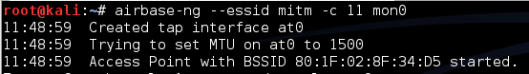
    
2.  要注意` airbase-ng`在运行的时候会创建接口`at0`。把它当做我们基于软件的接入点`mitm`的有线端的接口。

    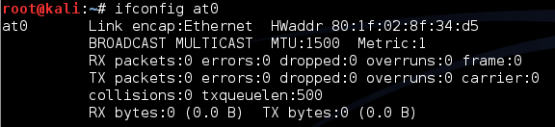
    
3.  让我们现在在黑客的笔记本上创建网桥，由有线（`eth0`）和无线（`at0`）接口组成。命令如下：

    ```
    brctl addbr mitm-bridge 
    brctl addif mitm-bridge eth0 
    brctl addif mitm-bridge at0 
    ifconfig eth0 0.0.0.0 up 
    ifconfig at0 0.0.0.0 up
    ```
    
    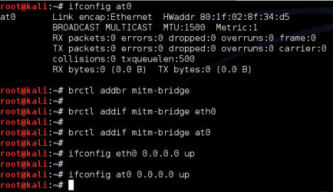

4.  我们可以为这个网桥指定一个 IP 地址，并检查网关的连接性。要注意我们也可以使用 DHCP 来实现。我们可以为网桥接口指定 IP 地址，使用下列命令：

    ```
    ifconfig mitm-bridge 192.168.0.199 up
    ```
    
    我们之后尝试 ping 网关` 192.168.0.1`，来确保我们连接到了网络的剩余部分。
    
5.  我们现在开启内核的 IP 转发，便于封包能够正确转发，使用下列命令：

    ```
    echo 1 > /proc/sys/net/ipv4/ip_forward
    ```
    
    命令输出如下：
    
    
    
6.  现在让我们将无线客户端连接到我们的接入点`mitm`上。它会通过 DHCP 自动获得 IP 地址（服务器运行在有线端的网关上）。这里，客户端主机的 IP 为`192.168.0.197`。我们可以 ping 有线端的网关`192.168.0.1`来验证连接性。

    
    
7.  我们可以看到，主机响应了 ping 请求，像这样：

    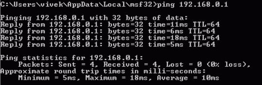
    
8.  我们也可以验证客户端的连接，通过观察黑客主机上的`airbase-ng `终端：

    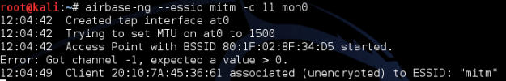
    
9.  这里提一句，非常有趣的是，由于所有流量都从无线接口转发到有线端，我们拥有流量的完整控制。我们可以通过启动 Wireshark 并嗅探`at0`接口来验证。

    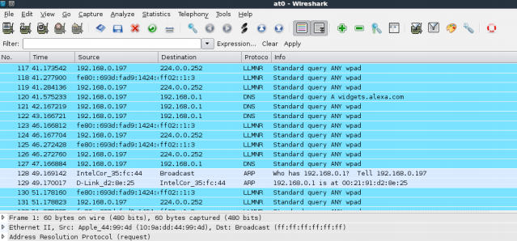
    
0.  让我们现在从客户端主机上 ping 网关`192.168.0.1 `。我们可以看到， Wireshark 中的封包（使用过滤器 ICMP），即使封包的目标并不是我们。这就是中间人攻击的力量。

    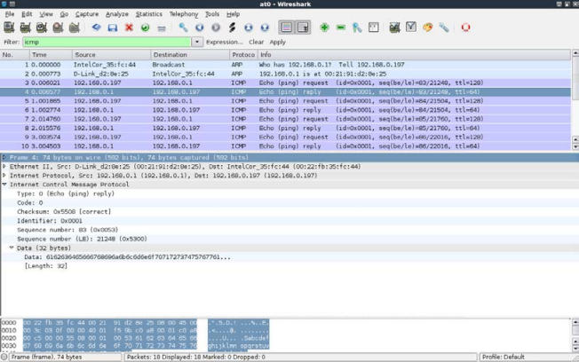
    
### 刚刚发生了什么？

我们成功执行了中间人攻击的准备工作。我们通过创建伪造接入点并将其桥接到我们的以太网接口上。这确保了任何连接到伪造接入点的无线客户端会感觉到，它通过有线 LAN 连接到互联网。

### 试一试 -- 纯无线网络上的中间人攻击

在上一个练习中，我们桥接了无线和有线接口。我们之前提到过，这只是 MITM 的连接结构之一，也有其它的组合。我们可以使用两个无线接口，一个用于创建伪造的接入点，另一个接口连接到授权接入点。这两个接口都桥接在一起。所以，当无线客户端连接到我们的伪造接入点的时候，它就通过攻击者的主机连接到了授权接入点上。

要注意，这个配置需要使用攻击者笔记本上的两个网卡。

看看是否能够使用笔记本的内建网卡和外部网卡来执行这个攻击 -- 记住，你可能没有这个练习所需的注入驱动器。这是个很大的挑战。

## 7.2 通过 MITM 进行无线窃听

在上一个练习中，我们了解了如何为 MITM 进行准备。现在，我们会看一看如何使用它来进行无线窃听。

整个实验围绕一个原则，所有受害者的流量现在都经过攻击者的主机。所以，攻击者可以窃听任何发送并来自受害者主机的无线流量。

### 实战时间 -- 无线窃听

遵循以下指南来开始：

1.  重复上一个实验的所有步骤。启动 Wireshark，有趣的是，即使 MITM 桥接已经建立，这个跟接口仍然允许我们窥视桥接的流量，如果我们想要的话：

    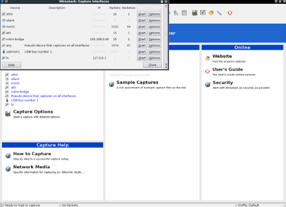
    
2.  启动`at0`接口上的嗅探，便于我们监控所有由无线网卡发送和接收的流量：

    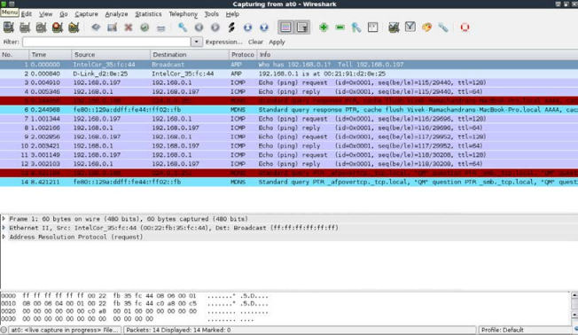
    
3.  在无线客户端，打开任何网页。我这里，无线接入点也连接到 LAN 上，我们使用地址`http://192.168.0.1`来打开它：

    
    
4.  使用你的密码登录，进入管理界面。

5，  在 Wireshark 中，我们应该看到了大量活动：

    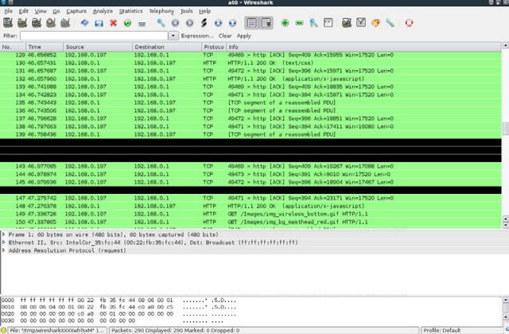
    
6.  设置过滤器 HTTP 来只查看 Web 流量：

    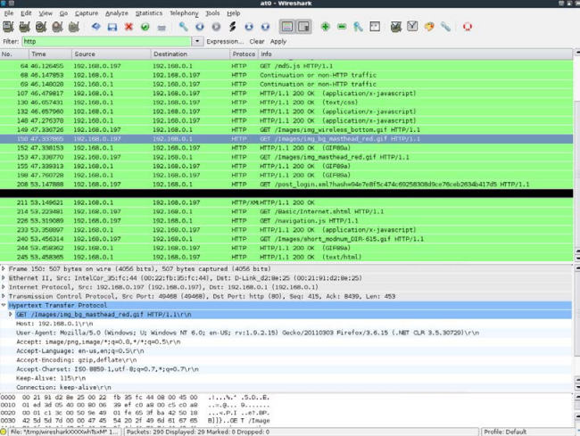
    
7.  我们可以轻易定位用于向接入点发送密码的 HTTP POST 请求。

    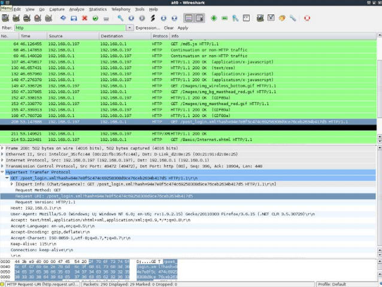

8.  下面是之前封包的详细视图。

    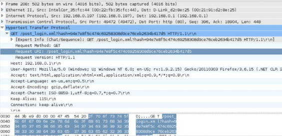
    
9.  展开 HTTP 协议头，我们会看到我们所输入的密码并没有以纯文本发送，反之它发送了哈希值。如果我们看一看封包，在上一个截图中标号为 64，我们可以看到，有一个`/md5.js`的请求，这使我们怀疑它是密码的 MD5 哈希值。有趣的是，在哈希的创建中，如果没有在每个会话层面加盐，这个技巧容易受到重放攻击。我们将其留做一个练习来发现细节，因为这并不是无线安全的一部分，从而超出了这本书的内容。

    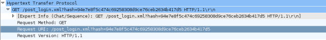
    
0.  这展示了在中间人攻击期间，监视器如何轻易窃听由客户端发送的流量。

### 刚刚发生了什么？

我们准备的 MITM 环境现在允许我们窃听受害者的无线流量，而无需让受害者知道。这是因为在 MITM 中，所有流量都经过攻击者的主机。所以，所有受害者的未加密流量都可被攻击者窃听。

### 试一试 -- 发现 Google 搜索者

在当今世界，我们都认为我们在 Google 上的搜索都是私密的。很不幸，Google 搜索上的流量都经过 HTTP，并且默认是纯文本。

你可以想出一个智能的过滤器，使你能够使用 Wireshark 来查看受害者所执行的所有 Google 搜索吗？

## 7.3 无线上的会话劫持

我们可以基于 MITM 执行的另一种有趣的攻击就是应用会话劫持。在 MITM 攻击期间，受害者的封包发往攻击者。攻击者负责将其转发到正常的目的地，并将目的地发回的响应转发给主机。有趣的是，在这个过程中，攻击者可以修改封包的数据（如果没有保护或加密）。这意味着它可以修改、拆解甚至静默丢掉封包。

在下一个例子中，我们会使用准备好的 MITM 环境看一看无线上的 DNS 劫持。之后利用 DNS 劫持，我们将浏览器的会话劫持为` https://www.google.com`。

### 实战时间 -- 无线上的会话劫持

1.  建立中间人攻击环境。在受害者主机上，让我们启动浏览器并输入` https://www.google.com`。让我们使用 Wireshark 来监控流量，你的界面应该像这样：

    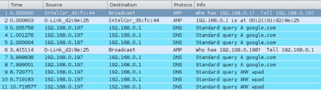
    
2.  使用 DNS 过滤器，我们可以看到，受害者发出了` https://www.google.com`的 DNS 请求：

    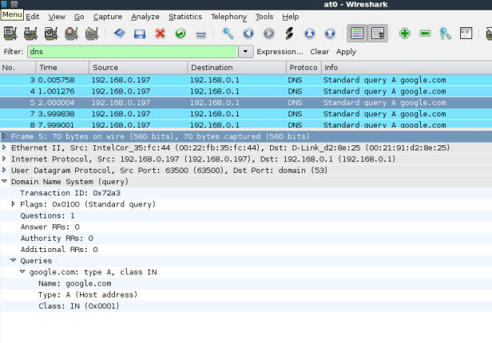
    
3.  为了劫持浏览器会话，我们需要发送伪造的 DNS 响应，它会将`https://www.google.com `的 IP 地址解析为黑客主机的 IP `192.168.0.199`。我们用户这个目的的工具叫做`dnsspoof`。它的语法是：

    ```
    dnspoof –i mitm-bridge
    ```
    
    命令的输出如下：
    
    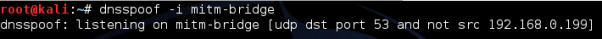
    
4.  刷新浏览器创建，现在我们可以在 Wireshark 中看到，只要受害者发送了任何主机（包括 Google）的 DNS 请求，Dnsspoof 都会回应。

    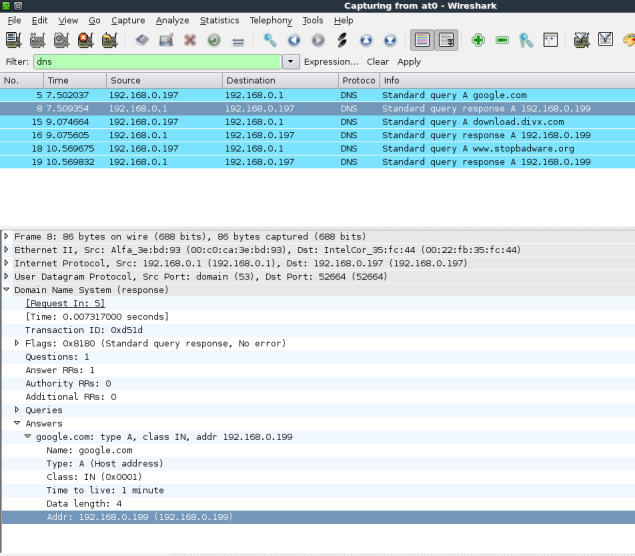
    
5.  在受害者主机上，我们会看到不能连接的错误。这是因为我们将`google.com`的 IP 地址解析为`192.168.0.199`，这是黑客主机的 IP，但是没有监听 80 端口的服务：

    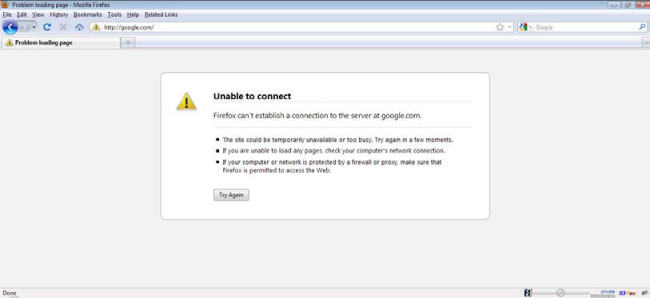
    
6.  让我们在 Kali 上运行 Apache，使用下列命令：

    ```
    apachet2ctl start
    ```
    
    命令的输出如下：
    
    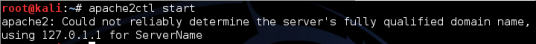
    
7.  现在，一旦我们刷新了受害者主机上的浏览器，我们都会收到`It works!`，它是Apache 的默认页面。

    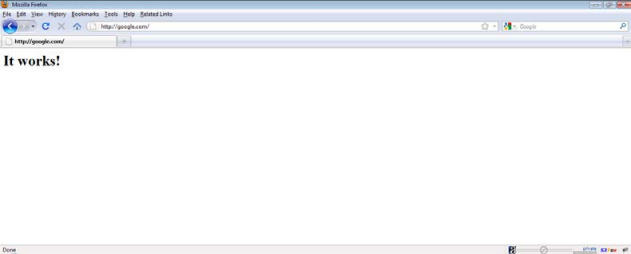
    
8.  这个示例表明，可以拦截数据并发送伪造的响应，来劫持受害者的会话。

### 刚刚发生了什么？

我们使用无线 MITM 作为基础执行了应用劫持攻击。所以这背后到底发生了什么？MITM 准备工作确保了我们能够看到受害者发送的所有封包。只要我们看到了来自受害者的 DNS 请求封包，运行在攻击者笔记本上的 Dnsspoof 就会发送 DNS 响应给受害者，将`google.com`解析为攻击者的主机 IP 。受害者笔记本接受这个响应并且浏览器会向攻击者的 IP 地址的 80 端口发送 HTTP 请求。

在实验的第一个部分，攻击者机器上没有任何进程监听 80 端口，于是 Firefox 返回错误。之后，一旦我们在攻击者主机上的 80 端口（默认端口）开启了 Apache 服务器，浏览器的请求就会收到来自攻击者主机的响应，带有默认的`It works!`页面。

这个实验表明，一旦我们完全控制了较低的层级（这里是第二层），我们就能轻易劫持运行在较高层级上的应用，例如 DNS 客户端和 Web 浏览器。

### 试一试 -- 应用劫持挑战

会话劫持的下一步就是修改客户端发送的数据。Kali 上可用的软件叫做 Ettercap。这会帮助你用于网络的创建搜索和替换的过滤器。

这个挑战中，编写一个简单的过滤器，将网络上所有安全的东西变成不安全的。尝试在 Google 上搜索安全，并看看结果是否显示为不安全。

## 7.4 发现客户端的安全配置

之前的章节中，我们看到了如何创建开放、WEP 和 WPA 接入点蜜罐，但是当我们看到来自客户端的探测请求时，我们怎么知道探测的 SSID 属于哪个网络呢？

这看起来有些棘手，但解决方案很简单。我们需要创建广播相同 SSID 的接入点，但是拥有不同的安全配置。当漫游客户端搜索网络时，它会基于储存的网络配置自动连接到这些接入点之一。

所以，让我们开始吧！

### 实战时间 -- 客户端的解除验证攻击

1.  我们假设无线客户端拥有` Wireless Lab`网络配置，在它没有连接到任何接入点时，它发送了这个网络的探测请求。为了发现该网络的安全配置，我们需要创建多个接入点。出于我们的讨论，我们假设客户端的配置时开放网络、WEP、WPA-SPK 或者 WPA2-SPK。所以我们需要创建四个接入点。为了完成它，我们首先创建四个虚拟接口 -- `mon0`到`mon3`，多次使用`airmon-ng start wlan0 `命令：

    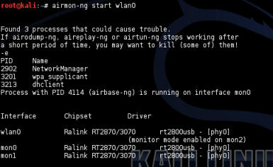
    
2.  你可以使用`ifconfig -a`命令看到所有新创建的接口：

    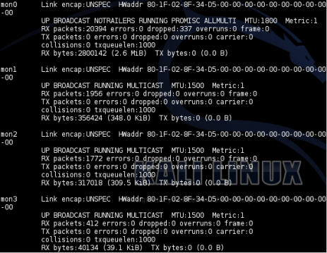
    
3.  现在我们在 `mon0`上创建开放 AP：

    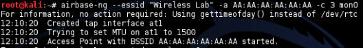
    
4.  我们在`mon1`上创建 WEP 保护的 AP：

    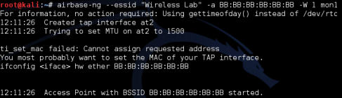
    
5.  WPA-PSK 的 AP 在`mon2`上：

    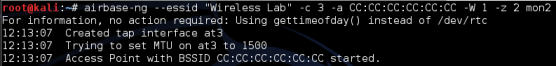
    
6.  WPA2-PSK 的 AP 在`3`上：

    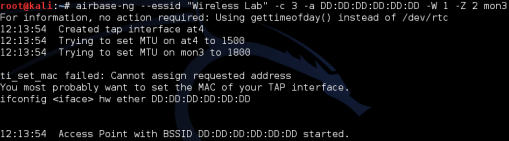
    
7.  我们可以在相同频道上执行` airodump-ng `来确保所有四个接入点都启动并且运行，像这样：

    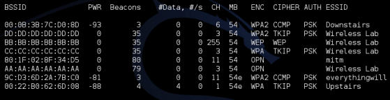
    
8.  现在让我们打开漫游客户端上的 WIFI。取决于之前连接到哪个` Wireless Lab `，它会连接到该安全配置。这里，它连接到了 WPA-PSK 网络，像这样：

    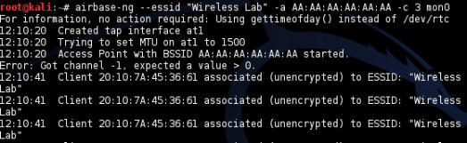
    
### 刚刚发生了什么？

我们创建了拥有相同 SSID 但是不同安全配置的多个蜜罐。取决于客户端为`Wireless Lab`网络储存哪个配置，它会连接到相应的那个。

这个技巧十分实用，因为如果你在执行渗透测试，你不知道客户端的笔记本上是哪个安全配置。这会允许你通过引诱客户端来找到合适的那个。这个技巧也叫作 WIFI 钓鱼。

### 试一试 -- 引诱客户端

在客户端上创建相同 SSID 的不同配置，并检查你的蜜罐是否能检测它们。

要注意，许多 WIFI 客户端可能不探测储存在配置中的网络。这时就不能使用我们讨论的技巧来检测它们。

## 小测验 -- 高级 WLAN 攻击

Q1 在 MITM 攻击中，谁是中间人？

1.  接入点。
2.  攻击者。
3.  受害者。
4.  都不是。

Q2 Dnsspoof 能够：

1.  伪造 DNS 请求。
2.  伪造 DNS 响应。
3.  需要在 DNS 服务器上运行。
4.  需要在接入点上运行。

Q3 无线 MITM 攻击可以在 \_\_ 上完成：

1.  同时在所有无线客户端上。
2.  一次在一个频道上。
3.  在任何 SSID 上。
4.  3 和 4。

Q4 在我们的 MITN 准备工作中，那个接口离受害者最近？

1.  At0
2.  Eth0
3.  Br0
4.  En0

## 总结

这一章中，我们了解了如何使用无线作为基础来实现高级攻击。我们为无线上的 MITM 攻击做了一些准备，之后用它来窃听受害者的流量。之后我们使用相同的准备工作，通过 DNS 毒化攻击来劫持受害者的应用层（Web 流量）。

在下一章中，我们会了解如何按照正确的规划、探索和报告阶段来实施无线攻击。我们也会涉及到保护 WLAN 的最佳实践。
