# 第八章 攻击企业级 WPA 和 RADIUS

> 作者：Vivek Ramachandran, Cameron Buchanan

> 译者：[飞龙](https://github.com/)

> 协议：[CC BY-NC-SA 4.0](http://creativecommons.org/licenses/by-nc-sa/4.0/)

## 简介

> 个头越大，摔得越惨。

> -- 谚语

企业级 WPA 总是自带不可攻破的光环。多数网络管理员认为它对于无线安全问题是个银弹。在这一章中，我们会看到这个真理不再正确了。

这一章中，我们会了解如何使用多种 Kali 包含的工具和技巧，来攻击企业级 WPA。

## 8.1 配置 FreeRADIUS-WPE

我们需要 RADIUS 服务器来实施企业级 WPA 攻击。最广泛使用的开源 RADIUS 服务器时 FreeRADIUS。但是，它难于配置，并且为每次攻击而配置它十分无聊。

Joshua Wright 是一个知名的安全研究员，他写了一个 FreeRADIUS 的补丁使其易于配置和执行攻击。这个补丁以 FreeRADIUS-WPE 发布。Kali 没有自带 FreeRADIUS-WPE ，所以我们需要执行下列步骤来配置。

1.  访问` https://github.com/brad-anton/freeradius-wpe `并且你会找到下载连接：` https://github.com/brad-anton/ freeradius-wpe/raw/master/freeradius-server-wpe_2.1.12-1_i386. deb`。

    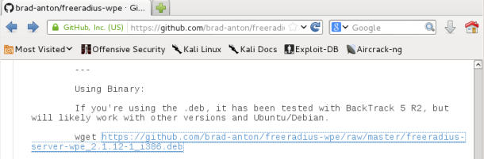
    
2.  下载完成之后，在`ldconfig`之后使用` dpkg –i freeradius-server-wpe_2.1.12-1_ i386.deb `来安装：

    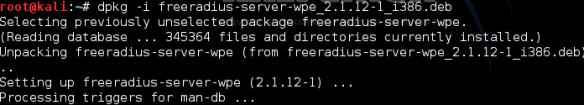
    
    我们现在需要快速在 Kali 上配置 Radius 服务器。
    
### 实战时间 -- 使用 FreeRADIUS-WPE  建立 AP

1.  将接入点的 LAN 端口之一连接到你的 Kali 主机的以太网端口。我们这里的接口是`eth0`。启动这个接口并通过运行 DHCP 获得 IP 地址，像这样：

    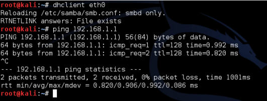
    
2.  登录接入点，将安全模式设为 WPA/WPA2-Enterprise，将`Version`设为 WPA2，将`Encryption `设为 AES。之后，在` EAP (802.1x) `部分下面，输入 Radius 服务器 IP 地址，就是你的 Kali 的 IP 地址。 `Radius Password `是`test`，像这样：

    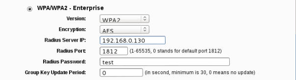
    
3.  让我们现在打开新的终端，访问目录`/usr/local/etc/raddb`。这是所有 FreeRADIUS-WPE  配置文件存放的地方。

    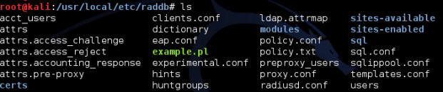
    
4.  让我们打开`eap.conf`。你会发现`default_eap_type`设为了 MD5，让我们将它改为`peap`。

    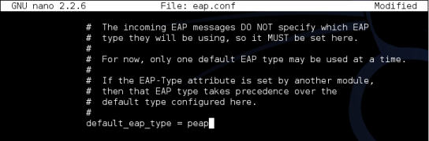
    
5.  让我们打开`clients.conf`。这就是我们定义客户端白名单的地方，它们能够连接到我们的 Radius 服务器。有趣的是，如果你浏览到下面，忽略设置示例，范围`192.168.0.0/16 `的`secret`默认设为`test`，这就是我们步骤 2 中所使用的。

    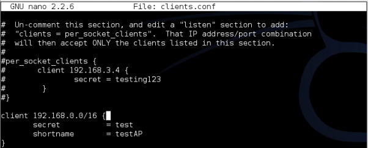
    
6.  我们现在使用`radiusd –s –X `命令启动 RADIUS 服务器。

    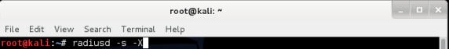
    
7.  一旦启动完毕，你会在屏幕上看到一堆调试信息，但是最后服务器会安顿下来并监听端口。太棒了！我们现在可以开始这一章的实验了。

    
    
### 刚刚发生了什么？

我们成功配置了 FreeRADIUS-WPE。我们会在这一章的实验的剩余部分使用它。

### 试一试 -- 玩转 RADIUS

FreeRADIUS-WPE  拥有大量选项。使你自己熟悉它们是个好的主意。花费时间来查看不同的配置文件，以及它们如何协同工作非常重要。

## 8.2 攻击 PEAP

受保护的可扩展的身份验证协议（PEAP）是 EAP 的最广泛使用的版本。这是 Windows 原生自带的 EAP 机制。

PEAP 拥有两个版本：

+   使用 EAP-MSCHAPv2  的 PEAPv0（最流行的版本，因为 Windows 原生支持）。
+   使用 EAP-GTC 的 PEAPv1。

PEAP 使用服务端的证书来验证 RADIUS 服务器。几乎所有 PEAP 的攻击都会利用证书验证的不当配置。

下一个实验中，我们会看一看如何在客户端关闭证书验证的时候破解 PEAP。

### 实战时间 -- 破解 PEAP

遵循以下指南来开始：

1.  再次检查` eap.conf `文件来确保开启了 PEAP：

    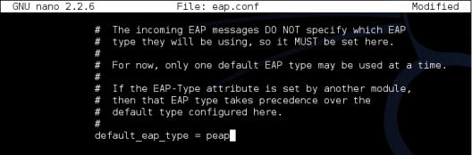
    
2.  之后重启 RADIUS 服务器，使用`radiusd –s –X`：

    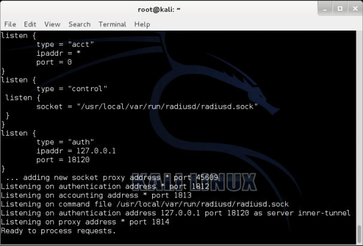
    
3.  监控由 FreeRADIUS-WPE 创建的日志文件：

    
    
4.  Windows 原生支持 PEAP。让我们确保关闭了证书验证：

    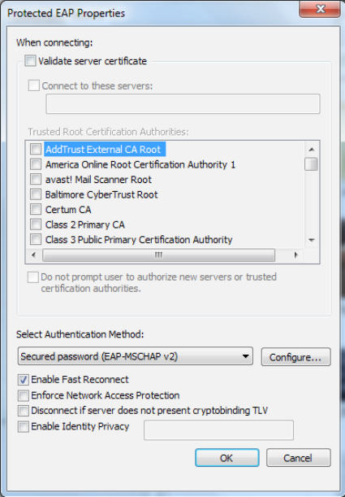
    
5.  我们需要点击`Configure `标签页，它在`Secured password`的旁边，并告诉 Windows 不要自动使用我们的 Windows 登录名称和密码：

    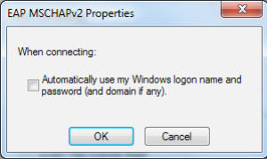
    
6.  我们也需要在`Advanced  Settings`对话框中选择`User authentication`。

    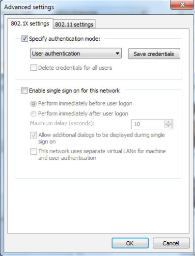
    
7.  一旦客户端连接到了接入点，客户端会提示输入用户名和密码。我们使用`Monster`作为用户名，`abcdefghi `作为密码：

    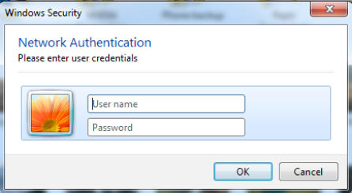
    
8.  一旦我们完成了，我们就能在日志文件中看到 MSCHAP-v2 challenge 响应。

    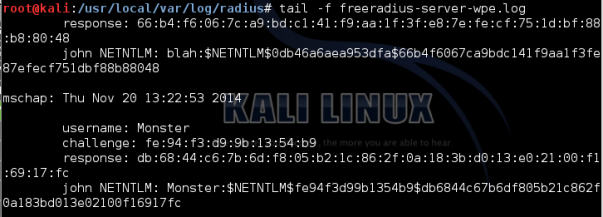
    
9.  我们现在使用`asleap`来破解它，使用包含`abcdefghi`的密码列表文件，我们能够破解它。（出于演示目的，我们只创建了单行的文件，叫做`list`，其中包含列表。）

    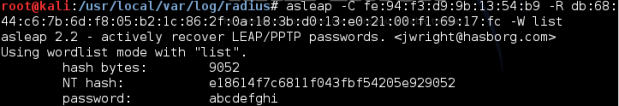
    
### 刚刚发生了什么？

我们使用 FreeRADIUS-WPE 建立了蜜罐。企业客户端配置不当，没有使用 PEAP 证书验证。这允许我们将我们的伪造证书展示给客户端，它被乐意接受了。一旦它发生了，内部验证协议 MSCHAP-v2 开始生效。由于客户端使用我们的伪造证书来解密数据，我们能够轻易读取用户名、challenge 和响应元组。

MSCHAP-v2 易于受到字典攻击。我们使用`asleap`来破解 challenge  和响应偶对，因为它看起来基于字典中的单词。

### 试一试 -- 攻击 PEAP 的变体

PEAP 可以以多种方式不当配置。即使打开了证书验证，如果管理员没有在连接到服务器列表中提到验证服务器，攻击者可以从任何列出的签证机构获得其他域的真实证书。这仍旧会被客户端接受。这个攻击的其他变体也是可能的。

我们推荐你探索这一章的不同可能性。

## EAP-TTLS

我们推荐你尝试攻击 EAP-TTLS，它类似于这一章我们对 PEAP 所做的事情。

## 企业安全最佳实践

我们意见看到了大量的对 WPA/WPA2 的攻击，有个人也有企业。基于我们的经验，我们推荐下列事情：

+   对于 SOHO 和中型公司，使用强密码的 WPA2，你总共能输入 63 个字符，好好利用它们。

+   对于大型企业，使用带有 EAP-TLS 的企业级 WPA2。这会同时在客户端和服务器使用证书来验证，目前没办法攻破。

+   如果你需要带有 PEAP 或者 EAP-TTLS 的 WPA2，确保你的证书验证打开，选择了正确的签发机构，RADIUS 服务器开启了授权，最后，关闭任何允许用户接受新的 RADIUS 服务器、证书或者签发机构的配置。

## 小测验 -- 攻击企业级 WPA 和 RADIUS

Q1 FreeRADIUS-WPE 是什么？

1.  从头开始编写的 RADIUS 服务器。
2.  FreeRADIUS 服务器的补丁。
3.  所有 Linux 默认自带的版本。
4.  以上都不是。

Q2 下列哪个可以用于攻击 PEAP？

1.  伪造验证信息
2.  伪造证书
3.  使用 WPA-PSK
4.  以上全部

Q3 EAP-TLS 使用了什么？

1.  客户端证书
2.  服务端证书
3.  1 或者 2
4.  1 和 2

Q4 EAP-TTLS 使用了什么？

1.  只有客户端证书
2.  服务端证书
3.  基于密码的验证
4.  LEAP

## 总结

这一章中，我们看到了如何攻破运行 PEAP 或者 EAP-TTLS 的企业级 WPA。它们是两个用于企业的最常见的验证机制。

下一章中，我们会看一看如何把我们学到的所有东西用于真实的渗透测试。
