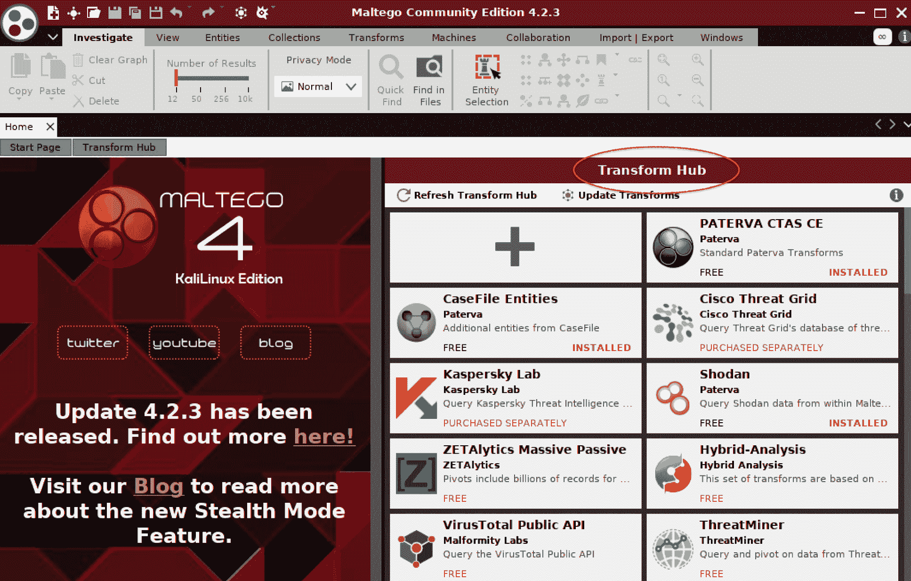
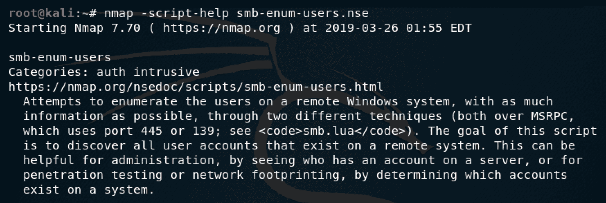
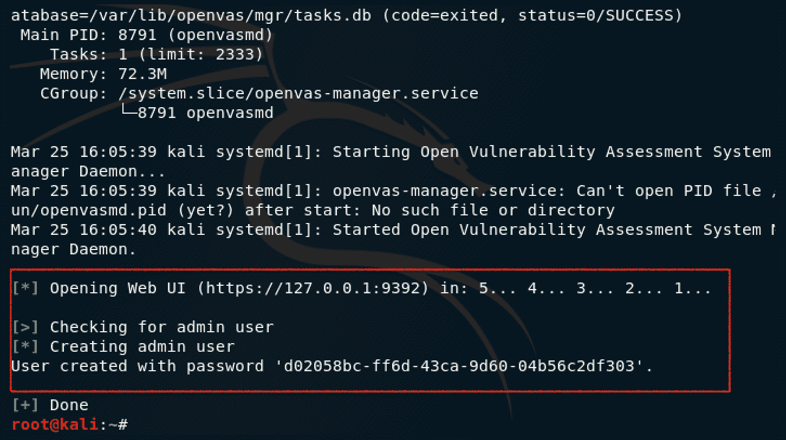
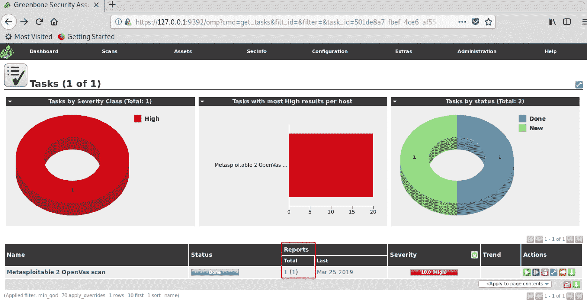
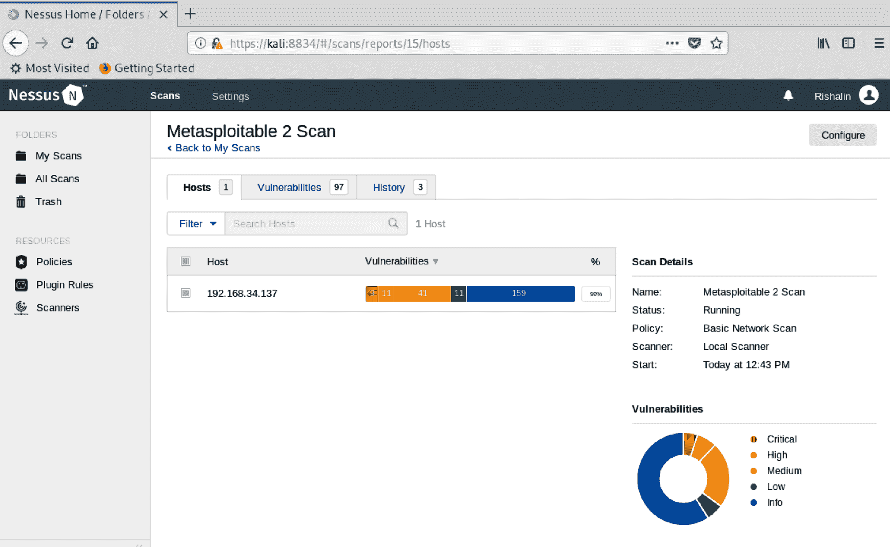
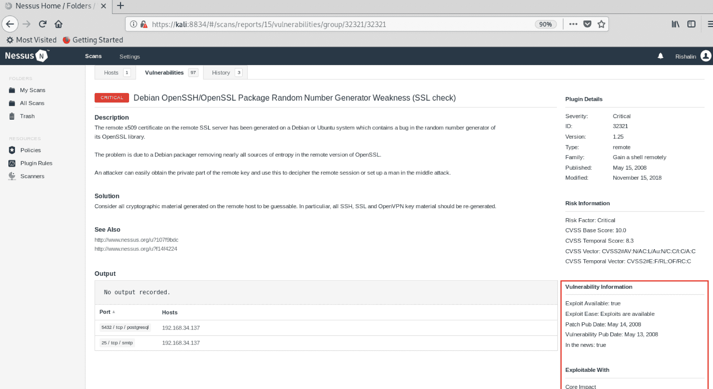
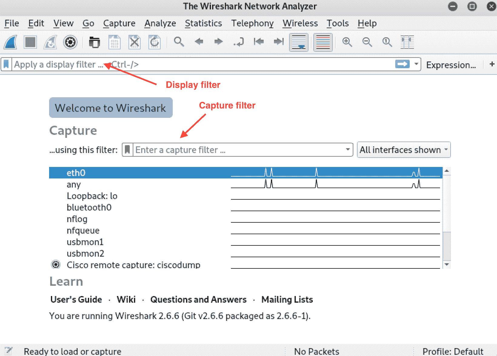
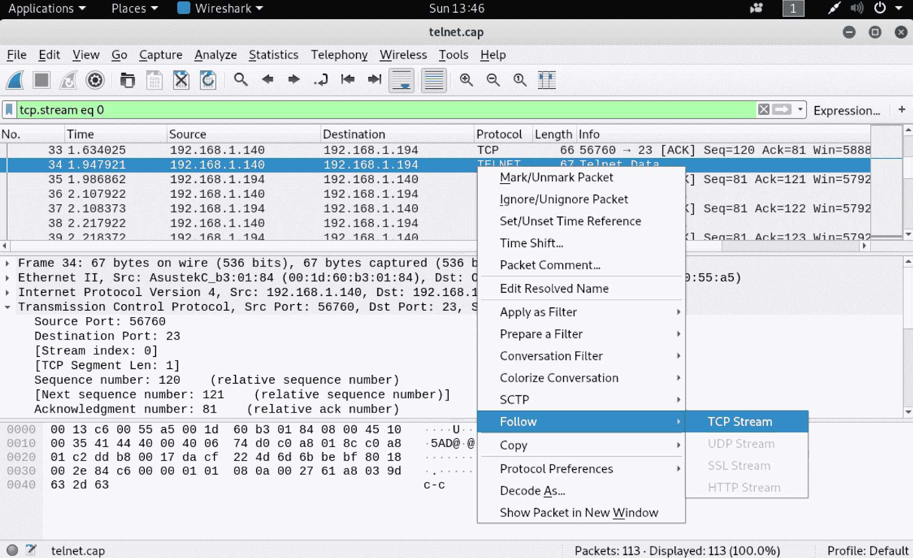
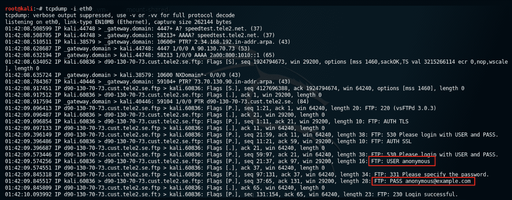

# 三、信息收集

收集目标信息的技能是任何渗透测试人员都应该具备的基本技能。

被动信息收集和主动信息收集有很大区别。被动信息收集利用公开可用的信息。主动信息收集涉及与目标系统的直接交互。当涉及到特定国家的法律时，主动信息收集会越界，因为一些国家认为未经许可执行任何类型的渗透测试都是非法的，这就是您的“免入狱卡”（如[第 1 章](01.html)、*渗透测试简介*中所述）的意义所在。在执行任何活动信息收集之前，拥有正确的授权非常重要。

你收集的有关目标的信息将用于计划你的攻击。在这个阶段，您将寻找任何可以公开目标信息的东西。例如，其面向公众的服务器是否公开已知的易受攻击端口？互联网上是否有任何包含敏感信息的文档或信息（如社交媒体帖子）？在构建信息存储库时，您可以开始威胁建模并搜索可用于攻击计划的漏洞。

随着本章的学习，您将了解以下主题：

*   被动信息收集
*   积极收集信息
*   漏洞扫描
*   已知易受攻击的服务
*   捕获流量

# 技术要求

以下技术要求适用于本章：

*   Kali Linux 2019.1
*   Metasploi 表 2 和表 3

# 被动信息收集

被动信息收集通常被称为**开源智能**（**OSIT**）。在执行被动信息收集时，主要目的是在不通知目标的情况下尽可能多地收集有关目标的信息。在被动信息收集阶段，您将使用许多工具和第三方数据库利用公开发布的信息。你会惊讶于你能从公开的资源中获得多少信息。

常见的被动信息收集技术如下：

*   调查 DNS 记录以查找邮件服务器详细信息、子域等
*   在搜索引擎上使用精心编制的搜索来发现任何信息，如文件
*   发现与 internet 连接的设备
*   使用工具获取信息，如电子邮件地址

OSIT 框架旨在从免费提供的资源中收集信息。我鼓励您查看的一个好的在线资源如下：[https://osintframework.com](https://osintframework.com) 。

让我们用互联网上信息丰富的东西来收集信息。

# 使用互联网

收集信息时，你的主要工具之一就是互联网。互联网上到处都是信息。社交媒体、博客、消息服务等都是人们日常使用的常用媒体。员工可能会发布对他们来说毫无意义的组织信息，但对攻击者来说，这可能是一座金矿。

# 谷歌傻瓜

Google dork（也称为 Google hacking）实际上是一个精心编制的搜索字符串，返回目标网站上不易获得的信息。它通过利用高级搜索运营商来实现这一点。

使用 GoogleDorks 是对目标进行信息收集的一种极好的方法。您可以返回诸如用户名和密码、敏感信息、登录门户等数据。

谷歌内部的搜索运营商可以用来查询特定信息。此类搜索运营商的示例如下：

*   **站点**：**提供特定于您定义的网站的 URL 输出。**
***   **inurl**：通过此查询，您可以定义某个字符串，结果将返回包含该字符串的网站。*   **文件类型**：在这里，您可以定义要查找的特定文件类型。例如，可以指定 PDF、XLS、DOC 或任何其他所需的文件扩展名。**

 **搜索操作符可以一起用来执行狡猾的搜索。例如，在`microsoft.com`上查找扩展名为`.doc`的文件时。在这里，您可以使用`Google.com`中的搜索查询`filetype:doc site:microsoft.com`来完成此操作。

Exploit DB 包含谷歌黑客数据库，如下图所示（*图 1*。在这里，你会发现大量不断更新的 Google dorks：

谷歌黑客数据库在漏洞数据库上的确切位置如下：[https://www.exploit-db.com/google-hacking-database](https://www.exploit-db.com/google-hacking-database) 。


图 1:exploit-db.com 上列出的谷歌黑客数据库

你会注意到，有多个类别，你可以找到各种谷歌傻瓜。让我们使用其中一个 dorks 执行信息收集：

```
intext:password "Login Info" filetype:txt
```

谷歌的结果显示有多少网站的密码以明文形式公开，如*图 2*所示：


图 2：使用 Google Dork 公开的密码

在收集目标信息时，您可以利用谷歌内部精心编制的搜索查询来发现可用的信息

# 肖丹

Shodan 不是一般的搜索引擎。它通常被称为黑客的搜索引擎。在其网站上，Shodan 被称为*世界上第一个互联设备搜索引擎*。可通过[访问 Shodanhttps://www.shodan.io](https://www.shodan.io) 如*图 3*所示：


图 3:https://www.shodan.io

肖丹有什么独特之处？谷歌和必应等搜索引擎索引网站，但 Shodan 索引所有内容，如网络摄像头、数据库服务器、医疗设备、路由器等。任何连接到互联网的东西都由 Shodan 编制索引。

正如 Shodan 创始人 John Matherly 在其著作*Shodan 完整指南*中所定义的，Shodan 的算法非常简单。

1.创建一个随机 IPv4 地址
2。查看 Shodan 了解的端口列表，并选择一个随机端口
3。使用步骤 1 生成的 IPv4 地址和步骤 2 生成的端口，执行连接并抓取横幅
4。重复步骤 1

这种算法不仅仅是对网站进行抓取，而是查找所有内容并为其编制索引。让我们来看看可以用 Shodan 运行的一些查询。

# Shodan 脚本

正如我们在[第 2 章](02.html)*开始使用 Kali Linux*中了解到的，在 Kali Linux 中，您可以使用脚本。让我们看一个可以与 Shodan 一起工作的脚本。

你应该做的第一件事是在 Shodan 注册一个帐户。这可以通过直接导航到[来完成 https://account.shodan.io/register](https://account.shodan.io/register) 。创建帐户后，导航到我的帐户并获取您的**API 密钥。**保留 API 密钥，因为您将在脚本中使用它。

在 Kali Linux 机器上，您需要执行一些任务，然后才能开始编写脚本：

1.  确保您正在运行最新的更新和升级，并已安装`python 2.7`。运行以下命令将确保您满足此要求：

```
sudo apt-get update && sudo apt-get install python2.7
```

2.  我们将利用`pip`命令来安装所需的`shodan`文件。这是使用以下命令完成的：

```
sudo pip install shodan
```

一旦安装了所有需求，就可以创建一个脚本来执行您想要执行的任何搜索。请注意，对于利用 Shodan 的所有查询，您将需要利用您的**API****键**。您可以用实际的**API 密钥**替换文本`"insert your API key here"`。我们将创建一个脚本，允许我们对目标执行信息收集。通过使用下面的示例脚本，我们可以利用 Shodan 通过`api.search`查询获得结果。

3.  我们将使用`nano shodan-iis.py`命令和以下代码创建一个新的 Python 脚本：

```
import shodan
SHODAN_API_KEY = "insert your API key here"
api = shodan.Shodan(SHODAN_API_KEY)
# Wrap the request in a try/ except block to catch errors
try:
        # Search Shodan
        results = api.search('IIS')

        # Show the results
        print('Results found: {}'.format(results['total']))
        for result in results['matches']:
                print('IP: {}'.format(result['ip_str']))
                print(result['data'])
                print('')
except shodan.APIError, e:
        print('Error: {}'.format(e))
```

要在 nano 中保存文件，您可以使用*Ctrl*+*O*并使用*Ctrl*+*X 退出。文件保存后，我们可以使用`python shodan-iis.py`命令运行它。*

请注意，我的搜索并非针对任何国家/地区，我只是在搜索 IIS 服务器：

如果您购买了 Shodan 订阅，那么您可以在 API 查询中使用更多的搜索运算符。免费版本将您限制为基本搜索，并且只有 2 页的结果。


图 4:shodan iis 脚本的输出

在前面的输出（*图 4*中），我们得到了一些结果。现在，我们可以过滤结果，这样我们就只有 IP 地址了。使用这些 IP 地址，我们可以利用一个简单的 Nmap 脚本来执行 IP 地址扫描。

4.  修改脚本，以便仅显示 IP 地址。为此，我们需要从线路`print('IP: {}'.format(result['ip_str']))`**中移除`IP`**并移除线路`print(result['data'])`和`print('')`。新代码应如下所示：****

 ****```
import shodan
SHODAN_API_KEY = "insert your API key here"
api = shodan.Shodan(SHODAN_API_KEY)
# Wrap the request in a try/ except block to catch errors
try:
        # Search Shodan
        results = api.search('IIS')

        # Show the results
        print('Results found: {}'.format(results['total']))
        for result in results['matches']:
                print(' {}'.format(result['ip_str']))
except shodan.APIError, e:
        print('Error: {}'.format(e))
```

请注意，我们现在只有 IP 地址*。*使用此选项，我们可以使用`python shodan-iis.py >> shodan-iis.txt`命令将输出传输到文本文件，如*图 5*所示：


图 5:shodan iis 脚本的输出仅过滤 IP 地址。

现在我们已经有了 IP 地址，我们可以构建一个简单的 bash 脚本来对它们运行 Nmap 扫描。

5.  通过输入`nano shodan-nmap-iis.sh`命令创建一个简单的 bash 脚本。在 nano 内部，输入以下代码：

```
#!/bin/bash 
cat shodan-iis.txt | while read line
do
nmap -sS -sV $line
done
```

像对待 Python 脚本那样保存脚本，并更改权限，使其能够使用`chmod +x shodan-nmap-iis.sh`**命令运行。然后，使用`./shodan-nmap-iis.sh`命令运行脚本。**

 **在前面的代码中，我们从 crunchbang（`#!`）开始，并定义了将在其中运行脚本的 shell。然后，我们定义了源文件。当脚本读取每一行时，它会执行 Nmap TCP syn 扫描（`-sS`，并在端口上执行服务和版本检测（`-sV`。结果如*图 6*所示：


图 6:bash 脚本的结果

Shodan 确实是黑客的搜索引擎。在任何类型的互联网连接设备上都可以获得丰富的信息。

# 使用 Kali Linux

Kali Linux 有许多内置工具，可以用于被动和主动信息收集。这里，我们将了解一些可用于被动信息收集的工具。

# 马尔蒂戈

Maltego 是一个使用 OSIT 的伟大工具。Maltego 能够可视化目标上的信息是如何连接的。Maltego 有免费和付费两种版本。在本书中，我们将利用免费版本。Maltego 也预装在 Kali Linux 中，因此无需安装它。您会注意到，尽管我们将使用免费版本，但它能够获得有关您的目标的丰富信息。

Maltego 使用公开的信息来可视化连接和信息。在对公共目标进行分析时，不应有任何法律影响，但请确保您检查了当地特定国家的法律。

让我们开始运行 Maltego。要启动 Maltego，请从 Kali 终端输入`maltego`。在 Maltego 首次发布时，您需要选择要使用的版本。免费版名为**Maltego CE。**一旦您注册帐户并登录，您将看到 Maltego 的开始屏幕。

Maltego 使用**转换**，通过插入 Shodan、VirusTotal 和 Threatminer 等各种网站，您可以获得更丰富的结果。您会注意到 Transform Hub 有大量的附加功能，您可以插入这些功能来增强结果，如图 7 所示：



图 7:Maltego 中的转换列表

在 Maltego 内部，我们可以选择运行一台**机器**。将机器视为一个脚本或宏，它运行一组预定义的**转换**，并配置了各种过滤器。使用机器可以让你快速开始信息收集。要运行机器，您需要单击运行机器并选择所需的机器*。*在我们的示例中，我们将运行 Footprint L3 机器，该机器在定义的域上执行密集封装，如*图 8*所示：


图 8：在 Maltego 内运行机器

扫描完成后，您将看到大量信息。在本例中，我对我的一个个人域名进行了信息收集扫描。Maltego 能够获取托管公司共享 DNS、我的域名网站、共享公共 IP、MX 记录上托管的其他域名，等等，如*图 9*所示：


图 9：Maltego 收集的信息

你会注意到这个图表非常大。为了便于说明，我放大了与我的域相关的数据。您可以在自己的个人领域执行此测试，并观察 Maltego 呈现的结果。

Maltego 对于信息收集非常有用。当您使用额外的变换时，它将允许您获得有关目标的大量信息。

# 积极收集信息

主动信息收集是指我们开始与系统交互，以便收集更多信息。在主动信息收集过程中，可能会触发警报以提醒目标，因此根据计划的攻击类型，您需要谨慎行事

一些渗透测试有意触发警报，以测试警报、日志的有效性，甚至测试已到位对策的响应时间

# Nmap

**网络映射器**（**Nmap**是一个允许您执行网络发现和安全审计的工具。它仅在命令行中可用，并且有一个名为**Zenmap 的图形版本。**Nmap 能够跨多个平台工作，如 macOS、Windows 和 Linux。Nmap 非常健壮，它提供了额外的功能，不仅允许您检测开放端口，还允许您检测目标上运行的操作系统和服务。默认情况下，Kali Linux 中包含 Nmap。Nmap 可用于执行以下操作：

*   **网络发现**：这允许您检测目标网络上的任何活动主机
*   **端口发现**：允许检测打开的端口
*   **服务发现**：提供检测绑定到特定端口的软件版本的能力
*   **操作系统发现**：提供正在运行的操作系统和版本信息
*   **漏洞扫描**：提供使用脚本检测漏洞的能力

Nmap 有许多可以使用的扫描选项。一些常见扫描如下所示：

*   `-sS`：这是一个 TCP SYN 扫描。此扫描是最常用的扫描类型之一，因为它通过不完成 TCP 连接提供隐蔽性
*   `-sT`：这是一个 TCP 连接扫描。此扫描执行到目标端口的完整连接，这可能导致目标进行检测。
*   `-sU`：通过 UDP 协议执行扫描。使用此扫描，您可以发现与 DHCP、DNS、SNMP 等相关的端口。
*   `-p`：定义特定的端口或端口范围。范围由破折号`-`分隔。如果未指定端口或范围，扫描将扫描所有 65535 个端口。
*   `-sC`：使用默认脚本集执行扫描。
*   `-sV`：通过引用已知服务的 Nmap 服务数据库端口进行版本检测。一旦进行了引用，Nmap 就能够显示在端口上运行的服务。虽然这种链接非常准确，但您可能会发现管理员将不同的应用链接到公共端口的情况。
*   `-O`：通过发送大量精心编制的数据包（如 TCP 采样、窗口检查大小和 IP 选项）并将其与`nmap-os-db`进行比较，执行操作系统检测。一旦匹配，Nmap 将显示目标的操作系统。
*   `--script`：它使用逗号分隔的列表为不同的类别、名称和目录定义脚本。例如，`--script "http-*"`将加载每个处理 http 的脚本。`--script "default,safe"`将加载属于**默认**和**安全**类别的脚本。

SAN 目前有一个很好的 Nmap 备忘单，可供参考。这是在这里：[https://blogs.sans.org/pen-testing/files/2013/10/NmapCheatSheetv1.1.pdf](https://blogs.sans.org/pen-testing/files/2013/10/NmapCheatSheetv1.1.pdf) 。

Nmap 最初用于端口扫描，但该工具已经超越了这一点，现在也能够执行漏洞扫描。利用**Nmap 脚本引擎**（**NSE**）可以编写自己的脚本，并使用免费提供的脚本。在 Kali Linux 中，可以在`/usr/share/nmap/scripts`位置找到许多脚本。脚本有各种类别，如信息收集、漏洞扫描、暴力等。要查看 Kali Linux 中当前可用的脚本的完整列表，可以从 Kali Linux 中的终端窗口运行`ls /usr/share/nmap/scripts`命令。或者，您可以使用`locate`命令，这是您在上一章中了解的：`locate *.nse`。

如果不确定脚本的作用，可以使用`nmap -script-help [script name]`命令，如*图 10*所示：



图 10:Nmap 脚本帮助

让我们对 Metasploitable 2 虚拟机执行一些扫描。确保您的 Kali Linux 和 Metasploitable 2 虚拟机都位于同一虚拟网络上：

1.  我们将在 Kali Linux 的终端窗口中使用`netdiscover`命令执行一些网络发现。一段时间后，将显示 Metasploitable 2 IP 地址。
2.  我们将使用`nmap -sS [ip address]`**命令对 Metasploitable 2 虚拟机运行基本的 TCP SYN 扫描。扫描完成后，我们将看到所有打开端口的列表，如*图 11*所示。在输出中，我们将看到当前打开的端口列表。但让我们结合更多的参数以获得更丰富的结果：**

 **

图 11:Nmap TCP SYN 扫描

请注意，Metasploitable 2 上的`nfs`端口`2049`/TCP 是打开的。使用文件浏览器，您可以导航到 Metasploitable 2 虚拟机的`nfs://[IP]`。您将无需身份验证即可访问文件系统。您可以利用此漏洞浏览到`/etc/`并将`shadow`和`passwd`文件复制到您的 Kali Linux。您将在[第 6 章](06.html)*了解密码攻击中使用这些文件。*

3.  使用`nmap -sS -sV -O -sU [ip address]`命令，我们能够获得结果，这提供了更多的信息。您会注意到，我们现在可以看到与**TCP**和**UDP**端口号绑定的服务版本，以及操作系统的信息，如*图 12*所示：


图 12：结合各种扫描选项的 Nmap 扫描

4.  由于这个版本的 Metasploitable 有一个 Apache 服务器在运行，所以让我们利用一个脚本来提供更多的信息。使用`nmap --script http-enum.nse [IP address]`**命令，我们能够检测到与打开的 HTTP 端口相关的信息，如*图 13*所示：**

 **

图 13：显示终端中机器打开端口的 Nmap

您可以使用步骤 3 中的开关对 Metasploitable 3 系统执行 Nmap 扫描，但需要添加`-oX`，将输出导出到`.xml`文件。在[第 5 章](05.html)中*深入到 Metasploit 框架*中，您将使用这个。

通过对 Nmap 有很好的理解，您可以在执行渗透测试时真正受益。确保您已经在实验室内练习了各种扫描，以便更好地了解输出以及如何在特定情况下使用不同的扫描。

# 漏洞扫描

一旦您收集了必要的信息，就应该开始对存在的漏洞进行一些额外的研究了。漏洞扫描是使用 Nessus 和 OpenVAS 等软件完成的。通常，漏洞扫描程序将具有与特定漏洞相关的签名。扫描程序运行并完成后，您将看到一份报告，其中显示与特定系统相关的所有漏洞。漏洞扫描器只能检测到**已知***漏洞；任何**未知***的内容都不会被漏洞扫描程序检测到。漏洞扫描器在渗透测试工具包中至关重要。它们经常暴露您可能忽略的漏洞。**

 **让我们来看看你可以在渗透测试中使用的一些漏洞扫描器。

# OpenVAS

OpenVAS 是一款开源漏洞扫描器，有免费和付费两种版本。OpenVAS 的目标是成为一个利用各种内置测试的一体式漏洞扫描器。截至 2019 年 1 月，OpenVAS 包含 50000 多个**网络漏洞测试**（**NVT**），并且不断增长。默认情况下，OpenVAS 未安装在 Kali Linux 上，因此您需要安装它。要安装 OpenVAS，您需要遵循以下步骤：

1.  从 Kali Linux 终端窗口，使用`apt-get install openvas`命令下载 OpenVAS。这将连接到 OpenVAS 存储库并下载所需的文件。

2.  下载完成后，就可以使用`openvas-setup`命令安装 OpenVAS 了。这将开始 OpenVAS 的安装过程并下载 NVT 提要。一旦安装完成，最后将显示系统生成的密码。请注意这一点，因为您需要它来登录 OpenVAS 并将密码更改为您想要的密码，如*图 14*所示：



图 14:OpenVAS 安装完成，屏幕上显示登录详细信息

如果您忘记了 OpenVAS 用户名和密码，您可以使用以下命令更改它们：
`openvasmd –user=[username]–new-password=[password]`
，例如，您可以使用`openvasmd –user=admin –new-password=Sup3rS3cretPa55w0rd`。

3.  一旦安装完成并登录到 OpenVAS 的用户界面，您可以通过单击顶部导航栏上的“扫描”选项卡来执行漏洞扫描。要执行新扫描，您可以使用**任务****向导**或**创建新任务**按钮。这些按钮由魔杖（**任务向导****和星星（**创建新任务****描述。****让我们创建一个任务，以便在 Metasploit 2 上执行漏洞扫描。使用**新建任务**功能，可以定义任务名称和目标，如*图 15*所示：****

 ****

图 15：新的 OpenVAS 任务创建

4.  创建任务后，可以使用任务“操作”部分中的绿色播放图标运行任务。
5.  任务完成后，您将看到一个仪表板，显示结果的高级视图。点击报告部分，如*图 16*所示：



图 16：高级概述

6.  进入报告概览后，要查看扫描的完整报告，需要点击扫描日期，如*图 17*所示：


图 17：报告概述

7.  现在，您将拥有 OpenVAS 发现的所有漏洞的完整列表，如*图 18*所示：


图 18：发现的漏洞报告

一旦您有了报告，您就可以扩展该漏洞以查看其全部详细信息。OpenVAS 为您提供解决方案类型（如供应商修复或解决方案）和**检测质量**（**QoD**）。

我鼓励您使用 OpenVAS 对自己的网络或主机执行漏洞扫描，以便您能够更加熟悉此漏洞扫描程序。

# 内苏斯

Nessus 是市场上最流行的漏洞扫描器之一。与其他漏洞扫描程序一样，Nessus 包含跨不同平台和协议的已知漏洞数据库。Nessus 既有付费版本（通常由渗透测试人员和内部安全部门用于执行漏洞扫描）也有免费版本（称为 Nessus Home）。在本书中，我们将使用 Nessus Home，它仅限于扫描几个 IP 地址。由于 Nessus 在 Kali Linux 中不是默认安装的，因此我们需要安装它。

请按照以下步骤执行此操作：

1.  导航至[https://www.tenable.com/products/nessus-home](https://www.tenable.com/products/nessus-home) 并注册 Nessus Home 的激活码。完成注册后，您可以选择下载 Nessus。Nessus 下载页面的直接链接为[https://www.tenable.com/downloads/nessus#download](https://www.tenable.com/downloads/nessus#download) 。
2.  下载标题为 Debian 6,7,8,9/Kali Linux 12017.3 AMD64 或 Debian 6,7,8,9/Kali Linux 12017.3 i386（32 位）的版本，具体取决于您的 Kali Linux 体系结构。尽管该软件版本显示了以前版本的 Kali Linux，但它将在本书中使用的当前版本中工作，即 2019.1 版。
3.  下载正确版本后，您可以导航到下载目录并使用`dpkg -I`**命令在 Kali Linux 中安装它。安装应该相对较快。完成后，您将看到摘要，如*图 19*所示：**

 **

图 19：Nessus 安装

4.  通过运行`/etc/init.d/nessusd start`或`service nessusd start`命令启动 Nessus 扫描仪，并使用内置于 Kali Linux 的 Firefox ESR 导航到位于`https://kali:8834`**的图形界面。**

 **图形界面的 URL 在您的环境中可能有所不同。安装完成后，请注意摘要。

启动 Nessus 并导航到管理员 URL 后，系统将为您提供一些创建新用户帐户的选项。创建帐户后，Nessus 将执行一些安装后任务，例如安装插件。完成所有任务后，您将能够登录到管理员门户，如*图 20*所示：


图 20:Nessus 管理门户

让我们在 Metasploitable 2 虚拟机上执行漏洞扫描（您在[第 1 章](01.html)、*渗透测试简介*中了解了这一点）。要启动并运行 Metasploitable 2 虚拟机，请使用虚拟机监控程序打开`metasploitable.vmx`（在我的例子中，我使用的是 VMware Fusion）。加载 Metasploitable 2 后，使用默认用户名和密码`msfadmin`登录并发出`ifconfig`命令显示虚拟机的 IP 地址，如*图 21*所示。确保 Kali Linux 与 Metasploitable 位于同一虚拟网络上：


图 21:Metasploi 表 2 IP 地址

从 Nessus 管理门户中，选择新建扫描。您将看到许多扫描模板。扫描模板是一组预定义的任务，您可以快速利用这些任务进行特定类型的扫描。某些模板仅在 Nessus 的付费许可证版本中可用。对于我们的演示，我们将使用基本的网络扫描模板。一旦我们选择了这个模板，我们将看到许多选项。

在“设置”选项卡的“常规”部分，我们将提供名称、说明和目标字段的输入，如*图 22*所示：


图 22：Nessus 扫描一般配置

我们将配置的下一部分在发现部分下，我们将选择的扫描类型是端口扫描（公共端口）。之后，我们将选择评估并选择扫描所有 web 漏洞（复杂）选项。最后，我们将单击 Save。保存扫描后，您将被引导回主管理页面，在那里您可以选择保存的扫描，然后单击**L**启动按钮。您的扫描现在将开始运行，一段时间后，您将看到输出，如*图 23*所示：



图 23：Nessus 扫描结果

如我们所见，Nessus 在 Metasploi 表 2 中发现了许多漏洞。Nessus 将这些发现按严重程度排序。Nessus 能够提供关于这些发现的详细信息。例如，通过查看其中一个关键发现，我们可以看到 Nessus 提供了关于可利用性的信息。它甚至更进一步，涵盖了可利用的漏洞，如*图 24*所示：



图 24:Nessus 漏洞信息

您可以在 Metasploitable 2 和 3 虚拟机上执行 Nessus 扫描。在[第 5 章](05.html)中*跳入 Metasploit 框架*中，您将使用 Metasploitable 3 虚拟机的 Nessus 扫描。

Nessus 和 OpenVAS 都是优秀的漏洞扫描器。需要注意的是，作为渗透测试人员，了解如何解释脆弱性评估结果是一项关键技能。通常，需要手动进行结果验证，以确保您了解全部情况，并消除任何误报。

# 捕获流量

学习如何使用数据包捕获工具对于任何安全专业人员都至关重要。本节将介绍两种数据包捕获工具：Wireshark（基于 GUI）和`tcpdump`（基于 CLI）。

在开始使用这些工具之前，让我们后退一步，了解为什么在执行渗透测试时需要捕获流量。网络流量以数据包的形式传输，每个数据包都包含许多字段，这些字段包含它在网络上传输和执行特定功能所需的信息。执行数据包捕获（或数据包嗅探）将允许您查看数据包的结构以及可用的任何数据。某些协议流量是未加密的，例如 FTP。这将允许您以明文形式查看用户名和密码。

包嗅探是一种应用于计算机网络的有线窃听。你可以把这比作电话窃听，在电话窃听中，一段对话被监听。

# 钢丝鲨

Wireshark 已成为全球许多用户捕获数据包的首选。它是一个跨平台的工具，允许您执行数据包捕获和分析。

Wireshark 的一些主要功能如下：

*   实时数据包捕获与分析（离线分析或动态分析）
*   深包检查
*   对 SSL/TLS、IPSEC、SNMPv3、Kerberos、WPA/WPA2 等协议的解密支持

在 Wireshark 中，您可以应用**捕获过滤器**和**显示过滤器**。了解这两个过滤器之间的差异以及如何应用它们将有助于捕获相关数据包并过滤掉噪声。

**捕获过滤器**用于减小原始数据包捕获的大小，而**显示过滤器**用于过滤掉捕获的内容，仅显示某些数据。**捕获过滤器**在捕获开始前应用，在捕获过程中不能更改。另一方面，**显示过滤器**可随时应用。

一些**捕获过滤器**可以是非常基本和简单的。让我们看几个例子：

*   捕获特定主机的流量如下所示：

```
host 192.168.90.1
```

*   捕获特定子网的流量如下所示：

```
net 192.168.90.0/24
```

*   一些**捕获过滤器**可能比较复杂，例如用于检测心脏出血的过滤器：

```
tcp src port 443 and (tcp[((tcp[12] & 0xF0) >> 4 ) * 4] = 0x18) and (tcp[((tcp[12] & 0xF0) >> 4 ) * 4 + 1] = 0x03) and (tcp[((tcp[12] & 0xF0) >> 4 ) * 4 + 2] < 0x04) and ((ip[2:2] - 4 * (ip[0] & 0x0F)  - 4 * ((tcp[12] & 0xF0) >> 4) > 69))
```

**显示过滤器**也可以是基本的。让我们看几个例子：

*   显示特定源与其目的地之间的通信流量如下所示：

```
ip.src==192.168.90.0/24 and ip.dst==192.168.90.1
```

*   使用以下命令在特定端口上查找流量：

```
tcp.port eq 445 
```

在下面的屏幕截图（*图 25*中），我已经标记了定义显示和捕获过滤器的字段：



图 25：显示和捕获过滤器

Wireshark 能够以明文形式显示未加密流量的凭据。例如，在捕获 Telnet 流量时，我们可以使用 Follow | TCP Stream 来跟踪 TCP 流，如*图 26*所示：



图 26：使用 Follow | TCP 流

请注意，通过使用以下| TCP 流选项，我们能够以明文形式看到用户名和密码，如*图 27*所示：


图 27：明文格式的 FTP 凭据

前面的捕获来自[http://packetlife.net/captures](http://packetlife.net/captures) 。您可以在[找到更多的数据包捕获，免费下载以测试 Wireshark 的功能 http://packetlife.net/captures/Wireshark](http://packetlife.net/captures/Wireshark)

Wireshark 的图形界面使数据包捕获变得更容易。但是，如果您没有能力使用 Wireshark，那么您需要知道如何利用命令行数据包捕获工具，如`tcpdump`。

# 命令

`tcpdump`是应用最广泛的数据包捕获工具。它在基于 Linux/Unix 的操作系统上可用，这意味着它默认安装在 Kali Linux 中。它能够将捕获的内容保存到`.pcap`文件并读取`.pcap`文件。

`tcpdump`有许多开关可供使用。其一些常用开关如下所示：

*   `tcpdump -d`：显示接口列表
*   `tcpdump -i [interface]`：指定执行数据包捕获的接口
*   `tcpdump -c`：指定要捕获的数据包数
*   `tcpdump -w /path`：定义`tcpdump`应该写入的文件
*   `tcpdump -r /path`：读取捕获文件
*   `tcpdump -XX`：捕获 ASCII 或十六进制格式的数据包

下面是一个使用`tcpdump`捕获 FTP 流量的实际示例。使用`tcpdump`可以清楚地看到用户名和密码，如*图 28*所示：



图 28：纯文本形式的登录详细信息

您可以使用可公开访问的`ftp`服务器复制前面的测试，该服务器用于 speedtest。URL 为`speedtest.tele2.net`。

# 总结

在本章中，我们介绍了信息收集和漏洞扫描。我们定义了主动和被动信息收集的区别。我们研究了可用于被动和主动信息收集的各种工具，以及漏洞扫描所需的工具。最后，我们使用图形和命令行工具完成数据包捕获。

您现在可以使用开源智能执行信息收集，这是被动信息收集。您已经学习了如何使用 Nmap 进行活动信息收集，以及如何利用 Nmap 脚本引擎。您已经掌握了使用 OpenVAS 和 Nessus 等漏洞扫描程序的必要技能，并且知道如何执行漏洞扫描来规划攻击。数据包捕获教会了您如何**嗅探穿越网络的**流量，以及如何从不安全的协议中获取有价值的信息。

在下一章（[第 4 章](04.html)*掌握社会工程*中，我们将了解什么是社会工程，以及您可以使用哪些不同的工具来执行社会工程。我们将利用 Kali Linux 中的内置工具，以及一些需要安装的附加工具。

# 问题

1.  被动信息收集和主动信息收集有什么区别？
2.  列举两种可用于被动信息收集的工具。
3.  Nmap 是如何从传统的端口扫描器演变而来的？
4.  说出两个漏洞扫描程序。
5.  为什么您应该知道如何执行数据包捕获？**********************