# 第三章 Android 应用的逆向和审计

> 作者：Aditya Gupta

> 译者：[飞龙](https://github.com/)

> 协议：[CC BY-NC-SA 4.0](http://creativecommons.org/licenses/by-nc-sa/4.0/)

在本章中，我们将查看 Android 应用程序或`.apk`文件，并了解其不同的组件。 我们还将使用工具（如 Apktool，dex2jar 和 jd-gui）来逆向应用程序。 我们将进一步学习如何通过逆向和分析源代码来寻找 Android 应用程序中的各种漏洞。 我们还将使用一些静态分析工具和脚本来查找漏洞并利用它们。

## 3.1 Android 应用程序拆解

Android 应用程序是在开发应用程序时创建的数据和资源文件的归档文件。 Android 应用程序的扩展名是`.apk`，意思是应用程序包，在大多数情况下包括以下文件和文件夹：

+ `Classes.dex` (文件)
+ `AndroidManifest.xml` (文件)
+ `META-INF` (文件夹)
+ `resources.arsc` (文件)
+ `res` (文件夹)
+ `assets` (文件夹)
+ `lib` (文件夹)

为了验证这一点，我们可以使用任何归档管理器应用程序（如 7zip，WinRAR 或任何首选应用程序）简单地解压缩应用程序。 在 Linux 或 Mac 上，我们可以简单地使用`unzip`命令来展示压缩包的内容，如下面的截图所示：

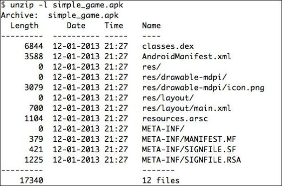

这里，我们使用`-l`（list）标志，以便简单地展示压缩包的内容，而不是解压它。 我们还可以使用`file`命令来查看它是否是一个有效的压缩包。


Android 应用程序由各种组件组成，它们一起创建可工作的应用程序。 这些组件是活动，服务，广播接收器，内容供应器和共享首选项。 在继续之前，让我们快速浏览一下这些不同的组件：

+ 活动（Activity）：这些是用户可以与之交互的可视界面。这些可以包括按钮，图像，`TextView`或任何其他可视组件。
+ 服务（Service）：这些 Android 组件在后台运行，并执行开发人员指定的特定任务。这些任务可以包括从 HTTP 下载文件到在后台播放音乐的任何内容。
+ 广播接收器（Broadcast Receiver）：这些是 Android 应用程序中的接收器，通过 Android 系统或设备中存在的其他应用程序，监听传入的广播消息。一旦它们接收到广播消息，就可以根据预定义的条件触发特定动作。条件可以为收到 SMS，来电呼叫，电量改变等等。
+ 共享首选项（Shared Preference）：应用程序使用这些首选项，以便为应用程序保存小型数据集。此数据存储在名为`shared_prefs`的文件夹中。这些小数据集可以包括名值对，例如游戏中的用户得分和登录凭证。不建议在共享首选项中存储敏感信息，因为它们可能易受数据窃取和泄漏的影响。
+ 意图（Intent）：这些组件用于将两个或多个不同的 Android 组件绑定在一起。意图可以用于执行各种任务，例如启动动作，切换活动和启动服务。
+ 内容供应器（Content Provider）：这些组件用于访问应用程序使用的结构化数据集。应用程序可以使用内容供应器访问和查询自己的数据或存储在手机中的数据。

现在我们知道了 Android 应用程序内部结构，以及应用程序的组成方式，我们可以继续逆向 Android 应用程序。 当我们只有`.apk`文件时，这是获得可读的源代码和其他数据源的方式。

## 3.2 逆向 Android 应用

正如我们前面讨论的，Android应用程序只是一个数据和资源的归档文件。 即使这样，我们不能简单地解压缩归档包（`.apk`）来获得可读的源代码。 对于这些情况，我们必须依赖于将字节代码（如在`classes.dex`中）转换为可读源代码的工具。

将字节码转换为可读文件的一种方法，是使用一个名为 dex2jar 的工具。 `.dex`文件是由 Java 字节码转换的 Dalvik 字节码，使其对移动平台优化和高效。 这个免费的工具只是将 Android 应用程序中存在的`.dex`文件转换为相应的`.jar`文件。 请遵循以下步骤：

1.  从`https://code.google.com/p/dex2jar/`下载 dex2jar 工具。

2.  现在我们可以使用它来运行我们的应用程序的`.dex`文件，并转换为`.jar`格式。

3.  现在，我们需要做的是，转到命令提示符并访问 dex2jar 所在的文件夹。 接下来，我们需要运行`d2j-dex2jar.bat`文件（在 Windows 上）或`d2j-dex2jar.sh`文件（在 Linux / Mac 上），并提供应用程序名称和路径作为参数。 这里的参数中，我们可以简单地使用`.apk`文件，或者我们甚至可以解压缩`.apk`文件，然后传递`classes.dex`文件，如下面的截图所示：

    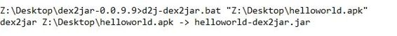
    
    正如我们在上面截图中看到的，dex2jar 已经成功地将应用程序的`.dex`文件转换为名为`helloworld-dex2jar.jar`的`.jar`文件。 现在，我们可以在任何 Java 图形查看器（如 JD-GUI）中打开此`.jar`文件，JD-GUI 可以从其官方网站`http://jd.benow.ca/`下载。

4.  一旦我们下载并安装 JD-GUI，我们现在可以继续打开它。 它看起来像下面的截图所示：

    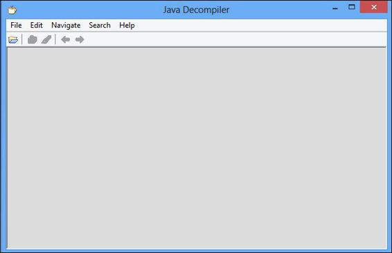
    
5.  在这里，我们现在可以打开之前步骤中转换的`.jar`文件，并查看 JD-GUI 中的所有 Java 源代码。 为了打开`.jar`文件，我们可以简单地访问` File | Open`。

    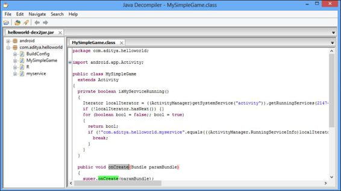
    
    
在右侧窗格中，我们可以看到 Java 应用程序的 Java 源代码和所有方法。 请注意，重新编译过程会为你提供原始 Java 源代码的近似版本。 这在大多数情况下无关紧要; 但是，在某些情况下，你可能会看到转换的`.jar`文件中缺少某些代码。 此外，如果应用程序开发人员使用一些防止反编译的保护，如 proguard 和 dex2jar，当我们使用 dex2jar 或 Apktool 反编译应用程序时，我们不会看到准确的源代码; 相反，我们将看到一堆不同的源文件，这不是原始源代码的准确表示。

## 3.3 使用 Apktool 逆向 Android 应用

另一种逆向 Android应用程序的方法是将`.dex`文件转换为 smali 文件。 smali 是一种文件格式，其语法与称为 Jasmine 的语言类似。我们现在不会深入了解 smali 文件格式。有关更多信息，请参阅在线 wiki`https://code.google.com/p/smali/wiki/`，以便深入了解 smali。

一旦我们下载 Apktool 并配置它，按照前面的章节的指示，我们都做好了进一步的准备。 与 JD-GUI 相比，Apktool 的主要优点是它是双向的。这意味着如果你反编译一个应用程序并修改它，然后使用 Apktool 重新编译它，它能跟完美重新编译，并生成一个新的`.apk`文件。然而，dex2jar 和 JD-GUI 不能做类似功能，因为它提供近似代码，而不是准确的代码。

因此，为了使用 Apktool 反编译应用程序，我们所需要做的是，将`.apk`文件与 Apktool 二进制文件一起传递给命令行。一旦反编译完成，Apktool 将使用应用程序名称创建一个新的文件夹，其中会存储所有的文件。为了反编译，我们只需调用`apktool d [app-name].apk`。这里，`-d`标志表示反编译。

在以下屏幕截图中，我们可以看到使用 Apktool 进行反编译的应用程序：

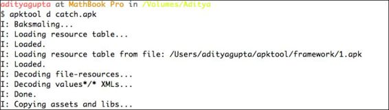

现在，如果我们进入 smali 文件夹，我们将看到一堆不同的 smali 文件，它们包含开发应用程序时编写的 Java 类的代码。在这里，我们还可以打开一个文件，更改一些值，并使用 Apktool 再次构建它。为了从 smali 构建一个改动的应用程序，我们将使用 Apktool 中的`b`（build）标志。

```
apktool b [decompiled folder name] [target-app-name].apk
```

但是，为了反编译，修改和重新编译应用程序，我个人建议使用另一个名为 Virtuous Ten Studio（VTS）的工具。这个工具提供与 Apktool 类似的功能，唯一的区别是 VTS 提供了一个漂亮的图形界面，使其相对容易使用。此工具的唯一限制是，它只在 Windows 环境中运行。我们可以从官方下载链接`http://www.virtuous-ten-studio.com/`下载 VTS。以下是反编译同一项目的应用程序的屏幕截图：


## 3.4 审计 Android 应用

Android 应用程序通常包含许多安全漏洞，大多数时候是由于开发人员的错误和安全编码实践的无视。 在本节中，我们将讨论基于 Android 应用程序的漏洞，以及如何识别和利用它们。

### 内容供应器泄露

许多应用程序使用内容供应器来存储和查询应用程序中的数据或来自电话的数据。 除非已经定义了内容提供者可以使用权限来访问，否则任何其他应用都可以使用应用所定义的内容供应器，来访问应用的数据。 所有内容供应器具有唯一的统一资源标识符（URI）以便被识别和查询。 内容提供者的 URI 的命名标准惯例是以`content://`开始。

如果 Android API 版本低于 17，则内容供应器的默认属性是始终导出。 这意味着除非开发人员指定权限，否则任何应用程序都可以使用应用程序的内容供应器，来访问和查询数据。 所有内容供应器都需要在`AndroidManifest.xml`中注册。 因此，我们可以对应用程序使用 Apktool，并通过查看`AndroidManifest.xml`文件检查内容供应器。

定义内容供应器的一般方法如下所示：

```xml
<provider
     android:name="com.test.example.DataProvider"
     android:authorities ="com.test.example.DataProvider">
</provider>
```

所以现在，我们将举一个漏洞应用程序的例子，并尝试利用内容供应器泄漏漏洞：

1.  为了反编译应用程序，我们将使用 Apktool 来使用`apktool d [appname].apk`反编译应用程序。

2.  为了找到内容供应器，我们可以简单地查看定义它们的`AndroidManifest.xml`文件，或者我们可以使用一个简单的`grep`命令，从应用程序代码中获取内容供应器，如下所示：

    
    
3.  我们可以使用`grep`命令来查找内容提供者，使用`grep –R 'content://'`。 此命令将在每个子文件夹和文件中查找内容供应器，并将其返回给我们。

    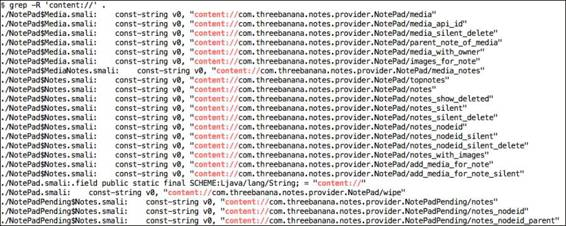
    
4.  现在，我们在模拟器中安装应用程序。 为了查询内容供应器并确认漏洞是可利用的，我们需要在 Android 设备或模拟器中安装该应用程序。 使用以下代码，我们将在设备上安装易受攻击的`app.apk`文件：

    ```
    $ adb install vulnerable-app.apk
    1869 KB/s (603050 bytes in 0.315s)
       pkg: /data/local/tmp/vulnerable-app.apk
    Success
    ```
    
5.  我们可以通过创建另一个没有任何权限的应用程序来查询内容供应器，然后查询漏洞应用程序的内容供应器。 为了快速获得信息，我们还可以使用`adb`查询内容供应器，我们可以在以下命令中看到：

    ```
    adb shell content query - - uri [URI of the content provider]
    ```
    
    以下是在漏洞应用程序上运行的命令，输出展示了存储在应用程序中的注释：

    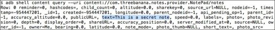

    在这里，我们还可以使用 MWR 实验室的另一个名为 Drozer 的工具，以便在 Android 应用程序中找到泄漏的内容供应器漏洞。 我们可以从官方网站`https://labs.mwrinfosecurity.com/tools/drozer/`下载并安装 Drozer。
    
6.  一旦我们安装了它，我们需要将代理组件`agent.apk`安装到我们的模拟器，它位于下载的`.zip`文件内。 该代理是系统和设备相互交互所需的。 我们还需要在每次启动模拟器时转发一个特定的端口（`31415`），以便建立连接。 要在 Mac 和其他类似平台上安装设备，我们可以按照`https://www.mwrinfosecurity.com/system/assets/559/original/mwri_drozer-users-guide_2013-09-11.pdf`上提供的在线指南。

    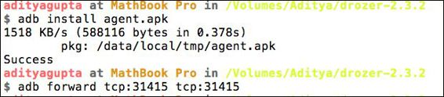
    
7.  一旦完成，我们可以启动应用程序，并单击"Embedded Server（嵌入式服务器）"文本。 从那里，我们需要回到设备，启动 Drozer 应用程序，并通过单击名为 Disabled 的左上角切换按钮启用服务器。

    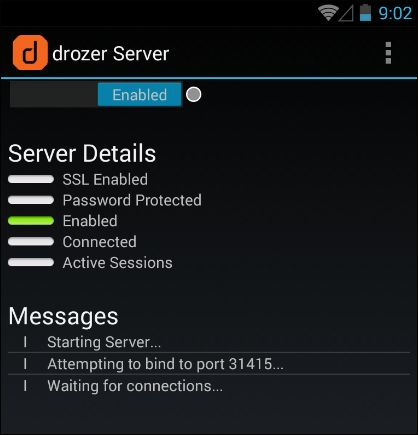
    
8.  此后，我们需要访问终端并启动 Drozer，并将其连接到模拟器/设备。 为此，我们需要输入`drozer console connect`，如下面的截图所示：

    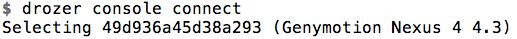
    
9.  在这里，我们可以运行`app.provider.finduri`模块来查找所有内容供应器，如下所示：

    ```
    dz> run app.provider.finduri com.threebanana.notes 
    Scanning com.threebanana.notes…
    content://com.threebanana.notes.provider.NotePad/notes
    content://com.threebanana.notes.provider.NotePadPending/notes/
    content://com.threebanana.notes.provider.NotePad/media
    content://com.threebanana.notes.provider.NotePad/topnotes/
    content://com.threebanana.notes.provider.NotePad/media_with_owner/
    content://com.threebanana.notes.provider.NotePad/add_media_for_note
    content://com.threebanana.notes.provider.NotePad/notes_show_deleted
    content://com.threebanana.notes.provider.NotePad/notes_with_images/
    ```

0.  一旦我们有了 URI，我们现在可以使用 Drozer 应用程序查询它。 为了查询它，我们需要运行`app.provider.query`模块并指定内容供应器的 URI，如下面的截图所示：

    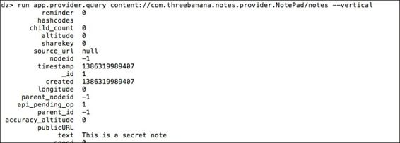
    
    如果 Drozer 能够查询和显示来自内容供应器的数据，这意味着内容供应器泄漏数据并且存在漏洞，因为 Drozer 没有被明确地授予使用数据集的任何权限。

1.  为了修复此漏洞，开发人员需要做的是，在创建内容供应器时指定参数`android:exported = false`，或者创建一些新的权限，另一个应用程序在访问供应器之前必须请求它。

## 3.5 不安全的文件存储

通常，开发人员为应用程序存储数据时，未指定文件的正确文件权限。 这些文件有时被标记为全局可读，并且可以由任何其它应用程序访问而不需要请求权限。

为了检查这个漏洞，我们所需要做的是访问`adb shell`，之后使用`cd`进入`/data/data/[package name of the app]`。

如果我们在这里执行一个简单的`ls -l`，就可以看到文件和文件夹的文件权限：

```
# ls -l /data/data/com.aditya.example/files/userinfo.xml 
-rw-rw-rw- app_200  app_200     22034 2013-11-07 00:01 userinfo.xml
```

这里我们可以使用`find`来搜索权限。

```
find /data/data/ -perm [permissions value]
```

如果我们执行`cat userinfo.xml`，它储存了应用的用户的用户名和密码。

```
#grep 'password' /data/data/com.aditya.example/files/userinfo.xml 
<password>mysecretpassword</password>
```

这意味着任何其他应用程序也可以查看和窃取用户的机密登录凭据。 可以通过在开发应用程序时指定正确的文件权限，以及一起计算密码与盐的散列来避免此漏洞。

### 目录遍历或本地文件包含漏洞

顾名思义，应用程序中的路径遍历漏洞允许攻击者使用漏洞应用程序的供应器读取其他系统文件。

此漏洞也可以使用我们之前讨论的工具 Drozer 进行检查。 在这里，我们用例子来说明由 Seafastian Guerrero 发现的 Adobe Reader Android 应用程序漏洞（`http://blog.seguesec.com/2012/09/path-traversal-vulnerability-on-adobe-reader-android-application`）。 此漏洞存在于 Adobe Reader 10.3.1 中，并在以后的版本中进行了修补。 你可以从`http://androiddrawer.com`下载各种 Android 应用程序的旧版本。

我们将启动 Drozer，并运行`app.provider.finduri`模块来查找内容供应器 URI。

```
dz> run app.provider.finduri com.adobe.reader
Scanning com.adobe.reader...
content://com.adobe.reader.fileprovider/
content://com.adobe.reader.fileprov
```

一旦我们找到了 URI，我们现在可以使用`app.provider.read`搜索并利用本地文件包含漏洞。 在这里，我尝试从系统中读取一些文件，如`/etc/hosts`和`/proc/cpuinfo`，它们默认存在于所有的 Android 实例中，因为它是基于 Linux 的文件系统。

```
dz> run app.provider.read content://com.adobe.reader.fileprovider/../../../../etc/hosts 
127.0.0.1           localhost
```

正如我们在下面的屏幕截图中看到的，我们已经成功地使用 Adobe Reader 漏洞内容供应器读取了 Android 文件系统中的文件。

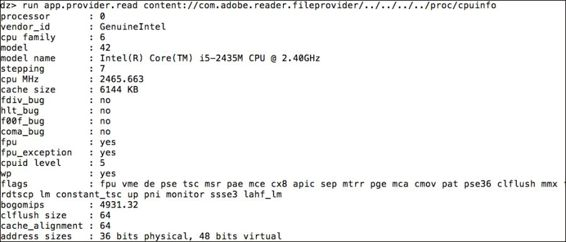

### 客户端注入攻击

客户端攻击通常发生在应用程序未检查用户输入的时候。 例如，在对 SQLite 数据库的查询期间，应用程序正在解析用户输入，因为它位于查询语句中。

让我们举一个应用程序的示例，它检查本地 SQLite 数据库，来根据登录凭据验证用户。 因此，当用户提供用户名和密码时，正在运行的查询将如下所示：

```sql
SELECT * FROM 'users' where username='user-input-username' and password='user-input-password'
```

现在，在正常情况下，这将正常工作，用户输入其真正的登录凭据，并且查询取决于条件将返回`true`或`false`。

```sql
SELECT * FROM 'users' where username='aditya' and password='mysecretpass
```

但是，如果攻击者输入 SQL 语句而不是正常的用户名怎么办？ 请参考以下代码：

```sql
SELECT * FROM 'users' where username='1' or '1' = '1' - - and password='mysecretpassword
```

因此，在这种情况下，即使用户不知道用户名和密码，他们可以通过使用`1'or'1'='1`查询来轻松绕过它，这在所有情况下都返回`true`。 因此，应用程序开发人员必须在应用程序中进行适当的检查，来检查用户输入。

我们还可以使用 Drozer 的`app.provider.query`来利用 SQL 注入漏洞。 其语法看起来像：

```
run app.provider.query [Content Provider URI] --projection  "* FROM SQLITE_MASTER WHERE type='table';- -"
```

现在，这将返回 SQLite 数据库中整个表的列表，它的信息存储在`SQLITE_MASTER`中。 您还可以继续并执行更多的 SQL 查询，来从应用程序提取更多的信息。 为了使用 Drozer 实战漏洞利用，你可以从`https://www.mwrinfosecurity.com/products/drozer/community-edition/`下载他们的漏洞应用程序。

## 3.6 OWASP 移动 Top10

Web 应用程序开放安全项目（OWASP）是涉及安全和漏洞搜索的标准之一。 它还发布了前 10 名漏洞的列表，其中包括在各种平台中最常见和重要的漏洞。

可以在`https://www.owasp.org/index.php/Projects/OWASP_Mobile_Security_Project_-_Top_Ten_Mobile_Risks`上找到 OWASP 移动版的前 10 个指南。 如果我们查看 OWASP 移动项目，以下是它涵盖的移动应用程序的 10 个安全问题：


+ 服务端弱控制
+ 不安全的数据存储
+ 传输层保护不足
+ 意外的数据泄漏
+ 缺少授权和认证
+ 无效的加密
+ 客户端注入
+ 通过不可信输入的安全决策
+ 不正确的会话处理
+ 缺乏二进制保护

让我们逐一介绍它们，并快速了解它们在移动应用程序中的关系，以及我们如何检测它们：

### 服务端弱控制

第一个 OWASP 漏洞是服务端弱控制，顾名思义，服务端不以安全的方式将数据从移动应用程序发送到服务端，或者在发送数据时暴露一些敏感的 API。 例如，考虑一个 Android 应用程序发送登录凭据到服务器进行身份验证，而不验证输入。 攻击者可以以这样的方式修改凭证，以便访问服务器的敏感或未授权区域。 此漏洞可视为移动应用程序和 Web 应用程序中的一个漏洞。

### 不安全的数据存储

这仅仅意味着，应用相关信息以用户可访问的方式在设备上存储。 许多 Android 应用程序在共享首选项，SQLite（纯文本格式）或外部存储器中，存储与用户相关的私密信息或应用程序信息。 开发人员应该始终记住，即使应用程序在数据文件夹（`/data/data/package-name`）中存储敏感信息，只要手机已 root，恶意应用程序/攻击者就可以访问它。

### 传输层保护不足

许多 Android 开发人员依赖于通过不安全模式的网络来发送数据，例如 HTTP 或没有正确实现 SSL 的形式。 这使得应用程序易受到网络上发生的所有不同类型的攻击，例如流量拦截，从应用程序向服务器发送数据时操纵参数，以及修改响应来访问应用程序的锁定区域。

### 意外的数据泄漏

当应用程序将数据存储在本身易受攻击的位置时，会出现此漏洞。 这些可能包括剪贴板，URL 缓存，浏览器 Cookie，HTML5`DataStorage`，统计数据等。 一个例子是用户登录到他们的银行应用程序，他们的密码已经复制到剪贴板。 现在，即使是恶意应用程序也可以访问用户剪贴板中的数据。

### 缺少授权和认证

如果 Android 应用程序或一般的移动应用程序在没有适当安全措施的情况下，尝试基于客户端检查来验证或授权用户，则这些应用程序最容易受到攻击。 应该注意的是，一旦手机已 root，大多数客户端保护可以被攻击者绕过。 因此，建议应用程序开发人员使用服务器端身份验证和授权进行适当的检查，一旦验证成功，请使用随机生成的令牌，以便在移动设备上验证用户。

### 无效的加密

这仅仅表示使用不安全的密码函数来加密数据部分。 这可能包括一些已知存在漏洞的算法，如 MD5，SHA1，RC2，甚至是没有适当的安全措施的定制算法。

### 客户端注入

这在Android应用程序中是可行的，主要成因是使用 SQLite 进行数据存储。 我们将在本书的各章中执行注入攻击。

### 通过不可信输入的安全决策

在移动应用程序中，开发人员应始终过滤和验证用户提供的输入或其他相关输入，并且不应该像在应用程序中那样使用它们。 不受信任的输入通常会导致应用程序中的其他安全风险，如客户端注入。

### 不正确的会话处理

在为移动应用程序执行会话处理时，开发人员需要处理很多因素，例如认证 cookie 的正常过期，安全令牌创建，cookie 生成和轮换，以及无法使后端的会话无效。 必须在 Web 应用程序和 Android 应用程序之间维护正确的安全同步。

### 缺乏二进制保护

这意味着不能正确地防止应用程序被逆向或反编译。 诸如 Apktool 和 dex2jar 之类的工具可用于逆向 Android 应用程序，如果没有遵循正确的开发实践，它会暴露应用程序的各种安全风险。 为了防止通过逆向攻击来分析应用程序，开发人员可以使用 ProGuard 和 DashO 等工具。

## 总结

在本章中，我们学习了使用各种方法来逆转 Android 应用程序并分析源代码。 我们还学习了如何修改源代码，然后重新编译应用程序，来绕过某些保护。 此外，我们还看到了如何使用 Drozer 等工具寻找 Android 应用程序中的漏洞。 你还可以通过`http://labs.securitycompass.com/exploit-me/`亲自尝试 Exploit-Me 实验室中的各种漏洞，它由 Security Compass 开发。

在下一章中，我们将进一步尝试 Android 应用程序的流量拦截，并在我们的渗透测试中使用它。
