# 第五章 Android 取证

> 作者：Aditya Gupta

> 译者：[飞龙](https://github.com/)

> 协议：[CC BY-NC-SA 4.0](http://creativecommons.org/licenses/by-nc-sa/4.0/)

## 5.1 取证类型

取证是使用不同的手动和自动方法从设备中提取和分析数据。它可以大致分为两类：

+   逻辑采集：这是的一种取证方法，其中取证员与设备交互并从文件系统提取数据。该数据可以是任何内容，诸如应用特定数据，联系人，通话记录，消息，web 浏览器历史，社交网络用户信息和财务信息。逻辑采集的优点是，在大多数情况下比物理采集更容易获取逻辑信息。然而，在一些情况下，该方法的一个限制是，在这种情况下的证据（智能手机及其数据）具有被篡改的高风险。
+   物理采集：这意味着对整个物理存储介质进行逐位拷贝。我们还可以在执行物理采集时定位不同的单个分区。与逻辑采集相比，这种方法慢得多，但更可靠和可信赖。此外，为了在智能手机上执行物理采集，检查者需要熟悉不同类型的文件系统，例如 Yet Another Flash File System 2（YAFFS2），ext3，ext4，rfs 等。

## 5.2 文件系统

在我们深入取证以及从设备提取数据之前，我们应该清楚地了解文件系统类型和它们之间的差异。正如我们前面讨论的，在 Android 中进行物理采集有点棘手，一个主要原因是文件系统不同。

Android 文件系统的主分区通常被分区为 YAFFS2。在 Android 中使用 YAFFS2 的原因是，它为设备提供了优势，这包括更高的效率和性能，以及更低的占用空间。几年前，当 Android 刚刚推出时，取证是平台上的一个大问题，因为几乎没有支持 YAFFS2 文件系统格式的取证工具。

SD 卡是 FAT32 类型，是正常系统用户中的共享格式。因此，为了获取 SD 卡的映像，可以使用任何常规的数据采集取证工具。

制作副本或创建现有数据系统映像的最有名的工具之一是 dd，它从原始来源到系统进行逐块复制。然而，由于该工具的一些缺点，例如缺少内存块以及跳过坏块，会导致数据损坏，因此不推荐在取证调查期间使用。在接下来的章节中，我们将深入介绍 Android 文件系统，并将研究如何以最有效的方式从文件系统中提取数据。

### Android 文件系统分区

正如我们在前面的章节中讨论的，Android 基于 Linux 内核，并从 Linux 本身派生其大部分功能和属性。 在 Android 中，文件系统被划分为不同的分区，每个分区都具有重要意义。

为了在 Android 设备上查看分区，我们可以使用`adb shell`然后查看`proc`下的`mtd`文件，如下面的命令所示。 在一些不存在`mtd`文件的设备中，在`proc`下有另一个名为`partitions`的文件，如下面的命令所示：

```
adb shell
cat /proc/mtd
```

以下是在设备上执行上述命令来列出所有分区后的输出的屏幕截图。

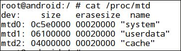

正如我们在上面截图中看到的，存在各种文件系统分区及其各自的大小。 在大多数 Android 设备上，我们通常会看到一些数据分区，如`system`，`userdata`，`cache`，`recovery`，`boot`，`pds`，`kpanic`和`misc`，它们安装在`dev`列指定的不同位置。 为了看到不同的分区和类型，我们可以在`adb shell`中键入`mount`。

正如我们在下面的截图中可以看到的，通过执行`mount`命令列表，所有不同的分区及其位置将被挂载：

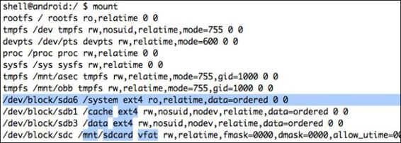

## 5.3 使用`dd`提取数据

`dd`工具是取证中最常用的工具之一，以便为数据提取过程创建映像。 换句话说，它用于将指定的输入文件转换并复制为输出文件。 通常在分析期间，我们不允许与证据直接交互和更改。 因此，获得设备文件系统的映像，然后对其执行分析总是一个好的选择。

默认情况下，`dd`工具在大多数基于 Linux 的系统中，以及在 Android 设备中的`/system/bin`中都存在。 如果它不存在于你的设备中，您可以安装 BusyBox，它将安装`dd`以及一些其他有用的二进制文件。 你可以从 BusyBox 应用程序（`https://play.google.com/store/apps/details?id=stericson.busybox`）获取`dd`的二进制文件，或者你甚至可以自己交叉编译。

`dd`的标准语法如下：

```
dd if = [source file which needs to be copied] of = [destination file to be created]
```

有几个命令行选项可以与`dd`一起传递，其中包括：

+ `if`：这是要复制的输入文件
+ `of`：这是内容要复制给它的输出文件
+ `bs`：这是块大小（一个数字），指定`dd`复制映像的块大小
+ `skip`：这是在开始复制过程之前要跳过的块数

让我们现在继续，并取得现有分区之一的映像来进行取证

1.  我们需要找到的第一个东西是不同的分区，它们存在于我们的 Android 设备上，就像我们之前做的一样。 这可以通过查看`/proc/mtd`文件的内容来完成。

    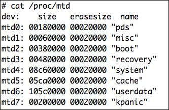

2.  接下来，我们需要了解数据分区的位置，因为这里我们采集数据分区的备份。 在这种情况下，它位于`mtdblock6`。 这里，我们将启动`dd`，并将映像存储在`sdcard`中，稍后我们将使用`adb pull`命令拉取映像。 `adb pull`命令只是简单地允许你将文件从设备拉取到本地系统。

    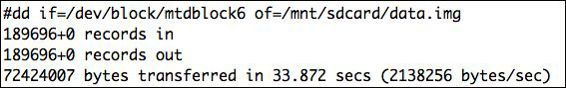
    
3.  复制可能需要一些时间，一旦复制完成，我们可以退出`adb shell`，访问我们的终端，并键入以下代码：

    ```
    adb pull /mnt/sdcard/data.img data.img
    ```
    
4.  我们还可以使用 Netcat 工具将映像直接保存到远程位置/系统。 为此，我们首先需要将端口从设备转发到系统。

    ```
    adb forward tcp:5566 tcp:5566
    ```
    
5.  同时，我们需要在这里启动 Netcat 工具，监听端口 5566。

    ```
    nc 127.0.0.1 5566 > data.img
    ```
    
6.  此后，我们必须执行`adb shell`进入设备，然后启动`dd`工具，并将输出转发到 Netcat。

    ```
    nc -l -p 5566-e dd if=/dev/block/mtdblock6
    ```
    
这将把映像保存到系统中，而不是保存在设备上的任何位置，然后再拉取它。 如果你的手机上没有`dd`二进制，你也可以安装 BusyBox 来获得`dd`二进制。

开始取证调查之前应该确保的一件事是，检查设备是否被设置为在超级用户模式下操作，这通常需要设备的 root。 然而，我们遇到的所有设备并不都是 root。 在这些情况下，我们将使用我们的自定义恢复映像来启动手机，然后 root 设备。

## 5.4 使用 Andriller 提取应用数据

Andriller 是由 Denis Sazonov 以 Python 编写的开源多平台取证工具，它有助于从设备中提取一些基本信息，并且有助于进行取证分析。 分析完成后，将生成 HTML 格式的取证报告。

为了下载它，我们可以访问官方网站`http://android.saz.lt/cgi-bin/download.py`并下载必要的包。 如果我们在 Linux 或 Mac 环境中，我们可以简单地使用`wget`命令来下载并解压软件包。 因为它只是一个 Python 文件，以及一些其他必要的二进制文件，所以没有必要安装它; 相反，我们可以直接开始使用它。

```
$ wget http://android.saz.lt/download/Andriller_multi.tar.gz

Saving to: 'Andriller_multi.tar.gz'

100%[=============================>] 1,065,574    114KB/s   in 9.2s

2013-12-27 04:23:22 (113 KB/s) - 'Andriller_multi.tar.gz' saved [1065574/1065574]  

$ tar -xvzf Andriller_multi.tar.gz
```

一旦解压完成，我们可以访问 Andriller 文件夹，之后只需使用`python andriller.py`运行它。 Andriller 的主要依赖之一是 Python 3.0。 如果你使用 Python 2.7 ，它预装在大多数操作系统上，你可以从官方网站`http://python.org/download/releases/3.0/`或`http://getpython3.com/`下载 3.0 版本 。

现在，一旦我们连接了设备，我们可以继续运行`Andriller.py`，以便从设备捕获信息，并创建日志文件和数据库。

```
$ python Andriller.py
```

一旦开始运行，我们会注意到，它会打印出设备的几个信息，如 IMEI 号码，内部版本号和安装的社交网络应用程序。 这里，它检测到 WhatsApp 应用程序以及与其相关联的电话号码，因此它将继续并拉取 WhatsApp 应用程序的所有数据库。

分析完成后，我们将看到类似以下屏幕截图的屏幕：

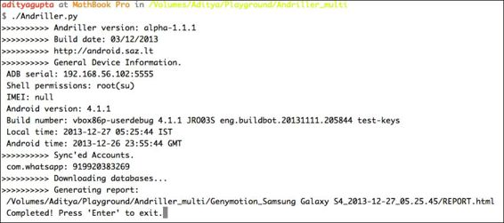

如果我们查看它为我们创建的 HTML 文件，它将显示一些关于设备的基本信息，如下面的屏幕截图所示。 它还在文件夹`db`下的同一文件夹目录中创建所有数据库的转储。

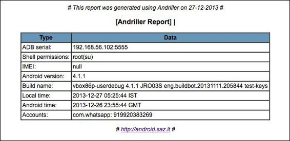

如果我们分析这个应用程序的源代码，我们可以在`Andriller.py`的源代码中看到，它会检查设备中存在的不同包。 我们还可以在这里添加我们自己的包并保存数据库，我们希望 Andriller 为我们寻找它。

如下面的截图所示，你可以手动添加更多要使用 Andriller 备份的数据库。

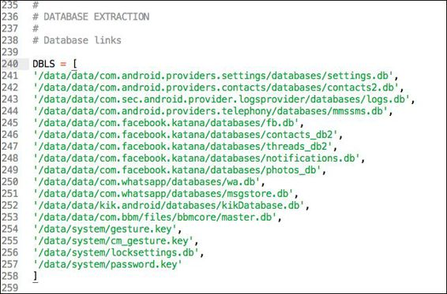

## 5.5 使用 AFLogical 提取所有联系人、通话记录和短信

AFLogical 是由 viaForensics 编写的工具，以便从设备创建逻辑采集并将结果呈现给取证员。它从设备中提取一些关键组件，包括短信，联系人和通话记录。

为了使用 AFLogical，我们需要从 GitHub 库`https://github.com/viaforensics/android-forensics`下载项目的源代码。下载后，我们可以将此项目导入我们的 Eclipse 工作区并进行构建。我们可以从我们现有的代码中访问`File | New | Other | Android | Android Project`，然后选择下载的源代码路径。

一旦我们将项目导入到我们的工作区，我们就可以在我们的设备上运行它，方法是右键单击项目并选择“运行为 Android 应用程序”。一旦我们运行它，我们将注意到，我们的设备上的`AFLogical`应用程序提供了选项来选择要提取什么信息。在以下屏幕截图中，你将看到 AFLogical 在设备上运行，并询问用户有关要提取的详细信息：


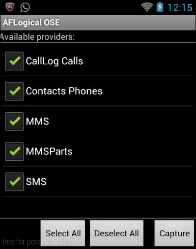

我们将检查所有东西，然后单击`Capture`。 AFLogical 将开始从不同来源捕获详细信息，并将捕获的详细信息保存在 SD 卡中的`csv`文件中。 捕获过程完成后，我们会注意到一个警告框。

我们现在可以查看我们的 SD 卡路径，我们可以找到保存的`.csv`文件。

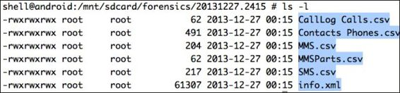

然后我们可以在任何`.csv`文件查看器中打开这些`.csv`文件来查看详细信息。 因此，AFLogical 是一个快速有效的工具，用于从设备中提取一些信息，如联系人，通话记录和消息。

## 5.6 手动转储应用的数据库


既然我们已经看到，很多工具可以帮助我们进行取证，我们还可以使用`adb`和我们的手动技能从设备中提取一些信息。 正如我们之前学到的，应用程序文件存储在`/data/data/[应用程序的包名]/`位置。 由于大多数应用程序也使用数据库来存储数据，我们注意到在名为`directory`的包中有另一个名为`databases`的文件夹。 这里需要注意的一点是，这只会帮助我们从使用数据库的应用程序中提取信息，以便转储应用程序和其他相关信息。 在某些应用程序中，我们可能还会注意到，应用程序将数据存储在 XML 文件中或使用共享首选项，我们需要手动审计它们。

Android 使用 SQLite 数据库（我们将在下一章深入讨论）与`.db`文件格式。 下面是手动提取所有数据库的步骤：

+ 进入设备，并创建一个文件夹来存储所有数据库
+ 查找所有`.db`文件并将其复制到创建的文件夹
+ 压缩文件夹并拉取它

因此，我们可以使用`adb shell`查找`/data/data/location`中的所有数据库文件，将它们压缩到归档文件中，然后将其拉取出来。

1.  在 SD 卡中创建一个名为`BackupDBS`的文件夹。

2.  为此，我们可以简单地执行`adb shell`，然后在`/mnt/sdcard`下创建一个名为`BackupDBS`的文件夹：

    ```
    adb shell 
    mkdir /mnt/sdcard/BackupDBS
    ```
    
3.  查找所有`.db`文件并将其复制到`BackupDBS`。

4.  为此，我们可以使用一个简单的命令行绝技来查找和复制`/data/data`中的所有`.db`文件。 我们首先使用`find`命令查找所有`.db`文件。 在以下命令中，我们使用`find`工具，并指定从当前位置搜索，然后查找具有任何文件名（通配符`*`）以及扩展名`db`的所有文件（即`*.db`），以及类型为文件`f`。

    ```
    find . -name "*.db" -type f
    ```
    
    下面的截图展示了输出：
    
    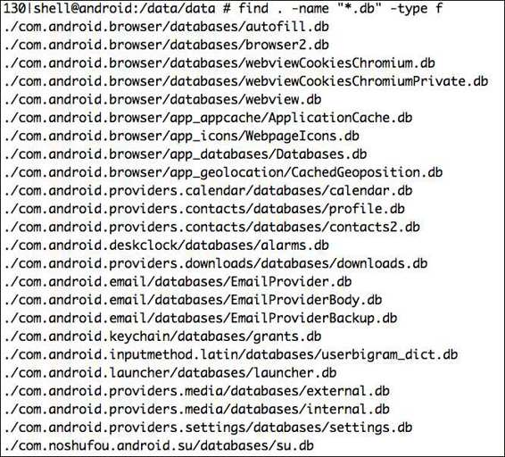

5.  现在，我们可以简单地使用`cp`和`find`，以便将其复制到`BackupDBS`目录

    ```
    find . -name "*.db" -type f -exec  cp {} /mnt/sdcard/BackupDBS \;
    ```
    
6.  现在，如果我们查看`/mnt/sdcard`下的`BackupDBS`目录，我们的所有数据库都已成功复制到此位置。

    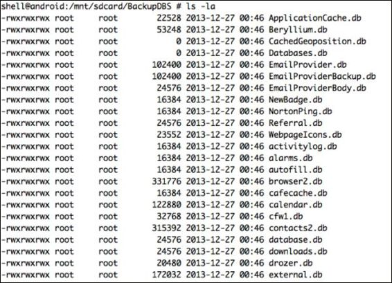
    
7.  压缩并拉取文件。 现在，在同一位置，我们可以使用`tar`工具创建一个压缩包，并使用`adb pull`。

    ```
    tar cvf backups.tar BackupDBS/
    ```
    
8.  然后，从系统中，我们可以简单地像这样拉取它。 此方法也可以用于通过在`/data/app`和`/data/app-private`文件夹中查找文件类型`.apk`，来从手机中拉取所有`.apk`文件。

    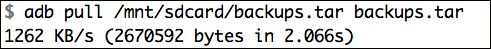
    
9.  如果我们仔细看一看，在我们的`backups.tar`中，还有一个名为`msgstore.db`的 WhatsApp 应用程序的数据库。 让我们继续分析和研究数据库内部的内容。
为此，我们需要首先解压我们刚才拉取的`tar`归档文件。

    ```
    tar -xvf backups.tar
    ```
    
0.  现在，为了分析名为`msgstore.db`的 WhatsApp 的 SQLite 数据库，我们可以下载并使用任何 SQLite 浏览器。 对于本书，我们使用 SQLite 数据库浏览器，可以从`http://sourceforge.net/projects/sqlitebrowser/`下载。

1.  现在，如果我们在 SQLite 数据库浏览器中打开`msgstore.db`文件并访问浏览器数据，我们可以在 SQLite 浏览器中看到我们的所有 WhatsApp 对话。 在以下截图中，我们可以看到在 SQLite 数据库浏览器中打开的`msgstore.db`，它显示 WhatsApp 应用程序的所有聊天对话：

    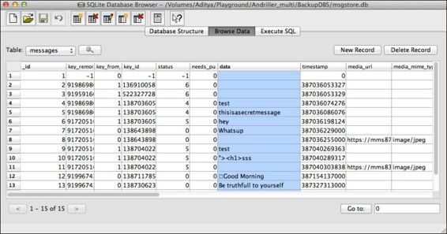
    
## 5.7 使用 logcat 记录日志

Android logcat 有时在取证调查期间很有用。 它包含在电话以及收音机上执行的所有活动的日志。 虽然不完整，它可以帮助调查员了解设备中发生了什么。

为了捕获和保存 logcat 转储文件，我们可以简单地使用`adb logcat`并将输出保存到一个文件，稍后我们可以分析它。

```
adb logcat > logcat_dump.log
```

我们还可以使用`logcat`以更加详细和有用的方式获取日志。 例如，我们可以通过指定`-b`参数和`radio`来获取收音机日志。 `-b`标志用于显示缓冲区（如收音机或事件）的 logcat。 `-v`标志用于控制输出格式，它代表`verbose`（详细），也可以是`time`，`brief`，`process`，`tag`，`raw`，`threadtime`或`long`。 除了`-v`，我们还可以使用`-d`（调试），`-i`（信息），`-w`（警告）或`-e`（错误）。

```
adb logcat -v time -b radio -d 
```

我们还可以使用其他工具，如`dmesg`，它将打印内核消息，以及`getprop`，它将打印设备的属性：

```
adb shell getprop
```

XDA 开发人员成员 rpierce99 还提供了一个应用程序，用于自动捕获来自 logcat 和其他相关来源的信息，这些信息可以从`https://code.google.com/p/getlogs/`下载并使用。

## 5.8 使用备份功能来提取应用数据

Android 从 4.0 起引入了使用`adb`的备份功能。 此功能可用于创建应用程序的备份及其整个数据。 这在取证上非常有用，因为取证员可以捕获应用程序及其整个数据。 请参阅以下步骤：

1.  这可以通过在终端中执行`adb backup`命令，后面附带应用程序的包名来完成。 如果我们不知道应用程序的准确包名称，我们可以使用`pm`列出所有包，然后过滤应用程序名称。

    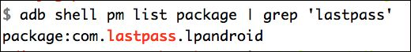
    
2.  执行此操作的另一种方法是使用`pm list package`命令，其中`-f`标志指定要在包名称中查找的字符串。

    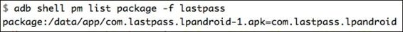
    
3.  接下来，我们可以简单地使用应用程序的包名称，来备份任何我们需要的应用程序。

    ```
    adb backup [package name] -f [destination file name]
    ```
    
4.  目标文件将以文件扩展名`.ab`（Android 备份）存储。 在这里，我们采集了 WhatsApp 应用程序的备份。

    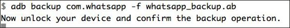
    
5.  一旦我们运行命令，它将暂停，并要求我们在设备上确认，如下面的截图所示：

    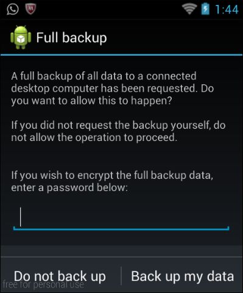
    
6.  在这里，我们需要选择`Back up my data`（备份我的数据）选项，并且还可以为备份指定加密密码。 一旦备份过程完成，我们将获得`whatsapp_backup.ab`文件。

7.  接下来，我们需要解压此备份，以便从`.ab`文件获取数据库。 为此，我们将使用`dd`和`openssl`创建一个`.tar`文件，然后我们可以解压它。

    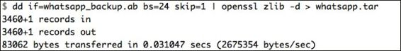

8.  现在，由于我们获得了`.tar`文件，我们可以使用`tar xvf`简单解压它。

    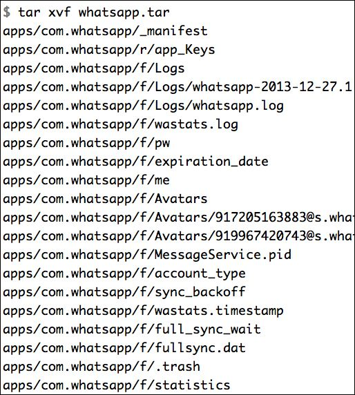
    
9.  一旦它解压完成，我们可以访问`apps/[package-name]`下的`db`文件夹，来获取数据库。 这里，程序包名称为`com.whatsapp`。

让我们快速使用`ls -l`来查看`db`文件夹中的所有可用文件。 正如你可以看到的，我们拥有`msgstore.db`文件，它包含 WhatsApp 对话，我们已经在上一节中看到了。

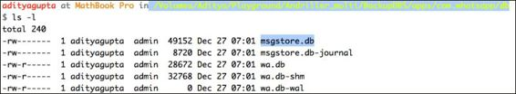

## 总结

在本章中，我们分析了执行取证的不同方法，以及各种工具，我们可以使用它们来帮助我们进行取证调查。 此外，我们了解了一些我们可以执行的手动方法，来从设备中提取数据。

在下一章中，我们将深入 SQLite 数据库，这是 Android 渗透测试的另一个要素。
