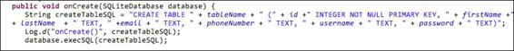
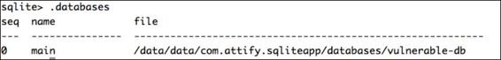
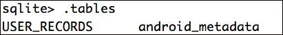
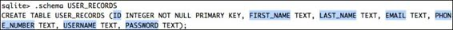
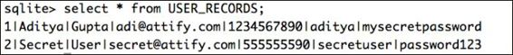
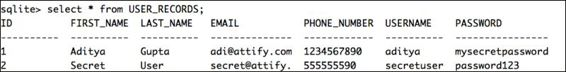
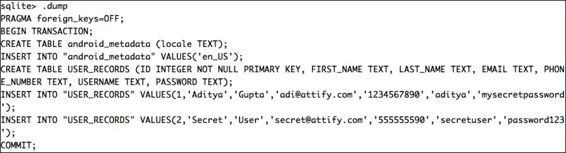
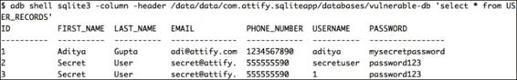
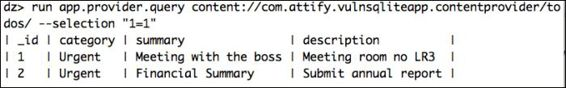
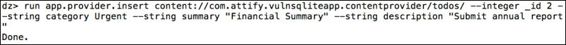

# 第六章 玩转 SQLite

> 作者：Aditya Gupta

> 译者：[飞龙](https://github.com/)

> 协议：[CC BY-NC-SA 4.0](http://creativecommons.org/licenses/by-nc-sa/4.0/)

SQLite 是一个开源数据库，具有许多类似于其他关系数据库（如 SQL）的功能。 如果你是应用程序开发人员，你可能还会注意到 SQLite 查询看起来或多或少像 SQL 一样。 在 Android 中选择 SQLite 的原因是其内存占用较低。 Android 开发者喜欢 SQLite 的原因是它不需要设置或配置数据库，并且可以在应用程序中直接调用。

## 6.1 深入理解 SQLite

正如我们在上一章中看到的，SQLite 数据库默认在 Android 中存储在`/data/data/[package name]/databases/`位置，扩展名为`.db`文件（在 Android 的大多数情况下） 。 现在，在我们更深入地探讨 SQLite 漏洞之前，我们应该清楚地了解 SQLite 语句和一些基本的命令

### 分析使用 SQLite 的简单应用

在这里，我们有一个基本的 Android 应用程序，它支持用户的登录和注册，并在后端使用 SQLite。 遵循以下步骤：

1.  让我们运行应用程序并分析它创建的数据库。 你可以从`http://attify.com/lpfa/vulnsqlite.apk`下载漏洞应用程序。 用于创建数据库的代码示例如以下屏幕截图所示：

    
    
2.  这意味着我们有七个字段，名称为`id`(`integer`), `firstName` (`text`), `lastName` (`text`), `email` (`text`), `phoneNumber` (`text`), `username` (`text`), 和 `password` (`text`)。`tableName `字段之前叫做`USER_RECORDS`。

3.  让我们现在访问 adb shell 并检查数据库。我们可以使用 SQLite 浏览器访问 SQLite 文件，我们在上一章中使用了它，或者我们可以使用命令行工具`sqlite3`。对于整个这一章，我们将使用名为`sqlite3`的命令行工具，它存在于大多数 Android设 备中。如果你的 Android 设备中不存在它，你可以使用 Play 商店中提供的 BusyBox 应用程序进行安装。

4.  所以，让我们继续分析数据库。我们需要做的第一件事是使用 adb shell 进入设备。

5.  下一步是访问`/data/data/[package-name]`目录的位置并查找`databases`文件夹。一旦我们进入了数据库文件夹，我们会注意到各种文件。现在，SQLite 数据库的文件格式大多是前面提到的`.db`，但它们也可以为`.sqlite`，`.sqlitedb`或开发人员在创建应用程序时指定的任何其他扩展名。如果你记得上一章中的练习，在查找数据库文件时，这正是寻找其他扩展名的时候，例如`.sqlite`。

6.  现在，我们可以使用以下命令使用`sqlite3`打开数据库：

    ```
    sqlite3 [databasename]
    ```
    
    在这种情况下，由于数据库名称是`weak-db`，我们可以简单地输入`sqlite3 vulnerable-db`打开它。 我们也可以在给定时间使用`sqlite3`打开多个数据库。 要查看加载的当前数据库，我们可以键入`.databases`命令列出我们当前的数据库，如下面的截图所示：
    
    

7.  现在，我们打开数据库时要做的第一件事是查看数据库中包含的表。 表的列表可以由`.tables`显示，如以下屏幕截图所示：

    

    正如我们在这里可以看到的，有两个名称为`USER_RECORDS`和`android_metadata`的表。 由于我们对`USER_RECORDS`更感兴趣，我们将首先继续查看表中的各个列，稍后我们将转储列字段中的数据。 为了查看有关表的更多信息，例如列字段，我们可以使用`.schema`命令，如下面的截图所示：
    
    

8.  接下来我们需要做的是通过执行`SELECT`查询来查看列字段中的数据。

    > 注意

    > 另一个需要注意的重要事情是，SQL 中使用的大多数查询对 SQLite 仍然有效。
    
9.  使用应用程序并为数据库填充一些信息。 接下来，为了查询并查看`USER_RECORDS`表，通过通配符`*`指定所有内容，我们可以使用以下命令：

    ```sql
    SELECT * from USER_RECORDS;
    ```
    
    运行上述命令将产生类似于如下所示的输出：
    
    

    现在，`sqlite3`也给了我们改变输出格式，查看额外信息以及所需信息的自由。 所以，让我们继续，将查看`mode`设置为`column`，将`header`设置为`on`。

0.  让我们再次运行相同的查询并检查输出，如下面的截图所示：

    
    
    还有其他可用的选项可用于渗透测试。 其中之一是`.output`命令。 这会自动将之后的 SQL 查询的输出保存到指定的文件，我们可以稍后拉取，而不是在屏幕上显示。 一旦我们将输出保存在文件中，并且想返回屏幕显示模式，我们可以使用`.output`命令并将其设置为`stdout`，这将再次在终端上显示输出 。

    在SQLite中，`.dump`将创建一个列表，包含从数据库创建到现在为止所执行的所有 SQL 操作。 以下是在当前数据库上运行的命令的输出的屏幕截图：
    
    
    
    此外，所有这些操作都可以从终端执行，而不是进入 shell，然后启动`sqlite3`二进制。 我们可以直接向 adb shell 传递我们的命令并获得输出，如下面的截图所示：

    

## 6.2 安全漏洞

Web 应用程序和移动应用程序中最常见的漏洞之一是基于注入的漏洞。 如果按原样使用用户提供的输入，或动态 SQL 查询的保护很少并且不足够，SQLite 也会产生注入漏洞。

让我们来看看用于查询应用程序中的数据的SQL查询，如下所示：

```java
String getSQL = "SELECT * FROM " + tableName + " WHERE " + 
username + " = '" + uname + "' AND " + password + " = '" + pword + 
"'";
Cursor cursor = dataBase.rawQuery(getSQL , null
```

在前面的 SQL 查询中，`uname`和`pword`字段从用户输入直接传递到 SQL 查询中，然后使用`rawQuery`方法执行。 `rawQuery`方法实际上只是执行任何传递给它的 SQL 查询。另一个类似于`rawQuery`的方法是`execSQL`方法，它和`rawQuery`一样脆弱。

前面的 SQL 查询用于验证用户的登录凭据，然后显示其在注册期间使用的信息。所以，这里的 SQL 引擎检查用户名和密码是否匹配在一行，如果是这样，它返回一个布尔值`TRUE`。

然而，想象一个场景，我们可以修改我们的输入，而不是正常的文本输入，它似乎是应用程序的 SQL 查询的一部分，然后又返回`TRUE`，从而授予我们身份。事实证明，如果我们把用户名/密码设为`1'or'1'='1`或任何类似总是`TRUE`的查询，我们就破解了应用程序的身份验证机制，这反过来是一个很大的安全风险。另外，请注意，由于使用单引号，在前面输入中使用的`OR`将在SQL查询中被视为`OR`。这将闭合用户名字段，并且我们的其余输入将解释为 SQL 查询。你可以从`http://attify.com/lpfa/sqlite.apk`下载漏洞应用程序。这里是攻击情况下的 SQL 查询：

```sql
SELECT * FROM USER_RECORDS WHERE USERNAME = '1'or'1'='1' AND 
PASSWORD = 'something'
```

如果应用程序检测到登录成功，它会显示一个弹出框，其中包含用户信息，就像在 SQLite 身份验证绕过攻击的情况下一样，如下面的屏幕截图所示：


我们还可以在输入结尾处附加双连字符（`-`），来使 SQL 查询的其余部分仅解释为对应用程序的注释。

让我们看看另一个应用程序，这一次，利用 drozer，我们以前使用的工具，来利用 SQLite 注入漏洞。

这个应用程序是一个待办事项，用户可以保存他们的笔记; 该笔记存储在名为`todotable.db`的数据库中，并在应用程序中通过内容供应器访问。 遵循以下步骤：

1.  让我们继续，并启动 drozer，查看这个应用程序的数据库，如下面的命令所示。软件包名称为`com.attify.vulnsqliteapp`。

    ```
    adb forward tcp:31415 tcp:31415
    drozer console connect
    ```
    
2.  一旦我们进入了 Drozer 的控制台，我们就可以运行`finduri`扫描器模块来查看所有内容 URI 和可访问的 URI，如下所示：

    ```
    dz> run scanner.provider.finduris -a com.attify.vulnsqliteapp
    Scanning com.attify.vulnsqliteapp...

    Unable to Query  
    content://com.attify.vulnsqliteapp.contentprovider/

    Able to Query    
    content://com.attify.vulnsqliteapp.contentprovider/todos

    Able to Query    
    content://com.attify.vulnsqliteapp.contentprovider/todos/

    Unable to Query  
    content://com.attify.vulnsqliteapp.contentprovider

    Accessible content URIs:
      content://com.attify.vulnsqliteapp.contentprovider/todos
      content://com.attify.vulnsqliteapp.contentprovider/todos/
    ```
    
3.  接下来，我们将使用 Drozer 中的注入扫描程序模块检查应用程序中基于注入的漏洞，如下所示：

    ```
    dz> run scanner.provider.injection -a com.attify.vulnsqliteapp
    Scanning com.attify.vulnsqliteapp...
    Not Vulnerable:
      content://com.attify.vulnsqliteapp.contentprovider/
      content://com.attify.vulnsqliteapp.contentprovider

    Injection in Projection:
      No vulnerabilities found.

    Injection in Selection:
      content://com.attify.vulnsqliteapp.contentprovider/todos
      content://com.attify.vulnsqliteapp.contentprovider/todos/
    ```
    
4.  所以，现在我们可以使用可选参数来查询这些内容供应器，例如`1 = 1`，它将在所有情况下返回`TRUE`，如下面的截图所示：

    

5.  此外，我们可以使用 Drozer 模块`app.provider.insert`，并通过指定参数和要更新的数据类型，将我们自己的数据插入 SQLite 数据库。 让我们假设我们要在数据库中添加另一个`to-do`条目。 因此，我们需要四个字段：`id`，`category`，`summary`和`description`，数据类型分别为`integer`，`string`，`string`和`string`。

6.  因此，完整的语法将变成：

    ```
    run app.provider.insert 
    content://com.attify.vulnsqliteapp.contentprovider/todos/ -
    -integer _id 2 --string category urgent --string summary 
    "Financial Summary" --string description "Submit Annual 
    Report" 
    ```

    成功执行后，它将显示完成消息，如以下屏幕截图所示：
    
    

## 总结

在本章中，我们深入了解了 SQLite 数据库，甚至在应用程序中发现了漏洞，并利用 Drozer 来利用它们。 SQLite 数据库应该是渗透测试人员关注的主要问题之一，因为它们包含了应用程序的大量信息。 在接下来的章节中，我们将了解一些不太知名的 Android 利用技术。
