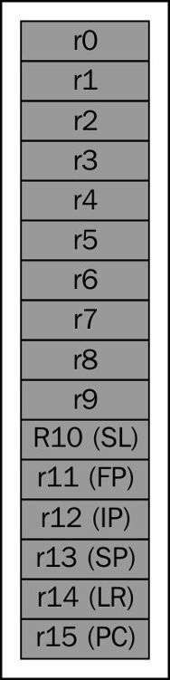
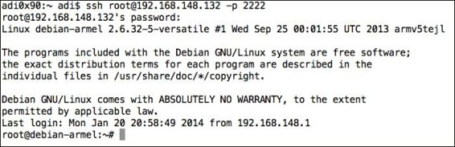
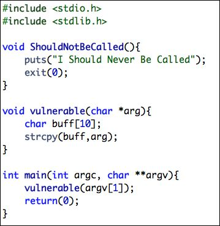
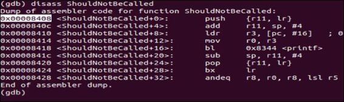
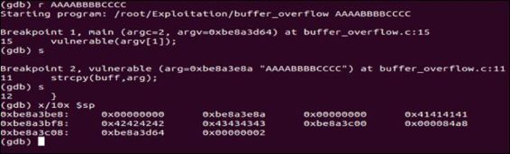
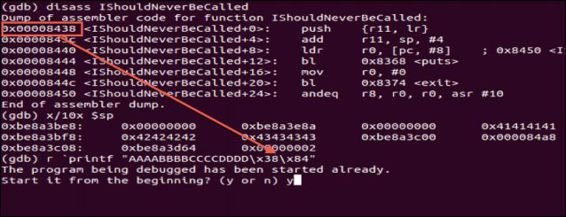
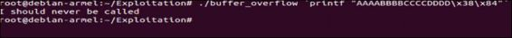
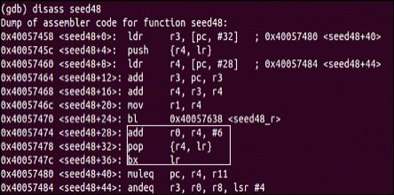

# 第八章 ARM 利用

> 作者：Aditya Gupta

> 译者：[飞龙](https://github.com/)

> 协议：[CC BY-NC-SA 4.0](http://creativecommons.org/licenses/by-nc-sa/4.0/)

在本章中，我们将了解 ARM 处理器的基础知识，和 ARM 世界中存在的不同类型的漏洞。 我们甚至会继续利用这些漏洞，以便对整个场景有个清晰地了解。 此外，我们将研究不同的 Android root 攻击和它们在漏洞利用中的基本漏洞。 考虑到目前大多数 Android 智能手机都使用基于 ARM 的处理器，对于渗透测试人员来说，了解 ARM 及其附带的安全风险至关重要。

## 8.1 ARM 架构导论

ARM 是基于精简指令集（RISC）的架构，这意味着其指令比基于复杂指令集（CISC）的机器少得多。 ARM 处理器几乎遍布我们周围的所有设备，如智能手机，电视，电子书阅读器和更多的嵌入式设备。

ARM 总共有 16 个可见的通用寄存器，为 R0-R15。 在这 16 个中，有 5 个用于特殊目的。 以下是这五个寄存器及其名称：

+ R11: 帧指针 (FP)
+ R12: 过程内寄存器 (IP)
+ R13: 栈指针 (SP)
+ R14: 链接寄存器 (LR)
+ R15: 程序计数器 (PC)

下面的图展示了 ARM 架构：



在五个里面，我们会特别专注于这三个，它们是：

+ 堆栈指针（SP）：这是保存指向堆栈顶部的指针的寄存器
+ 链接寄存器（LR）：当程序进入子过程时存储返回地址
+ 程序计数器（PC）：存储要执行的下一条指令

> 注意

> 这里要注意的一点是，PC 将总是指向要执行的指令，而不是简单地指向下一条指令。 这是由于被称为流水线的概念，指令按照以下顺序操作：提取，解码和执行。 为了控制程序流，我们需要控制 PC 或 LR 中的值（后者最终引导我们控制 PC）。

### 执行模式

ARM 有两种不同的执行模式：

+ ARM 模式：在 ARM 模式下，所有指令的大小为 32 位
+ Thumb 模式：在 Thumb 模式下，指令大部分为 16 位

执行模式由 CPSR 寄存器中的状态决定。 还存在第三模式，即 Thumb-2 模式，它仅仅是 ARM 模式和 Thumb 模式的混合。 我们在本章不会深入了解 ARM 和 Thumb 模式之间的区别，因为它超出了本书的范围。

## 8.2 建立环境

在开始利用 ARM 平台的漏洞之前，建议你建立环境。 即使 Android SDK 中的模拟器可以通过模拟 ARM 平台来运行，大多数智能手机也是基于 ARM 的，我们将通过配置 QEMU（它是一个开源硬件虚拟机和模拟器）开始 ARM 漏洞利用。

为了在 Android 模拟器/设备上执行以下所有步骤，我们需要下载 Android NDK 并使用 Android NDK 中提供的工具为 Android 平台编译我们的二进制文件。 但是，如果你使用 Mac 环境，安装 QEMU 相对容易，可以通过键入`brew install qemu`来完成。 现在让我们在 Ubuntu 系统上配置 QEMU。 遵循以下步骤：

1.  第一步是通过安装依赖来下载并安装 QEMU，如图所示：

    ```
    sudo apt-get build-dep qemu
    wget http://wiki.qemu-project.org/download/qemu-
    1.7.0.tar.bz2
    ```
    
2.  接下来，我们只需要配置QEMU，指定目标为 ARM，最后充分利用它。 因此，我们将简单地解压缩归档文件，访问该目录并执行以下命令：

    ```
    ./configure --target-list=arm-softmmu
    make && make install
    ```
    
3.  一旦QEMU成功安装，我们可以下载 ARM 平台的 Debian 镜像来进行利用练习。 所需下载列表位于`http://people.debian.org/~aurel32/qemu/armel/`。

4.  这里我们将下载格式为`qcow2`的磁盘映像，它是基于 QEMU 的操作系统映像格式，也就是我们的操作系统为`debian_squeeze_armel_standard.qcow2`。 内核文件应该是`vmlinuz-2.6.32-5-versatile`，RAM 磁盘文件应该是`initrd.img-2.6.32-versatile`。 一旦我们下载了所有必要的文件，我们可以通过执行以下命令来启动 QEMU 实例：

    ```
    qemu-system-arm -M versatilepb -kernel vmlinuz-2.6.32-5-
    versatile -initrd initrd.img-2.6.32-5-versatile -hda 
    debian_squeeze_armel_standard.qcow2 -append 
    "root=/dev/sda1" --redir tcp:2222::22 
    ```
    
5.  `redir`命令只是在登录远程系统时使用端口 2222 启用 ssh。
一旦配置完成，我们可以使用以下命令登录到 Debian 的 QEMU 实例：

    ```
    ssh root@[ip address of Qemu] -p 2222
    ```
    
6.  登录时会要求输入用户名和密码，默认凭据是`root:root`。一旦我们成功登录，我们将看到类似如下所示的屏幕截图：



## 8.3 基于栈的简单缓冲区溢出

简单来说，缓冲区是存储任何类型的数据的地方。 当缓冲区中的数据超过缓冲区本身的大小时，会发生溢出。 然后攻击者可以执行溢出攻击，来获得对程序的控制和执行恶意载荷。

让我们使用一个简单程序的例子，看看我们如何利用它。 在下面的截图中，我们有一个简单的程序，有三个函数：`weak`，`ShouldNotBeCalled`和`main`。 以下是我们试图利用的程序：



在整个程序运行期间，从不调用`ShouldNotBeCalled`函数。

漏洞函数简单地将参数复制到名为`buff`的缓冲区，大小为 10 字节。

一旦我们完成程序编写，我们可以使用`gcc`编译它，如下一个命令所示。 此外，我们将在这里禁用地址空间布局随机化（ASLR），只是为了使场景稍微简单一些。 ASLR 是由 OS 实现的安全技术，来防止攻击者有效地确定载荷的地址并执行恶意指令。 在 Android 中，ASLR 的实现始于 4.0。 你可以访问`http://www.duosecurity.com/blog/exploit-mitigations-in-android-jelly-bean-4-1`了解所有 Android 安全实施。

```
echo 0 > /proc/sys/kernel/randomize_va_space
gcc -g buffer_overflow.c -o buffer_overflow
```

接下来，我们可以简单将二进制文件加载到 GNU 调试器，简称 GDB，然后开始调试它，如下面的命令所示：

```
gdb -q buffer_overflow
```

现在我们可以使用`disass`命令来反汇编特定的函数，这里是`ShouldNotBeCalled`，如下面的截图所示：



正如我们在上面的截图中可以看到的，`ShouldNotBeCalled`函数从内存地址`0x00008408`开始。 如果我们查看`main`函数的反汇编，我们看到漏洞函数在`0x000084a4`被调用并在`0x000084a8`返回。 因此，由于程序进入漏洞函数并使用易受攻击的`strcpy`，函数不检查要复制的字符串的大小，并且如果我们能够在程序进入漏洞函数时控制子过程的 LR ，我们就能够控制整个程序流程。

这里的目标是估计何时 LR 被覆盖，然后放入`ShouldNotBeCalled`的地址，以便调用`ShouldNotBeCalled`函数。 让我们开始使用一个长参数运行程序，如下面的命令所示，看看会发生什么。 在此之前，我们还需要在漏洞函数和`strcpy`调用的地址设置断点。

```
b vulnerable 
b *<address of the strcpy call>
```

一旦我们设置了断点，我们可以使用参数`AAAABBBBCCCC`来运行我们的程序，看看它是如何被覆盖的。 我们注意到它在漏洞函数的调用处命中了第一个断点，之后在`strcpy`调用处命中了下一个断点。 一旦它到达断点，我们可以使用`x`命令分析堆栈，并指定来自 SP 的地址，如下面的截图所示：



我们可以看到，堆栈已经被我们输入的缓冲区覆盖（ASCII：41 代表 A，42 代表 B，等等）。 从上面的截图中，我们看到，我们仍然需要四个更多的字节来覆盖返回地址，在这种情况下是`0x000084a8`。

所以，最后的字符串是 16 字节的垃圾，然后是`ShouldNotBeCalled`的地址，如下面的命令所示：

```
r `printf "AAAABBBBCCCCDDDD\x38\x84"` 
```

我们可以在下面的截图中看到，我们已经将`IShouldNeverBeCalled`的起始地址添加到了参数中：



请注意，由于这里是小端结构，字节以相反的顺序写入。 一旦我们运行它，我们可以看到程序`ShouldNotBeCalled`函数被调用，如下面的截图所示：



## 8.4 返回导向编程

在大多数情况下，我们不需要调用程序本身中存在的另一个函数。 相反，我们需要在我们的攻击向量中放置 shellcode，这将执行我们在 shellcode 中指定的任何恶意操作。 但是，在大多数基于 ARM 平台的设备中，内存中的区域是不可执行的，这会阻止我们放置并执行 shellcode。

因此，攻击者必须依赖于所谓的返回导向编程（ROP），它是来自内存不同部分的指令片段的简单链接，最终它会执行我们的 shellcode。 这些片段也称为 ROP gadget。 为了链接 ROP gadget，我们需要找到存在跳转指令的 gadget，这将允许我们跳到另一个位置。

例如，如果我们在执行程序时反汇编`seed48()`，我们将注意到以下输出：



如果我们查看反汇编，我们将注意到它包含一个 ADD 指令，后面跟着一个 POP 和 BX 指令，这是一个完美的 ROP gadget。 这里，攻击者可能会想到，为了将其用作 ROP gadget，首先跳到控制 r4 的 POP 指令，然后将比`/bin/sh`的地址小 6 的值放入 r4 中，将 ADD 指令的值放入 LR 中。 因此，当我们跳回到 ADD 也就是`R0 = R4 + 6`时，我们就拥有了`/bin/sh`的地址，然后我们可以为 R4 指定任何垃圾地址并且为 LR 指定`system()`的地址。

这意味着我们将最终跳转到使用参数`/bin/sh`的`system()`，这将执行 shell。 以同样的方式，我们可以创建任何 ROP gadget，并使其执行我们所需要的任何东西。 由于 ROP 是开发中最复杂的主题之一，因此强烈建议你自己尝试，分析反汇编代码并构建漏洞。

## 8.5 Android root 利用

从早期版本的 Android 开始，Android root 漏洞开始出现于每个后续版本和不同的 Android 设备制造商的版本中。 Android root 简单来说是获得对设备的访问特权，默认情况下设备制造商不会将其授予用户。 这些 root 攻击利用了 Android 系统中存在的各种漏洞。 以下是其中一些的列表，带有漏洞利用所基于的思想：

+ Exploid：基于 udev 中的 CVE-2009-1185 漏洞，它是 Android 负责 USB 连接的组件，它验证 Netlink 消息（一种负责将 Linux 内核与用户连接的消息）是否源自原始来源或是由攻击者伪造。因此，攻击者可以简单地从用户空间本身发送 udev 消息并提升权限。
+ Gingerbreak：这是另一个漏洞，基于 vold 中存在的漏洞，类似于 Exploid 中的漏洞。
+ RageAgainstTheCage：此漏洞利用基于`RLIMIT_NPROC`，它指定在调用`setuid`函数时可为用户创建的进程的最大数目。 adb 守护程序以 root 身份启动;然后它使用`setuid()`调用来解除特权。但是，如果根据`RLIMIT_NPROC`达到了最大进程数，程序将无法调用`setuid()`来解除特权，adb 将继续以 root 身份运行。
+ Zimperlich：使用与 RageAgainstTheCage 的相同概念，但它依赖于 zygote 进程解除 root 权限。
+ KillingInTheNameOf：利用了一个称为`ashmem`（共享内存管理器）接口的漏洞，该漏洞用于更改`ro.secure`的值，该值确定设备的 root 状态。

这些是一些最知名的 Android 漏洞利用，用于 root Android 设备。

## 总结

在本章中，我们了解了 Android 利用和 ARM 利用的不同方式。 希望本章对于任何想要更深入地利用 ARM 的人来说，都是一个好的开始。

在下一章中，我们将了解如何编写 Android 渗透测试报告。
