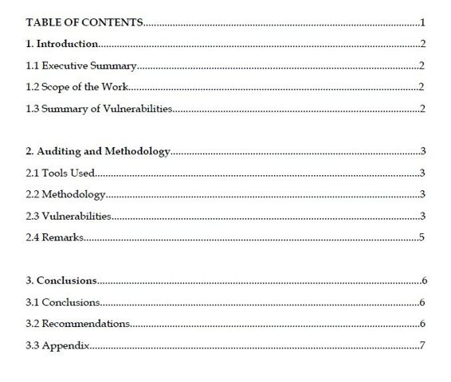

## 第九章 编写渗透测试报告

> 作者：Aditya Gupta

> 译者：[飞龙](https://github.com/)

> 协议：[CC BY-NC-SA 4.0](http://creativecommons.org/licenses/by-nc-sa/4.0/)

在本章中，我们将学习渗透测试的最终和最重要的方面，撰写报告。 这是一个简短的章节，指导你在报告中写下你的方法和发现。 作为渗透测试者，如果能够更好地解释和记录你的发现，渗透测试报告会更好。 对于大多数渗透测试者来说，这是渗透测试中最没意思的部分，但它也是最重要的渗透测试步骤之一，因为它作为“至关重要的材料”，使其他技术和管理人员容易理解 。

## 渗透测试报告基础

渗透测试报告是渗透测试过程中所有发现的摘要文档，包括但不限于所使用的方法，工作范围，假设，漏洞的严重程度等。 渗透测试报告仅用作渗透测试的完整文档，可用于消除已发现的漏洞并进一步参考。

## 编写渗透测试报告

为了理解如何编写渗透测试报告，最好对渗透测试报告中的一些重要部分有一个清晰的了解。

一些最重要的组成部分包括：

+ 执行摘要
+ 漏洞摘要
+ 工作范围
+ 使用的工具
+ 遵循的测试方法
+ 建议
+ 结论
+ 附录

除此之外，还应该有关于渗透测试，进行渗透测试的组织和客户，以及“非披露协议”的足够详细信息。 让我们一个一个地去看上面的每个部分，来快速查看它。

### 执行摘要

执行摘要是渗透测试的整个结果的快速演练。 执行摘要不需要太多技术，它只是一个总结，用于在尽可能短的时间内浏览渗透测试。 执行摘要是管理层和高管首先看到的。

它的一个例子如下：

XYZ 应用程序的渗透测试具有大量的开放输入验证缺陷，这可能导致攻击者访问敏感数据。

你还应该解释此漏洞对于该组织业务的严重程度。

### 漏洞

如标题所示，这应包括应用程序中发现的所有漏洞的摘要以及相关详细信息。 如果你在应用程序中找到的漏洞分配了 CVE 号码，你可以包括它。 你还应包括导致该漏洞的应用程序的技术详细信息。 另一种展示漏洞的好方法是对漏洞按照类别进行分类：低，中和高，然后在饼图或任何其他图形表示上展示它们。

### 工作范围

工作范围仅仅意味着渗透测试涵盖并评估了哪些应用程序和服务。 它可以简单地写成一行，如下：

> 该工作的范围仅限于 XYZ Android 和 iOS 应用程序，不包括任何服务端组件。

### 使用的工具

这是一个可选类别，通常可以包含在另一个类别中，也就是讨论漏洞发现和技术细节的地方。 在本节中，我们可以简单提到使用的不同工具及其特定版本。

### 遵循的测试方法

这个类别是最重要的类别之一，应该以详细方式编写。 这里，渗透测试者需要指定不同的技术，和他在渗透测试阶段所遵循的步骤。 它可以是简单的应用程序逆向，流量分析，使用不同的工具的库和二进制文件分析，等等。

此类别应指定其他人需要遵循的完整过程，以便完全理解和重现这些漏洞。

### 建议

此类别应指定要执行的不同任务，以便组织保护程序并修复漏洞。 这可能包括一些东西，类似建议以适当权限保存文件，加密发送网络流量以及正确使用 SSL 等。 它还应包括在考虑到组织的情况下，执行这些任务的正确方法。

### 结论

这个部分应该简单地总结渗透测试的总体结果，并且我们可以使用漏洞类型的概述，简单地说明应用程序是不安全的。 记住，我们不应该涉及所发现的不同漏洞的详细信息，因为我们已经在前面的章节中讨论过了。

### 附录

渗透测试报告的最后一部分应该是附录，或者一个快速参考，读者可以使用它快速浏览渗透测试的特定主题。

## 总结

在本章中，我们对渗透测试报告的不同部分进行了快速演练，渗透测试者需要了解这些部分才能编写报告。 本章的目的是在渗透测试的最后阶段，作为一个编写渗透测试报告的简洁指南。 此外，你可以在下一页找到渗透测试报告的示例。

对于渗透测试人员，和想入门 Android 安全的人来说，我希望这本书会成为一个伟大的工具。 本书中提到的工具和技术将帮助你入门 Android 安全。 祝你好运！

下面是渗透测试报告的示例：

## Attify 漏洞应用安全审计报告

应用程序版本：1.0

日期：2014年1月

作者：Aditya Gupta

摘要：2014年1月，Attify 实验室对 Android 平台的移动应用程序“Attify 漏洞应用”进行了安全评估。 本报告包含审计过程中的所有发现。 它还包含首先发现这些漏洞的过程，以及修复这些问题的方法。

### 目录

### 1. 引言

### 1.1 执行摘要

Attify Labs 受委托对 XYZ 公司的 Android 应用程序“Attify 漏洞应用”执行渗透测试。 此渗透测试和审计的目的是确定 Android 应用程序以及与其通信的 Web 服务的安全漏洞。

我们在测试期间十分小心，以确保在执行审计时不会对后端 Web 服务器造成损害。 该评估在 Aditya Gupta 的领导下进行，团队由三名内部渗透测试人员组成。

在审计期间，在 XYZ Android 应用程序和后端 Web 服务中发现了一些安全漏洞。 总的来说，我们发现系统是不安全的，并且具有来自攻击者的高威胁风险。

此次审计的结果将有助于 XYZ 公司使他们的 Android 应用程序和 Web 服务免受攻击者造成的安全威胁，这可能会损害声誉和收入。

### 2.2 工作范围

这里执行的渗透测试集中于 XYZ 公司的 Android 应用程序，名为“Attify 漏洞应用”。 渗透测试还包括 所有 Web 后端服务，Android 应用程序与之进行通信。

### 1.3 漏洞摘要

Android应用程序“Attify 漏洞应用”被发现存在漏洞，包括应用程序本身，以及由于在应用程序中使用第三方库的很多漏洞。我们已成功利用该库，使我们可以访问存储在设备上的整个应用程序的数据。

此外，在应用程序中找到的`webview`组件使应用程序容易受到 JavaScript 响应的操纵，使我们可以访问应用程序中的整个 JavaScript 界面​​。这最终允许我们利用不安全网络上的应用程序，导致应用程序行为控制，还允许我们在用户没有知晓的情况下安装更多应用程序，进行意外的拨号和发送短信等。

在应用程序中发现的其他漏洞包括不安全的文件存储，一旦设备已经 root，这使我们可以访问存储在应用程序中的敏感用户凭据。

此外，我们可以注意到，应用通信的 web 服务没有用于用户认证的适当安全措施，并且可以使用 SQL 认证绕过攻击来访问存储在 web 服务器上的敏感信息。

### 2. 审计与方法论

### 2.1 使用的工具

以下是用于整个应用程序审计和渗透测试流程的一些工具：

+ 测试平台：Ubuntu Linux Desktop v12.04
+ 设备：运行 Android v4.4.2 的 Nexus 4
+ Android SDK
+ APKTool 1.5.2：将 Android 应用程序反编译成 Smali 源文件
+ Dex2Jar 0.0.9.15.48：将 Android 应用程序源反编译为 Java
+ JD-GUI 0.3.3：读取 Java 源文件
+ Burp Proxy 1.5：代理工具
+ Drozer 2.3.3：Android 应用程序评估框架
+ NMAP 6.40：扫描 Web 服务

### 2.2 漏洞

问题#1：Android 应用程序中的注入漏洞

说明：在 Android 应用程序的`DatabaseConnector.java`文件中发现了一个注入漏洞。参数`account_id`和`account_name`被传递到应用程序中的 SQLite 查询中，使其易于遭受 SQLite 注入。

风险级别：严重

修复：在传递到数据库命令之前，应正确校验用户输入。

问题#2：`WebView`组件中的漏洞

说明：`WebDisplay.java`文件中指定的 Android 应用程序中的`WebView`组件允许执行 JavaScript。攻击者可以拦截不安全网络上的流量，创建自定义响应，并控制应用程序。

风险等级：高

补救：如果应用程序中不需要 JavaScript，请将`setJavascriptEnabled`设置为`False`。

问题#3：无/弱加密

说明：Android应用程序将认证凭据存储在名为`prefs.db`的文件中，该文件存储在设备上的应用程序文件夹中，即`/data/data/com.vuln.attify/databases/prefs.db`。通过 root 权限，我们能够成功地查看存储在文件中的用户凭据。身份验证凭据以 Base64 编码存储在文件中。

风险等级：高

补救：如果认证证书必须存储在本地，则应使用适当的安全加密存储。

问题#4：易受攻击的内容供应器

说明：发现 Android 应用程序的内容供应器已导出，这使得它也可以由设备上存在的任何其他应用程序使用。内容供应器是`content://com.vuln.attify/mycontentprovider`。

风险等级：高

补救：使用`exported = false`，或在`AndroidManifest.xml`中指定内容供应器的权限。

### 3. 结论

### 3.1 结论

我们发现该应用程序整体上存在漏洞，拥有内容供应器，SQLite 数据库和数据存储技术相关的漏洞。

### 3.2 建议

我们发现该应用程序容易受到一些严重和高危漏洞的攻击。 付诸一些精力和安全的编码实践，所有的漏洞都可以成功修复。

为了维持应用程序的安全，需要定期进行安全审计，来在每次主要升级之前评估应用程序的安全性。
