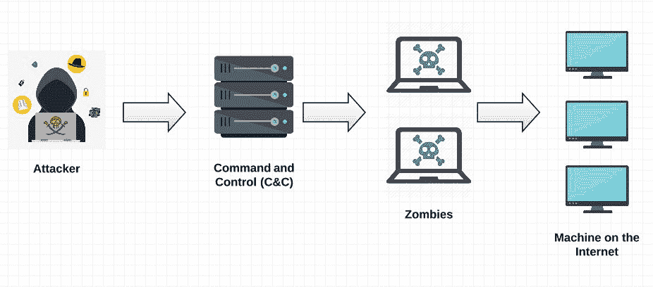
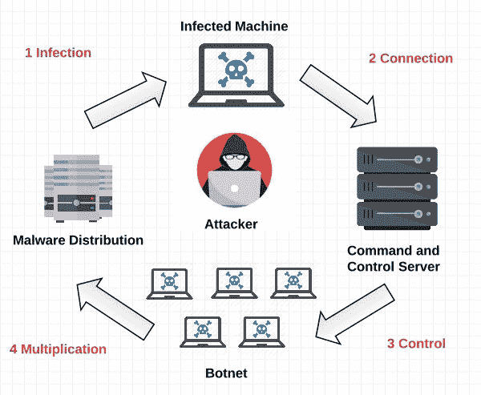
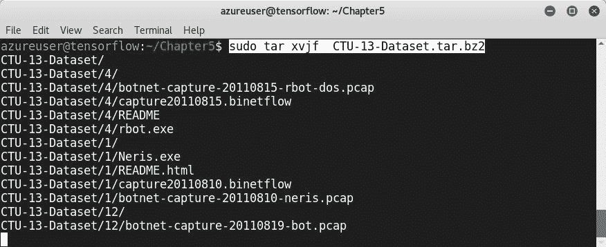
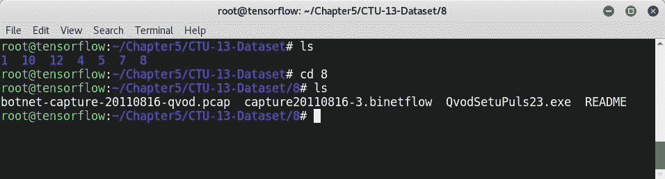
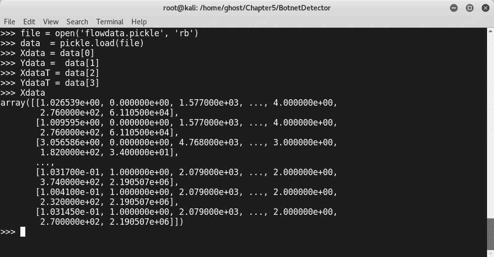
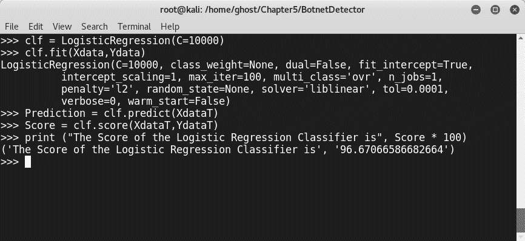
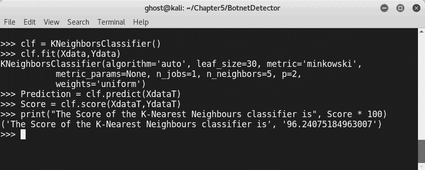
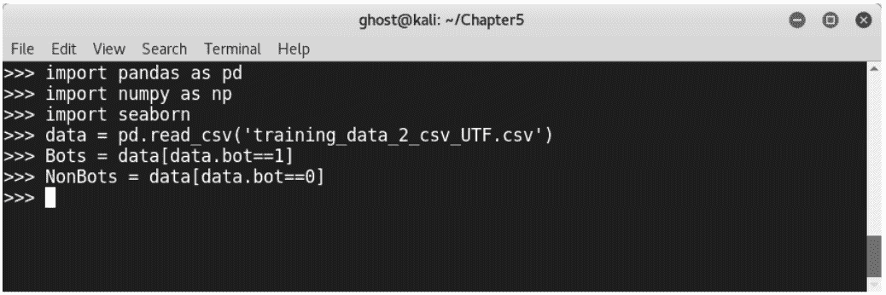
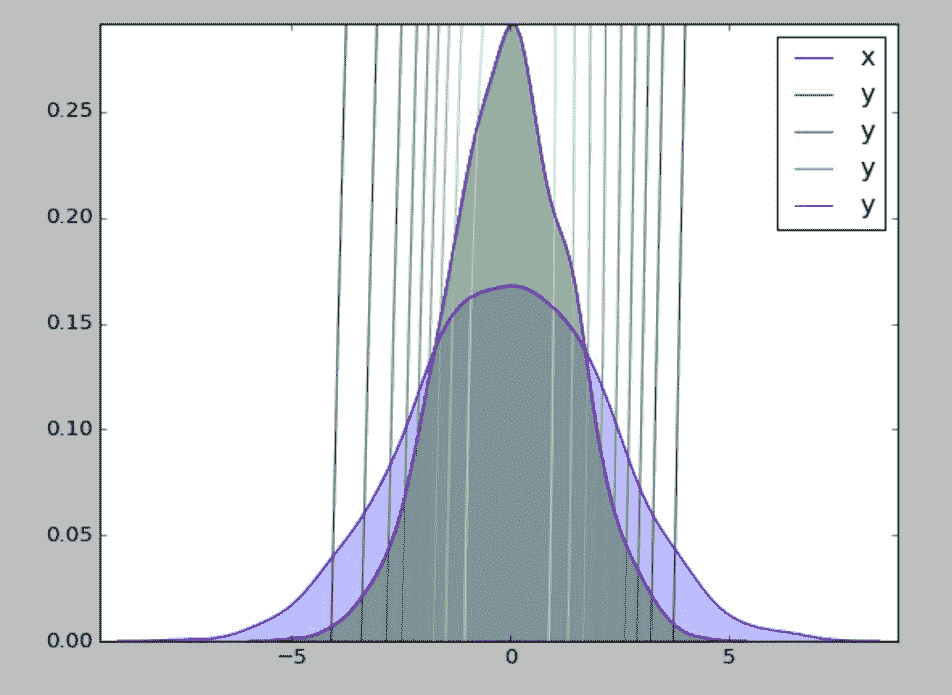
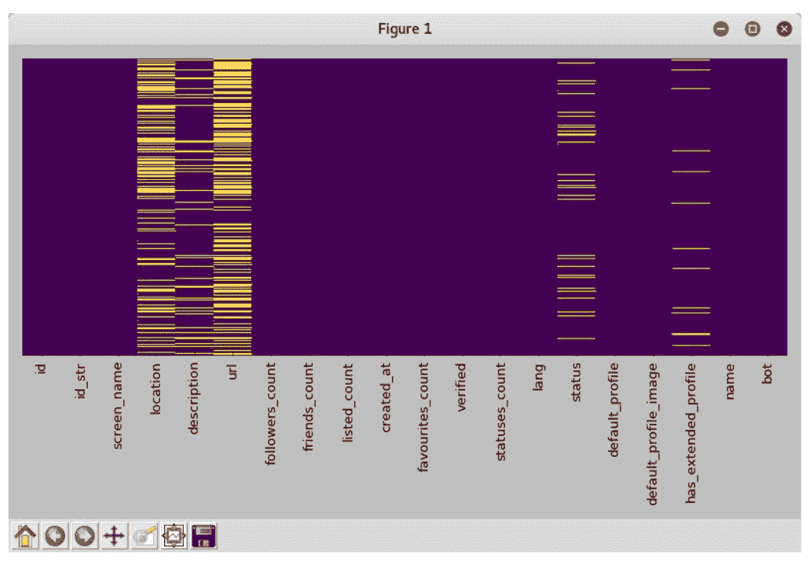

# 五、基于机器学习的僵尸网络检测

如今，互联设备在现代生活中扮演着重要的角色。从智能家电、电脑、咖啡机和照相机，到联网汽车，我们生活方式的巨大转变让我们的生活变得更加轻松。不幸的是，这些暴露的设备可能会受到攻击者和网络罪犯的攻击和访问，他们以后可能会利用这些设备进行更大规模的攻击。安全供应商提供了许多针对僵尸网络的解决方案和产品，但在本章中，正如我们在前几章中所做的那样，我们将学习如何使用 Python 和机器学习技术构建新型僵尸网络检测系统。

在本章中，我们将看到：

*   僵尸网络概述
*   如何用不同的机器学习算法构建僵尸网络检测器
*   如何构建 Twitter 机器人检测器

# 技术要求

您将在以下存储库中找到讨论的所有代码，以及一些其他有用的脚本：[https://github.com/PacktPublishing/Mastering-Machine-Learning-for-Penetration-Testing/tree/master/Chapter5](https://github.com/PacktPublishing/Mastering-Machine-Learning-for-Penetration-Testing/tree/master/Chapter5) 。

# 僵尸网络概述

僵尸网络是两个术语**bot**和**net**的组合。机器人部分代表了这样一个事实，即该恶意软件可以像机器人一样自动执行事情和任务。第二部分指的是一个网络，换句话说，是一个由受损设备组成的网络。因此，根据定义，僵尸网络是一种恶意软件，它攻击互联网上的计算机，并通过命令和控制服务器控制计算机执行各种自动化任务，包括发送垃圾邮件和执行**分布式拒绝服务**（**DDoS**攻击。被攻击的机器加入了一个巨大的受损机器网络。前几年最著名的僵尸网络之一是*Mirai 僵尸网络*。Mirai 在日语中的意思是未来。该僵尸网络通过扫描和识别易受攻击的机器，利用大多数机器都是使用默认登录凭据访问的事实，袭击了数百万在线设备，尤其是**物联网**（**物联网**）设备。僵尸网络执行的一些任务包括：

*   广告欺诈和发送垃圾邮件
*   加密货币挖掘
*   窃取个人资料及敏感资料
*   执行 DDoS 攻击
*   执行暴力攻击

下图描述了僵尸网络生态系统的不同参与者：



黑客是一项方法学任务。罪犯和网络攻击者通常使用相同的定义步骤。由于您是渗透测试人员和信息安全专业人员，您知道黑客攻击阶段，即信息收集，或我们称之为侦察；扫描；获取访问权；保持通道；最后清理痕迹。因此，僵尸网络通常遵循一些定义的步骤。僵尸网络基于四个不同的阶段工作：

*   **感染**：在此阶段，攻击者通过发送恶意软件感染目标机器。
*   **连接**：在此阶段，僵尸网络启动与控制和命令服务器的互联网连接，以接收命令和自动任务。
*   **控制**：此阶段发生攻击，例如发送垃圾邮件。
*   **乘法**：在这个阶段，僵尸网络将尝试妥协更多的机器加入网络，成为我们所称的**僵尸**：



# 利用多种机器学习技术建立僵尸网络检测器模型

在本节中，我们将学习如何使用许多机器学习算法构建不同的僵尸网络检测系统。作为第一个实际实验室的开始，让我们首先使用不同的分类器构建一个基于机器学习的僵尸网络检测器。到目前为止，我希望您已经清楚地了解了构建机器学习系统的主要步骤。所以，我相信你们已经知道，作为第一步，我们需要寻找一个数据集。许多教育机构和组织都获得了一套从内部实验室收集的数据集。最著名的僵尸网络数据集之一称为**CTU-13**数据集。这是一个带有僵尸网络、普通和背景流量的标记数据集，由捷克共和国 CTU 大学提供。在他们的工作中，他们试图捕获真实的僵尸网络流量，并将其与正常流量和背景流量混合。要下载数据集并查看更多信息，您可以访问以下链接：[https://mcfp.weebly.com/the-ctu-13-dataset-a-labeled-dataset-with-botnet-normal-and-background-traffic.html](https://mcfp.weebly.com/the-ctu-13-dataset-a-labeled-dataset-with-botnet-normal-and-background-traffic.html) 。

数据集是双向 NetFlow 文件。但什么是双向 NetFlow 文件？Netflow 是由 Cisco 开发的互联网协议。该协议的目标是收集 IP 流量信息并监控网络流量，以便更清楚地了解网络流量。NetFlow 架构的主要组件是**NetFlow Exporter**、**NetFlow collector**和**流存储**。下图说明了 NetFlow 基础结构的不同组件：


一般来说，当主机 A 向**主机 B**发送信息，并从**主机 B**向**主机 A**发送信息作为应答时，该操作称为单向 NetFlow。发送和回复被视为不同的操作。在双向 NetFlow 中，我们考虑了来自 To.T6 的流。让我们使用以下命令下载数据集：

```py
$ wget --no-check-certificate https://mcfp.felk.cvut.cz/publicDatasets/CTU-13-Dataset/CTU-13-Dataset.tar.bz2
```


使用以下命令提取下载的`tar.bz2`文件：

```py
# tar xvjf  CTU-13-Dataset.tar.bz2
```



该文件包含具有不同场景的所有数据集。对于演示，我们将使用数据集 8（场景 8）。您可以选择任何场景，也可以使用您自己收集的数据，或其他机构交付的任何其他`.binetflow`文件：



像往常一样使用熊猫加载数据：

```py
>>> import pandas as pd
>>> data = pd.read_csv("capture20110816-3.binetflow")
>>> data['Label'] = data.Label.str.contains("Botnet")
```

在任何以数据为中心的项目中，探索数据都是必不可少的。例如，可以从检查要素或列的名称开始：

```py
>> data.columns
```

该命令生成数据集的列：`StartTime`、`Dur`、`Proto`、`SrcAddr`、`Sport`、`Dir`、`DstAddr`、`Dport`、`State`、`sTos`、`dTos`、`TotPkts`、`TotBytes`、`SrcBytes`和`Label`。列表示数据集中使用的特征；例如，`Dur`表示持续时间，`Sport`表示源端口，等等。您可以在本章的 GitHub 存储库中找到完整的功能列表。

在训练模型之前，我们需要构建一些脚本来准备数据。这一次，我们将构建一个单独的 Python 脚本来准备数据，稍后我们可以将其导入主脚本。

我将调用第一个脚本`DataPreparation.py`。有许多建议可以帮助提取特征并准备数据，以使用机器学习构建僵尸网络检测器。在我们的例子中，我根据*NagabhushanS*构建的数据加载脚本定制了两个新脚本：

```py
from __future__ import division
import os, sys
import threading
```

导入所需的 Python 包后，我们创建了一个名为`Prepare`的类来选择培训和测试数据：

```py
class Prepare(threading.Thread): 
def __init__(self, X, Y, XT, YT, accLabel=None):
 threading.Thread.__init__(self)
 self.X = X
 self.Y = Y
 self.XT=XT
 self.YT=YT
 self.accLabel= accLabel

def run(self):
 X = np.zeros(self.X.shape)
 Y = np.zeros(self.Y.shape)
 XT = np.zeros(self.XT.shape)
 YT = np.zeros(self.YT.shape)
 np.copyto(X, self.X)
 np.copyto(Y, self.Y)
 np.copyto(XT, self.XT)
 np.copyto(YT, self.YT)
 for i in range(9):
 X[:, i] = (X[:, i] - X[:, i].mean()) / (X[:, i].std())
 for i in range(9):
 XT[:, i] = (XT[:, i] - XT[:, i].mean()) / (XT[:, i].std())
```

第二个脚本名为`LoadData.py`。您可以在 GitHub 上找到它，并直接在项目中使用它从`.binetflow`文件加载数据并生成`pickle`文件。

让我们使用之前开发的内容来训练模型。在构建数据加载器并准备好我们将要使用的机器学习算法之后，是时候训练和测试模型了。

首先，从`pickle`文件加载数据，这就是我们需要导入`pickle`Python 库的原因。不要忘记使用以下方法导入以前的脚本：

```py
import LoadData
import DataPreparation
import pickle
file = open('flowdata.pickle', 'rb')
data  = pickle.load(file)
```

选择数据部分：

```py
Xdata = data[0]
Ydata =  data[1]
XdataT = data[2]
YdataT = data[3]
```



作为机器学习分类器，我们将尝试许多不同的算法，以便稍后为我们的模型选择最佳算法。从`sklearn`导入所需模块以使用四种机器学习算法：

```py
from sklearn.linear_model import *
from sklearn.tree import *
from sklearn.naive_bayes import *
from sklearn.neighbors import *
```

使用前面的模块构建准备数据。别忘了输入`import DataPreparation`导入`DataPreparation`：

```py
>>> DataPreparation.Prepare(Xdata,Ydata,XdataT,YdataT)
```

现在，我们可以训练模型；为了做到这一点，我们将用不同的技术来训练模型，以便以后我们可以为我们的项目选择最合适的机器学习技术。这些步骤与我们在以前的项目中所学到的一样：在准备数据和选择特征后，定义机器学习算法，拟合模型，并在定义其变量后打印出分数。

作为机器学习分类器，我们将测试其中的许多分类器。让我们从一个决策树开始：

*   **决策树模型**：

```py
>>> clf = DecisionTreeClassifier()
>>> clf.fit(Xdata,Ydata)
>>> Prediction = clf.predict(XdataT)
>>> Score = clf.score(XdataT,YdataT)
>>> print (“The Score of the Decision Tree Classifier is”, Score * 100)
```


决策树分类器的得分为 99%

*   **逻辑回归模型**：

```py
>>> clf = LogisticRegression(C=10000)
>>> clf.fit(Xdata,Ydata)
>>> Prediction = clf.predict(XdataT) >>> Score = clf.score(XdataT,YdataT)
```

```py
>>> print ("The Score of the Logistic Regression Classifier is", Score * 100)
```



逻辑回归分类器的得分为 96%

*   **高斯朴素贝叶斯模型**：

```py
>>> clf = GaussianNB()
>>> clf.fit(Xdata,Ydata)
>>> Prediction = clf.predict(XdataT)
>>> Score = clf.score(XdataT,YdataT)
>>> print("The Score of the Gaussian Naive Bayes classifier is", Score * 100)
```


高斯朴素贝叶斯分类器的得分为 72%

*   **k-最近邻模型**：

```py
>>> clf = KNeighborsClassifier()
>>> clf.fit(Xdata,Ydata)
>>> Prediction = clf.predict(XdataT)
>>> Score = clf.score(XdataT,YdataT)
>>> print("The Score of the K-Nearest Neighbours classifier is", Score * 100)
```



k-最近邻分类器的得分为 96%

*   **神经网络模型**：

要构建神经网络模型，请使用以下代码：

```py
>>> from keras.models import *
>>> from keras.layers import Dense, Activation
>>> from keras.optimizers import *

model = Sequential()
model.add(Dense(10, input_dim=9, activation="sigmoid")) model.add(Dense(10, activation='sigmoid'))
model.add(Dense(1))
sgd = SGD(lr=0.01, decay=0.000001, momentum=0.9, nesterov=True) 
model.compile(optimizer=sgd, loss='mse')
model.fit(Xdata, Ydata, nb_epoch=200, batch_size=100)
Score = model.evaluate(XdataT, YdataT, verbose=0)
Print(“The Score of the Neural Network is”, Score * 100  )
```

有了这段代码，我们导入了所需的 Keras 模块，构建了层，用 SGD 优化器编译了模型，拟合了模型，并打印出了模型的分数。

# 如何构建 Twitter 机器人检测器

在前面的部分中，我们看到了如何构建基于机器学习的僵尸网络检测器。在这个新项目中，我们将处理一个不同的问题，而不是防御僵尸网络恶意软件。我们将检测 Twitter 机器人，因为它们也很危险，可以执行恶意操作。对于模型，我们将使用*纽约大学坦顿分校 2017 年春季机器学习竞赛：Twitter 机器人分类*数据集。您可以从以下链接下载：[https://www.kaggle.com/c/twitter-bot-classification/data](https://www.kaggle.com/c/twitter-bot-classification/data) 。导入所需的 Python 包：

```py
>>> import pandas as pd
>>> import numpy as np
>>> import seaborn
```

让我们使用 pandas 加载数据，并突出显示 bot 和非 bot 数据：

```py
>>> data = pd.read_csv('training_data_2_csv_UTF.csv')
>>> Bots = data[data.bot==1]
>> NonBots = data[data.bot==0]
```



# seaborn 可视化

在每个项目中，我都想帮助您发现新的数据可视化 Python 库，因为正如您所看到的，数据工程和可视化对于每个现代以数据为中心的项目都是必不可少的。这一次，我选择 seaborn 将数据可视化，并在开始培训阶段之前对其进行探索。Seaborn 是一个用于进行统计可视化的 Python 库。以下是使用 seaborn 生成绘图的示例：

```py
>>> data = np.random.multivariate_normal([0, 0], [[5, 2], [2, 2]], size=2000)
>>> data = pd.DataFrame(data, columns=['x', 'y'])
>>> for col in 'xy':
... seaborn.kdeplot(data[col], shade=True)
```



例如，在我们的案例中，如果我们想要识别缺失的数据：

```py
matplotlib.pyplot.figure(figsize=(10,6))
 seaborn.heatmap(data.isnull(), yticklabels=False, cbar=False, cmap='viridis')
 matplotlib.pyplot.tight_layout()
```



前两段代码片段是学习如何可视化数据的一些示例。可视化有助于数据科学家探索和了解更多数据。现在，让我们返回并继续构建我们的模型。

通过选择 Twitter 机器人使用的一些不好的词来识别这些词。下面是一个机器人使用脏话的例子。当然，您可以添加更多单词：

```py
bag_of_words_bot = r'bot|b0t|cannabis|tweet me|mishear|follow me|updates every|gorilla|yes_ofc|forget' \
r'expos|kill|bbb|truthe|fake|anony|free|virus|funky|RNA|jargon' \                 r'nerd|swag|jack|chick|prison|paper|pokem|xx|freak|ffd|dunia|clone|genie|bbb' \                r'ffd|onlyman|emoji|joke|troll|droop|free|every|wow|cheese|yeah|bio|magic|wizard|face'
```

*   现在，是确定培训功能的时候了：

```py
data['screen_name_binary'] = data.screen_name.str.contains(bag_of_words_bot, case=False, na=False)
data['name_binary'] = data.name.str.contains(bag_of_words_bot, case=False, na=False)
data['description_binary'] = data.description.str.contains(bag_of_words_bot, case=False, na=False)
data['status_binary'] = data.status.str.contains(bag_of_words_bot, case=False, na=False)
```

*   特征提取：我们选择`features`用于我们的模型：

```py
data['listed_count_binary'] = (data.listed_count>20000)==False
 features = ['screen_name_binary', 'name_binary', 'description_binary', 'status_binary', 'verified', 'followers_count', 'friends_count', 'statuses_count', 'listed_count_binary', 'bot']
```

*   现在，使用决策树分类器训练模型：

```py
from sklearn.tree import DecisionTreeClassifier
from sklearn.metrics import accuracy_score, roc_curve, auc
from sklearn.model_selection import train_test_split
```

*   我们导入了前面讨论的一些模块：

```py
 X = data[features].iloc[:,:-1]
 y = data[features].iloc[:,-1]
```

*   我们定义分类器：

```py
clf = DecisionTreeClassifier(criterion='entropy', min_samples_leaf=50, min_samples_split=10)
```

*   我们拆分分类器：

```py
X_train, X_test, y_train, y_test = train_test_split(X, y, test_size=0.3, random_state=101)
```

*   我们符合以下模型：

```py
clf.fit(X_train, y_train)
y_pred_train = clf.predict(X_train)
y_pred_test = clf.predict(X_test)
```

*   我们打印出准确度分数：

```py
print("Training Accuracy: %.5f" %accuracy_score(y_train, y_pred_train))
print("Test Accuracy: %.5f" %accuracy_score(y_test, y_pred_test))
```

我们的模型以 88%的检测率检测 Twitter 机器人，这是一个很好的准确率。

这种技术不是检测僵尸网络的唯一可能的方法。研究人员基于不同的机器学习算法提出了许多其他模型，如线性支持向量机和决策树。所有这些技术的准确率为 90%。大多数研究表明，特征工程是改进机器学习模型的关键因素。

为了研究一个真实的案例，请阅读一篇名为*我们从学习中学到的东西——理解僵尸网络攻击中机器学习的能力和局限性*（[https://arxiv.org/pdf/1805.01333.pdf](https://arxiv.org/pdf/1805.01333.pdf) ），由 David Santana、Shan Suthaharan 和 Somya Mohanty 主持。

# 总结

本章是学习僵尸网络基础知识以及如何使用不同技术构建基于机器学习的检测器的轻量级指南。此外，我们还讨论了如何识别 Twitter 机器人。下一章将深入探讨异常，以及如何构建许多项目来使用新方法识别异常。

# 问题

正如我们在每一章之后所做的那样，我们将为您提供实践所学知识和评估技能的机会。本章的 GitHub 存储库包含指向`Practice`文件夹中僵尸网络流量数据集的链接：

1.  下载数据集并将其与 pandas 库一起加载
2.  选择合适的功能
3.  识别训练集和测试集，然后将它们导出到 pickle 文件中
4.  加载 pickle 文件
5.  导入支持向量机分类器并拟合模型
6.  训练支持向量机模型
7.  打印出所构建模型的准确性

# 进一步阅读

要了解有关僵尸网络的更多信息以及如何使用机器学习检测僵尸网络，我强烈建议您查看以下有用的外部链接：

*   **僵尸网络如何扩张以及如何防范它们：**[https://bitninja.io/blog/2016/01/11/how-botnets-expand-and-how-protect-against-them](https://bitninja.io/blog/2016/01/11/how-botnets-expand-and-how-protect-against-them)
*   **僵尸网络基础-不要变成僵尸！**：[https://blog.trendmicro.com/botnet-basics/](https://blog.trendmicro.com/botnet-basics/)
*   **机器人检测的深度神经网络**：[https://arxiv.org/abs/1802.04289](https://arxiv.org/abs/1802.04289)
*   **使用深度自动编码器基于网络检测物联网僵尸网络攻击（N-BaIoT）**：[https://arxiv.org/abs/1805.03409](https://arxiv.org/abs/1805.03409)

*   **一种用于传感器网络**（[中入侵检测的混合谱聚类和深度神经网络集成算法 http://www.covert.io/research-papers/deep-learning-security/A%20Hybrid%20Spectral%20Clustering%20and%20Deep%20Neural%20Network%20Ensemble%20Algorithm%20for%20Intrusion%20Detection%20in%20Sensor%20Networks.pdf](http://www.covert.io/research-papers/deep-learning-security/A%20Hybrid%20Spectral%20Clustering%20and%20Deep%20Neural%20Network%20Ensemble%20Algorithm%20for%20Intrusion%20Detection%20in%20Sensor%20Networks.pdf)
*   **僵尸网络检测行为的递归神经网络分析**（[http://www.covert.io/research-papers/deep-learning-security/An%20Analysis%20of%20Recurrent%20Neural%20Networks%20for%20Botnet%20Detection%20Behavior.pdf](http://www.covert.io/research-papers/deep-learning-security/An%20Analysis%20of%20Recurrent%20Neural%20Networks%20for%20Botnet%20Detection%20Behavior.pdf)