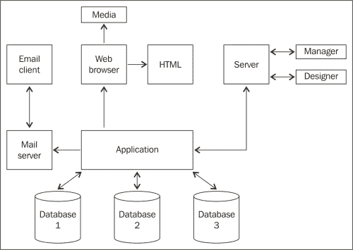

# 十、报告

啊!！我们终于在*第 10 章*见面了。祝贺你写到了书的结尾。但在我们庆祝之前，我们有一个最重要的部分，我们的无线渗透测试涵盖。

在最后一章中，我们将：

*   规划无线渗透测试报告
*   编写无线渗透测试报告
*   提供完整详细的报告，包括漏洞信息

# 规划报告

在我们开始写报告之前，我们必须把大部分时间花在计划报告上。这说起来容易做起来难。报告必须以专业的方式进行，不得仓促进行。如果报告没有得到适当的规划，您就有可能浪费宝贵的时间，并且生成一份不符合您目标的报告。

以下是规划报告的有效示例：

1.  确定问题的性质和渗透测试的目的：

    *   测试的是什么？
    *   什么是未测试的？
    *   您将使用什么方法进行渗透测试？

2.  在联系人中确定您的客户：

    *   是公司总裁吗？
    *   是高管吗？
    *   是 it 经理吗？

3.  规划无线渗透测试：

    *   我们渗透测试的对象是谁？
    *   是否有**数据丢失预防**（**DLP**）或安全系统是否受损？
    *   您是否通过终端执行过任何命令？
    *   您使用过 Kali Linux 操作系统吗？
    *   您使用了什么工具？

4.  收集信息：

    *   您发现了哪些漏洞？
    *   您是否与可用的 CVE 进行了比较？
    *   您是否发现任何弱密码登录？
    *   销售台下面有隐藏的无线路由器吗？

5.  组织信息：

    *   您是否列出了所有来源？
    *   你忘了添加什么吗？

6.  评估信息：

    *   您收集的信息是否足够？
    *   您是否仔细检查了您的工作？
    *   您是否强调了最关键的信息？

7.  准备一个提纲：

    *   你把一切都安排好了吗？
    *   您是否提供了漏洞解决方案？

最后，在计划一份报告时，花点时间仔细地计划好所有细节。当我说非常详细时，我指的是很多细节。你肯定不想遗漏你所做的任何工作，尤其是对于一个商业客户。

客户会想知道你从头到尾都做了些什么，即使只是为了确保某人没有主持蜜罐，你去了每一个隔间和办公室。规划过程不容忽视。这有助于了解您是否遗漏或忘记在报告中添加内容。你不想做的是未完成就交报告。

# 写报告

准备好大纲了吗？伟大的让我们开始编写我们的无线渗透测试报告。我将提供一个示例，供您参考。

## 导言

本渗透测试报告代表 Packt 发布针对无线基础设施的无线渗透测试结果。客户完全了解正在进行的渗透测试。IT 和/或信息安全专业人员可阅读技术细节。本报告将从提供渗透测试报告的传统方法开始，首先收集信息，起草报告，然后完成报告。

flazingo_ 照片，知识共享 2.0（[https://www.flickr.com/photos/124247024@N07/13903385550/](https://www.flickr.com/photos/124247024@N07/13903385550/)

为了全面进行无线渗透测试，我们将使用 Kali Linux 操作系统。

## 观众

无线渗透测试可能针对一大群人。该报告将对软件和硬件的不同领域提供结构化的支持。此报告将针对以下用户：

*   信息安全经理
*   首席信息安全干事
*   资讯科技经理
*   其他技术人员

由于渗透测试将包含敏感信息，如 IP 地址和服务器信息、一些应用程序信息、漏洞、威胁、漏洞等，因此应将其视为*绝密*，报告必须进行相应处理。

## 收集信息

渗透测试需要使用多个工具、计算机等。渗透测试人员需要确保收集所有系统和工具的所有信息。渗透测试人员将记录、捕获屏幕截图、系统、软件和网络日志。

## 目标

为组织提供一个目标，以及在了解与目标系统、应用程序或网络的渗透测试相关的安全风险后，他们将获得什么。需要提及渗透测试目标以及如何实现它。

## 假设

渗透测试期间的任何假设都将有助于观众理解为什么渗透测试针对该目标。因此，该假设有助于扩大组织的安全性：

## 时间条目

时间条目将为您提供渗透测试的开始和结束日期和时间。这将为受众提供渗透测试执行时间的实时信息。持续时间在这里非常重要。时间条目将向客户机提供进程执行和收集信息所需的时间。

Cea，知识共享 2.0（[https://www.flickr.com/photos/centralasian/3276306508/](https://www.flickr.com/photos/centralasian/3276306508/) ）

### 信息概述

这将提供基于优先级的已发现安全风险的数量。任何关键的安全风险都应突出显示，以便受众充分意识到这些风险。还应列出建议，以便受众能够决定新的解决方案。

史蒂夫 p2008，知识共享 2.0（[https://www.flickr.com/photos/stevepj2009/6857101082/](https://www.flickr.com/photos/stevepj2009/6857101082/) ）

### 详细信息

提供的所有信息都应该通过威胁级别、漏洞等级以及它对业务的影响来进行最好的描述。威胁等级可以通过威胁的结果来确定。该威胁是否授予攻击者管理权限或根权限？它是否创建了系统的后门？

Nessus 漏洞扫描程序还将为您提供以颜色表示的威胁级别。红色具有最高的威胁等级，需要立即注意。添加任何表格、图表、饼图或图表都可以为观众提供良好的视觉效果，从而更好地理解结果。

### 漏洞

任何检测到的漏洞都必须清楚地详细描述，以反映漏洞的内容、来源、影响和风险。应为所有漏洞提供解决方案。

乔·白金汉，知识共享 2.0（[https://www.flickr.com/photos/oufoufsworld/4307457572/](https://www.flickr.com/photos/oufoufsworld/4307457572/) ）

### 影响、可能性和风险

漏洞检测对业务有什么影响？该漏洞是否具有足够的危险性足以泄漏敏感的公司信息或可能导致生产网络停机？影响完全取决于威胁级别和威胁的恶意程度。该业务被利用的可能性有多大？该公司是否有可能攻击网络的竞争对手或已知目标？访问的易用性、访问级别、发现漏洞和利用漏洞的难度以及业务的价值资产是什么？是否有可能导致 HIPAA 违规的客户信息或数据？

### 建议

根据风险评级和漏洞，渗透测试人员应提供专业建议和备选方案。例如，如果企业使用弱身份验证协议通过互联网验证客户数据库的用户帐户，则渗透测试人员应提供额外信息以进一步保护该弱身份。

Oldmaison，知识共享 2.0（[https://www.flickr.com/photos/httpoldmaisonblogspotcom/221227905/](https://www.flickr.com/photos/httpoldmaisonblogspotcom/221227905/) ）

### 参考文献

参考文献对您的报告至关重要。提交参考资料时，您必须提供作者提供的所有工作的详细信息，这些工作是由您的工作和渗透测试生成的，包括以下内容：

*   作者姓名
*   出版日期
*   书名
*   出版商
*   宣传

参考文献应按作者姓名的字母顺序列出，并且必须准确、全面。

### 来源

如果您在渗透测试期间使用了任何网站进行研究，请列出所有网站。客户会想知道您是否花了任何时间研究这些漏洞以及如何解决它们。

# 完成报告

这一部分很容易解释，但需要涵盖。在结束你的报告时，*三次检查*你的工作。在某些情况下，您没有人可以查看您的报告，因此您需要为此过程做好准备。报告必须无错误，渗透测试的任何内容不得遗漏在报告中。如果有些地方看起来不对劲，请参考您的笔记和您在时间拍摄的屏幕截图。

# 总结

为了总结本章内容，我们介绍了编写报告的计划过程以及自始至终编写报告的过程。写一份报告有时会很艰难，但一旦你掌握了窍门，你就会像专业人士一样写报告。

作为作者，我的工作是为我的读者提供最好的阅读体验。这是我写的第一本技术书籍。所以，现在轮到你了！你觉得这本书怎么样？你学到的比你预期的要多吗？是不是太难理解？它没有提供足够的实际演示吗？你觉得我忘了提什么吗？欢迎访问 Packt Publishing 的网站[www.packtpub.com](http://www.packtpub.com)联系我。另一边见！