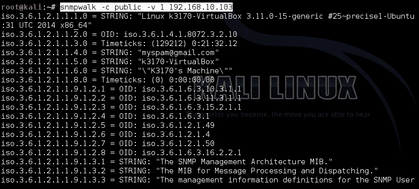
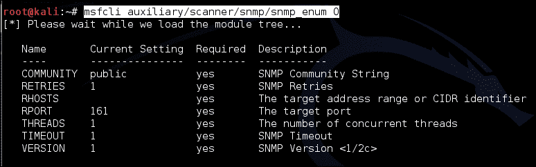
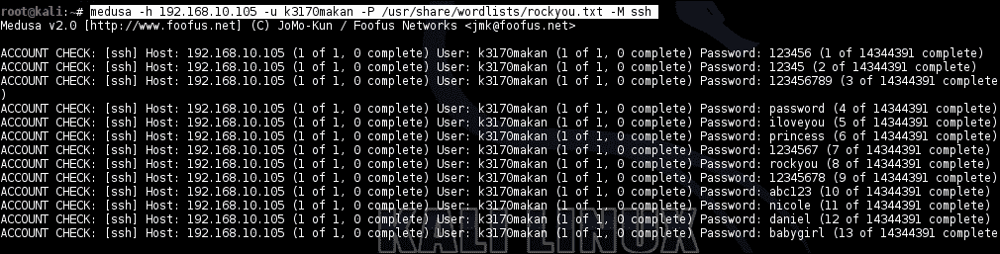
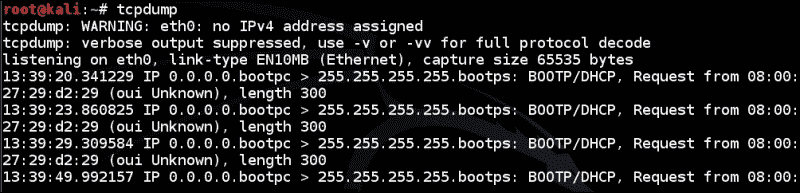
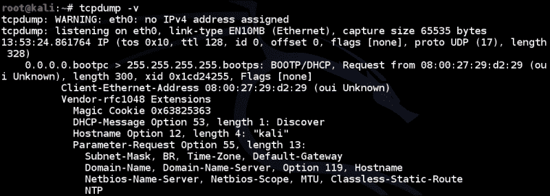
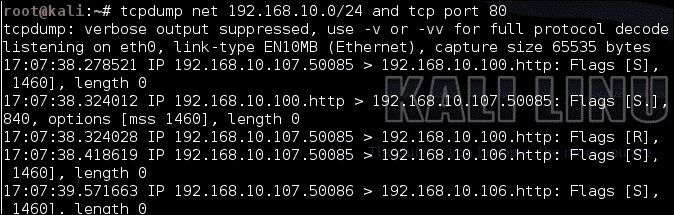
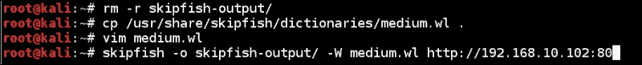
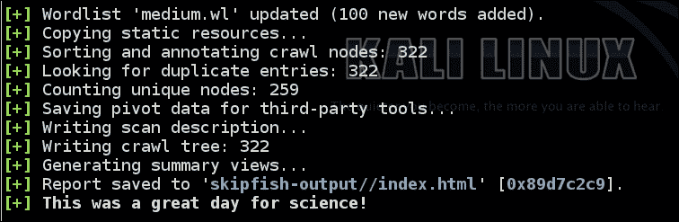

# 五、网络利用与监控

在上一章中，我们学习了基于主机和应用程序的利用，以及如何使用 Metasploit Framework 命令行界面和一些其他命令行和 shell 环境驱动的实用程序对应用程序进行反向工程，并基于 Nmap 输出以及其他工具自主启动工具。下一章将重点介绍 Kali Linux 中可用的网络攻击，以及如何在现代 bash shell 环境中利用它。

首先，我们将讨论 MAC 欺骗和（**ARP】****地址解析协议**滥用，这通常会困扰现成的网络解决方案，在大多数情况下，如果不加以控制，可能会产生非常大的影响。

# MAC 和 ARP 滥用

**（MAC）****媒体访问控制**地址是本地网络上设备的地址。第 2 层协议使用这些地址精确定位物理设备，如路由器、笔记本电脑、DNS 服务器以及逻辑网络上彼此相邻的其他设备。从本质上讲，除非实施其他控制，否则没有任何东西可以阻止一个设备使用另一个设备的 MAC 地址伪造其数据包的来源。这被称为 MAC 欺骗攻击。通常，如果目标网络上的某些资源是通过 MAC 地址控制的，即如果给定资源的保护使用 MAC 地址作为身份验证凭据或标识材料，则您会希望伪造或欺骗您的 MAC。这个想法本身就有缺陷，纯粹是因为如果你试图保护一些秘密的东西，你不能不依赖一些秘密的东西。这是一种解释密码学和信息论古老原理的方法。由于在许多常见情况下 MAC 地址都应该在网络上广播，由于 ARP 等一些基本协议的运行，网络上的每个人都可以访问其他人的 MAC 地址。

MAC 地址欺骗（虽然可能是最简单的网络攻击；您真正做的只是更改数据包中的 MAC 地址字段）也是许多攻击技术的基础。本质上，几乎所有的黑客行为都是滥用信任；当存在大量以信任为中心的信息时，就像数据包中的 MAC 地址一样容易出错，通过滥用这种情况，可以获得很多好处。

## 欺骗 MAC 地址

如前所述，欺骗您的 MAC 地址相对容易，但也是许多利用技术的基本要素；无论是 ARP 欺骗、端口窃取还是路由破坏，所有这些奇妙的技巧都严重依赖于原始 MAC 地址。

要使用 Kali Linux 更改您的 MAC 地址，您可以使用名为`macchanger`的工具，并使用以下命令：

```
macchanger [-hVeaArls] [-m,--mac,--mac= MAC_ADDRESS] INTERFACE

```

本质上，`MAC_ADDRESS`将是您希望将当前 MAC 地址更改为的 MAC 地址，`INTERFACE`是应与此新 MAC 地址对应的接口。为简洁起见，此处不讨论其他选项；我建议你查一下男人档案，了解更多细节。

以下是`macchanger`正在运行的示例：

```
ifconfig down eth0
macchanger –-mac=01:02:03:04:05:06 eth0
ifconfig up eth0

```

前面的命令生成以下输出：


对于随机 MAC，可以使用以下命令：

```
macchanger –r eth0

```

在前面的屏幕截图中，您将看到最初为主机配置的 MAC 地址已更改为指定给 macchanger 的地址。此外，您可能需要确保使用新 MAC 地址重新配置的接口未被使用，正如我们在前面的屏幕截图中所做的那样。这就是`ifconfig`命令的目的。

## 滥用地址解析

地址解析协议作为将 IP 地址转换为 MAC 地址的服务存在。主机发出 ARP 请求以获取与给定 IP 地址相关联的 MAC 地址的信息。主机将在整个本地网段上广播消息，希望从与请求的 IP 地址相关联的主机接收响应。地址解析协议的根本缺陷在于它本身缺乏任何形式的身份验证和消息完整性。这意味着，当接收到 MAC 地址查找响应时，接收主机无法确定其来源，只能盲目地假设它来自正确的主机。对于攻击者来说，这意味着您可以通过伪造对 ARP 请求的响应，说服设备转发给您实际用于其他用户的数据包。

Kali Linux 有一个有助于促进 ARP 滥用的工具；名为 ARPSOOF，其使用规范如下：

```
arpspoof [-ictr] [GATEWAY]

```

*   `-i`：此指定发送 ARP 应答的接口。通过使用`ifconfig`命令，您可以找出哪些网络接口配置了地址并与网络关联。
*   `-c`：此指定将 ARP 分辨率恢复为原始形式时使用的 MAC 地址。
*   `-t`：此选项指定目标主机，即您想要毒害的主机。
*   `-r`：这个告诉`arpspoof`毒害两个宿主；这意味着不仅要向目标发送 ARP 回复，还要在回复时向您模拟的主机发送 ARP 回复。这样做的效果是，所涉及的两个主机的 ARP 表都反映出您是其中一个主机；`TARGET`将确信您是`GATEWAY`，反之亦然。
*   `GATEWAY`：这是发送伪造 ARP 回复时要模拟的主机的 IP 地址。

这里有一个例子：假设我们想说服地址为`192.168.10.107`的主机，我们是地址为`192.168.10.1`的主机，这是我们目标主机的默认网关。在这种情况下，您将向 ARPSopof 发出以下命令：

```
arpspoof –t 192.168.10.107 192.168.10.1 

```

上述命令将产生以下输出：


前面的屏幕截图以粗体显示了攻击者的 MAC 地址。这里配置为`08:00:27:29:d2:29`。如果 ARP 欺骗攻击在我们的示例中有效，则此地址将与目标主机上的`192.168.10.1`IP 相关联，如以下屏幕截图所示：


# 中间人攻击

利用我们在本章 ARP 滥用小节中了解到的内容，我们实际上可以在滥用地址解析和主机识别方案的能力上执行更复杂的**中间人**（**MITM**）式攻击。本节将重点介绍可用于实现此目的的方法。

MITM 攻击旨在欺骗给定网络上的两个实体通过未经授权的第三方代理进行通信，或允许第三方访问传输中的信息，在网络上的两个实体之间进行通信。例如，当受害者连接到本地网络或远程网络上的服务时，中间人攻击将使攻击者能够窃听甚至增强受害者与其服务之间的通信。所谓服务，我们可能指的是 web（HTTP）、FTP、RDP 服务，或者任何没有抵御 MITM 攻击的固有手段的服务，事实证明，这是我们今天使用的很多服务！

## Ettercap DNS 欺骗

TTERCAP 是一种工具，可通过简单的命令行和图形界面，使用多种技术执行 MITM 攻击。在本节中，我们将重点介绍 ARP 欺骗攻击的应用，即 DNS 欺骗。

您可以通过执行以下步骤，使用 ettercap 设置 DNS 欺骗攻击：

1.  在启动和运行 eTerCap 之前，我们需要修改保存即将被欺骗的 DNS 服务器的 DNS 记录的文件。此文件位于`/usr/share/ettercap/etter.dns`下。如果您想充当拦截主机，则需要添加 DNS 名称和 IP 地址，或者通过将所有 IP 替换为您的 IP 来修改文件中当前的 IP 地址。
2.  现在我们的 DNS 服务器记录已经设置好，我们可以调用 ettercap。调用 ettercap 非常简单；以下是使用说明：

    ```
    ettercap [OPTIONS] [TARGET1] [TARGET2]

    ```

3.  To perform a MITM attack using ettercap, you need to supply the `–M` switch and pass it an argument indicating the MITM method you'd like to use. In addition, you will also need to specify that you'd like to use the DNS spoofing plugin. Here's what the invocation will look like:

    ```
    ettercap –M arp:remote –P dns_spoof [TARGET1] [TARGET2]

    ```

    其中，`TARGET1`和`TARGET2`是您要拦截的主机，是默认网关或 DNS 服务器，可以互换。

4.  要将地址为`192.168.10.106`且默认网关为`192.168.10.1`的主机作为目标，您将调用以下命令：

    ```
    ettercap –M arp:remote –P dns_spoof /192.168.10.107/ /192.168.10.1/

    ```

一旦启动，ettercap 将开始毒害指定主机的 ARP 表，并侦听对其配置为解析的域的任何 DNS 请求。

# 询问服务器

任何网络设备要参与通信，需要访问某些信息，没有负责某些信息的设备参与，任何设备都无法查找域名或找到 IP 地址。在本节中，我们将详细介绍一些可用于查询常见网络组件的技术，以获取有关目标网络及其主机的敏感信息。

## SNMP 查询

**简单网络管理协议**（**SNMP**由路由器和其他网络组件使用，以支持对带宽、CPU/内存使用情况、硬盘空间使用情况、登录用户、运行进程、，以及其他一些极其敏感的信息收集。当然，任何在目标网络上具有公开 SNMP 服务的渗透测试人员都需要知道如何从中传播任何潜在有用的信息。本章讨论了一些可以用来实现这一点的工具。

### 注

**关于 SNMP 安全**

版本 3 之前的 SNMP 服务在设计时没有考虑安全性。这些服务的身份验证通常以一个简单的字符串形式出现，称为社区字符串。SNMP 版本 1 和 2 固有的另一个常见实现缺陷是暴力和窃听通信的能力。

要使用 Kali Linux 工具枚举 SNMP 服务器以获取信息，您可以采用多种技术。最明显的是`snmpwalk`，您可以通过以下命令使用：

```
snmpwalk –v [1 | 2c | 3 ] –c [community string] [target host]

```

例如，假设我们以社区字符串`public`作为目标`192.168.10.103`，这是一个常见的社区字符串设置；然后，您将调用以下命令以从 SNMP 服务获取信息：

```
snmpwalk –v 1 –c public 192.168.10.103

```

在这里，我们选择使用 SNMP 版本 1，因此在前面的命令调用中使用了`–v 1`。输出将类似于以下屏幕截图：



如您所见，这实际上提取了有关目标主机的一些非常详细的信息。这是否是一个关键漏洞将取决于所暴露的信息类型。

在 MicrosoftWindows 计算机和一些流行的路由器操作系统上，如果远程攻击者具有对 SNMP 数据库的写访问权限，SNMP 服务可能会暴露用户凭据，甚至允许远程攻击者恶意扩充用户凭据。成功利用 SNMP 通常在很大程度上取决于实现服务的设备。您可以想象，对于路由器，您的目标可能是路由表或设备上的用户帐户。对于其他主机类型，攻击面可能大不相同。尝试评估基于 SNMP 的缺陷和信息泄漏的风险，这些风险与主机有关，也可能与主机所在的更广泛网络有关。不要忘记，SNMP 是关于共享信息的，您网络上的其他主机可能信任这些信息。考虑可访问的信息类型，以及如果您有能力影响它，您将能够使用它做什么。如果您可以攻击主机，请攻击信任它的主机。

另一组工具非常擅长从 SNMP 服务收集信息：Metasploit 框架中提供的`snmp_enum`、`snmp_login`和类似的脚本。`snmp_enum`脚本除了以更友好的格式构造提取的信息外，与`snmpwalk`几乎完全一样。这使它更容易理解。下面是一个例子：

```
msfcli auxiliary/scanner/snmp/snmp_enum [OPTIONS] [MODE]

```

以下屏幕截图显示了此模块可用的选项：



在我们的运行示例中，有一个针对主机的调用示例：

```
msfcli auxiliary/scanner/snmp/snmp_enum RHOSTS=192.168.10.103

```

前面的命令生成以下输出：


您会注意到，我们在调用中没有指定社区字符串。这是因为模块假设默认值为`public`。您可以使用`COMMUNITY`参数指定另一个。

在其他情况下，您可能并不总是幸运地预先知道正在使用的社区字符串。然而，幸运的是，SNMP 版本 1、2、2*c*和 3*c*本身没有任何针对暴力攻击的保护，也没有任何一种使用任何形式的基于网络的加密。在 SNMP 版本 1 和 2*c*的情况下，您可以使用一个名为`snmp-login`的漂亮 Metasploit 模块，该模块将遍历可能的社区字符串列表，并确定枚举字符串为您提供的访问级别。您可以通过运行以下命令来使用它：

```
msfcli auxiliary/scanner/snmp/snmp_login RHOSTS=192.168.10.103 

```

前面的命令生成以下输出：


如前面的屏幕截图所示，一旦运行完成，它将列出枚举字符串以及授予的访问级别。

`snmp_login`模块默认使用可能字符串的静态列表进行枚举，但您也可以在 Kali Linux 附带的一些密码列表上运行此模块，如下所示：

```
msfcli auxiliary/scanner/snmp/snmp_login PASS_FILE=/usr/share/wordlists/rockyou.txt RHOSTS=192.168.10.103 

```

这将使用`rockyou.txt`单词列表查找要猜测的字符串。

因为所有这些 Metasploit 模块都是命令行驱动的，所以您当然可以将它们组合起来。例如，如果要对 SNMP 社区字符串强制执行主机，然后对其找到的字符串运行枚举模块，可以通过编写 bash 脚本来实现，如以下示例所示：

```
#!/bin/bash
if [ $# != 1 ]
then
 echo "USAGE: . snmp [HOST]"
 exit 1
fi
TARGET=$1
echo "[*] Running SNMP enumeration on '$TARGET'"
for comm_string in \
`msfcli auxiliary/scanner/snmp/snmp_login RHOSTS=$TARGET E 2> /dev/null\
 | awk -F\' '/access with community/ { print $2 }'`; 
do 
 echo "[*] found community string '$comm_string' ...running enumeration"; 
 msfcli auxiliary/scanner/snmp/snmp_enum RHOSTS=$TARGET COMMUNITY=$comm_string E 2> /dev/null;
done

```

以下命令显示了如何使用它：

```
. snmp.sh [TAGRET]

```

在我们的运行示例中，它的使用方式如下：

```
. snmp.sh 192.168.10.103

```

除了猜测或强制使用 SNMP 社区字符串之外，您还可以使用 TCPDump 过滤掉可能包含未加密的 SNMP 身份验证信息的任何数据包。下面是一个有用的示例：

```
tcpdump udp port 161 –i eth0 –vvv –A

```

这些参数的细节将在后面的章节中介绍。上述命令将产生以下输出：


如果不深入了解 SNMP 数据包结构的太多细节，查看捕获的可打印字符串，通常很容易看到社区字符串。有关 SNMP 数据包如何工作的更多信息，我建议您查看*进一步阅读*部分中的链接。您可能还想看看如何使用 Scapy 等工具构建一个更全面的数据包捕获工具，它在 Kali-Linux 版本中可用。

有关 SNMP 枚举的更多信息，请参阅*进一步阅读*部分中的链接。

## SMTP 服务器询问

SMTP 服务器用于转发电子邮件，它们使用简单的基于文本的协议。由于这些计算机存在于定义了用户帐户的操作系统上，并且其中一些计算机被配置为处理伪造的电子邮件收件人，因此您经常可以滥用电子邮件地址验证或查找的工作方式来枚举主机操作系统上的用户帐户列表。Kali 有一个很棒的命令行工具`smtp-user-enum`来实现这一点。下面是它的工作原理：

```
smtp-user-enum [-hvd] [-M EXPN | VRFY | RCPT] [-u username | -U USER_FILE ] [-t host | -T HOST_FILE] [-p PORT] 

```

前面命令行的组件解释如下：

*   `-M`：这是的枚举方法。这是用于确定目标服务器上是否实际存在用户的命令。
*   `-u`：这是用于指定要检查的单个用户名。
*   `-U`：这是用于指定要检查的用户名列表。
*   `-t`：此用于指定枚举攻击的目标主机。
*   `-T`：此允许您指定一个`HOST_FILE`，它是攻击目标主机的列表。
*   `-h`：此指定输出的`help`文件。
*   `–v`：此指定输出的详细程度。

为了有效地使用`smtp-user-enum`，您需要一个相当全面的用户名列表。网络上有很多这样的网站；出于我们的目的，我们只需抓取`/etc/passwd`，将其通过`awk`，然后使用主机系统上的用户列表进行猜测。这也是一个很好的方法来识别类似于您自己的操作系统的指纹。通过执行以下步骤完成此操作：

1.  删除用户名如下：

    ```
    cat /etc/passwd | awk –F\: '{ print $1}' > users_list.txt

    ```

2.  针对具有 enum 攻击的`smtp`服务器：

    ```
    smtp-user-enum –t [HOST] –U ./users_list.txt 

    ```

然后`smtp-user-enum`将使用`VRFY`命令确定您的目标上是否存在用户。您还可以指定其他枚举方法，如下所示：

```
smtp-user-enum –t [HOST] –U ./users_list.txt –M EXPN
smtp-user-enum –t [HOST] –U ./users_list.txt –M RCPT

```

就 SMTP 枚举而言就是这样；从现在开始，您应该记录您枚举的用户名，并在下次需要运行 SMTP 用户名枚举攻击时重播这些用户名。

# 暴力强制认证

渗透测试中的许多成功或失败都取决于你猜密码的能力。这可能会让您感到惊讶，但网络工程师和利用人员有时确实会做对，您需要依靠用户的可预测性来找到“进入”的方式。Kali Linux 提供了一系列新的、复杂的、旧的、值得信赖的身份验证破解工具，这些工具通常是您快速猜测密码的首选工具。

## 使用美杜莎

Medusa 是 Kali Linux 提供的更好的多用途破解工具之一。它支持多种不同的身份验证模式，还允许您在遇到任何它本身不支持的情况时定义自己的插件。

您可以使用以下命令行调用 medusa：

```
medusa [-h host | -H file] [-u username | -U file ] [-p password | -P file] [-C file ] –M MODULE [OPTIONS]

```

美杜莎支持许多模块。通过执行以下命令，您可以了解您的版本支持哪些模块：

```
medusa –d

```

前面的命令将生成受支持模块的列表。如果您想使用其中一个，可以使用`–M`开关指定模块的名称，如前面的使用规范所示。下面是一个示例，针对`192.168.10.105`上的 SSH 服务：

```
medusa –h 192.168.10.105 –u k3170makan –P /usr/share/wordlists/rockyou.txt –M ssh

```

上一个命令将产生以下输出：



同样，您也可以针对其他服务，如下命令所示：

```
medusa –h 192.168.10.105 –u k3170makan –P /usr/share/wordlists/rockyou.txt –M ftp

medusa –h 192.168.10.105 –u k3170makan –P /usr/share/wordlists/rockyou.txt –M http

medusa –h 192.168.10.105 –u k3170makan –P /usr/share/wordlists/rockyou.txt –M web-form

```

美杜莎还允许您利用自己的模块进行暴力强制，并提供了指定密码和用户名列表的非常有用的方法。有关美杜莎其他选项的更多信息，请参阅*进一步阅读*部分。

# TCPDump 流量过滤

TCPDump 是迄今为止使用最多的网络流量检测工具之一。它支持许多丰富的信息驱动特性，就像本书中讨论的其他工具一样，它提供了一个纯命令行驱动的界面。TCPDump 允许您过滤网络流量以获取有用信息。在这里，我们将介绍一些基本用法。稍后，我们将继续讨论如何使用 TCPDump 检查您感兴趣的通信量，所有这些都将直接从您信任的 bashshell 中获得。

## TCPDump 入门

首先，让我们看看 TCPDump 的使用规范：

```
tcpdump [ -AbdDefhHIJKlLnNOpqRStuUvxX ] 
[ -B buffer_size ] [ -c count ] [ -C file_size ] 
[ -G rotate_seconds ] [ -F file ] 
[ -i interface ] [ -j tstamp_type ] [ -m module ] [ -M secret ] 
[ -Q in|out|inout ] [ -r file ] 
[ -V file ] [ -s snaplen ] [ -T type ] [ -w file ] [ -W filecount ]
[ -E spi@ipaddr algo:secret,... ] [ -y datalinktype ]
[ -z postrotate-command ] [ -Z user ] [ expression ]

```

正如您所看到的，这个小数据包转储工具具有功能，几乎可以满足您的所有数据包分析需求。作为一个众所周知的“helloworld”示例，让我们以最基本的形式调用 TCPDump，看看它做了什么。可以使用以下命令调用它：

```
tcpdump

```

您需要 root 访问权限才能运行`tcpdump`，但是，由于 Kali 默认以 root 身份运行，所以您只需打开一个终端并调用前面的命令。上述命令应产生以下输出：



在前面的屏幕截图中可以看到，TCPDump 首先让您知道还有其他可用的调用选项，特别是那些控制输出详细程度的选项。TCPDump 利用人员认为，如果在没有参数的情况下调用，最好让您知道更详细的选项。如果使用详细开关，将获得以下输出：



TCPDump 对数据包的结构进行了一点解码，正如您在前面的示例中所看到的，它提供了一点更详细的信息。例如，IP、TCP 和 UDP 标志包括在数据包转储中。除了控制输出的详细性外，还可以控制数据包捕获的工作方式。这些选项包括：

*   `-i`: This allows you to specify the interface to capture on. TCPDump autonomously polls the operating system for configured interfaces and starts capturing on the first one it finds. This option allows you to strictly specify the interface to be used. If you need help finding out which interfaces are available, try executing the `ifconfig –a` command. Alternatively, you could use the following command:

    ```
    tcpdump –D

    ```

    这将列出`tcpdump`已识别为可用于数据包捕获的接口。

*   `-c`：这允许您在退出`tcpdump`之前指定要捕获的数据包数量。如果您不需要无限期地捕获数据包，或者希望对满足给定筛选器标准的指定数量的数据包进行采样，这将非常有用。
*   `-w`：这允许您指定一个文件来保存数据包捕获。此选项非常适合远程渗透测试的审计跟踪，因为您可以清楚地证明您的计算机从主机发送和接收的内容。对于某些渗透测试结果，也很少有证据比数据包捕获更简洁。事实上，如果可以，请将这些文件提供给客户端，以便在其易受攻击的设备上重播！这也是一种非常有效的方法，可以自动为您的发现构建概念证明。
*   `-r`：此从文件中读取数据包。这是对前面项目符号中详述的`–w`选项的补充。
*   `-A`：当打印数据包时，这会忽略链路级头，并以 ASCII 格式打印数据包。
*   `-x`：以十六进制打印数据包，不带链接级头。如果您需要将捕获的结果粘贴到模糊框架或 C/C++程序中，以便稍后以原始形式进行破坏，那么这是非常好的。这也是一种以最诚实和原始的形式打印数据包的方法，同时仍然保持数据包不存在可打印编码的缺陷。
*   `-I`：此将接口置于监控模式。这仅适用于某些无线接口；某些驱动程序不正确支持此功能。此选项允许您的无线接口捕获正在广播到网络上任何和所有设备的数据包，而无需与接入点关联。
*   `-s`：此允许您指定`snaplen`或捕获长度。这是每个数据包要捕获的最大字节数。

TCPDump 还有许多其他有用的功能。在这里，我们讨论了作为系统管理员、利用人员或渗透测试人员，您可能会发现在日常活动中最有用的功能。有关 TCPDump 的其他功能的更多信息，请参阅本章的*进一步阅读*部分。

下一节将讨论 TCPDump 中一个非常强大的功能，即根据包的属性描述过滤包的能力。

## 使用 TCPDump 包过滤器

TCPDump 有一种功能强大的语言，您可以使用它来描述和过滤数据包，范围从匹配正在使用的数据包、协议、主机和端口的语义属性到过滤 TCP 和 UDP 报头中的属性。在本节中，我们将介绍数据包过滤语言是如何工作的，以及如何为某些属性过滤数据包。您可以使用以下命令为 TCPDump 指定一些要筛选的属性：

```
tcpdump [filter]

```

在前面的命令中，`[filter]`将是您要筛选的属性的描述。

表达有一个易于理解的结构；其工作原理如下：

```
<expression> := <expression><operator><expression>
<expression> := <qualifier><id>
<qualifier> := <proto><dir><type>
<id> := IP address, port number, network address, etc.
<operator> := and,or,not
<type> := host, net, port, portrange
<dir> := src, dst, src or dst, src and dst
<proto> := ether, fddi, wlan, ip, ip6, arp, rarp, decent, tcp, udp
```

这意味着每个表达式要么由逻辑运算符粘合在一起的表达式集合组成，要么由一个限定符和一个 ID 组成。每个元素都被分解。如果将所有这些放在一起，则意味着您可以指定过滤器，如以下命令：

```
tcpdump host 192.168.10.102

```

前面的命令匹配将`192.168.10.102`设置为源或目标的所有数据包。此筛选器相当于以下命令：

```
tcpdump src host 192.168.10.102 or dst host 192.168.10.102

```

前面的命令产生以下输出：


您还可以将其与整个网络相匹配，例如，`192.168.10.0-255`子网中的所有内容：

```
tcpdump net 192.168.10.0/24 

```

您还可以像前面的示例中那样，将其他限定符与此绑定：

```
tcpdump net 192.168.10.0/24 and tcp port 80 

```

上述命令将产生以下输出：



这将使用端口 80 匹配来自或前往`192.168.10.0/24`网络上任何主机的所有 TCP 数据。

您还可以单独使用任何限定符，如下所示：

```
tcpdump port 80
tcpdump tcp
tcpdump src 192.168.10.10
tcpdump portrange 0-1023
tcpdump wlan

```

除了基于其属性（端口、协议和方向）的广泛语义描述来指定数据包之外，您还可以指定关于数据包本身的非常精细的细节，甚至可以描述过滤数据包中任何字段的任何值。

您可以让`tcpdump`将数据包与`TCP`、`ICMP`或`UDP`中的属性或任何支持的协议头值进行匹配。这是通过使用以下命令完成的：

```
tcpdump 'tcp[13] & 2!=0'

```

上述命令将产生以下输出：


这样做的目的是告诉 TCPDump 检查字节偏移量 13 处的 TCP 报头是否设置为`2`，这意味着这是一个`SYN`数据包。以下是一些其他流行的例子：

```
tcpdump 'tcp[13] & 32!=0' # for matching ACK packets
tcpdump 'tcp[13] & 8!=0' # for matching PSH packets

```

还有一些用于 TCP 和 ICMP 标志的助记符；您可以按如下方式使用它们：

```
tcpdump 'tcp[tcpflags] & tcp-syn != 0' 
tcpdump 'tcp[tcpflags] & tcp-ack != 0'

```

同样，对于 ICMP 数据包，可以使用以下命令：

```
tcpdump 'icmp[icmptype] & icmp-echo!= 0'

```

您需要了解一些关于 TCP 头结构的知识，才能充分利用此功能。如果您想了解有关 TCP 协议、数据包结构和操作的更多信息，请参阅*进一步阅读*部分中的一些链接。

# 评估 SSL 实现安全性

几十年来，人们一直使用加密、散列和密钥交换机制在不受信任的网络上安全地传递信息。他们将使用散列、加密和交换加密原语的复杂复杂组合来建立安全的通信通道。SSL 和 TLS 协议系列是一组规则，指定如何管理加密原语、通信数据和通信的其他属性，以确保从客户端到服务器的安全对话，反之亦然。

不幸的是，许多 SSL/TLS 版本在其存在的整个过程中都遇到了许多灾难性的漏洞。一些已发布的攻击最近才出现，仍然影响许多 SSL/TLS 实现。除了 TLS/SSL 的固有实现中存在的缺陷外，在配置这些服务时还存在一些常见的问题—错误在于如何使用它们，而不是它们如何工作。许多开箱即用的配置支持极易受攻击和过时的密码套件，而其他配置根本不提供太多健壮的保护；有些甚至完全忽略了加密或消息身份验证方案！

本章的下一节将详细介绍使用非常流行的工具 SSLyze 评估 SSL/TLS 实现的方法。它还将向您展示一些新的 bash 黑客，您可以使用它们来自动化 SSL/TLS 实现的风险分析。

## 使用 SSLyze

SSLyze 是 iSec partners 的人员利用的另一个优秀工具，我可以诚实地说，根据我的经验，渗透测试或漏洞评估都不会在不方便的地方出现。

SSLyze 所做的是连接到目标服务器上实现的 SSL 服务；它试图详细介绍 SSL/TLS 密码套件和其他 SSL/TLS 配置细节。

以下是 SSLyze 的使用规范：

```
sslyze [--version][-h][--help][--xml_out=XML_FILE]
[--targets_in=TARGETS][--timeout=TIMEOUT]
[--https_tunnel=HTTPS_TUNNEL][--starttls=STARTTLS]
[--regular][--cert=CERT][--certform=CERTFORM][--key=KEY]
[--pass=PASSWORD][--sslv2][--sslv3][--tlsv1][--tlsv1_1][--tlsv1_2]
[--http_get][--hide_rejected_ciphers][--reneg][--resum]
[--resum_rate][--certinfo basic| full ] [--compression]

```

让我们看看当我们将 SSLyze 指向支持 SSL/TLS 的 web 服务器时会发生什么；您可以使用以下命令执行此操作：

```
sslyze [options] [address]:[port]

```

例如，如果您希望评估 SSL 实现`192.168.10.101`，具体查询 TLS 版本 1 配置，您将执行以下命令：

```
sslyze –-tlsv1 192.168.10.101:443

```

前面的命令生成以下输出：


我们在前面的屏幕截图中看到的是提供的配置密码套件的规格。它特别提到服务器支持的密码套件以及给定对称密码使用的对称密钥的长度。

### 提示

根据密钥交换算法、对称加密算法和消息摘要或散列算法以及伪随机函数对每个密码套件进行了描述。以下是密码套件名称的示例：

`TLS_RSA_WITH_AES_256_CBC_SHA`

下划线前的前几个字母要么提到密钥交换机制，要么提到密码套件用于 TLS 协议。这里，密钥交换机制是`RSA`。下一个规范是对称加密操作。这里，这表示为`AES_256`，这是在**密码分组链接**（**CBC**模式中使用的块长度为 256 的 AES 算法。在提到加密算法之后，密码套件提到了散列算法。在这里，表示为 SHA。

SSLyze 对所有 SSL/TLS 版本都有支持，您可以指定测试哪个版本作为命令行选项。如果要测试所有这些选项，请指定以下命令行选项：

```
sslyze –-sslv2 –-sslv3 –-tlsv1 –-tlsv1_1 –-tlsv1_2 [host]:[port]

```

除了 TLS/SSL 版本之外，您还可以让它测试其他属性。以下是其他一些选项的工作原理：

*   `--reneg`：此测试用于重新协商支持。注意客户发起的重新谈判；在 SSL 版本中，这可能意味着存在 DoS 漏洞。
*   `--compression`：此测试用于支持消息压缩。在 TLS 1.0 版中，这是一个严重的信息泄漏漏洞。
*   `--resum`：此测试用于使用会话 ID 或 TLS 会话票证的恢复支持。

SSLyze 提供的另一个非常有用的选项是大多数常用选项的快捷方式。以下是您如何使用它：

```
sslyze –-regular [host]:[port]

```

密码是否具有潜在危险的前提取决于如果服务器支持此类易受攻击的密码套件，它是否存在任何实际可利用的缺陷。危险在于客户端可能会受到攻击，这些攻击会传播有关客户端与受影响服务器通信的信息。例如，如果服务器支持使用易受攻击密钥长度（通常小于 128 位）的对称密码的密码套装，则很容易想象攻击者可以强行使用 SSL/TLS 会话期间使用的会话密钥。网上可能有很多评估方法。我在*进一步阅读*部分中包含了一个来自 Qualys 实验室的非常好的。

## Bash hacks 和 SSLyze

一旦您掌握了哪些 SSL 套件、密钥长度和其他 TLS/SSL 配置辅助设备将被视为易受攻击，您可以过滤 SSLyze 输出以突出显示易受攻击的配置细节。一种避免通读所有输入并手动查找易受攻击实例的方法是使用 bash 脚本。以下是您可以在 SSL 评估期间使用和修改的示例：

```
#!/bin/bash
HOST=$1
SSL_PORT=$2
KEY_LEN_LIMIT=$3
VULN_SUIT_LIST=$4
echo -e "[*] assessing host \e[3;36m $HOST:$SSL_PORT\e[0m"
for cipher in `sslyze --regular $HOST:$SSL_PORT | awk -F\  '/[0-9]* bits/ { print $1"_"$2"_"$3 }'`
do
 suit=`echo $cipher | awk -F\_ '{ print $1 }' | sed 's/ //g'`
 keylen=`echo $cipher | awk -F\_ '{ print $2 }' | sed 's/ //g'`
 for bad_suit in `cat $VULN_SUIT_LIST`
 do
 BAD_SUIT="0"
 if [ "$suit" = "`echo $bad_suit | sed 's/ //g'`" ]
 then
 suit=`echo -e "\e[1;31m*$suit\e[0m"` #make it red forbad
 BAD_SUIT="1"
 fi
 done
 if [ "$keylen" -lt "$KEY_LEN_LIMIT" ]
 then
 keylen=`echo -e "\e[1;31m*$keylen\e[0m"` #make it red for bad
 fi
 echo -e "\t[+]$suit : $keylen" 
done | column -t -s:

```

上一个脚本采用以下参数：

*   `HOST`：这是要评估的 IP 地址
*   `SSL_PORT`：这是用于 SSL/TLS 服务的端口号
*   `KEY_LEN_LIMIT`：这是安全密钥的最低限制，例如 128
*   `VULN_SUIT_LIST`：这是一份易受攻击的密码诉讼清单

下面是一个简单的例子：

```
. cipher_filter.sh 192.168.10.103 443 128 ./vulnerable_cipher_list

```

前面的命令将产生以下输出：


`./vulnerable_cipher_list`是一个文件，每行包含一个密码套件名称，下面是一个示例。它提到了一些密码套件，其中包含单词`NULL`：

```
  DHE_PSK_WITH_NULL_SHA256
  DHE_PSK_WITH_NULL_SHA384
  RSA_PSK_WITH_AES_128_CBC_SHA256
  RSA_PSK_WITH_AES_256_CBC_SHA384
  RSA_WITH_NULL_SHA
```

这本书的网站上有一个更完整的密码列表。

# 自动 web 应用程序安全评估

Web 应用程序是非常复杂的技术，而且每天都变得更加复杂。不难想象，渗透测试这些大型、繁重且通常非常隐蔽的应用程序可能是一项相当繁琐的任务。幸运的是，web 应用程序安全评估的大部分工作可以自动化。我之所以说“部分”，是因为 web 应用程序的攻击面还没有实现太多成功的自动化，即需要用户交互的 XSS、自定义加密缺陷和业务逻辑缺陷。如果您所做的只是运行一个扫描器，那么假设您已经很好地掌握了 web 应用程序的安全性是不安全的！这就是说，诸如爬行、模糊标题、提取身份验证表单和其他简单重复任务等任务在 web 应用程序扫描仪中已经实现了很好的自动化。在本节中，我们将介绍 Kali Linux 中提供的一小部分命令行驱动工具，用于自动化 web 应用程序安全评估。

## 用鱼鳞鱼扫描

SkipFish 是谷歌的一些员工使用和创建的工具。SkipFish 和其领域中的大多数工具一样，只是简单地抓取一个 web 应用程序，并通过检测引擎传递它拾取的每个页面，以努力分析该页面的常见缺陷和错误配置。SkipFish 以交互网页的形式报告其输出。让我们看看如何使用 SkipFish 及其支持的一些功能。

要启动 SkipFish，您需要两个必要的东西：一个单词列表和一个目录来存储结果。执行以下步骤以使其正常工作：

1.  使用以下命令为 SkipFish 准备输出目录：

    ```
    mkdir skipfish-ouput/

    ```

2.  Grab a sample word list for SkipFish to work with by using the following command:

    ```
    cp /usr/share/skipfish/dictionaries/medium.wl .

    ```

    在这里，我们使用的是中级词典。这只是一个示范；请随意试用上述文件夹中的其他一些词典。

3.  确保目录未标记为只读；您需要删除此文件的第一行，因为它是以只读的形式随 SkipFish 提供的。您需要删除如下所示的行：

    ```
    # ro

    ```

4.  您现在可以通过执行以下命令启动 SkipFish:

    ```
    skipfish –W medium –o skipfish-out/

    ```

在 Kali Linux 命令行上执行时，整个过程将如以下屏幕截图所示：



运行完成后，SkipFish 将向您显示以下屏幕截图：



如果这是您第一次运行 SkipFish，您可以先中止它，因为它将自动报告迄今为止收集到的所有结果。您可以通过按*Ctrl*+*C*来完成此操作。

当 SkipFish 完成运行时，它将在您为其输出创建的目录中向您显示一个`index.html`文件。此文件包含报告。在 Iceweasel（Kali Linux 的默认浏览器）中打开 SkipFish 报告时，其屏幕截图如下所示：


SkipFish 支持许多其他调用选项，其中一些选项控制如何处理单词列表；其他人则在测试过程中控制雪橇鱼的攻击性。有关这些选项的更多信息，我建议查看*进一步阅读*部分中的一些链接。

## 用蛛网膜进行扫描

Arachni 是 Kali Linux 中另一款伟大的命令行驱动的 web 应用程序扫描工具。它附带了一系列模块和插件，允许用户评估一系列 web 应用程序安全重点领域。要以默认模式启动 Arachni，必须调用以下命令：

```
arachni –u [URL]

```

例如，如果您希望使用 Arachni 扫描将[privatebankloans.com](http://privatebankloans.com)作为目标，您将发出以下命令：

```
arachni –u http://www.privatebankloans.com 

```

这将加载所有扫描模块，并使 Arachni 针对指定 web 应用程序的所有可能攻击面。你也可以将蛛形纲动物聚焦在特定类型的扫描上。例如，要仅对 XSS 漏洞运行检测，您将指定以下命令：

```
arachni –u [URL] –mods=xss_*

```

要加载所有审核模块，请使用以下命令：

```
arachni –u [URL] –mods=audit*

```

您可以使用`–-lsmod`命令行选项列出可用的模块。此选项将正则表达式作为参数，并查找名称匹配的所有模块，然后 Arachni 显示有关这些模块的一些基本信息。Arachni 还支持一个报告框架，允许您生成有关其发现问题的格式整齐的报告。您可以通过键入以下命令来使用它：

```
arahni –u [URL] –-report=[FORMAT]:[FILENAME]

```

其中，`[FORMAT]`是您想要报告的文档格式，`FILENAME`是要保存报告的文件名。`FORMAT`可以是 HTML、`.txt`或许多其他格式。

下面是一个生成 HTML 报告的示例：

```
arachni –u http://www.privatebankloans.com –-report:html:privatebankloads.html

```

与许多命令行参数一样，您可以指定多种报告格式。这将导致生成多个报告，如以下命令中所指定：

```
arachni –u http://www.privatebankloans.com –-report:html:privatebankloads.html –-report:json:privatebankloads.html

```

Arachni 支持控制其操作其他方面的一系列参数。更多详情请参见*进一步阅读*部分。

# 总结

在本章中，我们学习了使用各种工具来评估 OSI 协议栈的不同层。我们介绍了攻击第 2 层协议实现的工具，即 ARP 和其他基于 MAC 的身份验证方案。

我们还介绍了使用 ARPSopof 的简单 ARP 中毒攻击，并了解了如何伪造 MAC 地址。在此基础上，我们应用这些技术来执行完整的 MITM 攻击，使我们能够拦截流量和欺骗 DNS 服务器。

本章还包括专门针对本地网络上 SMTP 和 SNMP 服务的技术的章节。这些部分详细介绍了名为`snmpwalk`的工具以及用于强制 SNMP 身份验证的 Metasploit 模块`snmp-enum`和`snmp-login`的用法。信息收集部分以 SMTP 枚举攻击的讨论结束，我们学会了使用`smtp-user-enum`工具实现这一点。

除了滥用网络协议的功能外，本章还讨论了滥用安全措施的实施，特别是认证凭证密码、用户名、安全令牌等。我们介绍了一个非常强大的身份验证暴力工具 Medusa，它支持各种身份验证机制，例如 SSH、FTP，甚至 web HTML 表单。

在学习攻击之后，我们后退了一步，学习了一个有用的数据包分析和流量监控工具 TCPDump。我们学习了使用 TCPDump 根据主机、端口过滤数据包，甚至详细过滤传输层数据包中的偏移量。

然后，本章介绍了 SSL 安全评估，并演示了如何使用 SSLyze 枚举目标主机上实现的密码套件和 SSL/TLS 版本。我们还了解了一个有用的 bash 脚本，该脚本有助于检测有缺陷的密码，并允许我们根据评估需要更改易受攻击密码套件的定义。

我们通过学习使用两个非常强大的 web 应用程序扫描工具完成了本章，即 SkipFish 和 Arachni。

本章旨在介绍所讨论的非常强大和灵活的工具。我敦促所有阅读本章的人学习我们讨论过的工具，了解它们的优缺点，并将它们结合起来，创建一个强大的安全评估武库。当你掌握了这些工具，写一些你自己的！

# 进一步阅读

*   [处的 TCPDump 过滤器 http://www.wains.be/pub/networking/tcpdump_advanced_filters.txt](http://www.wains.be/pub/networking/tcpdump_advanced_filters.txt) （查阅日期：2014/03/30）
*   TCPDump 手册位于[http://www.tcpdump.org/manpages/tcpdump.1.html](http://www.tcpdump.org/manpages/tcpdump.1.html) （查阅日期：2014/03/30）
*   [处的 TCPDump 过滤器 http://www.cs.ucr.edu/~marios/ethereal-tcpdump.pdf](http://www.cs.ucr.edu/~marios/ethereal-tcpdump.pdf)（访问日期：2014/03/30）
*   [处的 TCPDump 和 libpacphttp://www.tcpdump.org/](http://www.tcpdump.org/) （查阅日期：2014/03/30）
*   [的以太网地址解析协议 http://tools.ietf.org/html/rfc826](http://tools.ietf.org/html/rfc826) （查阅日期：2014/04/03）
*   在[处解析 Github 页面 https://github.com/iSECPartners/sslyze](https://github.com/iSECPartners/sslyze) （查阅日期：2014/03/30）
*   [的 SSL 部署最佳实践 https://www.ssllabs.com/downloads/SSL_TLS_Deployment_Best_Practices_1.3.pdf](https://www.ssllabs.com/downloads/SSL_TLS_Deployment_Best_Practices_1.3.pdf) 2013 年 9 月，（查阅日期：2014/04/03）
*   [的传输层安全（TLS）协议版本 1.2http://tools.ietf.org/html/rfc5246](http://tools.ietf.org/html/rfc5246) （查阅日期：2014/03/30）
*   安全套接字层（SSL）协议版本 3.0，位于[http://tools.ietf.org/html/rfc6101](http://tools.ietf.org/html/rfc6101) （查阅日期：2014/03/30）
*   [SSL 3.0 协议分析 https://www.schneier.com/paper-ssl.pdf](https://www.schneier.com/paper-ssl.pdf) （查阅日期：2014/03/30）
*   [明文压缩与信息泄漏 http://www.iacr.org/cryptodb/archive/2002/FSE/3091/3091.pdf](http://www.iacr.org/cryptodb/archive/2002/FSE/3091/3091.pdf) （查阅日期：2014/03/30）
*   [处的 TLS 和 SSLv3 重新协商漏洞 http://www.g-sec.lu/practicaltls.pdf](http://www.g-sec.lu/practicaltls.pdf) （查阅日期：2014/03/30）
*   [处存在违反 TLS HTTP 压缩漏洞 http://breachattack.com/](http://breachattack.com/) （查阅日期：2014/03/30）
*   位于[的 TLS 密码套件注册表 https://www.iana.org/assignments/tls-parameters/tls-parameters.xhtml#tls-参数-4](https://www.iana.org/assignments/tls-parameters/tls-parameters.xhtml#tls-parameters-4)（查阅日期 2014/04/01）
*   关于[TLS 和 WPA 中 RC4 的安全性 http://www.isg.rhul.ac.uk/tls/](http://www.isg.rhul.ac.uk/tls/) （查阅日期：2014/04/01）
*   [处的基本 SNMPhttp://oreilly.com/catalog/esnmp/chapter/ch02.html](http://oreilly.com/catalog/esnmp/chapter/ch02.html)
*   [的 SNMPv3 中存在漏洞 https://smartech.gatech.edu/bitstream/handle/1853/44881/lawrence_nigel_r_201208_mast.pdf?sequence=2](https://smartech.gatech.edu/bitstream/handle/1853/44881/lawrence_nigel_r_201208_mast.pdf?sequence=2) （查阅日期：2014/04/06）
*   Cisco 安全咨询：[处的 SNMP 版本 3 身份验证漏洞 http://www.securityfocus.com/archive/1/493238](http://www.securityfocus.com/archive/1/493238) （查阅日期：2014/04/06）
*   [处的多供应商 SNMPv3 HMAC 安全旁路 http://www.iss.net/security_center/reference/vuln/SNMP_V3_HMAC_Security_Bypass.htm](http://www.iss.net/security_center/reference/vuln/SNMP_V3_HMAC_Security_Bypass.htm) （查阅日期：2014/04/06）
*   SSL 良好实践指南[https://labs.portcullis.co.uk/whitepapers/ssl-good-practice-guide/](https://labs.portcullis.co.uk/whitepapers/ssl-good-practice-guide/) （查阅日期：2014/04/07）
*   美杜莎并行网络登录审核员[http://foofus.net/goons/jmk/medusa/medusa.html](http://foofus.net/goons/jmk/medusa/medusa.html) （查阅日期：2014/04/07）
*   Ncrack 官方页面[http://nmap.org/ncrack/](http://nmap.org/ncrack/)
*   [处的 Arachni 命令行用户界面 https://github.com/Arachni/arachni/wiki/Command-line-user-interface](https://github.com/Arachni/arachni/wiki/Command-line-user-interface)