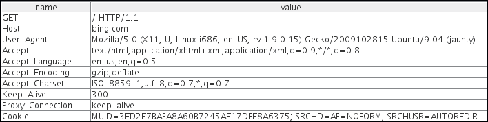
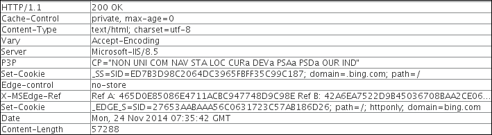
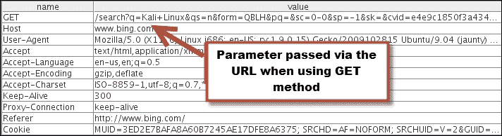
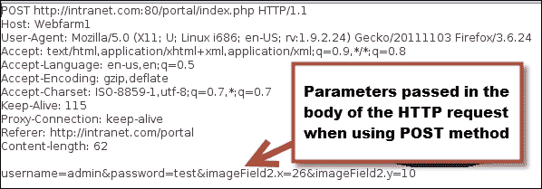
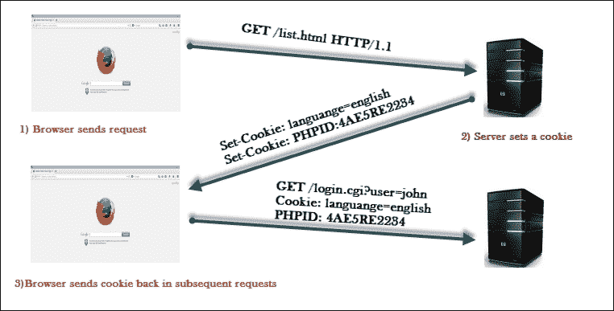
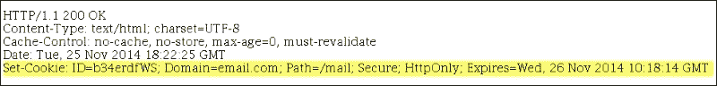

# 十一、渗透测试和 Web 应用介绍

CISO 和 CTO 一直在 web 应用和一般 IT 安全上花费大量资金，却没有得到好处，他们生活在一种虚假的安全感中。虽然 IT 安全一直是企业的头等大事，但在过去几年中，出现了一些重大的安全漏洞。对美国最大零售商之一 Target Corp.的攻击暴露了约 4000 万张借记卡和信用卡的详细信息，首席执行官和首席信息官被迫下台。对索尼 PlayStation 网络的攻击是 SQL 注入攻击的结果，SQL 注入攻击是最常见的 web 应用攻击之一，该网络已关闭 24 天。这暴露了 7700 万账户的个人信息。这些个人信息和财务记录最终进入地下市场，用于恶意活动。还有更多的袭击事件没有在新闻中报道得那么有活力。Web 应用可能不是造成如此巨大安全漏洞的唯一原因，但它们始终扮演着辅助角色，帮助攻击者实现其主要目标，即植入恶意软件以暴露私人数据。

不仅是网络服务器或网站对此类攻击负有责任；客户端 web 浏览器中的漏洞也负有同样的责任。极光攻击就是一个很好的例子，它针对的是十几家知名组织，包括谷歌、Adobe、雅虎！，还有其他一些。攻击者利用 Internet Explorer 中的零天堆喷洒漏洞，通过最终用户设备访问公司系统；在这种情况下，web 浏览器中的漏洞是一个促成因素。

web 应用如此容易受到攻击的另一个原因是，典型的 IT 安全策略和投资是被动的，而不是主动的。虽然我们正朝着正确的方向前进，但我们离目标还很远。心怀不满的员工或黑客在窃取数据之前不会阅读您的网络和访问控制策略，或者在将服务器从网络中踢出之前不会三思而后行，因此创建文档并没有真正的帮助。应用层防火墙和 IPS 设备跟不上不断演变的攻击速度。许多公司采用 BYOD 增加了攻击者的攻击面，也给 IT 安全团队带来了额外的问题。然而，他们会留下来，我们需要适应。

面向互联网的网站一直是攻击者和脚本编写者的最爱。非处方利用的网站和网络解决方案带来了更多的问题。在代码审查方面没有或几乎没有投资，而且对加密网络和磁盘上的数据的重要性缺乏了解，这使得对手的工作容易得多。

如果我们看一下 web 应用上最常见的两种攻击类型，即 SQL 注入攻击和跨站点脚本攻击（XSS）（在接下来的章节中将对此进行详细介绍），这两种攻击都是由于应用没有正确处理用户的输入而引起的。您可以更主动地测试应用。在测试阶段，您可以使用攻击者会使用的不同输入来攻击 web 表单中的输入字段，并从攻击者的角度对其进行测试，而不是等待攻击者对其进行攻击，然后对其进行补救。网络防火墙和代理设备从未被设计为阻止此类入侵；您需要测试您的应用，看看攻击者会如何做，这正是我们将在接下来的章节中介绍的内容。

# 主动安全测试

渗透测试或道德黑客是一种主动测试 web 应用的方法，通过模拟类似于任何给定日期可能发生的真实攻击的攻击。我们将使用 Kali Linux 中提供的工具来完成它。Kali Linux 是 Backtrack 的重新品牌版本，现在基于 Debian 派生的 Linux 发行版。它被安全专业人员用来执行攻击性安全任务，由一家名为“攻击性安全有限公司”的公司维护。Kali Linux 的前身是 Backtrack，这是黑客使用的主要工具之一，使用了 6 年多，直到 2013 年被 Kali Linux 取代。2015 年 8 月，第二版 Kali Linux 发布，代码名为 Kali Sana。这个版本包括新的工具，并带有一个基于 GNOME3 的重新命名的 GUI。Kali Linux 附带了大量流行的黑客工具，可以在安装了所有先决条件的情况下使用。我们将深入研究这些工具，并使用它们来测试 web 应用，这些应用容易受到现实世界 web 应用中发现的主要缺陷的影响。

## 谁是黑客？

黑客是一个出于好奇而喜欢深入研究某个系统的人，目的是了解该特定系统的内部工作并发现其中的漏洞。黑客通常被误解为恶意使用获取的信息的人。黑客是指意图恶意侵入系统的人。

侵入他人拥有的系统应始终在获得所有者同意后进行。许多组织已经开始雇佣专业黑客来指出他们系统的缺陷。在你开始订婚之前，获得客户的书面同意应该一直是你的首要任务。黑客攻击也是媒体热议的话题；一篇研究论文详细说明了您在未经产品所有者同意的情况下发现并发布的漏洞，即使您没有恶意使用该信息的意图，也可能会将您拖入大量法律纠纷。

黑客通常被称为黑帽黑客。

黑客行为在提高计算机安全性方面发挥了重要作用。黑客几乎参与了所有技术，无论是移动电话、SCADA 系统、机器人还是飞机。例如，Windows XP（2001 年发布）有太多的漏洞，每天都有漏洞被释放；相比之下，2012 年发布的 Windows 8 安全性更高，并且具有许多可以阻止任何恶意尝试的缓解功能。如果没有经常暴露操作系统安全漏洞并帮助提高其安全性的黑客社区，这是不可能的。IT 安全是一段旅程。虽然计算机系统的安全性在过去几年中有了很大的提高，但随着新功能的增加和新技术的发展，以及黑客在其中扮演的主要角色，它需要不断的关注。

在过去 12 个月中发现的 Heartbleed、Shellshock、Poodle、GHOST 和 Drupal 漏洞再次强调了不断测试系统漏洞的重要性。这些漏洞也在开源软件更安全的论点上打了一个洞，因为源代码是开放的；适当地投入时间、金钱和合格的资源是当下的需要。

## 不同的测试方法

通常人们会对以下术语感到困惑，并交替使用它们，而不理解虽然这些术语中存在一些重叠的方面，但也存在需要注意的细微差异：

*   道德黑客
*   渗透测试
*   漏洞评估
*   安全审计

### 道德黑客

很少有人知道黑客是一个被误解的术语；它对不同的人意味着不同的东西，更常见的情况是，黑客被认为是一个坐在封闭的空间里，没有社交生活，怀有恶意的人。因此，在术语*黑客行为*之前加上了*伦理*一词。术语*道德黑客*是指致力于识别系统漏洞和漏洞，向系统供应商或所有者报告，并有时帮助他们修复漏洞和漏洞的专业人员。道德黑客使用的工具和技术与黑客或黑帽黑客使用的工具和技术相似，但目的不同，因为它是以更专业的方式使用的。道德黑客也被称为安全研究人员。

### 渗透测试

这是一个术语，我们将在本书中经常使用，它是道德黑客的子集。渗透测试是一个更专业的术语，用来描述道德黑客的行为。如果你正在计划从事黑客职业，那么你经常会看到标题渗透测试仪的工作公告。尽管渗透测试是道德黑客的一个子集，但它在多个方面有所不同。这是一种更简化的方法，可以识别系统中的漏洞，并确定漏洞是否可利用。渗透测试受测试人员和待测试系统所有者之间的合同约束。您需要定义测试的范围，以确定要测试的系统。需要定义参与规则，这些规则决定了测试的方式。

### 漏洞评估

有时组织可能只想识别其系统中存在的漏洞，而不实际利用这些漏洞并获得访问权限。漏洞评估比渗透测试更广泛。漏洞评估的最终结果是一份报告，对发现的漏洞进行优先排序，最严重的漏洞在报告顶部，风险较小的漏洞在报告中较低。对于那些知道自己存在安全问题但需要确定最关键问题并确定其优先级的客户，此报告非常有用。

### 安全审计

审计是系统化的程序，用于根据预定的一套标准衡量系统的状态。这些标准可以是行业最佳实践或内部检查表。审计的主要目标是衡量和报告合规性。如果您正在审核 web 服务器，首先要注意的是服务器上打开的端口、服务器上启用的有害 HTTP 方法（如`TRACE`）、使用的加密标准以及密钥长度。

# 交战规则

**接战规则**（**RoE**）涉及进行渗透测试的方式。在开始渗透测试之前，应在接战规则中明确提及的一些指令如下：

*   黑盒测试或灰盒测试
*   客户联系方式
*   客户端 IT 团队通知
*   敏感数据处理
*   地位会议

## 黑盒测试或灰盒测试

两种测试方法都有应该做的和不应该做的。通过黑盒测试，当渗透测试仪从头开始并尝试识别网络地图、您使用的防火墙类型、您拥有的面向 internet 的网站等时，您可以获得攻击者的准确视图。但您需要了解，攻击者有时可能很容易获得这些信息。例如，为了识别您正在使用的防火墙或 web 服务器，快速扫描您公司在工作门户上的工作公告可能会发现这些信息，那么为什么要在其中浪费宝贵的金钱呢？为了获得渗透测试的最大价值，您需要明智地选择测试。

灰盒测试是一种更有效地利用资源的方法，您可以向测试团队提供足够的信息，从而减少侦察和扫描的时间。您向测试团队提供的信息范围取决于测试目标和威胁向量。您可以从只向测试团队提供 URL、IP 地址或部分网络图开始。

### 注

内部攻击比外部实体的攻击更具杀伤力，因此有时黑盒测试会浪费金钱和时间。

## 客户联系方式

我们都必须同意，尽管我们在进行测试时采取了所有的预防措施，但有时可能会出错，因为这涉及到让计算机做一些令人讨厌的事情。在客户端拥有正确的联系信息真的很有帮助。通常会看到渗透测试变成 DoS 攻击，客户端的技术团队应该全天候可用，以防计算机出现故障，需要硬重置才能使其恢复在线。

## 客户 IT 团队通知

渗透测试也被用作检查支持人员是否准备好应对事件和入侵企图的手段。如果是已宣布或未宣布的测试，请与客户讨论。如果是已宣布的测试，请确保已将时间和日期通知客户，以避免他们的 it 安全团队错过任何真正的入侵尝试。如果是未经通知的测试，请与客户讨论如果测试被自动化系统或网络管理员阻止会发生什么情况。测试到此结束，还是继续测试？这完全取决于测试的目的，测试的目的是测试基础设施的安全性，还是检查网络安全和事件处理团队的响应。即使您正在进行未经通知的测试，也要确保升级矩阵中的某个人知道测试的时间和日期。

## 敏感数据处理

一旦目标的安全性被破坏，渗透测试人员完全可以访问系统，他们应该避免查看目标上的数据。在 web 应用中，如果重要的用户数据存储在 SQL 数据库中，并且服务器容易受到 SQL 注入攻击，那么测试人员是否应该尝试使用该攻击提取所有信息？上面可能有敏感的客户端数据。在接战规则中，需要特别注意敏感数据的处理。如果您的客户受到各种监管法律的保护，如**健康保险可携带性和责任法案**（**HIPAA**）、**格拉姆-里奇-布利利法案**（**GLBA**）或欧洲数据隐私法，只有授权人员才能查看个人用户数据。

## 状态会议

沟通是渗透测试成功的关键。测试团队和客户组织的人员之间应安排定期会议。测试团队应说明他们达到了什么程度，以及到目前为止发现了哪些漏洞。客户组织还可以确认其自动检测系统是否已通过渗透尝试触发任何警报。如果正在测试 web 服务器，并且部署了**web 应用防火墙**（**WAF**），则它应该已记录并阻止任何 XSS 尝试。作为一种良好的实践，测试团队还应记录进行测试的时间，这将有助于安全团队将日志与渗透测试关联起来。

### 提示

WAF 用于虚拟修补，可作为修复特定漏洞的短期权宜之计，直到发布永久性修复。WAF 充当额外的防御层，旨在保护特定的 web 应用漏洞。

# 渗透测试的局限性

虽然建议定期进行渗透试验，但存在一定的局限性。测试的质量及其结果将直接取决于测试团队的技能。由于范围限制、渗透测试人员访问测试环境的限制以及测试人员使用的工具的限制，渗透测试无法找到所有漏洞。以下是渗透测试的一些限制：

*   **技能限制**：如前所述，测试的成功和质量将直接取决于渗透测试团队的技能和经验。渗透测试可以分为三大类：网络、系统和 web 应用渗透测试。如果你让一个精通网络渗透测试的人在一个涉及测试 web 应用的项目上工作，你将不会得到正确的结果。由于互联网上部署了大量的技术，很难找到一个精通这三方面的人。测试人员可能对 ApacheWeb 服务器有深入的了解，但可能是第一次遇到 IIS 服务器。过去的经验对测试的成功也起着重要作用；将低风险漏洞映射到具有高威胁级别的系统是一项只有经验才能掌握的技能。
*   **时间限制**：渗透测试通常是一个短期项目，必须在预定的时间内完成。测试团队需要在这段时间内产生结果并识别漏洞。另一方面，攻击者有更多的时间处理他们的攻击，并且可以在更长的时间内仔细规划攻击。渗透测试人员还必须在测试结束时生成一份报告，描述方法、识别的漏洞和执行摘要。必须定期拍摄屏幕截图，然后将其添加到报告中。攻击者不会编写任何报告，因此可以将更多时间用于实际攻击。
*   **自定义漏洞利用的限制**：在一些高度安全的环境中，普通的 pentesting 框架和工具用处不大，需要团队开箱思考，例如创建自定义漏洞利用和手动编写脚本以达到目标。创建漏洞利用非常耗时，而且也不是大多数渗透测试人员技能集的一部分。编写自定义利用漏洞代码会影响测试的总体预算和时间。
*   **避免 DoS 攻击**：黑客攻击和渗透测试是一门让计算机做一些它不打算做的事情的艺术，因此有时测试可能导致 DoS 攻击，而不是访问系统。许多测试人员不运行此类测试，以避免无意中导致系统停机。由于系统没有测试 DoS 攻击，它们更容易受到脚本小孩的攻击，他们在那里等待这些可访问互联网的系统通过使其离线而声名鹊起。脚本儿童是不熟练的个体，他们利用计算机系统中容易发现和众所周知的弱点来获得名声，而不了解潜在的有害后果。应该向客户介绍拒绝服务攻击的利弊，这将有助于他们做出正确的决定。
*   **访问限制**：网络被划分为不同的部分，测试团队通常有访问权和权限只测试那些有服务器且可从互联网访问的部分，以模拟真实世界的攻击。但是，这样的测试不会检测客户端所在的内部网络上的配置问题和漏洞。
*   **所用工具的限制**：有时，渗透测试团队只允许使用客户批准的工具和利用框架列表。没有一个工具是完整的，无论是免费版本还是商业版本。测试团队需要具备这些工具的知识，并且必须找到替代工具来替代其中缺失的功能。

为了克服这些限制，大型组织有一个专门的渗透测试团队，负责研究新的漏洞并定期执行测试。除渗透测试外，其他组织还定期进行配置审查。

> *渗透测试的职业生涯不是冲刺，而是马拉松。*

# 测试 web 应用的需要

随着大量面向互联网的网站以及在线经营的组织数量的增加，web 应用和 web 服务器成为攻击者的一个有吸引力的选择。Web 应用遍布公共和私有网络，因此攻击者不必担心缺少目标。它只需要一个 web 浏览器就可以与 web 应用交互。web 应用中的一些缺陷，例如逻辑缺陷，甚至可以被外行利用。例如，如果您有一个电子商务网站，由于逻辑实现不好，允许用户在结账过程后将商品添加到电子购物车中，并且恶意用户通过反复试验发现了这一点，那么他们将能够轻松利用此漏洞，而无需任何特殊工具。

与攻击基于操作系统的漏洞（如缓冲区溢出、击败 ASLR 和其他缓解技术）所需的技能相比，攻击 web 应用很容易起步。多年来，web 应用一直在存储关键数据，如个人信息和财务记录。更复杂的攻击（称为 APT）的目标是访问面向 Internet 的网站上现有的这些关键数据。

### 注

高级持续性威胁或 APT 是一种隐形攻击，对手长时间隐藏在网络中，意图窃取尽可能多的数据。攻击者利用您网络中的漏洞并部署恶意软件，该软件通过发送数据与外部命令和控制系统进行通信。

web 应用中的漏洞也提供了传播恶意软件和病毒的手段，它可能在几分钟内传播到全球。网络罪犯通过利用网络应用和安装恶意软件（最近的一种被称为 Zeus 恶意软件）获得可观的经济收益。

边缘的防火墙更允许进入 web 服务器的 HTTP 流量，因此攻击者不需要打开任何特殊端口。多年前设计的 HTTP 协议没有提供任何内置的安全特性；这是一个明文协议，需要使用 HTTPS 协议进行额外的分层，以确保通信安全。它也不提供单独的会话标识，并将其留给利用人员进行设计。许多利用人员都是直接从大学里招聘来的，他们只有编程语言的理论知识，以前没有 web 应用编程的安全方面的经验。即使向利用人员报告该漏洞，他们也需要很长时间来修复它，因为他们更忙于 web 应用的功能创建和增强部分。

### 注

安全编码从 web 应用的体系结构和设计部分开始，因此需要在利用阶段的早期进行集成。后来证明将其集成是困难的，并且需要大量返工。在利用阶段早期使用威胁建模识别风险和威胁将真正有助于最小化 web 应用生产就绪代码中的漏洞。

投入资源编写安全代码是减少 web 应用漏洞的有效方法，但编写安全代码更容易说，但难以实现。

防范 web 应用攻击的一些最令人信服的理由如下：

*   保护客户数据
*   遵守法律法规
*   名誉损失
*   收入损失
*   防止业务中断。

如果 web 应用交互并存储信用卡信息，则需要遵守**支付卡行业**（**PCI**制定的规章制度。PCI 有具体的指导方针，例如审查 web 应用中的所有漏洞代码或安装 web 应用防火墙以降低风险。

当 web 应用未进行漏洞测试，且攻击者获得了对客户数据的访问权限时，如果客户因未充分保护其数据而对公司提起诉讼，则会严重影响公司的品牌价值。这也可能导致收入损失，因为许多客户将转向您的竞争对手，他们将确保更好的安全性。

如果是 DoS 攻击，或者服务器脱机清理暴露的数据或进行取证调查，对 web 应用的攻击也可能导致服务严重中断。这可能反映在财务损失中。

这些理由足以说服组织的高级管理层在资金、人力和技能方面投入资源，以提高 web 应用的安全性。

# 社会工程攻击

如果你的员工很容易成为社会工程攻击的牺牲品，那么你为使用网络防火墙、IP 和 web 应用防火墙保护你的计算机设备所付出的努力就没有什么用处了。计算机系统的安全性和最薄弱的环节一样强，只要对员工进行一次成功的社会工程攻击，整个企业就会倒闭。社会工程攻击可以通过各种方式完成，例如：

*   **电子邮件欺骗**：需要教育员工区分合法电子邮件和欺骗电子邮件。在单击电子邮件上的任何外部链接之前，应验证这些链接。电子邮件中的链接一直是执行跨站点脚本攻击的常用方法。当您点击**回复**按钮时，**至**字段中的电子邮件地址应该是邮件的来源，并且应该来自一个看起来与您预期邮件来源完全相同的域。例如，`xyz@microsoft.com`和`xyz@micro-soft.com`是完全不同的电子邮件帐户。
*   **电话攻击**：切勿在电话上透露任何个人信息。信用卡公司和银行定期向客户提供同样的建议，并强调其员工均未获得授权从客户处收集用户名和密码等个人信息。
*   **垃圾箱潜水**：通过查找用户留下的文档或闪存驱动器形式的信息称为垃圾箱潜水。用户未能从打印机收集的逻辑设计文档（其中包含 web 应用的详细设计，包括数据库服务器、IP 地址和防火墙规则）对攻击者非常有用。攻击者现在可以访问 web 应用的整个体系结构，并可以直接进入攻击的利用阶段。应在全组织范围内实施桌面清洁政策。
*   **恶意 USB 驱动器**：无人认领的 USB 驱动器放在办公桌上会增加用户的好奇心，用户可以通过将 USB 驱动器插入电脑中，不失时机地查看 USB 驱动器的内容。作为礼物发送的 USB 驱动器也会欺骗用户。这些 USB 驱动器可以加载恶意后门，这些后门可以连接回攻击者的计算机。

从服务台代表到公司首席执行官，公司各级员工都容易受到社会工程攻击。每位员工都应负责维护其负责的信息的完整性。

在诸如 CEO、CFO 或 CISO 这样的组织中，对大鱼的攻击被称为捕鲸。成功攻击担任这些职务的人员会带来巨大的价值，因为他们可以访问组织中最敏感的数据。

## 培训员工战胜社会工程攻击

定期培训和员工意识计划是阻止社会工程攻击的最有效方式。每个级别的员工都需要单独的培训，这取决于他们处理的数据以及与最终客户的互动类型。与最终用户直接互动的 IT 服务台人员需要接受关于如何回应电话查询的具体培训。营销和销售代表与组织外的人进行互动，每天收到大量电子邮件，并在互联网上花费大量时间，他们需要特别的指导和指导，以避免落入欺骗电子邮件的陷阱。还应建议员工不要在社交网络上共享公司信息，只有高级管理层批准的员工才能这样做。在在线论坛上创建帐户时，应强烈反对使用官方电子邮件地址，因为它已成为垃圾邮件的最大来源之一。

# 渗透测试人员的 web 应用概述

如果您不是一名积极参与 web 应用利用的程序员，那么您有可能了解 HTTP 协议的内部工作原理、web 应用与数据库交互的不同方式，当用户在 web 浏览器中单击网站 URL 中的链接或类型时，会发生什么情况。

如果您之前没有编程技能，并且没有积极参与 web 应用的利用，那么您将无法有效地执行渗透测试。需要对 web 应用和 HTTP 协议有一些初步的了解。

作为渗透测试人员，了解信息如何从客户机流向服务器并返回客户机非常重要。例如，一位技术人员来你家修理电视机，在触摸电视机的任何部分之前，他需要了解电视机的内部工作情况。本节将包含足够的信息，以帮助之前不了解 web 应用渗透测试的渗透测试人员使用 Kali Linux 中提供的工具并进行端到端 web 渗透测试。我们将大致了解以下内容：

*   HTTP 协议
*   HTTP 中的头文件
*   使用 cookies 进行会话跟踪
*   HTML
*   web 应用的体系结构

## HTTP 协议

在 web 服务器和客户端之间承载 web 应用通信的底层协议称为超文本传输协议。HTTP/1.1 最常见的协议实现在 RFC 7230-7237 中定义，它取代了 RFC 2616 中定义的旧版本。最新版本，即 HTTP/2，于 2015 年 5 月发布，并在 RFC 7540 中定义。第一个版本 HTTP/1.0 现在被认为已经过时，不推荐使用。随着互联网的发展，HTTP 协议的后续版本增加了新的功能。在 HTTP/1.1 中，添加了诸如持久连接、`OPTION`方法以及 HTTP 支持的缓存方式的一些改进等特性。

HTTP 基本上是一种客户机-服务器协议，其中客户机（web 浏览器）向服务器发出请求，服务器响应请求。服务器的响应主要是 HTML 格式的页面。HTTP 协议默认使用端口 80，但可以将 web 服务器和客户端配置为使用不同的端口。

### 注

RFC 是描述由**互联网工程任务组**（**IETF**创建的互联网标准和协议的详细技术文件。RFC 文档的最终版本成为在应用中实现协议时可以遵循的标准。

## 请求和响应头

客户端发出的 HTTP 请求和服务器发送的 HTTP 响应都有一些开销数据，为客户端和服务器提供管理信息。头数据后面是两个端点之间共享的实际数据。标头包含一些关键信息，攻击者可以使用这些信息来攻击 web 应用。有几种不同的方法可以捕获标头。web 应用代理是捕获和分析标头的最常用方法。[第 2 章](12.html#aid-2JTHG2 "Chapter 2. Setting up Your Lab with Kali Linux")*使用 Kali Linux*设置您的实验室中包含了配置代理以捕获服务器和客户端之间通信的详细章节。在本节中，我们将讨论各种标题字段。

另一种捕获标头的方法是在 Chrome 浏览器中使用 Live HTTP Headers 插件，该插件可从[下载 https://chrome.google.com/webstore/detail/live-http-headers/iaiioopjkcekapmldfgbebdclcnpgnlo?hl=en](https://chrome.google.com/webstore/detail/live-http-headers/iaiioopjkcekapmldfgbebdclcnpgnlo?hl=en) 。当您浏览网站时，该插件将实时显示所有标题。

### 请求头

下面的截图是使用 web 应用代理捕获的。如图所示，该请求来自使用`GET`方法的客户端到[www.bing.com](http://www.bing.com)网站。第一行标识所使用的方法。在本例中，我们使用`GET`方法访问由“`/`表示的网站的根目录。使用的 HTTP 版本为`HTTP/1.1`：

标题中有几个字段，但我们将讨论更重要的字段：

*   **主机**：此字段位于标题中，用于通过主机名识别共享相同 IP 地址的单个网站。客户端 web 浏览器还设置用户代理字符串以标识浏览器的类型和版本。
*   **用户代理**：此字段被 web 浏览器正确设置为默认值，但最终用户可能会伪造。这通常由恶意用户执行，以检索为其他类型的 web 浏览器设计的内容。
*   **Cookie**：此字段存储客户端和服务器之间共享的临时值，用于会话管理。
*   **Referer**：这是当您从一个 URL 重定向到另一个 URL 时，您经常会看到的另一个重要字段。此字段包含上一个网页的地址，从该网页链接到当前网页。攻击者使用 XSS 攻击操纵**Referer**字段，并将用户重定向到恶意网站。
*   **接受编码**：定义客户端支持的压缩方案；gzip 和 Deflate 是最常见的。也有其他参数，但它们对渗透测试仪用处不大。

### 响应头

下面的屏幕截图显示了服务器发送回客户端的响应头：

响应头的第一个字段是状态代码，它是一个 3 位代码。这有助于浏览器了解操作状态。以下是几个重要字段的详细信息：

*   **状态码**：没有名为状态码的字段，但在表头传递值。以 200 开头的状态代码用于将成功的操作传回 web 浏览器。3xx 系列用于指示服务器在移动网页时希望客户端连接到另一个 URL 时的重定向。4xx 系列用于指示客户端请求中的错误，用户必须在重新发送之前修改请求。5xx 系列表示服务器端出现错误，因为服务器无法完成操作。在上图中，状态代码为**200**，表示操作成功。HTTP 状态代码的完整列表可在[中找到 https://developer.mozilla.org/en-US/docs/Web/HTTP/Response_codes](https://developer.mozilla.org/en-US/docs/Web/HTTP/Response_codes) 。
*   **设置 Cookie**：如果定义了该字段，则该字段将包含一个随机值，服务器可以使用该随机值识别客户端并存储临时数据。
*   **服务器**：渗透测试人员对该字段感兴趣，并将在测试的侦察阶段提供帮助。它显示有关承载网站的 web 服务器的有用信息。如图所示，[www.bing.com](http://www.bing.com)由微软在 IIS 8.5 版上托管。网页内容位于正文中的响应标题之后。
*   **内容长度**：此字段将包含一个值，指示响应正文中的字节数。使用它是为了让另一方知道当前请求/响应何时完成。

所有标题字段及其用法的详细列表可在以下 URL 中找到：

[http://www.w3.org/Protocols/rfc2616/rfc2616-sec14.html](http://www.w3.org/Protocols/rfc2616/rfc2616-sec14.html)

对于黑客来说，报头中的数据越多，数据包就越有趣。

## 渗透测试的重要 HTTP 方法

当客户端向服务器发送请求时，它还应该通知服务器对所需资源执行什么操作。例如，如果用户只想查看网页的内容，它将调用`GET`方法，通知服务器将网页上的内容发送到客户端 web 浏览器。

本节介绍了几种方法，渗透测试人员对这些方法感兴趣，因为它们指示了两个端点之间发生的数据交换类型。

### GET/POST 方法

`GET`方法通过 URL 本身将参数传递给 web 应用。它接受表单中的所有输入并将它们附加到 URL。这种方法有一定的局限性；您只能通过`GET`在 URL 中传递 255 个字符，如果超过计数，大多数服务器将在没有警告的情况下截断超出限制的字符，或者返回 HTTP 414 错误。使用`GET`方法的另一个主要缺点是，输入成为 URL 的一部分，并且容易进行嗅探。如果您键入用户名和密码，并通过`GET`方法将这些值传递给服务器，则 web 服务器上的任何人都可以从 Apache 或 IIS 日志文件中检索用户名和密码。如果将 URL 标记为书签，则传递的值也会以明文形式与 URL 一起存储。如下面的屏幕截图所示，当您在 Bing 搜索引擎中发送 Kali Linux 的搜索查询时，它是通过 URL 发送的。`GET`方法最初仅用于从服务器检索数据（因此命名为`GET`，但许多利用人员使用它向服务器发送数据：

`POST`方法与`GET`方法类似，用于从服务器检索数据，但通过请求主体传递内容。由于数据现在在请求主体中传递，因此攻击者更难检测和攻击底层操作。如下面的`POST`请求所示，用户名和密码不是在 URL 中发送的，而是在正文中发送的，正文与标题之间用一个空行隔开：

### 头法

攻击者使用`HEAD`方法识别服务器类型，因为服务器只响应 HTTP 头，不发送任何负载。这是一种快速查找服务器版本和日期的方法。

### 追踪法

当使用`TRACE`方法时，接收服务器使用响应正文中的原始请求消息反弹`TRACE`响应。`TRACE`方法用于识别中间设备（如代理服务器和防火墙）对请求的任何更改。一些代理服务器在数据包通过 HTTP 报头时编辑 HTTP 报头，这可以通过`TRACE`方法识别。它用于测试目的，因为您现在可以跟踪对方接收到的内容。Microsoft IIS 服务器有一个与`TRACE`方法相同的`TRACK`方法。一种更高级的攻击称为**跨站点跟踪****XST**攻击，它利用**跨站点脚本****XSS**和`TRACE`方法窃取用户的 cookie。

### PUT 和 DELETE 方法

`PUT`和`DELETE`方法是 WebDAV 的一部分，WebDAV 是 HTTP 协议的扩展，允许在 web 服务器上管理文档和文件。利用人员使用它将生产就绪的网页上载到 web 服务器。`PUT`用于上传数据到服务器，而`DELETE`用于删除数据。

### 期权法

用于查询服务器支持的方法。检查服务器支持的方法的一种简单方法是使用内置于所有 Linux 发行版中的**Netcat**（**nc**实用程序。在这里，我们连接到端口`80`上的`ebay.com`，然后使用`OPTIONS`方法向服务器查询支持的方法。如下图所示，我们正在使用**HTTP/1.1**向服务器发送请求。响应标识服务器支持的方法以及一些附加信息：

了解 HTTP 数据包中的布局非常重要，因为它包含有用的信息，并且其中的几个字段可以从用户端控制，从而使攻击者有机会注入恶意数据。

## 使用 cookie 进行会话跟踪

HTTP 是一种无状态的客户机-服务器协议，其中客户机发出请求，服务器用数据进行响应。下一个请求是一个全新的请求，与前一个请求无关。HTTP 请求的设计使得它们彼此独立。当您在网上购物时在购物车中添加商品时，应用需要一种机制将商品绑定到您的帐户。每个应用可能会以不同的方式标识每个会话。

跟踪会话最广泛使用的技术是通过服务器设置的会话 ID。一旦用户使用有效的用户名和密码进行身份验证，就会为该用户分配一个唯一的随机会话 ID。在客户端发送的每个请求上，它都应该包含唯一的会话 ID，该 ID 将请求与经过身份验证的用户绑定。可以使用`GET`方法或`POST`方法共享 ID。当使用`GET`方法时，会话 ID 将成为 URL 的一部分；使用`POST`方法时，ID 在 HTTP 消息体中共享。服务器将维护一个将用户名映射到分配的会话 ID 的表。分配会话 ID 的最大优点是，即使 HTTP 是无状态的，用户也不需要对每个请求进行身份验证；浏览器将显示会话 ID，服务器将接受它。

会话 ID 也有缺点；任何获得会话 ID 访问权限的人都可以模拟该用户，而无需用户名和密码。此外，会话 ID 的强度取决于用于生成它的随机程度，这将有助于击败暴力攻击。

### 饼干

Cookie 是在客户端和 web 服务器之间来回传递会话 ID 的实际机制。使用 Cookie 时，服务器通过在 HTTP 响应头中设置**Set Cookie**字段为客户端分配一个唯一的 ID。当客户端收到标题时，它将存储 cookie 的值，即浏览器中的会话 ID，并将其与发送它的网站 URL 相关联。当用户重新访问原始网站时，浏览器将发送 cookie 值以识别用户。

除了保存关键的身份验证信息外，cookie 还可用于为最终客户端设置首选项信息，如语言。然后，服务器使用存储用户语言首选项的 cookie 以用户首选语言显示网页。

### 服务器和客户端之间的 Cookie 流

如下图所示，cookie 始终由服务器设置和控制。web 浏览器只负责在每次请求时将其发送到服务器。在下图中，我们可以看到向服务器发出了一个`GET`请求，服务器上的 web 应用选择设置一些 cookie 来识别用户和用户在以前的请求中选择的语言。在客户端发出的后续请求中，cookie 成为请求的一部分：

### 持久性和非持久性 cookie

饼干分为两大类。持久 cookie 是作为文本文件存储在硬盘上的 cookie。因为 cookie 存储在硬盘上，所以它可以在浏览器崩溃时存活下来。如前所述，cookie 可用于以会话 ID 的形式传递敏感授权信息。如果 cookie 存储在硬盘上，则无法保护其免受恶意用户的修改。在 Windows 7 中的以下位置使用 Internet Explorer 时，可以找到存储在硬盘上的 Cookie。该文件夹将包含许多存储 cookies 的小文本文件：

`C:\Users\username\AppData\Roaming\Microsoft\Windows\Cookies`

Chrome 不会像 Internet Explorer 那样将 cookie 存储在文本文件中。它将它们存储在单个 SQLlite3 数据库中。该文件的路径为`C:\Users\Juned\AppData\Local\Google\Chrome\User Data\Default\cookies`

通过在浏览器中键入`chrome://settings/cookies`，可以查看存储在 Chrome 浏览器中的 Cookie。

为了解决持久性 cookie 面临的安全问题，程序员提出了另一种如今更常用的 cookie，称为非持久性 cookie，它存储在 web 浏览器的内存中，在硬盘上不留痕迹，并通过请求和响应头在 web 浏览器和服务器之间传递。非持久性 cookie 仅在预定义的时间内有效，该时间将附加到 cookie 中，如以下部分中给出的屏幕截图所示。

### Cookie 参数

在中，除了 cookie 的名称和值外，web 服务器还设置了几个其他参数，用于定义 cookie 的范围和可用性，如以下屏幕截图所示：

以下是一些参数的详细信息：

*   **域**：指定 cookie 要发送到的域。
*   **路径**：为了进一步锁定 cookie，可以指定`Path`参数。如果指定的域为`email.com`且路径设置为`/mail`，则 cookie 将只发送到`email.com/mail`内的页面。
*   **HttpOnly**：此是一个参数，用于降低跨站点脚本攻击带来的风险，因为 JavaScript 将无法访问 cookie。
*   **安全**：如果设置了此选项，则 cookie 仅通过 SSL 发送。
*   **过期**：cookie 将被存储到该参数指定的时间。

## HTTP 响应中的 HTML 数据

既然头信息已经在客户机和服务器之间共享，双方就其达成一致，并继续传输实际数据。响应正文中的数据是对最终用户有用的信息。它包含 HTML 格式的数据。网络上的信息最初只是纯文本。这些基于文本的数据需要格式化，以便 web 浏览器能够以正确的方式对其进行解释。HTML 类似于文字处理器，您可以写出文本，然后使用不同的字体、大小和颜色对其进行格式化。顾名思义，它是一种标记语言。使用标记格式化数据。它只用于格式化数据，以便在不同的浏览器中正确显示。

*HTML 不是一种编程语言。*

如果您需要使 web 页面具有交互性，并在服务器上执行某些功能，从数据库中提取信息，然后将结果显示给客户端，则必须使用服务器端编程语言，如 PHP、ASP.Net 和 JSP，这些语言生成的输出可以使用 HTML 进行格式化。当您看到以`.php`扩展名结尾的 URL 时，它表示页面可能包含 PHP 代码，并且必须通过服务器的 PHP 引擎运行，该引擎允许在加载网页时生成动态内容。

HTML 和 HTTP 不是一回事：HTTP 是用于传输 HTML 格式页面的通信机制。

## 多层 web 应用

随着越来越多的复杂 web 应用被使用，在单个系统上部署 web 应用的传统方式已经成为过去。在部署业务关键型应用时，一篮子鸡蛋不是一种聪明的方法，因为它严重影响应用的性能、安全性和可用性。单一服务器承载应用和数据的简单设计仅适用于流量不大的小型 web 应用。设计应用的三层方法是前进的方向。

在三层 web 应用中，表示层、应用层和数据层之间存在物理分离，如下所述：

*   **表示层**：此是客户端连接命中的服务器，是将响应发送回客户端的出口点。它是应用的前端。表示层对 web 应用至关重要，因为它是用户和应用其余部分之间的接口。在表示层接收的数据被传递到应用层中的组件进行处理。接收到的输出使用 HTML 格式化，并显示在用户的 web 客户端上。Apache 和 Nginx 是开源软件，Microsoft IIS 是部署在表示层的商业软件。
*   **应用层**：应用层负责处理器密集处理。一旦表示层从客户机收集了所需的数据并将其传递给应用层，在该层工作的组件就可以将业务逻辑应用于数据。然后，输出返回到表示层，并发送回客户端。如果客户机请求某些数据，则会将其从数据层中提取出来，处理成可供客户机使用的表单，然后传递到表示层。PHP 和 ASP 是在应用层工作的编程语言。
*   **数据访问层**：实际存储和数据存储在数据访问层。当客户机需要数据或发送数据进行存储时，应用层会将数据传递给数据访问层进行持久存储。在该层工作的组件负责数据的访问控制。它们还负责管理来自应用层的并发连接。MySQL 和 Microsoft SQL 是这一层的两种技术。当您创建一个向数据库读写数据的网站时，它使用**结构化查询语言**（**SQL**语句）来查询数据库中所需的信息。SQL 是一种编程语言，许多数据库产品都支持它作为从中检索和更新数据的标准。

以下是一个图表，显示了表示层、应用层和数据访问层协同工作的情况：

# 总结

本章介绍 web 应用的黑客攻击和渗透测试。我们首先确定了测试 web 应用的不同方法。还讨论了在开始测试之前要定义的重要约定规则。还提到了在当今世界测试 web 应用的重要性以及不进行定期测试所面临的风险。

HTTP 在 web 应用中扮演着重要角色，对协议的透彻理解对于成功进行渗透测试非常重要。我们回顾了 web 应用的基本构建块以及不同组件如何相互交互。如果渗透测试人员了解 web 应用中的不同层，他们可以映射输入点和退出点。